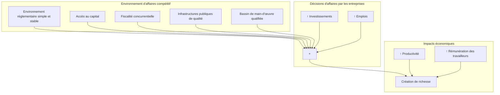
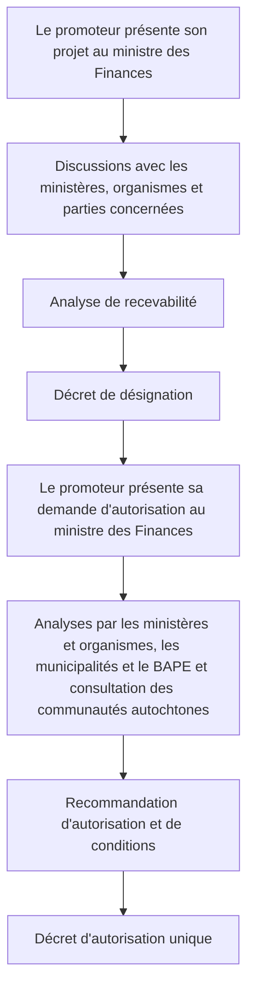

Mars 2026

# BUDGET 2026-2027

## UN BUDGET RESPONSABLE, CENTRÉ SUR LES PRIORITÉS DES QUÉBÉCOIS

### <mark>BUDGET EN BREF</mark>


**Votre gouvernement**  **Québec** 

# Un budget responsable, centré sur les priorités des Québécois

Nous traversons actuellement une période marquée par des tensions géopolitiques importantes, des politiques commerciales et tarifaires fluctuantes, un morcellement des échanges commerciaux et une hausse du coût de la vie qui préoccupe les Québécois.

Le bien-être des Québécois a toujours guidé nos décisions. Avec ce budget, notre gouvernement a dû trouver un équilibre réfléchi pour stimuler notre économie et soutenir les entreprises fortement touchées par les tarifs, renforcer les services publics, protéger le pouvoir d’achat des Québécois et veiller sur les plus vulnérables.

Le budget que nous présentons tient compte de cette réalité en centrant ses actions sur les priorités des Québécois et en misant sur une saine gestion des finances publiques, qui nous permet de maintenir la trajectoire vers un retour à l’équilibre budgétaire au plus tard en 2029-2030.

À travers toutes les turbulences que nous vivons, notre économie progresse, nos finances publiques se portent mieux et le Québec a toutes les raisons d’être optimiste face à l’avenir.

Pour ce huitième budget que je dépose, nous avons privilégié une approche responsable afin que le Québec puisse s’appuyer sur ses forces pour se donner les moyens d’aller plus loin dans ce monde en transformation.

**Eric Girard**
Ministre des Finances

# <mark>Près de 9,6 G$ additionnels</mark>
# <mark>d’ici cinq ans pour :</mark>


### Accélérer la transformation économique du Québec
## 1,7 G$


### Prioriser les grandes missions de l’État
## 4,3 G$


### Appuyer les Québécois et les communautés avec des gestes ciblés
## 3,6 G$

<mark>
## Rehaussement des investissements en infrastructures de plus de 5 G$ sur six ans

* Le PQI 2026-2036 est porté à 167 G$
* 71 % des sommes investies seront allouées au maintien des infrastructures existantes

<table>
  <thead>
    <tr>
        <th>Année</th>
        <th>Investissements</th>
    </tr>
  </thead>
  <tbody>
    <tr>
        <td>2018-2019</td>
        <td>9,1 G$</td>
    </tr>
    <tr>
        <td>2025-2026</td>
        <td>21 G$</td>
    </tr>
  </tbody>
</table>

**Secteurs prioritaires**
Santé et services sociaux
Éducation et enseignement supérieur
Transport collectif et réseau routier
Transformation numérique des organismes publics


</mark>

3

# <mark>**1,7 G$ pour accélérer la transformation économique du Québec**</mark>

## **693 M$ pour soutenir l’adaptation des entreprises au nouveau contexte économique**

**Favoriser la réalisation des projets d’investissement dans les secteurs d’avenir et améliorer la compétitivité économique du Québec par l’innovation**

* Accélérer la transformation de l’économie
* Appuyer les investissements à fort potentiel des entreprises
* Faire du Québec un chef de file dans la production et la transformation des minéraux critiques et stratégiques


**Un environnement d’affaires favorable à la réalisation de projets économiques**

* Accélérer la réalisation des projets prioritaires
* Mettre en place des infrastructures visant à accueillir des projets économiques


4

# 581 M$ pour agir en faveur des PME de toutes les régions

## Renforcer les principaux atouts de nos régions

*   Contribuer à l'essor économique des régions
*   Favoriser le développement du secteur bioalimentaire


## Accélérer le développement du secteur touristique


## Appuyer les entreprises et les communautés forestières

*   Soutenir les entreprises forestières en réponse aux difficultés du secteur
*   Maintenir l'engagement du gouvernement à l'égard des communautés forestières et de la forêt publique


# 429 M$ pour appuyer l'essor de notre secteur culturel

*   Répondre aux défis du secteur audiovisuel
*   Assurer la pérennité de l'écosystème médiatique québécois
*   Promouvoir les contenus culturels québécois


5

# <mark>**4,3 G$ pour soutenir les grandes**</mark>
# <mark>**missions de l'État**</mark>

## **2,2 G$ pour faciliter l'accès aux soins de santé et aux services sociaux**

### **Renforcer les soins et services de santé**

*   Consolider l'offre de soins et de services dans le réseau public
*   Renforcer l'accès à la première ligne
*   Poursuivre les efforts visant à réduire la liste d'attente en chirurgie


### **Soutenir les personnes proches aidantes et les aînés en RPA**

*   Compléter le financement du Plan d'action gouvernemental pour les personnes proches aidantes 2026-2031
*   Prolonger le Programme d'aide aux résidences privées pour aînés et autres entités apparentées, pour limiter l'effet des hausses de primes d'assurance


***

## **639 M$ pour soutenir la réussite éducative**


### **Favoriser la réussite éducative des élèves**


### **Combler les besoins urgents et temporaires d'espaces scolaires**


### **Attirer la main-d'œuvre dans le réseau de l'éducation**

6

# **392 M$** pour soutenir la formation en enseignement supérieur, la qualification dans des secteurs clés, dont le génie et les technologies de l'information, ainsi que l'intégration au marché du travail et la recherche


<mark>

## **1,1 G$** pour renforcer la sécurité des Québécois et l'accès aux services de justice

*   Consolider les activités de prévention et d'intervention en matière de sécurité
*   Poursuivre les efforts de lutte contre les violences armées
*   Assurer les opérations en cybersécurité
*   Renforcer l'accès aux services de justice


</mark>

7

# <mark>3,6 G$ pour appuyer les Québécois et les communautés avec des gestes ciblés</mark>

## 2,4 G$ pour soutenir les Québécois

### Aider les familles à faire face au coût de la vie

 **Convertir 5 000 places de garde non subventionnées additionnelles en places subventionnées**

 **Plafonner à 3 % la croissance de la taxe scolaire**

### Soutienir l'accès au logement


* Construire 1 000 logements abordables
* Offrir un toit aux ménages les plus vulnérables
* Adapter et rénover le parc de logements

### Renforcer les services aux personnes vulnérables


* Appuyer les organismes communautaires
* Assurer l'approvisionnement des banques alimentaires

<mark>


**Agir face à l'itinérance et aux enjeux de santé mentale**

**Lutter contre les violences conjugale et sexuelle**
</mark>

8

# 1,0 G$ pour assurer la résilience des communautés

## Renforcer les communautés

* Entretenir durablement les infrastructures locales et régionales
* Soutenir l’essor et la vitalité de la métropole et des territoires
* Poursuivre les actions de protection de l’environnement
* Consolider l’amélioration des services publics auprès des personnes autochtones

## Soutenir l’adaptation et lutter contre les changements climatiques

* Mettre en place le volet adaptation du programme Rénoclimat
* Bonifier le programme LogisVert


# 217 M$ pour faire rayonner la culture et le patrimoine culturel québécois

* Maintenir le financement de la culture à l’école et des sorties scolaires en milieu culturel
* Soutenir les organismes à vocation culturelle
* Préserver notre patrimoine culturel


9

# La situation économique du Québec

## L’économie québécoise s’adapte progressivement à la nouvelle réalité commerciale


### Croissance économique au Québec
(PIB réel, variation en pourcentage)

<table>
  <thead>
    <tr>
        <th>Année</th>
        <th>Croissance (%)</th>
    </tr>
  </thead>
  <tbody>
    <tr>
        <td>2025</td>
        <td>0,8</td>
    </tr>
    <tr>
        <td>2026</td>
        <td>1,1</td>
    </tr>
    <tr>
        <td>2027</td>
        <td>1,4</td>
    </tr>
  </tbody>
</table>

> La croissance du PIB atteindra 1,1 % en 2026 et 1,4 % en 2027

Sources : Institut de la statistique du Québec, Statistique Canada et ministère des Finances du Québec.

***

## Depuis 2018, le Québec a mieux performé que le reste du Canada

### Variation du niveau de vie entre 2018 et 2024

<table>
  <thead>
    <tr>
        <th>Région</th>
        <th>Variation (%)</th>
    </tr>
  </thead>
  <tbody>
    <tr>
        <td>Québec</td>
        <td>4,9</td>
    </tr>
    <tr>
        <td>Ontario</td>
        <td>-0,3</td>
    </tr>
    <tr>
        <td>Reste du Canada</td>
        <td>-0,9</td>
    </tr>
  </tbody>
</table>

Note : Mesuré par le PIB réel par habitant.

### Variation du pouvoir d’achat des ménages entre 2018 et 2024

<table>
  <thead>
    <tr>
        <th>Région</th>
        <th>Variation (%)</th>
    </tr>
  </thead>
  <tbody>
    <tr>
        <td>Québec</td>
        <td>9,2</td>
    </tr>
    <tr>
        <td>Ontario</td>
        <td>5,1</td>
    </tr>
    <tr>
        <td>Reste du Canada</td>
        <td>5,1</td>
    </tr>
  </tbody>
</table>

Note : Mesuré par le revenu disponible en termes réels par habitant.

10

# <mark>La situation financière du Québec</mark>

## Le gouvernement maintient sa trajectoire de retour à l’équilibre budgétaire d’ici 2029-2030

### Diminution des déficits comptables prévus

<table>
  <thead>
    <tr>
        <th>Période</th>
        <th>Mars 2025</th>
        <th>Mars 2026</th>
    </tr>
  </thead>
  <tbody>
    <tr>
        <td>2025-2026</td>
        <td>-11,4</td>
        <td>-7,7</td>
    </tr>
    <tr>
        <td>2026-2027</td>
        <td>-7,1</td>
        <td>-6,3</td>
    </tr>
  </tbody>
</table>
(Valeurs en G$)

<mark>
### Un déficit budgétaire parmi les plus bas au Canada

**Solde budgétaire 2025-2026**
(en pourcentage du PIB)

<table>
  <thead>
    <tr>
        <th>Juridiction</th>
        <th>Solde budgétaire (%)</th>
    </tr>
  </thead>
  <tbody>
    <tr>
        <td>Î.-P.-É.</td>
        <td>-3,2</td>
    </tr>
    <tr>
        <td>N.-B.</td>
        <td>-2,8</td>
    </tr>
    <tr>
        <td>T.-N.-L.</td>
        <td>-2,2</td>
    </tr>
    <tr>
        <td>C.-B.</td>
        <td>-2,2</td>
    </tr>
    <tr>
        <td>N.-É.</td>
        <td>-1,8</td>
    </tr>
    <tr>
        <td>Man.</td>
        <td>-1,7</td>
    </tr>
    <tr>
        <td>Qc</td>
        <td>-1,2</td>
    </tr>
    <tr>
        <td>Ont.</td>
        <td>-1,1</td>
    </tr>
    <tr>
        <td>Alb.</td>
        <td>-0,9</td>
    </tr>
    <tr>
        <td>Sask.</td>
        <td>-0,4</td>
    </tr>
    <tr>
        <td>Féd.</td>
        <td>-2,4</td>
    </tr>
    <tr>
        <td>Moyenne</td>
        <td>-1,7</td>
    </tr>
  </tbody>
</table>

**Notes :** Pour le Québec, il s’agit du déficit comptable, c’est-à-dire avant les versements des revenus consacrés au Fonds des générations. Ce déficit est comparable à celui des autres provinces. Les informations du graphique reflètent les données disponibles au 6 mars 2026.
</mark>

### Au 31 mars 2026, le poids de la dette nette s’établira à 38,8 % du PIB

* Une baisse de 4,1 points de pourcentage par rapport au niveau de mars 2019
* Le Québec est l’une des seules provinces, avec l’Ontario et le Nouveau-Brunswick, à avoir réduit son endettement entre 2019 et 2026

**Dette nette au 31 mars**
(en pourcentage du PIB)

<table>
  <thead>
    <tr>
        <th>Année</th>
        <th>Dette nette (%)</th>
    </tr>
  </thead>
  <tbody>
    <tr>
        <td>2014</td>
        <td>53,4</td>
    </tr>
    <tr>
        <td>2016</td>
        <td>51,1</td>
    </tr>
    <tr>
        <td>2018</td>
        <td>45,9</td>
    </tr>
    <tr>
        <td>2020</td>
        <td>40,9</td>
    </tr>
    <tr>
        <td>2022</td>
        <td>38,8</td>
    </tr>
    <tr>
        <td>2024</td>
        <td>37,8</td>
    </tr>
    <tr>
        <td>2026</td>
        <td>38,8</td>
    </tr>
    <tr>
        <td>2028</td>
        <td>39,3</td>
    </tr>
    <tr>
        <td>2030</td>
        <td>37,9</td>
    </tr>
  </tbody>
</table>


**Note :** À partir du 1<sup>er</sup> avril 2026, le concept de la dette nette sera remplacé par celui du passif financier net en raison de l’entrée en vigueur de 
Mars 2026

# BUDGET 2026-2027

## UN BUDGET RESPONSABLE, CENTRÉ SUR LES PRIORITÉS DES QUÉBÉCOIS

### PLAN BUDGÉTAIRE


Mars 2026

**BUDGET 2026-2027**

# UN BUDGET RESPONSABLE, CENTRÉ SUR LES PRIORITÉS DES QUÉBÉCOIS

<mark>**PLAN**</mark>
<mark>**BUDGÉTAIRE**</mark>


Budget 2026-2027
Plan budgétaire

Dépôt légal – 18 mars 2026
Bibliothèque et Archives nationales du Québec
ISBN 978-2-555-03403-7 (Imprimé)
ISBN 978-2-555-03404-4 (PDF)

© Gouvernement du Québec, 2026

# PLAN BUDGÉTAIRE

**Section A**
Vue d’ensemble

**Section B**
Accélérer la transformation économique du Québec

**Section C**
Soutenir les grandes missions de l’État

**Section D**
Appuyer les Québécois et les communautés avec des gestes ciblés

**Section E**
L’économie du Québec :
évolution récente et perspectives pour 2026 et 2027

**Section F**
La situation financière du Québec

**Section G**
La dette du gouvernement du Québec

**Section H**
Les scénarios alternatifs de prévision

Section **A**
**VUE D’ENSEMBLE**

**Sommaire** A.3

1. **Accélérer la transformation économique du Québec** A.13
2. **Soutenir les grandes missions de l’État** A.15
3. **Appuyer les Québécois et les communautés avec des gestes ciblés** A.17
4. **L’économie du Québec** A.19
5. **La situation financière du Québec** A.25
   5.1 Stimuler l’économie par des investissements importants dans les infrastructures publiques A.31
6. **La dette du gouvernement du Québec** A.33

**ANNEXE : Perspectives économiques au Québec de 2024 à 2030** A.35

A.1

SECTION **A**

# SOMMAIRE

Le Québec évolue dans un contexte économique et géopolitique marqué par une incertitude persistante depuis la pandémie. L’environnement mondial, caractérisé par des tensions géopolitiques importantes, des politiques commerciales et tarifaires fluctuantes ainsi qu’un morcellement des échanges commerciaux, affecte les finances publiques de plusieurs grandes économies à l’échelle mondiale, et particulièrement une économie ouverte comme le Québec.

Dans un tel contexte, le gouvernement a dû trouver un équilibre délicat entre les investissements nécessaires pour renforcer les services publics, stimuler l’économie, protéger le pouvoir d’achat des Québécois, veiller sur le bien-être des plus vulnérables et soutenir les entreprises fortement touchées par les tarifs, tout en maintenant une saine gestion des finances publiques. Un défi auquel le gouvernement a fait face de façon responsable.

### [ ] Un budget responsable, centré sur les priorités des Québécois

Dans le contexte d’incertitude persistant, le gouvernement soutient les entreprises évoluant dans une économie en transformation, investit dans les infrastructures, priorise les grandes missions de l’État et appuie les Québécois et les communautés par des gestes ciblés.

> <mark>**Dans le cadre du budget 2026-2027, le gouvernement consacre près de 9,6 milliards de dollars sur six ans au soutien des entreprises, des grandes missions de l’État et des Québécois.**</mark>
>
> <mark>**Le gouvernement rehausse également les investissements dans les infrastructures de plus de 5 milliards de dollars sur six ans.**</mark>

Dans le cadre du budget 2026-2027, le gouvernement poursuit son action :

— il accélère la transformation économique du Québec;

— il investit dans les infrastructures pour soutenir stratégiquement l’économie du Québec;

— il priorise le financement des grandes missions de l’État de manière à garantir aux Québécois des services accessibles et de qualité;

— il pose des gestes ciblés visant à appuyer les Québécois et les communautés.

Vue d'ensemble | A.3

TABLEAU A.1

**Impact financier des mesures du budget 2026-2027**
(en millions de dollars)

<table>
  <thead>
    <tr>
        <th></th>
        <th>2025-2026</th>
        <th>2026-2027</th>
        <th>2027-2028</th>
        <th>2028-2029</th>
        <th>2029-2030</th>
        <th>2030-2031</th>
        <th>Total</th>
    </tr>
  </thead>
  <tbody>
    <tr>
        <td>Accélérer la transformation économique du Québec</td>
        <td>—</td>
        <td>-480,3</td>
        <td>-507,4</td>
        <td>-360,7</td>
        <td>-204,7</td>
        <td>-150,4</td>
        <td>-1 703,5</td>
    </tr>
    <tr>
        <td>Soutenir les grandes missions de l'État</td>
        <td>—</td>
        <td>-910,0</td>
        <td>-928,3</td>
        <td>-851,0</td>
        <td>-794,7</td>
        <td>-791,4</td>
        <td>-4 275,4</td>
    </tr>
    <tr>
        <td>Appuyer les Québécois et les communautés avec des gestes ciblés</td>
        <td>-37,0</td>
        <td>-742,3</td>
        <td>-1 129,6</td>
        <td>-724,1</td>
        <td>-503,6</td>
        <td>-478,6</td>
        <td>-3 615,2</td>
    </tr>
    <tr>
        <th>TOTAL</th>
        <th>-37,0</th>
        <th>-2 132,6</th>
        <th>-2 565,3</th>
        <th>-1 935,8</th>
        <th>-1 503,0</th>
        <th>-1 420,4</th>
        <th>-9 594,1</th>
    </tr>
  </tbody>
</table>
Note : Les chiffres ayant été arrondis, leur somme peut ne pas correspondre au total indiqué.

Finalement, le gouvernement réaffirme sa détermination à maintenir une gestion responsable des finances publiques, appuyée par des résultats déjà probants. Après une révision à la baisse en 2024-2025, les déficits comptables prévus pour 2025-2026 et 2026-2027 sont réduits respectivement de près de 3,8 milliards de dollars et de 861 millions de dollars. Pour les années suivantes, les écarts à résorber sont réduits. Le poids de la dette nette du Québec est également revu à la baisse par rapport au budget 2025-2026, et ce, pour chacune des années du cadre financier. Le gouvernement poursuit résolument sa trajectoire vers l'équilibre budgétaire et entend l'atteindre d'ici 2029-2030.

## ❑ La situation économique du Québec

L'économie mondiale traverse actuellement une période de transformations profondes. Après plusieurs décennies de croissance stimulée par la mondialisation et le libre-échange, un nouveau contexte caractérisé par la montée du protectionnisme et par de fortes tensions géopolitiques se met en place, perturbant les chaînes d'approvisionnement et créant un climat d'incertitude qui pèse sur l'investissement et le commerce international.

Parallèlement, l'accélération des investissements en intelligence artificielle (IA) soutient les gains de productivité. Cette dynamique favorise l'émergence de nouveaux pôles d'innovation et reconfigure la concurrence mondiale. Cependant, l'enthousiasme suscité par l'IA sur les marchés financiers soulève le risque que ces derniers surestiment la rapidité et l'ampleur des retombées économiques attendues.

Budget 2026-2027
A.4 Plan budgétaire

SECTION **A**

Le Québec bénéficie néanmoins d’une situation favorable pour faire face à cette nouvelle conjoncture. En effet, depuis 2018, le Québec a mieux performé que le reste du Canada. Les importantes initiatives mises en œuvre par le gouvernement du Québec pour accroître le potentiel de l’économie ont permis de créer davantage de richesse<sup>1</sup>.

— Selon les plus récentes statistiques officielles disponibles, entre 2018 et 2024, le niveau de vie, mesuré au moyen du PIB réel par habitant, a augmenté de 4,9 % au Québec. Pour la même période, il affiche des baisses de 0,3 % en Ontario et de 0,9 % dans le reste du Canada.

> **L’écart de niveau de vie du Québec avec l’Ontario s’est réduit, passant de 15,9 % en 2018 à un creux de 10,2 % en 2024. Quant à celui avec le reste du Canada, après avoir atteint 20,2 % en 2018, il s’est situé à 13,6 % en 2024.**
>
> − **Des écarts aussi faibles n’ont jamais été observés depuis le début de la compilation des statistiques en 1981.**

— Parallèlement, le gouvernement du Québec a continué de protéger le portefeuille de ses citoyens, ce qui a solidifié la situation financière des ménages québécois.

— Entre 2018 et 2024, le pouvoir d’achat des ménages, tel que mesuré par le revenu disponible en termes réels par habitant, s’est amélioré de 9,2 % au Québec, comparativement à 5,1 % en Ontario et dans le reste du Canada.

L’économie québécoise a mieux résisté aux divers vents contraires et s’adapte progressivement à la nouvelle réalité commerciale. L’incertitude découlant des tensions commerciales et liée au processus de révision de l’Accord Canada–États-Unis–Mexique (ACEUM) demeure présente, mais elle devrait s’atténuer graduellement. Néanmoins, le vieillissement de la population, associé à l’ajustement de l’immigration temporaire et permanente, limitera la croissance économique au cours des prochaines années.

— Après une hausse de 0,8 % en 2025, la progression du PIB réel devrait se renforcer pour atteindre 1,1 % en 2026 et 1,4 % en 2027.

Le budget 2026-2027 repose sur la prémisse que le taux effectif moyen des droits de douane restera relativement stable au cours des prochaines années et que les tarifs demeureront en place de façon permanente. Il prend également en compte les récentes hausses du prix du pétrole, mais suppose que la situation sera temporaire et se résorbera dans les prochains mois.

<sup>1</sup> Sauf indication contraire, ce document reflète les données économiques disponibles au 6 mars 2026.

Vue d’ensemble | A.5

### [ ] Accélérer la transformation économique du Québec

Dans le cadre du budget 2026-2027, le gouvernement prévoit des initiatives totalisant plus de 1,7 milliard de dollars sur cinq ans afin d’accélérer la transformation économique du Québec.

— De cette somme, le gouvernement investit près de 700 millions de dollars pour favoriser la réalisation des projets d’investissement dans les secteurs d’avenir et pour améliorer la compétitivité des entreprises québécoises par l’innovation.

— Il agit en faveur des PME de toutes les régions du Québec et leur offre un appui de plus de 580 millions de dollars. Il entend notamment financer des initiatives de développement économique régional porteuses, favoriser le développement des secteurs touristique et agroalimentaire ainsi qu’appuyer les entreprises et les communautés forestières.

— Finalement, le gouvernement réserve près de 430 millions de dollars pour répondre aux défis du secteur audiovisuel, assurer la pérennité de l’écosystème médiatique québécois et promouvoir les contenus culturels québécois.

Le gouvernement se donne également une capacité d’intervention additionnelle qui pourra atteindre 2 milliards de dollars, au moyen de ses fonds d’investissement, pour le maintien des sièges sociaux au Québec et le développement de la filière des minéraux critiques et stratégiques.

### [ ] Rehausser les investissements dans les infrastructures

Le gouvernement rehausse de plus de 5 milliards de dollars sur six ans les investissements en infrastructures afin d’investir davantage dans le maintien en bon état des actifs sur l’ensemble du territoire québécois et de doter le Québec d’infrastructures modernes. Le Plan québécois des infrastructures (PQI) 2026-2036 s’élèvera à 167 milliards de dollars.

— Ces nouvelles sommes seront réparties entre les secteurs prioritaires, soit la santé et les services sociaux, l’éducation et l’enseignement supérieur, le transport collectif, le réseau routier de même que la poursuite de la transformation numérique des organismes publics<sup>2</sup>.

— Une part importante des sommes investies sera allouée au maintien en bon état d’infrastructures existantes, soit 71 %. Il s’agit d’une augmentation importante par rapport au PQI précédent, où cette part s’établissait à 65 %.

***

<sup>2</sup> Le PQI 2026-2036, publié par le Secrétariat du Conseil du trésor, présente des informations détaillées sur les investissements prévus par secteur.

Budget 2026-2027
A.6 | Plan budgétaire

SECTION **A**

### [ ] Soutenir les grandes missions de l’État

Dans le cadre du budget 2026-2027, le gouvernement prévoit près de 4,3 milliards de dollars pour soutenir les grandes missions de l’État.

— Près de 2,2 milliards de dollars permettront de faciliter l’accès aux soins de santé et aux services sociaux, notamment en soutenant l’accès aux médicaments, en poursuivant les efforts pour réduire la liste d’attente en chirurgie, en renforçant l’accès à la première ligne et en soutenant les actions pour les personnes proches aidantes.

— Près de 640 millions de dollars permettront de favoriser la réussite éducative des élèves, de combler les besoins urgents et temporaires d’espaces scolaires ainsi que de renforcer l’attractivité de la main-d’œuvre dans le réseau de l’éducation.

— De plus, le gouvernement prévoit près de 400 millions de dollars pour soutenir la formation en enseignement supérieur, l’intégration au marché du travail et la recherche, notamment pour poursuivre la promotion et la valorisation des disciplines du génie et des technologies de l’information, prolonger les allocations d’aide à l’emploi et soutenir les organismes de recherche.

— Par ailleurs, le gouvernement prévoit plus de 1 milliard de dollars pour renforcer la sécurité des Québécois et les services de justice, notamment en consolidant les activités de prévention et d’intervention en matière de sécurité ainsi qu’en poursuivant les efforts de lutte contre les violences armées.

### [ ] Appuyer les Québécois et les communautés avec des gestes ciblés

Dans le cadre du budget 2026-2027, le gouvernement investit plus de 3,6 milliards de dollars pour assurer le bien-être des Québécois et renforcer la vitalité des communautés sur l’ensemble du territoire.

— De ce montant, une somme de près de 2,4 milliards de dollars permettra de soutenir les Québécois, notamment pour les aider à faire face à la hausse du coût de la vie. Cette somme permettra de convertir 5 000 places de garde non subventionnées, de soutenir l’accès au logement, de répondre à des enjeux de société dont l’itinérance, la santé mentale et les violences conjugale et sexuelle, ainsi que de renforcer les services aux plus vulnérables, notamment par le renouvellement du financement de plusieurs organismes communautaires tels que Les Banques alimentaires du Québec.

— De plus, un investissement de plus de 1 milliard de dollars est prévu pour assurer la résilience des communautés, notamment à l’égard des infrastructures locales, ainsi qu’en matière d’adaptation et de lutte contre les changements climatiques.

— Finalement, le gouvernement prévoit près de 220 millions de dollars pour faire rayonner la culture et le patrimoine culturel québécois.

Vue d’ensemble | A.7

### [ ] Maintenir une saine gestion des finances publiques

Grâce à une gestion responsable des dépenses et à une croissance du PIB nominal plus forte qu’anticipé en 2025, le présent budget fait état d’une situation budgétaire qui s’avère meilleure que celle prévue en mars 2025.

Sur une base comparable aux soldes budgétaires des autres provinces canadiennes et du gouvernement fédéral, le déficit comptable est révisé à la baisse de près de 3,8 milliards de dollars en 2025-2026, ce qui le porte à 7,7 milliards de dollars, soit 1,2 % du PIB<sup>3</sup>.

— En 2025-2026, le Québec présente l’un des déficits les plus faibles parmi les provinces canadiennes, dont la moyenne s’établit à 1,7 % du PIB.

— En pourcentage du PIB, il s’agit de l’un des déficits les moins élevés, après ceux de la Saskatchewan (0,4 % du PIB), de l’Alberta (0,9 % du PIB) et de l’Ontario (1,1 % du PIB).

— En 2026-2027, le solde comptable affiche un déficit de 6,3 milliards de dollars, soit 0,9 % du PIB, ce qui représente une amélioration de 861 millions de dollars par rapport à celui prévu dans le budget 2025-2026.

> **Le gouvernement fait un pas de plus vers l’atteinte de l’équilibre budgétaire en réduisant les déficits prévus pour 2025-2026 et 2026-2027 et les écarts à résorber pour les années suivantes.**
>
> **Le poids de la dette nette du Québec est également revu à la baisse par rapport au budget 2025-2026, et ce, pour chacune des années du cadre financier.**

<sup>3</sup> Sauf indication contraire, ce document repose sur les données budgétaires disponibles au 6 mars 2026. Les données présentées pour 2025-2026 sont des résultats préliminaires. Celles présentées pour 2026-2027 à 2030-2031 sont des prévisions et celles pour les années subséquentes sont des projections.

Budget 2026-2027
A.8 Plan budgétaire

SECTION **A**

Compte tenu du contexte économique, le gouvernement maintient une provision pour éventualités de 8 milliards de dollars sur l’horizon du cadre financier, incluant 2 milliards de dollars en 2026-2027. Cette provision pourrait notamment être utilisée pour couvrir des dépenses imprévues ou pallier les effets d’une croissance économique plus modérée que prévu.

TABLEAU A.2

**Perspectives économiques et financières du Québec**
(en milliards de dollars, sauf indication contraire)

<table>
  <thead>
    <tr>
        <th></th>
        <th>2024-2025</th>
        <th>2025-2026</th>
        <th>2026-2027</th>
        <th>2027-2028</th>
        <th>2028-2029</th>
        <th>2029-2030</th>
        <th>2030-2031</th>
    </tr>
    <tr>
        <th>SITUATION FINANCIÈRE</th>
        <th></th>
        <th></th>
        <th></th>
        <th></th>
        <th></th>
        <th></th>
        <th></th>
    </tr>
  </thead>
  <tbody>
    <tr>
        <td>Revenus</td>
        <td>156,1</td>
        <td>160,5</td>
        <td>166,5</td>
        <td>172,8</td>
        <td>177,6</td>
        <td>181,8</td>
        <td>188,2</td>
    </tr>
    <tr>
        <td>Dépenses</td>
        <td>-161,3</td>
        <td>-168,2</td>
        <td>-170,8</td>
        <td>-175,2</td>
        <td>-177,2</td>
        <td>-179,5</td>
        <td>-185,5</td>
    </tr>
    <tr>
        <td>Provision pour éventualités</td>
        <td>—</td>
        <td>—</td>
        <td>-2,0</td>
        <td>-1,5</td>
        <td>-1,5</td>
        <td>-1,5</td>
        <td>-1,5</td>
    </tr>
    <tr>
        <td>**Surplus (déficit) comptable**</td>
        <td>**-5,2**</td>
        <td>**-7,7**</td>
        <td>**-6,3**</td>
        <td>**-4,0**</td>
        <td>**-1,1**</td>
        <td>**0,8**</td>
        <td>**1,2**</td>
    </tr>
    <tr>
        <td>***En % du PIB***</td>
        <td>***0,8***</td>
        <td>***1,2***</td>
        <td>***0,9***</td>
        <td>***0,6***</td>
        <td>***0,2***</td>
        <td>***0,1***</td>
        <td>***0,2***</td>
    </tr>
    <tr>
        <th>ENDETTEMENT</th>
        <th></th>
        <th></th>
        <th></th>
        <th></th>
        <th></th>
        <th></th>
        <th></th>
    </tr>
    <tr>
        <td>Dette nette</td>
        <td>236,2</td>
        <td>250,3</td>
        <td>259,5</td>
        <td>271,1</td>
        <td>276,8</td>
        <td>279,3</td>
        <td>281,3</td>
    </tr>
    <tr>
        <td>*En % du PIB*</td>
        <td>38,3</td>
        <td>38,8</td>
        <td>38,9</td>
        <td>39,3</td>
        <td>38,8</td>
        <td>37,9</td>
        <td>36,9</td>
    </tr>
    <tr>
        <th></th>
        <th>2024</th>
        <th>2025</th>
        <th>2026</th>
        <th>2027</th>
        <th>2028</th>
        <th>2029</th>
        <th>2030</th>
    </tr>
    <tr>
        <th>INDICATEURS ÉCONOMIQUES</th>
        <th></th>
        <th></th>
        <th></th>
        <th></th>
        <th></th>
        <th></th>
        <th></th>
    </tr>
    <tr>
        <td>PIB réel (variation en %)</td>
        <td>1,7</td>
        <td>0,8</td>
        <td>1,1</td>
        <td>1,4</td>
        <td>1,5</td>
        <td>1,5</td>
        <td>1,4</td>
    </tr>
    <tr>
        <td>PIB nominal (variation en %)</td>
        <td>5,9</td>
        <td>4,5</td>
        <td>3,5</td>
        <td>3,4</td>
        <td>3,4</td>
        <td>3,4</td>
        <td>3,3</td>
    </tr>
  </tbody>
</table>
Note : Les chiffres ayant été arrondis, leur somme peut ne pas correspondre au total indiqué.

Vue d'ensemble | A.9

Malgré un contexte marqué par une pandémie, des tensions géopolitiques accrues en raison, entre autres, de l’invasion de l’Ukraine par la Russie et un conflit commercial avec les États-Unis, le Québec a poursuivi la réduction de son endettement.

À l’inverse, à l’échelle canadienne comme à l’échelle internationale, les États ont généralement connu un accroissement de leur endettement au cours des dernières années.

> **Au 31 mars 2026, la dette nette du Québec représentera 38,8 % du PIB, soit une baisse considérable de 4,1 points de pourcentage par rapport au niveau de 42,9 % au 31 mars 2019.**

— Le Québec est l’une des seules provinces, avec l’Ontario et le Nouveau-Brunswick, à avoir réduit son endettement au cours de cette période.

Le gouvernement demeure engagé à réduire le poids de la dette à long terme et poursuit les versements des revenus consacrés au Fonds des générations. Il respectera les cibles de réduction de la dette nette fixées à 35,5 % du PIB d’ici 2032-2033 et à 32,5 % du PIB d’ici 2037-2038.

GRAPHIQUE A.1
**Dette nette au 31 mars**
(en pourcentage du PIB)

<table>
  <thead>
    <tr>
        <th>Année</th>
        <th>Dette nette (en % du PIB)</th>
    </tr>
  </thead>
  <tbody>
    <tr>
        <td>2014</td>
        <td>53,4</td>
    </tr>
    <tr>
        <td>2015</td>
        <td>52,6</td>
    </tr>
    <tr>
        <td>2016</td>
        <td>51,1</td>
    </tr>
    <tr>
        <td>2017</td>
        <td>48,9</td>
    </tr>
    <tr>
        <td>2018</td>
        <td>45,9</td>
    </tr>
    <tr>
        <td>2019</td>
        <td>42,9</td>
    </tr>
    <tr>
        <td>2020</td>
        <td>40,9</td>
    </tr>
    <tr>
        <td>2021</td>
        <td>43,1</td>
    </tr>
    <tr>
        <td>2022</td>
        <td>38,8</td>
    </tr>
    <tr>
        <td>2023</td>
        <td>37,5</td>
    </tr>
    <tr>
        <td>2024</td>
        <td>37,8</td>
    </tr>
    <tr>
        <td>2025</td>
        <td>38,3</td>
    </tr>
    <tr>
        <td>2026</td>
        <td>38,8</td>
    </tr>
    <tr>
        <td>2027</td>
        <td>38,9</td>
    </tr>
    <tr>
        <td>2028</td>
        <td>39,3</td>
    </tr>
    <tr>
        <td>2029</td>
        <td>38,8</td>
    </tr>
    <tr>
        <td>2030</td>
        <td>37,9</td>
    </tr>
    <tr>
        <td>2031</td>
        <td>36,9</td>
    </tr>
  </tbody>
</table>

Note : À partir du 1<sup>er</sup> avril 2026, le concept de dette nette sera remplacé par celui du passif financier net en raison de l’entrée en vigueur de la nouvelle norme comptable portant sur la présentation des états financiers.

Budget 2026-2027
A.10 | Plan budgétaire

SECTION **A**

# ■ Le retour à l'équilibre budgétaire

Dans le cadre du budget 2025-2026, le gouvernement a présenté le plan de retour à l'équilibre budgétaire d'ici 2029-2030. Le présent budget confirme le respect de la trajectoire établie. Le plan est crédible et repose sur des gestes aux revenus et aux dépenses.

— Le solde budgétaire selon la Loi sur l'équilibre budgétaire, soit après versements au Fonds des générations, présente un déficit de 9,9 milliards de dollars en 2025-2026, soit 1,5 % du PIB, et de 8,6 milliards de dollars en 2026-2027, soit 1,3 % du PIB.

Les prévisions budgétaires plus favorables que prévu permettent de réduire l'écart à résorber de 250 millions de dollars en 2027-2028 et en 2028-2029, de 500 millions de dollars en 2029-2030 et de 750 millions de dollars en 2030-2031.

— Lorsque l'incertitude, principalement liée à la révision de l'ACEUM, se dissipera, la conjoncture économique devrait se rétablir et permettre de résorber les écarts.

Par conséquent, conformément à la Loi sur l'équilibre budgétaire, l'équilibre, après versements des revenus consacrés au Fonds des générations, sera atteint au plus tard en 2029-2030.

TABLEAU A.3
**Solde budgétaire au sens de la Loi sur l'équilibre budgétaire**
(en millions de dollars, sauf indication contraire)

<table>
  <thead>
    <tr>
        <th></th>
        <th>2025-2026</th>
        <th>2026-2027</th>
        <th>2027-2028</th>
        <th>2028-2029</th>
        <th>2029-2030</th>
        <th>2030-2031</th>
    </tr>
  </thead>
  <tbody>
    <tr>
        <td>**SURPLUS (DÉFICIT) COMPTABLE**</td>
        <td>**-7 655**</td>
        <td>**-6 265**</td>
        <td>**-3 954**</td>
        <td>**-1 134**</td>
        <td>**780**</td>
        <td>**1 168**</td>
    </tr>
    <tr>
        <td>*En % du PIB*</td>
        <td>*1,2*</td>
        <td>*0,9*</td>
        <td>*0,6*</td>
        <td>*0,2*</td>
        <td>*0,1*</td>
        <td>*0,2*</td>
    </tr>
    <tr>
        <td>Écart à résorber</td>
        <td>—</td>
        <td>—</td>
        <td>750</td>
        <td>2 250</td>
        <td>2 000</td>
        <td>1 750</td>
    </tr>
    <tr>
        <td>Versements des revenus consacrés au Fonds des générations</td>
        <td>-2 289</td>
        <td>-2 347</td>
        <td>-2 491</td>
        <td>-2 616</td>
        <td>-2 780</td>
        <td>-2 918</td>
    </tr>
    <tr>
        <td>**SOLDE BUDGÉTAIRE AU SENS DE LA LOI SUR L'ÉQUILIBRE BUDGÉTAIRE**</td>
        <td>**-9 944**</td>
        <td>**-8 612**</td>
        <td>**-5 695**</td>
        <td>**-1 500**</td>
        <td>**—**</td>
        <td>**—**</td>
    </tr>
    <tr>
        <td>***En % du PIB***</td>
        <td>***1,5***</td>
        <td>***1,3***</td>
        <td>***0,8***</td>
        <td>***0,2***</td>
        <td>***0,0***</td>
        <td>***0,0***</td>
    </tr>
  </tbody>
</table>
Note : Les chiffres ayant été arrondis, leur somme peut ne pas correspondre au total indiqué.

Vue d'ensemble | A.11

SECTION **A**

# 1. ACCÉLÉRER LA TRANSFORMATION ÉCONOMIQUE DU QUÉBEC

Dans le contexte économique mondial actuel, marqué par l’incertitude commerciale et par l’accélération des transformations technologiques, les entreprises du Québec doivent s’adapter pour saisir les occasions créées par cette nouvelle réalité.

Le Québec dispose de nombreux atouts pour les aider à relever ce défi, dont un climat d’affaires propice à l’investissement et à l’innovation, une économie diversifiée ainsi qu’une abondance de ressources naturelles.

Dans le cadre du budget 2026-2027, le gouvernement prévoit des initiatives totalisant plus de 1,7 milliard de dollars sur cinq ans pour accélérer la transformation économique du Québec, soit :

— près de 700 millions de dollars pour soutenir l’adaptation des entreprises au nouveau contexte économique en assurant un environnement d’affaires compétitif et favorable à la réalisation des projets d’investissement dans les secteurs d’avenir ainsi qu’un écosystème attractif et performant en soutenant les investissements en recherche et en innovation;

— plus de 580 millions de dollars pour agir en faveur des PME de toutes les régions en contribuant à l’essor économique des régions, en accélérant le développement du secteur touristique, en favorisant le développement du secteur bioalimentaire et en appuyant les entreprises et les communautés forestières;

— près de 430 millions de dollars pour appuyer l’essor de notre secteur culturel en répondant aux défis du secteur audiovisuel, en assurant la pérennité de l’écosystème médiatique québécois et en promouvant les contenus culturels québécois.

Par ailleurs, le gouvernement se donne une capacité d’intervention additionnelle qui pourra atteindre 2,0 milliards de dollars, au moyen de ses fonds d’investissement, pour le maintien des sièges sociaux au Québec et le développement de la filière des minéraux critiques et stratégiques.

TABLEAU A.4

**Impact financier des mesures visant à accélérer la transformation économique du Québec**
(en millions de dollars)

<table>
  <thead>
    <tr>
        <th></th>
        <th>2026-2027</th>
        <th>2027-2028</th>
        <th>2028-2029</th>
        <th>2029-2030</th>
        <th>2030-2031</th>
        <th>Total</th>
    </tr>
  </thead>
  <tbody>
    <tr>
        <td>Soutenir l’adaptation<br/>des entreprises au nouveau<br/>contexte économique</td>
        <td>-103,0</td>
        <td>-250,1</td>
        <td>-179,4</td>
        <td>-107,2</td>
        <td>-53,4</td>
        <td>-693,1</td>
    </tr>
    <tr>
        <td>Agir en faveur des PME<br/>de toutes les régions</td>
        <td>-293,3</td>
        <td>-165,1</td>
        <td>-72,1</td>
        <td>-25,0</td>
        <td>-25,8</td>
        <td>-581,3</td>
    </tr>
    <tr>
        <td>Appuyer l’essor<br/>de notre secteur culturel</td>
        <td>-84,0</td>
        <td>-92,2</td>
        <td>-109,2</td>
        <td>-72,5</td>
        <td>-71,2</td>
        <td>-429,1</td>
    </tr>
    <tr>
        <td>TOTAL</td>
        <td>-480,3</td>
        <td>-507,4</td>
        <td>-360,7</td>
        <td>-204,7</td>
        <td>-150,4</td>
        <td>-1 703,5</td>
    </tr>
  </tbody>
</table>

Vue d’ensemble | A.13

SECTION **A**

# 2. SOUTENIR LES GRANDES MISSIONS DE L’ÉTAT

Au cours des dernières années, le gouvernement a investi afin de soutenir les grandes missions de l’État, dont la prestation des soins de santé et de services sociaux, l’éducation et l’enseignement supérieur ainsi que la sécurité et la justice. Ces investissements importants ont permis d’assurer le financement de base nécessaire afin de répondre à la croissance des besoins de la population, d’améliorer l’accessibilité et la qualité des services offerts aux citoyens, d’assurer la reconduction des programmes essentiels et ainsi de soutenir la pérennité des services publics.

Le budget 2026-2027 prévoit près de 4,3 milliards de dollars sur cinq ans pour soutenir les grandes missions de l’État, soit :

— près de 2,2 milliards de dollars pour faciliter l’accès aux soins de santé et aux services sociaux, notamment en soutenant l’accès aux médicaments, en poursuivant les efforts pour réduire la liste d’attente en chirurgie, en renforçant l’accès à la première ligne et en soutenant les actions pour les personnes proches aidantes;

— près de 640 millions de dollars pour favoriser la réussite éducative des élèves, combler les besoins urgents et temporaires d’espaces scolaires et renforcer l’attractivité de la main-d’œuvre dans le réseau de l’éducation;

— près de 400 millions de dollars pour soutenir la formation en enseignement supérieur, l’intégration au marché du travail et la recherche, notamment pour poursuivre la promotion et la valorisation des disciplines du génie et des technologies de l’information, prolonger les allocations d’aide à l’emploi et soutenir les organismes de recherche;

— plus de 1 milliard de dollars pour renforcer la sécurité des Québécois et l’accès aux services de justice, notamment en consolidant les activités de prévention et d’intervention en matière de sécurité, en poursuivant les efforts de lutte contre les violences armées.

TABLEAU A.5
**Impact financier des mesures pour soutenir les grandes missions de l’État**
(en millions de dollars)

<table>
  <thead>
    <tr>
        <th></th>
        <th>2026-2027</th>
        <th>2027-2028</th>
        <th>2028-2029</th>
        <th>2029-2030</th>
        <th>2030-2031</th>
        <th>Total</th>
    </tr>
  </thead>
  <tbody>
    <tr>
        <td>Faciliter l’accès aux soins<br/>de santé et aux services<br/>sociaux</td>
        <td>−397,6</td>
        <td>−447,2</td>
        <td>−447,5</td>
        <td>−437,9</td>
        <td>−438,3</td>
        <td>−2 168,5</td>
    </tr>
    <tr>
        <td>Soutenir la réussite éducative</td>
        <td>−164,7</td>
        <td>−135,3</td>
        <td>−113,0</td>
        <td>−113,0</td>
        <td>−113,0</td>
        <td>−639,0</td>
    </tr>
    <tr>
        <td>Soutenir la formation<br/>en enseignement supérieur,<br/>l’intégration au marché<br/>du travail et la recherche</td>
        <td>−108,3</td>
        <td>−108,4</td>
        <td>−78,1</td>
        <td>−50,4</td>
        <td>−46,7</td>
        <td>−391,9</td>
    </tr>
    <tr>
        <td>Renforcer la sécurité<br/>des Québécois et l’accès<br/>aux services de justice</td>
        <td>−239,4</td>
        <td>−237,4</td>
        <td>−212,4</td>
        <td>−193,4</td>
        <td>−193,4</td>
        <td>−1 076,0</td>
    </tr>
    <tr>
        <td>TOTAL</td>
        <td>−910,0</td>
        <td>−928,3</td>
        <td>−851,0</td>
        <td>−794,7</td>
        <td>−791,4</td>
        <td>−4 275,4</td>
    </tr>
  </tbody>
</table>

Vue d’ensemble | A.15

SECTION **A**

# 3. APPUYER LES QUÉBÉCOIS ET LES COMMUNAUTÉS AVEC DES GESTES CIBLÉS

Le contexte socioéconomique incertain touche l’ensemble des Québécois et accentue les situations difficiles que vivent plusieurs d’entre eux.

Le gouvernement entend donc poursuivre ses efforts afin d’appuyer les Québécois et les communautés qui font face à des enjeux grandissants. Il maintient les investissements et les initiatives permettant de répondre aux besoins prioritaires et de protéger les citoyens plus vulnérables.

Dans le cadre du budget 2026-2027, le gouvernement prévoit plus de 3,6 milliards de dollars sur six ans pour appuyer les Québécois et les communautés, soit :

— près de 2,4 milliards de dollars sur cinq ans pour soutenir les Québécois, notamment en aidant les familles à faire face à la hausse du coût de la vie par la conversion de 5 000 places de garde non subventionnées et le maintien du plafond de la croissance de la taxe scolaire à 3 %<sup>4</sup>, en soutenant l’accès au logement, en agissant face à l’itinérance et aux enjeux de santé mentale, en luttant contre les violences conjugale et sexuelle et en renforçant les services aux personnes vulnérables;

> **À terme, les actions du gouvernement depuis 2021 auront mené à la création de près de 46 000 places de garde subventionnées supplémentaires pour les familles.**
>
> **À ce nombre s’ajoute la conversion de près de 16 000 places de garde non subventionnées.**

— plus de 1,0 milliard de dollars sur six ans afin d’assurer la résilience des communautés, notamment par le renforcement de la vitalité des territoires ainsi que par un appui additionnel aux ménages pour l’adaptation et la lutte contre les changements climatiques;

— près de 220 millions de dollars sur cinq ans pour faire rayonner la culture et le patrimoine culturel québécois, notamment en maintenant le financement d’activités culturelles à l’école, en soutenant les organismes à vocation culturelle et en préservant notre patrimoine culturel.

***

<sup>4</sup> Les choix faits par le gouvernement depuis 2018 permettent aux Québécois d’avoir des sommes supplémentaires importantes dans leur portefeuille. Par exemple, en 2026-2027, le gouvernement retournera plus de 7 milliards de dollars aux Québécois. Le détail de ces initiatives est présenté à la page 33 de la section D, « Appuyer les Québécois et les communautés avec des gestes ciblés ».

Vue d’ensemble | A.17

TABLEAU A.6

**Impact financier des mesures pour appuyer les Québécois et les communautés avec des gestes ciblés**
(en millions de dollars)

<table>
  <thead>
    <tr>
        <th></th>
        <th>2025-2026</th>
        <th>2026-2027</th>
        <th>2027-2028</th>
        <th>2028-2029</th>
        <th>2029-2030</th>
        <th>2030-2031</th>
        <th>Total</th>
    </tr>
  </thead>
  <tbody>
    <tr>
        <td>Soutenir les Québécois</td>
        <td>—</td>
        <td>-579,1</td>
        <td>-679,7</td>
        <td>-505,9</td>
        <td>-300,3</td>
        <td>-303,9</td>
        <td>-2 368,9</td>
    </tr>
    <tr>
        <td>Assurer la résilience<br/>des communautés<sup>(1)</sup></td>
        <td>-37,0</td>
        <td>-130,9</td>
        <td>-397,2</td>
        <td>-164,6</td>
        <td>-165,0</td>
        <td>-134,5</td>
        <td>-1 029,2</td>
    </tr>
    <tr>
        <td>Faire rayonner la culture<br/>et le patrimoine culturel<br/>québécois</td>
        <td>—</td>
        <td>-32,3</td>
        <td>-52,7</td>
        <td>-53,6</td>
        <td>-38,3</td>
        <td>-40,2</td>
        <td>-217,1</td>
    </tr>
    <tr>
        <th>TOTAL</th>
        <th>-37,0</th>
        <th>-742,3</th>
        <th>-1 129,6</th>
        <th>-724,1</th>
        <th>-503,6</th>
        <th>-478,6</th>
        <th>-3 615,2</th>
    </tr>
  </tbody>
</table>
(1) Sur ces sommes, 583,9 M$ seront pourvus à même le Fonds d’électrification et de changements climatiques.

Budget 2026-2027
A.18 Plan budgétaire

SECTION **A**

# 4. L’ÉCONOMIE DU QUÉBEC

Le contexte mondial est profondément marqué par des bouleversements géopolitiques, économiques et technologiques. Le Québec navigue dans cette période de turbulences en bonne position pour affronter les défis et pour saisir de nouvelles occasions. Les importantes initiatives mises en œuvre par le gouvernement pour accroître le potentiel de l’économie ont permis de créer davantage de richesse.

Depuis 2018, le Québec a mieux performé que le reste du Canada.

— La bonne performance économique du Québec a permis de réduire l’écart de niveau de vie, défini par le PIB réel par habitant, avec ses principaux partenaires.

— Parallèlement, plusieurs mesures mises en place par le gouvernement ont soutenu le pouvoir d’achat des ménages, ce qui a solidifié leur situation financière.

> **Entre 2018 et 2024, le pouvoir d’achat des ménages, tel que mesuré par le revenu disponible en termes réels par habitant, s’est amélioré de 9,2 % au Québec, comparativement à 5,1 % en Ontario et dans le reste du Canada.**

***

GRAPHIQUE A.2
**Investissements non résidentiels des entreprises et niveau de vie – 2018-2024**
(variation pour l’ensemble de la période en pourcentage)

<table>
  <thead>
    <tr>
        <th></th>
        <th>Québec</th>
        <th>Ontario</th>
        <th>Reste du Canada</th>
    </tr>
  </thead>
  <tbody>
    <tr>
        <td>Investissements</td>
        <td>20,1</td>
        <td>4,9</td>
        <td>-3,8</td>
    </tr>
    <tr>
        <td>Niveau de vie</td>
        <td>4,9</td>
        <td>-0,3</td>
        <td>-0,9</td>
    </tr>
  </tbody>
</table>
Note : Les investissements par habitant sont exprimés en termes réels et le niveau de vie correspond au PIB réel par habitant.
Sources : Statistique Canada et ministère des Finances du Québec.

***

GRAPHIQUE A.3
**Rémunération hebdomadaire moyenne et pouvoir d’achat des ménages – 2018-2024**
(variation pour l’ensemble de la période en pourcentage)

<table>
  <thead>
    <tr>
        <th></th>
        <th>Québec</th>
        <th>Ontario</th>
        <th>Reste du Canada</th>
    </tr>
  </thead>
  <tbody>
    <tr>
        <td>Rémunération</td>
        <td>29,7</td>
        <td>26,6</td>
        <td>24,9</td>
    </tr>
    <tr>
        <td>Pouvoir d'achat</td>
        <td>9,2</td>
        <td>5,1</td>
        <td>5,1</td>
    </tr>
  </tbody>
</table>
Note : La rémunération hebdomadaire moyenne est exprimée en termes nominaux et le pouvoir d’achat représente le revenu disponible réel des ménages par habitant.
Sources : Statistique Canada et ministère des Finances du Québec.

Vue d’ensemble | A.19

— Le marché du travail québécois est l’un des plus performants au Canada. En 2025, seule la Saskatchewan (5,2 %) présentait un taux de chômage plus bas que celui du Québec (5,6 %) parmi l’ensemble des provinces (6,8 % au Canada). Quant au taux d’emploi des 15 à 64 ans (77,4 %), il était le plus élevé au pays (74,2 %).

— Par ailleurs, le marché de l’habitation du Québec demeure l’un des plus dynamiques parmi les provinces, appuyé par des conditions de financement plus souples et par une meilleure abordabilité qu’ailleurs au Canada.

— Le dollar canadien, qui se maintient à un niveau relativement faible, soutient la compétitivité des exportations. En outre, les exportateurs québécois ont adopté diverses stratégies pour atténuer les effets des tarifs douaniers, dont la diversification de leurs marchés d’exportation.

GRAPHIQUE A.4
**Mises en chantier et transactions sur le marché de la revente**
(variation en pourcentage)

<table>
  <thead>
    <tr>
        <th>Catégorie</th>
        <th>Année</th>
        <th>Québec</th>
        <th>Ontario</th>
        <th>Colombie-Britannique</th>
    </tr>
  </thead>
  <tbody>
    <tr>
        <td>Mises en chantier</td>
        <td>2024</td>
        <td>25,2</td>
        <td>-16,5</td>
        <td>-9,2</td>
    </tr>
    <tr>
        <td>Mises en chantier</td>
        <td>2025</td>
        <td>22,9</td>
        <td>-12,3</td>
        <td>-3,6</td>
    </tr>
    <tr>
        <td>Transactions</td>
        <td>2024</td>
        <td>18,8</td>
        <td>4,0</td>
        <td>2,0</td>
    </tr>
    <tr>
        <td>Transactions</td>
        <td>2025</td>
        <td>7,7</td>
        <td>-5,6</td>
        <td>-5,7</td>
    </tr>
  </tbody>
</table>

Sources : Société canadienne d’hypothèques et de logement, Association canadienne de l’immobilier, Centris et Haver Analytics.

### [ ] L’économie s’adapte à la nouvelle réalité commerciale

Malgré les nombreux vents contraires, l’économie québécoise a fait preuve de résilience en 2025. Elle s’est graduellement adaptée à la nouvelle réalité commerciale, mais la croissance du PIB réel a ralenti (+0,8 %).

— En dépit de l’imposition de droits de douane, les dispositions de l’Accord Canada−États-Unis−Mexique (ACEUM) ont protégé la majorité des exportations. Parallèlement, les réductions du taux directeur par la Banque du Canada, les mesures de soutien des différents ordres de gouvernement et la bonne situation financière des ménages ont contribué à appuyer les dépenses de consommation et le secteur résidentiel.

Budget 2026-2027
A.20 Plan budgétaire

SECTION **A**

En 2026 et en 2027, l’économie québécoise devrait résister aux perturbations commerciales persistantes et la croissance du PIB réel devrait s’accélérer. Toutefois, l’incertitude demeurera présente.

— Notamment, l’administration américaine maintient des tarifs élevés sur certains produits canadiens, dont l’aluminium et le bois d’œuvre, et laisse entendre qu’elle pourrait en instaurer davantage. Par ailleurs, le taux effectif des droits de douane reste faible, mais l’ACEUM fera l’objet d’une révision en 2026 et l’issue des négociations est incertaine.

— Le contexte géopolitique reste tendu, particulièrement au Moyen-Orient.

— En outre, le vieillissement de la population et la diminution de l’immigration temporaire et permanente limiteront les gains économiques au cours des prochaines années.

Dans son scénario économique de référence, le ministère des Finances pose l’hypothèse que les relations commerciales entre le Canada et les États-Unis évolueront vers un nouvel équilibre, marqué par des mesures tarifaires persistantes. Le scénario prend en compte les récentes hausses du prix du pétrole, mais suppose que la situation sera temporaire et se résorbera dans les prochains mois.

— Le budget 2026-2027 repose sur la prémisse que le taux effectif moyen des droits de douane restera relativement stable au cours des prochaines années. Par ailleurs, la révision de l’ACEUM en juillet 2026 pourrait entraîner une diminution de l’incertitude.

> ### Une prévision économique dans un contexte de grande incertitude
>
> L’évolution du conflit commercial avec les États-Unis, le processus de révision de l’Accord Canada–États-Unis–Mexique (ACEUM) ainsi que la situation au Moyen-Orient constituent les principaux risques pour le scénario économique de référence. Dans ce contexte, le ministère des Finances présente à la section H du *Plan budgétaire du Québec – Mars 2026* deux scénarios alternatifs de prévision économique.
>
> — En particulier, une hausse des droits de douane, l’imposition de tarifs sectoriels additionnels ou un éventuel retrait des États-Unis de l’ACEUM pourrait accentuer les perturbations dans les chaînes d’approvisionnement, freiner plus nettement les échanges internationaux et, par conséquent, peser sur la croissance économique, notamment sur l’investissement et les exportations. Par ailleurs, le contexte géopolitique tendu dans plusieurs régions du monde, dont au Moyen-Orient, pourrait également freiner l’économie, notamment en raison du choc pétrolier, s’il perdurait plus longtemps qu’anticipé.
>
> ▪ Ce scénario se traduirait par une récession. L’activité économique au Québec reculerait alors de 0,2 % en 2026, avant de progresser de 0,8 % en 2027.
>
> — À l’inverse, la conclusion d’un accord commercial entre le Canada et les États-Unis ou la fin de certains tarifs sectoriels réduirait l’incertitude et stimulerait la croissance économique.
>
> ▪ Le PIB réel augmenterait de 1,6 % en 2026, de 2,0 % en 2027 et de 1,8 % en 2028.

Vue d’ensemble | A.21

Globalement, après une hausse de 0,8 % en 2025, la progression du PIB réel devrait s’accélérer pour atteindre 1,1 % en 2026 et 1,4 % en 2027.

TABLEAU A.7

**PIB réel et ses principales composantes au Québec**
(variation en pourcentage et contribution en point de pourcentage)

<table>
  <thead>
    <tr>
        <th></th>
        <th colspan="3">Variation</th>
        <th colspan="3">Contribution</th>
    </tr>
    <tr>
        <th></th>
        <th>2025</th>
        <th>2026</th>
        <th>2027</th>
        <th>2025</th>
        <th>2026</th>
        <th>2027</th>
    </tr>
  </thead>
  <tbody>
    <tr>
        <td>**Demande intérieure**</td>
        <td>**1,8**</td>
        <td>**0,7**</td>
        <td>**1,0**</td>
        <td>**1,9**</td>
        <td>**0,7**</td>
        <td>**1,0**</td>
    </tr>
    <tr>
        <td>Consommation des ménages</td>
        <td>1,1</td>
        <td>1,3</td>
        <td>1,6</td>
        <td>0,7</td>
        <td>0,8</td>
        <td>0,9</td>
    </tr>
    <tr>
        <td>Investissements résidentiels</td>
        <td>8,1</td>
        <td>0,3</td>
        <td>−1,2</td>
        <td>0,5</td>
        <td>0,0</td>
        <td>−0,1</td>
    </tr>
    <tr>
        <td>Investissements non résidentiels<br/>des entreprises</td>
        <td>1,5</td>
        <td>−0,7</td>
        <td>1,7</td>
        <td>0,2</td>
        <td>−0,1</td>
        <td>0,2</td>
    </tr>
    <tr>
        <td>Dépenses et investissements<br/>des gouvernements</td>
        <td>1,4</td>
        <td>0,1</td>
        <td>0,1</td>
        <td>0,4</td>
        <td>0,0</td>
        <td>0,0</td>
    </tr>
    <tr>
        <td>**Secteur extérieur**</td>
        <td>**—**</td>
        <td>**—**</td>
        <td>**—**</td>
        <td>**−1,4**</td>
        <td>**0,4**</td>
        <td>**0,4**</td>
    </tr>
    <tr>
        <td>Exportations</td>
        <td>−1,7</td>
        <td>1,2</td>
        <td>2,2</td>
        <td>−0,7</td>
        <td>0,5</td>
        <td>0,9</td>
    </tr>
    <tr>
        <td>Importations</td>
        <td>1,4</td>
        <td>0,2</td>
        <td>1,2</td>
        <td>−0,7</td>
        <td>−0,1</td>
        <td>−0,6</td>
    </tr>
    <tr>
        <td>**Stocks**</td>
        <td>**—**</td>
        <td>**—**</td>
        <td>**—**</td>
        <td>**0,3**</td>
        <td>**0,0**</td>
        <td>**0,0**</td>
    </tr>
    <tr>
        <td>**PIB RÉEL**</td>
        <td>**0,8**</td>
        <td>**1,1**</td>
        <td>**1,4**</td>
        <td>**0,8**</td>
        <td>**1,1**</td>
        <td>**1,4**</td>
    </tr>
  </tbody>
</table>

Note : Les chiffres ayant été arrondis, leur somme peut ne pas correspondre au total indiqué.
Sources : Institut de la statistique du Québec, Statistique Canada et ministère des Finances du Québec.

Budget 2026-2027
A.22 Plan budgétaire

SECTION **A**

### [ ] L’inflation demeure maîtrisée, mais des risques à la hausse sont présents

Au Québec, malgré des soubresauts mensuels, l’inflation, mesurée par l’indice des prix à la consommation (IPC), se maintient généralement dans la fourchette cible de 1 % à 3 % de la Banque du Canada. Néanmoins, elle demeure vulnérable aux tensions géopolitiques, notamment au Moyen-Orient, et à l’évolution du conflit commercial avec les États-Unis, des facteurs susceptibles d’exercer de nouvelles pressions à la hausse sur les prix.

Au cours des prochains mois, l’inflation devrait demeurer près de la cible de 2 %.

— Au Canada, la croissance annuelle de l’IPC devrait demeurer relativement stable et atteindre en moyenne 2,1 % en 2026 et en 2027.

— Au Québec, l’inflation devrait se situer en moyenne à 2,3 % en 2026 et à 2,1 % en 2027.

En 2026, l’inflation globale au Québec devrait être légèrement supérieure à celle observée au Canada.

— Cette évolution s’explique notamment par les coûts du logement, qui connaissent une croissance plus rapide qu’au Canada, et par la baisse des prix de l’essence, qui a été moins marquée au Québec que dans l’ensemble du pays.

— En outre, le redressement des mises en chantier au Québec depuis 2024, conjugué à la baisse de la population, continuera de contribuer à alléger les pressions sur les prix du logement.

Le taux d’inoccupation des logements locatifs, qui est passé de 1,8 % en 2024 à 2,7 % en 2025, signale que le rééquilibrage du marché est bien amorcé.

TABLEAU A.8

**Indice des prix à la consommation**
(variation en pourcentage)

<table>
  <thead>
    <tr>
        <th></th>
        <th>2024</th>
        <th>2025</th>
        <th>2026</th>
        <th>2027</th>
    </tr>
  </thead>
  <tbody>
    <tr>
        <td>Québec</td>
        <td>2,3</td>
        <td>2,4</td>
        <td>2,3</td>
        <td>2,1</td>
    </tr>
    <tr>
        <td>Canada</td>
        <td>2,4</td>
        <td>2,1</td>
        <td>2,1</td>
        <td>2,1</td>
    </tr>
  </tbody>
</table>
Sources : Statistique Canada et ministère des Finances du Québec.

Vue d'ensemble | A.23

SECTION **A**

# 5. LA SITUATION FINANCIÈRE DU QUÉBEC

Le présent budget fait état d’une situation budgétaire qui s’avère meilleure que celle prévue en mars dernier. Les résultats plus favorables en 2025-2026 et en 2026-2027 confirment la saine gestion des finances publiques.

— Sur une base comparable aux soldes budgétaires des autres provinces canadiennes et du gouvernement fédéral, le déficit comptable est révisé à la baisse de près de 3,8 milliards de dollars en 2025-2026, ce qui le porte à 7,7 milliards de dollars, soit 1,2 % du PIB.

— En 2026-2027, le solde comptable affiche un déficit de 6,3 milliards de dollars (0,9 % du PIB), soit une amélioration de 861 millions de dollars par rapport à celui prévu dans le budget 2025-2026.

Les efforts pour retrouver l’équilibre budgétaire se poursuivent afin de préserver la soutenabilité à long terme des finances publiques.

— Avec une croissance prévue des dépenses de portefeuilles compatible avec la réduction du poids des dépenses dans l’économie, le gouvernement respecte la trajectoire établie et démontre sa volonté d’atteindre ses objectifs.

### [ ] Le cadre financier

Les revenus atteignent 166,5 milliards de dollars en 2026-2027, avec une croissance de 3,7 %. Celle-ci augmentera à 3,8 % en 2027-2028.

— Sur l’horizon du cadre financier, soit jusqu’en 2030-2031, la croissance annuelle des revenus atteindra 3,2 % en moyenne.

Les dépenses totales, soit les dépenses incluant le service de la dette, s’élèvent à 170,8 milliards de dollars en 2026-2027, avec une croissance de 1,5 %<sup>5</sup>. Celle-ci sera de 2,6 % en 2027-2028.

— Sur l’horizon du cadre financier, soit jusqu’en 2030-2031, la croissance annuelle des dépenses totales atteindra 2,0 % en moyenne.

De plus, le cadre financier prévoit une provision pour éventualités de 2,0 milliards de dollars en 2026-2027 et de 1,5 milliard de dollars par année à compter de 2027-2028, pour un total de 8,0 milliards de dollars sur cinq ans, laquelle pourrait notamment être utilisée pour couvrir des dépenses imprévues ou pallier les effets d’une croissance économique plus modérée que prévu.

— Comme en 2024-2025, la provision pour éventualités de 2,0 milliards de dollars qui était prévue en 2025-2026 n’est pas utilisée.

— Sur l’horizon du cadre financier, la provision est inchangée depuis le budget 2025-2026.

***

<sup>5</sup> En excluant les dépenses de 2025-2026 sans récurrence en 2026-2027, dont les paiements anticipés pour des projets d’infrastructures en transport collectif, la croissance des dépenses totales s’établirait à 3,2 % en 2026-2027 au lieu de 1,5 %.

Vue d’ensemble | A.25

**Un déficit budgétaire parmi les plus bas au Canada**

En 2025-2026, toutes les provinces canadiennes présentent un déficit budgétaire. Sur une base comparable aux soldes budgétaires des autres provinces canadiennes, c’est-à-dire avant les versements des revenus consacrés au Fonds des générations, le déficit du Québec s’établit à 7,7 milliards de dollars en 2025-2026, soit 1,2 % du PIB.

En pourcentage du PIB, il s’agit de l’un des déficits les moins élevés parmi les provinces canadiennes, après ceux de la Saskatchewan (0,4 % du PIB), de l’Alberta (0,9 % du PIB) et de l’Ontario (1,1 % du PIB).

Le Québec, comme la plupart des provinces canadiennes, doit redresser sa situation financière déficitaire à moyen terme. Il se distingue toutefois par une loi qui, comme en Ontario et en Alberta, exige un plan ou une échéance pour rétablir l’équilibre lorsqu’un déficit survient.

— Toutefois, cette loi exige un retour à l’équilibre budgétaire après les versements des revenus consacrés au Fonds des générations, ce qui ajoute une contrainte additionnelle pour le Québec par rapport aux autres provinces.

Le Québec vise un retour à l’équilibre en 2029-2030, alors que plusieurs autres provinces en déficit n’ont pas fixé de date.

**Solde budgétaire 2025-2026**
(en pourcentage du PIB)

<table>
  <thead>
    <tr>
        <th>Province / Entité</th>
        <th>Solde budgétaire (en % du PIB)</th>
    </tr>
  </thead>
  <tbody>
    <tr>
        <td>Î.-P.-É.</td>
        <td>-3,2</td>
    </tr>
    <tr>
        <td>N.-B.</td>
        <td>-2,8</td>
    </tr>
    <tr>
        <td>T.-N.-L.</td>
        <td>-2,2</td>
    </tr>
    <tr>
        <td>C.-B.</td>
        <td>-2,2</td>
    </tr>
    <tr>
        <td>N.-É.</td>
        <td>-1,8</td>
    </tr>
    <tr>
        <td>Man.</td>
        <td>-1,7</td>
    </tr>
    <tr>
        <td>Qc</td>
        <td>-1,2</td>
    </tr>
    <tr>
        <td>Ont.</td>
        <td>-1,1</td>
    </tr>
    <tr>
        <td>Alb.</td>
        <td>-0,9</td>
    </tr>
    <tr>
        <td>Sask.</td>
        <td>-0,4</td>
    </tr>
    <tr>
        <td>Moyenne</td>
        <td>-1,7</td>
    </tr>
    <tr>
        <td>Féd.</td>
        <td>-2,4</td>
    </tr>
  </tbody>
</table>

Notes : Pour le Québec, il s’agit du déficit comptable, c’est-à-dire avant les versements des revenus consacrés au Fonds des générations. Ce déficit est comparable à celui des autres provinces.
Les informations du graphique reflètent les données disponibles au 6 mars 2026.

Budget 2026-2027
A.26 | Plan budgétaire

SECTION **A**

# La part des revenus et des dépenses dans l’économie

La part des revenus et celle des dépenses du gouvernement dans l’économie suivent généralement une trajectoire similaire.

En 2026-2027, la part des revenus dans l’économie s’établit à 25,0 %, soit un niveau inférieur aux dépenses, qui représentent 25,6 % du PIB.

- La diminution du poids des revenus dans l’économie, de 26,1 % en 2018-2019 à 25,0 % en 2026-2027, s’explique notamment par les mesures que le gouvernement a instaurées pour remettre de l’argent dans le portefeuille des Québécois, telles que la baisse d’impôt annoncée dans le budget 2023-2024 et les contributions du gouvernement pour limiter la hausse des comptes de taxe scolaire.
- La hausse du poids des dépenses dans l’économie, de 24,4 % en 2018-2019 à 25,6 % en 2026-2027, découle des investissements du gouvernement pour assurer le financement des services publics, notamment en santé et en éducation. Elle est également liée aux gestes posés depuis 2018 au bénéfice des Québécois, comme les bonifications du montant pour le soutien des aînés annoncées en 2021 et en 2022.

Cet écart sera éliminé progressivement afin de maintenir des finances publiques saines à long terme.

- Grâce au plan de retour à l’équilibre budgétaire, incluant des gestes aux revenus et aux dépenses, le poids des dépenses dans l’économie diminuera graduellement à 24,3 % en 2030-2031, alors que celui des revenus s’élèvera à 24,7 % au cours de la même période.

### Part des revenus et des dépenses dans l’économie
(en pourcentage du PIB)

<table>
  <thead>
    <tr>
        <th>Année</th>
        <th>Revenus</th>
        <th>Dépenses</th>
    </tr>
  </thead>
  <tbody>
    <tr>
        <td>2018-2019</td>
        <td>26,1</td>
        <td>24,4</td>
    </tr>
    <tr>
        <td>2019-2020</td>
        <td>25,6</td>
        <td>24,9</td>
    </tr>
    <tr>
        <td>2020-2021</td>
        <td>27,3</td>
        <td>27,8</td>
    </tr>
    <tr>
        <td>2021-2022</td>
        <td>27,4</td>
        <td>26,8</td>
    </tr>
    <tr>
        <td>2022-2023</td>
        <td>26,3</td>
        <td>26,6</td>
    </tr>
    <tr>
        <td>2023-2024</td>
        <td>25,4</td>
        <td>26,3</td>
    </tr>
    <tr>
        <td>2024-2025</td>
        <td>25,7</td>
        <td>26,4</td>
    </tr>
    <tr>
        <td>2025-2026</td>
        <td>25,4</td>
        <td>26,3</td>
    </tr>
    <tr>
        <td>2026-2027</td>
        <td>25,4</td>
        <td>25,6</td>
    </tr>
    <tr>
        <td>2027-2028</td>
        <td>25,0</td>
        <td>25,4</td>
    </tr>
    <tr>
        <td>2028-2029</td>
        <td>24,8</td>
        <td>24,9</td>
    </tr>
    <tr>
        <td>2029-2030</td>
        <td>24,7</td>
        <td>24,4</td>
    </tr>
    <tr>
        <td>2030-2031</td>
        <td>24,7</td>
        <td>24,4</td>
    </tr>
  </tbody>
</table>

Vue d’ensemble | A.27

# Révisions des soldes budgétaires au sens de la Loi sur l’équilibre budgétaire

Selon la Loi sur l’équilibre budgétaire, le solde budgétaire correspond au surplus ou au déficit comptable présenté dans les comptes publics (surplus ou déficit lié aux activités), réduit du montant des revenus consacrés au Fonds des générations et ajusté pour prendre en compte certaines modifications comptables, le cas échéant.

Le budget 2026-2027 fait état d’une amélioration du déficit comptable de près de 3,8 milliards de dollars en 2025-2026, de 861 millions de dollars en 2026-2027 et de 219 millions de dollars en 2027-2028.

À ces révisions s’ajoutent celles des versements des revenus consacrés au Fonds des générations qui sont à la hausse de 112 millions de dollars en 2025-2026 en raison de l’augmentation des revenus de placement. Pour 2026-2027 et 2027-2028, les revenus consacrés sont révisés à la baisse de 55 millions de dollars et de 31 millions de dollars respectivement. En 2027-2028 s’ajoute également la révision à la baisse de 250 millions de dollars de l’écart à résorber.

Ainsi, le déficit au sens de la Loi s’établit à 9,9 milliards de dollars en 2025-2026, à 8,6 milliards de dollars en 2026-2027 et à 5,7 milliards de dollars en 2027-2028.

**Révisions des soldes budgétaires au sens de la Loi sur l’équilibre budgétaire**
(en millions de dollars)

<table>
  <thead>
    <tr>
        <th></th>
        <th>2025-2026</th>
        <th>2026-2027</th>
        <th>2027-2028</th>
    </tr>
  </thead>
  <tbody>
    <tr>
        <td>**SOLDE BUDGÉTAIRE<sup>(1)</sup> – MARS 2025**</td>
        <td>**−13 607**</td>
        <td>**−9 528**</td>
        <td>**−5 695**</td>
    </tr>
    <tr>
        <td>Révisions de la situation économique et budgétaire</td>
        <td>1 877</td>
        <td>3 212</td>
        <td>2 979</td>
    </tr>
    <tr>
        <td>Initiatives de la mise à jour de l’automne 2025</td>
        <td>−65</td>
        <td>−218</td>
        <td>−195</td>
    </tr>
    <tr>
        <td>Initiatives de mars 2026</td>
        <td>−37</td>
        <td>−2 133</td>
        <td>−2 565</td>
    </tr>
    <tr>
        <td>Révisions de la provision pour éventualités</td>
        <td>2 000</td>
        <td>—</td>
        <td>—</td>
    </tr>
    <tr>
        <td>**Sous-total – Révisions du surplus (déficit) comptable**</td>
        <td>**3 775**</td>
        <td>**861**</td>
        <td>**219**</td>
    </tr>
    <tr>
        <td>Diminution de l’écart à résorber</td>
        <td>—</td>
        <td>—</td>
        <td>−250</td>
    </tr>
    <tr>
        <td>Révisions des versements des revenus consacrés au Fonds des générations</td>
        <td>−112</td>
        <td>55</td>
        <td>31</td>
    </tr>
    <tr>
        <td>**SOLDE BUDGÉTAIRE<sup>(1)</sup> – MARS 2026**</td>
        <td>**−9 944**</td>
        <td>**−8 612**</td>
        <td>**−5 695**</td>
    </tr>
  </tbody>
</table>

Note : Les chiffres ayant été arrondis, leur somme peut ne pas correspondre au total indiqué.
(1) Il s’agit du solde budgétaire au sens de la Loi sur l’équilibre budgétaire.

Budget 2026-2027
A.28 Plan budgétaire

SECTION **A**

TABLEAU A.9

**Cadre financier pluriannuel**
(en millions de dollars, sauf indication contraire)

<table>
  <thead>
    <tr>
        <th></th>
        <th>2025-2026</th>
        <th>2026-2027</th>
        <th>2027-2028</th>
        <th>2028-2029</th>
        <th>2029-2030</th>
        <th>2030-2031</th>
        <th>TCAM<sup>(1)</sup></th>
    </tr>
  </thead>
  <tbody>
    <tr>
        <td>**Revenus**</td>
        <td></td>
        <td></td>
        <td></td>
        <td></td>
        <td></td>
        <td></td>
        <td></td>
    </tr>
    <tr>
        <td>Impôt des particuliers</td>
        <td>49 003</td>
        <td>50 800</td>
        <td>52 687</td>
        <td>54 667</td>
        <td>56 629</td>
        <td>58 734</td>
        <td></td>
    </tr>
    <tr>
        <td>Cotisations pour les services de santé</td>
        <td>9 175</td>
        <td>9 412</td>
        <td>9 749</td>
        <td>10 198</td>
        <td>10 498</td>
        <td>10 826</td>
        <td></td>
    </tr>
    <tr>
        <td>Impôts des sociétés</td>
        <td>14 102</td>
        <td>14 527</td>
        <td>15 296</td>
        <td>15 358</td>
        <td>15 968</td>
        <td>17 037</td>
        <td></td>
    </tr>
    <tr>
        <td>Impôt foncier scolaire</td>
        <td>1 255</td>
        <td>1 311</td>
        <td>1 435</td>
        <td>1 579</td>
        <td>1 720</td>
        <td>1 853</td>
        <td></td>
    </tr>
    <tr>
        <td>Taxes à la consommation</td>
        <td>29 364</td>
        <td>30 008</td>
        <td>30 975</td>
        <td>31 784</td>
        <td>32 523</td>
        <td>33 294</td>
        <td></td>
    </tr>
    <tr>
        <td>Droits, permis et redevances</td>
        <td>6 311</td>
        <td>6 542</td>
        <td>6 939</td>
        <td>7 204</td>
        <td>7 537</td>
        <td>7 792</td>
        <td></td>
    </tr>
    <tr>
        <td>Revenus divers</td>
        <td>15 395</td>
        <td>15 908</td>
        <td>16 285</td>
        <td>16 819</td>
        <td>17 471</td>
        <td>18 042</td>
        <td></td>
    </tr>
    <tr>
        <td>Entreprises du gouvernement</td>
        <td>5 347</td>
        <td>5 853</td>
        <td>6 442</td>
        <td>6 984</td>
        <td>7 096</td>
        <td>7 254</td>
        <td></td>
    </tr>
    <tr>
        <td>**Revenus autonomes**</td>
        <td>**129 952**</td>
        <td>**134 361**</td>
        <td>**139 808**</td>
        <td>**144 593**</td>
        <td>**149 442**</td>
        <td>**154 832**</td>
        <td></td>
    </tr>
    <tr>
        <td>*Variation en %<sup>(2)</sup>*</td>
        <td>*3,5*</td>
        <td>*3,4*</td>
        <td>*4,1*</td>
        <td>*3,4*</td>
        <td>*3,4*</td>
        <td>*3,6*</td>
        <td>**3,6**</td>
    </tr>
    <tr>
        <td>Transferts fédéraux</td>
        <td>30 577</td>
        <td>32 131</td>
        <td>32 948</td>
        <td>33 022</td>
        <td>32 337</td>
        <td>33 325</td>
        <td></td>
    </tr>
    <tr>
        <td>*Variation en %*</td>
        <td>*0,3*</td>
        <td>*5,1*</td>
        <td>*2,5*</td>
        <td>*0,2*</td>
        <td>*-2,1*</td>
        <td>*3,1*</td>
        <td>**1,7**</td>
    </tr>
    <tr>
        <td>**Total des revenus**</td>
        <td>**160 529**</td>
        <td>**166 492**</td>
        <td>**172 756**</td>
        <td>**177 615**</td>
        <td>**181 779**</td>
        <td>**188 157**</td>
        <td></td>
    </tr>
    <tr>
        <td>*Variation en %*</td>
        <td>*2,8*</td>
        <td>*3,7*</td>
        <td>*3,8*</td>
        <td>*2,8*</td>
        <td>*2,3*</td>
        <td>*3,5*</td>
        <td>**3,2**</td>
    </tr>
    <tr>
        <td>**Dépenses**</td>
        <td></td>
        <td></td>
        <td></td>
        <td></td>
        <td></td>
        <td></td>
        <td></td>
    </tr>
    <tr>
        <td>Dépenses de portefeuilles</td>
        <td>-158 029</td>
        <td>-160 489</td>
        <td>-164 279</td>
        <td>-165 909</td>
        <td>-167 887</td>
        <td>-173 218</td>
        <td></td>
    </tr>
    <tr>
        <td>*Variation en %<sup>(3)</sup>*</td>
        <td>*4,5*</td>
        <td>*1,6*</td>
        <td>*2,4*</td>
        <td>*1,0*</td>
        <td>*1,2*</td>
        <td>*3,2*</td>
        <td>**1,9**</td>
    </tr>
    <tr>
        <td>Service de la dette</td>
        <td>-10 155</td>
        <td>-10 268</td>
        <td>-10 931</td>
        <td>-11 340</td>
        <td>-11 612</td>
        <td>-12 271</td>
        <td></td>
    </tr>
    <tr>
        <td>*Variation en %*</td>
        <td>*1,9*</td>
        <td>*1,1*</td>
        <td>*6,5*</td>
        <td>*3,7*</td>
        <td>*2,4*</td>
        <td>*5,7*</td>
        <td>**3,9**</td>
    </tr>
    <tr>
        <td>**Total des dépenses**</td>
        <td>**-168 184**</td>
        <td>**-170 757**</td>
        <td>**-175 210**</td>
        <td>**-177 249**</td>
        <td>**-179 499**</td>
        <td>**-185 489**</td>
        <td></td>
    </tr>
    <tr>
        <td>*Variation en %*</td>
        <td>*4,3*</td>
        <td>*1,5*</td>
        <td>*2,6*</td>
        <td>*1,2*</td>
        <td>*1,3*</td>
        <td>*3,3*</td>
        <td>**2,0**</td>
    </tr>
    <tr>
        <td>Provision pour éventualités</td>
        <td>—</td>
        <td>-2 000</td>
        <td>-1 500</td>
        <td>-1 500</td>
        <td>-1 500</td>
        <td>-1 500</td>
        <td></td>
    </tr>
    <tr>
        <td>&lt;mark style="background-color: lightgray"&gt;**SURPLUS (DÉFICIT) COMPTABLE<sup>(4)</sup>**</mark></td>
        <td>&lt;mark style="background-color: lightgray"&gt;**-7 655**</mark></td>
        <td>&lt;mark style="background-color: lightgray"&gt;**-6 265**</mark></td>
        <td>&lt;mark style="background-color: lightgray"&gt;**-3 954**</mark></td>
        <td>&lt;mark style="background-color: lightgray"&gt;**-1 134**</mark></td>
        <td>&lt;mark style="background-color: lightgray"&gt;**780**</mark></td>
        <td>&lt;mark style="background-color: lightgray"&gt;**1 168**</mark></td>
        <td></td>
    </tr>
    <tr>
        <td>&lt;mark style="background-color: lightgray"&gt;*En % du PIB*</mark></td>
        <td>&lt;mark style="background-color: lightgray"&gt;*1,2*</mark></td>
        <td>&lt;mark style="background-color: lightgray"&gt;*0,9*</mark></td>
        <td>&lt;mark style="background-color: lightgray"&gt;*0,6*</mark></td>
        <td>&lt;mark style="background-color: lightgray"&gt;*0,2*</mark></td>
        <td>&lt;mark style="background-color: lightgray"&gt;*0,1*</mark></td>
        <td>&lt;mark style="background-color: lightgray"&gt;*0,2*</mark></td>
        <td></td>
    </tr>
  </tbody>
</table>

Note : Les chiffres ayant été arrondis, leur somme peut ne pas correspondre au total indiqué.
(1) Il s’agit du taux de croissance annuel moyen, qui correspond à la moyenne géométrique sur cinq ans, soit de 2026-2027 à 2030-2031.
(2) En 2027-2028, la croissance des revenus autonomes s’explique principalement par l’évolution du PIB nominal de 3,4 % en 2027, par l’augmentation des résultats d’Hydro-Québec et par l’effet de l’harmonisation avec les mesures d’amortissement accéléré et de passation en charges annoncées dans le cadre du budget fédéral de 2024.
(3) En excluant les dépenses de 2025-2026 sans récurrence en 2026-2027, dont les paiements anticipés pour des projets d’infrastructures en transport collectif, la croissance des dépenses de portefeuilles s’établirait à 3,3 % en 2026-2027 au lieu de 1,6 %.
(4) Le surplus (déficit) comptable renvoie au surplus (déficit) lié aux activités tel que présenté dans les comptes publics.

Vue d’ensemble | A.29

# [ ] Le retour à l'équilibre budgétaire

Le gouvernement a déposé son plan de retour à l'équilibre budgétaire dans le cadre du budget 2025-2026. Le plan démontrait une approche prudente et responsable en prévoyant l'atteinte, d'ici 2029-2030, de l'équilibre budgétaire après versements des revenus consacrés au Fonds des générations, et ce, conformément à la Loi sur l'équilibre budgétaire.

— Le présent budget est l'occasion pour le gouvernement de réitérer son engagement à l'égard d'une saine gestion des finances publiques et de présenter une situation budgétaire plus favorable que celle prévue en mars 2025.

— Les prévisions budgétaires plus favorables que prévu permettent également de réduire l'écart à résorber de 250 millions de dollars en 2027-2028 et en 2028-2029, de 500 millions de dollars en 2029-2030 et de 750 millions de dollars en 2030-2031.

  — Lorsque l'incertitude, principalement liée à la révision de l'ACEUM, se dissipera, la conjoncture économique devrait se rétablir et permettre de résorber les écarts.

Le solde budgétaire selon la Loi présente des déficits de 9,9 milliards de dollars en 2025-2026, soit 1,5 % du PIB, et de 8,6 milliards de dollars en 2026-2027, soit 1,3 % du PIB.

— Il s'agit d'une révision à la baisse de 3,7 milliards de dollars en 2025-2026 et de 916 millions de dollars en 2026-2027.

Les déficits décroîtront graduellement jusqu'à l'atteinte de l'équilibre budgétaire, d'ici 2029-2030.

GRAPHIQUE A.5
**Trajectoire de retour à l'équilibre budgétaire**
(en milliards de dollars)

<table>
  <thead>
    <tr>
        <th>Année</th>
        <th>Budget 2025-2026</th>
        <th>Budget 2026-2027</th>
    </tr>
  </thead>
  <tbody>
    <tr>
        <td>2025-2026</td>
        <td>-13,6</td>
        <td>-9,9</td>
    </tr>
    <tr>
        <td>2026-2027</td>
        <td>-9,5</td>
        <td>-8,6</td>
    </tr>
    <tr>
        <td>2027-2028</td>
        <td>-5,7</td>
        <td>-5,7</td>
    </tr>
    <tr>
        <td>2028-2029</td>
        <td>-1,5</td>
        <td>-1,5</td>
    </tr>
    <tr>
        <td>2029-2030</td>
        <td>0,1</td>
        <td>0,0</td>
    </tr>
  </tbody>
</table>

Budget 2026-2027
A.30 Plan budgétaire

SECTION **A**

## 5.1 Stimuler l’économie par des investissements importants dans les infrastructures publiques

Dans le contexte actuel, marqué par une incertitude importante en raison principalement de la politique commerciale américaine, il est important que le gouvernement soutienne et stimule l’économie. Les investissements dans les infrastructures publiques constituent un levier important dont dispose le gouvernement pour contribuer non seulement à accroître le potentiel économique du Québec, mais aussi à assurer des services publics de qualité.

— En réponse aux incertitudes, le gouvernement avait prévu, dans le cadre du budget 2025-2026, un rehaussement des investissements dans les infrastructures de 11 milliards de dollars sur trois ans, soit de 2025-2026 à 2027-2028 au Plan québécois des infrastructures (PQI) 2025-2035.

Toujours avec le double objectif de soutenir l’économie et de doter le Québec d’infrastructures modernes et en bon état, le gouvernement prévoit, dans le cadre du budget 2026-2027 :

— une accélération des investissements dans les infrastructures de plus de 5 milliards de dollars sur six ans, soit de 2025-2026 à 2030-2031;
  - De 2025-2026 à 2030-2031, les investissements s’élèveront à 108,0 milliards de dollars, soit 5,2 milliards de dollars de plus que dans le budget de mars 2025<sup>6</sup>.
  - Les investissements supplémentaires de 5,2 milliards de dollars correspondent à une accélération de 3,4 milliards de dollars de 2026-2027 à 2030-2031 et à des versements anticipés de 1,8 milliard de dollars en 2025-2026.

— un relèvement de 3,0 milliards de dollars du niveau du PQI 2026-2036, soit de 2026-2027 à 2035-2036, à 167 milliards de dollars<sup>7</sup>.

Le Québec s’attend à ce que le gouvernement fédéral contribue financièrement à cet important plan qu’est le PQI, notamment par l’entremise du Fonds pour bâtir des collectivités fortes et du Fonds pour le transport en commun du Canada. Le Québec utilisera les sommes fédérales comme levier pour assurer la réalisation de projets prioritaires sur l’ensemble de son territoire.

<sup>6</sup> Les explications détaillées sur les investissements dans les infrastructures sont présentées à la page 69 de la section F, « La situation financière du Québec ».
<sup>7</sup> Le PQI 2025-2035 s’établissait à 164 G$.

Vue d’ensemble | A.31

GRAPHIQUE A.6

**Évolution du Plan québécois des infrastructures**
(en milliards de dollars)

<table>
  <thead>
    <tr>
        <th>Période</th>
        <th>Valeur</th>
    </tr>
  </thead>
  <tbody>
    <tr>
        <td>2015-2025</td>
        <td>88,4</td>
    </tr>
    <tr>
        <td>2016-2026</td>
        <td>88,7</td>
    </tr>
    <tr>
        <td>2017-2027</td>
        <td>91,1</td>
    </tr>
    <tr>
        <td>2018-2028</td>
        <td>100,4</td>
    </tr>
    <tr>
        <td>2019-2029</td>
        <td>115,4</td>
    </tr>
    <tr>
        <td>2020-2030</td>
        <td>130,5</td>
    </tr>
    <tr>
        <td>2021-2031</td>
        <td>135,0</td>
    </tr>
    <tr>
        <td>2022-2032</td>
        <td>142,5</td>
    </tr>
    <tr>
        <td>2023-2033</td>
        <td>150,0</td>
    </tr>
    <tr>
        <td>2024-2034</td>
        <td>153,0</td>
    </tr>
    <tr>
        <td>2025-2035</td>
        <td>164,0</td>
    </tr>
    <tr>
        <td>2026-2036</td>
        <td>167,0</td>
    </tr>
  </tbody>
</table>

Source : Secrétariat du Conseil du trésor.

Budget 2026-2027
A.32 | Plan budgétaire

SECTION **A**

# 6. LA DETTE DU GOUVERNEMENT DU QUÉBEC

Le Québec a fait des progrès notables au cours des dernières décennies pour réduire son endettement.

Le poids de la dette nette s’établira à 38,8 % du PIB au 31 mars 2026. Il s’agit d’un niveau inférieur à celui d’avant la pandémie, qui était de 42,9 % au 31 mars 2019.

Cette réduction de l’endettement a été réalisée dans un contexte difficile marqué par une pandémie, des tensions géopolitiques accrues en raison, entre autres, de l’invasion de l’Ukraine par la Russie et un conflit commercial avec les États-Unis.

La dette nette au PIB augmentera jusqu’en 2027-2028, sous l’effet notamment des investissements importants dans les infrastructures publiques nécessaires à la stimulation de la croissance économique dans un contexte de tensions commerciales avec les États-Unis. Elle redescendra par la suite pour s’établir à 36,9 % du PIB au 31 mars 2031. Il s’agira alors d’un niveau bien inférieur au sommet atteint en 2013-2014, soit 53,4 % du PIB.

Le gouvernement vise à réduire la dette nette au PIB à 35,5 % d’ici 2032-2033 et à 32,5 % d’ici 2037-2038. Il y arrivera notamment en rétablissant l’équilibre budgétaire après versements au Fonds des générations à compter de 2029-2030.

GRAPHIQUE A.7

**Dette nette au 31 mars**
(en pourcentage du PIB)

<table>
  <tbody>
    <tr>
        <td>Année</td>
        <td>Dette nette (en % du PIB)</td>
    </tr>
    <tr>
        <td>2014</td>
        <td>53,4</td>
    </tr>
    <tr>
        <td>2015</td>
        <td>52,6</td>
    </tr>
    <tr>
        <td>2016</td>
        <td>51,1</td>
    </tr>
    <tr>
        <td>2017</td>
        <td>48,9</td>
    </tr>
    <tr>
        <td>2018</td>
        <td>45,9</td>
    </tr>
    <tr>
        <td>2019</td>
        <td>42,9</td>
    </tr>
    <tr>
        <td>2020</td>
        <td>40,9</td>
    </tr>
    <tr>
        <td>2021</td>
        <td>43,1</td>
    </tr>
    <tr>
        <td>2022</td>
        <td>38,8</td>
    </tr>
    <tr>
        <td>2023</td>
        <td>37,5</td>
    </tr>
    <tr>
        <td>2024</td>
        <td>37,8</td>
    </tr>
    <tr>
        <td>2025</td>
        <td>38,3</td>
    </tr>
    <tr>
        <td>2026</td>
        <td>38,8</td>
    </tr>
    <tr>
        <td>2027</td>
        <td>38,9</td>
    </tr>
    <tr>
        <td>2028</td>
        <td>39,3</td>
    </tr>
    <tr>
        <td>2029</td>
        <td>38,8</td>
    </tr>
    <tr>
        <td>2030</td>
        <td>37,9</td>
    </tr>
    <tr>
        <td>2031</td>
        <td>36,9</td>
    </tr>
  </tbody>
</table>

Note : À partir du 1<sup>er</sup> avril 2026, le concept de dette nette sera remplacé par celui du passif financier net en raison de l’entrée en vigueur de la nouvelle norme comptable portant sur la présentation des états financiers.

Vue d'ensemble | A.33

### ❑ Le poids de la dette nette est moins élevé qu’il ne l’était au 31 mars 2019

Au 31 mars 2026, la dette nette s’établira à 38,8 % du PIB, alors qu’elle s’élevait à 42,9 % au 31 mars 2019. Sur sept ans, la dette nette au PIB aura donc baissé de 4,1 points de pourcentage, et ce, en dépit de la pandémie, d’investissements majeurs en infrastructures publiques et d’un réinvestissement dans les services publics.

La baisse du poids de la dette nette s’explique essentiellement par la croissance économique nominale importante au cours de cette période. Notons qu’au cours de cette même période, le gouvernement a agi sur l’économie en améliorant notamment le revenu disponible des Québécois et en investissant de manière importante dans les infrastructures.

### ❑ Une révision à la baisse du poids de la dette nette depuis le budget de mars 2025

Pour chacune des années du cadre financier, la dette nette prévue est moins élevée qu’elle ne l’était en mars 2025. Cela s’explique notamment par des déficits moins importants de 2024-2025 à 2026-2027. Le niveau du PIB est également plus élevé, ce qui contribue à réduire le poids de la dette nette.

La dette nette est moindre, en dépit d’investissements plus importants dans les infrastructures publiques annoncés dans le présent budget.

TABLEAU A.10
**Révisions de la dette nette au 31 mars depuis le budget de mars 2025**
(en millions de dollars, sauf indication contraire)

<table>
  <thead>
    <tr>
        <th></th>
        <th>2026</th>
        <th>2027</th>
        <th>2028</th>
        <th>2029</th>
        <th>2030</th>
    </tr>
  </thead>
  <tbody>
    <tr>
        <td>**Mars 2026**</td>
        <td>**250 289**</td>
        <td>**259 509**</td>
        <td>**271 141**</td>
        <td>**276 806**</td>
        <td>**279 304**</td>
    </tr>
    <tr>
        <td>*En % du PIB*</td>
        <td>*38,8*</td>
        <td>*38,9*</td>
        <td>*39,3*</td>
        <td>*38,8*</td>
        <td>*37,9*</td>
    </tr>
    <tr>
        <td>Mars 2025</td>
        <td>255 003</td>
        <td>270 435</td>
        <td>282 588</td>
        <td>286 431</td>
        <td>288 149</td>
    </tr>
    <tr>
        <td>*En % du PIB*</td>
        <td>*40,4*</td>
        <td>*41,5*</td>
        <td>*41,9*</td>
        <td>*41,0*</td>
        <td>*39,8*</td>
    </tr>
    <tr>
        <td>**Révisions**</td>
        <td>**-4 714**</td>
        <td>**-10 926**</td>
        <td>**-11 447**</td>
        <td>**-9 625**</td>
        <td>**-8 845**</td>
    </tr>
    <tr>
        <td>***En % du PIB***</td>
        <td>***-1,6***</td>
        <td>***-2,6***</td>
        <td>***-2,6***</td>
        <td>***-2,2***</td>
        <td>***-1,9***</td>
    </tr>
  </tbody>
</table>

Budget 2026-2027
A.34 Plan budgétaire

SECTION **A**

# ANNEXE : PERSPECTIVES ÉCONOMIQUES AU QUÉBEC DE 2024 À 2030

TABLEAU A.11

**Perspectives économiques au Québec**
(moyenne annuelle, variation en pourcentage, sauf indication contraire)

<table>
  <thead>
    <tr>
        <th></th>
        <th>2024</th>
        <th>2025</th>
        <th>2026</th>
        <th>2027</th>
        <th>2028</th>
        <th>2029</th>
        <th>2030</th>
    </tr>
  </thead>
  <tbody>
    <tr>
        <td>**Production**</td>
        <td></td>
        <td></td>
        <td></td>
        <td></td>
        <td></td>
        <td></td>
        <td></td>
    </tr>
    <tr>
        <td>PIB réel</td>
        <td>1,7</td>
        <td>0,8</td>
        <td>1,1</td>
        <td>1,4</td>
        <td>1,5</td>
        <td>1,5</td>
        <td>1,4</td>
    </tr>
    <tr>
        <td>PIB nominal</td>
        <td>5,9</td>
        <td>4,5</td>
        <td>3,5</td>
        <td>3,4</td>
        <td>3,4</td>
        <td>3,4</td>
        <td>3,3</td>
    </tr>
    <tr>
        <td>PIB nominal (en milliards de dollars)</td>
        <td>616,8</td>
        <td>644,4</td>
        <td>666,9</td>
        <td>689,9</td>
        <td>713,6</td>
        <td>737,7</td>
        <td>762,4</td>
    </tr>
    <tr>
        <td>**Composantes du PIB<br/>(en termes réels)**</td>
        <td></td>
        <td></td>
        <td></td>
        <td></td>
        <td></td>
        <td></td>
        <td></td>
    </tr>
    <tr>
        <td>Demande intérieure finale</td>
        <td>3,1</td>
        <td>1,8</td>
        <td>0,7</td>
        <td>1,0</td>
        <td>1,0</td>
        <td>1,1</td>
        <td>1,1</td>
    </tr>
    <tr>
        <td>– Consommation des ménages</td>
        <td>2,5</td>
        <td>1,1</td>
        <td>1,3</td>
        <td>1,6</td>
        <td>1,5</td>
        <td>1,5</td>
        <td>1,4</td>
    </tr>
    <tr>
        <td>– Dépenses et investissements<br/>des gouvernements</td>
        <td>2,5</td>
        <td>1,4</td>
        <td>0,1</td>
        <td>0,1</td>
        <td>0,3</td>
        <td>0,6</td>
        <td>0,9</td>
    </tr>
    <tr>
        <td>– Investissements résidentiels</td>
        <td>5,9</td>
        <td>8,1</td>
        <td>0,3</td>
        <td>-1,2</td>
        <td>-2,8</td>
        <td>-2,5</td>
        <td>-1,6</td>
    </tr>
    <tr>
        <td>– Investissements non résidentiels<br/>des entreprises</td>
        <td>5,5</td>
        <td>1,5</td>
        <td>-0,7</td>
        <td>1,7</td>
        <td>2,5</td>
        <td>2,3</td>
        <td>2,3</td>
    </tr>
    <tr>
        <td>Exportations</td>
        <td>0,5</td>
        <td>-1,7</td>
        <td>1,2</td>
        <td>2,2</td>
        <td>2,0</td>
        <td>2,0</td>
        <td>1,9</td>
    </tr>
    <tr>
        <td>Importations</td>
        <td>1,8</td>
        <td>1,4</td>
        <td>0,2</td>
        <td>1,2</td>
        <td>1,2</td>
        <td>1,2</td>
        <td>1,2</td>
    </tr>
    <tr>
        <td>**Marché du travail**</td>
        <td></td>
        <td></td>
        <td></td>
        <td></td>
        <td></td>
        <td></td>
        <td></td>
    </tr>
    <tr>
        <td>Population (en milliers)</td>
        <td>8 995</td>
        <td>9 058</td>
        <td>9 045</td>
        <td>9 025</td>
        <td>9 012</td>
        <td>9 007</td>
        <td>9 014</td>
    </tr>
    <tr>
        <td>Population de 15 ans et plus – Enquête<br/>sur la population active (en milliers)</td>
        <td>7 435</td>
        <td>7 579</td>
        <td>7 601</td>
        <td>7 597</td>
        <td>7 596</td>
        <td>7 606</td>
        <td>7 623</td>
    </tr>
    <tr>
        <td>Emploi (en milliers)</td>
        <td>4 566</td>
        <td>4 645</td>
        <td>4 665</td>
        <td>4 681</td>
        <td>4 698</td>
        <td>4 713</td>
        <td>4 727</td>
    </tr>
    <tr>
        <td>Création d’emplois (en milliers)</td>
        <td>43,2</td>
        <td>78,8</td>
        <td>20,4</td>
        <td>16,1</td>
        <td>16,3</td>
        <td>15,3</td>
        <td>14,0</td>
    </tr>
    <tr>
        <td>Taux de chômage (en pourcentage)</td>
        <td>5,3</td>
        <td>5,6</td>
        <td>5,4</td>
        <td>4,6</td>
        <td>4,2</td>
        <td>4,0</td>
        <td>4,0</td>
    </tr>
    <tr>
        <td>**Autres indicateurs économiques<br/>(en termes nominaux)**</td>
        <td></td>
        <td></td>
        <td></td>
        <td></td>
        <td></td>
        <td></td>
        <td></td>
    </tr>
    <tr>
        <td>Consommation des ménages</td>
        <td>5,1</td>
        <td>4,0</td>
        <td>3,8</td>
        <td>3,6</td>
        <td>3,4</td>
        <td>3,3</td>
        <td>3,2</td>
    </tr>
    <tr>
        <td>– Excluant les produits alimentaires</td>
        <td>4,1</td>
        <td>2,6</td>
        <td>2,7</td>
        <td>3,3</td>
        <td>3,2</td>
        <td>3,1</td>
        <td>3,0</td>
    </tr>
    <tr>
        <td>Mises en chantier (en milliers d’unités)</td>
        <td>48,7</td>
        <td>59,9</td>
        <td>56,0</td>
        <td>49,0</td>
        <td>41,5</td>
        <td>36,9</td>
        <td>33,9</td>
    </tr>
    <tr>
        <td>Investissements résidentiels</td>
        <td>9,4</td>
        <td>14,2</td>
        <td>3,4</td>
        <td>1,2</td>
        <td>-0,3</td>
        <td>-0,2</td>
        <td>0,8</td>
    </tr>
    <tr>
        <td>Investissements non résidentiels<br/>des entreprises</td>
        <td>9,2</td>
        <td>5,4</td>
        <td>2,1</td>
        <td>4,2</td>
        <td>5,1</td>
        <td>4,5</td>
        <td>4,5</td>
    </tr>
    <tr>
        <td>Salaires et traitements</td>
        <td>6,0</td>
        <td>4,4</td>
        <td>3,0</td>
        <td>3,5</td>
        <td>3,3</td>
        <td>3,1</td>
        <td>3,1</td>
    </tr>
    <tr>
        <td>Revenu des ménages</td>
        <td>7,1</td>
        <td>3,8</td>
        <td>3,2</td>
        <td>3,4</td>
        <td>3,3</td>
        <td>3,2</td>
        <td>3,3</td>
    </tr>
    <tr>
        <td>Excédent d’exploitation net<br/>des sociétés</td>
        <td>3,1</td>
        <td>5,7</td>
        <td>3,7</td>
        <td>3,1</td>
        <td>3,4</td>
        <td>3,6</td>
        <td>3,7</td>
    </tr>
    <tr>
        <td>Indice des prix à la consommation</td>
        <td>2,3</td>
        <td>2,4</td>
        <td>2,3</td>
        <td>2,1</td>
        <td>2,0</td>
        <td>2,0</td>
        <td>2,0</td>
    </tr>
    <tr>
        <td>– Excluant les aliments et l’énergie</td>
        <td>2,7</td>
        <td>2,7</td>
        <td>2,3</td>
        <td>2,1</td>
        <td>1,9</td>
        <td>1,9</td>
        <td>1,9</td>
    </tr>
  </tbody>
</table>

Sources : Institut de la statistique du Québec, Statistique Canada, Société canadienne d’hypothèques et de logement et ministère des Finances du Québec.

Vue d’ensemble | A.35

Section B

# ACCÉLÉRER LA TRANSFORMATION ÉCONOMIQUE DU QUÉBEC

**Sommaire** B.3

### 1. Soutenir l’adaptation des entreprises au nouveau contexte économique B.7

*   1.1 Favoriser la réalisation des projets d’investissement dans les secteurs d’avenir B.9
    *   1.1.1 Stimuler l’investissement des entreprises B.10
    *   1.1.2 Assurer un environnement d’affaires favorable à la réalisation de projets industriels B.15
*   1.2 Améliorer la compétitivité économique du Québec par l’innovation B.20
    *   1.2.1 Soutenir la chaîne de l’innovation B.22
    *   1.2.2 Appuyer la croissance des industries innovantes et l’adoption de technologies de pointe B.25
    *   1.2.3 Accroître l’innovation et la productivité dans le secteur de la construction B.29

### 2. Agir en faveur des PME de toutes les régions B.31

*   2.1 Renforcer les principaux atouts de nos régions B.33
    *   2.1.1 Contribuer à l’essor économique des régions B.34
    *   2.1.2 Accélérer le développement du secteur touristique B.36
    *   2.1.3 Favoriser le développement du secteur bioalimentaire B.39
*   2.2 Appuyer les entreprises et les communautés forestières B.41
    *   2.2.1 Soutenir les entreprises forestières en réponse aux difficultés du secteur B.42
    *   2.2.2 Maintenir l’engagement du gouvernement envers les communautés forestières B.44

B.1

# 3. Appuyer l’essor de notre secteur culturel B.47
## 3.1 Répondre aux défis du secteur audiovisuel B.48
### 3.1.1 Apporter un appui financier à l’industrie audiovisuelle québécoise B.49
### 3.1.2 Ajuster le crédit d’impôt pour la production cinématographique ou télévisuelle québécoise B.50
## 3.2 Assurer la pérennité de l’écosystème médiatique québécois B.51
### 3.2.1 Mettre en place le crédit d’impôt pour les médias d’information québécois B.52
### 3.2.2 Favoriser la diffusion d’information d’intérêt général dans un environnement numérique B.54
## 3.3 Promouvoir les contenus culturels québécois B.56

B.2

SECTION **B**

# SOMMAIRE

L’économie du Québec évolue dans un contexte mondial empreint d’incertitude, et les relations avec son principal partenaire commercial se sont grandement complexifiées.

Le Québec est toutefois en excellente position pour relever ces défis puisqu’il peut compter sur ses nombreux atouts, dont un climat d’affaires propice à l’investissement et à l’innovation, une économie diversifiée ainsi qu’une abondance de ressources naturelles.

Pour atteindre les objectifs de création de richesse qu’il s’est fixés et favoriser le développement des secteurs d’avenir, le gouvernement prévoit utiliser l’ensemble des leviers à sa disposition.

— Il poursuivra ses actions pour assurer un environnement d’affaires concurrentiel grâce à des investissements stratégiques, aussi bien dans des projets économiques que dans ses infrastructures publiques, ainsi que pour appuyer les entreprises, particulièrement les PME, dans leur adaptation au nouveau contexte économique.

De plus, reconnaissant son importance économique, le gouvernement poursuit ses efforts afin de faire rayonner la culture québécoise en soutenant nos entreprises culturelles.

> <mark>**En réponse au changement du contexte mondial, le gouvernement poursuit ses efforts pour accélérer la transformation économique du Québec.**</mark>
>
> <mark>**Il prévoit plus de 1,7 milliard de dollars sur cinq ans pour intensifier l’adaptation des entreprises au nouveau contexte économique.**</mark>

Le gouvernement prévoit des initiatives totalisant plus de 1,7 milliard de dollars sur cinq ans afin d’accélérer la transformation économique du Québec, soit :

— 693,1 millions de dollars pour soutenir l’adaptation des entreprises au nouveau contexte économique;

— 581,3 millions de dollars pour agir en faveur des PME de toutes les régions;

— 429,1 millions de dollars pour appuyer l’essor de notre secteur culturel.

Par ailleurs, avec une capitalisation additionnelle de ses fonds d’investissement qui pourra atteindre 2,0 milliards de dollars, le gouvernement se donne les moyens d’agir auprès d’entreprises stratégiques pour le maintien des sièges sociaux au Québec, notamment par le repreneuriat, et pour le développement de la filière des minéraux critiques et stratégiques.

Accélérer la transformation économique du Québec | B.3

TABLEAU B.1

**Impact financier des mesures visant à accélérer la transformation économique du Québec**
(en millions de dollars)

<table>
  <thead>
    <tr>
        <th></th>
        <th>2026-2027</th>
        <th>2027-2028</th>
        <th>2028-2029</th>
        <th>2029-2030</th>
        <th>2030-2031</th>
        <th>Total</th>
    </tr>
  </thead>
  <tbody>
    <tr>
        <td>Soutenir l’adaptation<br/>des entreprises au nouveau<br/>contexte économique</td>
        <td>−103,0</td>
        <td>−250,1</td>
        <td>−179,4</td>
        <td>−107,2</td>
        <td>−53,4</td>
        <td>−693,1</td>
    </tr>
    <tr>
        <td>Agir en faveur des PME<br/>de toutes les régions</td>
        <td>−293,3</td>
        <td>−165,1</td>
        <td>−72,1</td>
        <td>−25,0</td>
        <td>−25,8</td>
        <td>−581,3</td>
    </tr>
    <tr>
        <td>Appuyer l’essor de notre<br/>secteur culturel</td>
        <td>−84,0</td>
        <td>−92,2</td>
        <td>−109,2</td>
        <td>−72,5</td>
        <td>−71,2</td>
        <td>−429,1</td>
    </tr>
    <tr>
        <th>TOTAL</th>
        <th>−480,3</th>
        <th>−507,4</th>
        <th>−360,7</th>
        <th>−204,7</th>
        <th>−150,4</th>
        <th>−1 703,5</th>
    </tr>
  </tbody>
</table>

Budget 2026-2027
B.4 | Plan budgétaire

SECTION **B**

# Des investissements publics importants afin de stimuler l’économie

## Une accélération des investissements dans les infrastructures publiques

Les investissements annuels dans les infrastructures sont un déterminant important de la productivité.

Ils atteignent actuellement des niveaux records, étant passés de 9,1 milliards de dollars en 2018-2019 à 21,0 milliards de dollars en 2025-2026. Ils se maintiendront également à des niveaux historiquement élevés au cours des deux prochaines années, soit à 19,4 milliards de dollars en 2026-2027 et à 19,8 milliards de dollars en 2027-2028.

Afin de soutenir l’économie, le budget 2026-2027 prévoit une accélération des investissements dans les infrastructures de plus de 5 milliards de dollars sur six ans<sup>1</sup>.

### Des retombées économiques immédiates

Les investissements publics dans les infrastructures génèrent des retombées économiques importantes pour le Québec. En effet, ils :
* stimulent l’activité économique en soutenant l’emploi et la demande pour les fournisseurs du Québec;
* améliorent les infrastructures collectives, ce qui favorise la productivité, réduit les coûts pour les entreprises et renforce l’attractivité du Québec en matière d’investissements privés.

L’accélération de la réalisation des projets permet de devancer ces retombées, ce qui contribue à soutenir plus rapidement l’activité économique, permettant de pallier les effets de l’incertitude importante.

Ainsi, les investissements dans les infrastructures de plus de 5 milliards de dollars prévus dans le budget 2026-2027 et l’accélération de leur réalisation représenteront en moyenne annuellement, d’ici 2030-2031 :
* le maintien de plus de 4 400 emplois;
* un apport de plus de 630 millions de dollars au PIB du Québec.

### Hydro-Québec soutiendra également l’économie par ses investissements

En novembre 2023, Hydro-Québec a présenté un plan qui permettra de garantir la sécurité et la prévisibilité de l’approvisionnement énergétique au Québec au cours des prochaines années.
* Avec son plan d’action, qui prévoit l’ajout de 60 TWh, Hydro-Québec réalisera des investissements pouvant atteindre 160 milliards de dollars sur la période 2024-2035.

Tout au long de cette période, ces investissements permettront non seulement de développer de nouvelles sources d’énergie propre au Québec visant à répondre à la croissance de la demande d’électricité, mais également de pérenniser des actifs actuels pour en assurer la fiabilité.

L’exécution de ce plan aura des retombées économiques importantes pour le Québec, notamment par l’embauche de 35 000 travailleurs en moyenne par année.
* De plus, ces investissements représenteront un soutien aux fournisseurs québécois et au développement des régions et contribueront à en améliorer l’attractivité.

***

<sup>1</sup> Les investissements en 2025-2026 comprennent des versements anticipés d’aides financières pour des infrastructures de 1,8 G$, dont 1,7 G$ en transport collectif.

Accélérer la transformation économique du Québec | B.5

SECTION **B**

# 1. SOUTENIR L’ADAPTATION DES ENTREPRISES AU NOUVEAU CONTEXTE ÉCONOMIQUE

Dans le contexte économique mondial actuel, marqué à la fois par l’incertitude commerciale et par l’accélération des transformations technologiques, les entreprises du Québec doivent s’adapter pour saisir les opportunités créées par cette nouvelle réalité.

Pour y arriver, en plus de son importante industrie manufacturière innovante, le Québec peut s’appuyer sur des secteurs stratégiques porteurs, notamment l’industrie minière, l’aérospatiale, l’intelligence artificielle, l’informatique quantique, l’optique-photonique, les sciences de la vie et la cybersécurité.

— Ces atouts constituent des leviers essentiels pour accroître la productivité, consolider les chaînes de valeur québécoises et positionner le Québec dans les industries qui façonneront l’économie de demain.

Le Québec est bien positionné pour devenir un acteur clé dans les marchés de la sécurité et de la défense ainsi que dans le secteur des minéraux critiques et stratégiques, ce qui pourra avoir un impact économique majeur et durable.

Dans l’objectif de soutenir l’adaptation des entreprises au nouveau contexte économique, le gouvernement prévoit, dans le cadre du budget 2026-2027, 693,1 millions de dollars sur cinq ans, soit :

— 410,1 millions de dollars afin de favoriser la réalisation des projets d’investissement dans les secteurs d’avenir;

— 283,0 millions de dollars afin d’améliorer la compétitivité économique du Québec par l’innovation.

TABLEAU B.2

**Impact financier des mesures visant à soutenir l’adaptation des entreprises au nouveau contexte économique**
(en millions de dollars)

<table>
  <thead>
    <tr>
        <th></th>
        <th>2026-2027</th>
        <th>2027-2028</th>
        <th>2028-2029</th>
        <th>2029-2030</th>
        <th>2030-2031</th>
        <th>Total</th>
    </tr>
  </thead>
  <tbody>
    <tr>
        <td>Favoriser la réalisation des projets d’investissement dans les secteurs d’avenir</td>
        <td>−68,6</td>
        <td>−86,3</td>
        <td>−133,9</td>
        <td>−83,9</td>
        <td>−37,4</td>
        <td>−410,1</td>
    </tr>
    <tr>
        <td>Améliorer la compétitivité économique du Québec par l’innovation</td>
        <td>−34,4</td>
        <td>−163,8</td>
        <td>−45,5</td>
        <td>−23,3</td>
        <td>−16,0</td>
        <td>−283,0</td>
    </tr>
    <tr>
        <td>**TOTAL**</td>
        <td>**−103,0**</td>
        <td>**−250,1**</td>
        <td>**−179,4**</td>
        <td>**−107,2**</td>
        <td>**−53,4**</td>
        <td>**−693,1**</td>
    </tr>
  </tbody>
</table>

Accélérer la transformation économique du Québec
B.7

**Un environnement d’affaires favorable à la création de richesse**

Un environnement d’affaires compétitif, caractérisé notamment par un cadre réglementaire simple et stable, du capital d’investissement abondant, une fiscalité concurrentielle, des infrastructures publiques de qualité et un bassin de main-d’œuvre qualifiée, permet aux entreprises de saisir plus facilement les opportunités d’affaires.

— Un tel environnement d’affaires représente également un rempart face à l’incertitude et facilite l’adaptation aux transformations économiques mondiales.

Ces éléments sont essentiels pour favoriser l’investissement des entreprises et les emplois de qualité, qui contribuent à la création de richesse par la croissance de la productivité et de la rémunération des travailleurs.

— À cet effet, le gouvernement a agi depuis 2018 sur ces déterminants pour mettre en place les conditions permettant d’accroître le potentiel économique du Québec.

Ainsi, l’écart de niveau de vie avec l’Ontario et le reste du Canada s’est réduit considérablement, alors qu’il est passé de 15,9 % en 2018 à 10,2 % en 2024 par rapport à l’Ontario et de 20,2 % à 13,6 % comparativement au reste du Canada.

— Des écarts aussi faibles n’ont jamais été observés depuis le début de la compilation des statistiques en 1981.

**Déterminants de la création de richesse**



B.8
Budget 2026-2027
Plan budgétaire

SECTION **B**

## 1.1 Favoriser la réalisation des projets d'investissement dans les secteurs d'avenir

L'investissement privé est indispensable pour favoriser le développement économique et s'attaquer aux enjeux de productivité.

— Puisque c'est dans les secteurs d'avenir que les gains de productivité seront les plus substantiels, il importe de soutenir ceux ayant un fort potentiel de croissance au Québec.

À cet égard, le Québec agit sur différents leviers, notamment en offrant une fiscalité compétitive pour les nouveaux investissements, en favorisant la mobilisation du capital nécessaire au financement des projets des entreprises et en améliorant l'environnement d'affaires dans lequel elles évoluent.

Dans le cadre du budget 2026-2027, le gouvernement pose des gestes additionnels pour favoriser la réalisation des projets d'investissement dans les secteurs d'avenir. À cet effet, il prévoit une somme de 410,1 millions de dollars sur cinq ans, soit :

— 375,0 millions de dollars pour stimuler l'investissement des entreprises;

— 35,1 millions de dollars pour assurer un environnement d'affaires favorable à la réalisation de projets industriels.

TABLEAU B.3

**Impact financier des mesures visant à favoriser la réalisation des projets d'investissement dans les secteurs d'avenir**
(en millions de dollars)

<table>
  <thead>
    <tr>
        <th></th>
        <th>2026-2027</th>
        <th>2027-2028</th>
        <th>2028-2029</th>
        <th>2029-2030</th>
        <th>2030-2031</th>
        <th>Total</th>
    </tr>
  </thead>
  <tbody>
    <tr>
        <td>Stimuler l'investissement<br/>des entreprises</td>
        <td>-50,0</td>
        <td>-80,0</td>
        <td>-130,0</td>
        <td>-80,0</td>
        <td>-35,0</td>
        <td>-375,0</td>
    </tr>
    <tr>
        <td>Assurer un environnement d'affaires<br/>favorable à la réalisation<br/>de projets industriels</td>
        <td>-18,6</td>
        <td>-6,3</td>
        <td>-3,9</td>
        <td>-3,9</td>
        <td>-2,4</td>
        <td>-35,1</td>
    </tr>
    <tr>
        <td>TOTAL</td>
        <td>-68,6</td>
        <td>-86,3</td>
        <td>-133,9</td>
        <td>-83,9</td>
        <td>-37,4</td>
        <td>-410,1</td>
    </tr>
  </tbody>
</table>

Accélérer la transformation économique du Québec | B.9

### 1.1.1 Stimuler l’investissement des entreprises

Pour transformer la base industrielle du Québec en réponse au nouveau contexte géopolitique et économique, le gouvernement entend soutenir les entreprises québécoises dans la réalisation de leurs projets afin qu’elles saisissent les occasions dans des secteurs d’avenir et sur les différents marchés.

— À cet égard, le gouvernement a la volonté d’agir comme catalyseur pour favoriser l’investissement privé, la productivité et la transformation économique.

Avec l’objectif de stimuler l’investissement des entreprises, le gouvernement prévoit, dans le cadre du budget 2026-2027 :

— 375,0 millions de dollars pour appuyer les investissements à fort potentiel des entreprises;

— 1,0 milliard de dollars additionnels pour faire du Québec un chef de file dans la production et la transformation des minéraux critiques et stratégiques;

— 1,0 milliard de dollars additionnels pour favoriser la propriété québécoise des entreprises stratégiques;

— 500,0 millions de dollars pour encourager la participation financière des communautés autochtones aux projets économiques.

TABLEAU B.4

**Impact financier des mesures visant à stimuler l’investissement des entreprises**
(en millions de dollars)

<table>
  <thead>
    <tr>
        <th></th>
        <th>2026-2027</th>
        <th>2027-2028</th>
        <th>2028-2029</th>
        <th>2029-2030</th>
        <th>2030-2031</th>
        <th>Total</th>
    </tr>
  </thead>
  <tbody>
    <tr>
        <td>Appuyer les investissements à fort potentiel des entreprises<sup>(1)</sup></td>
        <td>−50,0</td>
        <td>−80,0</td>
        <td>−130,0</td>
        <td>−80,0</td>
        <td>−35,0</td>
        <td>−375,0</td>
    </tr>
    <tr>
        <td>1 G$ additionnels pour faire du Québec un chef de file dans la production et la transformation des minéraux critiques et stratégiques<sup>(2)</sup></td>
        <td>—</td>
        <td>—</td>
        <td>—</td>
        <td>—</td>
        <td>—</td>
        <td>—</td>
    </tr>
    <tr>
        <td>1 G$ additionnels pour favoriser la propriété québécoise des entreprises stratégiques<sup>(3)</sup></td>
        <td>—</td>
        <td>—</td>
        <td>—</td>
        <td>—</td>
        <td>—</td>
        <td>—</td>
    </tr>
    <tr>
        <td>500 M$ pour encourager la participation financière des communautés autochtones aux projets économiques</td>
        <td>—</td>
        <td>—</td>
        <td>—</td>
        <td>—</td>
        <td>—</td>
        <td>—</td>
    </tr>
    <tr>
        <th>TOTAL</th>
        <th>−50,0</th>
        <th>−80,0</th>
        <th>−130,0</th>
        <th>−80,0</th>
        <th>−35,0</th>
        <th>−375,0</th>
    </tr>
  </tbody>
</table>

(1) Les crédits seront versés au ministère de l’Économie, de l’Innovation et de l’Énergie.
(2) Une enveloppe additionnelle de 1 G$ sera mise à la disposition du Fonds pour les minéraux critiques et stratégiques par l’entremise d’avances du ministre des Finances.
(3) Une enveloppe additionnelle de 1 G$ sera mise à la disposition du Fonds pour la croissance des entreprises québécoises par l’entremise d’avances du ministre des Finances.

Budget 2026-2027
B.10 Plan budgétaire

SECTION **B**

## [ ] Appuyer les investissements à fort potentiel des entreprises

Le gouvernement doit s’assurer de soutenir les investissements qui permettront de redéfinir l’économie québécoise en favorisant les activités à haute valeur ajoutée, l’accroissement de la productivité et la diversification des marchés.

— Il dispose déjà d’outils conçus pour appuyer la réalisation de projets porteurs, notamment par l’entremise du Fonds du développement économique, qui permet à Investissement Québec d’administrer le programme ESSOR et de réaliser des interventions financières adaptées aux entreprises.

Afin d’accélérer la concrétisation de projets d’investissement et d’augmenter la productivité des entreprises, le gouvernement prévoit, dans le cadre du budget 2026-2027, 375,0 millions de dollars sur cinq ans pour poursuivre son soutien aux projets économiques dans les secteurs à fort potentiel, notamment dans le secteur de la défense et le secteur manufacturier innovant.

> ### Des outils permettant d’offrir un appui adapté aux entreprises
>
> Le Fonds du développement économique (FDE) dispose de plusieurs outils complémentaires afin d’appuyer les investissements des entreprises, dont le programme ESSOR et les interventions financières adaptées.
>
> **Programme ESSOR**
>
> Le programme ESSOR constitue l’un des principaux outils du gouvernement pour soutenir l’investissement des entreprises, particulièrement des PME. Il a notamment pour objectif d’accroître la productivité et la compétitivité des entreprises, ainsi que de les appuyer dans leurs projets d’expansion à l’étranger.
>
> **Interventions financières adaptées**
>
> Les interventions financières du FDE visent à soutenir la réalisation de priorités économiques du gouvernement. Elles contribuent à accélérer la mise en œuvre d’initiatives stratégiques, à favoriser la croissance des entreprises et à appuyer la réalisation de projets d’innovation par des interventions adaptées au contexte spécifique de chaque projet.

Accélérer la transformation économique du Québec | B.11

# [ ] 1 G$ additionnels pour faire du Québec un chef de file dans la production et la transformation des minéraux critiques et stratégiques

Les minéraux critiques et stratégiques (MCS) sont essentiels pour alimenter des secteurs d'avenir, notamment la défense, les énergies renouvelables, l'aérospatiale, les télécommunications et l'informatique quantique.

Pour favoriser l'exploitation et la transformation des MCS au Québec, le gouvernement annonce, dans le cadre du budget 2026-2027, la mise en place du Fonds pour les minéraux critiques et stratégiques (FMCS), doté d'une capitalisation de 2,5 milliards de dollars.

— Le nouveau fonds inclura les investissements déjà réalisés par le fonds Capital ressources naturelles et énergie, lesquels sont majoritairement dans les MCS, auxquels s'ajoutera 1,0 milliard de dollars de nouveau capital.

— Il favorisera des modes d'intervention adaptés au développement des MCS, notamment sous forme d'accords d'approvisionnement à long terme.

Le FMCS permettra notamment de sécuriser les chaînes d'approvisionnement des MCS, de favoriser la transformation à valeur ajoutée au Québec et de consolider la capacité du Québec à se positionner comme un acteur incontournable dans les chaînes d'approvisionnement critiques mondiales.

Des modifications législatives seront apportées à cette fin.

# [ ] 1 G$ additionnels pour favoriser la propriété québécoise des entreprises stratégiques

Le contexte économique actuel est marqué par une hausse importante du nombre d'entrepreneurs québécois prévoyant prendre leur retraite dans les prochaines années et un risque accru de ventes d'entreprises à des intérêts étrangers.

Le Fonds pour la croissance des entreprises québécoises (FCEQ) est un levier central pour favoriser le développement des entreprises stratégiques d'ici et le maintien des sièges sociaux au Québec, notamment par le repreneuriat.

— Il investira notamment dans les entreprises québécoises des secteurs d'avenir afin d'accélérer leur développement et de faire émerger de nouveaux joueurs de calibre mondial.

Afin de renforcer sa capacité d'intervention, le gouvernement annonce, dans le cadre du budget 2026-2027 :

— l'augmentation de la capitalisation du FCEQ pour la porter à 2,0 milliards de dollars;

— la révision de sa politique d'investissement afin de permettre plus de flexibilité dans ses interventions, notamment sous la forme d'équité conférant des droits stratégiques tels qu'un droit de veto sur des décisions clés, une représentation au conseil d'administration ou un droit de préemption.

Budget 2026-2027
B.12 Plan budgétaire

SECTION **B**

### [ ] 500 M$ pour encourager la participation financière des communautés autochtones aux projets économiques

L'accès au financement est un élément essentiel à la participation des communautés autochtones aux projets d'investissement au Québec et à leur autonomie économique.

À cette fin, le gouvernement annonce, dans le cadre du budget 2026-2027, la création d'un fonds de 500 millions de dollars qui offrira des garanties de prêt pour que les communautés autochtones puissent prendre part financièrement à des projets économiques.

— Grâce à ces garanties, elles pourront accéder à des prêts à taux avantageux pour acquérir des participations à des projets et ainsi bénéficier davantage des retombées économiques qui en découlent.

Dans un esprit de collaboration et afin de s'assurer de répondre aux besoins des communautés autochtones, des discussions auront lieu avec des représentants des Premières Nations et des Inuit à l'égard de la forme et des modalités de ce fonds.

Les détails du nouveau fonds seront dévoilés ultérieurement. Des modifications législatives seront apportées à cette fin.

Accélérer la transformation économique du Québec | B.13

# Régime simplifié d’aide fiscale à l’investissement

À l’automne 2023, le gouvernement a annoncé la mise en place du régime simplifié d’aide fiscale à l’investissement afin d’inciter les entreprises à investir davantage.

Ce régime offre un environnement fiscal simplifié aux entreprises, avec deux mesures fiscales complémentaires qui accordent des taux d’aide de 15 %, 20 % ou 25 % selon le lieu de l’investissement, soit :

- le crédit d’impôt à l’investissement et à l’innovation (C3i) renouvelé, qui assure une aide fiscale pleinement remboursable permettant de soutenir l’acquisition d’actifs productifs, jusqu’à concurrence de 100 millions de dollars par période de quatre ans;
- le nouveau congé fiscal pour grands projets d’investissement, qui soutient des projets d’investissement dont la valeur est supérieure à 100 millions de dollars et agit comme élément déclencheur de leur réalisation.

Ensemble, le C3i renouvelé et le nouveau congé fiscal pour grands projets d’investissement soutiendront directement des investissements de près de 60 milliards de dollars au Québec d’ici 2029.

## Régime simplifié d’aide fiscale à l’investissement

<table>
  <thead>
    <tr>
        <th>Objectif de la mesure</th>
        <th colspan="2">C3i renouvelé</th>
        <th colspan="2">Congé fiscal pour grands projets d’investissement</th>
    </tr>
  </thead>
  <tbody>
    <tr>
        <td>● Gain de productivité</td>
        <td colspan="2">C3i renouvelé</td>
        <td colspan="2"></td>
    </tr>
    <tr>
        <td>● Implantation de nouvelles entreprises</td>
        <td colspan="2"></td>
        <td colspan="2">Congé fiscal pour grands projets d’investissement</td>
    </tr>
    <tr>
        <th>Dépenses d’investissement admissibles</th>
        <th>0 $</th>
        <th>100 M$</th>
        <th>1 G$</th>
        <th></th>
    </tr>
  </tbody>
</table>

**Taux de l’aide :**
- Communautés métropolitaines de Montréal et de Québec : **15 %**
- Territoires confrontés à une faible vitalité économique : **25 %**
- Autres territoires ou régions : **20 %**

**Période d’admissibilité :** Jusqu’au 31 décembre 2029

Budget 2026-2027
B.14 Plan budgétaire

SECTION **B**

### 1.1.2 Assurer un environnement d’affaires favorable à la réalisation de projets industriels

Le Québec a tout intérêt à offrir un environnement d’affaires compétitif. Pour ce faire, le gouvernement poursuit ses efforts, notamment en simplifiant les processus, en offrant les infrastructures nécessaires pour accueillir des projets économiques et en soutenant la participation des communautés autochtones.

Dans l’objectif d’assurer un environnement d’affaires favorable à la réalisation de projets industriels, le gouvernement prévoit, dans le cadre du budget 2026-2027, 35,1 millions de dollars, soit :

— 11,9 millions de dollars sur cinq ans pour accélérer la réalisation des projets économiques;

— 18,5 millions de dollars sur quatre ans pour mettre en place des infrastructures visant à accueillir les projets industriels;

— 4,7 millions de dollars sur deux ans pour soutenir davantage la participation des communautés autochtones aux consultations environnementales.

TABLEAU B.5

**Impact financier des mesures visant à assurer un environnement d’affaires favorable à la réalisation de projets industriels**
(en millions de dollars)

<table>
  <thead>
    <tr>
        <th></th>
        <th>2026-2027</th>
        <th>2027-2028</th>
        <th>2028-2029</th>
        <th>2029-2030</th>
        <th>2030-2031</th>
        <th>Total</th>
    </tr>
  </thead>
  <tbody>
    <tr>
        <td>Accélérer la réalisation des projets économiques<sup>(1)</sup></td>
        <td>-2,3</td>
        <td>-2,4</td>
        <td>-2,4</td>
        <td>-2,4</td>
        <td>-2,4</td>
        <td>-11,9</td>
    </tr>
    <tr>
        <td>Mettre en place des infrastructures visant à accueillir les projets industriels<sup>(2)</sup></td>
        <td>-14,0</td>
        <td>-1,5</td>
        <td>-1,5</td>
        <td>-1,5</td>
        <td>—</td>
        <td>-18,5</td>
    </tr>
    <tr>
        <td>Soutenir davantage la participation des communautés autochtones aux consultations environnementales<sup>(3)</sup></td>
        <td>-2,3</td>
        <td>-2,4</td>
        <td>—</td>
        <td>—</td>
        <td>—</td>
        <td>-4,7</td>
    </tr>
    <tr>
        <td>TOTAL</td>
        <td>-18,6</td>
        <td>-6,3</td>
        <td>-3,9</td>
        <td>-3,9</td>
        <td>-2,4</td>
        <td>-35,1</td>
    </tr>
  </tbody>
</table>

Note : Les sommes prévues pour 2026-2027 seront pourvues à même le Fonds de suppléance.
(1) Des crédits de 5 M$ seront versés au ministère des Finances et des crédits de 6,9 M$ seront versés au ministère de l’Environnement, de la Lutte contre les changements climatiques, de la Faune et des Parcs.
(2) Des crédits de 14 M$ seront versés au ministère des Transports et de la Mobilité durable et des crédits de 4,5 M$ seront versés au ministère de l’Économie, de l’Innovation et de l’Énergie. Un investissement de 2 M$ est prévu dans le Plan québécois des infrastructures 2026-2036.
(3) Les crédits seront versés au ministère de l’Environnement, de la Lutte contre les changements climatiques, de la Faune et des Parcs.

Accélérer la transformation économique du Québec | B.15

**Un environnement d’affaires compétitif à l’échelle internationale**

En 2025, le gouvernement a prolongé et bonifié ses mesures d’amortissement accéléré, ce qui représente un allègement fiscal de 2,7 milliards de dollars d’ici 2029-2030 pour les entreprises. Ces mesures comprennent :

*   le renouvellement de l’incitatif à l’investissement accéléré et de la passation en charges immédiate;
*   l’instauration de la passation en charges immédiate pour les bâtiments servant à la fabrication ou à la transformation;
*   l’amortissement accéléré pour les logements construits expressément pour la location.

En leur permettant de déduire plus rapidement le coût de leur investissement, les mesures d’amortissement accéléré font bénéficier les entreprises d’une hausse de liquidités et d’une rentabilité accrue de leurs investissements.

## Une fiscalité incitative à l’investissement

Globalement, les mesures incitatives à l’investissement permettent au taux effectif marginal d’imposition (TEMI) sur l’investissement du Québec de se comparer avantageusement sur le plan international. En plus de l’amortissement accéléré, elles incluent notamment :

*   le régime simplifié d’aide fiscale à l’investissement et le nouveau régime d’aide fiscale à l’innovation;
*   un taux général et un taux d’imposition des PME compétitifs.

Avec les mesures d’amortissement accéléré annoncées en 2018 et récemment prolongées puis bonifiées, le TEMI sur l’investissement du Québec, qui tient également compte de l’impôt fédéral, est passé de 12,8 % en 2018 à 7,9 % en 2025, comparativement à 13,2 % en moyenne pour le Canada et à 17,6 % pour les États-Unis.

### Taux effectif marginal d’imposition (TEMI) sur l’investissement – 2025
(en pourcentage)

<table>
  <thead>
    <tr>
        <th>Région</th>
        <th>2018</th>
        <th>2025</th>
    </tr>
  </thead>
  <tbody>
    <tr>
        <td>Québec</td>
        <td>12,8</td>
        <td>7,9</td>
    </tr>
    <tr>
        <td>Moyenne canadienne</td>
        <td>    </td>
        <td>13,2</td>
    </tr>
    <tr>
        <td>États-Unis</td>
        <td>    </td>
        <td>17,6</td>
    </tr>
    <tr>
        <td>Moyenne de l'OCDE (à l'exception du Canada)</td>
        <td>    </td>
        <td>17,7</td>
    </tr>
  </tbody>
</table>

Budget 2026-2027
B.16 | Plan budgétaire

SECTION **B**

### [ ] Accélérer la réalisation des projets économiques

Afin de compétitionner à l’échelle internationale pour la réalisation de projets majeurs, accélérer l’octroi des autorisations requises devient essentiel.

À cet effet, le gouvernement a déposé à l’Assemblée nationale, le 9 décembre 2025, le projet de loi n<sup>o</sup> 5, Loi visant à accélérer l’octroi des autorisations requises pour la réalisation des projets prioritaires et d’envergure nationale.

— Il vise à mettre en place un processus d’approbation plus simple et plus prévisible tout en maintenant les plus hauts standards gouvernementaux déjà en vigueur en matière de protection de l’environnement et de transparence.

— Une équipe sera créée au sein du ministère des Finances afin d’accompagner les promoteurs tout au long du processus et d’assurer une collaboration étroite avec les parties prenantes concernées.

Le gouvernement s’est également engagé à optimiser la procédure d’évaluation et d’examen des impacts sur l’environnement afin de renforcer la compétitivité économique, notamment dans le secteur énergétique, sans compromettre les normes environnementales.

— Cela implique de nouvelles responsabilités pour le Bureau d’audiences publiques sur l’environnement (BAPE), susceptibles de mobiliser d’importantes ressources pour l’analyse simultanée de plusieurs projets de développement économique.

Afin d’accélérer la réalisation des projets économiques par une optimisation des processus, le gouvernement prévoit, dans le cadre du budget 2026-2027 :

— 5,0 millions de dollars sur cinq ans pour assurer l’administration, par le ministère des Finances, du nouveau processus proposé par le projet de loi n<sup>o</sup> 5;

— 6,9 millions de dollars sur cinq ans pour soutenir le BAPE dans ses nouvelles responsabilités.

Accélérer la transformation économique du Québec | B.17

**Un processus d’autorisation optimisé, simplifié et transparent pour les projets stratégiques au Québec**

Le projet de loi n<sup>o</sup> 5, Loi visant à accélérer l’octroi des autorisations requises pour la réalisation des projets prioritaires et d’envergure nationale, a pour objectif de renforcer l’autonomie, la résilience et la prospérité économique du Québec.

Le gouvernement agit ainsi pour réduire les délais liés à l’obtention des autorisations, de manière à accélérer le déploiement de projets stratégiques pour le Québec et à fournir aux investisseurs davantage de prévisibilité.

### Un processus en deux étapes

Le projet de loi propose un processus simplifié comportant deux étapes, soit :

— la désignation, par laquelle le projet d’un promoteur est reconnu officiellement comme prioritaire et d’envergure nationale;
— l’autorisation, qui consiste en l’octroi au promoteur d’une autorisation unique qui remplace l’ensemble des autorisations et des conditions requises pour la réalisation d’un projet désigné.

#### Processus d’autorisation et de désignation d’un projet



### Une réduction des délais liés à l’obtention des autorisations

L’objectif du projet de loi est d’accélérer le processus d’autorisation des projets en offrant un parcours administratif simplifié et une meilleure coordination gouvernementale.

— Le ministère des Finances jouera un rôle central dans cette démarche en agissant comme point de contact principal pour les promoteurs, en coordonnant les analyses et avis des parties prenantes concernées et en veillant au respect des échéanciers.
— Ce processus sera basé sur une collaboration étroite entre les ministères et organismes publics concernés, les municipalités et les communautés autochtones.

### Une approche transparente et responsable

Les principes de transparence, d’acceptabilité sociale, de participation citoyenne et de respect des communautés autochtones sont au cœur de la démarche gouvernementale.

Budget 2026-2027
B.18 Plan budgétaire

SECTION **B**

### [ ] Mettre en place des infrastructures visant à accueillir les projets industriels

Afin d’accroître la capacité d’accueil de projets industriels, l’amélioration des infrastructures de transport et le développement de terrains industriels constituent deux leviers importants pour positionner le Québec comme un emplacement stratégique pour les projets d’investissement majeurs.

À cet égard, le gouvernement prévoit, dans le cadre du budget 2026-2027 :

— 14,0 millions de dollars pour continuer de soutenir les entreprises et les municipalités pour le maintien et l’amélioration de l’état des infrastructures de transport ferroviaire et d’intégration modale;

— 4,5 millions de dollars pour réaliser des études en vue de la valorisation de terrains industriels, qui constitue un avantage non négligeable pour réduire les délais et les incertitudes auprès des investisseurs potentiels afin de favoriser la réalisation de nouveaux projets.

### [ ] Soutenir davantage la participation des communautés autochtones aux consultations environnementales

Le contexte d’optimisation de l’évaluation environnementale de projets de développement économique, dont le ministère de l’Environnement, de la Lutte contre les changements climatiques, de la Faune et des Parcs est porteur, implique directement les intérêts des Premières Nations et des Inuit.

Conformément aux obligations constitutionnelles, le gouvernement doit consulter les communautés autochtones lorsqu’il envisage un projet susceptible d’avoir un effet préjudiciable à un droit ancestral ou issu d’un traité, établi ou revendiqué de manière crédible.

— À ce titre, il reconnaît qu’il est important d’appuyer les communautés autochtones afin de s’assurer qu’elles ont les ressources requises pour participer pleinement à ces consultations.

À cet égard, le gouvernement prévoit, dans le cadre du budget 2026-2027, 4,7 millions de dollars sur deux ans afin de soutenir davantage la participation des communautés et des organismes autochtones aux consultations environnementales des projets de développement économique.

Accélérer la transformation économique du Québec | B.19

## 1.2 Améliorer la compétitivité économique du Québec par l’innovation

L’innovation et la recherche sont au cœur de l’amélioration de la productivité et de la compétitivité des entreprises québécoises.

En intégrant des innovations à leurs activités, les entreprises peuvent se distinguer de la concurrence, que ce soit en concevant des produits plus novateurs ou en améliorant l’efficacité de leurs processus de production.

Pour renforcer sa position dans les secteurs stratégiques, le gouvernement doit s’assurer que le Québec demeure attractif et performant en encourageant les investissements en recherche et en innovation.

Pour ce faire, le gouvernement prévoit, dans le cadre du budget 2026-2027, 283,0 millions de dollars sur cinq ans, soit :

— 187,7 millions de dollars pour soutenir la chaîne de l’innovation;

— 73,3 millions de dollars pour appuyer la croissance des industries innovantes et l’adoption de technologies de pointe;

— 22,0 millions de dollars pour accroître l’innovation et la productivité dans le secteur de la construction.

TABLEAU B.6

**Impact financier des mesures visant à améliorer la compétitivité économique du Québec par l’innovation**
(en millions de dollars)

<table>
  <thead>
    <tr>
        <th></th>
        <th>2026-2027</th>
        <th>2027-2028</th>
        <th>2028-2029</th>
        <th>2029-2030</th>
        <th>2030-2031</th>
        <th>Total</th>
    </tr>
  </thead>
  <tbody>
    <tr>
        <td>Soutenir la chaîne de l’innovation</td>
        <td>−16,9</td>
        <td>−122,8</td>
        <td>−19,9</td>
        <td>−13,7</td>
        <td>−14,4</td>
        <td>−187,7</td>
    </tr>
    <tr>
        <td>Appuyer la croissance<br/>des industries innovantes et<br/>l’adoption de technologies de pointe</td>
        <td>−8,5</td>
        <td>−31,0</td>
        <td>−24,6</td>
        <td>−8,6</td>
        <td>−0,6</td>
        <td>−73,3</td>
    </tr>
    <tr>
        <td>Accroître l’innovation<br/>et la productivité dans le secteur<br/>de la construction</td>
        <td>−9,0</td>
        <td>−10,0</td>
        <td>−1,0</td>
        <td>−1,0</td>
        <td>−1,0</td>
        <td>−22,0</td>
    </tr>
    <tr>
        <td>TOTAL</td>
        <td>−34,4</td>
        <td>−163,8</td>
        <td>−45,5</td>
        <td>−23,3</td>
        <td>−16,0</td>
        <td>−283,0</td>
    </tr>
  </tbody>
</table>

Budget 2026-2027
B.20 Plan budgétaire

SECTION **B**

# Nouveau régime d’aide fiscale à l’innovation

Dans le budget 2025-2026, le gouvernement a instauré un nouveau régime d’aide fiscale à l’innovation des entreprises, qui vise à créer un environnement plus propice à l’innovation, à la compétitivité et à la croissance des entreprises.

Il se décline en deux mesures conçues pour accompagner les entreprises à chaque étape du processus d’innovation, soit :
- le crédit d’impôt remboursable pour la recherche, l’innovation et la commercialisation (CRIC);
- la déduction incitative pour la commercialisation des innovations (DICI).

Le CRIC permet d’offrir une aide fiscale adaptée aux besoins des entreprises innovantes en soutenant un large éventail d’activités et de dépenses sur le continuum de l’innovation, renforçant ainsi la compétitivité du régime fiscal québécois d’aide à l’innovation par rapport à ses partenaires.
- En plus d’appuyer la R-D, le CRIC soutient maintenant les activités de précommercialisation.
- L’élargissement des dépenses admissibles, notamment des frais d’acquisition de certains équipements, permet également de mieux soutenir les secteurs technologiques plus intensifs en capital dans leur processus d’innovation.

Pour sa part, la DICI a pour objectif d’encourager la rétention et la valorisation d’actifs de propriété intellectuelle (PI) mis au point au Québec.
- Sommairement, elle permet de bénéficier d’un taux d’imposition effectif de 2 % sur le revenu imposable admissible provenant de la commercialisation d’un actif de PI admissible.

## Nouveau régime d’aide fiscale à l’innovation

```description
Diagram showing the continuum of innovation from R-D (Research and Development) to Commercialization, mapped to the two fiscal measures.
```

<table>
  <thead>
    <tr>
        <th></th>
        <th>Crédit d’impôt pour la recherche, l’innovation et la commercialisation (CRIC)</th>
        <th colspan="2">Déduction incitative pour la commercialisation des innovations (DICI)</th>
    </tr>
    <tr>
        <th>Phase</th>
        <th>R-D (Recherche fondamentale et appliquée / Développement expérimental) et Précommercialisation</th>
        <th>Commercialisation</th>
        <th></th>
    </tr>
  </thead>
  <tbody>
    <tr>
        <td>Mesure fiscale</td>
        <td>Crédit d’impôt pour la recherche, l’innovation et la commercialisation (CRIC)</td>
        <td>Déduction incitative pour la commercialisation des innovations (DICI)</td>
        <td></td>
    </tr>
    <tr>
        <td>Dépenses / revenus admissibles</td>
        <td>Dépenses relatives à des activités de R-D ou de précommercialisation<br/>– Frais de main-d’œuvre<br/>– 50 % du montant d’un contrat de sous-traitance avec un tiers non lié, une université, un centre de recherche ou un consortium de recherche<br/>– Frais d’équipement</td>
        <td>Revenus provenant de la commercialisation d’un actif de propriété intellectuelle admissible</td>
        <td></td>
    </tr>
    <tr>
        <td>Taux de l’aide</td>
        <td>– 30 % sur le premier million de dollars de dépenses admissibles qui excède le seuil d’exclusion applicable<br/>– 20 % sur les dépenses admissibles au-delà de la limite de 1 M$</td>
        <td>Taux d’imposition effectif de 2 % sur le revenu imposable admissible</td>
        <td></td>
    </tr>
  </tbody>
</table>

Accélérer la transformation économique du Québec | B.21

### 1.2.1 Soutenir la chaîne de l’innovation

Au fil des années, le Québec s’est doté d’un écosystème de l’innovation de calibre international.

Le gouvernement entend poursuivre les efforts dans l’optimisation du soutien global à l’innovation pour assurer un environnement d’affaires attractif et propice à l’innovation au sein des entreprises et de l’administration publique, dans le but d’accroître la productivité et la résilience de l’économie du Québec.

Pour ce faire, le gouvernement prévoit 187,7 millions de dollars dans le cadre du budget 2026-2027, soit :

— 90,5 millions de dollars en 2027-2028 pour assurer le financement de l’écosystème de l’innovation;

— 54,8 millions de dollars sur cinq ans pour soutenir la recherche publique et valoriser ses résultats;

— 42,4 millions de dollars sur quatre ans pour renforcer la souveraineté numérique par la mutualisation accrue des solutions numériques.

TABLEAU B.7
**Impact financier des mesures visant à soutenir la chaîne de l’innovation**
(en millions de dollars)

<table>
  <thead>
    <tr>
        <th></th>
        <th>2026-2027</th>
        <th>2027-2028</th>
        <th>2028-2029</th>
        <th>2029-2030</th>
        <th>2030-2031</th>
        <th>Total</th>
    </tr>
  </thead>
  <tbody>
    <tr>
        <td>Assurer le financement de l’écosystème de l’innovation<sup>(1)</sup></td>
        <td>—</td>
        <td>-90,5</td>
        <td>—</td>
        <td>—</td>
        <td>—</td>
        <td>-90,5</td>
    </tr>
    <tr>
        <td>Soutenir la recherche publique et valoriser ses résultats<sup>(2)</sup></td>
        <td>-16,9</td>
        <td>-23,1</td>
        <td>-7,6</td>
        <td>-3,6</td>
        <td>-3,6</td>
        <td>-54,8</td>
    </tr>
    <tr>
        <td>Renforcer la souveraineté numérique par la mutualisation accrue des solutions numériques<sup>(3)</sup></td>
        <td>—</td>
        <td>-9,2</td>
        <td>-12,3</td>
        <td>-10,1</td>
        <td>-10,8</td>
        <td>-42,4</td>
    </tr>
    <tr>
        <th>TOTAL</th>
        <th>-16,9</th>
        <th>-122,8</th>
        <th>-19,9</th>
        <th>-13,7</th>
        <th>-14,4</th>
        <th>-187,7</th>
    </tr>
  </tbody>
</table>

Note : Pour 2026-2027, 6,9 M$ seront pourvus à même le Fonds de suppléance.
(1) Les crédits seront versés au ministère de l’Économie, de l’Innovation et de l’Énergie.
(2) Des crédits de 37 M$ seront versés au ministère de l’Économie, de l’Innovation et de l’Énergie et des crédits de 17,8 M$ seront versés au ministère des Finances.
(3) Les crédits seront versés au ministère de la Cybersécurité et du Numérique.

Budget 2026-2027
B.22 Plan budgétaire

SECTION **B**

### [ ] Assurer le financement de l’écosystème de l’innovation

Le gouvernement a déployé des efforts importants pour renforcer la performance du Québec en matière d’innovation, notamment par l’entremise de la Stratégie québécoise de recherche et d’investissement en innovation (SQRI²) 2022-2027.

— La SQRI² a permis de soutenir et de mettre en œuvre plusieurs initiatives qui ont renforcé l’écosystème de l’innovation québécois, représentant un soutien de plus de 1,5 milliard de dollars par année.

Afin d’assurer le financement des organismes clés de cet écosystème, le gouvernement prévoit, dans le cadre du budget 2026-2027, 90,5 millions de dollars en 2027-2028 pour appuyer la poursuite de leurs activités.

— L’annonce d’un nouveau régime d’aide fiscale à l’innovation dans le budget 2025-2026 constituait une étape significative à cet égard, dont les actions complémentaires seront coordonnées pour accroître leur efficacité et pour augmenter les retombées du soutien gouvernemental.

Cette somme permettra la poursuite des activités prioritaires durant les travaux entourant l’élaboration d’une nouvelle stratégie d’ici 2028, en collaboration avec les acteurs du milieu.

> #### Technologies Luqia : le plus important laboratoire en photonique et en intelligence artificielle
>
> Technologies Luqia est un laboratoire industriel doté d’équipements de pointe et d’un savoir-faire unique, qui vise à accélérer l’innovation par la R-D, l’industrialisation, la fabrication avancée et le transfert technologique.
>
> — Ce laboratoire est spécialisé en optique, en photonique, en technologies quantiques, en science des données et en intelligence artificielle.
>
> — Il résulte de la fusion de l’Institut national d’optique de Québec et du Centre de recherche informatique de Montréal.
>
> Le laboratoire, dont l’effectif s’élève à plus de 250 chercheurs, permettra aux entreprises et aux institutions des zones d’innovation de développer des solutions technologiques avant-gardistes destinées aux secteurs stratégiques du Québec tels que la défense, l’aérospatiale et la cybersécurité.
>
> Au cours des prochaines années, le gouvernement soutiendra les activités de recherche et le fonctionnement de Technologies Luqia, pour assurer son déploiement efficient et pour que son expertise et ses travaux puissent favoriser les synergies dans l’écosystème de la recherche et maximiser les retombées auprès de la société québécoise.

Accélérer la transformation économique du Québec | B.23

### [ ] Soutenir la recherche publique et valoriser ses résultats

La recherche publique joue un rôle essentiel dans le progrès scientifique puisqu’elle produit des connaissances fondamentales qui sont souvent à la base des innovations futures.

Ainsi, dans le cadre du budget 2026-2027, le gouvernement prévoit 54,8 millions de dollars pour soutenir la recherche publique et valoriser ses résultats, à savoir :

— 20,0 millions de dollars sur deux ans destinés au Fonds de recherche du Québec pour l’appuyer dans sa mission visant à soutenir, à structurer et à promouvoir la recherche au Québec;

— 17,8 millions de dollars sur cinq ans pour permettre à l’Institut de la statistique du Québec de poursuivre le développement de l’accès aux données à des fins de recherche;

— 17,0 millions de dollars sur trois ans pour valoriser davantage la recherche publique et protéger la propriété intellectuelle sur tout le territoire québécois, particulièrement avec l’aide d’Axelys.

### [ ] Renforcer la souveraineté numérique par la mutualisation accrue des solutions numériques

Afin d’accroître l’autonomie technologique et l’efficience administrative, le gouvernement investit 42,4 millions de dollars sur quatre ans pour renforcer l’agilité, la sécurité et la résilience des services publics, réduire la dépendance aux fournisseurs externes et soutenir la souveraineté numérique.

— Ces investissements permettront d’appuyer le développement d’une plateforme visant à offrir un environnement de développement de solutions numériques unifié, moderne et sécurisé pour accélérer la transformation numérique des organismes publics.

Budget 2026-2027
B.24 | Plan budgétaire

SECTION **B**

### 1.2.2 Appuyer la croissance des industries innovantes et l’adoption de technologies de pointe

Le Québec se distingue sur la scène internationale par la présence de chaînes de valeur performantes, qui regroupent de nombreuses entreprises et des chefs de file au sein de secteurs stratégiques tels que l’aérospatiale, l’intelligence artificielle (IA), les technologies numériques et quantiques ainsi que les technologies propres.

Pour appuyer la croissance des industries innovantes et l’adoption de technologies de pointe, le gouvernement prévoit 73,3 millions de dollars dans le cadre du budget 2026-2027, soit :

— 45,8 millions de dollars sur quatre ans pour poursuivre le développement des zones d’innovation au Québec;

— 24,5 millions de dollars sur trois ans pour encourager l’adoption de l’IA et des technologies quantiques;

— 3,0 millions de dollars sur cinq ans pour créer une unité mixte de recherche en photonique quantique.

TABLEAU B.8

**Impact financier des mesures visant à appuyer la croissance des industries innovantes et l’adoption de technologies de pointe**
(en millions de dollars)

<table>
  <thead>
    <tr>
        <th></th>
        <th>2026-2027</th>
        <th>2027-2028</th>
        <th>2028-2029</th>
        <th>2029-2030</th>
        <th>2030-2031</th>
        <th>Total</th>
    </tr>
  </thead>
  <tbody>
    <tr>
        <td>Poursuivre le développement<br/>des zones d’innovation au Québec<sup>(1)</sup></td>
        <td>-2,9</td>
        <td>-15,9</td>
        <td>-19,0</td>
        <td>-8,0</td>
        <td>—</td>
        <td>-45,8</td>
    </tr>
    <tr>
        <td>Encourager l’adoption de l’IA<br/>et des technologies quantiques<sup>(1)</sup></td>
        <td>-5,0</td>
        <td>-14,5</td>
        <td>-5,0</td>
        <td>—</td>
        <td>—</td>
        <td>-24,5</td>
    </tr>
    <tr>
        <td>Créer une unité mixte de recherche<br/>en photonique quantique<sup>(2)</sup></td>
        <td>-0,6</td>
        <td>-0,6</td>
        <td>-0,6</td>
        <td>-0,6</td>
        <td>-0,6</td>
        <td>-3,0</td>
    </tr>
    <tr>
        <th>TOTAL</th>
        <th>-8,5</th>
        <th>-31,0</th>
        <th>-24,6</th>
        <th>-8,6</th>
        <th>-0,6</th>
        <th>-73,3</th>
    </tr>
  </tbody>
</table>

Note : Pour 2026-2027, 3,5 M$ seront pourvus à même le Fonds de suppléance.
(1) Les crédits seront versés au ministère de l’Économie, de l’Innovation et de l’Énergie.
(2) Les crédits seront versés au ministère de l’Enseignement supérieur.

Accélérer la transformation économique du Québec | B.25

### [ ] Poursuivre le développement des zones d'innovation au Québec

En 2019, le gouvernement a annoncé la création de zones d'innovation, une initiative qui a suscité la mobilisation et la concertation de plusieurs milieux.

— Les projets qui y sont réalisés contribuent à appuyer des écosystèmes de l'innovation dans des secteurs d'avenir et des technologies de pointe.

Afin de poursuivre le développement des zones d'innovation au Québec, le gouvernement prévoit, dans le cadre du budget 2026-2027, 45,8 millions de dollars sur quatre ans.

— Cette somme permettra notamment d'appuyer les entreprises actives au Distriq, la Zone d'innovation quantique de Sherbrooke.

> #### Zones d'innovation Québec
>
> **Des zones collaboratives pour accélérer l'innovation**
>
> Les zones d'innovation au Québec sont des pôles stratégiques destinés à renforcer la compétitivité du Québec dans des secteurs clés.
>
> Elles ont pour objectif de mettre en place des projets en appui à l'innovation collaborative visant à accélérer la commercialisation des innovations et à accroître l'attractivité du Québec et de ses régions dans des secteurs stratégiques et des technologies de pointe.
>
> Actuellement, quatre zones d'innovation ont été dévoilées par le gouvernement, soit :
> — Distriq, la Zone d'innovation quantique de Sherbrooke;
> — Technum Québec, la Zone d'innovation en microélectronique, à Bromont;
> — la Vallée de la transition énergétique, dans trois pôles complémentaires situés à Shawinigan, Trois-Rivières et Bécancour;
> — Espace Aéro, implantée à Mirabel, Longueuil et Montréal.
>
> À ce jour, environ 9 milliards de dollars ont été investis dans le déploiement de ces zones par des partenaires privés et publics.
>
> **Une nouvelle zone d'innovation**
>
> Le gouvernement dévoilera prochainement une cinquième zone d'innovation, la Zone d'innovation minière, à Rouyn-Noranda en Abitibi-Témiscamingue.
>
> Cette zone permettra de concentrer l'expertise québécoise en matière d'innovation minière. Elle priorisera deux axes de recherche et de développement, soit :
> — la mine autonome, qui vise notamment la maîtrise et l'exploitation des données ainsi que le développement de l'intelligence artificielle et des équipements connectés;
> — la mine durable, qui vise à accroître l'adéquation entre les besoins de l'industrie minière et ceux de son milieu d'accueil, notamment par une exploitation responsable, la restauration des sols et l'acceptabilité sociale des projets.

Budget 2026-2027
B.26 | Plan budgétaire

SECTION **B**

### [ ] Encourager l’adoption de l’IA et des technologies quantiques

Le Québec se démarque par la présence d’un écosystème de renommée mondiale en IA et en technologies quantiques.

Afin d’en tirer pleinement profit, il est impératif que les entreprises québécoises intensifient l’intégration de ces technologies dans les secteurs d’avenir tels que la défense, l’aérospatiale et l’énergie.

Pour encourager l’adoption de l’IA et des technologies quantiques et renforcer les avantages comparatifs du Québec, le gouvernement prévoit, dans le cadre du budget 2026-2027, 24,5 millions de dollars sur trois ans.

Cette somme permettra notamment :

— de réaliser un appel à projets, dans le cadre du programme Innovation, afin de stimuler l’adoption de ces technologies de pointe dans les secteurs prioritaires;

— d’assurer un soutien aux différents organismes du secteur, dont PINQ<sup>2</sup>, Calcul Québec, l’Institut quantique, IVADO et QV Studio.

> #### Crédit d’impôt pour le développement des affaires électroniques intégrant l’intelligence artificielle
>
> Le gouvernement a instauré, dans le budget 2025-2026, le crédit d’impôt pour le développement des affaires électroniques intégrant l’intelligence artificielle (CDAE<sup>IA</sup>), qui offre un taux de 30 % à l’égard des salaires admissibles.
>
> Destiné aux entreprises spécialisées en TI, le CDAE<sup>IA</sup> vise à stimuler la conception et la mise en marché de solutions d’IA.
>
> — Le CDAE<sup>IA</sup> constitue un avantage concurrentiel unique pour le Québec, sans équivalent ailleurs dans le monde, qui contribue à développer un écosystème québécois de l’IA performant.
>
> Par ailleurs, dans le cadre du budget 2026-2027, des ajustements sont apportés au crédit d’impôt afin d’offrir plus de prévisibilité aux entreprises bénéficiaires, notamment en clarifiant l’admissibilité de certains travaux préparatoires nécessaires à une intégration efficace de l’IA dans les solutions de TI des entreprises<sup>1</sup>.
>
> **Une mesure complémentaire**
>
> De façon complémentaire au CDAE<sup>IA</sup>, les sommes prévues dans le budget 2026-2027 permettront d’encourager l’adoption de l’IA et des technologies quantiques dans les entreprises québécoises.
>
> Ensemble, ces différentes initiatives gouvernementales contribueront à accroître la productivité des entreprises et à favoriser la croissance de l’économie québécoise.

***

<sup>1</sup> Pour plus de détails sur les ajustements au CDAE<sup>IA</sup>, voir la section A des *Renseignements additionnels – Mars 2026*.

Accélérer la transformation économique du Québec | B.27

### [ ] **Créer une unité mixte de recherche en photonique quantique**

Le Québec vise à devenir un chef de file dans la recherche et le développement des technologies.

— À cet effet, le secteur de la photonique quantique constitue un champ de recherche en forte croissance et représente une avenue stratégique pour le gouvernement, puisqu’il permet de renforcer la sécurité des communications et de favoriser des avancées dans plusieurs domaines clés.

La création d’une unité mixte de recherche (UMR) au Québec en photonique quantique permettra de stimuler l’innovation dans ce secteur et générera diverses retombées positives, notamment dans les domaines de la cybersécurité, de l’IA ou encore de la détection précoce de maladies.

Cette UMR s’appuiera sur l’expertise de l’Institut national de la recherche scientifique (INRS), soit une constituante du réseau de l’Université du Québec, et de Technologies Luqia.

— Une UMR est un partenariat constitué pour réaliser de la recherche de haut niveau. Elle incarne un milieu propice à la collaboration entre les professeurs, les chercheurs et les scientifiques dans l’optique de mutualiser leurs ressources et de mener un programme de recherche commun.

Dans le cadre du budget 2026-2027, le gouvernement prévoit un soutien financier de 3,0 millions de dollars sur cinq ans afin de créer une UMR en photonique quantique.

Budget 2026-2027
B.28 | Plan budgétaire

SECTION **B**

### 1.2.3 Accroître l’innovation et la productivité dans le secteur de la construction

Le secteur de la construction au Québec est un moteur économique important dont l’accroissement de la productivité permettrait notamment d’accélérer la réalisation de projets industriels et la construction de logements en plus d’améliorer le niveau de vie de l’ensemble de la population.

— Toutefois, ce secteur demeure confronté à des enjeux en matière de disponibilité de main-d’œuvre qualifiée et de productivité.

Afin d’accroître l’innovation et la productivité dans le secteur de la construction, le gouvernement prévoit 22,0 millions de dollars dans le cadre du budget 2026-2027, soit :

— 15,0 millions de dollars sur cinq ans pour soutenir la mise en place du District de la construction innovante dans la MRC de La Nouvelle-Beauce, qui permettra de réunir les acteurs du secteur afin de favoriser la concertation, de diffuser les meilleures pratiques et d’accélérer l’innovation;

— 7,0 millions de dollars sur deux ans pour poursuivre l’amélioration de la productivité dans le secteur de la construction en appuyant l’intégration des solutions technologiques et l’acquisition des compétences nécessaires à leur utilisation.

Ces sommes permettront d’accélérer l’adoption de technologies numériques et de pratiques afin d’améliorer l’efficacité des entreprises du secteur, en complément des mesures visant à alléger le fardeau réglementaire et administratif déjà mises en œuvre.

TABLEAU B.9

**Impact financier des mesures visant à accroître l’innovation et la productivité dans le secteur de la construction**
**(en millions de dollars)**

<table>
  <thead>
    <tr>
        <th></th>
        <th>2026-2027</th>
        <th>2027-2028</th>
        <th>2028-2029</th>
        <th>2029-2030</th>
        <th>2030-2031</th>
        <th>Total</th>
    </tr>
  </thead>
  <tbody>
    <tr>
        <td>Soutenir la mise en place du District de la construction innovante<sup>(1)</sup></td>
        <td>-6,0</td>
        <td>-6,0</td>
        <td>-1,0</td>
        <td>-1,0</td>
        <td>-1,0</td>
        <td>-15,0</td>
    </tr>
    <tr>
        <td>Poursuivre l’amélioration de la productivité dans le secteur de la construction<sup>(2)</sup></td>
        <td>-3,0</td>
        <td>-4,0</td>
        <td>—</td>
        <td>—</td>
        <td>—</td>
        <td>-7,0</td>
    </tr>
    <tr>
        <td>TOTAL</td>
        <td>-9,0</td>
        <td>-10,0</td>
        <td>-1,0</td>
        <td>-1,0</td>
        <td>-1,0</td>
        <td>-22,0</td>
    </tr>
  </tbody>
</table>
Note : Les sommes prévues pour 2026-2027 seront pourvues à même le Fonds de suppléance.
(1) Les crédits seront versés au ministère de l’Économie, de l’Innovation et de l’Énergie.
(2) Les crédits seront versés au ministère de l’Emploi et de la Solidarité sociale.

Accélérer la transformation économique du Québec | B.29

SECTION **B**

# 2. AGIR EN FAVEUR DES PME DE TOUTES LES RÉGIONS

Les PME de nos régions forment la base du tissu économique et occupent une place centrale dans la résilience économique et l'autonomie du Québec.

— Ancrées dans leur milieu, elles soutiennent l'emploi, dynamisent les chaînes d'approvisionnement locales et contribuent à la vitalité de nos communautés.

Dans le contexte économique actuel, marqué par des transformations rapides et une concurrence accrue, leur apport demeure plus que jamais indispensable à notre prospérité collective.

Ainsi, dans le cadre du budget 2026-2027, le gouvernement annonce 581,3 millions de dollars sur cinq ans pour agir en faveur des PME de toutes les régions, soit :

— 216,2 millions de dollars pour renforcer les principaux atouts de nos régions;

— 365,1 millions de dollars pour appuyer les entreprises et les communautés forestières.

TABLEAU B.10

**Impact financier des mesures visant à agir en faveur des PME de toutes les régions**
(en millions de dollars)

<table>
  <thead>
    <tr>
        <th></th>
        <th>2026-2027</th>
        <th>2027-2028</th>
        <th>2028-2029</th>
        <th>2029-2030</th>
        <th>2030-2031</th>
        <th>Total</th>
    </tr>
  </thead>
  <tbody>
    <tr>
        <td>Renforcer les principaux atouts de nos régions</td>
        <td>-64,5</td>
        <td>-98,9</td>
        <td>-50,2</td>
        <td>-1,3</td>
        <td>-1,3</td>
        <td>-216,2</td>
    </tr>
    <tr>
        <td>Appuyer les entreprises et les communautés forestières</td>
        <td>-228,8</td>
        <td>-66,2</td>
        <td>-21,9</td>
        <td>-23,7</td>
        <td>-24,5</td>
        <td>-365,1</td>
    </tr>
    <tr>
        <td>TOTAL</td>
        <td>-293,3</td>
        <td>-165,1</td>
        <td>-72,1</td>
        <td>-25,0</td>
        <td>-25,8</td>
        <td>-581,3</td>
    </tr>
  </tbody>
</table>

Accélérer la transformation économique du Québec | B.31

**Les PME au cœur de l’action gouvernementale**

## Le Plan PME 2025-2028

Annoncé en juin 2025, le Plan PME 2025-2028 a pour objectif de contribuer à l’augmentation de la productivité des PME et à l’accélération de la croissance des entreprises.

Il regroupe les principales mesures du gouvernement en matière de soutien aux PME, soit :

* le Réseau accès PME, qui vise à offrir une porte d’entrée aux entreprises pour les guider à chaque étape de leur projet;
* les Espaces PME innovation, qui soutiennent les PME innovantes;
* les outils de financement, tels que les fonds locaux d’investissement;
* les services d’accompagnement des entreprises soutenus par le gouvernement;
* les initiatives visant à accélérer la transformation numérique des entreprises, dont l’Offensive de transformation numérique;
* les organisations permettant de soutenir les transferts et les reprises de PME;
* les initiatives permettant de réduire le fardeau administratif pour les entreprises.

Le Plan PME 2025-2028 représente des interventions financières de près de 500 millions de dollars auprès des PME québécoises, afin de les accompagner dans leur croissance et dans la réalisation de leurs projets.

## Un régime de taxation favorable aux PME

En plus de ces initiatives, le régime de taxation des entreprises prévoit d’importantes mesures pour réduire le fardeau fiscal des PME, totalisant près de 3,3 milliards de dollars en 2026, notamment :

* la déduction pour petites entreprises, qui permet de réduire le taux d’imposition de 11,5 % à 3,2 % sur la première tranche de 500 000 $ de revenu imposable;
* la déduction additionnelle pour les frais de transport des PME éloignées, qui permet de réduire le revenu imposable d’un montant entre 1 % et 10 % du revenu brut selon l’éloignement des centres urbains;
* le taux réduit de cotisation au Fonds des services de santé (FSS) pour les PME, qui permet de réduire le taux de cotisation de 4,26 % jusqu’à 1,65 % ou 1,25 % selon le secteur d’activité;
    - Un congé temporaire de cotisation au FSS s’applique en 2026 et en 2027 pour les entreprises, notamment les PME, des secteurs de l’agriculture, de la forêt et de la pêche.
* la réduction des taux de cotisations sociales au Régime de rentes du Québec et au Régime québécois d’assurance parentale.

Budget 2026-2027
B.32 | Plan budgétaire

SECTION **B**

## 2.1 Renforcer les principaux atouts de nos régions

Les différentes régions du Québec contribuent de manière considérable à l'activité économique et à la prospérité du Québec.

— Elles occupent un rôle central dans la création de richesse, notamment grâce à des secteurs importants, tels que le secteur bioalimentaire et le tourisme, qui valorisent le savoir-faire local en plus de contribuer à l'attractivité et au développement des régions.

Dans un contexte économique en transformation, le gouvernement entend s'appuyer sur les atouts propres à chacune des régions afin de renforcer leur capacité de développement.

— Cette approche vise à permettre aux PME des régions de tirer pleinement parti des nouvelles occasions de croissance, en misant sur leurs avantages et leur expertise.

Afin de renforcer les principaux atouts de nos régions, le gouvernement annonce, dans le cadre du budget 2026-2027, 216,2 millions de dollars, soit :

— 39,9 millions de dollars sur cinq ans pour contribuer à l'essor économique des régions;

— 78,9 millions de dollars sur trois ans pour accélérer le développement du secteur touristique;

— 97,4 millions de dollars sur cinq ans pour favoriser le développement du secteur bioalimentaire.

TABLEAU B.11

**Impact financier des mesures visant à renforcer les principaux atouts de nos régions**
(en millions de dollars)

<table>
  <thead>
    <tr>
        <th></th>
        <th>2026-2027</th>
        <th>2027-2028</th>
        <th>2028-2029</th>
        <th>2029-2030</th>
        <th>2030-2031</th>
        <th>Total</th>
    </tr>
  </thead>
  <tbody>
    <tr>
        <td>Contribuer à l'essor économique des régions<sup>(1)</sup></td>
        <td>-11,1</td>
        <td>-17,6</td>
        <td>-9,6</td>
        <td>-0,8</td>
        <td>-0,8</td>
        <td>-39,9</td>
    </tr>
    <tr>
        <td>Accélérer le développement du secteur touristique</td>
        <td>-33,1</td>
        <td>-34,6</td>
        <td>-11,2</td>
        <td>—</td>
        <td>—</td>
        <td>-78,9</td>
    </tr>
    <tr>
        <td>Favoriser le développement du secteur bioalimentaire</td>
        <td>-20,3</td>
        <td>-46,7</td>
        <td>-29,4</td>
        <td>-0,5</td>
        <td>-0,5</td>
        <td>-97,4</td>
    </tr>
    <tr>
        <td>TOTAL</td>
        <td>-64,5</td>
        <td>-98,9</td>
        <td>-50,2</td>
        <td>-1,3</td>
        <td>-1,3</td>
        <td>-216,2</td>
    </tr>
  </tbody>
</table>
(1) Les crédits seront versés au ministère de l'Économie, de l'Innovation et de l'Énergie. Pour 2026-2027, 4,3 M$ seront pourvus à même le Fonds de suppléance.

Accélérer la transformation économique du Québec
B.33

### 2.1.1 Contribuer à l’essor économique des régions

Le développement des régions contribue à la croissance de l’économie et à l’enrichissement de tous les Québécois.

Afin d’accroître leur vitalité économique, le gouvernement renouvellera plusieurs initiatives qui permettent notamment d’investir dans nos PME en région, de redynamiser les territoires et de favoriser l’achat local.

Pour ce faire, le gouvernement prévoit, dans le cadre du budget 2026-2027, 39,9 millions de dollars, soit :

— 29,9 millions de dollars sur trois ans pour bonifier le financement d’initiatives de développement économique régional;

— 10,0 millions de dollars sur cinq ans pour soutenir la croissance des entreprises en région.

> **Prolongation du crédit d’impôt pour la Gaspésie et certaines régions maritimes du Québec**
>
> Le crédit d’impôt pour la Gaspésie et certaines régions maritimes du Québec vise à soutenir la croissance des entreprises actives dans certains secteurs d’activité spécifiques aux régions de la Gaspésie–Îles-de-la-Madeleine, de la Côte-Nord et du Bas-Saint-Laurent, notamment celui de la transformation des produits de la mer.
>
> — Le crédit d’impôt soutient une partie des dépenses salariales de ces entreprises, ce qui leur permet d’obtenir des liquidités notamment pour réaliser des projets de modernisation et de diversification.
>
> Afin de poursuivre son appui au développement économique des régions maritimes du Québec, confrontées à des défis économiques importants, le gouvernement a annoncé à l’automne 2025 :
>
> — la prolongation de cinq ans du crédit d’impôt pour la Gaspésie et certaines régions maritimes du Québec, jusqu’au 31 décembre 2030;
>
> — l’ajout des MRC de La Matapédia, de La Mitis et de Rimouski-Neigette aux territoires admissibles en ce qui concerne le secteur de la transformation des produits de la mer, afin d’assurer une équité entre les entreprises des régions maritimes du Québec confrontées à une concurrence importante dans un contexte de menaces tarifaires.
>
> Cet appui de près de 100 millions de dollars sur cinq ans permettra de soutenir le développement d’une centaine d’entreprises régionales pour favoriser leur compétitivité afin qu’elles puissent contribuer à l’économie de leur région et du Québec.

Budget 2026-2027
B.34 Plan budgétaire

SECTION **B**

### [ ] Bonifier le financement d’initiatives de développement économique régional

Pour que les régions puissent contribuer pleinement à la création de richesse au Québec, elles doivent pouvoir compter sur un soutien gouvernemental adapté à leur réalité propre.

À cet effet, le gouvernement prévoit, dans le cadre du budget 2026-2027, 29,9 millions de dollars pour bonifier le financement d’initiatives de développement économique régional porteuses, à raison de :

— 20,0 millions de dollars sur trois ans pour bonifier le financement du programme Développement économique pour l’aide à la redynamisation des territoires (DÉPART), qui vise à appuyer financièrement les entreprises des MRC les plus dévitalisées;

— 5,4 millions de dollars sur trois ans pour augmenter les sommes disponibles dans les fonds locaux d’investissement (FLI), qui permettent aux MRC de soutenir de façon plus importante les PME de leur territoire;
  — Ainsi, des prêts supplémentaires d’un total de 18,0 millions de dollars sur trois ans aux MRC pourront être effectués afin d’augmenter le capital disponible.

— 4,5 millions de dollars sur deux ans pour appuyer l’organisme Les Produits du Québec, dont la mission est de faciliter l’achat québécois grâce à trois marques de certification, soit « Produit du Québec », « Fabriqué au Québec » et « Conçu au Québec ».

### [ ] Soutenir la croissance des entreprises en région

Les régions du Québec peuvent compter sur la présence d’industries fortes qui génèrent des retombées économiques importantes.

Pour soutenir la croissance des entreprises en région et accroître leur contribution à l’économie québécoise, le gouvernement prévoit, dans le cadre du budget 2026-2027, des interventions totalisant 10,0 millions de dollars, soit :

— 6,0 millions de dollars sur trois ans pour maintenir l’appui aux créneaux d’excellence, qui contribuent à un développement régional basé sur une expertise sectorielle, la création de réseaux industriels et la réalisation de projets stratégiques;

— 4,0 millions de dollars sur cinq ans pour appuyer le financement des grappes industrielles, qui favorisent le développement d’écosystèmes dynamiques en plus de stimuler la compétitivité des PME.

Accélérer la transformation économique du Québec | B.35

### 2.1.2 Accélérer le développement du secteur touristique

Le tourisme joue un rôle clé dans la prospérité économique des régions du Québec. En attirant des visiteurs d’ailleurs et du Québec, il dynamise nos milieux de vie et soutient l’essor des entreprises locales.

Les acteurs du secteur touristique permettent tant aux Québécois qu’aux visiteurs de découvrir la richesse de nos territoires et de nos attraits ainsi que la vitalité de notre culture. Ils contribuent également à créer et à maintenir des emplois ainsi qu’à générer des investissements importants à travers les différentes régions.

Afin d’accélérer le développement du secteur touristique, le gouvernement prévoit, dans le cadre du budget 2026-2027, 78,9 millions de dollars sur trois ans, soit :

— 26,0 millions de dollars pour accroître les investissements dans nos attraits touristiques;

— 34,9 millions de dollars pour renouveler des initiatives en appui à nos partenaires du secteur touristique;

— 18,0 millions de dollars pour reconduire le Programme de soutien aux événements sportifs internationaux.

TABLEAU B.12

**Impact financier des mesures visant à accélérer le développement du secteur touristique**
(en millions de dollars)

<table>
  <thead>
    <tr>
        <th></th>
        <th>2026-2027</th>
        <th>2027-2028</th>
        <th>2028-2029</th>
        <th>2029-2030</th>
        <th>2030-2031</th>
        <th>Total</th>
    </tr>
  </thead>
  <tbody>
    <tr>
        <td>Accroître les investissements dans nos attraits touristiques<sup>(1)</sup></td>
        <td>-6,0</td>
        <td>-15,0</td>
        <td>-5,0</td>
        <td>—</td>
        <td>—</td>
        <td>-26,0</td>
    </tr>
    <tr>
        <td>Renouveler des initiatives en appui à nos partenaires du secteur touristique<sup>(2)</sup></td>
        <td>-21,1</td>
        <td>-13,6</td>
        <td>-0,2</td>
        <td>—</td>
        <td>—</td>
        <td>-34,9</td>
    </tr>
    <tr>
        <td>Reconduire le Programme de soutien aux événements sportifs internationaux<sup>(3)</sup></td>
        <td>-6,0</td>
        <td>-6,0</td>
        <td>-6,0</td>
        <td>—</td>
        <td>—</td>
        <td>-18,0</td>
    </tr>
    <tr>
        <td>**TOTAL**</td>
        <td>**-33,1**</td>
        <td>**-34,6**</td>
        <td>**-11,2**</td>
        <td>**—**</td>
        <td>**—**</td>
        <td>**-78,9**</td>
    </tr>
  </tbody>
</table>

Note : Les sommes prévues pour 2026-2027 seront pourvues à même le Fonds de suppléance.
(1) Les crédits seront versés au ministère de l’Économie, de l’Innovation et de l’Énergie.
(2) Les crédits seront versés au ministère du Tourisme.
(3) Le financement est prévu au Fonds pour le développement du sport et de l’activité physique.

Budget 2026-2027
B.36 | Plan budgétaire

SECTION **B**

### [ ] Accroître les investissements dans nos attraits touristiques

Le Programme d’appui au développement des attraits touristiques (PADAT) est un programme de prêts ou de garanties de prêt, administré par Investissement Québec.

Pour accroître les investissements dans nos attraits touristiques, le gouvernement prévoit, dans le cadre du budget 2026-2027, 26,0 millions de dollars sur trois ans pour la reconduction du PADAT.

— Cette somme s’ajoute aux 19,0 millions de dollars déjà disponibles pour ce programme.

Les investissements privés soutenus par cet outil viennent renforcer le rôle du tourisme comme levier stratégique de développement économique, en plus d’accroître la vitalité des communautés et des régions.

### [ ] Renouveler des initiatives en appui à nos partenaires du secteur touristique

Le gouvernement reconnaît la contribution significative, depuis plusieurs années, de divers partenaires dans le développement du secteur touristique au Québec, et souhaite poursuivre sa collaboration stratégique avec eux.

Afin de renouveler des initiatives en appui à nos partenaires du secteur touristique, le gouvernement prévoit, dans le cadre du budget 2026-2027, 34,9 millions de dollars sur trois ans, soit :

— 21,9 millions de dollars pour renouveler les ententes avec les associations touristiques régionales;
  — Ce montant s’additionne aux 6,1 millions de dollars actuellement prévus pour appuyer ces associations.

— 7,2 millions de dollars pour faire la promotion du Québec comme destination touristique en partenariat avec l’Alliance de l’industrie touristique du Québec;
  — En outre, 7,0 millions de dollars ont été préalablement provisionnés pour soutenir ce partenaire.

— 4,0 millions de dollars pour soutenir l’innovation en tourisme;

— 1,0 million de dollars pour contribuer à rendre le tourisme plus accessible à tous;

— 0,8 million de dollars pour renforcer des actions en main-d’œuvre.

Accélérer la transformation économique du Québec | B.37

### [ ] Reconduire le Programme de soutien aux événements sportifs internationaux

Depuis 2006, le gouvernement appuie financièrement le développement du sport de haut niveau au Québec par l'entremise du Programme de soutien aux événements sportifs internationaux.

— Ce programme vise à accroître le nombre d'événements sportifs internationaux tenus au Québec et à augmenter la participation des athlètes québécois à ces compétitions.

La tenue d'événements sportifs internationaux nécessite un soutien financier important afin de permettre aux organisations hôtes de répondre aux exigences strictes imposées par les fédérations internationales, notamment en matière de qualité des sites de compétition et d'entraînement, de couverture médiatique et d'accueil des délégations.

Dans le cadre de ce programme, le gouvernement prévoit soutenir financièrement plusieurs événements d'envergure qui se dérouleront au cours des prochains mois, entre autres les qualifications finales juniors – Coupe Davis et Billie Jean King en 2026, la tournée Snowboard Cross MSA en 2026 et le Championnat mondial féminin de hockey sur glace en 2027.

Afin de reconduire le Programme de soutien aux événements sportifs internationaux, le gouvernement prévoit 18,0 millions de dollars sur trois ans dans le cadre du budget 2026-2027.

Budget 2026-2027
B.38 | Plan budgétaire

SECTION **B**

### 2.1.3 Favoriser le développement du secteur bioalimentaire

Le secteur bioalimentaire occupe une place importante dans les activités économiques au Québec et contribue de manière significative à la mise en valeur du territoire ainsi qu’au dynamisme des régions.

Dans le but de favoriser le développement de ce secteur et de renforcer l’autonomie alimentaire du Québec, le gouvernement prévoit, dans le cadre du budget 2026-2027, 97,4 millions de dollars, soit :

— 95,1 millions de dollars sur trois ans pour accroître la compétitivité du secteur bioalimentaire;

— 2,3 millions de dollars sur cinq ans pour instaurer la passation en charges immédiate pour les serres.

Ces sommes s’ajoutent aux initiatives déjà en place dans le cadre de stratégies gouvernementales telles que le Plan pour une économie verte 2030 et la Stratégie québécoise de l’eau 2018-2030, ainsi qu’à l’aide financière directe de 30,0 millions de dollars mise en œuvre le 6 mars 2026 pour soutenir la compétitivité des entreprises agricoles.

TABLEAU B.13

**Impact financier des mesures visant à favoriser le développement du secteur bioalimentaire**
(en millions de dollars)

<table>
  <thead>
    <tr>
        <th></th>
        <th>2026-2027</th>
        <th>2027-2028</th>
        <th>2028-2029</th>
        <th>2029-2030</th>
        <th>2030-2031</th>
        <th>Total</th>
    </tr>
  </thead>
  <tbody>
    <tr>
        <td>Accroître la compétitivité du secteur bioalimentaire<sup>(1)</sup></td>
        <td>-20,0</td>
        <td>-46,2</td>
        <td>-28,9</td>
        <td>—</td>
        <td>—</td>
        <td>-95,1</td>
    </tr>
    <tr>
        <td>Instaurer la passation en charges immédiate pour les serres</td>
        <td>-0,3</td>
        <td>-0,5</td>
        <td>-0,5</td>
        <td>-0,5</td>
        <td>-0,5</td>
        <td>-2,3</td>
    </tr>
    <tr>
        <th>TOTAL</th>
        <th>-20,3</th>
        <th>-46,7</th>
        <th>-29,4</th>
        <th>-0,5</th>
        <th>-0,5</th>
        <th>-97,4</th>
    </tr>
  </tbody>
</table>
(1) Les crédits seront versés au ministère de l’Agriculture, des Pêcheries et de l’Alimentation. Les sommes prévues pour 2026-2027 seront pourvues à même le Fonds de suppléance.

#### [ ] Accroître la compétitivité du secteur bioalimentaire

La Politique bioalimentaire 2025-2035 a pour objectif de développer un secteur prospère et durable, d’accélérer l’innovation et d’accroître l’autonomie alimentaire.

Pour assurer la pérennité du secteur et renforcer son apport sur les plans économique, environnemental et de la santé publique, le gouvernement prévoit, dans le cadre du budget 2026-2027, 95,1 millions de dollars sur trois ans.

Ces sommes permettront de poursuivre le financement des programmes et des initiatives de la Politique bioalimentaire 2025-2035, conçue pour accroître la productivité et la compétitivité du secteur.

De plus, le gouvernement travaille à développer une approche intégrée, qui prend en compte la santé des humains, des animaux et des écosystèmes, et qui vise à contrôler l’antibiorésistance chez les animaux d’élevage.

Accélérer la transformation économique du Québec | B.39

# [x] Instaurer la passation en charges immédiate pour les serres

Afin de soutenir davantage la productivité et la compétitivité du secteur bioalimentaire, le gouvernement annonce, dans le cadre du budget 2026-2027, l’instauration de la passation en charges immédiate pour les serres.

— À l’instar de ce qui a été annoncé par le gouvernement fédéral, cette mesure s’appliquera aux serres acquises depuis le 4 novembre 2025 et pouvant être utilisées avant 2030.

Cette nouvelle passation en charges immédiate permettra aux entreprises serricoles de déduire la totalité du coût de leur investissement dès la première année, favorisant ainsi l’investissement dans la production alimentaire.

— Il s’agit d’un appui de 2,3 millions de dollars sur cinq ans pour soutenir l’investissement des entreprises agricoles, qui s’ajoute au Programme d’aide financière pour favoriser le développement des serres.

> ### Un congé temporaire de cotisation au Fonds des services de santé de 275 M$ pour soutenir des secteurs essentiels à la vitalité régionale
>
> Les secteurs de l’agriculture, de la forêt et de la pêche sont importants pour l’économie des régions du Québec.
>
> Ces secteurs sont présentement confrontés à des enjeux importants qui nuisent à leur compétitivité, comme l’abandon de la taxe carbone sur les carburants par le gouvernement fédéral et l’imposition de droits de douane, en plus d’être affectés par la hausse récente du prix des carburants.
>
> En vigueur depuis le 1<sup>er</sup> janvier 2026, le congé temporaire de deux ans de cotisation au Fonds des services de santé a été instauré afin d’apporter un soutien rapide aux employeurs de ces secteurs.
>
> — Il leur permet de libérer des liquidités essentielles à la poursuite de leurs activités et favorise le maintien en emploi des travailleurs.
>
> Les entreprises peuvent bénéficier d’un congé partiel ou total, selon la proportion de leurs activités liées aux industries suivantes :
>
> — culture agricole, élevage, aquaculture et pêche;
>
> — exploitation forestière, scieries et usines de pâte à papier.
>
> Ce geste représente un soutien financier totalisant 275 millions de dollars pour ces secteurs essentiels à la vitalité des régions, soit :
>
> — 146 millions de dollars pour les secteurs agricole et de la pêche;
>
> — 129 millions de dollars pour le secteur forestier.

Budget 2026-2027
B.40 | Plan budgétaire

SECTION **B**

## 2.2 Appuyer les entreprises et les communautés forestières

Les entreprises du secteur forestier représentent un vecteur important de l’économie régionale au Québec. Les conditions économiques entourant ce secteur se sont toutefois détériorées dans la dernière année.

— En effet, les États-Unis, principal partenaire commercial, ont rehaussé leurs droits de douane de manière importante à l’été 2025, le secteur forestier étant désormais soumis à des droits de douane de plus de 45 %.

Au cours de la dernière année, le gouvernement a agi significativement pour appuyer les entreprises du secteur afin qu’elles puissent traverser cette période difficile, notamment par :

— une révision immédiate des tarifs forestiers à l’été 2025 pour réduire le coût de la fibre afin de tenir compte de la baisse de la valeur marchande du bois à la suite de la hausse des droits de douane américains;

— un congé temporaire de cotisation au Fonds des services de santé pour les entreprises du secteur en 2026 et en 2027.

Une grande incertitude, notamment quant à l’évolution du conflit du bois d’œuvre et à celle des tensions commerciales, continue toutefois d’affecter le secteur forestier québécois.

Dans ce contexte, le gouvernement prévoit, dans le cadre du budget 2026-2027, 365,1 millions de dollars sur cinq ans pour appuyer les entreprises et les communautés forestières, à raison de :

— 164,5 millions de dollars pour soutenir les entreprises forestières en réponse aux difficultés du secteur;

— 200,6 millions de dollars pour maintenir l’engagement du gouvernement envers les communautés forestières.

TABLEAU B.14

**Impact financier des mesures visant à appuyer les entreprises et les communautés forestières**
(en millions de dollars)

<table>
  <thead>
    <tr>
        <th></th>
        <th>2026-2027</th>
        <th>2027-2028</th>
        <th>2028-2029</th>
        <th>2029-2030</th>
        <th>2030-2031</th>
        <th>Total</th>
    </tr>
  </thead>
  <tbody>
    <tr>
        <td>Soutenir les entreprises forestières<br/>en réponse aux difficultés du secteur</td>
        <td>-79,1</td>
        <td>-16,8</td>
        <td>-21,4</td>
        <td>-23,2</td>
        <td>-24,0</td>
        <td>-164,5</td>
    </tr>
    <tr>
        <td>Maintenir l’engagement<br/>du gouvernement envers<br/>les communautés forestières</td>
        <td>-149,7</td>
        <td>-49,4</td>
        <td>-0,5</td>
        <td>-0,5</td>
        <td>-0,5</td>
        <td>-200,6</td>
    </tr>
    <tr>
        <td>TOTAL</td>
        <td>-228,8</td>
        <td>-66,2</td>
        <td>-21,9</td>
        <td>-23,7</td>
        <td>-24,5</td>
        <td>-365,1</td>
    </tr>
  </tbody>
</table>

Accélérer la transformation économique du Québec | B.41

### 2.2.1 Soutenir les entreprises forestières en réponse aux difficultés du secteur

Les entreprises et les travailleurs du secteur forestier sont confrontés à des difficultés découlant de l’intensification du conflit du bois d’œuvre avec les États-Unis.

Afin de soutenir ce secteur névralgique pour plusieurs régions du Québec, le gouvernement agit sur deux fronts, par :

— une réduction additionnelle du coût de la fibre afin d’améliorer la compétitivité des entreprises forestières;

— une intervention ciblée visant à assurer la continuité des opérations et l’adaptation nécessaire à la survie des entreprises du secteur afin de préserver les emplois et l’activité économique dans les communautés forestières.

À cet effet, le gouvernement prévoit, dans le cadre du budget 2026-2027, 164,5 millions de dollars pour soutenir les entreprises forestières en réponse aux difficultés du secteur, soit :

— 104,5 millions de dollars sur cinq ans pour abolir la redevance annuelle afin d’améliorer la compétitivité du secteur forestier par une réduction du coût de la fibre;

— 60,0 millions de dollars en 2026-2027 pour appuyer les activités de transformation du secteur forestier.

TABLEAU B.15
**Impact financier des mesures visant à soutenir les entreprises forestières en réponse aux difficultés du secteur**
(en millions de dollars)

<table>
  <thead>
    <tr>
        <th></th>
        <th>2026-2027</th>
        <th>2027-2028</th>
        <th>2028-2029</th>
        <th>2029-2030</th>
        <th>2030-2031</th>
        <th>Total</th>
    </tr>
  </thead>
  <tbody>
    <tr>
        <td>Abolir la redevance annuelle pour améliorer la compétitivité du secteur forestier<sup>(1)</sup></td>
        <td>-19,1</td>
        <td>-16,8</td>
        <td>-21,4</td>
        <td>-23,2</td>
        <td>-24,0</td>
        <td>-104,5</td>
    </tr>
    <tr>
        <td>Appuyer les activités de transformation du secteur forestier<sup>(2)</sup></td>
        <td>-60,0</td>
        <td>—</td>
        <td>—</td>
        <td>—</td>
        <td>—</td>
        <td>-60,0</td>
    </tr>
    <tr>
        <th>TOTAL</th>
        <th>-79,1</th>
        <th>-16,8</th>
        <th>-21,4</th>
        <th>-23,2</th>
        <th>-24,0</th>
        <th>-164,5</th>
    </tr>
  </tbody>
</table>
(1) Les crédits seront versés au ministère des Ressources naturelles et des Forêts. Les sommes prévues pour 2026-2027 seront pourvues à même le Fonds de suppléance.
(2) Les sommes seront pourvues à même les disponibilités budgétaires du ministère de l’Économie, de l’Innovation et de l’Énergie.

Budget 2026-2027
B.42 Plan budgétaire

SECTION **B**

### [ ] Abolir la redevance annuelle pour améliorer la compétitivité du secteur forestier

Afin d'améliorer l'environnement d'affaires des entreprises du secteur forestier, le gouvernement prévoit différentes initiatives visant à améliorer l'environnement d'affaires et leur compétitivité, en réduisant davantage le coût de la fibre.

À cet égard, le gouvernement prévoit, dans le cadre du budget 2026-2027, 104,5 millions de dollars sur cinq ans pour l'abolition de la redevance annuelle sur les garanties d'approvisionnement, ce qui permettra de renforcer la compétitivité du régime forestier québécois.

L'abolition de la redevance annuelle permettra aux entreprises forestières d'avoir à leur disposition des liquidités additionnelles afin de poursuivre leurs activités et de bénéficier de coûts d'approvisionnement plus compétitifs, notamment par rapport à l'Ontario.

> **Des actions pour améliorer l'environnement d'affaires du secteur forestier**
>
> En réponse aux importantes difficultés du secteur forestier, le gouvernement déploie des actions rapides pour l'appuyer et le rendre plus résilient.
>
> Afin de soutenir les entreprises forestières qui peinent à maintenir leurs activités, le gouvernement entend apporter des modifications au régime forestier pour améliorer l'environnement d'affaires, notamment par :
>
> *   une révision du système de mise aux enchères des bois;
> *   la révision de la tarification du bois pour qu'elle soit plus dynamique et adaptée aux réalités du marché;
> *   l'abolition de la redevance annuelle sur les garanties d'approvisionnement.
>
> Ces modifications sont actuellement prévues au projet de loi n<sup>o</sup> 11, Loi modifiant diverses dispositions principalement aux fins d'allègement du fardeau réglementaire et administratif.

### [ ] Appuyer les activités de transformation du secteur forestier

En raison des difficultés économiques provoquées par l'imposition des droits de douane américains, certaines entreprises forestières font face à des enjeux temporaires de liquidités.

Afin d'appuyer les entreprises forestières en cette période difficile, le gouvernement prévoit, dans le cadre du budget 2026-2027, 60,0 millions de dollars en 2026-2027 pour un programme d'aide au fonds de roulement destiné aux entreprises de transformation du bois qui entreprendront des projets d'investissement pour appuyer leur croissance et leur adaptation.

Le soutien apporté par le gouvernement aux entreprises de transformation du bois, notamment les scieries, qui représentent un maillon essentiel du secteur forestier, bénéficiera à l'ensemble des travailleurs du secteur.

Accélérer la transformation économique du Québec | B.43

### 2.2.2 Maintenir l’engagement du gouvernement envers les communautés forestières

Malgré les difficultés engendrées par la détérioration des conditions économiques entourant le secteur forestier, le gouvernement entend continuer d’investir dans la forêt publique et privée afin d’appuyer les communautés et les entrepreneurs qui participent à l’aménagement durable et à la mise en valeur du territoire forestier du Québec. Ces efforts contribuent également à assurer l’approvisionnement de l’industrie forestière.

Afin de maintenir son engagement envers les entrepreneurs forestiers, les communautés et les travailleurs, le gouvernement prévoit, dans le cadre du budget 2026-2027, 200,6 millions de dollars, soit :

— 179,9 millions de dollars sur deux ans pour maintenir les investissements dans les travaux sylvicoles en forêt publique;

— 16,0 millions de dollars en 2027-2028 pour poursuivre les efforts visant à contrer l’épidémie de la tordeuse des bourgeons de l’épinette;

— 1,7 million de dollars sur quatre ans pour adapter les forêts aux changements climatiques par l’acquisition de chambres de croissance de plants forestiers, qui soutiendront le développement des forêts et la rentabilité des investissements sylvicoles;

— 3,0 millions de dollars en 2026-2027 pour augmenter les sommes disponibles dans le Programme exceptionnel d’écoulement des bois feuillus de faible qualité des régions de l’Outaouais et des Laurentides.

TABLEAU B.16

**Impact financier des mesures visant à maintenir l’engagement du gouvernement envers les communautés forestières**
**(en millions de dollars)**

<table>
  <thead>
    <tr>
        <th></th>
        <th>2026-2027</th>
        <th>2027-2028</th>
        <th>2028-2029</th>
        <th>2029-2030</th>
        <th>2030-2031</th>
        <th>Total</th>
    </tr>
  </thead>
  <tbody>
    <tr>
        <td>Maintenir les investissements dans les travaux sylvicoles en forêt publique</td>
        <td>-146,7</td>
        <td>-33,2</td>
        <td>—</td>
        <td>—</td>
        <td>—</td>
        <td>-179,9</td>
    </tr>
    <tr>
        <td>Poursuivre les efforts visant à contrer l’épidémie de la tordeuse des bourgeons de l’épinette</td>
        <td>—</td>
        <td>-16,0</td>
        <td>—</td>
        <td>—</td>
        <td>—</td>
        <td>-16,0</td>
    </tr>
    <tr>
        <td>Adapter les forêts aux changements climatiques<sup>(1)</sup></td>
        <td>—</td>
        <td>-0,2</td>
        <td>-0,5</td>
        <td>-0,5</td>
        <td>-0,5</td>
        <td>-1,7</td>
    </tr>
    <tr>
        <td>Augmenter les sommes disponibles dans le Programme exceptionnel d’écoulement des bois feuillus de faible qualité des régions de l’Outaouais et des Laurentides</td>
        <td>-3,0</td>
        <td>—</td>
        <td>—</td>
        <td>—</td>
        <td>—</td>
        <td>-3,0</td>
    </tr>
    <tr>
        <th>TOTAL</th>
        <th>-149,7</th>
        <th>-49,4</th>
        <th>-0,5</th>
        <th>-0,5</th>
        <th>-0,5</th>
        <th>-200,6</th>
    </tr>
  </tbody>
</table>

Notes : Les crédits seront versés au ministère des Ressources naturelles et des Forêts. Les sommes prévues pour 2026-2027 seront pourvues à même le Fonds de suppléance.
(1) Des investissements de 4,5 M$ sont prévus dans le Plan québécois des infrastructures 2026-2036.

Budget 2026-2027
B.44 Plan budgétaire

SECTION **B**

> ### Près de 2,2 G$ pour appuyer le secteur forestier depuis 2023
>
> Le gouvernement a annoncé, depuis 2023, plus de 1,8 milliard de dollars afin de soutenir le secteur forestier, soit :
>
> *   128,0 millions de dollars dans le budget 2023-2024, notamment pour augmenter le niveau d'investissement dans les travaux sylvicoles;
> *   469,0 millions de dollars dans la mise à jour de l'automne 2023, entre autres pour les initiatives déployées en réaction aux feux de forêt exceptionnels de l'été 2023;
> *   527,5 millions de dollars dans le budget 2024-2025, notamment pour accroître les investissements sylvicoles dans la forêt publique et privée;
> *   455,0 millions de dollars dans la mise à jour de l'automne 2024, notamment pour investir dans les efforts de reboisement, incluant la contribution de 220,0 millions de dollars du gouvernement fédéral;
> *   94,7 millions de dollars dans le budget 2025-2026, notamment pour diversifier l'industrie des produits forestiers et encourager l'innovation;
> *   130,4 millions de dollars dans la mise à jour de l'automne 2025, notamment pour offrir un congé temporaire de cotisation au Fonds des services de santé en 2026 et en 2027.
>
> En tenant compte du montant de 365,1 millions de dollars prévu dans le cadre du budget 2026-2027, l'appui du gouvernement au secteur forestier totalisera près de 2,2 milliards de dollars depuis 2023.

Accélérer la transformation économique du Québec | B.45

SECTION **B**

# 3. APPUYER L’ESSOR DE NOTRE SECTEUR CULTUREL

Les artistes et la création d’œuvres originales sont au cœur de l’identité québécoise et contribuent à notre rayonnement à l’étranger, alors que nos entreprises culturelles participent pleinement au développement économique du Québec.

Pour appuyer l’essor de notre secteur culturel, le gouvernement annonce, dans le cadre du budget 2026-2027, des gestes totalisant 429,1 millions de dollars, soit :

— 280,4 millions de dollars sur cinq ans pour répondre aux défis du secteur audiovisuel;

— 75,4 millions de dollars sur cinq ans pour assurer la pérennité de l’écosystème médiatique québécois;

— 73,3 millions de dollars sur trois ans pour promouvoir les contenus culturels québécois.

TABLEAU B.17

**Impact financier des mesures visant à appuyer l’essor de notre secteur culturel**
(en millions de dollars)

<table>
  <thead>
    <tr>
        <th></th>
        <th>2026-2027</th>
        <th>2027-2028</th>
        <th>2028-2029</th>
        <th>2029-2030</th>
        <th>2030-2031</th>
        <th>Total</th>
    </tr>
  </thead>
  <tbody>
    <tr>
        <td>Répondre aux défis<br/>du secteur audiovisuel</td>
        <td>-51,5</td>
        <td>-52,9</td>
        <td>-60,2</td>
        <td>-58,1</td>
        <td>-57,7</td>
        <td>-280,4</td>
    </tr>
    <tr>
        <td>Assurer la pérennité<br/>de l’écosystème médiatique<br/>québécois</td>
        <td>-9,0</td>
        <td>-15,8</td>
        <td>-22,7</td>
        <td>-14,4</td>
        <td>-13,5</td>
        <td>-75,4</td>
    </tr>
    <tr>
        <td>Promouvoir les contenus culturels<br/>québécois</td>
        <td>-23,5</td>
        <td>-23,5</td>
        <td>-26,3</td>
        <td>—</td>
        <td>—</td>
        <td>-73,3</td>
    </tr>
    <tr>
        <td>TOTAL</td>
        <td>-84,0</td>
        <td>-92,2</td>
        <td>-109,2</td>
        <td>-72,5</td>
        <td>-71,2</td>
        <td>-429,1</td>
    </tr>
  </tbody>
</table>

> ### Une hausse importante du financement alloué au Conseil des arts et des lettres du Québec
>
> Le Conseil des arts et des lettres du Québec (CALQ) a pour mandat de soutenir la création, l’expérimentation, la production et le rayonnement des arts et des lettres, en plus d’appuyer le perfectionnement des artisans professionnels.
>
> — Le secteur culturel a pu bénéficier d’un soutien important et adapté de la part du gouvernement afin d’obtenir réponse à ses besoins.
>
> Pour soutenir les artistes et les organismes appuyés par le CALQ, des sommes importantes lui ont été allouées ces dernières années, particulièrement dans le cadre du budget 2025-2026, où son financement a été augmenté de 318 M$ sur cinq ans.

Accélérer la transformation économique du Québec | B.47

## 3.1 Répondre aux défis du secteur audiovisuel

Le gouvernement reconnaît l’importance de l’industrie audiovisuelle pour l’économie et la culture du Québec ainsi que les défis auxquels elle est actuellement confrontée, liés notamment au financement de la production et à la commercialisation des contenus.

— Aujourd’hui, la consommation de contenus audiovisuels est fragmentée et dominée par des plateformes mondiales, ce qui réduit la place des œuvres québécoises dans les habitudes de visionnement, particulièrement chez les jeunes.

Le secteur audiovisuel québécois doit s’adapter aux nouveaux usages numériques et faire de la production locale un moteur de création originale, en plaçant les publics au cœur du développement culturel.

Pour répondre aux défis du secteur audiovisuel québécois et assurer sa pérennité, le gouvernement prévoit, dans le cadre du budget 2026-2027, 280,4 millions de dollars sur cinq ans, soit :

— 268,2 millions de dollars pour apporter un appui financier à l’industrie audiovisuelle québécoise;

— 12,2 millions de dollars pour ajuster le crédit d’impôt pour la production cinématographique ou télévisuelle québécoise aux nouvelles réalités en matière de diffusion et d’écoute.

Ces initiatives sont les premiers gestes posés par le gouvernement pour donner suite aux recommandations du Groupe de travail sur l’avenir de l’audiovisuel au Québec (GTAAQ), qui avait pour mandat de proposer des actions concrètes pour assurer l’essor et le rayonnement du secteur.

TABLEAU B.18

**Impact financier des mesures visant à répondre aux défis du secteur audiovisuel**
(en millions de dollars)

<table>
  <thead>
    <tr>
        <th></th>
        <th>2026-2027</th>
        <th>2027-2028</th>
        <th>2028-2029</th>
        <th>2029-2030</th>
        <th>2030-2031</th>
        <th>Total</th>
    </tr>
  </thead>
  <tbody>
    <tr>
        <td>Apporter un appui financier à l’industrie audiovisuelle québécoise<sup>(1)</sup></td>
        <td>−51,1</td>
        <td>−51,0</td>
        <td>−57,0</td>
        <td>−54,8</td>
        <td>−54,3</td>
        <td>−268,2</td>
    </tr>
    <tr>
        <td>Ajuster le crédit d’impôt pour la production cinématographique ou télévisuelle québécoise</td>
        <td>−0,4</td>
        <td>−1,9</td>
        <td>−3,2</td>
        <td>−3,3</td>
        <td>−3,4</td>
        <td>−12,2</td>
    </tr>
    <tr>
        <td>TOTAL</td>
        <td>−51,5</td>
        <td>−52,9</td>
        <td>−60,2</td>
        <td>−58,1</td>
        <td>−57,7</td>
        <td>−280,4</td>
    </tr>
  </tbody>
</table>

(1) Les crédits seront versés au ministère de la Culture et des Communications. Les sommes prévues pour 2026-2027 seront pourvues à même le Fonds de suppléance.

Budget 2026-2027
B.48 Plan budgétaire

SECTION **B**

### 3.1.1 Apporter un appui financier à l’industrie audiovisuelle québécoise

Dans un contexte de mutations rapides des modèles de création, de production et de diffusion de contenus audiovisuels, le gouvernement prévoit, dans le cadre du budget 2026-2027, 268,2 millions de dollars sur cinq ans pour que l’industrie québécoise puisse retrouver un élan vers la croissance et la prospérité, soit :

— 176,4 millions de dollars destinés à la Société de développement des entreprises culturelles (SODEC) pour reconduire et augmenter son appui au secteur audiovisuel et pour encourager la production de contenus originaux de plus grande envergure et propices à l’exportation;

— 87,5 millions de dollars pour bonifier la grille horaire de Télé-Québec en offrant davantage de contenus originaux et pour moderniser sa plateforme numérique;

— 4,3 millions de dollars pour soutenir la mission de TV5 Québec Canada et le rayonnement des contenus audiovisuels québécois.

Les détails seront dévoilés ultérieurement par le ministre de la Culture et des Communications.

> #### Recommandations du Groupe de travail sur l’avenir de l’audiovisuel au Québec
>
> Créé à la demande du ministre de la Culture et des Communications, le Groupe de travail sur l’avenir de l’audiovisuel au Québec (GTAAQ) a rendu publics, en septembre 2025, ses constats et recommandations.
>
> — L’objectif du GTAAQ était de proposer des actions concrètes afin d’assurer la pérennité, le maintien de la qualité et le rayonnement des productions audiovisuelles au Québec, en misant sur la spécificité de l’écosystème audiovisuel québécois.
>
> Sommairement, le rapport du GTAAQ formule des recommandations pour relancer et structurer l’industrie audiovisuelle québécoise, qui visent notamment :
>
> — à renforcer le rôle des institutions en place, dont celui de la Société de développement des entreprises culturelles, de Télé-Québec et du Conseil des arts et des lettres du Québec;
>
> — à encourager le développement de la littératie numérique et à inciter la jeunesse à s’intéresser au contenu audiovisuel québécois;
>
> — à favoriser le rayonnement des œuvres culturelles québécoises, à l’échelle tant nationale qu’internationale, de même que leur découvrabilité dans l’univers numérique;
>
> — à adapter les modes de soutien à la production afin de bonifier l’offre de contenus audiovisuels québécois de qualité.

Accélérer la transformation économique du Québec | B.49

### 3.1.2 Ajuster le crédit d’impôt pour la production cinématographique ou télévisuelle québécoise

Le crédit d’impôt pour la production cinématographique ou télévisuelle québécoise constitue un soutien important pour les producteurs indépendants, qui créent des contenus mettant en valeur la culture québécoise.

— Or, l’émergence des plateformes numériques, de la diffusion en continu et de la consommation à la demande exige désormais des formats plus flexibles et mieux adaptés aux nouveaux usages numériques.

Dans ce contexte, le gouvernement prévoit des assouplissements représentant 12,2 millions de dollars sur cinq ans pour ajuster le crédit d’impôt aux nouvelles habitudes de visionnement sur tout type d’écran.

— Ainsi, une production audiovisuelle ne sera plus contrainte de respecter un nombre minimal de minutes de contenu ou d’épisodes pour être admissible.

— À titre d’exemple, un documentaire doit actuellement avoir une durée minimale de 20 minutes de contenu audiovisuel et une émission de type magazine doit comporter un cycle de production d’au moins sept épisodes.

Par ailleurs, pour favoriser la présence de récits autochtones dans le paysage audiovisuel québécois, une modification sera apportée pour que l’aide financière provenant du Bureau de l’écran autochtone ne vienne plus réduire les dépenses admissibles à ce crédit d’impôt.

> **Vers un régime d’aide fiscale à l’industrie audiovisuelle simplifié et recentré sur les créateurs québécois**
>
> Le gouvernement annonce un chantier de réflexion visant à revoir le régime d’aide fiscale à l’industrie audiovisuelle afin de le recentrer sur les producteurs québécois, de le simplifier et de l’arrimer aux pratiques de l’industrie.
>
> Les travaux concernant le régime d’aide fiscale seront menés par le ministère des Finances, en collaboration avec le ministère de la Culture et des Communications, les principaux partenaires culturels gouvernementaux et les acteurs du milieu.
>
> — Ils porteront exclusivement sur l’appui à la production cinématographique et télévisuelle, tant locale qu’étrangère, et n’aborderont pas l’aide au secteur des effets visuels et de l’animation.
>
> Les conclusions des travaux devraient être présentées dans le cadre du budget 2027-2028.

Budget 2026-2027
B.50 Plan budgétaire

SECTION **B**

## 3.2 Assurer la pérennité de l’écosystème médiatique québécois

L’ensemble des médias qui produisent de l’information d’intérêt général est fragilisé par l’arrivée des nouvelles technologies, par la chute des revenus publicitaires ainsi que par l’évolution dans les manières de s’informer de la population.

Il est anticipé que les revenus publicitaires de ces médias québécois, qui représentent l’une de leurs principales sources de revenus, continueront de s’effriter au profit des plateformes numériques.

Pour favoriser la pérennité de l’écosystème médiatique québécois tout en répondant aux nouvelles réalités en matière de production de l’information, le gouvernement prévoit, dans le cadre du budget 2026-2027, des initiatives totalisant 75,4 millions de dollars sur cinq ans, soit :

— 40,2 millions de dollars pour mettre en place le crédit d’impôt pour les médias d’information québécois;

— 35,2 millions de dollars pour favoriser la diffusion d’information d’intérêt général dans un environnement numérique.

TABLEAU B.19

**Impact financier des mesures visant à assurer la pérennité de l’écosystème médiatique québécois**
(en millions de dollars)

<table>
  <thead>
    <tr>
        <th></th>
        <th>2026-2027</th>
        <th>2027-2028</th>
        <th>2028-2029</th>
        <th>2029-2030</th>
        <th>2030-2031</th>
        <th>Total</th>
    </tr>
  </thead>
  <tbody>
    <tr>
        <td>Mettre en place le crédit d’impôt pour les médias d’information québécois</td>
        <td>−1,0</td>
        <td>−5,2</td>
        <td>−10,2</td>
        <td>−11,8</td>
        <td>−12,0</td>
        <td>−40,2</td>
    </tr>
    <tr>
        <td>Favoriser la diffusion d’information d’intérêt général dans un environnement numérique</td>
        <td>−8,0</td>
        <td>−10,6</td>
        <td>−12,5</td>
        <td>−2,6</td>
        <td>−1,5</td>
        <td>−35,2</td>
    </tr>
    <tr>
        <td>TOTAL</td>
        <td>−9,0</td>
        <td>−15,8</td>
        <td>−22,7</td>
        <td>−14,4</td>
        <td>−13,5</td>
        <td>−75,4</td>
    </tr>
  </tbody>
</table>

Accélérer la transformation économique du Québec | B.51

### 3.2.1 Mettre en place le crédit d’impôt pour les médias d’information québécois

Les entreprises de la presse d’information écrite ont été plus rapidement touchées que celles des autres médias d’information par les défis et difficultés financières entourant la transformation de leur modèle d’affaires dans le nouvel environnement numérique.

— Aujourd’hui, ces enjeux concernent l’ensemble des médias qui produisent de l’information d’intérêt public, qu’il s’agisse de la télévision généraliste privée, de la radio commerciale ou encore des agences de presse.

Dans le cadre du budget 2026-2027, le gouvernement prévoit 40,2 millions de dollars sur cinq ans pour mettre en place le crédit d’impôt remboursable pour les médias d’information québécois (CMIQ), afin de soutenir les entreprises qui produisent de l’information originale d’intérêt général pour la population québécoise.

— Cette somme s’ajoutera aux montants déjà prévus pour le crédit d’impôt pour soutenir la presse d’information écrite, qui sera remplacé par le CMIQ.

#### [ ] Élargissement de l’aide aux différents médias d’information

Afin de reconnaître l’apport des divers médias à la couverture de l’actualité d’intérêt général, le nouveau crédit d’impôt soutiendra les activités de production et de présentation de contenus d’information originaux des médias d’information suivants :

— la presse d’information écrite;

— la télévision généraliste privée;

— la radio commerciale;

— les agences de presse.

Pour être admissible au crédit d’impôt, une société devra exploiter un média qui effectue notamment la production de contenus d’information originaux, lesquels doivent porter sur l’actualité d’intérêt général.

— Pour la télévision et la radio, seules les activités liées à un bulletin de nouvelles ou à un segment d’information seront admissibles.

— Les activités liées aux émissions visant uniquement à commenter l’actualité ne seront pas admissibles.

Cet élargissement permettra de rendre admissibles au crédit d’impôt une trentaine de nouveaux médias d’information, représentant environ 600 emplois admissibles auprès d’entreprises de télédiffusion et de radiodiffusion ainsi que d’agences de presse.

Budget 2026-2027
B.52 Plan budgétaire

SECTION **B**

## [ ] Recentrer l'aide fiscale sur les activités journalistiques

Le crédit d'impôt sera recentré sur sa mission première, qui est la production de contenus d'information originaux d'intérêt général.

En plus d'être élargie à d'autres médias d'information québécois, l'aide fiscale sera modifiée afin de la concentrer sur les activités de journalisme par :

— la non-admissibilité des activités liées à l'exploitation des TI;

— la hausse de 75 000 $ à 85 000 $ du plafond salarial annuel par emploi, afin de tenir compte de l'augmentation des coûts de la main-d'œuvre.

Ainsi, le crédit d'impôt permettra d'offrir une aide financière équivalant à 35 % des salaires versés aux employés travaillant à la production et à la présentation de contenus d'information originaux d'intérêt général, jusqu'à concurrence du plafond salarial annuel de 85 000 $ par employé.

TABLEAU B.20
### Paramètres du crédit d'impôt pour les médias d'information québécois

<table>
  <thead>
    <tr>
        <th>Société admissible</th>
        <th>Société<sup>(1)</sup> exploitant un média d'information admissible</th>
    </tr>
  </thead>
  <tbody>
    <tr>
        <td>Média d'information admissible</td>
        <td>Média d'information, y compris une agence de presse, qui doit produire du contenu d'information original portant sur l'actualité d'intérêt général<sup>(2)</sup> et qui, dans le cas :<br/>– d'un média écrit, doit être produit et diffusé de façon quotidienne ou périodique<sup>(3)</sup> au moyen d'une publication imprimée, d'un site Internet d'information ou d'une application mobile réservée à l'information<br/>– d'un média diffusant à la radio ou à la télévision, doit être produit et diffusé de façon quotidienne ou périodique<sup>(3)</sup> dans le cadre d'un bulletin de nouvelles ou d'un segment d'information</td>
    </tr>
    <tr>
        <td>Activités admissibles</td>
        <td>Production et présentation d'un contenu d'information original d'intérêt général<sup>(4)</sup></td>
    </tr>
    <tr>
        <td>Dépenses admissibles</td>
        <td>Salaires versés aux employés à temps plein qui consacrent au moins 75 % de leur temps à des activités admissibles</td>
    </tr>
    <tr>
        <td>Niveau de l'aide</td>
        <td>35 % des dépenses admissibles, sous réserve d'un plafond salarial de 85 000 $ par employé annuellement</td>
    </tr>
    <tr>
        <td>Administration</td>
        <td>Une société doit obtenir d'Investissement Québec une attestation pour le média ainsi qu'une attestation pour chaque employé admissible</td>
    </tr>
  </tbody>
</table>

(1) Une société doit notamment posséder sa propre équipe de nouvelles, composée de journalistes responsables de produire du contenu d'information original d'intérêt général. Dans le cas d'un média diffusant à la radio ou à la télévision, la société doit être titulaire d'une licence d'exploitation d'une entreprise de radiodiffusion.
(2) Un contenu d'information d'intérêt général s'entend d'une information qui couvre au moins trois des thèmes d'actualité suivants : politique, domaine municipal, domaine international, affaires et économie, domaine culturel, nouvelles d'intérêt local et faits divers. De plus, un contenu provenant d'une tierce personne ou un contenu publicitaire, promotionnel ou thématique (p. ex., sports, cuisine, décoration ou science) n'est pas admissible.
(3) Un média périodique doit être produit minimalement 10 fois par année pour être admissible.
(4) La production d'un tel contenu comprend la recherche, la collecte de renseignements, la vérification des faits, la prise d'images (photo ou vidéo), la prise de sons, la rédaction, la révision, la conception, le montage, la post-production, la présentation d'un bulletin de nouvelles ou d'un segment d'information et toute autre activité de préparation ou de présentation du contenu.

Accélérer la transformation économique du Québec | B.53

### 3.2.2 Favoriser la diffusion d’information d’intérêt général dans un environnement numérique

Les médias d’information continuent de faire face à de nombreux défis depuis l’arrivée de nouvelles technologies et de changements dans les manières de s’informer.

Pour favoriser la diffusion d’information d’intérêt général dans un environnement numérique, le gouvernement prévoit, dans le cadre du budget 2026-2027, 35,2 millions de dollars, soit :

— 25,7 millions de dollars sur trois ans pour renforcer le soutien à l’adaptation numérique du secteur des médias d’information et assurer l’appui au fonctionnement des médias communautaires;

— 9,5 millions de dollars sur cinq ans afin de prolonger le crédit d’impôt pour appuyer la transformation numérique des entreprises de la presse d’information écrite.

Ces initiatives contribueront à valoriser une information journalistique de qualité, indispensable à la vitalité démocratique et au développement des régions.

TABLEAU B.21
**Impact financier des mesures visant à favoriser la diffusion d’information d’intérêt général dans un environnement numérique**
(en millions de dollars)

<table>
  <thead>
    <tr>
        <th></th>
        <th>2026-2027</th>
        <th>2027-2028</th>
        <th>2028-2029</th>
        <th>2029-2030</th>
        <th>2030-2031</th>
        <th>Total</th>
    </tr>
  </thead>
  <tbody>
    <tr>
        <td>Renforcer le soutien à l’adaptation numérique du secteur des médias d’information<sup>(1)</sup></td>
        <td>-7,9</td>
        <td>-8,9</td>
        <td>-8,9</td>
        <td>—</td>
        <td>—</td>
        <td>-25,7</td>
    </tr>
    <tr>
        <td>Prolonger le crédit d’impôt pour appuyer la transformation numérique des entreprises de la presse d’information écrite</td>
        <td>-0,1</td>
        <td>-1,7</td>
        <td>-3,6</td>
        <td>-2,6</td>
        <td>-1,5</td>
        <td>-9,5</td>
    </tr>
    <tr>
        <th>TOTAL</th>
        <th>-8,0</th>
        <th>-10,6</th>
        <th>-12,5</th>
        <th>-2,6</th>
        <th>-1,5</th>
        <th>-35,2</th>
    </tr>
  </tbody>
</table>
(1) Les crédits seront versés au ministère de la Culture et des Communications. Les sommes prévues pour 2026-2027 seront pourvues à même le Fonds de suppléance.

Budget 2026-2027
B.54 Plan budgétaire

SECTION **B**

### [ ] Prolonger le crédit d'impôt pour appuyer la transformation numérique des entreprises de la presse d'information écrite

Depuis 2018, le gouvernement offre le crédit d'impôt pour appuyer la transformation numérique des entreprises de la presse d'information écrite, qui permet de soutenir 35 % de certains frais relatifs à la conversion numérique d'un média écrit.

— Lors de sa mise en place, il a donné l'élan nécessaire à la transformation numérique des médias écrits, avec l'intégration de solutions technologiques dans leur modèle d'affaires, alors que leurs dépenses visent désormais davantage à entretenir et à faire évoluer ces solutions.

Dans un objectif de simplifier le soutien gouvernemental à l'adaptation numérique des médias d'information tout en assurant une certaine prévisibilité aux médias écrits, le gouvernement prévoit, dans le cadre du budget 2026-2027, la prolongation de trois ans du crédit d'impôt, dont le taux applicable sera réduit progressivement d'ici le 31 décembre 2028.

— Ainsi, le taux du crédit d'impôt, qui est actuellement de 35 %, sera réduit à 20 % en 2027 et à 10 % en 2028.

Cet appui additionnel de 9,5 millions de dollars sur cinq ans pour les médias écrits offrira la période de transition nécessaire pour compléter leurs projets de transformation numérique déjà en cours ou en voie d'être réalisés.

TABLEAU B.22

**Paramètres du crédit d'impôt pour appuyer la transformation numérique des entreprises de la presse d'information écrite**

<table>
  <thead>
    <tr>
        <th>Société admissible<sup>(1)</sup></th>
        <th colspan="4">Société qui exploite un média produisant et diffusant quotidiennement ou périodiquement des contenus d'information écrits originaux, lesquels doivent porter sur l'actualité d'intérêt général</th>
    </tr>
    <tr>
        <th>Activités admissibles</th>
        <th colspan="4">Développement ou intégration de technologies ou d'outils numériques permettant l'adaptation de l'offre numérique du média</th>
    </tr>
    <tr>
        <th>Frais admissibles</th>
        <th colspan="4">Frais de conversion numérique suivants, jusqu'à concurrence de 20 M$ par année :<br/>– salaires versés à des employés à temps plein qui consacrent au moins 75 % de leur temps à des activités de conversion numérique admissibles<br/>– 80 % des frais relatifs à un contrat de conversion numérique admissible pour l'embauche d'un consultant ou pour l'acquisition (ou la location) d'équipements ou de technologies</th>
    </tr>
    <tr>
        <th>Taux du crédit d'impôt</th>
        <th></th>
        <th>2026</th>
        <th>2027</th>
        <th>2028</th>
    </tr>
  </thead>
  <tbody>
    <tr>
        <td>Crédit d'impôt remboursable</td>
        <td>35 %</td>
        <td>20 %</td>
        <td>10 %</td>
        <td></td>
    </tr>
    <tr>
        <th>Durée de l'aide</th>
        <th colspan="4">Du 28 mars 2018 au 31 décembre 2028</th>
    </tr>
  </tbody>
</table>
<sup>(1)</sup> Pour être admissible, une société doit notamment posséder sa propre équipe de rédaction au Québec, composée de journalistes responsables de produire du contenu d'information écrit original, et ne doit pas être détentrice d'une licence de radiodiffusion.

Accélérer la transformation économique du Québec | B.55

## 3.3 Promouvoir les contenus culturels québécois

Pour appuyer l’essor de nos entreprises culturelles, le gouvernement souhaite favoriser leur développement et la valorisation des propriétés intellectuelles culturelles québécoises.

Afin de promouvoir les contenus culturels québécois, le gouvernement prévoit, dans le cadre du budget 2026-2027, 73,3 millions de dollars sur trois ans, soit :

— 63,0 millions de dollars pour rehausser le financement disponible à la SODEC, ce qui permettra le maintien d’initiatives dans les domaines culturels autres que celui de l’audiovisuel;
  — La SODEC intervient notamment auprès des domaines du livre et de l’édition, de la musique et du spectacle, des métiers d’art et du marché de l’art ainsi que de la créativité numérique.
— 6,0 millions de dollars pour poursuivre le soutien à la Vitrine culturelle;
— 1,5 million de dollars pour soutenir la mission de Culture pour tous;
— 2,8 millions de dollars pour maintenir le financement du Programme d’aide au fonctionnement pour les organismes de formation en art (PAFOFA).

Le rehaussement du financement disponible à la SODEC lui permettra d’offrir des programmes d’aide pour répondre aux besoins des entreprises culturelles dans divers domaines d’activité.

TABLEAU B.23

**Impact financier des mesures visant à promouvoir les contenus culturels québécois**
(en millions de dollars)

<table>
  <thead>
    <tr>
        <th></th>
        <th>2026-2027</th>
        <th>2027-2028</th>
        <th>2028-2029</th>
        <th>2029-2030</th>
        <th>2030-2031</th>
        <th>Total</th>
    </tr>
  </thead>
  <tbody>
    <tr>
        <td>Rehausser le financement disponible à la SODEC</td>
        <td>-21,0</td>
        <td>-21,0</td>
        <td>-21,0</td>
        <td>—</td>
        <td>—</td>
        <td>-63,0</td>
    </tr>
    <tr>
        <td>Poursuivre le soutien à la Vitrine culturelle</td>
        <td>-2,0</td>
        <td>-2,0</td>
        <td>-2,0</td>
        <td>—</td>
        <td>—</td>
        <td>-6,0</td>
    </tr>
    <tr>
        <td>Soutenir la mission de Culture pour tous</td>
        <td>-0,5</td>
        <td>-0,5</td>
        <td>-0,5</td>
        <td>—</td>
        <td>—</td>
        <td>-1,5</td>
    </tr>
    <tr>
        <td>Maintenir le financement du PAFOFA</td>
        <td>—</td>
        <td>—</td>
        <td>-2,8</td>
        <td>—</td>
        <td>—</td>
        <td>-2,8</td>
    </tr>
    <tr>
        <td>TOTAL</td>
        <td>-23,5</td>
        <td>-23,5</td>
        <td>-26,3</td>
        <td>—</td>
        <td>—</td>
        <td>-73,3</td>
    </tr>
  </tbody>
</table>

Notes : Les crédits seront versés au ministère de la Culture et des Communications. Les sommes prévues pour 2026-2027 seront pourvues à même le Fonds de suppléance.

Budget 2026-2027
B.56 Plan budgétaire

SECTION **B**

# IMPACT FINANCIER

TABLEAU B.24

**Impact financier des mesures visant à accélérer la transformation économique du Québec**
(en millions de dollars)

<table>
  <thead>
    <tr>
        <th></th>
        <th>2026-2027</th>
        <th>2027-2028</th>
        <th>2028-2029</th>
        <th>2029-2030</th>
        <th>2030-2031</th>
        <th>Total</th>
    </tr>
  </thead>
  <tbody>
    <tr>
        <td>**Soutenir l’adaptation des entreprises au nouveau contexte économique**</td>
        <td colspan="6"></td>
    </tr>
    <tr>
        <td>Favoriser la réalisation des projets d’investissement dans les secteurs d’avenir</td>
        <td colspan="6"></td>
    </tr>
    <tr>
        <td>– Augmenter la productivité des entreprises en rehaussant les sommes disponibles dans le programme ESSOR</td>
        <td>—</td>
        <td>-30,0</td>
        <td>-30,0</td>
        <td>-25,0</td>
        <td>-20,0</td>
        <td>-105,0</td>
    </tr>
    <tr>
        <td>– Poursuivre l’appui aux projets prioritaires par l’entremise du Fonds du développement économique</td>
        <td>-50,0</td>
        <td>-50,0</td>
        <td>-100,0</td>
        <td>-55,0</td>
        <td>-15,0</td>
        <td>-270,0</td>
    </tr>
    <tr>
        <td>– 1 G$ additionnels pour faire du Québec un chef de file dans la production et la transformation des minéraux critiques et stratégiques</td>
        <td>—</td>
        <td>—</td>
        <td>—</td>
        <td>—</td>
        <td>—</td>
        <td>—</td>
    </tr>
    <tr>
        <td>– 1 G$ additionnels pour favoriser la propriété québécoise des entreprises stratégiques</td>
        <td>—</td>
        <td>—</td>
        <td>—</td>
        <td>—</td>
        <td>—</td>
        <td>—</td>
    </tr>
    <tr>
        <td>– 500 M$ pour encourager la participation financière des communautés autochtones aux projets économiques</td>
        <td>—</td>
        <td>—</td>
        <td>—</td>
        <td>—</td>
        <td>—</td>
        <td>—</td>
    </tr>
    <tr>
        <td>– Assurer l’administration du nouveau processus proposé par le projet de loi n<sup>o</sup> 5</td>
        <td>-1,0</td>
        <td>-1,0</td>
        <td>-1,0</td>
        <td>-1,0</td>
        <td>-1,0</td>
        <td>-5,0</td>
    </tr>
    <tr>
        <td>– Soutenir le BAPE dans ses nouvelles responsabilités</td>
        <td>-1,3</td>
        <td>-1,4</td>
        <td>-1,4</td>
        <td>-1,4</td>
        <td>-1,4</td>
        <td>-6,9</td>
    </tr>
    <tr>
        <td>– Soutenir le maintien et l’amélioration de l’état des infrastructures de transport ferroviaire et d’intégration modale</td>
        <td>-14,0</td>
        <td>—</td>
        <td>—</td>
        <td>—</td>
        <td>—</td>
        <td>-14,0</td>
    </tr>
    <tr>
        <td>– Réaliser des études en vue de la valorisation de terrains industriels pour favoriser la réalisation de nouveaux projets</td>
        <td>—</td>
        <td>-1,5</td>
        <td>-1,5</td>
        <td>-1,5</td>
        <td>—</td>
        <td>-4,5</td>
    </tr>
    <tr>
        <td>– Soutenir davantage la participation des communautés autochtones aux consultations environnementales</td>
        <td>-2,3</td>
        <td>-2,4</td>
        <td>—</td>
        <td>—</td>
        <td>—</td>
        <td>-4,7</td>
    </tr>
    <tr>
        <td>**Sous-total – Favoriser la réalisation des projets d’investissement dans les secteurs d’avenir**</td>
        <td>**-68,6**</td>
        <td>**-86,3**</td>
        <td>**-133,9**</td>
        <td>**-83,9**</td>
        <td>**-37,4**</td>
        <td>**-410,1**</td>
    </tr>
  </tbody>
</table>

Accélérer la transformation économique du Québec | B.57

TABLEAU B.24
**Impact financier des mesures visant à accélérer la transformation économique du Québec (suite)**
(en millions de dollars)

<table>
  <thead>
    <tr>
        <th></th>
        <th>2026-2027</th>
        <th>2027-2028</th>
        <th>2028-2029</th>
        <th>2029-2030</th>
        <th>2030-2031</th>
        <th>Total</th>
    </tr>
  </thead>
  <tbody>
    <tr>
        <td>**Soutenir l’adaptation des entreprises au nouveau contexte économique (suite)**</td>
        <td colspan="6"></td>
    </tr>
    <tr>
        <td>Améliorer la compétitivité économique du Québec par l’innovation</td>
        <td colspan="6"></td>
    </tr>
    <tr>
        <td>– Assurer le financement de l’écosystème de l’innovation</td>
        <td>—</td>
        <td>-90,5</td>
        <td>—</td>
        <td>—</td>
        <td>—</td>
        <td>-90,5</td>
    </tr>
    <tr>
        <td>– Soutenir la mission du Fonds de recherche du Québec</td>
        <td>-10,0</td>
        <td>-10,0</td>
        <td>—</td>
        <td>—</td>
        <td>—</td>
        <td>-20,0</td>
    </tr>
    <tr>
        <td>– Permettre à l’Institut de la statistique du Québec de poursuivre le développement de l’accès aux données à des fins de recherche</td>
        <td>-3,4</td>
        <td>-3,6</td>
        <td>-3,6</td>
        <td>-3,6</td>
        <td>-3,6</td>
        <td>-17,8</td>
    </tr>
    <tr>
        <td>– Valoriser davantage la recherche publique</td>
        <td>-3,5</td>
        <td>-9,5</td>
        <td>-4,0</td>
        <td>—</td>
        <td>—</td>
        <td>-17,0</td>
    </tr>
    <tr>
        <td>– Renforcer la souveraineté numérique par la mutualisation accrue des solutions numériques</td>
        <td>—</td>
        <td>-9,2</td>
        <td>-12,3</td>
        <td>-10,1</td>
        <td>-10,8</td>
        <td>-42,4</td>
    </tr>
    <tr>
        <td>– Poursuivre le développement des zones d’innovation au Québec</td>
        <td>-2,9</td>
        <td>-15,9</td>
        <td>-19,0</td>
        <td>-8,0</td>
        <td>—</td>
        <td>-45,8</td>
    </tr>
    <tr>
        <td>– Encourager l’adoption de l’IA et des technologies quantiques</td>
        <td>-5,0</td>
        <td>-14,5</td>
        <td>-5,0</td>
        <td>—</td>
        <td>—</td>
        <td>-24,5</td>
    </tr>
    <tr>
        <td>– Créer une nouvelle unité mixte de recherche en photonique quantique</td>
        <td>-0,6</td>
        <td>-0,6</td>
        <td>-0,6</td>
        <td>-0,6</td>
        <td>-0,6</td>
        <td>-3,0</td>
    </tr>
    <tr>
        <td>– Soutenir la mise en place du District de la construction innovante</td>
        <td>-6,0</td>
        <td>-6,0</td>
        <td>-1,0</td>
        <td>-1,0</td>
        <td>-1,0</td>
        <td>-15,0</td>
    </tr>
    <tr>
        <td>– Poursuivre l’amélioration de la productivité dans le secteur de la construction</td>
        <td>-3,0</td>
        <td>-4,0</td>
        <td>—</td>
        <td>—</td>
        <td>—</td>
        <td>-7,0</td>
    </tr>
    <tr>
        <td>**Sous-total – Améliorer la compétitivité économique du Québec par l’innovation**</td>
        <td>**-34,4**</td>
        <td>**-163,8**</td>
        <td>**-45,5**</td>
        <td>**-23,3**</td>
        <td>**-16,0**</td>
        <td>**-283,0**</td>
    </tr>
    <tr>
        <td>**Sous-total – Soutenir l’adaptation des entreprises au nouveau contexte économique**</td>
        <td>**-103,0**</td>
        <td>**-250,1**</td>
        <td>**-179,4**</td>
        <td>**-107,2**</td>
        <td>**-53,4**</td>
        <td>**-693,1**</td>
    </tr>
  </tbody>
</table>

Budget 2026-2027
B.58 Plan budgétaire

SECTION **B**

TABLEAU B.24

**Impact financier des mesures visant à accélérer la transformation économique du Québec (suite)**
(en millions de dollars)

<table>
  <thead>
    <tr>
        <th></th>
        <th>2026-2027</th>
        <th>2027-2028</th>
        <th>2028-2029</th>
        <th>2029-2030</th>
        <th>2030-2031</th>
        <th>Total</th>
    </tr>
  </thead>
  <tbody>
    <tr>
        <td>**Agir en faveur des PME de toutes les régions**</td>
        <td colspan="6"></td>
    </tr>
    <tr>
        <td>Renforcer les principaux atouts de nos régions</td>
        <td colspan="6"></td>
    </tr>
    <tr>
        <td>– Bonifier le financement du programme Développement économique pour l’aide à la redynamisation des territoires</td>
        <td>−5,0</td>
        <td>−10,0</td>
        <td>−5,0</td>
        <td>—</td>
        <td>—</td>
        <td>−20,0</td>
    </tr>
    <tr>
        <td>– Augmenter les sommes disponibles dans les Fonds locaux d’investissement</td>
        <td>−1,8</td>
        <td>−1,8</td>
        <td>−1,8</td>
        <td>—</td>
        <td>—</td>
        <td>−5,4</td>
    </tr>
    <tr>
        <td>– Poursuivre le financement de l’organisme Les Produits du Québec</td>
        <td>−1,5</td>
        <td>−3,0</td>
        <td>—</td>
        <td>—</td>
        <td>—</td>
        <td>−4,5</td>
    </tr>
    <tr>
        <td>– Maintenir l’appui aux créneaux d’excellence du Québec</td>
        <td>−2,0</td>
        <td>−2,0</td>
        <td>−2,0</td>
        <td>—</td>
        <td>—</td>
        <td>−6,0</td>
    </tr>
    <tr>
        <td>– Appuyer le financement des grappes industrielles</td>
        <td>−0,8</td>
        <td>−0,8</td>
        <td>−0,8</td>
        <td>−0,8</td>
        <td>−0,8</td>
        <td>−4,0</td>
    </tr>
    <tr>
        <td>– Accroître les investissements dans nos attraits touristiques</td>
        <td>−6,0</td>
        <td>−15,0</td>
        <td>−5,0</td>
        <td>—</td>
        <td>—</td>
        <td>−26,0</td>
    </tr>
    <tr>
        <td>– Renouveler les ententes avec les associations touristiques régionales</td>
        <td>−10,7</td>
        <td>−11,2</td>
        <td>—</td>
        <td>—</td>
        <td>—</td>
        <td>−21,9</td>
    </tr>
    <tr>
        <td>– Faire la promotion du Québec comme destination touristique</td>
        <td>−7,2</td>
        <td>—</td>
        <td>—</td>
        <td>—</td>
        <td>—</td>
        <td>−7,2</td>
    </tr>
    <tr>
        <td>– Soutenir l’innovation en tourisme</td>
        <td>−2,0</td>
        <td>−2,0</td>
        <td>—</td>
        <td>—</td>
        <td>—</td>
        <td>−4,0</td>
    </tr>
    <tr>
        <td>– Rendre le tourisme plus accessible à tous</td>
        <td>−0,4</td>
        <td>−0,4</td>
        <td>−0,2</td>
        <td>—</td>
        <td>—</td>
        <td>−1,0</td>
    </tr>
    <tr>
        <td>– Renforcer des actions en main-d’œuvre</td>
        <td>−0,8</td>
        <td>—</td>
        <td>—</td>
        <td>—</td>
        <td>—</td>
        <td>−0,8</td>
    </tr>
    <tr>
        <td>– Reconduire le Programme de soutien aux événements sportifs internationaux</td>
        <td>−6,0</td>
        <td>−6,0</td>
        <td>−6,0</td>
        <td>—</td>
        <td>—</td>
        <td>−18,0</td>
    </tr>
    <tr>
        <td>– Accroître la compétitivité du secteur bioalimentaire</td>
        <td>−20,0</td>
        <td>−46,2</td>
        <td>−28,9</td>
        <td>—</td>
        <td>—</td>
        <td>−95,1</td>
    </tr>
    <tr>
        <td>– Instaurer la passation en charges immédiate pour les serres</td>
        <td>−0,3</td>
        <td>−0,5</td>
        <td>−0,5</td>
        <td>−0,5</td>
        <td>−0,5</td>
        <td>−2,3</td>
    </tr>
    <tr>
        <td>**Sous-total – Renforcer les principaux atouts de nos régions**</td>
        <td>**−64,5**</td>
        <td>**−98,9**</td>
        <td>**−50,2**</td>
        <td>**−1,3**</td>
        <td>**−1,3**</td>
        <td>**−216,2**</td>
    </tr>
  </tbody>
</table>

Accélérer la transformation économique du Québec | B.59

TABLEAU B.24

**Impact financier des mesures visant à accélérer la transformation économique du Québec (suite)**
(en millions de dollars)

<table>
  <thead>
    <tr>
        <th></th>
        <th>2026-2027</th>
        <th>2027-2028</th>
        <th>2028-2029</th>
        <th>2029-2030</th>
        <th>2030-2031</th>
        <th>Total</th>
    </tr>
  </thead>
  <tbody>
    <tr>
        <td>**Agir en faveur des PME de toutes les régions (suite)**</td>
        <td colspan="6"></td>
    </tr>
    <tr>
        <td>Appuyer les entreprises et les communautés forestières</td>
        <td colspan="6"></td>
    </tr>
    <tr>
        <td>– Abolir la redevance annuelle pour améliorer la compétitivité du secteur forestier</td>
        <td>−19,1</td>
        <td>−16,8</td>
        <td>−21,4</td>
        <td>−23,2</td>
        <td>−24,0</td>
        <td>−104,5</td>
    </tr>
    <tr>
        <td>– Mettre en place un programme d’aide au fonds de roulement destiné aux entreprises de transformation du bois</td>
        <td>−60,0</td>
        <td>—</td>
        <td>—</td>
        <td>—</td>
        <td>—</td>
        <td>−60,0</td>
    </tr>
    <tr>
        <td>– Maintenir les investissements dans les travaux sylvicoles en forêt publique</td>
        <td>−146,7</td>
        <td>−33,2</td>
        <td>—</td>
        <td>—</td>
        <td>—</td>
        <td>−179,9</td>
    </tr>
    <tr>
        <td>– Poursuivre les efforts visant à contrer l’épidémie de la tordeuse des bourgeons de l’épinette</td>
        <td>—</td>
        <td>−16,0</td>
        <td>—</td>
        <td>—</td>
        <td>—</td>
        <td>−16,0</td>
    </tr>
    <tr>
        <td>– Adapter les forêts aux changements climatiques</td>
        <td>—</td>
        <td>−0,2</td>
        <td>−0,5</td>
        <td>−0,5</td>
        <td>−0,5</td>
        <td>−1,7</td>
    </tr>
    <tr>
        <td>– Augmenter les sommes disponibles dans le Programme exceptionnel d’écoulement des bois feuillus de faible qualité des régions de l’Outaouais et des Laurentides</td>
        <td>−3,0</td>
        <td>—</td>
        <td>—</td>
        <td>—</td>
        <td>—</td>
        <td>−3,0</td>
    </tr>
    <tr>
        <td>**Sous-total – Appuyer les entreprises et les communautés forestières**</td>
        <td>**−228,8**</td>
        <td>**−66,2**</td>
        <td>**−21,9**</td>
        <td>**−23,7**</td>
        <td>**−24,5**</td>
        <td>**−365,1**</td>
    </tr>
    <tr>
        <td>**Sous-total – Agir en faveur des PME de toutes les régions**</td>
        <td>**−293,3**</td>
        <td>**−165,1**</td>
        <td>**−72,1**</td>
        <td>**−25,0**</td>
        <td>**−25,8**</td>
        <td>**−581,3**</td>
    </tr>
    <tr>
        <td>**Appuyer l’essor de notre secteur culturel**</td>
        <td colspan="6"></td>
    </tr>
    <tr>
        <td>Répondre aux défis du secteur audiovisuel</td>
        <td colspan="6"></td>
    </tr>
    <tr>
        <td>– Apporter un appui financier à l’industrie audiovisuelle québécoise</td>
        <td>−51,1</td>
        <td>−51,0</td>
        <td>−57,0</td>
        <td>−54,8</td>
        <td>−54,3</td>
        <td>−268,2</td>
    </tr>
    <tr>
        <td>– Ajuster le crédit d’impôt pour la production cinématographique ou télévisuelle québécoise</td>
        <td>−0,4</td>
        <td>−1,9</td>
        <td>−3,2</td>
        <td>−3,3</td>
        <td>−3,4</td>
        <td>−12,2</td>
    </tr>
    <tr>
        <td>**Sous-total – Répondre aux défis du secteur audiovisuel**</td>
        <td>**−51,5**</td>
        <td>**−52,9**</td>
        <td>**−60,2**</td>
        <td>**−58,1**</td>
        <td>**−57,7**</td>
        <td>**−280,4**</td>
    </tr>
  </tbody>
</table>

Budget 2026-2027
B.60 Plan budgétaire

SECTION **B**

TABLEAU B.24

**Impact financier des mesures visant à accélérer la transformation économique du Québec (suite)**
(en millions de dollars)

<table>
  <thead>
    <tr>
        <th></th>
        <th>2026-2027</th>
        <th>2027-2028</th>
        <th>2028-2029</th>
        <th>2029-2030</th>
        <th>2030-2031</th>
        <th>Total</th>
    </tr>
  </thead>
  <tbody>
    <tr>
        <td>**Appuyer l’essor de notre secteur culturel (suite)**</td>
        <td colspan="6"></td>
    </tr>
    <tr>
        <td>Assurer la pérennité de l’écosystème médiatique québécois</td>
        <td colspan="6"></td>
    </tr>
    <tr>
        <td>– Mettre en place le crédit d’impôt pour les médias d’information québécois</td>
        <td>-1,0</td>
        <td>-5,2</td>
        <td>-10,2</td>
        <td>-11,8</td>
        <td>-12,0</td>
        <td>-40,2</td>
    </tr>
    <tr>
        <td>– Renforcer le soutien à l’adaptation numérique du secteur des médias d’information</td>
        <td>-7,9</td>
        <td>-8,9</td>
        <td>-8,9</td>
        <td>—</td>
        <td>—</td>
        <td>-25,7</td>
    </tr>
    <tr>
        <td>– Prolonger le crédit d’impôt pour appuyer la transformation numérique des entreprises de la presse d’information écrite</td>
        <td>-0,1</td>
        <td>-1,7</td>
        <td>-3,6</td>
        <td>-2,6</td>
        <td>-1,5</td>
        <td>-9,5</td>
    </tr>
    <tr>
        <td>**Sous-total – Assurer la pérennité de l’écosystème médiatique québécois**</td>
        <td>**-9,0**</td>
        <td>**-15,8**</td>
        <td>**-22,7**</td>
        <td>**-14,4**</td>
        <td>**-13,5**</td>
        <td>**-75,4**</td>
    </tr>
    <tr>
        <td>Promouvoir les contenus culturels québécois</td>
        <td colspan="6"></td>
    </tr>
    <tr>
        <td>– Rehausser le financement disponible à la SODEC</td>
        <td>-21,0</td>
        <td>-21,0</td>
        <td>-21,0</td>
        <td>—</td>
        <td>—</td>
        <td>-63,0</td>
    </tr>
    <tr>
        <td>– Poursuivre le soutien à la Vitrine culturelle</td>
        <td>-2,0</td>
        <td>-2,0</td>
        <td>-2,0</td>
        <td>—</td>
        <td>—</td>
        <td>-6,0</td>
    </tr>
    <tr>
        <td>– Soutenir la mission de Culture pour tous</td>
        <td>-0,5</td>
        <td>-0,5</td>
        <td>-0,5</td>
        <td>—</td>
        <td>—</td>
        <td>-1,5</td>
    </tr>
    <tr>
        <td>– Maintenir le financement du PAFOFA</td>
        <td>—</td>
        <td>—</td>
        <td>-2,8</td>
        <td>—</td>
        <td>—</td>
        <td>-2,8</td>
    </tr>
    <tr>
        <td>**Sous-total – Promouvoir les contenus culturels québécois**</td>
        <td>**-23,5**</td>
        <td>**-23,5**</td>
        <td>**-26,3**</td>
        <td>**—**</td>
        <td>**—**</td>
        <td>**-73,3**</td>
    </tr>
    <tr>
        <td>**Sous-total – Appuyer l’essor de notre secteur culturel**</td>
        <td>**-84,0**</td>
        <td>**-92,2**</td>
        <td>**-109,2**</td>
        <td>**-72,5**</td>
        <td>**-71,2**</td>
        <td>**-429,1**</td>
    </tr>
    <tr>
        <td>**TOTAL**</td>
        <td>**-480,3**</td>
        <td>**-507,4**</td>
        <td>**-360,7**</td>
        <td>**-204,7**</td>
        <td>**-150,4**</td>
        <td>**-1 703,5**</td>
    </tr>
  </tbody>
</table>

Accélérer la transformation économique du Québec | B.61

Section **C**
**SOUTENIR LES GRANDES MISSIONS DE L’ÉTAT**

**Sommaire** C.3

**1. Faciliter l’accès aux soins de santé et aux services sociaux** **C.7**
- 1.1 Renforcer les soins de santé et les services sociaux C.9
- 1.2 Soutenir les personnes proches aidantes et les aînés en résidences privées pour aînés C.15
- 1.3 Maintenir et développer les infrastructures en santé et services sociaux C.17

**2. Soutenir la réussite éducative** **C.19**
- 2.1 Favoriser la réussite éducative des élèves C.20
- 2.2 Combler les besoins urgents et temporaires d’espaces scolaires C.20
- 2.3 Renforcer l’attractivité de la main-d’œuvre dans le réseau de l’éducation C.21
- 2.4 Maintenir et développer les infrastructures en éducation C.24

**3. Soutenir la formation en enseignement supérieur, l’intégration au marché du travail et la recherche** **C.27**
- 3.1 Poursuivre l’intensification de la formation et de la qualification dans des domaines ciblés C.28
- 3.2 Appuyer la recherche universitaire C.33
- 3.3 Maintenir et développer les infrastructures en enseignement supérieur C.35

**4. Renforcer la sécurité des Québécois et l’accès aux services de justice** **C.37**
- 4.1 Consolider les activités de prévention et d’intervention en matière de sécurité C.38
- 4.2 Poursuivre les efforts de lutte contre les violences armées C.39
- 4.3 Assurer les opérations en cybersécurité C.40
- 4.4 Renforcer l’accès aux services de justice C.40

C.1

SECTION **C**

# SOMMAIRE

Au cours des dernières années, le gouvernement a investi afin de soutenir les grandes missions de l'État dont, au premier chef, la prestation de soins de santé et de services sociaux, l'éducation et l'enseignement supérieur ainsi que la sécurité et la justice.

En effet, les dépenses du portefeuille Santé et Services sociaux sont passées de 41,8 milliards de dollars en 2018-2019 à 66,0 milliards de dollars en 2025-2026.

— Les dépenses en santé et services sociaux ont augmenté de 6,8 % en moyenne par année pendant cette période.

Quant aux dépenses des portefeuilles Éducation et Enseignement supérieur, elles ont crû respectivement de 14,9 milliards de dollars à 23,5 milliards de dollars et de 7,9 milliards de dollars à 11,3 milliards de dollars pour ces mêmes années.

— Avec cette croissance, les dépenses en éducation et en enseignement supérieur ont augmenté de 6,7 % et de 5,3 % en moyenne par année pendant cette période.

En ce qui concerne les dépenses des portefeuilles Sécurité publique et Justice, elles ont crû respectivement de 2,1 milliards de dollars à 3,0 milliards de dollars et de 1,1 milliard de dollars à 2,0 milliards de dollars.

— Conséquemment, les dépenses en sécurité publique et en justice ont augmenté de 5,2 % et de 8,8 % en moyenne par année pendant cette période.

TABLEAU C.1

**Évolution des dépenses des portefeuilles pour les principales missions de l'État**
(en milliards de dollars, sauf indication contraire)

<table>
  <thead>
    <tr>
        <th></th>
        <th>2018-2019<sup>(1)</sup></th>
        <th>2025-2026<sup>P</sup></th>
        <th>TCAM<sup>(2)</sup></th>
    </tr>
  </thead>
  <tbody>
    <tr>
        <td>Santé et Services sociaux<sup>(3)</sup></td>
        <td>-41,8</td>
        <td>-66,0</td>
        <td>6,8 %</td>
    </tr>
    <tr>
        <td>Éducation</td>
        <td>-14,9</td>
        <td>-23,5</td>
        <td>6,7 %</td>
    </tr>
    <tr>
        <td>Enseignement supérieur</td>
        <td>-7,9</td>
        <td>-11,3</td>
        <td>5,3 %</td>
    </tr>
    <tr>
        <td>Sécurité publique</td>
        <td>-2,1</td>
        <td>-3,0</td>
        <td>5,2 %</td>
    </tr>
    <tr>
        <td>Justice</td>
        <td>-1,1</td>
        <td>-2,0</td>
        <td>8,8 %</td>
    </tr>
  </tbody>
</table>

P : Projection des dépenses présentée dans le budget 2026-2027.
(1) Les dépenses sont tirées des « Statistiques budgétaires » du budget 2026-2027 pour les portefeuilles Santé et Services sociaux, Éducation et Enseignement supérieur et du volume 1 des *Comptes publics 2018-2019* pour les portefeuilles Sécurité publique et Justice.
(2) Il s'agit du taux de croissance annuel moyen, qui correspond à la moyenne géométrique calculée sur sept ans, soit de 2019-2020 à 2025-2026.
(3) Le taux de croissance moyen pour 2025-2026 inclut la croissance exceptionnelle de 2020-2021 liée à la pandémie de COVID-19.

Soutenir les grandes missions de l'État | C.3

Pour la même période, la croissance des dépenses de l’ensemble des portefeuilles a augmenté de 7,0 % en moyenne par année, surpassant les croissances de l’inflation et de la population, qui étaient respectivement de 3,3 % et de 1,1 % en moyenne par année.

Ces investissements importants dans les portefeuilles permettent d’assurer le financement de base nécessaire afin de répondre à la croissance des besoins de la population, d’améliorer l’accessibilité et la qualité des services offerts aux citoyens, d’assurer la reconduction des programmes essentiels et ainsi de soutenir la pérennité des services publics.

De plus, le budget 2026-2027 prévoit près de 4,3 milliards sur cinq ans pour soutenir les grandes missions de l’État<sup>1</sup>, soit :

— 2 168,5 millions de dollars pour faciliter l’accès aux soins de santé et aux services sociaux;

— 639,0 millions de dollars pour soutenir la réussite éducative;

— 391,9 millions de dollars pour soutenir la formation en enseignement supérieur, l’intégration au marché du travail et la recherche;

— 1 076,0 millions de dollars pour renforcer la sécurité des Québécois et l’accès aux services de justice.

TABLEAU C.2
**Impact financier des mesures pour soutenir les grandes missions de l’État**
(en millions de dollars)

<table>
  <thead>
    <tr>
        <th></th>
        <th>2026-2027</th>
        <th>2027-2028</th>
        <th>2028-2029</th>
        <th>2029-2030</th>
        <th>2030-2031</th>
        <th>Total</th>
    </tr>
  </thead>
  <tbody>
    <tr>
        <td>Faciliter l’accès aux soins de santé<br/>et aux services sociaux</td>
        <td>-397,6</td>
        <td>-447,2</td>
        <td>-447,5</td>
        <td>-437,9</td>
        <td>-438,3</td>
        <td>-2 168,5</td>
    </tr>
    <tr>
        <td>Soutenir la réussite éducative</td>
        <td>-164,7</td>
        <td>-135,3</td>
        <td>-113,0</td>
        <td>-113,0</td>
        <td>-113,0</td>
        <td>-639,0</td>
    </tr>
    <tr>
        <td>Soutenir la formation en<br/>enseignement supérieur, l’intégration<br/>au marché du travail et la recherche</td>
        <td>-108,3</td>
        <td>-108,4</td>
        <td>-78,1</td>
        <td>-50,4</td>
        <td>-46,7</td>
        <td>-391,9</td>
    </tr>
    <tr>
        <td>Renforcer la sécurité des Québécois<br/>et l’accès aux services de justice</td>
        <td>-239,4</td>
        <td>-237,4</td>
        <td>-212,4</td>
        <td>-193,4</td>
        <td>-193,4</td>
        <td>-1 076,0</td>
    </tr>
    <tr>
        <td>**TOTAL**</td>
        <td>**-910,0**</td>
        <td>**-928,3**</td>
        <td>**-851,0**</td>
        <td>**-794,7**</td>
        <td>**-791,4**</td>
        <td>**-4 275,4**</td>
    </tr>
  </tbody>
</table>

<sup>1</sup> Les mesures annoncées dans le budget 2026-2027 pour les portefeuilles Santé et Services sociaux, Éducation, Enseignement supérieur, Sécurité publique et Justice totalisent plus de 5,2 G$ sur cinq ans en incluant celles présentées à la section B, « Accélérer la transformation économique du Québec », et à la section D, « Appuyer les Québécois et les communautés avec des gestes ciblés ».

Budget 2026-2027
C.4 Plan budgétaire

SECTION **C**

### [ ] Financement des infrastructures

Ce financement dans les grandes missions de l'État s'inscrit plus largement dans un plan permettant de contribuer à la prestation des services publics, lequel comprend également les investissements en infrastructures.

À cet égard, des investissements de 167,0 milliards de dollars sur 10 ans<sup>2</sup>, répartis dans toutes les régions du Québec, permettront au gouvernement de poursuivre ses interventions afin de maintenir et de bonifier les infrastructures requises pour la prestation de services à la population. Ils permettront notamment :

— la construction, la réfection et l'agrandissement d'hôpitaux, la construction de maisons des aînés ainsi que le remplacement d'équipements médicaux;

— la réalisation de travaux de réfection des écoles et l'ajout de classes;

— le maintien du parc des réseaux universitaire et collégial;

— la construction et la réfection de logements sociaux et abordables;

— le maintien en bon état du réseau routier et son développement;

— le développement de réseaux structurants de transport collectif et la réfection des réseaux existants;

— la poursuite de la transformation numérique des organismes publics.

<sup>2</sup> Le Plan québécois des infrastructures 2026-2036, publié par le Secrétariat du Conseil du trésor, présente des informations détaillées sur les investissements prévus.

Soutenir les grandes missions de l'État | C.5

# Gestion des risques en 2026-2027

Le gouvernement prévoit une approche prudente dans le cadre financier afin de préserver des finances publiques saines et responsables. Toutefois, la croissance des dépenses de portefeuilles comporte des risques pour le maintien des services dans les grandes missions de l’État.

Pour parer à ces risques, une somme de 500 millions de dollars est réservée à certains portefeuilles, laquelle pourra être utilisée pour financer, avec l’approbation du Conseil du trésor, d’éventuels coûts additionnels pouvant survenir en cours d’année.

Advenant l’obligation de recourir à ces fonds, le gouvernement puisera les sommes nécessaires dans la provision pour éventualités déjà prévue au cadre financier, laquelle atteint 2 milliards de dollars en 2026-2027.

Cette approche prudente permet à la fois de :

*   prévoir des crédits votés dans certains portefeuilles sans affecter le niveau de dépenses initial prévu;
*   se prémunir contre une détérioration du solde budgétaire dans l’éventualité d’un recours à ces sommes.

### Santé et Services sociaux

Dans le cadre de son mandat visant à rendre le réseau de la santé et des services sociaux plus efficace, Santé Québec est exposé à divers risques financiers et opérationnels advenant des dépenses de fonctionnement imprévues, notamment en lien avec l’évolution de la demande clinique. Le gouvernement entend toutefois se donner des moyens pour ne pas compromettre l’accessibilité des services offerts à la population.

À cet égard, une somme de 350 millions de dollars est réservée au portefeuille Santé et Services sociaux dans le cadre du présent budget.

### Enseignement supérieur

Les établissements d’enseignement supérieur font face à une augmentation importante de leur clientèle. Dans l’éventualité où cette augmentation serait plus élevée que prévu, une somme de 100 millions de dollars est réservée au portefeuille Enseignement supérieur pour répondre aux besoins éventuels relatifs à l’aide financière aux études ou à ceux des établissements d’enseignement.

### Sécurité publique

Les obligations de mission du gouvernement en matière de sécurité publique peuvent conduire à des besoins additionnels pour répondre à des situations ou des circonstances particulières et nécessiter des dépenses plus élevées que prévu.

À cet égard, une somme de 50 millions de dollars est réservée, en sus des mesures budgétaires annoncées dans le présent budget, pour le ministère de la Sécurité publique.

Budget 2026-2027
C.6 Plan budgétaire

SECTION **C**

# 1. FACILITER L’ACCÈS AUX SOINS DE SANTÉ ET AUX SERVICES SOCIAUX

Au cours des dernières années, des investissements majeurs ont été déployés afin de soutenir l’offre de services en santé et services sociaux et d’en améliorer l’accessibilité pour la population.

De 2018-2019 à 2025-2026, c’est plus de 24,2 milliards de dollars additionnels qui ont été accordés au portefeuille Santé et Services sociaux.

Les sommes octroyées étaient nécessaires, notamment en raison du vieillissement de la population, de l’augmentation des coûts de main-d’œuvre et des besoins accrus en services spécialisés. Elles ont permis, entre autres, la réduction des listes d’attente, l’amélioration des conditions de travail du personnel et la modernisation des infrastructures.

Dans le budget 2026-2027, le gouvernement prévoit une somme additionnelle de 2 168,5 millions de dollars sur cinq ans pour faciliter l’accès aux soins de santé et aux services sociaux<sup>3</sup>, soit :

— 2 032,5 millions de dollars pour renforcer les soins de santé et les services sociaux;

— 136,0 millions de dollars pour soutenir les personnes proches aidantes et les aînés en résidences privées pour aînés.

TABLEAU C.3

**Impact financier des mesures pour faciliter l’accès aux soins de santé et aux services sociaux**
(en millions de dollars)

<table>
  <thead>
    <tr>
        <th></th>
        <th>2026-2027</th>
        <th>2027-2028</th>
        <th>2028-2029</th>
        <th>2029-2030</th>
        <th>2030-2031</th>
        <th>Total</th>
    </tr>
  </thead>
  <tbody>
    <tr>
        <td>Renforcer les soins de santé et les services sociaux</td>
        <td>-397,6</td>
        <td>-413,2</td>
        <td>-413,5</td>
        <td>-403,9</td>
        <td>-404,3</td>
        <td>-2 032,5</td>
    </tr>
    <tr>
        <td>Soutenir les personnes proches aidantes et les aînés en résidences privées pour aînés</td>
        <td>—</td>
        <td>-34,0</td>
        <td>-34,0</td>
        <td>-34,0</td>
        <td>-34,0</td>
        <td>-136,0</td>
    </tr>
    <tr>
        <td>TOTAL</td>
        <td>-397,6</td>
        <td>-447,2</td>
        <td>-447,5</td>
        <td>-437,9</td>
        <td>-438,3</td>
        <td>-2 168,5</td>
    </tr>
  </tbody>
</table>

***

<sup>3</sup> Les mesures annoncées dans le budget 2026-2027 pour le portefeuille Santé et Services sociaux totalisent plus de 2,5 G$ sur cinq ans en incluant les mesures en services sociaux présentées à la section D, « Appuyer les Québécois et les communautés avec des gestes ciblés ».

Soutenir les grandes missions de l'État | C.7

# Initiatives en santé et services sociaux depuis 2019-2020

Le gouvernement a déployé d'importants efforts pour le portefeuille Santé et Services sociaux afin de lui permettre d'offrir des soins et des services adaptés aux besoins de la population et de s'organiser autrement pour mieux répondre aux défis actuels et futurs de la population.

Les sommes investies ont notamment permis<sup>1</sup> :

- le déploiement des groupes de médecine familiale pour près de 7,3 millions de personnes;
- l'augmentation des effectifs dans le réseau, qui sont passés de 281 000 travailleurs en 2018-2019 à 345 000 travailleurs en 2025-2026;
- l'accès numérique au Guichet d'accès à la première ligne, qui était auparavant offert exclusivement par téléphone;
- l'ouverture de 18 cliniques d'infirmières praticiennes spécialisées;
- l'accroissement de l'offre de formations de courte durée destinées aux préposés aux bénéficiaires (CHSLD, soutien à domicile, etc.);
- l'augmentation de l'offre annuelle de services de soutien à domicile, qui est passée de 19,5 millions d'heures au 31 mars 2019 à 34,7 millions d'heures au 31 mars 2026.

Ainsi, pour ces mêmes années, une hausse des dépenses est observée pour l'ensemble des programmes du portefeuille Santé et Services sociaux, dont<sup>2</sup> :

- 136 % pour la santé publique;
- 44 % pour la déficience intellectuelle et le trouble du spectre de l'autisme;
- 91 % pour les jeunes en difficulté;
- 71 % pour les dépendances;
- 55 % pour la santé mentale;
- 263 % pour les crédits d'impôt remboursables en santé pour les Québécois;
- 82 % pour les organismes communautaires qui viennent en aide aux personnes les plus vulnérables.

***

1. Les chiffres présentés pour 2025-2026 sont des projections.
2. Il s'agit de la croissance entre la dépense présentée dans les *Comptes publics 2018-2019* et la dépense probable pour 2025-2026 présentée dans le budget de dépenses 2026-2027.

Sources : Ministère de la Santé et des Services sociaux et Secrétariat du Conseil du trésor.

Budget 2026-2027
C.8 | Plan budgétaire

SECTION **C**

## 1.1 Renforcer les soins de santé et les services sociaux

Le gouvernement prévoit, dans le cadre du budget 2026-2027, une somme additionnelle de 2 032,5 millions de dollars sur cinq ans pour renforcer les soins de santé et les services sociaux, soit :

— 811,5 millions de dollars pour consolider l’offre de soins et de services dans les établissements publics du réseau de la santé et des services sociaux;

— 756,2 millions de dollars pour soutenir l’accès aux médicaments;

— 200,0 millions de dollars pour poursuivre les efforts visant à réduire la liste d’attente en chirurgie;

— 164,8 millions de dollars pour renforcer l’accès à la première ligne;

— 100,0 millions de dollars pour déployer les actions découlant de la Stratégie nationale de prévention en santé.

TABLEAU C.4

**Impact financier des mesures pour renforcer les soins de santé et les services sociaux**
(en millions de dollars)

<table>
  <thead>
    <tr>
        <th></th>
        <th>2026-2027</th>
        <th>2027-2028</th>
        <th>2028-2029</th>
        <th>2029-2030</th>
        <th>2030-2031</th>
        <th>Total</th>
    </tr>
  </thead>
  <tbody>
    <tr>
        <td>Consolider l’offre de soins et de services dans les établissements publics du réseau de la santé et des services sociaux</td>
        <td>-162,3</td>
        <td>-162,3</td>
        <td>-162,3</td>
        <td>-162,3</td>
        <td>-162,3</td>
        <td>-811,5</td>
    </tr>
    <tr>
        <td>Soutenir l’accès aux médicaments</td>
        <td>-150,5</td>
        <td>-150,9</td>
        <td>-151,2</td>
        <td>-151,6</td>
        <td>-152,0</td>
        <td>-756,2</td>
    </tr>
    <tr>
        <td>Poursuivre les efforts visant à réduire la liste d’attente en chirurgie</td>
        <td>-40,0</td>
        <td>-40,0</td>
        <td>-40,0</td>
        <td>-40,0</td>
        <td>-40,0</td>
        <td>-200,0</td>
    </tr>
    <tr>
        <td>Renforcer l’accès à la première ligne</td>
        <td>-24,8</td>
        <td>-40,0</td>
        <td>-40,0</td>
        <td>-30,0</td>
        <td>-30,0</td>
        <td>-164,8</td>
    </tr>
    <tr>
        <td>Déployer les actions découlant de la Stratégie nationale de prévention en santé</td>
        <td>-20,0</td>
        <td>-20,0</td>
        <td>-20,0</td>
        <td>-20,0</td>
        <td>-20,0</td>
        <td>-100,0</td>
    </tr>
    <tr>
        <th>TOTAL</th>
        <th>-397,6</th>
        <th>-413,2</th>
        <th>-413,5</th>
        <th>-403,9</th>
        <th>-404,3</th>
        <th>-2 032,5</th>
    </tr>
  </tbody>
</table>

Note : Les crédits seront versés au ministère de la Santé et des Services sociaux. Les sommes prévues pour 2026-2027 seront pourvues à même le Fonds de suppléance.

Soutenir les grandes missions de l'État | C.9

### [ ] Consolider l’offre de soins et de services dans les établissements publics du réseau de la santé et des services sociaux

Les changements démographiques engendrés par la croissance et le vieillissement de la population exercent une forte pression sur le réseau de la santé et des services sociaux.

Dans ce contexte de forte demande, la prestation des soins et des services génère des coûts de fonctionnement et des coûts cliniques, lesquels doivent être financés pour répondre aux besoins de la population.

À cet égard, le gouvernement prévoit un soutien financier additionnel afin de maintenir et de consolider l’offre de soins et de services sociaux dans le réseau public. Ces ressources permettront à Santé Québec de stabiliser les opérations et de déployer des actions ciblées pour optimiser l’organisation du travail et d’améliorer la performance clinique.

L’objectif est d’améliorer la fluidité des trajectoires de soins et de services, de prévenir les hospitalisations évitables et d’assurer une utilisation plus efficiente des ressources du réseau.

Ainsi, le gouvernement prévoit, dans le cadre du budget 2026-2027, une somme de 811,5 millions de dollars sur cinq ans pour consolider l’offre de soins et de services dans les établissements publics du réseau de la santé et des services sociaux.

### [ ] Soutenir l’accès aux médicaments

Les médicaments sont essentiels dans les approches thérapeutiques visant à améliorer la santé, la qualité de vie et parfois la survie des patients, comme dans le traitement des cancers avec les antinéoplasiques. À cet égard, le gouvernement a annoncé 1,5 milliard de dollars dans le budget 2025-2026 pour les traitements pharmaceutiques des établissements de santé.

Le Québec est également un pionnier de l’accès aux médicaments, notamment grâce au Régime général d’assurance médicaments, unique en Amérique du Nord, qui couvre l’ensemble de la population québécoise.

Dans le cadre du budget 2026-2027, le gouvernement annonce 756,2 millions de dollars sur cinq ans pour soutenir l’accès aux médicaments, soit :

— 663,5 millions de dollars pour consolider le financement de l’offre de traitements dans les établissements de santé;

— 92,7 millions de dollars pour réaliser les engagements annoncés dans la Stratégie québécoise des sciences de la vie 2025-2028 et visant à accélérer l’inscription de nouveaux médicaments.

Budget 2026-2027
C.10 | Plan budgétaire

SECTION **C**

> ### Stratégie québécoise des sciences de la vie 2025-2028
>
> Dans la Stratégie québécoise des sciences de la vie 2025-2028, lancée en décembre 2025, le gouvernement s’est engagé à :
>
> *   participer activement à un nouveau processus accéléré de négociation du prix des médicaments avec l’Alliance pharmaceutique pancanadienne, et ce, afin de donner accès plus rapidement aux nouveaux médicaments utilisés pour le traitement du cancer;
> *   augmenter le nombre de mises à jour des listes de médicaments administrés dans les établissements du réseau de la santé et des services sociaux ainsi que de ceux couverts par le Régime général d’assurance médicaments.

### [ ] Poursuivre les efforts visant à réduire la liste d’attente en chirurgie

Afin de poursuivre la réorganisation et l’optimisation des opérations chirurgicales, le gouvernement a octroyé des sommes importantes dans le but de réduire la liste d’attente pour les chirurgies.

Ces sommes ont permis, depuis septembre 2022, de diminuer de 80 % le nombre de personnes en attente d’une chirurgie depuis plus d’un an.

Afin de poursuivre les efforts visant à réduire la liste d’attente en chirurgie, le gouvernement prévoit 200,0 millions de dollars sur cinq ans dans le cadre du budget 2026-2027.

Soutenir les grandes missions de l’État | C.11

### [ ] Renforcer l’accès à la première ligne

Le gouvernement vise à renforcer l’accès aux soins et aux services de première ligne et ainsi à améliorer les trajectoires des soins et des services pour répondre aux besoins de la population québécoise.

Dans le cadre des travaux de mise en œuvre de la Politique gouvernementale sur l’organisation des services de première ligne, qui sera annoncée sous peu, le gouvernement renforcera l’interdisciplinarité en santé et services sociaux au Québec avec une approche collaborative intégrant les connaissances et expertises de plusieurs disciplines (médicales, sociales, etc.) et favorisant la concertation, la complémentarité des rôles ainsi que l’innovation dans les interventions.

À cet égard, le gouvernement prévoit, dans le cadre du budget 2026-2027, 164,8 millions de dollars, soit :

— 90,0 millions de dollars sur cinq ans pour offrir plus de services à la population par des pharmaciens;

— 44,8 millions de dollars sur cinq ans pour mettre en œuvre le nouveau mode de rémunération des médecins omnipraticiens en adaptant les processus de gestion de la Régie de l’assurance maladie du Québec afin d’assurer une gestion efficiente des inscriptions liées à la prise en charge dynamique des patients;

— 30,0 millions de dollars sur trois ans pour soutenir la coordination des actions gouvernementales pour les soins et services de première ligne.

TABLEAU C.5
**Impact financier des mesures pour renforcer l’accès à la première ligne**
(en millions de dollars)

<table>
  <thead>
    <tr>
        <th></th>
        <th>2026-2027</th>
        <th>2027-2028</th>
        <th>2028-2029</th>
        <th>2029-2030</th>
        <th>2030-2031</th>
        <th>Total</th>
    </tr>
  </thead>
  <tbody>
    <tr>
        <td>Offrir plus de services à la population par des pharmaciens</td>
        <td>-10,0</td>
        <td>-20,0</td>
        <td>-20,0</td>
        <td>-20,0</td>
        <td>-20,0</td>
        <td>-90,0</td>
    </tr>
    <tr>
        <td>Mettre en œuvre le nouveau mode de rémunération des médecins omnipraticiens</td>
        <td>-4,8</td>
        <td>-10,0</td>
        <td>-10,0</td>
        <td>-10,0</td>
        <td>-10,0</td>
        <td>-44,8</td>
    </tr>
    <tr>
        <td>Soutenir la coordination des actions gouvernementales pour les soins et services de première ligne</td>
        <td>-10,0</td>
        <td>-10,0</td>
        <td>-10,0</td>
        <td>—</td>
        <td>—</td>
        <td>-30,0</td>
    </tr>
    <tr>
        <th>TOTAL</th>
        <th>-24,8</th>
        <th>-40,0</th>
        <th>-40,0</th>
        <th>-30,0</th>
        <th>-30,0</th>
        <th>-164,8</th>
    </tr>
  </tbody>
</table>

Budget 2026-2027
C.12 Plan budgétaire

SECTION **C**

### [ ] Déployer les actions découlant de la Stratégie nationale de prévention en santé

Le Québec fait face depuis quelques années à un vieillissement de sa population. Cette situation accentue la pression sur le réseau public de la santé et des services sociaux et aggrave le déséquilibre entre les besoins et la capacité du système.

Les actions en prévention visent à améliorer la qualité de vie de la population québécoise, notamment à réduire le fardeau des maladies évitables, à améliorer les conditions de vie des personnes en situation de vulnérabilité et à créer des milieux de vie sains et durables.

Ainsi, le gouvernement prévoit, dans le cadre du budget 2026-2027, une somme additionnelle de 100,0 millions de dollars sur cinq ans pour déployer les actions découlant de la Stratégie nationale de prévention en santé.

Soutenir les grandes missions de l'État | C.13

**Santé Québec – Modernisation du réseau, efficience et économies d’échelle**

Adoptée en décembre 2023, la Loi sur la gouvernance du système de santé et de services sociaux introduisait la création de Santé Québec comme structure d’opérationnalisation du plan pour mettre en œuvre les changements nécessaires en santé. Cette société d’État a pour mandat de rendre le réseau de la santé et des services sociaux plus efficace et de faciliter l’accès à des soins et à des services sécuritaires et de qualité.

Santé Québec concrétise ce mandat à travers son plan stratégique 2025-2028, décliné en quatre points : la garantie d’une prise en charge pour chaque citoyen, l’amélioration de la fluidité, la standardisation des pratiques dans le réseau de la santé et des services sociaux ainsi que la gestion du personnel.

Non seulement la société d’État assure la planification des activités du réseau, mais elle est aussi responsable de l’atteinte des cibles de performance dont la réduction des listes d’attente en chirurgie et l’accès à la première ligne.

Pour soutenir cette transition et répondre aux besoins grandissants de la population, le gouvernement a majoré de façon importante le financement de Santé Québec depuis sa création. En complément, Santé Québec a mené des efforts d’optimisation de ses dépenses et a déployé un nouveau modèle de gestion centré sur l’amélioration de l’accès aux soins et la performance financière. Cette transformation repose sur deux piliers structurants :

- une prévisibilité accrue des budgets pour les établissements, soit 99 % des enveloppes confirmées dès le début de leur exercice financier;
- un financement lié aux volumes et à la performance, notamment par l’amélioration des coûts unitaires et par une utilisation accrue de la main-d’œuvre régulière plutôt que de la main-d’œuvre indépendante.

Les dépenses de portefeuilles consacrées à Santé Québec sont passées de 41,4 milliards de dollars en 2023-2024 à 46,8 milliards de dollars pour 2025-2026, soit un taux de croissance de 6,3 % en moyenne par année pendant cette période.

- Au moment de produire le budget en 2025-2026, Santé Québec devait composer avec un déficit budgétaire anticipé d’environ 1,5 milliard de dollars pour l’exercice financier 2024-2025. Le gouvernement a résorbé ce déficit<sup>1</sup> afin de permettre à la société d’État de lancer ses opérations et a annoncé des investissements additionnels<sup>2</sup> afin d’assurer la continuité des services et la mise en œuvre du plan stratégique.

La stratégie gouvernementale repose également sur l’optimisation des activités du réseau de la santé et des services sociaux par des gains d’efficacité afin que chaque dollar investi génère une meilleure prestation des soins et des services au bénéfice de la population.

De plus, cette optimisation apparaît essentielle pour assurer la soutenabilité des finances publiques et la viabilité financière du réseau de la santé et des services sociaux dans un contexte de vieillissement de la population.

***

<sup>1</sup> Dans le budget 2025-2026, le gouvernement a octroyé une somme de près de 1,2 G$ pour l’exercice financier 2024-2025.
<sup>2</sup> Dans le budget 2025-2026, près de 1,4 G$ additionnels ont été octroyés. De plus, à la mise à jour de l’automne 2025, une somme additionnelle de 250 M$ a été accordée pour le financement des opérations du réseau, ce qui, combiné aux efforts de gestion de Santé Québec, devrait lui permettre d’afficher des résultats près de l’équilibre pour l’exercice financier 2025-2026.

Budget 2026-2027
C.14 | Plan budgétaire

SECTION **C**

## 1.2 Soutenir les personnes proches aidantes et les aînés en résidences privées pour aînés

En raison du vieillissement de la population, le nombre de personnes proches aidantes continuera de croître au cours des prochaines années et celles-ci seront davantage sollicitées. Il est donc primordial pour le gouvernement de continuer à les soutenir adéquatement.

Par ailleurs, le gouvernement souhaite poursuivre son effort afin d’atténuer l’impact des primes d’assurance sur les aînés vivant en résidences privées pour aînés.

Ainsi, dans le cadre du budget 2026-2027, le gouvernement prévoit :

— 136,0 millions de dollars sur quatre ans pour compléter le financement du Plan d’action gouvernemental pour les personnes proches aidantes 2026-2031 afin d’assurer le maintien des services de soutien à ces personnes et d’orienter l’aide vers les services directs à la population répondant aux besoins prioritaires<sup>4</sup>;

— prolonger le Programme d’aide aux résidences privées pour aînés et autres entités privées apparentées<sup>5</sup> pour l’année 2026. L’aide offerte permet de limiter l’effet des hausses de primes d’assurance<sup>6</sup>, qui influencent le coût des loyers pour les aînés.

TABLEAU C.6

**Impact financier des mesures pour soutenir les personnes proches aidantes et les aînés en résidences privées pour aînés**
(en millions de dollars)

<table>
  <thead>
    <tr>
        <th></th>
        <th>2026-2027</th>
        <th>2027-2028</th>
        <th>2028-2029</th>
        <th>2029-2030</th>
        <th>2030-2031</th>
        <th>Total</th>
    </tr>
  </thead>
  <tbody>
    <tr>
        <td>Compléter le financement du Plan d’action gouvernemental pour les personnes proches aidantes 2026-2031</td>
        <td>—</td>
        <td>-34,0</td>
        <td>-34,0</td>
        <td>-34,0</td>
        <td>-34,0</td>
        <td>-136,0</td>
    </tr>
    <tr>
        <td>Prolonger le Programme d’aide aux résidences privées pour aînés et autres entités privées apparentées<sup>(1)</sup></td>
        <td>—</td>
        <td>—</td>
        <td>—</td>
        <td>—</td>
        <td>—</td>
        <td>—</td>
    </tr>
    <tr>
        <td>TOTAL</td>
        <td>—</td>
        <td>-34,0</td>
        <td>-34,0</td>
        <td>-34,0</td>
        <td>-34,0</td>
        <td>-136,0</td>
    </tr>
  </tbody>
</table>
Note : Les crédits seront versés au ministère de la Santé et des Services sociaux.
(1) Les sommes prévues pour ce programme ne sont pas divulguées publiquement pour éviter d’influencer le prix des assurances.

***

<sup>4</sup> Le dévoilement du Plan d’action gouvernemental pour les personnes proches aidantes 2026-2031 est prévu au printemps 2026.
<sup>5</sup> En plus des résidences privées pour aînés, les entités visées sont notamment les CHSLD privés conventionnés et non conventionnés, les entreprises d’économie sociale en aide à domicile, les ressources intermédiaires accueillant des aînés en perte d’autonomie et les hôpitaux de réadaptation privés conventionnés.
<sup>6</sup> Les primes d’assurance admissibles concernent l’assurance des biens, l’assurance de responsabilité civile générale ou professionnelle ainsi que l’assurance de responsabilité civile des administrateurs et dirigeants dans le cadre des fonctions des entités admissibles.

Soutenir les grandes missions de l'État | C.15

<description>
The main content of the page is enclosed within a rectangular border.
</description>

### **Des gestes importants afin de soutenir les personnes proches aidantes**

Depuis l’automne 2018, le gouvernement a posé des gestes clés afin d’améliorer la qualité de vie des personnes proches aidantes au Québec.

En 2020, le gouvernement a adopté le tout premier projet de loi consacré aux personnes proches aidantes de l’histoire du Québec, permettant de reconnaître le rôle essentiel qu’elles jouent au sein de la société québécoise.

Ce projet de loi s’accompagne d’une obligation d’adopter tous les cinq ans un plan d’action gouvernemental pour les personnes proches aidantes. Le premier plan d’action, adopté en 2021, prévoyait une somme de plus de 200 millions de dollars afin d’améliorer la qualité de vie de ces personnes.

#### **Une aide fiscale plus généreuse pour les personnes proches aidantes**

Le gouvernement a mis en place en 2020 le crédit d’impôt remboursable pour les personnes aidantes. Cette aide fiscale est plus généreuse que celle précédemment offerte aux proches aidants. De plus, la mesure est simplifiée et accessible à un plus grand nombre de personnes.

En 2024, 216,6 millions de dollars ont été versés aux personnes proches aidantes par l’entremise de ce crédit d’impôt, soit plus du triple du montant de 71,1 millions de dollars versé en 2019.

Le nombre de bénéficiaires de ce soutien financier est passé d’environ 60 000 contribuables en 2019 à plus de 100 000 contribuables en 2024.

*   L’aide fiscale moyenne est passée de 1 177 $ en 2019 à 2 151 $ en 2024.

En 2026, ce crédit d’impôt permettra d’offrir un soutien financier pouvant atteindre 3 050 $ à une personne aidante prenant soin d’un proche avec lequel elle habite.

#### **Offrir un soutien à domicile adapté, sécuritaire et centré sur les besoins réels des personnes**

L’allocation autonomie à domicile est une mesure souple et personnalisée qui permet un soutien à domicile adapté, sécuritaire et centré sur les besoins réels des personnes tout en reconnaissant l’importance et les limites du rôle des personnes proches aidantes.

Les personnes proches aidantes peuvent désormais être désignées comme travailleuses admissibles. Elles peuvent donc recevoir une compensation financière associée aux services à domicile rendus à leur proche.

Budget 2026-2027
C.16 | Plan budgétaire

SECTION **C**

## 1.3 Maintenir et développer les infrastructures en santé et services sociaux

Le Plan québécois des infrastructures 2026-2036 prévoit des investissements de 24,7 milliards de dollars pour le secteur Santé et Services sociaux.

— Les investissements destinés à maintenir en bon état les infrastructures actuelles représentent 54 % des investissements totaux.

— Les investissements consacrés aux nouvelles infrastructures en soutien au développement représentent, quant à eux, 46 %.

Ces investissements permettront notamment de poursuivre la construction, l’agrandissement ou le réaménagement d’établissements de santé et de services sociaux ainsi que de CHSLD et des maisons des aînés.

GRAPHIQUE C.1
**Plan québécois des infrastructures 2026-2036 pour le secteur Santé et Services sociaux par types d’investissements**

<table>
  <tbody>
    <tr>
        <td>Type d'investissement</td>
        <td>Pourcentage</td>
    </tr>
    <tr>
        <td>Maintien du parc</td>
        <td>54</td>
    </tr>
    <tr>
        <td>Bonification du parc</td>
        <td>46</td>
    </tr>
  </tbody>
</table>

Source : Secrétariat du Conseil du trésor.

Soutenir les grandes missions de l'État | C.17

**Investissements en infrastructures depuis l’automne 2018-2019 pour le secteur Santé et Services sociaux**

Depuis 2018-2019, les investissements en infrastructures dans le secteur Santé et Services sociaux ont plus que doublé.

— Alors qu’ils s’établissaient à 1,4 milliard de dollars en 2018-2019, les investissements probables en 2025-2026 atteignent plus de 3,6 milliards de dollars, une hausse de 153 %.

Ainsi, au cours des sept dernières années, le gouvernement a investi, en moyenne, 3,0 milliards de dollars par année, pour un total de 20,9 milliards de dollars.

**Évolution des investissements en infrastructures pour le secteur Santé et Services sociaux depuis 2018-2019**
(en millions de dollars, sauf indication contraire)

<table>
  <thead>
    <tr>
        <th>Année</th>
        <th>Investissements</th>
    </tr>
  </thead>
  <tbody>
    <tr>
        <td>2018-2019</td>
        <td>1 431</td>
    </tr>
    <tr>
        <td>2025-2026</td>
        <td>3 619</td>
    </tr>
  </tbody>
</table>

Note : Il s’agit des investissements réalisés pour 2018-2019 et des investissements probables pour 2025-2026.
Source : Secrétariat du Conseil du trésor.

Budget 2026-2027
C.18 | Plan budgétaire

SECTION **C**

# 2. SOUTENIR LA RÉUSSITE ÉDUCATIVE

Depuis le budget 2019-2020, de nombreuses initiatives ont été déployées pour soutenir la réussite et la persévérance scolaires. Des progrès importants ont ainsi été réalisés. Néanmoins, le réseau de l’éducation continue de faire face à plusieurs défis qui nécessitent des actions ciblées et concertées.

La réussite éducative demeure l’objectif principal du gouvernement et se trouve au cœur des préoccupations. Elle s’appuie sur la mise en place des mesures de soutien visant à répondre aux besoins des élèves, notamment en ce qui concerne le développement des compétences en lecture. Ces mesures sont essentielles au parcours scolaire de chacun.

L’attractivité de la main-d’œuvre demeure aussi un enjeu important. La rareté actuelle de personnel qualifié affecte la capacité du réseau à maintenir des services éducatifs de qualité.

À cela s’ajoutent des besoins d’espaces scolaires, qui exigent des solutions rapides et adaptées, pour assurer des environnements d’apprentissage adéquats et sécuritaires.

Ainsi, dans le cadre du budget 2026-2027, le gouvernement poursuit ses efforts pour soutenir la réussite éducative en prévoyant une somme de 639,0 millions de dollars sur cinq ans<sup>7</sup>, soit :

— 315,0 millions de dollars pour favoriser la réussite éducative des élèves;
— 250,0 millions de dollars pour combler les besoins urgents et temporaires d’espaces scolaires;
— 74,0 millions de dollars pour renforcer l’attractivité de la main-d’œuvre dans le réseau de l’éducation.

TABLEAU C.7
**Impact financier des mesures pour soutenir la réussite éducative**
(en millions de dollars)

<table>
  <thead>
    <tr>
        <th></th>
        <th>2026-2027</th>
        <th>2027-2028</th>
        <th>2028-2029</th>
        <th>2029-2030</th>
        <th>2030-2031</th>
        <th>Total</th>
    </tr>
  </thead>
  <tbody>
    <tr>
        <td>Favoriser la réussite éducative des élèves</td>
        <td>-63,0</td>
        <td>-63,0</td>
        <td>-63,0</td>
        <td>-63,0</td>
        <td>-63,0</td>
        <td>-315,0</td>
    </tr>
    <tr>
        <td>Combler les besoins urgents et temporaires d’espaces scolaires</td>
        <td>-50,0</td>
        <td>-50,0</td>
        <td>-50,0</td>
        <td>-50,0</td>
        <td>-50,0</td>
        <td>-250,0</td>
    </tr>
    <tr>
        <td>Renforcer l’attractivité de la main-d’œuvre dans le réseau de l’éducation</td>
        <td>-51,7</td>
        <td>-22,3</td>
        <td>—</td>
        <td>—</td>
        <td>—</td>
        <td>-74,0</td>
    </tr>
    <tr>
        <th>TOTAL</th>
        <th>-164,7</th>
        <th>-135,3</th>
        <th>-113,0</th>
        <th>-113,0</th>
        <th>-113,0</th>
        <th>-639,0</th>
    </tr>
  </tbody>
</table>
Note : Les crédits seront versés au ministère de l’Éducation. Les sommes prévues pour 2026-2027 seront pourvues à même le Fonds de suppléance.

***

<sup>7</sup> Les mesures annoncées dans le budget 2026-2027 pour le portefeuille Éducation totalisent 758 M$ sur cinq ans en incluant les mesures relatives à la culture à l’école et les sorties scolaires en milieu culturel présentées à la section D, « Appuyer les Québécois et les communautés avec des gestes ciblés ».

Soutenir les grandes missions de l’État | C.19

## 2.1 Favoriser la réussite éducative des élèves

Les investissements soutenus du gouvernement pour encourager la réussite éducative visent à offrir à chaque élève la possibilité de développer son plein potentiel. L’accompagnement des élèves demeure une préoccupation centrale, notamment en raison de certaines difficultés d’apprentissage rencontrées lors du parcours scolaire. D’ailleurs, la maîtrise de la lecture demeure un levier déterminant pour la progression des élèves dans l’ensemble des matières et pour le développement de leur autonomie.

En outre, les établissements scolaires font face à une hausse des besoins liée à la diversité des parcours scolaires, à la fluctuation du nombre d’élèves et à la complexité des apprentissages, ce qui nécessite des interventions concertées des équipes-écoles. Le gouvernement reconnaît donc l’importance d’avoir des ressources adéquates et une gouvernance efficace afin d’offrir le soutien nécessaire pour assurer une réponse équitable aux besoins de tous les élèves.

Pour favoriser les apprentissages, il est proposé de renforcer les pratiques pédagogiques fondées sur les données probantes, de favoriser la collaboration accrue entre les acteurs du réseau scolaire et de poursuivre les efforts dans le soutien des élèves. De plus, le gouvernement maintient son engagement à l’égard du réseau scolaire afin que les établissements demeurent des milieux de vie sains et sécuritaires.

Dans le cadre du budget 2026-2027, le gouvernement prévoit des investissements de 315,0 millions de dollars sur cinq ans pour favoriser la réussite éducative des élèves.

## 2.2 Combler les besoins urgents et temporaires d’espaces scolaires

Les écoles du Québec continuent de faire face à un important besoin d’espaces. Or, malgré la hausse des investissements pour l’ajout d’infrastructures, le rythme de construction ne permet pas de combler immédiatement l’ensemble des besoins. Dans ce contexte, la mise en place de solutions rapides et flexibles afin de répondre aux besoins urgents et temporaires d’espaces scolaires demeure essentielle.

En outre, le déploiement de modules ou pavillons et de locaux spécialisés permet d’offrir des environnements fonctionnels et sécuritaires pendant la réalisation de projets majeurs d’infrastructure ou lors de situations ponctuelles entraînant un dépassement de capacité. Ces aménagements assurent la continuité des services éducatifs tout en soutenant la croissance du nombre d’élèves.

Ainsi, dans le cadre du budget 2026-2027, le gouvernement prévoit 250,0 millions de dollars sur cinq ans pour combler les besoins urgents et temporaires d’espaces scolaires, qui s’ajoutent aux 95,0 millions de dollars sur cinq ans annoncés dans le budget 2025-2026.

Budget 2026-2027
C.20 | Plan budgétaire

SECTION **C**

## 2.3 Renforcer l’attractivité de la main-d’œuvre dans le réseau de l’éducation

La rareté persistante de personnel enseignant, accentuée par une forte croissance du nombre d’élèves au cours des dernières années, affecte la capacité des organismes scolaires à répondre pleinement aux besoins exprimés par les établissements. C’est pourquoi le gouvernement déploie des actions soutenues pour favoriser l’attraction et la rétention de ce personnel qualifié et stabiliser les équipes-écoles.

Dans le cadre du budget 2026-2027, le gouvernement prévoit 74,0 millions de dollars sur deux ans pour renforcer l’attractivité de la main-d’œuvre dans le réseau de l’éducation, soit :

— 53,0 millions de dollars pour favoriser le retour en emploi des personnes retraitées du réseau de l’éducation;

— 21,0 millions de dollars pour continuer de rendre les postes à temps partiel plus attrayants.

TABLEAU C.8

**Impact financier des mesures pour renforcer l’attractivité de la main-d’œuvre dans le réseau de l’éducation**
(en millions de dollars)

<table>
  <thead>
    <tr>
        <th></th>
        <th>2026-2027</th>
        <th>2027-2028</th>
        <th>2028-2029</th>
        <th>2029-2030</th>
        <th>2030-2031</th>
        <th>Total</th>
    </tr>
  </thead>
  <tbody>
    <tr>
        <td>Favoriser le retour en emploi<br/>des personnes retraitées du réseau<br/>de l’éducation</td>
        <td>-37,0</td>
        <td>-16,0</td>
        <td>—</td>
        <td>—</td>
        <td>—</td>
        <td>-53,0</td>
    </tr>
    <tr>
        <td>Continuer de rendre les postes<br/>à temps partiel plus attrayants</td>
        <td>-14,7</td>
        <td>-6,3</td>
        <td>—</td>
        <td>—</td>
        <td>—</td>
        <td>-21,0</td>
    </tr>
    <tr>
        <td>**TOTAL**</td>
        <td>**-51,7**</td>
        <td>**-22,3**</td>
        <td>**—**</td>
        <td>**—**</td>
        <td>**—**</td>
        <td>**-74,0**</td>
    </tr>
  </tbody>
</table>

Soutenir les grandes missions de l’État
C.21

### [ ] Favoriser le retour en emploi des personnes retraitées du réseau de l’éducation

La rareté de personnel enseignant est toujours une réalité, et le gouvernement veut continuer d’agir pour accroître la rétention d’enseignants, particulièrement chez les retraités de l’enseignement.

Dans ce contexte, les incitatifs financiers temporaires destinés à encourager les enseignants retraités à reprendre du service seront prolongés pour une année scolaire supplémentaire. Cette mesure, en vigueur depuis 2022-2023, vise à soutenir les besoins en suppléance jusqu’au 30 juin 2027.

— Les enseignants retraités sollicités pour effectuer des remplacements continueront d’être rémunérés selon l’échelle salariale correspondant à leur expérience et à leur scolarité, plutôt qu’au taux habituellement appliqué pour les suppléances.

— De plus, un montant forfaitaire demeurera également offert aux enseignants retraités qui choisissent de retourner au travail.

### [ ] Continuer de rendre les postes à temps partiel plus attrayants

Toujours pour faire face aux défis liés à la rareté de personnel enseignant, le gouvernement prolonge pour une année scolaire supplémentaire la mesure visant à bonifier, jusqu’à concurrence de 100 %, les contrats des enseignants à temps partiel du secteur de la formation générale des jeunes en y ajoutant des journées supplémentaires de suppléance.

— Par exemple, un enseignant à temps partiel dont la tâche représente 60 % pourrait voir son contrat augmenté de 40 % pour répondre aux besoins de suppléance dans une école ou un regroupement d’écoles, atteignant ainsi une tâche complète.

Budget 2026-2027
C.22 | Plan budgétaire

SECTION **C**

# Initiatives en éducation depuis le budget 2019-2020

Au cours des dernières années, le gouvernement du Québec a placé l’éducation au cœur de ses priorités, notamment durant la crise sanitaire qui a bouleversé le réseau scolaire et accentué les difficultés de plusieurs élèves, tant sur le plan scolaire que sur le plan socioaffectif.

Depuis le budget 2019-2020, le gouvernement a annoncé des initiatives en éducation totalisant 17,7 milliards de dollars.

— Ce montant tient compte de la récurrence des mesures jusqu’en 2030-2031, soit l’horizon du cadre financier présenté dans le budget 2026-2027.

Le gouvernement a investi pour renforcer le réseau scolaire et soutenir les élèves, particulièrement ceux en situation de vulnérabilité, tout en appuyant davantage le personnel et en revalorisant la formation professionnelle. Il a mis sur pied la maternelle 4 ans, mis en place un programme national de tutorat, accéléré le virage numérique et investi dans la modernisation des infrastructures scolaires afin d’offrir des milieux d’apprentissage plus sains, stimulants et sécuritaires.

Dernièrement, le gouvernement a également amélioré les conditions de travail offertes en éducation en assurant une plus grande stabilité dans les écoles, en fournissant plus d’aide et d’autonomie aux enseignants et en rendant leurs conditions de travail plus attrayantes.

Ensemble, ces actions s’inscrivent dans la vision d’un système d’éducation plus équitable, innovant et mobilisé, capable d’accompagner chaque jeune dans le développement de son plein potentiel et de favoriser la réussite pour tous.

**Initiatives pour accroître la réussite éducative depuis le budget 2019-2020**
(en millions de dollars)

<table>
  <thead>
    <tr>
        <th></th>
        <th>De 2019-2020<br/>à 2030-2031</th>
    </tr>
  </thead>
  <tbody>
    <tr>
        <td>Mettre sur pied la maternelle 4 ans</td>
        <td>4 431</td>
    </tr>
    <tr>
        <td>Soutenir les élèves en contexte de vulnérabilité</td>
        <td>3 171</td>
    </tr>
    <tr>
        <td>Promouvoir la formation professionnelle</td>
        <td>1 372</td>
    </tr>
    <tr>
        <td>Attirer, retenir et accompagner le personnel scolaire</td>
        <td>1 229</td>
    </tr>
    <tr>
        <td>Offrir un environnement sain et sécuritaire</td>
        <td>1 445</td>
    </tr>
    <tr>
        <td>Autres initiatives pour accroître la réussite éducative</td>
        <td>6 043</td>
    </tr>
    <tr>
        <td>**TOTAL**</td>
        <td>**17 691**</td>
    </tr>
  </tbody>
</table>

Soutenir les grandes missions de l'État | C.23

## 2.4 Maintenir et développer les infrastructures en éducation

Le Plan québécois des infrastructures 2026-2036 prévoit des investissements de 23,5 milliards de dollars pour le secteur Éducation.

— Environ 78 % de ces investissements sont destinés à maintenir en bon état les infrastructures actuelles, alors qu’environ 22 % sont destinés aux nouvelles infrastructures.

Ces investissements permettront notamment de poursuivre la construction, l’agrandissement ou le réaménagement d’écoles primaires, d’écoles secondaires et de centres de formation professionnelle.

GRAPHIQUE C.2
**Plan québécois des infrastructures 2026-2036 pour le secteur Éducation par types d’investissements**

<table>
  <tbody>
    <tr>
        <td>Type d'investissement</td>
        <td>Pourcentage</td>
    </tr>
    <tr>
        <td>Maintien du parc</td>
        <td>78</td>
    </tr>
    <tr>
        <td>Bonification du parc</td>
        <td>22</td>
    </tr>
  </tbody>
</table>

Source : Secrétariat du Conseil du trésor.

Budget 2026-2027
C.24 Plan budgétaire

SECTION **C**

# Investissements en infrastructures depuis 2018-2019 pour le secteur Éducation

Depuis 2018-2019, les investissements en infrastructures dans le secteur Éducation ont plus que doublé.

— Alors qu’ils s’établissaient à 1,3 milliard de dollars en 2018-2019, les investissements probables en 2025-2026 atteignent plus de 3,0 milliards de dollars, soit une hausse de 134 %.

Ainsi, au cours des sept dernières années, le gouvernement a investi, en moyenne, 2,9 milliards de dollars par année, pour un total de 20,4 milliards de dollars.

### Évolution des investissements en infrastructures pour le secteur Éducation depuis 2018-2019
(en millions de dollars, sauf indication contraire)

<table>
  <thead>
    <tr>
        <th>Année</th>
        <th>Investissements</th>
        <th>Variation (%)</th>
    </tr>
  </thead>
  <tbody>
    <tr>
        <td>2018-2019</td>
        <td>1 295</td>
        <td></td>
    </tr>
    <tr>
        <td>2025-2026</td>
        <td>3 033</td>
        <td>134</td>
    </tr>
  </tbody>
</table>

Note : Il s’agit des investissements réalisés pour 2018-2019 et des investissements probables pour 2025-2026.
Source : Secrétariat du Conseil du trésor.

Soutenir les grandes missions de l’État
C.25

SECTION **C**

# 3. SOUTENIR LA FORMATION EN ENSEIGNEMENT SUPÉRIEUR, L’INTÉGRATION AU MARCHÉ DU TRAVAIL ET LA RECHERCHE

L’enseignement supérieur s’inscrit au cœur des grandes missions de l’État et constitue un levier essentiel de développement social, économique et culturel. Notre société vit d’importantes transformations et fait face à des défis majeurs qui nécessiteront la réalisation du plein potentiel de tous les Québécois.

Au cours de la dernière décennie, on observe que c’est plus de 150 000 personnes qui accèdent chaque année aux études supérieures au Québec.

Cet accès est rendu possible grâce notamment à une présence des collèges et des universités dans toutes les régions du Québec, aux droits de scolarité parmi les plus bas en Amérique du Nord, à la disponibilité soutenue d’une aide financière gouvernementale aux études et à une offre de formation riche et diversifiée qui vise à répondre non seulement aux besoins des individus, mais aussi aux besoins évolutifs du marché du travail et des secteurs clés de l’économie québécoise.

En complément, le gouvernement veut poursuivre ses gestes pour favoriser l’intégration de tous les Québécois sur le marché du travail. Or, des défis doivent être relevés afin de mettre en place les conditions nécessaires pour favoriser cette intégration de manière durable et inclusive.

C’est pourquoi, dans le cadre du budget 2026-2027, le gouvernement poursuit ses efforts visant à soutenir la formation en enseignement supérieur<sup>8</sup>, l’intégration au marché du travail et la recherche en prévoyant une somme de 391,9 millions de dollars sur cinq ans, soit :

— 346,6 millions de dollars afin de poursuivre l’intensification de la formation et de la qualification dans des domaines ciblés;

— 45,3 millions de dollars afin d’appuyer la recherche universitaire.

TABLEAU C.9

**Impact financier pour soutenir la formation en enseignement supérieur, l’intégration au marché du travail et la recherche**
(en millions de dollars)

<table>
  <thead>
    <tr>
        <th></th>
        <th>2026-2027</th>
        <th>2027-2028</th>
        <th>2028-2029</th>
        <th>2029-2030</th>
        <th>2030-2031</th>
        <th>Total</th>
    </tr>
  </thead>
  <tbody>
    <tr>
        <td>Poursuivre l’intensification de la formation et de la qualification dans des domaines ciblés</td>
        <td>-104,8</td>
        <td>-103,7</td>
        <td>-63,4</td>
        <td>-39,2</td>
        <td>-35,5</td>
        <td>-346,6</td>
    </tr>
    <tr>
        <td>Appuyer la recherche universitaire</td>
        <td>-3,5</td>
        <td>-4,7</td>
        <td>-14,7</td>
        <td>-11,2</td>
        <td>-11,2</td>
        <td>-45,3</td>
    </tr>
    <tr>
        <td>TOTAL</td>
        <td>-108,3</td>
        <td>-108,4</td>
        <td>-78,1</td>
        <td>-50,4</td>
        <td>-46,7</td>
        <td>-391,9</td>
    </tr>
  </tbody>
</table>

***

<sup>8</sup> Les mesures annoncées dans le budget 2026-2027 pour le portefeuille Enseignement supérieur totalisent 180,5 M$ sur cinq ans en incluant les mesures de la section B, « Accélérer la transformation économique du Québec », et de la section D, « Appuyer les Québécois et les communautés avec des gestes ciblés ».

Soutenir les grandes missions de l’État | C.27

## 3.1 Poursuivre l’intensification de la formation et de la qualification dans des domaines ciblés

Dans le cadre du budget 2026-2027, le gouvernement poursuit l’intensification de la formation de la main-d’œuvre et de la qualification dans des domaines ciblés en prévoyant une somme de 346,6 millions de dollars sur cinq ans, soit :

*   150,0 millions de dollars pour poursuivre la promotion et la valorisation des disciplines du génie et des technologies de l’information;
*   19,2 millions de dollars pour soutenir la formation et la qualification des éducatrices en services de garde;
*   15,5 millions de dollars pour permettre d’accueillir la hausse des cohortes en médecine;
*   131,8 millions de dollars pour prolonger les allocations d’aide à l’emploi;
*   28,6 millions de dollars pour maintenir les efforts d’intégration en emploi des personnes immigrantes;
*   1,5 million de dollars pour soutenir le développement de la main-d’œuvre autochtone.

TABLEAU C.10
**Impact financier des mesures pour poursuivre l’intensification de la formation et de la qualification dans des domaines ciblés**
(en millions de dollars)

<table>
  <thead>
    <tr>
        <th></th>
        <th>2026-2027</th>
        <th>2027-2028</th>
        <th>2028-2029</th>
        <th>2029-2030</th>
        <th>2030-2031</th>
        <th>Total</th>
    </tr>
  </thead>
  <tbody>
    <tr>
        <td>Poursuivre la promotion et<br/>la valorisation des disciplines du génie<br/>et des technologies de l’information<sup>(1)</sup></td>
        <td>−30,0</td>
        <td>−30,0</td>
        <td>−30,0</td>
        <td>−30,0</td>
        <td>−30,0</td>
        <td>−150,0</td>
    </tr>
    <tr>
        <td>Soutenir la formation et la qualification<br/>des éducatrices en services de garde<sup>(2)</sup></td>
        <td>−15,6</td>
        <td>−3,6</td>
        <td>—</td>
        <td>—</td>
        <td>—</td>
        <td>−19,2</td>
    </tr>
    <tr>
        <td>Permettre d’accueillir la hausse<br/>des cohortes en médecine<sup>(1)</sup></td>
        <td>−4,0</td>
        <td>−4,0</td>
        <td>−2,5</td>
        <td>−2,5</td>
        <td>−2,5</td>
        <td>−15,5</td>
    </tr>
    <tr>
        <td>Prolonger les allocations d’aide<br/>à l’emploi<sup>(3)</sup></td>
        <td>−48,1</td>
        <td>−63,0</td>
        <td>−20,7</td>
        <td>—</td>
        <td>—</td>
        <td>−131,8</td>
    </tr>
    <tr>
        <td>Maintenir les efforts d’intégration en<br/>emploi des personnes immigrantes<sup>(4)</sup></td>
        <td>−5,6</td>
        <td>−3,1</td>
        <td>−10,2</td>
        <td>−6,7</td>
        <td>−3,0</td>
        <td>−28,6</td>
    </tr>
    <tr>
        <td>Soutenir le développement de<br/>la main-d’œuvre autochtone<sup>(5)</sup></td>
        <td>−1,5</td>
        <td>—</td>
        <td>—</td>
        <td>—</td>
        <td>—</td>
        <td>−1,5</td>
    </tr>
    <tr>
        <td>TOTAL</td>
        <td>−104,8</td>
        <td>−103,7</td>
        <td>−63,4</td>
        <td>−39,2</td>
        <td>−35,5</td>
        <td>−346,6</td>
    </tr>
  </tbody>
</table>

(1) Les crédits seront versés au ministère de l’Enseignement supérieur. Les sommes prévues pour 2026-2027 seront pourvues à même le Fonds de suppléance.
(2) Les crédits seront versés au ministère de l’Emploi et de la Solidarité sociale (12,0 M$) et au ministère de l’Enseignement supérieur (7,2 M$). Les sommes prévues pour 2026-2027 seront pourvues à même le Fonds de suppléance.
(3) Les crédits seront versés au ministère de l’Emploi et de la Solidarité sociale. Les sommes prévues pour 2026-2027 seront pourvues à même le Fonds de suppléance.
(4) Les crédits seront versés au ministère de l’Emploi et de la Solidarité sociale (3,0 M$) et au ministère de l’Immigration, de la Francisation et de l’Intégration (25,6 M$). Les sommes prévues pour 2026-2027 seront pourvues à même le Fonds de suppléance.
(5) Les sommes seront pourvues à même le Fonds de développement du marché du travail.

Budget 2026-2027
Plan budgétaire
C.28

SECTION **C**

### [ ] Poursuivre la promotion et la valorisation des disciplines du génie et des technologies de l'information

Les besoins de main-d'œuvre dans les secteurs du génie et des technologies de l'information se font grandement ressentir sur le marché du travail. Depuis 2021, afin d'accroître la main-d'œuvre, le gouvernement a réalisé des investissements importants, lesquels permettront notamment l'embauche de 500 professeurs additionnels à terme dans ces deux domaines stratégiques.

Le gouvernement souhaite continuer à soutenir l'ajout de diplômés sur le marché du travail. Ceux-ci appuieront le développement de l'expertise de pointe dans les secteurs stratégiques pour le développement du Québec, tels que la défense, l'intelligence artificielle, la cybersécurité ou encore les minéraux critiques et stratégiques. Le maintien du corps professoral des disciplines du génie et des sciences de l'information permet d'assurer un enseignement de qualité aux cohortes plus importantes.

Dans le cadre du budget 2026-2027, le gouvernement prévoit 150,0 millions de dollars sur cinq ans pour poursuivre la promotion et la valorisation des disciplines du génie et des technologies de l'information.

### [ ] Soutenir la formation et la qualification des éducatrices en services de garde

La création de nombreuses places en services de garde a eu pour effet d'augmenter la demande de personnel qualifié, ce qui met en évidence la nécessité de former davantage d'éducatrices pour répondre aux besoins du réseau.

Au cours des dernières années, le gouvernement a bonifié l'offre d'attestations d'études collégiales afin d'offrir des formations techniques de courte durée aux adultes pour développer rapidement leurs compétences dans le domaine de l'éducation à l'enfance.

De plus, il assure, via le Parcours travail-études en petite enfance, une rémunération aux éducatrices expérimentées qui combinent cette formation avec un emploi en services de garde éducatifs à l'enfance. Il offre également gratuitement les services de reconnaissance des acquis et des compétences en techniques d'éducation à l'enfance.

Dans le cadre du budget 2026-2027, le gouvernement prolonge le financement de ces mesures qui ont montré leur efficacité en investissant 19,2 millions de dollars sur deux ans, soit :

— 3,2 millions de dollars sur deux ans pour poursuivre la bonification de l'offre de formations courtes dans le domaine de l'éducation à l'enfance;

— 12,0 millions de dollars en 2026-2027 pour prolonger le financement du Parcours travail-études en petite enfance;

— 4,0 millions de dollars sur deux ans pour prolonger la gratuité de la reconnaissance des acquis et des compétences en éducation à l'enfance.

Soutenir les grandes missions de l'État
C.29

### [ ] Permettre d’accueillir la hausse des cohortes en médecine

Les besoins croissants en soins de santé, notamment en raison du vieillissement de la population, nécessitent l’ajout de médecins dans les établissements de santé et de services sociaux. Depuis 2020, des investissements importants ont permis d’augmenter le contingent des admissions en médecine d’environ 40 %.

Le gouvernement vise à continuer de financer ces cohortes plus importantes et à former la relève médicale avec une approche centrée sur l’accompagnement personnalisé des étudiantes et étudiants.

C’est pourquoi le gouvernement prévoit, dans le budget 2026-2027, 15,5 millions de dollars sur cinq ans pour permettre d’accueillir la hausse des cohortes en médecine.

### [ ] Prolonger les allocations d’aide à l’emploi

Dans un contexte où les qualifications recherchées sur le marché du travail évoluent rapidement, il peut être difficile pour certaines personnes de s’ajuster aux besoins des entreprises.

— Pour celles-ci, l’un des principaux obstacles à l’obtention d’un travail consiste en la difficulté de se consacrer entièrement à l’acquisition de connaissances sans mettre en péril leur sécurité financière.

Étant donné que l’intégration en emploi demeure la meilleure façon d’améliorer leur situation financière à long terme, le gouvernement maintient son soutien financier aux personnes les plus éloignées du marché du travail.

À cet égard, il prévoit, dans le budget 2026-2027, 131,8 millions de dollars sur trois ans pour prolonger les allocations d’aide à l’emploi offertes dans le cadre de la Politique de soutien du revenu, lesquelles permettent à ces personnes de bénéficier d’une aide financière durant leur participation à certaines mesures d’intégration en emploi.

### [ ] Maintenir les efforts d’intégration en emploi des personnes immigrantes

Depuis 2021, le gouvernement soutient la reconnaissance des compétences des personnes immigrantes en facilitant leur accès aux formations d’appoint et aux stages exigés pour exercer une profession prioritaire dans le réseau de la santé et des services sociaux, notamment en soins infirmiers et en inhalothérapie.

— Malgré les efforts déployés, les besoins du réseau de la santé demeurent croissants et mettent en lumière la nécessité de former un plus grand nombre de candidats, particulièrement hors de Montréal.

Par ailleurs, le nombre de demandeurs d’asile a augmenté rapidement au cours des dernières années, spécialement dans la région de Montréal. Ces derniers font face à des défis d’employabilité particuliers, notamment en raison de barrières linguistiques.

Budget 2026-2027
C.30 | Plan budgétaire

SECTION **C**

Afin de maintenir les efforts d’intégration en emploi des personnes immigrantes, le gouvernement prévoit, dans le cadre du budget 2026-2027 :

— 25,6 millions de dollars sur cinq ans pour soutenir l’offre de formations d’appoint et de stages en santé pour les personnes immigrantes et ainsi permettre la création de nouvelles cohortes dans les professions ciblées;

— 3,0 millions de dollars en 2026-2027 pour maintenir les efforts d’intégration en emploi des demandeurs d’asile, notamment en appuyant les initiatives de soutien à l’emploi et en renforçant les actions visant la régionalisation et l’amélioration de leur employabilité.

### [ ] Soutenir le développement de la main-d’œuvre autochtone

Le Plan d’action gouvernemental pour le mieux-être social et culturel des Premières Nations et des Inuit 2022-2027 prévoit l’embauche de 15 agents de liaison au développement de la main-d’œuvre autochtone afin de soutenir l’intégration des personnes autochtones sur le marché du travail et de consolider la collaboration entre les bureaux d’aide à l’emploi de Services Québec et les communautés autochtones.

— Les agents de liaison ont pour mandat d’assurer un lien entre les employeurs et les candidats autochtones en recherche d’emploi, ainsi que d’appuyer les communautés autochtones dans le développement de projets portant sur l’employabilité.

Afin de soutenir le développement de la main-d’œuvre autochtone jusqu’à l’échéance du plan d’action le 31 mars 2027, le gouvernement prévoit une somme de 1,5 million de dollars en 2026-2027.

Soutenir les grandes missions de l’État | C.31

# Initiatives en enseignement supérieur depuis le budget 2019-2020

Au cours des dernières années, le gouvernement du Québec a placé la formation collégiale et universitaire au centre de ses priorités afin de favoriser l'accès aux études supérieures et de répondre aux besoins du marché du travail.

Depuis le budget 2019-2020, le gouvernement a annoncé des initiatives en enseignement supérieur totalisant 9,9 milliards de dollars.

— Ce montant tient compte de la récurrence des mesures jusqu'en 2030-2031, soit l'horizon du cadre financier présenté dans le budget 2026-2027.

Entre autres, des investissements de 5,3 milliards de dollars visant à augmenter la diplomation aux études supérieures permettent de mettre en place des initiatives, notamment pour favoriser la persévérance et la réussite en enseignement supérieur, pour répondre au marché du travail et pour développer la formation en région.

De plus, le gouvernement a investi 4,6 milliards de dollars afin d'alléger le fardeau financier des étudiants alors qu'ils faisaient face à la hausse du coût de la vie. Ces investissements ont notamment permis de bonifier l'aide financière aux études et d'octroyer des bourses aux étudiants.

**Initiatives en enseignement supérieur depuis le budget 2019-2020**
(en millions de dollars)

<table>
  <thead>
    <tr>
        <th></th>
        <th>De 2019-2020<br/>à 2030-2031</th>
    </tr>
  </thead>
  <tbody>
    <tr>
        <td>**Augmenter la diplomation aux études supérieures**</td>
        <td></td>
    </tr>
    <tr>
        <td>Favoriser la persévérance et la réussite en enseignement supérieur</td>
        <td>3 001</td>
    </tr>
    <tr>
        <td>Répondre aux besoins du marché du travail</td>
        <td>1 258</td>
    </tr>
    <tr>
        <td>Développer la formation en région et appuyer les communautés autochtones</td>
        <td>868</td>
    </tr>
    <tr>
        <td>Soutenir la recherche</td>
        <td>172</td>
    </tr>
    <tr>
        <td>**Sous-total – Augmenter la diplomation aux études supérieures**</td>
        <td>**5 298**</td>
    </tr>
    <tr>
        <td>**Alléger le fardeau financier des étudiants**</td>
        <td></td>
    </tr>
    <tr>
        <td>Bonifier l'aide financière aux études</td>
        <td>2 711</td>
    </tr>
    <tr>
        <td>Octroyer des bourses aux étudiants</td>
        <td>1 513</td>
    </tr>
    <tr>
        <td>Autres initiatives</td>
        <td>410</td>
    </tr>
    <tr>
        <td>**Sous-total – Alléger le fardeau financier des étudiants**</td>
        <td>**4 634**</td>
    </tr>
    <tr>
        <td>**TOTAL**</td>
        <td>**9 932**</td>
    </tr>
  </tbody>
</table>
Note : Les chiffres ayant été arrondis, leur somme peut ne pas correspondre au total indiqué.

Budget 2026-2027
C.32 Plan budgétaire

SECTION **C**

## 3.2 Appuyer la recherche universitaire

Le soutien gouvernemental à la recherche est essentiel pour relever les grands défis sociétaux et assurer l'innovation. Le financement des organismes de recherche permet de développer des pôles d'expertise, d'attirer des chercheurs de haut niveau et de former la relève. Par ailleurs, le soutien aux bourses d'excellence constitue un investissement direct dans les talents émergents, en leur offrant les moyens de se consacrer pleinement à leurs travaux et de contribuer à l'avancement des connaissances.

Dans le cadre du budget 2026-2027, le gouvernement prévoit 45,3 millions de dollars sur cinq ans afin de continuer à appuyer la recherche universitaire au Québec, soit :

— 30,0 millions de dollars sur trois ans pour reconduire les bourses d'excellence du Fonds de recherche du Québec;

— 15,3 millions de dollars sur cinq ans pour soutenir les organismes de recherche.

TABLEAU C.11
**Impact financier des mesures pour appuyer la recherche universitaire**
(en millions de dollars)

<table>
  <thead>
    <tr>
        <th></th>
        <th>2026-2027</th>
        <th>2027-2028</th>
        <th>2028-2029</th>
        <th>2029-2030</th>
        <th>2030-2031</th>
        <th>Total</th>
    </tr>
  </thead>
  <tbody>
    <tr>
        <td>Reconduire les bourses d'excellence du Fonds de recherche du Québec<sup>(1)</sup></td>
        <td>—</td>
        <td>—</td>
        <td>-10,0</td>
        <td>-10,0</td>
        <td>-10,0</td>
        <td>-30,0</td>
    </tr>
    <tr>
        <td>Soutenir les organismes de recherche<sup>(2)</sup></td>
        <td>-3,5</td>
        <td>-4,7</td>
        <td>-4,7</td>
        <td>-1,2</td>
        <td>-1,2</td>
        <td>-15,3</td>
    </tr>
    <tr>
        <td>TOTAL</td>
        <td>-3,5</td>
        <td>-4,7</td>
        <td>-14,7</td>
        <td>-11,2</td>
        <td>-11,2</td>
        <td>-45,3</td>
    </tr>
  </tbody>
</table>
Note : Les sommes prévues pour 2026-2027 seront pourvues à même le Fonds de suppléance.
(1) Les crédits seront versés au ministère de l'Économie, de l'Innovation et de l'Énergie.
(2) Les crédits seront versés au ministère des Finances du Québec.

### [ ] Reconduire les bourses d'excellence du Fonds de recherche du Québec

Les bourses d'excellence du Fonds de recherche du Québec visent à attirer, à soutenir et à retenir les meilleurs talents en recherche au Québec. Elles stimulent l'excellence scientifique et favorisent le développement d'une main-d'œuvre hautement qualifiée dont le Québec a grand besoin.

— En 2024-2025, le Fonds de recherche du Québec a octroyé plus de 3 500 bourses d'excellence aux étudiants de maîtrise et de doctorat et aux postdoctorants, qui représentent une relève dans les grands secteurs de la recherche.

Afin de reconduire les bourses d'excellence du Fonds de recherche du Québec, le gouvernement prévoit, dans le cadre du budget 2026-2027, 30,0 millions de dollars de 2028-2029 à 2030-2031.

Soutenir les grandes missions de l'État | C.33

### [ ] Soutenir les organismes de recherche

Au cours des dernières années, le gouvernement a participé au financement d’organismes de recherche dont les travaux bénéficient à l’ensemble de l’économie du Québec, notamment par l’avancement des connaissances sur des sujets comme la fiscalité, la productivité et les politiques publiques.

Dans ce contexte, le gouvernement prévoit, dans le cadre du budget 2026-2027, 15,3 millions de dollars sur cinq ans pour soutenir les organismes de recherche, soit :

— 6,3 millions de dollars au Centre interuniversitaire de recherche en analyse des organisations (CIRANO);

— 4,8 millions de dollars pour la Chaire de recherche en fiscalité et en finances publiques de l’Université de Sherbrooke;

— 1,8 million de dollars au Centre sur la productivité et la prospérité – Fondation Walter J. Somers de HEC Montréal;

— 1,5 million de dollars pour l’initiative conjointe « En avant math! » du Centre de recherches mathématiques de l’Université de Montréal et du CIRANO;

— 0,9 million de dollars pour l’Institut du Québec.

TABLEAU C.12
**Impact financier des mesures pour soutenir les organismes de recherche**
**(en millions de dollars)**

<table>
  <thead>
    <tr>
        <th></th>
        <th>2026-2027</th>
        <th>2027-2028</th>
        <th>2028-2029</th>
        <th>2029-2030</th>
        <th>2030-2031</th>
        <th>Total</th>
    </tr>
  </thead>
  <tbody>
    <tr>
        <td>Centre interuniversitaire de recherche en analyse des organisations (CIRANO)</td>
        <td>-2,1</td>
        <td>-2,1</td>
        <td>-2,1</td>
        <td>—</td>
        <td>—</td>
        <td>-6,3</td>
    </tr>
    <tr>
        <td>Chaire de recherche en fiscalité et en finances publiques de l’Université de Sherbrooke</td>
        <td>—</td>
        <td>-1,2</td>
        <td>-1,2</td>
        <td>-1,2</td>
        <td>-1,2</td>
        <td>-4,8</td>
    </tr>
    <tr>
        <td>Centre sur la productivité et la prospérité – Fondation Walter J. Somers de HEC Montréal</td>
        <td>-0,6</td>
        <td>-0,6</td>
        <td>-0,6</td>
        <td>—</td>
        <td>—</td>
        <td>-1,8</td>
    </tr>
    <tr>
        <td>Centre de recherches mathématiques de l’Université de Montréal et CIRANO</td>
        <td>-0,5</td>
        <td>-0,5</td>
        <td>-0,5</td>
        <td>—</td>
        <td>—</td>
        <td>-1,5</td>
    </tr>
    <tr>
        <td>Institut du Québec</td>
        <td>-0,3</td>
        <td>-0,3</td>
        <td>-0,3</td>
        <td>—</td>
        <td>—</td>
        <td>-0,9</td>
    </tr>
    <tr>
        <td>TOTAL</td>
        <td>-3,5</td>
        <td>-4,7</td>
        <td>-4,7</td>
        <td>-1,2</td>
        <td>-1,2</td>
        <td>-15,3</td>
    </tr>
  </tbody>
</table>
Note : Les crédits seront versés au ministère des Finances du Québec. Les sommes prévues pour 2026-2027 seront pourvues à même le Fonds de suppléance.

Budget 2026-2027
C.34 Plan budgétaire

SECTION **C**

## 3.3 Maintenir et développer les infrastructures en enseignement supérieur

Le Plan québécois des infrastructures 2026-2036 prévoit des investissements de 9,2 milliards de dollars pour le secteur Enseignement supérieur.

— Environ 77 % de ces investissements visent à maintenir en bon état les infrastructures actuelles, alors qu’environ 23 % sont affectés aux nouvelles infrastructures.

Ces investissements permettront notamment de réaliser des travaux visant le maintien du parc des réseaux universitaire et collégial ainsi que de répondre aux besoins d’ajout d’espaces dans les établissements qui composent ces réseaux.

GRAPHIQUE C.3
### Plan québécois des infrastructures 2026-2036 pour le secteur Enseignement supérieur par types d’investissements

<table>
  <tbody>
    <tr>
        <td>Type d'investissement</td>
        <td>Pourcentage</td>
    </tr>
    <tr>
        <td>Bonification du parc</td>
        <td>23</td>
    </tr>
    <tr>
        <td>Maintien du parc</td>
        <td>77</td>
    </tr>
  </tbody>
</table>

Source : Secrétariat du Conseil du trésor.

Soutenir les grandes missions de l'État | C.35

**Investissements réalisés en infrastructures depuis 2018-2019 pour le secteur Enseignement supérieur**

Depuis 2018-2019, les investissements réalisés en infrastructures dans le secteur Enseignement supérieur ont presque doublé.

— Alors qu'ils s'établissaient à 662 millions de dollars en 2018-2019, les investissements probables en 2025-2026 atteignent 1,2 milliard de dollars, soit une hausse de 79 %.

Ainsi, au cours des sept dernières années, le gouvernement a investi, en moyenne, 0,9 milliard de dollars par année, pour un total de 6,4 milliards de dollars.

**Évolution des investissements en infrastructures pour le secteur Enseignement supérieur depuis 2018-2019**
(en millions de dollars, sauf indication contraire)

<table>
  <thead>
    <tr>
        <th>Année</th>
        <th>Investissements (en millions de dollars)</th>
        <th>Variation (%)</th>
    </tr>
  </thead>
  <tbody>
    <tr>
        <td>2018-2019</td>
        <td>662</td>
        <td></td>
    </tr>
    <tr>
        <td>2025-2026</td>
        <td>1 184</td>
        <td>+79 %</td>
    </tr>
  </tbody>
</table>

Note : Il s'agit des investissements réalisés pour 2018-2019 et des investissements probables pour 2025-2026.
Source : Secrétariat du Conseil du trésor.

Budget 2026-2027
C.36 Plan budgétaire

SECTION **C**

# 4. RENFORCER LA SÉCURITÉ DES QUÉBÉCOIS ET L’ACCÈS AUX SERVICES DE JUSTICE

L’interaction entre la sécurité publique et la justice constitue l’un des piliers fondamentaux de l’État de droit. Elle repose sur un équilibre essentiel entre, d’une part, les forces de l’ordre, qui assurent la protection des personnes et des biens, et, d’autre part, les tribunaux, qui veillent à l’application rigoureuse et équitable des lois.

En complément, et ce, afin d’assurer la sécurité de la population, le gouvernement du Québec agit notamment sur plusieurs aspects, comme la sécurité civile, la sécurité incendie, les services correctionnels, la cybersécurité et le fonctionnement des tribunaux.

Ainsi, le budget 2026-2027 prévoit 1 076,0 millions de dollars sur cinq ans pour renforcer la sécurité des Québécois<sup>9</sup> et les services de justice<sup>10</sup>, soit :

— 750,0 millions de dollars pour consolider les activités de prévention et d’intervention en matière de sécurité;
— 66,0 millions de dollars pour poursuivre les efforts de lutte contre les violences armées;
— 43,0 millions de dollars pour assurer les opérations en cybersécurité;
— 217,0 millions de dollars pour renforcer l’accès aux services de justice.

TABLEAU C.13

**Impact financier des mesures pour renforcer la sécurité des Québécois et l’accès aux services de justice**
**(en millions de dollars)**

<table>
  <thead>
    <tr>
        <th></th>
        <th>2026-2027</th>
        <th>2027-2028</th>
        <th>2028-2029</th>
        <th>2029-2030</th>
        <th>2030-2031</th>
        <th>Total</th>
    </tr>
  </thead>
  <tbody>
    <tr>
        <td>Consolider les activités de prévention et d’intervention en matière de sécurité(1)</td>
        <td>-150,0</td>
        <td>-150,0</td>
        <td>-150,0</td>
        <td>-150,0</td>
        <td>-150,0</td>
        <td>-750,0</td>
    </tr>
    <tr>
        <td>Poursuivre les efforts de lutte contre les violences armées(2)</td>
        <td>-30,0</td>
        <td>-17,0</td>
        <td>-19,0</td>
        <td>—</td>
        <td>—</td>
        <td>-66,0</td>
    </tr>
    <tr>
        <td>Assurer les opérations en cybersécurité(3)</td>
        <td>-16,0</td>
        <td>-27,0</td>
        <td>—</td>
        <td>—</td>
        <td>—</td>
        <td>-43,0</td>
    </tr>
    <tr>
        <td>Renforcer l’accès aux services de justice(4)</td>
        <td>-43,4</td>
        <td>-43,4</td>
        <td>-43,4</td>
        <td>-43,4</td>
        <td>-43,4</td>
        <td>-217,0</td>
    </tr>
    <tr>
        <td>TOTAL</td>
        <td>-239,4</td>
        <td>-237,4</td>
        <td>-212,4</td>
        <td>-193,4</td>
        <td>-193,4</td>
        <td>-1 076,0</td>
    </tr>
  </tbody>
</table>

Note : Les sommes prévues pour 2026-2027 seront pourvues à même le Fonds de suppléance.
(1) Les crédits seront versés au ministère de la Sécurité publique. De plus, des investissements de 0,3 M$ sont prévus dans le Plan québécois des infrastructures 2026-2036.
(2) Les crédits seront versés au ministère de la Sécurité publique (52,6 M$) et au ministère de la Justice (13,4 M$). De plus, des investissements de 0,3 M$ sont prévus dans le Plan québécois des infrastructures 2026-2036.
(3) Les crédits seront versés au ministère de la Cybersécurité et du Numérique.
(4) Les crédits seront versés au ministère de la Justice.

***

<sup>9</sup> Les mesures annoncées dans le budget 2026-2027 pour le portefeuille Sécurité publique totalisent plus de 880 M$ sur cinq ans en incluant celle présentée à la section D, « Appuyer les Québécois et les communautés avec des gestes ciblés ».

<sup>10</sup> Les mesures annoncées dans le budget 2026-2027 pour le portefeuille Justice totalisent plus de 401 M$ sur cinq ans en incluant celles présentées à la section D, « Appuyer les Québécois et les communautés avec des gestes ciblés ».

Soutenir les grandes missions de l’État | C.37

## 4.1 Consolider les activités de prévention et d'intervention en matière de sécurité

Des efforts importants ont été entrepris depuis plusieurs années pour assurer la sécurité des Québécois, aussi bien en prévention qu'en intervention, et ce, dans différents domaines, dont la sécurité civile, la sécurité incendie, les services correctionnels et les affaires policières.

Au cours des dernières années, le gouvernement est notamment intervenu auprès de la population et des municipalités touchées par les sinistres qui ont frappé le Québec, il a accentué son soutien à la lutte contre les crimes et il a rehaussé la sécurité dans les établissements de détention ainsi que dans les palais de justice.

Afin de continuer à renforcer la sécurité des Québécois, le gouvernement prévoit 750,0 millions de dollars sur cinq ans pour consolider l'ensemble des activités en prévention et en intervention en matière de sécurité.

> ### Des interventions pour lutter contre l'évasion fiscale et les fraudes envers l'État
>
> En plus des activités de prévention et d'intervention en matière de sécurité, le gouvernement a mis en place différents comités ACCES<sup>1</sup> pour la lutte contre l'évasion fiscale et les fraudes envers l'État.
>
> Ces comités, composés de plusieurs organismes gouvernementaux, mènent des actions concertées auxquelles participent divers corps de police du Québec appuyés par des procureurs du Directeur des poursuites criminelles et pénales, pour lutter contre :
>
> — les crimes économiques et financiers ainsi que les fraudes envers l'État;
>
> — les activités de contrebande de tabac, de cannabis et d'alcool;
>
> — le travail au noir dans le secteur de la construction.
>
> Ces actions réduisent la capacité financière de groupes criminels organisés à mettre en place leurs stratagèmes et préviennent leur infiltration dans des secteurs clés de l'économie.
>
> La section B des *Renseignements additionnels – Mars 2026* décrit plus en détail les actions réalisées en matière de lutte contre l'évasion fiscale et les fraudes envers l'État.

***

<sup>1</sup> Actions concertées pour contrer les économies souterraines.

Budget 2026-2027
C.38 Plan budgétaire

SECTION **C**

## 4.2 Poursuivre les efforts de lutte contre les violences armées

À l’automne 2021, le gouvernement a annoncé la mise en place de la Stratégie québécoise de lutte contre la violence armée CENTAURE, dans l’objectif de faire face à la vague d’évènements violents qui touchaient alors le Québec. Depuis, le gouvernement a soutenu et intensifié les efforts, tant en prévention qu’en répression de ces crimes.

Afin d’assurer la sécurité des Québécois, il demeure primordial de continuer la lutte contre les violences armées en maintenant la pression sur les groupes criminalisés et le trafic des armes à feu. Pour ce faire, le gouvernement prolongera le financement des équipes d’enquêtes et d’interventions spécialisées sur le crime organisé.

De plus, des ressources du ministère de la Justice, du Directeur des poursuites criminelles et pénales et de la Commission des services juridiques traiteront un nombre plus élevé de dossiers liés à la violence armée.

Ainsi, dans le cadre du budget 2026-2027, le gouvernement prévoit 66,0 millions de dollars sur trois ans pour poursuivre les efforts de lutte contre les violences armées, soit :

— 52,6 millions de dollars pour le ministère de la Sécurité publique;

— 13,4 millions de dollars pour le ministère de la Justice.

Soutenir les grandes missions de l’État
C.39

## 4.3 Assurer les opérations en cybersécurité

À l’instar des autres États dans le monde, le gouvernement du Québec doit agir afin de se protéger des cyberattaques, qui deviennent plus fréquentes, plus sophistiquées et plus difficiles à contrer.

Pour répondre adéquatement aux menaces, les organisations doivent désormais réagir plus rapidement, notamment en raison de l’intelligence artificielle, qui accélère à la fois la détection et l’exploitation des failles.

Ainsi, afin d’assurer ses capacités de gestion des menaces en matière de cybersécurité, le gouvernement prévoit, dans le cadre du budget 2026-2027, 43,0 millions de dollars sur deux ans.

Cette somme permettra de mutualiser les services de cybersécurité afin de réduire les coûts gouvernementaux, de suivre l’évolution des menaces et de renforcer la résilience collective.

## 4.4 Renforcer l’accès aux services de justice

Le ministère de la Justice a pour mission d’offrir à la population un système de justice accessible, efficace et humain et ainsi de favoriser la confiance de la population.

À cet égard, le gouvernement poursuit ses efforts en favorisant la disponibilité des ressources pour maintenir le niveau de services offerts à la population québécoise. Ainsi, afin de renforcer l’accès aux services de justice, le gouvernement prévoit 217,0 millions de dollars sur cinq ans dans le cadre du budget 2026-2027, soit :

— 169,5 millions de dollars pour soutenir l’accès et le bon fonctionnement de la justice dans la livraison de services à la population québécoise;
— 28,0 millions de dollars pour favoriser l’accès à la justice dans le Nord-du-Québec, en soutenant notamment la présence des ressources judiciaires au sein des communautés nordiques;
— 19,5 millions de dollars pour poursuivre la traduction des jugements de l’anglais vers le français et l’utilisation des interprètes judiciaires.

TABLEAU C.14
**Renforcer l’accès aux services de justice**
(en millions de dollars)

<table>
  <thead>
    <tr>
        <th></th>
        <th>2026-2027</th>
        <th>2027-2028</th>
        <th>2028-2029</th>
        <th>2029-2030</th>
        <th>2030-2031</th>
        <th>Total</th>
    </tr>
  </thead>
  <tbody>
    <tr>
        <td>Soutenir l’accès et le bon fonctionnement de la justice</td>
        <td>-33,9</td>
        <td>-33,9</td>
        <td>-33,9</td>
        <td>-33,9</td>
        <td>-33,9</td>
        <td>-169,5</td>
    </tr>
    <tr>
        <td>Favoriser l’accès à la justice dans le Nord-du-Québec</td>
        <td>-5,6</td>
        <td>-5,6</td>
        <td>-5,6</td>
        <td>-5,6</td>
        <td>-5,6</td>
        <td>-28,0</td>
    </tr>
    <tr>
        <td>Poursuivre la traduction des jugements de l’anglais vers le français et l’utilisation des interprètes judiciaires</td>
        <td>-3,9</td>
        <td>-3,9</td>
        <td>-3,9</td>
        <td>-3,9</td>
        <td>-3,9</td>
        <td>-19,5</td>
    </tr>
    <tr>
        <th>TOTAL</th>
        <th>-43,4</th>
        <th>-43,4</th>
        <th>-43,4</th>
        <th>-43,4</th>
        <th>-43,4</th>
        <th>-217,0</th>
    </tr>
  </tbody>
</table>

Budget 2026-2027
C.40 | Plan budgétaire

SECTION **C**

# IMPACT FINANCIER

TABLEAU C.15

**Impact financier des mesures pour soutenir les grandes missions de l’État**
(en millions de dollars)

<table>
  <thead>
    <tr>
        <th></th>
        <th>2026-2027</th>
        <th>2027-2028</th>
        <th>2028-2029</th>
        <th>2029-2030</th>
        <th>2030-2031</th>
        <th>Total</th>
    </tr>
  </thead>
  <tbody>
    <tr>
        <td>**Faciliter l’accès aux soins de santé et aux services sociaux**</td>
        <td colspan="6"></td>
    </tr>
    <tr>
        <td>Renforcer les soins de santé et les services sociaux</td>
        <td colspan="6"></td>
    </tr>
    <tr>
        <td>– Consolider l’offre de soins et de services dans les établissements publics du réseau de la santé et des services sociaux</td>
        <td>−162,3</td>
        <td>−162,3</td>
        <td>−162,3</td>
        <td>−162,3</td>
        <td>−162,3</td>
        <td>−811,5</td>
    </tr>
    <tr>
        <td>– Soutenir l’accès aux médicaments</td>
        <td colspan="6"></td>
    </tr>
    <tr>
        <td>▪ Consolider le financement de l’offre de traitements dans les établissements de santé</td>
        <td>−132,7</td>
        <td>−132,7</td>
        <td>−132,7</td>
        <td>−132,7</td>
        <td>−132,7</td>
        <td>−663,5</td>
    </tr>
    <tr>
        <td>▪ Accélérer l’inscription de nouveaux médicaments</td>
        <td>−17,8</td>
        <td>−18,2</td>
        <td>−18,5</td>
        <td>−18,9</td>
        <td>−19,3</td>
        <td>−92,7</td>
    </tr>
    <tr>
        <td>– Poursuivre les efforts visant à réduire la liste d’attente en chirurgie</td>
        <td>−40,0</td>
        <td>−40,0</td>
        <td>−40,0</td>
        <td>−40,0</td>
        <td>−40,0</td>
        <td>−200,0</td>
    </tr>
    <tr>
        <td>– Renforcer l’accès à la première ligne</td>
        <td colspan="6"></td>
    </tr>
    <tr>
        <td>▪ Offrir plus de services à la population par des pharmaciens</td>
        <td>−10,0</td>
        <td>−20,0</td>
        <td>−20,0</td>
        <td>−20,0</td>
        <td>−20,0</td>
        <td>−90,0</td>
    </tr>
    <tr>
        <td>▪ Mettre en œuvre le nouveau mode de rémunération des médecins omnipraticiens</td>
        <td>−4,8</td>
        <td>−10,0</td>
        <td>−10,0</td>
        <td>−10,0</td>
        <td>−10,0</td>
        <td>−44,8</td>
    </tr>
    <tr>
        <td>▪ Soutenir la coordination des actions gouvernementales pour les soins et services de première ligne</td>
        <td>−10,0</td>
        <td>−10,0</td>
        <td>−10,0</td>
        <td>—</td>
        <td>—</td>
        <td>−30,0</td>
    </tr>
    <tr>
        <td>– Déployer les actions découlant de la Stratégie nationale de prévention en santé</td>
        <td>−20,0</td>
        <td>−20,0</td>
        <td>−20,0</td>
        <td>−20,0</td>
        <td>−20,0</td>
        <td>−100,0</td>
    </tr>
    <tr>
        <td>**Sous-total – Renforcer les soins et services de santé**</td>
        <td>**−397,6**</td>
        <td>**−413,2**</td>
        <td>**−413,5**</td>
        <td>**−403,9**</td>
        <td>**−404,3**</td>
        <td>**−2 032,5**</td>
    </tr>
    <tr>
        <td>Soutenir les personnes proches aidantes et les aînés en résidences privées pour aînés</td>
        <td colspan="6"></td>
    </tr>
    <tr>
        <td>– Compléter le financement du Plan d’action gouvernemental pour les personnes proches aidantes 2026-2031</td>
        <td>—</td>
        <td>−34,0</td>
        <td>−34,0</td>
        <td>−34,0</td>
        <td>−34,0</td>
        <td>−136,0</td>
    </tr>
    <tr>
        <td>– Prolonger le Programme d’aide aux résidences privées pour aînés et autres entités privées apparentées</td>
        <td>—</td>
        <td>—</td>
        <td>—</td>
        <td>—</td>
        <td>—</td>
        <td>—</td>
    </tr>
    <tr>
        <td>**Sous-total – Soutenir les personnes proches aidantes et les aînés en résidences privées pour aînés**</td>
        <td>**—**</td>
        <td>**−34,0**</td>
        <td>**−34,0**</td>
        <td>**−34,0**</td>
        <td>**−34,0**</td>
        <td>**−136,0**</td>
    </tr>
    <tr>
        <td>**Sous-total – Faciliter l’accès aux soins de santé et aux services sociaux**</td>
        <td>**−397,6**</td>
        <td>**−447,2**</td>
        <td>**−447,5**</td>
        <td>**−437,9**</td>
        <td>**−438,3**</td>
        <td>**−2 168,5**</td>
    </tr>
  </tbody>
</table>

Soutenir les grandes missions de l'État | C.41

TABLEAU C.15

**Impact financier des mesures pour soutenir les grandes missions de l’État (suite)**
(en millions de dollars)

<table>
  <thead>
    <tr>
        <th></th>
        <th>2026-2027</th>
        <th>2027-2028</th>
        <th>2028-2029</th>
        <th>2029-2030</th>
        <th>2030-2031</th>
        <th>Total</th>
    </tr>
  </thead>
  <tbody>
    <tr>
        <td>**Soutenir la réussite éducative**</td>
        <td colspan="6"></td>
    </tr>
    <tr>
        <td>Favoriser la réussite éducative des élèves</td>
        <td>−63,0</td>
        <td>−63,0</td>
        <td>−63,0</td>
        <td>−63,0</td>
        <td>−63,0</td>
        <td>−315,0</td>
    </tr>
    <tr>
        <td>Combler les besoins urgents et temporaires d’espaces scolaires</td>
        <td>−50,0</td>
        <td>−50,0</td>
        <td>−50,0</td>
        <td>−50,0</td>
        <td>−50,0</td>
        <td>−250,0</td>
    </tr>
    <tr>
        <td>Renforcer l’attractivité de la main-d’œuvre dans le réseau de l’éducation</td>
        <td colspan="6"></td>
    </tr>
    <tr>
        <td>– Favoriser le retour en emploi des personnes retraitées du réseau de l’éducation</td>
        <td>−37,0</td>
        <td>−16,0</td>
        <td>—</td>
        <td>—</td>
        <td>—</td>
        <td>−53,0</td>
    </tr>
    <tr>
        <td>– Continuer de rendre les postes à temps partiel plus attrayants</td>
        <td>−14,7</td>
        <td>−6,3</td>
        <td>—</td>
        <td>—</td>
        <td>—</td>
        <td>−21,0</td>
    </tr>
    <tr>
        <td>**Sous-total – Soutenir la réussite éducative**</td>
        <td>**−164,7**</td>
        <td>**−135,3**</td>
        <td>**−113,0**</td>
        <td>**−113,0**</td>
        <td>**−113,0**</td>
        <td>**−639,0**</td>
    </tr>
  </tbody>
</table>

C.42
Budget 2026-2027
Plan budgétaire

SECTION **C**

TABLEAU C.15

**Impact financier des mesures pour soutenir les grandes missions de l'État (suite)**
(en millions de dollars)

<table>
  <thead>
    <tr>
        <th></th>
        <th>2026-2027</th>
        <th>2027-2028</th>
        <th>2028-2029</th>
        <th>2029-2030</th>
        <th>2030-2031</th>
        <th>Total</th>
    </tr>
  </thead>
  <tbody>
    <tr>
        <td>**Soutenir la formation en enseignement supérieur, l'intégration au marché du travail et la recherche**</td>
        <td colspan="6"></td>
    </tr>
    <tr>
        <td>Poursuivre l'intensification de la formation et de la qualification dans des domaines ciblés</td>
        <td colspan="6"></td>
    </tr>
    <tr>
        <td>– Poursuivre la promotion et la valorisation des disciplines du génie et des technologies de l'information</td>
        <td>-30,0</td>
        <td>-30,0</td>
        <td>-30,0</td>
        <td>-30,0</td>
        <td>-30,0</td>
        <td>-150,0</td>
    </tr>
    <tr>
        <td>– Soutenir la formation et la qualification des éducatrices en services de garde</td>
        <td colspan="6"></td>
    </tr>
    <tr>
        <td>▪ Poursuivre la bonification de l'offre de formations courtes dans le domaine de l'éducation à l'enfance</td>
        <td>-1,6</td>
        <td>-1,6</td>
        <td>—</td>
        <td>—</td>
        <td>—</td>
        <td>-3,2</td>
    </tr>
    <tr>
        <td>▪ Prolonger le financement du Parcours travail-études en petite enfance</td>
        <td>-12,0</td>
        <td>—</td>
        <td>—</td>
        <td>—</td>
        <td>—</td>
        <td>-12,0</td>
    </tr>
    <tr>
        <td>▪ Prolonger la gratuité de la reconnaissance des acquis et des compétences en éducation à l'enfance</td>
        <td>-2,0</td>
        <td>-2,0</td>
        <td>—</td>
        <td>—</td>
        <td>—</td>
        <td>-4,0</td>
    </tr>
    <tr>
        <td>– Permettre d'accueillir la hausse des cohortes en médecine</td>
        <td>-4,0</td>
        <td>-4,0</td>
        <td>-2,5</td>
        <td>-2,5</td>
        <td>-2,5</td>
        <td>-15,5</td>
    </tr>
    <tr>
        <td>– Prolonger les allocations d'aide à l'emploi</td>
        <td>-48,1</td>
        <td>-63,0</td>
        <td>-20,7</td>
        <td>—</td>
        <td>—</td>
        <td>-131,8</td>
    </tr>
    <tr>
        <td>– Maintenir les efforts d'intégration en emploi des personnes immigrantes</td>
        <td colspan="6"></td>
    </tr>
    <tr>
        <td>▪ Soutenir l'offre de formations d'appoint et de stages en santé pour les personnes immigrantes</td>
        <td>-2,6</td>
        <td>-3,1</td>
        <td>-10,2</td>
        <td>-6,7</td>
        <td>-3,0</td>
        <td>-25,6</td>
    </tr>
    <tr>
        <td>▪ Maintenir les efforts d'intégration en emploi des demandeurs d'asile</td>
        <td>-3,0</td>
        <td>—</td>
        <td>—</td>
        <td>—</td>
        <td>—</td>
        <td>-3,0</td>
    </tr>
    <tr>
        <td>– Soutenir le développement de la main-d'œuvre autochtone</td>
        <td>-1,5</td>
        <td>—</td>
        <td>—</td>
        <td>—</td>
        <td>—</td>
        <td>-1,5</td>
    </tr>
    <tr>
        <td>**Sous-total – Poursuivre l'intensification de la formation et de la qualification dans des domaines ciblés**</td>
        <td>**-104,8**</td>
        <td>**-103,7**</td>
        <td>**-63,4**</td>
        <td>**-39,2**</td>
        <td>**-35,5**</td>
        <td>**-346,6**</td>
    </tr>
  </tbody>
</table>

Soutenir les grandes missions de l'État | C.43

TABLEAU C.15
**Impact financier des mesures pour soutenir les grandes missions de l’État (suite)**
(en millions de dollars)

<table>
  <thead>
    <tr>
        <th></th>
        <th>2026-2027</th>
        <th>2027-2028</th>
        <th>2028-2029</th>
        <th>2029-2030</th>
        <th>2030-2031</th>
        <th>Total</th>
    </tr>
  </thead>
  <tbody>
    <tr>
        <td>**Soutenir la formation en enseignement supérieur, l’intégration au marché du travail et la recherche (suite)**</td>
        <td colspan="6"></td>
    </tr>
    <tr>
        <td>Appuyer la recherche universitaire</td>
        <td colspan="6"></td>
    </tr>
    <tr>
        <td>– Reconduire les bourses d’excellence du Fonds de recherche du Québec</td>
        <td>—</td>
        <td>—</td>
        <td>-10,0</td>
        <td>-10,0</td>
        <td>-10,0</td>
        <td>-30,0</td>
    </tr>
    <tr>
        <td>– Soutenir les organismes de recherche</td>
        <td colspan="6"></td>
    </tr>
    <tr>
        <td>▪ Centre interuniversitaire de recherche en analyse des organisations (CIRANO)</td>
        <td>-2,1</td>
        <td>-2,1</td>
        <td>-2,1</td>
        <td>—</td>
        <td>—</td>
        <td>-6,3</td>
    </tr>
    <tr>
        <td>▪ Chaire de recherche en fiscalité et en finances publiques de l’Université de Sherbrooke</td>
        <td>—</td>
        <td>-1,2</td>
        <td>-1,2</td>
        <td>-1,2</td>
        <td>-1,2</td>
        <td>-4,8</td>
    </tr>
    <tr>
        <td>▪ Centre sur la productivité et la prospérité – Fondation Walter J. Somers de HEC Montréal</td>
        <td>-0,6</td>
        <td>-0,6</td>
        <td>-0,6</td>
        <td>—</td>
        <td>—</td>
        <td>-1,8</td>
    </tr>
    <tr>
        <td>▪ Initiative conjointe « En avant math! » du Centre de recherches mathématiques de l’Université de Montréal et du CIRANO</td>
        <td>-0,5</td>
        <td>-0,5</td>
        <td>-0,5</td>
        <td>—</td>
        <td>—</td>
        <td>-1,5</td>
    </tr>
    <tr>
        <td>▪ Institut du Québec</td>
        <td>-0,3</td>
        <td>-0,3</td>
        <td>-0,3</td>
        <td>—</td>
        <td>—</td>
        <td>-0,9</td>
    </tr>
    <tr>
        <td>**Sous-total – Appuyer la recherche universitaire**</td>
        <td>**-3,5**</td>
        <td>**-4,7**</td>
        <td>**-14,7**</td>
        <td>**-11,2**</td>
        <td>**-11,2**</td>
        <td>**-45,3**</td>
    </tr>
    <tr>
        <td>**Sous-total – Soutenir la formation en enseignement supérieur, l’intégration au marché du travail et la recherche**</td>
        <td>**-108,3**</td>
        <td>**-108,4**</td>
        <td>**-78,1**</td>
        <td>**-50,4**</td>
        <td>**-46,7**</td>
        <td>**-391,9**</td>
    </tr>
  </tbody>
</table>

Budget 2026-2027
C.44 | Plan budgétaire

SECTION **C**

TABLEAU C.15

**Impact financier des mesures pour soutenir les grandes missions de l’État (suite)**
(en millions de dollars)

<table>
  <thead>
    <tr>
        <th></th>
        <th>2026-2027</th>
        <th>2027-2028</th>
        <th>2028-2029</th>
        <th>2029-2030</th>
        <th>2030-2031</th>
        <th>Total</th>
    </tr>
  </thead>
  <tbody>
    <tr>
        <td>**Renforcer la sécurité des Québécois et l’accès aux services de justice**</td>
        <td colspan="6"></td>
    </tr>
    <tr>
        <td>Consolider les activités de prévention et d’intervention en matière de sécurité</td>
        <td>−150,0</td>
        <td>−150,0</td>
        <td>−150,0</td>
        <td>−150,0</td>
        <td>−150,0</td>
        <td>−750,0</td>
    </tr>
    <tr>
        <td>Poursuivre les efforts de lutte contre les violences armées</td>
        <td>−30,0</td>
        <td>−17,0</td>
        <td>−19,0</td>
        <td>—</td>
        <td>—</td>
        <td>−66,0</td>
    </tr>
    <tr>
        <td>Assurer les opérations en cybersécurité</td>
        <td>−16,0</td>
        <td>−27,0</td>
        <td>—</td>
        <td>—</td>
        <td>—</td>
        <td>−43,0</td>
    </tr>
    <tr>
        <td>Renforcer l’accès aux services de justice</td>
        <td colspan="6"></td>
    </tr>
    <tr>
        <td>– Soutenir l’accès et le bon fonctionnement de la justice</td>
        <td>−33,9</td>
        <td>−33,9</td>
        <td>−33,9</td>
        <td>−33,9</td>
        <td>−33,9</td>
        <td>−169,5</td>
    </tr>
    <tr>
        <td>– Favoriser l’accès à la justice dans le Nord-du-Québec</td>
        <td>−5,6</td>
        <td>−5,6</td>
        <td>−5,6</td>
        <td>−5,6</td>
        <td>−5,6</td>
        <td>−28,0</td>
    </tr>
    <tr>
        <td>– Poursuivre la traduction des jugements de l’anglais vers le français et l’utilisation des interprètes judiciaires</td>
        <td>−3,9</td>
        <td>−3,9</td>
        <td>−3,9</td>
        <td>−3,9</td>
        <td>−3,9</td>
        <td>−19,5</td>
    </tr>
    <tr>
        <td>**Sous-total – Renforcer l’accès aux services de justice**</td>
        <td>**−43,4**</td>
        <td>**−43,4**</td>
        <td>**−43,4**</td>
        <td>**−43,4**</td>
        <td>**−43,4**</td>
        <td>**−217,0**</td>
    </tr>
    <tr>
        <td>**Sous-total – Renforcer la sécurité des Québécois et l’accès aux services de justice**</td>
        <td>**−239,4**</td>
        <td>**−237,4**</td>
        <td>**−212,4**</td>
        <td>**−193,4**</td>
        <td>**−193,4**</td>
        <td>**−1 076,0**</td>
    </tr>
    <tr>
        <td>**TOTAL**</td>
        <td>**−910,0**</td>
        <td>**−928,3**</td>
        <td>**−851,0**</td>
        <td>**−794,7**</td>
        <td>**−791,4**</td>
        <td>**−4 275,4**</td>
    </tr>
  </tbody>
</table>

Soutenir les grandes missions de l’État | C.45

# Section D
# APPUYER LES QUÉBÉCOIS ET LES COMMUNAUTÉS AVEC DES GESTES CIBLÉS

**Sommaire** D.3

**1. Soutenir les Québécois** **D.5**
- 1.1 Aider les familles à faire face au coût de la vie D.6
- 1.2 Agir face à l’itinérance et aux enjeux de santé mentale D.10
- 1.3 Lutter contre les violences conjugale et sexuelle D.14
- 1.4 Soutenir l’accès au logement D.17
- 1.5 Renforcer les services aux personnes vulnérables D.24
- 1.6 Près de 60 G$ au bénéfice des Québécois depuis l’automne 2018 D.32

**2. Assurer la résilience des communautés** **D.35**
- 2.1 Renforcer les communautés D.36
- 2.2 Soutenir l’adaptation et lutter contre les changements climatiques D.46

**3. Faire rayonner la culture et le patrimoine culturel québécois** **D.49**

D.1

SECTION **D**

# SOMMAIRE

Les Québécois sont touchés par le contexte socioéconomique incertain, et plusieurs d'entre eux vivent des situations difficiles. Le gouvernement entend poursuivre ses actions afin de les aider à faire face aux enjeux grandissants auxquels ils sont confrontés. Il est essentiel de maintenir les investissements et les initiatives qui permettent non seulement de répondre aux besoins prioritaires, mais aussi de protéger les citoyens plus vulnérables.

> **Plus de 3,6 milliards de dollars sont prévus pour appuyer les Québécois et les communautés, afin de répondre à des enjeux prioritaires qui concernent notamment le soutien aux familles, l'itinérance, la violence conjugale et l'accès au logement.**

Près de 2,4 milliards de dollars sur cinq ans seront consacrés au soutien des Québécois. Cela signifie des mesures pour soutenir les familles face à la hausse du coût de la vie, répondre aux enjeux d'itinérance et de santé mentale, lutter contre les violences conjugale et sexuelle, favoriser l'accès au logement et renforcer les services aux personnes vulnérables.

Par ailleurs, plus de 1,0 milliard de dollars sur six ans seront investis afin d'assurer la résilience des communautés, avec des mesures pour les renforcer et pour soutenir les ménages en matière de lutte contre les changements climatiques.

— Ces sommes s'ajoutent à d'autres investissements prévus dans le cadre du Plan de mise en œuvre 2026-2031 du Plan pour une économie verte 2030, lequel est doté d'une enveloppe de 8,2 milliards de dollars.

Sur cinq ans, le gouvernement prévoit aussi près de 220 millions de dollars pour le rayonnement de la culture et du patrimoine culturel québécois.

TABLEAU D.1
**Impact financier des mesures pour appuyer les Québécois et les communautés avec des gestes ciblés**
(en millions de dollars)

<table>
  <thead>
    <tr>
        <th></th>
        <th>2025-2026</th>
        <th>2026-2027</th>
        <th>2027-2028</th>
        <th>2028-2029</th>
        <th>2029-2030</th>
        <th>2030-2031</th>
        <th>Total</th>
    </tr>
  </thead>
  <tbody>
    <tr>
        <td>Soutenir les Québécois</td>
        <td>—</td>
        <td>-579,1</td>
        <td>-679,7</td>
        <td>-505,9</td>
        <td>-300,3</td>
        <td>-303,9</td>
        <td>-2 368,9</td>
    </tr>
    <tr>
        <td>Assurer la résilience des communautés<sup>(1)</sup></td>
        <td>-37,0</td>
        <td>-130,9</td>
        <td>-397,2</td>
        <td>-164,6</td>
        <td>-165,0</td>
        <td>-134,5</td>
        <td>-1 029,2</td>
    </tr>
    <tr>
        <td>Faire rayonner la culture et le patrimoine culturel québécois</td>
        <td>—</td>
        <td>-32,3</td>
        <td>-52,7</td>
        <td>-53,6</td>
        <td>-38,3</td>
        <td>-40,2</td>
        <td>-217,1</td>
    </tr>
    <tr>
        <td>TOTAL</td>
        <td>-37,0</td>
        <td>-742,3</td>
        <td>-1 129,6</td>
        <td>-724,1</td>
        <td>-503,6</td>
        <td>-478,6</td>
        <td>-3 615,2</td>
    </tr>
  </tbody>
</table>
(1) Sur ces sommes, 583,9 M$ seront pourvus à même le Fonds d'électrification et de changements climatiques.

Appuyer les Québécois et les communautés avec des gestes ciblés
D.3

SECTION **D**

# 1. SOUTENIR LES QUÉBÉCOIS

Au cours des dernières années, le gouvernement a fait de l’amélioration du niveau de vie des Québécois une priorité. Les mesures mises en place ont notamment permis de protéger leur pouvoir d’achat, d’aider les familles, de faciliter l’accès à un logement abordable et de maintenir le soutien aux personnes plus vulnérables.

Dans le cadre du budget 2026-2027, une somme de près de 2,4 milliards de dollars sur cinq ans est prévue afin de soutenir les Québécois, soit :

— 846,3 millions de dollars pour aider les familles à faire face au coût de la vie en permettant à un plus grand nombre d’entre elles d’accéder au réseau subventionné des services de garde éducatifs à l’enfance et en maintenant le plafonnement de la croissance de la taxe scolaire à 3 %;

— 264,3 millions de dollars pour agir face à l’itinérance et aux enjeux de santé mentale, y compris de nouveaux suppléments au loyer d’urgence pour les personnes vulnérables et une modernisation de la Loi sur la protection des personnes dont l’état mental présente un danger pour elles-mêmes ou pour autrui;

— 260,3 millions de dollars pour lutter contre les violences conjugale et sexuelle, notamment en renforçant le soutien aux maisons d’hébergement pour femmes victimes de violence;

— 740,9 millions de dollars pour soutenir l’accès au logement, en particulier pour de nouvelles unités de logement abordable, pour sécuriser l’accès à un toit aux ménages les plus vulnérables et pour rénover le parc de logements;

— 257,1 millions de dollars pour renforcer les services qui ont un effet concret pour de nombreux Québécois, en appuyant les organismes communautaires comme les banques alimentaires dans leur rôle essentiel.

TABLEAU D.2

**Impact financier des mesures pour soutenir les Québécois**
(en millions de dollars)

<table>
  <thead>
    <tr>
        <th></th>
        <th>2026-2027</th>
        <th>2027-2028</th>
        <th>2028-2029</th>
        <th>2029-2030</th>
        <th>2030-2031</th>
        <th>Total</th>
    </tr>
  </thead>
  <tbody>
    <tr>
        <td>Aider les familles à faire face au coût de la vie</td>
        <td>-89,4</td>
        <td>-188,2</td>
        <td>-188,4</td>
        <td>-189,4</td>
        <td>-190,9</td>
        <td>-846,3</td>
    </tr>
    <tr>
        <td>Agir face à l’itinérance et aux enjeux de santé mentale</td>
        <td>-60,8</td>
        <td>-54,1</td>
        <td>-62,4</td>
        <td>-43,5</td>
        <td>-43,5</td>
        <td>-264,3</td>
    </tr>
    <tr>
        <td>Lutter contre les violences conjugale et sexuelle</td>
        <td>-55,8</td>
        <td>-62,3</td>
        <td>-65,3</td>
        <td>-37,4</td>
        <td>-39,5</td>
        <td>-260,3</td>
    </tr>
    <tr>
        <td>Soutenir l’accès au logement</td>
        <td>-292,3</td>
        <td>-288,8</td>
        <td>-159,8</td>
        <td>—</td>
        <td>—</td>
        <td>-740,9</td>
    </tr>
    <tr>
        <td>Renforcer les services aux personnes vulnérables</td>
        <td>-80,8</td>
        <td>-86,3</td>
        <td>-30,0</td>
        <td>-30,0</td>
        <td>-30,0</td>
        <td>-257,1</td>
    </tr>
    <tr>
        <td>TOTAL</td>
        <td>-579,1</td>
        <td>-679,7</td>
        <td>-505,9</td>
        <td>-300,3</td>
        <td>-303,9</td>
        <td>-2 368,9</td>
    </tr>
  </tbody>
</table>

Appuyer les Québécois et les communautés avec des gestes ciblés
D.5

## 1.1 Aider les familles à faire face au coût de la vie

Pour les jeunes familles, les coûts liés à la garde des enfants représentent souvent une dépense incontournable afin de permettre aux parents de continuer à travailler. C’est pourquoi le gouvernement a entrepris la conversion de milliers de places de garde non subventionnées en places subventionnées au sein du réseau, afin d’améliorer l’accès à des services de garde abordables et de qualité.

Dans un souci d’équité financière, le gouvernement a également instauré un taux unique de taxe scolaire, garantissant que les familles ne sont pas pénalisées en raison de leur lieu de résidence.

Ainsi, afin de poursuivre les efforts pour aider les familles à faire face à la hausse du coût de la vie, le gouvernement prévoit un financement supplémentaire de 846,3 millions de dollars sur cinq ans dans le cadre du budget 2026-2027, soit :

— 396,5 millions de dollars pour convertir 5 000 places de garde non subventionnées en places subventionnées à compter de 2026-2027;

— 449,8 millions de dollars pour plafonner à 3 % la croissance de la taxe scolaire pour l’année 2026.

TABLEAU D.3

**Impact financier des mesures pour aider les familles à faire face au coût de la vie**
(en millions de dollars)

<table>
  <thead>
    <tr>
        <th></th>
        <th>2026-2027</th>
        <th>2027-2028</th>
        <th>2028-2029</th>
        <th>2029-2030</th>
        <th>2030-2031</th>
        <th>Total</th>
    </tr>
  </thead>
  <tbody>
    <tr>
        <td>Convertir 5 000 places de garde non subventionnées<sup>(1)</sup></td>
        <td>−22,4</td>
        <td>−92,5</td>
        <td>−92,7</td>
        <td>−93,7</td>
        <td>−95,2</td>
        <td>−396,5</td>
    </tr>
    <tr>
        <td>Plafonner à 3 % la croissance de la taxe scolaire<sup>(2)</sup></td>
        <td>−67,0</td>
        <td>−95,7</td>
        <td>−95,7</td>
        <td>−95,7</td>
        <td>−95,7</td>
        <td>−449,8</td>
    </tr>
    <tr>
        <td>TOTAL</td>
        <td>−89,4</td>
        <td>−188,2</td>
        <td>−188,4</td>
        <td>−189,4</td>
        <td>−190,9</td>
        <td>−846,3</td>
    </tr>
  </tbody>
</table>

Note : Les sommes pour 2026-2027 seront pourvues à même le Fonds de suppléance.
(1) Les crédits seront versés au ministère de la Famille.
(2) Les crédits seront versés au ministère de l’Éducation. Étant donné que l’année scolaire débute le 1<sup>er</sup> juillet, il y a un chevauchement de neuf mois avec l’année financière, ce qui réduit les montants dans l’année d’introduction.

Budget 2026-2027
D.6 Plan budgétaire

SECTION **D**

### [ ] Convertir 5 000 places de garde non subventionnées

Dans les dernières années, le gouvernement a agi afin de développer le réseau des services de garde éducatifs à l’enfance, notamment par la conversion de places de garde non subventionnées en place subventionnées.

Ces conversions permettent à un plus grand nombre de familles de profiter de la contribution réduite, et ce, dans un contexte où les frais pour la garde non subventionnée ont augmenté au cours des dernières années.

— Le tarif de garde à contribution réduite est actuellement de 9,65 $ par jour, ce qui laisse une plus grande disponibilité financière aux familles pour faire face à la hausse du coût de la vie.

Ainsi, le gouvernement souhaite accélérer dès 2026-2027 ses efforts afin d’augmenter le nombre de familles bénéficiant de la contribution réduite et annonce près de 95 millions de dollars par année pour la conversion de 5 000 places additionnelles non subventionnées en places subventionnées.

#### [x] Une priorisation des services de garde en milieu défavorisé

Le gouvernement souhaite offrir aux familles un accès équitable aux services de garde subventionnés sur l’ensemble du territoire du Québec.

Ainsi, la conversion des 5 000 nouvelles places se fera d’abord dans les régions où il y a un écart important entre le nombre de places de garde subventionnées et non subventionnées.

Ensuite, parmi les régions identifiées, le gouvernement priorisera les milieux les plus défavorisés, ce qui permettra d’améliorer la situation des familles qui en ont le plus besoin.

Appuyer les Québécois et les communautés avec des gestes ciblés
D.7

**Plus de 61 000 nouvelles places de garde subventionnées**

**Près de 46 000 places de garde subventionnées supplémentaires**

Depuis le lancement du Grand chantier pour les familles en 2021, près de 34 000 places de garde subventionnées ont été créées au Québec.
- Parmi celles-ci, plus de 26 000 places de garde ont été ajoutées dans les centres de la petite enfance (CPE) et les garderies subventionnées, tandis que près de 8 000 places subventionnées ont été créées en milieu familial.

De plus, près de 11 600 places en CPE et en garderie subventionnée sont en réalisation. À terme, les actions du gouvernement auront donc mené à la création de près de 46 000 places de garde subventionnées supplémentaires pour les familles.

**Près de 16 000 places de garde converties d'ici 2027-2028**

Afin d'assurer plus d'équité financière entre les familles, le gouvernement a également fait la conversion d'un nombre important de places de garde non subventionnées en places subventionnées.
- Un projet pilote lancé par le gouvernement a mené à la conversion de 3 549 places de garde non subventionnées à compter de 2021-2022.
- Par la suite, le gouvernement a annoncé la conversion de 7 000 places additionnelles, auxquelles s'ajoutent les 5 000 places du présent budget.

Grâce à ces initiatives, le nombre total de places converties sera de près de 16 000, pour un ajout de plus de 61 000 places subventionnées depuis 2021.

**Bilan de la conversion et de la création de places subventionnées au 31 janvier 2026**
(en nombre de places)

<table>
  <thead>
    <tr>
        <th></th>
        <th>Réalisées</th>
        <th>Prévues</th>
    </tr>
  </thead>
  <tbody>
    <tr>
        <td>Création de places de garde</td>
        <td colspan="2"></td>
    </tr>
    <tr>
        <td>– CPE et garderies subventionnées</td>
        <td>26 027</td>
        <td>37 626<sup>(1)</sup></td>
    </tr>
    <tr>
        <td>– Services de garde éducatifs en milieu familial subventionnés</td>
        <td>7 961</td>
        <td>7 961</td>
    </tr>
    <tr>
        <td>**Sous-total – Création de places de garde**</td>
        <td>**33 988**</td>
        <td>**45 587**</td>
    </tr>
    <tr>
        <td>Conversion de places non subventionnées</td>
        <td>9 898</td>
        <td>15 898<sup>(2)</sup></td>
    </tr>
    <tr>
        <td>**TOTAL**</td>
        <td>**43 886**</td>
        <td>**61 485**</td>
    </tr>
  </tbody>
</table>

<sup>(1)</sup> Le nombre de places prévues comprend 11 599 places en réalisation.
<sup>(2)</sup> Le nombre de places prévues comprend 1 000 places dont la conversion a été annoncée dans le budget 2025-2026 et 5 000 places dont la conversion est annoncée dans le budget 2026-2027.
Sources : Ministère de la Famille et ministère des Finances.

Budget 2026-2027
D.8 Plan budgétaire

SECTION **D**

### [ ] Plafonner à 3 % la croissance de la taxe scolaire

Depuis 2018, le gouvernement a posé des gestes importants afin d’aider les familles à faire face à la hausse du coût de la vie, notamment par la réduction du compte de taxe scolaire. À cet effet, il a instauré un taux unique de taxation applicable à l’ensemble du Québec depuis le 1<sup>er</sup> juillet 2020 et a limité à 3 % l’augmentation du compte moyen de taxe scolaire pour chaque année depuis 2022.

Dans le cadre du budget 2026-2027, le gouvernement annonce qu’il plafonnera de nouveau à 3 % l’augmentation moyenne du compte de taxe scolaire des Québécois pour l’année 2026.

Afin que ce plafonnement n’ait aucune incidence sur le financement des écoles et sur les services offerts aux élèves, le gouvernement versera une subvention additionnelle de 95,7 millions de dollars par année scolaire pour combler le manque à gagner des organismes scolaires.

Cette subvention portera à 1,2 milliard de dollars par année l’aide gouvernementale pour atteindre et maintenir un taux unique et limiter la croissance du compte de taxe scolaire. Ces gestes sont importants non seulement pour les ménages qui voient leur facture réduite, mais aussi pour assurer le financement du réseau scolaire.

TABLEAU D.4
**Bilan des actions du gouvernement pour réduire le compte de taxe scolaire**
(en millions de dollars)

<table>
  <thead>
    <tr>
        <th></th>
        <th>2018-2019 à 2025-2026</th>
        <th>2026-2027</th>
        <th>2027-2028</th>
        <th>2028-2029</th>
        <th>Total</th>
    </tr>
  </thead>
  <tbody>
    <tr>
        <td>Maintenir un taux unique</td>
        <td>−3 848,0</td>
        <td>−474,1</td>
        <td>−424,8</td>
        <td>−455,1</td>
        <td>−5 202,0</td>
    </tr>
    <tr>
        <td>Aides pour limiter à 3 % la hausse de la taxe scolaire de 2022 à 2025<sup>(1)</sup></td>
        <td>−1 466,6</td>
        <td>−612,3</td>
        <td>−612,3</td>
        <td>−612,3</td>
        <td>−3 303,5</td>
    </tr>
    <tr>
        <td>Aide pour limiter à 3 % la hausse de la taxe scolaire de 2026<sup>(1)</sup></td>
        <td>—</td>
        <td>−67,0</td>
        <td>−95,7</td>
        <td>−95,7</td>
        <td>−258,4</td>
    </tr>
    <tr>
        <th>TOTAL</th>
        <th>−5 314,6</th>
        <th>−1 153,4</th>
        <th>−1 132,8</th>
        <th>−1 163,1</th>
        <th>−8 763,9</th>
    </tr>
  </tbody>
</table>
(1) Étant donné que l’année scolaire débute le 1<sup>er</sup> juillet, il y a un chevauchement de neuf mois avec l’année financière, ce qui réduit les montants dans l’année de leur introduction.

Appuyer les Québécois et les communautés avec des gestes ciblés
D.9

## 1.2 Agir face à l’itinérance et aux enjeux de santé mentale

Le gouvernement est particulièrement sensible aux besoins des plus vulnérables de notre société, comme les personnes en situation d’itinérance. Ces dernières font face à des enjeux importants, notamment l’exclusion sociale et une grande précarité. Pour ces personnes qui vivent en marge de la société, il est plus difficile de recevoir le soutien et les soins dont elles ont besoin.

Par ailleurs, il importe de s’assurer que les personnes qui sont aux prises avec des enjeux de santé mentale ont également accès aux soins et au soutien requis selon leur situation. Pour certaines personnes, ces accès peuvent avoir un effet concret et permettre d’éviter des situations encore plus critiques, comme une période d’itinérance.

Des efforts importants ont été réalisés dans la prévention de l’itinérance et dans le soutien aux personnes en matière de santé mentale depuis 2018, dont les actions du Plan d’action interministériel en itinérance ainsi que du Plan d’action interministériel en santé mentale. Le gouvernement souhaite poursuivre son engagement dans le cadre du budget 2026-2027.

Le présent budget prévoit donc une réponse structurée s’inscrivant dans un continuum d’intervention face à l’itinérance et aux enjeux de santé mentale. À cet égard, une somme de 264,3 millions de dollars est prévue sur cinq ans, soit :

— 89,9 millions de dollars pour aider les personnes en situation d’itinérance;

— 174,4 millions de dollars pour mieux répondre aux enjeux de santé mentale.

TABLEAU D.5

**Impact financier des mesures visant à agir face à l’itinérance et aux enjeux de santé mentale**
(en millions de dollars)

<table>
  <thead>
    <tr>
        <th></th>
        <th>2026-2027</th>
        <th>2027-2028</th>
        <th>2028-2029</th>
        <th>2029-2030</th>
        <th>2030-2031</th>
        <th>Total</th>
    </tr>
  </thead>
  <tbody>
    <tr>
        <td>Aider les personnes en situation d’itinérance</td>
        <td>-42,4</td>
        <td>-15,9</td>
        <td>-16,0</td>
        <td>-7,8</td>
        <td>-7,8</td>
        <td>-89,9</td>
    </tr>
    <tr>
        <td>Mieux répondre aux enjeux de santé mentale</td>
        <td>-18,4</td>
        <td>-38,2</td>
        <td>-46,4</td>
        <td>-35,7</td>
        <td>-35,7</td>
        <td>-174,4</td>
    </tr>
    <tr>
        <td>TOTAL</td>
        <td>-60,8</td>
        <td>-54,1</td>
        <td>-62,4</td>
        <td>-43,5</td>
        <td>-43,5</td>
        <td>-264,3</td>
    </tr>
  </tbody>
</table>

Budget 2026-2027
D.10 Plan budgétaire

SECTION **D**

### [ ] Aider les personnes en situation d'itinérance

Les besoins pour faire face aux enjeux en itinérance demeurent importants, et ce, malgré les investissements réalisés en la matière au cours des dernières années.

Afin de consolider et de bonifier les actions réalisées pour aider les personnes en situation d'itinérance et celles qui sont à risque de le devenir, le gouvernement prévoit, dans le cadre du budget 2026-2027, une somme de 89,9 millions de dollars sur cinq ans pour faire face à cet enjeu de société qui touche l'ensemble du Québec.

Ces investissements s'inscrivent dans une approche de continuum de services pour lutter contre l'itinérance. Ainsi, en plus d'annoncer des actions immédiates relatives à l'accès au logement<sup>1</sup>, le budget 2026-2027 prévoit des initiatives en matière de prévention et d'accompagnement des personnes en situation d'itinérance, soit :

— 27,0 millions de dollars sur cinq ans afin de bonifier le financement du projet Prévention des expulsions au Tribunal administratif du logement pour venir en aide à plus de personnes à risque imminent d'itinérance à la suite d'une demande d'expulsion de la part de leur locateur;

— 21,4 millions de dollars sur trois ans pour l'octroi de 1 000 nouvelles unités du Programme de supplément au loyer, afin de prévenir les situations où les personnes se retrouvent sans logement, notamment en prévision du 1<sup>er</sup> juillet;

— 7,7 millions de dollars en 2026-2027 afin de poursuivre le Programme d'hébergement temporaire et d'aide à la recherche de logement de la Société d'habitation du Québec, qui prévoit le remboursement de certaines dépenses assumées par les municipalités et les offices d'habitation qui soutiennent les ménages en recherche d'un logement, notamment à l'approche du 1<sup>er</sup> juillet;

— 24,8 millions de dollars en 2026-2027 afin d'assurer la continuité des services en matière d'itinérance, notamment en offrant un accompagnement personnalisé aux personnes en situation d'itinérance et en rehaussant l'offre d'hébergement d'urgence et de transition;

— 9,0 millions de dollars sur cinq ans pour le Programme de réaffiliation en itinérance, santé mentale et dépendance<sup>2</sup> afin de consolider les services offerts à des personnes en situation d'itinérance souffrant de troubles mentaux graves ou de dépendances.

***

<sup>1</sup> Le détail des mesures visant à soutenir l'accès au logement est présenté à la page D.17.
<sup>2</sup> Ce programme vise à offrir un accès rapide à un accompagnement clinique et psychosocial intensif permettant de favoriser la stabilisation résidentielle et le rétablissement de personnes en situation d'itinérance souffrant de troubles mentaux graves ou de dépendances.

Appuyer les Québécois et les communautés
avec des gestes ciblés
D.11

TABLEAU D.6

**Impact financier des mesures pour aider les personnes en situation d'itinérance**
(en millions de dollars)

<table>
  <thead>
    <tr>
        <th></th>
        <th>2026-2027</th>
        <th>2027-2028</th>
        <th>2028-2029</th>
        <th>2029-2030</th>
        <th>2030-2031</th>
        <th>Total</th>
    </tr>
  </thead>
  <tbody>
    <tr>
        <td>Prévenir l'itinérance des personnes expulsées de leur logement<sup>(1)</sup></td>
        <td>-3,0</td>
        <td>-6,0</td>
        <td>-6,0</td>
        <td>-6,0</td>
        <td>-6,0</td>
        <td>-27,0</td>
    </tr>
    <tr>
        <td>Accorder 1 000 nouvelles unités du Programme de supplément au loyer d'urgence en prévision du 1<sup>er</sup> juillet<sup>(2)</sup></td>
        <td>-5,1</td>
        <td>-8,1</td>
        <td>-8,2</td>
        <td>—</td>
        <td>—</td>
        <td>-21,4</td>
    </tr>
    <tr>
        <td>Poursuivre l'aide offerte aux ménages sans logis ou à la recherche de logement<sup>(2)</sup></td>
        <td>-7,7</td>
        <td>—</td>
        <td>—</td>
        <td>—</td>
        <td>—</td>
        <td>-7,7</td>
    </tr>
    <tr>
        <td>Assurer la continuité des services en matière d'itinérance<sup>(1)</sup></td>
        <td>-24,8</td>
        <td>—</td>
        <td>—</td>
        <td>—</td>
        <td>—</td>
        <td>-24,8</td>
    </tr>
    <tr>
        <td>Consolider le Programme de réaffiliation en itinérance, santé mentale et dépendance<sup>(1)</sup></td>
        <td>-1,8</td>
        <td>-1,8</td>
        <td>-1,8</td>
        <td>-1,8</td>
        <td>-1,8</td>
        <td>-9,0</td>
    </tr>
    <tr>
        <th>TOTAL</th>
        <th>-42,4</th>
        <th>-15,9</th>
        <th>-16,0</th>
        <th>-7,8</th>
        <th>-7,8</th>
        <th>-89,9</th>
    </tr>
  </tbody>
</table>

Note : Les sommes pour 2026-2027 seront pourvues à même le Fonds de suppléance.
(1) Les crédits seront versés au ministère de la Santé et des Services sociaux.
(2) Les crédits seront versés au ministère des Affaires municipales et de l'Habitation.

> ### Un financement de plus de 1,1 G$ prévu depuis l'automne 2021 pour prévenir et réduire l'itinérance
>
> Le gouvernement reconnaît l'importance des enjeux liés au phénomène de l'itinérance. Ces enjeux, complexes et multiples, se sont intensifiés au cours des dernières années.
>
> Devant l'urgence d'agir, plusieurs initiatives ont été mises en place afin de rehausser le soutien offert aux personnes en situation d'itinérance ou risquant de le devenir. Depuis l'automne 2021, c'est un financement de plus de 1,1 milliard de dollars qui a été annoncé pour diverses mesures visant à prévenir et à réduire l'itinérance, soit :
>
> *   277 millions de dollars pour le Plan d'action interministériel en itinérance 2021-2026<sup>1</sup>;
> *   614 millions de dollars pour offrir une aide au logement ou pour réaliser des logements destinés aux personnes en situation d'itinérance ou risquant de le devenir;
> *   168 millions de dollars pour rehausser le soutien aux hébergements d'urgence;
> *   50 millions de dollars pour d'autres actions visant notamment à améliorer les services d'accompagnement ainsi que les services d'interventions policières et psychosociales.

***

<sup>1</sup> Le 12 décembre 2025, le gouvernement a annoncé la prolongation d'un an des mesures inscrites au Plan d'action interministériel en itinérance 2021-2026.

Budget 2026-2027
D.12 | Plan budgétaire

SECTION **D**

## [x] Mieux répondre aux enjeux de santé mentale

Les personnes présentant des enjeux de santé mentale ont besoin de services et de soins adaptés à leur réalité.

C’est dans cette perspective que le gouvernement annonce, dans le cadre du budget 2026-2027, une somme de 174,4 millions de dollars sur cinq ans pour des initiatives visant à mieux répondre à différents défis auxquels font face les personnes ayant des enjeux de santé mentale<sup>3</sup>. De cette somme, sont prévus :

— 104,4 millions de dollars pour moderniser la Loi sur la protection des personnes dont l’état mental présente un danger pour elles-mêmes ou pour autrui, afin de permettre la mise en œuvre de mesures pour améliorer les interventions faites auprès de ces personnes<sup>4</sup>;

— 60,0 millions de dollars afin de consolider et de bonifier l’accessibilité des services en matière de santé mentale et de permettre une réponse adaptée aux besoins diversifiés en la matière, notamment pour que cette offre soit mieux répartie sur le territoire et plus adaptée aux réalités locales;

— 10,0 millions de dollars pour maintenir la présence de procureurs aux audiences de la Commission d’examen des troubles mentaux.

TABLEAU D.7

**Impact financier des mesures visant à mieux répondre aux enjeux de santé mentale**
(en millions de dollars)

<table>
  <thead>
    <tr>
        <th></th>
        <th>2026-2027</th>
        <th>2027-2028</th>
        <th>2028-2029</th>
        <th>2029-2030</th>
        <th>2030-2031</th>
        <th>Total</th>
    </tr>
  </thead>
  <tbody>
    <tr>
        <td>Moderniser la Loi sur la protection des personnes dont l’état mental présente un danger pour elles-mêmes ou pour autrui<sup>(1)</sup></td>
        <td>-11,4</td>
        <td>-26,2</td>
        <td>-29,4</td>
        <td>-18,7</td>
        <td>-18,7</td>
        <td>-104,4</td>
    </tr>
    <tr>
        <td>Consolider et bonifier l’accessibilité des services en matière de santé mentale<sup>(2)</sup></td>
        <td>-5,0</td>
        <td>-10,0</td>
        <td>-15,0</td>
        <td>-15,0</td>
        <td>-15,0</td>
        <td>-60,0</td>
    </tr>
    <tr>
        <td>Maintenir la présence de procureurs aux audiences de la Commission d’examen des troubles mentaux<sup>(3)</sup></td>
        <td>-2,0</td>
        <td>-2,0</td>
        <td>-2,0</td>
        <td>-2,0</td>
        <td>-2,0</td>
        <td>-10,0</td>
    </tr>
    <tr>
        <th>TOTAL</th>
        <th>-18,4</th>
        <th>-38,2</th>
        <th>-46,4</th>
        <th>-35,7</th>
        <th>-35,7</th>
        <th>-174,4</th>
    </tr>
  </tbody>
</table>
Note : Les sommes pour 2026-2027 seront pourvues à même le Fonds de suppléance.
(1) Les crédits seront versés au ministère de la Santé et des Services sociaux (39,9 M$) et au ministère de la Justice (64,5 M$).
(2) Les crédits seront versés au ministère de la Santé et des Services sociaux.
(3) Les crédits seront versés au ministère de la Justice.

***

<sup>3</sup> En plus de cette somme, le gouvernement prévoit 1,1 million de dollars pour la rénovation d’une résidence pour les personnes souffrant de troubles de santé mentale au Nunavik. Pour plus de détails, voir la page D.19.
<sup>4</sup> Cette initiative regroupe plusieurs actions concertées relevant du ministère de la Santé et des Services sociaux et du ministère de la Justice qui seront dévoilées ultérieurement.

Appuyer les Québécois et les communautés avec des gestes ciblés | D.13

## 1.3 Lutter contre les violences conjugale et sexuelle

Le nombre de féminicides commis au Québec dans les premiers mois de l’année 2026 démontre l’importance de poursuivre les efforts pour répondre aux besoins des personnes qui sont victimes de violence.

À cet égard, le gouvernement annonce un investissement additionnel de 260,3 millions de dollars sur cinq ans, soit :

— 91,0 millions de dollars sur cinq ans pour rehausser le soutien aux maisons d’hébergement pour femmes victimes de violence conjugale, qui jouent un rôle central dans le soutien offert aux femmes et aux enfants touchés par cette violence;

— 90,6 millions de dollars sur trois ans pour renouveler le Plan d’action gouvernemental 2021-2026 en réponse aux recommandations de la Commission spéciale sur l’exploitation sexuelle des mineurs, déposées en décembre 2020, ce qui permettra de poursuivre les efforts visant à lutter contre ce phénomène inacceptable;

— 72,5 millions de dollars sur cinq ans pour compléter le déploiement permanent du Tribunal spécialisé en matière de violence sexuelle et de violence conjugale, ce qui favorisera un accompagnement adapté et sécurisant aux personnes victimes de violence sexuelle et de violence conjugale, ainsi qu’à leurs proches;

— 6,2 millions de dollars sur quatre ans pour poursuivre le Programme d’amélioration des maisons d’hébergement, qui vient en aide aux organismes à but non lucratif responsables d’établissements destinés aux femmes et aux jeunes de 30 ans ou moins qui sont victimes de violence familiale. Ce programme permet de rendre ces maisons sécuritaires et fonctionnelles.

Budget 2026-2027
D.14 Plan budgétaire

SECTION **D**

TABLEAU D.8

**Impact financier des mesures pour lutter contre les violences conjugale et sexuelle**
(en millions de dollars)

<table>
  <thead>
    <tr>
        <th></th>
        <th>2026-2027</th>
        <th>2027-2028</th>
        <th>2028-2029</th>
        <th>2029-2030</th>
        <th>2030-2031</th>
        <th>Total</th>
    </tr>
  </thead>
  <tbody>
    <tr>
        <td>Rehausser le soutien aux maisons d’hébergement pour femmes victimes de violence<sup>(1)</sup></td>
        <td>-12,0</td>
        <td>-15,0</td>
        <td>-18,0</td>
        <td>-21,0</td>
        <td>-25,0</td>
        <td>-91,0</td>
    </tr>
    <tr>
        <td>Renouveler le plan d’action pour la lutte contre l’exploitation sexuelle des mineurs<sup>(2)</sup></td>
        <td>-29,1</td>
        <td>-30,8</td>
        <td>-30,7</td>
        <td>—</td>
        <td>—</td>
        <td>-90,6</td>
    </tr>
    <tr>
        <td>Compléter le déploiement du Tribunal spécialisé en matière de violence<sup>(3)</sup></td>
        <td>-14,5</td>
        <td>-14,5</td>
        <td>-14,5</td>
        <td>-14,5</td>
        <td>-14,5</td>
        <td>-72,5</td>
    </tr>
    <tr>
        <td>Poursuivre le Programme d’amélioration des maisons d’hébergement<sup>(4)</sup></td>
        <td>-0,2</td>
        <td>-2,0</td>
        <td>-2,1</td>
        <td>-1,9</td>
        <td>—</td>
        <td>-6,2</td>
    </tr>
    <tr>
        <th>TOTAL</th>
        <th>-55,8</th>
        <th>-62,3</th>
        <th>-65,3</th>
        <th>-37,4</th>
        <th>-39,5</th>
        <th>-260,3</th>
    </tr>
  </tbody>
</table>

Note : Les sommes pour 2026-2027 seront pourvues à même le Fonds de suppléance.
(1) Les crédits seront versés au ministère de la Santé et des Services sociaux.
(2) Il s’agit du Plan d’action gouvernemental 2021-2026 en réponse aux recommandations de la Commission spéciale sur l’exploitation sexuelle des mineurs. Les crédits seront versés au ministère de la Sécurité publique (78,3 M$), au ministère de la Justice (11,7 M$) et au ministère du Tourisme (0,6 M$). Des investissements de 0,4 M$ sont prévus dans le Plan québécois des infrastructures 2026-2036.
(3) Les crédits seront versés au ministère de la Justice.
(4) Les crédits seront versés au ministère des Affaires municipales et de l’Habitation.

Appuyer les Québécois et les communautés avec des gestes ciblés
D.15

# Soutien aux maisons d’hébergement pour femmes victimes de violence conjugale

Le soutien financier additionnel accordé dans le cadre du budget 2026-2027 aux maisons d’hébergement pour femmes victimes de violence conjugale s’ajoute aux sommes qui ont été accordées dans les dernières années.

Le financement de ces maisons d’hébergement atteindra 190,3 millions de dollars par année à compter de 2030-2031, ce qui correspond à une hausse d’environ 15 %.

*   Ainsi, le financement des maisons d’hébergement de première étape passera de 139,5 millions de dollars à 160,5 millions de dollars, soit une hausse de financement récurrente de 21,0 millions de dollars.
*   Quant aux maisons d’hébergement de deuxième étape, leur financement passera de 25,8 millions de dollars à 29,8 millions de dollars, pour une hausse récurrente de 4,0 millions de dollars.

Depuis 2019-2020, le gouvernement aura plus que doublé le financement annuel offert aux maisons d’hébergement pour femmes victimes de violence conjugale. Ce montant passera ainsi de 77,2 millions de dollars en 2019-2020 à 190,3 millions de dollars en 2030-2031.

**Soutien financier accordé pour les services des maisons d’hébergement**
(en millions de dollars)

<table>
  <thead>
    <tr>
        <th></th>
        <th>2026-2027</th>
        <th>2027-2028</th>
        <th>2028-2029</th>
        <th>2029-2030</th>
        <th>2030-2031</th>
        <th>Total</th>
    </tr>
  </thead>
  <tbody>
    <tr>
        <td>**Maison d’hébergement de 1<sup>re</sup> étape**</td>
        <td colspan="6"></td>
    </tr>
    <tr>
        <td>Financement actuel<sup>(1)</sup></td>
        <td>139,5</td>
        <td>139,5</td>
        <td>139,5</td>
        <td>139,5</td>
        <td>139,5</td>
        <td>697,5</td>
    </tr>
    <tr>
        <td>Budget 2026-2027</td>
        <td>9,0</td>
        <td>12,0</td>
        <td>15,0</td>
        <td>17,5</td>
        <td>21,0</td>
        <td>74,5</td>
    </tr>
    <tr>
        <td>**Sous-total**</td>
        <td>**148,5**</td>
        <td>**151,5**</td>
        <td>**154,5**</td>
        <td>**157,0**</td>
        <td>**160,5**</td>
        <td>**772,0**</td>
    </tr>
    <tr>
        <td>**Maison d’hébergement de 2<sup>e</sup> étape**</td>
        <td colspan="6"></td>
    </tr>
    <tr>
        <td>Financement actuel</td>
        <td>25,8</td>
        <td>25,8</td>
        <td>25,8</td>
        <td>25,8</td>
        <td>25,8</td>
        <td>129,0</td>
    </tr>
    <tr>
        <td>Budget 2026-2027</td>
        <td>3,0</td>
        <td>3,0</td>
        <td>3,0</td>
        <td>3,5</td>
        <td>4,0</td>
        <td>16,5</td>
    </tr>
    <tr>
        <td>**Sous-total**</td>
        <td>**28,8**</td>
        <td>**28,8**</td>
        <td>**28,8**</td>
        <td>**29,3**</td>
        <td>**29,8**</td>
        <td>**145,5**</td>
    </tr>
    <tr>
        <td>**TOTAL**</td>
        <td>**177,3**</td>
        <td>**180,3**</td>
        <td>**183,3**</td>
        <td>**186,3**</td>
        <td>**190,3**</td>
        <td>**917,5**</td>
    </tr>
  </tbody>
</table>
(1) En 2019-2020, le soutien gouvernemental accordé aux maisons d’hébergement pour femmes victimes de violence conjugale était de 77,2 M$.

Budget 2026-2027
D.16 | Plan budgétaire

SECTION **D**

## 1.4 Soutenir l’accès au logement

Depuis 2018, le gouvernement est intervenu de manière importante afin d’améliorer l’accès au logement, notamment au bénéfice des ménages dont la situation financière est plus précaire et des personnes vulnérables ayant des besoins particuliers.

Les actions récentes ont entre autres eu pour effets d’augmenter l’offre de logements sociaux et abordables, de faciliter le paiement du loyer pour certains ménages et de maintenir le parc de logements actuel en bon état.

Afin de soutenir davantage l’accès au logement, le gouvernement prévoit, dans le budget 2026-2027, une somme de 740,9 millions de dollars sur trois ans, soit :

— 209,0 millions de dollars pour construire 1 000 logements abordables;

— 259,5 millions de dollars pour sécuriser l’accès à un toit aux ménages les plus vulnérables;

— 272,4 millions de dollars pour adapter et rénover le parc de logements.

TABLEAU D.9

**Impact financier des mesures pour soutenir l’accès au logement**
**(en millions de dollars)**

<table>
  <thead>
    <tr>
        <th></th>
        <th>2026-2027</th>
        <th>2027-2028</th>
        <th>2028-2029</th>
        <th>2029-2030</th>
        <th>2030-2031</th>
        <th>Total</th>
    </tr>
  </thead>
  <tbody>
    <tr>
        <td>Construire 1 000 logements abordables<sup>(1)</sup></td>
        <td>-46,1</td>
        <td>-137,0</td>
        <td>-25,9</td>
        <td>—</td>
        <td>—</td>
        <td>-209,0</td>
    </tr>
    <tr>
        <td>Sécuriser l’accès à un toit aux ménages les plus vulnérables</td>
        <td>-99,3</td>
        <td>-60,0</td>
        <td>-100,2</td>
        <td>—</td>
        <td>—</td>
        <td>-259,5</td>
    </tr>
    <tr>
        <td>Adapter et rénover le parc de logements</td>
        <td>-146,9</td>
        <td>-91,8</td>
        <td>-33,7</td>
        <td>—</td>
        <td>—</td>
        <td>-272,4</td>
    </tr>
    <tr>
        <td>TOTAL</td>
        <td>-292,3</td>
        <td>-288,8</td>
        <td>-159,8</td>
        <td>—</td>
        <td>—</td>
        <td>-740,9</td>
    </tr>
  </tbody>
</table>
(1) Les crédits seront versés au ministère des Affaires municipales et de l’Habitation. Les sommes pour 2026-2027 seront pourvues à même le Fonds de suppléance. Des investissements de 209 M$ sont prévus dans le Plan québécois des infrastructures 2026-2036.

Appuyer les Québécois et les communautés avec des gestes ciblés
D.17

### [ ] Construire 1 000 logements abordables

Les besoins en matière de logements abordables demeurent importants dans plusieurs régions du Québec. Dans le contexte où la pression sur le marché locatif limite l’accès à un logement abordable, le gouvernement souhaite poursuivre les actions entreprises au cours des dernières années visant à accroître l’offre de ce type de logement pour les ménages à faible revenu.

Dans le cadre du budget 2026-2027, le gouvernement annonce 209,0 millions de dollars sur trois ans afin de favoriser la construction de plus de 1 000 logements abordables partout au Québec.

#### ■ Répondre aux besoins des ménages à faible revenu

Grâce à ces sommes, le gouvernement poursuit ses efforts pour stimuler l’offre de logements abordables au Québec, permettant ainsi à des ménages à revenu faible ou modeste d’avoir accès à un logement qui répond à leur capacité de payer.

Les projets seront principalement réalisés dans le cadre du Programme d’habitation abordable Québec (PHAQ), ce qui contribuera à augmenter de 1 000 l’offre de logements de qualité et financièrement accessibles pour la population.

En tenant compte de ces nouveaux appels de projets, près de 33 000 logements abordables depuis 2018-2019 ont été construits ou verront le jour au cours des prochaines années, et ce, grâce à la collaboration des organismes à but non lucratif, offices d’habitation, coopératives d’habitation et développeurs du secteur de la construction.

> **Plusieurs leviers afin de construire des logements abordables**
>
> Le gouvernement s’est doté de divers moyens, lesquels concordent avec la Stratégie québécoise en habitation, afin de construire des logements abordables.
>
> – Le Programme d’habitation abordable Québec (PHAQ)<sup>1</sup>, instauré en 2022, permet la réalisation de logements dont le loyer est encadré par la Société d’habitation du Québec (SHQ) afin qu’ils demeurent abordables pour les ménages visés.
> – Des ententes ont été conclues avec Desjardins et le Fonds de solidarité FTQ, qui ont construit rapidement des projets de logements abordables à l’aide de nouveaux modèles de financement.
> – La SHQ a également prévu des ententes avec des développeurs en habitation, permettant au gouvernement d’être plus agile dans l’octroi d’aide financière pour des projets.
>
> Par ailleurs, le gouvernement a doté la SHQ d’outils financiers lui permettant d’offrir différents types de leviers financiers. En plus de subventions, certains projets peuvent donc prévoir des prêts à conditions avantageuses et des garanties de prêts.

***

<sup>1</sup> Le PHAQ appuie financièrement les promoteurs des secteurs communautaire et privé dans la réalisation de projets de logements locatifs abordables destinés à des ménages à revenu faible ou modeste. De façon générale, un logement construit dans le cadre du PHAQ se loue autour du loyer médian observé sur le marché locatif pour un logement comparable dans le secteur.

Budget 2026-2027
D.18 | Plan budgétaire

SECTION **D**

### [ ] Sécuriser l'accès à un toit aux ménages les plus vulnérables

Le logement est l'une des principales dépenses des ménages. Selon la Société canadienne d'hypothèques et de logement, le loyer moyen au Québec est passé de 845 $ en 2020 à 1 232 $ en 2025, ce qui représente une hausse annuelle moyenne d'environ 8 %. Cette hausse a des impacts sur la capacité financière des ménages, dont les moins bien nantis.

Par ailleurs, en raison des conditions climatiques et économiques particulières du Nunavik, le parc de logements requiert des travaux plus fréquents et plus coûteux que dans le reste du Québec. L'accès à des logements abordables demeure primordial dans cette région, où le marché de l'habitation privée est particulièrement difficile d'accès.

Dans le cadre du budget 2026-2027, le gouvernement prévoit des investissements de 259,5 millions de dollars sur trois ans afin de sécuriser l'accès à un toit aux ménages les plus vulnérables. De cette somme, le gouvernement annonce :

— 185,9 millions de dollars sur trois ans pour le renouvellement d'unités du Programme de supplément au loyer dont le financement arrivera prochainement à échéance, ce qui permettra d'éviter que des ménages, qui ne payent que 25 % de leurs revenus pour le loyer, ne se retrouvent à la rue<sup>5</sup>;

— En plus de ces renouvellements, le gouvernement ajoute 1 000 unités du Programme de supplément au loyer d'urgence afin de répondre à des situations particulières<sup>6</sup>.

— 52,7 millions de dollars en 2026-2027 afin d'assurer le financement du déficit d'exploitation du parc d'habitations à loyer modique<sup>7</sup>, celles-ci pouvant, par leur nature, être déficitaires en raison des revenus de loyers provenant de l'exploitation de ces logements qui ne permettent pas toujours de compenser l'ensemble des frais liés à l'entretien, à l'électricité et à l'assurance;

— 20,9 millions de dollars sur trois ans pour assurer le maintien du parc de logements accessibles au Nunavik, soit 19,8 millions de dollars pour permettre la reconstruction d'habitations à loyer modique détruites à la suite de sinistres et 1,1 million de dollars pour soutenir la rénovation d'une résidence pour les personnes souffrant de troubles de santé mentale.

<sup>5</sup> En date de mars 2026, 42 594 unités de supplément au loyer ont été accordées à des ménages.
<sup>6</sup> Cette mesure est détaillée à la page D.11.
<sup>7</sup> Une partie de cette somme servira à préserver les logements destinés aux habitants du Nunavik.

Appuyer les Québécois et les communautés
avec des gestes ciblés
D.19

TABLEAU D.10
**Impact financier des mesures pour sécuriser l’accès à un toit aux ménages les plus vulnérables**
(en millions de dollars)

<table>
  <thead>
    <tr>
        <th></th>
        <th>2026-2027</th>
        <th>2027-2028</th>
        <th>2028-2029</th>
        <th>2029-2030</th>
        <th>2030-2031</th>
        <th>Total</th>
    </tr>
  </thead>
  <tbody>
    <tr>
        <td>Renouveler des unités du Programme de supplément au loyer</td>
        <td>-44,5</td>
        <td>-55,0</td>
        <td>-86,4</td>
        <td>—</td>
        <td>—</td>
        <td>-185,9</td>
    </tr>
    <tr>
        <td>Financer le déficit d’exploitation de logements sociaux</td>
        <td>-52,7</td>
        <td>—</td>
        <td>—</td>
        <td>—</td>
        <td>—</td>
        <td>-52,7</td>
    </tr>
    <tr>
        <td>Assurer le maintien du parc de logements accessibles au Nunavik<sup>(1)</sup></td>
        <td>-2,1</td>
        <td>-5,0</td>
        <td>-13,8</td>
        <td>—</td>
        <td>—</td>
        <td>-20,9</td>
    </tr>
    <tr>
        <td>**TOTAL**</td>
        <td>**-99,3**</td>
        <td>**-60,0**</td>
        <td>**-100,2**</td>
        <td>**—**</td>
        <td>**—**</td>
        <td>**-259,5**</td>
    </tr>
  </tbody>
</table>

Note : Les crédits seront versés au ministère des Affaires municipales et de l’Habitation. Les sommes pour 2026-2027 seront pourvues à même le Fonds de suppléance.
(1) Des investissements totalisant 20,9 M$ sont prévus dans le Plan québécois des infrastructures 2026-2036.

Budget 2026-2027
D.20 Plan budgétaire

SECTION **D**

# Programmes d’aide au paiement du loyer

Les ménages à revenu faible ou modeste peuvent notamment bénéficier de deux programmes visant à réduire le fardeau du coût de leur logement, soit :
* le Programme de supplément au loyer;
* le programme Allocation-logement.

En 2024-2025, ces deux programmes ont permis d’accorder près de 388 millions de dollars en aide au logement à plus de 168 000 ménages québécois.

### Programme de supplément au loyer
Le Programme de supplément au loyer permet à un ménage à faible revenu d’habiter un logement locatif tout en respectant sa capacité financière et de faire face à des situations d’urgence, dont en prévision du 1<sup>er</sup> juillet. Le loyer payé équivaut à 25 % du revenu du ménage. La différence avec le loyer réel est assumée par le gouvernement.

Depuis 2018, le nombre de ménages québécois bénéficiant d’un supplément au loyer a augmenté de 30 %, soit une hausse de 32 741 à 42 594 ménages.

### Programme Allocation-logement
Le programme Allocation-logement offre une aide financière d’appoint aux ménages à faible revenu qui consacrent une part trop importante de leur revenu à se loger. Il s’adresse aux familles avec enfants ou aux personnes âgées de 50 ans ou plus, qu’elles soient locataires ou propriétaires.

Depuis 2022, le programme a été bonifié de façon importante. En plus de bénéficier d’une admissibilité élargie, les ménages peuvent désormais recevoir une allocation d’aide au logement pouvant atteindre 170 $ par mois, alors que celle-ci pouvait précédemment atteindre 80 $.

L’élargissement des critères d’admissibilité au programme a contribué à faire passer le nombre de ménages bénéficiaires de 50 032 pour l’année de programmation<sup>1</sup> 2021-2022 à 125 463 pour l’année de programmation 2024-2025, soit une hausse de 75 431 ménages bénéficiaires.

***

<sup>1</sup> L’année de programmation s’étend d’octobre à septembre.

Appuyer les Québécois et les communautés avec des gestes ciblés
D.21

### [ ] Adapter et rénover le parc de logements

Le gouvernement reconnaît l’importance pour les ménages québécois de disposer d’un logement de qualité et répondant à leurs besoins. Il entend donc poursuivre ses efforts afin d’améliorer les conditions d’habitation des ménages à faible revenu ou ayant des besoins particuliers en matière de logement.

Ainsi, le budget 2026-2027 prévoit une somme additionnelle de 272,4 millions de dollars sur trois ans pour hausser le financement de différents programmes d’adaptation et de rénovation de la Société d’habitation du Québec. De cette somme :

— 236,5 millions de dollars sur trois ans sont prévus afin d’accélérer la rénovation du parc d’habitations à loyer modique (HLM), qui, compte tenu de son état de vieillissement, nécessite des travaux de rénovation importants afin d’être préservé et d’assurer des conditions de vie adéquates aux ménages qui y logent;

— 30,0 millions de dollars sur deux ans afin d’assurer la poursuite du Programme d’adaptation de domicile, qui aide les propriétaires de logement à assumer le coût des travaux nécessaires pour rendre leur logement accessible et adapté aux besoins des personnes handicapées qui y habitent, et ce, afin que celles-ci puissent demeurer plus longtemps dans leur domicile<sup>8</sup>;

— 5,9 millions de dollars en 2026-2027 afin de poursuivre le programme RénoRégion, qui offre une aide financière aux propriétaires-occupants à revenu faible ou modeste vivant en milieu rural pour leurs travaux visant à corriger des défectuosités majeures sur leur résidence<sup>9</sup>. En considérant les sommes déjà annoncées, c’est 18,2 millions de dollars qui seront prévus en 2026-2027 pour ce programme.

TABLEAU D.11
**Impact financier des mesures pour adapter et rénover le parc de logements**
(en millions de dollars)

<table>
  <thead>
    <tr>
        <th></th>
        <th>2026-2027</th>
        <th>2027-2028</th>
        <th>2028-2029</th>
        <th>2029-2030</th>
        <th>2030-2031</th>
        <th>Total</th>
    </tr>
  </thead>
  <tbody>
    <tr>
        <td>Rénover le parc d’habitations<br/>à loyer modique<sup>(1)</sup></td>
        <td>-118,5</td>
        <td>-84,3</td>
        <td>-33,7</td>
        <td>—</td>
        <td>—</td>
        <td>-236,5</td>
    </tr>
    <tr>
        <td>Poursuivre le Programme<br/>d’adaptation de domicile</td>
        <td>-22,5</td>
        <td>-7,5</td>
        <td>—</td>
        <td>—</td>
        <td>—</td>
        <td>-30,0</td>
    </tr>
    <tr>
        <td>Poursuivre le programme<br/>RénoRégion</td>
        <td>-5,9</td>
        <td>—</td>
        <td>—</td>
        <td>—</td>
        <td>—</td>
        <td>-5,9</td>
    </tr>
    <tr>
        <td>TOTAL</td>
        <td>-146,9</td>
        <td>-91,8</td>
        <td>-33,7</td>
        <td>—</td>
        <td>—</td>
        <td>-272,4</td>
    </tr>
  </tbody>
</table>
Note : Les crédits seront versés au ministère des Affaires municipales et de l’Habitation. Les sommes pour 2026-2027 seront pourvues à même le Fonds de suppléance.
(1) Des investissements de 168,6 M$ sont prévus dans le Plan québécois des infrastructures 2026-2036.

***

<sup>8</sup> Le Programme d’adaptation de domicile finance notamment les travaux visant à faciliter la circulation à l’intérieur du logement, à remplacer des appareils élévateurs ou à réparer certains équipements spécialisés tels que des lève-personnes ou encore des ouvre-portes électriques.
<sup>9</sup> Pour être admissibles au programme RénoRégion, les travaux doivent se rapporter à certaines composantes spécifiques du logement, telles que les murs extérieurs, la toiture, la structure, l’électricité, la plomberie ou l’isolation.

Budget 2026-2027
D.22 | Plan budgétaire

SECTION **D**

# Investissements en habitation depuis l’automne 2018

### Près de 7,9 G$ pour les ménages vulnérables ou à faible revenu

Depuis l’automne 2018, en incluant les mesures du présent budget, le gouvernement a annoncé près de 7,9 milliards de dollars d’ici 2030-2031 afin d’aider les ménages vulnérables ou à plus faible revenu en matière de logement. Cette somme inclut notamment :

*   près de 4,3 milliards de dollars pour réaliser des logements, notamment grâce au Programme d’habitation abordable Québec, aux ententes avec les fonds fiscalisés, et aux partenariats avec de grands promoteurs d’expérience;
*   plus de 1,3 milliard de dollars afin de venir en aide aux ménages moins nantis pour qu’ils soient en mesure d’assumer leurs frais de logement au moyen du Programme de supplément au loyer et du programme Allocation-logement;
*   près de 734 millions de dollars pour rénover le parc d’habitations à loyer modique et plus de 162 millions de dollars qui servent à en financer le déficit d’exploitation;
*   près de 578 millions de dollars afin de financer les différents programmes d’adaptation et de rénovation domiciliaires de la Société d’habitation du Québec;
*   plus de 500 millions de dollars permettant de bonifier la composante logement du crédit d’impôt pour la solidarité;
*   plus de 91 millions de dollars pour aider les Autochtones à demeurer en logement.

### Plus de 2,9 G$ pour favoriser l’accession à la propriété

Sur la même période, le gouvernement a prévu plus de 2,9 milliards de dollars afin de favoriser l’accession à la propriété grâce à différentes mesures fiscales, soit :

*   près de 276 millions de dollars pour doubler le montant du crédit d’impôt pour l’achat d’une première habitation;
*   près de 2,7 milliards de dollars afin de s’harmoniser avec le gouvernement fédéral à la suite de l’annonce de la mise en place du compte d’épargne libre d’impôt pour l’achat d’une première propriété (CELIAPP) et de la bonification récente du régime d’accession à la propriété (RAP).

En combinant ces investissements avec ceux destinés aux ménages plus vulnérables, c’est plus de 10,8 milliards de dollars qui ont été investis en habitation.

**Investissements en matière d’habitation depuis l’automne 2018**
(en millions de dollars)

<table>
  <thead>
    <tr>
        <th></th>
        <th>Avant 2026-2027</th>
        <th>2026-2027</th>
        <th>2027-2028</th>
        <th>2028-2029</th>
        <th>2029-2030</th>
        <th>2030-2031</th>
        <th>Total</th>
    </tr>
  </thead>
  <tbody>
    <tr>
        <td>Mesures pour les faibles revenus</td>
        <td>-5 006</td>
        <td>-1 394</td>
        <td>-815</td>
        <td>-391</td>
        <td>-150</td>
        <td>-126</td>
        <td>-7 882</td>
    </tr>
    <tr>
        <td>Mesures d’accession à la propriété</td>
        <td>-893</td>
        <td>-394</td>
        <td>-402</td>
        <td>-410</td>
        <td>-419</td>
        <td>-429</td>
        <td>-2 947</td>
    </tr>
    <tr>
        <td>TOTAL</td>
        <td>-5 899</td>
        <td>-1 788</td>
        <td>-1 217</td>
        <td>-800</td>
        <td>-570</td>
        <td>-556</td>
        <td>-10 829</td>
    </tr>
  </tbody>
</table>
Note : Les chiffres ayant été arrondis, leur somme peut ne pas correspondre aux totaux indiqués.

Appuyer les Québécois et les communautés avec des gestes ciblés
D.23

## 1.5 Renforcer les services aux personnes vulnérables

Dans un contexte où les besoins des organismes communautaires demeurent importants dans toutes les régions du Québec, le gouvernement souhaite poursuivre ses actions afin de les soutenir et de leur permettre de continuer à offrir les services adaptés aux personnes les plus vulnérables.

À cet égard, le gouvernement annonce 257,1 millions de dollars sur cinq ans dans le cadre du budget 2026-2027 pour renforcer les services destinés aux personnes vulnérables, soit :

— 157,6 millions de dollars sur cinq ans pour appuyer les organismes communautaires;

— 61,0 millions de dollars sur cinq ans pour assurer l’approvisionnement des banques alimentaires;

— 38,5 millions de dollars sur deux ans pour poursuivre l’appui aux personnes vulnérables.

De plus, le gouvernement annonce que Revenu Québec produira automatiquement la déclaration de revenus de certaines clientèles. Cette nouvelle initiative permettra d’automatiser le versement de certaines aides fiscales à un nombre accru de personnes vulnérables et de s’assurer qu’elles reçoivent le soutien auquel elles ont droit.

Ces initiatives visent à maintenir l’accessibilité et la continuité des services offerts à la population, tout en appuyant les milieux qui contribuent au dynamisme social et à la cohésion des communautés.

TABLEAU D.12

**Impact financier des mesures pour renforcer les services aux personnes vulnérables**
(en millions de dollars)

<table>
  <thead>
    <tr>
        <th></th>
        <th>2026-2027</th>
        <th>2027-2028</th>
        <th>2028-2029</th>
        <th>2029-2030</th>
        <th>2030-2031</th>
        <th>Total</th>
    </tr>
  </thead>
  <tbody>
    <tr>
        <td>Appuyer les organismes communautaires</td>
        <td>−45,6</td>
        <td>−52,0</td>
        <td>−20,0</td>
        <td>−20,0</td>
        <td>−20,0</td>
        <td>−157,6</td>
    </tr>
    <tr>
        <td>Assurer l’approvisionnement des banques alimentaires</td>
        <td>−21,0</td>
        <td>−10,0</td>
        <td>−10,0</td>
        <td>−10,0</td>
        <td>−10,0</td>
        <td>−61,0</td>
    </tr>
    <tr>
        <td>Poursuivre l’appui aux personnes vulnérables</td>
        <td>−14,2</td>
        <td>−24,3</td>
        <td>—</td>
        <td>—</td>
        <td>—</td>
        <td>−38,5</td>
    </tr>
    <tr>
        <td>Automatiser la production de la déclaration de revenus</td>
        <td>—</td>
        <td>—</td>
        <td>—</td>
        <td>—</td>
        <td>—</td>
        <td>—</td>
    </tr>
    <tr>
        <td>TOTAL</td>
        <td>−80,8</td>
        <td>−86,3</td>
        <td>−30,0</td>
        <td>−30,0</td>
        <td>−30,0</td>
        <td>−257,1</td>
    </tr>
  </tbody>
</table>

Budget 2026-2027
D.24 Plan budgétaire

SECTION **D**

# [ ] Appuyer les organismes communautaires

Les organismes communautaires et les bénévoles qui s'y engagent interviennent quotidiennement afin de soutenir les Québécois confrontés à des difficultés et de les accompagner avec bienveillance dans leur parcours. Le gouvernement reconnaît les services essentiels qu'ils fournissent, souvent complémentaires à ceux offerts par l'État.

Dans le cadre du budget 2026-2027, le gouvernement prévoit 157,6 millions de dollars sur cinq ans afin de renforcer son soutien financier aux organismes communautaires pour qu'ils puissent poursuivre leurs actions auprès de la population. De cette somme, le gouvernement annonce :

— 100,0 millions de dollars sur cinq ans en soutien à la mission globale des organismes communautaires liés au réseau de la santé et des services sociaux et qui sont financés par le Programme de soutien aux organismes communautaires (PSOC)<sup>10</sup>;

— 45,6 millions de dollars sur deux ans afin d'assurer la continuité du soutien à la mission globale des organismes communautaires liés à la défense collective des droits, à la mobilisation citoyenne et au développement des communautés, ainsi qu'à vocation multisectorielle;

— 12,0 millions de dollars additionnels en 2026-2027 pour financer le programme Soutien à l'action bénévole, ce qui portera l'enveloppe totale du programme à 22,4 millions de dollars. Ce programme permet de répondre à des besoins des communautés, notamment dans les domaines du loisir, du sport et de l'action communautaire.

TABLEAU D.13

**Impact financier des mesures pour appuyer les organismes communautaires**
(en millions de dollars)

<table>
  <thead>
    <tr>
        <th></th>
        <th>2026-2027</th>
        <th>2027-2028</th>
        <th>2028-2029</th>
        <th>2029-2030</th>
        <th>2030-2031</th>
        <th>Total</th>
    </tr>
  </thead>
  <tbody>
    <tr>
        <td>Soutenir la mission globale des organismes communautaires en santé et services sociaux(1)</td>
        <td>-20,0</td>
        <td>-20,0</td>
        <td>-20,0</td>
        <td>-20,0</td>
        <td>-20,0</td>
        <td>-100,0</td>
    </tr>
    <tr>
        <td>Renouveler le soutien à la mission globale de certains organismes communautaires(2)</td>
        <td>-13,6</td>
        <td>-32,0</td>
        <td>—</td>
        <td>—</td>
        <td>—</td>
        <td>-45,6</td>
    </tr>
    <tr>
        <td>Financer le programme Soutien à l'action bénévole(2)</td>
        <td>-12,0</td>
        <td>—</td>
        <td>—</td>
        <td>—</td>
        <td>—</td>
        <td>-12,0</td>
    </tr>
    <tr>
        <td>TOTAL</td>
        <td>-45,6</td>
        <td>-52,0</td>
        <td>-20,0</td>
        <td>-20,0</td>
        <td>-20,0</td>
        <td>-157,6</td>
    </tr>
  </tbody>
</table>

Note : Les sommes pour 2026-2027 seront pourvues à même le Fonds de suppléance.
(1) Les crédits seront versés au ministère de la Santé et des Services sociaux.
(2) Les crédits seront versés au ministère de l'Emploi et de la Solidarité sociale.

***

<sup>10</sup> Ces organismes communautaires offrent des services complémentaires à ceux de l'État et interviennent notamment en itinérance, en hébergement pour les personnes victimes de violence conjugale, en dépendance et en santé mentale.

Appuyer les Québécois et les communautés avec des gestes ciblés
D.25

**Des investissements croissants et prévisibles pour le secteur communautaire**

Les organismes communautaires contribuent de façon déterminante à la vitalité des milieux et au soutien des personnes en situation de vulnérabilité. Ils interviennent dans divers secteurs d’activité, notamment en sécurité alimentaire, en logement et en santé et services sociaux, et participent au maintien de la cohésion sociale dans l’ensemble des régions du Québec.

Au cours des dernières années, le gouvernement a accru de façon soutenue le financement accordé au secteur communautaire. Le Plan d’action gouvernemental en matière d’action communautaire 2022-2027 a confirmé l’importance d’un financement stable, prépondérant et récurrent du soutien à la mission globale.

- En tenant compte des sommes prévues dans le présent budget, l’enveloppe annuelle du Programme de soutien aux organismes communautaires (PSOC), qui bénéficie à près de 3 500 organismes, a plus que doublé depuis 10 ans, pour atteindre 1,2 milliard de dollars en 2026-2027.
- En tenant compte des investissements réalisés, le soutien gouvernemental au secteur communautaire atteindra 2,2 milliards de dollars en 2026-2027, soit plus du double par rapport au niveau de 2017-2018, ce qui correspond à une croissance annuelle moyenne de 8,1 %.

Afin d’assurer la prévisibilité du financement et de poursuivre le dialogue avec les partenaires du milieu, le gouvernement amorcera au cours de la prochaine année les travaux en vue de l’élaboration du Plan d’action gouvernemental en matière d’action communautaire 2027-2032.

### Évolution du soutien financier gouvernemental en action communautaire
(en millions de dollars)

<table>
  <thead>
    <tr>
        <th>Année</th>
        <th>Autre soutien financier en action communautaire</th>
        <th>Soutien financier au PSOC</th>
        <th>Total</th>
    </tr>
  </thead>
  <tbody>
    <tr>
        <td>2017-2018</td>
        <td>518</td>
        <td>588</td>
        <td>1 106</td>
    </tr>
    <tr>
        <td>2018-2019</td>
        <td>525</td>
        <td>631</td>
        <td>1 156</td>
    </tr>
    <tr>
        <td>2019-2020</td>
        <td>568</td>
        <td>705</td>
        <td>1 273</td>
    </tr>
    <tr>
        <td>2020-2021</td>
        <td>685</td>
        <td>840</td>
        <td>1 525</td>
    </tr>
    <tr>
        <td>2021-2022</td>
        <td>784</td>
        <td>890</td>
        <td>1 674</td>
    </tr>
    <tr>
        <td>2022-2023</td>
        <td>846</td>
        <td>1 000</td>
        <td>1 846</td>
    </tr>
    <tr>
        <td>2023-2024</td>
        <td>947</td>
        <td>1 050</td>
        <td>1 997</td>
    </tr>
    <tr>
        <td>2024-2025</td>
        <td>998</td>
        <td>1 100</td>
        <td>2 098</td>
    </tr>
    <tr>
        <td>2025-2026</td>
        <td>1 024</td>
        <td>1 150</td>
        <td>2 174<sup>P</sup></td>
    </tr>
    <tr>
        <td>2026-2027</td>
        <td>1 034</td>
        <td>1 200</td>
        <td>2 234<sup>P</sup></td>
    </tr>
  </tbody>
</table>

P : Projection.
PSOC : Programme de soutien aux organismes communautaires.
Note : Le soutien financier inclut tous les types de financement, dont le soutien à la mission globale.

Budget 2026-2027
D.26 | Plan budgétaire

SECTION **D**

### [ ] Assurer l'approvisionnement des banques alimentaires

La hausse du coût du panier d'épicerie des dernières années exerce une pression importante sur les familles. Cette situation a mené certaines d'entre elles à recourir aux services d'aide alimentaire pour la première fois.

Afin de répondre à une demande plus importante en aide alimentaire, le gouvernement souhaite poursuivre ses efforts des dernières années et prévoit dans le cadre du budget 2026-2027 :

— 21,0 millions de dollars en 2026-2027 pour rehausser le financement de l'organisme Les Banques alimentaires du Québec, ce qui lui permettra d'offrir plus de denrées;

— 40,0 millions de dollars sur quatre ans, à partir de 2027-2028, pour permettre d'entreposer, de conserver et de réfrigérer adéquatement les denrées, afin d'éviter les pertes, en prolongeant le programme d'infrastructures de l'organisme Les Banques alimentaires du Québec.

TABLEAU D.14

**Impact financier des mesures pour assurer l'approvisionnement des banques alimentaires**
(en millions de dollars)

<table>
  <thead>
    <tr>
        <th></th>
        <th>2026-2027</th>
        <th>2027-2028</th>
        <th>2028-2029</th>
        <th>2029-2030</th>
        <th>2030-2031</th>
        <th>Total</th>
    </tr>
  </thead>
  <tbody>
    <tr>
        <td>Rehausser le financement de l'organisme Les Banques alimentaires du Québec<sup>(1)</sup></td>
        <td>-21,0</td>
        <td>—</td>
        <td>—</td>
        <td>—</td>
        <td>—</td>
        <td>-21,0</td>
    </tr>
    <tr>
        <td>Prolonger le programme d'infrastructures de l'organisme Les Banques alimentaires du Québec<sup>(2)</sup></td>
        <td>—</td>
        <td>-10,0</td>
        <td>-10,0</td>
        <td>-10,0</td>
        <td>-10,0</td>
        <td>-40,0</td>
    </tr>
    <tr>
        <td>TOTAL</td>
        <td>-21,0</td>
        <td>-10,0</td>
        <td>-10,0</td>
        <td>-10,0</td>
        <td>-10,0</td>
        <td>-61,0</td>
    </tr>
  </tbody>
</table>

(1) Les crédits seront versés au ministère de l'Emploi et de la Solidarité sociale. Les sommes pour 2026-2027 seront pourvues à même le Fonds de suppléance.
(2) Les crédits seront versés au ministère de l'Agriculture, des Pêcheries et de l'Alimentation. Ces investissements sont prévus dans le Plan québécois des infrastructures 2026-2036.

Appuyer les Québécois et les communautés avec des gestes ciblés
D.27

Budget 2026-2027
Plan budgétaire
D.28

# Un investissement de 266 M$ en soutien aux organismes d’aide alimentaire depuis 2022

Depuis 2022, le gouvernement a prévu près de 205 millions de dollars pour soutenir les organismes d’aide alimentaire pour la période de 2022-2023 à 2028-2029<sup>1</sup>.

– À ces sommes s’ajoutent 61 millions de dollars prévus au budget 2026-2027 pour l’organisme Les Banques alimentaires du Québec.

Ainsi, les sommes consacrées au soutien aux organismes d’aide alimentaire pour la période de 2022-2023 à 2030-2031 totalisent 266 millions de dollars<sup>2</sup>.

**Des investissements soutenus auprès de l’organisme Les Banques alimentaires du Québec**

Le gouvernement reconnaît le rôle central joué par l’organisme Les Banques alimentaires du Québec dans le soutien aux ménages en situation d’insécurité alimentaire. À cet effet, il a renforcé au cours des dernières années son appui à l’organisme, notamment pour l’achat de denrées et le développement des capacités de son réseau à l’échelle du Québec.

En incluant les annonces du budget 2026-2027, ce sont 178 millions de dollars qui auront été accordés à cet organisme depuis l’automne 2022, dont 35,5 millions de dollars en 2026-2027.

**Montants prévus pour Les Banques alimentaires du Québec depuis l’automne 2022**
(en millions de dollars)

<table>
  <thead>
    <tr>
        <th></th>
        <th>Avant 2026-2027</th>
        <th>2026-2027</th>
        <th>2027-2028</th>
        <th>2028-2029</th>
        <th>2029-2030</th>
        <th>2030-2031</th>
        <th>Total</th>
    </tr>
  </thead>
  <tbody>
    <tr>
        <td>Publications antérieures</td>
        <td>-35,0</td>
        <td>-5,0</td>
        <td>—</td>
        <td>—</td>
        <td>—</td>
        <td>—</td>
        <td>-40,0</td>
    </tr>
    <tr>
        <td>Mise à jour 2023</td>
        <td>-10,0</td>
        <td>—</td>
        <td>—</td>
        <td>—</td>
        <td>—</td>
        <td>—</td>
        <td>-10,0</td>
    </tr>
    <tr>
        <td>Budget 2024-2025</td>
        <td>-40,0</td>
        <td>—</td>
        <td>—</td>
        <td>—</td>
        <td>—</td>
        <td>—</td>
        <td>-40,0</td>
    </tr>
    <tr>
        <td>Budget 2025-2026</td>
        <td>-16,5</td>
        <td>-9,5</td>
        <td>-1,0</td>
        <td>—</td>
        <td>—</td>
        <td>—</td>
        <td>-27,0</td>
    </tr>
    <tr>
        <td>Budget 2026-2027</td>
        <td>—</td>
        <td>-21,0</td>
        <td>-10,0</td>
        <td>-10,0</td>
        <td>-10,0</td>
        <td>-10,0</td>
        <td>-61,0</td>
    </tr>
    <tr>
        <td>TOTAL</td>
        <td>-101,5</td>
        <td>-35,5</td>
        <td>-11,0</td>
        <td>-10,0</td>
        <td>-10,0</td>
        <td>-10,0</td>
        <td>-178,0</td>
    </tr>
  </tbody>
</table>

<sup>1</sup> Cet investissement inclut des sommes provenant d’une entente conclue avec le gouvernement du Canada visant à soutenir des services d’aide alimentaire en milieu scolaire.
<sup>2</sup> Il s’agit des montants prévus pour les organismes d’aide alimentaire depuis l’automne 2022, en excluant les sommes récurrentes. Ces organismes sont Les Banques alimentaires du Québec, le Club des petits déjeuners, La Cantine pour tous, La Tablée des chefs et la Fondation OLO.

Budget 2026-2027
Plan budgétaire
D.28

SECTION **D**

### [x] Poursuivre l’appui aux personnes vulnérables

Le gouvernement reconnaît l’importance de tenir compte des réalités particulières vécues par certaines clientèles qui requièrent un soutien accru en raison des difficultés auxquelles elles sont confrontées.

— Il peut s’agir de personnes éloignées du marché du travail, de personnes handicapées, de personnes confrontées à des situations exceptionnelles, de personnes victimes d’actes criminels ou encore de personnes présentant des besoins particuliers liés à des enjeux de santé mentale.

Dans le cadre du budget 2026-2027, le gouvernement annonce 38,5 millions de dollars sur deux ans afin de poursuivre l’appui aux personnes vulnérables, soit :

— 12,0 millions de dollars pour soutenir le programme d’indemnisation des victimes d’actes criminels afin d’assurer un meilleur traitement des dossiers, de réduire les délais et de maintenir la qualité des services offerts;

— 13,3 millions de dollars pour accompagner les personnes handicapées au terme de leur participation sur les plateaux de travail<sup>11</sup>;

— 13,2 millions de dollars pour soutenir la mobilité des personnes handicapées, en consolidant l’aide financière pour l’acquisition d’un véhicule collectif adapté ou pour l’adaptation d’un véhicule collectif ou personnel, ce qui fera passer l’enveloppe disponible de 24,6 millions de dollars à 37,8 millions de dollars sur deux ans.

TABLEAU D.15
**Impact financier des mesures afin de poursuivre l’appui aux personnes vulnérables**
(en millions de dollars)

<table>
  <thead>
    <tr>
        <th></th>
        <th>2026-2027</th>
        <th>2027-2028</th>
        <th>2028-2029</th>
        <th>2029-2030</th>
        <th>2030-2031</th>
        <th>Total</th>
    </tr>
  </thead>
  <tbody>
    <tr>
        <td>Soutenir le programme d’indemnisation des victimes d’actes criminels<sup>(1)</sup></td>
        <td>-6,0</td>
        <td>-6,0</td>
        <td>—</td>
        <td>—</td>
        <td>—</td>
        <td>-12,0</td>
    </tr>
    <tr>
        <td>Accompagner les personnes handicapées au terme de leur participation sur les plateaux de travail<sup>(2)</sup></td>
        <td>-1,7</td>
        <td>-11,6</td>
        <td>—</td>
        <td>—</td>
        <td>—</td>
        <td>-13,3</td>
    </tr>
    <tr>
        <td>Soutenir la mobilité des personnes handicapées<sup>(3)</sup></td>
        <td>-6,5</td>
        <td>-6,7</td>
        <td>—</td>
        <td>—</td>
        <td>—</td>
        <td>-13,2</td>
    </tr>
    <tr>
        <th>TOTAL</th>
        <th>-14,2</th>
        <th>-24,3</th>
        <th>—</th>
        <th>—</th>
        <th>—</th>
        <th>-38,5</th>
    </tr>
  </tbody>
</table>

Note : Les sommes pour 2026-2027 seront pourvues à même le Fonds de suppléance.
(1) Les crédits seront versés au ministère de la Justice.
(2) Les crédits seront versés au ministère de l’Emploi et de la Solidarité sociale.
(3) Les crédits seront versés au ministère des Transports et de la Mobilité durable.

***

<sup>11</sup> Un plateau de travail est un environnement structuré où, sous la supervision d’un intervenant, des personnes handicapées peuvent effectuer des activités occupationnelles ou préprofessionnelles qui répondent à leurs capacités et à leurs besoins. Il a notamment pour but le développement d’habiletés et la participation sociale.

Appuyer les Québécois et les communautés avec des gestes ciblés
D.29

### [ ] **Automatiser la production de la déclaration de revenus du Québec**

Même s’ils n’ont aucun revenu imposable, les contribuables ont l’obligation de produire leur déclaration de revenus afin de recevoir les aides fiscales auxquelles ils ont droit, telles que le crédit d’impôt pour la solidarité ou la prime au travail.

— À titre illustratif, une personne à faible revenu qui produit sa déclaration de revenus peut recevoir au moins 1 570 $ d’aide fiscale grâce à la prime au travail et à la composante TVQ du crédit d’impôt pour la solidarité.

Or, environ de 3 % à 5 % de la population ne produit pas sa déclaration de revenus du Québec. Ces personnes, qui sont généralement dans une situation de vulnérabilité, renoncent ainsi à un montant substantiel d’aide qui peut avoir un effet concret sur leurs finances personnelles.

Afin de favoriser le versement des aides fiscales à tous les contribuables qui y ont droit, le gouvernement annonce dans le cadre du budget 2026-2027 que Revenu Québec produira automatiquement la déclaration de revenus d’au moins 10 000 particuliers dont la situation fiscale est simple et stable dans le temps, et ce, dès l’année d’imposition 2026<sup>12</sup>.

Les critères précis de sélection des contribuables et les modalités relatives à la production de la déclaration de revenus automatisée seront déterminés d’ici le printemps 2027. De plus, des travaux seront entrepris pour accroître les informations dont dispose Revenu Québec afin d’élargir la clientèle visée.

***

<sup>12</sup> Afin que Revenu Québec soit en mesure de produire une déclaration de revenus au nom d’un particulier, la législation fiscale devra être modifiée d’ici le printemps 2027.

Budget 2026-2027
D.30 | Plan budgétaire

SECTION **D**

> **Une initiative complémentaire au projet pilote de déclaration simplifiée mis en place par Revenu Québec depuis 2023**
>
> Depuis l'année d'imposition 2023, Revenu Québec est responsable d'un projet pilote qui permet à certains particuliers ayant une situation fiscale simple d'utiliser une déclaration simplifiée pour produire leur déclaration de revenus.
>
> — La déclaration simplifiée est une déclaration de revenus préremplie par Revenu Québec, transmise aux particuliers invités, et qui est complétée à partir de questions simples sur leur situation.
>
> — Si aucune démarche n'est entreprise de la part du particulier, la déclaration de revenus préremplie n'est pas considérée comme valide et ne permet pas l'octroi des aides fiscales.
>
> À l'inverse, la production automatisée dont la mise en œuvre est annoncée dans le présent budget ne nécessitera pas d'action de la part du contribuable pour être considérée comme valide.
>
> Le projet pilote vise présentement les bénéficiaires de l'aide financière de dernier recours et du Programme de revenu de base, les jeunes entre 18 et 30 ans ayant des revenus de moins de 61 500 $ ainsi que les particuliers à faible revenu dont la situation fiscale est simple. Le nombre de particuliers utilisant ce service a doublé entre les années d'imposition 2023 et 2024, et le taux de satisfaction de ces utilisateurs atteint 96 %.
>
> Pour l'année d'imposition 2025, la clientèle visée sera élargie aux étudiants. Ainsi, Revenu Québec prévoit inviter un total de 335 000 particuliers à utiliser ce service au printemps 2026.

Appuyer les Québécois et les communautés avec des gestes ciblés
D.31

## 1.6 Près de 60 G$ au bénéfice des Québécois depuis l’automne 2018

Le gouvernement a posé des gestes totalisant près de 60 milliards de dollars pour la période allant de 2018-2019 à 2028-2029 afin d’améliorer le niveau de vie de la population. Sur cette période, le gouvernement a notamment :

— baissé le taux d’imposition des deux premiers paliers, pour une économie de 11,1 milliards de dollars;

— mis en place des mesures totalisant 9,8 milliards de dollars pour faire face au coût de la vie, telles que les trois montants ponctuels pour le coût de la vie et le plafonnement de l’indexation des tarifs à 3 %;

— augmenté l’Allocation famille et diminué la taxe scolaire, y compris avec le plafonnement à 3 % de la croissance de la taxe scolaire maintenu dans le présent budget, des gestes qui représentent l’essentiel des 21,1 milliards de dollars supplémentaires consacrés aux familles;

— instauré et bonifié le montant pour le soutien des aînés, qui offre une aide de 12,8 milliards de dollars aux aînés à faible ou à moyen revenu.

Ainsi, les choix faits par le gouvernement depuis 2018 permettent aux Québécois d’avoir des sommes supplémentaires importantes dans leur portefeuille.

Par exemple, en 2026-2027, le gouvernement retournera plus de 7,0 milliards de dollars aux Québécois. Chaque particulier dispose donc en moyenne de 961 $ de plus à consacrer à ses besoins.

Budget 2026-2027
D.32 Plan budgétaire

SECTION **D**

TABLEAU D.16

**Impact financier des actions au bénéfice des Québécois depuis l’automne 2018**
(en millions de dollars)

<table>
  <thead>
    <tr>
        <th></th>
        <th>2018-2019 à 2025-2026</th>
        <th>2026-2027</th>
        <th>2027-2028</th>
        <th>2028-2029</th>
        <th>Total</th>
    </tr>
  </thead>
  <tbody>
    <tr>
        <td>Baisse d’impôt</td>
        <td>−5 506</td>
        <td>−1 802</td>
        <td>−1 857</td>
        <td>−1 913</td>
        <td>−11 079</td>
    </tr>
    <tr>
        <td>Faire face au coût de la vie<sup>(1)</sup></td>
        <td>−8 653</td>
        <td>−364</td>
        <td>−377</td>
        <td>−384</td>
        <td>−9 778</td>
    </tr>
    <tr>
        <td>Familles<sup>(2)</sup></td>
        <td>−13 557</td>
        <td>−2 508</td>
        <td>−2 505</td>
        <td>−2 553</td>
        <td>−21 123</td>
    </tr>
    <tr>
        <td>Montant pour le soutien des aînés<sup>(3)</sup></td>
        <td>−7 391</td>
        <td>−1 760</td>
        <td>−1 796</td>
        <td>−1 832</td>
        <td>−12 778</td>
    </tr>
    <tr>
        <td>Autres mesures pour les aînés et les personnes aidantes<sup>(4)</sup></td>
        <td>−1 041</td>
        <td>−291</td>
        <td>−304</td>
        <td>−319</td>
        <td>−1 955</td>
    </tr>
    <tr>
        <td>Travailleurs<sup>(5)</sup></td>
        <td>−873</td>
        <td>−112</td>
        <td>−114</td>
        <td>−115</td>
        <td>−1 214</td>
    </tr>
    <tr>
        <td>Logement<sup>(6)</sup></td>
        <td>−530</td>
        <td>−189</td>
        <td>−109</td>
        <td>−79</td>
        <td>−906</td>
    </tr>
    <tr>
        <td>Examen des dépenses fiscales<sup>(7)</sup></td>
        <td>321</td>
        <td>325</td>
        <td>560</td>
        <td>610</td>
        <td>1 815</td>
    </tr>
    <tr>
        <td>Autres mesures<sup>(8)</sup></td>
        <td>−1 620</td>
        <td>−315</td>
        <td>−289</td>
        <td>−288</td>
        <td>−2 513</td>
    </tr>
    <tr>
        <td>TOTAL</td>
        <td>−38 850</td>
        <td>−7 018</td>
        <td>−6 791</td>
        <td>−6 872</td>
        <td>−59 530</td>
    </tr>
  </tbody>
</table>

Notes : Les montants présentés sont des dépenses annoncées ainsi que la projection de celles-ci jusqu’en 2028-2029.
Les dépenses réelles liées aux mesures mises en place pourraient différer.
Les chiffres ayant été arrondis, leur somme peut ne pas correspondre au total indiqué.

(1) Il s’agit des versements des trois montants ponctuels pour le coût de la vie, de la limitation de l’indexation des tarifs à 3 % et de la bonification du crédit d’impôt pour l’achat d’une première habitation.
(2) Il s’agit du taux unique de taxe scolaire et de l’aide pour limiter sa hausse en juin 2022, 2023, 2024, 2025 et 2026 (l’aide pour 2026 étant annoncée dans le présent budget), ainsi que de la bonification du crédit d’impôt pour frais de garde, de l’Allocation famille, du tarif unique en garde subventionnée, du soutien des enfants handicapés et de l’exemption des pensions alimentaires pour enfants à charge.
(3) Il s’agit de la mise en place et des deux bonifications du montant pour le soutien des aînés.
(4) Il s’agit de la bonification du crédit d’impôt pour maintien à domicile des aînés et du crédit d’impôt pour les personnes aidantes.
(5) Il s’agit de la bonification du crédit d’impôt pour prolongation de carrière et de la déduction relative aux dépenses de télétravail.
(6) Il s’agit de la bonification du programme Allocation-logement et de la composante logement du crédit d’impôt pour la solidarité.
(7) Il s’agit entre autres de l’optimisation du crédit d’impôt pour prolongation de carrière, de mesures de simplification du régime fiscal, notamment l’uniformisation du taux applicable de la taxe sur les primes d’assurance et celui de la TVQ, des mesures d’actualisation du régime fiscal, dont l’abolition du bouclier fiscal, et des mesures pour favoriser le financement des services publics, notamment l’instauration d’une contribution annuelle pour les véhicules électriques et hybrides rechargeables.
(8) Il s’agit du programme Mieux voir pour réussir, de la réduction du tarif des stationnements des établissements de santé, des mesures pour la qualité de vie des personnes aidantes (incluant celles annoncées dans le présent budget), de l’ajustement de la déduction pour options d’achat de titres pour PME innovante, du soutien à l’évolution de Capital régional et coopératif Desjardins, et de l’abolition des congés d’impôt pour les experts étrangers et pour les chercheurs étrangers.

Appuyer les Québécois et les communautés avec des gestes ciblés | D.33

# Améliorer le régime volontaire d’épargne-retraite

Depuis 2013, le régime volontaire d’épargne-retraite (RVER) a contribué à accroître l’épargne des Québécois et à offrir une solution collective à de nombreux travailleurs qui n’avaient pas accès à un régime de retraite.

Toutefois, plusieurs institutions financières ont relevé certains défis, notamment la complexité des exigences de conformité et la faible valeur des actifs accumulés. Ainsi, les administrateurs privilégient généralement d’autres options, comme le REER collectif, plutôt que le RVER.

## Modifier le RVER afin d’en améliorer l’attrait

Le gouvernement souhaite que le RVER demeure un outil d’épargne-retraite à faible coût qui continue à être offert à tous les Québécois. À cette fin, le budget 2026-2027 annonce des modifications qui permettront notamment<sup>1</sup> :

*   d’instaurer un taux de cotisation minimal de 2 % du salaire et la possibilité pour les administrateurs de fermer, dans certaines situations, les comptes inactifs;
*   d’augmenter le plafond des frais de gestion, qui sera établi à 1,50 % avant l’application de la TVQ pour toutes les options de placement existantes;
*   de simplifier l’administration des cotisations en permettant un suivi plus simple des cotisations des travailleurs et de clarifier les attentes de Retraite Québec quant au rôle des administrateurs pour ce type de régime au moyen de lignes directrices;
*   d’offrir plus de flexibilité aux employeurs et aux administrateurs, notamment en permettant de faire l’inscription des employés ayant moins d’un an d’ancienneté une seule fois par année, en remplaçant la relance obligatoire par la remise annuelle d’un document produit par Retraite Québec et en encadrant mieux les fins de contrat;
*   d’introduire de nouvelles options de placement exigeant une cotisation de l’employeur d’au moins 2 % du salaire de l’employé, avec des frais de gestion qui pourront atteindre 1,75 % avant la considération de la TVQ.

Le détail des modifications prévues dans le présent budget sera dévoilé prochainement par Retraite Québec.

## Poursuivre la réflexion sur l’amélioration du RVER

Le gouvernement poursuivra sa réflexion sur l’offre de véhicules d’épargne-retraite destinée aux travailleurs, y compris sur la possibilité de mettre en place un RVER public et de surveiller davantage la conformité des employeurs à la Loi sur les régimes volontaires d’épargne-retraite avec des vérifications de la Commission des normes, de l’équité, de la santé et de la sécurité du travail (CNESST) auprès de certaines entreprises.

***

<sup>1</sup> Des modifications législatives et réglementaires seront nécessaires pour instaurer les améliorations au RVER.

Budget 2026-2027
D.34 | Plan budgétaire

SECTION **D**

# 2. ASSURER LA RÉSILIENCE DES COMMUNAUTÉS

Les bouleversements liés aux changements climatiques et les divers défis que pose l’occupation du vaste territoire québécois nécessitent de bâtir des communautés résilientes capables d’anticiper les aléas climatiques et de s’y adapter.

— Pour ce faire, il est essentiel de soutenir les communautés au moyen d’infrastructures qui répondent aux besoins des citoyens et de continuer d’agir pour protéger l’environnement.

Dans le cadre du présent budget, plus de 1,0 milliard de dollars sur six ans seront prévus pour assurer la résilience des communautés.

— De ce montant, le gouvernement prévoit 445,3 millions de dollars pour, notamment, l’entretien durable des infrastructures locales et régionales, le soutien à l’essor et à la vitalité de la métropole et des territoires, ainsi que la poursuite des actions de protection de l’environnement.

— De plus, une somme de 583,9 millions de dollars permettra de mettre en place des actions additionnelles au bénéfice des ménages en matière d’adaptation et de lutte contre les changements climatiques.

TABLEAU D.17

**Impact financier des mesures pour assurer la résilience des communautés**
(en millions de dollars)

<table>
  <thead>
    <tr>
        <th></th>
        <th>2025-2026</th>
        <th>2026-2027</th>
        <th>2027-2028</th>
        <th>2028-2029</th>
        <th>2029-2030</th>
        <th>2030-2031</th>
        <th>Total</th>
    </tr>
  </thead>
  <tbody>
    <tr>
        <td>Renforcer les communautés</td>
        <td>−37,0</td>
        <td>−81,7</td>
        <td>−297,4</td>
        <td>−10,7</td>
        <td>−9,0</td>
        <td>−9,5</td>
        <td>−445,3</td>
    </tr>
    <tr>
        <td>Soutenir l’adaptation et lutter contre les changements climatiques<sup>(1)</sup></td>
        <td>—</td>
        <td>−49,2</td>
        <td>−99,8</td>
        <td>−153,9</td>
        <td>−156,0</td>
        <td>−125,0</td>
        <td>−583,9</td>
    </tr>
    <tr>
        <td>TOTAL</td>
        <td>−37,0</td>
        <td>−130,9</td>
        <td>−397,2</td>
        <td>−164,6</td>
        <td>−165,0</td>
        <td>−134,5</td>
        <td>−1 029,2</td>
    </tr>
  </tbody>
</table>
(1) Ces sommes seront pourvues à même le Fonds d’électrification et de changements climatiques.

Appuyer les Québécois et les communautés avec des gestes ciblés
D.35

## 2.1 Renforcer les communautés

Le dynamisme des régions du Québec passe par des communautés fortes et des espaces de vie sains et sécuritaires, ainsi que par l’accès à l’ensemble du territoire.

Le gouvernement comprend l’importance des communautés, qui sont les premiers milieux de vie des Québécois, et il souhaite contribuer à leur vitalité sur l’ensemble du territoire. C’est pourquoi il agit dans le cadre du budget 2026-2027 en investissant 445,3 millions de dollars, soit :

— 289,1 millions de dollars sur cinq ans afin d’entretenir durablement les infrastructures locales et régionales;

— 56,8 millions de dollars sur cinq ans pour soutenir l’essor et la vitalité de la métropole et des territoires;

— 59,5 millions de dollars sur six ans pour poursuivre les actions de protection de l’environnement;

— 25,0 millions de dollars sur cinq ans pour consolider l’amélioration des services publics auprès des personnes autochtones;

— 14,9 millions de dollars sur cinq ans pour encourager la pratique d’activités de sport, de loisir et de plein air.

TABLEAU D.18

**Impact financier des mesures pour renforcer les communautés**
(en millions de dollars)

<table>
  <thead>
    <tr>
        <th></th>
        <th>2025-2026</th>
        <th>2026-2027</th>
        <th>2027-2028</th>
        <th>2028-2029</th>
        <th>2029-2030</th>
        <th>2030-2031</th>
        <th>Total</th>
    </tr>
  </thead>
  <tbody>
    <tr>
        <td>Entretenir durablement les infrastructures locales et régionales</td>
        <td>—</td>
        <td>-16,5</td>
        <td>-270,6</td>
        <td>-1,2</td>
        <td>-0,4</td>
        <td>-0,4</td>
        <td>-289,1</td>
    </tr>
    <tr>
        <td>Soutenir l’essor et la vitalité de la métropole et des territoires</td>
        <td>—</td>
        <td>-46,0</td>
        <td>-8,0</td>
        <td>-1,6</td>
        <td>-0,6</td>
        <td>-0,6</td>
        <td>-56,8</td>
    </tr>
    <tr>
        <td>Poursuivre les actions de protection de l’environnement</td>
        <td>-37,0</td>
        <td>-9,0</td>
        <td>-9,5</td>
        <td>-1,1</td>
        <td>-1,2</td>
        <td>-1,7</td>
        <td>-59,5</td>
    </tr>
    <tr>
        <td>Consolider l’amélioration des services publics auprès des personnes autochtones<sup>(1)</sup></td>
        <td>—</td>
        <td>-5,0</td>
        <td>-5,0</td>
        <td>-5,0</td>
        <td>-5,0</td>
        <td>-5,0</td>
        <td>-25,0</td>
    </tr>
    <tr>
        <td>Encourager la pratique d’activités de sport, de loisir et de plein air</td>
        <td>—</td>
        <td>-5,2</td>
        <td>-4,3</td>
        <td>-1,8</td>
        <td>-1,8</td>
        <td>-1,8</td>
        <td>-14,9</td>
    </tr>
    <tr>
        <th>TOTAL</th>
        <th>-37,0</th>
        <th>-81,7</th>
        <th>-297,4</th>
        <th>-10,7</th>
        <th>-9,0</th>
        <th>-9,5</th>
        <th>-445,3</th>
    </tr>
  </tbody>
</table>
(1) Les sommes seront pourvues à même le Fonds de suppléance.

Budget 2026-2027
D.36 Plan budgétaire

SECTION **D**

### [ ] Entretenir durablement les infrastructures locales et régionales

La présence d’infrastructures fiables et sécuritaires sur le territoire contribue à assurer la mobilité des personnes et des marchandises, ainsi qu’à renforcer la sécurité des communautés.

À cet égard, dans le cadre du budget 2026-2027, le gouvernement prévoit 289,1 millions de dollars sur cinq ans afin d’entretenir durablement les infrastructures du Québec, soit :

— 250,0 millions de dollars en 2027-2028 pour maintenir le soutien aux municipalités pour l’entretien et l’amélioration du réseau routier local, afin d’assurer aux usagers de la route un réseau sécuritaire, fiable et efficace<sup>13</sup>;

— 1,7 million de dollars sur cinq ans pour consolider le soutien à la gestion et au développement de la Route verte, un réseau cyclable de plus de 5 400 kilomètres qui traverse plusieurs régions du Québec et les relie avec l’Ontario, le Nouveau-Brunswick et les États-Unis<sup>14</sup>;

— 10,0 millions de dollars sur deux ans pour reconduire des partenariats stratégiques en matière d’infrastructures d’eau, ce qui permettra notamment de poursuivre la production et la mise à jour annuelle des données liées aux actifs ainsi que l’accompagnement des municipalités dans la gestion durable de ces infrastructures;

— 19,4 millions de dollars sur deux ans pour assurer l’accès sécuritaire à la région Eeyou Istchee Baie-James par l’entretien de la route Billy-Diamond, un maillon important dans le transport de marchandises et de denrées vers les communautés nordiques;

— 8,0 millions de dollars sur trois ans pour mettre à niveau le barrage et réhabiliter la station de pompage sur la rivière La Guerre, en Montérégie, afin de prévenir les inondations et de protéger les terres agricoles.

***

<sup>13</sup> Cette somme s’ajoutera aux 134,2 M$ déjà prévus pour ce programme, portant l’enveloppe à 384,2 M$ en 2027-2028.
<sup>14</sup> Cette somme s’ajoutera aux 2,5 M$ déjà prévus pour la gestion et la réalisation de la Route verte, portant l’enveloppe à 4,2 M$ sur cinq ans.

Appuyer les Québécois et les communautés
avec des gestes ciblés
D.37

TABLEAU D.19

**Impact financier des mesures pour entretenir durablement les infrastructures locales et régionales**
(en millions de dollars)

<table>
  <thead>
    <tr>
        <th></th>
        <th>2026-2027</th>
        <th>2027-2028</th>
        <th>2028-2029</th>
        <th>2029-2030</th>
        <th>2030-2031</th>
        <th>Total</th>
    </tr>
  </thead>
  <tbody>
    <tr>
        <td>Maintenir le soutien aux municipalités pour l’entretien et l’amélioration du réseau routier local<sup>(1),(2)</sup></td>
        <td>—</td>
        <td>-250,0</td>
        <td>—</td>
        <td>—</td>
        <td>—</td>
        <td>-250,0</td>
    </tr>
    <tr>
        <td>Consolider le soutien à la gestion et au développement de la Route verte<sup>(1)</sup></td>
        <td>-0,3</td>
        <td>-0,3</td>
        <td>-0,3</td>
        <td>-0,4</td>
        <td>-0,4</td>
        <td>-1,7</td>
    </tr>
    <tr>
        <td>Soutenir la gestion durable des infrastructures d’eau municipales<sup>(3)</sup></td>
        <td>-5,0</td>
        <td>-5,0</td>
        <td>—</td>
        <td>—</td>
        <td>—</td>
        <td>-10,0</td>
    </tr>
    <tr>
        <td>Assurer l’accès sécuritaire à la région Eeyou Istchee Baie-James<sup>(1)</sup></td>
        <td>-9,7</td>
        <td>-9,7</td>
        <td>—</td>
        <td>—</td>
        <td>—</td>
        <td>-19,4</td>
    </tr>
    <tr>
        <td>Mettre à niveau le barrage et réhabiliter la station de pompage sur la rivière La Guerre<sup>(4)</sup></td>
        <td>-1,5</td>
        <td>-5,6</td>
        <td>-0,9</td>
        <td>—</td>
        <td>—</td>
        <td>-8,0</td>
    </tr>
    <tr>
        <th>TOTAL</th>
        <th>-16,5</th>
        <th>-270,6</th>
        <th>-1,2</th>
        <th>-0,4</th>
        <th>-0,4</th>
        <th>-289,1</th>
    </tr>
  </tbody>
</table>

Note : Les sommes pour 2026-2027 seront pourvues à même le Fonds de suppléance.
(1) Les crédits seront versés au ministère des Transports et de la Mobilité durable.
(2) Des investissements de 231,7 M$ sont prévus dans le Plan québécois des infrastructures 2026-2036.
(3) Les crédits seront versés au ministère des Affaires municipales et de l’Habitation.
(4) Les crédits seront versés au ministère de l’Agriculture, des Pêcheries et de l’Alimentation. Ces investissements sont prévus dans le Plan québécois des infrastructures 2026-2036.

Budget 2026-2027
D.38 | Plan budgétaire

SECTION **D**

### [ ] Soutenir l'essor et la vitalité de la métropole et des territoires

Le dynamisme des communautés et des régions se traduit par une fierté, un esprit d'innovation et une volonté de mettre de l'avant des projets porteurs afin d'améliorer la qualité de vie des Québécois vivant sur leur territoire. Ces projets visent autant le développement de modes de transport facilitant les déplacements et le déploiement d'un réseau de télécommunication fiable que la revitalisation de milieux de vie.

Dans le cadre du budget 2026-2027, le gouvernement prévoit 56,8 millions de dollars sur cinq ans pour des initiatives visant des projets innovateurs et porteurs qui contribueront à soutenir l'essor et la vitalité des territoires, soit :

— 18,0 millions de dollars en 2026-2027 pour faciliter l'accès au transport aérien régional, un service qui contribue au dynamisme des régions et permet de diversifier les possibilités de déplacement, en particulier pour les personnes qui résident dans des localités isolées ou éloignées<sup>15</sup>;

— 20,0 millions de dollars en 2026-2027 pour poursuivre la connectivité pour les régions du Québec par un réseau fiable et résilient afin de fournir aux Québécois des services de télécommunication fiables, équitables et performants;

— 1,8 million de dollars sur trois ans pour revitaliser la bibliothèque de l'Université du Québec à Montréal (UQAM) afin d'améliorer l'intégration de l'édifice à son environnement urbain, notamment en redéfinissant les axes de circulation, en créant des zones d'études et d'expérimentation et en offrant à la communauté étudiante des installations modernes et adaptées;

— 3,0 millions de dollars sur trois ans pour assurer une meilleure cohabitation sur le campus de l'UQAM, notamment entre les étudiants et les populations marginalisées, en mettant en place de meilleurs systèmes de sécurité et en réalisant des campagnes de sensibilisation avec les intervenants du milieu;

— 14,0 millions de dollars sur deux ans pour poursuivre la revitalisation de l'Est de Montréal, sous la responsabilité du Secrétariat à la région métropolitaine.

<sup>15</sup> Cette somme s'ajoutera aux 59,0 M$ déjà prévus pour ce programme, portant l'enveloppe à 77,0 M$ en 2026-2027.

Appuyer les Québécois et les communautés
avec des gestes ciblés | D.39

TABLEAU D.20

**Impact financier des mesures pour soutenir l’essor et la vitalité de la métropole et des territoires**
(en millions de dollars)

<table>
  <thead>
    <tr>
        <th></th>
        <th>2026-2027</th>
        <th>2027-2028</th>
        <th>2028-2029</th>
        <th>2029-2030</th>
        <th>2030-2031</th>
        <th>Total</th>
    </tr>
  </thead>
  <tbody>
    <tr>
        <td>Faciliter l’accès au transport aérien régional<sup>(1)</sup></td>
        <td>-18,0</td>
        <td>—</td>
        <td>—</td>
        <td>—</td>
        <td>—</td>
        <td>-18,0</td>
    </tr>
    <tr>
        <td>Poursuivre la connectivité pour les régions du Québec par un réseau fiable et résilient<sup>(2)</sup></td>
        <td>-20,0</td>
        <td>—</td>
        <td>—</td>
        <td>—</td>
        <td>—</td>
        <td>-20,0</td>
    </tr>
    <tr>
        <td>Revitaliser la bibliothèque de l’UQAM<sup>(3)</sup></td>
        <td>—</td>
        <td>—</td>
        <td>-0,6</td>
        <td>-0,6</td>
        <td>-0,6</td>
        <td>-1,8</td>
    </tr>
    <tr>
        <td>Assurer une meilleure cohabitation sur le campus de l’UQAM<sup>(4)</sup></td>
        <td>-1,0</td>
        <td>-1,0</td>
        <td>-1,0</td>
        <td>—</td>
        <td>—</td>
        <td>-3,0</td>
    </tr>
    <tr>
        <td>Poursuivre la revitalisation de l’Est de Montréal<sup>(5)</sup></td>
        <td>-7,0</td>
        <td>-7,0</td>
        <td>—</td>
        <td>—</td>
        <td>—</td>
        <td>-14,0</td>
    </tr>
    <tr>
        <td>**TOTAL**</td>
        <td>**-46,0**</td>
        <td>**-8,0**</td>
        <td>**-1,6**</td>
        <td>**-0,6**</td>
        <td>**-0,6**</td>
        <td>**-56,8**</td>
    </tr>
  </tbody>
</table>

Note : Les sommes pour 2026-2027 seront pourvues à même le Fonds de suppléance.
(1) Les crédits seront versés au ministère des Transports et de la Mobilité durable.
(2) Les crédits seront versés au ministère de la Cybersécurité et du Numérique.
(3) Des investissements de 12,0 M$ sont prévus dans le Plan québécois des infrastructures 2026-2036 pour l’enseignement supérieur.
(4) Les crédits seront versés au ministère de l’Enseignement supérieur.
(5) Les crédits seront versés au ministère des Affaires municipales et de l’Habitation. Des investissements de 12,0 M$ sont prévus dans le Plan québécois des infrastructures 2026-2036.

Budget 2026-2027
D.40 Plan budgétaire

SECTION **D**

### [ ] Poursuivre les actions de protection de l'environnement

Se donner les moyens d'assurer la protection de l'environnement est, depuis longtemps, l'un des objectifs fondamentaux du gouvernement. C'est la raison pour laquelle il souhaite continuer d'agir en ce sens en soutenant la collecte sélective et en préservant les milieux naturels par la voie d'actions concrètes ayant des effets bénéfiques et durables.

Dans le cadre du budget 2026-2027, le gouvernement prévoit 59,5 millions de dollars sur six ans pour des initiatives de protection de l'environnement, soit :

— 27,0 millions de dollars en 2025-2026 pour appuyer Éco Entreprises Québec, responsable du système modernisé de récupération et de valorisation des matières résiduelles. Il s'agit d'une mesure ponctuelle pour assurer la transition entre l'ancien et le nouveau système;

— 8,0 millions de dollars sur deux ans afin d'effectuer la restauration environnementale d'anciens lieux d'enfouissement du Nunavik, qui représentent un risque environnemental et sanitaire significatif;

— 10,0 millions de dollars en 2025-2026 pour soutenir la réfection du parc des Pionniers à Rouyn-Noranda en restaurant des écosystèmes dégradés et en redonnant l'accès à la nature et aux activités de plein air à la population par l'entremise de voies cyclables et piétonnières;

— 5,3 millions de dollars sur cinq ans pour accompagner les parties prenantes dans la réhabilitation du lac Saint-Pierre afin que les producteurs agricoles et les organismes environnementaux développent des pratiques de conservation, de restauration d'habitats fauniques et d'implantation de prairies permanentes pour réhabiliter son écosystème;

— 9,2 millions de dollars sur deux ans pour assurer les activités de suivi et d'intervention auprès de la faune sauvage dans le sud du Québec.

Appuyer les Québécois et les communautés avec des gestes ciblés
D.41

TABLEAU D.21
**Impact financier des mesures pour poursuivre les actions de protection de l’environnement**
(en millions de dollars)

<table>
  <thead>
    <tr>
        <th></th>
        <th>2025-2026</th>
        <th>2026-2027</th>
        <th>2027-2028</th>
        <th>2028-2029</th>
        <th>2029-2030</th>
        <th>2030-2031</th>
        <th>Total</th>
    </tr>
  </thead>
  <tbody>
    <tr>
        <td>Appuyer Éco Entreprises Québec dans<br/>la gestion financière et opérationnelle<br/>de la collecte sélective<sup>(1)</sup></td>
        <td>-27,0</td>
        <td>—</td>
        <td>—</td>
        <td>—</td>
        <td>—</td>
        <td>—</td>
        <td>-27,0</td>
    </tr>
    <tr>
        <td>Effectuer la restauration<br/>environnementale d’anciens lieux<br/>d’enfouissement du Nunavik<sup>(2)</sup></td>
        <td>—</td>
        <td>-4,0</td>
        <td>-4,0</td>
        <td>—</td>
        <td>—</td>
        <td>—</td>
        <td>-8,0</td>
    </tr>
    <tr>
        <td>Soutenir la réfection du parc des<br/>Pionniers à Rouyn-Noranda<sup>(1)</sup></td>
        <td>-10,0</td>
        <td>—</td>
        <td>—</td>
        <td>—</td>
        <td>—</td>
        <td>—</td>
        <td>-10,0</td>
    </tr>
    <tr>
        <td>Accompagner les parties prenantes<br/>dans la réhabilitation du<br/>lac Saint-Pierre<sup>(2)</sup></td>
        <td>—</td>
        <td>-0,4</td>
        <td>-0,9</td>
        <td>-1,1</td>
        <td>-1,2</td>
        <td>-1,7</td>
        <td>-5,3</td>
    </tr>
    <tr>
        <td>Assurer les activités de suivi et<br/>d’intervention auprès de la<br/>faune sauvage<sup>(2)</sup></td>
        <td>—</td>
        <td>-4,6</td>
        <td>-4,6</td>
        <td>—</td>
        <td>—</td>
        <td>—</td>
        <td>-9,2</td>
    </tr>
    <tr>
        <th>TOTAL</th>
        <th>-37,0</th>
        <th>-9,0</th>
        <th>-9,5</th>
        <th>-1,1</th>
        <th>-1,2</th>
        <th>-1,7</th>
        <th>-59,5</th>
    </tr>
  </tbody>
</table>

(1) Les sommes seront pourvues à même le Fonds de protection de l’environnement et du domaine hydrique de l’État.
(2) Les crédits seront versés au ministère de l’Environnement, de la Lutte contre les changements climatiques, de la Faune et des Parcs. Les sommes pour 2026-2027 seront pourvues à même le Fonds de suppléance.

Budget 2026-2027
D.42 Plan budgétaire

SECTION **D**

### [ ] Consolider l’amélioration des services publics auprès des personnes autochtones

Le rapport final de la Commission d’enquête sur les relations entre les Autochtones et certains services publics au Québec (commission Viens), publié en 2019, recommandait 142 actions visant à améliorer la prestation des services publics auprès des Premières Nations et des Inuit.

À partir du budget 2020-2021, le gouvernement a agi à plusieurs reprises en octroyant des sommes pour la mise en œuvre des différentes recommandations qui ont permis de bonifier l’offre de services, notamment auprès des Autochtones vivant en milieu urbain, et d’adapter la prestation des services en offrant des approches culturellement sécurisantes.

Afin de poursuivre les efforts pour l’amélioration des services publics auprès des personnes autochtones en suivant les recommandations de la commission Viens, le gouvernement annonce une aide additionnelle de 25,0 millions de dollars sur cinq ans.

Appuyer les Québécois et les communautés avec des gestes ciblés
D.43

> ### Des investissements importants pour soutenir les communautés autochtones
>
> Le gouvernement souhaite soutenir une contribution accrue des communautés autochtones à la vitalité économique du Québec et faire en sorte qu'elles bénéficient davantage des retombées des nouveaux développements. À cet effet, il continue d'appuyer les efforts des Premières Nations et des Inuit pour créer des communautés fortes, tout en respectant leurs spécificités culturelles et leurs droits.
>
> Ainsi, des sommes additionnelles totalisant près de 90 millions de dollars sur cinq ans sont prévues dans le budget 2026-2027 pour consolider le soutien aux communautés autochtones, soit :
>
> *   25,0 millions de dollars sur cinq ans pour poursuivre la mise en œuvre des recommandations de la commission Viens<sup>1</sup>;
> *   20,9 millions de dollars sur trois ans pour assurer le maintien du parc de logements accessibles au Nunavik<sup>2</sup>;
> *   8,0 millions de dollars sur deux ans pour la restauration environnementale d'anciens lieux d'enfouissement du Nunavik<sup>3</sup>;
> *   4,7 millions de dollars sur deux ans pour soutenir davantage la participation des communautés et des organismes autochtones aux consultations environnementales<sup>4</sup>;
> *   28,0 millions de dollars sur cinq ans pour accroître l'accès à la justice dans le Nord-du-Québec<sup>5</sup>;
> *   1,5 million de dollars en 2026-2027 pour soutenir le développement de la main-d'œuvre autochtone<sup>5</sup>.
>
> De plus, la création d'un nouveau fonds de 500 millions de dollars permettra d'appuyer davantage la participation financière des communautés autochtones aux projets économiques<sup>4</sup>, ce qui contribuera à soutenir leur développement.
>
> Le gouvernement prévoit également une modification au crédit d'impôt pour la production cinématographique ou télévisuelle québécoise pour favoriser la présence des récits autochtones dans le paysage audiovisuel québécois<sup>6</sup>.
>
> Par ailleurs, plusieurs autres mesures bénéficieront aux communautés autochtones, notamment celles visant à améliorer la mobilité et la connectivité dans les régions éloignées.

***

<sup>1</sup> Cette mesure est présentée à la page D.43.
<sup>2</sup> Cette mesure est présentée à la page D.19.
<sup>3</sup> Cette mesure est présentée à la page D.41.
<sup>4</sup> Pour plus de détails, voir la section B, « Accélérer la transformation économique du Québec ».
<sup>5</sup> Pour plus de détails, voir la section C, « Soutenir les grandes missions de l'État ».
<sup>6</sup> Pour plus de détails, voir la section B, « Accélérer la transformation économique du Québec », ainsi que la section A des *Renseignements additionnels – Mars 2026*.

Budget 2026-2027
D.44 | Plan budgétaire

SECTION **D**

### [ ] Encourager la pratique d’activités de sport, de loisir et de plein air

La pratique du sport et du loisir demeure essentielle pour améliorer le bien-être et la santé de la population. Afin d’encourager cette pratique, le gouvernement souhaite poursuivre ses investissements visant à améliorer l’accessibilité aux activités, à assurer une expérience de qualité et à soutenir la pratique régulière d’activités physiques.

Dans cette perspective, la priorité est accordée à la prolongation de mesures clés visant à élargir l’accès, à renforcer l’équité et à encourager une participation active et durable dans l’ensemble du secteur du sport, du loisir et du plein air.

Dans le cadre du budget 2026-2027, le gouvernement prévoit 14,9 millions de dollars sur cinq ans pour encourager la pratique d’activités de sport, de loisir et de plein air, soit :

— 9,9 millions de dollars sur cinq ans pour soutenir la pratique des loisirs chez les personnes handicapées en finançant l’embauche d’accompagnateurs, particulièrement pour les jeunes de 6 à 12 ans dans les camps de jour, afin de favoriser leur participation à des activités adaptées;

— 5,0 millions de dollars sur deux ans pour favoriser l’accessibilité des activités physiques, de sport, de loisir actif ou de plein air, la qualité de l’expérience qu’elles procurent et la promotion de leur pratique régulière. Cela permettra de répondre aux besoins des milieux et de maintenir une offre de services favorisant la pratique d’activités auprès des populations vulnérables et moins actives, notamment les aînés et les personnes handicapées.

TABLEAU D.22

**Impact financier des mesures pour encourager la pratique d’activités de sport, de loisir et de plein air**
(en millions de dollars)

<table>
  <thead>
    <tr>
        <th></th>
        <th>2026-2027</th>
        <th>2027-2028</th>
        <th>2028-2029</th>
        <th>2029-2030</th>
        <th>2030-2031</th>
        <th>Total</th>
    </tr>
  </thead>
  <tbody>
    <tr>
        <td>Soutenir la pratique des loisirs chez les personnes handicapées</td>
        <td>-2,7</td>
        <td>-1,8</td>
        <td>-1,8</td>
        <td>-1,8</td>
        <td>-1,8</td>
        <td>-9,9</td>
    </tr>
    <tr>
        <td>Favoriser la pratique régulière d’activités de sport, de loisir et de plein air</td>
        <td>-2,5</td>
        <td>-2,5</td>
        <td>—</td>
        <td>—</td>
        <td>—</td>
        <td>-5,0</td>
    </tr>
    <tr>
        <td>TOTAL</td>
        <td>-5,2</td>
        <td>-4,3</td>
        <td>-1,8</td>
        <td>-1,8</td>
        <td>-1,8</td>
        <td>-14,9</td>
    </tr>
  </tbody>
</table>

Note : Les crédits seront versés au ministère de l’Éducation. Les sommes pour 2026-2027 seront pourvues à même le Fonds de suppléance.

Appuyer les Québécois et les communautés avec des gestes ciblés
D.45

## 2.2 Soutenir l’adaptation et lutter contre les changements climatiques

Le Québec demeure résolument engagé dans la lutte contre les changements climatiques, tout en adoptant une approche pragmatique dans le contexte d’incertitude économique et politique mondial actuel.

Des investissements de 8,2 milliards de dollars sont prévus dans le cadre du Plan de mise en œuvre 2026-2031 du Plan pour une économie verte 2030, pour différentes initiatives au bénéfice des ménages, des entreprises et des communautés.

Ces sommes, qui proviennent essentiellement des revenus du marché du carbone, permettront d’adapter le Québec aux impacts croissants des changements climatiques, de réduire les émissions de gaz à effet de serre (GES), d’accélérer la transition énergétique et de soutenir la transformation de la société et de l’économie.

Le Plan de mise en œuvre 2026-2031 sera dévoilé au cours des prochaines semaines par le ministre de l’Environnement, de la Lutte contre les changements climatiques, de la Faune et des Parcs.

Ce plan présentera l’ensemble des mesures financées par le Fonds d’électrification et de changements climatiques, dont deux nouvelles actions au bénéfice des ménages, soit :

— 425,0 millions de dollars sur cinq ans pour mettre en place Rénoclimat – Adaptation;

— 158,9 millions de dollars sur quatre ans pour bonifier le programme LogisVert.

TABLEAU D.23

**Impact financier des mesures pour soutenir l’adaptation et lutter contre les changements climatiques**
(en millions de dollars)

<table>
  <thead>
    <tr>
        <th></th>
        <th>2026-2027</th>
        <th>2027-2028</th>
        <th>2028-2029</th>
        <th>2029-2030</th>
        <th>2030-2031</th>
        <th>Total</th>
    </tr>
  </thead>
  <tbody>
    <tr>
        <td>Mettre en place Rénoclimat – Adaptation</td>
        <td>-25,0</td>
        <td>-50,0</td>
        <td>-100,0</td>
        <td>-125,0</td>
        <td>-125,0</td>
        <td>-425,0</td>
    </tr>
    <tr>
        <td>Bonifier le programme LogisVert</td>
        <td>-24,2</td>
        <td>-49,8</td>
        <td>-53,9</td>
        <td>-31,0</td>
        <td>—</td>
        <td>-158,9</td>
    </tr>
    <tr>
        <td>TOTAL</td>
        <td>-49,2</td>
        <td>-99,8</td>
        <td>-153,9</td>
        <td>-156,0</td>
        <td>-125,0</td>
        <td>-583,9</td>
    </tr>
  </tbody>
</table>

Note : Ce tableau présente les nouvelles actions bénéficiant aux ménages prévues dans le Plan de mise en œuvre 2026-2031 du Plan pour une économie verte 2030. Ces sommes seront pourvues à même le Fonds d’électrification et de changements climatiques.

Budget 2026-2027
D.46 Plan budgétaire

SECTION **D**

### [ ] Mettre en place Rénoclimat – Adaptation

Le programme Rénoclimat offre des conseils personnalisés et une aide financière aux propriétaires pour la rénovation écoénergétique de leur habitation.

— Par exemple, cela peut viser des travaux d’isolation ou d’étanchéité, ou encore le remplacement de portes et de fenêtres.

Ainsi, le gouvernement annonce une somme de 425,0 millions de dollars sur cinq ans pour la mise en place d’un nouveau volet du programme Rénoclimat offrant un soutien direct aux citoyens afin qu’ils puissent adapter leurs habitations et les rendre plus résilientes face aux effets croissants des changements climatiques.

Cette somme permettra notamment d’appuyer financièrement les citoyens dans des travaux de protection des fondations ou d’installation d’un clapet anti-retour pour se protéger contre les risques d’inondation pluviale dans les zones à risque.

### [ ] Bonifier le programme LogisVert

Le programme LogisVert d’Hydro-Québec offre des aides financières pour la mise en place de mesures d’efficacité énergétique, ce qui permet aux ménages d’économiser sur leur facture d’énergie.

— Par exemple, cela peut inclure des aides financières pour l’installation de thermopompes ou l’achat d’appareils électroménagers écoénergétiques.

Dans le cadre du budget 2026-2027, le gouvernement annonce qu’il accordera 158,9 millions de dollars sur quatre ans pour bonifier le programme LogisVert afin de rejoindre les ménages locataires, en incitant les propriétaires d’immeubles multilogements à installer des thermopompes.

Appuyer les Québécois et les communautés avec des gestes ciblés
D.47

# Des investissements totaux de 9,1 G$ dans la lutte contre les changements climatiques

Au cours des cinq prochaines années, le gouvernement entend investir des sommes totalisant 9,1 milliards de dollars en matière de lutte contre les changements climatiques, soit :

- 8,2 milliards de dollars pour le Plan de mise en œuvre 2026-2031 du Plan pour une économie verte 2030;
- 534,7 millions de dollars pour d'autres mesures déjà financées par le gouvernement et liées à l'adaptation aux changements climatiques, principalement pour des projets associés aux infrastructures de transport;
- 353,6 millions de dollars réservés spécifiquement pour soutenir la transition climatique des grandes entreprises industrielles exposées au commerce international.
    - Ces sommes sont mises en consigne au nom des entreprises dans le cadre du marché du carbone, afin de les appuyer dans la réalisation d'investissements liés à la transition climatique.

Ces sommes permettront d'appuyer les ménages, les entreprises, le milieu municipal et les organisations de la société civile dans la réduction de leurs émissions de gaz à effet de serre, l'amélioration de l'efficacité énergétique et l'adaptation aux effets des changements climatiques.

**Cadre financier global visant la lutte contre les changements climatiques**
(en millions de dollars)

<table>
  <thead>
    <tr>
        <th></th>
        <th>2026-2027</th>
        <th>2027-2028</th>
        <th>2028-2029</th>
        <th>2029-2030</th>
        <th>2030-2031</th>
        <th>Total</th>
    </tr>
  </thead>
  <tbody>
    <tr>
        <td>Plan de mise en œuvre 2026-2031<sup>(1)</sup></td>
        <td>1 471,8</td>
        <td>1 577,9</td>
        <td>1 687,6</td>
        <td>1 760,1</td>
        <td>1 736,8</td>
        <td>8 234,2</td>
    </tr>
    <tr>
        <td>Autres mesures déjà financées par le gouvernement liées à l'adaptation aux changements climatiques</td>
        <td>72,5</td>
        <td>81,4</td>
        <td>93,1</td>
        <td>143,4</td>
        <td>144,4</td>
        <td>534,7</td>
    </tr>
    <tr>
        <td>Sommes réservées pour les grandes entreprises industrielles<sup>(2)</sup></td>
        <td>27,7</td>
        <td>45,7</td>
        <td>69,8</td>
        <td>102,3</td>
        <td>108,1</td>
        <td>353,6</td>
    </tr>
    <tr>
        <td>TOTAL</td>
        <td>1 572,1</td>
        <td>1 704,9</td>
        <td>1 850,4</td>
        <td>2 005,8</td>
        <td>1 989,3</td>
        <td>9 122,5</td>
    </tr>
  </tbody>
</table>

Note : Les chiffres ayant été arrondis, leur somme peut ne pas correspondre au total indiqué.
(1) Le financement du Plan de mise en œuvre 2026-2031 sera pourvu à même le Fonds d'électrification et de changements climatiques.
(2) Ces sommes sont réservées à même le Fonds d'électrification et de changements climatiques. À ce montant s'ajoutent les sommes cumulées depuis 2023-2024, estimées à près de 25 M$.

Budget 2026-2027
D.48 | Plan budgétaire

SECTION **D**

# 3. FAIRE RAYONNER LA CULTURE ET LE PATRIMOINE CULTUREL QUÉBÉCOIS

La culture contribue à valoriser, à enrichir et à façonner la société québécoise. Elle permet également de partager de grands moments de divertissement, de se rappeler notre passé et d’imaginer l’avenir.

Afin de faire rayonner la culture et le patrimoine culturel québécois, le gouvernement prévoit, dans le cadre du budget 2026-2027, près de 220 millions de dollars sur cinq ans, soit :

— 119,0 millions de dollars pour maintenir le financement de la culture à l’école et des sorties scolaires en milieu culturel;

— 58,2 millions de dollars pour soutenir les organismes à vocation culturelle;

— 39,9 millions de dollars pour préserver notre patrimoine culturel.

TABLEAU D.24

**Impact financier des mesures pour faire rayonner la culture et le patrimoine culturel québécois**
(en millions de dollars)

<table>
  <thead>
    <tr>
        <th></th>
        <th>2026-2027</th>
        <th>2027-2028</th>
        <th>2028-2029</th>
        <th>2029-2030</th>
        <th>2030-2031</th>
        <th>Total</th>
    </tr>
  </thead>
  <tbody>
    <tr>
        <td>Maintenir le financement de la culture à l’école et des sorties scolaires en milieu culturel<sup>(1)</sup></td>
        <td>-13,0</td>
        <td>-26,5</td>
        <td>-26,5</td>
        <td>-26,5</td>
        <td>-26,5</td>
        <td>-119,0</td>
    </tr>
    <tr>
        <td>Soutenir les organismes à vocation culturelle</td>
        <td>-8,3</td>
        <td>-11,7</td>
        <td>-12,7</td>
        <td>-11,8</td>
        <td>-13,7</td>
        <td>-58,2</td>
    </tr>
    <tr>
        <td>Préserver notre patrimoine culturel</td>
        <td>-11,0</td>
        <td>-14,5</td>
        <td>-14,4</td>
        <td>—</td>
        <td>—</td>
        <td>-39,9</td>
    </tr>
    <tr>
        <th>TOTAL</th>
        <th>-32,3</th>
        <th>-52,7</th>
        <th>-53,6</th>
        <th>-38,3</th>
        <th>-40,2</th>
        <th>-217,1</th>
    </tr>
  </tbody>
</table>
(1) Les crédits seront versés au ministère de l’Éducation. Les sommes pour 2026-2027 seront pourvues à même le Fonds de suppléance.

Appuyer les Québécois et les communautés avec des gestes ciblés
D.49

### [ ] **Maintenir le financement de la culture à l’école et des sorties scolaires en milieu culturel**

Les mesures « La culture à l’école » et « Sorties scolaires en milieu culturel » contribuent à former des citoyens ouverts, curieux et engagés dans leur milieu. Elles visent à rapprocher les élèves québécois des arts, de la culture et du patrimoine en multipliant les expériences culturelles offertes tout au long de leur parcours scolaire.

— La mesure « La culture à l’école » fournit une aide financière aux écoles pour réaliser des projets culturels avec des artistes, écrivains et organismes.

— La mesure « Sorties scolaires en milieu culturel » offre aux élèves du préscolaire au secondaire la possibilité de visiter des lieux culturels professionnels, comme des musées, des théâtres ou des sites patrimoniaux, souvent gratuitement.

Ainsi, dans le cadre du budget 2026-2027, le gouvernement prévoit des investissements de 119,0 millions de dollars sur cinq ans afin de maintenir le financement de la culture à l’école et des sorties scolaires en milieu culturel.

D.50
Budget 2026-2027
Plan budgétaire

SECTION **D**

### [ ] Soutenir les organismes à vocation culturelle

De manière à appuyer les organismes à vocation culturelle dans leur offre de services auprès de diverses clientèles, le gouvernement prévoit 58,2 millions de dollars sur cinq ans pour soutenir les activités suivantes :

— 31,3 millions de dollars pour compléter la transformation numérique du réseau des bibliothèques publiques du Québec afin de renforcer les interactions entre les bibliothèques et les citoyens, de valoriser la culture et la littératie ainsi que de mobiliser l’expertise du réseau;

— 25,0 millions de dollars pour bonifier l’enveloppe du programme Aide au fonctionnement pour les institutions muséales, ce qui permettra d’appuyer de nouvelles institutions muséales et d’augmenter le soutien apporté à l’ensemble des institutions, particulièrement celles en région éloignée;

— 1,9 million de dollars pour la réalisation des travaux à la Maison symphonique de Montréal visant le remplacement et l’entretien d’équipements spécialisés afin d’assurer la continuité des opérations et le maintien des standards de performance de la salle.

TABLEAU D.25

**Impact financier des mesures pour soutenir les organismes à vocation culturelle**
(en millions de dollars)

<table>
  <thead>
    <tr>
        <th></th>
        <th>2026-2027</th>
        <th>2027-2028</th>
        <th>2028-2029</th>
        <th>2029-2030</th>
        <th>2030-2031</th>
        <th>Total</th>
    </tr>
  </thead>
  <tbody>
    <tr>
        <td>Moderniser le réseau des bibliothèques du Québec</td>
        <td>−3,2</td>
        <td>−6,4</td>
        <td>−7,2</td>
        <td>−6,3</td>
        <td>−8,2</td>
        <td>−31,3</td>
    </tr>
    <tr>
        <td>Bonifier l’aide au fonctionnement pour les institutions muséales</td>
        <td>−5,0</td>
        <td>−5,0</td>
        <td>−5,0</td>
        <td>−5,0</td>
        <td>−5,0</td>
        <td>−25,0</td>
    </tr>
    <tr>
        <td>Remplacer et mettre à niveau des équipements de la Maison symphonique de Montréal<sup>(1)</sup></td>
        <td>−0,1</td>
        <td>−0,3</td>
        <td>−0,5</td>
        <td>−0,5</td>
        <td>−0,5</td>
        <td>−1,9</td>
    </tr>
    <tr>
        <th>TOTAL</th>
        <th>−8,3</th>
        <th>−11,7</th>
        <th>−12,7</th>
        <th>−11,8</th>
        <th>−13,7</th>
        <th>−58,2</th>
    </tr>
  </tbody>
</table>

Note : Les crédits seront versés au ministère de la Culture et des Communications. Les sommes pour 2026-2027 seront pourvues à même le Fonds de suppléance.
(1) Des investissements de 4,0 M$ sont prévus dans le Plan québécois des infrastructures 2026-2036.

Appuyer les Québécois et les communautés avec des gestes ciblés
D.51

# [x] Préserver notre patrimoine culturel

Le patrimoine immobilier fait partie du paysage culturel québécois et constitue un bien collectif d’une grande richesse qu’il faut préserver.

Dans le cadre du budget 2026-2027, le gouvernement prévoit 39,9 millions de dollars sur trois ans pour des initiatives visant à préserver le patrimoine québécois, soit :

— 22,5 millions de dollars sur trois ans prévus dans le Plan québécois des infrastructures 2026-2036 afin de poursuivre les activités du Fonds du patrimoine culturel québécois en améliorant le soutien à la connaissance, à la protection, à la mise en valeur et à la transmission du patrimoine culturel;

— 9,0 millions de dollars sur trois ans pour assurer l’avenir de la Biosphère, qui fait partie du patrimoine culturel et scientifique du Québec, et continuer à sensibiliser la population aux grands enjeux socioenvironnementaux en suscitant l’action et la participation citoyennes;

— 7,9 millions de dollars sur deux ans prévus dans le Plan québécois des infrastructures 2026-2036 pour restaurer et réhabiliter la Maison St-Pierre, située dans le quartier Centre-Sud de Montréal, afin que ce bâtiment patrimonial puisse mieux répondre aux besoins des groupes communautaires qui peinent à se loger de manière abordable;

— 0,5 million de dollars en 2026-2027 pour poursuivre la restauration et la réhabilitation de la maison René-Lévesque, afin de redonner vie à cet immeuble patrimonial au bénéfice de la communauté québécoise et gaspésienne.

TABLEAU D.26

**Impact financier des mesures pour préserver notre patrimoine culturel**
(en millions de dollars)

<table>
  <thead>
    <tr>
        <th></th>
        <th>2026-2027</th>
        <th>2027-2028</th>
        <th>2028-2029</th>
        <th>2029-2030</th>
        <th>2030-2031</th>
        <th>Total</th>
    </tr>
  </thead>
  <tbody>
    <tr>
        <td>Bonifier le Fonds du patrimoine culturel québécois<sup>(1),(2)</sup></td>
        <td>-7,5</td>
        <td>-7,5</td>
        <td>-7,5</td>
        <td>—</td>
        <td>—</td>
        <td>-22,5</td>
    </tr>
    <tr>
        <td>Assurer l’avenir de la Biosphère<sup>(3)</sup></td>
        <td>-3,0</td>
        <td>-3,0</td>
        <td>-3,0</td>
        <td>—</td>
        <td>—</td>
        <td>-9,0</td>
    </tr>
    <tr>
        <td>Restaurer et rénover la Maison St-Pierre<sup>(1),(4)</sup></td>
        <td>—</td>
        <td>-4,0</td>
        <td>-3,9</td>
        <td>—</td>
        <td>—</td>
        <td>-7,9</td>
    </tr>
    <tr>
        <td>Poursuivre la restauration et la réhabilitation de la maison René-Lévesque<sup>(1)</sup></td>
        <td>-0,5</td>
        <td>—</td>
        <td>—</td>
        <td>—</td>
        <td>—</td>
        <td>-0,5</td>
    </tr>
    <tr>
        <td>TOTAL</td>
        <td>-11,0</td>
        <td>-14,5</td>
        <td>-14,4</td>
        <td>—</td>
        <td>—</td>
        <td>-39,9</td>
    </tr>
  </tbody>
</table>

Note : Les sommes pour 2026-2027 seront pourvues à même le Fonds de suppléance.
(1) Les crédits seront versés au ministère de la Culture et des Communications.
(2) Des investissements de 22,5 M$ sont prévus dans le Plan québécois des infrastructures 2026-2036.
(3) Les crédits seront versés au ministère de l’Environnement, de la Lutte contre les changements climatiques, de la Faune et des Parcs.
(4) Des investissements de 7,95 M$ sont prévus dans le Plan québécois des infrastructures 2026-2036.

Budget 2026-2027
D.52 Plan budgétaire

SECTION **D**

# IMPACT FINANCIER

TABLEAU D.27

**Impact financier des mesures pour appuyer les Québécois et les communautés avec des gestes ciblés**
(en millions de dollars)

<table>
  <thead>
    <tr>
        <th></th>
        <th>2025-2026</th>
        <th>2026-2027</th>
        <th>2027-2028</th>
        <th>2028-2029</th>
        <th>2029-2030</th>
        <th>2030-2031</th>
        <th>Total</th>
    </tr>
  </thead>
  <tbody>
    <tr>
        <td>**Soutenir les Québécois**</td>
        <td></td>
        <td></td>
        <td></td>
        <td></td>
        <td></td>
        <td></td>
        <td></td>
    </tr>
    <tr>
        <td>Aider les familles à faire face au coût de la vie</td>
        <td></td>
        <td></td>
        <td></td>
        <td></td>
        <td></td>
        <td></td>
        <td></td>
    </tr>
    <tr>
        <td>– Convertir 5 000 places de garde non subventionnées</td>
        <td>—</td>
        <td>-22,4</td>
        <td>-92,5</td>
        <td>-92,7</td>
        <td>-93,7</td>
        <td>-95,2</td>
        <td>-396,5</td>
    </tr>
    <tr>
        <td>– Plafonner à 3 % la croissance de la taxe scolaire</td>
        <td>—</td>
        <td>-67,0</td>
        <td>-95,7</td>
        <td>-95,7</td>
        <td>-95,7</td>
        <td>-95,7</td>
        <td>-449,8</td>
    </tr>
    <tr>
        <td>**Sous-total – Aider les familles à faire face au coût de la vie**</td>
        <td>**—**</td>
        <td>**-89,4**</td>
        <td>**-188,2**</td>
        <td>**-188,4**</td>
        <td>**-189,4**</td>
        <td>**-190,9**</td>
        <td>**-846,3**</td>
    </tr>
    <tr>
        <td>Agir face à l’itinérance et aux enjeux de santé mentale</td>
        <td></td>
        <td></td>
        <td></td>
        <td></td>
        <td></td>
        <td></td>
        <td></td>
    </tr>
    <tr>
        <td>– Aider les personnes en situation d’itinérance</td>
        <td></td>
        <td></td>
        <td></td>
        <td></td>
        <td></td>
        <td></td>
        <td></td>
    </tr>
    <tr>
        <td>▪ Prévenir l’itinérance des personnes expulsées de leur logement</td>
        <td>—</td>
        <td>-3,0</td>
        <td>-6,0</td>
        <td>-6,0</td>
        <td>-6,0</td>
        <td>-6,0</td>
        <td>-27,0</td>
    </tr>
    <tr>
        <td>▪ Accorder 1 000 nouvelles unités du Programme de supplément au loyer d’urgence en prévision du 1<sup>er</sup> juillet</td>
        <td>—</td>
        <td>-5,1</td>
        <td>-8,1</td>
        <td>-8,2</td>
        <td>—</td>
        <td>—</td>
        <td>-21,4</td>
    </tr>
    <tr>
        <td>▪ Poursuivre l’aide offerte aux ménages sans logis ou à la recherche de logement</td>
        <td>—</td>
        <td>-7,7</td>
        <td>—</td>
        <td>—</td>
        <td>—</td>
        <td>—</td>
        <td>-7,7</td>
    </tr>
    <tr>
        <td>▪ Assurer la continuité des services en matière d’itinérance</td>
        <td>—</td>
        <td>-24,8</td>
        <td>—</td>
        <td>—</td>
        <td>—</td>
        <td>—</td>
        <td>-24,8</td>
    </tr>
    <tr>
        <td>▪ Consolider le Programme de réaffiliation en itinérance, santé mentale et dépendance</td>
        <td>—</td>
        <td>-1,8</td>
        <td>-1,8</td>
        <td>-1,8</td>
        <td>-1,8</td>
        <td>-1,8</td>
        <td>-9,0</td>
    </tr>
  </tbody>
</table>

Appuyer les Québécois et les communautés avec des gestes ciblés | D.53

TABLEAU D.27
**Impact financier des mesures pour appuyer les Québécois et les communautés avec des gestes ciblés (suite)**
(en millions de dollars)

<table>
  <thead>
    <tr>
        <th></th>
        <th>2025-2026</th>
        <th>2026-2027</th>
        <th>2027-2028</th>
        <th>2028-2029</th>
        <th>2029-2030</th>
        <th>2030-2031</th>
        <th>Total</th>
    </tr>
  </thead>
  <tbody>
    <tr>
        <td>**Soutenir les Québécois (suite)**</td>
        <td></td>
        <td></td>
        <td></td>
        <td></td>
        <td></td>
        <td></td>
        <td></td>
    </tr>
    <tr>
        <td>Agir face à l’itinérance et aux enjeux de santé mentale (suite)</td>
        <td></td>
        <td></td>
        <td></td>
        <td></td>
        <td></td>
        <td></td>
        <td></td>
    </tr>
    <tr>
        <td>– Mieux répondre aux enjeux de santé mentale</td>
        <td></td>
        <td></td>
        <td></td>
        <td></td>
        <td></td>
        <td></td>
        <td></td>
    </tr>
    <tr>
        <td>▪ Moderniser la Loi sur la protection des personnes dont l’état mental présente un danger pour elles-mêmes ou pour autrui</td>
        <td>—</td>
        <td>-11,4</td>
        <td>-26,2</td>
        <td>-29,4</td>
        <td>-18,7</td>
        <td>-18,7</td>
        <td>-104,4</td>
    </tr>
    <tr>
        <td>▪ Consolider et bonifier l’accessibilité des services en matière de santé mentale</td>
        <td>—</td>
        <td>-5,0</td>
        <td>-10,0</td>
        <td>-15,0</td>
        <td>-15,0</td>
        <td>-15,0</td>
        <td>-60,0</td>
    </tr>
    <tr>
        <td>▪ Maintenir la présence de procureurs aux audiences de la Commission d’examen des troubles mentaux</td>
        <td>—</td>
        <td>-2,0</td>
        <td>-2,0</td>
        <td>-2,0</td>
        <td>-2,0</td>
        <td>-2,0</td>
        <td>-10,0</td>
    </tr>
    <tr>
        <td>**Sous-total – Agir face à l’itinérance et aux enjeux de santé mentale**</td>
        <td>**—**</td>
        <td>**-60,8**</td>
        <td>**-54,1**</td>
        <td>**-62,4**</td>
        <td>**-43,5**</td>
        <td>**-43,5**</td>
        <td>**-264,3**</td>
    </tr>
    <tr>
        <td>Lutter contre les violences conjugale et sexuelle</td>
        <td></td>
        <td></td>
        <td></td>
        <td></td>
        <td></td>
        <td></td>
        <td></td>
    </tr>
    <tr>
        <td>▪ Rehausser le soutien aux maisons d’hébergement pour femmes victimes de violence</td>
        <td>—</td>
        <td>-12,0</td>
        <td>-15,0</td>
        <td>-18,0</td>
        <td>-21,0</td>
        <td>-25,0</td>
        <td>-91,0</td>
    </tr>
    <tr>
        <td>▪ Renouveler le plan d’action pour la lutte contre l’exploitation sexuelle des mineurs<sup>(1)</sup></td>
        <td>—</td>
        <td>-29,1</td>
        <td>-30,8</td>
        <td>-30,7</td>
        <td>—</td>
        <td>—</td>
        <td>-90,6</td>
    </tr>
    <tr>
        <td>▪ Compléter le déploiement du Tribunal spécialisé en matière de violence</td>
        <td>—</td>
        <td>-14,5</td>
        <td>-14,5</td>
        <td>-14,5</td>
        <td>-14,5</td>
        <td>-14,5</td>
        <td>-72,5</td>
    </tr>
    <tr>
        <td>▪ Poursuivre le Programme d’amélioration des maisons d’hébergement</td>
        <td>—</td>
        <td>-0,2</td>
        <td>-2,0</td>
        <td>-2,1</td>
        <td>-1,9</td>
        <td>—</td>
        <td>-6,2</td>
    </tr>
    <tr>
        <td>**Sous-total – Lutter contre les violences conjugale et sexuelle**</td>
        <td>**—**</td>
        <td>**-55,8**</td>
        <td>**-62,3**</td>
        <td>**-65,3**</td>
        <td>**-37,4**</td>
        <td>**-39,5**</td>
        <td>**-260,3**</td>
    </tr>
    <tr>
        <td>Soutenir l’accès au logement</td>
        <td></td>
        <td></td>
        <td></td>
        <td></td>
        <td></td>
        <td></td>
        <td></td>
    </tr>
    <tr>
        <td>– Construire 1 000 logements abordables</td>
        <td>—</td>
        <td>-46,1</td>
        <td>-137,0</td>
        <td>-25,9</td>
        <td>—</td>
        <td>—</td>
        <td>-209,0</td>
    </tr>
    <tr>
        <td>– Sécuriser l’accès à un toit aux ménages les plus vulnérables</td>
        <td></td>
        <td></td>
        <td></td>
        <td></td>
        <td></td>
        <td></td>
        <td></td>
    </tr>
    <tr>
        <td>▪ Renouveler des unités du Programme de supplément au loyer</td>
        <td>—</td>
        <td>-44,5</td>
        <td>-55,0</td>
        <td>-86,4</td>
        <td>—</td>
        <td>—</td>
        <td>-185,9</td>
    </tr>
    <tr>
        <td>▪ Financer le déficit d’exploitation de logements sociaux</td>
        <td>—</td>
        <td>-52,7</td>
        <td>—</td>
        <td>—</td>
        <td>—</td>
        <td>—</td>
        <td>-52,7</td>
    </tr>
    <tr>
        <td>▪ Assurer le maintien du parc de logements accessibles au Nunavik</td>
        <td>—</td>
        <td>-2,1</td>
        <td>-5,0</td>
        <td>-13,8</td>
        <td>—</td>
        <td>—</td>
        <td>-20,9</td>
    </tr>
  </tbody>
</table>

Budget 2026-2027
D.54 | Plan budgétaire

SECTION **D**

TABLEAU D.27

**Impact financier des mesures pour appuyer les Québécois et les communautés avec des gestes ciblés (suite)**
(en millions de dollars)

<table>
  <thead>
    <tr>
        <th></th>
        <th>2025-2026</th>
        <th>2026-2027</th>
        <th>2027-2028</th>
        <th>2028-2029</th>
        <th>2029-2030</th>
        <th>2030-2031</th>
        <th>Total</th>
    </tr>
  </thead>
  <tbody>
    <tr>
        <td>**Soutenir les Québécois (suite)**</td>
        <td></td>
        <td></td>
        <td></td>
        <td></td>
        <td></td>
        <td></td>
        <td></td>
    </tr>
    <tr>
        <td>Soutenir l’accès au logement (suite)</td>
        <td></td>
        <td></td>
        <td></td>
        <td></td>
        <td></td>
        <td></td>
        <td></td>
    </tr>
    <tr>
        <td>– Adapter et rénover le parc de logements</td>
        <td></td>
        <td></td>
        <td></td>
        <td></td>
        <td></td>
        <td></td>
        <td></td>
    </tr>
    <tr>
        <td>▪ Rénover le parc d’habitations à loyer modique</td>
        <td>—</td>
        <td>-118,5</td>
        <td>-84,3</td>
        <td>-33,7</td>
        <td>—</td>
        <td>—</td>
        <td>-236,5</td>
    </tr>
    <tr>
        <td>▪ Poursuivre le Programme d’adaptation de domicile</td>
        <td>—</td>
        <td>-22,5</td>
        <td>-7,5</td>
        <td>—</td>
        <td>—</td>
        <td>—</td>
        <td>-30,0</td>
    </tr>
    <tr>
        <td>▪ Poursuivre le programme RénoRégion</td>
        <td>—</td>
        <td>-5,9</td>
        <td>—</td>
        <td>—</td>
        <td>—</td>
        <td>—</td>
        <td>-5,9</td>
    </tr>
    <tr>
        <td>**Sous-total – Soutenir l’accès au logement**</td>
        <td>—</td>
        <td>-292,3</td>
        <td>-288,8</td>
        <td>-159,8</td>
        <td>—</td>
        <td>—</td>
        <td>-740,9</td>
    </tr>
    <tr>
        <td>Renforcer les services aux personnes vulnérables</td>
        <td></td>
        <td></td>
        <td></td>
        <td></td>
        <td></td>
        <td></td>
        <td></td>
    </tr>
    <tr>
        <td>– Appuyer les organismes communautaires</td>
        <td></td>
        <td></td>
        <td></td>
        <td></td>
        <td></td>
        <td></td>
        <td></td>
    </tr>
    <tr>
        <td>▪ Soutenir la mission globale des organismes communautaires en santé et services sociaux</td>
        <td>—</td>
        <td>-20,0</td>
        <td>-20,0</td>
        <td>-20,0</td>
        <td>-20,0</td>
        <td>-20,0</td>
        <td>-100,0</td>
    </tr>
    <tr>
        <td>▪ Renouveler le soutien à la mission globale de certains organismes communautaires</td>
        <td>—</td>
        <td>-13,6</td>
        <td>-32,0</td>
        <td>—</td>
        <td>—</td>
        <td>—</td>
        <td>-45,6</td>
    </tr>
    <tr>
        <td>▪ Financer le programme Soutien à l’action bénévole</td>
        <td>—</td>
        <td>-12,0</td>
        <td>—</td>
        <td>—</td>
        <td>—</td>
        <td>—</td>
        <td>-12,0</td>
    </tr>
    <tr>
        <td>– Assurer l’approvisionnement des banques alimentaires</td>
        <td></td>
        <td></td>
        <td></td>
        <td></td>
        <td></td>
        <td></td>
        <td></td>
    </tr>
    <tr>
        <td>▪ Rehausser le financement de l’organisme Les Banques alimentaires du Québec</td>
        <td>—</td>
        <td>-21,0</td>
        <td>—</td>
        <td>—</td>
        <td>—</td>
        <td>—</td>
        <td>-21,0</td>
    </tr>
    <tr>
        <td>▪ Prolonger le programme d’infrastructures de l’organisme Les Banques alimentaires du Québec</td>
        <td>—</td>
        <td>—</td>
        <td>-10,0</td>
        <td>-10,0</td>
        <td>-10,0</td>
        <td>-10,0</td>
        <td>-40,0</td>
    </tr>
  </tbody>
</table>

Appuyer les Québécois et les communautés avec des gestes ciblés
D.55

TABLEAU D.27
**Impact financier des mesures pour appuyer les Québécois et les communautés avec des gestes ciblés (suite)**
(en millions de dollars)

<table>
  <thead>
    <tr>
        <th></th>
        <th>2025-2026</th>
        <th>2026-2027</th>
        <th>2027-2028</th>
        <th>2028-2029</th>
        <th>2029-2030</th>
        <th>2030-2031</th>
        <th>Total</th>
    </tr>
  </thead>
  <tbody>
    <tr>
        <td>**Soutenir les Québécois (suite)**</td>
        <td></td>
        <td></td>
        <td></td>
        <td></td>
        <td></td>
        <td></td>
        <td></td>
    </tr>
    <tr>
        <td>Renforcer les services aux personnes vulnérables (suite)</td>
        <td></td>
        <td></td>
        <td></td>
        <td></td>
        <td></td>
        <td></td>
        <td></td>
    </tr>
    <tr>
        <td>– Poursuivre l’appui aux personnes vulnérables</td>
        <td></td>
        <td></td>
        <td></td>
        <td></td>
        <td></td>
        <td></td>
        <td></td>
    </tr>
    <tr>
        <td>▪ Soutenir le programme d’indemnisation des victimes d’actes criminels</td>
        <td>—</td>
        <td>-6,0</td>
        <td>-6,0</td>
        <td>—</td>
        <td>—</td>
        <td>—</td>
        <td>-12,0</td>
    </tr>
    <tr>
        <td>▪ Accompagner les personnes handicapées au terme de leur participation sur les plateaux de travail</td>
        <td>—</td>
        <td>-1,7</td>
        <td>-11,6</td>
        <td>—</td>
        <td>—</td>
        <td>—</td>
        <td>-13,3</td>
    </tr>
    <tr>
        <td>▪ Soutenir la mobilité des personnes handicapées</td>
        <td>—</td>
        <td>-6,5</td>
        <td>-6,7</td>
        <td>—</td>
        <td>—</td>
        <td>—</td>
        <td>-13,2</td>
    </tr>
    <tr>
        <td>– Automatiser la production de la déclaration de revenus</td>
        <td>—</td>
        <td>—</td>
        <td>—</td>
        <td>—</td>
        <td>—</td>
        <td>—</td>
        <td>—</td>
    </tr>
    <tr>
        <td>**Sous-total – Renforcer les services aux personnes vulnérables**</td>
        <td>**—**</td>
        <td>**-80,8**</td>
        <td>**-86,3**</td>
        <td>**-30,0**</td>
        <td>**-30,0**</td>
        <td>**-30,0**</td>
        <td>**-257,1**</td>
    </tr>
    <tr>
        <td>**Sous-total – Soutenir les Québécois**</td>
        <td>**—**</td>
        <td>**-579,1**</td>
        <td>**-679,7**</td>
        <td>**-505,9**</td>
        <td>**-300,3**</td>
        <td>**-303,9**</td>
        <td>**-2 368,9**</td>
    </tr>
    <tr>
        <td>**Assurer la résilience des communautés**</td>
        <td></td>
        <td></td>
        <td></td>
        <td></td>
        <td></td>
        <td></td>
        <td></td>
    </tr>
    <tr>
        <td>Renforcer les communautés</td>
        <td></td>
        <td></td>
        <td></td>
        <td></td>
        <td></td>
        <td></td>
        <td></td>
    </tr>
    <tr>
        <td>– Entretenir durablement les infrastructures locales et régionales</td>
        <td></td>
        <td></td>
        <td></td>
        <td></td>
        <td></td>
        <td></td>
        <td></td>
    </tr>
    <tr>
        <td>▪ Maintenir le soutien aux municipalités pour l’entretien et l’amélioration du réseau routier local</td>
        <td>—</td>
        <td>—</td>
        <td>-250,0</td>
        <td>—</td>
        <td>—</td>
        <td>—</td>
        <td>-250,0</td>
    </tr>
    <tr>
        <td>▪ Consolider le soutien à la gestion et au développement de la Route verte</td>
        <td>—</td>
        <td>-0,3</td>
        <td>-0,3</td>
        <td>-0,3</td>
        <td>-0,4</td>
        <td>-0,4</td>
        <td>-1,7</td>
    </tr>
    <tr>
        <td>▪ Soutenir la gestion durable des infrastructures d’eau municipales</td>
        <td>—</td>
        <td>-5,0</td>
        <td>-5,0</td>
        <td>—</td>
        <td>—</td>
        <td>—</td>
        <td>-10,0</td>
    </tr>
    <tr>
        <td>▪ Assurer l’accès sécuritaire à la région Eeyou Istchee Baie-James</td>
        <td>—</td>
        <td>-9,7</td>
        <td>-9,7</td>
        <td>—</td>
        <td>—</td>
        <td>—</td>
        <td>-19,4</td>
    </tr>
    <tr>
        <td>▪ Mettre à niveau le barrage et réhabiliter la station de pompage sur la rivière La Guerre</td>
        <td>—</td>
        <td>-1,5</td>
        <td>-5,6</td>
        <td>-0,9</td>
        <td>—</td>
        <td>—</td>
        <td>-8,0</td>
    </tr>
  </tbody>
</table>

Budget 2026-2027
D.56 Plan budgétaire

SECTION **D**

TABLEAU D.27

**Impact financier des mesures pour appuyer les Québécois et les communautés avec des gestes ciblés (suite)**
(en millions de dollars)

<table>
  <thead>
    <tr>
        <th></th>
        <th>2025-2026</th>
        <th>2026-2027</th>
        <th>2027-2028</th>
        <th>2028-2029</th>
        <th>2029-2030</th>
        <th>2030-2031</th>
        <th>Total</th>
    </tr>
  </thead>
  <tbody>
    <tr>
        <td>**Assurer la résilience des communautés (suite)**</td>
        <td colspan="7"></td>
    </tr>
    <tr>
        <td>Renforcer les communautés (suite)</td>
        <td colspan="7"></td>
    </tr>
    <tr>
        <td>– Soutenir l’essor et la vitalité de la métropole et des territoires</td>
        <td colspan="7"></td>
    </tr>
    <tr>
        <td>▪ Faciliter l’accès au transport aérien régional</td>
        <td>—</td>
        <td>-18,0</td>
        <td>—</td>
        <td>—</td>
        <td>—</td>
        <td>—</td>
        <td>-18,0</td>
    </tr>
    <tr>
        <td>▪ Poursuivre la connectivité pour les régions du Québec par un réseau fiable et résilient</td>
        <td>—</td>
        <td>-20,0</td>
        <td>—</td>
        <td>—</td>
        <td>—</td>
        <td>—</td>
        <td>-20,0</td>
    </tr>
    <tr>
        <td>▪ Revitaliser la bibliothèque de l’UQAM</td>
        <td>—</td>
        <td>—</td>
        <td>—</td>
        <td>-0,6</td>
        <td>-0,6</td>
        <td>-0,6</td>
        <td>-1,8</td>
    </tr>
    <tr>
        <td>▪ Assurer une meilleure cohabitation sur le campus de l’UQAM</td>
        <td>—</td>
        <td>-1,0</td>
        <td>-1,0</td>
        <td>-1,0</td>
        <td>—</td>
        <td>—</td>
        <td>-3,0</td>
    </tr>
    <tr>
        <td>▪ Poursuivre la revitalisation de l’Est de Montréal</td>
        <td>—</td>
        <td>-7,0</td>
        <td>-7,0</td>
        <td>—</td>
        <td>—</td>
        <td>—</td>
        <td>-14,0</td>
    </tr>
    <tr>
        <td>– Poursuivre les actions de protection de l’environnement</td>
        <td colspan="7"></td>
    </tr>
    <tr>
        <td>▪ Appuyer Éco Entreprises Québec dans la gestion financière et opérationnelle de la collecte sélective</td>
        <td>-27,0</td>
        <td>—</td>
        <td>—</td>
        <td>—</td>
        <td>—</td>
        <td>—</td>
        <td>-27,0</td>
    </tr>
    <tr>
        <td>▪ Effectuer la restauration environnementale d’anciens lieux d’enfouissement du Nunavik</td>
        <td>—</td>
        <td>-4,0</td>
        <td>-4,0</td>
        <td>—</td>
        <td>—</td>
        <td>—</td>
        <td>-8,0</td>
    </tr>
    <tr>
        <td>▪ Soutenir la réfection du parc des Pionniers à Rouyn-Noranda</td>
        <td>-10,0</td>
        <td>—</td>
        <td>—</td>
        <td>—</td>
        <td>—</td>
        <td>—</td>
        <td>-10,0</td>
    </tr>
    <tr>
        <td>▪ Accompagner les parties prenantes dans la réhabilitation du lac Saint-Pierre</td>
        <td>—</td>
        <td>-0,4</td>
        <td>-0,9</td>
        <td>-1,1</td>
        <td>-1,2</td>
        <td>-1,7</td>
        <td>-5,3</td>
    </tr>
    <tr>
        <td>▪ Assurer les activités de suivi et d’intervention auprès de la faune sauvage</td>
        <td>—</td>
        <td>-4,6</td>
        <td>-4,6</td>
        <td>—</td>
        <td>—</td>
        <td>—</td>
        <td>-9,2</td>
    </tr>
    <tr>
        <td>– Consolider l’amélioration des services publics auprès des personnes autochtones</td>
        <td>—</td>
        <td>-5,0</td>
        <td>-5,0</td>
        <td>-5,0</td>
        <td>-5,0</td>
        <td>-5,0</td>
        <td>-25,0</td>
    </tr>
  </tbody>
</table>

Appuyer les Québécois et les communautés avec des gestes ciblés | D.57

TABLEAU D.27
**Impact financier des mesures pour appuyer les Québécois et les communautés avec des gestes ciblés (suite)**
(en millions de dollars)

<table>
  <thead>
    <tr>
        <th></th>
        <th>2025-2026</th>
        <th>2026-2027</th>
        <th>2027-2028</th>
        <th>2028-2029</th>
        <th>2029-2030</th>
        <th>2030-2031</th>
        <th>Total</th>
    </tr>
  </thead>
  <tbody>
    <tr>
        <td>**Assurer la résilience des communautés (suite)**</td>
        <td colspan="7"></td>
    </tr>
    <tr>
        <td>Renforcer les communautés (suite)</td>
        <td colspan="7"></td>
    </tr>
    <tr>
        <td>– Encourager la pratique d’activités de sport, de loisir et de plein air</td>
        <td colspan="7"></td>
    </tr>
    <tr>
        <td>▪ Soutenir la pratique des loisirs chez les personnes handicapées</td>
        <td>—</td>
        <td>-2,7</td>
        <td>-1,8</td>
        <td>-1,8</td>
        <td>-1,8</td>
        <td>-1,8</td>
        <td>-9,9</td>
    </tr>
    <tr>
        <td>▪ Favoriser la pratique régulière d’activités de sport, de loisir et de plein air</td>
        <td>—</td>
        <td>-2,5</td>
        <td>-2,5</td>
        <td>—</td>
        <td>—</td>
        <td>—</td>
        <td>-5,0</td>
    </tr>
    <tr>
        <td>**Sous-total – Renforcer les communautés**</td>
        <td>**-37,0**</td>
        <td>**-81,7**</td>
        <td>**-297,4**</td>
        <td>**-10,7**</td>
        <td>**-9,0**</td>
        <td>**-9,5**</td>
        <td>**-445,3**</td>
    </tr>
    <tr>
        <td>Soutenir l’adaptation et lutter contre les changements climatiques</td>
        <td colspan="7"></td>
    </tr>
    <tr>
        <td>– Mettre en place Rénoclimat – Adaptation<sup>(2)</sup></td>
        <td>—</td>
        <td>-25,0</td>
        <td>-50,0</td>
        <td>-100,0</td>
        <td>-125,0</td>
        <td>-125,0</td>
        <td>-425,0</td>
    </tr>
    <tr>
        <td>– Bonifier le programme LogisVert<sup>(2)</sup></td>
        <td>—</td>
        <td>-24,2</td>
        <td>-49,8</td>
        <td>-53,9</td>
        <td>-31,0</td>
        <td>—</td>
        <td>-158,9</td>
    </tr>
    <tr>
        <td>**Sous-total – Soutenir l’adaptation et lutter contre les changements climatiques**</td>
        <td>**—**</td>
        <td>**-49,2**</td>
        <td>**-99,8**</td>
        <td>**-153,9**</td>
        <td>**-156,0**</td>
        <td>**-125,0**</td>
        <td>**-583,9**</td>
    </tr>
    <tr>
        <td>**Sous-total – Assurer la résilience des communautés**</td>
        <td>**-37,0**</td>
        <td>**-130,9**</td>
        <td>**-397,2**</td>
        <td>**-164,6**</td>
        <td>**-165,0**</td>
        <td>**-134,5**</td>
        <td>**-1 029,2**</td>
    </tr>
    <tr>
        <td>**Faire rayonner la culture et le patrimoine culturel québécois**</td>
        <td colspan="7"></td>
    </tr>
    <tr>
        <td>Maintenir le financement de la culture à l’école et des sorties scolaires en milieu culturel</td>
        <td>—</td>
        <td>-13,0</td>
        <td>-26,5</td>
        <td>-26,5</td>
        <td>-26,5</td>
        <td>-26,5</td>
        <td>-119,0</td>
    </tr>
    <tr>
        <td>Soutenir les organismes à vocation culturelle</td>
        <td colspan="7"></td>
    </tr>
    <tr>
        <td>– Moderniser le réseau des bibliothèques du Québec</td>
        <td>—</td>
        <td>-3,2</td>
        <td>-6,4</td>
        <td>-7,2</td>
        <td>-6,3</td>
        <td>-8,2</td>
        <td>-31,3</td>
    </tr>
    <tr>
        <td>– Bonifier l’aide au fonctionnement pour les institutions muséales</td>
        <td>—</td>
        <td>-5,0</td>
        <td>-5,0</td>
        <td>-5,0</td>
        <td>-5,0</td>
        <td>-5,0</td>
        <td>-25,0</td>
    </tr>
    <tr>
        <td>– Remplacer et mettre à niveau des équipements de la Maison symphonique de Montréal</td>
        <td>—</td>
        <td>-0,1</td>
        <td>-0,3</td>
        <td>-0,5</td>
        <td>-0,5</td>
        <td>-0,5</td>
        <td>-1,9</td>
    </tr>
  </tbody>
</table>

Budget 2026-2027
D.58 | Plan budgétaire

SECTION **D**

TABLEAU D.27

**Impact financier des mesures pour appuyer les Québécois et les communautés avec des gestes ciblés (suite)**
(en millions de dollars)

<table>
  <thead>
    <tr>
        <th></th>
        <th>2025-2026</th>
        <th>2026-2027</th>
        <th>2027-2028</th>
        <th>2028-2029</th>
        <th>2029-2030</th>
        <th>2030-2031</th>
        <th>Total</th>
    </tr>
  </thead>
  <tbody>
    <tr>
        <td>**Faire rayonner la culture et le patrimoine culturel québécois (suite)**</td>
        <td colspan="7"></td>
    </tr>
    <tr>
        <td>Préserver notre patrimoine culturel</td>
        <td colspan="7"></td>
    </tr>
    <tr>
        <td>– Bonifier le Fonds du patrimoine culturel québécois</td>
        <td>—</td>
        <td>-7,5</td>
        <td>-7,5</td>
        <td>-7,5</td>
        <td>—</td>
        <td>—</td>
        <td>-22,5</td>
    </tr>
    <tr>
        <td>– Assurer l'avenir de la Biosphère</td>
        <td>—</td>
        <td>-3,0</td>
        <td>-3,0</td>
        <td>-3,0</td>
        <td>—</td>
        <td>—</td>
        <td>-9,0</td>
    </tr>
    <tr>
        <td>– Restaurer et rénover la Maison St-Pierre</td>
        <td>—</td>
        <td>—</td>
        <td>-4,0</td>
        <td>-3,9</td>
        <td>—</td>
        <td>—</td>
        <td>-7,9</td>
    </tr>
    <tr>
        <td>– Poursuivre la restauration et la réhabilitation de la maison René-Lévesque</td>
        <td>—</td>
        <td>-0,5</td>
        <td>—</td>
        <td>—</td>
        <td>—</td>
        <td>—</td>
        <td>-0,5</td>
    </tr>
    <tr>
        <td>**Sous-total – Faire rayonner la culture et le patrimoine culturel québécois**</td>
        <td>**—**</td>
        <td>**-32,3**</td>
        <td>**-52,7**</td>
        <td>**-53,6**</td>
        <td>**-38,3**</td>
        <td>**-40,2**</td>
        <td>**-217,1**</td>
    </tr>
    <tr>
        <td>**TOTAL**</td>
        <td>**-37,0**</td>
        <td>**-742,3**</td>
        <td>**-1 129,6**</td>
        <td>**-724,1**</td>
        <td>**-503,6**</td>
        <td>**-478,6**</td>
        <td>**-3 615,2**</td>
    </tr>
  </tbody>
</table>

(1) Il s'agit du Plan d'action gouvernemental 2021-2026 en réponse aux recommandations de la Commission spéciale sur l'exploitation sexuelle des mineurs.
(2) Ces sommes seront pourvues à même le Fonds d'électrification et de changements climatiques.

Appuyer les Québécois et les communautés avec des gestes ciblés | D.59

