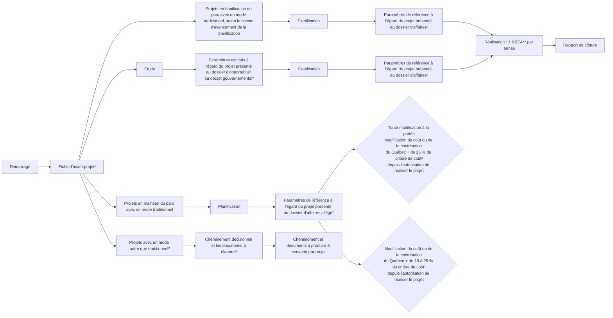

**BUDGET 2025-2026**

# POUR UN QUÉBEC FORT

## <mark>BUDGET EN BREF</mark>

**Mars 2025**


 

# Pour un Québec fort

Le budget 2025-2026 est présenté dans une période de turbulences qui vient jeter de l’ombre sur notre économie et nos finances publiques.

Nous préparons le Québec à faire face aux défis posés par les changements dans notre relation commerciale et diplomatique avec l’administration américaine.

Le Québec dispose de plusieurs atouts sur lesquels nous nous appuyons pour bâtir une économie forte qui permettra d’offrir des services publics de qualité tout en maintenant une saine gestion des finances publiques.

Nous agissons pour aider nos entreprises en misant notamment sur leur capacité à innover et sur l’apport de nos régions. Nous poursuivons également nos efforts pour améliorer nos réseaux de la santé et de l’éducation, pour soutenir les Québécois et pour faire rayonner la culture québécoise.

Enfin, nous présentons le plan qui permettra au Québec d’atteindre l’équilibre budgétaire en 2029-2030, après versements au Fonds des générations.

Avec ce budget, nous faisons le choix d’un Québec moderne, ouvert sur le monde et tourné vers l’avenir. Nous faisons le choix d’un Québec fort!

**Eric Girard**
Ministre des Finances et ministre responsable des Relations avec les Québécois d’expression anglaise

# <mark>Près de 12,3 G$ additionnels d’ici cinq ans pour :</mark>


**Stimuler la création de richesse**
**5,4 G$**


**Soutenir les Québécois**
**6,8 G$**

> **Des efforts pour améliorer le régime fiscal représentant près de 3 G$ sur cinq ans** 


**Le Plan québécois des infrastructures (PQI) 2025-2035 est porté à 164 G$, soit une augmentation de 11 G$**

3

# <mark>La situation économique du Québec</mark>

## La progression du PIB réel au Québec se situera à 1,1 % en 2025 et à 1,4 % en 2026

La croissance économique sera freinée par l’incertitude entourant les tarifs douaniers

### Croissance économique au Québec
(PIB réel, variation en pourcentage)

<table>
  <thead>
    <tr>
        <th></th>
        <th>2024</th>
        <th>2025</th>
        <th>2026</th>
    </tr>
  </thead>
  <tbody>
    <tr>
        <td>PIB réel</td>
        <td>1,4</td>
        <td>1,1</td>
        <td>1,4</td>
    </tr>
  </tbody>
</table>

Sources : Institut de la statistique du Québec, Statistique Canada et ministère des Finances du Québec.

<mark>
## Le Québec est bien positionné pour traverser cette période de turbulences

### L’écart de richesse avec l’Ontario s’est réduit de façon importante au cours des dernières années

<table>
  <thead>
    <tr>
        <th></th>
        <th>2018</th>
        <th>2026</th>
    </tr>
  </thead>
  <tbody>
    <tr>
        <td>Écart de richesse</td>
        <td>15,9 %</td>
        <td>9,9 %</td>
    </tr>
  </tbody>
</table>

### Progression du pouvoir d’achat de 2018 à 2023

Le pouvoir d’achat des ménages par habitant au Québec s’est amélioré plus rapidement qu’au Canada depuis 2018

<table>
  <thead>
    <tr>
        <th></th>
        <th>Région</th>
        <th>Pourcentage</th>
    </tr>
  </thead>
  <tbody>
    <tr>
        <td>Québec</td>
        <td>6,6 %</td>
        <td></td>
    </tr>
    <tr>
        <td>Canada</td>
        <td>3,9 %</td>
        <td></td>
    </tr>
  </tbody>
</table>

Note : Mesuré par le revenu disponible des ménages en termes réels par habitant.
</mark>

4

# <mark>5,4 G$ pour stimuler la création de richesse</mark>

## 4,1 G$ pour soutenir et dynamiser l’économie québécoise

* **Offrir une aide transitoire aux entreprises touchées par les tarifs américains**
    - Accorder des aides financières sous forme de prêts qui représentent un apport de liquidités de 1,6 G$
* **Appuyer la réalisation de projets d’investissement**
    - Prolonger les mesures d’amortissement accéléré
    - Favoriser la réalisation de projets d’entreprises
    - Poursuivre l’Offensive formation en construction
* **Favoriser la diversification des marchés**
    - Aider à concrétiser des projets d’exportation
    - Défendre les intérêts du Québec et créer de la richesse en soutenant le réseau des représentations à l’étranger


### Faciliter le repérage de produits québécois pour les consommateurs

Poursuivre le financement de l’organisme Les Produits du Québec


5

# 604 M$ pour accroître notre capacité à innover

*   **Stimuler l’innovation par un régime d’aide fiscale renouvelé**
    *   Simplifier l’aide fiscale à l’innovation pour maximiser son impact auprès des entreprises

> **Instaurer le crédit d’impôt pour la recherche, l’innovation et la commercialisation (CRIC), qui remplacera huit mesures fiscales**

*   **Favoriser l’innovation dans des secteurs stratégiques**
    *   Renouveler la Stratégie québécoise des sciences de la vie
    *   Appuyer la recherche et l’innovation en entreprises dans des secteurs prioritaires

 <mark>Appuyer le développement de la zone d’innovation Technum Québec, à Bromont</mark>

*   **Moderniser les services publics pour en accroître l’efficacité**

*   **Aider les PME à fort potentiel**

 <mark>Propulser les jeunes entreprises innovantes à fort potentiel de croissance</mark>

<description>
Une grande illustration stylisée d'une ampoule allumée occupe la partie droite de la page.
</description>

6

# 759 M$ pour favoriser l’apport des régions à la création de richesse


* **Dynamiser l’économie des régions**
    - Poursuivre les initiatives pour une meilleure connectivité

* **Valoriser nos minéraux critiques et stratégiques**
    - Adopter un nouveau Plan québécois pour la valorisation des minéraux critiques et stratégiques pour la période 2025-2030

* **Soutenir le secteur forestier**
    - Diversifier l’industrie des produits forestiers et favoriser l’innovation


* **Poursuivre l’appui au secteur touristique**
    - Soutenir les festivals et les évènements touristiques


<mark>
* **Favoriser le développement du secteur bioalimentaire**
    - Poursuivre le Plan d’agriculture durable 2020-2030
    - Mettre en œuvre la Politique bioalimentaire 2025-2035, qui disposera d’une enveloppe de plus de 1 G$ sur cinq ans

</mark>

7

# <mark>6,8 G$ pour soutenir les Québécois</mark>

## 3,9 G$ pour assurer une meilleure prestation des soins de santé et des services sociaux

* Améliorer l’accès aux soins et aux services
    - Financer l’offre de traitements pharmaceutiques dans les hôpitaux
    - Former plus de médecins

* Renforcer les services sociaux pour les personnes vulnérables  <span style="color: #00A191">Répondre aux besoins croissants en protection de la jeunesse</span>
* Assurer la qualité des milieux de vie destinés aux aînés
    - Pérenniser le financement de l’harmonisation des CHSLD publics et privés
* Prioriser la prévention en santé
    - Élargir la vaccination auprès des clientèles vulnérables


<br/>

## 1,1 G$ pour encourager l’éducation et le développement des jeunes

* Valoriser la réussite éducative
* Consolider l’aide aux jeunes et aux étudiants
* Promouvoir la pratique du loisir et du sport
    - Développer et maintenir les infrastructures récréatives, sportives et de plein air
* Soutenir l’accessibilité aux services de garde
    - Convertir 1 000 places de garde non subventionnées


8

# 550 M$ pour favoriser le bien-être des personnes vulnérables

*   Améliorer la rente de retraite des personnes victimes d'une lésion professionnelle
*   Soutenir l'accès au logement
*   Apporter une aide ciblée aux personnes dans le besoin
    -   Favoriser l'intégration en emploi


# 717 M$ pour mettre en valeur la culture et l'identité québécoises

*   Valoriser la culture et le patrimoine québécois
    -   Bonifier le financement destiné au Conseil des arts et des lettres du Québec
*   Promouvoir l'identité du Québec


**Poursuivre le soutien aux entreprises culturelles à travers la SODEC**

# 636 M$ pour appuyer les collectivités

*   Assurer une société juste et sécuritaire
    -   Mettre en place la Stratégie québécoise de lutte contre la criminalité
*   Favoriser le développement durable et la vitalité des territoires
*   Renforcer l'adaptation aux changements climatiques


9

# <mark>Efforts pour améliorer</mark>
# <mark>le régime fiscal</mark>

## Dégager des sommes de près de 3,0 G$ sur cinq ans

### Optimiser l’aide fiscale aux entreprises

*   Cibler les activités du secteur des TI à plus forte valeur ajoutée
*   Recentrer le crédit d’impôt relatif aux ressources sur les minéraux critiques et stratégiques


### Simplifier le régime fiscal

*   Uniformiser le taux de la taxe sur les primes d’assurance et celui de la taxe de vente du Québec (TVQ)
*   Réviser le régime d’actions accréditives


### Actualiser le régime fiscal

*   Adapter les aides fiscales aux nouvelles réalités économiques et sociales
*   Renforcer l’équité du régime fiscal
*   Éliminer les dépenses fiscales inefficaces ou peu utilisées

### Favoriser le financement des services publics

*   Mettre fin à l’indexation du seuil d’admissibilité aux taux réduits de la cotisation de l’employeur au Fonds des services de santé
*   Assurer la pérennité du financement des infrastructures et des services de transport

10

# <mark>La situation financière du Québec</mark>

**Malgré le contexte d’incertitude, le gouvernement réitère son engagement de maintenir une saine gestion des finances publiques**

*   Le gouvernement présente un plan prévoyant un retour à l’équilibre budgétaire d’ici cinq ans, avec des gestes concrets pour résorber le déficit
*   Le cadre financier prévoit une provision pour éventualités de 8,5 G$ sur cinq ans

**Le déficit comptable, c’est-à-dire avant versements des revenus consacrés au Fonds des générations, s’établira à 11,4 G$ en 2025-2026, soit 1,8 % du PIB**

**Évolution du solde comptable**
(en milliards de dollars)

<table>
  <thead>
    <tr>
        <th>2024-2025</th>
        <th>2025-2026</th>
        <th>2026-2027</th>
        <th>2027-2028</th>
        <th>2028-2029</th>
        <th>2029-2030</th>
    </tr>
  </thead>
  <tbody>
    <tr>
        <td>-8,1</td>
        <td>-11,4</td>
        <td>-7,1</td>
        <td>-4,2</td>
        <td>-1,4</td>
        <td>0,4</td>
    </tr>
  </tbody>
</table>

Sources : Institut de la statistique du Québec, Statistique Canada et ministère des Finances du Québec.

**Le déficit selon la Loi sur l’équilibre budgétaire, c’est-à-dire après versements des revenus consacrés au Fonds des générations, sera de 13,6 G$, soit 2,2 % du PIB, en 2025-2026**

**Au 31 mars 2025, le poids de la dette nette s’établira à 38,7 % du PIB**

*   Niveau inférieur à celui d’avant la pandémie
*   Augmentation d’ici 2027-2028 sous l’effet notamment de la hausse des investissements en infrastructures publiques, qui viendra soutenir la croissance économique dans un contexte incertain
*   Diminution graduelle à compter de 2028-2029 et nouvelle cible de réduction de ce poids à 32,5 % du PIB d’ici 2037-2038

11

Québec.ca/budget


Dépôt légal – Bibliothèque et Archives nationales du Québec
ISBN 978-2-555-00712-3 (Imprimé)
ISBN 978-2-555-00713-0 (PDF)
© Gouvernement du Québec, 25 mars 2025

**Finances**
**Québec** 

# BUDGET 2025-2026

# POUR UN QUÉBEC FORT

# PLAN
# BUDGÉTAIRE

**Mars 2025**


**BUDGET 2025-2026**

# POUR UN QUÉBEC FORT

<mark>**PLAN**</mark>
<mark>**BUDGÉTAIRE**</mark>

Mars 2025


Budget 2025-2026
Plan budgétaire

Dépôt légal – 25 mars 2025
Bibliothèque et Archives nationales du Québec
ISBN 978-2-555-00708-6 (Imprimé)
ISBN 978-2-555-00709-3 (PDF)

© Gouvernement du Québec, 2025

# PLAN BUDGÉTAIRE

**Section A**
Vue d’ensemble

**Section B**
Stimuler la création de richesse

**Section C**
Soutenir les Québécois

**Section D**
Bilan de l’examen pour améliorer le régime fiscal

**Section E**
L’économie du Québec :
évolution récente et perspectives pour 2025 et 2026

**Section F**
La situation financière du Québec

**Section G**
La dette du gouvernement du Québec

**Section H**
Les scénarios alternatifs de prévision

SECTION **A**

# Section A
## VUE D’ENSEMBLE

**Sommaire** A.3
1. **Stimuler la création de richesse** A.11
2. **Soutenir les Québécois** A.13
3. **Bilan de l’examen pour améliorer le régime fiscal** A.15
4. **La situation économique : évolution récente et perspectives pour 2025 et 2026** A.17
5. **La situation financière du Québec** A.19
6. **La dette du gouvernement du Québec** A.27
7. **Les scénarios alternatifs de prévision** A.29
**ANNEXE : Perspectives économiques au Québec de 2023 à 2029** A.33

A.1

SECTION **A**

# SOMMAIRE

Le Québec doit faire face aux défis provoqués par les changements dans sa relation commerciale et diplomatique avec l'administration américaine. Les impacts de l'imposition de tarifs douaniers et de l'incertitude quant à la forme, à l'ampleur et à la durée de ces derniers se font déjà ressentir. Ceux-ci pourraient éventuellement entraîner une diminution du potentiel économique du Québec et du Canada.

Ainsi, dans le cadre du budget 2025-2026, le gouvernement concentre ses efforts sur l'économie et protège les services en santé et l'éducation. Il réitère aussi son engagement à maintenir une saine gestion des finances publiques, malgré l'instabilité économique, et présente un plan de retour à l'équilibre budgétaire en 2029-2030.

### [ ] La situation économique au Québec

Le budget 2025-2026 repose sur la prémisse que des droits de douane seraient imposés par les États-Unis à plusieurs partenaires commerciaux, dont le Canada. L'hypothèse de base prévoit que ces tarifs pourraient être ajustés au cours des prochains mois, que les effets seraient en moyenne équivalents à des tarifs de 10 % et qu'ils pourraient être en place pour une période transitoire d'environ deux ans<sup>1</sup>.

Le conflit commercial déclenché par les États-Unis et le climat de fortes incertitudes affaiblissent déjà les perspectives économiques. La progression du PIB réel devrait se poursuivre et atteindre 1,1 % en 2025 puis 1,4 % en 2026. N'eût été le conflit commercial, il aurait progressé plus fortement pour ces deux années.

— Au Québec, les effets liés à la mise en place de ces droits de douane retrancheront un total de 0,7 point de pourcentage à la croissance pour les années 2025 et 2026 et réduiront les gains attendus sur le marché du travail d'environ 25 000 emplois.

Néanmoins, le Québec peut s'appuyer sur ses atouts pour traverser cette période de turbulence. Il dispose d'une économie diversifiée, d'un emplacement géographique stratégique, d'une main-d'œuvre qualifiée, d'universités de classe mondiale, d'électricité à prix abordable, de ressources naturelles abondantes et d'un encadrement fiscal favorable à l'investissement et à l'innovation.

De plus, les Québécois s'engagent dans cette période en bonne posture.

— La bonne performance économique du Québec depuis 2018 a permis de réduire l'écart de niveau de vie avec l'Ontario et le reste du Canada. Le gouvernement est en voie d'atteindre son objectif fixé à 10 % d'écart avec l'Ontario. Selon les dernières estimations, cet écart devrait se situer à 9,9 % en 2026, alors qu'il était de 15,9 % en 2018. L'écart avec le reste du Canada devrait se situer à 13,7 % en 2026, alors qu'il était de 20,2 % en 2018.

— Le gouvernement du Québec a mieux protégé le portefeuille de ses citoyens que ses provinces voisines dans les dernières années. Entre 2018 et 2023, le pouvoir d'achat des ménages, tel que mesuré par le revenu disponible en termes réels par habitant, s'est amélioré de 6,6 % au Québec comparativement à 3,9 % au Canada.

***

<sup>1</sup> Sauf indication contraire, cette section reflète les données économiques disponibles au 7 mars 2025.

Vue d'ensemble | A.3

# Le scénario économique de référence

Un degré élevé d’incertitude pèse actuellement sur les prévisions du budget 2025-2026. L’évolution du conflit commercial déclenché par l’administration américaine constitue le plus grand risque pour les perspectives économiques du Québec.

- Au moment de mettre sous presse, plusieurs incertitudes persistent. En particulier, la forme, l’ampleur et la durée des politiques commerciales protectionnistes mises en œuvre demeurent incertaines et variables.

La prévision économique du scénario de référence repose sur l’hypothèse que les droits de douane de 25 %, annoncés le 4 mars dernier, constituent une mesure stratégique destinée à exercer une pression sur les partenaires commerciaux des États-Unis. Le ministère des Finances fait l’hypothèse de base que ces tarifs pourraient être ajustés au cours des prochains mois, que les effets seraient en moyenne équivalents à des tarifs de 10 % et qu’ils pourraient être en place pour une période transitoire d’environ deux ans.

- Le scénario de référence table sur le fait que les États-Unis ne poursuivront pas une guerre commerciale généralisée en maintenant des droits de douane de 25 % sur une longue période puisque ces tarifs se répercuteront négativement sur leur économie.
    - La mise en place de droits de douane élevés sur des produits canadiens entraînera une hausse des coûts pour les entreprises américaines qui dépendent des importations canadiennes pour leurs chaînes de production.
    - De plus, le Canada a mis en œuvre des mesures de représailles sur les importations américaines, ce qui réduira les exportations des États-Unis. La baisse de la demande pour leurs produits se répercutera négativement sur les profits des entreprises américaines et ralentira la croissance économique.
    - Ces évolutions entraîneront également une hausse des prix pour les consommateurs américains.

Le Canada demeure un partenaire commercial essentiel de la stratégie économique des États-Unis, ce qui plaide en faveur d’une structure tarifaire moins punitive.

Un scénario qui prend en compte la mise en place de tarifs douaniers de 25 % sur les importations américaines (10 % sur les produits énergétiques) pour une période de deux ans et des mesures de représailles équivalentes mises en place par les partenaires visés est toutefois présenté dans la section H, « Les scénarios alternatifs de prévision ».

A.4
Budget 2025-2026
Plan budgétaire

SECTION **A**

### [ ] Stimuler la création de richesse

Dans un tel contexte d’incertitude, les administrations publiques sont appelées à servir de contrepoids transitoire pour stimuler l’économie.

Ainsi, à court terme, le gouvernement soutiendra les entreprises en difficulté en raison des tensions commerciales.

Dans la période de transition, il renforcera l’économie en augmentant ses investissements dans les infrastructures et en travaillant avec les autres provinces pour diminuer les obstacles au commerce sur le marché canadien.

Enfin, il entend garder le cap sur la création de richesse à long terme en stimulant les investissements et l’innovation dans les entreprises afin de leur permettre de solidifier leur position concurrentielle sur l’échiquier mondial.

#### ■ Rehausser les investissements en infrastructures

Le Plan québécois des infrastructures (PQI) 2025-2035 est porté à 164 milliards de dollars, une augmentation de 11 milliards de dollars, soit une hausse de 7 %. Des sommes importantes seront investies pour le maintien d’actifs et la bonification des infrastructures en santé, en éducation, en enseignement supérieur et en transport.

De plus, avec la réalisation graduelle de son Plan d’action 2035 – Vers un Québec décarboné et prospère, Hydro-Québec ajoutera une contribution importante à la croissance de l’économie du Québec. Ce plan exigera des investissements en capital de 135 à 160 milliards de dollars sur la période 2024-2035.

Les investissements publics en infrastructures contribueront à appuyer la prestation de services publics de qualité, à stimuler l’économie et à accroître le potentiel économique du Québec à long terme.

Par ailleurs, le gouvernement du Québec réitère qu’il est urgent que le gouvernement fédéral augmente le financement en infrastructures en déposant un nouveau plan en la matière.

#### ■ Dynamiser l’économie et miser sur les entreprises québécoises

Les entreprises évoluent actuellement dans un contexte d’incertitude et doivent faire preuve de résilience et d’adaptation. En d’autres mots, le Québec doit s’ajuster pour performer dans ce nouveau contexte. Ainsi, dans le cadre du budget 2025-2026, le gouvernement annonce des gestes totalisant plus de 5,4 milliards de dollars sur cinq ans pour stimuler la création de richesse. Ces gestes permettront :

— de soutenir et de dynamiser l’économie québécoise;

— d’accroître notre capacité à innover;

— de favoriser l’apport des régions à la création de richesse.

De plus, le Québec collabore étroitement avec les autres provinces et territoires ainsi qu’avec le gouvernement fédéral en vue de stimuler les échanges et de réduire les obstacles au commerce interprovincial.

Vue d’ensemble | A.5

*   **Une fiscalité propice à l'investissement et à l'innovation**

Dans le cadre du budget 2025-2026, le gouvernement confirme son intention d'harmoniser son régime fiscal avec l'annonce du gouvernement fédéral relative à la prolongation des mesures d'amortissement accéléré lorsque ces dernières entreront en vigueur. De plus, il met en place un nouveau régime d'aide fiscale à l'innovation simplifié, pour diminuer les exigences administratives et maximiser l'impact de l'aide fiscale auprès des entreprises afin d'accroître les retombées au Québec.

Les modifications, qui permettront d'offrir un soutien financier additionnel totalisant plus de 2,6 milliards de dollars sur cinq ans, contribueront à stimuler l'investissement et l'innovation ainsi qu'à préparer les entreprises québécoises à répondre aux défis économiques actuels et futurs.

*   **Améliorer les services en santé et en éducation**

Au cours des dernières années, le gouvernement a alloué des fonds considérables pour améliorer la qualité et assurer l'accessibilité des services publics dans le cadre de ses missions essentielles.

Dans le cadre du budget 2025-2026, le gouvernement poursuit ses investissements et prévoit plus de 6,8 milliards de dollars d'ici 2029-2030 pour soutenir les Québécois, dont près de 5,0 milliards de dollars afin :

— d'assurer une meilleure prestation des soins de santé et des services sociaux en améliorant l'accessibilité et la qualité des soins de santé, notamment pour les aînés, les jeunes en difficulté et les personnes itinérantes;

— d'encourager l'éducation et le développement des jeunes en valorisant la réussite éducative, en améliorant l'accessibilité des services de garde à l'enfance, en offrant de meilleurs services aux jeunes et en faisant la promotion de la pratique du loisir et du sport.

Par ailleurs, des investissements de 1,9 milliard de dollars permettront :

— de favoriser le bien-être des personnes vulnérables;

— de mettre en valeur la culture et l'identité québécoises;

— d'appuyer les collectivités.

> <mark>**Dans le cadre du budget 2025-2026, le gouvernement prévoit près de 12,3 milliards de dollars pour stimuler la création de richesse et soutenir les Québécois.**</mark>
>
> — <mark>**Parallèlement, les efforts pour améliorer le régime fiscal permettent de dégager des sommes de près de 3,0 milliards de dollars sur cinq ans.**</mark>

Budget 2025-2026
A.6 Plan budgétaire

SECTION **A**

### [ ] Améliorer le régime fiscal

Le gouvernement termine l’examen des 277 dépenses fiscales amorcé lors du budget 2024-2025.

Dans le cadre du budget 2025-2026, les efforts pour améliorer le régime fiscal permettent de dégager des sommes de près de 3,0 milliards de dollars sur cinq ans. Ces mesures, qui visent à optimiser l’aide fiscale aux entreprises, à simplifier et à actualiser le régime fiscal ainsi qu’à favoriser le financement des services publics, s’inscrivent dans le plan de retour à l’équilibre budgétaire.

TABLEAU A.1

**Impact financier des mesures du budget 2025-2026**
(en millions de dollars)

<table>
  <thead>
    <tr>
        <th></th>
        <th>2024-2025</th>
        <th>2025-2026</th>
        <th>2026-2027</th>
        <th>2027-2028</th>
        <th>2028-2029</th>
        <th>2029-2030</th>
        <th>Total</th>
    </tr>
  </thead>
  <tbody>
    <tr>
        <td>Stimuler la création de richesse</td>
        <td>—</td>
        <td>-1 067,1</td>
        <td>-1 333,5</td>
        <td>-1 011,6</td>
        <td>-1 057,0</td>
        <td>-959,9</td>
        <td>-5 429,1</td>
    </tr>
    <tr>
        <td>Soutenir les Québécois</td>
        <td>-8,9</td>
        <td>-1 517,5</td>
        <td>-1 602,9</td>
        <td>-1 278,6</td>
        <td>-1 217,6</td>
        <td>-1 223,7</td>
        <td>-6 849,2</td>
    </tr>
    <tr>
        <td>**Sous-total**</td>
        <td>**-8,9**</td>
        <td>**-2 584,6**</td>
        <td>**-2 936,4**</td>
        <td>**-2 290,2**</td>
        <td>**-2 274,6**</td>
        <td>**-2 183,6**</td>
        <td>**-12 278,3**</td>
    </tr>
    <tr>
        <td>Efforts pour améliorer le régime fiscal</td>
        <td>—</td>
        <td>32,1</td>
        <td>270,6</td>
        <td>723,0</td>
        <td>910,7</td>
        <td>1 037,7</td>
        <td>2 974,1</td>
    </tr>
    <tr>
        <td>**TOTAL**</td>
        <td>**-8,9**</td>
        <td>**-2 552,5**</td>
        <td>**-2 665,8**</td>
        <td>**-1 567,2**</td>
        <td>**-1 363,9**</td>
        <td>**-1 145,9**</td>
        <td>**-9 304,2**</td>
    </tr>
  </tbody>
</table>
Note : Les chiffres ayant été arrondis, leur somme peut ne pas correspondre au total indiqué.

### [ ] Poursuite de l’examen des dépenses budgétaires

L’examen des dépenses budgétaires visant à améliorer l’efficacité de l’intervention gouvernementale dans les activités des ministères et organismes, coordonné par le Secrétariat du Conseil du trésor, permet d’annoncer une réduction des dépenses de 3,0 milliards de dollars en 2029-2030.

Le gouvernement poursuivra ses travaux sur l’optimisation de l’allocation des ressources, notamment au regard de la transformation des façons de faire de l’État.

Vue d'ensemble | A.7

# [ ] Maintenir une saine gestion des finances publiques

En dépit de l’incertitude associée aux politiques économiques américaines, le gouvernement demeure engagé dans une saine gestion des finances publiques. Sur une base comparable aux soldes budgétaires des autres provinces canadiennes et du gouvernement fédéral, c’est-à-dire avant versements des revenus consacrés au Fonds des générations, le déficit comptable est réduit de 700 millions de dollars, ce qui le porte à 8,1 milliards de dollars en 2024-2025, soit à 1,3 % du PIB.

En 2025-2026, le solde comptable affiche un déficit de 11,4 milliards de dollars, soit 1,8 % du PIB. Après versements des revenus consacrés au Fonds des générations, le solde budgétaire au sens de la Loi sur l’équilibre budgétaire présente un déficit de 13,6 milliards de dollars, soit 2,2 % du PIB.

> **Malgré les pressions qui pèsent sur la situation financière du gouvernement, les gestes posés pour redresser les finances publiques permettent d’afficher un surplus comptable en 2029-2030.**

Le gouvernement demeure engagé à réduire la dette à long terme et poursuit les versements des revenus consacrés au Fonds des générations. L’évolution de la situation budgétaire et le contexte économique incertain actuel appellent cependant à une révision des cibles de réduction de la dette annoncées en mars 2023. La dette nette au PIB devra ainsi être réduite à 35,5 % du PIB d’ici 2032-2033 et à 32,5 % du PIB d’ici 2037-2038.

TABLEAU A.2
**Perspectives économiques et financières du Québec<sup>2</sup>**
(en milliards de dollars, sauf indication contraire)

<table>
  <thead>
    <tr>
        <th></th>
        <th>2024-2025</th>
        <th>2025-2026</th>
        <th>2026-2027</th>
        <th>2027-2028</th>
        <th>2028-2029</th>
        <th>2029-2030</th>
    </tr>
    <tr>
        <th>SITUATION FINANCIÈRE</th>
        <th></th>
        <th></th>
        <th></th>
        <th></th>
        <th></th>
        <th></th>
    </tr>
  </thead>
  <tbody>
    <tr>
        <td>Revenus</td>
        <td>155,2</td>
        <td>156,3</td>
        <td>165,2</td>
        <td>171,2</td>
        <td>176,2</td>
        <td>181,3</td>
    </tr>
    <tr>
        <td>Dépenses</td>
        <td>-163,3</td>
        <td>-165,8</td>
        <td>-170,3</td>
        <td>-173,9</td>
        <td>-176,1</td>
        <td>-179,4</td>
    </tr>
    <tr>
        <td>Provision pour éventualités</td>
        <td>—</td>
        <td>-2,0</td>
        <td>-2,0</td>
        <td>-1,5</td>
        <td>-1,5</td>
        <td>-1,5</td>
    </tr>
    <tr>
        <td>**Surplus (déficit) comptable**</td>
        <td>**-8,1**</td>
        <td>**-11,4**</td>
        <td>**-7,1**</td>
        <td>**-4,2**</td>
        <td>**-1,4**</td>
        <td>**0,4**</td>
    </tr>
    <tr>
        <td>**En % du PIB**</td>
        <td>**1,3**</td>
        <td>**1,8**</td>
        <td>**1,1**</td>
        <td>**0,6**</td>
        <td>**0,2**</td>
        <td>**0,1**</td>
    </tr>
    <tr>
        <th>ENDETTEMENT</th>
        <th></th>
        <th></th>
        <th></th>
        <th></th>
        <th></th>
        <th></th>
    </tr>
    <tr>
        <td>Dette nette</td>
        <td>235,8</td>
        <td>255,0</td>
        <td>270,4</td>
        <td>282,6</td>
        <td>286,4</td>
        <td>288,1</td>
    </tr>
    <tr>
        <td>En % du PIB</td>
        <td>38,7</td>
        <td>40,4</td>
        <td>41,5</td>
        <td>41,9</td>
        <td>41,0</td>
        <td>39,8</td>
    </tr>
    <tr>
        <th></th>
        <th>2024</th>
        <th>2025</th>
        <th>2026</th>
        <th>2027</th>
        <th>2028</th>
        <th>2029</th>
    </tr>
    <tr>
        <th>INDICATEURS ÉCONOMIQUES</th>
        <th></th>
        <th></th>
        <th></th>
        <th></th>
        <th></th>
        <th></th>
    </tr>
    <tr>
        <td>PIB réel (variation en %)</td>
        <td>1,4</td>
        <td>1,1</td>
        <td>1,4</td>
        <td>1,6</td>
        <td>1,7</td>
        <td>1,7</td>
    </tr>
    <tr>
        <td>PIB nominal (variation en %)</td>
        <td>5,3</td>
        <td>3,4</td>
        <td>3,4</td>
        <td>3,5</td>
        <td>3,5</td>
        <td>3,6</td>
    </tr>
  </tbody>
</table>
Note : Les chiffres ayant été arrondis, leur somme peut ne pas correspondre au total indiqué.

***

<sup>2</sup> Sauf indication contraire, ce document repose sur les données budgétaires disponibles au 5 mars 2025. Les données présentées pour 2024-2025 sont des résultats préliminaires. Celles présentées pour 2025-2026 à 2029-2030 sont des prévisions et celles pour les années subséquentes sont des projections.

Budget 2025-2026
Plan budgétaire
A.8

SECTION **A**

# Le plan de retour à l'équilibre budgétaire

Grâce aux gestes posés pour optimiser ses dépenses, le gouvernement présente un plan de retour à l'équilibre budgétaire dans le respect de la Loi sur l'équilibre budgétaire.

L'équilibre, après versements des revenus consacrés au Fonds des générations, sera atteint au plus tard en 2029-2030. Dans ce but, le gouvernement s'engage à résorber un écart de 1,0 milliard de dollars en 2027-2028 et de 2,5 milliards de dollars en 2028-2029 et en 2029-2030, ce qui correspond à 0,3 % du PIB en 2029-2030.

Il dispose de différents leviers pour y arriver :

— il poursuivra ses initiatives visant à créer plus de richesse et à accroître le potentiel économique du Québec;

— il continuera ses représentations auprès du gouvernement fédéral pour obtenir des transferts fédéraux additionnels, notamment en santé et en infrastructures;

— il pourrait bénéficier de la non-utilisation de la provision pour éventualités;

— il s'engage dans la recherche d'efficience et de gains de productivité dans la prestation des services publics.

TABLEAU A.3

**Solde budgétaire au sens de la Loi sur l'équilibre budgétaire**
(en millions de dollars, sauf indication contraire)

<table>
  <thead>
    <tr>
        <th></th>
        <th>2024-2025</th>
        <th>2025-2026</th>
        <th>2026-2027</th>
        <th>2027-2028</th>
        <th>2028-2029</th>
        <th>2029-2030</th>
    </tr>
  </thead>
  <tbody>
    <tr>
        <td>**SURPLUS (DÉFICIT) COMPTABLE**</td>
        <td>**−8 078**</td>
        <td>**−11 430**</td>
        <td>**−7 126**</td>
        <td>**−4 173**</td>
        <td>**−1 350**</td>
        <td>**397**</td>
    </tr>
    <tr>
        <td>*En % du PIB*</td>
        <td>*1,3*</td>
        <td>*1,8*</td>
        <td>*1,1*</td>
        <td>*0,6*</td>
        <td>*0,2*</td>
        <td>*0,1*</td>
    </tr>
    <tr>
        <td>Écart à résorber</td>
        <td>—</td>
        <td>—</td>
        <td>—</td>
        <td>1 000</td>
        <td>2 500</td>
        <td>2 500</td>
    </tr>
    <tr>
        <td>Versements des revenus consacrés au Fonds des générations</td>
        <td>−2 354</td>
        <td>−2 177</td>
        <td>−2 402</td>
        <td>−2 522</td>
        <td>−2 648</td>
        <td>−2 796</td>
    </tr>
    <tr>
        <td>**SOLDE BUDGÉTAIRE AU SENS DE LA LOI SUR L'ÉQUILIBRE BUDGÉTAIRE**</td>
        <td>**−10 432**</td>
        <td>**−13 607**</td>
        <td>**−9 528**</td>
        <td>**−5 695**</td>
        <td>**−1 498**</td>
        <td>**101**</td>
    </tr>
    <tr>
        <td>**En % du PIB**</td>
        <td>**1,7**</td>
        <td>**2,2**</td>
        <td>**1,5**</td>
        <td>**0,8**</td>
        <td>**0,2**</td>
        <td>**0,0**</td>
    </tr>
  </tbody>
</table>
Note : Les chiffres ayant été arrondis, leur somme peut ne pas correspondre au total indiqué.

Vue d'ensemble | A.9

SECTION **A**

# 1. STIMULER LA CRÉATION DE RICHESSE

Le gouvernement s’est fixé comme objectif de transformer l’économie du Québec pour qu’elle soit plus prospère et d’atteindre un niveau de richesse comparable à celui de ses principaux partenaires commerciaux. La bonne performance de l’économie depuis 2018 a permis un rattrapage historique du niveau de vie du Québec par rapport à celui de l’Ontario. L’écart de niveau de vie du Québec avec l’Ontario est ainsi passé de 15,9 % en 2018 à 11,2 % en 2024. Pour le reste du Canada, il est passé de 20,2 % en 2018 à 14,7 % en 2024. De plus, le rattrapage du niveau de vie se poursuivra au cours des prochaines années, et l’écart entre le Québec et l’Ontario devrait se situer à 9,9 % en 2026. L’écart avec le reste du Canada devrait quant à lui atteindre 13,7 %. Toutefois, les turbulences dans les relations commerciales avec les États-Unis représentent un défi de taille pour l’économie québécoise.

Dans le cadre du budget 2025-2026, le gouvernement agit pour stimuler la création de richesse et solidifier la position concurrentielle de nos entreprises. À cet effet, le gouvernement annonce des gestes totalisant plus de 5,4 milliards de dollars sur cinq ans, soit :

— 4,1 milliards de dollars pour soutenir et dynamiser l’économie québécoise en offrant une aide transitoire aux entreprises touchées par les tarifs américains, en appuyant la réalisation de projets d’investissement, en favorisant la diversification des marchés et en facilitant le repérage de produits québécois;

— 604,1 millions de dollars pour accroître notre capacité à innover en stimulant l’innovation et sa commercialisation par un régime d’aide fiscale renouvelé, en favorisant l’innovation dans des secteurs stratégiques, en modernisant les services publics pour en accroître l’efficacité et en aidant les PME à fort potentiel;

— 759,0 millions de dollars pour favoriser l’apport des régions à la création de richesse en dynamisant l’économie des régions, en valorisant nos minéraux critiques et stratégiques, en soutenant le secteur forestier, en poursuivant l’appui au secteur touristique et en favorisant le développement du secteur bioalimentaire.

TABLEAU A.4

**Impact financier des mesures pour stimuler la création de richesse**
(en millions de dollars)

<table>
  <thead>
    <tr>
        <th></th>
        <th>2025-2026</th>
        <th>2026-2027</th>
        <th>2027-2028</th>
        <th>2028-2029</th>
        <th>2029-2030</th>
        <th>Total</th>
    </tr>
  </thead>
  <tbody>
    <tr>
        <td>Soutenir et dynamiser l’économie québécoise</td>
        <td>-802,5</td>
        <td>-992,2</td>
        <td>-745,0</td>
        <td>-821,8</td>
        <td>-704,5</td>
        <td>-4 066,0</td>
    </tr>
    <tr>
        <td>Accroître notre capacité à innover</td>
        <td>-77,7</td>
        <td>-109,9</td>
        <td>-141,3</td>
        <td>-128,1</td>
        <td>-147,1</td>
        <td>-604,1</td>
    </tr>
    <tr>
        <td>Favoriser l’apport des régions à la création de richesse</td>
        <td>-186,9</td>
        <td>-231,4</td>
        <td>-125,3</td>
        <td>-107,1</td>
        <td>-108,3</td>
        <td>-759,0</td>
    </tr>
    <tr>
        <td>TOTAL</td>
        <td>-1 067,1</td>
        <td>-1 333,5</td>
        <td>-1 011,6</td>
        <td>-1 057,0</td>
        <td>-959,9</td>
        <td>-5 429,1</td>
    </tr>
  </tbody>
</table>
Note : Les chiffres ayant été arrondis, leur somme peut ne pas correspondre au total indiqué.

Vue d'ensemble | A.11

**Innover pour prospérer**

Dans la dernière décennie, une tendance à la baisse a été observée au Québec en matière d’activité de recherche et développement (R-D) des entreprises, alors que la R-D a connu une hausse marquée dans plusieurs autres juridictions.

- En 2022, le ratio des dépenses de R-D des entreprises (DIRDE) en pourcentage du PIB du Québec se situait en dessous de celui de nos principaux partenaires, notamment l’Ontario qui, pourtant, se trouvait loin derrière le Québec en 2014.
- La diminution des dépenses de R-D des entreprises peut s’expliquer en partie par les resserrements apportés aux crédits d’impôt à la R-D en 2014, dans le cadre des travaux de la Commission d’examen sur la fiscalité québécoise.

Cette tendance soulève un enjeu de compétitivité pour les perspectives d’avenir des entreprises québécoises par rapport à la concurrence extérieure.

Ce déclin se produit au moment où l’environnement d’affaires s’est davantage complexifié en raison des incertitudes créées par les tensions commerciales avec les États-Unis.

Un large consensus scientifique reconnaît que l’innovation a des effets positifs sur la création de richesse par une amélioration de la productivité et de la compétitivité des entreprises.

Or, le régime actuel d’aide fiscale à l’innovation du Québec est complexe, et les résultats en matière de R-D des dernières années indiquent que des changements s’avèrent nécessaires pour établir un écosystème d’innovation attractif pour les entreprises.

Dans ce contexte, le gouvernement prévoit, dans le cadre du budget 2025-2026, la mise en place d’un nouveau régime d’aide fiscale à l’innovation simplifié, pour diminuer les exigences administratives et maximiser son impact auprès des entreprises afin d’accroître les retombées économiques au Québec.

- La mise en place du crédit d’impôt pour la recherche, l’innovation et la commercialisation (CRIC) constituera le pilier du nouveau régime d’aide fiscale à l’innovation, qui contribuera à une plus grande productivité et à une compétitivité accrue des entreprises du Québec. Ce crédit d’impôt remplacera huit mesures fiscales actuellement en vigueur.

Le nouveau régime d’aide fiscale à l’innovation permettra d’offrir un soutien financier additionnel totalisant 271,5 millions de dollars sur cinq ans. Il contribuera à stimuler l’innovation et à préparer les entreprises québécoises à répondre aux défis économiques actuels et futurs. Les détails sont présentés dans le fascicule *Innover pour prospérer*.

**Impact financier du nouveau régime d’aide fiscale à l’innovation**
(en millions de dollars)

<table>
  <thead>
    <tr>
        <th></th>
        <th>2025-2026</th>
        <th>2026-2027</th>
        <th>2027-2028</th>
        <th>2028-2029</th>
        <th>2029-2030</th>
        <th>Total</th>
    </tr>
  </thead>
  <tbody>
    <tr>
        <td>Simplification de l’aide fiscale à l’innovation</td>
        <td>3,3</td>
        <td>101,1</td>
        <td>646,6</td>
        <td>678,7</td>
        <td>711,4</td>
        <td>2 141,1</td>
    </tr>
    <tr>
        <td>Instauration du CRIC</td>
        <td>—</td>
        <td>-106,0</td>
        <td>-715,9</td>
        <td>-769,5</td>
        <td>-821,2</td>
        <td>-2 412,6</td>
    </tr>
    <tr>
        <td>TOTAL</td>
        <td>3,3</td>
        <td>-4,9</td>
        <td>-69,3</td>
        <td>-90,8</td>
        <td>-109,8</td>
        <td>-271,5</td>
    </tr>
  </tbody>
</table>

Budget 2025-2026
A.12 | Plan budgétaire

SECTION **A**

# 2. SOUTENIR LES QUÉBÉCOIS

Au cours des dernières années, le gouvernement a investi des sommes importantes pour améliorer la qualité des services publics, et en garantir l'accessibilité notamment en santé et en éducation.

Depuis 2018-2019, les dépenses des portefeuilles Santé et Services sociaux, Éducation et Enseignement supérieur ont crû respectivement de 52,3 %, de 54,6 % et de 40,7 %, ce qui correspond à des croissances annuelles moyennes<sup>3</sup> de 7,3 %, de 7,5 % et de 5,9 %.

Malgré le contexte d'incertitude économique, le gouvernement tient à poursuivre l'amélioration des services offerts aux Québécois.

Dans le cadre du budget 2025-2026, le gouvernement consacre plus de 6,8 milliards de dollars sur six ans au soutien des Québécois, soit :

— 3,9 milliards de dollars pour assurer une meilleure prestation des soins de santé et des services sociaux, notamment en améliorant l'accès aux soins et aux services offerts aux aînés et aux personnes vulnérables, dont les jeunes en difficulté et les personnes en situation d'itinérance;

— 1,1 milliard de dollars pour encourager l'éducation et le développement des jeunes Québécois, en valorisant la réussite éducative des élèves, en poursuivant l'amélioration des services offerts aux jeunes et aux étudiants, en encourageant la pratique du loisir et du sport, ainsi qu'en améliorant l'accessibilité aux services de garde éducatifs à l'enfance;

— près de 550 millions de dollars pour favoriser le bien-être des personnes vulnérables en bonifiant la rente de retraite de certaines personnes victimes d'une lésion professionnelle, en soutenant l'accès au logement et en apportant une aide ciblée aux personnes dans le besoin;

— près de 717 millions de dollars pour mettre en valeur la culture et l'identité québécoises, notamment en améliorant le soutien au milieu culturel, en valorisant le patrimoine québécois et la langue française ainsi qu'en assurant des services de qualité aux personnes immigrantes;

— plus de 635 millions de dollars pour appuyer les collectivités, en assurant une société juste et sécuritaire, en favorisant le développement durable et la vitalité des territoires, en renforçant l'adaptation aux changements climatiques ainsi qu'en bonifiant le plan de mise en œuvre du Plan pour une économie verte 2030 afin de lutter contre les changements climatiques.

***

<sup>3</sup> Il s'agit du taux de croissance annuel moyen, qui correspond à la moyenne géométrique sur six ans, soit de 2019-2020 à 2024-2025.

Vue d'ensemble | A.13

TABLEAU A.5
**Impact financier des mesures pour soutenir les Québécois**
(en millions de dollars)

<table>
  <thead>
    <tr>
        <th></th>
        <th>2024-2025</th>
        <th>2025-2026</th>
        <th>2026-2027</th>
        <th>2027-2028</th>
        <th>2028-2029</th>
        <th>2029-2030</th>
        <th>Total</th>
    </tr>
  </thead>
  <tbody>
    <tr>
        <td>Assurer une meilleure prestation des soins de santé et des services sociaux</td>
        <td>—</td>
        <td>-772,0</td>
        <td>-803,5</td>
        <td>-766,9</td>
        <td>-757,4</td>
        <td>-757,9</td>
        <td>-3 857,7</td>
    </tr>
    <tr>
        <td>Encourager l'éducation et le développement des jeunes</td>
        <td>—</td>
        <td>-202,6</td>
        <td>-178,8</td>
        <td>-215,9</td>
        <td>-245,9</td>
        <td>-246,1</td>
        <td>-1 089,3</td>
    </tr>
    <tr>
        <td>Favoriser le bien-être des personnes vulnérables</td>
        <td>-8,9</td>
        <td>-319,6</td>
        <td>-140,7</td>
        <td>-61,8</td>
        <td>-9,2</td>
        <td>-9,5</td>
        <td>-549,7</td>
    </tr>
    <tr>
        <td>Mettre en valeur la culture et l'identité québécoises</td>
        <td>—</td>
        <td>-159,5</td>
        <td>-149,1</td>
        <td>-149,3</td>
        <td>-129,7</td>
        <td>-129,3</td>
        <td>-716,9</td>
    </tr>
    <tr>
        <td>Appuyer les collectivités</td>
        <td>—</td>
        <td>-63,8</td>
        <td>-330,8</td>
        <td>-84,7</td>
        <td>-75,4</td>
        <td>-80,9</td>
        <td>-635,6</td>
    </tr>
    <tr>
        <th>TOTAL</th>
        <th>-8,9</th>
        <th>-1 517,5</th>
        <th>-1 602,9</th>
        <th>-1 278,6</th>
        <th>-1 217,6</th>
        <th>-1 223,7</th>
        <th>-6 849,2</th>
    </tr>
  </tbody>
</table>

A.14
Budget 2025-2026
Plan budgétaire

SECTION **A**

# 3. BILAN DE L’EXAMEN POUR AMÉLIORER LE RÉGIME FISCAL

Lors du budget 2024-2025, le gouvernement a annoncé qu’il procéderait à un examen rigoureux des 277 dépenses fiscales en vigueur en 2023, couvrant les mesures relatives à l’impôt sur le revenu des particuliers et des sociétés ainsi que les taxes à la consommation.

L’exercice amorcé lors du budget 2024-2025 étant terminé, le gouvernement annonce, dans le cadre du budget 2025-2026, des efforts pour améliorer le régime fiscal qui permettent de dégager des sommes de près de 3,0 milliards de dollars sur cinq ans. Ces mesures visent à :

— optimiser l’aide fiscale aux entreprises en ciblant les activités du secteur des TI à plus forte valeur ajoutée et en recentrant le crédit d’impôt relatif aux ressources sur les minéraux critiques et stratégiques;

— simplifier le régime fiscal en uniformisant le taux de la taxe sur les primes d’assurance et celui de la taxe de vente du Québec et en révisant le régime d’actions accréditives;

— actualiser le régime fiscal en adaptant les aides fiscales aux nouvelles réalités économiques et sociales, en renforçant l’équité du régime fiscal et en éliminant les dépenses fiscales inefficaces ou peu utilisées;

— favoriser le financement des services publics en mettant fin à l’indexation du seuil d’admissibilité aux taux réduits de la cotisation de l’employeur au Fonds des services de santé, en assurant la pérennité du financement des infrastructures et des services de transport et en révisant le tarif de consultation du registre foncier.

TABLEAU A.6

**Impact financier des efforts pour améliorer le régime fiscal**
(en millions de dollars)

<table>
  <thead>
    <tr>
        <th></th>
        <th>2025-2026</th>
        <th>2026-2027</th>
        <th>2027-2028</th>
        <th>2028-2029</th>
        <th>2029-2030</th>
        <th>Total</th>
    </tr>
  </thead>
  <tbody>
    <tr>
        <td>Optimiser l’aide fiscale aux entreprises</td>
        <td>—</td>
        <td>2,3</td>
        <td>138,0</td>
        <td>230,1</td>
        <td>233,7</td>
        <td>604,1</td>
    </tr>
    <tr>
        <td>Simplifier le régime fiscal</td>
        <td>27,1</td>
        <td>100,7</td>
        <td>328,3</td>
        <td>337,7</td>
        <td>347,0</td>
        <td>1 140,8</td>
    </tr>
    <tr>
        <td>Actualiser le régime fiscal</td>
        <td>-0,9</td>
        <td>111,9</td>
        <td>90,8</td>
        <td>118,5</td>
        <td>161,2</td>
        <td>481,5</td>
    </tr>
    <tr>
        <td>Favoriser le financement des services publics</td>
        <td>5,9</td>
        <td>55,7</td>
        <td>165,9</td>
        <td>224,4</td>
        <td>295,8</td>
        <td>747,7</td>
    </tr>
    <tr>
        <td>TOTAL</td>
        <td>32,1</td>
        <td>270,6</td>
        <td>723,0</td>
        <td>910,7</td>
        <td>1 037,7</td>
        <td>2 974,1</td>
    </tr>
  </tbody>
</table>
Note : Les chiffres ayant été arrondis, leur somme peut ne pas correspondre au total indiqué.

Vue d'ensemble | A.15

Depuis le budget 2024-2025, le bilan de l’examen pour améliorer le régime fiscal aura permis de dégager des sommes totalisant près de 2,6 milliards de dollars en 2029-2030.

TABLEAU A.7
**Bilan de l’examen pour améliorer le régime fiscal pour l’année 2029-2030**
(en millions de dollars)

<table>
  <thead>
    <tr>
        <th></th>
        <th>Budget 2024-2025</th>
        <th>Mise à jour automne 2024</th>
        <th>Budget 2025-2026</th>
        <th>Total</th>
    </tr>
  </thead>
  <tbody>
    <tr>
        <td>Mesures aux particuliers</td>
        <td>—</td>
        <td>461</td>
        <td>84</td>
        <td>545</td>
    </tr>
    <tr>
        <td>Mesures aux entreprises</td>
        <td>496</td>
        <td>434</td>
        <td>234</td>
        <td>1 164</td>
    </tr>
    <tr>
        <td>Mesures visant les droits<br/>et les taxes</td>
        <td>165</td>
        <td>—</td>
        <td>720</td>
        <td>885</td>
    </tr>
    <tr>
        <td>**TOTAL**</td>
        <td>**661**</td>
        <td>**895**</td>
        <td>**1 038**</td>
        <td>**2 594**</td>
    </tr>
  </tbody>
</table>

Budget 2025-2026
A.16 Plan budgétaire

SECTION **A**

# 4. LA SITUATION ÉCONOMIQUE : ÉVOLUTION RÉCENTE ET PERSPECTIVES POUR 2025 ET 2026

Malgré l'incertitude entourant la forme, la durée et l'ampleur des mesures protectionnistes qui seront mises en œuvre par les États-Unis, l'intensification des tensions commerciales génère déjà des pressions concrètes sur l'économie mondiale, en particulier sur les marchés financiers.

Dans ce contexte, la croissance économique mondiale devrait légèrement ralentir pour se situer à 3,1 % en 2025 et en 2026, après une hausse de 3,2 % en 2024. La hausse du PIB réel décélérera dans la majorité des régions en 2025.

— Toutefois, les banques centrales devraient poursuivre l'assouplissement de leur politique monétaire, ce qui soutiendra la demande de biens et de services.

Au Québec, les droits de douane et les mesures de représailles équivalentes, qui devraient selon le scénario de référence du budget s'établir en moyenne à 10 % au cours des deux prochaines années, généreront un effet négatif sur la croissance économique.

Après une hausse de 1,4 % en 2024, la croissance économique devrait se poursuivre en 2025 (+1,1 %) et en 2026 (+1,4 %), soutenue notamment par les baisses additionnelles de taux d'intérêt.

— À l'instar de l'économie mondiale, l'élan économique au Québec sera freiné par les tarifs douaniers mis en place par l'administration américaine et les mesures de représailles équivalentes.

— Ces tarifs et mesures freineront les échanges commerciaux et affaibliront la confiance des agents économiques, ce qui limitera la progression des investissements et de la consommation.

TABLEAU A.8

**Croissance économique**
(PIB réel, variation en pourcentage)

<table>
  <thead>
    <tr>
        <th></th>
        <th>2023</th>
        <th>2024</th>
        <th>2025</th>
        <th>2026</th>
    </tr>
  </thead>
  <tbody>
    <tr>
        <td>Québec</td>
        <td>0,6</td>
        <td>1,4</td>
        <td>1,1</td>
        <td>1,4</td>
    </tr>
    <tr>
        <td>Canada</td>
        <td>1,5</td>
        <td>1,5</td>
        <td>1,4</td>
        <td>1,6</td>
    </tr>
    <tr>
        <td>États-Unis</td>
        <td>2,9</td>
        <td>2,8</td>
        <td>1,8</td>
        <td>1,9</td>
    </tr>
    <tr>
        <td>Monde(1)</td>
        <td>3,4</td>
        <td>3,2</td>
        <td>3,1</td>
        <td>3,1</td>
    </tr>
  </tbody>
</table>
(1) Le PIB réel mondial est exprimé en parité des pouvoirs d'achat.
Sources : Institut de la statistique du Québec, Statistique Canada, Fonds monétaire international, S&P Global, LSEG Datastream, Bloomberg, Eurostat et ministère des Finances du Québec.

Vue d'ensemble | A.17

TABLEAU A.9

**PIB réel et ses principales composantes au Québec**
(variation en pourcentage et contribution en point de pourcentage)

<table>
  <thead>
    <tr>
        <th></th>
        <th colspan="3">Variation</th>
        <th colspan="3">Contribution</th>
    </tr>
    <tr>
        <th></th>
        <th>2024</th>
        <th>2025</th>
        <th>2026</th>
        <th>2024</th>
        <th>2025</th>
        <th>2026</th>
    </tr>
  </thead>
  <tbody>
    <tr>
        <td>**Demande intérieure**</td>
        <td>**1,8**</td>
        <td>**1,6**</td>
        <td>**1,2**</td>
        <td>**1,8**</td>
        <td>**1,7**</td>
        <td>**1,2**</td>
    </tr>
    <tr>
        <td>Consommation des ménages</td>
        <td>2,3</td>
        <td>2,3</td>
        <td>1,7</td>
        <td>1,4</td>
        <td>1,3</td>
        <td>1,0</td>
    </tr>
    <tr>
        <td>Investissements résidentiels</td>
        <td>1,6</td>
        <td>4,6</td>
        <td>1,2</td>
        <td>0,1</td>
        <td>0,3</td>
        <td>0,1</td>
    </tr>
    <tr>
        <td>Investissements non résidentiels des entreprises</td>
        <td>−0,1</td>
        <td>0,1</td>
        <td>1,1</td>
        <td>0,0</td>
        <td>0,0</td>
        <td>0,1</td>
    </tr>
    <tr>
        <td>Dépenses et investissements des gouvernements</td>
        <td>1,8</td>
        <td>0,2</td>
        <td>0,1</td>
        <td>0,5</td>
        <td>0,1</td>
        <td>0,0</td>
    </tr>
    <tr>
        <td>**Secteur extérieur**</td>
        <td>**—**</td>
        <td>**—**</td>
        <td>**—**</td>
        <td>**0,0**</td>
        <td>**−0,3**</td>
        <td>**0,2**</td>
    </tr>
    <tr>
        <td>Exportations</td>
        <td>1,7</td>
        <td>1,3</td>
        <td>2,0</td>
        <td>0,8</td>
        <td>0,6</td>
        <td>0,9</td>
    </tr>
    <tr>
        <td>Importations</td>
        <td>1,5</td>
        <td>1,7</td>
        <td>1,4</td>
        <td>−0,8</td>
        <td>−0,8</td>
        <td>−0,7</td>
    </tr>
    <tr>
        <td>**Stocks**</td>
        <td>**—**</td>
        <td>**—**</td>
        <td>**—**</td>
        <td>**−0,5**</td>
        <td>**−0,3**</td>
        <td>**−0,1**</td>
    </tr>
    <tr>
        <td>**PIB RÉEL**</td>
        <td>**1,4**</td>
        <td>**1,1**</td>
        <td>**1,4**</td>
        <td>**1,4**</td>
        <td>**1,1**</td>
        <td>**1,4**</td>
    </tr>
  </tbody>
</table>

Note : Les chiffres ayant été arrondis, leur somme peut ne pas correspondre au total indiqué.
Sources : Institut de la statistique du Québec, Statistique Canada et ministère des Finances du Québec.

Budget 2025-2026
A.18 | Plan budgétaire

SECTION **A**

# 5. LA SITUATION FINANCIÈRE DU QUÉBEC

Malgré les pressions qui pèsent sur la situation financière du gouvernement, les gestes identifiés dans le cadre de l’examen des dépenses du gouvernement permettent d’afficher un surplus comptable en 2029-2030.

Sur une base comparable aux soldes budgétaires des autres provinces canadiennes et du gouvernement fédéral, c’est-à-dire avant versements des revenus consacrés au Fonds des générations, le déficit comptable est réduit à 8,1 milliards de dollars en 2024-2025, soit à 1,3 % du PIB.

En 2025-2026, le solde comptable affiche un déficit de 11,4 milliards de dollars, soit 1,8 % du PIB. Après versements des revenus consacrés au Fonds des générations, le solde budgétaire au sens de la Loi sur l’équilibre budgétaire présente quant à lui un déficit de 13,6 milliards de dollars, soit 2,2 % du PIB.

TABLEAU A.10
**Évolution du solde comptable**
(en milliards de dollars, sauf indication contraire)

<table>
  <thead>
    <tr>
        <th></th>
        <th>2024-2025</th>
        <th>2025-2026</th>
        <th>2026-2027</th>
        <th>2027-2028</th>
        <th>2028-2029</th>
        <th>2029-2030</th>
    </tr>
  </thead>
  <tbody>
    <tr>
        <td>Surplus (déficit) comptable</td>
        <td>-8,1</td>
        <td>-11,4</td>
        <td>-7,1</td>
        <td>-4,2</td>
        <td>-1,4</td>
        <td>0,4</td>
    </tr>
    <tr>
        <td>*En % du PIB*</td>
        <td>1,3</td>
        <td>1,8</td>
        <td>1,1</td>
        <td>0,6</td>
        <td>0,2</td>
        <td>0,1</td>
    </tr>
  </tbody>
</table>

GRAPHIQUE A.1
**Trajectoire de retour à l’équilibre budgétaire**
(en milliards de dollars)

<table>
  <thead>
    <tr>
        <th>Année</th>
        <th>Solde budgétaire</th>
        <th>Écart à résorber</th>
    </tr>
  </thead>
  <tbody>
    <tr>
        <td>2025-2026</td>
        <td>-13,6</td>
        <td>    </td>
    </tr>
    <tr>
        <td>2026-2027</td>
        <td>-9,5</td>
        <td>    </td>
    </tr>
    <tr>
        <td>2027-2028</td>
        <td>-5,7</td>
        <td>1,0</td>
    </tr>
    <tr>
        <td>2028-2029</td>
        <td>-1,5</td>
        <td>2,5</td>
    </tr>
    <tr>
        <td>2029-2030</td>
        <td>    </td>
        <td>2,5</td>
    </tr>
  </tbody>
</table>

*   [ ] Écart à résorber
*   [x] Solde budgétaire

Vue d'ensemble | A.19

## 5.1 Le cadre financier

Le déficit comptable est réduit à 8,1 milliards de dollars en 2024-2025, soit à 1,3 % du PIB.

Les revenus atteignent 156,3 milliards de dollars en 2025-2026, avec une croissance de 0,7 %. Celle-ci augmentera à 5,7 % en 2026-2027.

— Sur l’horizon du cadre financier, soit jusqu’en 2029-2030, la croissance annuelle des revenus atteindra 3,2 % en moyenne.

Les dépenses totales, soit les dépenses incluant le service de la dette, s’élèvent à 165,8 milliards de dollars en 2025-2026, avec une croissance de 1,5 %. Celle-ci sera de 2,7 % en 2026-2027.

— En 2025-2026, la croissance des dépenses de portefeuilles s’établira à 1,8 %, notamment en raison des dépenses de 2024-2025 sans récurrence<sup>4</sup> en 2025-2026. Sans ces éléments, la croissance des dépenses s’établirait à 3,0 %.

Sur l’horizon du cadre financier, soit jusqu’en 2029-2030, la croissance annuelle des dépenses totales atteindra 1,9 % en moyenne.

— Le poids des dépenses totales dans l’économie diminuera quant à lui de 26,3 % du PIB en 2025-2026 à 24,8 % du PIB en 2029-2030.

De plus, le cadre financier prévoit une provision pour éventualités de 2,0 milliards de dollars en 2025-2026 et en 2026-2027 et de 1,5 milliard de dollars par année à compter de 2027-2028, pour un total de 8,5 milliards de dollars sur cinq ans, qui pourrait être utilisée notamment pour pallier les effets d’une croissance économique plus modérée que prévu.

***

<sup>4</sup> Les dépenses de 2024-2025 sans récurrence en 2025-2026 sont présentées à la page 43 de la section F, « La situation financière du Québec ».

Budget 2025-2026
Plan budgétaire
A.20

SECTION **A**

# La part des dépenses et des revenus dans l’économie

La part des dépenses et celle des revenus<sup>1</sup> du gouvernement dans l’économie suivent généralement une trajectoire similaire.

En 2025-2026, la part des dépenses dans l’économie s’établit à 26,3 %, soit un niveau supérieur aux revenus, qui représentent 24,8 % du PIB.

- La hausse du poids des dépenses dans l’économie, de 24,4 % en 2018-2019 à 26,3 % en 2025-2026, découle des investissements du gouvernement pour assurer le financement des services publics, notamment en santé et en éducation.
- La diminution du poids des revenus dans l’économie, de 26,1 % en 2018-2019 à 24,8 % en 2025-2026, s’explique notamment par les mesures que le gouvernement a mises en place pour remettre de l’argent dans le portefeuille des Québécois.

En raison de la pérennisation de certains services et de la récurrence des coûts engendrés par la forte inflation qui a suivi la pandémie, l’écart entre les dépenses et les revenus en 2025-2026 s’est révélé persistant. Cet écart devra être éliminé progressivement afin de retrouver l’équilibre budgétaire et de maintenir des finances publiques saines à long terme.

- Grâce aux gestes posés par le gouvernement pour optimiser la fiscalité et les dépenses gouvernementales, le poids des dépenses dans l’économie diminuera graduellement à 24,8 % en 2029-2030, alors que celui des revenus s’élèvera à 25,1 %.

### Part des dépenses et des revenus dans l’économie
(en pourcentage du PIB)

<table>
  <thead>
    <tr>
        <th>Année</th>
        <th>Dépenses</th>
        <th>Revenus</th>
    </tr>
  </thead>
  <tbody>
    <tr>
        <td>2018-2019</td>
        <td>24,4</td>
        <td>26,1</td>
    </tr>
    <tr>
        <td>2019-2020</td>
        <td>25,0</td>
        <td>25,3</td>
    </tr>
    <tr>
        <td>2020-2021</td>
        <td>27,5</td>
        <td>27,1</td>
    </tr>
    <tr>
        <td>2021-2022</td>
        <td>26,9</td>
        <td>27,2</td>
    </tr>
    <tr>
        <td>2022-2023</td>
        <td>26,8</td>
        <td>26,1</td>
    </tr>
    <tr>
        <td>2023-2024</td>
        <td>26,1</td>
        <td>25,1</td>
    </tr>
    <tr>
        <td>2024-2025</td>
        <td>26,8</td>
        <td>25,3</td>
    </tr>
    <tr>
        <td>2025-2026</td>
        <td>26,3</td>
        <td>24,8</td>
    </tr>
    <tr>
        <td>2026-2027</td>
        <td>26,0</td>
        <td>25,2</td>
    </tr>
    <tr>
        <td>2027-2028</td>
        <td>25,5</td>
        <td>25,2</td>
    </tr>
    <tr>
        <td>2028-2029</td>
        <td>25,1</td>
        <td>25,1</td>
    </tr>
    <tr>
        <td>2029-2030</td>
        <td>24,8</td>
        <td>25,1</td>
    </tr>
  </tbody>
</table>

***

<sup>1</sup> Il s’agit des dépenses totales et des revenus totaux.

Vue d’ensemble | A.21

TABLEAU A.11
**Cadre financier pluriannuel**
(en millions de dollars, sauf indication contraire)

<table>
  <thead>
    <tr>
        <th></th>
        <th>2024-2025</th>
        <th>2025-2026</th>
        <th>2026-2027</th>
        <th>2027-2028</th>
        <th>2028-2029</th>
        <th>2029-2030</th>
        <th>TCAM<sup>(1)</sup></th>
    </tr>
  </thead>
  <tbody>
    <tr>
        <td>**Revenus**</td>
        <td></td>
        <td></td>
        <td></td>
        <td></td>
        <td></td>
        <td></td>
        <td></td>
    </tr>
    <tr>
        <td>Impôt des particuliers</td>
        <td>45 459</td>
        <td>46 944</td>
        <td>48 967</td>
        <td>50 893</td>
        <td>53 063</td>
        <td>55 006</td>
        <td></td>
    </tr>
    <tr>
        <td>Cotisations pour les services de santé</td>
        <td>8 958</td>
        <td>9 242</td>
        <td>9 551</td>
        <td>9 819</td>
        <td>10 176</td>
        <td>10 477</td>
        <td></td>
    </tr>
    <tr>
        <td>Impôts des sociétés</td>
        <td>12 988</td>
        <td>12 491</td>
        <td>12 970</td>
        <td>14 065</td>
        <td>14 157</td>
        <td>14 771</td>
        <td></td>
    </tr>
    <tr>
        <td>Impôt foncier scolaire</td>
        <td>1 180</td>
        <td>1 346</td>
        <td>1 482</td>
        <td>1 607</td>
        <td>1 718</td>
        <td>1 819</td>
        <td></td>
    </tr>
    <tr>
        <td>Taxes à la consommation</td>
        <td>27 969</td>
        <td>28 922</td>
        <td>29 933</td>
        <td>31 044</td>
        <td>32 045</td>
        <td>32 983</td>
        <td></td>
    </tr>
    <tr>
        <td>Droits, permis et redevances</td>
        <td>5 920</td>
        <td>6 220</td>
        <td>6 833</td>
        <td>7 040</td>
        <td>7 313</td>
        <td>7 634</td>
        <td></td>
    </tr>
    <tr>
        <td>Revenus divers</td>
        <td>16 665</td>
        <td>15 299</td>
        <td>16 047</td>
        <td>16 544</td>
        <td>17 318</td>
        <td>17 966</td>
        <td></td>
    </tr>
    <tr>
        <td>Entreprises du gouvernement</td>
        <td>5 406</td>
        <td>5 268</td>
        <td>7 042</td>
        <td>7 122</td>
        <td>7 349</td>
        <td>7 530</td>
        <td></td>
    </tr>
    <tr>
        <td>**Revenus autonomes**</td>
        <td>**124 545**</td>
        <td>**125 732**</td>
        <td>**132 825**</td>
        <td>**138 134**</td>
        <td>**143 139**</td>
        <td>**148 186**</td>
        <td></td>
    </tr>
    <tr>
        <td>*Variation en %<sup>(2)</sup>*</td>
        <td>*8,6*</td>
        <td>*1,0*</td>
        <td>*5,6*</td>
        <td>*4,0*</td>
        <td>*3,6*</td>
        <td>*3,5*</td>
        <td>*3,5*</td>
    </tr>
    <tr>
        <td>Transferts fédéraux</td>
        <td>30 636</td>
        <td>30 610</td>
        <td>32 362</td>
        <td>33 071</td>
        <td>33 110</td>
        <td>33 103</td>
        <td></td>
    </tr>
    <tr>
        <td>*Variation en %<sup>(3)</sup>*</td>
        <td>*−0,8*</td>
        <td>*−0,1*</td>
        <td>*5,7*</td>
        <td>*2,2*</td>
        <td>*0,1*</td>
        <td>*0,0*</td>
        <td>*1,6*</td>
    </tr>
    <tr>
        <td>**Total des revenus**</td>
        <td>**155 181**</td>
        <td>**156 342**</td>
        <td>**165 187**</td>
        <td>**171 205**</td>
        <td>**176 249**</td>
        <td>**181 289**</td>
        <td></td>
    </tr>
    <tr>
        <td>*Variation en %*</td>
        <td>*6,6*</td>
        <td>*0,7*</td>
        <td>*5,7*</td>
        <td>*3,6*</td>
        <td>*2,9*</td>
        <td>*2,9*</td>
        <td>*3,2*</td>
    </tr>
    <tr>
        <td>**Dépenses**</td>
        <td></td>
        <td></td>
        <td></td>
        <td></td>
        <td></td>
        <td></td>
        <td></td>
    </tr>
    <tr>
        <td>Dépenses de portefeuilles</td>
        <td>−153 406</td>
        <td>−156 102</td>
        <td>−159 911</td>
        <td>−162 322</td>
        <td>−164 092</td>
        <td>−167 150</td>
        <td></td>
    </tr>
    <tr>
        <td>*Variation en %<sup>(4)</sup>*</td>
        <td>*8,4*</td>
        <td>*1,8*</td>
        <td>*2,4*</td>
        <td>*1,5*</td>
        <td>*1,1*</td>
        <td>*1,9*</td>
        <td>*1,7*</td>
    </tr>
    <tr>
        <td>Service de la dette</td>
        <td>−9 853</td>
        <td>−9 670</td>
        <td>−10 402</td>
        <td>−11 556</td>
        <td>−12 007</td>
        <td>−12 242</td>
        <td></td>
    </tr>
    <tr>
        <td>*Variation en %<sup>(5)</sup>*</td>
        <td>*−1,3*</td>
        <td>*−1,9*</td>
        <td>*7,6*</td>
        <td>*11,1*</td>
        <td>*3,9*</td>
        <td>*2,0*</td>
        <td>*4,4*</td>
    </tr>
    <tr>
        <td>**Total des dépenses**</td>
        <td>**−163 259**</td>
        <td>**−165 772**</td>
        <td>**−170 313**</td>
        <td>**−173 878**</td>
        <td>**−176 099**</td>
        <td>**−179 392**</td>
        <td></td>
    </tr>
    <tr>
        <td>*Variation en %*</td>
        <td>*7,7*</td>
        <td>*1,5*</td>
        <td>*2,7*</td>
        <td>*2,1*</td>
        <td>*1,3*</td>
        <td>*1,9*</td>
        <td>*1,9*</td>
    </tr>
    <tr>
        <td>Provision pour éventualités</td>
        <td>—</td>
        <td>−2 000</td>
        <td>−2 000</td>
        <td>−1 500</td>
        <td>−1 500</td>
        <td>−1 500</td>
        <td></td>
    </tr>
    <tr>
        <td>**SURPLUS (DÉFICIT) COMPTABLE<sup>(6)</sup>**</td>
        <td>**−8 078**</td>
        <td>**−11 430**</td>
        <td>**−7 126**</td>
        <td>**−4 173**</td>
        <td>**−1 350**</td>
        <td>**397**</td>
        <td></td>
    </tr>
    <tr>
        <td>***En % du PIB***</td>
        <td>***1,3***</td>
        <td>***1,8***</td>
        <td>***1,1***</td>
        <td>***0,6***</td>
        <td>***0,2***</td>
        <td>***0,1***</td>
        <td></td>
    </tr>
  </tbody>
</table>

Note : Les chiffres ayant été arrondis, leur somme peut ne pas correspondre au total indiqué.
(1) Il s’agit du taux de croissance annuel moyen, qui correspond à la moyenne géométrique sur cinq ans, soit de 2025-2026 à 2029-2030.
(2) En 2025-2026, la croissance moindre des revenus autonomes est notamment due à l’évolution de l’activité économique, évolution influencée par le conflit commercial déclenché par les États-Unis, et à la non-récurrence d’une partie importante des sommes que le gouvernement du Québec recevra en 2024-2025 pour compenser les coûts de santé liés au tabagisme en vertu du plan d’arrangement entre les compagnies de tabac et leurs créanciers.
(3) La diminution des transferts fédéraux en 2024-2025 s’explique, entre autres, par une baisse de la péréquation qui résulte des changements apportés par le gouvernement fédéral à ce programme dans le cadre de son budget de 2023. La diminution en 2025-2026 s’explique par la non-récurrence de certains revenus, comme le remboursement des coûts du Québec annoncé en juin 2024 en lien avec l’accueil des demandeurs d’asile. La croissance de 5,7 % en 2026-2027 est attribuable notamment au rythme de réalisation des projets d’infrastructure qui font l’objet d’un financement fédéral.
(4) Pour 2024-2025, la croissance des dépenses de 8,4 % est attribuable aux initiatives annoncées en mars 2024 et en novembre 2024, à la hausse des coûts des services dans le secteur de l’éducation et des coûts liés à la prestation des soins de santé et des services sociaux, ainsi qu’au décalage dans le rythme de réalisation des infrastructures. La croissance s’explique également par des facteurs ponctuels, dont la non-réalisation des dépenses en rémunération découlant de la grève du personnel scolaire en 2023-2024 et les inondations provoquées par la tempête post-tropicale Debby. La croissance en 2025-2026 s’explique notamment par des éléments en 2024-2025 sans récurrence à hauteur de 1,9 G$, notamment en raison de l’incidence de la modification comptable pour tenir compte des travaux déjà réalisés par les sociétés de transport en commun, en raison de la variation en lien avec des moins-values durables et des provisions pour pertes révisées du Fonds du développement économique et afin de comptabiliser l’impact de la tempête post-tropicale Debby. Sans ces éléments, la croissance des dépenses s’établirait à 3,0 % en 2025-2026 plutôt qu’à 1,8 %.
(5) La baisse du service de la dette en 2024-2025 et en 2025-2026 s’explique par l’évolution des taux d’intérêt et par la non-récurrence de pertes sur disposition d’actifs. La croissance du service de la dette à partir de 2026-2027 s’explique par l’augmentation du niveau de la dette et par le renouvellement, à taux plus élevés, d’emprunts à taux fixes arrivant à échéance.
(6) Il s’agit du surplus ou du déficit lié aux activités présenté dans les comptes publics. Le solde budgétaire au sens de la Loi sur l’équilibre budgétaire est présenté à la page 7 de la section F, « La situation financière du Québec ».

Budget 2025-2026
A.22 Plan budgétaire

SECTION **A**

## 5.2 Un rehaussement des investissements en infrastructures de 11 G$ sur trois ans

Les investissements publics en infrastructures contribuent à appuyer la prestation de services publics de qualité. Ils contribuent également à stimuler la croissance économique et à accroître le potentiel économique du Québec à long terme. Dans le contexte actuel, marqué par l’incertitude économique, le gouvernement annonce un rehaussement des investissements publics en infrastructures.

— Sur 10 ans, le Plan québécois des infrastructures (PQI) 2025-2035 est ainsi porté à 164,0 milliards de dollars<sup>5</sup>, une augmentation de 11,0 milliards de dollars, soit une hausse de 7 %.

Au cours des sept dernières années, le PQI a été augmenté chaque année, passant de 100,4 milliards de dollars en mars 2018 à 164,0 milliards de dollars en mars 2025. Cette augmentation de plus de 60 % était nécessaire, compte tenu de l’importance de doter le Québec d’infrastructures modernes et d’investir davantage dans le maintien du parc.

Le PQI 2025-2035 accorde des sommes considérables en santé et services sociaux, en éducation, en enseignement supérieur et en transport. Il comprend également des investissements importants en logements sociaux.

GRAPHIQUE A.2
**Évolution du Plan québécois des infrastructures**
(en milliards de dollars)

<table>
  <thead>
    <tr>
        <th>Période</th>
        <th>Valeur</th>
    </tr>
  </thead>
  <tbody>
    <tr>
        <td>2015-2025</td>
        <td>88,4</td>
    </tr>
    <tr>
        <td>2016-2026</td>
        <td>88,7</td>
    </tr>
    <tr>
        <td>2017-2027</td>
        <td>91,1</td>
    </tr>
    <tr>
        <td>2018-2028</td>
        <td>100,4</td>
    </tr>
    <tr>
        <td>2019-2029</td>
        <td>115,4</td>
    </tr>
    <tr>
        <td>2020-2030</td>
        <td>130,5</td>
    </tr>
    <tr>
        <td>2021-2031</td>
        <td>135,0</td>
    </tr>
    <tr>
        <td>2022-2032</td>
        <td>142,5</td>
    </tr>
    <tr>
        <td>2023-2033</td>
        <td>150,0</td>
    </tr>
    <tr>
        <td>2024-2034</td>
        <td>153,0</td>
    </tr>
    <tr>
        <td>2025-2035</td>
        <td>164,0</td>
    </tr>
  </tbody>
</table>
Source : Secrétariat du Conseil du trésor.

De plus, avec la réalisation graduelle de son Plan d’action 2035 – Vers un Québec décarboné et prospère, Hydro-Québec ajoutera une contribution importante à la croissance de l’économie du Québec. Ce plan exigera des investissements en capital de 135 à 160 milliards de dollars sur la période 2024-2035.

***

<sup>5</sup> Le PQI 2024-2034, annoncé dans le budget de mars 2024, s’établissait à 153 G$.

Vue d’ensemble | A.23

## 5.3 Le plan de retour à l'équilibre budgétaire

Au moment du dépôt du plan de retour à l'équilibre budgétaire, le contexte économique est incertain, ce qui amplifie l'écart entre les revenus et les dépenses. Ces déficits seront éliminés progressivement pour retrouver l'équilibre budgétaire et maintenir des finances publiques saines à long terme.

Malgré les pressions qui pèsent sur la situation financière du gouvernement, les gestes identifiés permettent d'afficher un surplus comptable en 2029-2030. L'équilibre budgétaire au sens de la Loi sur l'équilibre budgétaire, soit après les versements des revenus consacrés au Fonds des générations, sera atteint sous réserve de la résorption d'un écart de 2,5 milliards de dollars en 2029-2030, soit 0,3 % du PIB.

### 5.3.1 L'importance de retrouver l'équilibre budgétaire

Durant la période de bouleversements causés par la pandémie, le gouvernement a priorisé le financement des principales missions de l'État et les investissements en infrastructures, afin d'assurer les services aux citoyens.

— Ces investissements étaient nécessaires pour renforcer les services publics, entre autres en santé et en éducation, et atténuer certaines conséquences de la pandémie qui auraient entraîné des répercussions durables pour la population, notamment en ce qui concerne le dépistage, la vaccination, l'achat d'équipements de protection individuelle ou encore l'embauche de personnel additionnel et le retard à rattraper en éducation.

— Les déficits projetés se sont révélés persistants, avec la pérennisation de certains services et la récurrence des coûts engendrés par la forte inflation qui a suivi la pandémie. Cette inflation, jumelée à la croissance démographique de 2023 et de 2024 et à la rareté de la main-d'œuvre dans les services publics, continue de faire pression sur les finances publiques.

— Les investissements publics en infrastructures contribuent à une prestation de services publics de qualité. Ils contribuent également à stimuler l'économie et à accroître le potentiel économique du Québec à long terme.

La Loi sur l'équilibre budgétaire oblige le gouvernement à retourner à l'équilibre budgétaire d'ici 2029-2030. Cependant, au-delà de la Loi, les déficits importants, s'ils ne sont pas résorbés, limitent à long terme la capacité du gouvernement à assurer la prestation des services publics, l'équité intergénérationnelle et la réponse aux chocs imprévus comme la pandémie.

A.24
Budget 2025-2026
Plan budgétaire

SECTION **A**

### 5.3.2 Les gestes pour retourner à l’équilibre budgétaire

Le plan de retour à l’équilibre budgétaire présente des gestes de près de 6 milliards de dollars par année à terme, permettant d’atteindre l’équilibre budgétaire en 2029-2030.

La mise en œuvre du plan s’inscrit dans les grandes orientations budgétaires suivantes :

— l’atteinte, puis le maintien de l’équilibre budgétaire;

— la réduction du poids des dépenses dans l’économie à un niveau semblable à celui d’avant la pandémie;

— le maintien des versements des revenus consacrés au Fonds des générations et d’un objectif de réduction de la dette à long terme;

— la stimulation de la croissance économique et la réduction des écarts de richesse avec l’Ontario et avec le reste du Canada;

— un financement adéquat des missions de l’État;

— la poursuite des investissements en infrastructures.

Un écart à résorber de 1,0 milliard de dollars en 2027-2028 et de 2,5 milliards de dollars en 2028-2029 et en 2029-2030 (soit 0,3 % du PIB en 2029-2030) est prévu au cadre financier. Ainsi, l’équilibre, après versements des revenus consacrés au Fonds des générations, sera atteint au plus tard en 2029-2030.

La résorption de l’écart pourra survenir avec une amélioration de la situation économique. Par ailleurs, le gouvernement dispose de différents leviers pour y arriver :

— il poursuivra ses initiatives visant à créer plus de richesse et à accroître le potentiel économique du Québec;

— il continuera ses représentations auprès du gouvernement fédéral pour obtenir des transferts fédéraux additionnels, notamment en santé et en infrastructures;

— il pourrait bénéficier de la non-utilisation de la provision pour éventualités;

— il s’engage dans la recherche d’efficience et de gains de productivité dans la prestation des services publics.

Dans l’éventualité où ces leviers ne permettraient pas de combler l’entièreté de l’écart, des gestes additionnels pourront être identifiés lorsque l’incertitude concernant la relation commerciale avec les États-Unis se sera dissipée.

Vue d’ensemble | A.25

TABLEAU A.12

# Gestes pour retourner à l’équilibre budgétaire
(en millions de dollars)

<table>
  <thead>
    <tr>
        <th></th>
        <th>2024-2025</th>
        <th>2025-2026</th>
        <th>2026-2027</th>
        <th>2027-2028</th>
        <th>2028-2029</th>
        <th>2029-2030</th>
        <th>Total 6 ans</th>
    </tr>
  </thead>
  <tbody>
    <tr>
        <td>Bilan de l’examen pour améliorer le régime fiscal<sup>(1)</sup></td>
        <td>835</td>
        <td>532</td>
        <td>850</td>
        <td>1 915</td>
        <td>2 370</td>
        <td>2 594</td>
        <td>9 096</td>
    </tr>
    <tr>
        <td>Efforts des entreprises du gouvernement<sup>(2)</sup></td>
        <td>—</td>
        <td>100</td>
        <td>200</td>
        <td>300</td>
        <td>400</td>
        <td>400</td>
        <td>1 400</td>
    </tr>
    <tr>
        <td>Examen des dépenses budgétaires</td>
        <td>—</td>
        <td>616</td>
        <td>1 268</td>
        <td>1 800</td>
        <td>2 400</td>
        <td>3 000</td>
        <td>9 084</td>
    </tr>
    <tr>
        <td>**GESTES IDENTIFIÉS**</td>
        <td>**835**</td>
        <td>**1 248**</td>
        <td>**2 318**</td>
        <td>**4 015**</td>
        <td>**5 170**</td>
        <td>**5 994**</td>
        <td>**19 580**</td>
    </tr>
    <tr>
        <td>Écart à résorber</td>
        <td>—</td>
        <td>—</td>
        <td>—</td>
        <td>1 000</td>
        <td>2 500</td>
        <td>2 500</td>
        <td>6 000</td>
    </tr>
  </tbody>
</table>

Note : Les chiffres ayant été arrondis, leur somme peut ne pas correspondre au total indiqué.
(1) Les sommes dégagées par l’examen pour améliorer le régime fiscal ont été ajustées pour tenir compte du report au 1<sup>er</sup> janvier 2026 de la mise en œuvre de l’harmonisation de la fiscalité des gains en capital avec celle du régime fédéral.
(2) Il s’agit des mesures annoncées dans le *Plan budgétaire du Québec – Mars 2024*.

Budget 2025-2026
A.26 Plan budgétaire

SECTION **A**

# 6. LA DETTE DU GOUVERNEMENT DU QUÉBEC

Le poids de la dette nette s’établira à 40,4 % du PIB au 31 mars 2026. Il s’agit d’un niveau inférieur à celui d’avant la pandémie, qui était de 40,9 % du PIB au 31 mars 2020. Au 31 mars 2021, soit pendant la pandémie, la dette nette au PIB s’était établie à 43,1 %.

La dette nette au PIB augmentera jusqu’en 2027-2028, sous l’effet notamment des investissements importants en infrastructures publiques nécessaires à la stimulation de la croissance économique dans un contexte incertain. Elle redescendra par la suite pour s’établir à 39,8 % du PIB au 31 mars 2030.

GRAPHIQUE A.3

**Dette nette au 31 mars**
(en pourcentage du PIB)

<table>
  <thead>
    <tr>
        <th>Année</th>
        <th>Dette nette (en % du PIB)</th>
    </tr>
  </thead>
  <tbody>
    <tr>
        <td>2013</td>
        <td>53,9</td>
    </tr>
    <tr>
        <td>2014</td>
        <td>53,4</td>
    </tr>
    <tr>
        <td>2015</td>
        <td>52,6</td>
    </tr>
    <tr>
        <td>2016</td>
        <td>51,1</td>
    </tr>
    <tr>
        <td>2017</td>
        <td>48,9</td>
    </tr>
    <tr>
        <td>2018</td>
        <td>45,9</td>
    </tr>
    <tr>
        <td>2019</td>
        <td>42,9</td>
    </tr>
    <tr>
        <td>2020</td>
        <td>40,9</td>
    </tr>
    <tr>
        <td>2021</td>
        <td>43,1</td>
    </tr>
    <tr>
        <td>2022</td>
        <td>38,8</td>
    </tr>
    <tr>
        <td>2023</td>
        <td>37,9</td>
    </tr>
    <tr>
        <td>2024</td>
        <td>38,0</td>
    </tr>
    <tr>
        <td>2025</td>
        <td>38,7</td>
    </tr>
    <tr>
        <td>2026</td>
        <td>40,4</td>
    </tr>
    <tr>
        <td>2027</td>
        <td>41,5</td>
    </tr>
    <tr>
        <td>2028</td>
        <td>41,9</td>
    </tr>
    <tr>
        <td>2029</td>
        <td>41,0</td>
    </tr>
    <tr>
        <td>2030</td>
        <td>39,8</td>
    </tr>
  </tbody>
</table>

Vue d'ensemble | A.27

Le gouvernement maintient son objectif de réduire le poids de la dette à long terme. Il y arrivera en rétablissant l’équilibre budgétaire d’ici 2029-2030 et en continuant les versements des revenus consacrés au Fonds des générations. L’évolution de la situation budgétaire et le contexte économique incertain actuel appellent cependant à une révision à la hausse de 2,5 points de pourcentage des cibles de réduction de la dette annoncées en mars 2023<sup>6</sup>.

La dette nette au PIB devra ainsi être réduite à 35,5 % du PIB d’ici 2032-2033 et à 32,5 % du PIB d’ici 2037-2038.

TABLEAU A.13
**Les nouvelles cibles de réduction de la dette**

<table>
  <thead>
    <tr>
        <th></th>
        <th>Cibles annoncées en mars 2023</th>
        <th>Nouvelles cibles</th>
    </tr>
  </thead>
  <tbody>
    <tr>
        <td>Dette nette d’ici 2032-2033<br/>(cible intermédiaire)</td>
        <td>33 % du PIB (±2,5 % du PIB)</td>
        <td>35,5 % du PIB (±2,5 % du PIB)</td>
    </tr>
    <tr>
        <td>Dette nette d’ici 2037-2038</td>
        <td>30 % du PIB (±2,5 % du PIB)</td>
        <td>32,5 % du PIB (±2,5 % du PIB)</td>
    </tr>
  </tbody>
</table>

<sup>6</sup> Des modifications législatives à la Loi sur la réduction de la dette et instituant le Fonds des générations seront proposées en ce sens par le gouvernement.

Budget 2025-2026
A.28 | Plan budgétaire

SECTION **A**

# 7. LES SCÉNARIOS ALTERNATIFS DE PRÉVISION

Le Québec, à l’instar de plusieurs juridictions ailleurs dans le monde, évolue dans un contexte de grandes incertitudes marqué par les politiques commerciales protectionnistes mises en œuvre par l’administration américaine. Bien que la prévision du scénario de référence soit la plus probable dans le contexte actuel, le Québec n’est pas à l’abri des aléas qui pourraient influencer les perspectives économiques, tant à la baisse qu’à la hausse.

Le ministère des Finances a ainsi élaboré deux scénarios alternatifs de croissance qui pourraient caractériser l’économie au cours des prochaines années. Ceux-ci permettent d’évaluer les incidences d’une croissance économique différente de celle prévue sur le cadre financier, ainsi que sur la dette et le programme de financement du gouvernement du Québec.

## 7.1 Deux scénarios alternatifs de prévision économique

Le premier scénario prévoit une récession provoquée par la mise en place, pour une période de deux ans, de tarifs douaniers de 25 % sur l’ensemble des importations américaines sauf les produits énergétiques (10 %), et de mesures de rétorsion équivalentes décrétées par les pays visés par ces tarifs.

— Dans ce scénario, le PIB réel chuterait de 0,1 % en 2025, avant de croître faiblement de 0,5 % en 2026. Par rapport au scénario de référence, l’écart négatif cumulatif pour 2025 et 2026 atteindrait 2,1 points de pourcentage.

Le second scénario prévoit une croissance plus forte. La hausse de l’activité y serait plus soutenue que celle du scénario de référence, en raison de la résolution rapide des différends commerciaux et de la dissipation des incertitudes liées au commerce international.

— Dans ce scénario, la croissance du PIB réel s’accélérerait, passant de 1,4 % en 2024 à 1,8 % en 2025, puis à 2,0 % en 2026. Par rapport au scénario de référence, l’écart positif cumulatif pour 2025 et 2026 atteindrait 1,3 point de pourcentage.

TABLEAU A.14

**PIB réel au Québec selon les scénarios**
(variation en pourcentage, choc en point de pourcentage)

<table>
  <thead>
    <tr>
        <th></th>
        <th>Scénario de référence</th>
        <th colspan="2">Scénario avec tarifs de 25 %</th>
        <th colspan="2">Scénario de croissance plus forte</th>
    </tr>
    <tr>
        <th></th>
        <th>Variation</th>
        <th>Choc</th>
        <th>Variation</th>
        <th>Choc</th>
        <th>Variation</th>
    </tr>
  </thead>
  <tbody>
    <tr>
        <td>2024</td>
        <td>1,4</td>
        <td>—</td>
        <td>1,4</td>
        <td>—</td>
        <td>1,4</td>
    </tr>
    <tr>
        <td>2025</td>
        <td>1,1</td>
        <td>-1,2</td>
        <td>-0,1</td>
        <td>+0,7</td>
        <td>1,8</td>
    </tr>
    <tr>
        <td>2026</td>
        <td>1,4</td>
        <td>-0,9</td>
        <td>0,5</td>
        <td>+0,6</td>
        <td>2,0</td>
    </tr>
    <tr>
        <td>2027</td>
        <td>1,6</td>
        <td>+0,4</td>
        <td>2,0</td>
        <td>+0,2</td>
        <td>1,8</td>
    </tr>
    <tr>
        <td>2028</td>
        <td>1,7</td>
        <td>—</td>
        <td>1,7</td>
        <td>—</td>
        <td>1,7</td>
    </tr>
  </tbody>
</table>

Vue d'ensemble | A.29

Les deux scénarios alternatifs ne sont pas symétriques, en raison principalement de la nature des effets induits par chaque situation.

— Le scénario impliquant l’imposition de barrières tarifaires pour une période de deux ans engendrerait une récession, dont les conséquences négatives entraîneraient une baisse permanente du potentiel économique du Québec.

— Le scénario de croissance plus forte entraînerait une augmentation des échanges internationaux et générerait des effets positifs, progressifs et soutenus, qui renforceraient le potentiel de croissance à long terme.

### ❑ Les effets sur le solde budgétaire

Les scénarios alternatifs illustrent comment l’atteinte de l’équilibre budgétaire pourrait être affectée si la situation économique devait prendre une trajectoire différente de celle qui est attendue dans le budget 2025-2026.

Si une récession devait survenir en raison du conflit commercial déclenché par les États-Unis, des déficits budgétaires seraient réalisés sur l’ensemble des années du cadre financier et ceux-ci seraient plus élevés que ceux prévus dans le scénario de référence.

— Le recours à la provision pour éventualités permettrait de limiter les effets du recul temporaire de l’activité économique et de réduire les pressions sur le cadre financier.

— La provision ne serait toutefois pas suffisante pour assurer le respect des exigences de la Loi sur l’équilibre budgétaire et pour équilibrer le solde budgétaire en 2029-2030.

— Le gouvernement pourrait alors être contraint de demander une suspension de l’application de Loi.

GRAPHIQUE A.4
**Solde budgétaire – Scénarios de référence et alternatifs**
(en milliards de dollars)

<table>
  <thead>
    <tr>
        <th>Année</th>
        <th>Scénario avec tarifs de 25 %</th>
        <th>Scénario de référence</th>
        <th>Scénario de croissance plus forte</th>
    </tr>
  </thead>
  <tbody>
    <tr>
        <td>2025-2026</td>
        <td>-14,8</td>
        <td>-13,6</td>
        <td>-12,7</td>
    </tr>
    <tr>
        <td>2026-2027</td>
        <td>-11,4</td>
        <td>-9,5</td>
        <td>-7,9</td>
    </tr>
    <tr>
        <td>2027-2028</td>
        <td>-7,6</td>
        <td>-5,7</td>
        <td>-3,8</td>
    </tr>
    <tr>
        <td>2028-2029</td>
        <td>-3,6</td>
        <td>-1,5</td>
        <td>0,5</td>
    </tr>
    <tr>
        <td>2029-2030</td>
        <td>-2,1</td>
        <td>0,1</td>
        <td>2,2</td>
    </tr>
  </tbody>
</table>

Notes : Il s’agit du solde budgétaire au sens de la Loi sur l’équilibre budgétaire.
Ces trois scénarios comprennent les écarts à résorber intégrés dans le cadre financier.

Budget 2025-2026
A.30 Plan budgétaire

SECTION **A**

À l’inverse, si les différends commerciaux étaient résolus et que la situation économique devait être plus favorable que prévu, les déficits seraient moins élevés à court terme et des surplus budgétaires seraient réalisés les deux dernières années du cadre financier.

— Dans une telle situation, il serait possible d’atteindre l’équilibre budgétaire en 2029-2030, tout en éliminant l’écart à résorber prévu dans le cadre financier.

### [ ] Les effets sur la dette nette au PIB

Selon le scénario avec tarifs de 25 %, la dette nette au PIB serait plus élevée de 2,0 points de pourcentage au 31 mars 2030, ce qui porterait le ratio à 41,8 %, celui-ci correspondant à 9,4 milliards de dollars de plus que dans le scénario de référence.

— La nouvelle cible de réduction de la dette en 2032-2033 ne serait pas atteinte, mais celle en 2037-2038 le serait.

Selon le scénario de croissance plus forte, la dette nette au PIB s’établirait à 38,1 % au 31 mars 2030, soit 1,7 point de pourcentage du PIB de moins que dans le scénario de référence.

— Les nouvelles cibles de réduction de la dette nette seraient atteintes.

GRAPHIQUE A.5

**Dette nette au 31 mars – Scénarios de référence et alternatifs**
(en pourcentage du PIB)

<table>
  <thead>
    <tr>
        <th>Année</th>
        <th>Scénario avec tarifs de 25 %</th>
        <th>Scénario de référence</th>
        <th>Scénario de croissance plus forte</th>
    </tr>
  </thead>
  <tbody>
    <tr>
        <td>2018</td>
        <td>45,9</td>
        <td>45,9</td>
        <td>45,9</td>
    </tr>
    <tr>
        <td>2019</td>
        <td>42,9</td>
        <td>42,9</td>
        <td>42,9</td>
    </tr>
    <tr>
        <td>2020</td>
        <td>40,9</td>
        <td>40,9</td>
        <td>40,9</td>
    </tr>
    <tr>
        <td>2021</td>
        <td>43,1</td>
        <td>43,1</td>
        <td>43,1</td>
    </tr>
    <tr>
        <td>2022</td>
        <td>37,9</td>
        <td>37,9</td>
        <td>37,9</td>
    </tr>
    <tr>
        <td>2023</td>
        <td>37,9</td>
        <td>37,9</td>
        <td>37,9</td>
    </tr>
    <tr>
        <td>2024</td>
        <td>38,7</td>
        <td>38,7</td>
        <td>38,7</td>
    </tr>
    <tr>
        <td>2025</td>
        <td>38,7</td>
        <td>38,7</td>
        <td>38,7</td>
    </tr>
    <tr>
        <td>2026</td>
        <td>40,7</td>
        <td>40,7</td>
        <td>40,7</td>
    </tr>
    <tr>
        <td>2027</td>
        <td>41,9</td>
        <td>41,9</td>
        <td>41,9</td>
    </tr>
    <tr>
        <td>2028</td>
        <td>43,3</td>
        <td>41,9</td>
        <td>40,7</td>
    </tr>
    <tr>
        <td>2029</td>
        <td>42,5</td>
        <td>40,8</td>
        <td>39,4</td>
    </tr>
    <tr>
        <td>2030</td>
        <td>41,8</td>
        <td>39,8</td>
        <td>38,1</td>
    </tr>
  </tbody>
</table>

Vue d'ensemble | A.31

SECTION **A**

# ANNEXE : PERSPECTIVES ÉCONOMIQUES AU QUÉBEC DE 2023 À 2029

TABLEAU A.15

**Perspectives économiques au Québec**
(moyenne annuelle, variation en pourcentage, sauf indication contraire)

<table>
  <thead>
    <tr>
        <th></th>
        <th>2023</th>
        <th>2024</th>
        <th>2025</th>
        <th>2026</th>
        <th>2027</th>
        <th>2028</th>
        <th>2029</th>
    </tr>
  </thead>
  <tbody>
    <tr>
        <td>**Production**</td>
        <td></td>
        <td></td>
        <td></td>
        <td></td>
        <td></td>
        <td></td>
        <td></td>
    </tr>
    <tr>
        <td>PIB réel</td>
        <td>0,6</td>
        <td>1,4</td>
        <td>1,1</td>
        <td>1,4</td>
        <td>1,6</td>
        <td>1,7</td>
        <td>1,7</td>
    </tr>
    <tr>
        <td>PIB nominal</td>
        <td>5,0</td>
        <td>5,3</td>
        <td>3,4</td>
        <td>3,4</td>
        <td>3,5</td>
        <td>3,5</td>
        <td>3,6</td>
    </tr>
    <tr>
        <td>PIB nominal (en milliards de dollars)</td>
        <td>579,5</td>
        <td>609,9</td>
        <td>630,5</td>
        <td>651,6</td>
        <td>674,4</td>
        <td>698,3</td>
        <td>723,4</td>
    </tr>
    <tr>
        <td>**Composantes du PIB<br/>(en termes réels)**</td>
        <td></td>
        <td></td>
        <td></td>
        <td></td>
        <td></td>
        <td></td>
        <td></td>
    </tr>
    <tr>
        <td>Demande intérieure finale</td>
        <td>−0,2</td>
        <td>1,8</td>
        <td>1,6</td>
        <td>1,2</td>
        <td>1,3</td>
        <td>1,4</td>
        <td>1,5</td>
    </tr>
    <tr>
        <td>– Consommation des ménages</td>
        <td>1,8</td>
        <td>2,3</td>
        <td>2,3</td>
        <td>1,7</td>
        <td>1,8</td>
        <td>1,9</td>
        <td>1,8</td>
    </tr>
    <tr>
        <td>– Dépenses et investissements<br/>des gouvernements</td>
        <td>−0,4</td>
        <td>1,8</td>
        <td>0,2</td>
        <td>0,1</td>
        <td>0,1</td>
        <td>0,2</td>
        <td>0,5</td>
    </tr>
    <tr>
        <td>– Investissements résidentiels</td>
        <td>−15,1</td>
        <td>1,6</td>
        <td>4,6</td>
        <td>1,2</td>
        <td>1,1</td>
        <td>0,8</td>
        <td>0,8</td>
    </tr>
    <tr>
        <td>– Investissements non résidentiels<br/>des entreprises</td>
        <td>1,4</td>
        <td>−0,1</td>
        <td>0,1</td>
        <td>1,1</td>
        <td>2,1</td>
        <td>2,5</td>
        <td>2,6</td>
    </tr>
    <tr>
        <td>Exportations</td>
        <td>4,0</td>
        <td>1,7</td>
        <td>1,3</td>
        <td>2,0</td>
        <td>2,2</td>
        <td>2,1</td>
        <td>2,1</td>
    </tr>
    <tr>
        <td>Importations</td>
        <td>−0,8</td>
        <td>1,5</td>
        <td>1,7</td>
        <td>1,4</td>
        <td>1,5</td>
        <td>1,5</td>
        <td>1,6</td>
    </tr>
    <tr>
        <td>**Marché du travail**</td>
        <td></td>
        <td></td>
        <td></td>
        <td></td>
        <td></td>
        <td></td>
        <td></td>
    </tr>
    <tr>
        <td>Population (en milliers)</td>
        <td>8 848</td>
        <td>9 056</td>
        <td>9 101</td>
        <td>9 103</td>
        <td>9 102</td>
        <td>9 150</td>
        <td>9 198</td>
    </tr>
    <tr>
        <td>Population de 15 ans et plus<br/>(en milliers)</td>
        <td>7 252</td>
        <td>7 435</td>
        <td>7 523</td>
        <td>7 541</td>
        <td>7 549</td>
        <td>7 600</td>
        <td>7 649</td>
    </tr>
    <tr>
        <td>Emploi (en milliers)</td>
        <td>4 523</td>
        <td>4 566</td>
        <td>4 605</td>
        <td>4 622</td>
        <td>4 639</td>
        <td>4 656</td>
        <td>4 673</td>
    </tr>
    <tr>
        <td>Création d’emplois (en milliers)</td>
        <td>130,8</td>
        <td>43,2</td>
        <td>39,1</td>
        <td>17,4</td>
        <td>16,7</td>
        <td>16,3</td>
        <td>17,4</td>
    </tr>
    <tr>
        <td>Taux de chômage (en pourcentage)</td>
        <td>4,5</td>
        <td>5,3</td>
        <td>5,8</td>
        <td>5,4</td>
        <td>4,5</td>
        <td>4,3</td>
        <td>4,3</td>
    </tr>
    <tr>
        <td>**Autres indicateurs économiques<br/>(en termes nominaux)**</td>
        <td></td>
        <td></td>
        <td></td>
        <td></td>
        <td></td>
        <td></td>
        <td></td>
    </tr>
    <tr>
        <td>Consommation des ménages</td>
        <td>5,8</td>
        <td>4,8</td>
        <td>4,6</td>
        <td>3,5</td>
        <td>3,5</td>
        <td>3,5</td>
        <td>3,5</td>
    </tr>
    <tr>
        <td>– Excluant les produits alimentaires<br/>et le logement</td>
        <td>5,4</td>
        <td>3,7</td>
        <td>4,0</td>
        <td>3,2</td>
        <td>3,3</td>
        <td>3,3</td>
        <td>3,3</td>
    </tr>
    <tr>
        <td>Mises en chantier (en milliers d’unités)</td>
        <td>38,9</td>
        <td>48,7</td>
        <td>50,5</td>
        <td>49,3</td>
        <td>48,3</td>
        <td>46,4</td>
        <td>44,9</td>
    </tr>
    <tr>
        <td>Investissements résidentiels</td>
        <td>−12,3</td>
        <td>5,6</td>
        <td>8,0</td>
        <td>3,6</td>
        <td>3,4</td>
        <td>3,2</td>
        <td>3,1</td>
    </tr>
    <tr>
        <td>Investissements non résidentiels<br/>des entreprises</td>
        <td>6,8</td>
        <td>2,9</td>
        <td>1,9</td>
        <td>3,2</td>
        <td>4,0</td>
        <td>4,5</td>
        <td>4,7</td>
    </tr>
    <tr>
        <td>Salaires et traitements</td>
        <td>5,2</td>
        <td>5,6</td>
        <td>3,7</td>
        <td>3,0</td>
        <td>3,4</td>
        <td>3,2</td>
        <td>3,2</td>
    </tr>
    <tr>
        <td>Revenu des ménages</td>
        <td>5,5</td>
        <td>6,7</td>
        <td>3,7</td>
        <td>3,1</td>
        <td>3,3</td>
        <td>3,3</td>
        <td>3,3</td>
    </tr>
    <tr>
        <td>Excédent d’exploitation net des sociétés</td>
        <td>1,6</td>
        <td>0,4</td>
        <td>−1,1</td>
        <td>3,4</td>
        <td>3,2</td>
        <td>4,3</td>
        <td>3,5</td>
    </tr>
    <tr>
        <td>Indice des prix à la consommation</td>
        <td>4,5</td>
        <td>2,3</td>
        <td>2,1</td>
        <td>2,0</td>
        <td>2,0</td>
        <td>2,0</td>
        <td>2,0</td>
    </tr>
    <tr>
        <td>– Excluant les aliments et l’énergie</td>
        <td>4,5</td>
        <td>2,7</td>
        <td>2,4</td>
        <td>2,0</td>
        <td>2,0</td>
        <td>2,0</td>
        <td>1,9</td>
    </tr>
  </tbody>
</table>

Sources : Institut de la statistique du Québec, Statistique Canada, Société canadienne d’hypothèques et de logement et ministère des Finances du Québec.

Vue d’ensemble | A.33

Section **B**
**STIMULER LA CRÉATION DE RICHESSE**

**Sommaire** B.3

### 1. Soutenir et dynamiser l’économie québécoise B.5
1.1 Offrir une aide transitoire aux entreprises touchées par les tarifs américains B.6
1.2 Appuyer la réalisation de projets d’investissement B.6
1.3 Favoriser la diversification des marchés B.15
1.4 Faciliter le repérage de produits québécois B.20

### 2. Accroître notre capacité à innover B.21
2.1 Stimuler l’innovation et sa commercialisation par un régime d’aide fiscale renouvelé B.22
2.2 Favoriser l’innovation dans des secteurs stratégiques B.26
2.3 Moderniser les services publics pour en accroître l’efficacité B.30
2.4 Aider les PME à fort potentiel B.34

### 3. Favoriser l’apport des régions à la création de richesse B.39
3.1 Dynamiser l’économie des régions B.40
3.2 Valoriser nos minéraux critiques et stratégiques B.46
3.3 Soutenir le secteur forestier B.50
3.4 Poursuivre l’appui au secteur touristique B.53
3.5 Favoriser le développement du secteur bioalimentaire B.56

B.1

SECTION **B**

# SOMMAIRE

Le gouvernement s’est fixé comme objectif de transformer l’économie du Québec pour qu’elle soit plus prospère et d’atteindre un niveau de richesse comparable à celui de ses principaux partenaires commerciaux. La bonne performance de l’économie depuis 2018 a permis un rattrapage historique du niveau de vie du Québec par rapport à celui de l’Ontario et du reste du Canada. Ce rattrapage se poursuivra au cours des prochaines années.

— L’écart de PIB réel par habitant entre le Québec et l’Ontario, qui était de 15,9 % en 2018, devrait se situer à 9,9 % en 2026. Alors qu’il était de 20,2 % en 2018, l’écart avec le reste du Canada devrait quant à lui se situer à 13,7 % en 2026.

La turbulence dans les relations commerciales avec les États-Unis représente toutefois un défi de taille pour l’économie québécoise. Nos entreprises évoluent dans un contexte d’incertitude et doivent faire preuve de résilience et d’adaptation. Le Québec doit s’ajuster pour performer dans ce nouveau contexte.

À court terme, le gouvernement soutiendra les entreprises en difficulté en raison des conflits commerciaux. Dans la période de transition, il appuiera l’économie en augmentant ses investissements dans les infrastructures et en travaillant avec les autres provinces pour diminuer les obstacles au commerce sur le marché canadien. Enfin, il entend garder le cap sur la création de richesse à long terme en stimulant les investissements et l’innovation dans les entreprises afin de leur permettre de solidifier leur position concurrentielle sur l’échiquier mondial.

Le Québec possède des avantages uniques que nous pouvons exploiter pour affronter les défis à venir : une économie diversifiée, un emplacement géographique stratégique, la présence de nombreuses universités de qualité, une main-d’œuvre qualifiée, de l’électricité à prix abordable, des ressources naturelles abondantes et une fiscalité favorable à l’investissement et à l’innovation.

> <mark>**Dans le cadre du budget 2025-2026, le gouvernement agit pour stimuler la création de richesse et pour solidifier la position concurrentielle de nos entreprises.**</mark>
>
> <mark>**Une somme de plus de 5,4 milliards de dollars d’ici cinq ans permettra de soutenir et de dynamiser l’économie québécoise, d’accroître notre capacité à innover et de favoriser l’apport des régions à la création de richesse.**</mark>

Dans le cadre du budget 2025-2026, le gouvernement annonce des gestes totalisant plus de 5,4 milliards de dollars sur cinq ans pour stimuler la création de richesse, soit :

— 4,1 milliards de dollars pour soutenir et dynamiser l’économie québécoise;

— 604,1 millions de dollars pour accroître notre capacité à innover;

— 759,0 millions de dollars pour favoriser l’apport des régions à la création de richesse.

Stimuler la création de richesse | B.3

TABLEAU B.1

**Impact financier des mesures pour stimuler la création de richesse**
(en millions de dollars)

<table>
  <thead>
    <tr>
        <th></th>
        <th>2025-2026</th>
        <th>2026-2027</th>
        <th>2027-2028</th>
        <th>2028-2029</th>
        <th>2029-2030</th>
        <th>Total</th>
    </tr>
  </thead>
  <tbody>
    <tr>
        <td>Soutenir et dynamiser l’économie québécoise</td>
        <td>−802,5</td>
        <td>−992,2</td>
        <td>−745,0</td>
        <td>−821,8</td>
        <td>−704,5</td>
        <td>−4 066,0</td>
    </tr>
    <tr>
        <td>Accroître notre capacité à innover</td>
        <td>−77,7</td>
        <td>−109,9</td>
        <td>−141,3</td>
        <td>−128,1</td>
        <td>−147,1</td>
        <td>−604,1</td>
    </tr>
    <tr>
        <td>Favoriser l’apport des régions à la création de richesse</td>
        <td>−186,9</td>
        <td>−231,4</td>
        <td>−125,3</td>
        <td>−107,1</td>
        <td>−108,3</td>
        <td>−759,0</td>
    </tr>
    <tr>
        <td>**TOTAL**</td>
        <td>**−1 067,1**</td>
        <td>**−1 333,5**</td>
        <td>**−1 011,6**</td>
        <td>**−1 057,0**</td>
        <td>**−959,9**</td>
        <td>**−5 429,1**</td>
    </tr>
  </tbody>
</table>
Note : Les chiffres ayant été arrondis, la somme peut ne pas correspondre au total indiqué.

B.4
Budget 2025-2026
Plan budgétaire

SECTION **B**

# 1. SOUTENIR ET DYNAMISER L’ÉCONOMIE QUÉBÉCOISE

La résilience d’une économie se manifeste par sa capacité à absorber des chocs et à s’adapter rapidement aux changements et aux imprévus.

La nouvelle posture du gouvernement américain à l’endroit de ses partenaires commerciaux invite le Québec à la prudence quant à sa relation économique et commerciale avec les États-Unis. Dans la situation actuelle, nos entreprises doivent investir pour améliorer leur productivité, solidifier leur position concurrentielle et réduire leur dépendance à l’égard du marché américain afin de mitiger les risques économiques associés aux entraves commerciales. Pour les consommateurs, cette situation représente une occasion de soutenir les entreprises d’ici en optant davantage pour des produits québécois.

Afin de soutenir et de dynamiser l’économie québécoise, le gouvernement annonce, dans le cadre du budget 2025-2026, 4,1 milliards de dollars sur cinq ans pour :

— offrir une aide transitoire aux entreprises touchées par les tarifs américains;
— appuyer la réalisation de projets d’investissement;
— favoriser la diversification des marchés;
— faciliter le repérage de produits québécois.

TABLEAU B.2

**Impact financier des mesures pour soutenir et dynamiser l’économie québécoise**
(en millions de dollars)

<table>
  <thead>
    <tr>
        <th></th>
        <th>2025-2026</th>
        <th>2026-2027</th>
        <th>2027-2028</th>
        <th>2028-2029</th>
        <th>2029-2030</th>
        <th>Total</th>
    </tr>
  </thead>
  <tbody>
    <tr>
        <td>Offrir une aide transitoire aux entreprises touchées par les tarifs américains<sup>(1)</sup></td>
        <td>-200,0</td>
        <td>-200,0</td>
        <td>—</td>
        <td>—</td>
        <td>—</td>
        <td>-400,0</td>
    </tr>
    <tr>
        <td>Appuyer la réalisation de projets d’investissement</td>
        <td>-563,8</td>
        <td>-745,0</td>
        <td>-707,2</td>
        <td>-783,5</td>
        <td>-666,2</td>
        <td>-3 465,7</td>
    </tr>
    <tr>
        <td>Favoriser la diversification des marchés</td>
        <td>-35,7</td>
        <td>-45,7</td>
        <td>-37,8</td>
        <td>-38,3</td>
        <td>-38,3</td>
        <td>-195,8</td>
    </tr>
    <tr>
        <td>Faciliter le repérage de produits québécois<sup>(2)</sup></td>
        <td>-3,0</td>
        <td>-1,5</td>
        <td>—</td>
        <td>—</td>
        <td>—</td>
        <td>-4,5</td>
    </tr>
    <tr>
        <th>TOTAL</th>
        <th>-802,5</th>
        <th>-992,2</th>
        <th>-745,0</th>
        <th>-821,8</th>
        <th>-704,5</th>
        <th>-4 066,0</th>
    </tr>
  </tbody>
</table>
(1) Les crédits seront versés au ministère de l’Économie, de l’Innovation et de l’Énergie. Les sommes seront pourvues à même le Fonds de suppléance.
(2) Les crédits seront versés au ministère de l’Économie, de l’Innovation et de l’Énergie. Les sommes prévues pour 2025-2026 seront pourvues à même le Fonds de suppléance.

Stimuler la création de richesse | B.5

## 1.1 Offrir une aide transitoire aux entreprises touchées par les tarifs américains

L’imposition de tarifs par le gouvernement des États-Unis aura pour effet d’augmenter les prix des biens québécois aux États-Unis. À court terme, cela pourrait nuire aux ventes des entreprises québécoises et ainsi réduire leurs liquidités.

Le gouvernement souhaite soutenir les entreprises qui auraient des problèmes de liquidités en raison des tarifs imposés par le gouvernement des États-Unis.

Le gouvernement prévoit, dans le cadre du budget 2025-2026, mettre à la disposition des entreprises touchées des aides financières sous forme de prêts qui représentent un apport de liquidités de 1,6 milliard de dollars. Des crédits de 400,0 millions de dollars sur deux ans sont prévus pour cette initiative.

— Par ailleurs, Revenu Québec utilisera sa marge de manœuvre administrative afin de soutenir les entreprises exportatrices, notamment en accélérant le traitement de leurs demandes de crédits d’impôt. L’agence vise à réduire de moitié le délai de traitement pour assurer des liquidités à ces entreprises. Revenu Québec fera également preuve de souplesse afin de ne pas accentuer d’éventuels problèmes de liquidités.

## 1.2 Appuyer la réalisation de projets d’investissement

L’environnement d’affaires et réglementaire se doit d’être concurrentiel pour stimuler l’investissement des entreprises et pour faciliter la réalisation de projets qui nécessitent parfois un soutien adapté de la part du gouvernement.

Afin d’appuyer la réalisation de projets d’investissement, le gouvernement annonce, dans le cadre du budget 2025-2026, 3,5 milliards de dollars sur cinq ans pour :

— prolonger les mesures d’amortissement accéléré;

— favoriser la réalisation de projets d’entreprises;

— poursuivre l’Offensive de transformation numérique;

— poursuivre l’Offensive formation en construction;

— soutenir les fournisseurs québécois de l’industrie électrique;

— assurer la délivrance des autorisations environnementales dans un délai optimal.

Budget 2025-2026
B.6 Plan budgétaire

SECTION **B**

TABLEAU B.3

**Impact financier des mesures pour appuyer la réalisation de projets d’investissement**
(en millions de dollars)

<table>
  <thead>
    <tr>
        <th></th>
        <th>2025-2026</th>
        <th>2026-2027</th>
        <th>2027-2028</th>
        <th>2028-2029</th>
        <th>2029-2030</th>
        <th>Total</th>
    </tr>
  </thead>
  <tbody>
    <tr>
        <td>Prolonger les mesures d’amortissement accéléré</td>
        <td>−311,1</td>
        <td>−330,1</td>
        <td>−299,8</td>
        <td>−768,1</td>
        <td>−650,8</td>
        <td>−2 359,9</td>
    </tr>
    <tr>
        <td>Favoriser la réalisation de projets d’entreprises<sup>(1)</sup></td>
        <td>−200,0</td>
        <td>−350,0</td>
        <td>−350,0</td>
        <td>—</td>
        <td>—</td>
        <td>−900,0</td>
    </tr>
    <tr>
        <td>Poursuivre l’Offensive de transformation numérique<sup>(2)</sup></td>
        <td>−6,0</td>
        <td>−6,0</td>
        <td>−2,0</td>
        <td>—</td>
        <td>—</td>
        <td>−14,0</td>
    </tr>
    <tr>
        <td>Poursuivre l’Offensive formation en construction<sup>(3)</sup></td>
        <td>−40,4</td>
        <td>−40,4</td>
        <td>−40,4</td>
        <td>−0,4</td>
        <td>−0,4</td>
        <td>−122,0</td>
    </tr>
    <tr>
        <td>Soutenir les fournisseurs québécois de l’industrie électrique<sup>(2)</sup></td>
        <td>−3,5</td>
        <td>−3,5</td>
        <td>—</td>
        <td>—</td>
        <td>—</td>
        <td>−7,0</td>
    </tr>
    <tr>
        <td>Assurer la délivrance des autorisations environnementales dans un délai optimal<sup>(4)</sup></td>
        <td>−2,8</td>
        <td>−15,0</td>
        <td>−15,0</td>
        <td>−15,0</td>
        <td>−15,0</td>
        <td>−62,8</td>
    </tr>
    <tr>
        <th>TOTAL</th>
        <th>−563,8</th>
        <th>−745,0</th>
        <th>−707,2</th>
        <th>−783,5</th>
        <th>−666,2</th>
        <th>−3 465,7</th>
    </tr>
  </tbody>
</table>

(1) Les crédits seront versés au ministère de l’Économie, de l’Innovation et de l’Énergie. Les sommes seront pourvues à même le Fonds de suppléance.
(2) Les crédits seront versés au ministère de l’Économie, de l’Innovation et de l’Énergie. Les sommes prévues pour 2025-2026 seront pourvues à même le Fonds de suppléance.
(3) Les crédits seront versés au ministère de l’Éducation. Les sommes prévues pour 2025-2026 seront pourvues à même le Fonds de suppléance.
(4) Les crédits seront versés au ministère de l’Environnement, de la Lutte contre les changements climatiques, de la Faune et des Parcs. Les sommes prévues pour 2025-2026 seront pourvues à même le Fonds de suppléance.

Stimuler la création de richesse | B.7

# Investissement Québec et la Caisse de dépôt et placement du Québec en appui aux entreprises québécoises

Les entreprises du Québec peuvent compter sur l’appui d’Investissement Québec (IQ) et de la Caisse de dépôt et placement du Québec (CDPQ) dans leurs projets visant à hausser leur productivité et à diversifier leurs marchés.

**IQ : partenaire de la croissance des entreprises**

IQ a pour mission de participer activement au développement économique du Québec, tant par ses activités propres que par l’administration de programmes ou par l’exécution de mandats que lui confie le gouvernement.

Pour ce faire, IQ œuvre à stimuler l’innovation dans les entreprises, l’entrepreneuriat et le repreneuriat ainsi que la croissance de l’investissement et des exportations, et à promouvoir notamment les emplois à haute valeur ajoutée dans toutes les régions du Québec.

— En 2023-2024, IQ a :
* réalisé plus de 6 500 accompagnements d’entreprises en matière de technologie, d’exportation, de conseils stratégiques et de main-d’œuvre;
* octroyé 4,0 milliards de dollars de financement pour des projets dont la valeur totalise 12,7 milliards de dollars.

— Plus de 90 % des interventions d’IQ sont réalisées auprès d’entreprises de moins de 200 employés.

**Panorama d’IQ : un soutien bonifié pour les entreprises exportatrices**

IQ a annoncé, le 19 février dernier, la mise en place de l’initiative Panorama, qui vise à appuyer les exportateurs québécois dans la diversification de leurs exportations vers d’autres marchés que les États-Unis.

Panorama procure aux entreprises du financement flexible, ainsi que des services d’accompagnement offerts par des experts en exportation d’IQ, en collaboration avec le réseau économique du Québec à l’étranger et au Canada ainsi qu’avec des partenaires locaux.

**Nouveau programme de soutien aux entreprises québécoises de la CDPQ**

La CDPQ a annoncé, le 6 février dernier, le lancement d’un programme pour inciter les sociétés du Québec à lancer de nouveaux projets pour hausser leur productivité ou pour opérer un pivot stratégique vers de nouveaux marchés.

Ce programme comprend un accès à du financement flexible, un accompagnement en transformation technologique de même qu’un accompagnement accru destiné à toutes les entreprises qui cherchent à explorer de nouveaux marchés pour diversifier leur base de clients, leurs fournisseurs ou leurs activités.

— À cet égard, les équipes de la CDPQ travailleront à ouvrir des portes et à accompagner les entreprises en s’appuyant sur son carnet de 5 000 sociétés en portefeuille et de partenaires d’affaires dans 70 pays.

Au 31 décembre 2024, les investissements de la CDPQ au Québec atteignaient 93 milliards de dollars. La CDPQ s’est donné comme objectif de les faire progresser à 100 milliards de dollars en 2026.

Budget 2025-2026
B.8 Plan budgétaire

SECTION **B**

### [ ] Prolonger les mesures d’amortissement accéléré

En réponse à la réforme fiscale américaine de 2018 et dans la foulée des gestes du gouvernement fédéral, le gouvernement a annoncé, dans le cadre du *Point sur la situation économique et financière du Québec* de l’automne 2018, des mesures d’amortissement accéléré pour favoriser l’investissement des entreprises.

— En leur permettant de déduire plus rapidement le coût de leur investissement, le gouvernement fait bénéficier les entreprises d’une hausse importante de leurs liquidités à court terme, ce qui augmente la rentabilité de leur investissement.

— Ces mesures sont en cours d’élimination progressive depuis le 1<sup>er</sup> janvier 2024 et elles viendront à échéance à la fin de 2027.

Dans le cadre de son *Énoncé économique de l’automne de 2024*, le gouvernement fédéral a annoncé la prolongation des mesures d’amortissement accéléré pour une période additionnelle de cinq ans à compter du 1<sup>er</sup> janvier 2025, avec une période d’élimination progressive sur quatre ans après 2029.

— En raison de la prorogation du Parlement du Canada, la prolongation des mesures n’est toujours pas entrée en vigueur.

#### ■ Stimuler l’investissement pour rehausser la productivité

Le gouvernement confirme, dans le cadre du budget 2025-2026, son intention de s’harmoniser à l’annonce du gouvernement fédéral lorsque cette dernière entrera en vigueur.

— En s’appliquant à la fois sur les impôts provincial et fédéral, une harmonisation du Québec avec la prolongation fédérale des mesures d’amortissement accéléré permettrait aux entreprises de bénéficier d’un avantage fiscal plus important, tout en évitant de complexifier le régime fiscal.

À cet effet, le taux d’amortissement à 100 % dès l’année d’acquisition serait rétabli jusqu’en 2029 à l’égard :

— de la machinerie et du matériel de fabrication et de transformation;

— de l’équipement de production d’énergie propre;

— des véhicules zéro émission.

De plus, tous les autres types d’investissements qui ne sont pas visés par la hausse du taux d’amortissement à 100 % pourraient être déduits jusqu’à trois fois le montant de la déduction qui s’applique habituellement à la première année.

La prolongation des mesures d’amortissement accéléré serait accordée à l’ensemble des 100 000 entreprises du Québec qui réalisent des investissements.

— Ce geste permettrait de solidifier la position concurrentielle de nos entreprises avec un allègement fiscal de 2,4 milliards de dollars sur cinq ans.

Stimuler
la création de richesse
B.9

**Assurer un environnement fiscal compétitif à l’échelle internationale**

La compétitivité du régime fiscal des sociétés est déterminante pour l’établissement d’un climat d’affaires permettant de stimuler les investissements. Elle se reflète notamment dans le taux effectif marginal d’imposition (TEMI) sur l’investissement.

— Le TEMI est une mesure théorique de l’incidence du régime fiscal sur les nouveaux investissements. Il représente l’effet de l’ensemble des charges et des règles fiscales qui influencent le rendement du capital investi.

Avec la prolongation des mesures d’amortissement accéléré du Québec et du fédéral, le TEMI moyen pour le Québec s’établirait à 9,7 %, comparativement à une moyenne de :

— 13,0 % au Canada;

— 17,8 % dans les pays de l’OCDE;

— 19,7 % aux États-Unis.

**Taux effectif marginal d’imposition (TEMI) sur l’investissement – 2024**
(en pourcentage)

<table>
  <thead>
    <tr>
        <th>Région</th>
        <th>TEMI 2024</th>
        <th>TEMI (2025)</th>
    </tr>
  </thead>
  <tbody>
    <tr>
        <td>Québec</td>
        <td>10,8</td>
        <td>9,7</td>
    </tr>
    <tr>
        <td>Moyenne canadienne</td>
        <td>14,5</td>
        <td>13,0</td>
    </tr>
    <tr>
        <td>Moyenne de l'OCDE (à l'exception du Canada)</td>
        <td>17,8</td>
        <td>    </td>
    </tr>
    <tr>
        <td>États-Unis</td>
        <td>19,7</td>
        <td>    </td>
    </tr>
  </tbody>
</table>

Sources : Ministère des Finances du Québec et ministère des Finances du Canada.

Budget 2025-2026
B.10 | Plan budgétaire

SECTION **B**

### [ ] Favoriser la réalisation de projets d’entreprises

En raison de la nouvelle posture du gouvernement américain dans ses relations commerciales, les entreprises du Québec devront s’engager davantage sur la voie de l’investissement pour améliorer leur productivité et ainsi se positionner favorablement, notamment sur de nouveaux marchés.

Le gouvernement dispose d’outils permettant de réaliser des interventions financières en offrant un soutien flexible et adapté à la situation de certaines entreprises, entre autres par le biais du Fonds du développement économique.

— Ces outils permettent notamment d’accorder un soutien financier aux projets d’entreprises afin de favoriser l’automatisation, la robotisation, la transformation numérique et l’intégration de l’intelligence artificielle.

Pour poursuivre son appui aux projets économiques stratégiques, le gouvernement prévoit 900,0 millions de dollars sur trois ans.

### [ ] Poursuivre l’Offensive de transformation numérique

Le gouvernement du Québec a démarré l’Offensive de transformation numérique (OTN) en 2020 afin d’encourager les entreprises à hausser leur productivité grâce à des investissements visant l’automatisation, l’intégration de l’intelligence artificielle dans leurs activités et le passage au numérique.

Depuis, 38 projets ont été mis en place par des organismes qui accompagnent les entreprises dans le virage numérique dans plusieurs secteurs d’activité tels que le domaine manufacturier, la construction, le commerce de détail, les mines, le tourisme, l’agriculture et la foresterie.

— Les sommes allouées à ces projets totalisent plus de 360,0 millions de dollars et ont permis de sensibiliser plus de 125 000 entreprises à l’importance du virage numérique et d’en accompagner plus de 15 000.

Dans le cadre du budget 2025-2026, le gouvernement annonce 14,0 millions de dollars sur trois ans afin de poursuivre l’OTN et de soutenir les entreprises dans leurs efforts visant à accroître leur productivité.

Stimuler
la création de richesse
B.11

# [ ] Poursuivre l’Offensive formation en construction

Face à la pénurie de main-d’œuvre dans le secteur de la construction au Québec et dans le contexte actuel d’incertitude économique, il est impératif de continuer à investir dans la formation spécialisée pour répondre aux besoins du marché.

Pour donner suite aux phases 1 et 2 de l’Offensive formation en construction, le gouvernement poursuit son intervention visant à former ou à requalifier 10 000 travailleurs additionnels dans ce secteur d’ici 2028 afin d’assurer la réalisation des importants travaux d’infrastructures à venir, dont le *Plan d’action 2035 – Vers un Québec décarboné et prospère* d’Hydro-Québec.

Les actions additionnelles pour la formation dans le secteur de la construction prévoient notamment :

— une augmentation des places disponibles dans certains programmes en formation professionnelle, entre autres ceux menant aux métiers de charpentier-menuisier, d’électricien, de briqueteur-maçon, de frigoriste, de tuyauteur, de monteur de lignes et de grutier;

— un rehaussement des compétences des travailleurs de la construction déjà en emploi, en mettant un accent particulier sur les apprentis non diplômés et un recours accru aux stages en entreprise;

— une vaste campagne de promotion et de valorisation des métiers de ce secteur et de sensibilisation à l’importance des chantiers à venir.

À cette fin, dans le cadre du budget 2025-2026, le gouvernement prévoit des investissements de 122,0 millions de dollars d’ici 2029-2030 afin de soutenir des actions additionnelles pour la formation dans le secteur de la construction.

> **Bilan de l’Offensive formation en construction**
>
> L’Offensive formation en construction a été lancée en octobre 2023 pour former rapidement de 4 000 à 5 000 travailleurs dans certains métiers de la construction en forte demande. Elle reposait principalement sur une offre temporaire de formations courtes menant à une attestation d’études professionnelles (AEP).
>
> Dans son budget 2024-2025, le gouvernement annonçait la poursuite des efforts afin de rehausser l’offre de main-d’œuvre dans ce secteur d’activité et également de permettre le développement de formations émergentes, telles que l’alternance travail-études.
>
> — La phase 1 s’est terminée en novembre 2024. Les dernières données indiquent que la cible de diplomation de quelque 3 100 personnes a été atteinte à 93 % pour les métiers ciblés.
>
> — La phase 2 est toujours en cours : plus de 2 500 élèves se sont inscrits à la formation en charpenterie-menuiserie.

Budget 2025-2026
B.12 Plan budgétaire

SECTION **B**

# Un rehaussement des investissements en infrastructures publiques de 11 G$ sur trois ans pour soutenir l’économie

Les investissements en infrastructures publiques contribuent à appuyer la prestation de services publics de qualité. Ils contribuent également à stimuler l’économie et à accroître le potentiel économique du Québec à long terme. Dans le contexte actuel, marqué par l’incertitude économique, le gouvernement annonce un rehaussement des investissements en infrastructures de 11 milliards de dollars sur trois ans, soit de 2025-2026 à 2027-2028.

De nombreux projets sont en cours de réalisation, et ce, partout au Québec. Dans le but de les mener rapidement à terme et de stimuler l’économie, le gouvernement fait passer les investissements annuels en infrastructures publiques à plus de 19 milliards de dollars, en moyenne, au cours des trois prochaines années.

Sur 10 ans, le Plan québécois des infrastructures (PQI) 2025-2035 est ainsi porté à 164,0 milliards de dollars, soit une hausse de 11 milliards de dollars ou de 7 %. Il est prévu que les investissements seront moindres à compter de 2028-2029. L’annonce d’un nouveau plan d’infrastructure à long terme de la part du gouvernement fédéral permettrait de maintenir le niveau d’investissements.

- Le plus récent plan d’envergure du gouvernement fédéral pour le financement des infrastructures remonte à 2016, et les sommes disponibles pour le Québec dans le cadre de l’Entente bilatérale intégrée qui en découle ont toutes été allouées en mars 2023<sup>1</sup>.

### Investissements annuels dans le Plan québécois des infrastructures 2025-2035
(en milliards de dollars)

<table>
  <thead>
    <tr>
        <th>Année</th>
        <th>Investissement</th>
    </tr>
  </thead>
  <tbody>
    <tr>
        <td>2023-2024</td>
        <td>18,2</td>
    </tr>
    <tr>
        <td>2024-2025</td>
        <td>19,4</td>
    </tr>
    <tr>
        <td>2025-2026</td>
        <td>19,0</td>
    </tr>
    <tr>
        <td>2026-2027</td>
        <td>19,4</td>
    </tr>
    <tr>
        <td>2027-2028</td>
        <td>19,8</td>
    </tr>
    <tr>
        <td>2028-2029</td>
        <td>15,0</td>
    </tr>
    <tr>
        <td>2029-2030</td>
        <td>14,5</td>
    </tr>
    <tr>
        <td>2030-2031</td>
        <td>14,9</td>
    </tr>
    <tr>
        <td>2031-2032</td>
        <td>15,1</td>
    </tr>
    <tr>
        <td>2032-2033</td>
        <td>15,2</td>
    </tr>
    <tr>
        <td>2033-2034</td>
        <td>15,4</td>
    </tr>
    <tr>
        <td>2034-2035</td>
        <td>15,6</td>
    </tr>
  </tbody>
</table>
Note : Les chiffres ayant été arrondis, leur somme peut ne pas correspondre au total indiqué.
Source : Secrétariat du Conseil du trésor.

De plus, avec la réalisation graduelle de son *Plan d’action 2035 – Vers un Québec décarboné et prospère*, Hydro-Québec ajoutera une contribution importante à la croissance de l’économie du Québec.

- Ce plan exigera des investissements en capital de 135 milliards de dollars à 160 milliards de dollars sur la période 2024-2035.

***

<sup>1</sup> Les projets financés en vertu de cette entente devront être finalisés d’ici le 31 octobre 2033.

Stimuler la création de richesse | B.13

### [ ] Soutenir les fournisseurs québécois de l’industrie électrique

Lancé en 2022, le Projet d’approvisionnement stratégique québécois électrique (PASQE) a permis d’appuyer des entreprises du Québec dans le développement de l’industrie électrique.

— L’initiative a entre autres soutenu des projets qui ont accru la capacité d’entreprises québécoises à produire divers composants nécessaires au secteur hydroélectrique afin notamment de remplacer des équipements et des composants critiques importés pour la production et le transport d’électricité.

En raison des objectifs ambitieux de transition énergétique et de développement d’approvisionnements en électricité, le gouvernement prévoit, dans le cadre du budget 2025-2026, 7,0 millions de dollars sur deux ans pour prolonger et bonifier l’initiative, qui deviendra PASQE 2.0, afin d’améliorer la chaîne d’approvisionnement et de favoriser les retombées économiques au Québec.

### [ ] Assurer la délivrance des autorisations environnementales dans un délai optimal

Le gouvernement a réussi, ces dernières années, à accélérer la délivrance d’autorisations environnementales requises pour des projets de développement économique importants pour le Québec.

C’est pourquoi les ressources qui ont permis d’accélérer ces services en matière d’autorisations environnementales doivent être maintenues. Rappelons que l’augmentation des effectifs a permis d’obtenir un taux de 88 % des autorisations émises dans un délai de 75 jours ou moins, dépassant la cible fixée à 85 %.

De plus, les investissements au Bureau d’audiences publiques sur l’environnement (BAPE) seront prolongés pour qu’il puisse continuer de répondre efficacement à ses mandats dans le cadre de la procédure d’évaluation et d’examen des impacts sur l’environnement.

Afin de reconduire les effectifs nécessaires à l’étude environnementale de projets de développement économique essentiels au Québec, le gouvernement prévoit 62,8 millions de dollars sur cinq ans.

Budget 2025-2026
B.14 | Plan budgétaire

SECTION **B**

## 1.3 Favoriser la diversification des marchés

Dans le contexte d’incertitude liée à nos relations commerciales avec les États-Unis, plusieurs entreprises auront intérêt à modifier leur chaîne d’approvisionnement et à diversifier leur marché.

Sans compter les États-Unis, les nombreux accords de libre-échange du Canada donnent au Québec un accès privilégié à plus de 1 milliard de consommateurs répartis dans 50 autres pays. Le Québec compte des infrastructures de transport modernes et efficaces qui permettent d’expédier de la marchandise par voie terrestre, ferroviaire, maritime ou aérienne.

Afin de favoriser la diversification des marchés, le gouvernement annonce, dans le cadre du budget 2025-2026, 195,8 millions de dollars sur cinq ans pour :

— poursuivre la stratégie maritime;

— favoriser la concrétisation de projets d’exportation;

— défendre les intérêts du Québec et créer de la richesse en soutenant le réseau des représentations à l’étranger.

TABLEAU B.4

**Impact financier des mesures pour favoriser la diversification des marchés**
(en millions de dollars)

<table>
  <thead>
    <tr>
        <th></th>
        <th>2025-2026</th>
        <th>2026-2027</th>
        <th>2027-2028</th>
        <th>2028-2029</th>
        <th>2029-2030</th>
        <th>Total</th>
    </tr>
  </thead>
  <tbody>
    <tr>
        <td>Poursuivre la stratégie maritime<sup>(1)</sup></td>
        <td>−21,8</td>
        <td>−31,8</td>
        <td>−31,8</td>
        <td>−32,3</td>
        <td>−32,3</td>
        <td>−150,0</td>
    </tr>
    <tr>
        <td>Favoriser la concrétisation de projets d’exportation<sup>(2)</sup></td>
        <td>−7,9</td>
        <td>−7,9</td>
        <td>—</td>
        <td>—</td>
        <td>—</td>
        <td>−15,8</td>
    </tr>
    <tr>
        <td>Défendre les intérêts du Québec et créer de la richesse en soutenant le réseau des représentations à l’étranger<sup>(3)</sup></td>
        <td>−6,0</td>
        <td>−6,0</td>
        <td>−6,0</td>
        <td>−6,0</td>
        <td>−6,0</td>
        <td>−30,0</td>
    </tr>
    <tr>
        <td>TOTAL</td>
        <td>−35,7</td>
        <td>−45,7</td>
        <td>−37,8</td>
        <td>−38,3</td>
        <td>−38,3</td>
        <td>−195,8</td>
    </tr>
  </tbody>
</table>

Note : Les sommes prévues pour 2025-2026 seront pourvues à même le Fonds de suppléance.
(1) Les crédits seront versés au ministère des Transports et de la Mobilité durable.
(2) Les crédits seront versés au ministère de l’Économie, de l’Innovation et de l’Énergie.
(3) Les crédits seront versés au ministère des Relations internationales et de la Francophonie.

Stimuler la création de richesse | B.15

**Accroître les échanges avec nos partenaires canadiens**

Le marché canadien joue un rôle essentiel dans l'économie du Québec. Les exportations de biens et services vers les autres provinces et territoires constituent une part significative des échanges commerciaux du Québec et contribuent fortement à son produit intérieur brut, ayant représenté en 2023 plus de 103 milliards de dollars et près de 18 % du PIB québécois, ce qui fait du marché canadien non seulement notre principal partenaire, mais aussi notre premier client.

— Selon Statistique Canada, des biens et services d'une valeur de plus de 530 milliards de dollars ont été échangés en 2023 entre les provinces et les territoires, ce qui représente plus de 18 % du PIB canadien.

### L'Accord de libre-échange canadien

En vigueur depuis 2017, l'Accord de libre-échange canadien (ALEC) vise à réduire et à éliminer, autant que possible, les obstacles à la libre circulation des personnes, des biens, des services et des investissements à l'intérieur du Canada. L'adhésion du Québec à cet accord contribue à sécuriser cet important marché au bénéfice des entreprises et des consommateurs québécois.

Face aux menaces tarifaires américaines, le Québec collabore étroitement avec les autres provinces et territoires et le gouvernement fédéral en vue de stimuler les échanges et de réduire, lorsque possible, les obstacles au commerce interprovincial.

### La contribution du Québec aux efforts visant à accroître le commerce intérieur

Sur la base de recommandations formulées par le Comité du commerce intérieur, les premiers ministres fédéral, provinciaux et territoriaux ont annoncé, le 5 mars dernier, une série d'actions concrètes visant à renforcer les engagements pris en vertu de l'ALEC, à promouvoir la reconnaissance mutuelle, à faciliter la mobilité de la main-d'œuvre et à stimuler les marchés intérieurs. À ce titre, le Québec :

— révise attentivement les exceptions qu'il a inscrites à l'ALEC, dans le but de cibler celles qui pourraient être retirées ou modifiées, et en a déjà identifié au moins cinq qui pourraient faire l'objet d'un retrait;

— demeure engagé dans l'ensemble des travaux de la Table de conciliation et de coopération en matière de réglementation, créée en vertu de l'ALEC;
- Il participe entre autres à la réalisation d'un projet pilote visant la conclusion, d'ici la fin de l'année 2025, d'une entente de reconnaissance mutuelle touchant le secteur du camionnage.

— contribue, conformément à ses propres objectifs, aux efforts visant à faciliter la mobilité de la main-d'œuvre au Canada, en apportant des améliorations continues, telles que l'élaboration d'une norme de service d'un maximum de 30 jours à partir de la réception d'un dossier complet pour réduire les délais pour les travailleurs accrédités qui souhaitent travailler au Québec, et ce, tout en veillant à la protection du public et de la langue française;

— continue de soutenir les entreprises québécoises disposées à étendre leurs activités sur le marché canadien, notamment par l'entremise de son réseau des Bureaux du Québec au Canada et grâce aux services d'accompagnement spécialisé offerts par Investissement Québec International, afin de capitaliser davantage sur le riche potentiel des marchés canadiens, où proximité et accessibilité riment avec rentabilité et prospérité.

Budget 2025-2026
B.16 | Plan budgétaire

SECTION **B**

### [ ] Poursuivre la stratégie maritime

Le gouvernement entend continuer ses efforts pour mettre en valeur le potentiel du fleuve Saint-Laurent en poursuivant le déploiement de sa stratégie maritime. Cette stratégie vise à faire du fleuve un corridor économique performant.

Pour soutenir cette initiative, le gouvernement prévoit, dans le cadre du budget 2025-2026, 150,0 millions de dollars sur cinq ans, qui permettront à terme de générer des investissements privés et institutionnels, et de continuer d'augmenter la capacité portuaire du Québec pour accroître la compétitivité des entreprises et favoriser la diversification de leurs exportations.

### [ ] Favoriser la concrétisation de projets d'exportation

En 2023, les exportations internationales et interprovinciales de biens et services représentaient respectivement 29 % et 18 % du PIB du Québec.

Les exportations sont un élément clé de l'économie québécoise, mais à cause de l'incertitude économique découlant des changements récents dans la posture des États-Unis, qui étaient la destination de 74 % des exportations internationales de biens du Québec en 2023, plusieurs entreprises du Québec auraient avantage à diversifier leurs partenaires commerciaux.

Dans ce contexte, le gouvernement prévoit 15,8 millions de dollars sur deux ans pour favoriser la concrétisation de projets d'exportation. Cette somme permettra :

— de soutenir les organismes régionaux de promotion des exportations (ORPEX) qui accompagnent les entreprises dans leurs projets d'exportation, de diversification des marchés ou qui favorisent l'attraction d'investissements directs étrangers;

— d'accorder 2 millions de dollars additionnels par année sur deux ans à Investissement Québec pour accompagner des entreprises québécoises dans leur effort de diversification dans le reste du Canada et à l'international.

Stimuler
la création de richesse
B.17

### [ ] Défendre les intérêts du Québec et créer de la richesse en soutenant le réseau des représentations à l’étranger

La nouvelle Politique internationale du Québec (PIQ), qui sera lancée prochainement, s’effectue dans un contexte de remise en question de l’ordre géopolitique et économique international.

Dans l’objectif de défendre les intérêts du Québec et de créer de la richesse, le gouvernement veille à ce que le réseau des représentations du Québec à l’étranger puisse avoir les moyens nécessaires pour agir.

Ainsi, le gouvernement prévoit, dans le cadre du budget 2025-2026, des investissements de 30,0 millions de dollars sur cinq ans afin de soutenir le réseau des représentations du Québec à l’étranger.

Ce financement permettra notamment de :

— poursuivre la mise en œuvre de stratégies territoriales à l’international;

— soutenir les initiatives en matière d’intelligence d’affaires;

— maintenir les postes de nature économique dans le réseau des représentations du Québec à l’étranger;

— soutenir les ambitions internationales des réseaux d’affaires et des entreprises québécoises.

Budget 2025-2026
B.18 | Plan budgétaire

SECTION **B**

### Importance du réseau des représentations du Québec à l'étranger

Selon une étude du cabinet Sanctuary Counsel publiée en 2022, le Québec est reconnu comme étant l'un des États fédérés les plus influents dans le monde, notamment grâce à ses 33 représentations réparties dans 19 pays ainsi qu'à ses 2 représentations multilatérales liées à la Francophonie et à l'UNESCO.

Les représentations du Québec à l'étranger ont notamment pour rôle :

— d'accompagner les entreprises québécoises exportatrices;
— de promouvoir les intérêts, la culture et l'identité du Québec;
— d'attirer des investissements étrangers;
— d'accroître l'attractivité du Québec pour les travailleurs et les étudiants francophones et francotropes.

Ces représentations diplomatiques permettent au gouvernement québécois d'offrir aux entreprises, aux créateurs, aux institutions et aux chercheurs québécois des services, des conseils et des activités adaptés aux caractéristiques des divers pays du réseau.

— Les services offerts varient selon l'importance des postes et des relations entretenues avec les États hôtes, et portent principalement sur l'économie, l'éducation, la culture, l'immigration et les affaires publiques.

#### Caractéristiques des postes à l'étranger

<table>
  <thead>
    <tr>
        <th></th>
        <th>Nombre</th>
        <th>Direction</th>
        <th>Secteurs d'activité<br/>des services</th>
    </tr>
  </thead>
  <tbody>
    <tr>
        <td>**Délégation générale**</td>
        <td>8</td>
        <td>Délégué général nommé par le gouvernement</td>
        <td>Économie, éducation, culture, immigration et affaires publiques</td>
    </tr>
    <tr>
        <td>**Délégation**</td>
        <td>11</td>
        <td>Délégué nommé par le gouvernement</td>
        <td>Économie, éducation, culture et affaires publiques</td>
    </tr>
    <tr>
        <td>**Bureau**</td>
        <td>9</td>
        <td>Directeur nommé par la ministre ou le sous-ministre du MRIF<sup>(1)</sup></td>
        <td>Nombre limité de secteurs</td>
    </tr>
    <tr>
        <td>**Antenne**</td>
        <td>5</td>
        <td>Relève d'une délégation</td>
        <td>Nombre limité de secteurs</td>
    </tr>
    <tr>
        <td>**TOTAL**</td>
        <td>**33**</td>
        <td>**s. o.**</td>
        <td>**s. o.**</td>
    </tr>
  </tbody>
</table>
(1) MRIF : Ministère des Relations internationales et de la Francophonie.
Source : Gouvernement du Québec, *Représentations du Québec à l'étranger*, [En ligne], [<u>https://www.quebec.ca/gouvernement/ministeres-organismes/relations-internationales/representations</u>], (Consulté le 17 février 2025).

La remise en question sans précédent de l'ordre géopolitique et économique international rend nécessaire le maintien des moyens actuels et des effectifs de la diplomatie québécoise.

Les représentations demeurent, entre autres, à l'avant-garde des négociations avec le gouvernement et les réseaux d'affaires américains et internationaux.

Stimuler
la création de richesse
B.19

> **Simplification de la gouvernance de l’offre de services en matière de mobilité internationale des jeunes**
>
> Une expérience professionnelle à l’international peut représenter une occasion unique et déterminante dans le choix de carrière des jeunes adultes. C’est en ce sens que l’organisme gouvernemental Les Offices jeunesse internationaux du Québec (LOJIQ) permet à des jeunes adultes âgés de 18 à 35 ans de participer à des programmes de mobilité et d’échange au Québec, au Canada et à l’international.
>
> — Annuellement, de 4 000 à 5 000 jeunes bénéficient des programmes et du soutien financier de l’organisme.
>
> Au cours des prochains mois, le gouvernement transformera la gouvernance de l’offre de services en matière de mobilité internationale des jeunes en intégrant les activités de LOJIQ au sein du ministère des Relations internationales et de la Francophonie.
>
> Ce faisant, le gouvernement vise à simplifier les structures administratives tout en améliorant l’offre de services pour les jeunes. Cette réorganisation permettra également de renforcer la cohérence avec les priorités gouvernementales actuelles et de mettre davantage en valeur le partenariat de longue date avec la France.

## 1.4 Faciliter le repérage de produits québécois

L’achat local est l’une des façons d’atténuer les effets des problèmes commerciaux actuels avec les États-Unis. À cet effet, il est important que les entreprises québécoises aient accès à des certifications qui permettent de faciliter le repérage de leurs produits.

L’organisme à but non lucratif Les Produits du Québec a pour mission de faciliter l’achat québécois grâce à trois marques de certification qui sont un gage de confiance pour les consommateurs en garantissant la provenance des produits. Les trois marques de certification sont :

— « Produit du Québec », qui signifie qu’au moins 85 % des coûts directs liés à l’achat d’intrants ainsi qu’à la transformation et à l’assemblage d’un produit sont engagés au Québec;

— « Fabriqué au Québec », qui signifie que la dernière transformation fondamentale qui confère à un produit ses caractéristiques essentielles est effectuée au Québec;

— « Conçu au Québec », qui signifie que la main-d’œuvre affectée au design et à la conception d’un produit est entièrement située au Québec, mais qu’il n’est pas produit ou fabriqué au Québec.

Le gouvernement prévoit 4,5 millions de dollars sur deux ans afin de poursuivre le financement de cet organisme et de faciliter le repérage des produits québécois.

Budget 2025-2026
B.20 Plan budgétaire

SECTION **B**

# 2. ACCROÎTRE NOTRE CAPACITÉ À INNOVER

L'innovation est essentielle pour assurer le développement économique du Québec. Son intégration aux activités des entreprises leur permet de se démarquer de la concurrence, tant pour le développement de produits novateurs que pour l'optimisation de leurs processus de production.

Afin d'accroître notre capacité à innover, le gouvernement prévoit, dans le cadre du budget 2025-2026, 604,1 millions de dollars sur cinq ans pour :

— stimuler l'innovation et sa commercialisation par un régime d'aide fiscale renouvelé;
— favoriser l'innovation dans des secteurs stratégiques;
— moderniser les services publics pour en accroître l'efficacité;
— aider les PME à fort potentiel.

TABLEAU B.5

**Impact financier des mesures pour accroître notre capacité à innover**
(en millions de dollars)

<table>
  <thead>
    <tr>
        <th></th>
        <th>2025-2026</th>
        <th>2026-2027</th>
        <th>2027-2028</th>
        <th>2028-2029</th>
        <th>2029-2030</th>
        <th>Total</th>
    </tr>
  </thead>
  <tbody>
    <tr>
        <td>Stimuler l'innovation et sa commercialisation par un régime d'aide fiscale renouvelé</td>
        <td>3,3</td>
        <td>-4,9</td>
        <td>-69,3</td>
        <td>-90,8</td>
        <td>-109,8</td>
        <td>-271,5</td>
    </tr>
    <tr>
        <td>Favoriser l'innovation dans des secteurs stratégiques</td>
        <td>-52,4</td>
        <td>-62,2</td>
        <td>-39,2</td>
        <td>-20,1</td>
        <td>-20,1</td>
        <td>-194,0</td>
    </tr>
    <tr>
        <td>Moderniser les services publics pour en accroître l'efficacité</td>
        <td>-17,3</td>
        <td>-27,3</td>
        <td>-17,3</td>
        <td>-17,2</td>
        <td>-17,2</td>
        <td>-96,3</td>
    </tr>
    <tr>
        <td>Aider les PME à fort potentiel</td>
        <td>-11,3</td>
        <td>-15,5</td>
        <td>-15,5</td>
        <td>—</td>
        <td>—</td>
        <td>-42,3</td>
    </tr>
    <tr>
        <td>TOTAL</td>
        <td>-77,7</td>
        <td>-109,9</td>
        <td>-141,3</td>
        <td>-128,1</td>
        <td>-147,1</td>
        <td>-604,1</td>
    </tr>
  </tbody>
</table>
Note : Les chiffres ayant été arrondis, leur somme peut ne pas correspondre au total indiqué.

Stimuler la création de richesse | B.21

## 2.1 Stimuler l’innovation et sa commercialisation par un régime d’aide fiscale renouvelé

Au fil des années, d’importants efforts ont été consacrés pour mettre en place des mécanismes et des outils pour améliorer les performances en innovation du Québec, notamment avec l’aide de différentes mesures fiscales.

Toutefois, dans la dernière décennie, une tendance à la baisse a été observée au Québec dans l’intensité des dépenses de R-D effectuées par les entreprises, alors que celle de plusieurs autres juridictions est à la hausse, dont l’Ontario, qui a désormais pris l’avantage sur le Québec dans ce domaine.

— Cette situation est préoccupante et soulève des questions sur la capacité du Québec à soutenir sa compétitivité et à atteindre son objectif de rattraper le niveau de vie de l’Ontario.

GRAPHIQUE B.1
**Dépenses de R-D des entreprises (DIRDE) en pourcentage du PIB – 2014 et 2022**
(en pourcentage)

<table>
  <thead>
    <tr>
        <th>Région</th>
        <th>2014</th>
        <th>2022</th>
    </tr>
  </thead>
  <tbody>
    <tr>
        <td>Québec</td>
        <td>1,42</td>
        <td>1,34</td>
    </tr>
    <tr>
        <td>Ontario</td>
        <td>1,11</td>
        <td>1,38</td>
    </tr>
    <tr>
        <td>Canada</td>
        <td>0,91</td>
        <td>1,07</td>
    </tr>
    <tr>
        <td>UE</td>
        <td>1,27</td>
        <td>1,39</td>
    </tr>
    <tr>
        <td>OCDE</td>
        <td>1,62</td>
        <td>2,01</td>
    </tr>
    <tr>
        <td>G7</td>
        <td>1,90</td>
        <td>2,38</td>
    </tr>
    <tr>
        <td>États-Unis</td>
        <td>1,94</td>
        <td>2,83</td>
    </tr>
  </tbody>
</table>
Source : Institut de la statistique du Québec.

C’est dans ce contexte que le gouvernement a lancé un grand chantier de réflexion sur l’optimisation du modèle québécois d’appui à la R-D et à l’innovation en entreprise, et il prévoit, dans le cadre du budget 2025-2026, un nouveau régime d’aide fiscale à l’innovation optimisé qui permettra d’accroître les retombées au Québec.

— Le gouvernement s’est inspiré des recommandations d’experts, dont le Conseil de l’innovation du Québec (CIQ) qui, dans le cadre de la Stratégie québécoise de recherche et d’investissement en innovation (SQRI<sup>2</sup>) 2022-2027, avait pour mandat d’examiner les incitatifs à la R-D et de soumettre des recommandations pour les optimiser. Le rapport du CIQ a été rendu public en avril 2024.

Budget 2025-2026
B.22 Plan budgétaire

SECTION **B**

Les modifications, qui permettront d’offrir un soutien financier additionnel totalisant 271,5 millions de dollars sur cinq ans, contribueront à créer un environnement plus propice à l’innovation, à la compétitivité et à la croissance des entreprises, tout en leur permettant d’être davantage en mesure de répondre aux défis économiques mondiaux actuels.

TABLEAU B.6

**Impact financier des mesures pour stimuler l’innovation et sa commercialisation par un régime d’aide fiscale renouvelé**
(en millions de dollars)

<table>
  <thead>
    <tr>
        <th></th>
        <th>2025-2026</th>
        <th>2026-2027</th>
        <th>2027-2028</th>
        <th>2028-2029</th>
        <th>2029-2030</th>
        <th>Total</th>
    </tr>
  </thead>
  <tbody>
    <tr>
        <td>Simplifier l’aide fiscale à l’innovation<br/>avec l’abolition de certaines mesures<sup>(1)</sup></td>
        <td colspan="6"></td>
    </tr>
    <tr>
        <td>– Crédits d’impôt à la R-D</td>
        <td>—</td>
        <td>93,9</td>
        <td>632,7</td>
        <td>662,4</td>
        <td>693,0</td>
        <td>2 082,0</td>
    </tr>
    <tr>
        <td>– Crédit d’impôt pour le design (volet<br/>design industriel)</td>
        <td>—</td>
        <td>0,8</td>
        <td>4,3</td>
        <td>4,4</td>
        <td>4,6</td>
        <td>14,1</td>
    </tr>
    <tr>
        <td>– Crédit d’impôt pour services<br/>d’adaptation technologique</td>
        <td>—</td>
        <td>1,0</td>
        <td>1,7</td>
        <td>1,7</td>
        <td>1,8</td>
        <td>6,2</td>
    </tr>
    <tr>
        <td>– Congé d’impôt pour les chercheurs<br/>étrangers</td>
        <td>2,5</td>
        <td>4,2</td>
        <td>6,1</td>
        <td>7,9</td>
        <td>9,3</td>
        <td>30,0</td>
    </tr>
    <tr>
        <td>– Congé d’impôt pour les experts<br/>étrangers</td>
        <td>0,8</td>
        <td>1,2</td>
        <td>1,8</td>
        <td>2,3</td>
        <td>2,7</td>
        <td>8,8</td>
    </tr>
    <tr>
        <td>**Sous-total**</td>
        <td>**3,3**</td>
        <td>**101,1**</td>
        <td>**646,6**</td>
        <td>**678,7**</td>
        <td>**711,4**</td>
        <td>**2 141,1**</td>
    </tr>
    <tr>
        <td>Instaurer le crédit d’impôt pour la<br/>recherche, l’innovation et la<br/>commercialisation (CRIC)<sup>(2)</sup></td>
        <td>—</td>
        <td>−106,0</td>
        <td>−715,9</td>
        <td>−769,5</td>
        <td>−821,2</td>
        <td>−2 412,6</td>
    </tr>
    <tr>
        <td>**TOTAL**</td>
        <td>**3,3**</td>
        <td>**−4,9**</td>
        <td>**−69,3**</td>
        <td>**−90,8**</td>
        <td>**−109,8**</td>
        <td>**−271,5**</td>
    </tr>
  </tbody>
</table>

(1) Les crédits d’impôt abolis pourront être réclamés pour les années d’imposition des sociétés ayant débuté au plus tard le jour du discours sur le budget 2025-2026.
(2) Le CRIC pourra être réclamé par les sociétés pour les années d’imposition qui commenceront après le jour du discours sur le budget 2025-2026.

Stimuler<br/>la création de richesse | B.23

# [ ] Le nouveau crédit d’impôt pour la recherche, l’innovation et la commercialisation

Le nouveau régime d’aide fiscale à l’innovation se déclinera en deux mesures phares, à savoir :

— un nouveau crédit d’impôt bonifié et amélioré, soit le crédit d’impôt pour la recherche, l’innovation et la commercialisation (CRIC), qui remplacera huit mesures fiscales<sup>1</sup>;

— un régime préférentiel pour les propriétés intellectuelles, soit la déduction incitative pour la commercialisation des innovations (DICI), déjà en vigueur.

Sommairement, le CRIC sera pleinement remboursable et soutiendra les activités de R-D et de précommercialisation des projets d’innovation réalisés au Québec. Il s’appliquera :

— aux dépenses de salaires et d’équipements;

— à 50 % du montant d’un contrat conclu avec un sous-traitant, pouvant comprendre une université, un centre de recherche ou un consortium de recherche.

Le CRIC ne prévoit pas des taux d’aide établis en fonction de la taille d’une entreprise, mais plutôt en fonction du volume des dépenses admissibles d’une entreprise, afin de maximiser l’effet de levier sur l’innovation de toute entreprise, à savoir :

— un taux de 30 % pour le premier million de dollars de dépenses admissibles qui excède un seuil d’exclusion;

— un taux de 20 % pour les dépenses admissibles au-delà de cette limite de 1 million de dollars.

Pour encourager les emplois à plus haute valeur ajoutée et assurer une équité entre les entreprises selon la taille des projets, le seuil d’exclusion des dépenses admissibles d’une entreprise correspondra au plus élevé de :

— la somme du montant personnel de base du régime d’impôt des particuliers applicable pour chaque employé, ajusté en proportion de son temps consacré à la réalisation d’activités de R-D et de précommercialisation admissibles;

— 50 000 $.

Les détails des modifications entourant l’optimisation du modèle québécois d’appui à la R-D et à l’innovation sont présentés dans le fascicule *Innover pour prospérer*.

***

<sup>1</sup> Il s’agit des quatre crédits d’impôt à la R-D, du crédit d’impôt pour le design (volet design industriel), du crédit d’impôt pour services d’adaptation technologique et des deux congés d’impôt visant l’embauche de chercheurs et d’experts étrangers.

Budget 2025-2026
B.24 Plan budgétaire

SECTION **B**

TABLEAU B.7

### Principaux paramètres du crédit d’impôt pour la recherche, l’innovation et la commercialisation

<table>
  <tbody>
    <tr>
        <td>Sociétés admissibles</td>
        <td>Taux</td>
        <td>Dépenses admissibles</td>
        <td>Seuil d’exclusion</td>
    </tr>
    <tr>
        <th>Société ayant un établissement au Québec et y exploitant une entreprise</th>
        <th>30 % sur le premier million de dollars de dépenses admissibles qui excède un seuil d’exclusion<br/>20 % sur les dépenses admissibles au-delà de cette limite de 1 M$</th>
        <th>Dépenses relatives à des activités de R-D ou de précommercialisation<sup>(1)</sup> :<br/>– frais de main-d’œuvre ou 50 % du montant d’un contrat conclu avec un sous-traitant<br/>– frais d’acquisition d’équipement</th>
        <th>Plus élevé de :<br/>– la somme des seuils d’exclusion de chaque employé<sup>(2)</sup><br/>– 50 000 $</th>
    </tr>
  </tbody>
</table>

(1) Pour être admissibles, les activités de précommercialisation doivent être en continuité d’un projet de R-D réalisé au Québec.
(2) Le montant du seuil d’exclusion pour un employé correspond au montant personnel de base du régime d’impôt des particuliers (ex. : 18 571 $ en 2025) ajusté en proportion de son temps consacré à la réalisation d’activités de R-D et de précommercialisation admissibles.

Le nouveau régime d’aide fiscale à l’innovation du Québec, avec le CRIC, sera davantage complémentaire au soutien fiscal du gouvernement fédéral et en lien avec ses récentes intentions en matière de R-D et d’innovation.

— Depuis 2022, le gouvernement fédéral a entrepris un examen de son soutien fiscal à la R-D et à la propriété intellectuelle. Lors de l’*Énoncé économique de l’automne de 2024*, il a notamment annoncé des bonifications à son crédit d’impôt pour la R-D, dont le rétablissement de l’admissibilité des dépenses en capital.

— Le gouvernement fédéral a également annoncé son intention de créer un régime privilégié des brevets et qu’il poursuivait ses travaux d’analyse.

> ### Une étape significative dans l’optimisation de l’aide à l’innovation
>
> Les modifications fiscales proposées dans le budget 2025-2026 représentent une étape significative de l’optimisation de l’aide à l’innovation. Une attention particulière sera portée afin que les interventions budgétaires et fiscales soient bien coordonnées pour accroître leur efficacité et assurer une utilisation optimale des ressources publiques.
>
> Les mesures de soutien budgétaire doivent prendre en considération la portée des mesures fiscales afin d’éviter les chevauchements des différentes interventions financières.
>
> – Une meilleure coordination permettra d’harmoniser les efforts, de simplifier les démarches pour les entreprises et d’augmenter l’impact global du soutien gouvernemental.
>
> De plus, une plus grande transparence et un meilleur suivi des résultats permettront de réallouer efficacement les ressources en fonction des secteurs et des projets les plus prometteurs.
>
> – À cet égard, une évaluation de l’effet de la mise en place du crédit d’impôt pour la recherche, l’innovation et la commercialisation (CRIC) sur les dépenses en innovation sera faite périodiquement afin d’en assurer l’efficacité.

Stimuler la création de richesse | B.25

## 2.2 Favoriser l’innovation dans des secteurs stratégiques

Au fil des années, le Québec s’est doté d’une base de recherche scientifique de calibre international et s’est positionné comme leader dans des domaines de pointe tels que l’intelligence artificielle, les technologies quantiques et les sciences de la vie.

Afin de favoriser l’innovation dans des secteurs stratégiques, le gouvernement annonce, dans le cadre du budget 2025-2026, 194,0 millions de dollars sur cinq ans pour :

— appuyer le développement de la zone d’innovation Technum Québec;
— renouveler la Stratégie québécoise des sciences de la vie;
— appuyer la recherche et l’innovation en entreprise dans les secteurs prioritaires;
— poursuivre le financement de Mila;
— renouveler le soutien aux activités de Finance Montréal.

TABLEAU B.8

**Impact financier des mesures pour favoriser l’innovation dans des secteurs stratégiques**
(en millions de dollars)

<table>
  <thead>
    <tr>
        <th></th>
        <th>2025-2026</th>
        <th>2026-2027</th>
        <th>2027-2028</th>
        <th>2028-2029</th>
        <th>2029-2030</th>
        <th>Total</th>
    </tr>
  </thead>
  <tbody>
    <tr>
        <td>Appuyer le développement de la zone d’innovation Technum Québec<sup>(1)</sup></td>
        <td>−20,7</td>
        <td>−20,0</td>
        <td>−20,0</td>
        <td>−20,0</td>
        <td>−20,0</td>
        <td>−100,7</td>
    </tr>
    <tr>
        <td>Renouveler la Stratégie québécoise des sciences de la vie<sup>(1)</sup></td>
        <td>−15,0</td>
        <td>−25,5</td>
        <td>−13,5</td>
        <td>—</td>
        <td>—</td>
        <td>−54,0</td>
    </tr>
    <tr>
        <td>Appuyer la recherche et l’innovation en entreprise dans les secteurs prioritaires<sup>(1)</sup></td>
        <td>−5,0</td>
        <td>−5,0</td>
        <td>−5,0</td>
        <td>—</td>
        <td>—</td>
        <td>−15,0</td>
    </tr>
    <tr>
        <td>Poursuivre le financement de Mila<sup>(1)</sup></td>
        <td>−11,0</td>
        <td>−11,0</td>
        <td>—</td>
        <td>—</td>
        <td>—</td>
        <td>−22,0</td>
    </tr>
    <tr>
        <td>Renouveler le soutien aux activités de Finance Montréal</td>
        <td>−0,7</td>
        <td>−0,7</td>
        <td>−0,7</td>
        <td>−0,1</td>
        <td>−0,1</td>
        <td>−2,3</td>
    </tr>
    <tr>
        <td>**TOTAL**</td>
        <td>**−52,4**</td>
        <td>**−62,2**</td>
        <td>**−39,2**</td>
        <td>**−20,1**</td>
        <td>**−20,1**</td>
        <td>**−194,0**</td>
    </tr>
  </tbody>
</table>

Note : Les chiffres ayant été arrondis, la somme peut ne pas correspondre au total indiqué.
(1) Les crédits seront versés au ministère de l’Économie, de l’Innovation et de l’Énergie. Les sommes prévues pour 2025-2026 seront pourvues à même le Fonds de suppléance.

Budget 2025-2026
B.26 Plan budgétaire

SECTION **B**

### [ ] Appuyer le développement de la zone d’innovation Technum Québec

Le Centre de Collaboration MiQro Innovation (C2MI) est un organisme à but non lucratif ayant pour mission d’accélérer le développement et la commercialisation de composants essentiels aux technologies numériques et quantiques. Le C2MI fait partie de la zone d’innovation Technum Québec, située à Bromont.

Le C2MI amorcera prochainement un projet visant à développer un procédé de fabrication et de postproduction de semi-conducteurs novateur. Ce procédé permettra à Technum Québec de se positionner avantageusement dans l’industrie des semi-conducteurs, puisque de telles capacités de production sont très limitées en Amérique du Nord.

Pour appuyer financièrement le développement de la zone d’innovation Technum Québec, le gouvernement prévoit, dans le cadre du budget 2025-2026, 100,7 millions de dollars sur cinq ans. L’ajout de cette somme est conditionnel aux investissements du gouvernement fédéral et du secteur privé.

### [ ] Renouveler la Stratégie québécoise des sciences de la vie

Les investissements en sciences de la vie sont cruciaux et permettent de répondre aux besoins en matière de santé ainsi que de stimuler la croissance économique et l’innovation.

La Stratégie québécoise des sciences de la vie 2022-2025 a permis de générer plus de 3 milliards de dollars en investissements privés, de faire émerger la filière industrielle en thérapie à base d’acides ribonucléiques (ARN) et d’accroître la présence des entreprises québécoises dans les chaînes d’approvisionnement locales et internationales.

La Stratégie québécoise des sciences de la vie arrivant à échéance, le gouvernement prévoit 54,0 millions de dollars sur trois ans pour renouveler cette stratégie qui se décline en cinq axes, soit :

— générer des synergies pour relever les grands défis de la santé;

— développer le capital humain et attirer les talents;

— soutenir la création et la croissance d’entreprises innovatrices;

— attirer et concrétiser des projets d’investissement;

— stimuler la commercialisation des innovations.

Stimuler la création de richesse
B.27

### [ ] Appuyer la recherche et l’innovation en entreprise dans les secteurs prioritaires

Au cours des dernières années et grâce à l’appui du gouvernement du Québec, d’importants investissements en recherche et développement ont été réalisés dans des secteurs stratégiques tels que la filière batterie, les sciences de la vie, l’intelligence artificielle, la microélectronique et l’aérospatiale.

Ces secteurs arrivent à maturité en matière de commercialisation et il est essentiel que les travaux réalisés par les entreprises québécoises portent leurs fruits afin qu’elles augmentent leur productivité et qu’elles se positionnent favorablement dans leurs marchés.

Pour ce faire, le gouvernement annonce, dans le cadre du budget 2025-2026, 15,0 millions de dollars sur trois ans afin notamment :

— de soutenir la recherche collaborative et le transfert technologique en tirant profit de l’expertise et des infrastructures des centres de recherche publics;

— d’accélérer l’adoption de technologies de pointe par les entreprises, entre autres en appuyant des projets d’innovation collaborative et de développement de biens, de services ou de procédés novateurs.

### [ ] Poursuivre le financement de Mila

Mila est un centre de recherche spécialisé en intelligence artificielle regroupant notamment des ressources de l’Université de Montréal et de l’Université McGill.

Il est reconnu mondialement pour ses contributions majeures en intelligence artificielle et se distingue par son expertise en langage de modélisation, en traduction automatique, en reconnaissance d’objets et en modèles génératifs.

Le gouvernement du Québec prévoit 22,0 millions de dollars sur deux ans pour poursuivre le financement accordé à Mila afin de lui permettre de continuer à attirer les meilleurs chercheurs, à assurer le développement de la relève et à contribuer à des partenariats visant le déploiement et l’adoption de l’intelligence artificielle.

Budget 2025-2026
B.28 | Plan budgétaire

SECTION **B**

### [ ] Renouveler le soutien aux activités de Finance Montréal

Finance Montréal, la grappe financière du Québec, a notamment pour objectif de développer et de promouvoir l'industrie québécoise des services financiers en réunissant les acteurs du monde de la finance, afin de faire du Québec une place financière innovante reconnue mondialement.

Dans le cadre du budget 2025-2026, le gouvernement prévoit :

— 1,65 million de dollars d'ici 2027-2028, soit 550 000 $ par an sur trois ans, afin de soutenir Finance Montréal dans son objectif de faire de la finance durable un élément clé du développement et du rayonnement de l'industrie financière du Québec;

— 0,5 million de dollars sur cinq ans afin de soutenir l'organisme dans la réalisation de ses objectifs et dans le financement de ses activités de fonctionnement.

TABLEAU B.9

**Impact financier des mesures pour renouveler le soutien aux activités de Finance Montréal**
(en millions de dollars)

<table>
  <thead>
    <tr>
        <th></th>
        <th>2025-2026</th>
        <th>2026-2027</th>
        <th>2027-2028</th>
        <th>2028-2029</th>
        <th>2029-2030</th>
        <th>Total</th>
    </tr>
  </thead>
  <tbody>
    <tr>
        <td>Activités en finance durable</td>
        <td>-0,6</td>
        <td>-0,6</td>
        <td>-0,6</td>
        <td>—</td>
        <td>—</td>
        <td>-1,8</td>
    </tr>
    <tr>
        <td>Activités de fonctionnement</td>
        <td>-0,1</td>
        <td>-0,1</td>
        <td>-0,1</td>
        <td>-0,1</td>
        <td>-0,1</td>
        <td>-0,5</td>
    </tr>
    <tr>
        <td>TOTAL</td>
        <td>-0,7</td>
        <td>-0,7</td>
        <td>-0,7</td>
        <td>-0,1</td>
        <td>-0,1</td>
        <td>-2,3</td>
    </tr>
  </tbody>
</table>

Notes : Les chiffres ayant été arrondis, la somme peut ne pas correspondre au total indiqué.
Les crédits seront versés au ministère des Finances.
Pour 2025-2026, 0,45 M$ sera pourvu à même le Fonds de suppléance.

Stimuler la création de richesse
B.29

## 2.3 Moderniser les services publics pour en accroître l’efficacité

L’innovation et la transformation numérique dans l’appareil gouvernemental sont nécessaires pour améliorer l’efficience de l’État et ainsi offrir des services publics plus intuitifs et faciles d’utilisation pour les Québécois.

Afin de moderniser les services publics pour en accroître l’efficacité, le gouvernement annonce, dans le cadre du budget 2025-2026, 96,3 millions de dollars sur cinq ans pour :

— automatiser les processus de l’État;

— réformer la gouvernance des infrastructures technologiques et des ressources qui y sont liées;

— favoriser la souveraineté numérique par la mutualisation accrue des solutions applicatives;

— réduire les délais pour l’accès aux données à des fins de recherche.

TABLEAU B.10
**Impact financier des mesures visant à moderniser les services publics pour en accroître l’efficacité**
(en millions de dollars)

<table>
  <thead>
    <tr>
        <th></th>
        <th>2025-2026</th>
        <th>2026-2027</th>
        <th>2027-2028</th>
        <th>2028-2029</th>
        <th>2029-2030</th>
        <th>Total</th>
    </tr>
  </thead>
  <tbody>
    <tr>
        <td>Automatiser les processus de l’État<sup>(1)</sup></td>
        <td>-10,0</td>
        <td>-15,0</td>
        <td>-15,0</td>
        <td>-16,9</td>
        <td>-16,9</td>
        <td>-73,8</td>
    </tr>
    <tr>
        <td>Réformer la gouvernance des infrastructures technologiques et des ressources qui y sont liées<sup>(1)</sup></td>
        <td>-2,0</td>
        <td>-2,0</td>
        <td>-2,0</td>
        <td>—</td>
        <td>—</td>
        <td>-6,0</td>
    </tr>
    <tr>
        <td>Favoriser la souveraineté numérique par la mutualisation accrue des solutions applicatives<sup>(1)</sup></td>
        <td>-5,0</td>
        <td>-10,0</td>
        <td>—</td>
        <td>—</td>
        <td>—</td>
        <td>-15,0</td>
    </tr>
    <tr>
        <td>Réduire les délais pour l’accès aux données à des fins de recherche<sup>(2)</sup></td>
        <td>-0,3</td>
        <td>-0,3</td>
        <td>-0,3</td>
        <td>-0,3</td>
        <td>-0,3</td>
        <td>-1,5</td>
    </tr>
    <tr>
        <td>TOTAL</td>
        <td>-17,3</td>
        <td>-27,3</td>
        <td>-17,3</td>
        <td>-17,2</td>
        <td>-17,2</td>
        <td>-96,3</td>
    </tr>
  </tbody>
</table>
Note : Les sommes prévues pour 2025-2026 seront pourvues à même le Fonds de suppléance.
(1) Les crédits seront versés au ministère de la Cybersécurité et du Numérique.
(2) Les crédits seront versés au ministère des Finances.

Budget 2025-2026
B.30 Plan budgétaire

SECTION **B**

### [ ] Automatiser les processus de l’État

Afin de répondre aux attentes croissantes des citoyens pour des services numériques performants, intuitifs et accessibles, le gouvernement investit un montant de 73,8 millions de dollars sur cinq ans pour automatiser ses processus et améliorer la qualité des services publics et l’efficience de l’État. Cette mesure permettra d’accélérer l’utilisation de l’automatisation et la transformation numérique dans les processus de l’État.

Cette somme permettra d’offrir une prestation de services numériques par la mise en place de centres d’appels intelligents s’appuyant sur l’utilisation responsable de l’intelligence artificielle, lesquels contribueront à une prise en charge plus rapide, à un accès accru, à une amélioration du service à la clientèle de même qu’à des gains de productivité à terme.

### [ ] Réformer la gouvernance des infrastructures technologiques et des ressources qui y sont liées

Après examen des pratiques actuelles et dans un souci d’efficience et d’optimisation des ressources, le gouvernement investit un montant de 6,0 millions de dollars sur trois ans pour réformer la gouvernance des infrastructures technologiques et des ressources qui y sont liées.

À ce titre, les ressources humaines en ressources informationnelles ainsi que certains actifs sur le plan des infrastructures technologiques des ministères et organismes budgétaires seront regroupés au sein du ministère de la Cybersécurité et du Numérique.

— Ce renforcement de la gouvernance permet de solidifier la cybersécurité et la souveraineté numérique, tout en visant un meilleur contrôle de la croissance des dépenses y étant associées.

### [ ] Favoriser la souveraineté numérique par la mutualisation accrue des solutions applicatives

Afin de s’affranchir de certaines dépendances technologiques et de favoriser la souveraineté numérique, le gouvernement investit un montant de 15,0 millions de dollars sur deux ans pour créer un environnement numérique permettant la mutualisation des développements applicatifs.

— Cette somme permettra de mettre en place une plateforme gouvernementale pour élaborer de manière efficiente des solutions applicatives gouvernementales et améliorer la posture de cybersécurité des organismes publics.

Stimuler
la création de richesse
B.31

# [ ] Réduire les délais pour l’accès aux données à des fins de recherche

En vertu de sa loi constitutive, l’Institut de la statistique du Québec (ISQ) a la responsabilité d’assurer la communication de données aux chercheurs liés à un organisme public<sup>2</sup>.

Toutefois, bien que les améliorations apportées par l’ISQ à ses services d’accès aux données de recherche portent leurs fruits, des délais importants subsistent en cette matière. Pour y remédier, des modifications de la loi constitutive de l’ISQ seront proposées afin de lui conférer des outils additionnels pour répondre rapidement aux demandes des chercheurs. En outre, ces modifications visent à optimiser la production statistique de l’ISQ, notamment par l’utilisation de données de recherche déjà disponibles afin de faciliter la production de statistiques économiques.

Par ailleurs, des modifications législatives seront également proposées afin d’éliminer certains obstacles administratifs entravant l’accomplissement des mandats confiés à l’ISQ par cette loi. Ces obstacles concernent notamment la communication des données aux chercheurs, la signature d’ententes et la procédure applicable lorsque l’ISQ accède, conformément à sa loi, à des données obtenues auprès des organismes publics. Enfin, des modifications législatives seront également proposées pour augmenter les amendes imposées en cas d’infraction, dans le but d’en accroître l’effet dissuasif.

Le gouvernement prévoit 1,5 million de dollars sur cinq ans afin de faciliter la mise en œuvre des mesures visant à réduire les délais pour l’accès aux données à des fins de recherche.

<sup>2</sup> Actuellement, des données du domaine de la santé, de l’éducation et de la fiscalité sont accessibles aux chercheurs.

Budget 2025-2026
B.32 Plan budgétaire

SECTION **B**

# Bilan des services d’accès aux données de recherche

Depuis juin 2021, le gouvernement peut désigner des données détenues par un organisme public afin qu’elles puissent être utilisées par l’Institut de la statistique du Québec (ISQ) et communiquées aux chercheurs liés à un organisme public.

À cette fin, les décrets de désignation des données détenues par les organismes suivants ont été pris :

- le ministère de la Santé et des Services sociaux, la Régie de l’assurance maladie du Québec, le ministère de l’Éducation, le ministère de l’Enseignement supérieur et Revenu Québec.

Ces données, une fois dépersonnalisées, peuvent être communiquées aux chercheurs par l’entremise des services d’accès aux données de recherche de l’ISQ.

Depuis la mise en place de ces services, près de 500 demandes ont été présentées par les chercheurs.

Les travaux se poursuivent pour que d’autres données soient désignées.

Actuellement, six centres d’accès aux données de recherche de l’ISQ (CADRISQ) permettent aux chercheurs de consulter des données dans un environnement sécurisé assurant leur confidentialité et la protection des renseignements personnels. Ces centres sont situés en milieu universitaire, en milieu hospitalier et dans les locaux de l’ISQ<sup>1</sup>.

L’accès simplifié, croisé et sécurisé à ces données permet à l’ISQ et aux chercheurs liés à un organisme public de contribuer à l’enrichissement des connaissances collectives du Québec.

***

<sup>1</sup> Il s’agit des CADRISQ situés à l’Université de Montréal, à l’Université de Sherbrooke, à l’Université McGill, au Centre hospitalier universitaire Sainte-Justine, au Campus de la Santé à Sherbrooke et dans les locaux de l’ISQ à Québec.

Stimuler
la création de richesse
B.33

## 2.4 Aider les PME à fort potentiel

Pour accroître sa productivité et rehausser son niveau de richesse, le Québec doit notamment miser sur le dynamisme entrepreneurial et favoriser l’entrée sur le marché de nouvelles entreprises innovantes ainsi que le repreneuriat.

Afin d’aider les PME à fort potentiel, le gouvernement annonce, dans le cadre du budget 2025-2026, 42,3 millions de dollars sur trois ans pour :
— mettre en place le Plan PME 2025-2028;
— propulser les jeunes entreprises.

TABLEAU B.11
**Impact financier des mesures pour aider les PME à fort potentiel**
**(en millions de dollars)**

<table>
  <thead>
    <tr>
        <th></th>
        <th>2025-2026</th>
        <th>2026-2027</th>
        <th>2027-2028</th>
        <th>2028-2029</th>
        <th>2029-2030</th>
        <th>Total</th>
    </tr>
  </thead>
  <tbody>
    <tr>
        <td>Mettre en place le Plan PME 2025-2028</td>
        <td>-11,3</td>
        <td>-15,5</td>
        <td>-15,5</td>
        <td>—</td>
        <td>—</td>
        <td>-42,3</td>
    </tr>
    <tr>
        <td>Propulser les jeunes entreprises</td>
        <td>—</td>
        <td>—</td>
        <td>—</td>
        <td>—</td>
        <td>—</td>
        <td>—</td>
    </tr>
    <tr>
        <td>TOTAL</td>
        <td>-11,3</td>
        <td>-15,5</td>
        <td>-15,5</td>
        <td>—</td>
        <td>—</td>
        <td>-42,3</td>
    </tr>
  </tbody>
</table>
Notes : Les crédits seront versés au ministère de l’Économie, de l’Innovation et de l’Énergie.
Les sommes prévues pour 2025-2026 seront pourvues à même le Fonds de suppléance.

### [ ] Mettre en place le Plan PME 2025-2028

Selon l’ISQ, en décembre 2023, le nombre de petites et moyennes entreprises (PME) au Québec était d’environ 277 500<sup>3</sup>. Ces dernières représentaient 99,7 % des entreprises québécoises ayant des employés<sup>4</sup>.

Toutefois, le nombre d’entrepreneurs par habitant au Québec est beaucoup plus faible que celui observé en Ontario et en Colombie-Britannique. À ce phénomène s’ajoutent également une forte baisse du nombre d’entrepreneurs et une hausse de la moyenne d’âge de ces derniers.

Afin d’aider les entrepreneurs et les PME à contribuer davantage à l’économie du Québec, le gouvernement prévoit 42,3 millions de dollars sur trois ans pour mettre en place le Plan PME 2025-2028.

De plus, les PME pourront bénéficier d’un soutien adapté de la part d’Investissement Québec, dont plus de 90 % des interventions sont réalisées auprès d’entreprises de moins de 200 employés.

***

<sup>3</sup> Les petites et moyennes entreprises sont des entreprises de moins de 500 employés.
<sup>4</sup> ISQ, Nombre d’entreprises actives au Québec, [En ligne], [https://statistique.quebec.ca/fr/document/nombre-entreprises-actives-quebec], (Consulté le 7 mars 2025).

Budget 2025-2026
B.34 | Plan budgétaire

SECTION **B**

# Le Plan PME 2025-2028

Le Plan PME a pour objectif d’aider les entreprises de toutes les régions du Québec à avoir accès aux services et à l’accompagnement dont elles ont besoin pour assurer leur développement et leur croissance.

Afin de les soutenir et de leur faire connaître les services offerts, le Plan PME 2025-2028 propose une vision intégrée et commune des principales actions du gouvernement du Québec et de ses partenaires locaux et régionaux en matière de soutien aux PME.

Ce plan vise à :

— offrir une porte d’entrée aux PME dans toutes les régions;
— accompagner les PME dans leur projet d’innovation;
— soutenir les entrepreneurs aux différents stades de développement de leur entreprise;
— augmenter la compétitivité et la productivité des PME;
— bonifier l’offre de soutien pour le repreneuriat;
— réduire le fardeau administratif des entreprises.

Les détails du Plan PME 2025-2028 seront dévoilés ultérieurement.

Stimuler
la création de richesse
B.35

# L’allègement réglementaire et administratif

Le gouvernement fait de l’allègement réglementaire et administratif l’une de ses priorités économiques afin d’accroître la compétitivité de l’environnement d’affaires et de stimuler le développement des entreprises.

À cet effet, plusieurs actions ont été mises en place au cours des dernières années, notamment :

*   l’adoption du Plan d’action gouvernemental en matière d’allègement réglementaire et administratif 2020-2025 comprenant 47 mesures d’allègement et trois cibles de réduction du fardeau administratif des entreprises, dont une cible de réduction récurrente de 200 millions de dollars du coût annuel des formalités administratives des entreprises;
*   l’engagement du gouvernement à déposer chaque année un projet de loi omnibus en allègement du fardeau réglementaire et administratif des entreprises qui s’est traduit par le dépôt de quatre projets de loi à l’Assemblé nationale depuis 2021;
*   le renforcement de l’exigence du « un pour un » figurant à la Politique gouvernementale sur l’allègement réglementaire et administratif, qui exige de tous les ministères et organismes concernés de compenser l’ajout d’une nouvelle formalité administrative envers les entreprises par le retrait au même moment d’une autre formalité d’un coût équivalent.

L’ensemble des mesures déployées au cours des dernières années ont permis une progression importante quant à l’atteinte des cibles du plan d’action, dont une baisse du coût des formalités administratives des entreprises ayant atteint 18 % à la fin de 2023-2024, soit une réduction annuelle récurrente de plus de 170 millions de dollars.

Le gouvernement poursuivra ses efforts en allègement réglementaire et administratif, entre autres par :

*   la poursuite du déploiement de la Zone entreprise, le portail sous la responsabilité de Services Québec ayant pour vocation de constituer le guichet unique des services aux entreprises;
*   le renforcement du cadre de gouvernance soutenant l’allègement réglementaire;
*   l’élaboration du prochain plan d’action gouvernemental en allègement réglementaire et administratif.

Budget 2025-2026
B.36 | Plan budgétaire

SECTION **B**

### ❑ Propulser les jeunes entreprises

Dans le cadre du budget 2020-2021, le gouvernement du Québec a mis en place le programme Impulsion PME, qui a pour objectif de soutenir les jeunes entreprises innovantes à fort potentiel de croissance en leur offrant du capital d’investissement au stade de l’amorçage.

— Depuis son lancement en 2021, il a réalisé une soixantaine d’investissements, totalisant 52,6 millions de dollars.

Afin d’assurer une continuité dans le financement des jeunes entreprises innovantes à fort potentiel, le gouvernement annonce, dans le cadre du budget 2025-2026, la création d’un nouveau fonds d’investissement.

— Le nouveau fonds sera doté d’une enveloppe de 200 millions de dollars, provenant des enveloppes d’investissement initialement consacrées au programme Impulsion PME, ainsi que d’une enveloppe additionnelle de 50 millions de dollars, provenant de l’enveloppe de la Stratégie québécoise de recherche et d’investissement en innovation (SQRI<sup>2</sup>) 2022-2027.

— Ces sommes permettront de continuer à soutenir les investissements et la commercialisation des innovations des jeunes entreprises.

Les détails du fonds seront dévoilés ultérieurement.

Stimuler
la création de richesse
B.37

SECTION **B**

# 3. FAVORISER L’APPORT DES RÉGIONS À LA CRÉATION DE RICHESSE

La création de richesse collective repose sur l’apport de l’ensemble des régions et sur le dynamisme de leurs secteurs d’activité stratégiques. Ces éléments contribuent à la résilience et à la diversification de l’économie du Québec.

Afin de favoriser l’apport des régions à la création de richesse, le gouvernement annonce, dans le cadre du budget 2025-2026, 759,0 millions de dollars sur cinq ans pour :

— dynamiser l’économie des régions;
— valoriser nos minéraux critiques et stratégiques;
— soutenir le secteur forestier;
— poursuivre l’appui au secteur touristique;
— favoriser le développement du secteur bioalimentaire.

TABLEAU B.12

**Impact financier des mesures pour favoriser l’apport des régions à la création de richesse**
(en millions de dollars)

<table>
  <thead>
    <tr>
        <th></th>
        <th>2025-2026</th>
        <th>2026-2027</th>
        <th>2027-2028</th>
        <th>2028-2029</th>
        <th>2029-2030</th>
        <th>Total</th>
    </tr>
  </thead>
  <tbody>
    <tr>
        <td>Dynamiser l’économie des régions</td>
        <td>−52,9</td>
        <td>−67,3</td>
        <td>−43,2</td>
        <td>−26,4</td>
        <td>−27,6</td>
        <td>−217,4</td>
    </tr>
    <tr>
        <td>Valoriser nos minéraux critiques et stratégiques</td>
        <td>−26,5</td>
        <td>−27,1</td>
        <td>−17,0</td>
        <td>−18,0</td>
        <td>−18,0</td>
        <td>−106,6</td>
    </tr>
    <tr>
        <td>Soutenir le secteur forestier</td>
        <td>−45,4</td>
        <td>−36,9</td>
        <td>−12,4</td>
        <td>—</td>
        <td>—</td>
        <td>−94,7</td>
    </tr>
    <tr>
        <td>Poursuivre l’appui au secteur touristique</td>
        <td>−24,0</td>
        <td>−54,0</td>
        <td>−20,0</td>
        <td>−20,0</td>
        <td>−20,0</td>
        <td>−138,0</td>
    </tr>
    <tr>
        <td>Favoriser le développement du secteur bioalimentaire</td>
        <td>−38,1</td>
        <td>−46,1</td>
        <td>−32,7</td>
        <td>−42,7</td>
        <td>−42,7</td>
        <td>−202,3</td>
    </tr>
    <tr>
        <td>TOTAL</td>
        <td>−186,9</td>
        <td>−231,4</td>
        <td>−125,3</td>
        <td>−107,1</td>
        <td>−108,3</td>
        <td>−759,0</td>
    </tr>
  </tbody>
</table>

Stimuler la création de richesse | B.39

# 3.1 Dynamiser l’économie des régions

Pour permettre aux régions de contribuer pleinement au développement économique du Québec, elles doivent pouvoir compter sur des services de qualité.

Afin de dynamiser l’économie des régions, le gouvernement annonce, dans le cadre du budget 2025-2026, 217,4 millions de dollars sur cinq ans pour :

— poursuivre les initiatives pour une meilleure connectivité;

— renouveler le Plan d’action gouvernemental en économie sociale;

— prolonger le financement du programme Développement économique pour l’aide à la redynamisation des territoires;

— permettre l’élaboration du Plan de gestion intégrée des ressources énergétiques;

— accélérer le développement économique local et régional;

— soutenir l’évolution de Capital régional et coopératif Desjardins.

TABLEAU B.13
**Impact financier des mesures pour dynamiser l’économie des régions**
**(en millions de dollars)**

<table>
  <thead>
    <tr>
        <th></th>
        <th>2025-2026</th>
        <th>2026-2027</th>
        <th>2027-2028</th>
        <th>2028-2029</th>
        <th>2029-2030</th>
        <th>Total</th>
    </tr>
  </thead>
  <tbody>
    <tr>
        <td>Poursuivre les initiatives pour une meilleure connectivité<sup>(1)</sup></td>
        <td>-34,1</td>
        <td>-30,0</td>
        <td>-10,0</td>
        <td>—</td>
        <td>—</td>
        <td>-74,1</td>
    </tr>
    <tr>
        <td>Renouveler le Plan d’action gouvernemental en économie sociale<sup>(2),(3)</sup></td>
        <td>-8,0</td>
        <td>-14,5</td>
        <td>-15,5</td>
        <td>-15,5</td>
        <td>-15,5</td>
        <td>-69,0</td>
    </tr>
    <tr>
        <td>Prolonger le financement du programme Développement économique pour l’aide à la redynamisation des territoires<sup>(2)</sup></td>
        <td>—</td>
        <td>-10,0</td>
        <td>-5,0</td>
        <td>—</td>
        <td>—</td>
        <td>-15,0</td>
    </tr>
    <tr>
        <td>Permettre l’élaboration du Plan de gestion intégrée des ressources énergétiques<sup>(2)</sup></td>
        <td>-0,5</td>
        <td>-1,3</td>
        <td>—</td>
        <td>—</td>
        <td>—</td>
        <td>-1,8</td>
    </tr>
    <tr>
        <td>Accélérer le développement économique local et régional<sup>(2)</sup></td>
        <td>-3,0</td>
        <td>-3,0</td>
        <td>-3,0</td>
        <td>—</td>
        <td>—</td>
        <td>-9,0</td>
    </tr>
    <tr>
        <td>Soutenir l’évolution de Capital régional et coopératif Desjardins</td>
        <td>-7,3</td>
        <td>-8,5</td>
        <td>-9,7</td>
        <td>-10,9</td>
        <td>-12,1</td>
        <td>-48,5</td>
    </tr>
    <tr>
        <td>TOTAL</td>
        <td>-52,9</td>
        <td>-67,3</td>
        <td>-43,2</td>
        <td>-26,4</td>
        <td>-27,6</td>
        <td>-217,4</td>
    </tr>
  </tbody>
</table>

(1) Les crédits seront versés au ministère de la Cybersécurité et du Numérique. Les sommes prévues pour 2025-2026 seront pourvues à même le Fonds de suppléance.
(2) Les crédits seront versés au ministère de l’Économie, de l’Innovation et de l’Énergie. Les sommes prévues pour 2025-2026 seront pourvues à même le Fonds de suppléance.
(3) Des investissements de 13 M$ sont prévus dans le Plan québécois des infrastructures 2025-2035.

Budget 2025-2026
B.40 Plan budgétaire

SECTION **B**

### [ ] Poursuivre les initiatives pour une meilleure connectivité

Depuis 2018, le gouvernement a entrepris une série d’initiatives ayant pour objectif d’offrir à l’ensemble des Québécois de meilleurs services de connectivité sur l’ensemble de son territoire.

Au cours de l’année 2024, le gouvernement a poursuivi le déploiement de ses investissements visant à améliorer la couverture cellulaire sur son territoire. Le budget 2025-2026 prévoit la construction de nouveaux sites cellulaires.

— À cet égard, le gouvernement a reçu des propositions de l’industrie présentant des modèles d’affaires innovants pour compléter la couverture cellulaire sur l’ensemble du territoire habité.

Au total, ce sont plus de 230 millions de dollars qui ont été octroyés pour la réalisation de plus de 200 nouveaux sites cellulaires favorisant la sécurité et le développement régional.

En vue de rehausser la sécurité sur son territoire et de poursuivre l’atteinte de ses objectifs de connectivité, notamment en ce qui a trait à la résilience et à la rapidité des réseaux, le gouvernement pose également d’autres gestes en prévoyant des sommes qui visent à :

— assurer la fiabilité des infrastructures de connectivité du Réseau intégré de communications électroniques des Îles-de-la-Madeleine afin de maintenir la continuité de ses services;

— mener à terme les travaux de connectivité dans le Nord-du-Québec.

Afin de poursuivre le financement nécessaire au déploiement de nouveaux sites cellulaires ainsi que d’autres initiatives de connectivité, le gouvernement prévoit, dans le cadre du budget 2025-2026, une enveloppe de 74,1 millions de dollars sur trois ans.

> **Simplifier les structures administratives en matière de numérique**
>
> Le gouvernement poursuit ses efforts afin d’améliorer la connectivité pour l’ensemble des Québécois grâce à des initiatives telles que l’Opération haute vitesse et aux investissements majeurs visant l’amélioration de la couverture cellulaire.
>
> Dans ce contexte, et afin d’optimiser les actions gouvernementales en matière de connectivité et de transformation numérique, le Secrétariat à l’Internet haute vitesse et aux projets spéciaux de connectivité verra ses activités intégrées au ministère de la Cybersécurité et du Numérique à partir du 1<sup>er</sup> avril 2025.
>
> Cette réorganisation permettra de réduire les structures administratives tout en renforçant la coordination des interventions gouvernementales en matière de numérique.

Stimuler la création de richesse | B.41

### [ ] Renouveler le Plan d'action gouvernemental en économie sociale

Les entreprises d'économie sociale sont des coopératives, des mutuelles ou des organismes à but non lucratif qui produisent, vendent ou échangent des biens ou des services tout en répondant à des besoins sociaux de leurs membres et de leur collectivité.

Elles occupent une place importante au sein de l'économie québécoise et jouent un rôle majeur dans plusieurs régions du Québec.

— Le Québec compte plus de 11 200 entreprises d'économie sociale faisant partie de divers champs d'activité et employant plus de 220 000 personnes dans toutes les régions du Québec.

Le Plan d'action gouvernemental en économie sociale 2020-2025 a généré des investissements de 531 millions de dollars seulement quatre ans après sa mise en œuvre, dépassant sa cible de 520 millions de dollars un an avant son échéance.

Afin de renouveler le Plan d'action gouvernemental en économie sociale pour la période 2025-2030, le gouvernement prévoit 69,0 millions de dollars sur cinq ans.

### [ ] Prolonger le financement du programme Développement économique pour l'aide à la redynamisation des territoires

À l'automne 2023, le gouvernement a mis en place le programme Développement économique pour l'aide à la redynamisation des territoires (DÉPART) pour appuyer financièrement les entreprises des MRC les plus dévitalisées.

Le programme permet d'octroyer des contributions financières à des projets innovants et qui s'inscrivent dans les priorités des MRC visées, en appuyant des études de faisabilité, des investissements et la création de nouveaux produits ou procédés.

Pour permettre la réalisation des projets d'entreprises, qui peuvent parfois s'échelonner sur plusieurs années, le gouvernement prévoit 15,0 millions de dollars sur deux ans à compter de 2026-2027. Cette somme s'ajoute au budget déjà disponible pour le programme.

Budget 2025-2026
B.42 | Plan budgétaire

SECTION **B**

### [ ] Permettre l'élaboration du Plan de gestion intégrée des ressources énergétiques

Dans le cadre de l'élaboration du Plan de gestion intégrée des ressources énergétiques (PGIRE), le gouvernement souhaite consulter les municipalités et les parties prenantes ainsi que réaliser certaines études techniques.

Afin de s'assurer de réaliser les travaux requis à l'élaboration du PGIRE, le gouvernement prévoit, dans le cadre du budget 2025-2026, 1,8 million de dollars sur deux ans.

### [ ] Accélérer le développement économique local et régional

Le gouvernement entend continuer d'agir pour améliorer la capacité des économies régionales, qui font face à de nombreux défis, à contribuer à la création de richesse.

Pour ce faire, des ententes sectorielles entre les MRC et les ministères à vocation économique, notamment par le biais des tables de concertation régionales, seront mises en place pour notamment :

— appuyer financièrement des projets et certains secteurs d'activité;

— répondre à certaines problématiques régionales.

De plus, pour permettre aux ministères d'adapter leurs interventions à certains besoins spécifiques régionaux, ces derniers accompagneront les MRC dans le cadre de leur planification stratégique.

Afin d'y parvenir, le gouvernement prévoit 9,0 millions de dollars sur trois ans dans le cadre du budget 2025-2026 pour accélérer le développement économique local et régional.

Stimuler
la création de richesse
B.43

# Soutenir l’évolution de Capital régional et coopératif Desjardins

Par ses investissements dans les PME québécoises, Capital régional et coopératif Desjardins (CRCD) favorise le développement économique du Québec, particulièrement en région.

— Le fonds compte aujourd’hui plus de 110 000 actionnaires et plus de 700 entreprises en portefeuille.

Afin de permettre à CRCD de réaliser son plein potentiel d’intervention et d’accroître sa capacité d’appui au développement économique régional, le gouvernement prévoit dans le cadre du budget 2025-2026 :

— actualiser le modèle d’affaires;

— accroître le niveau d’émissions d’actions.

## Actualiser le modèle d’affaires

Avec le modèle d’affaires actuel, les actions de CRCD deviennent rachetables après sept ans de détention et n’ont pas de durée de détention maximale.

— Cette modalité fait en sorte que CRCD doit conserver des liquidités pour être en mesure de répondre à la demande de rachat potentiel de ses actionnaires, ce qui pourrait limiter son appui au développement des PME québécoises.

Pour maintenir la capacité d’intervention de CRCD et ainsi favoriser le développement économique des régions, le gouvernement annonce, dans le cadre du budget 2025-2026, des changements au modèle d’affaires de CRCD.

À compter de 2025, une période maximale de détention de 14 ans sera instaurée pour les nouvelles actions émises par CRCD.

— Cette limite de détention s’appliquera uniquement sur les nouvelles actions.

De plus, à compter de l’année 2025, un plafond de cotisation à vie de 45 000 $ sera également mis en place.

— Ainsi, les actionnaires de CRCD ayant cotisé un montant supérieur à 45 000 $ ne seront plus admissibles au crédit d’impôt.

Ces deux modifications auront pour effet de donner accès au crédit d’impôt pour l’acquisition d’actions de CRCD à un plus grand nombre d’épargnants.

Budget 2025-2026
B.44 | Plan budgétaire

SECTION **B**

### ■ Accroître le niveau d’émissions d’actions

Pour permettre à CRCD de remplir pleinement sa mission, le gouvernement prévoit, à compter de l’année 2025, la mise en place d’un nouveau plafond d’émissions annuelles d’actions pour CRCD.

À partir de 2025, CRCD pourra émettre 150 millions de dollars d’actions afin d’investir ces sommes dans les PME québécoises.

— Le plafond d’émissions évoluera annuellement au rythme de croissance du PIB nominal pour atteindre 170 millions de dollars en 2029.

Pour limiter l’impact financier associé à la hausse du plafond d’émissions annuelles, le budget 2025-2026 prévoit que le taux du crédit d’impôt pour l’acquisition d’actions de CRCD sera réduit de 30 % à 25 % à compter de 2025.

Ainsi, au cours des cinq prochaines années, ce sont 800 millions de dollars qui seront rendus disponibles à CRCD pour le financement des entreprises québécoises, particulièrement celles situées en région.

Ces modifications représenteront un soutien additionnel de 48,5 millions de dollars sur cinq ans.

TABLEAU B.14
**Principaux paramètres de CRCD**

<table>
  <thead>
    <tr>
        <th>Paramètres</th>
        <th>À compter de 2025</th>
    </tr>
  </thead>
  <tbody>
    <tr>
        <td>**Niveau d’émissions annuelles**</td>
        <td>– 150 M$ en 2025<br/>– 155 M$ en 2026<br/>– 160 M$ en 2027<br/>– 165 M$ en 2028<br/>– 170 M$ en 2029</td>
    </tr>
    <tr>
        <td>**Taux du crédit d’impôt**</td>
        <td>25 %</td>
    </tr>
    <tr>
        <td>**Durée de détention des actions**</td>
        <td>– Minimum : 7 ans<br/>– Maximum : 14 ans</td>
    </tr>
    <tr>
        <td>**Plafond de cotisation à vie**</td>
        <td>45 000 $</td>
    </tr>
  </tbody>
</table>

Stimuler la création de richesse | B.45

## 3.2 Valoriser nos minéraux critiques et stratégiques

Le sous-sol québécois contient des ressources minérales essentielles à la poursuite des objectifs en matière de transition énergétique, de développement de technologies innovantes et de création d’emplois de qualité dans les régions.

Afin de valoriser nos minéraux, notamment les minéraux critiques et stratégiques, le gouvernement annonce, dans le cadre du budget 2025-2026, 106,6 millions de dollars sur cinq ans pour :

— adopter un nouveau Plan québécois pour la valorisation des minéraux critiques et stratégiques pour la période 2025-2030;

— évaluer la faisabilité d’optimiser le transport ferroviaire à partir de la fosse du Labrador;

— appuyer l’acquisition des connaissances en matière de gestion de l’amiante.

TABLEAU B.15

**Impact financier des mesures pour valoriser nos minéraux critiques et stratégiques**
(en millions de dollars)

<table>
  <thead>
    <tr>
        <th></th>
        <th>2025-2026</th>
        <th>2026-2027</th>
        <th>2027-2028</th>
        <th>2028-2029</th>
        <th>2029-2030</th>
        <th>Total</th>
    </tr>
  </thead>
  <tbody>
    <tr>
        <td>Adopter un nouveau Plan québécois pour la valorisation des minéraux critiques et stratégiques pour la période 2025-2030<sup>(1)</sup></td>
        <td>-18,0</td>
        <td>-17,1</td>
        <td>-17,0</td>
        <td>-18,0</td>
        <td>-18,0</td>
        <td>-88,1</td>
    </tr>
    <tr>
        <td>Évaluer la faisabilité d’optimiser le transport ferroviaire à partir de la fosse du Labrador<sup>(2)</sup></td>
        <td>-5,0</td>
        <td>-10,0</td>
        <td>—</td>
        <td>—</td>
        <td>—</td>
        <td>-15,0</td>
    </tr>
    <tr>
        <td>Appuyer l’acquisition des connaissances en matière de gestion de l’amiante<sup>(3)</sup></td>
        <td>-3,5</td>
        <td>—</td>
        <td>—</td>
        <td>—</td>
        <td>—</td>
        <td>-3,5</td>
    </tr>
    <tr>
        <th>TOTAL</th>
        <th>-26,5</th>
        <th>-27,1</th>
        <th>-17,0</th>
        <th>-18,0</th>
        <th>-18,0</th>
        <th>-106,6</th>
    </tr>
  </tbody>
</table>

Note : Les sommes prévues pour 2025-2026 seront pourvues à même le Fonds de suppléance.
(1) Les crédits seront versés au ministère des Ressources naturelles et des Forêts.
(2) Les crédits seront versés au ministère de l’Économie, de l’Innovation et de l’Énergie.
(3) Les crédits seront versés au ministère de l’Environnement, de la Lutte contre les changements climatiques, de la Faune et des Parcs.

Budget 2025-2026
B.46 Plan budgétaire

SECTION **B**

> ### Un crédit d’impôt recentré vers les minéraux critiques et stratégiques<sup>1</sup>
>
> À la suite de l’examen des dépenses fiscales, le gouvernement revoit son soutien à l’exploration des ressources minières pour stimuler la mise en valeur des minéraux critiques et stratégiques (MCS), tout en préservant l’environnement concurrentiel pour l’industrie minière du Québec.
>
> Ainsi, dans le cadre du budget 2025-2026, le gouvernement prévoit un crédit d’impôt relatif aux ressources (CIRR) renouvelé, qui comprendra notamment :
>
> – des taux de crédit d’impôt bonifiés temporairement en faveur des MCS, qui s’établiront, jusqu’au 31 décembre 2029, à :
>   ▪ 45 % pour les sociétés d’exploration minière qui n’exploitent aucune ressource minérale ni aucun puits de pétrole ou de gaz,
>   ▪ 20 % pour les autres types de sociétés minières;
>
> – un élargissement des dépenses admissibles à l’égard des travaux de mise en valeur des ressources minières, pour reconnaître l’importance des étapes subséquentes à l’exploration dans le but de concrétiser le potentiel économique des découvertes, notamment pour les MCS.
>
> Les taux bonifiés du CIRR renouvelé permettront d’offrir une aide additionnelle estimée à environ 27 millions de dollars sur quatre ans uniquement pour les projets de MCS.
>
> Avec le renouvellement du Plan québécois pour la valorisation des minéraux critiques et stratégiques sur la période 2025-2030, la mise en place du CIRR renouvelé permettra au gouvernement de poursuivre et d’amplifier ses efforts pour permettre au Québec de tirer pleinement profit des perspectives prometteuses offertes par les MCS.

***

<sup>1</sup> Pour plus de détails, voir la section D « Bilan de l’examen pour améliorer le régime fiscal ».

Stimuler la création de richesse
B.47

### [ ] Adopter un nouveau Plan québécois pour la valorisation des minéraux critiques et stratégiques pour la période 2025-2030

Le gouvernement s’est fixé comme objectif de faire du Québec un chef de file de la production, de la transformation et du recyclage des minéraux critiques et stratégiques (MCS) afin de contribuer activement à la transition énergétique et technologique mondiale ainsi qu’à la création de richesse pour les régions, notamment au sein des communautés locales et autochtones.

Déjà, plusieurs actions mises en œuvre au cours des dernières années dans le cadre du Plan québécois pour la valorisation des minéraux critiques et stratégiques (PQVMCS) 2020-2025 ont contribué au développement des MCS et ont permis à l’économie du Québec de profiter de l’engouement pour cette filière.

Afin de poursuivre le PQVMCS pour la période 2025-2030, le gouvernement prévoit, dans le cadre du budget 2025-2026, 88,1 millions de dollars sur cinq ans pour notamment :

— accroître les découvertes de nouveaux gisements, l’innovation et l’expertise;

— soutenir la concrétisation de nouveaux projets miniers et continuer de développer des chaînes de valeur;

— favoriser les retombées économiques auprès des communautés d’accueil et la gestion responsable de nos ressources.

> #### Bilan préliminaire du Plan québécois pour la valorisation des minéraux critiques et stratégiques 2020-2025
>
> Le Plan québécois pour la valorisation des minéraux critiques et stratégiques (PQVMCS) 2020-2025, lancé à l’automne 2020, a notamment contribué :
>
> — à la création d’un environnement d’affaires favorable au développement de ce secteur d’activité et de ses filières;
>
> — à la réalisation de plusieurs projets d’acquisition de connaissances relatives au potentiel minéral québécois;
>
> — au développement de l’expertise concernant les procédés et l’économie circulaire.
>
> Plusieurs effets significatifs de la mise en œuvre du PQVMCS peuvent déjà être observés, dont :
>
> — l’augmentation des travaux d’exploration liés aux MCS, le nombre de projets d’exploration ayant plus que doublé entre 2020 et 2023, passant de 249 à 523;
>
> — l’augmentation des investissements miniers en MCS entre 2020 et 2023, ceux-ci ayant augmenté respectivement de 51,5 millions de dollars à 274,7 millions de dollars en exploration et de 8,6 millions de dollars à 173,2 millions de dollars en mise en valeur;
>
> — le soutien aux projets de recherche sur les avancées en R-D et en innovation, dont une douzaine d’initiatives de valorisation des résidus miniers et de recyclage dans l’industrie des MCS.

Source : Ministère des Ressources naturelles et des Forêts.

Budget 2025-2026
B.48 | Plan budgétaire

SECTION **B**

* [ ] **Évaluer la faisabilité d’optimiser le transport ferroviaire à partir de la fosse du Labrador**

La fosse du Labrador est indispensable à la vitalité économique de la Côte-Nord, notamment en raison de ses importants gisements de MCS, dont ceux de fer de haute pureté.

Afin d’en assurer un développement optimal, le gouvernement prévoit, dans le cadre du budget 2025-2026, 15,0 millions de dollars sur deux ans pour effectuer une étude de faisabilité sur la construction de deux tronçons qui viseraient à optimiser le transport ferroviaire à partir de la fosse du Labrador.

Ce projet permettrait notamment d’augmenter la capacité ferroviaire actuelle. De plus, le raccordement des installations ferroviaires et portuaires existantes favoriserait la diversification des exportations québécoises vers différents marchés comme l’Europe, l’Afrique du Nord et le Moyen-Orient.

* [ ] **Appuyer l’acquisition des connaissances en matière de gestion de l’amiante**

À la suite du rapport du BAPE concernant les enjeux quant aux risques de l’amiante pour la santé et l’environnement ainsi qu’au besoin de développement économique régional, le Plan d’action gouvernemental 2022-2025 – *Amiante et résidus miniers amiantés au Québec : vers la transformation d’un passif en actif durable* a été mis en place.

Dans le cadre de ce plan, le gouvernement souhaite prolonger son appui à l’acquisition de connaissances relatives aux incidences des résidus miniers amiantés sur l’environnement, considérant les enjeux et les retombées économiques importantes de ces acquis.

Une aide financière de 3,5 millions de dollars est prévue à cette fin pour l’année 2025-2026.

Stimuler la création de richesse | B.49

Budget 2025-2026
Plan budgétaire

## 3.3 Soutenir le secteur forestier

Depuis plusieurs années, l’industrie forestière fait face à de nombreux défis tels que les évènements météorologiques extrêmes et les tensions commerciales avec les États-Unis.

Afin de soutenir ce secteur, le gouvernement annonce, dans le cadre du budget 2025-2026, 94,7 millions de dollars sur trois ans, pour :

— diversifier l’industrie des produits forestiers et favoriser l’innovation;

— renouveler le programme de protection des investissements sylvicoles contre la tordeuse des bourgeons de l’épinette;

— poursuivre le Programme exceptionnel d’écoulement des bois feuillus de faible qualité des régions de l’Outaouais et des Laurentides.

Ces sommes porteront à près de 1,5 milliard de dollars l’appui apporté par le gouvernement au secteur forestier au cours des dernières années.

TABLEAU B.16

**Impact financier des mesures pour soutenir le secteur forestier**
(en millions de dollars)

<table>
  <thead>
    <tr>
        <th></th>
        <th>2025-2026</th>
        <th>2026-2027</th>
        <th>2027-2028</th>
        <th>2028-2029</th>
        <th>2029-2030</th>
        <th>Total</th>
    </tr>
  </thead>
  <tbody>
    <tr>
        <td>Diversifier l’industrie des produits forestiers<br/>et favoriser l’innovation</td>
        <td>-22,6</td>
        <td>-17,1</td>
        <td>-12,4</td>
        <td>—</td>
        <td>—</td>
        <td>-52,1</td>
    </tr>
    <tr>
        <td>Renouveler le programme de protection<br/>des investissements sylvicoles contre la<br/>tordeuse des bourgeons de l’épinette</td>
        <td>-17,8</td>
        <td>-17,8</td>
        <td>—</td>
        <td>—</td>
        <td>—</td>
        <td>-35,6</td>
    </tr>
    <tr>
        <td>Poursuivre le Programme exceptionnel<br/>d’écoulement des bois feuillus de faible<br/>qualité des régions de l’Outaouais et des<br/>Laurentides</td>
        <td>-5,0</td>
        <td>-2,0</td>
        <td>—</td>
        <td>—</td>
        <td>—</td>
        <td>-7,0</td>
    </tr>
    <tr>
        <td>TOTAL</td>
        <td>-45,4</td>
        <td>-36,9</td>
        <td>-12,4</td>
        <td>—</td>
        <td>—</td>
        <td>-94,7</td>
    </tr>
  </tbody>
</table>

Notes : Les crédits seront versés au ministère des Ressources naturelles et des Forêts.
Les sommes prévues pour 2025-2026 seront pourvues à même le Fonds de suppléance.

B.50

SECTION **B**

# Près de 1,5 G$ pour appuyer le secteur forestier

Le secteur forestier fait face à des défis importants depuis plusieurs années, tels que les feux de forêt exceptionnels de l’été 2023 et le conflit du bois d’œuvre, qui causent des incertitudes pour les entreprises.

À cet effet, le gouvernement a annoncé d’importantes sommes au cours des dernières années afin d’appuyer les entreprises et de maintenir ce secteur important de l’économie du Québec, soit :

- 128,0 millions de dollars dans le budget 2023-2024, notamment pour augmenter le niveau d’investissement en travaux sylvicoles;
- 469,0 millions de dollars dans la mise à jour de l’automne 2023, entre autres pour les initiatives déployées en réaction aux feux de forêt exceptionnels de l’été 2023<sup>1</sup>;
- 347,5 millions de dollars dans le budget 2024-2025, notamment pour accroître les investissements sylvicoles en forêt publique et privée;
- 455,0 millions de dollars dans la mise à jour de l’automne 2024, notamment pour investir dans les efforts de reboisement, incluant la contribution de 220 millions de dollars du gouvernement fédéral<sup>2</sup>.

Dans le cadre du présent budget, de nouvelles sommes sont également annoncées afin de continuer à appuyer le secteur forestier, soit 94,7 millions de dollars sur trois ans.

Ainsi, les efforts annoncés depuis le budget 2023-2024 pour appuyer le secteur forestier représentent des investissements de près de 1,5 milliard de dollars.

De plus, le ministère des Ressources naturelles et des Forêts réalise actuellement des travaux visant à moderniser le régime forestier pour favoriser le développement durable, harmonieux et prévisible des forêts québécoises.

***

1. Ce montant tient compte de la somme de 64,8 millions de dollars prévue pour la période 2028-2029 à 2031-2032.
2. Ce montant tient compte de la somme de 202,8 millions de dollars prévue pour la période 2029-2030 à 2030-2031.

Stimuler la création de richesse
B.51

### [ ] Diversifier l’industrie des produits forestiers et favoriser l’innovation

Le secteur forestier représente une part importante de l’économie de plusieurs régions du Québec en plus de contribuer aux efforts de réduction d’émissions de GES.

Afin de rendre le secteur forestier plus résilient et d’assurer sa pérennité, le gouvernement prévoit 52,1 millions de dollars sur trois ans pour diversifier l’industrie des produits forestiers et favoriser l’innovation, notamment pour appuyer financièrement :

— des projets d’envergure innovants, entre autres dans le cadre du Programme Innovation Bois;

— le Centre d’expertise sur la construction commerciale en bois (Cecobois), un partenaire majeur dans la mise en œuvre de la Politique d’intégration du bois dans la construction.

### [ ] Renouveler le programme de protection des investissements sylvicoles contre la tordeuse des bourgeons de l’épinette

Mis en œuvre depuis plusieurs années, le programme d’arrosage aérien d’insecticide biologique permet de limiter la progression de la tordeuse des bourgeons de l’épinette (TBE), un insecte causant d’importants ravages aux forêts québécoises.

Afin de préserver la ressource forestière et de permettre à la Société de protection des forêts contre les insectes et maladies (SOPFIM) de poursuivre ses efforts pour protéger les forêts québécoises contre la TBE, le gouvernement prévoit une somme de 35,6 millions de dollars sur deux ans.

### [ ] Poursuivre le Programme exceptionnel d’écoulement des bois feuillus de faible qualité des régions de l’Outaouais et des Laurentides

En 2019, la fermeture d’une importante usine de transformation du bois a fragilisé la structure industrielle des régions de l’Outaouais et des Laurentides. Depuis, le gouvernement a identifié un projet d’investissement afin de relancer le site industriel de Thurso au bénéfice de l’économie locale.

Ainsi, afin d’appuyer le secteur forestier des régions de l’Outaouais et des Laurentides dans cette période de transition, le gouvernement prévoit 7,0 millions de dollars sur deux ans pour poursuivre le Programme exceptionnel d’écoulement des bois feuillus de faible qualité des régions de l’Outaouais et des Laurentides.

Budget 2025-2026
B.52 Plan budgétaire

SECTION **B**

## 3.4 Poursuivre l’appui au secteur touristique

Le tourisme contribue de manière significative à la vitalité économique des différentes régions du Québec.

Dans le contexte d’incertitude actuel, le secteur touristique, qui affiche une importante reprise depuis les dernières années, peut jouer un rôle majeur pour soutenir la résilience de l’économie québécoise.

Afin de poursuivre l’appui au secteur touristique, le gouvernement prévoit, dans le cadre du budget 2025-2026, 138,0 millions de dollars sur cinq ans pour :
— soutenir les festivals et les événements touristiques;
— investir dans nos attraits et établissements touristiques;
— prolonger les ententes avec nos partenaires touristiques.

TABLEAU B.17
**Impact financier des mesures pour poursuivre l’appui au secteur touristique**
(en millions de dollars)

<table>
  <thead>
    <tr>
        <th></th>
        <th>2025-2026</th>
        <th>2026-2027</th>
        <th>2027-2028</th>
        <th>2028-2029</th>
        <th>2029-2030</th>
        <th>Total</th>
    </tr>
  </thead>
  <tbody>
    <tr>
        <td>Soutenir les festivals et les événements touristiques<sup>(1)</sup></td>
        <td>—</td>
        <td>-20,0</td>
        <td>-20,0</td>
        <td>-20,0</td>
        <td>-20,0</td>
        <td>-80,0</td>
    </tr>
    <tr>
        <td>Investir dans nos attraits et établissements touristiques</td>
        <td>-7,0</td>
        <td>-17,0</td>
        <td>—</td>
        <td>—</td>
        <td>—</td>
        <td>-24,0</td>
    </tr>
    <tr>
        <td>Prolonger les ententes avec nos partenaires touristiques</td>
        <td>-17,0</td>
        <td>-17,0</td>
        <td>—</td>
        <td>—</td>
        <td>—</td>
        <td>-34,0</td>
    </tr>
    <tr>
        <td>TOTAL</td>
        <td>-24,0</td>
        <td>-54,0</td>
        <td>-20,0</td>
        <td>-20,0</td>
        <td>-20,0</td>
        <td>-138,0</td>
    </tr>
  </tbody>
</table>
<sup>(1) Les crédits seront versés au ministère du Tourisme. Les sommes prévues pour 2025-2026 seront pourvues à même le Fonds de suppléance.</sup>

### [ ] Soutenir les festivals et les événements touristiques

Les festivals et les événements touristiques contribuent à l’attractivité du Québec chez les touristes internationaux et profitent à l’ensemble des Québécois.
— Le gouvernement, par l’entremise du programme Aide financière aux festivals et aux événements touristiques, soutient financièrement plus de 300 événements par année.

Pour poursuivre son soutien aux festivals et aux événements touristiques, le gouvernement prévoit, dans le cadre du budget 2025-2026, 80,0 millions de dollars sur quatre ans à compter de 2026-2027.
— Cette somme s’ajoute aux 15,1 millions de dollars par année disponibles pour ce programme.

Stimuler la création de richesse | B.53

### [ ] Investir dans nos attraits et établissements touristiques

Dans le but de stimuler les investissements privés pour renouveler et diversifier l’offre touristique, notamment dans le secteur de l’hébergement, le gouvernement dispose depuis plusieurs années du Programme d’appui au développement des attraits touristiques (PADAT).

— Depuis 2013, plus de 240 projets d’investissement ont été soutenus grâce aux aides financières accordées par l’entremise du PADAT.

De plus, le gouvernement soutient, depuis plusieurs années, l’accessibilité des établissements touristiques du Québec et de leurs services aux personnes ayant une incapacité.

— Le prolongement du Programme d’accessibilité des établissements touristiques (PAET) permettra de maintenir l’engagement du gouvernement auprès des entreprises touristiques.

Ainsi, pour continuer d’investir dans nos attraits et établissements touristiques, le gouvernement prévoit, dans le cadre du budget 2025-2026, 24,0 millions de dollars sur deux ans, soit :

— 20,0 millions de dollars pour maintenir le PADAT;

— 4,0 millions de dollars pour prolonger le PAET.

TABLEAU B.18

**Impact financier des mesures pour investir dans nos attraits et établissements touristiques**
(en millions de dollars)

<table>
  <thead>
    <tr>
        <th></th>
        <th>2025-2026</th>
        <th>2026-2027</th>
        <th>2027-2028</th>
        <th>2028-2029</th>
        <th>2029-2030</th>
        <th>Total</th>
    </tr>
  </thead>
  <tbody>
    <tr>
        <td>Maintenir le Programme d’appui au développement des attraits touristiques<sup>(1)</sup></td>
        <td>-5,0</td>
        <td>-15,0</td>
        <td>—</td>
        <td>—</td>
        <td>—</td>
        <td>-20,0</td>
    </tr>
    <tr>
        <td>Prolonger le Programme d’accessibilité des établissements touristiques<sup>(2)</sup></td>
        <td>-2,0</td>
        <td>-2,0</td>
        <td>—</td>
        <td>—</td>
        <td>—</td>
        <td>-4,0</td>
    </tr>
    <tr>
        <td>TOTAL</td>
        <td>-7,0</td>
        <td>-17,0</td>
        <td>—</td>
        <td>—</td>
        <td>—</td>
        <td>-24,0</td>
    </tr>
  </tbody>
</table>

Note : Les sommes prévues pour 2025-2026 seront pourvues à même le Fonds de suppléance.
(1) Les crédits seront versés au ministère de l’Économie, de l’Innovation et de l’Énergie.
(2) Les crédits seront versés au ministère du Tourisme.

Budget 2025-2026
B.54 Plan budgétaire

SECTION **B**

### [ ] Prolonger les ententes avec nos partenaires touristiques

Le gouvernement dispose de partenaires importants pour soutenir le secteur touristique, notamment :

— les associations touristiques régionales (ATR), qui jouent un rôle important de concertation et de catalyseur dans leur région;

— les associations touristiques sectorielles (ATS), qui sont appelées à exercer leur leadership afin de favoriser la convergence des actions touristiques sectorielles.

Pour soutenir les ATR dans la concrétisation d’une large gamme de projets touristiques, le gouvernement dispose notamment des Ententes de partenariat régional et de transformation numérique en tourisme (EPRTNT).

De plus, le gouvernement soutient les ATS par l’entremise d’ententes avec chacune d’elles.

Afin de renouveler les ententes avec ces partenaires, le gouvernement prévoit 34,0 millions de dollars sur deux ans, soit :

— 24,0 millions de dollars pour prolonger les EPRTNT;

— 10,0 millions de dollars pour renouveler les ententes avec les ATS.

TABLEAU B.19

**Impact financier des mesures pour prolonger les ententes avec nos partenaires touristiques**
**(en millions de dollars)**

<table>
  <thead>
    <tr>
        <th></th>
        <th>2025-2026</th>
        <th>2026-2027</th>
        <th>2027-2028</th>
        <th>2028-2029</th>
        <th>2029-2030</th>
        <th>Total</th>
    </tr>
  </thead>
  <tbody>
    <tr>
        <td>Prolonger les Ententes de partenariat régional et de transformation numérique en tourisme</td>
        <td>-12,0</td>
        <td>-12,0</td>
        <td>—</td>
        <td>—</td>
        <td>—</td>
        <td>-24,0</td>
    </tr>
    <tr>
        <td>Renouveler les ententes avec les associations touristiques sectorielles</td>
        <td>-5,0</td>
        <td>-5,0</td>
        <td>—</td>
        <td>—</td>
        <td>—</td>
        <td>-10,0</td>
    </tr>
    <tr>
        <td>TOTAL</td>
        <td>-17,0</td>
        <td>-17,0</td>
        <td>—</td>
        <td>—</td>
        <td>—</td>
        <td>-34,0</td>
    </tr>
  </tbody>
</table>

Notes : Les crédits seront versés au ministère du Tourisme.
Les sommes prévues pour 2025-2026 seront pourvues à même le Fonds de suppléance.

Stimuler
la création de richesse | B.55

## 3.5 Favoriser le développement du secteur bioalimentaire

Le secteur bioalimentaire joue un rôle essentiel dans l’économie du Québec, contribuant notamment à la mise en valeur du territoire québécois ainsi qu’au développement des régions.

Afin de favoriser le développement de ce secteur et l’autonomie alimentaire du Québec, le gouvernement prévoit, dans le cadre du budget 2025-2026, 202,3 millions de dollars sur cinq ans pour :

— poursuivre le Plan d’agriculture durable 2020-2030;

— mettre en œuvre la Politique bioalimentaire 2025-2035<sup>5</sup>;

— assurer le financement du Programme Investissement Croissance Durable.

TABLEAU B.20

**Impact financier des mesures pour favoriser le développement du secteur bioalimentaire**
(en millions de dollars)

<table>
  <thead>
    <tr>
        <th></th>
        <th>2025-2026</th>
        <th>2026-2027</th>
        <th>2027-2028</th>
        <th>2028-2029</th>
        <th>2029-2030</th>
        <th>Total</th>
    </tr>
  </thead>
  <tbody>
    <tr>
        <td>Poursuivre le Plan d’agriculture durable 2020-2030</td>
        <td>-20,0</td>
        <td>-20,0</td>
        <td>-20,0</td>
        <td>-20,0</td>
        <td>-20,0</td>
        <td>-100,0</td>
    </tr>
    <tr>
        <td>Mettre en œuvre la Politique bioalimentaire 2025-2035</td>
        <td>-16,1</td>
        <td>-16,1</td>
        <td>-2,7</td>
        <td>-12,7</td>
        <td>-12,7</td>
        <td>-60,3</td>
    </tr>
    <tr>
        <td>Assurer le financement du Programme Investissement Croissance Durable</td>
        <td>-2,0</td>
        <td>-10,0</td>
        <td>-10,0</td>
        <td>-10,0</td>
        <td>-10,0</td>
        <td>-42,0</td>
    </tr>
    <tr>
        <td>TOTAL</td>
        <td>-38,1</td>
        <td>-46,1</td>
        <td>-32,7</td>
        <td>-42,7</td>
        <td>-42,7</td>
        <td>-202,3</td>
    </tr>
  </tbody>
</table>

Notes : Les crédits seront versés au ministère de l’Agriculture, des Pêcheries et de l’Alimentation.
Les sommes prévues pour 2025-2026 seront pourvues à même le Fonds de suppléance.

***

<sup>5</sup> En considérant les sommes déjà disponibles, le ministère de l’Agriculture, des Pêcheries et de l’Alimentation disposera, pour la Politique bioalimentaire, de 225,0 millions de dollars en 2025-2026 et en 2026-2027 et de plus de 1,0 milliard de dollars sur cinq ans.

B.56
Budget 2025-2026
Plan budgétaire

SECTION **B**

### [ ] Poursuivre le Plan d’agriculture durable 2020-2030

Le Plan d’agriculture durable 2020-2030 (PAD) vise l’amélioration de la performance environnementale des entreprises agricoles, d’une part en rétribuant les bonnes pratiques des agriculteurs, et d’autre part en soutenant les activités de recherche, de transfert et d’accompagnement des entreprises agricoles.

Le financement du PAD pour les années 2025-2030 permettra de poursuivre des pratiques agroenvironnementales, dont les résultats sont concluants. Par exemple, des aménagements favorables à la biodiversité ont été réalisés par 66 % des entreprises participantes.

Afin de poursuivre le soutien gouvernemental au milieu agricole dans une perspective durable, le gouvernement prévoit 100,0 millions de dollars sur cinq ans, ce qui portera l’enveloppe totale du PAD à 225,0 millions de dollars depuis 2020.

### [ ] Mettre en œuvre la Politique bioalimentaire 2025-2035

Afin d’assurer la pérennité de ce secteur et de renforcer son impact sur l’économie, l’environnement et la santé publique, la Politique bioalimentaire 2018-2025 a été mise en place pour consolider et adapter l’offre de programmes et d’initiatives disponibles.

Pour mettre en œuvre la Politique bioalimentaire 2025-2035, le gouvernement prévoit, dans le cadre du budget 2025-2026, 60,3 millions de dollars additionnels sur cinq ans. Ainsi, en considérant les sommes déjà disponibles, le ministère de l’Agriculture, des Pêcheries et de l’Alimentation disposera, pour la Politique bioalimentaire, de 225,0 millions de dollars en 2025-2026 et en 2026-2027 et de plus de 1,0 milliard de dollars sur cinq ans. La nouvelle Politique, qui couvrira la période 2025-2035, visera notamment à :

— accroître la productivité et la compétitivité du secteur sur les marchés d’ici et d’ailleurs;

— valoriser le potentiel des territoires et des acteurs bioalimentaires;

— intensifier la réponse aux changements climatiques et l’adoption de pratiques durables;

— renforcer la collaboration entre les acteurs et stimuler l’innovation.

Stimuler
la création de richesse
B.57

### [ ] **Assurer le financement du Programme Investissement Croissance Durable**

Le Programme Investissement Croissance Durable de la Financière agricole du Québec appuie les entreprises agricoles et agroalimentaires dans la réalisation d’investissements productifs et durables.

— Il finance des projets visant à accroître et à diversifier la production, à intégrer des pratiques agroenvironnementales ainsi qu’à améliorer la rentabilité et la performance des entreprises.

— Il offre également un soutien aux jeunes agriculteurs, aux nouveaux clients et aux entreprises agricoles confrontées à des besoins de liquidités à court terme.

Afin d’assurer le financement du Programme Investissement Croissance Durable, le gouvernement prévoit, dans le cadre du budget 2025-2026, 42,0 millions de dollars sur cinq ans.

Ce financement additionnel s’ajoute aux 50,0 millions de dollars annoncés pour ce programme dans le budget 2024-2025.

La somme de 92,0 millions de dollars disponible pour ce programme devrait soutenir des investissements de plus de 600 millions de dollars au cours des cinq prochaines années.

Budget 2025-2026
B.58 | Plan budgétaire

SECTION **B**

# IMPACT FINANCIER

TABLEAU B.21

### Impact financier des mesures pour stimuler la création de richesse
(en millions de dollars)

<table>
  <thead>
    <tr>
        <th></th>
        <th>2025-2026</th>
        <th>2026-2027</th>
        <th>2027-2028</th>
        <th>2028-2029</th>
        <th>2029-2030</th>
        <th>Total</th>
    </tr>
  </thead>
  <tbody>
    <tr>
        <td>**Soutenir et dynamiser l’économie québécoise**</td>
        <td></td>
        <td></td>
        <td></td>
        <td></td>
        <td></td>
        <td></td>
    </tr>
    <tr>
        <td>Offrir une aide transitoire aux entreprises touchées par les tarifs américains</td>
        <td>−200,0</td>
        <td>−200,0</td>
        <td>—</td>
        <td>—</td>
        <td>—</td>
        <td>−400,0</td>
    </tr>
    <tr>
        <td>Appuyer la réalisation de projets d’investissement</td>
        <td></td>
        <td></td>
        <td></td>
        <td></td>
        <td></td>
        <td></td>
    </tr>
    <tr>
        <td>– Prolonger les mesures d’amortissement accéléré</td>
        <td>−311,1</td>
        <td>−330,1</td>
        <td>−299,8</td>
        <td>−768,1</td>
        <td>−650,8</td>
        <td>−2 359,9</td>
    </tr>
    <tr>
        <td>– Favoriser la réalisation de projets d’entreprises</td>
        <td>−200,0</td>
        <td>−350,0</td>
        <td>−350,0</td>
        <td>—</td>
        <td>—</td>
        <td>−900,0</td>
    </tr>
    <tr>
        <td>– Poursuivre l’Offensive de transformation numérique</td>
        <td>−6,0</td>
        <td>−6,0</td>
        <td>−2,0</td>
        <td>—</td>
        <td>—</td>
        <td>−14,0</td>
    </tr>
    <tr>
        <td>– Poursuivre l’Offensive formation en construction</td>
        <td>−40,4</td>
        <td>−40,4</td>
        <td>−40,4</td>
        <td>−0,4</td>
        <td>−0,4</td>
        <td>−122,0</td>
    </tr>
    <tr>
        <td>– Soutenir les fournisseurs québécois de l’industrie électrique</td>
        <td>−3,5</td>
        <td>−3,5</td>
        <td>—</td>
        <td>—</td>
        <td>—</td>
        <td>−7,0</td>
    </tr>
    <tr>
        <td>– Assurer la délivrance des autorisations environnementales dans un délai optimal</td>
        <td>−2,8</td>
        <td>−15,0</td>
        <td>−15,0</td>
        <td>−15,0</td>
        <td>−15,0</td>
        <td>−62,8</td>
    </tr>
    <tr>
        <td>**Sous-total – Appuyer la réalisation de projets d’investissement**</td>
        <td>**−563,8**</td>
        <td>**−745,0**</td>
        <td>**−707,2**</td>
        <td>**−783,5**</td>
        <td>**−666,2**</td>
        <td>**−3 465,7**</td>
    </tr>
    <tr>
        <td>Favoriser la diversification des marchés</td>
        <td></td>
        <td></td>
        <td></td>
        <td></td>
        <td></td>
        <td></td>
    </tr>
    <tr>
        <td>– Poursuivre la stratégie maritime</td>
        <td>−21,8</td>
        <td>−31,8</td>
        <td>−31,8</td>
        <td>−32,3</td>
        <td>−32,3</td>
        <td>−150,0</td>
    </tr>
    <tr>
        <td>– Favoriser la concrétisation de projets d’exportation</td>
        <td>−7,9</td>
        <td>−7,9</td>
        <td>—</td>
        <td>—</td>
        <td>—</td>
        <td>−15,8</td>
    </tr>
    <tr>
        <td>– Défendre les intérêts du Québec et créer de la richesse en soutenant le réseau des représentations à l’étranger</td>
        <td>−6,0</td>
        <td>−6,0</td>
        <td>−6,0</td>
        <td>−6,0</td>
        <td>−6,0</td>
        <td>−30,0</td>
    </tr>
    <tr>
        <td>**Sous-total – Favoriser la diversification des marchés**</td>
        <td>**−35,7**</td>
        <td>**−45,7**</td>
        <td>**−37,8**</td>
        <td>**−38,3**</td>
        <td>**−38,3**</td>
        <td>**−195,8**</td>
    </tr>
    <tr>
        <td>Faciliter le repérage de produits québécois</td>
        <td>−3,0</td>
        <td>−1,5</td>
        <td>—</td>
        <td>—</td>
        <td>—</td>
        <td>−4,5</td>
    </tr>
    <tr>
        <td>**Sous-total – Soutenir et dynamiser l’économie québécoise**</td>
        <td>**−802,5**</td>
        <td>**−992,2**</td>
        <td>**−745,0**</td>
        <td>**−821,8**</td>
        <td>**−704,5**</td>
        <td>**−4 066,0**</td>
    </tr>
  </tbody>
</table>

Note : Les chiffres ayant été arrondis, la somme peut ne pas correspondre au total indiqué.

Stimuler la création de richesse | B.59

TABLEAU B.21

**Impact financier des mesures pour stimuler la création de richesse (suite)**
(en millions de dollars)

<table>
  <thead>
    <tr>
        <th></th>
        <th>2025-2026</th>
        <th>2026-2027</th>
        <th>2027-2028</th>
        <th>2028-2029</th>
        <th>2029-2030</th>
        <th>Total</th>
    </tr>
  </thead>
  <tbody>
    <tr>
        <td>**Accroître notre capacité à innover**</td>
        <td></td>
        <td></td>
        <td></td>
        <td></td>
        <td></td>
        <td></td>
    </tr>
    <tr>
        <td>Stimuler l'innovation et sa commercialisation par un régime d'aide fiscale renouvelé</td>
        <td></td>
        <td></td>
        <td></td>
        <td></td>
        <td></td>
        <td></td>
    </tr>
    <tr>
        <td>– Simplifier l'aide fiscale à l'innovation avec l'abolition de certaines mesures</td>
        <td></td>
        <td></td>
        <td></td>
        <td></td>
        <td></td>
        <td></td>
    </tr>
    <tr>
        <td>▪ Crédits d'impôt à la R-D</td>
        <td>—</td>
        <td>93,9</td>
        <td>632,7</td>
        <td>662,4</td>
        <td>693,0</td>
        <td>2 082,0</td>
    </tr>
    <tr>
        <td>▪ Crédit d'impôt pour le design (volet design industriel)</td>
        <td>—</td>
        <td>0,8</td>
        <td>4,3</td>
        <td>4,4</td>
        <td>4,6</td>
        <td>14,1</td>
    </tr>
    <tr>
        <td>▪ Crédit d'impôt pour services d'adaptation technologique</td>
        <td>—</td>
        <td>1,0</td>
        <td>1,7</td>
        <td>1,7</td>
        <td>1,8</td>
        <td>6,2</td>
    </tr>
    <tr>
        <td>▪ Congé d'impôt pour les chercheurs étrangers</td>
        <td>2,5</td>
        <td>4,2</td>
        <td>6,1</td>
        <td>7,9</td>
        <td>9,3</td>
        <td>30,0</td>
    </tr>
    <tr>
        <td>▪ Congé d'impôt pour les experts étrangers</td>
        <td>0,8</td>
        <td>1,2</td>
        <td>1,8</td>
        <td>2,3</td>
        <td>2,7</td>
        <td>8,8</td>
    </tr>
    <tr>
        <td>– Instaurer le crédit d'impôt pour la recherche, l'innovation et la commercialisation (CRIC)</td>
        <td>—</td>
        <td>-106,0</td>
        <td>-715,9</td>
        <td>-769,5</td>
        <td>-821,2</td>
        <td>-2 412,6</td>
    </tr>
    <tr>
        <td>**Sous-total – Stimuler l'innovation et sa commercialisation par un régime d'aide fiscale renouvelé**</td>
        <td>**3,3**</td>
        <td>**-4,9**</td>
        <td>**-69,3**</td>
        <td>**-90,8**</td>
        <td>**-109,8**</td>
        <td>**-271,5**</td>
    </tr>
  </tbody>
</table>

Note : Les chiffres ayant été arrondis, la somme peut ne pas correspondre au total indiqué.

B.60
Budget 2025-2026
Plan budgétaire

SECTION **B**

TABLEAU B.21

**Impact financier des mesures pour stimuler la création de richesse (suite)**
(en millions de dollars)

<table>
  <thead>
    <tr>
        <th></th>
        <th>2025-2026</th>
        <th>2026-2027</th>
        <th>2027-2028</th>
        <th>2028-2029</th>
        <th>2029-2030</th>
        <th>Total</th>
    </tr>
  </thead>
  <tbody>
    <tr>
        <td>**Accroître notre capacité à innover (suite)**</td>
        <td></td>
        <td></td>
        <td></td>
        <td></td>
        <td></td>
        <td></td>
    </tr>
    <tr>
        <td>Favoriser l’innovation dans des secteurs stratégiques</td>
        <td></td>
        <td></td>
        <td></td>
        <td></td>
        <td></td>
        <td></td>
    </tr>
    <tr>
        <td>– Appuyer le développement de la zone d’innovation Technum Québec</td>
        <td>-20,7</td>
        <td>-20,0</td>
        <td>-20,0</td>
        <td>-20,0</td>
        <td>-20,0</td>
        <td>-100,7</td>
    </tr>
    <tr>
        <td>– Renouveler la Stratégie québécoise des sciences de la vie</td>
        <td>-15,0</td>
        <td>-25,5</td>
        <td>-13,5</td>
        <td>—</td>
        <td>—</td>
        <td>-54,0</td>
    </tr>
    <tr>
        <td>– Appuyer la recherche et l’innovation en entreprise dans les secteurs prioritaires</td>
        <td>-5,0</td>
        <td>-5,0</td>
        <td>-5,0</td>
        <td>—</td>
        <td>—</td>
        <td>-15,0</td>
    </tr>
    <tr>
        <td>– Poursuivre le financement de Mila</td>
        <td>-11,0</td>
        <td>-11,0</td>
        <td>—</td>
        <td>—</td>
        <td>—</td>
        <td>-22,0</td>
    </tr>
    <tr>
        <td>– Renouveler le soutien aux activités de Finance Montréal</td>
        <td></td>
        <td></td>
        <td></td>
        <td></td>
        <td></td>
        <td></td>
    </tr>
    <tr>
        <td>▪ Activités en finance durable</td>
        <td>-0,6</td>
        <td>-0,6</td>
        <td>-0,6</td>
        <td>—</td>
        <td>—</td>
        <td>-1,8</td>
    </tr>
    <tr>
        <td>▪ Activités de fonctionnement</td>
        <td>-0,1</td>
        <td>-0,1</td>
        <td>-0,1</td>
        <td>-0,1</td>
        <td>-0,1</td>
        <td>-0,5</td>
    </tr>
    <tr>
        <td>**Sous-total – Favoriser l’innovation dans des secteurs stratégiques**</td>
        <td>**-52,4**</td>
        <td>**-62,2**</td>
        <td>**-39,2**</td>
        <td>**-20,1**</td>
        <td>**-20,1**</td>
        <td>**-194,0**</td>
    </tr>
    <tr>
        <td>Moderniser les services publics pour en accroître l’efficacité</td>
        <td></td>
        <td></td>
        <td></td>
        <td></td>
        <td></td>
        <td></td>
    </tr>
    <tr>
        <td>– Automatiser les processus de l’État</td>
        <td>-10,0</td>
        <td>-15,0</td>
        <td>-15,0</td>
        <td>-16,9</td>
        <td>-16,9</td>
        <td>-73,8</td>
    </tr>
    <tr>
        <td>– Réformer la gouvernance des infrastructures technologiques et des ressources qui y sont liées</td>
        <td>-2,0</td>
        <td>-2,0</td>
        <td>-2,0</td>
        <td>—</td>
        <td>—</td>
        <td>-6,0</td>
    </tr>
    <tr>
        <td>– Favoriser la souveraineté numérique par la mutualisation accrue des solutions applicatives</td>
        <td>-5,0</td>
        <td>-10,0</td>
        <td>—</td>
        <td>—</td>
        <td>—</td>
        <td>-15,0</td>
    </tr>
    <tr>
        <td>– Réduire les délais pour l’accès aux données à des fins de recherche</td>
        <td>-0,3</td>
        <td>-0,3</td>
        <td>-0,3</td>
        <td>-0,3</td>
        <td>-0,3</td>
        <td>-1,5</td>
    </tr>
    <tr>
        <td>**Sous-total – Moderniser les services publics pour en accroître l’efficacité**</td>
        <td>**-17,3**</td>
        <td>**-27,3**</td>
        <td>**-17,3**</td>
        <td>**-17,2**</td>
        <td>**-17,2**</td>
        <td>**-96,3**</td>
    </tr>
  </tbody>
</table>

Note : Les chiffres ayant été arrondis, la somme peut ne pas correspondre au total indiqué.

Stimuler la création de richesse | B.61

TABLEAU B.21
**Impact financier des mesures pour stimuler la création de richesse (suite)**
(en millions de dollars)

<table>
  <thead>
    <tr>
        <th></th>
        <th>2025-2026</th>
        <th>2026-2027</th>
        <th>2027-2028</th>
        <th>2028-2029</th>
        <th>2029-2030</th>
        <th>Total</th>
    </tr>
  </thead>
  <tbody>
    <tr>
        <td>**Accroître notre capacité à innover (suite)**</td>
        <td colspan="6"></td>
    </tr>
    <tr>
        <td>Aider les PME à fort potentiel</td>
        <td colspan="6"></td>
    </tr>
    <tr>
        <td>– Mettre en place le Plan PME 2025-2028</td>
        <td>-11,3</td>
        <td>-15,5</td>
        <td>-15,5</td>
        <td>—</td>
        <td>—</td>
        <td>-42,3</td>
    </tr>
    <tr>
        <td>– Propulser les jeunes entreprises</td>
        <td>—</td>
        <td>—</td>
        <td>—</td>
        <td>—</td>
        <td>—</td>
        <td>—</td>
    </tr>
    <tr>
        <td>**Sous-total – Aider les PME à fort potentiel**</td>
        <td>**-11,3**</td>
        <td>**-15,5**</td>
        <td>**-15,5**</td>
        <td>**—**</td>
        <td>**—**</td>
        <td>**-42,3**</td>
    </tr>
    <tr>
        <td>**Sous-total – Accroître notre capacité à innover**</td>
        <td>**-77,7**</td>
        <td>**-109,9**</td>
        <td>**-141,3**</td>
        <td>**-128,1**</td>
        <td>**-147,1**</td>
        <td>**-604,1**</td>
    </tr>
    <tr>
        <td>**Favoriser l’apport des régions à la création de richesse**</td>
        <td colspan="6"></td>
    </tr>
    <tr>
        <td>Dynamiser l’économie des régions</td>
        <td colspan="6"></td>
    </tr>
    <tr>
        <td>– Poursuivre les initiatives pour une meilleure connectivité</td>
        <td>-34,1</td>
        <td>-30,0</td>
        <td>-10,0</td>
        <td>—</td>
        <td>—</td>
        <td>-74,1</td>
    </tr>
    <tr>
        <td>– Renouveler le plan d’action gouvernemental en économie sociale</td>
        <td>-8,0</td>
        <td>-14,5</td>
        <td>-15,5</td>
        <td>-15,5</td>
        <td>-15,5</td>
        <td>-69,0</td>
    </tr>
    <tr>
        <td>– Prolonger le financement du programme Développement économique pour l’aide à la redynamisation des territoires</td>
        <td>—</td>
        <td>-10,0</td>
        <td>-5,0</td>
        <td>—</td>
        <td>—</td>
        <td>-15,0</td>
    </tr>
    <tr>
        <td>– Permettre l’élaboration du Plan de gestion intégrée des ressources énergétiques</td>
        <td>-0,5</td>
        <td>-1,3</td>
        <td>—</td>
        <td>—</td>
        <td>—</td>
        <td>-1,8</td>
    </tr>
    <tr>
        <td>– Accélérer le développement économique local et régional</td>
        <td>-3,0</td>
        <td>-3,0</td>
        <td>-3,0</td>
        <td>—</td>
        <td>—</td>
        <td>-9,0</td>
    </tr>
    <tr>
        <td>– Soutenir l’évolution de Capital régional et coopératif Desjardins</td>
        <td>-7,3</td>
        <td>-8,5</td>
        <td>-9,7</td>
        <td>-10,9</td>
        <td>-12,1</td>
        <td>-48,5</td>
    </tr>
    <tr>
        <td>**Sous-total – Dynamiser l’économie des régions**</td>
        <td>**-52,9**</td>
        <td>**-67,3**</td>
        <td>**-43,2**</td>
        <td>**-26,4**</td>
        <td>**-27,6**</td>
        <td>**-217,4**</td>
    </tr>
  </tbody>
</table>

Note : Les chiffres ayant été arrondis, la somme peut ne pas correspondre au total indiqué.

Budget 2025-2026
B.62 Plan budgétaire

SECTION **B**

TABLEAU B.21

**Impact financier des mesures pour stimuler la création de richesse (suite)**
(en millions de dollars)

<table>
  <thead>
    <tr>
        <th></th>
        <th>2025-2026</th>
        <th>2026-2027</th>
        <th>2027-2028</th>
        <th>2028-2029</th>
        <th>2029-2030</th>
        <th>Total</th>
    </tr>
  </thead>
  <tbody>
    <tr>
        <td>**Favoriser l’apport des régions<br/>à la création de richesse (suite)**</td>
        <td></td>
        <td></td>
        <td></td>
        <td></td>
        <td></td>
        <td></td>
    </tr>
    <tr>
        <td>Valoriser nos minéraux critiques et stratégiques</td>
        <td></td>
        <td></td>
        <td></td>
        <td></td>
        <td></td>
        <td></td>
    </tr>
    <tr>
        <td>– Adopter un nouveau Plan québécois pour la valorisation des minéraux critiques et stratégiques pour la période 2025-2030</td>
        <td>−18,0</td>
        <td>−17,1</td>
        <td>−17,0</td>
        <td>−18,0</td>
        <td>−18,0</td>
        <td>−88,1</td>
    </tr>
    <tr>
        <td>– Évaluer la faisabilité d’optimiser le transport ferroviaire à partir de la fosse du Labrador</td>
        <td>−5,0</td>
        <td>−10,0</td>
        <td>—</td>
        <td>—</td>
        <td>—</td>
        <td>−15,0</td>
    </tr>
    <tr>
        <td>– Appuyer l’acquisition des connaissances en matière de gestion de l’amiante</td>
        <td>−3,5</td>
        <td>—</td>
        <td>—</td>
        <td>—</td>
        <td>—</td>
        <td>−3,5</td>
    </tr>
    <tr>
        <td>**Sous-total – Valoriser nos minéraux critiques et stratégiques**</td>
        <td>**−26,5**</td>
        <td>**−27,1**</td>
        <td>**−17,0**</td>
        <td>**−18,0**</td>
        <td>**−18,0**</td>
        <td>**−106,6**</td>
    </tr>
    <tr>
        <td>Soutenir le secteur forestier</td>
        <td></td>
        <td></td>
        <td></td>
        <td></td>
        <td></td>
        <td></td>
    </tr>
    <tr>
        <td>– Diversifier l’industrie des produits forestiers et favoriser l’innovation</td>
        <td>−22,6</td>
        <td>−17,1</td>
        <td>−12,4</td>
        <td>—</td>
        <td>—</td>
        <td>−52,1</td>
    </tr>
    <tr>
        <td>– Renouveler le programme de protection des investissements sylvicoles contre la tordeuse des bourgeons de l’épinette</td>
        <td>−17,8</td>
        <td>−17,8</td>
        <td>—</td>
        <td>—</td>
        <td>—</td>
        <td>−35,6</td>
    </tr>
    <tr>
        <td>– Poursuivre le Programme exceptionnel d’écoulement des bois feuillus de faible qualité des régions de l’Outaouais et des Laurentides</td>
        <td>−5,0</td>
        <td>−2,0</td>
        <td>—</td>
        <td>—</td>
        <td>—</td>
        <td>−7,0</td>
    </tr>
    <tr>
        <td>**Sous-total – Soutenir le secteur forestier**</td>
        <td>**−45,4**</td>
        <td>**−36,9**</td>
        <td>**−12,4**</td>
        <td>**—**</td>
        <td>**—**</td>
        <td>**−94,7**</td>
    </tr>
  </tbody>
</table>

Note : Les chiffres ayant été arrondis, la somme peut ne pas correspondre au total indiqué.

Stimuler la création de richesse | B.63

TABLEAU B.21
**Impact financier des mesures pour stimuler la création de richesse (suite)**
(en millions de dollars)

<table>
  <thead>
    <tr>
        <th></th>
        <th>2025-2026</th>
        <th>2026-2027</th>
        <th>2027-2028</th>
        <th>2028-2029</th>
        <th>2029-2030</th>
        <th>Total</th>
    </tr>
  </thead>
  <tbody>
    <tr>
        <td>**Favoriser l’apport des régions à la création de richesse (suite)**</td>
        <td colspan="6"></td>
    </tr>
    <tr>
        <td>Poursuivre l’appui au secteur touristique</td>
        <td colspan="6"></td>
    </tr>
    <tr>
        <td>– Soutenir les festivals et événements touristiques</td>
        <td>—</td>
        <td>−20,0</td>
        <td>−20,0</td>
        <td>−20,0</td>
        <td>−20,0</td>
        <td>−80,0</td>
    </tr>
    <tr>
        <td>– Investir dans nos attraits et établissements touristiques</td>
        <td colspan="6"></td>
    </tr>
    <tr>
        <td>▪ Maintenir le Programme d’appui au développement des attraits touristiques</td>
        <td>−5,0</td>
        <td>−15,0</td>
        <td>—</td>
        <td>—</td>
        <td>—</td>
        <td>−20,0</td>
    </tr>
    <tr>
        <td>▪ Prolonger le Programme d’accessibilité des établissements touristiques</td>
        <td>−2,0</td>
        <td>−2,0</td>
        <td>—</td>
        <td>—</td>
        <td>—</td>
        <td>−4,0</td>
    </tr>
    <tr>
        <td>– Prolonger les ententes avec nos partenaires touristiques</td>
        <td colspan="6"></td>
    </tr>
    <tr>
        <td>▪ Prolonger les Ententes de partenariat régional et de transformation numérique en tourisme</td>
        <td>−12,0</td>
        <td>−12,0</td>
        <td>—</td>
        <td>—</td>
        <td>—</td>
        <td>−24,0</td>
    </tr>
    <tr>
        <td>▪ Renouveler les ententes avec les associations touristiques sectorielles</td>
        <td>−5,0</td>
        <td>−5,0</td>
        <td>—</td>
        <td>—</td>
        <td>—</td>
        <td>−10,0</td>
    </tr>
    <tr>
        <td>**Sous-total – Poursuivre l’appui au secteur touristique**</td>
        <td>**−24,0**</td>
        <td>**−54,0**</td>
        <td>**−20,0**</td>
        <td>**−20,0**</td>
        <td>**−20,0**</td>
        <td>**−138,0**</td>
    </tr>
    <tr>
        <td>Favoriser le développement du secteur bioalimentaire</td>
        <td colspan="6"></td>
    </tr>
    <tr>
        <td>– Poursuivre le Plan d’agriculture durable 2020-2030</td>
        <td>−20,0</td>
        <td>−20,0</td>
        <td>−20,0</td>
        <td>−20,0</td>
        <td>−20,0</td>
        <td>−100,0</td>
    </tr>
    <tr>
        <td>– Mettre en œuvre la Politique bioalimentaire 2025-2035</td>
        <td>−16,1</td>
        <td>−16,1</td>
        <td>−2,7</td>
        <td>−12,7</td>
        <td>−12,7</td>
        <td>−60,3</td>
    </tr>
    <tr>
        <td>– Assurer le financement du Programme Investissement Croissance Durable</td>
        <td>−2,0</td>
        <td>−10,0</td>
        <td>−10,0</td>
        <td>−10,0</td>
        <td>−10,0</td>
        <td>−42,0</td>
    </tr>
    <tr>
        <td>**Sous-total – Favoriser le développement du secteur bioalimentaire**</td>
        <td>**−38,1**</td>
        <td>**−46,1**</td>
        <td>**−32,7**</td>
        <td>**−42,7**</td>
        <td>**−42,7**</td>
        <td>**−202,3**</td>
    </tr>
    <tr>
        <td>**Sous-total – Favoriser l’apport des régions à la création de richesse**</td>
        <td>**−186,9**</td>
        <td>**−231,4**</td>
        <td>**−125,3**</td>
        <td>**−107,1**</td>
        <td>**−108,3**</td>
        <td>**−759,0**</td>
    </tr>
    <tr>
        <td>**TOTAL**</td>
        <td>**−1 067,1**</td>
        <td>**−1 333,5**</td>
        <td>**−1 011,6**</td>
        <td>**−1 057,0**</td>
        <td>**−959,9**</td>
        <td>**−5 429,1**</td>
    </tr>
  </tbody>
</table>

Note : Les chiffres ayant été arrondis, la somme peut ne pas correspondre au total indiqué.

Budget 2025-2026
B.64 Plan budgétaire

Section **C**
**SOUTENIR LES QUÉBÉCOIS**

**Sommaire** C.3

### 1. Assurer une meilleure prestation des soins de santé et des services sociaux C.5
* 1.1 Améliorer l’accès aux soins et aux services C.8
* 1.2 Renforcer les services sociaux pour les personnes vulnérables C.12
* 1.3 Assurer la qualité des milieux de vie destinés aux aînés C.17
* 1.4 Prioriser la prévention en santé C.21
* 1.5 Maintenir et développer les infrastructures en santé et services sociaux C.23

### 2. Encourager l’éducation et le développement des jeunes C.25
* 2.1 Valoriser la réussite éducative C.26
* 2.2 Consolider l’aide aux jeunes et aux étudiants C.34
* 2.3 Promouvoir la pratique du loisir et du sport C.36
* 2.4 Soutenir l’accessibilité aux services de garde C.39

### 3. Favoriser le bien-être des personnes vulnérables C.43
* 3.1 Améliorer la rente de retraite des personnes victimes d’une lésion professionnelle C.45
* 3.2 Soutenir l’accès au logement C.49
* 3.3 Apporter une aide ciblée aux personnes dans le besoin C.54

### 4. Mettre en valeur la culture et l’identité québécoises C.61
* 4.1 Valoriser la culture et le patrimoine québécois C.62
* 4.2 Promouvoir l’identité du Québec C.69

### 5. Appuyer les collectivités C.73
* 5.1 Assurer une société juste et sécuritaire C.74
* 5.2 Favoriser le développement durable et la vitalité des territoires C.80
* 5.3 Renforcer l’adaptation aux changements climatiques C.83

C.1

SECTION **C**

# SOMMAIRE

Malgré l’incertitude, le gouvernement tient à poursuivre l’amélioration de la qualité et de l’accessibilité des services à la population.

> **Dans le cadre du présent budget, le gouvernement fait le choix de continuer d’investir en santé et en éducation afin d’améliorer l’accès aux services et leur qualité.**
>
> **Globalement, le budget 2025-2026 prévoit une somme de plus de 6,8 milliards de dollars sur six ans pour soutenir les Québécois.**

De ce montant, près de 3,9 milliards de dollars sont investis pour améliorer les soins de santé et les services sociaux, notamment afin de consolider l’accès aux services de première ligne, de soutenir les personnes vulnérables, d’assurer la qualité des milieux de vie destinés aux aînés et de prioriser la prévention en santé.

Un investissement de près de 1,1 milliard de dollars permettra aussi d’offrir aux jeunes les meilleures conditions pour développer leur plein potentiel, entre autres en encourageant la réussite éducative et la pratique du sport, mais aussi en soutenant l’accessibilité aux services de garde éducatifs à l’enfance.

De plus, le gouvernement souhaite protéger le portefeuille des Québécois vulnérables, notamment en soutenant l’accès au logement et en apportant une aide ciblée aux plus démunis. Ainsi, près de 550 millions de dollars sont prévus sur six ans afin de favoriser le bien-être des personnes vulnérables.

— Le Régime de rentes du Québec sera bonifié afin d’augmenter la rente de retraite de certaines personnes victimes d’une lésion professionnelle indemnisées par la Commission des normes, de l’équité, de la santé et de la sécurité du travail.

Par ailleurs, la valorisation de la culture et de la langue française est essentielle pour préserver l’identité unique du Québec, une société francophone qui évolue dans un environnement nord-américain anglophone. À cet égard, le budget prévoit plus de 715 millions de dollars pour mettre en valeur la culture et l’identité québécoises.

Finalement, le gouvernement réitère son appui aux collectivités en prévoyant un investissement de plus de 635 millions de dollars, notamment pour assurer une société juste et sécuritaire, pour favoriser le développement durable et pour améliorer la capacité d’adaptation du Québec aux changements climatiques.

Soutenir les Québécois
C.3

TABLEAU C.1

**Impact financier des mesures pour soutenir les Québécois**
(en millions de dollars)

<table>
  <thead>
    <tr>
        <th></th>
        <th>2024-2025</th>
        <th>2025-2026</th>
        <th>2026-2027</th>
        <th>2027-2028</th>
        <th>2028-2029</th>
        <th>2029-2030</th>
        <th>Total</th>
    </tr>
  </thead>
  <tbody>
    <tr>
        <td>Assurer une meilleure prestation des soins de santé et des services sociaux</td>
        <td>—</td>
        <td>-772,0</td>
        <td>-803,5</td>
        <td>-766,9</td>
        <td>-757,4</td>
        <td>-757,9</td>
        <td>-3 857,7</td>
    </tr>
    <tr>
        <td>Encourager l'éducation et le développement des jeunes</td>
        <td>—</td>
        <td>-202,6</td>
        <td>-178,8</td>
        <td>-215,9</td>
        <td>-245,9</td>
        <td>-246,1</td>
        <td>-1 089,3</td>
    </tr>
    <tr>
        <td>Favoriser le bien-être des personnes vulnérables</td>
        <td>-8,9</td>
        <td>-319,6</td>
        <td>-140,7</td>
        <td>-61,8</td>
        <td>-9,2</td>
        <td>-9,5</td>
        <td>-549,7</td>
    </tr>
    <tr>
        <td>Mettre en valeur la culture et l'identité québécoises</td>
        <td>—</td>
        <td>-159,5</td>
        <td>-149,1</td>
        <td>-149,3</td>
        <td>-129,7</td>
        <td>-129,3</td>
        <td>-716,9</td>
    </tr>
    <tr>
        <td>Appuyer les collectivités</td>
        <td>—</td>
        <td>-63,8</td>
        <td>-330,8</td>
        <td>-84,7</td>
        <td>-75,4</td>
        <td>-80,9</td>
        <td>-635,6</td>
    </tr>
    <tr>
        <td>**TOTAL**</td>
        <td>**-8,9**</td>
        <td>**-1 517,5**</td>
        <td>**-1 602,9**</td>
        <td>**-1 278,6**</td>
        <td>**-1 217,6**</td>
        <td>**-1 223,7**</td>
        <td>**-6 849,2**</td>
    </tr>
  </tbody>
</table>

Budget 2025-2026
C.4 Plan budgétaire

SECTION **C**

# 1. ASSURER UNE MEILLEURE PRESTATION DES SOINS DE SANTÉ ET DES SERVICES SOCIAUX

Le financement de la santé et des services sociaux est prioritaire. D’ailleurs, au cours des dernières années, le gouvernement du Québec a octroyé des ressources importantes au soutien de la prestation des soins et des services.

— Depuis 2018-2019, les dépenses en santé et services sociaux ont crû de 7,3 % en moyenne par année.

Ainsi, les dépenses du portefeuille Santé et Services sociaux sont passées de 41,7 milliards de dollars en 2018-2019 à 63,6 milliards de dollars en 2024-2025, soit une augmentation de 52,3 %.

TABLEAU C.2
**Évolution des dépenses du portefeuille Santé et Services sociaux**
(en milliards de dollars, sauf indication contraire)

<table>
  <thead>
    <tr>
        <th></th>
        <th>2018-2019</th>
        <th>2019-2020</th>
        <th>2020-2021</th>
        <th>2021-2022</th>
        <th>2022-2023</th>
        <th>2023-2024</th>
        <th>2024-2025<sup>P</sup></th>
        <th>TCAM<sup>(1)</sup></th>
    </tr>
  </thead>
  <tbody>
    <tr>
        <td>Dépenses du portefeuille</td>
        <td>41,7</td>
        <td>44,4</td>
        <td>53,6</td>
        <td>56,6</td>
        <td>59,3</td>
        <td>61,0</td>
        <td>63,6</td>
        <td></td>
    </tr>
    <tr>
        <td>Variation en %</td>
        <td>3,4</td>
        <td>6,4</td>
        <td>20,7</td>
        <td>5,5</td>
        <td>4,8</td>
        <td>2,8</td>
        <td>4,3</td>
        <td>7,3</td>
    </tr>
  </tbody>
</table>
P : Projection.
(1) Il s’agit du taux de croissance annuel moyen, qui correspond à la moyenne géométrique calculée sur six ans, soit de 2019-2020 à 2024-2025.

La croissance des dépenses en santé et services sociaux illustre la priorité accordée à cette mission fondamentale, que ce soit pour vaincre la pandémie de COVID-19, améliorer les conditions de travail du personnel du secteur, répondre aux besoins grandissants liés au vieillissement de la population ou encore soutenir l’introduction de nouveaux traitements.

Afin de faire évoluer la gouvernance du réseau de la santé et des services sociaux vers un mode de gestion de proximité à la fois plus performant et à échelle humaine, la Loi sur la gouvernance du système de santé et de services sociaux a été adoptée en décembre 2023.

Cette loi introduisait la création de Santé Québec, une société d’État ayant entre autres pour mandat de rendre le système de santé et de services sociaux plus efficace et de faciliter l’accès à des soins et à des services sécuritaires et de qualité.

— Plus récemment, en décembre 2024, une étape importante a été franchie avec l’intégration de la majorité des établissements de santé et de services sociaux à Santé Québec.

Soutenir les Québécois
C.5

À terme, le déploiement de Santé Québec permettra de moderniser la gouvernance du système de santé et de services sociaux pour obtenir une meilleure prestation des soins et des services, et ce, au bénéfice de l’ensemble des Québécois.

Ainsi, dans le cadre du budget 2025-2026, le gouvernement prévoit une somme additionnelle de près de 3,9 milliards de dollars sur cinq ans pour assurer une meilleure prestation des soins de santé et des services sociaux, soit :

— 2 221 millions de dollars pour améliorer l’accès aux soins et aux services;

— 1 050 millions de dollars pour renforcer les services sociaux pour les personnes vulnérables, dont les jeunes en difficulté et les personnes en situation d’itinérance;

— 318 millions de dollars pour assurer la qualité des milieux de vie destinés aux aînés;

— 269 millions de dollars pour prioriser la prévention en santé.

TABLEAU C.3

**Impact financier des mesures pour assurer une meilleure prestation des soins de santé et des services sociaux**
(en millions de dollars)

<table>
  <thead>
    <tr>
        <th></th>
        <th>2025-2026</th>
        <th>2026-2027</th>
        <th>2027-2028</th>
        <th>2028-2029</th>
        <th>2029-2030</th>
        <th>Total</th>
    </tr>
  </thead>
  <tbody>
    <tr>
        <td>Améliorer l’accès aux soins et aux services</td>
        <td>-417,4</td>
        <td>-450,2</td>
        <td>-450,7</td>
        <td>-451,2</td>
        <td>-451,7</td>
        <td>-2 221,2</td>
    </tr>
    <tr>
        <td>Renforcer les services sociaux pour les personnes vulnérables</td>
        <td>-206,0</td>
        <td>-210,9</td>
        <td>-210,9</td>
        <td>-210,9</td>
        <td>-210,9</td>
        <td>-1 049,6</td>
    </tr>
    <tr>
        <td>Assurer la qualité des milieux de vie destinés aux aînés</td>
        <td>-60,6</td>
        <td>-69,4</td>
        <td>-69,4</td>
        <td>-59,4</td>
        <td>-59,4</td>
        <td>-318,2</td>
    </tr>
    <tr>
        <td>Prioriser la prévention en santé</td>
        <td>-88,0</td>
        <td>-73,0</td>
        <td>-35,9</td>
        <td>-35,9</td>
        <td>-35,9</td>
        <td>-268,7</td>
    </tr>
    <tr>
        <td>TOTAL</td>
        <td>-772,0</td>
        <td>-803,5</td>
        <td>-766,9</td>
        <td>-757,4</td>
        <td>-757,9</td>
        <td>-3 857,7</td>
    </tr>
  </tbody>
</table>

Note : Les crédits seront versés au ministère de la Santé et des Services sociaux. Les sommes prévues pour 2025-2026 seront pourvues à même le Fonds de suppléance.

Budget 2025-2026
C.6 Plan budgétaire

SECTION **C**

# Le défi du financement de la santé et des services sociaux

Assurer la pérennité et poursuivre l’amélioration du système public de santé et de services sociaux québécois constitue un défi majeur pour les finances publiques, notamment dans un contexte d’augmentation et de vieillissement de la population.

- En effet, les projections de l’Institut de la statistique du Québec montrent que la proportion des personnes âgées de 65 ans ou plus passera de 21,7 % actuellement à près de 24,4 % en 2050.
- Pendant la même période, la proportion des personnes âgées de 85 ans ou plus fera plus que doubler, passant de 2,6 % à 5,7 %.

D’autres facteurs occasionnent des pressions sur le système public de santé et de services sociaux, comme les besoins grandissants en infrastructures et en main-d’œuvre, ainsi que l’introduction des nouvelles technologies et l’évolution du prix des médicaments.

Plus précisément, en ce qui concerne l’impact du vieillissement de la population, on observe notamment des besoins accrus en soins médicaux, en médicaments, ainsi qu’en services à domicile et en soins de longue durée dans le cas des personnes en perte d’autonomie.

L’arrivée de Santé Québec permettra de moderniser la gouvernance du système de santé et de services sociaux en optimisant la gestion de ses activités par des gains d’efficacité, lesquels permettront de s’assurer que chaque dollar investi génère une meilleure prestation des soins et des services.

- À ce titre, Santé Québec a récemment mis sur pied des groupes de travail qui auront pour mission d’étudier les services administratifs des établissements de santé et de services sociaux.
- Les mesures retenues devront permettre, entre autres, d’améliorer l’accès aux services et leur qualité, l’organisation du travail, l’efficience opérationnelle, la prise de décision rapide et la gestion de proximité, pour ainsi générer des économies d’échelle.

En somme, l’objectif de Santé Québec est de s’organiser autrement pour mieux répondre aux défis actuels et futurs en santé et services sociaux, et ce, au bénéfice de la population.

Soutenir les Québécois
C.7

## 1.1 Améliorer l’accès aux soins et aux services

Les changements démographiques engendrés par l’augmentation de la population et par son vieillissement poussent le gouvernement à agir afin de s’y ajuster. En particulier, la hausse de l’espérance de vie, combinée avec d’autres facteurs, favorise l’augmentation de la prévalence de certaines maladies dont le traitement s’avère de plus en plus coûteux.

De plus, la croissance démographique requiert l’ajout d’infrastructures pour répondre aux besoins de l’ensemble de la population. À cet effet, le gouvernement a investi d’importantes sommes lors des dernières années afin de construire et d’agrandir des établissements de soins de santé et de services sociaux comme les hôpitaux ainsi que les maisons des aînés et les maisons alternatives. La mise en fonction de ces bâtiments engendre des coûts de fonctionnement et des coûts cliniques, qui doivent être financés.

Également, d’importants efforts ont été déployés lors des dernières années afin d’améliorer l’accès aux soins et aux services de santé, notamment en mettant sur pied le guichet d’accès à la première ligne pour les personnes n’ayant pas de médecin de famille ou n’étant pas rattachées à un groupe de médecine familiale. Le gouvernement poursuit ses efforts en ce sens en intervenant aussi sur le nombre de nouveaux médecins.

Aujourd’hui, le gouvernement consolide ses efforts et prévoit de nouvelles initiatives totalisant plus de 2,2 milliards de dollars sur cinq ans pour améliorer l’accès aux soins et aux services, soit :

— 1,5 milliard de dollars pour financer l’offre de traitements pharmaceutiques dans les hôpitaux;

— 629,2 millions de dollars pour déployer les nouvelles installations de soins de santé et de services sociaux;

— 50,0 millions de dollars pour accélérer le virage numérique à la Régie de l’assurance maladie du Québec;

— 37,5 millions de dollars pour former plus de médecins;

— 4,5 millions de dollars pour soutenir les services adaptés en santé et en éducation de la formation générale des adultes à Montréal.

Budget 2025-2026
C.8 Plan budgétaire

SECTION **C**

TABLEAU C.4

**Impact financier des mesures pour améliorer l’accès aux soins et aux services**
(en millions de dollars)

<table>
  <thead>
    <tr>
        <th></th>
        <th>2025-2026</th>
        <th>2026-2027</th>
        <th>2027-2028</th>
        <th>2028-2029</th>
        <th>2029-2030</th>
        <th>Total</th>
    </tr>
  </thead>
  <tbody>
    <tr>
        <td>Financer l’offre de traitements pharmaceutiques dans les hôpitaux</td>
        <td>−300,0</td>
        <td>−300,0</td>
        <td>−300,0</td>
        <td>−300,0</td>
        <td>−300,0</td>
        <td>−1 500,0</td>
    </tr>
    <tr>
        <td>Déployer les nouvelles installations de soins de santé et de services sociaux</td>
        <td>−100,0</td>
        <td>−132,3</td>
        <td>−132,3</td>
        <td>−132,3</td>
        <td>−132,3</td>
        <td>−629,2</td>
    </tr>
    <tr>
        <td>Accélérer le virage numérique à la Régie de l’assurance maladie du Québec</td>
        <td>−10,0</td>
        <td>−10,0</td>
        <td>−10,0</td>
        <td>−10,0</td>
        <td>−10,0</td>
        <td>−50,0</td>
    </tr>
    <tr>
        <td>Former plus de médecins</td>
        <td>−6,5</td>
        <td>−7,0</td>
        <td>−7,5</td>
        <td>−8,0</td>
        <td>−8,5</td>
        <td>−37,5</td>
    </tr>
    <tr>
        <td>Soutenir les services adaptés en santé et en éducation de la formation générale des adultes à Montréal</td>
        <td>−0,9</td>
        <td>−0,9</td>
        <td>−0,9</td>
        <td>−0,9</td>
        <td>−0,9</td>
        <td>−4,5</td>
    </tr>
    <tr>
        <td>**TOTAL**</td>
        <td>**−417,4**</td>
        <td>**−450,2**</td>
        <td>**−450,7**</td>
        <td>**−451,2**</td>
        <td>**−451,7**</td>
        <td>**−2 221,2**</td>
    </tr>
  </tbody>
</table>

Soutenir les Québécois | C.9

### [ ] Financer l’offre de traitements pharmaceutiques dans les hôpitaux

L’arrivée sur le marché de nouveaux traitements permettant d’offrir d’autres solutions thérapeutiques aux patients engendre des dépenses additionnelles pour les établissements de santé. À titre d’exemple, certains nouveaux traitements oncologiques peuvent présenter des coûts de plusieurs centaines de milliers de dollars par patient.

Au cours des dernières années, l’élargissement de l’offre de traitements pharmaceutiques dans les établissements a permis d’améliorer l’état de santé des patients, mais a également eu pour effet de faire augmenter la pression financière.

Afin de compenser la hausse des coûts, le gouvernement prévoit, dans le cadre du budget 2025-2026, une somme additionnelle de 1,5 milliard de dollars sur cinq ans pour financer l’offre de traitements pharmaceutiques dans les hôpitaux.

### [ ] Déployer les nouvelles installations de soins de santé et de services sociaux

La construction et l’agrandissement d’établissements de soins de santé et de services sociaux comme les hôpitaux (par exemple, les travaux d’agrandissement de l’Institut universitaire de cardiologie et de pneumologie du Québec – Université Laval) ainsi que les maisons des aînés et les maisons alternatives ont été rendus nécessaires par la croissance de la population et l’évolution de ses besoins lors des dernières années.

— En ce qui concerne les maisons des aînés et les maisons alternatives, le déploiement progressif de ce nouveau type d’hébergement a été amorcé en 2022 et il s’inscrit dans le cadre d’une démarche de transformation majeure des milieux d’hébergement et de soins de longue durée.

Ces ajouts au parc immobilier génèrent des coûts en entretien en plus des dépenses d’exploitation cliniques, comme les salaires et la formation des employés en lien avec les nouvelles installations et les nouveaux équipements.

À cet égard, le gouvernement prévoit, dans le cadre du budget 2025-2026, une somme additionnelle de 629,2 millions de dollars sur cinq ans pour déployer les nouvelles installations de soins de santé et de services sociaux.

Budget 2025-2026
C.10 | Plan budgétaire

SECTION **C**

### [ ] Accélérer le virage numérique à la Régie de l’assurance maladie du Québec

La Régie de l’assurance maladie du Québec (RAMQ) dispose d’infrastructures numériques vieillissantes. En raison de cette désuétude, des efforts considérables doivent être déployés annuellement pour assurer le maintien des actifs actuels. Il est donc impératif pour la RAMQ d’entreprendre une transformation numérique visant à moderniser ses services.

Le virage numérique de la RAMQ découle du Plan de transformation numérique 2023-2027 et mettra au premier plan l’utilisation des solutions infonuagiques.

À cet égard, le gouvernement prévoit, dans le cadre du présent budget, une somme additionnelle de 50 millions de dollars sur cinq ans pour accélérer le virage numérique à la RAMQ.

### [ ] Former plus de médecins

Le gouvernement poursuit ses efforts afin d’améliorer l’accès aux soins de santé en augmentant le nombre de postes d’entrée en résidence pour les futurs médecins spécialistes et les futurs médecins de famille afin de répondre aux besoins actuels et futurs de la population.

De 2018-2019 à 2025-2026, le nombre de postes autorisés pour l’entrée en résidence est passé de 845 à 984, soit une augmentation de 16,5 %.

Pour 2025-2026, ce sont donc 984 postes d’entrée en résidence qui seront autorisés, soit 541 postes en médecine familiale et 443 postes en médecine spécialisée.

À cet égard, le gouvernement prévoit, dans le cadre du budget 2025-2026, une somme de 37,5 millions de dollars sur cinq ans pour former plus de médecins.

### [ ] Soutenir les services adaptés en santé et en éducation de la formation générale des adultes à Montréal

Les services adaptés en santé et en éducation de la formation générale des adultes sont portés conjointement par le ministère de la Santé et des Services sociaux et le ministère de l’Éducation. Ils consistent à proposer une offre pédagogique à une clientèle polyhandicapée après sa scolarisation.

Dans le cadre de ce projet, la clientèle est accueillie, après la fin de son parcours scolaire, par des intervenants de la santé et du milieu scolaire. Elle peut poursuivre sa formation scolaire, de manière à maintenir ses acquis, en plus de développer de nouvelles connaissances, habiletés et champs d’intérêt. De plus, des professionnels de réadaptation sont présents au centre de formation afin d’accompagner la clientèle dans son parcours.

Le gouvernement prévoit, dans le cadre du budget 2025-2026, une somme de 4,5 millions de dollars sur cinq ans pour soutenir les services adaptés en santé et en éducation de la formation générale des adultes à Montréal.

Soutenir les Québécois | C.11

## 1.2 Renforcer les services sociaux pour les personnes vulnérables

Au cours des dernières années, le gouvernement a posé des gestes importants afin de permettre aux personnes vulnérables de recevoir l’aide et le soutien dont elles ont besoin. Des investissements majeurs ont notamment été prévus pour rehausser le soutien aux jeunes en difficulté, à la santé mentale et à la lutte contre l’itinérance.

Dans le cadre du budget 2025-2026, le gouvernement consolide son action et investit plus de 1 milliard de dollars sur cinq ans afin de renforcer les services sociaux pour les personnes vulnérables, soit :

— 725,0 millions de dollars pour répondre aux besoins croissants en protection de la jeunesse;
— 175,0 millions de dollars pour rehausser le soutien à l’hébergement;
— 42,6 millions de dollars pour accompagner les personnes vulnérables qui bénéficient du Programme de supplément au loyer;
— 50,0 millions de dollars pour rehausser le financement des organismes communautaires;
— 7,0 millions de dollars pour consolider les pratiques mixtes d’interventions psychosociales et policières de proximité;
— 50,0 millions de dollars pour pérenniser le soutien aux clientèles autochtones.

TABLEAU C.5
**Impact financier des mesures visant à renforcer les services sociaux pour les personnes vulnérables**
(en millions de dollars)

<table>
  <thead>
    <tr>
        <th></th>
        <th>2025-2026</th>
        <th>2026-2027</th>
        <th>2027-2028</th>
        <th>2028-2029</th>
        <th>2029-2030</th>
        <th>Total</th>
    </tr>
  </thead>
  <tbody>
    <tr>
        <td>Répondre aux besoins croissants en protection de la jeunesse</td>
        <td>-145,0</td>
        <td>-145,0</td>
        <td>-145,0</td>
        <td>-145,0</td>
        <td>-145,0</td>
        <td>-725,0</td>
    </tr>
    <tr>
        <td>Rehausser le soutien à l’hébergement</td>
        <td>-35,0</td>
        <td>-35,0</td>
        <td>-35,0</td>
        <td>-35,0</td>
        <td>-35,0</td>
        <td>-175,0</td>
    </tr>
    <tr>
        <td>Accompagner les personnes vulnérables qui bénéficient du Programme de supplément au loyer</td>
        <td>-4,6</td>
        <td>-9,5</td>
        <td>-9,5</td>
        <td>-9,5</td>
        <td>-9,5</td>
        <td>-42,6</td>
    </tr>
    <tr>
        <td>Rehausser le financement des organismes communautaires</td>
        <td>-10,0</td>
        <td>-10,0</td>
        <td>-10,0</td>
        <td>-10,0</td>
        <td>-10,0</td>
        <td>-50,0</td>
    </tr>
    <tr>
        <td>Consolider les pratiques mixtes d’interventions psychosociales et policières de proximité</td>
        <td>-1,4</td>
        <td>-1,4</td>
        <td>-1,4</td>
        <td>-1,4</td>
        <td>-1,4</td>
        <td>-7,0</td>
    </tr>
    <tr>
        <td>Pérenniser le soutien aux clientèles autochtones</td>
        <td>-10,0</td>
        <td>-10,0</td>
        <td>-10,0</td>
        <td>-10,0</td>
        <td>-10,0</td>
        <td>-50,0</td>
    </tr>
    <tr>
        <td>TOTAL</td>
        <td>-206,0</td>
        <td>-210,9</td>
        <td>-210,9</td>
        <td>-210,9</td>
        <td>-210,9</td>
        <td>-1 049,6</td>
    </tr>
  </tbody>
</table>

Budget 2025-2026
C.12 Plan budgétaire

SECTION **C**

### [ ] Répondre aux besoins croissants en protection de la jeunesse

Les services destinés aux jeunes vulnérables ont subi une pression particulièrement importante entre 2018 et 2024. En effet, le nombre de signalements en protection de la jeunesse a augmenté d’environ 30 % au cours de cette période.

— En mai 2019, le gouvernement avait confié à la Commission spéciale sur les droits des enfants et la protection de la jeunesse (commission Laurent) le mandat de mener une réflexion portant notamment sur les services et les lois relatifs à la protection de la jeunesse.

— Cette commission a formulé plusieurs recommandations afin d’améliorer non seulement les interventions en protection de la jeunesse, mais aussi la prévention dans différents milieux fréquentés par les enfants.

Pour répondre à ces recommandations et aux besoins croissants, le gouvernement a réalisé des investissements majeurs en bonifiant annuellement le soutien accordé aux jeunes vulnérables. Les annonces effectuées depuis 2019 portent à plus de 500 millions de dollars<sup>1</sup> le rehaussement du soutien financier annuel prévu pour ces jeunes.

— Ce financement additionnel a notamment permis de déployer le programme d’intervention en négligence, de mettre en place le programme Agir tôt, de rehausser les ressources en protection de la jeunesse et de consolider le financement pour l’hébergement des jeunes en difficulté.

— Au 31 mai 2024, 131 mesures avaient déjà été réalisées ou étaient en cours de réalisation pour donner suite aux recommandations de la commission Laurent.

#### ■ Un investissement important pour soutenir les jeunes en difficulté

Même si le rythme d’augmentation des signalements semble ralentir, la pression sur l’ensemble des services pour les jeunes en difficulté demeure élevée, et une consolidation des ressources est nécessaire pour assurer le maintien de ces services.

Dans le cadre du budget 2025-2026, le gouvernement annonce donc une somme additionnelle de 145 millions de dollars par année, soit 725 millions de dollars sur cinq ans.

— Cet investissement permettra notamment de bonifier le financement accordé au programme Jeunes en difficulté et de rehausser le soutien aux ressources d’hébergement, qui sont essentielles pour assurer un milieu de vie stable et sécuritaire aux enfants.

***

<sup>1</sup> Ce montant n’inclut pas les investissements annoncés dans le cadre du présent budget.

Soutenir les Québécois | C.13

### [ ] Rehausser le soutien à l’hébergement

Certaines personnes vulnérables ont besoin d’un accompagnement afin de pouvoir habiter dans un milieu de vie tenant compte de leurs besoins particuliers. Le gouvernement souhaite s’assurer que celles-ci recevront les soins et les services nécessaires pour favoriser leur stabilité résidentielle.

Dans le cadre du budget 2025-2026, une somme de 175 millions de dollars est donc prévue sur cinq ans pour rehausser le soutien à l’hébergement des personnes ayant une déficience intellectuelle ou physique, des personnes ayant un trouble du spectre de l’autisme ou un trouble en santé mentale, des jeunes quittant les centres jeunesse ou des personnes en situation d’itinérance.

— Cette somme permettra notamment de mener des appels à projets ou de financer certains organismes régionaux afin d’offrir les services nécessaires pour répondre aux besoins de chacune des clientèles.

### [ ] Accompagner les personnes vulnérables qui bénéficient du Programme de supplément au loyer

Lorsque le Programme de supplément au loyer vient en aide à des personnes vulnérables, comme les jeunes quittant les centres de protection de la jeunesse ou les personnes en situation d’itinérance, des sommes sont généralement prévues pour assurer un accompagnement à ces personnes.

— Pour la première année, l’accompagnement peut se traduire par le soutien à la recherche d’un logement et à la signature du bail, ainsi que par de l’aide pour l’acquisition du mobilier et pour l’installation dans le logement.

— Pour les années subséquentes, l’intervenant peut offrir un soutien dans les activités quotidiennes comme l’épicerie, les rendez-vous médicaux et la communication avec le propriétaire.

Dans le cadre du budget 2025-2026, une somme de 42,6 millions de dollars est donc prévue sur cinq ans pour assurer des services à 900 personnes vulnérables qui bénéficient du Programme de supplément au loyer<sup>2</sup>.

— Cette aide sera accordée aux jeunes quittant les centres de protection de la jeunesse et aux personnes en situation d’itinérance ou risquant de le devenir. Elle permettra de favoriser leur stabilité résidentielle, et d’éviter qu’ils ne se retrouvent sans logis.

Ces sommes s’ajoutent aux investissements importants effectués dans les dernières années afin de prévenir et de réduire l’itinérance. Au total, plus de 1 milliard de dollars ont été prévus à cet effet depuis l’automne 2021.

***

<sup>2</sup> En plus des 42,6 M$ octroyés sur cinq ans pour assurer des services d’accompagnement, un investissement de 32,7 M$ est prévu sur la même période pour octroyer 1 000 nouvelles unités du Programme de supplément au loyer. Le détail de cette mesure est présenté à la sous-section 3.2, « Soutenir l’accès au logement ».

Budget 2025-2026
C.14 Plan budgétaire

SECTION **C**

# Un financement de plus de 1 G$ prévu depuis l’automne 2021 afin de prévenir et de réduire l’itinérance

Le gouvernement reconnaît l’importance des enjeux liés au phénomène de l’itinérance. Ces enjeux, complexes et multiples, se sont intensifiés au cours des dernières années, notamment avec la hausse du coût de la vie, et particulièrement du coût des loyers.

Devant l’urgence d’agir, plusieurs initiatives ont été mises en place afin de rehausser le soutien offert aux personnes en situation d’itinérance ou risquant de le devenir.

### Un plan d’action interministériel en itinérance

À l’automne 2021, le *Plan d’action interministériel en itinérance 2021-2026*, intitulé *S’allier devant l’itinérance*, a été mis en place. Avec un financement de près de 277 millions de dollars sur cinq ans, ce plan a pour mission non seulement de prévenir l’itinérance, mais aussi d’accompagner les personnes en situation d’itinérance vers une stabilisation de leur situation résidentielle et financière.

Il vise par ailleurs à accentuer la collaboration entre tous les secteurs d’intervention dans le but de coordonner l’action pour prévenir et réduire l’itinérance.

### Des investissements additionnels de 726 M$ depuis la sortie du plan d’action

Afin de répondre à l’importance de la situation, plusieurs actions additionnelles ont été mises en place après la sortie du plan d’action interministériel en itinérance, à l’automne 2021. En effet, en tenant compte des différentes annonces depuis sa sortie ainsi que des mesures du présent budget, le gouvernement a prévu des investissements additionnels de 726 millions de dollars<sup>1</sup>. Cette somme inclut :

- 550 millions de dollars pour offrir une aide au logement ou pour réaliser des logements destinés aux personnes en situation d’itinérance ou risquant de le devenir;
- 139 millions de dollars pour rehausser le soutien aux hébergements d’urgence;
- 37 millions de dollars pour d’autres actions visant notamment à améliorer les services d’accompagnement ainsi que les services d’interventions policières et psychosociales.

En combinant ces investissements additionnels au financement de 277 millions de dollars prévu dans le cadre du Plan d’action interministériel en itinérance 2021-2026, une somme de plus de 1 milliard de dollars est prévue depuis l’automne 2021 afin de prévenir et de réduire l’itinérance.

***

<sup>1</sup> Ce total inclut les investissements prévus sur la période de 2021-2022 à 2029-2030. Par ailleurs, le total n’inclut pas les sommes prévues pour les enjeux indirectement liés à l’itinérance, comme l’amélioration de la santé mentale, la lutte contre la dépendance et le financement du milieu communautaire pour l’hébergement des femmes victimes de violence ou pour les jeunes en difficulté.

Soutenir les Québécois
C.15

### [ ] Rehausser le financement des organismes communautaires

L'action communautaire est une composante importante du soutien social québécois. Dans le secteur de la santé et des services sociaux, des milliers d'organismes s'activent à fournir des services pour le bien-être des collectivités. Ils interviennent auprès d'une multitude de clientèles en offrant des solutions innovantes et adaptées, que ce soit auprès des jeunes, des femmes, des personnes en situation de handicap ou des personnes vivant avec des enjeux de santé mentale.

— La contribution de ces organismes permet d'offrir des services complémentaires à ceux fournis par le réseau public de la santé et des services sociaux.

Dans le cadre du budget 2025-2026, le gouvernement souhaite assurer la poursuite de la mission de ces organismes, et annonce une somme de 50 millions de dollars sur cinq ans afin de rehausser le financement des organismes communautaires liés à la santé et aux services sociaux, notamment ceux financés par le Programme de soutien aux organismes communautaires.

### [ ] Consolider les pratiques mixtes d'interventions psychosociales et policières de proximité

Dans le cadre de leur travail, les policiers sont de plus en plus confrontés à des enjeux d'itinérance et de santé mentale. En contexte d'intervention de crise, l'approche des équipes de pratiques mixtes consiste à joindre une intervention policière à une intervention psychosociale, et ce, afin de mieux répondre aux besoins de la clientèle en santé mentale.

— Le déploiement d'équipes de pratiques mixtes dans plusieurs municipalités du Québec montre déjà des résultats positifs. Or, le financement accordé à certains projets arrive bientôt à échéance.

Afin de permettre le maintien de ces services et le déploiement de projets dans de nouveaux milieux, le budget 2025-2026 prévoit 7 millions de dollars sur cinq ans pour consolider les pratiques mixtes d'interventions psychosociales et policières de proximité.

### [ ] Pérenniser le soutien aux clientèles autochtones

Au cours des dernières années, le gouvernement du Québec a favorisé une meilleure accessibilité aux soins de santé et aux services sociaux pour les Premières Nations et les Inuit, notamment en soutenant l'implantation de la sécurisation culturelle dans le réseau.

Afin de pérenniser le soutien aux clientèles autochtones, le gouvernement prévoit une somme de 50 millions de dollars sur cinq ans dans le cadre du présent budget.

Budget 2025-2026
C.16 | Plan budgétaire

SECTION **C**

## 1.3 Assurer la qualité des milieux de vie destinés aux aînés

En vieillissant, il peut devenir difficile pour certaines personnes de demeurer dans leur logement. À cet égard, il existe plusieurs types de domiciles adaptés aux besoins des aînés.

— Les résidences privées pour aînés (RPA), par exemple, proposent des services adaptés aux besoins des résidents en offrant un environnement de vie sécuritaire et respectueux de leur autonomie.

— Les centres d’hébergement et de soins de longue durée (CHSLD) représentent quant à eux une ressource essentielle pour les aînés ayant une perte d’autonomie plus importante, ou ayant besoin de soins médicaux et de soutien sur une base quotidienne.

Le gouvernement reconnaît qu’il est important que les aînés puissent vivre dans un milieu sécuritaire et adapté à leurs besoins. Pour ce faire, il prévoit 318,2 millions de dollars sur cinq ans dans le cadre du budget 2025-2026 afin d’assurer la qualité des milieux de vie destinés aux aînés, dont :

— 288,2 millions de dollars pour pérenniser le financement de l’harmonisation des CHSLD publics et privés;

— 30,0 millions de dollars pour protéger les personnes demeurant en RPA.

TABLEAU C.6

**Impact financier des mesures visant à assurer la qualité des milieux de vie destinés aux aînés**
(en millions de dollars)

<table>
  <thead>
    <tr>
        <th></th>
        <th>2025-2026</th>
        <th>2026-2027</th>
        <th>2027-2028</th>
        <th>2028-2029</th>
        <th>2029-2030</th>
        <th>Total</th>
    </tr>
  </thead>
  <tbody>
    <tr>
        <td>Pérenniser le financement de l’harmonisation des CHSLD publics et privés</td>
        <td>-50,6</td>
        <td>-59,4</td>
        <td>-59,4</td>
        <td>-59,4</td>
        <td>-59,4</td>
        <td>-288,2</td>
    </tr>
    <tr>
        <td>Protéger les personnes demeurant en résidences privées pour aînés</td>
        <td>-10,0</td>
        <td>-10,0</td>
        <td>-10,0</td>
        <td>—</td>
        <td>—</td>
        <td>-30,0</td>
    </tr>
    <tr>
        <td>TOTAL</td>
        <td>-60,6</td>
        <td>-69,4</td>
        <td>-69,4</td>
        <td>-59,4</td>
        <td>-59,4</td>
        <td>-318,2</td>
    </tr>
  </tbody>
</table>

Soutenir les Québécois
C.17

### [ ] Pérenniser le financement de l’harmonisation des centres d’hébergement et de soins de longue durée publics et privés

Le gouvernement a entrepris une démarche d’harmonisation de l’offre de soins et de services dans les CHSLD publics et privés. La volonté gouvernementale est d’assurer aux aînés hébergés une offre de soins et de services, peu importe le statut du milieu de vie où ces personnes résident.

Afin de pérenniser le financement de l’harmonisation des CHSLD publics et privés, une somme de 288,2 millions de dollars sur cinq ans est prévue dans le cadre du budget 2025-2026.

### [ ] Protéger les personnes demeurant en résidences privées pour aînés

Les RPA constituent un partenaire essentiel du réseau de la santé et des services sociaux dans le maintien à domicile des aînés. Par conséquent, dès le budget 2021-2022, le gouvernement a posé des gestes significatifs pour assurer la pérennité des services offerts en RPA ainsi que la sécurité des aînés qui y résident, notamment avec un soutien pour l’installation de gicleurs.

De manière à poursuivre l’effort pour protéger les résidents en RPA, le gouvernement prévoit, dans le cadre du budget 2025-2026, un investissement de 30 millions de dollars sur trois ans afin de prolonger jusqu’en 2027 le Programme d’aide financière pour l’installation de gicleurs dans les RPA.

De plus, il annonce que le programme visant à réduire l’impact des hausses de primes d’assurance dans les RPA et les autres entités privées visées sera prolongé d’un an.

TABLEAU C.7

**Impact financier des mesures visant à protéger les personnes demeurant en résidences privées pour aînés**
(en millions de dollars)

<table>
  <thead>
    <tr>
        <th></th>
        <th>2025-2026</th>
        <th>2026-2027</th>
        <th>2027-2028</th>
        <th>2028-2029</th>
        <th>2029-2030</th>
        <th>Total</th>
    </tr>
  </thead>
  <tbody>
    <tr>
        <td>Prolonger l’aide financière pour l’installation de gicleurs afin d’assurer la sécurité des résidents</td>
        <td>-10,0</td>
        <td>-10,0</td>
        <td>-10,0</td>
        <td>—</td>
        <td>—</td>
        <td>-30,0</td>
    </tr>
    <tr>
        <td>Prolonger d’un an le programme d’aide financière visant à réduire l’impact des hausses de primes d’assurance<sup>(1)</sup></td>
        <td>—</td>
        <td>—</td>
        <td>—</td>
        <td>—</td>
        <td>—</td>
        <td>—</td>
    </tr>
    <tr>
        <td>TOTAL</td>
        <td>-10,0</td>
        <td>-10,0</td>
        <td>-10,0</td>
        <td>—</td>
        <td>—</td>
        <td>-30,0</td>
    </tr>
  </tbody>
</table>
(1) Les sommes seront pourvues à même les disponibilités budgétaires du ministère de la Santé et des Services sociaux.

Budget 2025-2026
C.18 Plan budgétaire

SECTION **C**

### ■ Prolonger l’aide financière pour l’installation de gicleurs afin d’assurer la sécurité des résidents

En 2015, le gouvernement a annoncé un programme d’aide financière pour rembourser une part importante du coût des travaux liés à l’obligation d’installer un système de gicleurs dans les RPA.

Les RPA devaient respecter cette obligation avant le 2 décembre 2024. Cependant, plusieurs RPA n’ont pas été en mesure de s’y conformer avant cette échéance en raison d’enjeux qui leur sont propres.

— L’échéance prévue pour l’installation des gicleurs par les RPA a donc été récemment reportée au 2 décembre 2027.

De manière à maintenir la cohérence entre le programme d’aide et l’échéance prévue, le gouvernement annonce un investissement de 30 millions de dollars sur trois ans afin de prolonger jusqu’au 2 décembre 2027 le Programme d’aide financière pour l’installation de gicleurs dans les RPA.

### ■ Prolonger d’un an le programme d’aide financière visant à réduire l’impact des hausses de primes d’assurance

Dans le cadre du budget 2021-2022, le gouvernement a instauré le Programme d’aide aux résidences privées pour aînés et autres entités privées apparentées<sup>3</sup>, qui vise à atténuer l’impact de la hausse des primes d’assurance.

— Le programme permet de limiter l’effet des hausses de primes d’assurance<sup>4</sup>, hausses qui se répercutent sur le montant des loyers des aînés et qui mettent en péril la viabilité financière des RPA et des autres entités privées apparentées.

Ce programme devait prendre fin le 31 mars 2023, mais il a été reconduit à plusieurs reprises jusqu’au 31 mars 2025. Puisque l’enjeu de la hausse des coûts d’assurance pour ces établissements persiste, le gouvernement annonce qu’il reconduit le programme pour une année supplémentaire, soit jusqu’au 31 mars 2026.

***

<sup>3</sup> En plus des RPA, les entités visées sont notamment les CHSLD privés conventionnés et non conventionnés, les entreprises d’économie sociale en aide à domicile, les ressources intermédiaires accueillant des aînés en perte d’autonomie et les hôpitaux de réadaptation privés conventionnés.

<sup>4</sup> Les primes d’assurance admissibles se rapportent à l’assurance des biens, à l’assurance de responsabilité civile générale ou professionnelle ainsi qu’à l’assurance de responsabilité civile des administrateurs et dirigeants dans le cadre des fonctions des entités admissibles.

Soutenir les Québécois
C.19

**Des investissements de près de 1,1 G$ pour assurer la pérennité des services offerts en résidences privées pour aînés**

Depuis 2020, près d’une centaine de résidences privées pour aînés (RPA) ont cessé leurs activités chaque année. Dans le but d’assurer la pérennité des services en RPA en limitant ces fermetures, le gouvernement a annoncé plusieurs initiatives représentant un investissement de près de 1,1 milliard de dollars, en incluant celles du présent budget.

Dans le cadre du budget 2024-2025, afin de poursuivre son engagement à l’endroit des aînés, le gouvernement a mis sur pied un comité de travail interministériel, codirigé par le ministère de la Santé et des Services sociaux et le ministère des Finances du Québec. Ce comité s’est fait confier le mandat d’examiner l’efficacité des programmes existants et d’évaluer l’opportunité de les revoir pour s’assurer qu’ils atteignent leurs objectifs.

Les travaux du comité révèlent que les mesures d’aide temporaires en place ont permis de répondre à plusieurs problématiques urgentes des RPA, notamment celles liées au coût de la main-d’œuvre et à l’assurabilité des résidences. Cependant, ces mesures ne visent pas à répondre aux défis à long terme des RPA.

Par conséquent, en raison des difficultés actuelles des RPA, et en cohérence avec les orientations gouvernementales et les disponibilités budgétaires, le comité recommande de prolonger les programmes d’aide visant à réduire l’impact des hausses de primes d’assurance et le coût de l’installation de gicleurs pour protéger les résidents.

Considérant les enjeux du vieillissement démographique de la population, le ministère de la Santé et des Services sociaux, en collaboration avec le ministère des Finances, poursuivra ses réflexions afin d’optimiser le financement alloué pour maintenir les aînés en perte d’autonomie dans leurs milieux de vie, tout en assurant une meilleure prévisibilité financière pour les RPA.

**Impact financier des mesures visant à maintenir les services aux aînés en RPA**
(en millions de dollars)

<table>
  <thead>
    <tr>
        <th></th>
        <th>2021-2022</th>
        <th>2022-2023</th>
        <th>2023-2024</th>
        <th>2024-2025</th>
        <th>2025-2026</th>
        <th>2026-2027</th>
        <th>2027-2028</th>
        <th>Total</th>
    </tr>
  </thead>
  <tbody>
    <tr>
        <td>Programme de transition salariale pour le personnel soignant</td>
        <td>−64,6</td>
        <td>−98,9</td>
        <td>−96,9</td>
        <td>−76,7</td>
        <td>−76,7</td>
        <td>−76,7</td>
        <td>—</td>
        <td>−490,5</td>
    </tr>
    <tr>
        <td>Programme d’aide pour l’installation de gicleurs<sup>(1)</sup></td>
        <td>−70,0</td>
        <td>−70,0</td>
        <td>−44,5</td>
        <td>−44,5</td>
        <td>−10,0</td>
        <td>−10,0</td>
        <td>−10,0</td>
        <td>−259,0</td>
    </tr>
    <tr>
        <td>Programme d’aide à la mise aux normes de certaines RPA</td>
        <td>−5,6</td>
        <td>−11,6</td>
        <td>−11,6</td>
        <td>−11,6</td>
        <td>−11,6</td>
        <td>—</td>
        <td>—</td>
        <td>−52,0</td>
    </tr>
    <tr>
        <td>Programme d’allocation personnalisée</td>
        <td>—</td>
        <td>—</td>
        <td>−31,0</td>
        <td>−42,6</td>
        <td>−42,6</td>
        <td>−41,2</td>
        <td>−42,6</td>
        <td>−200,0</td>
    </tr>
    <tr>
        <td>Conversion de RPA en ressources intermédiaires</td>
        <td>—</td>
        <td>—</td>
        <td>−10,0</td>
        <td>−21,5</td>
        <td>−21,5</td>
        <td>−20,2</td>
        <td>−21,5</td>
        <td>−94,7</td>
    </tr>
    <tr>
        <td>TOTAL</td>
        <td>−140,2</td>
        <td>−180,5</td>
        <td>−194,0</td>
        <td>−196,9</td>
        <td>−162,4</td>
        <td>−148,1</td>
        <td>−74,1</td>
        <td>−1 096,2</td>
    </tr>
  </tbody>
</table>
(1) L’impact financier comprend l’annonce du budget 2025-2026.

Budget 2025-2026
C.20 | Plan budgétaire

SECTION **C**

## 1.4 Prioriser la prévention en santé

En santé, la prévention vise à empêcher l’apparition d’une maladie ou encore à freiner son évolution. À terme, ces efforts peuvent avoir un impact sur la vie des patients, sur leur état de santé et sur l’engorgement du système de santé.

En renforçant la prévention, le gouvernement regroupe des conditions gagnantes afin de traiter en amont des problèmes de santé qui demanderaient davantage de ressources s’ils étaient découverts plus tard.

Dans le cadre du budget 2025-2026, le gouvernement prévoit de nouvelles initiatives totalisant 268,7 millions de dollars sur cinq ans pour la prévention en santé, soit :

— 243,7 millions de dollars pour élargir la vaccination auprès des clientèles vulnérables;

— 15,0 millions de dollars pour mettre en œuvre la stratégie nationale intégrée de prévention en santé;

— 10,0 millions de dollars pour poursuivre le déploiement du dépistage de l’amyotrophie spinale pour les nouveau-nés.

TABLEAU C.8

**Impact financier des mesures pour prioriser la prévention en santé**
(en millions de dollars)

<table>
  <thead>
    <tr>
        <th></th>
        <th>2025-2026</th>
        <th>2026-2027</th>
        <th>2027-2028</th>
        <th>2028-2029</th>
        <th>2029-2030</th>
        <th>Total</th>
    </tr>
  </thead>
  <tbody>
    <tr>
        <td>Élargir la vaccination auprès<br/>des clientèles vulnérables</td>
        <td>-71,0</td>
        <td>-71,0</td>
        <td>-33,9</td>
        <td>-33,9</td>
        <td>-33,9</td>
        <td>-243,7</td>
    </tr>
    <tr>
        <td>Mettre en œuvre la stratégie nationale<br/>intégrée de prévention en santé</td>
        <td>-15,0</td>
        <td>—</td>
        <td>—</td>
        <td>—</td>
        <td>—</td>
        <td>-15,0</td>
    </tr>
    <tr>
        <td>Poursuivre le déploiement du<br/>dépistage de l’amyotrophie spinale<br/>pour les nouveau-nés</td>
        <td>-2,0</td>
        <td>-2,0</td>
        <td>-2,0</td>
        <td>-2,0</td>
        <td>-2,0</td>
        <td>-10,0</td>
    </tr>
    <tr>
        <td>TOTAL</td>
        <td>-88,0</td>
        <td>-73,0</td>
        <td>-35,9</td>
        <td>-35,9</td>
        <td>-35,9</td>
        <td>-268,7</td>
    </tr>
  </tbody>
</table>

Soutenir les Québécois | C.21

### [ ] Élargir la vaccination auprès des clientèles vulnérables

Le Québec poursuit ses efforts de prévention dans le cadre du budget 2025-2026, notamment pour l’achat des vaccins contre la COVID-19. Rappelons que le gouvernement fédéral retire son financement dans ce domaine dès 2025, transférant ainsi aux provinces la tâche d’acheter les vaccins contre la COVID-19.

De plus, le gouvernement poursuit l’élargissement de l’offre de vaccins contre le virus respiratoire syncytial (VRS) à de nouveaux groupes d’âge et à de nouvelles populations jugées vulnérables.

Ainsi, le gouvernement prévoit, dans le cadre du présent budget, une somme de 243,7 millions de dollars sur cinq ans pour élargir la vaccination auprès des clientèles vulnérables.

### [ ] Mettre en œuvre la stratégie nationale intégrée de prévention en santé

La stratégie nationale intégrée de prévention en santé a pour objectif de réduire le fardeau des maladies, de diminuer les inégalités en matière de santé et d’assurer une amélioration de l’état de santé de la population.

Face à l’augmentation des dépenses en soins de santé, la stratégie repose sur les actions structurantes en prévention pour réduire la demande en soins et améliorer la qualité de vie des Québécois. Elle contribue à faire du Québec une société en santé, donc plus prospère et plus résiliente.

À cet égard, le gouvernement prévoit, dans le cadre du budget 2025-2026, une somme de 15 millions de dollars en 2025-2026 pour mettre en œuvre la stratégie nationale intégrée de prévention en santé.

Rappelons que les crédits autorisés pour la santé publique sont passés de 427,6 millions de dollars à 1 122 millions de dollars entre 2018-2019 et 2024-2025, soit une augmentation de plus de 162 %.

### [ ] Poursuivre le déploiement du dépistage de l’amyotrophie spinale pour les nouveau-nés

Actuellement, la plupart des enfants reçoivent un diagnostic d’amyotrophie spinale lorsqu’ils sont à un stade avancé de la maladie. Or, de nouvelles thérapies qui changent l’histoire naturelle de la maladie sont maintenant disponibles au Québec pour les patients atteints d’amyotrophie spinale.

Le dépistage de l’amyotrophie spinale est offert à tous les bébés qui naissent au Québec depuis le 11 décembre 2023.

Afin de poursuivre le déploiement du dépistage de l’amyotrophie spinale pour les nouveau-nés, une somme de 10 millions de dollars sur cinq ans est prévue dans le cadre du présent budget.

C.22
Budget 2025-2026
Plan budgétaire

SECTION **C**

## 1.5 Maintenir et développer les infrastructures en santé et services sociaux

Le Plan québécois des infrastructures 2025-2035 prévoit des investissements de 24,7 milliards de dollars pour le secteur Santé et Services sociaux.

— Environ 43 % de ces investissements sont destinés à maintenir en bon état les infrastructures actuelles, alors qu’environ 57 % sont destinés aux nouvelles infrastructures.

Ces investissements permettront notamment de poursuivre la construction, l’agrandissement ou le réaménagement d’hôpitaux, de maisons des aînés et de maisons alternatives ainsi que de CHSLD.

GRAPHIQUE C.1
**Plan québécois des infrastructures 2025-2035 pour le secteur Santé et Services sociaux par types d’investissements**
(en pourcentage)

<table>
  <tbody>
    <tr>
        <td>Type d'investissement</td>
        <td>Pourcentage</td>
    </tr>
    <tr>
        <td>Bonification du parc</td>
        <td>57</td>
    </tr>
    <tr>
        <td>Maintien du parc</td>
        <td>43</td>
    </tr>
  </tbody>
</table>

Source : Secrétariat du Conseil du trésor.

Soutenir les Québécois
C.23

SECTION **C**

# 2. ENCOURAGER L’ÉDUCATION ET LE DÉVELOPPEMENT DES JEUNES

Au cours des dernières années, le gouvernement a placé l’éducation en tête de ses priorités. Il a déployé des efforts importants pour assurer l’épanouissement et le développement des jeunes, et ce, dès la petite enfance.

Des actions concrètes ont été mises en place pour améliorer la réussite scolaire des élèves québécois, encourager la pratique des loisirs et du sport, faciliter l’accès à l’enseignement supérieur et favoriser l’obtention de diplôme. Par ailleurs, les investissements visant à moderniser et à développer le réseau des services de garde éducatifs à l’enfance portent leurs fruits.

Dans le cadre du budget 2025-2026, le gouvernement demeure pleinement engagé en faveur de l’éducation et du développement des jeunes. Il prévoit une somme de près de 1,1 milliard de dollars sur cinq ans. Cet investissement permettra de :

— valoriser la réussite éducative;
— consolider l’aide aux jeunes et aux étudiants;
— promouvoir la pratique du loisir et du sport;
— soutenir l’accessibilité aux services de garde.

TABLEAU C.9
**Impact financier des mesures pour encourager l’éducation et le développement des jeunes**
(en millions de dollars)

<table>
  <thead>
    <tr>
        <th></th>
        <th>2025-2026</th>
        <th>2026-2027</th>
        <th>2027-2028</th>
        <th>2028-2029</th>
        <th>2029-2030</th>
        <th>Total</th>
    </tr>
  </thead>
  <tbody>
    <tr>
        <td>Valoriser la réussite éducative</td>
        <td>-108,8</td>
        <td>-83,2</td>
        <td>-58,9</td>
        <td>-58,9</td>
        <td>-58,9</td>
        <td>-368,7</td>
    </tr>
    <tr>
        <td>Consolider l’aide aux jeunes<br/>et aux étudiants</td>
        <td>-53,6</td>
        <td>-54,5</td>
        <td>-56,8</td>
        <td>-56,8</td>
        <td>-56,8</td>
        <td>-278,5</td>
    </tr>
    <tr>
        <td>Promouvoir la pratique<br/>du loisir et du sport</td>
        <td>-6,0</td>
        <td>-7,2</td>
        <td>-66,0</td>
        <td>-96,0</td>
        <td>-96,0</td>
        <td>-271,2</td>
    </tr>
    <tr>
        <td>Soutenir l’accessibilité<br/>aux services de garde</td>
        <td>-34,2</td>
        <td>-33,9</td>
        <td>-34,2</td>
        <td>-34,2</td>
        <td>-34,4</td>
        <td>-170,9</td>
    </tr>
    <tr>
        <td>TOTAL</td>
        <td>-202,6</td>
        <td>-178,8</td>
        <td>-215,9</td>
        <td>-245,9</td>
        <td>-246,1</td>
        <td>-1 089,3</td>
    </tr>
  </tbody>
</table>

Soutenir les Québécois
C.25

## 2.1 Valoriser la réussite éducative

L’éducation continue d’être la grande priorité du gouvernement. À cet égard, l’objectif de celui-ci est donc de protéger les services en fournissant à chaque élève tous les moyens nécessaires pour qu’il puisse réaliser pleinement son potentiel.

Depuis le budget 2019-2020, de nombreuses initiatives ont été mises en place pour favoriser la réussite éducative. En complément des investissements importants réalisés ces dernières années, le gouvernement poursuit ses efforts pour améliorer la réussite scolaire de nos élèves.

— D’ailleurs, les dépenses du portefeuille Éducation sont passées de 14,9 milliards de dollars en 2018-2019 à 23,0 milliards de dollars en 2024-2025, soit une augmentation de 54,6 % ou un taux de croissance annuel moyen de 7,5 %<sup>5</sup>.

Dans le cadre du budget 2025-2026, le gouvernement annonce de nouvelles initiatives totalisant 368,7 millions de dollars sur cinq ans, soit :

— 165,6 millions de dollars pour favoriser la réussite scolaire;

— 39,2 millions de dollars pour former plus d’enseignants qualifiés;

— 68,9 millions de dollars pour favoriser le retour en emploi des personnes retraitées du réseau de l’éducation;

— 95,0 millions de dollars pour combler les besoins temporaires d’espace scolaire.

TABLEAU C.10
**Impact financier des mesures visant à valoriser la réussite éducative**
(en millions de dollars)

<table>
  <thead>
    <tr>
        <th></th>
        <th>2025-2026</th>
        <th>2026-2027</th>
        <th>2027-2028</th>
        <th>2028-2029</th>
        <th>2029-2030</th>
        <th>Total</th>
    </tr>
  </thead>
  <tbody>
    <tr>
        <td>Favoriser la réussite scolaire</td>
        <td>-30,0</td>
        <td>-40,2</td>
        <td>-31,8</td>
        <td>-31,8</td>
        <td>-31,8</td>
        <td>-165,6</td>
    </tr>
    <tr>
        <td>Former plus d’enseignants qualifiés</td>
        <td>-6,8</td>
        <td>-8,1</td>
        <td>-8,1</td>
        <td>-8,1</td>
        <td>-8,1</td>
        <td>-39,2</td>
    </tr>
    <tr>
        <td>Favoriser le retour en emploi des<br/>personnes retraitées du réseau<br/>de l’éducation</td>
        <td>-53,0</td>
        <td>-15,9</td>
        <td>—</td>
        <td>—</td>
        <td>—</td>
        <td>-68,9</td>
    </tr>
    <tr>
        <td>Combler les besoins temporaires<br/>d’espace scolaire</td>
        <td>-19,0</td>
        <td>-19,0</td>
        <td>-19,0</td>
        <td>-19,0</td>
        <td>-19,0</td>
        <td>-95,0</td>
    </tr>
    <tr>
        <td>TOTAL</td>
        <td>-108,8</td>
        <td>-83,2</td>
        <td>-58,9</td>
        <td>-58,9</td>
        <td>-58,9</td>
        <td>-368,7</td>
    </tr>
  </tbody>
</table>
Note : Les crédits seront versés au ministère de l’Éducation. Les sommes prévues pour 2025-2026 seront pourvues à même le Fonds de suppléance.

***

<sup>5</sup> Il s’agit du taux de croissance annuel moyen, qui correspond à la moyenne géométrique sur six ans, soit de 2019-2020 à 2024-2025.

Budget 2025-2026
C.26 Plan budgétaire

SECTION **C**

### [ ] Favoriser la réussite scolaire

En plus des nombreuses initiatives mises en place pour favoriser la réussite éducative, le gouvernement encourage un environnement éducatif inclusif et stimulant pour tous, afin de réduire le décrochage scolaire<sup>6</sup>, qui a augmenté depuis la pandémie. Conscient que certains élèves ont des difficultés scolaires et un manque de motivation et d’engagement, le gouvernement prévoit de nouvelles initiatives pour faire face à ces défis d’apprentissage.

Par ailleurs, des difficultés en lecture apparaissent dès l’entrée au primaire, ce qui rend encore plus essentiel le soutien au développement des compétences en lecture.

Enfin, pour répondre aux besoins des élèves, notamment des élèves immigrants mais aussi de leur famille, le personnel scolaire fait face à de nombreux défis, tels que la barrière linguistique, l’adaptation au système scolaire québécois et l’intégration sociale.

Dans ce contexte, le gouvernement met en œuvre trois actions concrètes pour favoriser la réussite scolaire et annonce 165,6 millions de dollars sur cinq ans, soit :

— 95,0 millions de dollars pour bonifier le soutien à l’intégration linguistique, scolaire et sociale des nouveaux arrivants;

— 54,2 millions de dollars pour soutenir le développement des compétences en lecture des élèves;

— 16,4 millions de dollars pour offrir un nouveau projet pédagogique particulier axé sur la découverte professionnelle.

TABLEAU C.11
**Impact financier des mesures visant à favoriser la réussite scolaire**
(en millions de dollars)

<table>
  <thead>
    <tr>
        <th></th>
        <th>2025-2026</th>
        <th>2026-2027</th>
        <th>2027-2028</th>
        <th>2028-2029</th>
        <th>2029-2030</th>
        <th>Total</th>
    </tr>
  </thead>
  <tbody>
    <tr>
        <td>Bonifier le soutien à l’intégration linguistique, scolaire et sociale des nouveaux arrivants</td>
        <td>−19,0</td>
        <td>−19,0</td>
        <td>−19,0</td>
        <td>−19,0</td>
        <td>−19,0</td>
        <td>−95,0</td>
    </tr>
    <tr>
        <td>Soutenir le développement des compétences en lecture des élèves</td>
        <td>−10,6</td>
        <td>−17,2</td>
        <td>−8,8</td>
        <td>−8,8</td>
        <td>−8,8</td>
        <td>−54,2</td>
    </tr>
    <tr>
        <td>Offrir un nouveau projet pédagogique particulier axé sur la découverte professionnelle</td>
        <td>−0,4</td>
        <td>−4,0</td>
        <td>−4,0</td>
        <td>−4,0</td>
        <td>−4,0</td>
        <td>−16,4</td>
    </tr>
    <tr>
        <td>TOTAL</td>
        <td>−30,0</td>
        <td>−40,2</td>
        <td>−31,8</td>
        <td>−31,8</td>
        <td>−31,8</td>
        <td>−165,6</td>
    </tr>
  </tbody>
</table>

***

<sup>6</sup> Le taux de sorties sans diplôme ni qualification s’élève à 16,3 % en 2021-2022 et à 15,1 % en 2022-2023. Il s’agit des plus hauts taux depuis au moins neuf ans.

Soutenir les Québécois | C.27

### **Bonifier le soutien à l’intégration linguistique, scolaire et sociale des nouveaux arrivants**

Les défis rencontrés par le personnel scolaire cherchant à répondre aux besoins des élèves immigrants et de leurs familles sont nombreux et variés. Il s’agit notamment de la barrière linguistique, de l’adaptation au système scolaire québécois ainsi que de l’isolement et de l’intégration sociale.

Afin de faciliter l’intégration et la réussite scolaire des élèves nouvellement arrivés, le gouvernement poursuit ses actions en bonifiant le programme de soutien à l’intégration linguistique, scolaire et sociale auprès de ces élèves en formation générale des jeunes. Ce programme vise notamment à :

— offrir des services d’accueil et de soutien à l’apprentissage du français;

— promouvoir la compréhension et le respect des différentes cultures au sein des écoles, tout en facilitant l’intégration des nouveaux arrivants à la société d’accueil;

— établir des collaborations entre les écoles et les familles pour soutenir la réussite des élèves;

— mettre à la disposition des enseignants des outils et des guides pour les aider à soutenir les élèves immigrants.

### **Soutenir le développement des compétences en lecture des élèves**

La lecture est reconnue comme un facteur déterminant de la réussite scolaire. Un suivi accru des apprentissages de la lecture dès les premières années de scolarité constitue un levier pour favoriser cette réussite. La recherche montre que le recours à des outils de suivi des progrès est efficace pour soutenir les élèves dans leurs premiers apprentissages de la lecture. Ces outils permettent le suivi d’habiletés spécifiques, telles que la reconnaissance des mots, la vitesse de lecture et l’aisance.

Cette mesure vise notamment à soutenir le personnel enseignant dans ses interventions auprès des élèves dès les premières années de scolarité en permettant l’acquisition d’outils de suivi des habiletés spécifiques de la lecture. De plus, un indicateur de réussite sera établi à l’échelle québécoise pour la lecture au premier cycle du primaire afin de rendre possible un meilleur suivi des apprentissages.

Un soutien accru à l’intervention du personnel enseignant menant à un suivi plus ciblé des élèves durant les premières années d’apprentissage de la lecture permettra de favoriser non seulement la réussite des élèves en lecture tout au long du parcours scolaire, mais également leur réussite scolaire dans son ensemble.

Budget 2025-2026
C.28 Plan budgétaire

SECTION **C**

# ■ Offrir un nouveau projet pédagogique particulier axé sur la découverte professionnelle

Afin de concrétiser son engagement et d'atteindre ses objectifs en faveur de la diplomation, le gouvernement souhaite agir rapidement pour aider les élèves présentant des difficultés de motivation en leur proposant des parcours de formation adaptés à leurs besoins, tout en les accompagnant pour assurer leur réussite.

C'est dans cette optique qu'un nouveau projet pédagogique particulier sera proposé, à partir de l'année scolaire 2026-2027, visant une exploration professionnelle dès le premier cycle du secondaire. Cette première exploration pourra ensuite mener l'élève du deuxième cycle du secondaire<sup>7</sup> au nouveau projet pédagogique particulier axé sur la découverte professionnelle ou au volet axé sur l'exploration des métiers du parcours Métier d'avenir-études.

Cette mesure enrichira l'orientation scolaire et professionnelle de ces jeunes grâce à des immersions et à des expériences concrètes, contribuant ainsi à mieux positionner la formation professionnelle dans leur parcours scolaire.

<sup>7</sup> Le deuxième cycle du secondaire a une durée de trois ans et débute à la 3<sup>e</sup> secondaire.

Soutenir
les Québécois
C.29

### [ ] Former plus d'enseignants qualifiés

Avec la hausse importante du nombre d'élèves à scolariser et le départ à la retraite de plusieurs enseignants, le réseau de l'éducation fait face à une pénurie d'enseignants qualifiés. Pour remédier à cette pénurie, le gouvernement investit dans trois projets structurants et annonce 39,2 millions de dollars sur cinq ans afin de former plus d'enseignants qualifiés, soit :

— 18,0 millions de dollars pour appuyer les actions des universités dans la lutte contre la pénurie d'enseignants qualifiés;

— 14,1 millions de dollars pour soutenir les enseignants non légalement qualifiés dans leur parcours vers l'obtention d'un brevet d'enseignement;

— 7,1 millions de dollars pour mettre en place le guichet *J'obtiens mon brevet*.

Grâce au soutien du gouvernement, les universités du réseau de l'Université du Québec pourront mettre en œuvre plusieurs actions pour lutter contre la pénurie d'enseignants qualifiés. Ces actions visent notamment à rendre les parcours de formation plus flexibles et diversifiés, à soutenir les enseignants en formation, à promouvoir la profession enseignante, à améliorer la démarche de reconnaissance des acquis et à créer des parcours menant à l'obtention de diplômes d'études supérieures spécialisées (DESS).

— Ces mesures visent à améliorer la formation et la qualification des enseignants ainsi qu'à encourager les étudiants à persévérer dans cette profession.

Par ailleurs, un soutien financier sera offert aux organismes scolaires pour le remboursement des droits de scolarité relatifs à la formation menant au brevet en enseignement pour les enseignants non légalement qualifiés en emploi.

De plus, le guichet *J'obtiens mon brevet*, créé à l'automne 2024, permet d'offrir un soutien au personnel enseignant non légalement qualifié dans son processus d'obtention du brevet d'enseignement. Ainsi, ce service permettra d'accroître le nombre d'enseignantes et d'enseignants qualifiés dans le réseau scolaire québécois.

Budget 2025-2026
C.30 Plan budgétaire

SECTION **C**

### [ ] Favoriser le retour en emploi des personnes retraitées du réseau de l’éducation

Afin de répondre aux défis de la pénurie de personnel enseignant, le gouvernement maintient pour une année additionnelle les incitatifs financiers temporaires pour encourager les enseignants retraités à retourner au travail. Cette mesure est en vigueur depuis 2022-2023.

— Cette mesure vise à ce que les enseignants retraités sollicités pour des remplacements soient rémunérés selon l’échelle salariale correspondant à leur expérience et à leur niveau de scolarité, plutôt qu’au taux habituellement appliqué pour les suppléances.

— De plus, un montant forfaitaire continuera d’être accordé aux enseignants retraités désirant retourner au travail.

Le maintien de ces mesures permettra d’attirer ou de retenir des retraités en emploi jusqu’au 30 juin 2026.

Dans le cadre du budget 2025-2026, le gouvernement prolonge les mesures incitatives visant à favoriser le retour en emploi des personnes retraitées du réseau de l’éducation en prévoyant une somme additionnelle de 68,9 millions de dollars.

### [ ] Combler les besoins temporaires d’espace scolaire

Le besoin d’espace dans les écoles au Québec demeure important. Les investissements consentis aux projets d’ajout d’espace ne suffisent pas à combler tous les besoins.

Des efforts supplémentaires sont donc nécessaires afin de répondre à un besoin temporaire d’espace pendant la réalisation d’un projet d’infrastructure ou lors d’une situation ponctuelle.

Ainsi, dans le cadre de ce budget, le gouvernement prévoit des investissements supplémentaires de 95 millions de dollars d’ici 2029-2030 pour combler temporairement un besoin d’espace par la location d’immeubles.

Soutenir les Québécois | C.31

> **Une entente au bénéfice de l’aide alimentaire scolaire**
>
> Chaque enfant devrait bénéficier du meilleur départ possible dans la vie. Cependant, étant donné la hausse des prix de l’épicerie, certaines familles ont plus de difficulté à acheter les aliments dont leurs enfants ont besoin. Lorsqu’un enfant a faim, sa capacité d’apprentissage et son épanouissement sont affectés.
>
> Afin que tous les enfants développent leur plein potentiel, le gouvernement fédéral et le gouvernement du Québec ont conclu un accord qui permettra au Québec d’obtenir 65,2 millions de dollars sur trois ans pour financer l’alimentation scolaire dans les écoles.
>
> En transférant au Québec des fonds prévus par le Programme national d’alimentation scolaire, le gouvernement du Québec pourra poursuivre ses interventions dans les programmes d’alimentation en milieu scolaire pour appuyer de façon efficiente et efficace les enfants qui en ont besoin.
>
> **Portrait des programmes d’aide alimentaire scolaire québécois**
>
> Depuis 2018, le Québec a augmenté de 156 % les enveloppes budgétaires destinées à l’aide alimentaire dans les écoles, ces enveloppes passant de 25,5 millions de dollars en 2017-2018 à 65,1 millions de dollars en 2024-2025.
>
> Le gouvernement du Québec intervient de deux manières dans l’aide alimentaire scolaire, soit par :
>
> – des subventions versées à des organismes partenaires, tels que le Club des petits déjeuners et La Cantine pour tous;
>
> – un financement direct aux écoles primaires et secondaires qui vise à offrir des déjeuners, des dîners ou des collations aux élèves qui en ont besoin durant leur présence à l’école ou au service de garde. Tous les milieux peuvent disposer d’une allocation, celle-ci étant plus élevée dans les milieux défavorisés.
>
> En 2023-2024, grâce au financement direct aux écoles, 2 232 écoles publiques sur un total de 2 356 ont rapporté offrir de l’aide alimentaire. Ainsi, ce sont 711 315 élèves sur un total de 1 018 701 qui ont bénéficié d’aide alimentaire.
>
> Avec ces investissements qui visent l’adoption d’une saine alimentation par les jeunes, le gouvernement du Québec souhaite enrayer l’insécurité alimentaire. Leur mise en œuvre est assurée par une structure de collaboration et de concertation entre le gouvernement du Québec et ses partenaires, afin de répondre aux besoins sur son territoire.

Budget 2025-2026
C.32 Plan budgétaire

SECTION **C**

# Maintenir et développer les infrastructures des établissements d’enseignement

Les infrastructures éducatives doivent offrir des milieux sains, sécuritaires, accessibles et propices à l’apprentissage et au développement des élèves et des étudiants.

Le Plan québécois des infrastructures 2025-2035 prévoit des investissements de 23,5 milliards de dollars pour la réfection et l’ajout d’espaces dans les écoles primaires et secondaires ainsi que des investissements de 9,0 milliards de dollars pour les établissements d’enseignement supérieur.

- Environ 74 % de ces investissements sont destinés à maintenir en bon état les infrastructures actuelles, alors que les nouvelles infrastructures représentent environ 26 %.

### Plan québécois des infrastructures 2025-2035 pour l’éducation par types d’investissements (en pourcentage)

<table>
  <thead>
    <tr>
        <th>Type d'investissement</th>
        <th>Pourcentage</th>
    </tr>
  </thead>
  <tbody>
    <tr>
        <td>Bonification du parc</td>
        <td>27</td>
    </tr>
    <tr>
        <td>Maintien du parc</td>
        <td>73</td>
    </tr>
  </tbody>
</table>
Source : Secrétariat du Conseil du trésor.

### Plan québécois des infrastructures 2025-2035 pour l’enseignement supérieur par types d’investissements (en pourcentage)

<table>
  <thead>
    <tr>
        <th>Type d'investissement</th>
        <th>Pourcentage</th>
    </tr>
  </thead>
  <tbody>
    <tr>
        <td>Bonification du parc</td>
        <td>26</td>
    </tr>
    <tr>
        <td>Maintien du parc</td>
        <td>74</td>
    </tr>
  </tbody>
</table>
Source : Secrétariat du Conseil du trésor.

## Hausse des investissements pour le maintien du parc immobilier collégial

Dans son rapport d’audit de mai 2024, le Vérificateur général du Québec a soulevé des enjeux liés à l’état des bâtiments des cégeps.

Afin d’améliorer l’état du parc immobilier des cégeps et de prolonger sa vie utile, le gouvernement continue de bonifier les enveloppes qui seront destinées à ces infrastructures dans les prochaines années.

- Initialement prévus à 247 millions de dollars en 2024-2025, les investissements consacrés au maintien du parc immobilier des cégeps seront rehaussés graduellement pour atteindre environ 273 millions de dollars en 2027-2028, soit une augmentation prévue de 11 % sur trois ans.

Les travaux de rénovation des bâtiments collégiaux permettent, entre autres, de fournir un environnement sain et de qualité aux étudiants et au personnel.

Soutenir les Québécois | C.33

## 2.2 Consolider l’aide aux jeunes et aux étudiants

Le gouvernement veille au bien-être des jeunes et des étudiants, conscient de leur rôle clé dans le développement du Québec. Pour leur permettre de contribuer pleinement à la croissance et au dynamisme de notre société, il est primordial d’améliorer le soutien qui leur est offert et celui qui est accordé aux organismes qui les appuient.

— D’ailleurs, les dépenses du portefeuille Enseignement supérieur sont passées de 7,9 milliards de dollars en 2018-2019 à 11,1 milliards de dollars en 2024-2025, soit une augmentation de 40,7 % ou un taux de croissance annuel moyen de 5,9 %<sup>8</sup>.

Dans le cadre du budget 2025-2026, une somme de 278,5 millions de dollars est donc prévue sur cinq ans afin de consolider l’aide aux jeunes et aux étudiants. Cet investissement permettra de :

— financer le programme d’aide financière aux études;

— maintenir les services offerts aux jeunes.

TABLEAU C.12
**Impact financier des mesures pour consolider l’aide aux jeunes et aux étudiants**
(en millions de dollars)

<table>
  <thead>
    <tr>
        <th></th>
        <th>2025-2026</th>
        <th>2026-2027</th>
        <th>2027-2028</th>
        <th>2028-2029</th>
        <th>2029-2030</th>
        <th>Total</th>
    </tr>
  </thead>
  <tbody>
    <tr>
        <td>Financer le programme d’aide financière aux études(1)</td>
        <td>−45,0</td>
        <td>−45,0</td>
        <td>−45,0</td>
        <td>−45,0</td>
        <td>−45,0</td>
        <td>−225,0</td>
    </tr>
    <tr>
        <td>Maintenir les services offerts aux jeunes(2)</td>
        <td>−8,6</td>
        <td>−9,5</td>
        <td>−11,8</td>
        <td>−11,8</td>
        <td>−11,8</td>
        <td>−53,5</td>
    </tr>
    <tr>
        <td>TOTAL</td>
        <td>−53,6</td>
        <td>−54,5</td>
        <td>−56,8</td>
        <td>−56,8</td>
        <td>−56,8</td>
        <td>−278,5</td>
    </tr>
  </tbody>
</table>
Note : Les sommes prévues pour 2025-2026 seront pourvues à même le Fonds de suppléance.
(1) Les crédits seront versés au ministère de l’Enseignement supérieur.
(2) Les crédits seront versés au ministère de la Culture et des Communications.

8 Il s’agit du taux de croissance annuel moyen, qui correspond à la moyenne géométrique sur six ans, soit de 2019-2020 à 2024-2025.

Budget 2025-2026
C.34 Plan budgétaire

SECTION **C**

### [ ] Financer le programme d’aide financière aux études

Le gouvernement continue de soutenir les étudiants ayant des besoins financiers afin de leur permettre un meilleur accès aux études postsecondaires tout en favorisant leur persévérance et leur réussite.

Dans le cadre du présent budget, le gouvernement investit une somme additionnelle de 45 millions de dollars par année dès 2025-2026 pour le programme d’aide financière aux études. Cela représente une somme de 225 millions de dollars sur cinq ans, laquelle permettra notamment de financer l’indexation du programme.

### [ ] Maintenir les services offerts aux jeunes

Le gouvernement reconnaît l’importance d’assurer un financement aux organismes qui soutiennent les jeunes Québécois afin de les accompagner dans leur parcours vers l’autonomie.

Par conséquent, le gouvernement prévoit 53,5 millions de dollars sur cinq ans afin de maintenir le financement de diverses mesures pour accompagner et soutenir les jeunes de 12 à 35 ans dans les domaines de la culture, de l’environnement, de l’emploi, de l’entrepreneuriat, de la santé, de l’éducation et de la participation citoyenne.

— Des sommes de 49,0 millions de dollars sur cinq ans sont prévues pour des initiatives dans le cadre du Plan d’action jeunesse 2025-2030. Le détail de ce plan d’action sera dévoilé par le ministre responsable de la jeunesse au cours de l’année 2025.

— Un financement du programme Créneau carrefour jeunesse totalisant 4,5 millions de dollars sur cinq ans est prévu pour maintenir l’offre de projets d’implication sociale s’adressant aux jeunes éloignés du marché du travail et en situation de vulnérabilité qui utilisent les services des carrefours jeunesse-emploi.

Soutenir
les Québécois
C.35

## 2.3 Promouvoir la pratique du loisir et du sport

La promotion de la pratique du loisir et du sport est essentielle pour le bien-être et la santé de notre communauté. En investissant dans des infrastructures de qualité et en soutenant des initiatives inclusives, le gouvernement souhaite encourager la participation au sport et à l’activité physique pour tous et rendre accessible une offre d’activités diversifiées. C’est dans cette optique que la priorité est donnée notamment à la prolongation des mesures clés dans les secteurs du loisir, du sport et du plein air.

Dans le cadre du budget 2025-2026, le gouvernement met en œuvre des actions concrètes dans le but d’assurer un financement adéquat pour la promotion de la pratique du loisir et du sport. Il annonce 330 millions de dollars, soit :

— 300 millions de dollars sur six ans pour développer et maintenir les infrastructures récréatives, sportives et de plein air;

— 15 millions de dollars sur cinq ans pour soutenir la pratique du loisir chez les personnes handicapées;

— 15 millions de dollars sur cinq ans pour soutenir le sport en milieu étudiant et développer l’excellence sportive québécoise.

TABLEAU C.13

**Impact financier des mesures visant à promouvoir la pratique du loisir et du sport**
(en millions de dollars)

<table>
  <thead>
    <tr>
        <th></th>
        <th>2025-2026</th>
        <th>2026-2027</th>
        <th>2027-2028</th>
        <th>2028-2029</th>
        <th>2029-2030</th>
        <th>Total</th>
    </tr>
  </thead>
  <tbody>
    <tr>
        <td>Développer et maintenir les infrastructures récréatives, sportives et de plein air<sup>(1)</sup></td>
        <td>—</td>
        <td>-1,2</td>
        <td>-60,0</td>
        <td>-90,0</td>
        <td>-90,0</td>
        <td>-241,2</td>
    </tr>
    <tr>
        <td>Soutenir la pratique du loisir chez les personnes handicapées</td>
        <td>-3,0</td>
        <td>-3,0</td>
        <td>-3,0</td>
        <td>-3,0</td>
        <td>-3,0</td>
        <td>-15,0</td>
    </tr>
    <tr>
        <td>Soutenir le sport en milieu étudiant et développer l’excellence sportive québécoise</td>
        <td>-3,0</td>
        <td>-3,0</td>
        <td>-3,0</td>
        <td>-3,0</td>
        <td>-3,0</td>
        <td>-15,0</td>
    </tr>
    <tr>
        <th>TOTAL</th>
        <th>-6,0</th>
        <th>-7,2</th>
        <th>-66,0</th>
        <th>-96,0</th>
        <th>-96,0</th>
        <th>-271,2</th>
    </tr>
  </tbody>
</table>

Note : Les crédits seront versés au ministère de l’Éducation. Les sommes prévues pour 2025-2026 seront pourvues à même le Fonds de suppléance.
(1) En considérant une somme de 58,8 M$ en 2030-2031, les investissements totalisent 300 M$ sur six ans. Ces investissements sont prévus dans le Plan québécois des infrastructures 2025-2035.

Budget 2025-2026
C.36 Plan budgétaire

SECTION **C**

### [ ] Développer et maintenir les infrastructures récréatives, sportives et de plein air

Au Québec, plusieurs infrastructures sportives, récréatives et de plein air nécessitent des travaux pour garantir leur durabilité. De plus, certaines localités manquent d’infrastructures adéquates pour répondre aux besoins de la population. Il est donc essentiel de moderniser les infrastructures existantes et d’en créer de nouvelles pour offrir des espaces sécuritaires et accessibles, favorisant ainsi la pratique régulière d’activités physiques.

Avec une enveloppe de 300 millions de dollars prévue dans le budget 2023-2024, 322 projets ont été retenus dans le cadre du premier appel de projets du Programme d’aide financière aux infrastructures récréatives, sportives et de plein air.

Puisqu’il subsiste toujours d’importants besoins, le gouvernement entend poursuivre la réalisation de son engagement afin de soutenir des projets de construction et de rénovation d’infrastructures récréatives, sportives et de plein air.

À cet effet, des investissements additionnels de 300 millions de dollars sont prévus dans le Plan québécois des infrastructures 2025-2035.

### [ ] Soutenir la pratique du loisir chez les personnes handicapées

Pour les personnes vivant avec une limitation physique ou intellectuelle, accéder au loisir peut être difficile. Plusieurs barrières sont rencontrées, notamment en ce qui concerne l’accompagnement, le transport et l’accessibilité aux sites et installations.

Le Programme d’aide financière aux instances régionales responsables du loisir des personnes handicapées appuie les activités de loisir des personnes handicapées et leur accompagnement dans ces activités. Ce programme vise notamment à financer l’embauche des accompagnateurs nécessaires à la participation des personnes handicapées à des activités de loisir.

Dans le cadre du budget 2025-2026, des investissements de 15 millions de dollars sont prévus d’ici 2029-2030 afin de prolonger le soutien à la pratique du loisir chez les personnes handicapées.

Soutenir les Québécois | C.37

### [ ] **Soutenir le sport en milieu étudiant et développer l’excellence sportive québécoise**

L’intervention gouvernementale en matière de sport prend appui sur les fédérations sportives, qui ont notamment pour responsabilité de développer la pratique sportive.

Le gouvernement appuie l’exercice de cette responsabilité en continuant à soutenir les fédérations sportives qui régissent une discipline sportive en milieu étudiant, permettant ainsi de réduire la facture. Ce financement favorise la pratique du sport en milieu étudiant sans augmenter la charge financière des parents.

De plus, le gouvernement poursuit son financement des fédérations sportives qui développent et soutiennent le cheminement des athlètes, entraîneurs et officiels vers le haut niveau, en vue notamment de les préparer pour les Jeux du Canada.

Ainsi, dans le cadre de ce budget, des investissements de 15 millions de dollars sont prévus d’ici 2029-2030 pour accroître le soutien du sport en milieu étudiant ainsi que le développement de l’excellence sportive québécoise.

C.38
Budget 2025-2026
Plan budgétaire

SECTION **C**

## 2.4 Soutenir l’accessibilité aux services de garde

Il est essentiel pour les familles d’avoir accès à des services de garde éducatifs à l’enfance de qualité, adaptés à leurs besoins, indépendamment de la condition des enfants et de l’environnement dans lequel ceux-ci évoluent.

Dans le but de soutenir l’accessibilité aux services de garde, le gouvernement prévoit, dans le cadre du budget 2025-2026, une somme de 170,9 millions de dollars sur cinq ans pour des initiatives visant à :

— convertir 1 000 places de garde non subventionnées en places subventionnées;

— maintenir les services en adéquation avec les besoins des familles;

— assurer le déploiement du nouveau portail d’inscription aux services de garde.

TABLEAU C.14

**Impact financier des mesures pour soutenir l’accessibilité aux services de garde**
(en millions de dollars)

<table>
  <thead>
    <tr>
        <th></th>
        <th>2025-2026</th>
        <th>2026-2027</th>
        <th>2027-2028</th>
        <th>2028-2029</th>
        <th>2029-2030</th>
        <th>Total</th>
    </tr>
  </thead>
  <tbody>
    <tr>
        <td>Convertir 1 000 places de garde non subventionnées</td>
        <td>-4,1</td>
        <td>-16,8</td>
        <td>-17,1</td>
        <td>-17,2</td>
        <td>-17,4</td>
        <td>-72,6</td>
    </tr>
    <tr>
        <td>Maintenir les services en adéquation avec les besoins des familles</td>
        <td>-24,9</td>
        <td>-17,1</td>
        <td>-17,1</td>
        <td>-17,0</td>
        <td>-17,0</td>
        <td>-93,1</td>
    </tr>
    <tr>
        <td>Assurer le déploiement du nouveau portail d’inscription aux services de garde</td>
        <td>-5,2</td>
        <td>—</td>
        <td>—</td>
        <td>—</td>
        <td>—</td>
        <td>-5,2</td>
    </tr>
    <tr>
        <td>TOTAL</td>
        <td>-34,2</td>
        <td>-33,9</td>
        <td>-34,2</td>
        <td>-34,2</td>
        <td>-34,4</td>
        <td>-170,9</td>
    </tr>
  </tbody>
</table>

Note : Les crédits seront versés au ministère de la Famille. Les sommes prévues pour 2025-2026 seront pourvues à même le Fonds de suppléance.

Soutenir les Québécois
C.39

### [x] Convertir 1 000 places de garde non subventionnées

Dans les dernières années, le gouvernement a mis en place des mesures concrètes pour compléter et moderniser le réseau des services de garde éducatifs à l’enfance dans le cadre de son plan d’action Grand chantier pour les familles.

De plus, afin de promouvoir une plus grande équité entre les familles, le gouvernement a entrepris la conversion de milliers de places de garde non subventionnées du réseau en places subventionnées.

Dans le cadre du budget 2025-2026, cette démarche se poursuit avec l’annonce d’un financement récurrent représentant 72,6 millions de dollars pour les cinq premières années, afin de convertir 1 000 places supplémentaires.

— Cette initiative permettra à plus de familles de bénéficier d’un tarif de garde à contribution réduite de 9,35 $ par jour en 2025. L’annonce du présent budget portera à près de 11 000 le nombre total de places converties.

— Ces places converties s’ajouteront à un réseau de garde à contribution réduite qui compte actuellement près de 247 000 places de garde. Ce réseau est un pilier du soutien aux familles québécoises et a inspiré la mise en place d’un système équivalent à l’échelle du Canada.

> #### Des investissements importants pour compléter le réseau des services de garde éducatifs à l’enfance
>
> Au cours des dernières années, le gouvernement a investi des sommes importantes afin de rendre disponibles davantage de places de garde subventionnées.
>
> Lancé le 21 octobre 2021, le Grand chantier pour les familles prévoit des investissements totalisant 5,9 milliards de dollars sur cinq ans. Ce plan d’action vise notamment à créer 37 000 places subventionnées.
>
> — En date du 31 janvier 2025, 27 427 places subventionnées avaient été créées. De plus, 16 023 places en installation sont en cours de réalisation.
>
> Le plan d’action prévoyait aussi un projet pilote pour la conversion de 3 500 places de garde non subventionnées en places subventionnées. De plus, des conversions additionnelles ont été annoncées, ce qui représente des investissements de plus de 655 millions de dollars sur la période de 2023-2024 à 2029-2030<sup>1</sup>, soit :
>
> — 496,9 millions de dollars sur sept ans, soit de 2023-2024 à 2029-2030, pour la conversion de 5 000 places annoncée dans le budget 2023-2024;
>
> — 85,7 millions de dollars sur six ans, soit de 2024-2025 à 2029-2030, pour la conversion de 1 000 places annoncée dans le budget 2024-2025;
>
> — 72,6 millions de dollars sur cinq ans, soit de 2025-2026 à 2029-2030, pour la conversion de 1 000 places annoncée dans le budget 2025-2026.

<sup>1</sup> Les sommes sont récurrentes à compter de 2030-2031.

Budget 2025-2026
C.40 | Plan budgétaire

SECTION **C**

### [ ] Maintenir les services en adéquation avec les besoins des familles

Les enfants ayant des besoins particuliers requièrent un soutien adapté pour être pleinement intégrés dans les services de garde éducatifs à l'enfance. Ces dernières années, les services de garde éducatifs à l'enfance ont continué à accueillir un nombre grandissant d'enfants ayant des besoins spécifiques, tout en maximisant les ressources à leur disposition.

Par ailleurs, l'offre de garde à horaire atypique, développée récemment en réponse aux besoins des parents, doit être préservée, notamment dans les milieux communautaires.

Pour s'assurer que ces services continuent à être offerts, le gouvernement annonce un investissement de 93,1 millions de dollars sur cinq ans, soit :

— 82,0 millions de dollars pour poursuivre, optimiser et moduler les allocations destinées à l'intégration des enfants vulnérables dans les services de garde afin de mieux soutenir ceux ayant de plus grands besoins;

— 7,5 millions de dollars pour favoriser la participation d'enfants ayant des besoins spécifiques aux activités de haltes-garderies communautaires;

— 0,8 million de dollars en 2025-2026 pour prolonger la bonification de l'allocation versée aux prestataires qui offrent des services de garde à horaires non usuels;

— 2,8 millions de dollars pour conclure une entente avec la Nation naskapie de Kawawachikamach et bonifier le soutien offert au Conseil de la Nation Atikamekw, afin de permettre aux communautés autochtones d'exercer leur autonomie en matière de services de garde éducatifs à l'enfance.

### [ ] Assurer le déploiement du nouveau portail d'inscription aux services de garde

Le gouvernement souhaite moderniser le système d'inscription dans les services de garde en vue de favoriser la transparence et l'égalité des chances pour tous les enfants.

Pour ce faire, un nouveau portail d'inscription aux services de garde, qui remplacera le guichet actuel La Place 0-5, sera lancé au cours de l'année 2025. Ce nouveau portail permettra d'assurer une uniformité dans le processus d'attribution des places de manière équitable et transparente.

Afin d'appuyer son lancement, une somme de 5,2 millions de dollars en 2025-2026 est prévue pour :

— assurer le déploiement du nouveau portail d'inscription aux services de garde;

— accompagner les familles, les prestataires de services de garde éducatifs à l'enfance et tous leurs partenaires dans cette transition.

Soutenir les Québécois
C.41

SECTION **C**

# 3. FAVORISER LE BIEN-ÊTRE DES PERSONNES VULNÉRABLES

Le filet social québécois est une richesse importante. Il définit le Québec comme une société inclusive, qui priorise le bien-être collectif, la protection et le soutien de tous ses membres.

Dans le cadre du budget 2025-2026, le gouvernement reconnaît l’importance de préserver ce filet social et de protéger le portefeuille des Québécois vulnérables. Pour ce faire, il prévoit un montant total de 549,7 millions de dollars sur six ans.

— Le Régime de rentes du Québec (RRQ) sera bonifié de façon à retrancher du calcul de la rente de retraite les mois de réception d’une indemnité de remplacement du revenu réduite de la Commission des normes, de l’équité, de la santé et de la sécurité du travail (CNESST).

— Une somme de 302,6 millions de dollars sera investie sur cinq ans afin de soutenir l’accès au logement, notamment en préservant le parc d’habitations à loyer modique, en appuyant l’adaptation de domicile et en répondant aux besoins urgents en matière de logement.

— Un investissement de 247,1 millions de dollars est prévu sur six ans pour soutenir les personnes dans le besoin. Ce financement permettra de favoriser l’intégration en emploi, d’apporter une aide à ceux qui vivent une situation difficile et d’augmenter l’aide alimentaire.

Ces sommes s’ajoutent au rehaussement important des investissements prévus pour le secteur communautaire au cours des dernières années.

TABLEAU C.15

**Impact financier des mesures pour favoriser le bien-être des personnes vulnérables**
(en millions de dollars)

<table>
  <thead>
    <tr>
        <th></th>
        <th>2024-2025</th>
        <th>2025-2026</th>
        <th>2026-2027</th>
        <th>2027-2028</th>
        <th>2028-2029</th>
        <th>2029-2030</th>
        <th>Total</th>
    </tr>
  </thead>
  <tbody>
    <tr>
        <td>Améliorer la rente de retraite<br/>des personnes victimes d’une<br/>lésion professionnelle<sup>(1)</sup></td>
        <td>—</td>
        <td>—</td>
        <td>—</td>
        <td>—</td>
        <td>—</td>
        <td>—</td>
        <td>—</td>
    </tr>
    <tr>
        <td>Soutenir l’accès au logement<sup>(2)</sup></td>
        <td>—</td>
        <td>-173,9</td>
        <td>-69,4</td>
        <td>-44,6</td>
        <td>-7,2</td>
        <td>-7,5</td>
        <td>-302,6</td>
    </tr>
    <tr>
        <td>Apporter une aide ciblée aux<br/>personnes dans le besoin</td>
        <td>-8,9</td>
        <td>-145,7</td>
        <td>-71,3</td>
        <td>-17,2</td>
        <td>-2,0</td>
        <td>-2,0</td>
        <td>-247,1</td>
    </tr>
    <tr>
        <td>TOTAL</td>
        <td>-8,9</td>
        <td>-319,6</td>
        <td>-140,7</td>
        <td>-61,8</td>
        <td>-9,2</td>
        <td>-9,5</td>
        <td>-549,7</td>
    </tr>
  </tbody>
</table>

(1) La rente de retraite est versée par le Régime de rentes du Québec. Sa bonification sera financée par les cotisations des employeurs à la Commission des normes, de l’équité, de la santé et de la sécurité du travail, qui transférera les sommes nécessaires au Régime de rentes.
(2) Les crédits seront versés au ministère des Affaires municipales et de l’Habitation. Les sommes prévues pour 2025-2026 seront pourvues à même le Fonds de suppléance.

Soutenir les Québécois
C.43

**Près de 2,2 G$ prévus pour le secteur communautaire en 2025-2026**

Les organismes communautaires jouent un rôle crucial dans notre société. En effet, ils offrent des services essentiels pour répondre aux besoins de base des individus et des familles, comme l’aide alimentaire, le soutien au logement et l’accès aux services de santé. Ils occupent un rôle clé dans le soutien des personnes les plus vulnérables et le maintien de la cohésion sociale.

Au cours des dernières années, le gouvernement a annoncé des augmentations successives et sans précédent du soutien financier aux organismes communautaires, notamment à ceux financés par le Programme de soutien aux organismes communautaires (PSOC) du secteur de la santé et des services sociaux.

- L’enveloppe annuelle du PSOC, qui bénéficie à plus de 3 400 organismes, a plus que doublé depuis 10 ans, atteignant ainsi 1,1 milliard de dollars en 2025-2026.
- En tenant compte des investissements antérieurs et du présent budget, le soutien gouvernemental au secteur communautaire atteindra près de 2,2 milliards de dollars en 2025-2026.

**Évolution du soutien financier gouvernemental en action communautaire**
(en millions de dollars)

<table>
  <thead>
    <tr>
        <th>Année</th>
        <th>Autre soutien financier au communautaire</th>
        <th>Soutien financier au PSOC</th>
        <th>Total</th>
    </tr>
  </thead>
  <tbody>
    <tr>
        <td>2016-2017</td>
        <td>500</td>
        <td>523</td>
        <td>1 023</td>
    </tr>
    <tr>
        <td>2017-2018</td>
        <td>530</td>
        <td>576</td>
        <td>1 106</td>
    </tr>
    <tr>
        <td>2018-2019</td>
        <td>510</td>
        <td>646</td>
        <td>1 156</td>
    </tr>
    <tr>
        <td>2019-2020</td>
        <td>600</td>
        <td>673</td>
        <td>1 273</td>
    </tr>
    <tr>
        <td>2020-2021</td>
        <td>720</td>
        <td>805</td>
        <td>1 525</td>
    </tr>
    <tr>
        <td>2021-2022</td>
        <td>850</td>
        <td>824</td>
        <td>1 674</td>
    </tr>
    <tr>
        <td>2022-2023</td>
        <td>900</td>
        <td>946</td>
        <td>1 846</td>
    </tr>
    <tr>
        <td>2023-2024</td>
        <td>950</td>
        <td>1 047</td>
        <td>1 997</td>
    </tr>
    <tr>
        <td>2024-2025</td>
        <td>1 000</td>
        <td>1 105</td>
        <td>2 105<sup>P</sup></td>
    </tr>
    <tr>
        <td>2025-2026</td>
        <td>1 050</td>
        <td>1 122</td>
        <td>2 172<sup>P</sup></td>
    </tr>
  </tbody>
</table>

P : Projection.
PSOC : Programme de soutien aux organismes communautaires.
Note : Le soutien présenté inclut tous les types de financement, dont le soutien à la mission globale.

Budget 2025-2026
C.44 Plan budgétaire

SECTION **C**

## 3.1 Améliorer la rente de retraite des personnes victimes d’une lésion professionnelle

La CNESST est responsable d’assurer le bien-être des travailleurs. Après avoir bonifié les services de la Commission au cours des dernières années<sup>9</sup>, le gouvernement poursuit les travaux d’amélioration de ceux-ci.

Les mesures de soutien offertes par la CNESST comprennent une indemnité de remplacement du revenu aux personnes victimes d’une lésion professionnelle qui sont incapables de reprendre normalement leur emploi. Pour maintenir leur niveau de vie, l’indemnité compense la perte de 90 % du revenu après impôt, et peut être :

— réduite, si les personnes peuvent reprendre un emploi moins rémunérateur;

— pleine, si elles sont complètement incapables de travailler.

Pour protéger la retraite des personnes recevant une pleine indemnité de remplacement du revenu, la CNESST dispose d’une entente avec le RRQ. En vertu de celle-ci, les mois d’invalidité sont retranchés du calcul de la rente de retraite pour ne pas en réduire le montant.

Cependant, les bénéficiaires d’une indemnité de remplacement du revenu réduite continuent de cotiser au RRQ s’ils travaillent. Leur revenu étant moins élevé, leurs cotisations le sont également, diminuant de façon importante leur rente de retraite.

> ### Retranchement du calcul de la rente du RRQ
>
> La rente de retraite du Régime de rentes du Québec (RRQ) est calculée selon les revenus de travail gagnés entre l’âge de 18 ans et la retraite.
>
> Toutefois, pour éviter de pénaliser les retraités pour des évènements de vie exceptionnels, le RRQ permet de retrancher certaines périodes de cotisation du calcul. Dorénavant, les périodes retranchées peuvent être :
>
> — les mois de réception d’une rente d’invalidité du RRQ;
>
> — les mois de réception de toute indemnité de remplacement de revenu de la CNESST, si cette indemnité dure au moins 24 mois, étant donné la mesure présentée dans le budget 2025-2026;
>
> — les mois de réception de prestations familiales, telles que l’Allocation famille, pour un enfant de moins de 7 ans<sup>1</sup>.
>
> De plus, l’ensemble des bénéficiaires de la rente de retraite peuvent retrancher les 15 % des mois pour lesquels leurs revenus étaient les plus faibles.
>
> Il est important de noter que seul le régime de base du RRQ permet de bénéficier d’un retranchement. Une telle disposition n’existe pas dans le régime supplémentaire.

***

<sup>1</sup> Les mois de réception de prestations familiales d’un enfant handicapé nécessitant des soins exceptionnels sont également retranchés jusqu’à ce que l’enfant atteigne 18 ans.

***

<sup>9</sup> Ces bonifications ont été inscrites dans la Loi modernisant le régime de santé et de sécurité du travail, sanctionnée en 2021, et dans la Loi visant à prévenir et à combattre le harcèlement psychologique et la violence à caractère sexuel en milieu de travail, sanctionnée en 2024.

Soutenir les Québécois | C.45

### [ ] Assurer une protection de la rente de retraite des personnes victimes d’une lésion professionnelle

Pour permettre aux personnes victimes d’une lésion professionnelle de bénéficier d’une rente de retraite plus élevée, le gouvernement annonce qu’à partir du 1<sup>er</sup> janvier 2026, le RRQ protégera les bénéficiaires d’une indemnité de remplacement du revenu réduite de la même manière qu’il protège déjà ceux qui reçoivent une pleine indemnité.

Ainsi, le RRQ retranchera les mois d’invalidité du calcul de la rente de retraite des personnes victimes d’une lésion professionnelle en mesure de retourner au travail<sup>10</sup>. Comme pour les bénéficiaires d’une pleine indemnité de remplacement du revenu, la mesure ne concerne que le régime de base du RRQ.

— Cette protection de la rente de retraite du RRQ vise les personnes ayant reçu toute indemnité de remplacement du revenu durant au moins 24 mois. La modification aidera jusqu’à 2 000 nouveaux retraités par année.

TABLEAU C.16

**Paramètres de la protection de la rente de retraite des personnes victimes d’une lésion professionnelle**

<table>
  <thead>
    <tr>
        <th></th>
        <th>Pleine indemnité</th>
        <th colspan="2">Indemnité réduite</th>
    </tr>
    <tr>
        <th></th>
        <th rowspan="2"></th>
        <th>Avant ce budget</th>
        <th>Après ce budget</th>
    </tr>
  </thead>
  <tbody>
    <tr>
        <td>Protection de la rente</td>
        <td>Retranchement des mois d’indemnité</td>
        <td>Aucune protection</td>
        <td>Retranchement des mois d’indemnité</td>
    </tr>
    <tr>
        <td>Durée minimale d’invalidité</td>
        <td>24 mois d’indemnité</td>
        <td>—</td>
        <td>24 mois d’indemnité</td>
    </tr>
    <tr>
        <td>Couverture</td>
        <td>Régime de base</td>
        <td>—</td>
        <td>Régime de base</td>
    </tr>
  </tbody>
</table>

***

<sup>10</sup> Des modifications législatives seront nécessaires pour la mise en œuvre de cette initiative. Celle-ci sera entièrement financée par les cotisations des employeurs à la CNESST.

Budget 2025-2026
C.46 Plan budgétaire

SECTION **C**

### [ ] Illustration pour un accidenté du travail

À titre illustratif, un travailleur qui gagne annuellement 50 000 $ cotise 2 511 $ au RRQ, ce qui lui permettra de bénéficier d’une rente de retraite de 11 673 $<sup>11</sup>.

Après 25 années de carrière, celui-ci subit une lésion au travail qui l’empêche de gagner son plein revenu.

— Son revenu annuel de travail passe alors à 25 000 $ et il reçoit une indemnité de remplacement du revenu non imposable de 12 596 $.

— Or, à ce revenu de travail, sa cotisation au RRQ diminue à 1 161 $ par an, ce qui aura pour effet de réduire sa rente de retraite à 9 492 $.

Grâce à la mesure annoncée dans le budget 2025-2026, la rente de retraite de ce travailleur accidenté sera protégée. Elle demeurera donc au même niveau que s’il n’avait pas eu d’accident, soit à 11 673 $. Cela représente une bonification de sa rente de retraite de 2 181 $ par année jusqu’à la fin de sa vie.

TABLEAU C.17

**Illustration de l’amélioration de la rente de retraite annuelle pour un travailleur accidenté – À terme**
(en dollars)

<table>
  <thead>
    <tr>
        <th></th>
        <th></th>
        <th colspan="3">Bénéficiaire d’une indemnité réduite</th>
    </tr>
    <tr>
        <th></th>
        <th>Sans accident</th>
        <th>Avant ce budget</th>
        <th>Après ce budget</th>
        <th>Écart</th>
    </tr>
  </thead>
  <tbody>
    <tr>
        <td>**Avant 65 ans**</td>
        <td colspan="4"></td>
    </tr>
    <tr>
        <td>Revenu de travail</td>
        <td>50 000</td>
        <td>25 000</td>
        <td>25 000</td>
        <td>—</td>
    </tr>
    <tr>
        <td>Indemnité de remplacement du revenu</td>
        <td>—</td>
        <td>12 596</td>
        <td>12 596</td>
        <td>—</td>
    </tr>
    <tr>
        <td>Cotisation du RRQ<sup>(1)</sup></td>
        <td>2 511</td>
        <td>1 161</td>
        <td>1 161</td>
        <td>—</td>
    </tr>
    <tr>
        <td>**Rente de retraite du RRQ à partir de 65 ans<sup>(1)</sup>**</td>
        <td>**11 673**</td>
        <td>**9 492**</td>
        <td>**11 673**</td>
        <td>**+2 181**</td>
    </tr>
  </tbody>
</table>
Note : Tous les montants sont en dollars de 2025. L’illustration représente la situation d’un travailleur ayant gagné un salaire équivalant à 50 000 $ en 2025 à partir de l’âge de 18 ans.
(1) Cela concerne le régime de base du RRQ uniquement.

***

<sup>11</sup> L’ensemble de cette illustration concerne le régime de base du RRQ uniquement.

Soutenir les Québécois | C.47

**Rappel des initiatives depuis le budget 2021-2022 au bénéfice des personnes en situation d’invalidité**

Depuis le budget 2021-2022, le gouvernement a annoncé une bonification de 240 millions de dollars de la rente versée annuellement aux aînés en situation d’invalidité, soit :

*   90 millions de dollars annoncés dans le budget 2021-2022;
*   150 millions de dollars annoncés dans le budget 2024-2025.

### Annonces du budget 2021-2022

Lors du budget 2021-2022, le gouvernement du Québec a annoncé qu’il amorcerait des travaux d’amélioration de la rente d’invalidité du Régime de rentes du Québec (RRQ). Ces travaux ont mené à la mise en place des améliorations suivantes :

*   la baisse de 36 % à 24 % de la réduction maximale de la rente de retraite pour les aînés ayant reçu la rente d’invalidité du RRQ, ce qui représente un gain allant jusqu’à 2 064 $ par année;
*   la possibilité pour ces personnes de demander leur rente de retraite dès 60 ans ou de la reporter à 65 ans sans réduction;
*   une hausse du revenu de travail au-delà duquel les personnes ne sont plus admissibles à la rente d’invalidité;
*   une baisse du nombre minimal d’années de cotisation aux fins de l’admissibilité à la rente d’invalidité, qui est passé de quatre années à trois au cours des six dernières.

### Annonces du budget 2024-2025

Le gouvernement a continué ses démarches d’amélioration de la rente d’invalidité, annonçant dans le budget 2024-2025 l’élimination de la réduction de la rente de retraite des aînés invalides.

*   Cette bonification est entrée en vigueur le 1<sup>er</sup> janvier 2025 et permettra à plus de 82 000 personnes de recevoir en moyenne 1 800 $ supplémentaires chaque année.

Afin de protéger les aînés invalides de la hausse du coût de la vie, le gouvernement a également annoncé un ajustement du calcul des prestations du RRQ, rétroactivement au 1<sup>er</sup> janvier 2024.

*   Cet ajustement permet d’éviter une baisse des prestations lors de la conversion d’une rente d’invalidité<sup>1</sup> en rente de retraite.

***

<sup>1</sup> Cet ajustement couvre les bénéficiaires d’une rente d’invalidité, ainsi que les bénéficiaires d’une rente d’invalidité combinée à une rente de conjoint survivant.

Budget 2025-2026
C.48 | Plan budgétaire

SECTION **C**

## 3.2 Soutenir l’accès au logement

Au cours des dernières années, le gouvernement a posé des gestes d’importance afin d’améliorer l’accès au logement pour les personnes vulnérables, notamment les jeunes en difficulté et les personnes en situation d’itinérance<sup>12</sup>.

Les récentes actions en matière de logement ont entre autres permis de bonifier l’offre de logements abordables, d’aider les ménages à faible revenu dans le paiement de leur loyer et de contribuer à la rénovation du parc de logements locatifs.

Dans le cadre du présent budget, le gouvernement souhaite poursuivre son action auprès de ménages dont les conditions de logement sont inadéquates. Il prévoit donc une somme de 302,6 millions de dollars sur cinq ans pour des actions additionnelles visant à soutenir l’accès au logement, soit :

— 228,0 millions de dollars sur trois ans pour financer le maintien du parc d’habitations à loyer modique;

— 74,6 millions de dollars d’ici 2029-2030 pour financer l’adaptation de logements et répondre aux besoins urgents en matière de logement.

TABLEAU C.18

**Impact financier des mesures pour soutenir l’accès au logement**
**(en millions de dollars)**

<table>
  <thead>
    <tr>
        <th></th>
        <th>2025-2026</th>
        <th>2026-2027</th>
        <th>2027-2028</th>
        <th>2028-2029</th>
        <th>2029-2030</th>
        <th>Total</th>
    </tr>
  </thead>
  <tbody>
    <tr>
        <td>Financer le maintien du parc d’habitations à loyer modique</td>
        <td>-128,2</td>
        <td>-62,4</td>
        <td>-37,4</td>
        <td>—</td>
        <td>—</td>
        <td>-228,0</td>
    </tr>
    <tr>
        <td>Adapter des logements et répondre aux besoins urgents</td>
        <td>-45,7</td>
        <td>-7,0</td>
        <td>-7,2</td>
        <td>-7,2</td>
        <td>-7,5</td>
        <td>-74,6</td>
    </tr>
    <tr>
        <th>TOTAL</th>
        <th>-173,9</th>
        <th>-69,4</th>
        <th>-44,6</th>
        <th>-7,2</th>
        <th>-7,5</th>
        <th>-302,6</th>
    </tr>
  </tbody>
</table>

En considérant aussi les investissements annoncés pour le réseau de la santé et des services sociaux afin d’assurer un meilleur accès au logement pour les personnes vulnérables<sup>13</sup>, le budget 2025-2026 prévoit un total de 520,2 millions de dollars afin d’offrir de meilleures conditions de logement pour les ménages québécois.

***

<sup>12</sup> Pour plus de détails sur les investissements effectués afin de prévenir et de réduire l’itinérance, consulter l’encadré « Un financement de plus de 1 G$ prévu depuis l’automne 2021 afin de prévenir et de réduire l’itinérance », présenté à la sous-section 1.2.
<sup>13</sup> L’impact financier et la description des mesures pour rehausser le soutien à l’hébergement et pour accompagner les personnes vulnérables qui bénéficient du Programme de supplément au loyer sont présentés à la sous-section 1.2.

Soutenir les Québécois | C.49

### Des investissements qui permettront de réaliser plus de 23 000 logements d’ici 2029-2030

Le gouvernement entend réaliser son objectif de livrer plus de 23 000 logements d’ici 2029. En tenant compte des unités réalisées depuis 2023-2024, les investissements prévus contribueront à la réalisation de plus de 23 000 logements sur l’ensemble du territoire québécois, ce qui représente un investissement de plus de 2,6 milliards de dollars sur six ans.

**Nombre d’unités et investissements prévus pour la réalisation de logements**

<table>
  <thead>
    <tr>
        <th></th>
        <th>2023-2024</th>
        <th>2024-2025</th>
        <th>2025-2026</th>
        <th>2026-2027</th>
        <th>2027-2028</th>
        <th>2028-2029</th>
        <th>Total</th>
    </tr>
  </thead>
  <tbody>
    <tr>
        <td>Nombre d’unités prévues</td>
        <td>2 523</td>
        <td>3 019</td>
        <td>6 485</td>
        <td>8 373</td>
        <td>2 914</td>
        <td>65</td>
        <td>23 379</td>
    </tr>
    <tr>
        <td>Investissements prévus (en M$)<sup>(1)</sup></td>
        <td>373,6</td>
        <td>240,3</td>
        <td>1 084,2</td>
        <td>658,5</td>
        <td>233,6</td>
        <td>59,2</td>
        <td>2 649,4</td>
    </tr>
  </tbody>
</table>
<sup>(1) Ce total ne tient pas compte de l’investissement de 184 M$ annoncé à l’automne 2024 et qui servira à mettre en œuvre de nouveaux outils financiers pour favoriser la réalisation de logements.</sup>

En considérant les investissements annoncés depuis 2018, c’est 6,9 milliards de dollars qui ont été prévus en matière d’habitation d’ici 2029-2030.

**De nouveaux outils financiers pour favoriser la réalisation de logements**

Depuis la mise à jour économique de l’automne 2024, le gouvernement travaille à mettre sur pied des approches novatrices pour accélérer la construction de logements.

*   Actuellement, la Société d’habitation du Québec finance principalement ses interventions en accordant des subventions aux projets qui améliorent les conditions de logement de la population.
*   De nouvelles approches ont été développées pour favoriser la construction de nouveaux logements à moindre coût, et ainsi améliorer la situation du marché de l’habitation.

L’utilisation de nouveaux outils financiers sera encadrée par le Programme de financement en habitation de la Société d’habitation du Québec. Ces outils prendront notamment la forme de garanties de prêt et de prêts à conditions avantageuses, et pourront aider à compléter le financement de projets d’unités abordables.

Budget 2025-2026
C.50 Plan budgétaire

SECTION **C**

### [ ] Financer le maintien du parc d’habitations à loyer modique

Construit en grande partie dans les années 1970 et 1980, le parc d’habitations à loyer modique se fait vieillissant et présente d’importants besoins de rénovation. Par ailleurs, l’exploitation du parc d’habitations à loyer modique entraîne des coûts annuels.

Afin d’assurer le maintien du parc d’habitations à loyer modique et d’en financer l’exploitation, le gouvernement prévoit un investissement additionnel de 228 millions de dollars sur trois ans.

— De ce montant, une somme de 186,8 millions de dollars sur trois ans servira à assurer la rénovation des habitations à loyer modique. Cet investissement sera d’ailleurs appuyé par une contrepartie équivalente de la part du gouvernement fédéral, comme prévu à l’Entente Canada-Québec sur le logement, portant l’investissement total à 373,6 millions de dollars.

— De plus, une somme de 41,2 millions de dollars en 2025-2026 servira à assurer l’exploitation des logements, notamment en couvrant les frais d’entretien, d’électricité ou d’assurance qui ne sont pas entièrement compensés par les loyers. Cela permettra d’éviter que plusieurs ménages ne voient leurs frais augmenter de manière importante. Une partie de cette somme permettra d’ailleurs de préserver l’offre de logements sociaux destinés aux habitants du Nunavik.

TABLEAU C.19

**Impact financier des mesures pour financer le maintien du parc d’habitations à loyer modique**
(en millions de dollars)

<table>
  <thead>
    <tr>
        <th></th>
        <th>2025-2026</th>
        <th>2026-2027</th>
        <th>2027-2028</th>
        <th>2028-2029</th>
        <th>2029-2030</th>
        <th>Total</th>
    </tr>
  </thead>
  <tbody>
    <tr>
        <td>Financer la rénovation du parc d’habitations à loyer modique<sup>(1)</sup></td>
        <td>-87,0</td>
        <td>-62,4</td>
        <td>-37,4</td>
        <td>—</td>
        <td>—</td>
        <td>-186,8</td>
    </tr>
    <tr>
        <td>Financer l’exploitation des habitations à loyer modique</td>
        <td>-41,2</td>
        <td>—</td>
        <td>—</td>
        <td>—</td>
        <td>—</td>
        <td>-41,2</td>
    </tr>
    <tr>
        <td>**TOTAL**</td>
        <td>**-128,2**</td>
        <td>**-62,4**</td>
        <td>**-37,4**</td>
        <td>**—**</td>
        <td>**—**</td>
        <td>**-228,0**</td>
    </tr>
  </tbody>
</table>
(1) Des investissements de 124,8 M$ sont prévus dans le Plan québécois des infrastructures 2025-2035.

Soutenir les Québécois | C.51

### ❑ Adapter des logements et répondre aux besoins urgents

Afin de maintenir ses interventions auprès de certains ménages qui éprouvent des besoins spécifiques en raison de leur condition physique ou d’une situation requérant une aide d’urgence, le gouvernement prévoit un investissement totalisant 74,6 millions de dollars sur cinq ans, soit :

— 38,0 millions de dollars en 2025-2026 pour assurer la poursuite du Programme d’adaptation de domicile, qui aide les propriétaires à assumer le coût des travaux nécessaires pour rendre leur logement accessible et adapté aux besoins des personnes handicapées qui l’occupent;

— 32,7 millions de dollars sur cinq ans pour permettre l’octroi de 1 000 nouvelles unités du Programme de supplément au loyer à des ménages ayant des besoins urgents, à des jeunes quittant les services de protection de la jeunesse ou à des personnes en situation d’itinérance ou risquant de le devenir;

— 3,9 millions de dollars en 2025-2026 pour financer les municipalités et les offices d’habitation qui viennent en aide aux ménages ayant des besoins urgents, notamment ceux se trouvant sans logement à la veille du 1<sup>er</sup> juillet.

TABLEAU C.20

**Impact financier des mesures pour adapter des logements et répondre aux besoins urgents**
(en millions de dollars)

<table>
  <thead>
    <tr>
        <th></th>
        <th>2025-2026</th>
        <th>2026-2027</th>
        <th>2027-2028</th>
        <th>2028-2029</th>
        <th>2029-2030</th>
        <th>Total</th>
    </tr>
  </thead>
  <tbody>
    <tr>
        <td>Prolonger le Programme d’adaptation de domicile</td>
        <td>-38,0</td>
        <td>—</td>
        <td>—</td>
        <td>—</td>
        <td>—</td>
        <td>-38,0</td>
    </tr>
    <tr>
        <td>Octroyer 1 000 nouvelles unités du Programme de supplément au loyer<sup>(1)</sup></td>
        <td>-3,8</td>
        <td>-7,0</td>
        <td>-7,2</td>
        <td>-7,2</td>
        <td>-7,5</td>
        <td>-32,7</td>
    </tr>
    <tr>
        <td>Répondre aux besoins urgents à la veille du 1<sup>er</sup> juillet</td>
        <td>-3,9</td>
        <td>—</td>
        <td>—</td>
        <td>—</td>
        <td>—</td>
        <td>-3,9</td>
    </tr>
    <tr>
        <th>TOTAL</th>
        <th>-45,7</th>
        <th>-7,0</th>
        <th>-7,2</th>
        <th>-7,2</th>
        <th>-7,5</th>
        <th>-74,6</th>
    </tr>
  </tbody>
</table>
(1) Si l’on considère une somme de 3,4 M$ en 2030-2031, le financement requis totalisera 36,1 M$.

Budget 2025-2026
C.52 Plan budgétaire

SECTION **C**

# Plus de 75 M$ prévus dans le budget 2025-2026 pour bonifier le Programme de supplément au loyer

Le Programme de supplément au loyer permet à un ménage d’occuper un logement privé en payant un loyer qui se limite à 25 % de son revenu familial.
- Par exemple, un jeune adulte ayant un revenu admissible annuel de 16 400 $ et un loyer de 1 000 $ par mois débourserait 342 $ par mois pour se loger (25 % de son revenu) alors que le programme assumerait les 658 $ restants.

De plus, lorsque la Société d’habitation du Québec accorde des unités du Programme de supplément au loyer à une clientèle vulnérable, comme les jeunes en difficulté et les personnes en situation d’itinérance, des sommes sont généralement prévues pour que le réseau de la santé et des services sociaux puisse assurer des services d’accompagnement à ces personnes<sup>1</sup>.
- Ces services permettent de favoriser la stabilité résidentielle des personnes vulnérables. Par exemple, un accompagnement offert par des travailleurs sociaux permet de les soutenir pour la recherche d’un logement, la signature d’un bail, l’acquisition de mobilier et les responsabilités liées à l’occupation du logement.

Ainsi, en considérant les montants prévus pour permettre au ministère de la Santé et des Services sociaux d’assurer l’accompagnement des personnes vulnérables, le total des sommes investies dans le cadre du présent budget pour bonifier le Programme de supplément au loyer s’élève à 75,3 millions de dollars sur cinq ans.

### Résumé des sommes investies dans le budget 2025-2026 pour bonifier le Programme de supplément au loyer
(en millions de dollars)

<table>
  <thead>
    <tr>
        <th></th>
        <th>2025-2026</th>
        <th>2026-2027</th>
        <th>2027-2028</th>
        <th>2028-2029</th>
        <th>2029-2030</th>
        <th>Total</th>
    </tr>
  </thead>
  <tbody>
    <tr>
        <td>Octroyer 1 000 nouvelles unités du Programme de supplément au loyer</td>
        <td>-3,8</td>
        <td>-7,0</td>
        <td>-7,2</td>
        <td>-7,2</td>
        <td>-7,5</td>
        <td>-32,7</td>
    </tr>
    <tr>
        <td>Accompagner les personnes vulnérables qui bénéficient du Programme de supplément au loyer</td>
        <td>-4,6</td>
        <td>-9,5</td>
        <td>-9,5</td>
        <td>-9,5</td>
        <td>-9,5</td>
        <td>-42,6</td>
    </tr>
    <tr>
        <td>TOTAL</td>
        <td>-8,4</td>
        <td>-16,5</td>
        <td>-16,7</td>
        <td>-16,7</td>
        <td>-17,0</td>
        <td>-75,3</td>
    </tr>
  </tbody>
</table>
Note : Si l’on considère une somme de 8,3 M$ en 2030-2031, le financement sur six ans totalisera 83,6 M$.

### Une aide au paiement du loyer accordée à près de 180 000 ménages

En plus d’offrir le Programme de supplément au loyer, le gouvernement aide financièrement les ménages à faible revenu à payer leur loyer grâce au Programme Allocation-logement. Bonifié en 2021 et en 2022, ce programme permet d’accorder une aide pouvant atteindre 170 $ par mois.
- En 2025-2026, ces deux programmes permettront d’accorder une aide pour le paiement du loyer à 179 300 ménages, comparativement à 96 400 ménages en 2021-2022, ce qui représente une hausse de 86 % sur quatre ans.

***

<sup>1</sup> L’impact financier et la description de cette mesure sont présentés dans la sous-section 1.2.

Soutenir les Québécois | C.53

## 3.3 Apporter une aide ciblée aux personnes dans le besoin

Dans le cadre du budget 2025-2026, le gouvernement prévoit un investissement de 247,1 millions de dollars sur six ans pour apporter une aide ciblée aux personnes dans le besoin, dont :

— 140,6 millions de dollars pour favoriser l’intégration en emploi, et ce, afin d’améliorer l’inclusion et la sécurité financière des personnes plus éloignées du marché du travail;

— 69,5 millions de dollars pour apporter une aide à ceux qui vivent une situation difficile, notamment les personnes qui ont dû quitter leur pays d’origine;

— 27,0 millions de dollars pour augmenter l’aide alimentaire en réponse à la hausse importante des besoins de la population;

— 10,0 millions de dollars sur cinq ans afin de prolonger de 12 mois les versements de l’Allocation famille aux parents qui doivent faire face au deuil à la suite du décès de leur enfant mineur.

TABLEAU C.21

**Impact financier des mesures pour apporter une aide ciblée aux personnes dans le besoin**
(en millions de dollars)

<table>
  <thead>
    <tr>
        <th></th>
        <th>2024-2025</th>
        <th>2025-2026</th>
        <th>2026-2027</th>
        <th>2027-2028</th>
        <th>2028-2029</th>
        <th>2029-2030</th>
        <th>Total</th>
    </tr>
  </thead>
  <tbody>
    <tr>
        <td>Favoriser l’intégration en emploi</td>
        <td>—</td>
        <td>-78,2</td>
        <td>-48,2</td>
        <td>-14,2</td>
        <td>—</td>
        <td>—</td>
        <td>-140,6</td>
    </tr>
    <tr>
        <td>Apporter une aide à ceux qui vivent une situation difficile</td>
        <td>-8,9</td>
        <td>-49,0</td>
        <td>-11,6</td>
        <td>—</td>
        <td>—</td>
        <td>—</td>
        <td>-69,5</td>
    </tr>
    <tr>
        <td>Augmenter l’aide alimentaire</td>
        <td>—</td>
        <td>-16,5</td>
        <td>-9,5</td>
        <td>-1,0</td>
        <td>—</td>
        <td>—</td>
        <td>-27,0</td>
    </tr>
    <tr>
        <td>Bonifier l’Allocation famille pour les parents endeuillés</td>
        <td>—</td>
        <td>-2,0</td>
        <td>-2,0</td>
        <td>-2,0</td>
        <td>-2,0</td>
        <td>-2,0</td>
        <td>-10,0</td>
    </tr>
    <tr>
        <td>**TOTAL**</td>
        <td>**-8,9**</td>
        <td>**-145,7**</td>
        <td>**-71,3**</td>
        <td>**-17,2**</td>
        <td>**-2,0**</td>
        <td>**-2,0**</td>
        <td>**-247,1**</td>
    </tr>
  </tbody>
</table>

Budget 2025-2026
C.54 Plan budgétaire

SECTION **C**

### [ ] Favoriser l’intégration en emploi

Le contexte actuel est marqué par des défis liés notamment à l’incertitude économique. Par ailleurs, les efforts investis dans l’intégration en emploi permettent d’améliorer l’inclusion sociale et de renforcer la sécurité financière des individus.

Dans le cadre du budget 2025-2026, le gouvernement souhaite poursuivre son action pour favoriser la sécurité financière et soutenir l’intégration ou le maintien en emploi des personnes handicapées ou d’autres personnes plus éloignées du marché du travail. À cet égard, il prévoit 140,6 millions de dollars sur trois ans, dont :

— 95,2 millions de dollars sur deux ans pour prolonger la bonification de la politique de soutien au revenu, laquelle permet aux participants de bénéficier d’une aide financière durant leur participation à certaines mesures d’intégration en emploi;

— 45,4 millions de dollars sur trois ans pour adopter une nouvelle stratégie nationale pour l’intégration et le maintien en emploi des personnes handicapées.

TABLEAU C.22

**Impact financier des mesures pour favoriser l’intégration en emploi**
(en millions de dollars)

<table>
  <thead>
    <tr>
        <th></th>
        <th>2025-2026</th>
        <th>2026-2027</th>
        <th>2027-2028</th>
        <th>2028-2029</th>
        <th>2029-2030</th>
        <th>Total</th>
    </tr>
  </thead>
  <tbody>
    <tr>
        <td>Prolonger la bonification de la politique de soutien au revenu</td>
        <td>-63,5</td>
        <td>-31,7</td>
        <td>—</td>
        <td>—</td>
        <td>—</td>
        <td>-95,2</td>
    </tr>
    <tr>
        <td>Adopter une nouvelle stratégie nationale pour l’intégration et le maintien en emploi des personnes handicapées</td>
        <td>-14,7</td>
        <td>-16,5</td>
        <td>-14,2</td>
        <td>—</td>
        <td>—</td>
        <td>-45,4</td>
    </tr>
    <tr>
        <td>TOTAL</td>
        <td>-78,2</td>
        <td>-48,2</td>
        <td>-14,2</td>
        <td>—</td>
        <td>—</td>
        <td>-140,6</td>
    </tr>
  </tbody>
</table>
Note : Les sommes seront financées à même les crédits déjà prévus au Fonds de développement du marché du travail.

Soutenir les Québécois
C.55

# [ ] Apporter une aide à ceux qui vivent une situation difficile

Le gouvernement souhaite apporter une aide aux personnes qui vivent une situation difficile. Notamment, en raison des conflits qui affectent certaines régions du monde, certaines personnes sont contraintes de quitter leur foyer à la recherche de milieux plus sûrs, comme le Québec. Par ailleurs, l'action bénévole est une ressource essentielle pour répondre aux besoins spécifiques dans les communautés.

Ainsi, le gouvernement annonce 69,5 millions de dollars sur trois ans, soit :

— 31,5 millions de dollars sur trois ans pour permettre le traitement de la hausse du nombre de demandeurs d'asile à l'assistance sociale grâce à l'embauche de ressources pour la période concernée;

— 25,4 millions de dollars en 2025-2026 pour prolonger d'un an le programme spécifique d'aide pour les Ukrainiens, une aide financière semblable à l'aide sociale et qui était offerte à environ 2 050 ménages en janvier 2025;

— 12,0 millions de dollars en 2025-2026 pour reconduire la bonification du programme Soutien à l'action bénévole, lequel permet d'encourager l'engagement bénévole des citoyens et des organismes;

— 0,6 million de dollars sur deux ans pour assurer des services d'interprétariat aux femmes immigrantes, réfugiées et à statut précaire victimes de violence afin de leur offrir un meilleur soutien dans les maisons d'hébergement pour femmes victimes de violence.

TABLEAU C.23

**Impact financier des mesures pour apporter une aide à ceux qui vivent une situation difficile**
(en millions de dollars)

<table>
  <thead>
    <tr>
        <th></th>
        <th>2024-2025</th>
        <th>2025-2026</th>
        <th>2026-2027</th>
        <th>2027-2028</th>
        <th>2028-2029</th>
        <th>2029-2030</th>
        <th>Total</th>
    </tr>
  </thead>
  <tbody>
    <tr>
        <td>Prévoir les ressources pour traiter<br/>la hausse du nombre de demandeurs<br/>d'asile à l'assistance sociale<sup>(1)</sup></td>
        <td>-8,9</td>
        <td>-11,3</td>
        <td>-11,3</td>
        <td>—</td>
        <td>—</td>
        <td>—</td>
        <td>-31,5</td>
    </tr>
    <tr>
        <td>Prolonger le programme<br/>d'aide pour les Ukrainiens<sup>(1)</sup></td>
        <td>—</td>
        <td>-25,4</td>
        <td>—</td>
        <td>—</td>
        <td>—</td>
        <td>—</td>
        <td>-25,4</td>
    </tr>
    <tr>
        <td>Bonifier le programme<br/>Soutien à l'action bénévole<sup>(1)</sup></td>
        <td>—</td>
        <td>-12,0</td>
        <td>—</td>
        <td>—</td>
        <td>—</td>
        <td>—</td>
        <td>-12,0</td>
    </tr>
    <tr>
        <td>Assurer des services d'interprétariat<br/>aux femmes immigrantes, réfugiées<br/>et à statut précaire<sup>(2)</sup></td>
        <td>—</td>
        <td>-0,3</td>
        <td>-0,3</td>
        <td>—</td>
        <td>—</td>
        <td>—</td>
        <td>-0,6</td>
    </tr>
    <tr>
        <th>TOTAL</th>
        <th>-8,9</th>
        <th>-49,0</th>
        <th>-11,6</th>
        <th>—</th>
        <th>—</th>
        <th>—</th>
        <th>-69,5</th>
    </tr>
  </tbody>
</table>

(1) Les crédits seront versés au ministère de l'Emploi et de la Solidarité sociale. Les sommes pour 2024-2025 et 2025-2026 seront pourvues à même le Fonds de suppléance.
(2) Les crédits seront versés au ministère des Relations internationales et de la Francophonie, au bénéfice du Secrétariat à la condition féminine. Les sommes prévues pour 2025-2026 seront pourvues à même le Fonds de suppléance.

Budget 2025-2026
C.56 Plan budgétaire

SECTION **C**

# Un soutien important aux maisons d’hébergement pour les femmes victimes de violence conjugale

Les maisons d’hébergement pour les femmes victimes de violence conjugale jouent un rôle central dans le soutien offert aux femmes et aux enfants ayant vécu des situations difficiles. C’est pourquoi le gouvernement a annoncé, au cours des dernières années, une bonification importante du soutien financier qui leur est accordé.

Cette bonification s’effectuera graduellement et atteindra son sommet à compter de 2026-2027. À terme, le gouvernement consacrera plus de 165 millions de dollars par année aux services offerts dans ces ressources.

Entre 2019-2020 et 2026-2027, ce sera donc près de 1,1 milliard de dollars qui auront été investis pour les services offerts par les maisons d’hébergement.

**Soutien financier accordé pour les services des maisons d’hébergement**
(en millions de dollars)

<table>
  <thead>
    <tr>
        <th></th>
        <th>2019-2020</th>
        <th>2020-2021</th>
        <th>2021-2022</th>
        <th>2022-2023</th>
        <th>2023-2024</th>
        <th>2024-2025</th>
        <th>2025-2026</th>
        <th>2026-2027</th>
        <th>Total</th>
    </tr>
  </thead>
  <tbody>
    <tr>
        <td>Maisons de 1<sup>re</sup> étape</td>
        <td>77,2</td>
        <td>91,2</td>
        <td>111,2</td>
        <td>125,4</td>
        <td>129,6</td>
        <td>134,4</td>
        <td>136,7</td>
        <td>139,5</td>
        <td>945,2</td>
    </tr>
    <tr>
        <td>Maisons de 2<sup>e</sup> étape</td>
        <td>—</td>
        <td>10,0</td>
        <td>10,0</td>
        <td>14,0</td>
        <td>20,3</td>
        <td>22,4</td>
        <td>23,7</td>
        <td>25,8</td>
        <td>126,2</td>
    </tr>
    <tr>
        <td>**TOTAL**</td>
        <td>**77,2**</td>
        <td>**101,2**</td>
        <td>**121,2**</td>
        <td>**139,4**</td>
        <td>**149,9**</td>
        <td>**156,8**</td>
        <td>**160,4**</td>
        <td>**165,3**</td>
        <td>**1 071,4**</td>
    </tr>
  </tbody>
</table>

### Une hausse importante du soutien financier pour les maisons de première étape

Les maisons d’hébergement de première étape sont des refuges d’urgence qui accueillent des femmes quittant leur foyer, et ce, pour une durée allant d’une nuit à quelques semaines.

*   En 2026-2027, le financement des services passera à environ 140 millions de dollars<sup>1</sup>, soit une augmentation de 62 millions de dollars par rapport à 2019-2020. Il s’agit ainsi d’une hausse du soutien gouvernemental d’environ 80 %.

### Un soutien bonifié et récurrent maintenant assuré pour les maisons de deuxième étape

Les maisons de deuxième étape permettent aux femmes sortant des refuges d’urgence d’effectuer une transition vers une vie autonome, pour une durée moyenne de huit mois.

Avant 2020, la majorité de ces maisons d’hébergement ne bénéficiaient pas d’un soutien financier régulier et récurrent. Les sommes annoncées représentent donc une grande amélioration de leur soutien financier puisque, en plus d’être bonifié, celui-ci est maintenant prévisible et récurrent d’une année à l’autre. Ce soutien atteindra environ 26 millions de dollars annuellement en 2026-2027.

### Les travaux se poursuivent pour répondre aux besoins

Au-delà du soutien financier, le gouvernement tient à accompagner les maisons d’hébergement dans le développement de leur réseau.

Pour ce faire, il participe, avec les représentants des maisons, aux travaux visant à dénouer les enjeux rencontrés lors de la construction d’une nouvelle maison d’hébergement afin d’en accélérer la livraison<sup>2</sup>.

***

1.  En 2026-2027, il est prévu qu’environ 112 maisons de première étape seront en activité. Le financement gouvernemental moyen par maison d’hébergement de première étape sera alors d’environ 1,2 M$ par année.
2.  La Société d’habitation du Québec, le ministère de la Santé et des Services sociaux, le Secrétariat à la condition féminine et le ministère des Finances participent à ces travaux.

Soutenir les Québécois | C.57

# ❑ Augmenter l’aide alimentaire

Dans les dernières années, la hausse du coût du panier d’épicerie a particulièrement affecté les ménages moins bien nantis. Ainsi, des ressources additionnelles sont requises pour répondre aux besoins grandissants d’une partie de la population en ce qui concerne le soutien alimentaire.

Dans le cadre du budget 2025-2026, le gouvernement prévoit donc :

— 24,0 millions de dollars sur deux ans pour bonifier le financement de l’organisme Les Banques alimentaires du Québec pour l’achat de denrées, et ce, afin de répondre à la hausse importante de la demande et du coût des aliments;

— 3,0 millions de dollars sur trois ans, dans le cadre du Plan québécois des infrastructures 2025-2035, pour améliorer les infrastructures et l’approvisionnement du réseau de l’organisme Les Banques alimentaires du Québec.

TABLEAU C.24
**Impact financier des mesures pour augmenter l’aide alimentaire**
(en millions de dollars)

<table>
  <thead>
    <tr>
        <th></th>
        <th>2025-2026</th>
        <th>2026-2027</th>
        <th>2027-2028</th>
        <th>2028-2029</th>
        <th>2029-2030</th>
        <th>Total</th>
    </tr>
  </thead>
  <tbody>
    <tr>
        <td>Bonifier le financement de l’organisme<br/>Les Banques alimentaires du Québec<br/>pour l’achat de denrées<sup>(1)</sup></td>
        <td>−15,5</td>
        <td>−8,5</td>
        <td>—</td>
        <td>—</td>
        <td>—</td>
        <td>−24,0</td>
    </tr>
    <tr>
        <td>Améliorer les infrastructures et<br/>l’approvisionnement du réseau de<br/>l’organisme Les Banques<br/>alimentaires du Québec<sup>(2)</sup></td>
        <td>−1,0</td>
        <td>−1,0</td>
        <td>−1,0</td>
        <td>—</td>
        <td>—</td>
        <td>−3,0</td>
    </tr>
    <tr>
        <td>TOTAL</td>
        <td>−16,5</td>
        <td>−9,5</td>
        <td>−1,0</td>
        <td>—</td>
        <td>—</td>
        <td>−27,0</td>
    </tr>
  </tbody>
</table>

(1) Les crédits seront versés au ministère de l’Emploi et de la Solidarité sociale. Les sommes prévues pour 2025-2026 seront pourvues à même le Fonds de suppléance.
(2) Les crédits seront versés au ministère de l’Agriculture, des Pêcheries et de l’Alimentation et pourvus à même le Fonds de suppléance. Des investissements de 3,0 M$ sont prévus dans le Plan québécois des infrastructures 2025-2035.

Budget 2025-2026
C.58 Plan budgétaire

SECTION **C**

### D’importants investissements en matière d’aide alimentaire

Le gouvernement a accru de manière importante ses efforts afin de répondre à la hausse des besoins des organismes d’aide alimentaire.

- Dans le cadre du budget 2024-2025, une somme de 80 millions de dollars sur cinq ans a été prévue afin de soutenir Les Banques alimentaires du Québec, le Club des petits déjeuners, La Cantine pour tous et La Tablée des Chefs.

En tenant compte des sommes investies précédemment et de celles prévues dans le présent budget, un total de 175,8 millions de dollars aura été annoncé en matière d’aide alimentaire depuis l’automne 2022.

Par ailleurs, les gouvernements du Québec et du Canada se sont entendus pour conclure un accord qui permettra au Québec d’obtenir 65 millions de dollars sur trois ans pour financer les services d’alimentation en milieu scolaire<sup>1</sup>.

**Annonces pour l’aide alimentaire depuis l’automne 2022**
(en millions de dollars)

<table>
  <thead>
    <tr>
        <th></th>
        <th>Avant 2024-2025</th>
        <th>2024-2025</th>
        <th>2025-2026</th>
        <th>2026-2027</th>
        <th>2027-2028</th>
        <th>2028-2029</th>
        <th>Total</th>
    </tr>
  </thead>
  <tbody>
    <tr>
        <td>Annonces antérieures<sup>(1)</sup></td>
        <td>-45,8</td>
        <td>-7,0</td>
        <td>-7,0</td>
        <td>-7,0</td>
        <td>-2,0</td>
        <td>—</td>
        <td>-68,8</td>
    </tr>
    <tr>
        <td>**Budget 2024-2025**</td>
        <td></td>
        <td></td>
        <td></td>
        <td></td>
        <td></td>
        <td></td>
        <td></td>
    </tr>
    <tr>
        <td>Appuyer financièrement<br/>Les Banques alimentaires<br/>du Québec</td>
        <td>—</td>
        <td>-30,0</td>
        <td>-10,0</td>
        <td>—</td>
        <td>—</td>
        <td>—</td>
        <td>-40,0</td>
    </tr>
    <tr>
        <td>Pérenniser le soutien au Club<br/>des petits déjeuners et à<br/>La Cantine pour tous<sup>(2)</sup></td>
        <td>—</td>
        <td>-6,8</td>
        <td>-6,8</td>
        <td>-6,8</td>
        <td>-6,8</td>
        <td>-6,8</td>
        <td>-34,0</td>
    </tr>
    <tr>
        <td>Valoriser les surplus alimentaires<br/>et améliorer les compétences<br/>culinaires des jeunes<br/>(La Tablée des Chefs)</td>
        <td>—</td>
        <td>—</td>
        <td>-1,5</td>
        <td>-1,5</td>
        <td>-1,5</td>
        <td>-1,5</td>
        <td>-6,0</td>
    </tr>
    <tr>
        <td>**Sous-total – Budget 2024-2025**</td>
        <td>**—**</td>
        <td>**-36,8**</td>
        <td>**-18,3**</td>
        <td>**-8,3**</td>
        <td>**-8,3**</td>
        <td>**-8,3**</td>
        <td>**-80,0**</td>
    </tr>
    <tr>
        <td>**Budget 2025-2026**</td>
        <td></td>
        <td></td>
        <td></td>
        <td></td>
        <td></td>
        <td></td>
        <td></td>
    </tr>
    <tr>
        <td>Bonifier le financement<br/>de l’organisme Les Banques<br/>alimentaires du Québec pour<br/>l’achat de denrées</td>
        <td>—</td>
        <td>—</td>
        <td>-15,5</td>
        <td>-8,5</td>
        <td>—</td>
        <td>—</td>
        <td>-24,0</td>
    </tr>
    <tr>
        <td>Améliorer les infrastructures et<br/>l’approvisionnement du réseau<br/>de l’organisme Les Banques<br/>alimentaires du Québec</td>
        <td>—</td>
        <td>—</td>
        <td>-1,0</td>
        <td>-1,0</td>
        <td>-1,0</td>
        <td>—</td>
        <td>-3,0</td>
    </tr>
    <tr>
        <td>**Sous-total – Budget 2025-2026**</td>
        <td>**—**</td>
        <td>**—**</td>
        <td>**-16,5**</td>
        <td>**-9,5**</td>
        <td>**-1,0**</td>
        <td>**—**</td>
        <td>**-27,0**</td>
    </tr>
    <tr>
        <td>**TOTAL**</td>
        <td>**-45,8**</td>
        <td>**-43,8**</td>
        <td>**-41,8**</td>
        <td>**-24,8**</td>
        <td>**-11,3**</td>
        <td>**-8,3**</td>
        <td>**-175,8**</td>
    </tr>
  </tbody>
</table>

Notes : Il s’agit des montants annoncés dans le cadre des publications budgétaires depuis l’automne 2022.
Ces sommes s’ajoutent à celles accordées directement par le ministère de l’Éducation aux organismes et aux écoles pour la mise en œuvre d’initiatives d’aide alimentaire scolaire.
(1) Pour plus de détails, consulter l’encadré présenté dans la page C.30 du budget 2024-2025.
(2) Ce financement est récurrent.

***

<sup>1</sup> Pour plus d’information sur cet accord, consulter l’encadré « Une entente au bénéfice de l’aide alimentaire scolaire », présenté dans la sous-section 2.1.

Soutenir les Québécois | C.59

### [ ] Bonifier l’Allocation famille pour les parents endeuillés

Le gouvernement est sensible à l’épreuve que doivent traverser les parents à la suite du décès de leur enfant mineur.

Pour offrir une réponse aux conséquences psychologiques, sociales et économiques qu’un tel drame entraîne, le budget 2025-2026 prévoit 10 millions de dollars sur cinq ans afin de prolonger de 12 mois le versement de l’Allocation famille suivant le décès d’un enfant admissible âgé de moins de 18 ans<sup>14</sup>.

Cette prolongation de l’Allocation famille, qui sera en vigueur à compter du 1<sup>er</sup> juillet 2025, visera également les montants versés aux parents d’enfants admissibles au supplément pour enfant handicapé et au supplément pour enfant handicapé nécessitant des soins exceptionnels.

***

<sup>14</sup> Pour bénéficier de la mesure, l’enfant devra avoir été préalablement inscrit à l’Allocation famille et respecter l’ensemble des critères d’admissibilité du crédit d’impôt.

Budget 2025-2026
C.60 | Plan budgétaire

SECTION **C**

# 4. METTRE EN VALEUR LA CULTURE ET L’IDENTITÉ QUÉBÉCOISES

Le gouvernement est soucieux de préserver la culture québécoise, une richesse partagée qui fait rayonner le Québec de multiples façons. À cet égard, le budget 2025-2026 prévoit près de 717 millions de dollars sur cinq ans afin de mettre en valeur la culture et l’identité québécoises.

— De ce montant, plus de 544 millions de dollars seront consacrés à la valorisation de la culture et du patrimoine québécois. Cette somme permettra notamment de bonifier le financement destiné au Conseil des arts et des lettres du Québec et de poursuivre le soutien aux entreprises culturelles à travers la Société de développement des entreprises culturelles.

— Par ailleurs, un montant de près de 173 millions de dollars permettra de promouvoir l’identité du Québec, notamment en valorisant la langue française.

TABLEAU C.25

**Impact financier des mesures pour mettre en valeur la culture et l’identité québécoises**
(en millions de dollars)

<table>
  <thead>
    <tr>
        <th></th>
        <th>2025-2026</th>
        <th>2026-2027</th>
        <th>2027-2028</th>
        <th>2028-2029</th>
        <th>2029-2030</th>
        <th>Total</th>
    </tr>
  </thead>
  <tbody>
    <tr>
        <td>Valoriser la culture et le patrimoine québécois</td>
        <td>-124,2</td>
        <td>-113,8</td>
        <td>-114,0</td>
        <td>-96,4</td>
        <td>-96,0</td>
        <td>-544,4</td>
    </tr>
    <tr>
        <td>Promouvoir l’identité du Québec</td>
        <td>-35,3</td>
        <td>-35,3</td>
        <td>-35,3</td>
        <td>-33,3</td>
        <td>-33,3</td>
        <td>-172,5</td>
    </tr>
    <tr>
        <th>TOTAL</th>
        <th>-159,5</th>
        <th>-149,1</th>
        <th>-149,3</th>
        <th>-129,7</th>
        <th>-129,3</th>
        <th>-716,9</th>
    </tr>
  </tbody>
</table>

Soutenir les Québécois
C.61

## 4.1 Valoriser la culture et le patrimoine québécois

Les artistes, les organismes et les entreprises du secteur culturel sont à la base de la préservation et de la promotion de la culture et du patrimoine québécois.

Grâce à leur engagement, ils assurent la vitalité et la pérennité de la culture québécoise tout en contribuant à forger l’identité québécoise.

Afin de valoriser la culture et le patrimoine québécois, le gouvernement prévoit, dans le cadre du budget 2025-2026, plus de 544 millions de dollars sur cinq ans pour :

— bonifier le financement destiné au Conseil des arts et des lettres du Québec;

— poursuivre le soutien aux entreprises culturelles à travers la Société de développement des entreprises culturelles (SODEC);

— soutenir les organismes de services;

— préserver notre patrimoine culturel;

— appuyer le virage numérique des médias écrits et de Télé-Québec;

— augmenter le financement du programme Mécénat Placements Culture.

TABLEAU C.26

**Impact financier des mesures visant à valoriser la culture et le patrimoine québécois**
(en millions de dollars)

<table>
  <thead>
    <tr>
        <th></th>
        <th>2025-2026</th>
        <th>2026-2027</th>
        <th>2027-2028</th>
        <th>2028-2029</th>
        <th>2029-2030</th>
        <th>Total</th>
    </tr>
  </thead>
  <tbody>
    <tr>
        <td>Bonifier le financement destiné<br/>au Conseil des arts et des lettres<br/>du Québec<sup>(1)</sup></td>
        <td>-63,9</td>
        <td>-68,6</td>
        <td>-68,6</td>
        <td>-58,4</td>
        <td>-58,4</td>
        <td>-317,9</td>
    </tr>
    <tr>
        <td>Poursuivre le soutien<br/>aux entreprises culturelles<br/>à travers la SODEC<sup>(1)</sup></td>
        <td>-44,2</td>
        <td>-30,0</td>
        <td>-30,0</td>
        <td>-30,0</td>
        <td>-30,0</td>
        <td>-164,2</td>
    </tr>
    <tr>
        <td>Soutenir les organismes<br/>de services<sup>(1)</sup></td>
        <td>-4,0</td>
        <td>-4,0</td>
        <td>-4,0</td>
        <td>-2,0</td>
        <td>-2,0</td>
        <td>-16,0</td>
    </tr>
    <tr>
        <td>Préserver notre<br/>patrimoine culturel<sup>(1)</sup></td>
        <td>-8,3</td>
        <td>-7,5</td>
        <td>-8,5</td>
        <td>-5,0</td>
        <td>-4,6</td>
        <td>-33,9</td>
    </tr>
    <tr>
        <td>Appuyer le virage numérique des<br/>médias écrits et de Télé-Québec</td>
        <td>-2,8</td>
        <td>-2,7</td>
        <td>-1,9</td>
        <td>—</td>
        <td>—</td>
        <td>-7,4</td>
    </tr>
    <tr>
        <td>Augmenter le financement<br/>du programme Mécénat<br/>Placements Culture<sup>(2)</sup></td>
        <td>-1,0</td>
        <td>-1,0</td>
        <td>-1,0</td>
        <td>-1,0</td>
        <td>-1,0</td>
        <td>-5,0</td>
    </tr>
    <tr>
        <td>TOTAL</td>
        <td>-124,2</td>
        <td>-113,8</td>
        <td>-114,0</td>
        <td>-96,4</td>
        <td>-96,0</td>
        <td>-544,4</td>
    </tr>
  </tbody>
</table>

(1) Les crédits seront versés au ministère de la Culture et des Communications. Les sommes prévues pour 2025-2026 seront pourvues à même le Fonds de suppléance.
(2) Pour 2025-2026, des crédits seront versés au ministère de la Culture et des Communications, et ces sommes seront pourvues à même le Fonds de suppléance. À compter de 2026-2027, la mesure sera financée par un prélèvement additionnel de 1 M$ par année sur les revenus de la taxe spécifique sur le tabac. Ces sommes seront versées au Fonds Avenir Mécénat Culture, qui sert à financer ce programme.

Budget 2025-2026
C.62 | Plan budgétaire

SECTION **C**

### [ ] Bonifier le financement destiné au Conseil des arts et des lettres du Québec

Le Conseil des arts et des lettres du Québec (CALQ) a pour mission de soutenir, dans toutes les régions du Québec, la création, l’expérimentation, la production et la diffusion des différentes disciplines du domaine des arts et des lettres.

Au cours des dernières années, la clientèle du CALQ a su affronter de nombreux défis et poursuivre ses activités au bénéfice de l’ensemble des Québécois. Le secteur culturel a pu bénéficier d’un soutien important et adapté de la part du gouvernement afin d’obtenir réponse à ses besoins.

— Le gouvernement a notamment appuyé le secteur culturel en bonifiant des programmes de bourses du CALQ et en mettant en place l’aide à la diffusion de spectacles québécois afin de préserver l’offre culturelle dans les salles de spectacle et les théâtres.

Dans le cadre du budget 2025-2026, le gouvernement réitère son soutien au CALQ en rehaussant et en bonifiant son financement afin de soutenir les artistes et les organismes qui font rayonner la culture d’ici.

Pour ce faire, il prévoit 317,9 millions de dollars sur cinq ans, ce qui permettra d’augmenter le financement des programmes du CALQ à 200 millions de dollars par année de 2025-2026 à 2027-2028.

— Ainsi, les dépenses du CALQ de 2019-2020 à 2025-2026 afficheront une croissance annuelle moyenne de 8,6 %.

### [ ] Poursuivre le soutien aux entreprises culturelles à travers la SODEC

La SODEC a pour mission d’assurer le développement des entreprises culturelles et la valorisation des propriétés intellectuelles culturelles québécoises.

Pour ce faire, la SODEC conçoit des programmes et administre l’aide financière et fiscale destinée aux entreprises culturelles du Québec.

Afin de poursuivre le soutien aux entreprises culturelles à travers la SODEC, le gouvernement prévoit 164,2 millions de dollars sur cinq ans.

Cette somme permettra à la SODEC de maintenir plusieurs initiatives visant notamment à concevoir des œuvres télévisuelles à fort potentiel, à promouvoir leur diffusion ainsi qu’à soutenir les producteurs d’expériences numériques.

De plus, cette somme permettra de porter à plus de 125 millions de dollars le financement des programmes de la SODEC en 2025-2026.

Soutenir les Québécois | C.63

### [ ] Soutenir les organismes de services

Pour appuyer les organismes dans leur offre de services auprès de diverses clientèles, le gouvernement prévoit 16,0 millions de dollars sur cinq ans pour soutenir les activités culturelles suivantes :

— 6,0 millions de dollars sur trois ans pour maintenir l’offre de services des organismes culturels de regroupement afin d’assurer un soutien et un accompagnement aux différents secteurs culturels;

— 5,0 millions de dollars sur cinq ans pour soutenir le réseau de services d’archives privées agréés pour la réalisation de sa mission en ce qui a trait à l’acquisition, à la conservation et à la diffusion des archives privées;

— 5,0 millions de dollars sur cinq ans pour bonifier l’aide au fonctionnement des centres régionaux de services aux bibliothèques publiques dont le mandat est d’offrir des services et de soutenir les bibliothèques publiques des communautés de 5 000 habitants et moins du Québec.

TABLEAU C.27
**Impact financier des mesures pour soutenir les organismes de services**
(en millions de dollars)

<table>
  <thead>
    <tr>
        <th></th>
        <th>2025-2026</th>
        <th>2026-2027</th>
        <th>2027-2028</th>
        <th>2028-2029</th>
        <th>2029-2030</th>
        <th>Total</th>
    </tr>
  </thead>
  <tbody>
    <tr>
        <td>Maintenir l’offre de services des organismes culturels de regroupement</td>
        <td>-2,0</td>
        <td>-2,0</td>
        <td>-2,0</td>
        <td>—</td>
        <td>—</td>
        <td>-6,0</td>
    </tr>
    <tr>
        <td>Soutenir le réseau de services d’archives privées agréés</td>
        <td>-1,0</td>
        <td>-1,0</td>
        <td>-1,0</td>
        <td>-1,0</td>
        <td>-1,0</td>
        <td>-5,0</td>
    </tr>
    <tr>
        <td>Bonifier l’aide au fonctionnement des centres régionaux de services aux bibliothèques publiques</td>
        <td>-1,0</td>
        <td>-1,0</td>
        <td>-1,0</td>
        <td>-1,0</td>
        <td>-1,0</td>
        <td>-5,0</td>
    </tr>
    <tr>
        <td>TOTAL</td>
        <td>-4,0</td>
        <td>-4,0</td>
        <td>-4,0</td>
        <td>-2,0</td>
        <td>-2,0</td>
        <td>-16,0</td>
    </tr>
  </tbody>
</table>
Note : Les crédits seront versés au ministère de la Culture et des Communications. Les sommes prévues pour 2025-2026 seront pourvues à même le Fonds de suppléance.

Budget 2025-2026
C.64 Plan budgétaire

SECTION **C**

### [ ] Préserver notre patrimoine culturel

Le patrimoine immobilier fait partie du paysage culturel québécois et constitue un bien collectif d’une grande richesse qu’il faut préserver.

Dans le cadre du budget 2025-2026, le gouvernement prévoit 33,9 millions de dollars sur cinq ans pour des initiatives visant à préserver le patrimoine québécois, soit :

— 30,0 millions de dollars sur cinq ans prévus dans le Plan québécois des infrastructures 2025-2035 afin de poursuivre les activités du Fonds du patrimoine culturel québécois en améliorant le soutien à la connaissance, à la protection, à la mise en valeur et à la transmission du patrimoine culturel;
— 2,5 millions de dollars sur cinq ans pour procéder à des interventions d’urgence sur des immeubles patrimoniaux qui présentent des risques quant à leur intégrité et donc à leur pérennité;
— 1,4 million de dollars sur trois ans pour la restauration et la réhabilitation de la maison René-Lévesque afin de redonner vie à cet immeuble patrimonial au bénéfice de la communauté québécoise et gaspésienne.

TABLEAU C.28

**Impact financier des mesures visant à préserver notre patrimoine culturel**
(en millions de dollars)

<table>
  <thead>
    <tr>
        <th></th>
        <th>2025-2026</th>
        <th>2026-2027</th>
        <th>2027-2028</th>
        <th>2028-2029</th>
        <th>2029-2030</th>
        <th>Total</th>
    </tr>
  </thead>
  <tbody>
    <tr>
        <td>Poursuivre les activités<br/>du Fonds du patrimoine<br/>culturel québécois<sup>(1)</sup></td>
        <td>-7,0</td>
        <td>-7,0</td>
        <td>-8,0</td>
        <td>-4,2</td>
        <td>-3,8</td>
        <td>-30,0</td>
    </tr>
    <tr>
        <td>Procéder à des interventions<br/>d’urgence sur des immeubles<br/>patrimoniaux</td>
        <td>-0,5</td>
        <td>-0,5</td>
        <td>-0,5</td>
        <td>-0,5</td>
        <td>-0,5</td>
        <td>-2,5</td>
    </tr>
    <tr>
        <td>Restaurer et réhabiliter<br/>la maison René-Lévesque<sup>(2)</sup></td>
        <td>-0,8</td>
        <td>—</td>
        <td>—</td>
        <td>-0,3</td>
        <td>-0,3</td>
        <td>-1,4</td>
    </tr>
    <tr>
        <td>TOTAL</td>
        <td>-8,3</td>
        <td>-7,5</td>
        <td>-8,5</td>
        <td>-5,0</td>
        <td>-4,6</td>
        <td>-33,9</td>
    </tr>
  </tbody>
</table>

Note : Les crédits seront versés au ministère de la Culture et des Communications. Les sommes prévues pour 2025-2026 seront pourvues à même le Fonds de suppléance.
(1) Des investissements de 30,0 M$ sont prévus dans le Plan québécois des infrastructures 2025-2035.
(2) Des investissements de 4,2 M$ sont prévus dans le Plan québécois des infrastructures 2025-2035.

Soutenir les Québécois
C.65

### [ ] Appuyer le virage numérique des médias écrits et de Télé-Québec

Les médias traditionnels font face à plusieurs défis, ce qui les pousse notamment à investir davantage dans leur transformation numérique.

Dans le cadre du budget 2025-2026, le gouvernement prévoit 7,4 millions de dollars sur trois ans pour appuyer le virage numérique des médias écrits et de Télé-Québec, soit :

— 5,4 millions de dollars sur trois ans pour prolonger d’un an, soit jusqu’au 31 décembre 2025, le crédit d’impôt pour appuyer la transformation numérique des entreprises de la presse d’information écrite;

— 2,0 millions de dollars en 2025-2026 pour poursuivre le virage numérique de Télé-Québec afin de consolider son écosystème numérique et de maintenir son attractivité.

TABLEAU C.29

**Impact financier des mesures visant à appuyer le virage numérique des médias écrits et de Télé-Québec**
(en millions de dollars)

<table>
  <thead>
    <tr>
        <th></th>
        <th>2025-2026</th>
        <th>2026-2027</th>
        <th>2027-2028</th>
        <th>2028-2029</th>
        <th>2029-2030</th>
        <th>Total</th>
    </tr>
  </thead>
  <tbody>
    <tr>
        <td>Prolonger le crédit d’impôt<br/>pour appuyer la transformation<br/>numérique des entreprises de<br/>la presse d’information écrite</td>
        <td>−0,8</td>
        <td>−2,7</td>
        <td>−1,9</td>
        <td>—</td>
        <td>—</td>
        <td>−5,4</td>
    </tr>
    <tr>
        <td>Poursuivre le virage numérique<br/>de Télé-Québec<sup>(1)</sup></td>
        <td>−2,0</td>
        <td>—</td>
        <td>—</td>
        <td>—</td>
        <td>—</td>
        <td>−2,0</td>
    </tr>
    <tr>
        <td>TOTAL</td>
        <td>−2,8</td>
        <td>−2,7</td>
        <td>−1,9</td>
        <td>—</td>
        <td>—</td>
        <td>−7,4</td>
    </tr>
  </tbody>
</table>
(1) Les crédits seront versés au ministère de la Culture et des Communications. Les sommes prévues pour 2025-2026 seront pourvues à même le Fonds de suppléance.

Budget 2025-2026
C.66 Plan budgétaire

SECTION **C**

# Le crédit d’impôt pour appuyer la transformation numérique des entreprises de la presse d’information écrite

Depuis 2018, le gouvernement du Québec offre le crédit d’impôt remboursable pour appuyer la transformation numérique des entreprises de la presse d’information écrite, qui sera prolongé jusqu’au 31 décembre 2025.

- De 2018-2019 à 2024-2025, le crédit d’impôt aura permis d’accorder une aide financière totalisant 22,6 millions de dollars auprès des médias écrits.

### Principaux paramètres du crédit d’impôt pour appuyer la transformation numérique des entreprises de la presse d’information écrite

**Société admissible<sup>(1)</sup>**
- Société qui exploite un média produisant et diffusant quotidiennement ou périodiquement des contenus d’information écrits originaux, lesquels doivent porter sur l’actualité d’intérêt général

**Activités admissibles**
- Développement ou intégration de technologies ou d’outils numériques permettant l’adaptation de l’offre numérique du média

**Dépenses admissibles**
- Salaires versés à des employés à temps plein qui consacrent au moins 75 % de leur temps à des activités de conversion numérique admissibles
- 80 % des frais relatifs à un contrat de conversion numérique admissible pour l’embauche d’un consultant ou pour l’acquisition (ou la location) d’équipement ou de technologies

**Niveau de l’aide**
- 35 % des dépenses admissibles
- Plafond de 20 M$ de dépenses par année
- Crédit d’impôt maximal de 7 M$ par société annuellement

**Durée de l’aide**
- Du 28 mars 2018 au 31 décembre 2025

(1) Pour être admissible, une société doit notamment posséder sa propre équipe de rédaction au Québec, composée de journalistes responsables de produire du contenu d’information écrit original, et ne doit pas être détentrice d’une licence de radiodiffusion.

Soutenir les Québécois
C.67

### [ ] Augmenter le financement du programme Mécénat Placements Culture

Le programme Mécénat Placements Culture permet aux organismes culturels admissibles de constituer un fonds permanent alimenté par une campagne de financement et un appariement du gouvernement sur les dons reçus.

Ce programme a démontré sa capacité à inciter les dons à l’égard des organismes culturels. Ainsi, afin d’augmenter sa capacité d’appariement des dons, le gouvernement annonce une bonification de l’enveloppe de 1 million de dollars par année dès 2025-2026.

L’enveloppe pour le financement du programme Mécénat Placements Culture passera donc de 5 millions de dollars à 6 millions de dollars par année.

> #### Abolition du crédit d’impôt pour le mécénat culturel
>
> En plus du programme Mécénat Placements Culture, qui profite aux organismes culturels, les grands donateurs peuvent se prévaloir d’un crédit d’impôt non remboursable à un taux de 30 % à l’égard des dons substantiels en argent faits à ces organismes.
>
> En vue de réviser le soutien accordé à l’égard du mécénat culturel, le crédit d’impôt pour le mécénat culturel sera aboli dès le lendemain du dépôt du budget en contrepartie de la bonification du programme Mécénat Placements Culture.
>
> Toutefois, les mécènes qui ont déjà une entente relative aux dons continueront à profiter du crédit d’impôt pour la période restante. De plus, les autres grands donateurs pourront bénéficier du crédit d’impôt additionnel de 25 % à l’égard d’un premier don important en culture et du crédit d’impôt pour dons pouvant atteindre 25,75 %.
>
> Cette mesure fait partie de l’examen des dépenses fiscales<sup>1</sup>.

***

<sup>1</sup> Voir la section D, « Bilan de l’examen pour améliorer le régime fiscal ».

Budget 2025-2026
C.68 | Plan budgétaire

SECTION **C**

## 4.2 Promouvoir l'identité du Québec

Les droits collectifs de la nation québécoise, le respect de ses valeurs sociales, la langue française et la laïcité de l'État sont des éléments essentiels de l'identité québécoise. À cet égard, le gouvernement a posé de nombreux gestes, notamment pour favoriser le rayonnement du français et s'assurer que les personnes immigrantes qui s'installent au Québec bénéficient des outils nécessaires pour l'adopter comme langue d'intégration.

Afin de poursuivre la promotion de l'identité du Québec, le gouvernement prévoit, dans le cadre du budget 2025-2026, un investissement de 172,5 millions de dollars sur cinq ans pour :

— mettre en valeur la langue française;

— assurer des services de qualité aux personnes immigrantes;

— créer un observatoire de recherche sur les enjeux constitutionnels du Québec.

TABLEAU C.30

**Impact financier des mesures pour promouvoir l'identité du Québec**
(en millions de dollars)

<table>
  <thead>
    <tr>
        <th></th>
        <th>2025-2026</th>
        <th>2026-2027</th>
        <th>2027-2028</th>
        <th>2028-2029</th>
        <th>2029-2030</th>
        <th>Total</th>
    </tr>
  </thead>
  <tbody>
    <tr>
        <td>Mettre en valeur la langue française</td>
        <td>-7,0</td>
        <td>-7,0</td>
        <td>-7,0</td>
        <td>-5,0</td>
        <td>-5,0</td>
        <td>-31,0</td>
    </tr>
    <tr>
        <td>Assurer des services de qualité aux personnes immigrantes<sup>(1)</sup></td>
        <td>-28,2</td>
        <td>-28,2</td>
        <td>-28,2</td>
        <td>-28,2</td>
        <td>-28,2</td>
        <td>-141,0</td>
    </tr>
    <tr>
        <td>Créer un observatoire de recherche sur les enjeux constitutionnels du Québec<sup>(2)</sup></td>
        <td>-0,1</td>
        <td>-0,1</td>
        <td>-0,1</td>
        <td>-0,1</td>
        <td>-0,1</td>
        <td>-0,5</td>
    </tr>
    <tr>
        <td>**TOTAL**</td>
        <td>**-35,3**</td>
        <td>**-35,3**</td>
        <td>**-35,3**</td>
        <td>**-33,3**</td>
        <td>**-33,3**</td>
        <td>**-172,5**</td>
    </tr>
  </tbody>
</table>

(1) Les crédits seront versés au ministère de l'Immigration, de la Francisation et de l'Intégration. Les sommes prévues pour 2025-2026 seront pourvues à même le Fonds de suppléance.
(2) Les crédits seront versés au ministère de la Justice. Les sommes prévues pour 2025-2026 seront pourvues à même le Fonds de suppléance.

Soutenir les Québécois | C.69

### ❑ Mettre en valeur la langue française

Le gouvernement poursuit son engagement dans le but de mettre en valeur la langue française en soutenant des actions pour en accroître l’utilisation et en promouvoir le rayonnement.

À cet égard, le gouvernement prévoit, dans le cadre du budget 2025-2026, une somme de 31,0 millions de dollars sur cinq ans, soit :

— 25,0 millions de dollars pour permettre à l’Office québécois de la langue française de valoriser la langue française;

— 6,0 millions de dollars pour appuyer le Plan d’action gouvernemental en francophonie canadienne 2025-2028.

TABLEAU C.31

**Impact financier des mesures visant à mettre en valeur la langue française**
(en millions de dollars)

<table>
  <thead>
    <tr>
        <th></th>
        <th>2025-2026</th>
        <th>2026-2027</th>
        <th>2027-2028</th>
        <th>2028-2029</th>
        <th>2029-2030</th>
        <th>Total</th>
    </tr>
  </thead>
  <tbody>
    <tr>
        <td>Valoriser la langue française</td>
        <td>−5,0</td>
        <td>−5,0</td>
        <td>−5,0</td>
        <td>−5,0</td>
        <td>−5,0</td>
        <td>−25,0</td>
    </tr>
    <tr>
        <td>Appuyer le Plan d’action gouvernemental en francophonie canadienne 2025-2028</td>
        <td>−2,0</td>
        <td>−2,0</td>
        <td>−2,0</td>
        <td>—</td>
        <td>—</td>
        <td>−6,0</td>
    </tr>
    <tr>
        <td>TOTAL</td>
        <td>−7,0</td>
        <td>−7,0</td>
        <td>−7,0</td>
        <td>−5,0</td>
        <td>−5,0</td>
        <td>−31,0</td>
    </tr>
  </tbody>
</table>

Note : Les crédits seront versés au ministère de la Langue française. Les sommes prévues pour 2025-2026 seront pourvues à même le Fonds de suppléance.

Budget 2025-2026
C.70 | Plan budgétaire

SECTION **C**

### [ ] Assurer des services de qualité aux personnes immigrantes

Le gouvernement offre des services diversifiés destinés aux personnes immigrantes, notamment pour favoriser l’apprentissage du français et faciliter leur intégration à la société québécoise.

Pour permettre au ministère de l’Immigration, de la Francisation et de l’Intégration d’offrir des services de qualité, le gouvernement prévoit 141 millions de dollars sur cinq ans dans le cadre du budget 2025-2026.

— Cela permettra de poursuivre les initiatives de francisation, d’accompagnement et d’intégration.

Cette somme s’ajoute au montant de 370 millions de dollars sur cinq ans, annoncé dans le cadre du budget 2024-2025, pour répondre à la hausse de la clientèle en francisation ainsi que pour renforcer l’accompagnement et le soutien à l’intégration des personnes immigrantes.

### [ ] Créer un observatoire de recherche sur les enjeux constitutionnels du Québec

Dans son rapport rendu public en novembre 2024, le Comité consultatif sur les enjeux constitutionnels du Québec au sein de la fédération canadienne a présenté ses recommandations portant sur des questions fondamentales pour le Québec dont la langue française, la laïcité, l’autonomie et les droits collectifs de la nation québécoise.

Le gouvernement souhaite soutenir et approfondir le développement des savoirs et de la recherche sur la place du Québec au sein de la fédération canadienne, surveiller l’évolution de la situation au sujet d’une variété d’enjeux à portée constitutionnelle, particulièrement ceux examinés par le Comité, et analyser l’émergence de nouveaux enjeux, le cas échéant. Le gouvernement poursuit ainsi son engagement de créer de nouvelles chaires de recherche en études québécoises.

À cet égard, le budget 2025-2026 prévoit une somme de 0,5 million de dollars sur cinq ans pour créer un observatoire de recherche sur les enjeux constitutionnels portant sur des questions fondamentales pour le Québec comme son autonomie, la langue française, la laïcité, et les droits collectifs de la nation québécoise.

Soutenir les Québécois
C.71

SECTION **C**

# 5. APPUYER LES COLLECTIVITÉS

Le Québec se veut une société juste et sécuritaire, qui garantit à chacun des droits égaux, en protégeant les plus vulnérables et en luttant efficacement contre le crime. De plus, afin de promouvoir des milieux de vie de qualité à long terme, le gouvernement mise également sur le développement durable et une résilience accrue face aux changements climatiques.

Dans le cadre du présent budget, plus de 635 millions de dollars sur cinq ans sont prévus pour réitérer l’appui aux collectivités.

— De ce montant, le gouvernement prévoit 207,9 millions de dollars pour, notamment, mettre en place la Stratégie québécoise de lutte contre la criminalité, protéger les droits des Québécois et assurer un meilleur accompagnement aux personnes.

— De plus, une somme de 332,0 millions de dollars permettra de favoriser le développement durable et la vitalité des territoires, notamment en augmentant les efforts de protection de l’environnement, et en soutenant l’entretien et l’amélioration des routes afin d’assurer la mobilité sur le territoire.

— Finalement, un investissement de 95,7 millions de dollars permettra de renforcer la capacité d’adaptation du Québec aux changements climatiques, notamment en assurant la protection du territoire face aux inondations, en augmentant les ressources pour les victimes de sinistres ainsi qu’en pérennisant et en adaptant les infrastructures pour en améliorer la résilience.

Par ailleurs, le Plan de mise en œuvre 2025-2030 du Plan pour une économie verte 2030, qui sera présenté dans les prochains mois, bénéficiera d’un financement de 10,2 milliards de dollars pour lutter contre les changements climatiques, soit une hausse d’environ 200 millions de dollars par rapport au plan précédent.

TABLEAU C.32

**Impact financier des mesures pour appuyer les collectivités**
(en millions de dollars)

<table>
  <thead>
    <tr>
        <th></th>
        <th>2025-2026</th>
        <th>2026-2027</th>
        <th>2027-2028</th>
        <th>2028-2029</th>
        <th>2029-2030</th>
        <th>Total</th>
    </tr>
  </thead>
  <tbody>
    <tr>
        <td>Assurer une société juste et sécuritaire</td>
        <td>-31,1</td>
        <td>-37,7</td>
        <td>-43,5</td>
        <td>-44,4</td>
        <td>-51,2</td>
        <td>-207,9</td>
    </tr>
    <tr>
        <td>Favoriser le développement durable et la vitalité des territoires</td>
        <td>-15,5</td>
        <td>-269,2</td>
        <td>-20,8</td>
        <td>-14,0</td>
        <td>-12,5</td>
        <td>-332,0</td>
    </tr>
    <tr>
        <td>Renforcer l’adaptation aux changements climatiques</td>
        <td>-17,2</td>
        <td>-23,9</td>
        <td>-20,4</td>
        <td>-17,0</td>
        <td>-17,2</td>
        <td>-95,7</td>
    </tr>
    <tr>
        <td>TOTAL</td>
        <td>-63,8</td>
        <td>-330,8</td>
        <td>-84,7</td>
        <td>-75,4</td>
        <td>-80,9</td>
        <td>-635,6</td>
    </tr>
  </tbody>
</table>

Soutenir les Québécois | C.73

# 5.1 Assurer une société juste et sécuritaire

Le bien-être des Québécois est l’une des principales préoccupations du gouvernement, et celui-ci s’en assure notamment en mettant en place des mesures pour renforcer la sécurité de la population. De plus, il souhaite garantir un accès équitable aux services pour les différentes communautés, dont celles qui font face à des obstacles pour obtenir de l’information ou des services culturellement adaptés.

Ainsi, dans le cadre du budget 2025-2026, le gouvernement prévoit des sommes totalisant 207,9 millions de dollars sur cinq ans, soit :

*   119,6 millions de dollars pour mettre en place la Stratégie québécoise de lutte contre la criminalité;
*   31,1 millions de dollars pour maintenir des équipes spécialisées dans plusieurs sphères d’interventions policières;
*   24,2 millions de dollars pour simplifier le parcours judiciaire pour les familles québécoises;
*   23,0 millions de dollars pour offrir des services sécurisants aux communautés autochtones;
*   10,0 millions de dollars pour améliorer l’accessibilité des services pour les communautés d’expression anglaise.

TABLEAU C.33

**Impact financier des mesures pour assurer une société juste et sécuritaire**
(en millions de dollars)

<table>
  <thead>
    <tr>
        <th></th>
        <th>2025-2026</th>
        <th>2026-2027</th>
        <th>2027-2028</th>
        <th>2028-2029</th>
        <th>2029-2030</th>
        <th>Total</th>
    </tr>
  </thead>
  <tbody>
    <tr>
        <td>Mettre en place la Stratégie québécoise de lutte contre la criminalité<sup>(1)</sup></td>
        <td>-12,2</td>
        <td>-25,7</td>
        <td>-25,7</td>
        <td>-26,5</td>
        <td>-29,5</td>
        <td>-119,6</td>
    </tr>
    <tr>
        <td>Maintenir des équipes spécialisées dans plusieurs sphères d’interventions policières<sup>(1)</sup></td>
        <td>-13,5</td>
        <td>-5,1</td>
        <td>-5,1</td>
        <td>-3,7</td>
        <td>-3,7</td>
        <td>-31,1</td>
    </tr>
    <tr>
        <td>Simplifier le parcours judiciaire pour les familles québécoises<sup>(2)</sup></td>
        <td>—</td>
        <td>-0,3</td>
        <td>-5,8</td>
        <td>-7,2</td>
        <td>-10,9</td>
        <td>-24,2</td>
    </tr>
    <tr>
        <td>Offrir des services sécurisants aux communautés autochtones</td>
        <td>-4,4</td>
        <td>-4,5</td>
        <td>-4,6</td>
        <td>-4,7</td>
        <td>-4,8</td>
        <td>-23,0</td>
    </tr>
    <tr>
        <td>Améliorer l’accessibilité des services pour les communautés d’expression anglaise<sup>(3)</sup></td>
        <td>-1,0</td>
        <td>-2,1</td>
        <td>-2,3</td>
        <td>-2,3</td>
        <td>-2,3</td>
        <td>-10,0</td>
    </tr>
    <tr>
        <td>TOTAL</td>
        <td>-31,1</td>
        <td>-37,7</td>
        <td>-43,5</td>
        <td>-44,4</td>
        <td>-51,2</td>
        <td>-207,9</td>
    </tr>
  </tbody>
</table>

(1) Les crédits seront versés au ministère de la Sécurité publique. Les sommes prévues pour 2025-2026 seront pourvues à même le Fonds de suppléance.
(2) Les crédits seront versés au ministère de la Justice. De 2025-2026 à 2027-2028, les sommes seront pourvues à même le Fonds de suppléance. De plus, des investissements de 0,9 M$ sont prévus dans le Plan québécois des infrastructures 2025-2035.
(3) Les crédits seront versés au ministère des Finances. Les sommes prévues pour 2025-2026 seront pourvues à même le Fonds de suppléance.

Budget 2025-2026
C.74 Plan budgétaire

SECTION **C**

### [ ] Mettre en place la Stratégie québécoise de lutte contre la criminalité

Assurer la sécurité des Québécois passe impérativement par la prévention de la criminalité et par la lutte contre celle-ci. En conséquence, le gouvernement met en place la Stratégie québécoise de lutte contre la criminalité, une offre de soutien aux corps de police, aux municipalités et aux organismes communautaires optimisée et adaptée aux réalités actuelles.

Cette stratégie permettra entre autres de financer plus efficacement les organismes communautaires travaillant en prévention ainsi que les initiatives de lutte contre la criminalité.

De plus, elle soutiendra le travail des policiers, des services correctionnels et des intervenants gouvernementaux dans leurs efforts de prévention de la délinquance associée aux gangs de rue.

Pour ce faire, le gouvernement prévoit octroyer un financement additionnel de 119,6 millions de dollars sur cinq ans à la stratégie de lutte contre la criminalité.

Soutenir les Québécois | C.75

### [ ] Maintenir des équipes spécialisées dans plusieurs sphères d'interventions policières

L'expertise des corps policiers et de leurs partenaires est essentielle pour répondre adéquatement à diverses situations comportant des enjeux pour la sécurité de la population. Les équipes spécialisées d'interventions policières jouent donc un rôle particulièrement important afin d'intervenir de manière efficace dans les situations qui présentent souvent un caractère d'urgence.

Ainsi, dans le cadre du budget 2025-2026, le gouvernement annonce une somme de 31,1 millions de dollars sur cinq ans, soit :

— 18,1 millions de dollars sur cinq ans pour maintenir l'Équipe intégrée de coordination des disparitions et des enlèvements de la Sûreté du Québec et du Service de police de la Ville de Montréal, ainsi que pour préserver la capacité du Laboratoire de sciences judiciaires et de médecine légale à identifier, à l'aide de divers outils technologiques, des personnes décédées;

— 8,6 millions de dollars en 2025-2026 pour préserver les efforts d'intensification de la lutte contre le crime organisé, ce qui permettra notamment à la Sûreté du Québec de maintenir l'équipe consacrée aux enquêtes sur les meurtres liés au crime organisé et de conserver l'expertise du Bureau de la récupération des actifs criminels;

— 4,4 millions de dollars sur trois ans pour reconduire le financement de l'Équipe dédiée à la lutte contre la violence entre partenaires intimes à la Sûreté du Québec, afin de venir en aide aux victimes et de contribuer à l'amélioration des pratiques policières et des stratégies préventives.

TABLEAU C.34

**Impact financier des mesures pour maintenir des équipes spécialisées dans plusieurs sphères d'interventions policières**
(en millions de dollars)

<table>
  <thead>
    <tr>
        <th></th>
        <th>2025-2026</th>
        <th>2026-2027</th>
        <th>2027-2028</th>
        <th>2028-2029</th>
        <th>2029-2030</th>
        <th>Total</th>
    </tr>
  </thead>
  <tbody>
    <tr>
        <td>Maintenir l'Équipe intégrée de coordination des disparitions et des enlèvements</td>
        <td>-3,5</td>
        <td>-3,6</td>
        <td>-3,6</td>
        <td>-3,7</td>
        <td>-3,7</td>
        <td>-18,1</td>
    </tr>
    <tr>
        <td>Préserver les efforts d'intensification de la lutte contre le crime organisé</td>
        <td>-8,6</td>
        <td>—</td>
        <td>—</td>
        <td>—</td>
        <td>—</td>
        <td>-8,6</td>
    </tr>
    <tr>
        <td>Reconduire le financement de l'Équipe dédiée à la lutte contre la violence entre partenaires intimes</td>
        <td>-1,4</td>
        <td>-1,5</td>
        <td>-1,5</td>
        <td>—</td>
        <td>—</td>
        <td>-4,4</td>
    </tr>
    <tr>
        <td>TOTAL</td>
        <td>-13,5</td>
        <td>-5,1</td>
        <td>-5,1</td>
        <td>-3,7</td>
        <td>-3,7</td>
        <td>-31,1</td>
    </tr>
  </tbody>
</table>

Budget 2025-2026
C.76 Plan budgétaire

SECTION **C**

### [ ] Simplifier le parcours judiciaire pour les familles québécoises

Le gouvernement a mené ces dernières années une vaste réforme du droit de la famille avec le projet de loi n<sup>o</sup> 2 adopté en juin 2022, le projet de loi n<sup>o</sup> 12 adopté en mai 2023 et le projet de loi n<sup>o</sup> 56 adopté en mai 2024, plaçant toujours l’intérêt de l’enfant au cœur de ses décisions.

À ce chapitre, le gouvernement propose, avec le projet de loi n<sup>o</sup> 91 déposé le 25 février 2025, d’instaurer le tribunal unifié de la famille au sein de la Cour du Québec. Le projet de loi propose une gestion plus efficace, moins coûteuse et surtout plus humaine des litiges familiaux par l’implantation d’un parcours judiciaire simplifié, comprenant la médiation obligatoire et la conciliation judiciaire et permettant aux familles de participer activement au règlement de leurs conflits.

Il s’agit d’un premier pas important vers un guichet unique qui permettrait ultimement aux familles du Québec de régler tous leurs litiges devant la même instance, soit le tribunal unifié de la famille. Ainsi, dans le cadre du budget 2025-2026, le gouvernement prévoit une somme de 24,2 millions de dollars sur quatre ans afin de simplifier le parcours judiciaire pour les familles québécoises.

Soutenir les Québécois | C.77

### [ ] Offrir des services sécurisants aux communautés autochtones

En réponse aux recommandations de la Commission d’enquête sur les relations entre les Autochtones et certains services publics au Québec (commission Viens) et de l’Enquête nationale sur les femmes et les filles autochtones disparues et assassinées, le gouvernement a mis en place plusieurs initiatives, depuis 2020, afin d’accroître la confiance des Autochtones envers les services publics, notamment au sein des corps policiers et du système judiciaire.

La prise en compte des réalités historiques et culturelles lors de la prestation de ces services permet de mieux intervenir auprès des personnes autochtones, de réduire la judiciarisation des individus et de renforcer leur sentiment de sécurité et leur confiance envers les intervenants.

Afin de continuer à offrir des services sécurisants aux communautés autochtones, le gouvernement prévoit 23 millions de dollars sur cinq ans, soit :

— 14,5 millions de dollars pour maintenir des services policiers sécurisants à l’extérieur des communautés, grâce à la présence d’équipes d’intervention mixtes soutenues par des agents de liaison autochtone au sein de la Sûreté du Québec, dans certaines municipalités caractérisées par une forte présence autochtone;

— 8,5 millions de dollars pour soutenir le financement de services d’aide aux personnes victimes autochtones, permettant ainsi de renforcer leur confiance envers le système judiciaire en offrant un accompagnement adapté, notamment pour les parcours liés à la violence sexuelle et conjugale dans le cadre du tribunal spécialisé.

TABLEAU C.35

**Impact financier des mesures visant à offrir des services sécurisants aux communautés autochtones**
(en millions de dollars)

<table>
  <thead>
    <tr>
        <th></th>
        <th>2025-2026</th>
        <th>2026-2027</th>
        <th>2027-2028</th>
        <th>2028-2029</th>
        <th>2029-2030</th>
        <th>Total</th>
    </tr>
  </thead>
  <tbody>
    <tr>
        <td>Maintenir des services policiers sécurisants à l’extérieur des communautés<sup>(1)</sup></td>
        <td>-2,8</td>
        <td>-2,8</td>
        <td>-2,9</td>
        <td>-3,0</td>
        <td>-3,0</td>
        <td>-14,5</td>
    </tr>
    <tr>
        <td>Soutenir le financement de services d’aide aux personnes victimes autochtones<sup>(2)</sup></td>
        <td>-1,6</td>
        <td>-1,7</td>
        <td>-1,7</td>
        <td>-1,7</td>
        <td>-1,8</td>
        <td>-8,5</td>
    </tr>
    <tr>
        <td>TOTAL</td>
        <td>-4,4</td>
        <td>-4,5</td>
        <td>-4,6</td>
        <td>-4,7</td>
        <td>-4,8</td>
        <td>-23,0</td>
    </tr>
  </tbody>
</table>

Note : Les sommes prévues pour 2025-2026 seront pourvues à même le Fonds de suppléance.
(1) Les crédits seront versés au ministère de la Sécurité publique.
(2) Les crédits seront versés au ministère de la Justice.

Budget 2025-2026
C.78 Plan budgétaire

SECTION **C**

### [ ] Améliorer l’accessibilité des services pour les communautés d’expression anglaise

Le gouvernement tient compte des préoccupations et des besoins des Québécois d’expression anglaise et favorise l’équité en matière d’accès aux services publics pour l’ensemble de sa population, dans le respect des lois applicables au Québec.

Dans le cadre du présent budget, le gouvernement annonce une bonification de 10 millions de dollars sur cinq ans du programme Renforcer la vitalité des communautés d’expression anglaise, et ce, afin de favoriser un meilleur accès aux services. Ainsi, la bonification permettra entre autres :

— de favoriser l’accès à l’information et l’accompagnement des citoyens d’expression anglaise afin qu’ils puissent accéder plus facilement à l’offre de services du réseau de la santé et des services sociaux dans leur région;

— d’accroître l’offre de services communautaires en santé mentale pour une population qui éprouve des niveaux de détresse psychologique et d’anxiété plus élevés que la population en général;

— de maintenir l’accessibilité à des services d’information juridique en assurant une communication claire du droit.

> #### Plan d’action pour les langues officielles
>
> Le Québec a récemment conclu avec le gouvernement fédéral l’Entente Canada-Québec relative à la mise en œuvre du Plan d’action pour les langues officielles.
>
> Respectueuse des compétences exclusives du Québec ainsi que de ses priorités notamment en matière d’éducation et de santé, cette entente permettra au Québec d’obtenir du gouvernement fédéral 343,5 millions de dollars sur quatre ans, soit de 2024-2025 à 2027-2028.
>
> — Les sommes viendront appuyer des mesures du Québec en matière d’enseignement dans la langue de la minorité, d’enseignement des langues secondes et d’appui aux différents services en langue anglaise.

Soutenir les Québécois
C.79

## 5.2 Favoriser le développement durable et la vitalité des territoires

Le gouvernement doit continuer de développer de façon durable son territoire, ce qui implique d’allier le développement économique avec la préservation de l’environnement. Il poursuivra donc certaines actions en matière de conservation et de protection du territoire, de gestion des ressources ainsi que d’optimisation de la mobilité.

Le gouvernement prévoit dans le cadre du budget 2025-2026 une somme de 332,0 millions de dollars sur cinq ans pour favoriser le développement durable et la vitalité des territoires :

— 39,6 millions de dollars pour accroître les efforts de protection de l’environnement et de la biodiversité;

— 27,4 millions de dollars pour soutenir les communautés autochtones dans leur participation à la gestion et à la mise en valeur de la faune;

— 15,0 millions de dollars pour poursuivre la saine gestion des matières résiduelles;

— 250,0 millions de dollars afin de renforcer l’aide aux municipalités pour l’entretien et l’amélioration du réseau routier local.

TABLEAU C.36

**Impact financier des mesures pour favoriser le développement durable et la vitalité des territoires**
(en millions de dollars)

<table>
  <thead>
    <tr>
        <th></th>
        <th>2025-2026</th>
        <th>2026-2027</th>
        <th>2027-2028</th>
        <th>2028-2029</th>
        <th>2029-2030</th>
        <th>Total</th>
    </tr>
  </thead>
  <tbody>
    <tr>
        <td>Accroître les efforts de protection de l’environnement et de la biodiversité</td>
        <td>-6,6</td>
        <td>-9,2</td>
        <td>-10,2</td>
        <td>-7,8</td>
        <td>-5,8</td>
        <td>-39,6</td>
    </tr>
    <tr>
        <td>Soutenir les communautés autochtones dans leur participation à la gestion et à la mise en valeur de la faune<sup>(1)</sup></td>
        <td>-3,9</td>
        <td>-5,0</td>
        <td>-5,6</td>
        <td>-6,2</td>
        <td>-6,7</td>
        <td>-27,4</td>
    </tr>
    <tr>
        <td>Poursuivre la saine gestion des matières résiduelles</td>
        <td>-5,0</td>
        <td>-5,0</td>
        <td>-5,0</td>
        <td>—</td>
        <td>—</td>
        <td>-15,0</td>
    </tr>
    <tr>
        <td>Renforcer l’aide aux municipalités pour l’entretien et l’amélioration du réseau routier local<sup>(2)</sup></td>
        <td>—</td>
        <td>-250,0</td>
        <td>—</td>
        <td>—</td>
        <td>—</td>
        <td>-250,0</td>
    </tr>
    <tr>
        <td>TOTAL</td>
        <td>-15,5</td>
        <td>-269,2</td>
        <td>-20,8</td>
        <td>-14,0</td>
        <td>-12,5</td>
        <td>-332,0</td>
    </tr>
  </tbody>
</table>

(1) Les crédits seront versés au ministère de l’Environnement, de la Lutte contre les changements climatiques, de la Faune et des Parcs. De plus, des investissements de 4,8 M$ sont prévus dans le Plan québécois des infrastructures 2025-2035. Les sommes prévues pour 2025-2026 seront pourvues à même le Fonds de suppléance.
(2) Les crédits seront versés au ministère des Transports et de la Mobilité durable. Des investissements de 231,7 M$ sont prévus dans le Plan québécois des infrastructures 2025-2035.

Budget 2025-2026
C.80 Plan budgétaire

SECTION **C**

### [ ] Accroître les efforts de protection de l’environnement et de la biodiversité

Au cours des dernières années, le gouvernement s’est engagé à accroître les ressources allouées à la conservation de la nature et de la faune.

Dans cette optique, le gouvernement annonce, dans le cadre du budget 2025-2026, 39,6 millions de dollars pour des mesures visant à accroître les efforts de protection de l’environnement et de la biodiversité, soit :

— 24,0 millions de dollars sur cinq ans pour embaucher davantage d’agents de protection de la faune afin d’assurer une meilleure couverture du territoire et d’agir en matière de prévention et de sensibilisation de la population aux meilleures pratiques;

— 11,4 millions de dollars sur cinq ans pour réaliser des analyses d’intégrité et des travaux correctifs pour les puits d’hydrocarbures inactifs problématiques, notamment pour assurer la protection de l’environnement;

— 4,2 millions de dollars sur trois ans pour protéger le saumon de l’Atlantique en maintenant les actions des organismes qui contribuent activement aux suivis, aux décomptes et à la protection des populations.

Ces sommes additionnelles reflètent l’engagement du gouvernement à protéger l’environnement et la biodiversité.

TABLEAU C.37

**Impact financier des mesures pour accroître les efforts de protection de l’environnement et de la biodiversité**
(en millions de dollars)

<table>
  <thead>
    <tr>
        <th></th>
        <th>2025-2026</th>
        <th>2026-2027</th>
        <th>2027-2028</th>
        <th>2028-2029</th>
        <th>2029-2030</th>
        <th>Total</th>
    </tr>
  </thead>
  <tbody>
    <tr>
        <td>Embaucher davantage d’agents de protection de la faune<sup>(1)</sup></td>
        <td>-4,8</td>
        <td>-4,8</td>
        <td>-4,8</td>
        <td>-4,8</td>
        <td>-4,8</td>
        <td>-24,0</td>
    </tr>
    <tr>
        <td>Réaliser des travaux pour les puits d’hydrocarbures inactifs problématiques<sup>(2)</sup></td>
        <td>-0,4</td>
        <td>-3,0</td>
        <td>-4,0</td>
        <td>-3,0</td>
        <td>-1,0</td>
        <td>-11,4</td>
    </tr>
    <tr>
        <td>Protéger le saumon de l’Atlantique<sup>(1)</sup></td>
        <td>-1,4</td>
        <td>-1,4</td>
        <td>-1,4</td>
        <td>—</td>
        <td>—</td>
        <td>-4,2</td>
    </tr>
    <tr>
        <td>TOTAL</td>
        <td>-6,6</td>
        <td>-9,2</td>
        <td>-10,2</td>
        <td>-7,8</td>
        <td>-5,8</td>
        <td>-39,6</td>
    </tr>
  </tbody>
</table>

Note : Les sommes prévues pour 2025-2026 seront pourvues à même le Fonds de suppléance.
(1) Les crédits seront versés au ministère de l’Environnement, de la Lutte contre les changements climatiques, de la Faune et des Parcs.
(2) Les crédits seront versés au ministère de l’Économie, de l’Innovation et de l’Énergie.

Soutenir les Québécois | C.81

*   **Soutenir les communautés autochtones dans leur participation à la gestion et à la mise en valeur de la faune**

Le gouvernement est responsable de mener à bien les ententes conclues avec les communautés autochtones afin, notamment, de mieux concilier les nécessités de conservation et de gestion de la faune avec les activités traditionnelles des Autochtones.

Ces partenariats permettent également aux communautés autochtones de participer au développement et à la gestion des ressources fauniques.

Dans un tel contexte, une aide de 27,4 millions de dollars sur cinq ans est prévue pour le financement de certaines ententes permettant aux communautés autochtones de contribuer à la gestion et à la mise en valeur de la faune.

*   **Poursuivre la saine gestion des matières résiduelles**

Le gouvernement souhaite continuer de bâtir une économie verte, notamment en favorisant une saine gestion des matières résiduelles présentes sur son territoire.

Ainsi, une aide financière de 15 millions de dollars sur trois ans est prévue afin de reconduire les initiatives de gestion des matières résiduelles.

Cet investissement permet de poursuivre les efforts entrepris en matière de soutien à l’arrimage des matières recyclées avec les besoins du marché, de lutte contre le gaspillage alimentaire et d’optimisation du réseau d’écocentres québécois.

Cette mesure vient aussi en appui aux communautés isolées pour la gestion de leurs matières résiduelles, au compostage domestique et communautaire ainsi qu’à l’économie circulaire dans le milieu touristique.

*   **Renforcer l’aide aux municipalités pour l’entretien et l’amélioration du réseau routier local**

L’entretien et l’amélioration d’une grande partie des infrastructures routières du Québec sont sous la responsabilité des municipalités. Le gouvernement soutient financièrement ces dernières, afin de s’assurer que les Québécois ont accès à un réseau routier fiable et sécuritaire pour leurs déplacements.

Afin de permettre la planification des travaux qui seront réalisés en 2026-2027 sur le réseau routier local, une somme additionnelle de 250 millions de dollars est prévue dans le cadre du budget 2025-2026. Cet investissement permettra de renforcer l’aide aux municipalités pour l’entretien et l’amélioration de la voirie locale, en portant l’enveloppe disponible à près de 400 millions de dollars en 2025-2026 et en 2026-2027.

Budget 2025-2026
C.82 | Plan budgétaire

SECTION **C**

## 5.3 Renforcer l’adaptation aux changements climatiques

L’adaptation aux changements climatiques touche autant la sécurité publique que les infrastructures. Faire face à cet éventail d’enjeux requiert des actions structurantes que le gouvernement continue activement d’appuyer.

Ainsi, le gouvernement continue à agir et prévoit, dans le cadre du budget 2025-2026, une somme de 95,7 millions de dollars sur cinq ans pour renforcer l’adaptation aux changements climatiques, soit :

— 48,4 millions de dollars pour assurer la résilience face aux sinistres;

— 30,3 millions de dollars pour pérenniser les ressources nécessaires à la sécurité des barrages publics;

— 17,0 millions de dollars pour accroître la résilience des infrastructures technologiques.

Par ailleurs, le gouvernement présentera dans les prochains mois une mise à jour du plan de mise en œuvre du Plan pour une économie verte 2030. Cette mise à jour couvrira les cinq prochaines années.

— Le Plan de mise en œuvre 2025-2030 bénéficiera d’un financement de 10,2 milliards de dollars pour lutter contre les changements climatiques, soit une hausse d’environ 200 millions de dollars par rapport au plan précédent.

TABLEAU C.38

**Impact financier des mesures pour renforcer l’adaptation aux changements climatiques**
(en millions de dollars)

<table>
  <thead>
    <tr>
        <th></th>
        <th>2025-2026</th>
        <th>2026-2027</th>
        <th>2027-2028</th>
        <th>2028-2029</th>
        <th>2029-2030</th>
        <th>Total</th>
    </tr>
  </thead>
  <tbody>
    <tr>
        <td>Assurer la résilience face aux sinistres</td>
        <td>-11,8</td>
        <td>-15,5</td>
        <td>-11,9</td>
        <td>-4,6</td>
        <td>-4,6</td>
        <td>-48,4</td>
    </tr>
    <tr>
        <td>Pérenniser les ressources nécessaires à la sécurité des barrages publics<sup>(1)</sup></td>
        <td>-4,4</td>
        <td>-4,4</td>
        <td>-4,5</td>
        <td>-8,4</td>
        <td>-8,6</td>
        <td>-30,3</td>
    </tr>
    <tr>
        <td>Accroître la résilience des infrastructures technologiques<sup>(2)</sup></td>
        <td>-1,0</td>
        <td>-4,0</td>
        <td>-4,0</td>
        <td>-4,0</td>
        <td>-4,0</td>
        <td>-17,0</td>
    </tr>
    <tr>
        <td>Actualiser le plan de mise en œuvre du Plan pour une économie verte 2030<sup>(3)</sup></td>
        <td>—</td>
        <td>—</td>
        <td>—</td>
        <td>—</td>
        <td>—</td>
        <td>—</td>
    </tr>
    <tr>
        <td>TOTAL</td>
        <td>-17,2</td>
        <td>-23,9</td>
        <td>-20,4</td>
        <td>-17,0</td>
        <td>-17,2</td>
        <td>-95,7</td>
    </tr>
  </tbody>
</table>

Note : Les sommes prévues pour 2025-2026 seront pourvues à même le Fonds de suppléance.
(1) Les crédits seront versés au ministère de l’Environnement, de la Lutte contre les changements climatiques, de la Faune et des Parcs.
(2) Les crédits seront versés au ministère de la Cybersécurité et du Numérique.
(3) Des investissements de 10,2 G$ seront prévus dans le cadre du Plan de mise en œuvre 2025-2030 du Plan pour une économie verte 2030.

Soutenir les Québécois
C.83

# Relance du programme Roulez vert au 1<sup>er</sup> avril 2025

Depuis 2012, le gouvernement accorde des rabais à l’achat de véhicules entièrement électriques et hybrides rechargeables, dans le cadre du programme Roulez vert.

- À cet égard, plus de 376 000 rabais ont été accordés depuis son lancement, pour un coût total de près de 2,3 milliards de dollars.

Afin de continuer à soutenir l’électrification des transports, le gouvernement du Québec confirme dans le cadre du budget 2025-2026 que le programme Roulez vert sera de nouveau accessible dès le 1<sup>er</sup> avril 2025 pour l’achat de véhicules électriques<sup>1</sup>.

Comme annoncé dans le budget 2024-2025, les rabais maximums à l’acquisition de véhicules électriques s’établiront à :

- 4 000 $ pour les véhicules entièrement électriques ou à pile à combustible neufs et 2 000 $ pour les véhicules hybrides rechargeables neufs de moins de 65 000 $;
- 2 000 $ pour les véhicules entièrement électriques d’occasion et 1 000 $ pour les motocyclettes électriques.

Les rabais à l’achat de véhicules électriques seront réduits graduellement et cesseront d’être offerts pour les véhicules immatriculés à partir du 1<sup>er</sup> janvier 2027.

**Rabais maximums accordés dans le cadre du programme Roulez vert**
(en dollars)

<table>
  <thead>
    <tr>
        <th></th>
        <th>1er janvier 2025</th>
        <th>1er janvier 2026</th>
        <th>1er janvier 2027</th>
    </tr>
  </thead>
  <tbody>
    <tr>
        <td>Véhicule entièrement électrique neuf</td>
        <td>4 000</td>
        <td>2 000</td>
        <td>—</td>
    </tr>
    <tr>
        <td>Véhicule hybride rechargeable neuf</td>
        <td>2 000</td>
        <td>1 000</td>
        <td>—</td>
    </tr>
    <tr>
        <td>Véhicule entièrement électrique d’occasion</td>
        <td>2 000</td>
        <td>1 000</td>
        <td>—</td>
    </tr>
    <tr>
        <td>Motocyclette électrique</td>
        <td>1 000</td>
        <td>500</td>
        <td>—</td>
    </tr>
    <tr>
        <td>Motocyclette à vitesse limitée électrique</td>
        <td>—</td>
        <td>—</td>
        <td>—</td>
    </tr>
  </tbody>
</table>
Note : Afin d’être admissible au programme Roulez vert, le prix de détail suggéré par le fabricant (PDSF) des véhicules doit être inférieur à 65 000 $.

***

<sup>1</sup> Le programme Roulez vert disposera d’une enveloppe budgétaire fermée pour l’année 2025-2026. Les détails seront précisés par le ministre de l’Environnement, de la Lutte contre les changements climatiques, de la Faune et des Parcs lors de la publication du Plan de mise en œuvre 2025-2030 du Plan pour une économie verte 2030.

Budget 2025-2026
C.84 Plan budgétaire

SECTION **C**

### [ ] Assurer la résilience face aux sinistres

La tendance observée au cours des dernières années démontre un accroissement de la fréquence, de l'intensité et de la variété des sinistres qui touchent la population. Le gouvernement doit assurer la résilience du Québec face à ces évènements compromettant la sécurité des collectivités.

C'est pourquoi, dans le cadre du budget 2025-2026, le gouvernement prévoit 48,4 millions de dollars sur cinq ans pour des initiatives visant à assurer la résilience du Québec face aux sinistres, soit :

— 26,1 millions de dollars sur trois ans pour prolonger les travaux des bureaux de projets pour la protection du territoire face aux inondations et assurer la poursuite des réalisations concrètes sur le terrain;

— 18,9 millions de dollars sur cinq ans pour consolider la capacité d'action en matière de sécurité civile, principalement dans les phases d'intervention et de rétablissement en cas de sinistre, afin d'optimiser la surveillance opérationnelle sur le territoire québécois, de renforcer la présence sur le terrain et d'assurer un soutien aux municipalités;

— 3,4 millions de dollars sur cinq ans pour reconduire et bonifier la subvention à la Croix-Rouge canadienne afin de lui permettre de continuer à fournir de l'aide d'urgence aux sinistrés, des services d'aide à l'hébergement intérimaire et des services d'accompagnement des clientèles vulnérables.

TABLEAU C.39

**Impact financier des mesures pour assurer la résilience face aux sinistres**
(en millions de dollars)

<table>
  <thead>
    <tr>
        <th></th>
        <th>2025-2026</th>
        <th>2026-2027</th>
        <th>2027-2028</th>
        <th>2028-2029</th>
        <th>2029-2030</th>
        <th>Total</th>
    </tr>
  </thead>
  <tbody>
    <tr>
        <td>Prolonger les travaux pour la protection du territoire face aux inondations<sup>(1)</sup></td>
        <td>-7,6</td>
        <td>-11,1</td>
        <td>-7,4</td>
        <td>—</td>
        <td>—</td>
        <td>-26,1</td>
    </tr>
    <tr>
        <td>Consolider la capacité d'action en matière de sécurité civile<sup>(2)</sup></td>
        <td>-3,6</td>
        <td>-3,7</td>
        <td>-3,8</td>
        <td>-3,9</td>
        <td>-3,9</td>
        <td>-18,9</td>
    </tr>
    <tr>
        <td>Reconduire et bonifier la subvention à la Croix-Rouge canadienne<sup>(2)</sup></td>
        <td>-0,6</td>
        <td>-0,7</td>
        <td>-0,7</td>
        <td>-0,7</td>
        <td>-0,7</td>
        <td>-3,4</td>
    </tr>
    <tr>
        <th>TOTAL</th>
        <th>-11,8</th>
        <th>-15,5</th>
        <th>-11,9</th>
        <th>-4,6</th>
        <th>-4,6</th>
        <th>-48,4</th>
    </tr>
  </tbody>
</table>

Note : Les sommes prévues pour 2025-2026 seront pourvues à même le Fonds de suppléance.
(1) Les crédits seront versés au ministère des Affaires municipales et de l'Habitation.
(2) Les crédits seront versés au ministère de la Sécurité publique.

Soutenir les Québécois | C.85

### [ ] Pérenniser les ressources nécessaires à la sécurité des barrages publics

Le ministère de l'Environnement, de la Lutte contre les changements climatiques, de la Faune et des Parcs est responsable de la gestion de près d'un millier de barrages. Il veille notamment à l'application de la Loi sur la sécurité des barrages<sup>15</sup> en assurant un suivi rigoureux de ces ouvrages.

Ces dernières années, le gouvernement a investi afin de mettre en place les ressources nécessaires à l'entretien et à l'exploitation des barrages qui sont sous sa responsabilité.

Ces ressources permettent d'agir efficacement en ce qui concerne l'adaptation des barrages aux changements climatiques, par exemple en surveillant en continu les instruments indispensables à la gestion des crues pour répondre en temps réel aux aléas climatiques.

Dans un tel contexte, 30,3 millions de dollars sur cinq ans sont prévus pour pérenniser les ressources nécessaires à la sécurité des barrages publics.

### [ ] Accroître la résilience des infrastructures technologiques

Avec les changements climatiques et l'occurrence accrue des catastrophes, le gouvernement doit continuer d'investir pour mieux protéger ses infrastructures technologiques et favoriser la résilience de ses services fondamentaux. À cet égard, le gouvernement investit un montant de 17 millions de dollars sur cinq ans.

— Ces investissements permettront de réduire les risques que posent les catastrophes naturelles pour les infrastructures technologiques et d'éviter les bris de service pour les citoyens et les entreprises.

***

<sup>15</sup> RLRQ, chapitre S3.1.01.

Budget 2025-2026
C.86 Plan budgétaire

SECTION **C**

### [ ] Actualiser le plan de mise en œuvre du Plan pour une économie verte 2030

Le Québec s’est fixé une cible de réduction des émissions de gaz à effet de serre de 37,5 % en 2030 par rapport à 1990.

Afin d’ajuster rapidement son action climatique, le gouvernement met à jour annuellement les investissements prévus dans le plan de mise en œuvre du Plan pour une économie verte 2030.

— Cela lui permet de diriger les investissements vers les actions les plus prometteuses et d’accroître la résilience de l’économie et des communautés face aux changements climatiques.

Au cours des prochains mois, le ministre de l’Environnement, de la Lutte contre les changements climatiques, de la Faune et des Parcs présentera une mise à jour du plan de mise en œuvre, lequel couvrira la période de 2025-2026 à 2029-2030.

#### ■ Des investissements de 10,2 G$ pour lutter contre les changements climatiques

Chaque année, le gouvernement investit des sommes importantes afin de favoriser la transition du Québec vers une économie plus résiliente et sobre en carbone.

Ainsi, le gouvernement annonce que le prochain plan de mise en œuvre du Plan pour une économie verte 2030 prévoit des investissements de 10,2 milliards de dollars sur cinq ans.

— Il s’agit d’une augmentation d’environ 200 millions de dollars par rapport au montant de 10,0 milliards de dollars investi dans le cadre du plan précédent.

Cette somme s’ajoute aux investissements importants réalisés depuis 2021-2022 dans le cadre du Plan pour une économie verte 2030, qui totalisent 6,2 milliards de dollars.

Ainsi, sur la période de 2021-2022 à 2029-2030, un total de 16,4 milliards de dollars aura été investi au Québec pour lutter contre les changements climatiques.

TABLEAU C.40

**Investissements dans les plans de mise en œuvre du Plan pour une économie verte 2030 depuis 2021-2022**
(en milliards de dollars)

<table>
  <thead>
    <tr>
        <th></th>
        <th>Investissements prévus</th>
    </tr>
  </thead>
  <tbody>
    <tr>
        <td>Plan de mise en œuvre 2025-2030</td>
        <td>10,2</td>
    </tr>
    <tr>
        <td>Investissements de 2021-2022 à 2024-2025<sup>(1)</sup></td>
        <td>6,2</td>
    </tr>
    <tr>
        <th>TOTAL</th>
        <th>16,4</th>
    </tr>
  </tbody>
</table>
(1) Depuis 2024-2025, le budget des plans de mise en œuvre prend en compte les investissements du Fonds de transition, d’innovation et d’efficacité énergétiques, qui a été fusionné avec le Fonds d’électrification et de changements climatiques.

Soutenir les Québécois | C.87

SECTION **C**

# IMPACT FINANCIER

TABLEAU C.41

**Impact financier des mesures pour soutenir les Québécois**
(en millions de dollars)

<table>
  <thead>
    <tr>
        <th></th>
        <th>2024-2025</th>
        <th>2025-2026</th>
        <th>2026-2027</th>
        <th>2027-2028</th>
        <th>2028-2029</th>
        <th>2029-2030</th>
        <th>Total</th>
    </tr>
  </thead>
  <tbody>
    <tr>
        <td>**Assurer une meilleure prestation des soins de santé et des services sociaux**</td>
        <td></td>
        <td></td>
        <td></td>
        <td></td>
        <td></td>
        <td></td>
        <td></td>
    </tr>
    <tr>
        <td>Améliorer l’accès aux soins et aux services</td>
        <td></td>
        <td></td>
        <td></td>
        <td></td>
        <td></td>
        <td></td>
        <td></td>
    </tr>
    <tr>
        <td>– Financer l’offre de traitements pharmaceutiques dans les hôpitaux</td>
        <td>—</td>
        <td>-300,0</td>
        <td>-300,0</td>
        <td>-300,0</td>
        <td>-300,0</td>
        <td>-300,0</td>
        <td>-1 500,0</td>
    </tr>
    <tr>
        <td>– Déployer les nouvelles installations de soins de santé et de services sociaux</td>
        <td>—</td>
        <td>-100,0</td>
        <td>-132,3</td>
        <td>-132,3</td>
        <td>-132,3</td>
        <td>-132,3</td>
        <td>-629,2</td>
    </tr>
    <tr>
        <td>– Accélérer le virage numérique à la Régie de l’assurance maladie du Québec</td>
        <td>—</td>
        <td>-10,0</td>
        <td>-10,0</td>
        <td>-10,0</td>
        <td>-10,0</td>
        <td>-10,0</td>
        <td>-50,0</td>
    </tr>
    <tr>
        <td>– Former plus de médecins</td>
        <td>—</td>
        <td>-6,5</td>
        <td>-7,0</td>
        <td>-7,5</td>
        <td>-8,0</td>
        <td>-8,5</td>
        <td>-37,5</td>
    </tr>
    <tr>
        <td>– Soutenir les services adaptés en santé et en éducation de la formation générale des adultes à Montréal</td>
        <td>—</td>
        <td>-0,9</td>
        <td>-0,9</td>
        <td>-0,9</td>
        <td>-0,9</td>
        <td>-0,9</td>
        <td>-4,5</td>
    </tr>
    <tr>
        <td>**Sous-total – Améliorer l’accès aux soins et aux services**</td>
        <td>**—**</td>
        <td>**-417,4**</td>
        <td>**-450,2**</td>
        <td>**-450,7**</td>
        <td>**-451,2**</td>
        <td>**-451,7**</td>
        <td>**-2 221,2**</td>
    </tr>
    <tr>
        <td>Renforcer les services sociaux pour les personnes vulnérables</td>
        <td></td>
        <td></td>
        <td></td>
        <td></td>
        <td></td>
        <td></td>
        <td></td>
    </tr>
    <tr>
        <td>– Répondre aux besoins croissants en protection de la jeunesse</td>
        <td>—</td>
        <td>-145,0</td>
        <td>-145,0</td>
        <td>-145,0</td>
        <td>-145,0</td>
        <td>-145,0</td>
        <td>-725,0</td>
    </tr>
    <tr>
        <td>– Rehausser le soutien à l’hébergement</td>
        <td>—</td>
        <td>-35,0</td>
        <td>-35,0</td>
        <td>-35,0</td>
        <td>-35,0</td>
        <td>-35,0</td>
        <td>-175,0</td>
    </tr>
    <tr>
        <td>– Accompagner les personnes vulnérables qui bénéficient du Programme de supplément au loyer</td>
        <td>—</td>
        <td>-4,6</td>
        <td>-9,5</td>
        <td>-9,5</td>
        <td>-9,5</td>
        <td>-9,5</td>
        <td>-42,6</td>
    </tr>
    <tr>
        <td>– Rehausser le financement des organismes communautaires</td>
        <td>—</td>
        <td>-10,0</td>
        <td>-10,0</td>
        <td>-10,0</td>
        <td>-10,0</td>
        <td>-10,0</td>
        <td>-50,0</td>
    </tr>
    <tr>
        <td>– Consolider les pratiques mixtes d’interventions psychosociales et policières de proximité</td>
        <td>—</td>
        <td>-1,4</td>
        <td>-1,4</td>
        <td>-1,4</td>
        <td>-1,4</td>
        <td>-1,4</td>
        <td>-7,0</td>
    </tr>
    <tr>
        <td>– Pérenniser le soutien aux clientèles autochtones</td>
        <td>—</td>
        <td>-10,0</td>
        <td>-10,0</td>
        <td>-10,0</td>
        <td>-10,0</td>
        <td>-10,0</td>
        <td>-50,0</td>
    </tr>
    <tr>
        <td>**Sous-total – Renforcer les services sociaux pour les personnes vulnérables**</td>
        <td>**—**</td>
        <td>**-206,0**</td>
        <td>**-210,9**</td>
        <td>**-210,9**</td>
        <td>**-210,9**</td>
        <td>**-210,9**</td>
        <td>**-1 049,6**</td>
    </tr>
  </tbody>
</table>

Soutenir les Québécois | C.89

TABLEAU C.41
**Impact financier des mesures pour soutenir les Québécois (suite)**
(en millions de dollars)

<table>
  <thead>
    <tr>
        <th></th>
        <th>2024-2025</th>
        <th>2025-2026</th>
        <th>2026-2027</th>
        <th>2027-2028</th>
        <th>2028-2029</th>
        <th>2029-2030</th>
        <th>Total</th>
    </tr>
  </thead>
  <tbody>
    <tr>
        <td>**Assurer une meilleure prestation des soins de santé et des services sociaux (suite)**</td>
        <td colspan="7"></td>
    </tr>
    <tr>
        <td>Assurer la qualité des milieux de vie destinés aux aînés</td>
        <td colspan="7"></td>
    </tr>
    <tr>
        <td>– Pérenniser le financement de l’harmonisation des CHSLD publics et privés</td>
        <td>—</td>
        <td>-50,6</td>
        <td>-59,4</td>
        <td>-59,4</td>
        <td>-59,4</td>
        <td>-59,4</td>
        <td>-288,2</td>
    </tr>
    <tr>
        <td>– Protéger les personnes demeurant en résidences privées pour aînés</td>
        <td colspan="7"></td>
    </tr>
    <tr>
        <td>▪ Prolonger l’aide financière pour l’installation de gicleurs afin d’assurer la sécurité des résidents</td>
        <td>—</td>
        <td>-10,0</td>
        <td>-10,0</td>
        <td>-10,0</td>
        <td>—</td>
        <td>—</td>
        <td>-30,0</td>
    </tr>
    <tr>
        <td>▪ Prolonger d’un an le programme d’aide financière visant à réduire l’impact des hausses de primes d’assurance</td>
        <td>—</td>
        <td>—</td>
        <td>—</td>
        <td>—</td>
        <td>—</td>
        <td>—</td>
        <td>—</td>
    </tr>
    <tr>
        <td>**Sous-total – Assurer la qualité des milieux de vie destinés aux aînés**</td>
        <td>**—**</td>
        <td>**-60,6**</td>
        <td>**-69,4**</td>
        <td>**-69,4**</td>
        <td>**-59,4**</td>
        <td>**-59,4**</td>
        <td>**-318,2**</td>
    </tr>
    <tr>
        <td>Prioriser la prévention en santé</td>
        <td colspan="7"></td>
    </tr>
    <tr>
        <td>– Élargir la vaccination auprès des clientèles vulnérables</td>
        <td>—</td>
        <td>-71,0</td>
        <td>-71,0</td>
        <td>-33,9</td>
        <td>-33,9</td>
        <td>-33,9</td>
        <td>-243,7</td>
    </tr>
    <tr>
        <td>– Mettre en œuvre la stratégie nationale intégrée de prévention en santé</td>
        <td>—</td>
        <td>-15,0</td>
        <td>—</td>
        <td>—</td>
        <td>—</td>
        <td>—</td>
        <td>-15,0</td>
    </tr>
    <tr>
        <td>– Poursuivre le déploiement du dépistage de l’amyotrophie spinale pour les nouveau-nés</td>
        <td>—</td>
        <td>-2,0</td>
        <td>-2,0</td>
        <td>-2,0</td>
        <td>-2,0</td>
        <td>-2,0</td>
        <td>-10,0</td>
    </tr>
    <tr>
        <td>**Sous-total – Prioriser la prévention en santé**</td>
        <td>**—**</td>
        <td>**-88,0**</td>
        <td>**-73,0**</td>
        <td>**-35,9**</td>
        <td>**-35,9**</td>
        <td>**-35,9**</td>
        <td>**-268,7**</td>
    </tr>
    <tr>
        <td>**Sous-total – Assurer une meilleure prestation des soins de santé et des services sociaux**</td>
        <td>**—**</td>
        <td>**-772,0**</td>
        <td>**-803,5**</td>
        <td>**-766,9**</td>
        <td>**-757,4**</td>
        <td>**-757,9**</td>
        <td>**-3 857,7**</td>
    </tr>
  </tbody>
</table>

Budget 2025-2026
C.90 Plan budgétaire

SECTION **C**

TABLEAU C.41

**Impact financier des mesures pour soutenir les Québécois (suite)**
(en millions de dollars)

<table>
  <thead>
    <tr>
        <th></th>
        <th>2024-2025</th>
        <th>2025-2026</th>
        <th>2026-2027</th>
        <th>2027-2028</th>
        <th>2028-2029</th>
        <th>2029-2030</th>
        <th>Total</th>
    </tr>
  </thead>
  <tbody>
    <tr>
        <td>**Encourager l’éducation et le développement des jeunes**</td>
        <td></td>
        <td></td>
        <td></td>
        <td></td>
        <td></td>
        <td></td>
        <td></td>
    </tr>
    <tr>
        <td>Valoriser la réussite éducative</td>
        <td></td>
        <td></td>
        <td></td>
        <td></td>
        <td></td>
        <td></td>
        <td></td>
    </tr>
    <tr>
        <td>– Favoriser la réussite scolaire</td>
        <td></td>
        <td></td>
        <td></td>
        <td></td>
        <td></td>
        <td></td>
        <td></td>
    </tr>
    <tr>
        <td>▪ Bonifier le soutien à l’intégration linguistique, scolaire et sociale des nouveaux arrivants</td>
        <td>—</td>
        <td>−19,0</td>
        <td>−19,0</td>
        <td>−19,0</td>
        <td>−19,0</td>
        <td>−19,0</td>
        <td>−95,0</td>
    </tr>
    <tr>
        <td>▪ Soutenir le développement des compétences en lecture des élèves</td>
        <td>—</td>
        <td>−10,6</td>
        <td>−17,2</td>
        <td>−8,8</td>
        <td>−8,8</td>
        <td>−8,8</td>
        <td>−54,2</td>
    </tr>
    <tr>
        <td>▪ Offrir un nouveau projet pédagogique particulier axé sur la découverte professionnelle</td>
        <td>—</td>
        <td>−0,4</td>
        <td>−4,0</td>
        <td>−4,0</td>
        <td>−4,0</td>
        <td>−4,0</td>
        <td>−16,4</td>
    </tr>
    <tr>
        <td>– Former plus d’enseignants qualifiés</td>
        <td>—</td>
        <td>−6,8</td>
        <td>−8,1</td>
        <td>−8,1</td>
        <td>−8,1</td>
        <td>−8,1</td>
        <td>−39,2</td>
    </tr>
    <tr>
        <td>– Favoriser le retour en emploi des personnes retraitées du réseau de l’éducation</td>
        <td>—</td>
        <td>−53,0</td>
        <td>−15,9</td>
        <td>—</td>
        <td>—</td>
        <td>—</td>
        <td>−68,9</td>
    </tr>
    <tr>
        <td>– Combler les besoins temporaires d’espace scolaire</td>
        <td>—</td>
        <td>−19,0</td>
        <td>−19,0</td>
        <td>−19,0</td>
        <td>−19,0</td>
        <td>−19,0</td>
        <td>−95,0</td>
    </tr>
    <tr>
        <td>**Sous-total – Valoriser la réussite éducative**</td>
        <td>**—**</td>
        <td>**−108,8**</td>
        <td>**−83,2**</td>
        <td>**−58,9**</td>
        <td>**−58,9**</td>
        <td>**−58,9**</td>
        <td>**−368,7**</td>
    </tr>
    <tr>
        <td>Consolider l’aide aux jeunes et aux étudiants</td>
        <td></td>
        <td></td>
        <td></td>
        <td></td>
        <td></td>
        <td></td>
        <td></td>
    </tr>
    <tr>
        <td>– Financer le programme d’aide financière aux études</td>
        <td>—</td>
        <td>−45,0</td>
        <td>−45,0</td>
        <td>−45,0</td>
        <td>−45,0</td>
        <td>−45,0</td>
        <td>−225,0</td>
    </tr>
    <tr>
        <td>– Maintenir les services offerts aux jeunes</td>
        <td></td>
        <td></td>
        <td></td>
        <td></td>
        <td></td>
        <td></td>
        <td></td>
    </tr>
    <tr>
        <td>▪ Financer le prochain plan d’action jeunesse</td>
        <td>—</td>
        <td>−7,7</td>
        <td>−8,6</td>
        <td>−10,9</td>
        <td>−10,9</td>
        <td>−10,9</td>
        <td>−49,0</td>
    </tr>
    <tr>
        <td>▪ Offrir des projets d’implication sociale dans le cadre du Créneau carrefour jeunesse</td>
        <td>—</td>
        <td>−0,9</td>
        <td>−0,9</td>
        <td>−0,9</td>
        <td>−0,9</td>
        <td>−0,9</td>
        <td>−4,5</td>
    </tr>
    <tr>
        <td>**Sous-total – Consolider l’aide aux jeunes et aux étudiants**</td>
        <td>**—**</td>
        <td>**−53,6**</td>
        <td>**−54,5**</td>
        <td>**−56,8**</td>
        <td>**−56,8**</td>
        <td>**−56,8**</td>
        <td>**−278,5**</td>
    </tr>
  </tbody>
</table>

Soutenir les Québécois | C.91

TABLEAU C.41
**Impact financier des mesures pour soutenir les Québécois (suite)**
(en millions de dollars)

<table>
  <thead>
    <tr>
        <th></th>
        <th>2024-2025</th>
        <th>2025-2026</th>
        <th>2026-2027</th>
        <th>2027-2028</th>
        <th>2028-2029</th>
        <th>2029-2030</th>
        <th>Total</th>
    </tr>
  </thead>
  <tbody>
    <tr>
        <td>**Encourager l’éducation et le développement des jeunes (suite)**</td>
        <td colspan="7"></td>
    </tr>
    <tr>
        <td>Promouvoir la pratique du loisir et du sport</td>
        <td colspan="7"></td>
    </tr>
    <tr>
        <td>– Développer et maintenir les infrastructures récréatives, sportives et de plein air</td>
        <td>—</td>
        <td>—</td>
        <td>-1,2</td>
        <td>-60,0</td>
        <td>-90,0</td>
        <td>-90,0</td>
        <td>-241,2</td>
    </tr>
    <tr>
        <td>– Soutenir la pratique du loisir chez les personnes handicapées</td>
        <td>—</td>
        <td>-3,0</td>
        <td>-3,0</td>
        <td>-3,0</td>
        <td>-3,0</td>
        <td>-3,0</td>
        <td>-15,0</td>
    </tr>
    <tr>
        <td>– Soutenir le sport en milieu étudiant et développer l’excellence sportive québécoise</td>
        <td>—</td>
        <td>-3,0</td>
        <td>-3,0</td>
        <td>-3,0</td>
        <td>-3,0</td>
        <td>-3,0</td>
        <td>-15,0</td>
    </tr>
    <tr>
        <td>**Sous-total – Promouvoir la pratique du loisir et du sport**</td>
        <td>**—**</td>
        <td>**-6,0**</td>
        <td>**-7,2**</td>
        <td>**-66,0**</td>
        <td>**-96,0**</td>
        <td>**-96,0**</td>
        <td>**-271,2**</td>
    </tr>
    <tr>
        <td>Soutenir l’accessibilité aux services de garde</td>
        <td colspan="7"></td>
    </tr>
    <tr>
        <td>– Convertir 1 000 places de garde non subventionnées</td>
        <td>—</td>
        <td>-4,1</td>
        <td>-16,8</td>
        <td>-17,1</td>
        <td>-17,2</td>
        <td>-17,4</td>
        <td>-72,6</td>
    </tr>
    <tr>
        <td>– Maintenir les services en adéquation avec les besoins des familles</td>
        <td colspan="7"></td>
    </tr>
    <tr>
        <td>▪ Poursuivre, optimiser et moduler les allocations destinées à l’intégration des enfants vulnérables dans les services de garde</td>
        <td>—</td>
        <td>-22,0</td>
        <td>-15,0</td>
        <td>-15,0</td>
        <td>-15,0</td>
        <td>-15,0</td>
        <td>-82,0</td>
    </tr>
    <tr>
        <td>▪ Favoriser la participation d’enfants ayant des besoins spécifiques aux activités de haltes-garderies communautaires</td>
        <td>—</td>
        <td>-1,5</td>
        <td>-1,5</td>
        <td>-1,5</td>
        <td>-1,5</td>
        <td>-1,5</td>
        <td>-7,5</td>
    </tr>
    <tr>
        <td>▪ Prolonger la bonification pour la garde à horaires non usuels</td>
        <td>—</td>
        <td>-0,8</td>
        <td>—</td>
        <td>—</td>
        <td>—</td>
        <td>—</td>
        <td>-0,8</td>
    </tr>
    <tr>
        <td>▪ Améliorer l’autonomie des communautés autochtones en matière de garde</td>
        <td>—</td>
        <td>-0,6</td>
        <td>-0,6</td>
        <td>-0,6</td>
        <td>-0,5</td>
        <td>-0,5</td>
        <td>-2,8</td>
    </tr>
  </tbody>
</table>

Budget 2025-2026
C.92 Plan budgétaire

SECTION **C**

TABLEAU C.41

**Impact financier des mesures pour soutenir les Québécois (suite)**
(en millions de dollars)

<table>
  <thead>
    <tr>
        <th></th>
        <th>2024-2025</th>
        <th>2025-2026</th>
        <th>2026-2027</th>
        <th>2027-2028</th>
        <th>2028-2029</th>
        <th>2029-2030</th>
        <th>Total</th>
    </tr>
  </thead>
  <tbody>
    <tr>
        <td>**Encourager l’éducation et le développement des jeunes (suite)**</td>
        <td colspan="7"></td>
    </tr>
    <tr>
        <td>Soutenir l’accessibilité aux services de garde (suite)</td>
        <td colspan="7"></td>
    </tr>
    <tr>
        <td>– Assurer le déploiement du nouveau portail d’inscription aux services de garde</td>
        <td>—</td>
        <td>-5,2</td>
        <td>—</td>
        <td>—</td>
        <td>—</td>
        <td>—</td>
        <td>-5,2</td>
    </tr>
    <tr>
        <td>**Sous-total – Soutenir l’accessibilité aux services de garde**</td>
        <td>—</td>
        <td>-34,2</td>
        <td>-33,9</td>
        <td>-34,2</td>
        <td>-34,2</td>
        <td>-34,4</td>
        <td>-170,9</td>
    </tr>
    <tr>
        <td>**Sous-total – Encourager l’éducation et le développement des jeunes**</td>
        <td>—</td>
        <td>-202,6</td>
        <td>-178,8</td>
        <td>-215,9</td>
        <td>-245,9</td>
        <td>-246,1</td>
        <td>-1 089,3</td>
    </tr>
    <tr>
        <td>**Favoriser le bien-être des personnes vulnérables**</td>
        <td colspan="7"></td>
    </tr>
    <tr>
        <td>Améliorer la rente de retraite des personnes victimes d’une lésion professionnelle</td>
        <td>—</td>
        <td>—</td>
        <td>—</td>
        <td>—</td>
        <td>—</td>
        <td>—</td>
        <td>—</td>
    </tr>
    <tr>
        <td>Soutenir l’accès au logement</td>
        <td colspan="7"></td>
    </tr>
    <tr>
        <td>– Financer le maintien du parc d’habitations à loyer modique</td>
        <td colspan="7"></td>
    </tr>
    <tr>
        <td>▪ Financer la rénovation du parc d’habitations à loyer modique</td>
        <td>—</td>
        <td>-87,0</td>
        <td>-62,4</td>
        <td>-37,4</td>
        <td>—</td>
        <td>—</td>
        <td>-186,8</td>
    </tr>
    <tr>
        <td>▪ Financer l’exploitation des habitations à loyer modique</td>
        <td>—</td>
        <td>-41,2</td>
        <td>—</td>
        <td>—</td>
        <td>—</td>
        <td>—</td>
        <td>-41,2</td>
    </tr>
    <tr>
        <td>– Adapter des logements et répondre aux besoins urgents</td>
        <td colspan="7"></td>
    </tr>
    <tr>
        <td>▪ Prolonger le Programme d’adaptation de domicile</td>
        <td>—</td>
        <td>-38,0</td>
        <td>—</td>
        <td>—</td>
        <td>—</td>
        <td>—</td>
        <td>-38,0</td>
    </tr>
    <tr>
        <td>▪ Octroyer 1 000 nouvelles unités du Programme de supplément au loyer</td>
        <td>—</td>
        <td>-3,8</td>
        <td>-7,0</td>
        <td>-7,2</td>
        <td>-7,2</td>
        <td>-7,5</td>
        <td>-32,7</td>
    </tr>
    <tr>
        <td>▪ Répondre aux besoins urgents à la veille du 1<sup>er</sup> juillet</td>
        <td>—</td>
        <td>-3,9</td>
        <td>—</td>
        <td>—</td>
        <td>—</td>
        <td>—</td>
        <td>-3,9</td>
    </tr>
    <tr>
        <td>**Sous-total – Soutenir l’accès au logement**</td>
        <td>—</td>
        <td>-173,9</td>
        <td>-69,4</td>
        <td>-44,6</td>
        <td>-7,2</td>
        <td>-7,5</td>
        <td>-302,6</td>
    </tr>
  </tbody>
</table>

Soutenir les Québécois | C.93

TABLEAU C.41
**Impact financier des mesures pour soutenir les Québécois (suite)**
(en millions de dollars)

<table>
  <thead>
    <tr>
        <th></th>
        <th>2024-2025</th>
        <th>2025-2026</th>
        <th>2026-2027</th>
        <th>2027-2028</th>
        <th>2028-2029</th>
        <th>2029-2030</th>
        <th>Total</th>
    </tr>
  </thead>
  <tbody>
    <tr>
        <td>**Favoriser le bien-être des personnes vulnérables (suite)**</td>
        <td colspan="7"></td>
    </tr>
    <tr>
        <td>Apporter une aide ciblée aux personnes dans le besoin</td>
        <td colspan="7"></td>
    </tr>
    <tr>
        <td>– Favoriser l'intégration en emploi</td>
        <td colspan="7"></td>
    </tr>
    <tr>
        <td>▪ Prolonger la bonification de la politique de soutien au revenu</td>
        <td>—</td>
        <td>−63,5</td>
        <td>−31,7</td>
        <td>—</td>
        <td>—</td>
        <td>—</td>
        <td>−95,2</td>
    </tr>
    <tr>
        <td>▪ Adopter une nouvelle stratégie nationale pour l'intégration et le maintien en emploi des personnes handicapées</td>
        <td>—</td>
        <td>−14,7</td>
        <td>−16,5</td>
        <td>−14,2</td>
        <td>—</td>
        <td>—</td>
        <td>−45,4</td>
    </tr>
    <tr>
        <td>– Apporter une aide à ceux qui vivent une situation difficile</td>
        <td colspan="7"></td>
    </tr>
    <tr>
        <td>▪ Prévoir les ressources pour traiter la hausse du nombre de demandeurs d'asile à l'assistance sociale</td>
        <td>−8,9</td>
        <td>−11,3</td>
        <td>−11,3</td>
        <td>—</td>
        <td>—</td>
        <td>—</td>
        <td>−31,5</td>
    </tr>
    <tr>
        <td>▪ Prolonger le programme d'aide pour les Ukrainiens</td>
        <td>—</td>
        <td>−25,4</td>
        <td>—</td>
        <td>—</td>
        <td>—</td>
        <td>—</td>
        <td>−25,4</td>
    </tr>
    <tr>
        <td>▪ Bonifier le programme Soutien à l'action bénévole</td>
        <td>—</td>
        <td>−12,0</td>
        <td>—</td>
        <td>—</td>
        <td>—</td>
        <td>—</td>
        <td>−12,0</td>
    </tr>
    <tr>
        <td>▪ Assurer des services d'interprétariat aux femmes immigrantes, réfugiées et à statut précaire</td>
        <td>—</td>
        <td>−0,3</td>
        <td>−0,3</td>
        <td>—</td>
        <td>—</td>
        <td>—</td>
        <td>−0,6</td>
    </tr>
  </tbody>
</table>

Budget 2025-2026
C.94 Plan budgétaire

SECTION **C**

TABLEAU C.41

**Impact financier des mesures pour soutenir les Québécois (suite)**
(en millions de dollars)

<table>
  <thead>
    <tr>
        <th></th>
        <th>2024-2025</th>
        <th>2025-2026</th>
        <th>2026-2027</th>
        <th>2027-2028</th>
        <th>2028-2029</th>
        <th>2029-2030</th>
        <th>Total</th>
    </tr>
  </thead>
  <tbody>
    <tr>
        <td>**Favoriser le bien-être des personnes vulnérables (suite)**</td>
        <td colspan="7"></td>
    </tr>
    <tr>
        <td>– Augmenter l'aide alimentaire</td>
        <td colspan="7"></td>
    </tr>
    <tr>
        <td>▪ Bonifier le financement de l'organisme Les Banques alimentaires du Québec pour l'achat de denrées</td>
        <td>—</td>
        <td>-15,5</td>
        <td>-8,5</td>
        <td>—</td>
        <td>—</td>
        <td>—</td>
        <td>-24,0</td>
    </tr>
    <tr>
        <td>▪ Améliorer les infrastructures et l'approvisionnement du réseau de l'organisme Les Banques alimentaires du Québec</td>
        <td>—</td>
        <td>-1,0</td>
        <td>-1,0</td>
        <td>-1,0</td>
        <td>—</td>
        <td>—</td>
        <td>-3,0</td>
    </tr>
    <tr>
        <td>– Bonifier l'Allocation famille pour les parents endeuillés</td>
        <td>—</td>
        <td>-2,0</td>
        <td>-2,0</td>
        <td>-2,0</td>
        <td>-2,0</td>
        <td>-2,0</td>
        <td>-10,0</td>
    </tr>
    <tr>
        <td>**Sous-total – Apporter une aide ciblée aux personnes dans le besoin**</td>
        <td>**-8,9**</td>
        <td>**-145,7**</td>
        <td>**-71,3**</td>
        <td>**-17,2**</td>
        <td>**-2,0**</td>
        <td>**-2,0**</td>
        <td>**-247,1**</td>
    </tr>
    <tr>
        <td>**Sous-total – Favoriser le bien-être des personnes vulnérables**</td>
        <td>**-8,9**</td>
        <td>**-319,6**</td>
        <td>**-140,7**</td>
        <td>**-61,8**</td>
        <td>**-9,2**</td>
        <td>**-9,5**</td>
        <td>**-549,7**</td>
    </tr>
  </tbody>
</table>

Soutenir les Québécois
C.95

TABLEAU C.41
**Impact financier des mesures pour soutenir les Québécois (suite)**
(en millions de dollars)

<table>
  <thead>
    <tr>
        <th></th>
        <th>2024-2025</th>
        <th>2025-2026</th>
        <th>2026-2027</th>
        <th>2027-2028</th>
        <th>2028-2029</th>
        <th>2029-2030</th>
        <th>Total</th>
    </tr>
  </thead>
  <tbody>
    <tr>
        <td>**Mettre en valeur la culture<br/>et l'identité québécoises**</td>
        <td></td>
        <td></td>
        <td></td>
        <td></td>
        <td></td>
        <td></td>
        <td></td>
    </tr>
    <tr>
        <td>Valoriser la culture et le<br/>patrimoine québécois</td>
        <td></td>
        <td></td>
        <td></td>
        <td></td>
        <td></td>
        <td></td>
        <td></td>
    </tr>
    <tr>
        <td>– Bonifier le financement<br/>destiné au Conseil<br/>des arts et des lettres<br/>du Québec</td>
        <td>—</td>
        <td>-63,9</td>
        <td>-68,6</td>
        <td>-68,6</td>
        <td>-58,4</td>
        <td>-58,4</td>
        <td>-317,9</td>
    </tr>
    <tr>
        <td>– Poursuivre le soutien aux<br/>entreprises culturelles à<br/>travers la SODEC</td>
        <td>—</td>
        <td>-44,2</td>
        <td>-30,0</td>
        <td>-30,0</td>
        <td>-30,0</td>
        <td>-30,0</td>
        <td>-164,2</td>
    </tr>
    <tr>
        <td>– Soutenir les organismes<br/>de services</td>
        <td></td>
        <td></td>
        <td></td>
        <td></td>
        <td></td>
        <td></td>
        <td></td>
    </tr>
    <tr>
        <td>▪ Maintenir l'offre<br/>de services des<br/>organismes culturels<br/>de regroupement</td>
        <td>—</td>
        <td>-2,0</td>
        <td>-2,0</td>
        <td>-2,0</td>
        <td>—</td>
        <td>—</td>
        <td>-6,0</td>
    </tr>
    <tr>
        <td>▪ Soutenir le réseau de<br/>services d'archives<br/>privées agréés</td>
        <td>—</td>
        <td>-1,0</td>
        <td>-1,0</td>
        <td>-1,0</td>
        <td>-1,0</td>
        <td>-1,0</td>
        <td>-5,0</td>
    </tr>
    <tr>
        <td>▪ Bonifier l'aide au<br/>fonctionnement des<br/>centres régionaux de<br/>services aux<br/>bibliothèques publiques</td>
        <td>—</td>
        <td>-1,0</td>
        <td>-1,0</td>
        <td>-1,0</td>
        <td>-1,0</td>
        <td>-1,0</td>
        <td>-5,0</td>
    </tr>
    <tr>
        <td>– Préserver notre<br/>patrimoine culturel</td>
        <td></td>
        <td></td>
        <td></td>
        <td></td>
        <td></td>
        <td></td>
        <td></td>
    </tr>
    <tr>
        <td>▪ Poursuivre les activités<br/>du Fonds du patrimoine<br/>culturel québécois</td>
        <td>—</td>
        <td>-7,0</td>
        <td>-7,0</td>
        <td>-8,0</td>
        <td>-4,2</td>
        <td>-3,8</td>
        <td>-30,0</td>
    </tr>
    <tr>
        <td>▪ Procéder à des<br/>interventions d'urgence<br/>sur des immeubles<br/>patrimoniaux</td>
        <td>—</td>
        <td>-0,5</td>
        <td>-0,5</td>
        <td>-0,5</td>
        <td>-0,5</td>
        <td>-0,5</td>
        <td>-2,5</td>
    </tr>
    <tr>
        <td>▪ Restaurer et<br/>réhabiliter la maison<br/>René-Lévesque</td>
        <td>—</td>
        <td>-0,8</td>
        <td>—</td>
        <td>—</td>
        <td>-0,3</td>
        <td>-0,3</td>
        <td>-1,4</td>
    </tr>
  </tbody>
</table>

Budget 2025-2026
C.96 Plan budgétaire

SECTION **C**

TABLEAU C.41

**Impact financier des mesures pour soutenir les Québécois (suite)**
(en millions de dollars)

<table>
  <thead>
    <tr>
        <th></th>
        <th>2024-2025</th>
        <th>2025-2026</th>
        <th>2026-2027</th>
        <th>2027-2028</th>
        <th>2028-2029</th>
        <th>2029-2030</th>
        <th>Total</th>
    </tr>
  </thead>
  <tbody>
    <tr>
        <td>**Mettre en valeur la culture et l’identité québécoises (suite)**</td>
        <td colspan="7"></td>
    </tr>
    <tr>
        <td>Valoriser la culture et le patrimoine québécois (suite)</td>
        <td colspan="7"></td>
    </tr>
    <tr>
        <td>– Appuyer le virage numérique des médias écrits et de Télé-Québec</td>
        <td colspan="7"></td>
    </tr>
    <tr>
        <td>▪ Prolonger le crédit d’impôt pour appuyer la transformation numérique des entreprises de la presse d’information écrite</td>
        <td>—</td>
        <td>−0,8</td>
        <td>−2,7</td>
        <td>−1,9</td>
        <td>—</td>
        <td>—</td>
        <td>−5,4</td>
    </tr>
    <tr>
        <td>▪ Poursuivre le virage numérique de Télé-Québec</td>
        <td>—</td>
        <td>−2,0</td>
        <td>—</td>
        <td>—</td>
        <td>—</td>
        <td>—</td>
        <td>−2,0</td>
    </tr>
    <tr>
        <td>– Augmenter le financement du programme Mécénat Placements Culture</td>
        <td>—</td>
        <td>−1,0</td>
        <td>−1,0</td>
        <td>−1,0</td>
        <td>−1,0</td>
        <td>−1,0</td>
        <td>−5,0</td>
    </tr>
    <tr>
        <td>**Sous-total – Valoriser la culture et le patrimoine québécois**</td>
        <td>**—**</td>
        <td>**−124,2**</td>
        <td>**−113,8**</td>
        <td>**−114,0**</td>
        <td>**−96,4**</td>
        <td>**−96,0**</td>
        <td>**−544,4**</td>
    </tr>
    <tr>
        <td>Promouvoir l’identité du Québec</td>
        <td colspan="7"></td>
    </tr>
    <tr>
        <td>– Mettre en valeur la langue française</td>
        <td colspan="7"></td>
    </tr>
    <tr>
        <td>▪ Valoriser la langue française</td>
        <td>—</td>
        <td>−5,0</td>
        <td>−5,0</td>
        <td>−5,0</td>
        <td>−5,0</td>
        <td>−5,0</td>
        <td>−25,0</td>
    </tr>
    <tr>
        <td>▪ Appuyer le Plan d’action gouvernemental en francophonie canadienne 2025-2028</td>
        <td>—</td>
        <td>−2,0</td>
        <td>−2,0</td>
        <td>−2,0</td>
        <td>—</td>
        <td>—</td>
        <td>−6,0</td>
    </tr>
    <tr>
        <td>– Assurer des services de qualité aux personnes immigrantes</td>
        <td>—</td>
        <td>−28,2</td>
        <td>−28,2</td>
        <td>−28,2</td>
        <td>−28,2</td>
        <td>−28,2</td>
        <td>−141,0</td>
    </tr>
    <tr>
        <td>– Créer un observatoire de recherche sur les enjeux constitutionnels du Québec</td>
        <td>—</td>
        <td>−0,1</td>
        <td>−0,1</td>
        <td>−0,1</td>
        <td>−0,1</td>
        <td>−0,1</td>
        <td>−0,5</td>
    </tr>
    <tr>
        <td>**Sous-total – Promouvoir l’identité du Québec**</td>
        <td>**—**</td>
        <td>**−35,3**</td>
        <td>**−35,3**</td>
        <td>**−35,3**</td>
        <td>**−33,3**</td>
        <td>**−33,3**</td>
        <td>**−172,5**</td>
    </tr>
    <tr>
        <td>**Sous-total – Mettre en valeur la culture et l’identité québécoises**</td>
        <td>**—**</td>
        <td>**−159,5**</td>
        <td>**−149,1**</td>
        <td>**−149,3**</td>
        <td>**−129,7**</td>
        <td>**−129,3**</td>
        <td>**−716,9**</td>
    </tr>
  </tbody>
</table>

Soutenir les Québécois
C.97

TABLEAU C.41
**Impact financier des mesures pour soutenir les Québécois (suite)**
(en millions de dollars)

<table>
  <thead>
    <tr>
        <th></th>
        <th>2024-2025</th>
        <th>2025-2026</th>
        <th>2026-2027</th>
        <th>2027-2028</th>
        <th>2028-2029</th>
        <th>2029-2030</th>
        <th>Total</th>
    </tr>
  </thead>
  <tbody>
    <tr>
        <td>**Appuyer les collectivités**</td>
        <td></td>
        <td></td>
        <td></td>
        <td></td>
        <td></td>
        <td></td>
        <td></td>
    </tr>
    <tr>
        <td>Assurer une société juste et sécuritaire</td>
        <td></td>
        <td></td>
        <td></td>
        <td></td>
        <td></td>
        <td></td>
        <td></td>
    </tr>
    <tr>
        <td>– Mettre en place la Stratégie québécoise de lutte contre la criminalité</td>
        <td>—</td>
        <td>-12,2</td>
        <td>-25,7</td>
        <td>-25,7</td>
        <td>-26,5</td>
        <td>-29,5</td>
        <td>-119,6</td>
    </tr>
    <tr>
        <td>– Maintenir des équipes spécialisées dans plusieurs sphères d’interventions policières</td>
        <td></td>
        <td></td>
        <td></td>
        <td></td>
        <td></td>
        <td></td>
        <td></td>
    </tr>
    <tr>
        <td>▪ Maintenir l’Équipe intégrée de coordination des disparitions et des enlèvements</td>
        <td>—</td>
        <td>-3,5</td>
        <td>-3,6</td>
        <td>-3,6</td>
        <td>-3,7</td>
        <td>-3,7</td>
        <td>-18,1</td>
    </tr>
    <tr>
        <td>▪ Préserver les efforts d’intensification de la lutte contre le crime organisé</td>
        <td>—</td>
        <td>-8,6</td>
        <td>—</td>
        <td>—</td>
        <td>—</td>
        <td>—</td>
        <td>-8,6</td>
    </tr>
    <tr>
        <td>▪ Reconduire le financement de l’Équipe dédiée à la lutte contre la violence entre partenaires intimes</td>
        <td>—</td>
        <td>-1,4</td>
        <td>-1,5</td>
        <td>-1,5</td>
        <td>—</td>
        <td>—</td>
        <td>-4,4</td>
    </tr>
    <tr>
        <td>– Simplifier le parcours judiciaire pour les familles québécoises</td>
        <td>—</td>
        <td>—</td>
        <td>-0,3</td>
        <td>-5,8</td>
        <td>-7,2</td>
        <td>-10,9</td>
        <td>-24,2</td>
    </tr>
    <tr>
        <td>– Offrir des services sécurisants aux communautés autochtones</td>
        <td></td>
        <td></td>
        <td></td>
        <td></td>
        <td></td>
        <td></td>
        <td></td>
    </tr>
    <tr>
        <td>▪ Maintenir des services policiers sécurisants à l’extérieur des communautés</td>
        <td>—</td>
        <td>-2,8</td>
        <td>-2,8</td>
        <td>-2,9</td>
        <td>-3,0</td>
        <td>-3,0</td>
        <td>-14,5</td>
    </tr>
    <tr>
        <td>▪ Soutenir le financement de services d’aide aux personnes victimes autochtones</td>
        <td>—</td>
        <td>-1,6</td>
        <td>-1,7</td>
        <td>-1,7</td>
        <td>-1,7</td>
        <td>-1,8</td>
        <td>-8,5</td>
    </tr>
    <tr>
        <td>– Améliorer l’accessibilité des services pour les communautés d’expression anglaise</td>
        <td>—</td>
        <td>-1,0</td>
        <td>-2,1</td>
        <td>-2,3</td>
        <td>-2,3</td>
        <td>-2,3</td>
        <td>-10,0</td>
    </tr>
    <tr>
        <td>**Sous-total – Assurer une société juste et sécuritaire**</td>
        <td>**—**</td>
        <td>**-31,1**</td>
        <td>**-37,7**</td>
        <td>**-43,5**</td>
        <td>**-44,4**</td>
        <td>**-51,2**</td>
        <td>**-207,9**</td>
    </tr>
  </tbody>
</table>

Budget 2025-2026
C.98 Plan budgétaire

SECTION **C**

TABLEAU C.41

**Impact financier des mesures pour soutenir les Québécois (suite)**
(en millions de dollars)

<table>
  <thead>
    <tr>
        <th></th>
        <th>2024-2025</th>
        <th>2025-2026</th>
        <th>2026-2027</th>
        <th>2027-2028</th>
        <th>2028-2029</th>
        <th>2029-2030</th>
        <th>Total</th>
    </tr>
  </thead>
  <tbody>
    <tr>
        <td>**Appuyer les collectivités (suite)**</td>
        <td></td>
        <td></td>
        <td></td>
        <td></td>
        <td></td>
        <td></td>
        <td></td>
    </tr>
    <tr>
        <td>Favoriser le développement durable et la vitalité des territoires</td>
        <td></td>
        <td></td>
        <td></td>
        <td></td>
        <td></td>
        <td></td>
        <td></td>
    </tr>
    <tr>
        <td>– Accroître les efforts de protection de l’environnement et de la biodiversité</td>
        <td></td>
        <td></td>
        <td></td>
        <td></td>
        <td></td>
        <td></td>
        <td></td>
    </tr>
    <tr>
        <td>▪ Embaucher davantage d’agents de protection de la faune</td>
        <td>—</td>
        <td>-4,8</td>
        <td>-4,8</td>
        <td>-4,8</td>
        <td>-4,8</td>
        <td>-4,8</td>
        <td>-24,0</td>
    </tr>
    <tr>
        <td>▪ Réaliser des travaux pour les puits d’hydrocarbures inactifs problématiques</td>
        <td>—</td>
        <td>-0,4</td>
        <td>-3,0</td>
        <td>-4,0</td>
        <td>-3,0</td>
        <td>-1,0</td>
        <td>-11,4</td>
    </tr>
    <tr>
        <td>▪ Protéger le saumon de l’Atlantique</td>
        <td>—</td>
        <td>-1,4</td>
        <td>-1,4</td>
        <td>-1,4</td>
        <td>—</td>
        <td>—</td>
        <td>-4,2</td>
    </tr>
    <tr>
        <td>– Soutenir les communautés autochtones dans leur participation à la gestion et à la mise en valeur de la faune</td>
        <td>—</td>
        <td>-3,9</td>
        <td>-5,0</td>
        <td>-5,6</td>
        <td>-6,2</td>
        <td>-6,7</td>
        <td>-27,4</td>
    </tr>
    <tr>
        <td>– Poursuivre la saine gestion des matières résiduelles</td>
        <td>—</td>
        <td>-5,0</td>
        <td>-5,0</td>
        <td>-5,0</td>
        <td>—</td>
        <td>—</td>
        <td>-15,0</td>
    </tr>
    <tr>
        <td>– Renforcer l’aide aux municipalités pour l’entretien et l’amélioration du réseau routier local</td>
        <td>—</td>
        <td>—</td>
        <td>-250,0</td>
        <td>—</td>
        <td>—</td>
        <td>—</td>
        <td>-250,0</td>
    </tr>
    <tr>
        <td>**Sous-total – Favoriser le développement durable et la vitalité des territoires**</td>
        <td>**—**</td>
        <td>**-15,5**</td>
        <td>**-269,2**</td>
        <td>**-20,8**</td>
        <td>**-14,0**</td>
        <td>**-12,5**</td>
        <td>**-332,0**</td>
    </tr>
  </tbody>
</table>

Soutenir les Québécois | C.99

TABLEAU C.41
**Impact financier des mesures pour soutenir les Québécois (suite)**
(en millions de dollars)

<table>
  <thead>
    <tr>
        <th></th>
        <th>2024-2025</th>
        <th>2025-2026</th>
        <th>2026-2027</th>
        <th>2027-2028</th>
        <th>2028-2029</th>
        <th>2029-2030</th>
        <th>Total</th>
    </tr>
  </thead>
  <tbody>
    <tr>
        <td>**Appuyer les collectivités (suite)**</td>
        <td colspan="7"></td>
    </tr>
    <tr>
        <td>Renforcer l’adaptation aux changements climatiques</td>
        <td colspan="7"></td>
    </tr>
    <tr>
        <td>– Assurer la résilience face aux sinistres</td>
        <td colspan="7"></td>
    </tr>
    <tr>
        <td>▪ Prolonger les travaux pour la protection du territoire face aux inondations</td>
        <td>—</td>
        <td>-7,6</td>
        <td>-11,1</td>
        <td>-7,4</td>
        <td>—</td>
        <td>—</td>
        <td>-26,1</td>
    </tr>
    <tr>
        <td>▪ Consolider la capacité d’action en matière de sécurité civile</td>
        <td>—</td>
        <td>-3,6</td>
        <td>-3,7</td>
        <td>-3,8</td>
        <td>-3,9</td>
        <td>-3,9</td>
        <td>-18,9</td>
    </tr>
    <tr>
        <td>▪ Reconduire et bonifier la subvention à la Croix-Rouge canadienne</td>
        <td>—</td>
        <td>-0,6</td>
        <td>-0,7</td>
        <td>-0,7</td>
        <td>-0,7</td>
        <td>-0,7</td>
        <td>-3,4</td>
    </tr>
    <tr>
        <td>– Pérenniser les ressources nécessaires à la sécurité des barrages publics</td>
        <td>—</td>
        <td>-4,4</td>
        <td>-4,4</td>
        <td>-4,5</td>
        <td>-8,4</td>
        <td>-8,6</td>
        <td>-30,3</td>
    </tr>
    <tr>
        <td>– Accroître la résilience des infrastructures technologiques</td>
        <td>—</td>
        <td>-1,0</td>
        <td>-4,0</td>
        <td>-4,0</td>
        <td>-4,0</td>
        <td>-4,0</td>
        <td>-17,0</td>
    </tr>
    <tr>
        <td>– Actualiser le plan de mise en œuvre du Plan pour une économie verte 2030</td>
        <td>—</td>
        <td>—</td>
        <td>—</td>
        <td>—</td>
        <td>—</td>
        <td>—</td>
        <td>—</td>
    </tr>
    <tr>
        <td>**Sous-total – Renforcer l’adaptation aux changements climatiques**</td>
        <td>**—**</td>
        <td>**-17,2**</td>
        <td>**-23,9**</td>
        <td>**-20,4**</td>
        <td>**-17,0**</td>
        <td>**-17,2**</td>
        <td>**-95,7**</td>
    </tr>
    <tr>
        <td>**Sous-total – Appuyer les collectivités**</td>
        <td>**—**</td>
        <td>**-63,8**</td>
        <td>**-330,8**</td>
        <td>**-84,7**</td>
        <td>**-75,4**</td>
        <td>**-80,9**</td>
        <td>**-635,6**</td>
    </tr>
    <tr>
        <td>**TOTAL**</td>
        <td>**-8,9**</td>
        <td>**-1 517,5**</td>
        <td>**-1 602,9**</td>
        <td>**-1 278,6**</td>
        <td>**-1 217,6**</td>
        <td>**-1 223,7**</td>
        <td>**-6 849,2**</td>
    </tr>
  </tbody>
</table>

Budget 2025-2026
C.100 Plan budgétaire

# Section D

# BILAN DE L’EXAMEN POUR AMÉLIORER LE RÉGIME FISCAL

**Sommaire** ................................................................................................................... **D.3**

### 1. Optimiser l’aide fiscale aux entreprises ....................................................... D.7
1.1 Cibler les activités du secteur des TI à plus forte valeur ajoutée ........ D.8
1.2 Recentrer le crédit d’impôt relatif aux ressources sur les minéraux critiques et stratégiques ...................................................... D.13

### 2. Simplifier le régime fiscal ............................................................................. D.19
2.1 Uniformiser le taux de la taxe sur les primes d’assurance et celui de la taxe de vente du Québec .......................................................... D.20
2.2 Réviser le régime d’actions accréditives ........................................... D.21

### 3. Actualiser le régime fiscal ............................................................................ D.25
3.1 Adapter les aides fiscales aux nouvelles réalités économiques et sociales .......................................................................................... D.26
3.2 Renforcer l’équité du régime fiscal .................................................... D.29
3.3 Éliminer les dépenses fiscales inefficaces ou peu utilisées .............. D.34

### 4. Favoriser le financement des services publics .......................................... D.39
4.1 Mettre fin à l’indexation du seuil d’admissibilité aux taux réduits de la cotisation de l’employeur au Fonds des services de santé ...... D.40
4.2 Assurer la pérennité du financement des infrastructures et des services de transport ......................................................................... D.41
4.3 Réviser le tarif de consultation du registre foncier ............................. D.44

D.1

SECTION **D**

# SOMMAIRE

Lors du budget 2024-2025, le gouvernement a annoncé qu’il procéderait à un examen rigoureux des 277 dépenses fiscales en vigueur en 2023, couvrant les mesures relatives à l’impôt sur le revenu des particuliers et des sociétés ainsi que les taxes à la consommation.

De ce nombre, certaines dépenses fiscales ont été exclues de l’examen, notamment pour préserver l’harmonisation de certaines mesures fiscales avec le régime fiscal fédéral dans l’objectif d’offrir une fiscalité plus simple aux contribuables.

Ainsi, au cours de la dernière année, près de 170 mesures fiscales ont été examinées afin de déterminer les gestes à poser pour accroître l’efficience du régime fiscal québécois et ainsi contribuer au plan de retour à l’équilibre budgétaire.

> **L’examen des dépenses fiscales amorcé lors du budget 2024-2025 étant terminé, le gouvernement annonce, dans le cadre du budget 2025-2026, des efforts pour améliorer le régime fiscal représentant près de 3,0 milliards de dollars sur cinq ans.**

Les analyses réalisées dans le cadre de l’examen visaient à :

— évaluer l’atteinte des objectifs des mesures, leur cohérence avec le contexte socioéconomique actuel et leur complémentarité avec les soutiens budgétaires;

— s’assurer de respecter les principes fiscaux d’équité, d’intégrité et de simplicité;

— contrôler le coût pour qu’il soit compatible avec la capacité de payer des Québécois.

Cet examen a également été l’occasion de revoir les mesures de taxation et de tarification afin de s’assurer qu’elles sont efficaces, équitables et qu’elles répondent aux objectifs socioéconomiques qu’elles sous-tendent.

Pour alimenter la réflexion autour de ses travaux, le gouvernement a consulté plusieurs groupes de chercheurs, dont :

— la Chaire de recherche en fiscalité et en finances publiques de l’Université de Sherbrooke;

— la Chaire de recherche Jacques-Parizeau en politiques économiques;

— le Centre interuniversitaire de recherche en analyse des organisations (CIRANO);

— le Centre sur la productivité et la prospérité – Fondation Walter J. Somers.

Bilan de l’examen pour améliorer le régime fiscal | D.3

Ainsi, dans le cadre du budget 2025-2026, le gouvernement présente les efforts pour améliorer le régime fiscal, ce qui permettra de dégager des sommes de près de 3,0 milliards de dollars sur cinq ans. Ces mesures visent à :

— optimiser l’aide fiscale aux entreprises;
— simplifier le régime fiscal;
— actualiser le régime fiscal;
— favoriser le financement des services publics.

TABLEAU D.1
**Impact financier des efforts pour améliorer le régime fiscal**
(en millions de dollars)

<table>
  <thead>
    <tr>
        <th></th>
        <th>2025-2026</th>
        <th>2026-2027</th>
        <th>2027-2028</th>
        <th>2028-2029</th>
        <th>2029-2030</th>
        <th>Total</th>
    </tr>
  </thead>
  <tbody>
    <tr>
        <td>Optimiser l’aide fiscale aux entreprises</td>
        <td>—</td>
        <td>2,3</td>
        <td>138,0</td>
        <td>230,1</td>
        <td>233,7</td>
        <td>604,1</td>
    </tr>
    <tr>
        <td>Simplifier le régime fiscal</td>
        <td>27,1</td>
        <td>100,7</td>
        <td>328,3</td>
        <td>337,7</td>
        <td>347,0</td>
        <td>1 140,8</td>
    </tr>
    <tr>
        <td>Actualiser le régime fiscal</td>
        <td>-0,9</td>
        <td>111,9</td>
        <td>90,8</td>
        <td>118,5</td>
        <td>161,2</td>
        <td>481,5</td>
    </tr>
    <tr>
        <td>Favoriser le financement des services publics</td>
        <td>5,9</td>
        <td>55,7</td>
        <td>165,9</td>
        <td>224,4</td>
        <td>295,8</td>
        <td>747,7</td>
    </tr>
    <tr>
        <td>TOTAL</td>
        <td>32,1</td>
        <td>270,6</td>
        <td>723,0</td>
        <td>910,7</td>
        <td>1 037,7</td>
        <td>2 974,1</td>
    </tr>
  </tbody>
</table>

De 2019 à 2024, le coût des dépenses fiscales a progressé à un rythme annuel moyen de 6,8 %, atteignant un total de 52,8 milliards de dollars.

GRAPHIQUE D.1
**Évolution des dépenses fiscales**
(en milliards de dollars, sauf indication contraire)

<table>
  <thead>
    <tr>
        <th>Année</th>
        <th>Impôt des particuliers</th>
        <th>Impôts des sociétés</th>
        <th>Taxes à la consommation</th>
        <th>Total</th>
    </tr>
  </thead>
  <tbody>
    <tr>
        <td>2019</td>
        <td>25,1</td>
        <td>4,9</td>
        <td>8,0</td>
        <td>38,0</td>
    </tr>
    <tr>
        <td>2020</td>
        <td>24,8</td>
        <td>4,7</td>
        <td>8,2</td>
        <td>37,8</td>
    </tr>
    <tr>
        <td>2021</td>
        <td>29,2</td>
        <td>5,9</td>
        <td>8,6</td>
        <td>43,7</td>
    </tr>
    <tr>
        <td>2022</td>
        <td>36,6</td>
        <td>6,8</td>
        <td>9,4</td>
        <td>52,8</td>
    </tr>
    <tr>
        <td>2023</td>
        <td>33,2</td>
        <td>6,7</td>
        <td>10,0</td>
        <td>49,9</td>
    </tr>
    <tr>
        <td>2024</td>
        <td>35,1</td>
        <td>7,4</td>
        <td>10,3</td>
        <td>52,8</td>
    </tr>
    <tr>
        <td>2025</td>
        <td>36,8</td>
        <td>6,6</td>
        <td>10,6</td>
        <td>54,0</td>
    </tr>
  </tbody>
</table>

Budget 2025-2026
D.4 Plan budgétaire

SECTION **D**

# Bilan de l’examen des dépenses fiscales

Depuis le budget 2024-2025, l’examen des dépenses fiscales aura permis de dégager des sommes de près de 2,6 milliards de dollars en 2029-2030, notamment :

- dans le cadre du budget 2024-2025 :
    - la révision des crédits d’impôt soutenant des secteurs intensifs en main-d’œuvre spécialisée en TI,
    - l’abolition du crédit d’impôt aux entreprises favorisant le maintien en emploi des travailleurs d’expérience;
- à l’occasion de la mise à jour économique de l’automne 2024 :
    - l’optimisation du crédit d’impôt pour la prolongation de carrière,
    - l’harmonisation avec les mesures fédérales relatives au gain en capital;
- pour le budget 2025-2026 :
    - l’uniformisation du taux de la taxe sur les primes d’assurance et de la TVQ,
    - le recentrage des activités de TI à plus forte valeur ajoutée avec un crédit d’impôt pour le développement des affaires électroniques intégrant l’intelligence artificielle (CDAE<sup>IA</sup>),
    - le recentrage du crédit d’impôt relatif aux ressources sur les minéraux critiques et stratégiques,
    - le rétablissement graduel de l’équilibre entre l’impôt foncier et la taxe sur les services publics,
    - l’abolition du bouclier fiscal et du crédit d’impôt pour contributions à un parti politique.

**Bilan de l’examen pour améliorer le régime fiscal pour l’année 2029-2030**
(en millions de dollars)

<table>
  <thead>
    <tr>
        <th></th>
        <th>Budget 2024-2025</th>
        <th>Mise à jour automne 2024</th>
        <th>Budget 2025-2026</th>
        <th>Total</th>
    </tr>
  </thead>
  <tbody>
    <tr>
        <td>Mesures aux particuliers</td>
        <td>—</td>
        <td>461</td>
        <td>84</td>
        <td>545</td>
    </tr>
    <tr>
        <td>Mesures aux entreprises</td>
        <td>496</td>
        <td>434</td>
        <td>234</td>
        <td>1 164</td>
    </tr>
    <tr>
        <td>Mesures visant les droits et les taxes</td>
        <td>165</td>
        <td>—</td>
        <td>720</td>
        <td>885</td>
    </tr>
    <tr>
        <td>TOTAL</td>
        <td>661</td>
        <td>895</td>
        <td>1 038</td>
        <td>2 594</td>
    </tr>
  </tbody>
</table>

Bilan de l’examen pour améliorer le régime fiscal
D.5

SECTION **D**

# 1. OPTIMISER L’AIDE FISCALE AUX ENTREPRISES

Afin d’accroître la productivité des entreprises québécoises et d’atteindre ses objectifs de création de richesse, le gouvernement doit miser sur les forces de l’écosystème québécois dans des domaines de pointe.

Ainsi, le gouvernement annonce, dans le cadre du budget 2025-2026, une optimisation de certaines mesures fiscales aux entreprises pour réorienter l’aide vers des activités qui, dans l’environnement économique actuel, sont à haute valeur ajoutée. Ces gestes généreront des économies de 604,1 millions de dollars sur quatre ans et visent à :

— cibler les activités du secteur des TI à plus forte valeur ajoutée;

— recentrer le crédit d’impôt relatif aux ressources sur les minéraux critiques et stratégiques.

À ces mesures s’ajoute la mise en place d’un nouveau régime d’aide fiscale à l’innovation par l’instauration du crédit d’impôt pour la recherche, l’innovation et la commercialisation (CRIC)<sup>1</sup> en remplacement de huit mesures fiscales actuellement offertes, notamment les crédits d’impôt à la R-D.

— Les modifications permettront d’offrir un soutien financier additionnel totalisant 271,5 millions de dollars sur cinq ans et contribueront à créer un environnement d’affaires plus propice à l’innovation avec un régime d’aide fiscale plus simple et plus efficace.

TABLEAU D.2

**Impact financier des mesures visant à optimiser l’aide fiscale aux entreprises**
(en millions de dollars)

<table>
  <thead>
    <tr>
        <th></th>
        <th>2025-2026</th>
        <th>2026-2027</th>
        <th>2027-2028</th>
        <th>2028-2029</th>
        <th>2029-2030</th>
        <th>Total</th>
    </tr>
  </thead>
  <tbody>
    <tr>
        <td>Cibler les activités du secteur des TI à plus forte valeur ajoutée</td>
        <td>—</td>
        <td>—</td>
        <td>119,4</td>
        <td>208,7</td>
        <td>212,7</td>
        <td>540,8</td>
    </tr>
    <tr>
        <td>Recentrer le crédit d’impôt relatif aux ressources sur les minéraux critiques et stratégiques</td>
        <td>—</td>
        <td>2,3</td>
        <td>18,6</td>
        <td>21,4</td>
        <td>21,0</td>
        <td>63,3</td>
    </tr>
    <tr>
        <td>TOTAL</td>
        <td>—</td>
        <td>2,3</td>
        <td>138,0</td>
        <td>230,1</td>
        <td>233,7</td>
        <td>604,1</td>
    </tr>
  </tbody>
</table>

***

<sup>1</sup> Pour plus de détails, voir le fascicule *Innover pour prospérer*.

Bilan de l’examen pour améliorer le régime fiscal | D.7

## 1.1 Cibler les activités du secteur des TI à plus forte valeur ajoutée

Le crédit d’impôt pour le développement des affaires électroniques (CDAE) s’adresse aux entreprises spécialisées en TI et vise à stimuler l’offre de solutions informatiques, ce qui favorise la croissance des entreprises québécoises, tous secteurs confondus, en les aidant à améliorer leur efficience et leur productivité dans leurs processus d’affaires grâce à l’intégration des TI.

Depuis sa mise en place en 2008, le crédit d’impôt soutient sensiblement les mêmes activités liées à la conception et au développement de systèmes informatiques et de logiciels.

Or, au cours des dernières années, les services et solutions en TI ont évolué à un rythme accéléré, en raison de la croissance rapide des développements technologiques dans le secteur des TI.

— Ces avancées permettent notamment aux entreprises d’intégrer dans leurs processus d’affaires des solutions informatiques à la fine pointe, notamment celles intégrant l’intelligence artificielle (IA).

En revanche, certaines activités actuellement soutenues par le CDAE ne représentent qu’une faible valeur ajoutée dans l’offre de services des entreprises spécialisées en TI.

Dans l’objectif d’encourager des activités de TI à plus forte valeur ajoutée et de concentrer l’aide fiscale dans le domaine informatique de l’IA, le gouvernement prévoit, dans le cadre du budget 2025-2026, de remplacer le CDAE par le crédit d’impôt pour le développement des affaires électroniques intégrant l’intelligence artificielle (CDAE<sup>IA</sup>) afin de :

— réorienter l’aide fiscale vers les solutions d’IA;

— maximiser les retombées au Québec.

Le CDAE<sup>IA</sup>, qui remplacera le CDAE, s’appliquera aux années d’imposition des sociétés débutant après le 31 décembre 2025, et générera des économies pour le gouvernement de plus de 540 millions de dollars sur l’horizon du cadre financier.

Budget 2025-2026
D.8 Plan budgétaire

SECTION **D**

### [ ] Réorienter l'aide fiscale vers les solutions d'IA

Actuellement, pour être admissible au CDAE, une activité doit être principalement liée aux affaires électroniques, c'est-à-dire qu'elle doit consister à transformer les principaux processus commerciaux d'une entreprise en y intégrant des TI.

Afin de réorienter l'aide fiscale vers les sociétés spécialisées en IA et de soutenir des activités en TI à plus forte valeur ajoutée, le CDAE<sup>IA</sup> prévoit que les employés d'une société admissible auront à réaliser les activités suivantes, qui devront être liées aux affaires électroniques et intégrer de manière significative des fonctionnalités d'IA :

— le service-conseil en TI lié à la technologie, au développement de systèmes ou aux processus et solutions d'affaires électroniques;

— le développement et l'intégration de systèmes d'information et d'infrastructures technologiques;

— le développement de services de sécurité et d'identification.

De plus, les critères d'admissibilité d'une société, basés sur les revenus bruts, seront assouplis pour tenir compte du modèle d'affaires des sociétés spécialisées en IA, dont une part importante des revenus peuvent provenir de l'hébergement ou du traitement de données.

La mise en place du CDAE<sup>IA</sup> contribuera à créer une nouvelle synergie avec les acteurs du secteur des TI au Québec, facilitant ainsi le déploiement et l'intégration de solutions d'IA dans les processus d'affaires des différentes entreprises québécoises.

Bilan de l'examen pour améliorer le régime fiscal | D.9

<description>
The first section of the text is enclosed in a rectangular border.
</description>

# Les solutions d’IA

L’intelligence artificielle (IA) est un domaine de l’informatique destiné à la conception de systèmes capables d’exécuter des tâches requérant habituellement l’intelligence humaine, telles que la reconnaissance vocale, la compréhension du langage naturel, la prise de décision et la résolution de problèmes.

— Les solutions d’IA sont conçues pour améliorer l’efficacité, réduire les erreurs humaines et offrir des solutions personnalisées aux entreprises.

Une solution d’IA est une application ou un logiciel qui utilise des technologies avancées, telles que l’apprentissage automatique et les réseaux neuronaux, pour accomplir des tâches spécifiques.

Ces outils peuvent automatiser des processus commerciaux, analyser de grandes quantités de données, fournir des recommandations basées sur des algorithmes d’apprentissage automatique et offrir des expériences personnalisées aux clients.

Voici quelques exemples de l’utilisation de solutions d’IA :

— les systèmes de clavardage automatisé et les assistants virtuels, propulsés par l’IA, utilisent la reconnaissance vocale et le traitement du langage naturel pour interagir rapidement et efficacement avec les utilisateurs;

— les systèmes de personnalisation des recommandations suggèrent des produits ou des services pertinents en analysant les comportements d’achat et les préférences des clients, augmentant ainsi les ventes et la satisfaction des clients;

— les outils d’analyse de données peuvent analyser de grandes quantités de données pour fournir des informations ou des connaissances particulièrement utiles et significatives pour prévoir la demande future, aidant ainsi les entreprises à prendre des décisions plus éclairées et stratégiques.

En résumé, les solutions d’IA, qui facilitent la prise de décisions, résolvent des problèmes, augmentent la productivité et permettent aux employés de se concentrer sur des tâches à plus forte valeur ajoutée, sont indispensables pour les entreprises cherchant à améliorer leur performance, à rester compétitives et à relever les défis actuels de manière efficace et innovante.

## [ ] Maximiser les retombées du CDAE<sup>IA</sup>

Avec la mise en place du CDAE<sup>IA</sup>, le gouvernement réoriente l’aide fiscale pour le secteur des TI vers des activités et des emplois à plus forte valeur ajoutée.

Afin de maximiser davantage les retombées au Québec, les modalités d’application du CDAE<sup>IA</sup> prévoient également que :

— les activités de développement ou d’intégration de systèmes d’information et d’infrastructures technologiques qui y seront admissibles ne comprendront pas les activités d’entretien et d’évolution de tels systèmes ou de telles infrastructures, même si ces dernières activités y sont accessoires;

— le niveau de l’aide fiscale sera réduit de moitié pour les filiales de sociétés étrangères qui rendent des services en TI à leur maison mère hors Québec lorsque de tels services représenteront au moins 50 % de leurs revenus bruts.

Budget 2025-2026
D.10 | Plan budgétaire

SECTION **D**

### ■ Soutenir les activités à plus forte valeur ajoutée

Les services offerts par les entreprises du secteur des TI requièrent divers niveaux de compétence, notamment dans le cadre d’un projet de transformation numérique des processus d’affaires d’une entreprise.

Parmi les activités pouvant composer l’offre de services d’une société de TI, l’entretien et l’évolution des systèmes d’information et des infrastructures technologiques sont considérés comme des activités à moins forte valeur ajoutée.

— Elles consistent à apporter un soutien technique afin d’assurer un déploiement et un fonctionnement adéquats des systèmes et des infrastructures technologiques.

— Les salaires associés à ces tâches sont souvent plus faibles et les compétences requises pour les réaliser sont généralement moins complexes.

Ainsi, pour soutenir des activités requérant un haut niveau de spécialisation, le CDAE<sup>IA</sup> prévoit que ces activités n’y seront pas admissibles.

### ■ Adapter le niveau d’aide au risque d’affaires des filiales de sociétés étrangères

L’attraction d’entreprises étrangères peut contribuer à développer une expertise de pointe dans le secteur des TI et, par la même occasion, à créer une activité économique importante au Québec qui génère des revenus d’exportation.

Par ailleurs, pour être admissible au CDAE<sup>IA</sup>, une société ne pourra réaliser des activités en TI au bénéfice de son groupe de sociétés.

Cependant, dans le cas d’une filiale d’une société étrangère qui rendra des services en TI au bénéfice de sa maison mère, ces services pourront être admissibles au CDAE<sup>IA</sup> à certaines conditions, de façon similaire à la situation actuelle avec le CDAE.

— Lorsque des services en TI seront rendus au sein d’un même groupe de sociétés, seuls ceux qui seront attribuables au développement d’une application utilisée exclusivement à l’extérieur du Québec seront admissibles à l’aide fiscale, afin de ne pas détériorer la position concurrentielle des entreprises québécoises.

Afin d’adapter le niveau d’aide au risque d’affaires plus limité des contrats d’impartition au sein d’un même groupe de sociétés, comparativement à des services de TI offerts à des clients externes, le CDAE<sup>IA</sup> prévoit des taux de crédit d’impôt réduits de moitié lorsque de tels contrats représentent au moins 50 % des revenus bruts d’une société de TI.

Bilan de l’examen pour améliorer le régime fiscal | D.11

TABLEAU D.3

# Principaux paramètres du CDAE<sup>IA</sup>, après le budget 2025-2026<sup>(1)</sup>

**Sociétés admissibles**: Sociétés spécialisées en TI ayant un établissement au Québec, un minimum de six employés admissibles et qui respectent les trois critères de revenus bruts suivants :
- 75 % de son revenu brut doit provenir du secteur des TI
- 50 % de son revenu brut doit découler d’activités de développement, d’édition de logiciels et du traitement et de l’hébergement de données
- 75 % des revenus bruts tirés des activités admissibles doivent provenir de services fournis ultimement à des tiers ou de services relatifs à des applications développées qui sont utilisées exclusivement hors Québec

**Activités admissibles**: Activités liées principalement aux affaires électroniques qui intègrent des fonctionnalités d’IA de manière significative et qui portent sur :
- le service-conseil en TI<sup>(2)</sup> lié à la technologie, au développement de systèmes ou aux processus et solutions d’affaires électroniques
- le développement et l’intégration de systèmes d’information et d’infrastructures technologiques
- le développement de services de sécurité et d’identification

**Dépenses admissibles**: Dépenses de main-d’œuvre qui excèdent un seuil d’exclusion par employé admissible<sup>(3)</sup> correspondant au montant personnel de base du régime d’imposition des particuliers<sup>(4)</sup>

**Taux de l’aide**:
<table>
  <thead>
    <tr>
        <th></th>
        <th>2025</th>
        <th>2026<sup>(5)</sup></th>
        <th>2027<sup>(5)</sup></th>
        <th>2028 et après<sup>(5)</sup></th>
    </tr>
  </thead>
  <tbody>
    <tr>
        <td>Crédit d’impôt remboursable</td>
        <td>23 %</td>
        <td>22 %</td>
        <td>21 %</td>
        <td>20 %</td>
    </tr>
    <tr>
        <td>Crédit d’impôt non remboursable</td>
        <td>7 %</td>
        <td>8 %</td>
        <td>9 %</td>
        <td>10 %</td>
    </tr>
  </tbody>
</table>

(1) Pour les années d’imposition qui débutent après le 31 décembre 2025.
(2) Le service-conseil en TI sera admissible pourvu qu’il se rapporte à l’une des deux autres activités admissibles pouvant être réalisées par la société admissible.
(3) L’employé doit occuper un emploi à temps plein et consacrer au moins 75 % de son temps à la réalisation d’activités admissibles, à l’exclusion des salaires relatifs à certains contrats gouvernementaux.
(4) À titre indicatif, ce montant est de 18 571 $ en 2025 et il est indexé annuellement dans le régime d’imposition des particuliers.
(5) Ces taux seront réduits de moitié pour une société dont au moins 50 % des revenus bruts proviennent de services fournis à un ou des bénéficiaires ayant un lien de dépendance avec elle pour des applications utilisées exclusivement à l’extérieur du Québec.

Budget 2025-2026
D.12 | Plan budgétaire

SECTION **D**

## 1.2 Recentrer le crédit d’impôt relatif aux ressources sur les minéraux critiques et stratégiques

Depuis plusieurs années, le Québec accorde une aide fiscale très avantageuse pour les sociétés minières en soutenant une partie de leurs activités d’exploration.

— D’ailleurs, le Québec est la province canadienne qui offre le soutien fiscal le plus généreux, avec le crédit d’impôt relatif aux ressources (CIRR).

Plus récemment, l’intérêt pour les minéraux critiques et stratégiques (MCS) a crû, notamment en raison de leur rôle essentiel dans la transition vers les énergies renouvelables, dans la fabrication de batteries pour les véhicules électriques et dans la production de produits technologiques de pointe.

La production, la transformation et le recyclage de MCS représenteront donc des occasions prometteuses de création de richesse au cours des prochaines années.

— Cependant, les projets de MCS sont plus risqués pour les sociétés, en raison des processus de développement minéral complexes et coûteux.

Pour permettre au Québec de développer le potentiel et les occasions d’affaires que peut représenter la valorisation des MCS, le gouvernement prévoit des modifications visant à offrir un CIRR renouvelé, qui permettra de :

— bonifier l’aide fiscale en faveur des MCS<sup>2</sup>, en maintenant la compétitivité de l’aide fiscale à l’égard des autres ressources minières;

— rendre admissibles les frais de mise en valeur des ressources minières, tout en introduisant un plafond des frais admissibles pour assurer une juste répartition de la dépense fiscale.

Dans l’ensemble, les gestes apportés à l’aide fiscale relative aux ressources minières généreront des économies pour le gouvernement de 63,3 millions de dollars sur quatre ans.

— Les modifications seront applicables aux frais engagés après le jour du discours sur le budget, mais l’introduction du plafond des frais admissibles s’appliquera à une année d’imposition qui commencera après ce jour.

***

<sup>2</sup> Les minéraux critiques visés par la mesure sont les suivants : antimoine, bismuth, cadmium, césium, cuivre, étain, gallium, indium, tellure et zinc. Les minéraux stratégiques visés par la mesure sont les suivants : cobalt, éléments des terres rares, éléments du groupe du platine, graphite (naturel), lithium, magnésium, nickel, niobium, scandium, tantale, titane et vanadium.

Bilan de l’examen pour améliorer le régime fiscal | D.13

### [ ] Un crédit d’impôt renouvelé qui valorise le développement des MCS

En comparaison avec les projets concernant les minerais plus traditionnels tels que le fer et l’or, les projets miniers relatifs à certains MCS sont plus risqués et demandent plus de temps et de travaux, notamment à l’étape de la mise en valeur.

Or, pour contribuer activement à la transition énergétique et technologique ainsi qu’à la création de richesse au Québec, les projets de MCS doivent se développer à un rythme soutenu.

Afin de saisir les occasions liées à l’exploitation des MCS et de reconnaître les défis inhérents au développement de gisements au Québec, le gouvernement prévoit, dans le cadre du budget 2025-2026, un CIRR renouvelé qui offrira à la fois une aide fiscale concurrentielle et un soutien bonifié pour les MCS.

Ainsi, les taux du crédit d’impôt relatifs aux frais liés aux ressources minières, qui varient actuellement entre 12 % et 38,75 %, selon le type de société qui engage les frais admissibles et l’endroit où sont engagés ces frais, s’établiront avec le CIRR renouvelé à :

— 22,5 % pour les sociétés qui n’exploitent aucune ressource minérale ni aucun puits de pétrole ou de gaz;

— 10 % pour les autres types de sociétés.

Pour les travaux concernant les MCS, les taux du CIRR renouvelé seront doublés jusqu’au 31 décembre 2029 et atteindront ainsi 45 % ou 20 %, selon le cas.

— Quant aux frais liés aux énergies renouvelables et à l’économie d’énergie, les taux demeureront à 28 % et à 24 %, selon le type de société. Le taux pour les frais liés aux autres ressources naturelles (pierre de taille) demeurera à 12 %.

Cette bonification représentera un appui additionnel d’environ 27 millions de dollars sur quatre ans en faveur du développement de la filière des MCS.

Budget 2025-2026
D.14 Plan budgétaire

SECTION **D**

### [ ] Préserver un environnement concurrentiel pour l’industrie minière du Québec

Actuellement, le CIRR offre une aide financière qui est limitée à l’étape de l’exploration minière.

— Or, les étapes subséquentes sont cruciales pour concrétiser le potentiel économique des découvertes, notamment dans le contexte des MCS, alors que les projets se heurtent souvent à des défis techniques et financiers considérables.

Afin de préserver l’environnement concurrentiel du Québec, le gouvernement prévoit que l’admissibilité au CIRR renouvelé sera élargie aux frais liés à la mise en valeur des ressources minières, ce qui permettra de mieux accompagner les entreprises à l’étape suivant celle de l’exploration.

— Cet élargissement des frais admissibles stimulera l’investissement et accélérera le développement des projets miniers dans ce secteur.

L’aide fiscale du Québec demeurera compétitive par rapport à celle de la Colombie-Britannique, qui est la seule autre province canadienne à offrir un crédit d’impôt similaire et où le taux de base de 20 % s’applique seulement aux frais d’exploration.

Par ailleurs, dans l’objectif d’assurer une juste répartition de la dépense fiscale, notamment en période de cycle haussier, un plafond cumulatif de frais admissibles de 100 millions de dollars par période de cinq ans sera introduit.

Ces modifications contribueront à maximiser l’impact des investissements publics sur la vitalité et la durabilité du secteur minier québécois.

Bilan de l’examen pour améliorer le régime fiscal | D.15

TABLEAU D.4
**Principaux paramètres du CIRR applicables aux frais relatifs aux ressources minières<sup>(1)</sup>, avant et après le budget 2025-2026<sup>(2)</sup>**

* **Sociétés admissibles**: Sociétés qui, dans l’année d’imposition, ont un établissement au Québec et y exploitent une entreprise. Elles doivent également avoir engagé des frais admissibles

<table>
  <thead>
    <tr>
        <th>Frais admissibles</th>
        <th>Avant le budget 2025-2026</th>
        <th>Après le budget 2025-2026</th>
    </tr>
  </thead>
  <tbody>
    <tr>
        <td rowspan="2">Frais admissibles</td>
        <td>Ensemble des frais que la société a engagés au cours d’une année d’imposition et qui correspondent à des frais canadiens d’exploration engagés au Québec</td>
        <td>Ensemble des frais que la société a engagés au cours d’une année d’imposition et qui correspondent à des frais canadiens d’exploration et de mise en valeur engagés au Québec</td>
    </tr>
    <tr>
        <td>Plafond de l’aide</td>
        <td>Aucun plafond</td>
        <td>100 M$ de frais admissibles cumulatifs sur cinq ans</td>
    </tr>
    <tr>
        <td>Taux de l’aide</td>
        <td>Pour une société qui n’exploite aucune ressource minérale ni aucun puits de pétrole ou de gaz<sup>(3)</sup> :<br/>– 38,75 % à l’égard des frais liés aux ressources minières dans le territoire du Plan Nord<br/>– 28 % à l’égard des frais liés aux ressources minières ailleurs au Québec<br/><br/>Pour les autres sociétés :<br/>– 18,75 % à l’égard des frais liés aux ressources minières dans le territoire du Plan Nord<br/>– 12 % à l’égard des frais liés aux ressources minières ailleurs au Québec</td>
        <td>Pour une société qui n’exploite aucune ressource minérale ni aucun puits de pétrole ou de gaz<sup>(3)</sup> :<br/>– 45 %<sup>(4)</sup> à l’égard de frais liés à un projet consacré aux MCS<br/>– 22,5 % à l’égard de frais liés à un projet qui n’est pas consacré aux MCS<br/><br/>Pour les autres sociétés :<br/>– 20 %<sup>(4)</sup> à l’égard de frais liés à un projet consacré aux MCS<br/>– 10 % à l’égard des frais liés à un projet qui n’est pas consacré aux MCS</td>
    </tr>
  </tbody>
</table>

(1) Pour plus de précision, les taux du CIRR applicables aux frais liés aux énergies renouvelables et à l’économie d’énergie au Québec demeureront à 28 % pour une société qui n’exploite aucune ressource minérale ni aucun puits de pétrole ou de gaz et à 24 % pour une autre société, alors que le taux demeurera à 12 %, pour toute société, à l’égard des frais liés aux autres ressources naturelles (pierre de taille) au Québec.
(2) Les modifications au CIRR seront applicables aux frais engagés après le jour du discours sur le budget 2025-2026, mais l’introduction du plafond des frais admissibles s’appliquera à une année d’imposition qui commencera après ce jour.
(3) Cette société ne doit pas faire partie d’un groupe associé à l’intérieur duquel un membre exploite une ressource minérale ou un puits de pétrole ou de gaz.
(4) Ce taux sera applicable jusqu’au 31 décembre 2029.

Budget 2025-2026
D.16 Plan budgétaire

SECTION **D**

# Illustration de l’avantage procuré par le crédit d’impôt relatif aux ressources renouvelé pour des travaux relatifs aux minéraux critiques et stratégiques

Pour une société junior<sup>1</sup> qui réalise des travaux d’exploration et de mise en valeur de minéraux critiques et stratégiques (MCS) sur le territoire du Plan Nord, le crédit d’impôt relatif aux ressources (CIRR) renouvelé pourrait lui permettre de bénéficier d’une aide fiscale plus de 50 % supérieure à l’aide actuelle.

— Le CIRR renouvelé permettra l’admissibilité des frais de mise en valeur et accordera, jusqu’au 31 décembre 2029, des taux doublés pour les frais liés aux MCS.

Ainsi, dans le cas où une telle société aurait des frais d’exploration de 1 million de dollars et des frais de mise en valeur de 350 000 $, le CIRR renouvelé permettra à la société d’obtenir une aide fiscale de 607 500 $, soit 220 000 $ de plus qu’actuellement.

**Illustration de l’avantage procuré par le CIRR renouvelé**
(en dollars, sauf indication contraire)

<table>
  <thead>
    <tr>
        <th></th>
        <th>Phase d’exploration</th>
        <th>Phase de mise en valeur</th>
        <th>Total</th>
    </tr>
  </thead>
  <tbody>
    <tr>
        <td>**Avant le budget 2025-2026**</td>
        <td></td>
        <td></td>
        <td></td>
    </tr>
    <tr>
        <td>Frais admissibles engagés</td>
        <td>1 000 000</td>
        <td>—</td>
        <td>1 000 000</td>
    </tr>
    <tr>
        <td>Taux du crédit d’impôt</td>
        <td>38,75 %</td>
        <td>—</td>
        <td></td>
    </tr>
    <tr>
        <td>**Sous-total**</td>
        <td>**387 500**</td>
        <td>**—**</td>
        <td>**387 500**</td>
    </tr>
    <tr>
        <td>**Après le budget 2025-2026**</td>
        <td></td>
        <td></td>
        <td></td>
    </tr>
    <tr>
        <td>Frais admissibles engagés</td>
        <td>1 000 000</td>
        <td>350 000</td>
        <td>1 350 000</td>
    </tr>
    <tr>
        <td>Taux du crédit d’impôt</td>
        <td>45,00 %</td>
        <td>45,00 %</td>
        <td></td>
    </tr>
    <tr>
        <td>**Sous-total**</td>
        <td>**450 000**</td>
        <td>**157 500**</td>
        <td>**607 500**</td>
    </tr>
    <tr>
        <td>**GAINS**</td>
        <td>**62 500**</td>
        <td>**157 500**</td>
        <td>**220 000**</td>
    </tr>
  </tbody>
</table>

1 Une société junior est une société qui n’exploite aucune ressource minérale ni aucun puits de pétrole ou de gaz.

Bilan de l’examen pour améliorer le régime fiscal | D.17

> **Le Québec : une juridiction attrayante pour l’investissement minier**
>
> Selon les résultats de 2023 du *Sondage annuel auprès des sociétés minières* de l’Institut Fraser, le Québec se classe au deuxième rang au Canada derrière la Saskatchewan et au cinquième rang mondial quant aux endroits les plus attrayants pour investir.
>
> — Ce classement tient notamment compte du potentiel minéral des juridictions ainsi que des politiques publiques en place (p. ex., le niveau de taxation, le fardeau réglementaire et la qualité des infrastructures).
>
> À cet effet, l’environnement d’affaires en vigueur au Québec, notamment le régime de droits miniers stable jumelé à la richesse du sous-sol québécois, a permis au Québec de se placer avantageusement dans le classement, confirmant sa compétitivité pour les investissements miniers.
>
> — Avec les gestes posés dans le cadre du budget 2025-2026, le Québec demeurera une juridiction attrayante pour le développement des projets miniers dans les années à venir, tout en améliorant sa position relativement aux projets de minéraux critiques et stratégiques.

Budget 2025-2026
D.18 | Plan budgétaire

SECTION **D**

# 2. SIMPLIFIER LE RÉGIME FISCAL

L’examen des dépenses fiscales a été l’occasion d’évaluer la cohérence des composantes du régime, mais également de le comparer avec le régime fiscal fédéral et ainsi d’en apprécier les différences.

Dans le cadre du budget 2025-2026, le gouvernement annonce deux gestes totalisant 1,1 milliard de dollars sur cinq ans qui permettront de simplifier le régime, soit :

— d’uniformiser le taux de la taxe sur les primes d’assurance et celui de la taxe de vente du Québec (TVQ);

— de réviser le régime d’actions accréditives.

TABLEAU D.5

**Impact financier des mesures pour simplifier le régime fiscal**
(en millions de dollars)

<table>
  <thead>
    <tr>
        <th></th>
        <th>2025-2026</th>
        <th>2026-2027</th>
        <th>2027-2028</th>
        <th>2028-2029</th>
        <th>2029-2030</th>
        <th>Total</th>
    </tr>
  </thead>
  <tbody>
    <tr>
        <td>Uniformiser le taux de la taxe sur les primes d’assurance et celui de la TVQ</td>
        <td>—</td>
        <td>72,8</td>
        <td>299,4</td>
        <td>307,9</td>
        <td>316,1</td>
        <td>996,2</td>
    </tr>
    <tr>
        <td>Réviser le régime d’actions accréditives</td>
        <td>27,1</td>
        <td>27,9</td>
        <td>28,9</td>
        <td>29,8</td>
        <td>30,9</td>
        <td>144,6</td>
    </tr>
    <tr>
        <td>TOTAL</td>
        <td>27,1</td>
        <td>100,7</td>
        <td>328,3</td>
        <td>337,7</td>
        <td>347,0</td>
        <td>1 140,8</td>
    </tr>
  </tbody>
</table>

Bilan de l’examen pour améliorer le régime fiscal
D.19

## 2.1 Uniformiser le taux de la taxe sur les primes d’assurance et celui de la taxe de vente du Québec

Au Québec, les primes d’assurance ne sont pas soumises à la TVQ, mais plutôt à la taxe sur les primes d’assurance, dont le taux est de 9 %, soit un taux différent de celui de la TVQ, qui est de 9,975 %.

L’analyse de la taxe sur les primes d’assurance n’a pas démontré de raison justifiant que le taux soit moindre que celui de la TVQ. D’ailleurs, lors de la mise en place de cette taxe en 1985, le taux applicable aux primes d’assurance était identique à celui de la taxe de vente alors en vigueur.

De plus, dans les autres provinces où une taxe sur les primes d’assurance est en vigueur, le taux applicable sur ces primes est identique à la partie provinciale de la taxe de vente applicable sur les biens et services<sup>3</sup>.

Ainsi, le budget 2025-2026 prévoit la hausse, à compter du 1<sup>er</sup> janvier 2027, du taux de la taxe sur les primes d’assurance de 9 % à 9,975 %, et ce, afin que celui-ci soit uniformisé au taux de la TVQ.

— Cette uniformisation générera des revenus additionnels de 996,2 millions de dollars sur quatre ans, dont 316,1 millions de dollars en 2029-2030.

— À titre illustratif, pour un ménage dont les dépenses annuelles en primes d’assurance taxable sont de 4 000 $<sup>4</sup>, l’impact de la modification au taux de la taxe sera de 39 $.

Par ailleurs, les exemptions de taxe en vigueur, dont celle sur les primes d’assurance individuelles de personnes ainsi que celle sur les primes d’assurance de certains régimes obligatoires, continueront de s’appliquer.

<sup>3</sup> Dans la province de Terre-Neuve-et-Labrador, le taux de la taxe sur les primes d’assurance est de 15 %, soit un taux équivalant à celui de la taxe de vente harmonisée, incluant la part fédérale.
<sup>4</sup> Les primes taxables comprennent notamment l’assurance automobile et l’assurance habitation.

D.20 | Budget 2025-2026<br/>Plan budgétaire

SECTION **D**

## 2.2 Réviser le régime d'actions accréditives

Complémentaire au crédit d'impôt relatif aux ressources, le régime d'actions accréditives vise à promouvoir la découverte de ressources minérales au Québec en facilitant l'accès à des capitaux pour financer des frais d'exploration ou de mise en valeur admissibles.

Afin d'offrir aux sociétés d'exploration une aide fiscale compétitive tout en améliorant la cohérence avec le régime fédéral, le gouvernement annonce, dans le cadre du budget 2025-2026, une révision du régime d'actions accréditives en :

— mettant fin aux déductions additionnelles;

— retirant l'exemption additionnelle de gains en capital à l'égard de certains biens relatifs aux ressources.

Ces gestes permettront d'harmoniser le régime d'actions accréditives avec le régime fédéral et de générer des économies de 144,6 millions de dollars d'ici 2029-2030.

TABLEAU D.6

### Principaux paramètres du régime d'actions accréditives, avant et après le budget 2025-2026

<table>
  <thead>
    <tr>
        <th></th>
        <th>Avant le budget 2025-2026</th>
        <th>Après le budget 2025-2026</th>
    </tr>
  </thead>
  <tbody>
    <tr>
        <td>**Forme d'aide**</td>
        <td colspan="2">Déduction sur le revenu des contribuables (particuliers ou sociétés) qui acquièrent des actions accréditives</td>
    </tr>
    <tr>
        <td>**Dépenses admissibles**</td>
        <td colspan="2">Frais d'exploration et de mise en valeur au Canada</td>
    </tr>
    <tr>
        <td>**Taux de l'aide**</td>
        <td>Déduction de base :<br/>– frais d'exploration : 100 %<br/>– frais de mise en valeur : 30 % dégressif<br/><br/>Déductions additionnelles pour les frais d'exploration (disponibles uniquement pour les particuliers) :<br/>– frais d'exploration minière engagés au Québec par une société qui n'exploite aucune ressource minérale : 10 %<br/>– frais d'exploration minière de surface engagés au Québec par une société qui n'exploite aucune ressource minérale : 10 %<br/><br/>Déduction maximale : 120 %</td>
        <td>– frais d'exploration : 100 %<br/>– frais de mise en valeur : 30 % dégressif</td>
    </tr>
  </tbody>
</table>

Bilan de l'examen pour améliorer le régime fiscal | D.21

### ■ Abolition des deux déductions additionnelles

L'examen des dépenses fiscales a permis de constater que le régime d'actions accréditives applicable au Québec est plus généreux que dans le reste du Canada.

De plus, les déductions additionnelles offertes aux particuliers dans le cadre du régime d'actions accréditives actuel s'appliquent à la quasi-totalité des projets réalisés au Québec, indépendamment du type de projets ou des sociétés bénéficiaires.

Pour simplifier le régime d'actions accréditives et de ce fait l'harmoniser avec le régime fédéral, le gouvernement annonce, à l'occasion du budget 2025-2026, l'abolition des deux déductions additionnelles, soit :

— la déduction pour les frais d'exploration minière engagés au Québec par une société qui n'exploite aucune ressource minérale (10 %);

— la déduction pour les frais d'exploration minière de surface engagés au Québec par une société qui n'exploite aucune ressource minérale (10 %).

Ainsi, le budget 2025-2026 prévoit l'abolition de ces déductions additionnelles pour les actions accréditives émises après le jour du discours sur le budget.

### ■ Harmoniser le traitement fiscal avec celui du gouvernement fédéral

Les régimes fiscaux fédéral et québécois prévoient que le prix payé pour l'acquisition des actions accréditives est réputé nul, étant donné qu'en général un tel bien donne droit à des déductions fiscales importantes.

Toutefois, lors de la disposition d'actions accréditives, le régime québécois est plus généreux, puisqu'il prévoit une exemption additionnelle de gains en capital à l'égard de certains biens relatifs aux ressources, ce qui permet généralement d'annuler entièrement le gain en capital généré par cette disposition.

Afin d'harmoniser le traitement de l'acquisition et de la disposition d'actions accréditives avec la législation fédérale, le budget 2025-2026 prévoit l'abolition de l'exemption additionnelle de gains en capital à l'égard de certains biens relatifs aux ressources pour les dispositions d'actions accréditives après le jour du discours sur le budget.

Budget 2025-2026
D.22 | Plan budgétaire

SECTION **D**

# Une compétitivité préservée au sein du régime d’actions accréditives canadien

Les modifications apportées au régime d’actions accréditives permettront à ce dernier de se maintenir parmi les aides les plus compétitives au Canada en incluant les aides fédérales.

Alors que le Québec occupait le premier rang avant les modifications annoncées au budget 2025-2026, le coût net d’un investissement de 1 000 $ pour un contribuable placerait le Québec au deuxième rang, derrière le Manitoba, des régimes les plus avantageux au Canada en ce qui a trait aux minéraux critiques et stratégiques et au quatrième rang, devant l’Ontario, en ce qui a trait aux minéraux traditionnels.

**Classement du Québec à la suite de l’abolition des déductions additionnelles, avant et après le budget 2025-2026**
(coût après impôt pour un investissement de 1 000 dollars)

<table>
  <thead>
    <tr>
        <th>Province</th>
        <th>Exploration de minéraux traditionnels</th>
        <th>Exploration de minéraux critiques</th>
    </tr>
  </thead>
  <tbody>
    <tr>
        <td>Qc Avant</td>
        <td>307</td>
        <td>198</td>
    </tr>
    <tr>
        <td>Man.</td>
        <td>295</td>
        <td>243</td>
    </tr>
    <tr>
        <td>Qc Après</td>
        <td>358</td>
        <td>250</td>
    </tr>
    <tr>
        <td>Sask.</td>
        <td>312</td>
        <td>257</td>
    </tr>
    <tr>
        <td>C.-B.</td>
        <td>316</td>
        <td>260</td>
    </tr>
    <tr>
        <td>Ont.</td>
        <td>375</td>
        <td>309</td>
    </tr>
    <tr>
        <td>T.-N.-L.</td>
        <td>384</td>
        <td>316</td>
    </tr>
    <tr>
        <td>N.-É.</td>
        <td>391</td>
        <td>322</td>
    </tr>
    <tr>
        <td>N.-B.</td>
        <td>405</td>
        <td>335</td>
    </tr>
    <tr>
        <td>Î.-P.-É.</td>
        <td>430</td>
        <td>357</td>
    </tr>
    <tr>
        <td>Alb.</td>
        <td>442</td>
        <td>364</td>
    </tr>
  </tbody>
</table>

Note : Cette illustration n’inclut pas les avantages fiscaux en lien avec les crédits d’impôt pour dons de bienfaisance ni l’exemption additionnelle de gains en capital à l’égard de certains biens relatifs aux ressources.

Bilan de l’examen pour améliorer le régime fiscal | D.23

SECTION **D**

# 3. ACTUALISER LE RÉGIME FISCAL

Les mesures fiscales s’inscrivent dans le contexte socioéconomique de l’époque où elles sont mises en place. Or, le régime fiscal québécois doit s’adapter à l’évolution des contextes économique et social pour demeurer pertinent et contribuer à l’atteinte des objectifs du Québec.

Ainsi, le gouvernement annonce, dans le cadre du budget 2025-2026, une actualisation de son régime fiscal qui procurera des sommes totalisant 481,5 millions de dollars sur cinq ans. Les modifications visent à :

— adapter les aides fiscales aux nouvelles réalités économiques et sociales;

— renforcer l’équité du régime fiscal;

— éliminer les dépenses fiscales inefficaces ou peu utilisées.

TABLEAU D.7

**Impact financier des mesures pour actualiser le régime fiscal**
(en millions de dollars)

<table>
  <thead>
    <tr>
        <th></th>
        <th>2025-2026</th>
        <th>2026-2027</th>
        <th>2027-2028</th>
        <th>2028-2029</th>
        <th>2029-2030</th>
        <th>Total</th>
    </tr>
  </thead>
  <tbody>
    <tr>
        <td>Adapter les aides fiscales aux nouvelles réalités économiques et sociales</td>
        <td>2,6</td>
        <td>12,9</td>
        <td>13,0</td>
        <td>13,2</td>
        <td>13,4</td>
        <td>55,1</td>
    </tr>
    <tr>
        <td>Renforcer l’équité du régime fiscal</td>
        <td>-3,7</td>
        <td>63,0</td>
        <td>41,5</td>
        <td>68,5</td>
        <td>109,2</td>
        <td>278,5</td>
    </tr>
    <tr>
        <td>Éliminer les dépenses fiscales inefficaces ou peu utilisées</td>
        <td>0,2</td>
        <td>36,0</td>
        <td>36,3</td>
        <td>36,8</td>
        <td>38,6</td>
        <td>147,9</td>
    </tr>
    <tr>
        <td>TOTAL</td>
        <td>-0,9</td>
        <td>111,9</td>
        <td>90,8</td>
        <td>118,5</td>
        <td>161,2</td>
        <td>481,5</td>
    </tr>
  </tbody>
</table>

Bilan de l’examen pour améliorer le régime fiscal | D.25

## 3.1 Adapter les aides fiscales aux nouvelles réalités économiques et sociales

Pour adapter les dépenses fiscales aux nouvelles réalités économiques et sociales, le gouvernement annonce, dans le cadre du budget 2025-2026, des gestes qui généreront des économies de 55,1 millions de dollars sur cinq ans afin :

— de réduire l’âge maximal de 16 à 14 ans pour le crédit d’impôt remboursable pour frais de garde d’enfants;

— d’exclure certains praticiens pour les crédits d’impôt pour frais médicaux;

— de ne plus reconnaître certains établissements pour le crédit d’impôt non remboursable pour frais de scolarité et d’examen;

— d’ajuster l’aide fiscale au secteur coopératif.

TABLEAU D.8

**Impact financier des mesures pour adapter les aides fiscales aux nouvelles réalités économiques et sociales**
(en millions de dollars)

<table>
  <thead>
    <tr>
        <th></th>
        <th>2025-2026</th>
        <th>2026-2027</th>
        <th>2027-2028</th>
        <th>2028-2029</th>
        <th>2029-2030</th>
        <th>Total</th>
    </tr>
  </thead>
  <tbody>
    <tr>
        <td>Réduire l’âge maximal de 16 à 14 ans pour le crédit d’impôt remboursable pour frais de garde d’enfants</td>
        <td>—</td>
        <td>10,2</td>
        <td>10,4</td>
        <td>10,6</td>
        <td>10,8</td>
        <td>42,0</td>
    </tr>
    <tr>
        <td>Exclure certains praticiens pour les crédits d’impôt pour frais médicaux<sup>(1)</sup></td>
        <td>—</td>
        <td>—</td>
        <td>—</td>
        <td>—</td>
        <td>—</td>
        <td>—</td>
    </tr>
    <tr>
        <td>Ne plus reconnaître certains établissements pour le crédit d’impôt non remboursable pour frais de scolarité et d’examen<sup>(1)</sup></td>
        <td>—</td>
        <td>—</td>
        <td>—</td>
        <td>—</td>
        <td>—</td>
        <td>—</td>
    </tr>
    <tr>
        <td>Ajuster l’aide fiscale au secteur coopératif</td>
        <td>2,6</td>
        <td>2,7</td>
        <td>2,6</td>
        <td>2,6</td>
        <td>2,6</td>
        <td>13,1</td>
    </tr>
    <tr>
        <td>TOTAL</td>
        <td>2,6</td>
        <td>12,9</td>
        <td>13,0</td>
        <td>13,2</td>
        <td>13,4</td>
        <td>55,1</td>
    </tr>
  </tbody>
</table>
(1) Ces changements génèrent de faibles économies.

Budget 2025-2026
D.26 Plan budgétaire

SECTION **D**

### [ ] Réduire l’âge maximal de 16 à 14 ans pour le crédit d’impôt remboursable pour frais de garde d’enfants

Le régime fiscal des particuliers permet aux familles de bénéficier d’un crédit d’impôt remboursable à l’égard des frais payés pour assurer la garde de leurs enfants, à l’exception des frais versés à un service de garde à contribution réduite.

De façon générale, pour bénéficier de la mesure, l’enfant pour lequel les frais de garde sont payés doit être âgé de moins de 16 ans au cours de l’année. Aucune limite d’âge ne s’applique pour un enfant ayant une déficience grave et prolongée des fonctions mentales ou physiques.

L’examen des dépenses fiscales est l’occasion de recentrer l’aide fiscale sur les familles ayant des enfants plus jeunes.

Ainsi, à compter de 2026, le critère d’âge pour l’enfant admissible au crédit d’impôt pour frais de garde d’enfants sera réduit de moins de 16 ans à moins de 14 ans. Les enfants à charge en raison d’une déficience grave et prolongée des fonctions mentales ou physiques ne seront pas concernés par ce changement.

### [ ] Exclure certains praticiens pour les crédits d’impôt pour frais médicaux

Les particuliers ont le droit de réclamer un crédit d’impôt non remboursable pour frais médicaux afin de reconnaître que des dépenses importantes à cet égard peuvent diminuer la capacité à payer des impôts. De plus, un crédit d’impôt remboursable peut être réclamé afin de couvrir les besoins particuliers liés à l’état de santé des contribuables à plus faible revenu.

Le gouvernement souhaite mieux encadrer les frais médicaux payés à un professionnel de la santé qui donnent droit à une aide fiscale. Ainsi, à compter de 2026, seuls les frais médicaux provenant de services de santé offerts par des praticiens qui ont un ordre professionnel au Québec seront admissibles aux deux crédits d’impôt pour frais médicaux.

Cela aura donc pour effet de s’harmoniser davantage avec le crédit d’impôt fédéral en excluant les frais médicaux provenant de services de médecines douces, tels que ceux offerts par les homéopathes, les ostéopathes<sup>5</sup>, les naturopathes et les phytothérapeutes.

***

<sup>5</sup> Les démarches des ostéopathes pour obtenir leur reconnaissance sont en cours, à la suite de l’avis favorable de l’Office des professions du Québec. Ainsi, lorsque les ostéopathes auront un ordre professionnel, les frais médicaux seront admissibles au crédit d’impôt.

Bilan de l’examen pour améliorer le régime fiscal | D.27

### [ ] Ne plus reconnaître certains établissements pour le crédit d’impôt pour frais de scolarité et d’examen

Dans le cadre de l’examen des dépenses fiscales, le gouvernement actualisera les critères pour établir la reconnaissance des établissements d’enseignement permettant de bénéficier du crédit d’impôt non remboursable pour frais de scolarité et d’examen.

Plus précisément, le gouvernement annonce que, dès l’année 2026, de nouveaux critères de désignation ou d’exclusion seront introduits afin de permettre à Revenu Québec de mieux encadrer le processus de reconnaissance des établissements donnant droit au crédit d’impôt<sup>6</sup>.

— Cette mesure permettra de freiner la reconnaissance d’établissements offrant de la formation qui ne vise pas toujours à occuper un emploi et ainsi d’éviter d’octroyer une aide fiscale aux personnes fréquentant ces établissements<sup>7</sup>.

### [ ] Ajuster l’aide fiscale au secteur coopératif

Le Régime d’investissement coopératif (RIC) favorise la croissance de certaines catégories de coopératives en accordant un avantage fiscal aux membres et aux travailleurs et travailleuses qui se portent acquéreurs des titres admissibles qu’elles émettent.

— De façon générale, la déduction relative au RIC est égale à 125 % du coût d’acquisition du titre et elle est incluse dans le calcul du revenu imposable des particuliers qui acquièrent des titres admissibles.
  — À titre d’exemple, un travailleur qui fait l’acquisition d’une part de 1 000 $ dans la coopérative au sein de laquelle il travaille est admissible à une déduction de 1 250 $.

Or, de nombreuses aides permettant de soutenir la capitalisation des coopératives sont offertes au Québec et au Canada, ce qui réduit la nécessité d’avoir une déduction supérieure à 100 % pour le RIC.

Ainsi, le gouvernement annonce, dans le cadre du budget 2025-2026, que le taux de la déduction relative au RIC passera de 125 % à 100 % pour un titre admissible acquis le jour après celui du discours sur le budget.

Cette mesure générera des économies de 2,6 millions de dollars par année à compter de 2025-2026.

<sup>6</sup> Voir la section A des *Renseignements additionnels – Mars 2025* pour plus de détails sur les critères.
<sup>7</sup> Il est à noter que le crédit d’impôt pour frais de scolarité et d’examen n’évalue pas la qualité d’une formation, mais plutôt si les frais payés l’ont été dans le but d’acquérir ou d’améliorer les connaissances nécessaires à un emploi.

Budget 2025-2026
D.28 Plan budgétaire

SECTION **D**

## 3.2 Renforcer l’équité du régime fiscal

Un des principes fondamentaux d’une politique fiscale efficiente est le respect du principe de l’équité fiscale, qui vise à assurer une répartition juste et équitable des charges fiscales entre les contribuables.

Ainsi, le gouvernement annonce des efforts totalisant 278,5 millions de dollars sur cinq ans pour renforcer l’équité du régime fiscal, soit des initiatives visant à :

— transformer certaines déductions en crédits d’impôt;

— rétablir graduellement l’équilibre entre l’impôt foncier et la taxe sur les services publics (TSP);

— actualiser le droit d’immatriculation additionnel pour les véhicules de luxe.

TABLEAU D.9
**Impact financier des mesures pour renforcer l’équité du régime fiscal**
(en millions de dollars)

<table>
  <thead>
    <tr>
        <th></th>
        <th>2025-2026</th>
        <th>2026-2027</th>
        <th>2027-2028</th>
        <th>2028-2029</th>
        <th>2029-2030</th>
        <th>Total</th>
    </tr>
  </thead>
  <tbody>
    <tr>
        <td>Transformer certaines déductions en crédits d’impôt</td>
        <td>—</td>
        <td>0,9</td>
        <td>0,9</td>
        <td>0,9</td>
        <td>0,9</td>
        <td>3,6</td>
    </tr>
    <tr>
        <td>Rétablir graduellement l’équilibre entre l’impôt foncier et la taxe sur les services publics</td>
        <td>-3,7</td>
        <td>72,4</td>
        <td>77,3</td>
        <td>98,8</td>
        <td>127,9</td>
        <td>372,7</td>
    </tr>
    <tr>
        <td>Actualiser le droit d’immatriculation additionnel pour les véhicules de luxe</td>
        <td>—</td>
        <td>-10,3</td>
        <td>-36,7</td>
        <td>-31,2</td>
        <td>-19,6</td>
        <td>-97,8</td>
    </tr>
    <tr>
        <td>**TOTAL**</td>
        <td>**-3,7**</td>
        <td>**63,0**</td>
        <td>**41,5**</td>
        <td>**68,5**</td>
        <td>**109,2**</td>
        <td>**278,5**</td>
    </tr>
  </tbody>
</table>

Bilan de l’examen pour améliorer le régime fiscal | D.29

### [ ] Transformer certaines déductions en crédits d’impôt

Dans le cadre de l’examen des dépenses fiscales, le gouvernement a analysé la nature de certaines aides dans le régime fiscal des particuliers, notamment en vue de déterminer s’il était toujours pertinent de conserver certaines déductions sous cette forme.

Après analyse, il appert que certaines déductions peuvent être converties en crédits d’impôt tout en continuant à atteindre leurs objectifs.

— Alors que les déductions réduisent le revenu imposable, les crédits d’impôt non remboursables réduisent l’impôt à payer. Ainsi, plus le revenu du contribuable est élevé, plus la réduction d’impôt découlant de la déduction est importante, ce qui n’est pas le cas d’un crédit d’impôt non remboursable, dont le taux est uniforme peu importe le revenu.

Ainsi, à compter de 2026, deux déductions seront converties en crédits d’impôt non remboursables au taux de base de 14 %.

— La déduction pour la résidence des religieux est une mesure qui vise à réduire l’avantage imposable découlant de l’utilisation d’une résidence fournie par son employeur pour y recevoir des fidèles.

— La déduction pour l’aide financière relative à des frais de scolarité pour la formation de base des adultes sera convertie en cohérence avec les aides fiscales aux étudiants qui sont généralement des crédits d’impôt non remboursables, comme le crédit d’impôt pour frais de scolarité et d’examen.

Ces conversions permettront de rendre le régime fiscal plus cohérent et plus équitable en traitant de la même façon certaines dépenses et en offrant le même niveau d’aide peu importe le revenu du particulier<sup>8</sup>.

<sup>8</sup> Le détail des impacts financiers associés à ces mesures est présenté dans le tableau D.15.

Budget 2025-2026
D.30 Plan budgétaire

SECTION **D**

### [x] Rétablir graduellement l’équilibre entre l’impôt foncier et la taxe sur les services publics

Les entreprises qui exploitent un réseau d’énergie électrique, de gaz ou de télécommunication sont assujetties à la taxe sur les services publics (TSP).

— La TSP constitue un en-lieu de taxe foncière en s’appliquant aux actifs qui ne sont pas portés au rôle d’évaluation foncière des municipalités.

Or, les montants prélevés au moyen de cette taxe, dont les principaux paramètres n’ont pas été révisés depuis 20 ans, n’ont progressé que de 1,5 % de 2005 à 2021 et sont bien inférieurs à ce qu’ils seraient sous le régime d’impôt foncier du Québec.

— De plus, les montants prélevés sont également bien moindres que ceux qui le seraient en Ontario, où les actifs visés sont évalués et taxés selon le régime de l’impôt foncier, prélevé par les municipalités.

Afin de rétablir graduellement l’équilibre entre l’impôt foncier et la TSP, le budget 2025-2026 prévoit que les taux de la TSP seront augmentés à compter de 2027 afin d’atteindre un taux uniforme de 1,5 % en 2035, soit un taux similaire au plus faible actuellement prévu par les municipalités québécoises à l’impôt foncier.

— Afin d’éviter une hausse des tarifs d’électricité, les actifs de transport et de distribution d’électricité demeureront assujettis aux taux actuels.

Ce geste permettra d’augmenter les revenus du gouvernement de 372,7 millions de dollars d’ici 2029-2030.

TABLEAU D.10

**Taux de la taxe sur les services publics – 2026 à 2035**
(en pourcentage)

<table>
  <thead>
    <tr>
        <th></th>
        <th>2026</th>
        <th>2027</th>
        <th>2028</th>
        <th>2029</th>
        <th>2030</th>
        <th>2031</th>
        <th>2032</th>
        <th>2033</th>
        <th>2034</th>
        <th>2035</th>
    </tr>
  </thead>
  <tbody>
    <tr>
        <td>Électricité<sup>(1)</sup></td>
        <td></td>
        <td></td>
        <td></td>
        <td></td>
        <td></td>
        <td></td>
        <td></td>
        <td></td>
        <td></td>
        <td></td>
    </tr>
    <tr>
        <td>– 1<sup>re</sup> tranche de 750 M$</td>
        <td>0,2</td>
        <td>0,7</td>
        <td>0,8</td>
        <td>0,9</td>
        <td>1,0</td>
        <td>1,1</td>
        <td>1,2</td>
        <td>1,3</td>
        <td>1,4</td>
        <td>1,5</td>
    </tr>
    <tr>
        <td>– Tranche excédant 750 M$</td>
        <td>0,55</td>
        <td>0,7</td>
        <td>0,8</td>
        <td>0,9</td>
        <td>1,0</td>
        <td>1,1</td>
        <td>1,2</td>
        <td>1,3</td>
        <td>1,4</td>
        <td>1,5</td>
    </tr>
    <tr>
        <td>Télécommunication</td>
        <td>0,7</td>
        <td>0,7</td>
        <td>0,8</td>
        <td>0,9</td>
        <td>1,0</td>
        <td>1,1</td>
        <td>1,2</td>
        <td>1,3</td>
        <td>1,4</td>
        <td>1,5</td>
    </tr>
    <tr>
        <td>Gaz</td>
        <td></td>
        <td></td>
        <td></td>
        <td></td>
        <td></td>
        <td></td>
        <td></td>
        <td></td>
        <td></td>
        <td></td>
    </tr>
    <tr>
        <td>– 1<sup>re</sup> tranche de 750 M$</td>
        <td>0,75</td>
        <td>0,75</td>
        <td>0,8</td>
        <td>0,9</td>
        <td>1,0</td>
        <td>1,1</td>
        <td>1,2</td>
        <td>1,3</td>
        <td>1,4</td>
        <td>1,5</td>
    </tr>
    <tr>
        <td>– Tranche excédant 750 M$</td>
        <td>1,5</td>
        <td>1,5</td>
        <td>1,5</td>
        <td>1,5</td>
        <td>1,5</td>
        <td>1,5</td>
        <td>1,5</td>
        <td>1,5</td>
        <td>1,5</td>
        <td>1,5</td>
    </tr>
  </tbody>
</table>
Note : Les taux applicables en 2026 correspondent aux taux actuellement en vigueur.
(1) À l’exception des actifs de transport et de distribution d’électricité, auxquels les taux actuels continueront de s’appliquer.

Bilan de l’examen pour améliorer le régime fiscal | D.31

# ■ Exonération pour les municipalités et les communautés autochtones

Les municipalités, ainsi qu'une société ou société de personnes détenue uniquement par une municipalité, ne sont pas assujetties à la TSP.

— Toutefois, si la municipalité exploite un réseau par l'entremise d'une société ou d'une société de personnes avec d'autres actionnaires ou associés qui ne sont pas des municipalités, l'exonération ne peut alors pas être accordée.

Afin de favoriser l'engagement des municipalités et des communautés autochtones dans le développement énergétique, le budget 2025-2026 prévoit :

— que l'exonération actuelle de la TSP sera élargie à une communauté autochtone, et ce, de manière déclaratoire;

— qu'un remboursement au titre de la TSP réputée payée pour une municipalité ou une communauté autochtone, en proportion des actions ou des parts détenues, sera prévu lors de l'exploitation d'un réseau par une société ou société de personnes avec des tiers. Cette mesure sera applicable à compter de l'année civile 2025.

Budget 2025-2026
D.32 | Plan budgétaire

SECTION **D**

### [ ] Actualiser le droit d’immatriculation additionnel pour les véhicules de luxe

Depuis 1998, un droit d’immatriculation additionnel pour les véhicules de luxe s’applique annuellement à tout véhicule de promenade et à tout véhicule utilisé à des fins commerciales, de 3 000 kg et moins, dont l’année de production remonte à sept ans ou moins et dont la valeur est de plus de 40 000 $.

Depuis 2018, les véhicules électriques<sup>9</sup> et hybrides rechargeables peuvent bénéficier d’une exemption de ce droit sur la partie de leur valeur se situant entre 40 000 $ et 75 000 $.

Or, aujourd’hui, en raison de la croissance importante du prix des véhicules, le droit d’immatriculation additionnel pour les véhicules de luxe s’applique à une proportion grandissante de véhicules et s’éloigne de son objectif initial, soit d’amener les automobilistes qui choisissent un véhicule plus dispendieux à contribuer davantage au financement des réseaux de transport. C’est pourquoi le gouvernement rehaussera le seuil d’assujettissement du droit pour les véhicules de luxe de 40 000 $ à 62 500 $.

De plus, l’exemption incitative applicable aux véhicules électriques et hybrides rechargeables sera retirée. La croissance rapide du nombre de ces véhicules en circulation au Québec et la convergence vers la parité de prix entre les véhicules à combustion et les véhicules électriques démontrent que cette exemption n’est plus nécessaire. Néanmoins, en augmentant le seuil à 62 500 $, la plupart des véhicules électriques de base resteront non assujettis à ce droit.

La modification de ce droit s’appliquera aux droits payables pour mettre un véhicule en circulation après le 31 décembre 2026 ou aux droits payables pour conserver le droit de circuler après cette date.

Ainsi, les modalités actuelles prévues au Règlement sur l’immatriculation des véhicules routiers seront modifiées pour que le taux de 1 % soit appliqué annuellement sur la valeur marchande du véhicule qui excède 62 500 $ au lieu de 40 000 $.

— Par exemple, le droit sur un véhicule de 70 000 $, qui est actuellement de 300 $, sera réduit à 75 $, soit une économie de 225 $.

Plusieurs modèles automobiles parmi les plus vendus au Québec comme le Chrysler Grand Caravan ou le Toyota RAV4, dont le prix se situe entre 40 000 $ et 62 500 $, ne seront plus assujettis au droit d’immatriculation additionnel pour les véhicules de luxe.

***

<sup>9</sup> Les véhicules électriques comprennent également les véhicules à pile à hydrogène.

Bilan de l’examen pour améliorer le régime fiscal | D.33

## 3.3 Éliminer les dépenses fiscales inefficaces ou peu utilisées

Au fil des années, plusieurs mesures ont été ajoutées au régime fiscal, le rendant de plus en plus complexe à comprendre et à administrer.

Or, l’examen des dépenses fiscales a mis en lumière que certaines dépenses fiscales rejoignent une faible clientèle ou ne répondent pas à l’objectif qui est visé.

Afin d’éliminer certaines dépenses fiscales inefficaces ou peu utilisées, le gouvernement annonce l’abolition du bouclier fiscal, du crédit d’impôt pour contributions à un parti politique ainsi que de neuf mesures à faible clientèle. L’abolition de ces mesures permettra de générer des économies de 147,9 millions de dollars sur cinq ans.

TABLEAU D.11

**Impact financier des gestes pour éliminer les dépenses fiscales inefficaces ou peu utilisées**
(en millions de dollars)

<table>
  <thead>
    <tr>
        <th></th>
        <th>2025-2026</th>
        <th>2026-2027</th>
        <th>2027-2028</th>
        <th>2028-2029</th>
        <th>2029-2030</th>
        <th>Total</th>
    </tr>
  </thead>
  <tbody>
    <tr>
        <td>Abolir le bouclier fiscal</td>
        <td>—</td>
        <td>34,4</td>
        <td>34,6</td>
        <td>34,8</td>
        <td>35,0</td>
        <td>138,8</td>
    </tr>
    <tr>
        <td>Uniformiser le traitement fiscal des contributions à un parti politique</td>
        <td>—</td>
        <td>0,5</td>
        <td>0,5</td>
        <td>0,5</td>
        <td>2,0</td>
        <td>3,5</td>
    </tr>
    <tr>
        <td>Mettre fin à certaines mesures fiscales à faible clientèle</td>
        <td>0,2</td>
        <td>1,1</td>
        <td>1,2</td>
        <td>1,5</td>
        <td>1,6</td>
        <td>5,6</td>
    </tr>
    <tr>
        <td>**TOTAL**</td>
        <td>**0,2**</td>
        <td>**36,0**</td>
        <td>**36,3**</td>
        <td>**36,8**</td>
        <td>**38,6**</td>
        <td>**147,9**</td>
    </tr>
  </tbody>
</table>

Budget 2025-2026
D.34 Plan budgétaire

SECTION **D**

### [ ] Abolir le bouclier fiscal

Le bouclier fiscal est un crédit d’impôt remboursable qui vise à compenser les pertes de certains transferts sociofiscaux dans l’année où survient une hausse de revenus d’emploi.

En effet, plusieurs mesures fiscales sont réductibles selon le revenu, ce qui peut potentiellement désinciter les travailleurs à augmenter leurs revenus s’ils ont la perception que cela réduirait leurs aides gouvernementales.

Or, le bouclier fiscal est une mesure complexe et peu connue, ce qui diminue son effet sur l’incitation au travail. De plus, l’effet est limité à seulement deux mesures, soit les primes au travail et le crédit d’impôt pour frais de garde d’enfants.

Ainsi, dans le cadre du budget 2025-2026, le gouvernement prévoit l’abolition du bouclier fiscal à compter du 1<sup>er</sup> janvier 2026.

— Cette abolition représente une hausse des revenus de 138,8 millions de dollars sur quatre ans.

Environ 140 000 personnes seraient touchées annuellement, pour une perte moyenne de 244 $ par contribuable. Toutefois, la très grande majorité de ces personnes ne seraient affectées qu’une seule année, puisque la plupart des particuliers ne bénéficient pas du bouclier fiscal deux années consécutives.

### [ ] Uniformiser le traitement fiscal des contributions à un parti politique

Au Québec, seules les contributions à un parti politique municipal donnent droit à une aide fiscale. Ce financement donne droit à un crédit d’impôt pouvant atteindre 155 $, égal à :

— 85 % d’une première tranche de 50 $, pour un total de 42,50 $;

— 75 % d’une seconde tranche de 150 $, pour un total de 112,50 $.

Afin d’uniformiser le traitement des dons aux divers paliers politiques, le budget 2025-2026 annonce que le crédit d’impôt pour contributions à un parti politique sera aboli à partir du 1<sup>er</sup> janvier 2026.

Bilan de l’examen pour améliorer le régime fiscal | D.35

### ❑ Mettre fin à certaines mesures fiscales à faible clientèle

Certaines mesures fiscales ont été mises en place il y a plusieurs années, dans un contexte socioéconomique qui a depuis évolué. Aussi, l’examen des dépenses fiscales a mis en lumière que quelques mesures sont réclamées par peu de contribuables et ont un faible coût, ce qui indique qu’elles sont mal ciblées, trop complexes à réclamer ou ne sont plus pertinentes dans le contexte actuel.

Ainsi, dans le cadre du budget 2025-2026, le gouvernement annonce l’abolition de certaines mesures, soit<sup>10</sup> :

— de mesures peu utilisées dans le régime fiscal des particuliers;

— La déduction pour l’achat d’une rente d’étalement du revenu pour les artistes sera abolie dès 2026. Cette déduction permet de déduire le montant payé pour l’acquisition d’une rente, en vue d’étaler leur revenu sur une période maximale de sept ans. Elle est très peu utilisée, avec moins de dix rentes achetées par année.

— Le congé d’impôt pour les marins québécois sera aboli après le jour du discours sur le budget. Ce congé d’impôt concerne les marins affectés au transport international de marchandises et bénéficie à moins d’une centaine de marins chaque année. De plus, le Québec est la seule province qui offre un tel congé d’impôt.

— Le crédit d’impôt pour le mécénat culturel sera aboli après le jour du discours sur le budget. Les ententes de dons déjà effectuées avant cette date seront honorées pour leur période restante. En contrepartie, le gouvernement augmentera le financement du programme Mécénat Placement Culture de 1,0 million de dollars par année<sup>11</sup>.

— Le congé d’impôt pour les spécialistes étrangers d’un centre financier international et celui pour les spécialistes étrangers à l’emploi d’une nouvelle société de services financiers seront abolis après le jour du discours sur le budget. Les spécialistes ayant déjà leur certification continueront de bénéficier de leur congé d’impôt pour le reste de leur période de cinq ans.

<sup>10</sup> Le détail des impacts financiers associés à l’abolition de ces mesures est présenté au tableau D.15.
<sup>11</sup> Pour plus de détails, voir la section « Soutenir les Québécois ».

Budget 2025-2026
D.36 Plan budgétaire

SECTION **D**

— deux mesures faiblement utilisées concernant le transport collectif, pour lesquelles l'échéance sera au 31 décembre 2027 :
- la déduction additionnelle de 100 % dans le calcul du revenu de l'employeur – transport collectif, dont le nombre de bénéficiaires s'établit à une centaine de sociétés seulement, notamment en raison de l'essor du télétravail,
- la non-imposition des avantages accordés aux employés qui reçoivent des titres de transport en commun de la part de leur employeur;

— une mesure concernant le régime fiscal des sociétés qui fait l'objet de très peu de demandes et ne répond pas aux besoins des entreprises, soit le crédit d'impôt favorisant la synergie entre les entreprises québécoises. Ce crédit d'impôt permet aux entreprises qui investissent dans une PME admissible de bénéficier d'un crédit d'impôt non remboursable équivalant à 30 % de la valeur de leur investissement en actions admissibles. Les PME continueront à avoir accès à plusieurs autres sources de financement (p. ex. : capital de risque des fonds d'investissement). Cette mesure sera abolie après le jour du discours sur le budget;

— une mesure concernant le régime de taxation des carburants, soit le remboursement de la taxe sur les carburants à l'égard du biodiesel. Cette mesure n'atteint pas son objectif de favoriser l'utilisation du biodiesel au Québec et, ainsi, de participer aux efforts de réduction des GES, en raison du faible nombre d'entreprises qui y ont recours et des faibles montants qu'elle mobilise. Cette mesure sera abolie après le jour du discours sur le budget.

Bilan de l'examen pour améliorer le régime fiscal
D.37

# Harmonisation avec les mesures relatives au gain en capital

Afin de conserver une simplicité et une cohérence dans le traitement fiscal des gains en capital avec celui du régime fiscal fédéral, le gouvernement du Québec s’est harmonisé avec les changements annoncés à cet égard par le gouvernement fédéral.

Conformément avec les dernières annonces du gouvernement fédéral, il est actuellement prévu qu’à compter du 1<sup>er</sup> janvier 2026, le taux d’inclusion des gains en capital sera augmenté de 50 % à 66,7 % :

— sur la portion des gains en capital excédant 250 000 $ pour les particuliers;
— sur la totalité des gains en capital pour les sociétés et les fiducies.

De façon corollaire, la baisse du taux de la déduction pour options d’achat de titres s’appliquera à partir de la même date, soit le 1<sup>er</sup> janvier 2026.

En contrepartie, le gouvernement a mis en place des mesures d’atténuation afin de favoriser l’investissement, soit :

— une augmentation, dès le 25 juin 2024, de l’exonération limitée des gains en capital à 1,25 million de dollars pour les actions admissibles de petites entreprises ainsi que pour les biens agricoles et de pêche;
— au cours de 2025, un incitatif aux entrepreneurs qui réduit de moitié le taux d’inclusion des gains en capital admissibles.

Globalement, ces mesures permettront au gouvernement d’accroître ses revenus de plus de 1,8 milliard de dollars sur cinq ans.

**Impact financier des mesures visant l’harmonisation des dispositions relatives au gain en capital à compter du 1<sup>er</sup> janvier 2026**
(en millions de dollars)

<table>
  <thead>
    <tr>
        <th></th>
        <th>2025-2026</th>
        <th>2026-2027</th>
        <th>2027-2028</th>
        <th>2028-2029</th>
        <th>2029-2030</th>
        <th>Total</th>
    </tr>
  </thead>
  <tbody>
    <tr>
        <td>Hausse du taux d’inclusion des gains en capital</td>
        <td>123,7</td>
        <td>47,5</td>
        <td>525,4</td>
        <td>727,0</td>
        <td>752,4</td>
        <td>2 176,0</td>
    </tr>
    <tr>
        <td>Mesures d’atténuation pour favoriser l’investissement</td>
        <td>−66,2</td>
        <td>−68,9</td>
        <td>−69,9</td>
        <td>−70,8</td>
        <td>−71,7</td>
        <td>−347,5</td>
    </tr>
    <tr>
        <td>**TOTAL**</td>
        <td>**57,5**</td>
        <td>**−21,4**</td>
        <td>**455,5**</td>
        <td>**656,2**</td>
        <td>**680,7**</td>
        <td>**1 828,5**</td>
    </tr>
  </tbody>
</table>

### Incertitude sur l’entrée en vigueur de la hausse du taux d’inclusion

Bien que la hausse du taux d’inclusion soit repoussée au 1<sup>er</sup> janvier 2026, des incertitudes demeurent concernant l’adoption du projet de loi fédéral pour la hausse du taux d’inclusion des gains en capital.

Le gouvernement du Québec suivra de près toute annonce possible à cet égard et prendra une décision au sujet de tout changement en considérant l’intérêt supérieur du Québec.

Budget 2025-2026
D.38 Plan budgétaire

SECTION **D**

# 4. FAVORISER LE FINANCEMENT DES SERVICES PUBLICS

Dans le cadre du budget 2025-2026, le gouvernement annonce des mesures qui permettront d’augmenter les revenus de 747,7 millions de dollars afin de favoriser le financement des services publics offerts aux Québécois. Ces mesures visent à :

— mettre fin à l’indexation du seuil d’admissibilité aux taux réduits de la cotisation de l’employeur au Fonds des services de santé;

— assurer la pérennité du financement des infrastructures et des services de transport;

— réviser le tarif de consultation du registre foncier.

TABLEAU D.12

**Impact financier des mesures pour favoriser le financement des services publics**
(en millions de dollars)

<table>
  <thead>
    <tr>
        <th></th>
        <th>2025-2026</th>
        <th>2026-2027</th>
        <th>2027-2028</th>
        <th>2028-2029</th>
        <th>2029-2030</th>
        <th>Total</th>
    </tr>
  </thead>
  <tbody>
    <tr>
        <td>Mettre fin à l’indexation du seuil d’admissibilité aux taux réduits de la cotisation de l’employeur au Fonds des services de santé</td>
        <td>5,9</td>
        <td>30,0</td>
        <td>53,0</td>
        <td>72,9</td>
        <td>97,6</td>
        <td>259,4</td>
    </tr>
    <tr>
        <td>Assurer la pérennité du financement des infrastructures et des services de transport</td>
        <td>—</td>
        <td>18,0</td>
        <td>104,6</td>
        <td>143,3</td>
        <td>189,5</td>
        <td>455,4</td>
    </tr>
    <tr>
        <td>Réviser le tarif de consultation du registre foncier</td>
        <td>—</td>
        <td>7,7</td>
        <td>8,3</td>
        <td>8,2</td>
        <td>8,7</td>
        <td>32,9</td>
    </tr>
    <tr>
        <td>TOTAL</td>
        <td>5,9</td>
        <td>55,7</td>
        <td>165,9</td>
        <td>224,4</td>
        <td>295,8</td>
        <td>747,7</td>
    </tr>
  </tbody>
</table>

Bilan de l’examen pour améliorer le régime fiscal | D.39

## 4.1 Mettre fin à l’indexation du seuil d’admissibilité aux taux réduits de la cotisation de l’employeur au Fonds des services de santé

Le régime de cotisation des employeurs au Fonds des services de santé (FSS) prévoit que les entreprises dont la masse salariale totale est inférieure à un certain seuil peuvent bénéficier de taux réduits de cotisation.

Ce seuil, qui était de 5,0 millions de dollars avant 2018, a fait l’objet d’une augmentation importante au cours des dernières années, soit :

— une hausse graduelle à 7,0 millions de dollars entre 2018 et 2022;

— une indexation annuelle à compter de 2023, de sorte qu’il a atteint 7,8 millions de dollars en 2025.

De l’ensemble des paramètres du régime général de taxation des sociétés, ce seuil est le seul qui fait l’objet d’une indexation.

Dans le cadre du budget 2025-2026, le gouvernement annonce la fin de l’indexation du seuil de masse salariale donnant droit aux taux réduits de la cotisation de l’employeur au FSS, qui sera maintenu à 7,8 millions de dollars.

Ce geste permettra de contribuer au financement à long terme du système de santé.

— D’ici 2029-2030, les revenus additionnels atteindront 259,4 millions de dollars.

Budget 2025-2026
D.40 Plan budgétaire

SECTION **D**

## 4.2 Assurer la pérennité du financement des infrastructures et des services de transport

La taxe spécifique sur les carburants constitue la principale source de revenus du Fonds des réseaux de transport terrestre (FORT), lequel est consacré au financement du réseau routier et du transport collectif. L'affectation de ces revenus au FORT crée un lien direct entre les utilisateurs du réseau routier et son financement.

Les revenus de la taxe spécifique sur les carburants devraient décroître dans les prochaines années, en raison notamment de la part croissante de véhicules électriques et hybrides rechargeables dans le parc automobile québécois.

— En effet, l'intérêt des automobilistes pour ces types de véhicules est grandissant. Au troisième trimestre de 2024, près du tiers des véhicules neufs immatriculés au Québec étaient électriques et hybrides rechargeables. La convergence vers la parité des prix des véhicules à combustion et de ceux des véhicules électriques devrait favoriser la poursuite de cette croissance du marché.

De plus, les véhicules munis d'une plaque d'immatriculation verte ont accès gratuitement aux ponts à péage et à certains traversiers, ce qui se traduit par une baisse des revenus du FORT et de la Société des traversiers du Québec.

Or, les investissements requis pour entretenir et développer le réseau routier et soutenir les besoins en transport collectif sont croissants. Ainsi, de nouvelles sources de revenus doivent être déterminées afin d'assurer la pérennité du financement des infrastructures et des services de transport.

Dans ce contexte et dans l'objectif d'accroître l'équité entre les automobilistes, le gouvernement annonce deux initiatives afin de s'assurer que les propriétaires de véhicules électriques et hybrides rechargeables, en tant qu'utilisateurs du réseau routier et bénéficiaires du transport collectif, contribuent à leur financement, soit :

— l'instauration, à compter du 1<sup>er</sup> janvier 2027, d'une contribution annuelle pour les véhicules électriques et hybrides rechargeables, ce qui permettra de générer des revenus additionnels de près de 380 millions de dollars d'ici 2029-2030;

— la fin de la gratuité d'accès aux ponts à péage et aux traversiers pour les véhicules munis d'une plaque d'immatriculation verte, à compter du 1<sup>er</sup> avril 2027, ce qui permettra de générer des revenus additionnels de plus de 75 millions de dollars d'ici 2029-2030.

Bilan de l'examen pour améliorer le régime fiscal | D.41

TABLEAU D.13
**Impact financier des mesures pour assurer la pérennité du financement des infrastructures et des services de transport**
(en millions de dollars)

<table>
  <thead>
    <tr>
        <th></th>
        <th>2025-2026</th>
        <th>2026-2027</th>
        <th>2027-2028</th>
        <th>2028-2029</th>
        <th>2029-2030</th>
        <th>Total</th>
    </tr>
  </thead>
  <tbody>
    <tr>
        <td>Instaurer une contribution annuelle pour les véhicules électriques et hybrides rechargeables<sup>(1)</sup></td>
        <td>—</td>
        <td>18,0</td>
        <td>80,7</td>
        <td>118,1</td>
        <td>162,8</td>
        <td>379,6</td>
    </tr>
    <tr>
        <td>Mettre fin à la gratuité d’accès aux ponts à péage et aux traversiers pour les véhicules électriques et hybrides rechargeables<sup>(2)</sup></td>
        <td>—</td>
        <td>—</td>
        <td>23,9</td>
        <td>25,2</td>
        <td>26,7</td>
        <td>75,8</td>
    </tr>
    <tr>
        <th>TOTAL</th>
        <th>—</th>
        <th>18,0</th>
        <th>104,6</th>
        <th>143,3</th>
        <th>189,5</th>
        <th>455,4</th>
    </tr>
  </tbody>
</table>
(1) Les sommes perçues seront versées au Fonds des réseaux de transport terrestre.
(2) Les sommes perçues pour les passages aux ponts à péage seront versées au Fonds des réseaux de transport terrestre, et les sommes perçues pour l’accès aux traversiers seront conservées par la Société des traversiers du Québec.

### [x] Instaurer une contribution annuelle pour les véhicules électriques et hybrides rechargeables

L’automobiliste paie la taxe spécifique sur les carburants ainsi que les droits d’immatriculation sur la base du principe de l’utilisateur-payeur, puisque ces contributions servent à financer le réseau routier et celui du transport en commun. Cependant, l’automobiliste utilisant un véhicule électrique ou hybride rechargeable contribue moins à ce financement alors qu’il dispose des mêmes avantages que lui procurent ces réseaux de transport.

C’est pourquoi une contribution annuelle de 125 $ pour les véhicules électriques<sup>12</sup> et de 62,50 $ pour les véhicules hybrides rechargeables sera instaurée. Ces montants demeurent moindres que ceux payés par la majorité des automobilistes en taxe spécifique sur les carburants.

TABLEAU D.14
**Montant de la taxe spécifique sur les carburants payé annuellement selon divers modèles de véhicules à combustion**
(en dollars)

<table>
  <thead>
    <tr>
        <th></th>
        <th>Montant payé en taxe spécifique sur les carburants <sup>(1)</sup></th>
    </tr>
  </thead>
  <tbody>
    <tr>
        <td>Honda Civic 2024</td>
        <td>265</td>
    </tr>
    <tr>
        <td>Toyota RAV4 2024</td>
        <td>315</td>
    </tr>
    <tr>
        <td>Ford F150 2024</td>
        <td>461</td>
    </tr>
  </tbody>
</table>
(1) Ce montant est basé sur une utilisation moyenne de 20 000 kilomètres par année, tel qu’il est indiqué dans le *Guide d’évaluation Hebdo (automobiles et camions légers)*, et calculé à partir des cotes de consommation publiées par Ressources naturelles Canada.

***

<sup>12</sup> Les véhicules électriques comprennent également les véhicules à pile à hydrogène.

Budget 2025-2026
D.42 | Plan budgétaire

SECTION **D**

Ce nouveau droit s’ajoutera aux droits payables pour mettre un véhicule en circulation après le 31 décembre 2026 ou aux droits payables pour conserver le droit de circuler après cette date. Il sera, par la suite, indexé annuellement<sup>13</sup>.

Les revenus de cette contribution croîtront au rythme de l’augmentation des véhicules électriques et hybrides rechargeables en circulation. Ainsi, cette mesure générera des revenus qui devraient atteindre d’ici 2030 plus de 150 millions de dollars par année, lesquels seront versés au FORT.

Cette mesure s’inscrit dans la démarche gouvernementale visant à trouver de nouvelles sources de revenus pour le financement des infrastructures et des services de transport terrestre et à favoriser l’équité entre les utilisateurs de ces services. Elle permettra de compenser en partie la baisse prévisible des revenus provenant de la taxe spécifique sur les carburants.

GRAPHIQUE D.2

**Évolution historique et projetée des revenus de la taxe spécifique sur les carburants versés au FORT et de la contribution des véhicules électriques et hybrides rechargeables**
(en millions de dollars)

<table>
  <thead>
    <tr>
        <th>Année</th>
        <th>Revenus de la taxe spécifique sur les carburants</th>
        <th>Revenus de la taxe spécifique sur les carburants et de la contribution des véhicules électriques et hybrides rechargeables</th>
    </tr>
  </thead>
  <tbody>
    <tr>
        <td>2018-2019</td>
        <td>2230</td>
        <td>2230</td>
    </tr>
    <tr>
        <td>2019-2020</td>
        <td>2200</td>
        <td>2200</td>
    </tr>
    <tr>
        <td>2020-2021</td>
        <td>1900</td>
        <td>1900</td>
    </tr>
    <tr>
        <td>2021-2022</td>
        <td>2080</td>
        <td>2080</td>
    </tr>
    <tr>
        <td>2022-2023</td>
        <td>2140</td>
        <td>2140</td>
    </tr>
    <tr>
        <td>2023-2024</td>
        <td>2140</td>
        <td>2140</td>
    </tr>
    <tr>
        <td>2024-2025</td>
        <td>2140</td>
        <td>2140</td>
    </tr>
    <tr>
        <td>2025-2026</td>
        <td>2120</td>
        <td>2120</td>
    </tr>
    <tr>
        <td>2026-2027</td>
        <td>2110</td>
        <td>2130</td>
    </tr>
    <tr>
        <td>2027-2028</td>
        <td>2090</td>
        <td>2180</td>
    </tr>
    <tr>
        <td>2028-2029</td>
        <td>2060</td>
        <td>2190</td>
    </tr>
    <tr>
        <td>2029-2030</td>
        <td>2030</td>
        <td>2200</td>
    </tr>
  </tbody>
</table>

Note : À partir de 2024-2025, il s’agit de données prévisionnelles.

***

<sup>13</sup> Selon l’indice des prix à la consommation sans les boissons alcoolisées, les produits du tabac et le cannabis récréatif.

Bilan de l’examen pour améliorer le régime fiscal | D.43

[ ] **Mettre fin à la gratuité d’accès aux ponts à péage et aux traversiers pour les véhicules électriques et hybrides rechargeables**

Depuis 2016, l’accès aux ponts à péage et aux services de traversiers tarifés de la Société des traversiers du Québec est gratuit pour les véhicules munis d’une plaque d’immatriculation verte, soit les véhicules électriques<sup>14</sup> et hybrides rechargeables.

— La gratuité vise les traverses Québec–Lévis, Rivière-du-Loup–Saint-Siméon, Matane–Baie-Comeau–Godbout et Sorel-Tracy–Saint-Ignace-de-Loyola, ainsi que les ponts à péage des autoroutes 25 et 30, situés dans la région de Montréal.

Cette mesure avait été mise en place temporairement afin d’encourager l’utilisation de véhicules à faibles émissions, dans un contexte où l’attrait de ces véhicules était limité. Des mesures incitatives ont alors permis de stimuler le marché et d’amorcer l’électrification du parc automobile québécois. En décembre 2023, le gouvernement annonçait la prolongation de cette mesure jusqu’au 31 mars 2027.

Or, la croissance rapide du nombre de véhicules électriques et hybrides rechargeables en circulation au Québec, constatée depuis 2023, démontre que cette mesure n’est plus nécessaire.

Étant donné ce qui précède, le gouvernement annonce qu’il ne prolongera pas la gratuité d’accès aux ponts à péage et aux traversiers pour les véhicules munis d’une plaque d’immatriculation verte au-delà du 31 mars 2027.

Les revenus additionnels générés par les péages contribueront au financement consacré au réseau routier et au transport collectif, par le biais du FORT. Les revenus additionnels générés par les services de traversiers consolideront le financement des activités de la Société des traversiers du Québec.

## 4.3 Réviser le tarif de consultation du registre foncier

La consultation du registre foncier est tarifée au coût de 1 $ par document. Ce tarif est le même depuis 2002. De manière à procurer des revenus additionnels au Fonds d’information sur le territoire, voué notamment au financement des activités du cadastre, ce tarif sera augmenté à 1,50 $ par document à partir du 1<sup>er</sup> avril 2026, soit le niveau auquel il se serait situé s’il avait été indexé sur l’inflation. Par la suite, à l’instar de nombreux autres tarifs, celui-ci sera indexé en fonction de l’inflation.

Afin d’assurer une indexation plus adéquate du tarif de consultation, la Loi sur les bureaux de la publicité des droits sera modifiée afin de prévoir la fixation du tarif à 1,50 $ à partir du 1<sup>er</sup> avril 2026, soit une hausse de 0,50 $ représentant l’effet cumulé des indexations passées.

Cette révision procurera des revenus additionnels de l’ordre de 8 millions de dollars par année à partir de 2026-2027. Des changements à la Loi sur les bureaux de la publicité des droits seront proposés.

***

<sup>14</sup> Les véhicules électriques comprennent également les véhicules à pile à hydrogène.

Budget 2025-2026
D.44 Plan budgétaire

SECTION **D**

# IMPACT FINANCIER

TABLEAU D.15

**Impact financier des efforts pour améliorer le régime fiscal**
(en millions de dollars)

<table>
  <thead>
    <tr>
        <th></th>
        <th>2025-2026</th>
        <th>2026-2027</th>
        <th>2027-2028</th>
        <th>2028-2029</th>
        <th>2029-2030</th>
        <th>Total</th>
    </tr>
  </thead>
  <tbody>
    <tr>
        <td>**Optimiser l’aide fiscale aux entreprises**</td>
        <td colspan="6"></td>
    </tr>
    <tr>
        <td>Cibler les activités du secteur des TI à plus forte valeur ajoutée</td>
        <td colspan="6"></td>
    </tr>
    <tr>
        <td>– Partie remboursable</td>
        <td>—</td>
        <td>—</td>
        <td>96,5</td>
        <td>162,7</td>
        <td>160,8</td>
        <td>420,0</td>
    </tr>
    <tr>
        <td>– Partie non remboursable</td>
        <td>—</td>
        <td>—</td>
        <td>22,9</td>
        <td>46,0</td>
        <td>51,9</td>
        <td>120,8</td>
    </tr>
    <tr>
        <td>**Sous-total – Cibler les activités du secteur des TI à plus forte valeur ajoutée**</td>
        <td>—</td>
        <td>—</td>
        <td>119,4</td>
        <td>208,7</td>
        <td>212,7</td>
        <td>540,8</td>
    </tr>
    <tr>
        <td>Recentrer le crédit d’impôt relatif aux ressources sur les minéraux critiques et stratégiques</td>
        <td>—</td>
        <td>2,3</td>
        <td>18,6</td>
        <td>21,4</td>
        <td>21,0</td>
        <td>63,3</td>
    </tr>
    <tr>
        <td>**Sous-total – Optimiser l’aide fiscale aux entreprises**</td>
        <td>—</td>
        <td>2,3</td>
        <td>138,0</td>
        <td>230,1</td>
        <td>233,7</td>
        <td>604,1</td>
    </tr>
    <tr>
        <td>**Simplifier le régime fiscal**</td>
        <td colspan="6"></td>
    </tr>
    <tr>
        <td>Uniformiser le taux de la taxe sur les primes d’assurance et celui de la TVQ</td>
        <td>—</td>
        <td>72,8</td>
        <td>299,4</td>
        <td>307,9</td>
        <td>316,1</td>
        <td>996,2</td>
    </tr>
    <tr>
        <td>Réviser le régime d’actions accréditives</td>
        <td>27,1</td>
        <td>27,9</td>
        <td>28,9</td>
        <td>29,8</td>
        <td>30,9</td>
        <td>144,6</td>
    </tr>
    <tr>
        <td>**Sous-total – Simplifier le régime fiscal**</td>
        <td>27,1</td>
        <td>100,7</td>
        <td>328,3</td>
        <td>337,7</td>
        <td>347,0</td>
        <td>1 140,8</td>
    </tr>
  </tbody>
</table>

Bilan de l’examen pour améliorer le régime fiscal | D.45

TABLEAU D.15
**Impact financier des efforts pour améliorer le régime fiscal (suite)**
(en millions de dollars)

<table>
  <thead>
    <tr>
        <th></th>
        <th>2025-2026</th>
        <th>2026-2027</th>
        <th>2027-2028</th>
        <th>2028-2029</th>
        <th>2029-2030</th>
        <th>Total</th>
    </tr>
  </thead>
  <tbody>
    <tr>
        <td>**Actualiser le régime fiscal**</td>
        <td colspan="6"></td>
    </tr>
    <tr>
        <td>Adapter les aides fiscales aux nouvelles réalités économiques et sociales</td>
        <td colspan="6"></td>
    </tr>
    <tr>
        <td>– Réduire l’âge maximal de 16 à 14 ans pour le crédit d’impôt remboursable pour frais de garde d’enfants</td>
        <td>—</td>
        <td>10,2</td>
        <td>10,4</td>
        <td>10,6</td>
        <td>10,8</td>
        <td>42,0</td>
    </tr>
    <tr>
        <td>– Exclure certains praticiens pour les crédits d’impôt pour frais médicaux<sup>(1)</sup></td>
        <td>—</td>
        <td>—</td>
        <td>—</td>
        <td>—</td>
        <td>—</td>
        <td>—</td>
    </tr>
    <tr>
        <td>– Ne plus reconnaître certains établissements pour le crédit d’impôt non remboursable pour frais de scolarité et d’examen<sup>(1)</sup></td>
        <td>—</td>
        <td>—</td>
        <td>—</td>
        <td>—</td>
        <td>—</td>
        <td>—</td>
    </tr>
    <tr>
        <td>– Ajuster l’aide fiscale au secteur coopératif</td>
        <td>2,6</td>
        <td>2,7</td>
        <td>2,6</td>
        <td>2,6</td>
        <td>2,6</td>
        <td>13,1</td>
    </tr>
    <tr>
        <td>**Sous-total – Adapter les aides fiscales aux nouvelles réalités économiques et sociales**</td>
        <td>**2,6**</td>
        <td>**12,9**</td>
        <td>**13,0**</td>
        <td>**13,2**</td>
        <td>**13,4**</td>
        <td>**55,1**</td>
    </tr>
    <tr>
        <td>Renforcer l’équité du régime fiscal</td>
        <td colspan="6"></td>
    </tr>
    <tr>
        <td>– Transformer certaines déductions en crédits d’impôt</td>
        <td colspan="6"></td>
    </tr>
    <tr>
        <td>▪ Déduction pour la résidence des religieux</td>
        <td>—</td>
        <td>0,8</td>
        <td>0,8</td>
        <td>0,8</td>
        <td>0,8</td>
        <td>3,2</td>
    </tr>
    <tr>
        <td>▪ Déduction pour l’aide financière relative à des frais de scolarité pour la formation de base des adultes</td>
        <td>—</td>
        <td>0,1</td>
        <td>0,1</td>
        <td>0,1</td>
        <td>0,1</td>
        <td>0,4</td>
    </tr>
    <tr>
        <td>– Rétablir graduellement l’équilibre entre l’impôt foncier et la taxe sur les services publics</td>
        <td>-3,7</td>
        <td>72,4</td>
        <td>77,3</td>
        <td>98,8</td>
        <td>127,9</td>
        <td>372,7</td>
    </tr>
    <tr>
        <td>– Actualiser le droit d’immatriculation additionnel pour les véhicules de luxe</td>
        <td>—</td>
        <td>-10,3</td>
        <td>-36,7</td>
        <td>-31,2</td>
        <td>-19,6</td>
        <td>-97,8</td>
    </tr>
    <tr>
        <td>**Sous-total – Renforcer l’équité du régime fiscal**</td>
        <td>**-3,7**</td>
        <td>**63,0**</td>
        <td>**41,5**</td>
        <td>**68,5**</td>
        <td>**109,2**</td>
        <td>**278,5**</td>
    </tr>
  </tbody>
</table>

Budget 2025-2026
D.46 Plan budgétaire

SECTION **D**

TABLEAU D.15

**Impact financier des efforts pour améliorer le régime fiscal (suite)**
(en millions de dollars)

<table>
  <thead>
    <tr>
        <th></th>
        <th>2025-2026</th>
        <th>2026-2027</th>
        <th>2027-2028</th>
        <th>2028-2029</th>
        <th>2029-2030</th>
        <th>Total</th>
    </tr>
  </thead>
  <tbody>
    <tr>
        <td>**Actualiser le régime fiscal (suite)**</td>
        <td></td>
        <td></td>
        <td></td>
        <td></td>
        <td></td>
        <td></td>
    </tr>
    <tr>
        <td>Éliminer les dépenses fiscales inefficaces ou peu utilisées</td>
        <td></td>
        <td></td>
        <td></td>
        <td></td>
        <td></td>
        <td></td>
    </tr>
    <tr>
        <td>– Abolir le bouclier fiscal</td>
        <td>—</td>
        <td>34,4</td>
        <td>34,6</td>
        <td>34,8</td>
        <td>35,0</td>
        <td>138,8</td>
    </tr>
    <tr>
        <td>– Uniformiser le traitement fiscal des contributions à un parti politique</td>
        <td>—</td>
        <td>0,5</td>
        <td>0,5</td>
        <td>0,5</td>
        <td>2,0</td>
        <td>3,5</td>
    </tr>
    <tr>
        <td>– Mettre fin à certaines mesures à faible clientèle</td>
        <td></td>
        <td></td>
        <td></td>
        <td></td>
        <td></td>
        <td></td>
    </tr>
    <tr>
        <td>▪ Étalement du revenu pour les artistes<sup>(1)</sup></td>
        <td>—</td>
        <td>—</td>
        <td>—</td>
        <td>—</td>
        <td>—</td>
        <td>—</td>
    </tr>
    <tr>
        <td>▪ Congé d’impôt pour les marins québécois</td>
        <td>—</td>
        <td>0,7</td>
        <td>0,7</td>
        <td>0,7</td>
        <td>0,7</td>
        <td>2,8</td>
    </tr>
    <tr>
        <td>▪ Crédit d’impôt pour le mécénat culturel</td>
        <td>0,2</td>
        <td>0,2</td>
        <td>0,2</td>
        <td>0,2</td>
        <td>0,2</td>
        <td>1,0</td>
    </tr>
    <tr>
        <td>▪ Congé d’impôt pour les spécialistes étrangers à l’emploi d’un centre financier international</td>
        <td>—</td>
        <td>—</td>
        <td>0,1</td>
        <td>0,1</td>
        <td>0,1</td>
        <td>0,3</td>
    </tr>
    <tr>
        <td>▪ Congé d’impôt pour les spécialistes étrangers à l’emploi d’une nouvelle société de services financiers</td>
        <td>—</td>
        <td>0,1</td>
        <td>0,1</td>
        <td>0,2</td>
        <td>0,2</td>
        <td>0,6</td>
    </tr>
    <tr>
        <td>▪ Déduction additionnelle de 100 % dans le calcul du revenu de l’employeur – transport collectif</td>
        <td>—</td>
        <td>—</td>
        <td>—</td>
        <td>0,1</td>
        <td>0,1</td>
        <td>0,2</td>
    </tr>
    <tr>
        <td>▪ Non-imposition des avantages accordés aux employés – transport collectif</td>
        <td>—</td>
        <td>—</td>
        <td>—</td>
        <td>0,1</td>
        <td>0,2</td>
        <td>0,3</td>
    </tr>
    <tr>
        <td>▪ Crédit d’impôt favorisant la synergie entre les entreprises québécoises</td>
        <td>—</td>
        <td>0,1</td>
        <td>0,1</td>
        <td>0,1</td>
        <td>0,1</td>
        <td>0,4</td>
    </tr>
    <tr>
        <td>▪ Remboursement de la taxe sur les carburants à l’égard du biodiesel<sup>(1)</sup></td>
        <td>—</td>
        <td>—</td>
        <td>—</td>
        <td>—</td>
        <td>—</td>
        <td>—</td>
    </tr>
    <tr>
        <td>**Sous-total – Éliminer les dépenses fiscales inefficaces ou peu utilisées**</td>
        <td>**0,2**</td>
        <td>**36,0**</td>
        <td>**36,3**</td>
        <td>**36,8**</td>
        <td>**38,6**</td>
        <td>**147,9**</td>
    </tr>
    <tr>
        <td>**Sous-total – Actualiser le régime fiscal**</td>
        <td>**−0,9**</td>
        <td>**111,9**</td>
        <td>**90,8**</td>
        <td>**118,5**</td>
        <td>**161,2**</td>
        <td>**481,5**</td>
    </tr>
  </tbody>
</table>

Bilan de l’examen pour améliorer le régime fiscal | D.47

TABLEAU D.15
**Impact financier des efforts pour améliorer le régime fiscal (suite)**
(en millions de dollars)

<table>
  <thead>
    <tr>
        <th></th>
        <th>2025-2026</th>
        <th>2026-2027</th>
        <th>2027-2028</th>
        <th>2028-2029</th>
        <th>2029-2030</th>
        <th>Total</th>
    </tr>
  </thead>
  <tbody>
    <tr>
        <td>**Favoriser le financement des services publics**</td>
        <td colspan="6"></td>
    </tr>
    <tr>
        <td>Mettre fin à l’indexation du seuil d’admissibilité aux taux réduits de la cotisation de l’employeur au Fonds des services de santé</td>
        <td>5,9</td>
        <td>30,0</td>
        <td>53,0</td>
        <td>72,9</td>
        <td>97,6</td>
        <td>259,4</td>
    </tr>
    <tr>
        <td>Assurer la pérennité du financement des infrastructures et des services de transport</td>
        <td colspan="6"></td>
    </tr>
    <tr>
        <td>– Instaurer une contribution annuelle pour les véhicules électriques et hybrides rechargeables</td>
        <td>—</td>
        <td>18,0</td>
        <td>80,7</td>
        <td>118,1</td>
        <td>162,8</td>
        <td>379,6</td>
    </tr>
    <tr>
        <td>– Mettre fin à la gratuité d’accès aux ponts à péage et aux traversiers pour les véhicules électriques et hybrides rechargeables</td>
        <td>—</td>
        <td>—</td>
        <td>23,9</td>
        <td>25,2</td>
        <td>26,7</td>
        <td>75,8</td>
    </tr>
    <tr>
        <td>**Sous-total – Assurer la pérennité du financement des infrastructures et des services de transport**</td>
        <td>**—**</td>
        <td>**18,0**</td>
        <td>**104,6**</td>
        <td>**143,3**</td>
        <td>**189,5**</td>
        <td>**455,4**</td>
    </tr>
    <tr>
        <td>Réviser le tarif de consultation du registre foncier</td>
        <td>—</td>
        <td>7,7</td>
        <td>8,3</td>
        <td>8,2</td>
        <td>8,7</td>
        <td>32,9</td>
    </tr>
    <tr>
        <td>**Sous-total – Favoriser le financement des services publics**</td>
        <td>**5,9**</td>
        <td>**55,7**</td>
        <td>**165,9**</td>
        <td>**224,4**</td>
        <td>**295,8**</td>
        <td>**747,7**</td>
    </tr>
    <tr>
        <td>**TOTAL**</td>
        <td>**32,1**</td>
        <td>**270,6**</td>
        <td>**723,0**</td>
        <td>**910,7**</td>
        <td>**1 037,7**</td>
        <td>**2 974,1**</td>
    </tr>
  </tbody>
</table>

(1) Ces changements génèrent de faibles économies.

Budget 2025-2026
D.48 Plan budgétaire

Section E

# L’ÉCONOMIE DU QUÉBEC : ÉVOLUTION RÉCENTE ET PERSPECTIVES POUR 2025 ET 2026

**Sommaire** E.3

### 1. Une forte incertitude associée aux politiques économiques américaines E.7
- 1.1 Des bouleversements qui suscitent des inquiétudes E.7
- 1.2 Les hypothèses associées au scénario de référence E.12

### 2. La situation économique au Québec E.13
- 2.1 La croissance économique se maintiendra dans un contexte d’incertitude E.13
- 2.2 Le gouvernement du Québec poursuivra son objectif d’accroître le potentiel économique E.14
- 2.3 La croissance démographique ralentira E.17
- 2.4 La prudence des entreprises et la décélération de l’accroissement démographique limiteront l’embauche E.19
- 2.5 La demande intérieure sera le fer de lance de la croissance E.22
- 2.6 Les dépenses des ménages seront le principal moteur de l’activité économique E.23
- 2.7 Les investissements résidentiels ont retrouvé le sentier de la croissance E.25
- 2.8 Le conflit commercial freinera les investissements E.28
- 2.9 Les investissements des gouvernements continueront de soutenir l’économie québécoise E.29
- 2.10 Le conflit commercial devrait limiter les exportations E.30
- 2.11 L’inflation est maîtrisée E.32
- 2.12 La progression du PIB nominal ralentira E.33
- 2.13 Des prévisions comparables à celles du secteur privé E.34

E.1

3. **La situation des principaux partenaires économiques du Québec** E.37
   3.1 La situation économique au Canada E.38
   3.2 La situation économique aux États-Unis E.42
4. **La situation économique mondiale** E.49
5. **L’évolution des marchés financiers** E.53
6. **Les principaux risques qui pourraient influencer le scénario de prévision** E.59

E.2

SECTION **E**

# SOMMAIRE

L’économie mondiale évolue dans un climat marqué par de fortes incertitudes. En particulier, l’administration américaine adopte une approche plus unilatérale dans l’établissement de ses politiques. Dans la foulée, elle a imposé des tarifs douaniers importants à certains de ses partenaires économiques, dont le Canada.

Malgré l’incertitude entourant la forme, l’ampleur et la durée des mesures protectionnistes adoptées par les États-Unis, les tensions commerciales exercent déjà des pressions sur l’économie mondiale, en particulier sur les marchés financiers.

Dans ce contexte, la croissance économique mondiale devrait légèrement ralentir pour se situer à 3,1 % en 2025 et en 2026, après un gain de 3,2 % en 2024. La hausse du PIB réel décélérera dans la majorité des régions en 2025<sup>1</sup>.

— L’hypothèse de base prévoit que ces tarifs pourraient être ajustés au cours des prochains mois, que les effets seraient en moyenne équivalents à des tarifs de 10 %, qu’ils pourraient être en place pour une période transitoire d’environ deux ans et qu’ils généreraient un effet négatif sur la croissance économique mondiale.

— Ces tarifs freineront les échanges commerciaux et affaibliront la confiance des agents économiques, ce qui limitera la progression des investissements et de la consommation.

— Néanmoins, les banques centrales devraient poursuivre l’assouplissement de leur politique monétaire, ce qui soutiendra la demande de biens et de services.

> <mark>**Au Québec, la progression du PIB réel devrait se situer à 1,1 % en 2025 et à 1,4 % en 2026.**</mark>
>
> <mark>**Les tarifs douaniers généreront un effet négatif sur la croissance économique en limitant les exportations et les investissements non résidentiels des entreprises.**</mark>

TABLEAU E.1

**Croissance économique**
(PIB réel, variation en pourcentage)

<table>
  <thead>
    <tr>
        <th></th>
        <th>2023</th>
        <th>2024</th>
        <th>2025</th>
        <th>2026</th>
    </tr>
  </thead>
  <tbody>
    <tr>
        <td>Québec</td>
        <td>0,6</td>
        <td>1,4</td>
        <td>1,1</td>
        <td>1,4</td>
    </tr>
    <tr>
        <td>Canada</td>
        <td>1,5</td>
        <td>1,5</td>
        <td>1,4</td>
        <td>1,6</td>
    </tr>
    <tr>
        <td>États-Unis</td>
        <td>2,9</td>
        <td>2,8</td>
        <td>1,8</td>
        <td>1,9</td>
    </tr>
    <tr>
        <td>Monde(1)</td>
        <td>3,4</td>
        <td>3,2</td>
        <td>3,1</td>
        <td>3,1</td>
    </tr>
  </tbody>
</table>
(1) Le PIB mondial est exprimé en parité des pouvoirs d’achat.
Sources : Institut de la statistique du Québec, Statistique Canada, Fonds monétaire international, S&P Global, LSEG Datastream, Bloomberg, Eurostat et ministère des Finances du Québec.

***

<sup>1</sup> Sauf indication contraire, cette section reflète les données économiques disponibles au 7 mars 2025.

L’économie du Québec :
évolution récente et perspectives pour 2025 et 2026 | E.3

### [ ] Le Québec entre dans cette période de turbulences sur de bonnes bases

Après avoir fortement ralenti en 2023 (+0,6 %), la hausse du PIB réel s’est accélérée au Québec en 2024 (+1,4 %) alors que la Banque du Canada a amorcé son cycle d’assouplissement de la politique monétaire en juin dernier.

La croissance économique devrait se poursuivre en 2025 (+1,1 %) et en 2026 (+1,4 %), soutenue notamment par les baisses additionnelles de taux d’intérêt.

— Toutefois, l’élan économique sera freiné par le conflit commercial. Cette conjoncture aura des effets négatifs principalement sur les investissements non résidentiels ainsi que sur les exportations.

Néanmoins, le Québec dispose de plusieurs atouts pour faire face à cette période de turbulences.

— La bonne performance économique du Québec depuis 2018 a permis de réduire l’écart de niveau de vie avec l’Ontario et le reste du Canada.
- Entre 2018 et 2024, le PIB réel par habitant a augmenté de 2,6 % au Québec, alors qu’il a diminué en Ontario (−1,6 %) et dans le reste du Canada (−2,1 %) pendant cette période.

— Les ménages québécois bénéficient d’une situation financière favorable.
- Entre 2018 et 2023, le pouvoir d’achat des ménages, tel que défini par le revenu disponible en termes réels par habitant (+6,6 %), s’est amélioré plus rapidement qu’au Canada (+3,9 %).
- En outre, le ratio d’endettement des Québécois (146,1 % en 2023), c’est-à-dire la valeur du passif des ménages en proportion du revenu disponible, est plus faible que celui des Canadiens (186,2 %).
- Par ailleurs, les ménages québécois avaient en 2024 un taux d’épargne (9,8 %) plus élevé qu’au Canada (6,1 %).

— Bien que le marché du travail au Québec ait ralenti en 2024, le taux de chômage est demeuré à un niveau historiquement bas (5,3 % en moyenne en 2024) et le plus faible parmi les provinces canadiennes.

— L’assouplissement de la politique monétaire a placé le secteur résidentiel sur une trajectoire de reprise.

— En outre, le dollar canadien, qui se maintient à un niveau relativement faible, soutient la compétitivité des exportations.

En somme, bien que les sources d’incertitudes soient nombreuses, le Québec est bien positionné pour traverser cette période avec résilience. Dans le contexte actuel, la diversification commerciale et l’innovation sont des stratégies pour préserver et stimuler l’élan économique dans les années à venir.

Budget 2025-2026
E.4 Plan budgétaire

SECTION **E**

### [ ] La modération de l’inflation et la poursuite de l’assouplissement monétaire favoriseront la croissance

Depuis le début de l’année 2024, les pressions inflationnistes se sont atténuées.

— Le taux d’inflation annuel mondial est passé de 6,7 % en 2023 à 5,7 % en 2024.

— Au Canada, la croissance annuelle de l’indice des prix à la consommation (IPC) est passée de 2,9 % en janvier 2024 à 1,9 % en janvier 2025.

Les progrès accomplis ont permis à la plupart des grandes banques centrales d’amorcer leur cycle d’assouplissement monétaire.

— Entre juin 2024 et janvier 2025, la Banque du Canada a réduit son taux directeur de 5,00 % à 3,00 % et la Réserve fédérale américaine a abaissé son taux directeur de 100 points de base pour le ramener dans la fourchette 4,25 %-4,50 %.

Au cours des prochains trimestres, l’inflation globale devrait se maintenir près des cibles des banques centrales.

— Au Canada, la croissance annuelle de l’IPC devrait atteindre en moyenne 2,2 % en 2025, puis 2,1 % en 2026. Au Québec, elle se situera en moyenne à 2,1 % en 2025 et à 2,0 % en 2026.

— Ainsi, en 2026, l’inflation globale au Québec devrait être inférieure à celle observée au Canada pour une troisième année d’affilée.

La stabilisation de l’inflation autour de 2 % et la modération attendue de l’activité économique au Canada devraient inciter la Banque du Canada à continuer de réduire son taux directeur. Ce dernier devrait atteindre 2,5 % vers la mi-année 2025.

TABLEAU E.2

**Indice des prix à la consommation**
(variation en pourcentage)

<table>
  <thead>
    <tr>
        <th></th>
        <th>2023</th>
        <th>2024</th>
        <th>2025</th>
        <th>2026</th>
    </tr>
  </thead>
  <tbody>
    <tr>
        <td>Québec</td>
        <td>4,5</td>
        <td>2,3</td>
        <td>2,1</td>
        <td>2,0</td>
    </tr>
    <tr>
        <td>Canada</td>
        <td>3,9</td>
        <td>2,4</td>
        <td>2,2</td>
        <td>2,1</td>
    </tr>
    <tr>
        <td>États-Unis</td>
        <td>4,1</td>
        <td>3,0</td>
        <td>2,5</td>
        <td>2,5</td>
    </tr>
    <tr>
        <td>Zone euro<sup>(1)</sup></td>
        <td>5,4</td>
        <td>2,4</td>
        <td>2,1</td>
        <td>2,0</td>
    </tr>
    <tr>
        <td>Monde<sup>(1)</sup></td>
        <td>6,7</td>
        <td>5,7</td>
        <td>4,2</td>
        <td>3,5</td>
    </tr>
  </tbody>
</table>
(1) Il s’agit de la prévision du Fonds monétaire international de janvier 2025.
Sources : Statistique Canada, S&P Global, Fonds monétaire international, Eurostat et ministère des Finances du Québec.

L’économie du Québec :
évolution récente et perspectives pour 2025 et 2026 | E.5

SECTION **E**

# 1. UNE FORTE INCERTITUDE ASSOCIÉE AUX POLITIQUES ÉCONOMIQUES AMÉRICAINES

## 1.1 Des bouleversements qui suscitent des inquiétudes

Au cours des prochaines années, l’évolution de l’économie mondiale et des marchés financiers sera grandement influencée par les politiques économiques et commerciales que l’administration américaine mettra en œuvre.

— Les mesures qu’elle adoptera auront un impact direct sur les relations commerciales internationales, sur l’investissement global et sur la dynamique des marchés.

En particulier, l’administration américaine souhaite favoriser l’industrie nationale notamment par l’application de tarifs douaniers et par des réductions d’impôt.

Elle mise également sur l’exploitation accrue des ressources naturelles et elle compte durcir sa politique migratoire. Par ailleurs, les initiatives du Département de l’efficacité gouvernementale (DOGE)<sup>2</sup> pourraient aussi entraîner des conséquences significatives sur l’économie américaine.

L’entrée en vigueur des tarifs douaniers conjuguée à l’incertitude persistante entourant les réformes à venir et les mesures qui seront effectivement adoptées affaiblissent les perspectives économiques.

— Une incertitude prolongée nuit à la stabilité des marchés financiers mondiaux et contribue à faire augmenter les coûts de financement pour les entreprises.

— Cette hausse de l’incertitude a un effet direct sur la confiance des consommateurs et des entreprises. Une telle dégradation du climat de confiance freine les investissements et nuit aux relations commerciales internationales.

***

<sup>2</sup> Il s’agit d’une nouvelle entité créée par l’administration américaine. Sa principale mission est d’améliorer l’efficacité de l’État fédéral américain en réduisant massivement le nombre de fonctionnaires ainsi que les dépenses du gouvernement.

L’économie du Québec :
évolution récente et perspectives pour 2025 et 2026 | E.7

# [ ] Des répercussions sur l’économie mondiale

Le conflit commercial déclenché par les États-Unis entraînera des répercussions profondes et permanentes sur l’économie mondiale.

Même si bon nombre d’éléments concernant la forme, la durée et l’ampleur des tarifs demeurent incertains et variables, il est indéniable qu’un conflit commercial perturbera les chaînes d’approvisionnement et la croissance économique mondiale. L’ensemble des agents économiques seront touchés par ce litige.

— Les tarifs provoqueront une augmentation des prix des intrants et des biens de consommation, accentuant ainsi les pressions inflationnistes autant pour le pays qui a imposé les droits de douane que pour le pays exportateur qui choisira de répliquer. La hausse des prix engendrera un ralentissement de la demande et pourrait entraîner une contraction de l’activité économique.

— En gonflant le coût des importations, les droits de douane limiteront l’accès des producteurs étrangers au marché national.

— Les bénéfices des sociétés chuteront avec la diminution de la demande et la hausse du prix des intrants, ce qui incitera les entreprises à réduire leurs effectifs et leurs investissements. Cette évolution se traduira par une baisse de l’innovation et de la productivité.

— Le ralentissement économique mondial provoquera alors un repli des prix des produits de base.

— Face au ralentissement de l’activité économique, les gouvernements augmenteront leurs transferts aux ménages et aux entreprises. Cependant, ces mesures entraîneront un poids supplémentaire sur les finances publiques, amplifiant ainsi les défis économiques à long terme.

Budget 2025-2026
E.8 | Plan budgétaire

SECTION **E**

### [ ] Des conséquences sur les marchés financiers

La mise en place de droits de douane et de mesures de représailles a des répercussions sur les marchés financiers.

— Les droits de douane entraînent des fluctuations importantes sur le marché des devises.
  — Par exemple, l’imposition d’un droit de douane sur les exportations d’un pays réduit la demande pour sa monnaie, ce qui peut conduire à la dépréciation de la devise.

— Les banques centrales feront également face à un dilemme. D’une part, les droits de douane donneront lieu à une progression des coûts des biens importés, ce qui alimentera les pressions inflationnistes. D’autre part, les droits de douane freineront l’activité économique, ce qui au contraire limitera la hausse des prix.
  — Ainsi, les banques centrales devront adopter une approche qui tient compte de l’ensemble de ces réactions dans la conduite de leur politique monétaire respective.

L’économie du Québec :
évolution récente et perspectives pour 2025 et 2026
E.9

### [ ] L’incertitude a déjà des effets sur les marchés financiers

Les marchés financiers s’ajustent rapidement aux effets potentiels d’un choc. Ainsi, les attentes des participants aux marchés jouent un rôle primordial dans l’établissement des prix des actifs financiers. Dès les premières menaces tarifaires visant le Canada, vers la fin de novembre 2024, certaines variables financières ont réagi négativement. Un des indicateurs les plus sensibles à cette incertitude commerciale est le dollar canadien.

— Alors que la devise canadienne suivait déjà une tendance baissière, sa glissade s’est nettement accélérée à partir de la fin novembre. Le dollar est ainsi passé à la mi-décembre sous la barre des 70 cents américains, une première depuis mars 2020 au tout début de la pandémie.

— La pression sur le dollar s’est accentuée après les menaces d’imposition de droits de douane de 25 % sur les produits canadiens. Le dollar a ainsi touché 68,8 cents américains le 31 janvier, soit un creux depuis 2016. Par la suite, la devise canadienne a fluctué autour de la barre des 70 cents américains au gré des annonces de l’administration américaine sur les droits de douane.

— Par ailleurs, les menaces tarifaires de l’administration américaine ont incité les marchés à rehausser leurs attentes à l’égard de l’assouplissement de la politique monétaire de la Banque du Canada. Cela s’est traduit notamment par un recul des taux des bons du Trésor et des obligations à courte et à plus longue échéance.

Dans les mois à venir, les marchés financiers devraient rester marqués par une forte volatilité. En particulier, les décisions politiques américaines joueront un rôle déterminant dans leur évolution.

GRAPHIQUE E.1
**Taux de change du dollar canadien**
(en cents américains)

<table>
  <thead>
    <tr>
        <th>Date</th>
        <th>Taux de change</th>
    </tr>
  </thead>
  <tbody>
    <tr>
        <td>janvier 2024</td>
        <td>75,1</td>
    </tr>
    <tr>
        <td>mai 2024</td>
        <td>74,4</td>
    </tr>
    <tr>
        <td>septembre 2024</td>
        <td>72,3</td>
    </tr>
    <tr>
        <td>janvier 2025</td>
        <td>70,5</td>
    </tr>
    <tr>
        <td>31 janvier 2025</td>
        <td>68,8</td>
    </tr>
    <tr>
        <td>7 mars 2025</td>
        <td>69,6</td>
    </tr>
  </tbody>
</table>

Note : La dernière donnée est celle du 7 mars 2025.
Source : Bloomberg.

Budget 2025-2026
E.10 Plan budgétaire

SECTION **E**

### [ ] L’incertitude se fait déjà sentir sur l’économie canadienne

Au Canada et au Québec, des signes montrent que les tensions commerciales touchent déjà l’activité économique.

En particulier, l’indice de confiance des consommateurs publié par le Conference Board du Canada a fortement diminué au cours des derniers mois.

— Au Québec, l’indice est passé d’un récent sommet de 91,7 points en août 2024 à 64,3 points en février 2025. Une évolution similaire a été observée au Canada.

Par ailleurs, l’Enquête sur les perspectives des entreprises de la Banque du Canada montre que la confiance des entreprises a reculé en décembre 2024.

— La Banque du Canada a noté que l’incertitude entourant la conjoncture économique avait pesé sur la confiance.

La baisse de la confiance des consommateurs peut entraîner une réduction des dépenses des ménages, en particulier pour les biens durables et les biens de consommation discrétionnaires. En outre, les entreprises, confrontées à une incertitude accrue, peuvent reporter ou annuler certains projets d’investissement.

#### GRAPHIQUE E.2
**Indice de confiance des consommateurs**
(en points, 2014 = 100)

```description
Line chart showing the consumer confidence index for Quebec (dark line) and Canada (light grey line) from January 2023 to January 2025. Both lines show significant volatility with a sharp downward trend starting in late 2024.
```

#### GRAPHIQUE E.3
**Confiance des entreprises au Canada**
(en points)

<table>
  <thead>
    <tr>
        <th></th>
        <th>Mois</th>
        <th>Indice de confiance</th>
    </tr>
  </thead>
  <tbody>
    <tr>
        <td>janv. 2023</td>
        <td>38,0</td>
        <td></td>
    </tr>
    <tr>
        <td>sept. 2023</td>
        <td>9,0</td>
        <td></td>
    </tr>
    <tr>
        <td>mai 2024</td>
        <td>19,0</td>
        <td></td>
    </tr>
  </tbody>
</table>

**Source :** Conference Board du Canada.

**Note :** Il s’agit du pourcentage des entreprises qui se disent optimistes à propos des conditions commerciales diminué du pourcentage de celles qui se disent pessimistes, moyenne mobile sur trois mois.
**Source :** Banque du Canada.

L’économie du Québec : évolution récente et perspectives pour 2025 et 2026 | E.11

## 1.2 Les hypothèses associées au scénario de référence

Un degré élevé d’incertitude pèse actuellement sur les prévisions. La montée du protectionnisme aux États-Unis constitue le plus grand risque pour l’évolution des perspectives économiques.

— Au moment de mettre sous presse, la forme, la durée et l’ampleur du conflit commercial restent incertaines et variables.

La prévision économique du scénario de référence repose sur l’hypothèse que les droits de douane annoncés le 4 mars dernier constituent une mesure stratégique destinée à exercer une pression sur les partenaires commerciaux des États-Unis. Le ministère des Finances fait l’hypothèse de base que ces tarifs pourraient être ajustés au cours des prochains mois, que les effets seraient en moyenne équivalents à des tarifs de 10 % et qu’ils pourraient être en place pour une période transitoire d’environ deux ans.

— La mise en place de droits de douane retranchera au total 0,7 point de pourcentage à la croissance pour les années 2025 et 2026 et réduira les gains d’emplois d’environ 25 000.

— Les atouts économiques du Québec, la croissance démographique plus élevée que prévu au cours du dernier trimestre et la poursuite de l’assouplissement monétaire atténueront toutefois l’ampleur de ce choc sur l’économie.

La section H présente deux scénarios alternatifs de croissance.

— Le premier, soit le scénario avec tarifs de 25 %, prévoit une récession provoquée par la mise en place de droits de douane universels à l’exception des produits énergétiques, qui seraient tarifés à hauteur de 10 %, pour une période d’environ deux ans. En réaction, les pays visés par ces tarifs décréteraient des mesures de représailles équivalentes.

— Le second, soit le scénario de croissance plus forte, escompte une hausse plus soutenue que celle attendue dans le scénario de référence en raison de la résolution rapide des différends commerciaux et de la dissipation des incertitudes liées au commerce international.

Budget 2025-2026
E.12 Plan budgétaire

SECTION **E**

# 2. LA SITUATION ÉCONOMIQUE AU QUÉBEC

## 2.1 La croissance économique se maintiendra dans un contexte d’incertitude

Après une faible progression observée en 2023 (+0,6 %), l’activité économique s’est accélérée en 2024 (+1,4 %).

— La forte croissance démographique et l’assouplissement de la politique monétaire amorcé en juin 2024 par la Banque du Canada ont favorisé les dépenses de consommation des ménages et le rebond des investissements résidentiels.

— Le dollar canadien, qui s’est maintenu à un niveau relativement faible, a soutenu la compétitivité des exportations internationales du Québec.

L’économie du Québec continuera de progresser en 2025 (+1,1 %) et en 2026 (+1,4 %), appuyée notamment par la poursuite de l’assouplissement de la politique monétaire.

— Néanmoins, le conflit commercial déclenché par l’administration américaine limitera la hausse des investissements non résidentiels des entreprises et des exportations au cours des prochaines années.

— En outre, la décélération de la croissance démographique, qui découlera en partie de la réduction du nombre de résidents non permanents (RNP), atténuera l’accroissement du PIB réel.

GRAPHIQUE E.4
**Croissance économique au Québec**
(PIB réel, variation en pourcentage)

<table>
  <thead>
    <tr>
        <th>Année</th>
        <th>Variation (%)</th>
    </tr>
  </thead>
  <tbody>
    <tr>
        <td>2020</td>
        <td>-4,7</td>
    </tr>
    <tr>
        <td>2021</td>
        <td>7,3</td>
    </tr>
    <tr>
        <td>2022</td>
        <td>3,4</td>
    </tr>
    <tr>
        <td>2023</td>
        <td>0,6</td>
    </tr>
    <tr>
        <td>2024</td>
        <td>1,4</td>
    </tr>
    <tr>
        <td>2025</td>
        <td>1,1</td>
    </tr>
    <tr>
        <td>2026</td>
        <td>1,4</td>
    </tr>
  </tbody>
</table>
Sources : Institut de la statistique du Québec, Statistique Canada et ministère des Finances du Québec.

L’économie du Québec :
évolution récente et perspectives pour 2025 et 2026 E.13

## 2.2 Le gouvernement du Québec poursuivra son objectif d’accroître le potentiel économique

Depuis l’automne 2018, des gestes importants ont été posés pour accroître le potentiel de l’économie québécoise dans le but de créer davantage de richesse. Ces gestes conjugués à la bonne performance économique du Québec ont entraîné une hausse considérable du niveau de vie, défini par le PIB réel par habitant. Entre 2018 et 2022, le niveau de vie au Québec a affiché un gain de 5,0 %.

Puis en 2023 et en 2024, le niveau de vie a légèrement reculé au Québec.

— Les effets de la politique monétaire restrictive et de l’inflation élevée ont freiné la progression du PIB réel en 2023. En outre, des facteurs temporaires spécifiques au Québec, tels que les feux de forêt, la faible hydraulicité dans les bassins d’Hydro-Québec et les grèves dans les secteurs public et parapublic, ont également ralenti la hausse de l’activité économique.

— En 2024, la reprise économique a été accompagnée par une augmentation record de la population.

En 2025, la progression de l’activité économique conjuguée à la décélération de l’accroissement démographique permettra au niveau de vie de retrouver le sentier de la croissance.

En 2026, le PIB réel par habitant devrait atteindre un peu plus de 53 700 $, en hausse de 4,7 % par rapport à 2018.

GRAPHIQUE E.5
**Niveau de vie au Québec**
(PIB réel en dollars enchaînés de 2017 par habitant)

<table>
  <thead>
    <tr>
        <th>Année</th>
        <th>Niveau de vie</th>
    </tr>
  </thead>
  <tbody>
    <tr>
        <td>2018</td>
        <td>51 299</td>
    </tr>
    <tr>
        <td>2019</td>
        <td>52 154</td>
    </tr>
    <tr>
        <td>2020</td>
        <td>49 286</td>
    </tr>
    <tr>
        <td>2021</td>
        <td>52 731</td>
    </tr>
    <tr>
        <td>2022</td>
        <td>53 872</td>
    </tr>
    <tr>
        <td>2023</td>
        <td>53 148</td>
    </tr>
    <tr>
        <td>2024</td>
        <td>52 635</td>
    </tr>
    <tr>
        <td>2025</td>
        <td>52 975</td>
    </tr>
    <tr>
        <td>2026</td>
        <td>53 722</td>
    </tr>
  </tbody>
</table>
Sources : Institut de la statistique du Québec, Statistique Canada et ministère des Finances du Québec.

Budget 2025-2026
E.14 Plan budgétaire

SECTION **E**

### [ ] Une bonne performance économique qui permet de réduire les écarts de niveau de vie

La bonne performance économique du Québec depuis 2018 a permis de réduire les écarts de niveau de vie avec l’Ontario et avec le reste du Canada.

— Entre 2018 et 2022, le niveau de vie mesuré par le PIB réel par habitant a augmenté en moyenne de 1,2 % par année au Québec, comparativement à des progressions de seulement 0,5 % en Ontario et de 0,2 % dans le reste du Canada.

— L’écart de niveau de vie du Québec avec l’Ontario est ainsi passé de 15,9 % en 2018 à 12,4 % en 2022. L’écart de niveau de vie avec le reste du Canada est passé de 20,2 % en 2018 à 15,5 % en 2022.

En 2023 et en 2024, le PIB réel par habitant a reculé, tant pour le Québec que pour ses principaux partenaires commerciaux. Toutefois, puisque l’évolution relative du niveau de vie a été plus favorable au Québec qu’en Ontario et que dans le reste du Canada, les gains en matière de rattrapage d’écart de niveau de vie se sont poursuivis.

— Ainsi, l’écart de PIB réel par habitant entre le Québec et l’Ontario a continué de diminuer pour s’établir à 11,2 % en 2024. L’écart entre le Québec et le reste du Canada a diminué pour se situer à 14,7 % en 2024.

Le rattrapage du niveau de vie se poursuivra au cours des prochaines années, et l’écart entre le Québec et l’Ontario devrait se situer à 9,9 % en 2026. L’écart entre le Québec et le reste du Canada devrait s’établir à 13,7 % en 2026.

Le Québec est en bonne voie de réaliser l’objectif ambitieux que le gouvernement s’était fixé, soit de réduire l’écart de PIB réel par habitant avec l’Ontario à 10 % d’ici 2026. Le gouvernement du Québec entend poursuivre sur cette lancée et continuer à agir sur les principaux déterminants du niveau de vie.

TABLEAU E.3

**Évolution du niveau de vie**
(PIB réel par habitant, variation et écart par rapport au Québec en pourcentage)

<table>
  <thead>
    <tr>
        <th></th>
        <th>2018</th>
        <th>2019</th>
        <th>2020</th>
        <th>2021</th>
        <th>2022</th>
        <th>2023</th>
        <th>2024</th>
        <th>2025</th>
        <th>2026</th>
        <th>De 2019 à 2026(1)</th>
    </tr>
  </thead>
  <tbody>
    <tr>
        <td>**Variation**</td>
        <td></td>
        <td></td>
        <td></td>
        <td></td>
        <td></td>
        <td></td>
        <td></td>
        <td></td>
        <td></td>
        <td></td>
    </tr>
    <tr>
        <td>Québec</td>
        <td>1,6</td>
        <td>1,7</td>
        <td>-5,5</td>
        <td>7,0</td>
        <td>2,2</td>
        <td>-1,3</td>
        <td>-1,0</td>
        <td>0,6</td>
        <td>1,4</td>
        <td>4,7</td>
    </tr>
    <tr>
        <td>Ontario</td>
        <td>1,5</td>
        <td>0,4</td>
        <td>-5,8</td>
        <td>5,5</td>
        <td>2,1</td>
        <td>-1,4</td>
        <td>-2,0</td>
        <td>0,2</td>
        <td>0,7</td>
        <td>-0,7</td>
    </tr>
    <tr>
        <td>Reste du Canada</td>
        <td>1,2</td>
        <td>0,1</td>
        <td>-6,2</td>
        <td>5,0</td>
        <td>2,3</td>
        <td>-1,4</td>
        <td>-1,6</td>
        <td>0,4</td>
        <td>0,8</td>
        <td>-0,9</td>
    </tr>
    <tr>
        <td>**Écart**</td>
        <td></td>
        <td></td>
        <td></td>
        <td></td>
        <td></td>
        <td></td>
        <td></td>
        <td></td>
        <td></td>
        <td></td>
    </tr>
    <tr>
        <td>Ontario</td>
        <td>15,9</td>
        <td>14,4</td>
        <td>14,1</td>
        <td>12,5</td>
        <td>12,4</td>
        <td>12,3</td>
        <td>11,2</td>
        <td>10,7</td>
        <td>9,9</td>
        <td>—</td>
    </tr>
    <tr>
        <td>Reste du Canada</td>
        <td>20,2</td>
        <td>18,4</td>
        <td>17,5</td>
        <td>15,3</td>
        <td>15,5</td>
        <td>15,4</td>
        <td>14,7</td>
        <td>14,4</td>
        <td>13,7</td>
        <td>—</td>
    </tr>
  </tbody>
</table>

Note : La croissance du PIB réel de l’Ontario pour 2024 et 2025 correspond à la moyenne des prévisions de neuf institutions du secteur privé en date du 7 mars 2025. Pour le reste du Canada et pour la population ontarienne en 2025 et en 2026, il s’agit des croissances escomptées pour le Canada à l’exclusion du Québec.
(1) Il s’agit des variations pour l’ensemble de la période.
Sources : Institut de la statistique du Québec, Statistique Canada, ministère des Finances de l’Ontario et ministère des Finances du Québec.

L’économie du Québec :
évolution récente et perspectives pour 2025 et 2026 | E.15

# ❑ Les déterminants du potentiel économique du Québec

Le gouvernement s’est donné comme objectif d’augmenter le niveau de vie des Québécois. Bien que le conflit commercial représente un choc pour l’économie, il ne doit pas faire dévier le gouvernement de sa mission. En effet, c’est en agissant sur les déterminants de la croissance qu’il atteindra cet objectif. Par le fait même, le rehaussement du potentiel économique fera en sorte que l’économie québécoise résistera davantage aux chocs externes.

La **productivité**, soit le PIB réel par emploi, mesure l’efficacité avec laquelle les travailleurs transforment leurs efforts en production. Les gains de productivité constituent le plus grand potentiel d’amélioration pour soutenir l’augmentation du niveau de vie au Québec.

Le **taux d’emploi**, soit l’ensemble des travailleurs en proportion des personnes âgées de 15 à 64 ans, a atteint un sommet historique en 2023 et le Québec a enregistré le taux le plus élevé parmi les provinces. À l’instar du Canada, le taux d’emploi a diminué en 2024. Il est néanmoins demeuré le plus élevé parmi les provinces. Par conséquent, des gains potentiels à ce chapitre sont encore possibles, mais ils seront plus difficiles à réaliser à long terme.

Le **poids démographique du principal bassin de main-d’œuvre** représente la part de la population âgée de 15 à 64 ans par rapport à l’ensemble de la population. Le Québec a une population vieillissante, ce qui restreint l’accroissement du bassin de main-d’œuvre disponible. Ainsi, la contribution de ce facteur à la croissance diminue depuis le milieu des années 2000. Les tendances démographiques sont difficiles à renverser, et cette composante devrait continuer de limiter la croissance économique potentielle.

TABLEAU E.4

**Contribution des facteurs au niveau de vie des Québécois**
(variation annuelle moyenne en pourcentage et contribution en points de pourcentage)

<table>
  <thead>
    <tr>
        <th></th>
        <th>De 2010 à 2019</th>
        <th>2020</th>
        <th>2021</th>
        <th>2022</th>
        <th>2023</th>
        <th>2024</th>
        <th>2025</th>
        <th>2026</th>
        <th>De 2027 à 2029</th>
    </tr>
    <tr>
        <th>Facteurs de croissance (contribution)</th>
        <th></th>
        <th></th>
        <th></th>
        <th></th>
        <th></th>
        <th></th>
        <th></th>
        <th></th>
        <th></th>
    </tr>
  </thead>
  <tbody>
    <tr>
        <td>Poids démographique des 15 à 64 ans<sup>(1)</sup></td>
        <td>-0,7</td>
        <td>-0,7</td>
        <td>-0,8</td>
        <td>-0,6</td>
        <td>-0,1</td>
        <td>0,1</td>
        <td>-0,5</td>
        <td>-0,8</td>
        <td>-0,5</td>
    </tr>
    <tr>
        <td>Taux d’emploi<sup>(2)</sup></td>
        <td>1,0</td>
        <td>-5,0</td>
        <td>4,8</td>
        <td>2,4</td>
        <td>1,1</td>
        <td>-1,5</td>
        <td>0,9</td>
        <td>1,2</td>
        <td>0,6</td>
    </tr>
    <tr>
        <td>Productivité<sup>(3)</sup></td>
        <td>0,8</td>
        <td>0,2</td>
        <td>2,9</td>
        <td>0,3</td>
        <td>-2,3</td>
        <td>0,4</td>
        <td>0,3</td>
        <td>1,0</td>
        <td>1,3</td>
    </tr>
    <tr>
        <td>**NIVEAU DE VIE<sup>(4)</sup>**</td>
        <td>**1,1**</td>
        <td>**-5,5**</td>
        <td>**7,0**</td>
        <td>**2,2**</td>
        <td>**-1,3**</td>
        <td>**-1,0**</td>
        <td>**0,6**</td>
        <td>**1,4**</td>
        <td>**1,3**</td>
    </tr>
    <tr>
        <td>PIB réel</td>
        <td>1,9</td>
        <td>-4,7</td>
        <td>7,3</td>
        <td>3,4</td>
        <td>0,6</td>
        <td>1,4</td>
        <td>1,1</td>
        <td>1,4</td>
        <td>1,7</td>
    </tr>
    <tr>
        <td>Population</td>
        <td>0,8</td>
        <td>0,8</td>
        <td>0,2</td>
        <td>1,2</td>
        <td>2,0</td>
        <td>2,4</td>
        <td>0,5</td>
        <td>0,0</td>
        <td>0,3</td>
    </tr>
  </tbody>
</table>

Note : Les chiffres ayant été arrondis, leur somme peut ne pas correspondre au total indiqué.
(1) Le poids démographique des 15 à 64 ans représente la part de la population âgée de 15 à 64 ans par rapport à l’ensemble de la population, en pourcentage.
(2) Le taux d’emploi correspond au nombre total de travailleurs en proportion de la population âgée de 15 à 64 ans.
(3) La productivité représente le PIB réel par emploi.
(4) Le niveau de vie correspond au PIB réel par habitant.
Sources : Institut de la statistique du Québec, Statistique Canada et ministère des Finances du Québec.

Budget 2025-2026
E.16 Plan budgétaire

SECTION **E**

## 2.3 La croissance démographique ralentira

Au cours de la dernière année, le Québec, à l’instar du Canada, a enregistré une croissance démographique record. La population a augmenté de 2,4 % en 2024 au Québec et de 3,0 % au Canada. Au cours des prochaines années, la hausse de la population du Québec et du Canada devrait ralentir.

— En particulier, les différentes mesures annoncées en 2024 par les gouvernements fédéral et du Québec visant à réduire le nombre de résidents non permanents (RNP) ainsi que la baisse des cibles annuelles d’immigration permanente devraient freiner l’accroissement démographique.

   — Notamment, le gouvernement fédéral a annoncé qu’il abaissera ses cibles d’immigration permanente de 2025 à 2027. De son côté, le gouvernement du Québec a annoncé différentes mesures, dont un gel du Programme des travailleurs étrangers temporaires, la suspension temporaire du volet « Diplômés du Québec » du Programme de l’expérience québécoise et l’arrêt temporaire des invitations à présenter une demande de sélection permanente dans le cadre du Programme régulier des travailleurs qualifiés (PRTQ).

— Ces mesures semblent déjà produire leur effet alors que la décélération de la croissance démographique s’est amorcée à la fin de l’année 2024. En particulier, au Québec, la progression annuelle de la population est passée d’un sommet de 2,4 % au troisième trimestre de 2024 à 2,0 % au quatrième trimestre.

Par conséquent, la population au Québec ne devrait croître que de 0,5 % en 2025 et demeurer stable (0,0 %) en 2026.

### GRAPHIQUE E.6
**Accroissement démographique**
(variation annuelle de la population, en pourcentage)

<table>
  <thead>
    <tr>
        <th>Période</th>
        <th>Québec</th>
        <th>Canada</th>
    </tr>
  </thead>
  <tbody>
    <tr>
        <td>2020 T1</td>
        <td>1,3</td>
        <td>1,6</td>
    </tr>
    <tr>
        <td>2020 T2</td>
        <td>1,2</td>
        <td>1,5</td>
    </tr>
    <tr>
        <td>2020 T3</td>
        <td>0,8</td>
        <td>1,0</td>
    </tr>
    <tr>
        <td>2020 T4</td>
        <td>0,5</td>
        <td>0,6</td>
    </tr>
    <tr>
        <td>2021 T1</td>
        <td>0,2</td>
        <td>0,4</td>
    </tr>
    <tr>
        <td>2021 T2</td>
        <td>0,1</td>
        <td>0,4</td>
    </tr>
    <tr>
        <td>2021 T3</td>
        <td>0,3</td>
        <td>0,6</td>
    </tr>
    <tr>
        <td>2021 T4</td>
        <td>0,5</td>
        <td>0,9</td>
    </tr>
    <tr>
        <td>2022 T1</td>
        <td>0,7</td>
        <td>1,2</td>
    </tr>
    <tr>
        <td>2022 T2</td>
        <td>0,9</td>
        <td>1,4</td>
    </tr>
    <tr>
        <td>2022 T3</td>
        <td>1,2</td>
        <td>1,8</td>
    </tr>
    <tr>
        <td>2022 T4</td>
        <td>1,4</td>
        <td>2,3</td>
    </tr>
    <tr>
        <td>2023 T1</td>
        <td>1,7</td>
        <td>2,6</td>
    </tr>
    <tr>
        <td>2023 T2</td>
        <td>1,9</td>
        <td>2,9</td>
    </tr>
    <tr>
        <td>2023 T3</td>
        <td>2,1</td>
        <td>3,1</td>
    </tr>
    <tr>
        <td>2023 T4</td>
        <td>2,2</td>
        <td>3,2</td>
    </tr>
    <tr>
        <td>2024 T1</td>
        <td>2,3</td>
        <td>3,2</td>
    </tr>
    <tr>
        <td>2024 T2</td>
        <td>2,4</td>
        <td>3,0</td>
    </tr>
    <tr>
        <td>2024 T3</td>
        <td>2,4</td>
        <td>2,8</td>
    </tr>
    <tr>
        <td>2024 T4</td>
        <td>2,0</td>
        <td>2,4</td>
    </tr>
  </tbody>
</table>
Source : Statistique Canada.

### GRAPHIQUE E.7
**Population au Québec et au Canada**
(variation en pourcentage)

<table>
  <thead>
    <tr>
        <th>Année</th>
        <th>Québec</th>
        <th>Canada</th>
    </tr>
  </thead>
  <tbody>
    <tr>
        <td>2020</td>
        <td>0,8</td>
        <td>1,1</td>
    </tr>
    <tr>
        <td>2021</td>
        <td>0,2</td>
        <td>0,6</td>
    </tr>
    <tr>
        <td>2022</td>
        <td>1,2</td>
        <td>1,8</td>
    </tr>
    <tr>
        <td>2023</td>
        <td>2,0</td>
        <td>2,9</td>
    </tr>
    <tr>
        <td>2024</td>
        <td>2,4</td>
        <td>3,0</td>
    </tr>
    <tr>
        <td>2025</td>
        <td>0,5</td>
        <td>0,9</td>
    </tr>
    <tr>
        <td>2026</td>
        <td>0,0</td>
        <td>0,7</td>
    </tr>
  </tbody>
</table>
Sources : Statistique Canada et ministère des Finances du Québec.

L’économie du Québec :
évolution récente et perspectives pour 2025 et 2026 | E.17

**Un fort accroissement démographique en 2024, qui ralentira au cours des prochaines années**

En 2024, la population québécoise a continué de progresser à un rythme soutenu. Au 1<sup>er</sup> juillet 2024, le Québec comptait 9 056 000 habitants, en hausse de 208 000 personnes (+2,4 %) par rapport au 1<sup>er</sup> juillet 2023.

L’accroissement démographique a entièrement reposé sur la migration internationale.
*   L’augmentation nette du nombre de résidents non permanents (162 500 personnes) et d’immigrants internationaux (50 800 personnes) explique la totalité de la croissance de la population.
*   Pour leur part, la migration interprovinciale (−4 100) et l’accroissement naturel (−1 300) n’ont pas contribué à l’augmentation de la population.

**Composantes de l’accroissement démographique au Québec**
(variation annuelle de la population et de ses composantes, en milliers de personnes)

<table>
  <thead>
    <tr>
        <th>Année</th>
        <th>Accroissement naturel</th>
        <th>Solde de l'immigration internationale</th>
        <th>Solde de résidents non permanents</th>
        <th>Solde de la migration interprovinciale</th>
        <th>Total</th>
    </tr>
  </thead>
  <tbody>
    <tr>
        <td>2010</td>
        <td>32,5</td>
        <td>54,0</td>
        <td>2,3</td>
        <td>-3,2</td>
        <td>85,6</td>
    </tr>
    <tr>
        <td>2011</td>
        <td>31,1</td>
        <td>51,7</td>
        <td>-3,5</td>
        <td>-4,0</td>
        <td>75,3</td>
    </tr>
    <tr>
        <td>2012</td>
        <td>29,8</td>
        <td>55,1</td>
        <td>-24,1</td>
        <td>-5,8</td>
        <td>55,0</td>
    </tr>
    <tr>
        <td>2013</td>
        <td>28,1</td>
        <td>52,0</td>
        <td>-21,0</td>
        <td>-10,0</td>
        <td>49,1</td>
    </tr>
    <tr>
        <td>2014</td>
        <td>26,4</td>
        <td>50,3</td>
        <td>-24,0</td>
        <td>-14,0</td>
        <td>38,7</td>
    </tr>
    <tr>
        <td>2015</td>
        <td>24,5</td>
        <td>40,1</td>
        <td>-23,0</td>
        <td>-13,4</td>
        <td>28,2</td>
    </tr>
    <tr>
        <td>2016</td>
        <td>23,0</td>
        <td>53,2</td>
        <td>-15,0</td>
        <td>-11,9</td>
        <td>49,3</td>
    </tr>
    <tr>
        <td>2017</td>
        <td>20,5</td>
        <td>52,4</td>
        <td>2,0</td>
        <td>-7,1</td>
        <td>67,8</td>
    </tr>
    <tr>
        <td>2018</td>
        <td>18,5</td>
        <td>51,1</td>
        <td>30,0</td>
        <td>-5,5</td>
        <td>94,1</td>
    </tr>
    <tr>
        <td>2019</td>
        <td>18,0</td>
        <td>46,5</td>
        <td>35,0</td>
        <td>-3,3</td>
        <td>96,2</td>
    </tr>
    <tr>
        <td>2020</td>
        <td>13,0</td>
        <td>30,0</td>
        <td>28,0</td>
        <td>-3,1</td>
        <td>67,9</td>
    </tr>
    <tr>
        <td>2021</td>
        <td>14,0</td>
        <td>25,0</td>
        <td>-5,0</td>
        <td>-13,1</td>
        <td>20,9</td>
    </tr>
    <tr>
        <td>2022</td>
        <td>12,0</td>
        <td>52,0</td>
        <td>45,0</td>
        <td>-7,8</td>
        <td>101,2</td>
    </tr>
    <tr>
        <td>2023</td>
        <td>1,0</td>
        <td>65,0</td>
        <td>115,0</td>
        <td>-6,2</td>
        <td>174,8</td>
    </tr>
    <tr>
        <td>2024</td>
        <td>-1,3</td>
        <td>50,8</td>
        <td>162,5</td>
        <td>-4,0</td>
        <td>208,0</td>
    </tr>
  </tbody>
</table>
Sources : Statistique Canada et ministère des Finances du Québec.

### Une diminution attendue du rythme de croissance de la population

Afin de réduire le rythme de croissance de la population canadienne, le gouvernement fédéral a annoncé, en mars 2024, son objectif de réduire la proportion de résidents non permanents (RNP) dans la population canadienne. Les efforts mis en place par les gouvernements fédéral et du Québec ont permis de ralentir la croissance de l’immigration temporaire au Québec.

*   Au net, le Québec a accueilli 26 400 RNP au 4<sup>e</sup> trimestre de 2024. Il s’agit du solde le plus faible enregistré depuis le 2<sup>e</sup> trimestre de 2023.
*   Conséquemment, la progression annuelle de la population, qui s’est élevée à 2,0 % au 4<sup>e</sup> trimestre, a ralenti pour la première fois depuis le 2<sup>e</sup> trimestre de 2021.

Le rythme de croissance de la population continuera de ralentir au cours des prochains trimestres, au fur et à mesure que le nombre de RNP diminuera, en lien avec le renforcement des politiques fédérale et provinciale de réduction de l’immigration temporaire.

Budget 2025-2026
E.18 | Plan budgétaire

SECTION **E**

## 2.4 La prudence des entreprises et la décélération de l’accroissement démographique limiteront l’embauche

Le marché du travail a ralenti en 2024 alors que les effets persistants de la politique monétaire restrictive ont modéré la demande de main-d’œuvre. Parallèlement, l’offre de travail a bondi, alimentée par la forte croissance démographique.

— Après une hausse de 130 800 emplois en 2023 (+3,0 %), il s’est créé 43 200 emplois en 2024 (+1,0 %). De son côté, le taux de chômage a augmenté, passant de 4,5 % en moyenne en 2023 à 5,3 % en 2024.

Au cours des prochaines années, les gains d’emplois demeureront modestes. Un peu plus de 39 000 emplois seront créés en moyenne en 2025 (+0,9 %), puis 17 400 emplois en 2026 (+0,4 %). Le taux de chômage remontera temporairement à 5,8 % en moyenne en 2025, avant de diminuer à 5,4 % en 2026.

— À mesure que le répit procuré par l’assouplissement de la politique monétaire se répercutera dans l’économie, la demande de main-d’œuvre augmentera.

— Toutefois, la baisse attendue du nombre de RNP limitera l’accroissement de la population en âge de travailler. En outre, la diminution de la demande globale de biens et services, qui découle du conflit commercial, pourrait ralentir l’embauche.

La modération du marché de l’emploi se traduira par une décélération de la croissance des salaires et traitements, qui passera de 5,6 % en 2024 à 3,7 % en 2025 puis à 3,0 % en 2026.

— Néanmoins, les gains salariaux demeureront élevés d’un point de vue historique.

GRAPHIQUE E.8
**Création d’emplois au Québec**
(données annuelles moyennes, en milliers)

<table>
  <thead>
    <tr>
        <th>Année</th>
        <th>Création d'emplois</th>
    </tr>
  </thead>
  <tbody>
    <tr>
        <td>2020</td>
        <td>-212,8</td>
    </tr>
    <tr>
        <td>2021</td>
        <td>174,3</td>
    </tr>
    <tr>
        <td>2022</td>
        <td>130,2</td>
    </tr>
    <tr>
        <td>2023</td>
        <td>130,8</td>
    </tr>
    <tr>
        <td>2024</td>
        <td>43,2</td>
    </tr>
    <tr>
        <td>2025</td>
        <td>39,1</td>
    </tr>
    <tr>
        <td>2026</td>
        <td>17,4</td>
    </tr>
  </tbody>
</table>
Sources : Statistique Canada et ministère des Finances du Québec.

GRAPHIQUE E.9
**Taux de chômage au Québec**
(données annuelles moyennes, en pourcentage)

<table>
  <thead>
    <tr>
        <th>Année</th>
        <th>Taux de chômage</th>
    </tr>
  </thead>
  <tbody>
    <tr>
        <td>2020</td>
        <td>8,9</td>
    </tr>
    <tr>
        <td>2021</td>
        <td>6,1</td>
    </tr>
    <tr>
        <td>2022</td>
        <td>4,3</td>
    </tr>
    <tr>
        <td>2023</td>
        <td>4,5</td>
    </tr>
    <tr>
        <td>2024</td>
        <td>5,3</td>
    </tr>
    <tr>
        <td>2025</td>
        <td>5,8</td>
    </tr>
    <tr>
        <td>2026</td>
        <td>5,4</td>
    </tr>
  </tbody>
</table>
Sources : Statistique Canada et ministère des Finances du Québec.

L’économie du Québec :
évolution récente et perspectives pour 2025 et 2026
E.19

**Le marché du travail se détend**

Le marché du travail s’est modéré en 2024. En moyenne, il s’est créé 43 200 emplois (+1,0 %), la plus faible croissance observée depuis 2020. Cette évolution s’est produite dans un contexte de forte progression de l’offre de main-d’œuvre alors qu’il s’est ajouté 183 000 personnes dans la population de 15 ans et plus (+2,5 %) pour la même période.

Ainsi, le marché du travail n’a pas généré suffisamment d’emplois pour absorber la croissance de la population. Parallèlement, le nombre de postes vacants a diminué, passant d’un sommet de 252 900 postes en septembre 2021 à 123 500 postes en décembre 2024.

Par conséquent, le taux de chômage a augmenté, passant de 4,5 % en moyenne en 2023 à 5,3 % en 2024.

Une modération du marché du travail s’est également opérée au Canada. La création d’emplois au pays (+395 700 en 2024, +1,9 %) a été soutenue par la forte croissance de la population en âge de travailler (+3,5 % en 2024).

— Cette augmentation de la population a exercé des pressions à la hausse sur le chômage et à la baisse sur le taux d’emploi dans l’ensemble des provinces.

Bien que le marché du travail au Québec tende vers l’équilibre, il reste l’un des plus serrés au pays. En effet, le taux de chômage au Québec, à 5,3 % en 2024, est demeuré le plus faible parmi les provinces (6,3 % dans l’ensemble du Canada). De plus, le taux d’emploi des personnes âgées de 15 à 64 ans s’est situé à 77,3 % en moyenne en 2024. À ce chapitre, le Québec se classe au premier rang des provinces (74,7 % au Canada).

Au cours des prochains trimestres, le resserrement des politiques migratoires devrait ralentir la croissance démographique. Parallèlement, la mise en place de tarifs douaniers freinera l’embauche. Ainsi, la création d’emplois devrait demeurer relativement modeste.

**Croissance de la population âgée de 15 ans et plus et de l’emploi en 2024**
(en pourcentage)

<table>
  <thead>
    <tr>
        <th>Région</th>
        <th>Population</th>
        <th>Emploi</th>
    </tr>
  </thead>
  <tbody>
    <tr>
        <td>Québec</td>
        <td>2,5</td>
        <td>1,0</td>
    </tr>
    <tr>
        <td>Canada</td>
        <td>3,5</td>
        <td>1,9</td>
    </tr>
    <tr>
        <td>Ontario</td>
        <td>3,8</td>
        <td>1,7</td>
    </tr>
  </tbody>
</table>
Source : Statistique Canada.

**Taux de chômage en 2024**
(en pourcentage)

<table>
  <thead>
    <tr>
        <th>Province</th>
        <th>Taux</th>
    </tr>
  </thead>
  <tbody>
    <tr>
        <td>T.-N.-L.</td>
        <td>10,0</td>
    </tr>
    <tr>
        <td>Î.-P.-É.</td>
        <td>8,0</td>
    </tr>
    <tr>
        <td>N.-B.</td>
        <td>7,0</td>
    </tr>
    <tr>
        <td>Ont.</td>
        <td>7,0</td>
    </tr>
    <tr>
        <td>Alb.</td>
        <td>7,0</td>
    </tr>
    <tr>
        <td>N.-É.</td>
        <td>6,5</td>
    </tr>
    <tr>
        <td>Can.</td>
        <td>6,3</td>
    </tr>
    <tr>
        <td>C.-B.</td>
        <td>5,6</td>
    </tr>
    <tr>
        <td>Man.</td>
        <td>5,4</td>
    </tr>
    <tr>
        <td>Sask.</td>
        <td>5,4</td>
    </tr>
    <tr>
        <td>Qc</td>
        <td>5,3</td>
    </tr>
  </tbody>
</table>
Source : Statistique Canada.

Budget 2025-2026
E.20 Plan budgétaire

SECTION **E**

### Les jeunes et les immigrants ont été touchés par le ralentissement du marché du travail en 2024

La modération du marché du travail dans un contexte de forte croissance démographique a entraîné une augmentation du nombre de chômeurs et une hausse du taux de chômage.
- En moyenne, en 2024, le Québec comptait 45 000 chômeurs de plus qu’en 2023.
- Bien que la province ait affiché le taux de chômage le plus bas au Canada, celui-ci s’est inscrit en hausse de 0,8 point de pourcentage par rapport à 2023 pour s’établir à 5,3 % en 2024.

Certains groupes de la population plus vulnérables ont été davantage touchés par le ralentissement du marché du travail.
- L’accroissement du taux de chômage a été plus marqué chez les jeunes, soit la population de 15 à 24 ans (+2,1 points de pourcentage pour s’établir à 9,5 % en 2024), que chez les 25 à 54 ans (+0,8 point à 4,6 %) et chez les 55 ans et plus (+0,3 point à 4,7 %).
- De même, l’augmentation du taux de chômage a été plus prononcée pour les nouveaux arrivants. Les taux de chômage des immigrants âgés de 25 à 54 ans reçus depuis 5 ans et moins (+1,3 point de pourcentage à 9,7 % en 2024) et des immigrants reçus de 5 à 10 ans auparavant (+2,2 points à 7,9 %) ont enregistré des progressions plus importantes que ceux des immigrants reçus plus de 10 ans auparavant (+0,5 point à 5,6 %) et de la population née au Canada (+0,4 point à 3,5 %).

En dépit de cette tendance à la hausse, le taux de chômage des jeunes âgés de 15 à 24 ans demeurait en 2024 le plus faible parmi les provinces canadiennes (13,1 % au Canada).

**Taux de chômage par groupe d’âge**
(en pourcentage)

<table>
  <thead>
    <tr>
        <th>Groupe d'âge</th>
        <th>2023</th>
        <th>2024</th>
    </tr>
  </thead>
  <tbody>
    <tr>
        <td>15 ans et plus</td>
        <td>4,5</td>
        <td>5,3</td>
    </tr>
    <tr>
        <td>15 à 24 ans</td>
        <td>7,4</td>
        <td>9,5</td>
    </tr>
    <tr>
        <td>25 à 54 ans</td>
        <td>3,8</td>
        <td>4,6</td>
    </tr>
    <tr>
        <td>55 ans et plus</td>
        <td>4,4</td>
        <td>4,7</td>
    </tr>
  </tbody>
</table>
Source : Statistique Canada.

**Taux de chômage des immigrants reçus et de la population née au Canada pour la population âgée de 25 à 54 ans**
(en pourcentage)

<table>
  <thead>
    <tr>
        <th>Catégorie</th>
        <th>2023</th>
        <th>2024</th>
    </tr>
  </thead>
  <tbody>
    <tr>
        <td>Immigrants : 5 ans et moins</td>
        <td>8,4</td>
        <td>9,7</td>
    </tr>
    <tr>
        <td>Immigrants : 5 à 10 ans</td>
        <td>5,7</td>
        <td>7,9</td>
    </tr>
    <tr>
        <td>Immigrants : plus de 10 ans</td>
        <td>5,1</td>
        <td>5,6</td>
    </tr>
    <tr>
        <td>Population née au Canada</td>
        <td>3,1</td>
        <td>3,5</td>
    </tr>
  </tbody>
</table>
Source : Statistique Canada.

L’économie du Québec :
évolution récente et perspectives pour 2025 et 2026
E.21

## 2.5 La demande intérieure sera le fer de lance de la croissance

En 2025 et en 2026, la demande intérieure sera le principal soutien à la croissance.

— Les dépenses de consommation des ménages seront stimulées par les taux d’intérêt plus faibles. Néanmoins, la décélération de la croissance démographique et la modération du marché du travail atténueront la croissance de ces dépenses.

— Appuyés par les réductions successives du taux directeur et par la demande refoulée, les investissements résidentiels prendront de la vigueur en 2025 (+4,6 %). Leur croissance se poursuivra en 2026, mais à un rythme plus modéré.

— Malgré les coûts de financement moins élevés, la hausse des investissements non résidentiels des entreprises sera faible au cours des deux prochaines années en raison des barrières commerciales.

La contribution nette du secteur extérieur à l’activité économique demeurera relativement modeste. Elle retranchera 0,3 point de pourcentage à la hausse du PIB réel en 2025, mais contribuera à hauteur de 0,2 point en 2026.

— La progression des exportations devrait ralentir en 2025. Les tarifs douaniers et l’incertitude accrue pourraient pousser certaines entreprises américaines à abandonner leurs fournisseurs québécois.

— Néanmoins, le taux de change plus faible rendra les exportations québécoises plus attrayantes sur le marché international, mais il se traduira par des importations plus coûteuses.

TABLEAU E.5
**PIB réel et ses principales composantes au Québec**
(variation en pourcentage et contribution en point de pourcentage)

<table>
  <thead>
    <tr>
        <th></th>
        <th>Variation</th>
        <th colspan="2"></th>
        <th>Contribution</th>
        <th colspan="2"></th>
    </tr>
    <tr>
        <th></th>
        <th>2024</th>
        <th>2025</th>
        <th>2026</th>
        <th>2024</th>
        <th>2025</th>
        <th>2026</th>
    </tr>
  </thead>
  <tbody>
    <tr>
        <td>**Demande intérieure**</td>
        <td>1,8</td>
        <td>1,6</td>
        <td>1,2</td>
        <td>1,8</td>
        <td>1,7</td>
        <td>1,2</td>
    </tr>
    <tr>
        <td>Consommation des ménages</td>
        <td>2,3</td>
        <td>2,3</td>
        <td>1,7</td>
        <td>1,4</td>
        <td>1,3</td>
        <td>1,0</td>
    </tr>
    <tr>
        <td>Investissements résidentiels</td>
        <td>1,6</td>
        <td>4,6</td>
        <td>1,2</td>
        <td>0,1</td>
        <td>0,3</td>
        <td>0,1</td>
    </tr>
    <tr>
        <td>Investissements non résidentiels des entreprises</td>
        <td>-0,1</td>
        <td>0,1</td>
        <td>1,1</td>
        <td>0,0</td>
        <td>0,0</td>
        <td>0,1</td>
    </tr>
    <tr>
        <td>Dépenses et investissements des gouvernements</td>
        <td>1,8</td>
        <td>0,2</td>
        <td>0,1</td>
        <td>0,5</td>
        <td>0,1</td>
        <td>0,0</td>
    </tr>
    <tr>
        <td>**Secteur extérieur**</td>
        <td>—</td>
        <td>—</td>
        <td>—</td>
        <td>0,0</td>
        <td>-0,3</td>
        <td>0,2</td>
    </tr>
    <tr>
        <td>Exportations</td>
        <td>1,7</td>
        <td>1,3</td>
        <td>2,0</td>
        <td>0,8</td>
        <td>0,6</td>
        <td>0,9</td>
    </tr>
    <tr>
        <td>Importations</td>
        <td>1,5</td>
        <td>1,7</td>
        <td>1,4</td>
        <td>-0,8</td>
        <td>-0,8</td>
        <td>-0,7</td>
    </tr>
    <tr>
        <td>**Stocks**</td>
        <td>—</td>
        <td>—</td>
        <td>—</td>
        <td>-0,5</td>
        <td>-0,3</td>
        <td>-0,1</td>
    </tr>
    <tr>
        <td>**PIB RÉEL**</td>
        <td>1,4</td>
        <td>1,1</td>
        <td>1,4</td>
        <td>1,4</td>
        <td>1,1</td>
        <td>1,4</td>
    </tr>
  </tbody>
</table>
Note : Les chiffres ayant été arrondis, leur somme peut ne pas correspondre au total indiqué.
Sources : Institut de la statistique du Québec, Statistique Canada et ministère des Finances du Québec.

Budget 2025-2026
E.22 Plan budgétaire

SECTION **E**

## 2.6 Les dépenses des ménages seront le principal moteur de l'activité économique

Après un gain de 2,3 % en 2024, la progression des dépenses de consommation se poursuivra en 2025 (+2,3 %) et en 2026 (+1,7 %). Elles demeureront le principal moteur de la croissance économique.

— Elles seront soutenues en partie par la situation financière favorable des ménages.

— Par ailleurs, les ménages continueront de bénéficier de la baisse des taux d'intérêt, en particulier pour les biens durables.

— En outre, certaines mesures présentées dans la mise à jour de novembre du gouvernement du Québec offriront un soutien aux consommateurs, dont l'indexation du montant personnel de base et du montant maximal de l'Allocation famille.

— Néanmoins, la décélération de la croissance démographique atténuera la demande de biens et services. Par ailleurs, la hausse des salaires et traitements ralentira graduellement sous l'effet de la modération du marché du travail après quatre années de forte progression. De plus, malgré la baisse des taux d'intérêt, de nombreux ménages sont susceptibles de voir leurs paiements hypothécaires croître lors de leur prochain renouvellement, ce qui limitera leur capacité de dépenser.

GRAPHIQUE E.10
**Dépenses de consommation des ménages au Québec**
(variation en pourcentage, en termes réels)

<table>
  <thead>
    <tr>
        <th>Année</th>
        <th>Variation (%)</th>
    </tr>
  </thead>
  <tbody>
    <tr>
        <td>2020</td>
        <td>-6,1</td>
    </tr>
    <tr>
        <td>2021</td>
        <td>6,1</td>
    </tr>
    <tr>
        <td>2022</td>
        <td>5,5</td>
    </tr>
    <tr>
        <td>2023</td>
        <td>1,8</td>
    </tr>
    <tr>
        <td>2024</td>
        <td>2,3</td>
    </tr>
    <tr>
        <td>2025</td>
        <td>2,3</td>
    </tr>
    <tr>
        <td>2026</td>
        <td>1,7</td>
    </tr>
  </tbody>
</table>
Sources : Institut de la statistique du Québec, Statistique Canada et ministère des Finances du Québec.

GRAPHIQUE E.11
**Salaires et traitements au Québec**
(variation en pourcentage, en termes nominaux)

<table>
  <thead>
    <tr>
        <th>Année</th>
        <th>Variation (%)</th>
    </tr>
  </thead>
  <tbody>
    <tr>
        <td>2020</td>
        <td>0,0</td>
    </tr>
    <tr>
        <td>2021</td>
        <td>10,9</td>
    </tr>
    <tr>
        <td>2022</td>
        <td>10,5</td>
    </tr>
    <tr>
        <td>2023</td>
        <td>5,2</td>
    </tr>
    <tr>
        <td>2024</td>
        <td>5,6</td>
    </tr>
    <tr>
        <td>2025</td>
        <td>3,7</td>
    </tr>
    <tr>
        <td>2026</td>
        <td>3,0</td>
    </tr>
  </tbody>
</table>
Sources : Institut de la statistique du Québec, Statistique Canada et ministère des Finances du Québec.

L'économie du Québec : évolution récente et perspectives pour 2025 et 2026 | E.23

Les ménages québécois bénéficient d’une situation financière favorable

**Le pouvoir d’achat des ménages par habitant au Québec s’est amélioré plus rapidement qu’au Canada depuis 2018**

Le pouvoir d’achat est défini comme le revenu disponible des ménages en termes réels par habitant. Au Québec, il s’est amélioré de façon considérable entre 2018 et 2023. Au cours de cette période, il a affiché une progression de 6,6 %, la deuxième augmentation en importance parmi les provinces (+3,9 % au Canada).

- Ce résultat découle en partie de la bonne performance du marché du travail et de la rareté de main-d’œuvre, qui se sont traduites par d’importants gains salariaux. Entre 2018 et 2023, les salaires et traitements par habitant ont bondi de 29,8 % au Québec (+21,9 % au Canada).
- Par ailleurs, plusieurs mesures mises en place depuis l’automne 2021 par le gouvernement du Québec ont soutenu le pouvoir d’achat des ménages, dont une baisse de l’impôt des particuliers, la bonification du soutien aux aînés, deux montants ponctuels pour le coût de la vie et le plafonnement de l’indexation des tarifs gouvernementaux à 3 %.

L’amélioration du pouvoir d’achat observée au cours des dernières années a solidifié la situation financière des ménages québécois.

- Le taux d’épargne au Québec (9,8 % en 2024) s’est maintenu à un niveau supérieur à celui observé au Canada (6,1 % en 2024). En outre, le ratio d’endettement des ménages, c’est-à-dire la valeur de leur passif en proportion de leur revenu disponible, est plus faible au Québec (146,1 % en 2023) qu’au Canada (186,2 %).

### Croissance du revenu disponible des ménages par habitant entre 2018 et 2023
(variation en pourcentage, en termes réels)

<table>
  <thead>
    <tr>
        <th>Province</th>
        <th>Variation (%)</th>
    </tr>
  </thead>
  <tbody>
    <tr>
        <td>Sask.</td>
        <td>7,6</td>
    </tr>
    <tr>
        <td>Qc</td>
        <td>6,6</td>
    </tr>
    <tr>
        <td>C.-B.</td>
        <td>6,5</td>
    </tr>
    <tr>
        <td>T.-N.-L.</td>
        <td>6,4</td>
    </tr>
    <tr>
        <td>Î.-P.-É.</td>
        <td>6,0</td>
    </tr>
    <tr>
        <td>Man.</td>
        <td>4,8</td>
    </tr>
    <tr>
        <td>Can.</td>
        <td>3,9</td>
    </tr>
    <tr>
        <td>Alb.</td>
        <td>2,5</td>
    </tr>
    <tr>
        <td>Ont.</td>
        <td>2,2</td>
    </tr>
    <tr>
        <td>N.-B.</td>
        <td>1,6</td>
    </tr>
    <tr>
        <td>N.-É.</td>
        <td>1,4</td>
    </tr>
  </tbody>
</table>
**Note :** Le déflateur des prix à la consommation a été utilisé pour mesurer l’évolution des prix.
**Sources :** Institut de la statistique du Québec, Statistique Canada et ministère des Finances du Québec.

### Ratio d’endettement des ménages
(en pourcentage)

<table>
  <thead>
    <tr>
        <th>Année</th>
        <th>Québec</th>
        <th>Canada</th>
        <th>Ontario</th>
        <th>C.-B.</th>
    </tr>
  </thead>
  <tbody>
    <tr>
        <td>2011</td>
        <td>160,0</td>
        <td>172,0</td>
        <td>175,0</td>
        <td>210,0</td>
    </tr>
    <tr>
        <td>2014</td>
        <td>158,0</td>
        <td>178,0</td>
        <td>185,0</td>
        <td>215,0</td>
    </tr>
    <tr>
        <td>2017</td>
        <td>162,0</td>
        <td>188,0</td>
        <td>195,0</td>
        <td>225,0</td>
    </tr>
    <tr>
        <td>2020</td>
        <td>145,0</td>
        <td>185,0</td>
        <td>190,0</td>
        <td>210,0</td>
    </tr>
    <tr>
        <td>2023</td>
        <td>146,1</td>
        <td>186,2</td>
        <td>209,7</td>
        <td>218,4</td>
    </tr>
  </tbody>
</table>
**Note :** Le ratio d’endettement correspond à la valeur du passif total divisée par le revenu disponible des ménages.
**Sources :** Statistique Canada et ministère des Finances du Québec.

Budget 2025-2026
E.24 Plan budgétaire

SECTION **E**

## 2.7 Les investissements résidentiels ont retrouvé le sentier de la croissance

Après avoir enregistré une baisse de 24,5 % entre 2021 et 2023, les investissements résidentiels ont retrouvé le sentier de la croissance en 2024 (+1,6 %). Ces investissements se divisent en trois principales composantes, soit la construction résidentielle neuve, les rénovations et les coûts de transfert de propriété.

— La poussée démographique et la diminution des coûts d’emprunt en cours d’année ont soutenu la construction résidentielle neuve (+3,5 % en 2024) et les coûts de transfert de propriété (+18,2 %), qui sont liés aux transactions sur le marché de la revente. Quant aux dépenses en rénovation (−5,6 %), elles ont fléchi pour une troisième année de suite en raison notamment des coûts de financement, qui sont demeurés à un niveau historiquement élevé.

Les investissements résidentiels prendront de la vigueur en 2025 (+4,6 %) et devraient poursuivre leur croissance en 2026 (+1,2 %). Ils seront appuyés notamment par les baisses additionnelles de taux d’intérêt. En particulier, après un important rebond en 2024 (+25,2 % à 48 700 unités), les mises en chantier devraient demeurer à un niveau élevé et atteindre 50 500 unités en 2025 et 49 300 unités en 2026.

— Par ailleurs, des mesures mises en place telles que l’allongement de la période d’amortissement maximale de 25 à 30 ans pour les premiers acheteurs d’une propriété neuve ou existante augmenteront la demande pour les propriétés. En outre, l’accès au logement demeurera une priorité pour le gouvernement, qui continuera de soutenir la construction résidentielle.

— Néanmoins, la décélération de la croissance démographique limitera la demande en matière de logement.

### GRAPHIQUE E.12
**Investissements résidentiels au Québec**
(variation en pourcentage, en termes réels)

<table>
  <thead>
    <tr>
        <th>Année</th>
        <th>Variation (%)</th>
    </tr>
  </thead>
  <tbody>
    <tr>
        <td>2020</td>
        <td>2,5</td>
    </tr>
    <tr>
        <td>2021</td>
        <td>14,6</td>
    </tr>
    <tr>
        <td>2022</td>
        <td>-11,1</td>
    </tr>
    <tr>
        <td>2023</td>
        <td>-15,1</td>
    </tr>
    <tr>
        <td>2024</td>
        <td>1,6</td>
    </tr>
    <tr>
        <td>2025</td>
        <td>4,6</td>
    </tr>
    <tr>
        <td>2026</td>
        <td>1,2</td>
    </tr>
  </tbody>
</table>
Sources : Institut de la statistique du Québec, Statistique Canada et ministère des Finances du Québec.

### GRAPHIQUE E.13
**Mises en chantier et transactions sur le marché de la revente au Québec**
(en milliers d'unités)

<table>
  <thead>
    <tr>
        <th>Année</th>
        <th>Mises en chantier</th>
        <th>Transactions</th>
    </tr>
  </thead>
  <tbody>
    <tr>
        <td>2020</td>
        <td>54,0</td>
        <td>112,5</td>
    </tr>
    <tr>
        <td>2021</td>
        <td>67,9</td>
        <td>109,6</td>
    </tr>
    <tr>
        <td>2022</td>
        <td>57,1</td>
        <td>87,2</td>
    </tr>
    <tr>
        <td>2023</td>
        <td>38,9</td>
        <td>76,1</td>
    </tr>
    <tr>
        <td>2024</td>
        <td>48,7</td>
        <td>90,0</td>
    </tr>
    <tr>
        <td>2025</td>
        <td>50,5</td>
        <td>95,8</td>
    </tr>
    <tr>
        <td>2026</td>
        <td>49,3</td>
        <td>96,5</td>
    </tr>
  </tbody>
</table>
Sources : Société canadienne d’hypothèques et de logement, Centris et ministère des Finances du Québec.

L’économie du Québec : évolution récente et perspectives pour 2025 et 2026 | E.25

# Les déséquilibres s’estompent graduellement sur le marché locatif

Au cours des dernières années, la croissance démographique s’est accélérée. Parallèlement, les mises en chantier ont chuté à des creux, ébranlées en partie par les hausses successives des taux d’intérêt et les coûts des intrants élevés. Ce déséquilibre entre l’offre et la demande a entraîné une hausse des prix du logement.

En 2024, un important rebond de l’activité a été observé sur le marché de l’habitation. Après avoir atteint un creux en 2023 (38 900 unités), les mises en chantier ont bondi de 25,2 % pour se situer à 48 700 unités.

— Cet élan de la construction résidentielle neuve provient du segment locatif, qui a affiché un gain de 41,1 %, à 37 600 unités en 2024. À l’inverse, les mises en chantier de maisons avec entrée privée ont diminué de 9,3 % (11 100 unités).

Cette évolution a été favorisée notamment par différentes mesures gouvernementales. En effet, pour répondre aux enjeux liés à la pénurie de logements, le gouvernement du Québec, de concert avec des municipalités, a pris des mesures pour encourager la construction résidentielle. De plus, depuis l’automne 2023, des sommes ont été investies afin d’accélérer la construction de logements sociaux et abordables.

Le regain de la construction d’unités locatives en 2024 a permis de relâcher la pression sur ce marché.

— Le taux d’inoccupation des appartements locatifs pour l’ensemble du Québec est passé d’un creux récent de 1,3 % en 2023 à 1,8 % en 2024. La hausse du loyer moyen au Québec a décéléré, passant de 7,4 % en 2023 à 6,3 % en 2024.

Le marché locatif devrait continuer de s’assouplir au cours des prochaines années alors que la construction d’appartements locatifs demeurera soutenue. Parallèlement, la baisse du nombre de résidents non permanents et le nombre accru d’accédants à la propriété feront encore diminuer la demande. Ainsi, la croissance des loyers continuera de ralentir.

### Mises en chantier par type d’unité au Québec
(en milliers d’unités)

<table>
  <thead>
    <tr>
        <th>Année</th>
        <th>Locative</th>
        <th>Propriétaire</th>
    </tr>
  </thead>
  <tbody>
    <tr>
        <td>2000</td>
        <td>5</td>
        <td>20</td>
    </tr>
    <tr>
        <td>2001</td>
        <td>5</td>
        <td>22</td>
    </tr>
    <tr>
        <td>2002</td>
        <td>8</td>
        <td>30</td>
    </tr>
    <tr>
        <td>2003</td>
        <td>11</td>
        <td>35</td>
    </tr>
    <tr>
        <td>2004</td>
        <td>15</td>
        <td>43</td>
    </tr>
    <tr>
        <td>2005</td>
        <td>14</td>
        <td>38</td>
    </tr>
    <tr>
        <td>2006</td>
        <td>14</td>
        <td>35</td>
    </tr>
    <tr>
        <td>2007</td>
        <td>14</td>
        <td>35</td>
    </tr>
    <tr>
        <td>2008</td>
        <td>12</td>
        <td>35</td>
    </tr>
    <tr>
        <td>2009</td>
        <td>9</td>
        <td>33</td>
    </tr>
    <tr>
        <td>2010</td>
        <td>10</td>
        <td>40</td>
    </tr>
    <tr>
        <td>2011</td>
        <td>9</td>
        <td>39</td>
    </tr>
    <tr>
        <td>2012</td>
        <td>10</td>
        <td>39</td>
    </tr>
    <tr>
        <td>2013</td>
        <td>15</td>
        <td>28</td>
    </tr>
    <tr>
        <td>2014</td>
        <td>16</td>
        <td>29</td>
    </tr>
    <tr>
        <td>2015</td>
        <td>21</td>
        <td>23</td>
    </tr>
    <tr>
        <td>2016</td>
        <td>23</td>
        <td>25</td>
    </tr>
    <tr>
        <td>2017</td>
        <td>25</td>
        <td>24</td>
    </tr>
    <tr>
        <td>2018</td>
        <td>28</td>
        <td>22</td>
    </tr>
    <tr>
        <td>2019</td>
        <td>35</td>
        <td>25</td>
    </tr>
    <tr>
        <td>2020</td>
        <td>42</td>
        <td>25</td>
    </tr>
    <tr>
        <td>2021</td>
        <td>38</td>
        <td>25</td>
    </tr>
    <tr>
        <td>2022</td>
        <td>26</td>
        <td>15</td>
    </tr>
    <tr>
        <td>2023</td>
        <td>32</td>
        <td>12</td>
    </tr>
    <tr>
        <td>2024</td>
        <td>38</td>
        <td>11</td>
    </tr>
  </tbody>
</table>
Source : Société canadienne d’hypothèques et de logement.

### Taux d’inoccupation des logements locatifs et variation annuelle du loyer moyen au Québec
(en pourcentage)

<table>
  <thead>
    <tr>
        <th>Année</th>
        <th>Taux d'inoccupation</th>
        <th>Loyer moyen</th>
    </tr>
  </thead>
  <tbody>
    <tr>
        <td>2000</td>
        <td>2.2</td>
        <td>1.8</td>
    </tr>
    <tr>
        <td>2001</td>
        <td>1.2</td>
        <td>1.8</td>
    </tr>
    <tr>
        <td>2002</td>
        <td>0.8</td>
        <td>2.5</td>
    </tr>
    <tr>
        <td>2003</td>
        <td>0.8</td>
        <td>3.5</td>
    </tr>
    <tr>
        <td>2004</td>
        <td>0.9</td>
        <td>4.4</td>
    </tr>
    <tr>
        <td>2005</td>
        <td>1.2</td>
        <td>4.0</td>
    </tr>
    <tr>
        <td>2006</td>
        <td>1.5</td>
        <td>3.5</td>
    </tr>
    <tr>
        <td>2007</td>
        <td>1.8</td>
        <td>2.8</td>
    </tr>
    <tr>
        <td>2008</td>
        <td>2.2</td>
        <td>2.5</td>
    </tr>
    <tr>
        <td>2009</td>
        <td>2.6</td>
        <td>2.2</td>
    </tr>
    <tr>
        <td>2010</td>
        <td>2.5</td>
        <td>2.5</td>
    </tr>
    <tr>
        <td>2011</td>
        <td>2.4</td>
        <td>2.8</td>
    </tr>
    <tr>
        <td>2012</td>
        <td>2.7</td>
        <td>2.5</td>
    </tr>
    <tr>
        <td>2013</td>
        <td>2.8</td>
        <td>0.6</td>
    </tr>
    <tr>
        <td>2014</td>
        <td>3.4</td>
        <td>1.5</td>
    </tr>
    <tr>
        <td>2015</td>
        <td>4.0</td>
        <td>1.8</td>
    </tr>
    <tr>
        <td>2016</td>
        <td>4.4</td>
        <td>2.2</td>
    </tr>
    <tr>
        <td>2017</td>
        <td>3.4</td>
        <td>2.5</td>
    </tr>
    <tr>
        <td>2018</td>
        <td>2.3</td>
        <td>3.8</td>
    </tr>
    <tr>
        <td>2019</td>
        <td>1.8</td>
        <td>3.6</td>
    </tr>
    <tr>
        <td>2020</td>
        <td>2.1</td>
        <td>3.6</td>
    </tr>
    <tr>
        <td>2021</td>
        <td>2.5</td>
        <td>4.5</td>
    </tr>
    <tr>
        <td>2022</td>
        <td>1.7</td>
        <td>7.4</td>
    </tr>
    <tr>
        <td>2023</td>
        <td>1.3</td>
        <td>7.4</td>
    </tr>
    <tr>
        <td>2024</td>
        <td>1.8</td>
        <td>6.3</td>
    </tr>
  </tbody>
</table>
Source : Société canadienne d’hypothèques et de logement.

Budget 2025-2026
E.26 Plan budgétaire

SECTION **E**

### Les conditions demeurent serrées sur le marché de la revente

Une reprise de l’activité a été observée sur le marché de la revente au Québec en 2024. En particulier, les conditions d’achat se sont améliorées en raison de la baisse des taux d’intérêt, ce qui a soutenu la demande.

- Après avoir atteint un creux récent en 2023 (75 900 transactions), les transactions ont pris de la vigueur en 2024 (90 300 transactions), en hausse de 19,0 % par rapport à l’année précédente.

De leur côté, les nouvelles inscriptions sur le marché de la revente ont affiché une progression de 12,8 % en 2024 (133 800 inscriptions), un premier gain à la suite de neuf baisses annuelles d’affilée.

En dépit de l’augmentation des propriétés nouvellement à vendre sur le marché, le ratio des ventes sur les nouvelles inscriptions (RVNI) s’est élevé à 0,68 en 2024, ce qui indique que le marché est demeuré, pour une huitième année consécutive, à l’avantage des vendeurs. Rappelons que le marché immobilier est considéré comme équilibré lorsque le ratio s’établit entre 0,40 et 0,55.

Cette situation a entraîné une hausse des prix des propriétés. En effet, le prix moyen d’une habitation sur le marché de la revente a crû de 7,3 % en 2024 et se situait en moyenne à 522 800 $, un sommet.

Au cours des prochains mois, les pressions sur les coûts du logement devraient se maintenir.

- Le bassin d’acheteurs potentiels continuera de s’élargir en raison notamment de la diminution des taux hypothécaires et de l’allongement de la période d’amortissement maximale de 25 à 30 ans pour les premiers acheteurs.
- Néanmoins, la décélération de la croissance démographique et le ralentissement du marché du travail devraient modérer la demande.

<table>
    <tr>
        <th>Ratio ventes-nouvelles inscriptions sur le marché de la revente au Québec (ratio)</th>
        <th>[colspan=2] Prix moyen d’une habitation sur le marché de la revente au Québec (en milliers de dollars)</th>
    </tr>
    <tr>
        <td>```tsv [thead] Année	Ratio	Zone 2000	0.71	Marché de vendeurs 2001	0.78	Marché de vendeurs 2002	0.89	Marché de vendeurs 2003	0.75	Marché de vendeurs 2004	0.65	Marché de vendeurs 2005	0.58	Marché de vendeurs 2006	0.54	Marché équilibré 2007	0.57	Marché de vendeurs 2008	0.53	Marché équilibré 2009	0.56	Marché de vendeurs 2010	0.54	Marché équilibré 2011	0.51	Marché équilibré 2012	0.49	Marché équilibré 2013	0.45	Marché équilibré 2014	0.44	Marché équilibré 2015	0.48	Marché équilibré 2016	0.52	Marché équilibré 2017	0.58	Marché de vendeurs 2018	0.65	Marché de vendeurs 2019	0.75	Marché de vendeurs 2020	0.86	Marché de vendeurs 2021	0.86	Marché de vendeurs 2022	0.72	Marché de vendeurs 2023	0.64	Marché de vendeurs 2024	0.68	Marché de vendeurs ```</td>
        <td>```tsv [thead] Année	Prix (en milliers $) 2000	100 2001	110 2002	125 2003	145 2004	165 2005	180 2006	195 2007	210 2008	225 2009	235 2010	255 2011	265 2012	270 2013	275 2014	280 2015	290 2016	300 2017	315 2018	330 2019	360 2020	410 2021	470 2022	490 2023	485 2024	522.8 ```</td>
        <td></td>
    </tr>
    <tr>
        <td>Sources : Centris, Association canadienne de l’immobilier et ministère des Finances du Québec.</td>
        <td>Sources : Centris et Association canadienne de l’immobilier.</td>
        <td></td>
    </tr>
</table>

L’économie du Québec :
évolution récente et perspectives pour 2025 et 2026
E.27

## 2.8 Le conflit commercial freinera les investissements

En dépit de la baisse des coûts de financement, les investissements non résidentiels des entreprises devraient demeurer relativement modestes en 2025 et en 2026.

— Le conflit commercial et le niveau d’incertitude élevé entraîneront le report, voire l’annulation, de certains projets d’investissement. Des entreprises pourraient également choisir de déplacer certaines de leurs activités aux États-Unis.

Les investissements en machines et matériel, dont les composantes sont principalement importées, seront les plus touchés. En effet, la faiblesse relative du dollar canadien les rendra plus coûteux.

De leur côté, les investissements en produits de propriété intellectuelle continueront d’être soutenus par l’accélération de la transformation numérique et de l’automatisation.

Par ailleurs, la transition vers une économie sobre en carbone continuera de soutenir les investissements non résidentiels. Ces derniers comprennent le développement de projets éoliens ou hydroélectriques, l’amélioration de l’efficacité énergétique des bâtiments ou encore la mise en place de nouvelles infrastructures pour les véhicules électriques ou pour le transport en commun.

De plus, les investissements non résidentiels des entreprises seront soutenus par Hydro-Québec. Son *Plan d’action 2035 – Vers un Québec décarboné et prospère* comprend des dépenses d’immobilisations qui atteindront entre 135 et 160 milliards de dollars d’ici 2035.

GRAPHIQUE E.14
**Investissements non résidentiels des entreprises au Québec**
(variation en pourcentage, en termes réels)

<table>
  <tbody>
    <tr>
        <td>Année</td>
        <td>Variation</td>
    </tr>
    <tr>
        <td>2020</td>
        <td>-5,2</td>
    </tr>
    <tr>
        <td>2021</td>
        <td>11,6</td>
    </tr>
    <tr>
        <td>2022</td>
        <td>7,0</td>
    </tr>
    <tr>
        <td>2023</td>
        <td>1,4</td>
    </tr>
    <tr>
        <td>2024</td>
        <td>-0,1</td>
    </tr>
    <tr>
        <td>2025</td>
        <td>0,1</td>
    </tr>
    <tr>
        <td>2026</td>
        <td>1,1</td>
    </tr>
  </tbody>
</table>
Sources : Institut de la statistique du Québec, Statistique Canada et ministère des Finances du Québec.

GRAPHIQUE E.15
**Composantes des investissements non résidentiels des entreprises au Québec**
(variation en pourcentage, en termes réels)

<table>
  <tbody>
    <tr>
        <td>Année</td>
        <td>Ouvrages non résidentiels</td>
        <td>Machines et matériel</td>
        <td>Produits de propriété intellectuelle</td>
    </tr>
    <tr>
        <td>2024</td>
        <td>0,9</td>
        <td>-3,5</td>
        <td>1,9</td>
    </tr>
    <tr>
        <td>2025</td>
        <td>0,4</td>
        <td>-2,5</td>
        <td>1,9</td>
    </tr>
    <tr>
        <td>2026</td>
        <td>2,5</td>
        <td>-1,4</td>
        <td>1,4</td>
    </tr>
  </tbody>
</table>
Sources : Institut de la statistique du Québec, Statistique Canada et ministère des Finances du Québec.

Budget 2025-2026
E.28 Plan budgétaire

SECTION **E**

## 2.9 Les investissements des gouvernements continueront de soutenir l’économie québécoise

Les administrations publiques sont un important moteur de l’activité économique au Québec. La valeur des investissements des gouvernements en proportion du PIB se situait à 4,5 % en 2023, comparativement à 3,2 % en Ontario.

Au cours des prochaines années, la faiblesse attendue des investissements non résidentiels des entreprises sera en partie contrebalancée par la hausse des investissements des gouvernements.

Ces investissements, qui comprennent ceux du gouvernement du Québec, du gouvernement fédéral, des administrations publiques locales et des administrations publiques autochtones, devraient atteindre 27,1 milliards de dollars en 2026, un sommet.

— Le PQI 2025-2035 a ainsi été porté à 164,0 milliards de dollars, soit plus de 16,0 milliards de dollars par année en moyenne.
— De 2018 à 2025, le PQI a été augmenté de plus de 60 %, passant de 100,4 milliards de dollars en mars 2018 à 164,0 milliards de dollars en mars 2025.
— Des sommes importantes seront investies afin de préserver la qualité des services publics, d’en assurer la pérennité et de garantir leur accessibilité dans les missions prioritaires du gouvernement, soit la santé, les services sociaux, l’éducation et l’enseignement supérieur.

GRAPHIQUE E.16
**Investissements des gouvernements au Québec**
(en milliards de dollars, en termes nominaux)

<table>
  <thead>
    <tr>
        <th>Année</th>
        <th>Investissements</th>
    </tr>
  </thead>
  <tbody>
    <tr>
        <td>Moyenne 2008 à 2017</td>
        <td>16,6</td>
    </tr>
    <tr>
        <td>2018</td>
        <td>19,8</td>
    </tr>
    <tr>
        <td>2019</td>
        <td>20,0</td>
    </tr>
    <tr>
        <td>2020</td>
        <td>20,5</td>
    </tr>
    <tr>
        <td>2021</td>
        <td>22,2</td>
    </tr>
    <tr>
        <td>2022</td>
        <td>23,4</td>
    </tr>
    <tr>
        <td>2023</td>
        <td>26,0</td>
    </tr>
    <tr>
        <td>2024</td>
        <td>26,6</td>
    </tr>
    <tr>
        <td>2025</td>
        <td>27,0</td>
    </tr>
    <tr>
        <td>2026</td>
        <td>27,1</td>
    </tr>
  </tbody>
</table>
Sources : Institut de la statistique du Québec, Statistique Canada et ministère des Finances du Québec.

L’économie du Québec :
évolution récente et perspectives pour 2025 et 2026 | E.29

## 2.10 Le conflit commercial devrait limiter les exportations

Après une hausse de 1,7 % en 2024, les exportations du Québec ne devraient progresser que de 1,3 % en 2025. Elles devraient reprendre une trajectoire de croissance plus soutenue dès 2026 (+2,0 %).

— L’imposition de tarifs douaniers et le climat économique incertain limiteront la croissance des exportations.

— La faiblesse persistante du dollar canadien contribuera toutefois à rendre les exportations québécoises plus compétitives sur le marché international.

Parallèlement, les importations de biens et de services du Québec resteront modestes et afficheront des gains de 1,7 % en 2025 et de 1,4 % en 2026.

— Cette évolution s’explique en partie par la faiblesse relative du dollar et le recul des investissements en machines et matériel (−2,5 % en 2025 et −1,4 % en 2026), dont les composantes sont principalement importées.

— La croissance des importations demeurera toutefois soutenue par le mouvement à la baisse des taux d’intérêt, qui stimulera la consommation.

GRAPHIQUE E.17
**Exportations du Québec**
(variation en pourcentage, en termes réels)

<table>
  <thead>
    <tr>
        <th>Année</th>
        <th>Exportations</th>
    </tr>
  </thead>
  <tbody>
    <tr>
        <td>2020</td>
        <td>-7,8</td>
    </tr>
    <tr>
        <td>2021</td>
        <td>5,6</td>
    </tr>
    <tr>
        <td>2022</td>
        <td>2,0</td>
    </tr>
    <tr>
        <td>2023</td>
        <td>4,0</td>
    </tr>
    <tr>
        <td>2024</td>
        <td>1,7</td>
    </tr>
    <tr>
        <td>2025</td>
        <td>1,3</td>
    </tr>
    <tr>
        <td>2026</td>
        <td>2,0</td>
    </tr>
  </tbody>
</table>
Sources : Institut de la statistique du Québec, Statistique Canada et ministère des Finances du Québec.

GRAPHIQUE E.18
**Importations et demande intérieure du Québec**
(variation en pourcentage, en termes réels)

<table>
  <thead>
    <tr>
        <th>Année</th>
        <th>Importations</th>
        <th>Demande intérieure</th>
    </tr>
  </thead>
  <tbody>
    <tr>
        <td>2020</td>
        <td>-7,3</td>
        <td>-3,3</td>
    </tr>
    <tr>
        <td>2021</td>
        <td>7,5</td>
        <td>7,8</td>
    </tr>
    <tr>
        <td>2022</td>
        <td>6,9</td>
        <td>3,5</td>
    </tr>
    <tr>
        <td>2023</td>
        <td>-0,9</td>
        <td>-0,2</td>
    </tr>
    <tr>
        <td>2024</td>
        <td>1,7</td>
        <td>1,7</td>
    </tr>
    <tr>
        <td>2025</td>
        <td>1,7</td>
        <td>1,6</td>
    </tr>
    <tr>
        <td>2026</td>
        <td>1,4</td>
        <td>1,2</td>
    </tr>
  </tbody>
</table>
Sources : Institut de la statistique du Québec, Statistique Canada et ministère des Finances du Québec.

Budget 2025-2026
E.30 Plan budgétaire

SECTION **E**

# Les exportations internationales du Québec

Le commerce extérieur occupe un rôle important dans l’activité économique du Québec. Selon les statistiques des comptes économiques, les exportations internationales de biens représentaient l’équivalent de 22,2 % du PIB nominal de la province en 2024.

En raison de leur proximité géographique et de la taille de leur marché, les États-Unis sont le principal partenaire commercial international du Québec. En 2024, 73,4 % des exportations internationales de marchandises du Québec étaient destinées aux États-Unis, comparativement à 10,3 % à l’Asie et à 11,4 % à l’Europe.

Les produits en métal et les produits minéraux non métalliques, qui comprennent notamment l’aluminium, occupent le premier rang des produits exportés aux États-Unis avec une part de 23,2 % des exportations internationales de marchandises. Les matériels de transport, dont les aéronefs et les véhicules automobiles, occupent le second rang (20,7 %). Les biens de consommation (16,3 %), les produits forestiers (13,0 %) et les machines et matériel (11,7 %) sont également des produits d’importance.

**Exportations internationales de marchandises du Québec en 2024**
(en millions de dollars courants et part de l’ensemble des produits en pourcentage)

<table>
  <thead>
    <tr>
        <th rowspan="2">Produits</th>
        <th colspan="2">À destination<br/>des États-Unis</th>
        <th colspan="2">Exportations<br/>totales</th>
    </tr>
    <tr>
        <th>Valeur</th>
        <th>Part</th>
        <th>Valeur</th>
        <th>Part</th>
    </tr>
  </thead>
  <tbody>
    <tr>
        <td>Produits agricoles et de la pêche</td>
        <td>2 227</td>
        <td>2,4</td>
        <td>3 804</td>
        <td>3,1</td>
    </tr>
    <tr>
        <td>Produits énergétiques</td>
        <td>4 157</td>
        <td>4,6</td>
        <td>4 718</td>
        <td>3,8</td>
    </tr>
    <tr>
        <td>– Électricité</td>
        <td>550</td>
        <td>0,6</td>
        <td>550</td>
        <td>0,4</td>
    </tr>
    <tr>
        <td>Minerais et minéraux non métalliques</td>
        <td>914</td>
        <td>1,0</td>
        <td>7 107</td>
        <td>5,7</td>
    </tr>
    <tr>
        <td>Produits en métal et produits minéraux<br/>non métalliques</td>
        <td>21 122</td>
        <td>23,2</td>
        <td>24 749</td>
        <td>19,9</td>
    </tr>
    <tr>
        <td>– Aluminium et produits d’aluminium</td>
        <td>10 241</td>
        <td>11,2</td>
        <td>10 689</td>
        <td>8,6</td>
    </tr>
    <tr>
        <td>Produits chimiques, en plastique et<br/>en caoutchouc</td>
        <td>5 408</td>
        <td>5,9</td>
        <td>6 591</td>
        <td>5,3</td>
    </tr>
    <tr>
        <td>Produits forestiers</td>
        <td>11 809</td>
        <td>13,0</td>
        <td>13 334</td>
        <td>10,7</td>
    </tr>
    <tr>
        <td>– Pâtes et papiers</td>
        <td>3 485</td>
        <td>3,8</td>
        <td>4 568</td>
        <td>3,7</td>
    </tr>
    <tr>
        <td>– Bois et produits du bois</td>
        <td>3 498</td>
        <td>3,8</td>
        <td>3 659</td>
        <td>2,9</td>
    </tr>
    <tr>
        <td>Machines et matériel</td>
        <td>10 692</td>
        <td>11,7</td>
        <td>15 833</td>
        <td>12,8</td>
    </tr>
    <tr>
        <td>Matériels de transport</td>
        <td>18 904</td>
        <td>20,7</td>
        <td>27 511</td>
        <td>22,2</td>
    </tr>
    <tr>
        <td>– Aéronefs et pièces</td>
        <td>11 823</td>
        <td>13,0</td>
        <td>18 540</td>
        <td>14,9</td>
    </tr>
    <tr>
        <td>– Véhicules automobiles et pièces</td>
        <td>6 328</td>
        <td>6,9</td>
        <td>8 079</td>
        <td>6,5</td>
    </tr>
    <tr>
        <td>Biens de consommation</td>
        <td>14 823</td>
        <td>16,3</td>
        <td>18 224</td>
        <td>14,7</td>
    </tr>
    <tr>
        <td>– Aliments, boissons et produits du tabac</td>
        <td>6 800</td>
        <td>7,5</td>
        <td>8 784</td>
        <td>7,1</td>
    </tr>
    <tr>
        <td>TOTAL</td>
        <td>91 107</td>
        <td>100,0</td>
        <td>124 075</td>
        <td>100,0</td>
    </tr>
  </tbody>
</table>
Note : Il s’agit des exportations internationales de marchandises selon la base douanière. Les chiffres ayant été arrondis, leur somme peut ne pas correspondre au total indiqué.
Sources : Institut de la statistique du Québec et ministère des Finances du Québec.

L’économie du Québec :
évolution récente et perspectives pour 2025 et 2026
E.31

## 2.11 L’inflation est maîtrisée

Au cours des derniers mois, la politique monétaire a produit son effet et les pressions inflationnistes se sont résorbées. Au Québec, la croissance annuelle de l’indice des prix à la consommation (IPC) a fortement décéléré, passant d’un sommet récent de 6,7 % en moyenne en 2022 à 4,5 % en 2023 puis à 2,3 % en 2024.

— La diminution des prix de l’énergie (−0,8 % en moyenne en 2024) explique en partie les progrès observés à ce chapitre. Quant à l’inflation du prix des aliments, elle a ralenti, passant de 8,3 % en 2023 à 2,0 % en 2024. Si l’on exclut ces deux composantes volatiles, la hausse des prix se situait à 2,7 % en 2024.

— La progression des prix de la composante logement est demeurée la principale contributrice à la croissance de l’IPC (+6,4 % en 2024), appuyée par les taux d’intérêt hypothécaires et les loyers élevés.

Une évolution similaire a été observée au Canada alors que la croissance annuelle de l’IPC s’est située à 2,4 % en moyenne en 2024, la plus faible hausse depuis 2020.

Au cours des prochains mois, l’inflation devrait demeurer à l’intérieur de la fourchette cible de 1 % à 3 % de la Banque du Canada. Au Québec, elle devrait continuer de ralentir pour atteindre en moyenne 2,1 % en 2025 puis 2,0 % en 2026.

— Les prix du pétrole, qui se maintiendront à des niveaux relativement bas, ainsi que la décélération de la croissance des salaires et traitements, limiteront la progression de l’IPC. Néanmoins, l’application de tarifs douaniers exercera des pressions à la hausse sur les prix de certains biens et services. En outre, la faible valeur du dollar canadien augmentera les prix des biens importés.

En 2026, l’inflation globale au Québec devrait être inférieure à celle observée au Canada pour une troisième année d’affilée.

### GRAPHIQUE E.19
**IPC global**
(variation en pourcentage)

<table>
  <thead>
    <tr>
        <th>Année</th>
        <th>Québec</th>
        <th>Canada</th>
    </tr>
  </thead>
  <tbody>
    <tr>
        <td>2020</td>
        <td>0,8</td>
        <td>0,7</td>
    </tr>
    <tr>
        <td>2021</td>
        <td>3,8</td>
        <td>3,4</td>
    </tr>
    <tr>
        <td>2022</td>
        <td>6,7</td>
        <td>6,8</td>
    </tr>
    <tr>
        <td>2023</td>
        <td>4,5</td>
        <td>3,9</td>
    </tr>
    <tr>
        <td>2024</td>
        <td>2,3</td>
        <td>2,4</td>
    </tr>
    <tr>
        <td>2025</td>
        <td>2,1</td>
        <td>2,2</td>
    </tr>
    <tr>
        <td>2026</td>
        <td>2,0</td>
        <td>2,1</td>
    </tr>
  </tbody>
</table>
Sources : Statistique Canada et ministère des Finances du Québec.

### GRAPHIQUE E.20
**IPC excluant les aliments et l’énergie**
(variation en pourcentage)

<table>
  <thead>
    <tr>
        <th>Année</th>
        <th>Québec</th>
        <th>Canada</th>
    </tr>
  </thead>
  <tbody>
    <tr>
        <td>2020</td>
        <td>1,3</td>
        <td>1,1</td>
    </tr>
    <tr>
        <td>2021</td>
        <td>3,0</td>
        <td>2,3</td>
    </tr>
    <tr>
        <td>2022</td>
        <td>4,7</td>
        <td>5,0</td>
    </tr>
    <tr>
        <td>2023</td>
        <td>4,5</td>
        <td>3,9</td>
    </tr>
    <tr>
        <td>2024</td>
        <td>2,7</td>
        <td>2,6</td>
    </tr>
    <tr>
        <td>2025</td>
        <td>2,4</td>
        <td>2,5</td>
    </tr>
    <tr>
        <td>2026</td>
        <td>2,0</td>
        <td>2,0</td>
    </tr>
  </tbody>
</table>
Sources : Statistique Canada et ministère des Finances du Québec.

Budget 2025-2026
E.32 Plan budgétaire

SECTION **E**

## 2.12 La progression du PIB nominal ralentira

Après avoir enregistré de fortes croissances depuis 2021, le PIB nominal, la mesure la plus large de l’assiette fiscale, devrait afficher des gains plus modérés, passant de 5,3 % en 2024 à 3,4 % respectivement en 2025 et en 2026.

— Cette évolution s’explique en majeure partie par la décélération de la croissance des prix du PIB. Par ailleurs, l’effet positif du renouvellement des conventions collectives des secteurs public et parapublic se dissipera.

— La progression de la valeur de la production au cours des 2 prochaines années sera légèrement plus faible que celles observées en moyenne au cours des 10 années précédant la pandémie (+3,8 % de 2010 à 2019).

Alors que les principales assiettes taxables sur lesquelles reposent les revenus du gouvernement évolueront de façon généralement positive, leur croissance ralentira.

— La progression des salaires et traitements passera de 5,6 % en 2024 à 3,7 % en 2025 puis à 3,0 % en 2026. En particulier, la détente du marché du travail dissipera les pressions sur les salaires.

— Après un gain de 4,8 % en 2024, la croissance des dépenses de consommation en termes nominaux devrait décélérer à 4,6 % en 2025 et à 3,5 % en 2026, en raison de la modération de l’inflation et de la perte de vitesse de l’accroissement démographique.

— De son côté, l’excédent d’exploitation net des sociétés devrait se replier de 1,1 % en 2025 avant de renouer avec la croissance en 2026 (+3,4 %).
  — Le conflit commercial limitera la progression des exportations, ce qui devrait peser sur la rentabilité des entreprises à court terme.
  — Une stabilisation des conditions économiques devrait favoriser un retour à la croissance dès 2026.

TABLEAU E.6

**PIB nominal au Québec**
(variation en pourcentage)

<table>
  <thead>
    <tr>
        <th></th>
        <th>2023</th>
        <th>2024</th>
        <th>2025</th>
        <th>2026</th>
    </tr>
  </thead>
  <tbody>
    <tr>
        <td>PIB réel</td>
        <td>0,6</td>
        <td>1,4</td>
        <td>1,1</td>
        <td>1,4</td>
    </tr>
    <tr>
        <td>Prix – Déflateur du PIB</td>
        <td>4,3</td>
        <td>3,8</td>
        <td>2,2</td>
        <td>1,9</td>
    </tr>
    <tr>
        <td>**PIB nominal**</td>
        <td>**5,0**</td>
        <td>**5,3**</td>
        <td>**3,4**</td>
        <td>**3,4**</td>
    </tr>
  </tbody>
</table>
Note : Les chiffres ayant été arrondis, leur somme peut ne pas correspondre au total indiqué.
Sources : Institut de la statistique du Québec, Statistique Canada et ministère des Finances du Québec.

L’économie du Québec :
évolution récente et perspectives pour 2025 et 2026
E.33

## 2.13 Des prévisions comparables à celles du secteur privé

En 2025, le ministère des Finances du Québec prévoit une progression de l’activité économique (+1,1 %). Il s’agit d’un gain équivalent à celui escompté en moyenne par les prévisionnistes du secteur privé (+1,1 %).

En 2026, le ministère des Finances estime à 1,4 % la hausse du PIB réel. Il s’agit d’une croissance légèrement plus forte que celle prévue en moyenne par les prévisionnistes du secteur privé (+1,2 %).

L’amplitude entre les prévisions du secteur privé reflète l’incertitude découlant de la situation économique actuelle.

GRAPHIQUE E.21
**Croissance économique au Québec en 2025**
(PIB réel, variation en pourcentage)

<table>
  <thead>
    <tr>
        <th></th>
        <th>Ministère des Finances du Québec</th>
        <th>Secteur privé (Faible)</th>
        <th>Secteur privé (Moyenne)</th>
        <th>Secteur privé (Forte)</th>
    </tr>
  </thead>
  <tbody>
    <tr>
        <td>PIB réel</td>
        <td>1,1</td>
        <td>0,0</td>
        <td>1,1</td>
        <td>1,6</td>
    </tr>
  </tbody>
</table>
Source : Relevé du MFQ, qui comprend les prévisions de 11 institutions du secteur privé, en date du 7 mars 2025.

GRAPHIQUE E.22
**Croissance économique au Québec en 2026**
(PIB réel, variation en pourcentage)

<table>
  <thead>
    <tr>
        <th></th>
        <th>Ministère des Finances du Québec</th>
        <th>Secteur privé (Faible)</th>
        <th>Secteur privé (Moyenne)</th>
        <th>Secteur privé (Forte)</th>
    </tr>
  </thead>
  <tbody>
    <tr>
        <td>PIB réel</td>
        <td>1,4</td>
        <td>0,1</td>
        <td>1,2</td>
        <td>2,3</td>
    </tr>
  </tbody>
</table>
Source : Relevé du MFQ, qui comprend les prévisions de 11 institutions du secteur privé, en date du 7 mars 2025.

TABLEAU E.7
**Perspectives économiques du Québec – Comparaison avec le secteur privé**
(variation annuelle, en pourcentage)

<table>
  <thead>
    <tr>
        <th></th>
        <th>2024</th>
        <th>2025</th>
        <th>2026</th>
        <th>2027</th>
        <th>2028</th>
        <th>2029</th>
        <th>Moyenne 2025-2029</th>
    </tr>
  </thead>
  <tbody>
    <tr>
        <td>**PIB réel**</td>
        <td colspan="7"></td>
    </tr>
    <tr>
        <td>Ministère des Finances du Québec</td>
        <td>1,4</td>
        <td>1,1</td>
        <td>1,4</td>
        <td>1,6</td>
        <td>1,7</td>
        <td>1,7</td>
        <td>1,5</td>
    </tr>
    <tr>
        <td>Moyenne du secteur privé</td>
        <td>—</td>
        <td>1,1</td>
        <td>1,2</td>
        <td>1,5</td>
        <td>1,5</td>
        <td>1,5</td>
        <td>1,4</td>
    </tr>
    <tr>
        <td>**PIB nominal**</td>
        <td colspan="7"></td>
    </tr>
    <tr>
        <td>Ministère des Finances du Québec</td>
        <td>5,3</td>
        <td>3,4</td>
        <td>3,4</td>
        <td>3,5</td>
        <td>3,5</td>
        <td>3,6</td>
        <td>3,5</td>
    </tr>
    <tr>
        <td>Moyenne du secteur privé</td>
        <td>—</td>
        <td>3,0</td>
        <td>3,1</td>
        <td>3,4</td>
        <td>3,4</td>
        <td>3,4</td>
        <td>3,3</td>
    </tr>
  </tbody>
</table>
Note : Les chiffres ayant été arrondis, leur moyenne peut ne pas correspondre au résultat indiqué.
Source : Relevé du ministère des Finances du Québec, qui comprend les prévisions de 11 institutions du secteur privé, en date du 7 mars 2025.

Budget 2025-2026
E.34 Plan budgétaire

SECTION **E**

TABLEAU E.8

# Perspectives économiques au Québec
(moyenne annuelle, variation en pourcentage, sauf indication contraire)

<table>
  <thead>
    <tr>
        <th></th>
        <th>2023</th>
        <th>2024</th>
        <th>2025</th>
        <th>2026</th>
        <th>2027</th>
        <th>2028</th>
        <th>2029</th>
    </tr>
  </thead>
  <tbody>
    <tr>
        <td>**Production**</td>
        <td></td>
        <td></td>
        <td></td>
        <td></td>
        <td></td>
        <td></td>
        <td></td>
    </tr>
    <tr>
        <td>PIB réel</td>
        <td>0,6</td>
        <td>1,4</td>
        <td>1,1</td>
        <td>1,4</td>
        <td>1,6</td>
        <td>1,7</td>
        <td>1,7</td>
    </tr>
    <tr>
        <td>PIB nominal</td>
        <td>5,0</td>
        <td>5,3</td>
        <td>3,4</td>
        <td>3,4</td>
        <td>3,5</td>
        <td>3,5</td>
        <td>3,6</td>
    </tr>
    <tr>
        <td>PIB nominal (en milliards de dollars)</td>
        <td>579,5</td>
        <td>609,9</td>
        <td>630,5</td>
        <td>651,6</td>
        <td>674,4</td>
        <td>698,3</td>
        <td>723,4</td>
    </tr>
    <tr>
        <td>**Composantes du PIB<br/>(en termes réels)**</td>
        <td></td>
        <td></td>
        <td></td>
        <td></td>
        <td></td>
        <td></td>
        <td></td>
    </tr>
    <tr>
        <td>Demande intérieure finale</td>
        <td>−0,2</td>
        <td>1,8</td>
        <td>1,6</td>
        <td>1,2</td>
        <td>1,3</td>
        <td>1,4</td>
        <td>1,5</td>
    </tr>
    <tr>
        <td>– Consommation des ménages</td>
        <td>1,8</td>
        <td>2,3</td>
        <td>2,3</td>
        <td>1,7</td>
        <td>1,8</td>
        <td>1,9</td>
        <td>1,8</td>
    </tr>
    <tr>
        <td>– Dépenses et investissements<br/>des gouvernements</td>
        <td>−0,4</td>
        <td>1,8</td>
        <td>0,2</td>
        <td>0,1</td>
        <td>0,1</td>
        <td>0,2</td>
        <td>0,5</td>
    </tr>
    <tr>
        <td>– Investissements résidentiels</td>
        <td>−15,1</td>
        <td>1,6</td>
        <td>4,6</td>
        <td>1,2</td>
        <td>1,1</td>
        <td>0,8</td>
        <td>0,8</td>
    </tr>
    <tr>
        <td>– Investissements non résidentiels<br/>des entreprises</td>
        <td>1,4</td>
        <td>−0,1</td>
        <td>0,1</td>
        <td>1,1</td>
        <td>2,1</td>
        <td>2,5</td>
        <td>2,6</td>
    </tr>
    <tr>
        <td>Exportations</td>
        <td>4,0</td>
        <td>1,7</td>
        <td>1,3</td>
        <td>2,0</td>
        <td>2,2</td>
        <td>2,1</td>
        <td>2,1</td>
    </tr>
    <tr>
        <td>Importations</td>
        <td>−0,8</td>
        <td>1,5</td>
        <td>1,7</td>
        <td>1,4</td>
        <td>1,5</td>
        <td>1,5</td>
        <td>1,6</td>
    </tr>
    <tr>
        <td>**Marché du travail**</td>
        <td></td>
        <td></td>
        <td></td>
        <td></td>
        <td></td>
        <td></td>
        <td></td>
    </tr>
    <tr>
        <td>Population (en milliers)</td>
        <td>8 848</td>
        <td>9 056</td>
        <td>9 101</td>
        <td>9 103</td>
        <td>9 102</td>
        <td>9 150</td>
        <td>9 198</td>
    </tr>
    <tr>
        <td>Population de 15 ans et plus<br/>(en milliers)</td>
        <td>7 252</td>
        <td>7 435</td>
        <td>7 523</td>
        <td>7 541</td>
        <td>7 549</td>
        <td>7 600</td>
        <td>7 649</td>
    </tr>
    <tr>
        <td>Emploi (en milliers)</td>
        <td>4 523</td>
        <td>4 566</td>
        <td>4 605</td>
        <td>4 622</td>
        <td>4 639</td>
        <td>4 656</td>
        <td>4 673</td>
    </tr>
    <tr>
        <td>Création d’emplois (en milliers)</td>
        <td>130,8</td>
        <td>43,2</td>
        <td>39,1</td>
        <td>17,4</td>
        <td>16,7</td>
        <td>16,3</td>
        <td>17,4</td>
    </tr>
    <tr>
        <td>Taux de chômage (en pourcentage)</td>
        <td>4,5</td>
        <td>5,3</td>
        <td>5,8</td>
        <td>5,4</td>
        <td>4,5</td>
        <td>4,3</td>
        <td>4,3</td>
    </tr>
    <tr>
        <td>**Autres indicateurs économiques<br/>(en termes nominaux)**</td>
        <td></td>
        <td></td>
        <td></td>
        <td></td>
        <td></td>
        <td></td>
        <td></td>
    </tr>
    <tr>
        <td>Consommation des ménages</td>
        <td>5,8</td>
        <td>4,8</td>
        <td>4,6</td>
        <td>3,5</td>
        <td>3,5</td>
        <td>3,5</td>
        <td>3,5</td>
    </tr>
    <tr>
        <td>– Excluant les produits alimentaires<br/>et le logement</td>
        <td>5,4</td>
        <td>3,7</td>
        <td>4,0</td>
        <td>3,2</td>
        <td>3,3</td>
        <td>3,3</td>
        <td>3,3</td>
    </tr>
    <tr>
        <td>Mises en chantier (en milliers d’unités)</td>
        <td>38,9</td>
        <td>48,7</td>
        <td>50,5</td>
        <td>49,3</td>
        <td>48,3</td>
        <td>46,4</td>
        <td>44,9</td>
    </tr>
    <tr>
        <td>Investissements résidentiels</td>
        <td>−12,3</td>
        <td>5,6</td>
        <td>8,0</td>
        <td>3,6</td>
        <td>3,4</td>
        <td>3,2</td>
        <td>3,1</td>
    </tr>
    <tr>
        <td>Investissements non résidentiels<br/>des entreprises</td>
        <td>6,8</td>
        <td>2,9</td>
        <td>1,9</td>
        <td>3,2</td>
        <td>4,0</td>
        <td>4,5</td>
        <td>4,7</td>
    </tr>
    <tr>
        <td>Salaires et traitements</td>
        <td>5,2</td>
        <td>5,6</td>
        <td>3,7</td>
        <td>3,0</td>
        <td>3,4</td>
        <td>3,2</td>
        <td>3,2</td>
    </tr>
    <tr>
        <td>Revenu des ménages</td>
        <td>5,5</td>
        <td>6,7</td>
        <td>3,7</td>
        <td>3,1</td>
        <td>3,3</td>
        <td>3,3</td>
        <td>3,3</td>
    </tr>
    <tr>
        <td>Excédent d’exploitation net des sociétés</td>
        <td>1,6</td>
        <td>0,4</td>
        <td>−1,1</td>
        <td>3,4</td>
        <td>3,2</td>
        <td>4,3</td>
        <td>3,5</td>
    </tr>
    <tr>
        <td>Indice des prix à la consommation</td>
        <td>4,5</td>
        <td>2,3</td>
        <td>2,1</td>
        <td>2,0</td>
        <td>2,0</td>
        <td>2,0</td>
        <td>2,0</td>
    </tr>
    <tr>
        <td>– Excluant les aliments et l’énergie</td>
        <td>4,5</td>
        <td>2,7</td>
        <td>2,4</td>
        <td>2,0</td>
        <td>2,0</td>
        <td>2,0</td>
        <td>1,9</td>
    </tr>
  </tbody>
</table>
Sources : Institut de la statistique du Québec, Statistique Canada, Société canadienne d’hypothèques et de logement et ministère des Finances du Québec.

L’économie du Québec :
évolution récente et perspectives pour 2025 et 2026
E.35

SECTION **E**

# 3. LA SITUATION DES PRINCIPAUX PARTENAIRES ÉCONOMIQUES DU QUÉBEC

Le Québec est une économie ouverte. En 2024, les exportations totales représentaient plus de 46 % du PIB nominal québécois. Par conséquent, l'évolution des exportations et de l'activité économique au Québec est largement influencée par la situation de ses principaux partenaires commerciaux.

En 2024, près de 30 % de l'ensemble des exportations de marchandises du Québec étaient destinés au Canada, tandis que les États-Unis en ont importé un peu plus de 52 %.

— Bien que la destination des échanges commerciaux se soit diversifiée au cours des 20 dernières années, le Canada et les États-Unis demeurent les principaux partenaires économiques du Québec.

Dans un contexte d'incertitude alimenté par le conflit commercial déclenché par les États-Unis, la dépendance du Québec à ses partenaires commerciaux traditionnels, en particulier les États-Unis, le rend vulnérable.

GRAPHIQUE E.23

**Poids des exportations totales de marchandises du Québec selon ses principaux partenaires commerciaux**
(en pourcentage du total des exportations de marchandises, en termes nominaux)

<table>
  <thead>
    <tr>
        <th>Partenaire</th>
        <th>2004</th>
        <th>2024</th>
    </tr>
  </thead>
  <tbody>
    <tr>
        <td>Canada</td>
        <td>27,2</td>
        <td>28,7</td>
    </tr>
    <tr>
        <td>États-Unis</td>
        <td>59,5</td>
        <td>52,4</td>
    </tr>
    <tr>
        <td>Asie</td>
        <td>4,1</td>
        <td>7,4</td>
    </tr>
    <tr>
        <td>Europe</td>
        <td>7,0</td>
        <td>8,2</td>
    </tr>
    <tr>
        <td>Autres</td>
        <td>2,1</td>
        <td>3,4</td>
    </tr>
  </tbody>
</table>

Note : Les exportations totales comprennent les exportations internationales de marchandises ainsi que les exportations interprovinciales.
Sources : Institut de la statistique du Québec, Statistique Canada et ministère des Finances du Québec.

L'économie du Québec :
évolution récente et perspectives pour 2025 et 2026
E.37

## 3.1 La situation économique au Canada

### [ ] Une croissance économique relativement modeste qui se poursuivra

En dépit de la forte croissance démographique observée au Canada (+3,0 % en 2024), la progression du PIB réel s’est stabilisée à 1,5 % en 2023 et en 2024.

— L’inflation a ralenti graduellement tout au long de l’année pour retourner vers la cible de 2 % fixée par la Banque du Canada, ce qui a permis à cette dernière de commencer l’assouplissement de sa politique monétaire en juin 2024.

Au cours des deux prochaines années, la croissance économique devrait demeurer relativement modeste (+1,4 % en 2025 et +1,6 % en 2026) malgré le processus de détente monétaire qui se poursuivra.

— À l’instar de celle du Québec, l’économie canadienne composera avec un niveau d’incertitude élevé en raison notamment du conflit commercial déclenché par les États-Unis. La mise en place de tarifs douaniers limitera les investissements des entreprises ainsi que les exportations.

— Par ailleurs, les récentes modifications de la politique d’immigration visant à réduire le nombre de nouveaux arrivants pourraient limiter la croissance économique.

GRAPHIQUE E.24
**Croissance économique au Canada**
(PIB réel, variation en pourcentage)

<table>
  <thead>
    <tr>
        <th>Année</th>
        <th>Croissance (%)</th>
    </tr>
  </thead>
  <tbody>
    <tr>
        <td>2020</td>
        <td>-5,0</td>
    </tr>
    <tr>
        <td>2021</td>
        <td>6,0</td>
    </tr>
    <tr>
        <td>2022</td>
        <td>4,2</td>
    </tr>
    <tr>
        <td>2023</td>
        <td>1,5</td>
    </tr>
    <tr>
        <td>2024</td>
        <td>1,5</td>
    </tr>
    <tr>
        <td>2025</td>
        <td>1,4</td>
    </tr>
    <tr>
        <td>2026</td>
        <td>1,6</td>
    </tr>
  </tbody>
</table>
Sources : Statistique Canada et ministère des Finances du Québec.

Budget 2025-2026
E.38 Plan budgétaire

SECTION **E**

# [ ] La demande intérieure soutiendra la croissance économique

En 2025 et en 2026, la progression du PIB réel demeurera relativement stable. La demande intérieure continuera d'appuyer l'activité économique.

— La décélération de la croissance démographique et l'essoufflement de la création d'emplois inciteront les ménages à faire preuve de prudence dans leurs achats. Toutefois, des mesures ponctuelles prises par le gouvernement fédéral ainsi que par certains gouvernements provinciaux soutiendront les dépenses.

— L'assouplissement de la politique monétaire et la demande refoulée favoriseront la relance de l'activité dans le secteur résidentiel.

— Le conflit commercial et la faiblesse des cours pétroliers modéreront les investissements non résidentiels.

Après avoir appuyé de façon importante la hausse de l'activité économique lors de la reprise postpandémique, le secteur extérieur n'apportera qu'une modeste contribution positive en 2026.

— Les tarifs douaniers mis en place par les États-Unis rehausseront le coût des biens exportés, ce qui limitera la demande pour les produits canadiens, notamment les ressources naturelles et les véhicules automobiles. Néanmoins, la faiblesse relative du dollar canadien soutiendra les exportations. Elle rendra toutefois les importations plus coûteuses.

TABLEAU E.9

**PIB réel et ses principales composantes au Canada**
(variation en pourcentage et contribution en point de pourcentage)

<table>
  <thead>
    <tr>
        <th rowspan="2"></th>
        <th colspan="3">Variation</th>
        <th colspan="3">Contribution</th>
    </tr>
    <tr>
        <th>2024</th>
        <th>2025</th>
        <th>2026</th>
        <th>2024</th>
        <th>2025</th>
        <th>2026</th>
    </tr>
  </thead>
  <tbody>
    <tr>
        <td>Demande intérieure</td>
        <td>2,0</td>
        <td>1,6</td>
        <td>1,5</td>
        <td>2,0</td>
        <td>1,6</td>
        <td>1,6</td>
    </tr>
    <tr>
        <td>Consommation des ménages</td>
        <td>2,4</td>
        <td>1,9</td>
        <td>2,2</td>
        <td>1,3</td>
        <td>1,1</td>
        <td>1,2</td>
    </tr>
    <tr>
        <td>Investissements résidentiels</td>
        <td>-1,1</td>
        <td>3,6</td>
        <td>1,6</td>
        <td>-0,1</td>
        <td>0,2</td>
        <td>0,1</td>
    </tr>
    <tr>
        <td>Investissements non résidentiels<br/>des entreprises</td>
        <td>-1,5</td>
        <td>0,5</td>
        <td>1,2</td>
        <td>-0,2</td>
        <td>0,1</td>
        <td>0,1</td>
    </tr>
    <tr>
        <td>Dépenses et investissements<br/>des gouvernements</td>
        <td>3,8</td>
        <td>0,9</td>
        <td>0,3</td>
        <td>1,0</td>
        <td>0,2</td>
        <td>0,1</td>
    </tr>
    <tr>
        <td>Secteur extérieur</td>
        <td>—</td>
        <td>—</td>
        <td>—</td>
        <td>0,0</td>
        <td>0,0</td>
        <td>0,1</td>
    </tr>
    <tr>
        <td>Exportations</td>
        <td>0,6</td>
        <td>1,5</td>
        <td>1,9</td>
        <td>0,2</td>
        <td>0,5</td>
        <td>0,6</td>
    </tr>
    <tr>
        <td>Importations</td>
        <td>0,6</td>
        <td>1,3</td>
        <td>1,4</td>
        <td>-0,2</td>
        <td>-0,4</td>
        <td>-0,4</td>
    </tr>
    <tr>
        <td>Stocks</td>
        <td>—</td>
        <td>—</td>
        <td>—</td>
        <td>-0,5</td>
        <td>-0,2</td>
        <td>-0,1</td>
    </tr>
    <tr>
        <td>PIB RÉEL</td>
        <td>1,5</td>
        <td>1,4</td>
        <td>1,6</td>
        <td>1,5</td>
        <td>1,4</td>
        <td>1,6</td>
    </tr>
  </tbody>
</table>
Note : Les chiffres ayant été arrondis, leur somme peut ne pas correspondre au total indiqué.
Sources : Statistique Canada et ministère des Finances du Québec.

L'économie du Québec :
évolution récente et perspectives pour 2025 et 2026 E.39

### ■ La consommation des ménages demeurera soutenue

La croissance des dépenses de consommation devrait demeurer vigoureuse et se maintenir autour de 2,0 % en 2025 et en 2026.

— La progression de la consommation sera appuyée par la poursuite de l’assouplissement de la politique monétaire. Par ailleurs, une vague de mesures de relance ponctuelle du gouvernement fédéral et de certains gouvernements provinciaux soutiendra temporairement les dépenses des ménages.

— Néanmoins, la décélération de la croissance démographique, qui passera de 3,0 % en 2024 à 0,9 % en 2025 puis à 0,7 % en 2026, et la modération du marché du travail limiteront la demande de biens et services.

### ■ Les investissements résidentiels retrouveront le sentier de la croissance en 2025

Après avoir enregistré une contraction de 19,1 % entre 2021 et 2024, l’activité du marché immobilier devrait se redresser en 2025 (+3,6 %) et en 2026 (+1,6 %).

— La diminution graduelle des taux d’intérêt hypothécaires, qui profitera aux nouveaux acheteurs, et la nécessité de rehausser l’offre de logements seront des facteurs qui soutiendront ce secteur.

**GRAPHIQUE E.25**
**Dépenses de consommation des ménages au Canada**
(variation en pourcentage, en termes réels)

<table>
  <thead>
    <tr>
        <th>Année</th>
        <th>Variation (%)</th>
    </tr>
  </thead>
  <tbody>
    <tr>
        <td>2020</td>
        <td>-6,4</td>
    </tr>
    <tr>
        <td>2021</td>
        <td>5,9</td>
    </tr>
    <tr>
        <td>2022</td>
        <td>5,5</td>
    </tr>
    <tr>
        <td>2023</td>
        <td>1,8</td>
    </tr>
    <tr>
        <td>2024</td>
        <td>2,0</td>
    </tr>
    <tr>
        <td>2025</td>
        <td>1,9</td>
    </tr>
    <tr>
        <td>2026</td>
        <td>2,2</td>
    </tr>
  </tbody>
</table>
Sources : Statistique Canada et ministère des Finances du Québec.

**GRAPHIQUE E.26**
**Investissements résidentiels au Canada**
(variation en pourcentage, en termes réels)

<table>
  <thead>
    <tr>
        <th>Année</th>
        <th>Variation (%)</th>
    </tr>
  </thead>
  <tbody>
    <tr>
        <td>2020</td>
        <td>2,9</td>
    </tr>
    <tr>
        <td>2021</td>
        <td>14,0</td>
    </tr>
    <tr>
        <td>2022</td>
        <td>-10,6</td>
    </tr>
    <tr>
        <td>2023</td>
        <td>-8,5</td>
    </tr>
    <tr>
        <td>2024</td>
        <td>-1,1</td>
    </tr>
    <tr>
        <td>2025</td>
        <td>3,6</td>
    </tr>
    <tr>
        <td>2026</td>
        <td>1,6</td>
    </tr>
  </tbody>
</table>
Sources : Statistique Canada et ministère des Finances du Québec.

Budget 2025-2026
E.40 Plan budgétaire

SECTION **E**

### ■ Les investissements renoueront avec la croissance en 2025

Les investissements non résidentiels des entreprises renoueront avec la croissance en 2025 (+0,5 %) et en 2026 (+1,2 %), mais demeureront modestes. Ils seront appuyés notamment par la diminution des taux d'intérêt. Toutefois, le conflit commercial entraînera le report ou l'annulation de certains projets d'investissements.

— Par ailleurs, les investissements dans le secteur énergétique seront plombés par la faiblesse des prix du pétrole. En outre, l'excédent d'exploitation net des sociétés a diminué de 4,2 % en 2024 pour atteindre un creux depuis 2020. Cette évolution signifie que les entreprises disposent de peu de liquidités pour investir.

### ■ La croissance des exportations se poursuivra en dépit de l'incertitude

Après un modeste gain de 0,6 % en 2024, la croissance des exportations devrait se renforcer pour atteindre 1,5 % en 2025 et 1,9 % en 2026. Cette augmentation sera soutenue notamment par l'achèvement du prolongement de l'oléoduc Trans Mountain et par les nouvelles installations d'exportation de gaz naturel liquéfié (GNL) prévues pour la mi-année 2025. Par ailleurs, la faiblesse relative du dollar canadien sera favorable aux exportations.

— Toutefois, la mise en place de tarifs douaniers rehaussera le prix des exportations, ce qui ralentira la demande pour les produits canadiens.

Pour leur part, les importations devraient croître de 1,3 % en 2025 et de 1,4 % en 2026. Elles seront soutenues par la bonne progression de la demande intérieure. Néanmoins, des facteurs comme la décélération de la croissance démographique et la dépréciation de la devise canadienne tempéreront ces augmentations.

GRAPHIQUE E.27
**Investissements non résidentiels des entreprises au Canada**
(variation en pourcentage, en termes réels)

<table>
  <tbody>
    <tr>
        <td>Année</td>
        <td>Variation (%)</td>
    </tr>
    <tr>
        <td>2020</td>
        <td>-10,2</td>
    </tr>
    <tr>
        <td>2021</td>
        <td>8,1</td>
    </tr>
    <tr>
        <td>2022</td>
        <td>7,1</td>
    </tr>
    <tr>
        <td>2023</td>
        <td>1,5</td>
    </tr>
    <tr>
        <td>2024</td>
        <td>-1,5</td>
    </tr>
    <tr>
        <td>2025</td>
        <td>0,5</td>
    </tr>
    <tr>
        <td>2026</td>
        <td>1,2</td>
    </tr>
  </tbody>
</table>
Sources : Statistique Canada et ministère des Finances du Québec.

GRAPHIQUE E.28
**Exportations et importations du Canada**
(variation en pourcentage, en termes réels)

<table>
  <tbody>
    <tr>
        <td>Année</td>
        <td>Exportations</td>
        <td>Importations</td>
    </tr>
    <tr>
        <td>2020</td>
        <td>-9,1</td>
        <td>-9,4</td>
    </tr>
    <tr>
        <td>2021</td>
        <td>3,4</td>
        <td>8,4</td>
    </tr>
    <tr>
        <td>2022</td>
        <td>4,1</td>
        <td>7,5</td>
    </tr>
    <tr>
        <td>2023</td>
        <td>5,0</td>
        <td>0,4</td>
    </tr>
    <tr>
        <td>2024</td>
        <td>0,6</td>
        <td>0,6</td>
    </tr>
    <tr>
        <td>2025</td>
        <td>1,5</td>
        <td>1,3</td>
    </tr>
    <tr>
        <td>2026</td>
        <td>1,9</td>
        <td>1,4</td>
    </tr>
  </tbody>
</table>
Sources : Statistique Canada et ministère des Finances du Québec.

L'économie du Québec :
évolution récente et perspectives pour 2025 et 2026
E.41

## 3.2 La situation économique aux États-Unis

### [ ] La croissance économique ralentira en 2025

Après une expansion vigoureuse de 2,8 % en 2024, l’économie américaine renouera avec des taux de croissance économique plus modérés, de 1,8 % en 2025 et de 1,9 % en 2026.

La prévision de l’économie américaine intègre certains effets potentiels des politiques économiques que la nouvelle administration pourrait mettre en place.

D’une part, les mesures de stimulation fiscale pourraient contribuer entre autres à renforcer la consommation et les investissements des entreprises. D’autre part, les effets favorables de ces mesures pourraient être atténués par des vents contraires tels que la nouvelle politique commerciale restrictive et la baisse de l’immigration.

— L’imposition de droits de douane sur les importations américaines restreindra notamment la création d’emplois.

— En outre, le fait que l’économie américaine soit déjà en situation de plein emploi rendra difficile la réindustrialisation de l’économie sans une main-d’œuvre suffisante. Les augmentations futures de la production pourraient donc nécessiter des transformations internes importantes de l’économie américaine.

Les effets potentiellement inflationnistes des droits de douane et des incitatifs fiscaux inciteront la Réserve fédérale à la prudence dans l’assouplissement de sa politique monétaire.

Les risques qui pèsent sur les perspectives économiques américaines demeurent nombreux. Une grande incertitude persiste notamment concernant l’impact des tarifs douaniers et des mesures de rétorsion des pays ciblés, ainsi que la durée pendant laquelle ces politiques resteront en place.

GRAPHIQUE E.29
**Croissance économique aux États-Unis**
(PIB réel, variation en pourcentage)

<table>
  <thead>
    <tr>
        <th>Année</th>
        <th>Variation (%)</th>
    </tr>
  </thead>
  <tbody>
    <tr>
        <td>2020</td>
        <td>-2,2</td>
    </tr>
    <tr>
        <td>2021</td>
        <td>6,1</td>
    </tr>
    <tr>
        <td>2022</td>
        <td>2,5</td>
    </tr>
    <tr>
        <td>2023</td>
        <td>2,9</td>
    </tr>
    <tr>
        <td>2024</td>
        <td>2,8</td>
    </tr>
    <tr>
        <td>2025</td>
        <td>1,8</td>
    </tr>
    <tr>
        <td>2026</td>
        <td>1,9</td>
    </tr>
  </tbody>
</table>
Sources : S&P Global et ministère des Finances du Québec.

Budget 2025-2026
E.42 Plan budgétaire

SECTION **E**

# Le Canada, un partenaire commercial essentiel pour les États-Unis

Les États-Unis sont aux prises avec un déficit commercial structurel, qui a atteint en 2023 près de 800 G$ US, soit 2,8 % du PIB. Le pays n’a pas enregistré de surplus commercial depuis 1975.

- Cependant, le déficit commercial américain avec le Canada n’était que de 40,6 G$ US en 2023, soit 5,2 % du total, ce qui place le Canada au 10<sup>e</sup> rang parmi les partenaires commerciaux des États-Unis pour ce qui est de l’importance du déficit.

Néanmoins, la nouvelle administration américaine a annoncé le 4 mars 2025 des droits de douane de 25 % sur les importations en provenance du Canada (10 % sur les importations d’énergie). Ces tarifs ciblent un partenaire commercial pourtant essentiel, indispensable et fiable pour les entreprises américaines.

- En effet, le Canada occupait en 2023 le deuxième rang parmi les fournisseurs des États-Unis (12,5 % des importations totales des États-Unis), après le Mexique, et le premier rang pour plusieurs produits, dont l’énergie (48,5 %), les produits forestiers (40,5 %) ainsi que les minéraux et métaux (18,6 %).
- En outre, le Canada est la première destination des exportations américaines (14,4 % en 2023), devant le Mexique (12,0 %) et la Chine (6,4 %).

En matière d’énergie, le Canada, en tant que principal fournisseur de pétrole et de gaz naturel aux États-Unis, permet à ces derniers de se classer parmi les premiers producteurs et exportateurs de produits pétroliers au monde et ainsi de réaliser d’importants surplus commerciaux à ce chapitre.

- En 2024, les États-Unis avaient un surplus commercial total de 66 G$ US pour ce qui est du pétrole et du gaz naturel, tandis qu’ils avaient un déficit de 97 G$ US avec le Canada (et donc un surplus de 163 G$ US avec le monde, excluant le Canada).
- Ainsi, ce déficit commercial avec le Canada permet en réalité aux États-Unis d’être un exportateur net d’énergie. Sans leurs importations à faible coût d’énergie canadienne, ils seraient contraints de réduire leurs exportations vers le reste du monde.

### Solde commercial des États-Unis pour le pétrole et le gaz naturel
(en milliards de dollars américains)

<table>
  <thead>
    <tr>
        <th>Année</th>
        <th>Monde</th>
        <th>Monde excluant le Canada</th>
        <th>Canada</th>
    </tr>
  </thead>
  <tbody>
    <tr>
        <td>2004</td>
        <td>-185</td>
        <td>-145</td>
        <td>-40</td>
    </tr>
    <tr>
        <td>2005</td>
        <td>-260</td>
        <td>-205</td>
        <td>-55</td>
    </tr>
    <tr>
        <td>2006</td>
        <td>-300</td>
        <td>-235</td>
        <td>-65</td>
    </tr>
    <tr>
        <td>2007</td>
        <td>-320</td>
        <td>-255</td>
        <td>-65</td>
    </tr>
    <tr>
        <td>2008</td>
        <td>-415</td>
        <td>-340</td>
        <td>-75</td>
    </tr>
    <tr>
        <td>2009</td>
        <td>-220</td>
        <td>-165</td>
        <td>-55</td>
    </tr>
    <tr>
        <td>2010</td>
        <td>-280</td>
        <td>-215</td>
        <td>-65</td>
    </tr>
    <tr>
        <td>2011</td>
        <td>-330</td>
        <td>-250</td>
        <td>-80</td>
    </tr>
    <tr>
        <td>2012</td>
        <td>-250</td>
        <td>-175</td>
        <td>-75</td>
    </tr>
    <tr>
        <td>2013</td>
        <td>-300</td>
        <td>-215</td>
        <td>-85</td>
    </tr>
    <tr>
        <td>2014</td>
        <td>-195</td>
        <td>-115</td>
        <td>-80</td>
    </tr>
    <tr>
        <td>2015</td>
        <td>-100</td>
        <td>-55</td>
        <td>-45</td>
    </tr>
    <tr>
        <td>2016</td>
        <td>-65</td>
        <td>-25</td>
        <td>-40</td>
    </tr>
    <tr>
        <td>2017</td>
        <td>-55</td>
        <td>-5</td>
        <td>-50</td>
    </tr>
    <tr>
        <td>2018</td>
        <td>-15</td>
        <td>45</td>
        <td>-60</td>
    </tr>
    <tr>
        <td>2019</td>
        <td>15</td>
        <td>70</td>
        <td>-55</td>
    </tr>
    <tr>
        <td>2020</td>
        <td>25</td>
        <td>65</td>
        <td>-40</td>
    </tr>
    <tr>
        <td>2021</td>
        <td>60</td>
        <td>155</td>
        <td>-95</td>
    </tr>
    <tr>
        <td>2022</td>
        <td>100</td>
        <td>215</td>
        <td>-115</td>
    </tr>
    <tr>
        <td>2023</td>
        <td>65</td>
        <td>155</td>
        <td>-90</td>
    </tr>
    <tr>
        <td>2024</td>
        <td>66</td>
        <td>163</td>
        <td>-97</td>
    </tr>
  </tbody>
</table>

Note : Le solde du pétrole et du gaz naturel est sur la base douanière.
Sources : U.S. Census Bureau et ministère des Finances du Québec.

L’économie du Québec :
évolution récente et perspectives pour 2025 et 2026
E.43

### [ ] La vigueur de la consommation s’amenuisera

Après une croissance robuste de 2,8 % en 2024, les dépenses de consommation des ménages devraient progresser de 2,0 % en 2025 et de 1,9 % en 2026.

— Les salaires élevés et l’effet de richesse qui découle de la bonne performance des marchés boursiers dans les dernières années continueront de soutenir la consommation. Par ailleurs, les ménages profiteront de la poursuite de la baisse du taux d’inflation, qui passera de 3,0 % en 2024 à 2,5 % en 2025 et en 2026.

— Toutefois, la détente du marché du travail, les hausses de tarifs visant le Canada, le Mexique et la Chine, l’incertitude commerciale et la baisse de l’immigration nette freineront la demande des ménages.

### [ ] La détente du marché du travail se poursuivra

Le marché du travail américain affiche un ralentissement depuis 2023, une tendance qui devrait se poursuivre au cours des deux prochaines années.

— Après une création de 2,1 millions d’emplois en 2024, dont près de 30 % dans le secteur public, les gains d’emplois s’établiront à moins de 1 million en moyenne en 2025 et en 2026. De son côté, le taux de chômage augmentera à 4,3 % en moyenne, soit un sommet depuis 2021, et ne reviendra pas aux niveaux de 2018 et 2019.

— En plus des répercussions de l’incertitude concernant les politiques économiques sur la confiance des entreprises, une plus faible croissance de l’immigration limitera la progression de la population active.

GRAPHIQUE E.30
**Consommation des ménages aux États-Unis**
(variation en pourcentage, en termes réels)

<table>
  <thead>
    <tr>
        <th>Année</th>
        <th>Variation (%)</th>
    </tr>
  </thead>
  <tbody>
    <tr>
        <td>2018</td>
        <td>2,7</td>
    </tr>
    <tr>
        <td>2019</td>
        <td>2,1</td>
    </tr>
    <tr>
        <td>2020</td>
        <td>-2,5</td>
    </tr>
    <tr>
        <td>2021</td>
        <td>8,8</td>
    </tr>
    <tr>
        <td>2022</td>
        <td>3,0</td>
    </tr>
    <tr>
        <td>2023</td>
        <td>2,5</td>
    </tr>
    <tr>
        <td>2024</td>
        <td>2,8</td>
    </tr>
    <tr>
        <td>2025</td>
        <td>2,0</td>
    </tr>
    <tr>
        <td>2026</td>
        <td>1,9</td>
    </tr>
  </tbody>
</table>
Sources : S&P Global et ministère des Finances du Québec.

GRAPHIQUE E.31
**Création d’emplois et taux de chômage aux États-Unis**
(en millions, sauf indication contraire)

<table>
  <thead>
    <tr>
        <th>Année</th>
        <th>Création d'emplois (millions)</th>
        <th>Taux de chômage (%)</th>
    </tr>
  </thead>
  <tbody>
    <tr>
        <td>2018</td>
        <td>2,3</td>
        <td>3,9</td>
    </tr>
    <tr>
        <td>2019</td>
        <td>2,0</td>
        <td>3,7</td>
    </tr>
    <tr>
        <td>2020</td>
        <td>-8,7</td>
        <td>8,1</td>
    </tr>
    <tr>
        <td>2021</td>
        <td>6,7</td>
        <td>5,4</td>
    </tr>
    <tr>
        <td>2022</td>
        <td>4,8</td>
        <td>3,6</td>
    </tr>
    <tr>
        <td>2023</td>
        <td>3,0</td>
        <td>3,6</td>
    </tr>
    <tr>
        <td>2024</td>
        <td>2,1</td>
        <td>4,1</td>
    </tr>
    <tr>
        <td>2025</td>
        <td>0,8</td>
        <td>4,4</td>
    </tr>
    <tr>
        <td>2026</td>
        <td>0,8</td>
        <td>4,4</td>
    </tr>
  </tbody>
</table>
*Note : Les valeurs pour 2019, 2021, 2023 et 2025 sont estimées à partir de l'échelle du graphique.*

Sources : S&P Global et ministère des Finances du Québec.

Budget 2025-2026
E.44 Plan budgétaire

SECTION **E**

### [ ] Une modération des investissements résidentiels

L’expansion robuste de 4,2 % des investissements résidentiels en 2024 sera suivie d’une progression d’à peine 0,5 % en 2025 et 1,2 % en 2026.

— Le ralentissement de la croissance démographique freinera le rythme de la formation de ménages, qui s’établira en dessous de sa moyenne de long terme. Les mises en chantier devraient alors diminuer.

— Toutefois, la légère baisse des taux hypothécaires ainsi que la modération de la croissance des prix immobiliers en raison d’une offre de logements plus abondante qu’au cours des dernières années stimuleront les investissements résidentiels.

### [ ] Un ralentissement des investissements des entreprises

Après avoir crû de 3,6 % en 2024, les investissements non résidentiels des entreprises devraient croître de 1,9 % en 2025 et de 1,8 % en 2026, leur plus faible rythme depuis 2016 à l’exception de la première année de la pandémie (−4,6 % en 2020).

— Malgré la baisse des taux d’intérêt, les coûts d’emprunt demeurent élevés. Par ailleurs, l’incertitude persistante freinera les investissements. En particulier, la progression des investissements en machines et matériel ralentira à 2,5 % en moyenne en 2025 et en 2026 (+3,3 % en 2024).

— En revanche, les baisses d’impôt pour les entreprises et l’assouplissement de certaines réglementations stimuleront les investissements. Les investissements dans le secteur de l’énergie, entre autres, profiteront des mesures visant à faciliter la production de pétrole et de gaz ainsi que l’exportation de GNL.

GRAPHIQUE E.32
**Mises en chantier et formation de ménages**
(en millions)

<table>
  <thead>
    <tr>
        <th>Année</th>
        <th>Mises en chantier</th>
        <th>Formation de ménages</th>
    </tr>
  </thead>
  <tbody>
    <tr>
        <td>2016</td>
        <td>1.2</td>
        <td>1.7</td>
    </tr>
    <tr>
        <td>2017</td>
        <td>1.1</td>
        <td>1.0</td>
    </tr>
    <tr>
        <td>2018</td>
        <td>1.3</td>
        <td>1.0</td>
    </tr>
    <tr>
        <td>2019</td>
        <td>1.3</td>
        <td>2.0</td>
    </tr>
    <tr>
        <td>2020</td>
        <td>1.4</td>
        <td>1.6</td>
    </tr>
    <tr>
        <td>2021</td>
        <td>1.6</td>
        <td>3.0</td>
    </tr>
    <tr>
        <td>2022</td>
        <td>1.6</td>
        <td>0.7</td>
    </tr>
    <tr>
        <td>2023</td>
        <td>1.4</td>
        <td>1.7</td>
    </tr>
    <tr>
        <td>2024</td>
        <td>1.3</td>
        <td>1.9</td>
    </tr>
    <tr>
        <td>2025</td>
        <td>1.3</td>
        <td>1.5</td>
    </tr>
    <tr>
        <td>2026</td>
        <td>1.3</td>
        <td>1.1</td>
    </tr>
  </tbody>
</table>
Note : La formation de ménages est retardée d’une année.
Sources : S&P Global et ministère des Finances du Québec.

GRAPHIQUE E.33
**Investissements non résidentiels des entreprises**
(variation en pourcentage)

<table>
  <thead>
    <tr>
        <th>Année</th>
        <th>Variation (%)</th>
    </tr>
  </thead>
  <tbody>
    <tr>
        <td>2018</td>
        <td>6.9</td>
    </tr>
    <tr>
        <td>2019</td>
        <td>3.8</td>
    </tr>
    <tr>
        <td>2020</td>
        <td>-4.6</td>
    </tr>
    <tr>
        <td>2021</td>
        <td>6.0</td>
    </tr>
    <tr>
        <td>2022</td>
        <td>7.0</td>
    </tr>
    <tr>
        <td>2023</td>
        <td>6.0</td>
    </tr>
    <tr>
        <td>2024</td>
        <td>3.6</td>
    </tr>
    <tr>
        <td>2025</td>
        <td>1.9</td>
    </tr>
    <tr>
        <td>2026</td>
        <td>1.8</td>
    </tr>
  </tbody>
</table>
Sources : S&P Global et ministère des Finances du Québec.

L’économie du Québec :
évolution récente et perspectives pour 2025 et 2026
E.45

### [ ] Les dépenses des gouvernements devraient se modérer

Après avoir crû de 3,4 % en 2024, les dépenses de l'ensemble des ordres de gouvernement augmenteront à un rythme moins soutenu. Leur progression devrait ralentir sensiblement pour s'établir à 1,2 % en 2025 et à seulement 0,6 % en 2026.

— Les dépenses fédérales devraient progresser de 1,6 % en 2025 et de 0,9 % en 2026, tandis que les dépenses des États et des gouvernements locaux devraient croître pour leur part de 1,0 % et de 0,5 %, respectivement.

Les perspectives budgétaires américaines sont incertaines. En effet, la nouvelle administration américaine entame son mandat avec des propositions budgétaires et fiscales telles que la reconduction de certaines baisses d'impôt à la fin de 2025 et du financement pour le renforcement du contrôle des frontières, qui sont susceptibles d'augmenter substantiellement le déficit budgétaire et la dette au cours des prochaines années. À ces mesures s'ajoutent, entre autres, des licenciements de fonctionnaires fédéraux, qui visent au contraire à réduire les dépenses publiques.

Selon le Committee for a Responsible Federal Budget, d'ici 2034, advenant la mise en œuvre de ces mesures, le déficit budgétaire pourrait atteindre 6,5 % du PIB et la dette publique, 126 % du PIB.

— Si les politiques actuelles étaient maintenues, le déficit budgétaire et la dette publique seraient moindres, s'établissant respectivement à 6,1 % du PIB et à 117 % du PIB d'ici 2034.

Toutefois, selon certains analystes, le gouvernement dispose d'autres mesures qui pourraient permettre d'amoindrir la hausse du déficit budgétaire et de la dette, comme une réduction des dépenses en santé.

**GRAPHIQUE E.34**
**Dépenses des gouvernements**
(variation en pourcentage)

<table>
  <tbody>
    <tr>
        <td>Année</td>
        <td>Variation (%)</td>
    </tr>
    <tr>
        <td>2018</td>
        <td>2,0</td>
    </tr>
    <tr>
        <td>2019</td>
        <td>3,9</td>
    </tr>
    <tr>
        <td>2020</td>
        <td>3,4</td>
    </tr>
    <tr>
        <td>2021</td>
        <td>-0,3</td>
    </tr>
    <tr>
        <td>2022</td>
        <td>-1,1</td>
    </tr>
    <tr>
        <td>2023</td>
        <td>3,9</td>
    </tr>
    <tr>
        <td>2024</td>
        <td>3,4</td>
    </tr>
    <tr>
        <td>2025</td>
        <td>1,2</td>
    </tr>
    <tr>
        <td>2026</td>
        <td>0,6</td>
    </tr>
  </tbody>
</table>
Sources : S&P Global et ministère des Finances du Québec.

**GRAPHIQUE E.35**
**Solde budgétaire et dette publique**
(en pourcentage du PIB)

<table>
  <tbody>
    <tr>
        <td>Année</td>
        <td>Déficit budgétaire (axe de droite)</td>
        <td>Dette publique (axe de gauche)</td>
    </tr>
    <tr>
        <td>2008</td>
        <td>-3,1</td>
        <td>39,4</td>
    </tr>
    <tr>
        <td>2009</td>
        <td>-9,8</td>
        <td>52,3</td>
    </tr>
    <tr>
        <td>2010</td>
        <td>-8,7</td>
        <td>60,6</td>
    </tr>
    <tr>
        <td>2011</td>
        <td>-8,4</td>
        <td>65,5</td>
    </tr>
    <tr>
        <td>2012</td>
        <td>-6,8</td>
        <td>70,3</td>
    </tr>
    <tr>
        <td>2013</td>
        <td>-4,1</td>
        <td>72,2</td>
    </tr>
    <tr>
        <td>2014</td>
        <td>-2,8</td>
        <td>73,7</td>
    </tr>
    <tr>
        <td>2015</td>
        <td>-2,4</td>
        <td>72,5</td>
    </tr>
    <tr>
        <td>2016</td>
        <td>-3,2</td>
        <td>76,4</td>
    </tr>
    <tr>
        <td>2017</td>
        <td>-3,5</td>
        <td>76,2</td>
    </tr>
    <tr>
        <td>2018</td>
        <td>-3,8</td>
        <td>77,4</td>
    </tr>
    <tr>
        <td>2019</td>
        <td>-4,6</td>
        <td>79,4</td>
    </tr>
    <tr>
        <td>2020</td>
        <td>-14,9</td>
        <td>98,4</td>
    </tr>
    <tr>
        <td>2021</td>
        <td>-12,1</td>
        <td>98,4</td>
    </tr>
    <tr>
        <td>2022</td>
        <td>-5,4</td>
        <td>95,9</td>
    </tr>
    <tr>
        <td>2023</td>
        <td>-6,3</td>
        <td>97,3</td>
    </tr>
    <tr>
        <td>2024</td>
        <td>-6,4</td>
        <td>99,0</td>
    </tr>
  </tbody>
</table>
Source : Congressional Budget Office.

Budget 2025-2026
E.46 Plan budgétaire

SECTION **E**

# Les déficits structurels du compte courant alimentés notamment par les déficits budgétaires élevés

Le compte courant des États-Unis est déficitaire depuis 1982, si l’on exclut 1991, une tendance qui a pris de l’ampleur au cours des dernières années. En effet, les déficits se sont fortement accentués depuis la pandémie pour atteindre plus de 900 G$ US en 2023 ou 3,3 % du PIB (2,1 % du PIB en 2019).

Ces déficits persistants traduisent en fait un déséquilibre entre les États-Unis et le reste du monde dans les flux de biens, dont le solde affiche également d’importants déficits (près de 1 100 G$ US en 2023), soit plus que la totalité des déficits du compte courant.

- L’excédent de consommation qui stimule les importations ainsi que des dépenses publiques insuffisamment financées par les impôts ou d’autres sources de revenus et qui engendrent des déficits budgétaires structurels très élevés affaiblissent l’épargne globale et alimentent les déficits du compte courant (phénomène des déficits jumeaux).
    - En effet, selon le Fonds monétaire international, le solde du compte courant s’est dégradé d’environ 1 point de pourcentage du PIB en 2023 sous l’effet principalement d’une demande intérieure vigoureuse.

- Par ailleurs, l’excédent de l’investissement par rapport à l’épargne explique aussi ces déséquilibres, alors que les entrées de capitaux aux États-Unis à la recherche d’investissements attrayants soutiennent le dollar américain et les importations.

Pour corriger ces déséquilibres, l’administration américaine a commencé à relever les droits de douane sur les importations des États-Unis à un niveau qui pourrait représenter un sommet depuis 1939, soit 13,8 % en 2025, selon une estimation de Tax Foundation.

- Toutefois, bien que l’imposition de tarifs puisse, dans une certaine mesure, amoindrir les déficits budgétaires et du compte courant, cette politique ne viserait pas l’une des causes principales des déficits jumeaux, soit la faiblesse de l’épargne.

- De plus, le consommateur américain étant l’un des moteurs de l’économie mondiale, un rééquilibrage pourrait entraîner des répercussions importantes sur celle-ci.

### Solde du compte courant américain
(en pourcentage du PIB)

<table>
  <thead>
    <tr>
        <th>Année</th>
        <th>Solde (en % du PIB)</th>
    </tr>
  </thead>
  <tbody>
    <tr>
        <td>1982</td>
        <td>-0.1</td>
    </tr>
    <tr>
        <td>1983</td>
        <td>-1.1</td>
    </tr>
    <tr>
        <td>1984</td>
        <td>-2.3</td>
    </tr>
    <tr>
        <td>1985</td>
        <td>-2.7</td>
    </tr>
    <tr>
        <td>1986</td>
        <td>-3.2</td>
    </tr>
    <tr>
        <td>1987</td>
        <td>-3.3</td>
    </tr>
    <tr>
        <td>1988</td>
        <td>-2.3</td>
    </tr>
    <tr>
        <td>1989</td>
        <td>-1.8</td>
    </tr>
    <tr>
        <td>1990</td>
        <td>-1.3</td>
    </tr>
    <tr>
        <td>1991</td>
        <td>0.1</td>
    </tr>
    <tr>
        <td>1992</td>
        <td>-0.8</td>
    </tr>
    <tr>
        <td>1993</td>
        <td>-1.2</td>
    </tr>
    <tr>
        <td>1994</td>
        <td>-1.7</td>
    </tr>
    <tr>
        <td>1995</td>
        <td>-1.5</td>
    </tr>
    <tr>
        <td>1996</td>
        <td>-1.5</td>
    </tr>
    <tr>
        <td>1997</td>
        <td>-1.6</td>
    </tr>
    <tr>
        <td>1998</td>
        <td>-2.4</td>
    </tr>
    <tr>
        <td>1999</td>
        <td>-3.2</td>
    </tr>
    <tr>
        <td>2000</td>
        <td>-3.9</td>
    </tr>
    <tr>
        <td>2001</td>
        <td>-3.7</td>
    </tr>
    <tr>
        <td>2002</td>
        <td>-4.2</td>
    </tr>
    <tr>
        <td>2003</td>
        <td>-4.5</td>
    </tr>
    <tr>
        <td>2004</td>
        <td>-5.1</td>
    </tr>
    <tr>
        <td>2005</td>
        <td>-5.7</td>
    </tr>
    <tr>
        <td>2006</td>
        <td>-5.8</td>
    </tr>
    <tr>
        <td>2007</td>
        <td>-4.9</td>
    </tr>
    <tr>
        <td>2008</td>
        <td>-4.6</td>
    </tr>
    <tr>
        <td>2009</td>
        <td>-2.6</td>
    </tr>
    <tr>
        <td>2010</td>
        <td>-2.9</td>
    </tr>
    <tr>
        <td>2011</td>
        <td>-2.9</td>
    </tr>
    <tr>
        <td>2012</td>
        <td>-2.6</td>
    </tr>
    <tr>
        <td>2013</td>
        <td>-2.1</td>
    </tr>
    <tr>
        <td>2014</td>
        <td>-2.1</td>
    </tr>
    <tr>
        <td>2015</td>
        <td>-2.2</td>
    </tr>
    <tr>
        <td>2016</td>
        <td>-2.1</td>
    </tr>
    <tr>
        <td>2017</td>
        <td>-1.9</td>
    </tr>
    <tr>
        <td>2018</td>
        <td>-2.1</td>
    </tr>
    <tr>
        <td>2019</td>
        <td>-2.1</td>
    </tr>
    <tr>
        <td>2020</td>
        <td>-2.9</td>
    </tr>
    <tr>
        <td>2021</td>
        <td>-3.6</td>
    </tr>
    <tr>
        <td>2022</td>
        <td>-3.8</td>
    </tr>
    <tr>
        <td>2023</td>
        <td>-3.3</td>
    </tr>
  </tbody>
</table>
Sources : Congressional Budget Office et ministère des Finances du Québec.

### Droits de douane sur les importations
(taux moyen en pourcentage, 1939-2025)

<table>
  <thead>
    <tr>
        <th>Année</th>
        <th>Taux moyen (%)</th>
    </tr>
  </thead>
  <tbody>
    <tr>
        <td>1939</td>
        <td>14.5</td>
    </tr>
    <tr>
        <td>1945</td>
        <td>11.8</td>
    </tr>
    <tr>
        <td>1950</td>
        <td>6.0</td>
    </tr>
    <tr>
        <td>1955</td>
        <td>5.8</td>
    </tr>
    <tr>
        <td>1960</td>
        <td>7.6</td>
    </tr>
    <tr>
        <td>1965</td>
        <td>7.2</td>
    </tr>
    <tr>
        <td>1970</td>
        <td>6.5</td>
    </tr>
    <tr>
        <td>1975</td>
        <td>4.0</td>
    </tr>
    <tr>
        <td>1981</td>
        <td>3.2</td>
    </tr>
    <tr>
        <td>1985</td>
        <td>3.8</td>
    </tr>
    <tr>
        <td>1990</td>
        <td>3.5</td>
    </tr>
    <tr>
        <td>1995</td>
        <td>2.5</td>
    </tr>
    <tr>
        <td>2000</td>
        <td>1.8</td>
    </tr>
    <tr>
        <td>2005</td>
        <td>1.5</td>
    </tr>
    <tr>
        <td>2010</td>
        <td>1.3</td>
    </tr>
    <tr>
        <td>2015</td>
        <td>1.5</td>
    </tr>
    <tr>
        <td>2020</td>
        <td>2.8</td>
    </tr>
    <tr>
        <td>2023</td>
        <td>2.5</td>
    </tr>
    <tr>
        <td>2025</td>
        <td>13.8</td>
    </tr>
  </tbody>
</table>
Note : Il s’agit de données historiques jusqu’en 2023, d’une projection pour 2024 et d’une estimation pour 2025 en date du 27 février.
Source : Tax Foundation.

L’économie du Québec :
évolution récente et perspectives pour 2025 et 2026
E.47

# ❑ Le secteur extérieur freinera la croissance

La progression des exportations devrait ralentir, passant de 3,2 % en 2024 à 2,8 % en 2025 et à 2,3 % en 2026. Une évolution similaire sera observée pour les importations, qui devraient afficher des hausses de 3,3 % en 2025 et de 1,2 % en 2026 (+5,4 % en 2024).

— Le secteur extérieur devrait donc retrancher 0,2 point de pourcentage à la croissance du PIB réel en 2025 avant d’afficher une légère contribution positive de 0,1 point de pourcentage l’année suivante.

Le ralentissement de la demande intérieure, qui s’explique en partie par la modération des investissements non résidentiels des entreprises, ainsi que la demande extérieure moins robuste limiteront l’expansion des importations et des exportations.

En outre, les droits de douane supplémentaires imposés sur les importations de biens en provenance de la Chine, du Canada et du Mexique, ainsi que les répercussions de l’incertitude élevée concernant la politique tarifaire à l’égard d’autres pays, freineront les échanges commerciaux.

GRAPHIQUE E.36
**Exportations et importations**
(variation en pourcentage et contribution en point de pourcentage)

<table>
  <thead>
    <tr>
        <th>Année</th>
        <th>Exportations (axe de gauche)</th>
        <th>Importations (axe de gauche)</th>
        <th>Contribution (axe de droite)</th>
    </tr>
  </thead>
  <tbody>
    <tr>
        <td>2018</td>
        <td>3.5</td>
        <td>4.8</td>
        <td>-0.3</td>
    </tr>
    <tr>
        <td>2019</td>
        <td>1.2</td>
        <td>1.5</td>
        <td>-0.1</td>
    </tr>
    <tr>
        <td>2020</td>
        <td>-12.5</td>
        <td>-11.8</td>
        <td>-0.1</td>
    </tr>
    <tr>
        <td>2021</td>
        <td>14.5</td>
        <td>9.2</td>
        <td>1.2</td>
    </tr>
    <tr>
        <td>2022</td>
        <td>7.5</td>
        <td>8.5</td>
        <td>-0.2</td>
    </tr>
    <tr>
        <td>2023</td>
        <td>4.2</td>
        <td>5.8</td>
        <td>-0.5</td>
    </tr>
    <tr>
        <td>2024</td>
        <td>3.2</td>
        <td>5.4</td>
        <td>-0.7</td>
    </tr>
    <tr>
        <td>2025</td>
        <td>2.8</td>
        <td>3.3</td>
        <td>-0.2</td>
    </tr>
    <tr>
        <td>2026</td>
        <td>2.3</td>
        <td>1.2</td>
        <td>0.1</td>
    </tr>
  </tbody>
</table>
Sources : S&P Global et ministère des Finances du Québec.

GRAPHIQUE E.37
**Indice de l’incertitude liée à la politique commerciale américaine**
(indice)

<table>
  <thead>
    <tr>
        <th>Année</th>
        <th>Indice</th>
    </tr>
  </thead>
  <tbody>
    <tr>
        <td>2010</td>
        <td>150</td>
    </tr>
    <tr>
        <td>2011</td>
        <td>200</td>
    </tr>
    <tr>
        <td>2012</td>
        <td>180</td>
    </tr>
    <tr>
        <td>2013</td>
        <td>150</td>
    </tr>
    <tr>
        <td>2014</td>
        <td>120</td>
    </tr>
    <tr>
        <td>2015</td>
        <td>180</td>
    </tr>
    <tr>
        <td>2016</td>
        <td>250</td>
    </tr>
    <tr>
        <td>2017</td>
        <td>550</td>
    </tr>
    <tr>
        <td>2018</td>
        <td>850</td>
    </tr>
    <tr>
        <td>2019</td>
        <td>1950</td>
    </tr>
    <tr>
        <td>2020</td>
        <td>450</td>
    </tr>
    <tr>
        <td>2021</td>
        <td>300</td>
    </tr>
    <tr>
        <td>2022</td>
        <td>250</td>
    </tr>
    <tr>
        <td>2023</td>
        <td>280</td>
    </tr>
    <tr>
        <td>2024</td>
        <td>1400</td>
    </tr>
    <tr>
        <td>2025</td>
        <td>2450</td>
    </tr>
  </tbody>
</table>
Note : L’indice est basé sur les résultats de la recherche de mots spécifiques tels que « incertitude », « tarif » et « commerce » dans 10 journaux américains.
Source : Scott Baker, Nicholas Bloom et Steven J. Davis, *Measuring Economic Policy Uncertainty*, PolicyUncertainty.com.

Budget 2025-2026
E.48 Plan budgétaire

SECTION **E**

# 4. LA SITUATION ÉCONOMIQUE MONDIALE

### [ ] Un léger ralentissement de l’économie mondiale en 2025

La croissance de l’économie mondiale devrait ralentir pour une quatrième année d’affilée en 2025. En effet, malgré le retour de l’inflation à un niveau plus soutenable et la baisse des taux directeurs dans plusieurs pays, l’activité économique se modérera.

— Le PIB réel mondial devrait augmenter de 3,1 % en 2025, comparativement à 3,2 % en 2024, dans un contexte marqué par un ralentissement des économies américaine et chinoise ainsi que par de multiples sources d’incertitude à l’échelle mondiale.

— En outre, la croissance économique mondiale devrait se stabiliser à 3,1 % en 2026, soit un niveau inférieur à celui observé en moyenne au cours de la période de cinq ans ayant précédé la pandémie (+3,4 %).

L’économie mondiale doit notamment composer avec l’imposition de droits de douane sur les importations des États-Unis ainsi qu’avec l’incertitude quant à leur ampleur et à leur durée.

— Cette politique commerciale américaine s’inscrit dans un contexte de montée du protectionnisme à l’échelle mondiale dans les dernières années couplée à des tensions géopolitiques importantes.

— Dans cet environnement complexe, le commerce international de biens et de services devrait croître à un rythme modéré en 2025 et en 2026. Sa progression sera toutefois inférieure à la moyenne prépandémique, à l’instar de la croissance économique mondiale.

GRAPHIQUE E.38
**Croissance économique mondiale**
(PIB réel en parité des pouvoirs d’achat, variation en pourcentage)

<table>
  <thead>
    <tr>
        <th>Année</th>
        <th>Croissance (%)</th>
    </tr>
  </thead>
  <tbody>
    <tr>
        <td>2014</td>
        <td>3,5</td>
    </tr>
    <tr>
        <td>2015</td>
        <td>3,4</td>
    </tr>
    <tr>
        <td>2016</td>
        <td>3,3</td>
    </tr>
    <tr>
        <td>2017</td>
        <td>3,8</td>
    </tr>
    <tr>
        <td>2018</td>
        <td>3,6</td>
    </tr>
    <tr>
        <td>2019</td>
        <td>2,9</td>
    </tr>
    <tr>
        <td>2020</td>
        <td>-2,7</td>
    </tr>
    <tr>
        <td>2021</td>
        <td>6,6</td>
    </tr>
    <tr>
        <td>2022</td>
        <td>3,6</td>
    </tr>
    <tr>
        <td>2023</td>
        <td>3,4</td>
    </tr>
    <tr>
        <td>2024</td>
        <td>3,2</td>
    </tr>
    <tr>
        <td>2025</td>
        <td>3,1</td>
    </tr>
    <tr>
        <td>2026</td>
        <td>3,1</td>
    </tr>
  </tbody>
</table>
Sources : Fonds monétaire international, S&P Global, LSEG Datastream, Bloomberg, Eurostat et ministère des Finances du Québec.

L’économie du Québec :
évolution récente et perspectives pour 2025 et 2026
E.49

TABLEAU E.10

# Perspectives de croissance économique mondiale
(PIB réel, variation annuelle en pourcentage)

<table>
  <thead>
    <tr>
        <th></th>
        <th>Poids<sup>(1)</sup></th>
        <th>2024</th>
        <th>2025</th>
        <th>2026</th>
    </tr>
  </thead>
  <tbody>
    <tr>
        <td>**Monde<sup>(2)</sup>**</td>
        <td>**100,0**</td>
        <td>**3,2**</td>
        <td>**3,1**</td>
        <td>**3,1**</td>
    </tr>
    <tr>
        <td>**Économies avancées<sup>(2)</sup>**</td>
        <td>**40,7**</td>
        <td>**1,8**</td>
        <td>**1,5**</td>
        <td>**1,6**</td>
    </tr>
    <tr>
        <td>Québec</td>
        <td>0,3</td>
        <td>1,4</td>
        <td>1,1</td>
        <td>1,4</td>
    </tr>
    <tr>
        <td>Canada</td>
        <td>1,4</td>
        <td>1,5</td>
        <td>1,4</td>
        <td>1,6</td>
    </tr>
    <tr>
        <td>États-Unis</td>
        <td>15,0</td>
        <td>2,8</td>
        <td>1,8</td>
        <td>1,9</td>
    </tr>
    <tr>
        <td>Zone euro</td>
        <td>11,9</td>
        <td>0,9</td>
        <td>1,0</td>
        <td>1,2</td>
    </tr>
    <tr>
        <td>– Allemagne</td>
        <td>3,2</td>
        <td>−0,2</td>
        <td>0,4</td>
        <td>1,0</td>
    </tr>
    <tr>
        <td>– France</td>
        <td>2,3</td>
        <td>1,2</td>
        <td>0,7</td>
        <td>1,0</td>
    </tr>
    <tr>
        <td>– Italie</td>
        <td>1,9</td>
        <td>0,7</td>
        <td>0,7</td>
        <td>0,9</td>
    </tr>
    <tr>
        <td>Royaume-Uni</td>
        <td>2,2</td>
        <td>0,9</td>
        <td>1,2</td>
        <td>1,4</td>
    </tr>
    <tr>
        <td>Japon</td>
        <td>3,5</td>
        <td>0,1</td>
        <td>1,2</td>
        <td>0,8</td>
    </tr>
    <tr>
        <td>**Économies émergentes<br/>et en développement<sup>(2)</sup>**</td>
        <td>**59,3**</td>
        <td>**4,2**</td>
        <td>**4,0**</td>
        <td>**4,1**</td>
    </tr>
    <tr>
        <td>Chine</td>
        <td>18,7</td>
        <td>5,0</td>
        <td>4,3</td>
        <td>4,1</td>
    </tr>
    <tr>
        <td>Inde<sup>(3)</sup></td>
        <td>8,0</td>
        <td>6,5</td>
        <td>6,5</td>
        <td>6,5</td>
    </tr>
  </tbody>
</table>

(1) Il s’agit des poids économiques selon la parité des pouvoirs d’achat. Les poids illustrés sont ceux de l’année 2023.
(2) Les PIB sont en parité des pouvoirs d’achat.
(3) Il s’agit des données pour l’année financière (du 1<sup>er</sup> avril au 31 mars).
Sources : Fonds monétaire international, S&P Global, Institut de la statistique du Québec, Statistique Canada, Bloomberg, LSEG Datastream, Eurostat et ministère des Finances du Québec.

Budget 2025-2026
E.50 Plan budgétaire

SECTION **E**

# [ ] La hausse des revenus réels soutiendra la croissance économique dans plusieurs économies avancées

Le PIB réel de plusieurs grandes économies avancées devrait croître plus rapidement en 2025 qu’en 2024. Ce sera le cas en zone euro, en raison notamment d’un léger rebond en Allemagne, ainsi qu’au Royaume-Uni et au Japon, entre autres.

— Toutefois, en raison d’un ralentissement aux États-Unis, la croissance moyenne des économies avancées devrait s’établir à 1,5 % en 2025, comparativement à 1,8 % en 2024. En 2026, elle devrait se chiffrer à 1,6 %.

L’inflation élevée observée après la pandémie, notamment dans les secteurs de l’alimentation et de l’énergie, a pesé sur la confiance des consommateurs. Dans ce contexte, la croissance des dépenses de consommation est demeurée contenue et le taux d’épargne est resté élevé dans plusieurs économies, notamment en Europe.

— Dans les prochaines années, malgré le ralentissement des marchés du travail, les économies avancées continueront de bénéficier d’une hausse des revenus réels, résultant d’augmentations salariales élevées alors que la croissance des prix se modère, ce qui soutiendra la confiance et la consommation des ménages.

La hausse de l’incertitude liée aux politiques commerciales à l’échelle mondiale devrait toutefois peser sur l’investissement et sur la confiance des consommateurs. En outre, de façon générale, la politique budgétaire se resserra dans les économies avancées en 2025 et en 2026, freinant légèrement la croissance économique.

GRAPHIQUE E.39
**Croissance économique dans les grandes économies avancées**
(PIB réel, variation en pourcentage)

<table>
  <thead>
    <tr>
        <th>Pays</th>
        <th>2024</th>
        <th>2025</th>
        <th>2026</th>
    </tr>
  </thead>
  <tbody>
    <tr>
        <td>Japon</td>
        <td>0,1</td>
        <td>1,2</td>
        <td>0,8</td>
    </tr>
    <tr>
        <td>Zone euro</td>
        <td>0,9</td>
        <td>1,0</td>
        <td>1,2</td>
    </tr>
    <tr>
        <td>Royaume-Uni</td>
        <td>0,9</td>
        <td>1,2</td>
        <td>1,4</td>
    </tr>
    <tr>
        <td>Économies avancées</td>
        <td>1,8</td>
        <td>1,5</td>
        <td>1,6</td>
    </tr>
    <tr>
        <td>États-Unis</td>
        <td>2,8</td>
        <td>1,8</td>
        <td>1,9</td>
    </tr>
  </tbody>
</table>
Sources : Fonds monétaire international, S&P Global, LSEG Datastream, Bloomberg, Eurostat et ministère des Finances du Québec.

GRAPHIQUE E.40
**Revenu disponible et confiance des consommateurs dans les économies avancées**
(variation trimestrielle à taux annualisé en pourcentage et indice en points par rapport à la moyenne historique)

<table>
  <thead>
    <tr>
        <th>Année</th>
        <th>Revenu disponible réel médian (axe de gauche)</th>
        <th>Confiance des consommateurs médiane (axe de droite)</th>
    </tr>
  </thead>
  <tbody>
    <tr>
        <td>2019</td>
        <td>2,0</td>
        <td>0,5</td>
    </tr>
    <tr>
        <td>2020</td>
        <td>-1,0</td>
        <td>-1,5</td>
    </tr>
    <tr>
        <td>2021</td>
        <td>3,5</td>
        <td>0,0</td>
    </tr>
    <tr>
        <td>2022</td>
        <td>-2,5</td>
        <td>-1,5</td>
    </tr>
    <tr>
        <td>2023</td>
        <td>1,5</td>
        <td>-0,5</td>
    </tr>
    <tr>
        <td>2024</td>
        <td>1,5</td>
        <td>0,0</td>
    </tr>
  </tbody>
</table>
Source : Organisation de coopération et de développement économiques.

L’économie du Québec :
évolution récente et perspectives pour 2025 et 2026
E.51

### [ ] Ralentissement de la croissance dans les économies émergentes en 2025

À l’instar des économies avancées, les économies émergentes et en développement enregistreront une croissance de leur PIB réel légèrement plus faible en 2025 (4,0 %) qu’en 2024 (4,2 %). En 2026, la hausse du PIB réel de ces économies devrait s’établir à 4,1 %.

Parmi les grandes économies émergentes, la Chine et le Brésil enregistreront un ralentissement en 2025 et en 2026, alors que la croissance se stabilisera à un niveau élevé en Inde (6,5 %).

— En plus de problèmes structurels persistants, tels que la crise dans le secteur immobilier et la baisse de la population, ainsi qu’une confiance en berne des consommateurs et des entreprises, l’économie chinoise fait face au risque d’une escalade du conflit commercial avec les États-Unis.

Au Mexique, la croissance économique ralentira en 2025, mais devrait s’accélérer par la suite. L’économie mexicaine est fortement dépendante de ses échanges avec les États-Unis et subit les effets négatifs du changement de la politique commerciale américaine.

Par ailleurs, les économies émergentes et en développement ont un poids de plus en plus important dans l’économie mondiale, surpassant celui des économies avancées depuis plus d’une décennie.

— Dix des plus grandes économies émergentes forment d’ailleurs le bloc des BRICS+, qui tente de rivaliser avec l’influence des pays du G7.

**GRAPHIQUE E.41**
**Croissance économique dans les grandes économies émergentes**
(PIB réel, variation en pourcentage)

<table>
  <thead>
    <tr>
        <th>Pays / Région</th>
        <th>2024</th>
        <th>2025</th>
        <th>2026</th>
    </tr>
  </thead>
  <tbody>
    <tr>
        <td>Mexique</td>
        <td>1,5</td>
        <td>1,2</td>
        <td>1,7</td>
    </tr>
    <tr>
        <td>Brésil</td>
        <td>3,4</td>
        <td>2,0</td>
        <td>1,9</td>
    </tr>
    <tr>
        <td>Économies émergentes</td>
        <td>4,2</td>
        <td>4,0</td>
        <td>4,1</td>
    </tr>
    <tr>
        <td>Chine</td>
        <td>5,0</td>
        <td>4,3</td>
        <td>4,1</td>
    </tr>
    <tr>
        <td>Inde</td>
        <td>6,5</td>
        <td>6,5</td>
        <td>6,5</td>
    </tr>
  </tbody>
</table>
Sources : Fonds monétaire international, S&P Global, LSEG Datastream, Bloomberg, Eurostat et ministère des Finances du Québec.

**GRAPHIQUE E.42**
**Poids dans l’économie mondiale en parité des pouvoirs d’achat**
(en pourcentage)

<table>
  <thead>
    <tr>
        <th>Année</th>
        <th>Économies avancées</th>
        <th>Économies émergentes et en développement</th>
    </tr>
  </thead>
  <tbody>
    <tr>
        <td>2003</td>
        <td>56,5</td>
        <td>43,5</td>
    </tr>
    <tr>
        <td>2008</td>
        <td>51,0</td>
        <td>49,0</td>
    </tr>
    <tr>
        <td>2013</td>
        <td>45,5</td>
        <td>54,5</td>
    </tr>
    <tr>
        <td>2018</td>
        <td>42,5</td>
        <td>57,5</td>
    </tr>
    <tr>
        <td>2023</td>
        <td>40,7</td>
        <td>59,3</td>
    </tr>
  </tbody>
</table>
Source : Fonds monétaire international.

Budget 2025-2026
E.52 Plan budgétaire

SECTION **E**

# 5. L’ÉVOLUTION DES MARCHÉS FINANCIERS

### [ ] Les marchés financiers évoluent dans un contexte incertain

L’appétit pour le risque est généralement demeuré présent sur les marchés financiers internationaux au cours des derniers mois, reflétant le maintien de la confiance des investisseurs. Cet optimisme a été alimenté notamment par l’assouplissement des politiques monétaires dans plusieurs grandes économies avancées et par le retour de l’inflation plus près des cibles des banques centrales.

— Toutefois, l’incertitude liée à la politique commerciale américaine entretient une certaine prudence de la part de nombreux investisseurs et rend les marchés financiers plus volatils.

— Ainsi, après une année 2024 exceptionnelle en matière de rendements, les marchés boursiers nord-américains se sont montrés plus hésitants depuis le début de 2025 en raison des tensions commerciales. L’imposition de tarifs américains contre le Canada, le Mexique et la Chine au début de mars a d’ailleurs entraîné une baisse importante des principaux indices boursiers.

— De leur côté, les taux obligataires ont généralement augmenté aux États-Unis au cours des derniers mois sous l’effet d’une modération des attentes d’assouplissement monétaire.

Par ailleurs, le marché des devises a été affecté par l’incertitude entourant la politique commerciale des États-Unis. Le dollar canadien a été particulièrement touché et s’est fortement déprécié par rapport au dollar américain.

GRAPHIQUE E.43
**Évolution des marchés boursiers nord-américains**
(indice, 30 décembre 2022 = 100)

<table>
  <thead>
    <tr>
        <th>Date</th>
        <th>S&amp;P 500</th>
        <th>S&amp;P/TSX</th>
    </tr>
  </thead>
  <tbody>
    <tr>
        <td>Début 2023</td>
        <td>100</td>
        <td>100</td>
    </tr>
    <tr>
        <td>Courant 2023</td>
        <td>97</td>
        <td>    </td>
    </tr>
    <tr>
        <td>Fin 2024</td>
        <td>150</td>
        <td>128</td>
    </tr>
    <tr>
        <td>7 mars 2025</td>
        <td>    </td>
        <td>    </td>
    </tr>
  </tbody>
</table>
Note : La dernière donnée est celle du 7 mars 2025.
Sources : Bloomberg et ministère des Finances du Québec.

GRAPHIQUE E.44
**Taux de rendement des obligations fédérales à échéance de 10 ans**
(en pourcentage)

<table>
  <thead>
    <tr>
        <th>Date</th>
        <th>États-Unis</th>
        <th>Canada</th>
    </tr>
  </thead>
  <tbody>
    <tr>
        <td>Courant 2024</td>
        <td>4,99</td>
        <td>3,87</td>
    </tr>
    <tr>
        <td>Courant 2024</td>
        <td>4,68</td>
        <td>2,87</td>
    </tr>
    <tr>
        <td>Courant 2025</td>
        <td>4,79</td>
        <td>3,54</td>
    </tr>
    <tr>
        <td>7 mars 2025</td>
        <td>4,30</td>
        <td>3,03</td>
    </tr>
  </tbody>
</table>
Note : La dernière donnée est celle du 7 mars 2025.
Source : Bloomberg.

L’économie du Québec :
évolution récente et perspectives pour 2025 et 2026 | E.53

Budget 2025-2026
Plan budgétaire

### [ ] La détente monétaire se poursuivra au Canada

La Banque du Canada a fait passer son taux directeur de 5,00 % en juin 2024 à 3,00 % en janvier 2025, soit son plus faible niveau depuis septembre 2022.

— L'inflation globale est restée proche de la cible de 2 % de la Banque du Canada depuis l'été 2024 et s'est établie à 1,9 % au Canada en janvier 2025. Les mesures de l'inflation fondamentale demeurent toutefois plus élevées.

Pour sa part, l'économie canadienne bénéficiera au cours des prochains trimestres de la poursuite de la baisse des taux d'intérêt, mais l'incertitude concernant la politique commerciale américaine limitera le rythme d'expansion de l'économie.

— La stabilisation de l'inflation autour de 2 % et la persistance d'une offre excédentaire dans l'économie devraient inciter la Banque du Canada à continuer de réduire son taux directeur en 2025. Ce dernier devrait reculer jusqu'à 2,50 %.

### [ ] Un assouplissement monétaire plus graduel aux États-Unis

La Réserve fédérale américaine a abaissé son taux directeur à trois reprises entre septembre et décembre 2024 (-100 points de base). Elle a ensuite maintenu son taux inchangé en janvier 2025, dans la fourchette 4,25 %-4,50 %.

— Compte tenu de la poursuite d'une croissance économique modérée, de l'inflation qui demeure supérieure à la cible de 2 % et de l'incertitude concernant l'impact des mesures proposées par l'administration américaine, la Réserve fédérale devrait se montrer prudente au cours des prochains mois.

Dans ce contexte, deux baisses de 25 points de base du taux directeur sont prévues cette année, suivies de trois autres en 2026.

GRAPHIQUE E.45
**Taux directeur au Canada et aux États-Unis**
(taux cible du financement à un jour et taux des fonds fédéraux<sup>(1)</sup>, en pourcentage)

<table>
  <thead>
    <tr>
        <th>Année</th>
        <th>États-Unis</th>
        <th>Canada</th>
    </tr>
  </thead>
  <tbody>
    <tr>
        <td>2007</td>
        <td>5,25</td>
        <td>    </td>
    </tr>
    <tr>
        <td>2012</td>
        <td>0,13</td>
        <td>1,00</td>
    </tr>
    <tr>
        <td>2019</td>
        <td>2,38</td>
        <td>    </td>
    </tr>
    <tr>
        <td>2021</td>
        <td>0,25</td>
        <td>    </td>
    </tr>
    <tr>
        <td>2024</td>
        <td>5,38</td>
        <td>    </td>
    </tr>
    <tr>
        <td>2026 (prévisions)</td>
        <td>    </td>
        <td>2,50</td>
    </tr>
  </tbody>
</table>

(1) Il s'agit de la valeur médiane de la fourchette cible du taux des fonds fédéraux.
Sources : Statistique Canada, Bloomberg et ministère des Finances du Québec.

E.54

SECTION **E**

### La Banque du Canada a été l’une des grandes banques centrales les plus énergiques dans son assouplissement monétaire

L’année 2024 a été marquée par le début du cycle de l’assouplissement monétaire dans la plupart des économies avancées avec les progrès réalisés en matière de lutte contre l’inflation, mais également afin de soutenir l’activité économique. Toutefois, le rythme et l’ampleur de ce processus ont varié selon les pays et les régions.

La Banque du Canada a été, en juin 2024, l’une des premières grandes banques centrales à commencer à réduire son taux directeur. Elle a aussi été l’une des plus énergiques avec des baisses de taux totalisant 200 points de base entre ses décisions de juin 2024 et de janvier 2025.

- L’importance de la détente monétaire au Canada est justifiée par le retour de l’inflation proche de la cible de 2 % et par la plus grande sensibilité de l’économie canadienne aux taux d’intérêt. Le sommet du taux directeur canadien, à 5,00 %, était par ailleurs l’un des plus élevés parmi les économies avancées.

De son côté, la Réserve fédérale a abaissé son taux directeur à trois reprises à l’automne 2024 pour un total de 100 points de base. Depuis, elle a marqué une pause en attendant de nouveaux progrès sur le front de l’inflation et plus de clarté sur la portée des politiques commerciales et économiques de l’administration américaine.

En Europe, la Banque centrale européenne a procédé, à partir de juin 2024, à six baisses de son taux directeur cumulant 150 points de base. Au Royaume-Uni, la Banque d’Angleterre a procédé de manière plus graduelle, avec un assouplissement cumulatif de 75 points de base depuis août 2024.

La plupart des grandes banques centrales devraient poursuivre leur assouplissement monétaire au cours des prochains mois. Toutefois, l’incertitude entourant les perspectives de l’économie mondiale sous l’effet des tensions commerciales et géopolitiques pourrait influencer le rythme et l’ampleur de la baisse des taux.

**Assouplissement monétaire dans certaines grandes économies avancées**
(baisse cumulative du taux directeur en points de base par rapport au sommet, au 7 mars 2025)

<table>
  <thead>
    <tr>
        <th>Pays</th>
        <th>Baisse cumulative (points de base)</th>
    </tr>
  </thead>
  <tbody>
    <tr>
        <td>Royaume-Uni</td>
        <td>75</td>
    </tr>
    <tr>
        <td>États-Unis</td>
        <td>100</td>
    </tr>
    <tr>
        <td>Suisse</td>
        <td>125</td>
    </tr>
    <tr>
        <td>Zone euro</td>
        <td>150</td>
    </tr>
    <tr>
        <td>Suède</td>
        <td>175</td>
    </tr>
    <tr>
        <td>Canada</td>
        <td>200</td>
    </tr>
  </tbody>
</table>

**Note :** Pour la zone euro, il s’agit du taux de la facilité de dépôt.
**Sources :** LSEG Datastream et ministère des Finances du Québec.

L’économie du Québec :
évolution récente et perspectives pour 2025 et 2026
E.55

### [ ] Les taux obligataires resteront volatils pendant un certain temps avant de se stabiliser

Les taux obligataires se sont montrés volatils au cours des derniers mois dans plusieurs économies avancées, dont le Canada.

Aux États-Unis, une tendance à la hausse a généralement été observée alors que les investisseurs ont réduit leurs attentes concernant l’ampleur de l’assouplissement monétaire, lequel devrait être plus graduel que ce qui avait été anticipé.

— Cela s’explique par le dynamisme de l’économie américaine et par une inflation plus tenace. Les effets potentiels sur l’inflation des politiques économiques proposées par l’administration américaine ont aussi soutenu les taux.

Les taux obligataires devraient rester volatils pendant un certain temps, influencés notamment par l’évolution des politiques commerciales, mais aussi par l’incertitude quant à la situation politique et budgétaire dans certains pays. Un déficit budgétaire encore plus élevé aux États-Unis, en particulier, pourrait perturber les marchés.

— Toutefois, les taux devraient se stabiliser à mesure que les grandes banques centrales poursuivent leur assouplissement monétaire et que certaines sources d’incertitude se dissipent au cours des prochains trimestres.

### [ ] Le dollar canadien demeurera sous pression en 2025

Le marché mondial des changes s’est montré volatil au cours des derniers mois, en raison notamment de la vigueur du dollar américain et du rythme d’assouplissement monétaire plus graduel aux États-Unis que dans d’autres économies avancées. Par ailleurs, cette volatilité s’est accentuée avec la menace des tarifs américains.

— Dans ce contexte, le dollar canadien s’est nettement déprécié par rapport au dollar américain depuis septembre 2024, s’établissant généralement sous la barre des 70 cents américains depuis décembre 2024.

La faiblesse du dollar canadien devrait se maintenir en 2025 en raison de l’incertitude économique, de la persistance d’un important écart de taux d’intérêt entre le Canada et les États-Unis et de l’évolution des prix des matières premières.

TABLEAU E.11

**Marchés financiers canadiens**
(moyenne annuelle en pourcentage, donnée de fin d’année entre parenthèses)

<table>
  <thead>
    <tr>
        <th></th>
        <th>2023</th>
        <th>2024</th>
        <th>2025</th>
        <th>2026</th>
    </tr>
  </thead>
  <tbody>
    <tr>
        <td>Taux cible du financement à un jour</td>
        <td>4,8 (5,0)</td>
        <td>4,5 (3,3)</td>
        <td>2,7 (2,5)</td>
        <td>2,5 (2,5)</td>
    </tr>
    <tr>
        <td>Bons du Trésor – 3 mois</td>
        <td>4,8 (4,9)</td>
        <td>4,3 (3,2)</td>
        <td>2,6 (2,5)</td>
        <td>2,5 (2,5)</td>
    </tr>
    <tr>
        <td>Obligations – 10 ans</td>
        <td>3,3 (3,1)</td>
        <td>3,4 (3,3)</td>
        <td>3,0 (3,0)</td>
        <td>3,0 (3,0)</td>
    </tr>
    <tr>
        <td>Dollar canadien (en cents américains)</td>
        <td>74,2 (75,7)</td>
        <td>72,8 (69,5)</td>
        <td>69,5 (69,6)</td>
        <td>69,9 (70,8)</td>
    </tr>
    <tr>
        <td>Dollar américain (en dollar canadien)</td>
        <td>1,35 (1,32)</td>
        <td>1,37 (1,44)</td>
        <td>1,44 (1,44)</td>
        <td>1,43 (1,41)</td>
    </tr>
  </tbody>
</table>
Sources : Statistique Canada, Bloomberg et ministère des Finances du Québec.

Budget 2025-2026
E.56 Plan budgétaire

SECTION **E**

## [ ] Le marché pétrolier évoluera dans un contexte incertain

Les prix du pétrole ont fortement diminué depuis le début de l’année. Après avoir atteint les 80 $ US le baril à la mi-janvier, le cours du pétrole WTI a diminué pour s’établir en moyenne à 71 $ US le baril en février 2025.

— Les faibles perspectives de croissance de la demande mondiale de pétrole et le climat de tensions commerciales devraient continuer de peser sur les cours.

— Du côté de l’offre mondiale, la levée graduelle des réductions volontaires de la production de l’OPEP et de ses partenaires à compter d’avril 2025 ainsi que la persistance d’une production pétrolière robuste dans certains pays, notamment aux États-Unis, devraient favoriser l’apparition d’un surplus cette année.

Dans ce contexte, les cours pétroliers devraient se maintenir à des niveaux inférieurs à ceux observés en 2024, soit autour de 70 $ US en 2025 et en 2026 pour le WTI.

— Toutefois, la persistance d’un contexte géopolitique tendu et l’impact de certaines sanctions américaines annoncées précédemment, par exemple à l’encontre des exportations pétrolières de l’Iran, représentent un risque pour l’approvisionnement mondial en pétrole et pour l’évolution des prix.

Par ailleurs, les cours américains du gaz naturel ont suivi une tendance haussière depuis l’automne 2024. Ils ont été soutenus par l’augmentation de la consommation américaine et de la demande étrangère pour le GNL. Les prix du gaz devraient continuer de croître en 2025 en raison surtout de la hausse prévue des exportations américaines en plus de l’augmentation de la demande étrangère.

### GRAPHIQUE E.46
**Évolution des prix du pétrole Brent, WTI et WCS**
(en dollars américains le baril)

<table>
  <thead>
    <tr>
        <th>Année</th>
        <th>Brent</th>
        <th>WTI (West Texas Intermediate)</th>
        <th>WCS (Western Canada Select)</th>
    </tr>
  </thead>
  <tbody>
    <tr>
        <td>2023</td>
        <td>82</td>
        <td>78</td>
        <td>60</td>
    </tr>
    <tr>
        <td>2024</td>
        <td>80</td>
        <td>76</td>
        <td>61</td>
    </tr>
    <tr>
        <td>2025</td>
        <td>74</td>
        <td>70</td>
        <td>57</td>
    </tr>
    <tr>
        <td>2026</td>
        <td>73</td>
        <td>69</td>
        <td>55</td>
    </tr>
  </tbody>
</table>
Sources : Bloomberg et ministère des Finances du Québec.

### GRAPHIQUE E.47
**Évolution du prix du gaz naturel**
(Henry Hub, en dollars américains le MMBtu)

<table>
  <thead>
    <tr>
        <th>Période</th>
        <th>Prix</th>
    </tr>
  </thead>
  <tbody>
    <tr>
        <td>janv. 2023</td>
        <td>2,01</td>
    </tr>
    <tr>
        <td>juill. 2023</td>
        <td>3,58</td>
    </tr>
    <tr>
        <td>janv. 2024</td>
        <td>1,58</td>
    </tr>
    <tr>
        <td>juill. 2024</td>
        <td>3,13</td>
    </tr>
    <tr>
        <td>janv. 2025</td>
        <td>3,04</td>
    </tr>
    <tr>
        <td>7 mars 2025</td>
        <td>4,40</td>
    </tr>
  </tbody>
</table>
Note : La dernière donnée est celle du 7 mars 2025.
Source : Bloomberg.

L’économie du Québec :
évolution récente et perspectives pour 2025 et 2026 | E.57

SECTION **E**

# 6. LES PRINCIPAUX RISQUES QUI POURRAIENT INFLUENCER LE SCÉNARIO DE PRÉVISION

Le scénario de référence repose sur plusieurs hypothèses, auxquelles sont associés des risques susceptibles d’influencer l’évolution des prévisions.

— Le principal risque concerne les politiques économiques et commerciales qui seront effectivement mises en place par l’administration américaine.

— En particulier, l’instauration de barrières commerciales pourrait notamment perturber les chaînes d’approvisionnement, freiner les échanges internationaux et, par le fait même, ralentir davantage la croissance économique mondiale.

— En outre, la mise en place d’autres mesures économiques et de réformes structurelles, dont des ajustements dans les politiques fiscales, pourrait soutenir la croissance du PIB réel américain, ce qui entraînerait des répercussions positives sur le PIB mondial et sur celui du Québec.

Parmi les autres risques, qui peuvent avoir des effets positifs ou négatifs, figurent :

— une évolution différente de l’inflation;

— Le scénario de référence prévoit que l’inflation globale devrait se maintenir près des cibles des banques centrales. Toutefois, la mise en place de droits de douane pourrait entraîner des pressions inflationnistes. À l’inverse, leur instauration pourrait aussi freiner l’activité économique, ce qui pourrait limiter l’inflation. Dans ce contexte, les banques centrales devraient se montrer flexibles dans la conduite de leur politique monétaire respective.

— un affaiblissement généralisé de l’économie mondiale;

— Le scénario de référence escompte un léger ralentissement du PIB réel mondial en 2025. Une accentuation des incertitudes ou encore la matérialisation de certains risques pourraient entraîner un fléchissement plus important que prévu de la croissance mondiale. Une telle évolution freinerait les exportations du Québec. Elle pourrait toutefois avoir un effet négatif sur les prix du pétrole, dont la province est importatrice nette.

— une croissance démographique plus vigoureuse qu’escompté au cours des prochaines années au Québec et au Canada;

— Si l’accroissement démographique décélérait moins rapidement qu’attendu au cours des prochains trimestres au Québec et au Canada, la hausse de l’activité économique prévue de 2025 à 2027 pourrait être plus forte qu’anticipé. En effet, un accroissement plus important de la population rehausserait la demande de biens et services et les besoins en habitation.

L’économie du Québec :
évolution récente et perspectives pour 2025 et 2026
E.59

— une aggravation des tensions géopolitiques, qui incluent les conflits au Moyen-Orient et en Ukraine;
- L'économie mondiale doit composer avec des tensions géopolitiques considérables. En particulier, une accentuation des tensions au Moyen-Orient, l'une des plus importantes régions productrices de ressources énergétiques, représente un risque pour la stabilité de l'approvisionnement mondial de pétrole et pour l'évolution future des cours de cette matière première.

— d'éventuelles perturbations sur les marchés financiers;
- Un changement rapide et soudain de la perception des investisseurs quant à la situation économique et financière future pourrait provoquer des perturbations notables sur les marchés financiers.

— une évolution différente de la politique budgétaire aux États-Unis, qui s'annonce restrictive en 2025 et en 2026;
- Une dégradation de la situation budgétaire pourrait aussi déstabiliser les marchés financiers.

— les phénomènes climatiques;
- Les changements climatiques et les évènements météorologiques inattendus peuvent entraîner des répercussions économiques importantes et faire grimper les cours des produits de base.
- À titre d'exemple, les feux de forêt et la faible hydraulicité observée dans les bassins d'Hydro-Québec en 2023 ont freiné la croissance économique.

— un recours généralisé à l'intelligence artificielle dans les activités des entreprises.
- Une telle évolution stimulerait la productivité et la croissance économique à long terme. Toutefois, une telle transformation pourrait engendrer des perturbations temporaires le temps que les entreprises s'adaptent à cette nouvelle technologie.

Budget 2025-2026
E.60 Plan budgétaire

Section F
**LA SITUATION FINANCIÈRE DU QUÉBEC**

**Sommaire** F.3

**1. La situation budgétaire du Québec** **F.9**
- 1.1 L’évolution récente de la situation budgétaire F.10
- 1.2 Les révisions détaillées en 2024-2025 F.18

**2. Les prévisions de revenus et de dépenses** **F.29**
- 2.1 L’évolution des revenus F.30
    - 2.1.1 Les revenus autonomes excluant ceux des entreprises du gouvernement F.31
    - 2.1.2 Les revenus provenant des entreprises du gouvernement F.36
    - 2.1.3 Les transferts fédéraux F.37
- 2.2 L’évolution des dépenses F.40
    - 2.2.1 Les dépenses de portefeuilles F.41
    - 2.2.2 Le service de la dette F.49

**3. Un rehaussement des investissements en infrastructures de 11 G$ sur trois ans** **F.51**

**4. Le plan de retour à l’équilibre budgétaire** **F.57**
- 4.1 L’importance de retrouver l’équilibre budgétaire F.57
- 4.2 Le plan de retour à l’équilibre budgétaire F.60
    - 4.2.1 La trajectoire de retour à l’équilibre budgétaire F.61
    - 4.2.2 Les gestes posés pour revenir à l’équilibre budgétaire F.62
- 4.3 Assurer la pérennité des services et la soutenabilité des finances publiques F.67

**ANNEXE 1 : Dépenses de portefeuilles** **F.69**

**ANNEXE 2 : Rapport sur l’application de la Loi sur l’équilibre budgétaire** **F.71**

**ANNEXE 3 : Informations complémentaires** **F.75**

F.1

SECTION **F**

# SOMMAIRE

Le budget 2025-2026 est l’occasion pour le gouvernement de faire état de la situation économique et budgétaire du Québec et de présenter ses orientations à cet égard. Cette section rend compte de l’évolution de la situation budgétaire du Québec en 2024-2025 et présente les prévisions budgétaires jusqu’en 2029-2030.

> **Malgré les pressions qui pèsent sur la situation financière du gouvernement, les gestes identifiés découlant des examens des dépenses fiscales et budgétaires permettent d’afficher un surplus comptable en 2029-2030.**
>
> **L’équilibre budgétaire au sens de la Loi sur l’équilibre budgétaire, soit après les versements des revenus consacrés au Fonds des générations, sera atteint sous réserve de la résorption d’un écart de 2,5 milliards de dollars en 2029-2030, soit 0,3 % du PIB.**

Depuis le budget 2023-2024, la situation financière du Québec s’est détériorée sous le poids de l’inflation élevée, des investissements majeurs réalisés dans les services publics, notamment pour améliorer les conditions de travail des employés des secteurs public et parapublic, de la hausse démographique record en 2023 et en 2024 ainsi que de revenus moins élevés qu’attendu d’Hydro-Québec découlant notamment d’une faible hydraulicité.

— À cela s’ajoute l’insuffisance des transferts fédéraux aux provinces en matière de santé et d’infrastructures.

Conformément à la Loi sur l’équilibre budgétaire<sup>1</sup>, le budget 2025-2026 est l’occasion pour le gouvernement de déposer le plan pour revenir à l’équilibre budgétaire d’ici 2029-2030.

Les gestes d’optimisation découlant des examens des dépenses fiscales et budgétaires permettent d’améliorer le solde budgétaire de près de 6 milliards de dollars en 2029-2030. Les gestes identifiés dans le cadre de ces examens permettent d’afficher un surplus comptable en 2029-2030.

<sup>1</sup> Voir l’annexe 2 pour consulter le rapport sur l’application de la Loi sur l’équilibre budgétaire.

La situation financière du Québec | F.3

Le déficit comptable en 2024-2025 est réduit de 8,8 milliards de dollars à 8,1 milliards de dollars, soit à 1,3 % du PIB. Le solde comptable est celui qui se compare aux soldes budgétaires des autres provinces canadiennes et du gouvernement fédéral, c'est-à-dire avant versements des revenus consacrés au Fonds des générations.

En 2025-2026, le solde comptable affiche un déficit de 11,4 milliards de dollars, soit 1,8 % du PIB.

— Après versements des revenus consacrés au Fonds des générations, le solde budgétaire au sens de la Loi sur l'équilibre budgétaire présente un déficit de 13,6 milliards de dollars, soit 2,2 % du PIB, en 2025-2026.

GRAPHIQUE F.1
**Évolution du solde comptable**
(en milliards de dollars)

<table>
  <thead>
    <tr>
        <th>Année</th>
        <th>Solde comptable</th>
    </tr>
  </thead>
  <tbody>
    <tr>
        <td>2024-2025</td>
        <td>-8,1</td>
    </tr>
    <tr>
        <td>2025-2026</td>
        <td>-11,4</td>
    </tr>
    <tr>
        <td>2026-2027</td>
        <td>-7,1</td>
    </tr>
    <tr>
        <td>2027-2028</td>
        <td>-4,2</td>
    </tr>
    <tr>
        <td>2028-2029</td>
        <td>-1,4</td>
    </tr>
    <tr>
        <td>2029-2030</td>
        <td>0,4</td>
    </tr>
  </tbody>
</table>

Budget 2025-2026
F.4 Plan budgétaire

SECTION **F**

# [ ] Le cadre financier pluriannuel

Les revenus atteignent 156,3 milliards de dollars en 2025-2026, avec une croissance de 0,7 %. Celle-ci augmentera à 5,7 % en 2026-2027.

— Sur l’horizon du cadre financier, soit jusqu’en 2029-2030, la croissance annuelle des revenus atteindra 3,2 % en moyenne.

Les dépenses totales s’élèvent à 165,8 milliards de dollars en 2025-2026, avec une croissance de 1,5 %. Celle-ci sera de 2,7 % en 2026-2027.

— En 2025-2026, la croissance des dépenses de portefeuilles s’établira à 1,8 %, notamment en raison des dépenses de 2024-2025 sans récurrence en 2025-2026<sup>2</sup>. En excluant ces éléments, la croissance des dépenses s’établirait à 3,0 % en 2025-2026.

Sur l’horizon du cadre financier, soit jusqu’en 2029-2030, la croissance annuelle des dépenses totales atteindra 1,9 % en moyenne.

— Le poids des dépenses totales dans l'économie, soit les dépenses incluant le service de dette, diminuera de 26,3 % du PIB en 2025-2026 à 24,8 % du PIB en 2029-2030.

GRAPHIQUE F.2
**Évolution de la part des dépenses totales dans l’économie**
(en pourcentage du PIB)

<table>
  <thead>
    <tr>
        <th>Année</th>
        <th>Part des dépenses (en % du PIB)</th>
    </tr>
  </thead>
  <tbody>
    <tr>
        <td>2018-2019</td>
        <td>24,4</td>
    </tr>
    <tr>
        <td>2019-2020</td>
        <td>25,0</td>
    </tr>
    <tr>
        <td>2020-2021</td>
        <td>28,2</td>
    </tr>
    <tr>
        <td>2021-2022</td>
        <td>26,9</td>
    </tr>
    <tr>
        <td>2022-2023</td>
        <td>26,7</td>
    </tr>
    <tr>
        <td>2023-2024</td>
        <td>26,2</td>
    </tr>
    <tr>
        <td>2024-2025</td>
        <td>26,8</td>
    </tr>
    <tr>
        <td>2025-2026</td>
        <td>26,3</td>
    </tr>
    <tr>
        <td>2026-2027</td>
        <td>26,1</td>
    </tr>
    <tr>
        <td>2027-2028</td>
        <td>25,8</td>
    </tr>
    <tr>
        <td>2028-2029</td>
        <td>25,2</td>
    </tr>
    <tr>
        <td>2029-2030</td>
        <td>24,8</td>
    </tr>
  </tbody>
</table>

De plus, le cadre financier prévoit une provision pour éventualités de 2,0 milliards de dollars en 2025-2026 et en 2026-2027 et de 1,5 milliard de dollars par année à compter de 2027-2028, pour un total de 8,5 milliards de dollars sur cinq ans, qui pourrait être utilisée notamment pour pallier les effets d’une croissance économique plus modérée que prévu.

***

<sup>2</sup> Les explications détaillées relatives aux croissances des dépenses de portefeuilles en 2024-2025 et en 2025-2026 sont présentées à la page F.42.

La situation financière du Québec | F.5

TABLEAU F.1
**Cadre financier pluriannuel**
(en millions de dollars, sauf indication contraire)

<table>
  <thead>
    <tr>
        <th></th>
        <th>2024-2025</th>
        <th>2025-2026</th>
        <th>2026-2027</th>
        <th>2027-2028</th>
        <th>2028-2029</th>
        <th>2029-2030</th>
        <th>TCAM<sup>(1)</sup></th>
    </tr>
  </thead>
  <tbody>
    <tr>
        <td>**Revenus**</td>
        <td></td>
        <td></td>
        <td></td>
        <td></td>
        <td></td>
        <td></td>
        <td></td>
    </tr>
    <tr>
        <td>Impôt des particuliers</td>
        <td>45 459</td>
        <td>46 944</td>
        <td>48 967</td>
        <td>50 893</td>
        <td>53 063</td>
        <td>55 006</td>
        <td></td>
    </tr>
    <tr>
        <td>Cotisations pour les services de santé</td>
        <td>8 958</td>
        <td>9 242</td>
        <td>9 551</td>
        <td>9 819</td>
        <td>10 176</td>
        <td>10 477</td>
        <td></td>
    </tr>
    <tr>
        <td>Impôts des sociétés</td>
        <td>12 988</td>
        <td>12 491</td>
        <td>12 970</td>
        <td>14 065</td>
        <td>14 157</td>
        <td>14 771</td>
        <td></td>
    </tr>
    <tr>
        <td>Impôt foncier scolaire</td>
        <td>1 180</td>
        <td>1 346</td>
        <td>1 482</td>
        <td>1 607</td>
        <td>1 718</td>
        <td>1 819</td>
        <td></td>
    </tr>
    <tr>
        <td>Taxes à la consommation</td>
        <td>27 969</td>
        <td>28 922</td>
        <td>29 933</td>
        <td>31 044</td>
        <td>32 045</td>
        <td>32 983</td>
        <td></td>
    </tr>
    <tr>
        <td>Droits, permis et redevances</td>
        <td>5 920</td>
        <td>6 220</td>
        <td>6 833</td>
        <td>7 040</td>
        <td>7 313</td>
        <td>7 634</td>
        <td></td>
    </tr>
    <tr>
        <td>Revenus divers</td>
        <td>16 665</td>
        <td>15 299</td>
        <td>16 047</td>
        <td>16 544</td>
        <td>17 318</td>
        <td>17 966</td>
        <td></td>
    </tr>
    <tr>
        <td>Entreprises du gouvernement</td>
        <td>5 406</td>
        <td>5 268</td>
        <td>7 042</td>
        <td>7 122</td>
        <td>7 349</td>
        <td>7 530</td>
        <td></td>
    </tr>
    <tr>
        <td>**Revenus autonomes**</td>
        <td>**124 545**</td>
        <td>**125 732**</td>
        <td>**132 825**</td>
        <td>**138 134**</td>
        <td>**143 139**</td>
        <td>**148 186**</td>
        <td></td>
    </tr>
    <tr>
        <td>*Variation en %<sup>(2)</sup>*</td>
        <td>*8,6*</td>
        <td>*1,0*</td>
        <td>*5,6*</td>
        <td>*4,0*</td>
        <td>*3,6*</td>
        <td>*3,5*</td>
        <td>*3,5*</td>
    </tr>
    <tr>
        <td>Transferts fédéraux</td>
        <td>30 636</td>
        <td>30 610</td>
        <td>32 362</td>
        <td>33 071</td>
        <td>33 110</td>
        <td>33 103</td>
        <td></td>
    </tr>
    <tr>
        <td>*Variation en %<sup>(3)</sup>*</td>
        <td>*−0,8*</td>
        <td>*−0,1*</td>
        <td>*5,7*</td>
        <td>*2,2*</td>
        <td>*0,1*</td>
        <td>*0,0*</td>
        <td>*1,6*</td>
    </tr>
    <tr>
        <td>**Total des revenus**</td>
        <td>**155 181**</td>
        <td>**156 342**</td>
        <td>**165 187**</td>
        <td>**171 205**</td>
        <td>**176 249**</td>
        <td>**181 289**</td>
        <td></td>
    </tr>
    <tr>
        <td>*Variation en %*</td>
        <td>*6,6*</td>
        <td>*0,7*</td>
        <td>*5,7*</td>
        <td>*3,6*</td>
        <td>*2,9*</td>
        <td>*2,9*</td>
        <td>*3,2*</td>
    </tr>
    <tr>
        <td>**Dépenses**</td>
        <td></td>
        <td></td>
        <td></td>
        <td></td>
        <td></td>
        <td></td>
        <td></td>
    </tr>
    <tr>
        <td>Dépenses de portefeuilles</td>
        <td>−153 406</td>
        <td>−156 102</td>
        <td>−159 911</td>
        <td>−162 322</td>
        <td>−164 092</td>
        <td>−167 150</td>
        <td></td>
    </tr>
    <tr>
        <td>*Variation en %<sup>(4)</sup>*</td>
        <td>*8,4*</td>
        <td>*1,8*</td>
        <td>*2,4*</td>
        <td>*1,5*</td>
        <td>*1,1*</td>
        <td>*1,9*</td>
        <td>*1,7*</td>
    </tr>
    <tr>
        <td>Service de la dette</td>
        <td>−9 853</td>
        <td>−9 670</td>
        <td>−10 402</td>
        <td>−11 556</td>
        <td>−12 007</td>
        <td>−12 242</td>
        <td></td>
    </tr>
    <tr>
        <td>*Variation en %<sup>(5)</sup>*</td>
        <td>*−1,3*</td>
        <td>*−1,9*</td>
        <td>*7,6*</td>
        <td>*11,1*</td>
        <td>*3,9*</td>
        <td>*2,0*</td>
        <td>*4,4*</td>
    </tr>
    <tr>
        <td>**Total des dépenses**</td>
        <td>**−163 259**</td>
        <td>**−165 772**</td>
        <td>**−170 313**</td>
        <td>**−173 878**</td>
        <td>**−176 099**</td>
        <td>**−179 392**</td>
        <td></td>
    </tr>
    <tr>
        <td>*Variation en %*</td>
        <td>*7,7*</td>
        <td>*1,5*</td>
        <td>*2,7*</td>
        <td>*2,1*</td>
        <td>*1,3*</td>
        <td>*1,9*</td>
        <td>*1,9*</td>
    </tr>
    <tr>
        <td>Provision pour éventualités</td>
        <td>—</td>
        <td>−2 000</td>
        <td>−2 000</td>
        <td>−1 500</td>
        <td>−1 500</td>
        <td>−1 500</td>
        <td></td>
    </tr>
    <tr>
        <td>**SURPLUS (DÉFICIT) COMPTABLE<sup>(6)</sup>**</td>
        <td>**−8 078**</td>
        <td>**−11 430**</td>
        <td>**−7 126**</td>
        <td>**−4 173**</td>
        <td>**−1 350**</td>
        <td>**397**</td>
        <td></td>
    </tr>
    <tr>
        <td>***En % du PIB***</td>
        <td>***1,3***</td>
        <td>***1,8***</td>
        <td>***1,1***</td>
        <td>***0,6***</td>
        <td>***0,2***</td>
        <td>***0,1***</td>
        <td></td>
    </tr>
  </tbody>
</table>

Note : Les chiffres ayant été arrondis, leur somme peut ne pas correspondre au total indiqué.
(1) Il s’agit du taux de croissance annuel moyen, qui correspond à la moyenne géométrique sur cinq ans, soit de 2025-2026 à 2029-2030.
(2) En 2025-2026, la croissance moindre des revenus autonomes est notamment due à l’évolution de l’activité économique, évolution influencée par le conflit commercial déclenché par les États-Unis, et à la non-récurrence d’une partie importante des sommes que le gouvernement du Québec recevra en 2024-2025 pour compenser les coûts de santé liés au tabagisme en vertu du plan d’arrangement entre les compagnies de tabac et leurs créanciers.
(3) La diminution des transferts fédéraux en 2024-2025 s’explique, entre autres, par une baisse de la péréquation qui résulte des changements apportés par le gouvernement fédéral à ce programme dans le cadre de son budget de 2023. La diminution en 2025-2026 s’explique par la non-récurrence de certains revenus, comme le remboursement des coûts du Québec annoncé en juin 2024 en lien avec l’accueil des demandeurs d’asile. La croissance de 5,7 % en 2026-2027 est attribuable notamment au rythme de réalisation des projets d’infrastructure qui font l’objet d’un financement fédéral.
(4) Pour 2024-2025, la croissance des dépenses de 8,4 % est attribuable aux initiatives annoncées en mars 2024 et en novembre 2024, à la hausse des coûts des services dans le secteur de l’éducation et des coûts liés à la prestation des soins de santé et des services sociaux, ainsi qu’au décalage dans le rythme de réalisation des infrastructures. La croissance s’explique également par des facteurs ponctuels, dont la non-réalisation des dépenses en rémunération découlant de la grève du personnel scolaire en 2023-2024 et les inondations provoquées par la tempête post-tropicale Debby. La croissance en 2025-2026 s’explique notamment par des éléments en 2024-2025 sans récurrence à hauteur de 1,9 G$, notamment en raison de l’incidence de la modification comptable pour tenir compte des travaux déjà réalisés par les sociétés de transport en commun, en raison de la variation en lien avec des moins-values durables et des provisions pour pertes révisées du Fonds du développement économique et afin de comptabiliser l’impact de la tempête post-tropicale Debby. En excluant ces éléments, la croissance des dépenses s’établirait à 3,0 % en 2025-2026 plutôt qu’à 1,8 %.
(5) La baisse du service de la dette en 2024-2025 et en 2025-2026 s’explique par l’évolution des taux d’intérêt et par la non-récurrence de pertes sur disposition d’actifs. La croissance du service de la dette à partir de 2026-2027 s’explique par l’augmentation du niveau de la dette et par le renouvellement, à taux plus élevés, d’emprunts à taux fixes arrivant à échéance.
(6) Il s’agit du surplus ou du déficit lié aux activités présenté dans les comptes publics. Le solde budgétaire au sens de la Loi sur l’équilibre budgétaire est présenté à la page F.7.

Budget 2025-2026
F.6 Plan budgétaire

SECTION **F**

# Le solde budgétaire au sens de la Loi sur l’équilibre budgétaire

## Le maintien de l’équilibre budgétaire et la réduction du poids de la dette

La *Loi sur l’équilibre budgétaire*, qui oblige le gouvernement à atteindre l’équilibre budgétaire, établit une définition plus exigeante du solde budgétaire que celles qui s’appliquent dans les autres provinces ou qui sont prescrites par les normes comptables pour établir le surplus (déficit) d’un gouvernement.

En effet, le solde budgétaire au sens de la Loi exclut certains revenus considérés dans le surplus (déficit) comptable, car ils sont placés dans le Fonds des générations pour rembourser la dette. Ces revenus sont prévus dans la *Loi sur la réduction de la dette et instituant le Fonds des générations*.

Ce cadre législatif vise à assurer la soutenabilité des finances publiques à long terme.

### Le solde budgétaire au sens de la Loi

Le solde budgétaire selon la Loi présente des déficits de 10,4 milliards de dollars en 2024-2025, soit 1,7 % du PIB, et de 13,6 milliards de dollars en 2025-2026, soit 2,2 % du PIB. À compter de 2026-2027, les déficits décroîtront graduellement pour atteindre 1,5 milliard de dollars en 2028-2029, soit 0,2 % du PIB.

— L’équilibre budgétaire sera atteint au plus tard en 2029-2030.

### Le retour à l’équilibre budgétaire

Un écart à résorber de 1,0 milliard de dollars en 2027-2028 et de 2,5 milliards de dollars en 2028-2029 et en 2029-2030, soit 0,3 % du PIB en 2029-2030, est prévu au cadre financier. Ainsi, l’équilibre, après versements des revenus consacrés au Fonds des générations, sera atteint au plus tard en 2029-2030. Cet écart pourrait être résorbé grâce :

— à une amélioration de la situation économique et à la création de richesse;
— à la poursuite des représentations auprès du gouvernement fédéral pour obtenir des transferts additionnels, notamment en santé et en infrastructures;
— à la non-utilisation de la provision pour éventualités;
— aux gains d’efficience et de productivité dans la prestation des services publics.

**Solde budgétaire au sens de la Loi sur l’équilibre budgétaire**
(en millions de dollars, sauf indication contraire)

<table>
  <thead>
    <tr>
        <th></th>
        <th>2024-2025</th>
        <th>2025-2026</th>
        <th>2026-2027</th>
        <th>2027-2028</th>
        <th>2028-2029</th>
        <th>2029-2030</th>
    </tr>
  </thead>
  <tbody>
    <tr>
        <td>**SURPLUS (DÉFICIT) COMPTABLE**</td>
        <td>**−8 078**</td>
        <td>**−11 430**</td>
        <td>**−7 126**</td>
        <td>**−4 173**</td>
        <td>**−1 350**</td>
        <td>**397**</td>
    </tr>
    <tr>
        <td>*En % du PIB*</td>
        <td>*1,3*</td>
        <td>*1,8*</td>
        <td>*1,1*</td>
        <td>*0,6*</td>
        <td>*0,2*</td>
        <td>*0,1*</td>
    </tr>
    <tr>
        <td>Écart à résorber</td>
        <td>—</td>
        <td>—</td>
        <td>—</td>
        <td>1 000</td>
        <td>2 500</td>
        <td>2 500</td>
    </tr>
    <tr>
        <td>Versements des revenus consacrés au Fonds des générations</td>
        <td>−2 354</td>
        <td>−2 177</td>
        <td>−2 402</td>
        <td>−2 522</td>
        <td>−2 648</td>
        <td>−2 796</td>
    </tr>
    <tr>
        <td>**SOLDE BUDGÉTAIRE AU SENS DE LA LOI SUR L’ÉQUILIBRE BUDGÉTAIRE**</td>
        <td>**−10 432**</td>
        <td>**−13 607**</td>
        <td>**−9 528**</td>
        <td>**−5 695**</td>
        <td>**−1 498**</td>
        <td>**101**</td>
    </tr>
    <tr>
        <td>*En % du PIB*</td>
        <td>*1,7*</td>
        <td>*2,2*</td>
        <td>*1,5*</td>
        <td>*0,8*</td>
        <td>*0,2*</td>
        <td>*0,0*</td>
    </tr>
  </tbody>
</table>
Note : Les chiffres ayant été arrondis, leur somme peut ne pas correspondre au total indiqué.

La situation financière du Québec | F.7

SECTION **F**

# 1. LA SITUATION BUDGÉTAIRE DU QUÉBEC

En 2025-2026, les revenus s’établissent à 156,3 milliards de dollars, tandis que les dépenses de portefeuilles, soit les dépenses liées à la prestation des services publics, atteignent 156,1 milliards de dollars.

— Le service de la dette s’élève à 9,7 milliards de dollars.

De plus, le cadre financier prévoit une provision pour éventualités de 2,0 milliards de dollars afin de pallier les effets d’une croissance économique plus modérée que prévu découlant du conflit commercial entre le Canada et les États-Unis.

— Après utilisation de la provision pour éventualités, le solde comptable affiche un déficit de 11,4 milliards de dollars, soit 1,8 % du PIB.

— Après versements des revenus consacrés au Fonds des générations, le solde budgétaire présente un déficit de 13,6 milliards de dollars, soit 2,2 % du PIB.

TABLEAU F.2

**Budget du Québec – Mars 2025**
(en millions de dollars, sauf indication contraire)

<table>
  <thead>
    <tr>
        <th></th>
        <th>2025-2026</th>
    </tr>
  </thead>
  <tbody>
    <tr>
        <td>**Revenus**</td>
        <td></td>
    </tr>
    <tr>
        <td>Revenus autonomes</td>
        <td>125 732</td>
    </tr>
    <tr>
        <td>*Variation en %*</td>
        <td>1,0</td>
    </tr>
    <tr>
        <td>Transferts fédéraux</td>
        <td>30 610</td>
    </tr>
    <tr>
        <td>*Variation en %*</td>
        <td>-0,1</td>
    </tr>
    <tr>
        <td>**Total des revenus**</td>
        <td>**156 342**</td>
    </tr>
    <tr>
        <td>***Variation en %***</td>
        <td>**0,7**</td>
    </tr>
    <tr>
        <td>**Dépenses**</td>
        <td></td>
    </tr>
    <tr>
        <td>Dépenses de portefeuilles</td>
        <td>-156 102</td>
    </tr>
    <tr>
        <td>*Variation en %(1)*</td>
        <td>1,8</td>
    </tr>
    <tr>
        <td>Service de la dette</td>
        <td>-9 670</td>
    </tr>
    <tr>
        <td>*Variation en %*</td>
        <td>-1,9</td>
    </tr>
    <tr>
        <td>**Total des dépenses**</td>
        <td>**-165 772**</td>
    </tr>
    <tr>
        <td>***Variation en %***</td>
        <td>**1,5**</td>
    </tr>
    <tr>
        <td>Provision pour éventualités</td>
        <td>-2 000</td>
    </tr>
    <tr>
        <td>**SURPLUS (DÉFICIT) COMPTABLE – MARS 2025**</td>
        <td>**-11 430**</td>
    </tr>
    <tr>
        <td>***En % du PIB***</td>
        <td>**1,8**</td>
    </tr>
    <tr>
        <td>Versements des revenus consacrés au Fonds des générations</td>
        <td>-2 177</td>
    </tr>
    <tr>
        <td>**SOLDE BUDGÉTAIRE<sup>(2)</sup>**</td>
        <td>**-13 607**</td>
    </tr>
    <tr>
        <td>***En % du PIB***</td>
        <td>**2,2**</td>
    </tr>
  </tbody>
</table>
(1) Les explications détaillées relatives aux croissances des dépenses de portefeuilles en 2024-2025 sont présentées à la page F.26.
(2) Il s’agit du solde budgétaire au sens de la Loi sur l’équilibre budgétaire.

La situation financière du Québec | F.9

# 1.1 L’évolution récente de la situation budgétaire

Cette section présente l’évolution récente de la situation budgétaire du Québec de même que les principales révisions aux prévisions de 2024-2025 à 2026-2027.

### [ ] Les principales révisions de 2024-2025 à 2026-2027

Depuis le budget 2024-2025, la situation économique et budgétaire entraîne des révisions négatives de 1,2 milliard de dollars en 2024-2025, de 1,8 milliard de dollars en 2025-2026 et de 1,7 milliard de dollars en 2026-2027.

Pour cette période, le gouvernement prévoit de nouvelles initiatives de 2,8 milliards de dollars en 2025-2026 et de 3,2 milliards de dollars en 2026-2027, afin de répondre aux enjeux commerciaux et à la détérioration économique si elle devait survenir. Les initiatives proposées permettront de stimuler la création de richesse et de soutenir les collectivités, notamment pour assurer une meilleure prestation des soins de santé et des services sociaux, ainsi que pour encourager l’éducation et le développement des jeunes.

— Le gouvernement annonce notamment le rehaussement des investissements en infrastructures, des initiatives visant à renforcer l’intégration économique canadienne et la diversification des marchés à l’international, ainsi que des mesures pour stimuler la recherche et développement, les investissements privés et les gains de productivité.

Les mesures annoncées dans le présent budget découlant des examens des dépenses fiscales et budgétaires permettent quant à elles de générer des économies au cadre financier :

— de 32 millions de dollars en 2025-2026 et de 271 millions de dollars en 2026-2027 grâce aux efforts pour améliorer le régime fiscal;

— de 616 millions de dollars en 2025-2026 et de 1,3 milliard de dollars en 2026-2027 découlant de l’examen des dépenses budgétaires.

Budget 2025-2026
F.10 Plan budgétaire

SECTION **F**

TABLEAU F.3

## Révisions du cadre financier depuis mars 2024
(en millions de dollars, sauf indication contraire)

<table>
  <thead>
    <tr>
        <th></th>
        <th>2024-2025</th>
        <th>2025-2026</th>
        <th>2026-2027</th>
    </tr>
  </thead>
  <tbody>
    <tr>
        <td>**SURPLUS (DÉFICIT) COMPTABLE<sup>(1)</sup> – MARS 2024**</td>
        <td>**−8 776**</td>
        <td>**−7 017**</td>
        <td>**−3 290**</td>
    </tr>
    <tr>
        <td>*En % du PIB*</td>
        <td>*1,4*</td>
        <td>*1,1*</td>
        <td>*0,5*</td>
    </tr>
    <tr>
        <td>**SITUATION ÉCONOMIQUE ET BUDGÉTAIRE**</td>
        <td></td>
        <td></td>
        <td></td>
    </tr>
    <tr>
        <td>Revenus autonomes excluant ceux des entreprises du gouvernement</td>
        <td></td>
        <td></td>
        <td></td>
    </tr>
    <tr>
        <td>– Revenus fiscaux</td>
        <td>779</td>
        <td>47</td>
        <td>186</td>
    </tr>
    <tr>
        <td>– Autres revenus<sup>(2),(3)</sup></td>
        <td>2 138</td>
        <td>542</td>
        <td>1 144</td>
    </tr>
    <tr>
        <td>Sous-total</td>
        <td>2 917</td>
        <td>589</td>
        <td>1 329</td>
    </tr>
    <tr>
        <td>Revenus provenant des entreprises du gouvernement<sup>(4)</sup></td>
        <td>−12</td>
        <td>−989</td>
        <td>−533</td>
    </tr>
    <tr>
        <td>Transferts fédéraux<sup>(5)</sup></td>
        <td>1 239</td>
        <td>182</td>
        <td>479</td>
    </tr>
    <tr>
        <td>**Sous-total – Revenus**</td>
        <td>**4 144**</td>
        <td>**−218**</td>
        <td>**1 275**</td>
    </tr>
    <tr>
        <td>Dépenses de portefeuilles<sup>(6)</sup></td>
        <td>−5 218</td>
        <td>−1 493</td>
        <td>−2 698</td>
    </tr>
    <tr>
        <td>Service de la dette</td>
        <td>−91</td>
        <td>−87</td>
        <td>−285</td>
    </tr>
    <tr>
        <td>**Sous-total – Dépenses**</td>
        <td>**−5 309**</td>
        <td>**−1 580**</td>
        <td>**−2 983**</td>
    </tr>
    <tr>
        <td>**TOTAL DES RÉVISIONS DE LA SITUATION ÉCONOMIQUE ET BUDGÉTAIRE**</td>
        <td>**−1 164**</td>
        <td>**−1 798**</td>
        <td>**−1 708**</td>
    </tr>
    <tr>
        <td>**INITIATIVES DE NOVEMBRE 2024<sup>(7)</sup>**</td>
        <td>**371**</td>
        <td>**−179**</td>
        <td>**−230**</td>
    </tr>
    <tr>
        <td>**INITIATIVES DE MARS 2025**</td>
        <td></td>
        <td></td>
        <td></td>
    </tr>
    <tr>
        <td>Stimuler la création de richesse</td>
        <td>—</td>
        <td>−1 067</td>
        <td>−1 334</td>
    </tr>
    <tr>
        <td>Soutenir les Québécois</td>
        <td>−9</td>
        <td>−1 518</td>
        <td>−1 603</td>
    </tr>
    <tr>
        <td>**Sous-total**</td>
        <td>**−9**</td>
        <td>**−2 585**</td>
        <td>**−2 936**</td>
    </tr>
    <tr>
        <td>**TOTAL DES INITIATIVES**</td>
        <td>**362**</td>
        <td>**−2 763**</td>
        <td>**−3 166**</td>
    </tr>
    <tr>
        <td>Efforts pour améliorer le régime fiscal</td>
        <td>—</td>
        <td>32</td>
        <td>271</td>
    </tr>
    <tr>
        <td>Examen des dépenses budgétaires</td>
        <td>—</td>
        <td>616</td>
        <td>1 268</td>
    </tr>
    <tr>
        <td>Provision pour éventualités</td>
        <td>1 500</td>
        <td>−500</td>
        <td>−500</td>
    </tr>
    <tr>
        <td>**SURPLUS (DÉFICIT) COMPTABLE – MARS 2025**</td>
        <td>**−8 078**</td>
        <td>**−11 430**</td>
        <td>**−7 126**</td>
    </tr>
    <tr>
        <td>***En % du PIB***</td>
        <td>***1,3***</td>
        <td>***1,8***</td>
        <td>***1,1***</td>
    </tr>
  </tbody>
</table>

Note : Les chiffres ayant été arrondis, leur somme peut ne pas correspondre au total indiqué.
(1) Le surplus (déficit) comptable a été ajusté pour exclure l’écart à résorber de mars 2024, qui était de 750 M$ en 2025-2026 et de 1 500 M$ en 2026-2027.
(2) En 2024-2025, la révision favorable des autres revenus est attribuable, entre autres, aux sommes que le gouvernement du Québec recevra pour compenser les coûts de santé liés au tabagisme en vertu du plan d’arrangement entre les compagnies de tabac et leurs créanciers, ainsi qu’à la révision favorable des revenus d’intérêts sur les créances fiscales administrées par Revenu Québec.
(3) En 2026-2027, la révision des autres revenus s’explique par les sommes que le gouvernement du Québec prévoit recevoir pour compenser les coûts de santé liés au tabagisme en vertu du plan d’arrangement entre les compagnies de tabac et leurs créanciers, par la hausse des revenus provenant des biens non réclamés et par l’évolution favorable des revenus provenant de la vente aux enchères de droits d’émission de GES.
(4) Les révisions négatives en 2025-2026 et en 2026-2027 s’expliquent principalement par les ajustements apportés aux résultats d’Hydro-Québec, découlant notamment de l’inclusion de l’impact du renouvellement de l’entente d’approvisionnement en électricité provenant de Churchill Falls ainsi que d’une baisse des exportations liée à une faible hydraulicité.
(5) La hausse en 2024-2025 est notamment attribuable aux 750 M$ accordés par le gouvernement fédéral en juin 2024 pour le remboursement des coûts du Québec concernant l’accueil des demandeurs d’asile.
(6) La révision de 5,2 G$ en 2024-2025 est principalement attribuable à des dépenses plus élevées que prévu pour le portefeuille Santé et Services sociaux et pour les investissements en infrastructures, notamment en transport collectif, ainsi qu’à la variation en lien avec des moins-values durables et des provisions pour pertes révisées du Fonds du développement économique. Les explications détaillées relatives aux révisions des dépenses de portefeuilles en 2024-2025 sont présentées à la page F.26. Les révisions pour 2025-2026 et 2026-2027 sont principalement attribuables aux dépenses plus élevées que prévu en santé et services sociaux et au programme d’indemnisation des victimes d’actes criminels ainsi qu’à la hausse des investissements en infrastructures.
(7) Le coût des initiatives de novembre 2024 a été ajusté pour tenir compte du report au 1<sup>er</sup> janvier 2026 de la mise en œuvre de l’harmonisation de la fiscalité des gains en capital avec celle du régime fédéral. L’encadré de la page F.15 présente les initiatives de novembre 2024.

La situation financière du Québec | F.11

# ■ Les révisions liées à la situation économique et budgétaire

L’évolution de la situation économique et budgétaire depuis le dernier budget entraîne des révisions négatives de 1,2 milliard de dollars en 2024-2025, de 1,8 milliard de dollars en 2025-2026 et de 1,7 milliard de dollars en 2026-2027. Ces révisions s’expliquent principalement par :

— une hausse des revenus autonomes excluant ceux des entreprises du gouvernement de 2,9 milliards de dollars en 2024-2025, de 589 millions de dollars en 2025-2026 et de 1,3 milliard de dollars en 2026-2027. Ces révisions sont dues à :

— une hausse des revenus fiscaux de 779 millions de dollars en 2024-2025, en raison de l’amélioration des perspectives économiques en 2024. Par la suite, l’évolution moins favorable de l’activité économique en 2025 et en 2026, compte tenu du conflit commercial déclenché par les États-Unis, se traduit par des révisions moindres en 2025-2026 et en 2026-2027, respectivement de 47 millions de dollars et de 186 millions de dollars,

— une révision favorable des autres revenus de 2,1 milliards de dollars en 2024-2025, de 542 millions de dollars en 2025-2026 et de 1,1 milliard de dollars en 2026-2027, attribuable, entre autres, aux sommes que le gouvernement du Québec prévoit recevoir pour compenser les coûts de santé liés au tabagisme en vertu du plan d’arrangement entre les compagnies de tabac et leurs créanciers<sup>3</sup> et à la révision favorable des revenus d’intérêts sur les créances fiscales administrées par Revenu Québec;

— une diminution des revenus des entreprises du gouvernement de 12 millions de dollars en 2024-2025, de 989 millions de dollars en 2025-2026 et de 533 millions de dollars en 2026-2027, principalement expliquée par les ajustements apportés aux résultats d’Hydro-Québec, découlant notamment de l’inclusion de l’impact du renouvellement de l’entente d’approvisionnement en électricité provenant de Churchill Falls ainsi que d’une baisse des exportations liée à une faible hydraulicité;

— Les révisions s’expliquent également par une plus faible croissance prévue des ventes de la Société des alcools du Québec.

— une révision à la hausse des transferts fédéraux de 1,2 milliard de dollars en 2024-2025, de 182 millions de dollars en 2025-2026 et de 479 millions de dollars en 2026-2027;

— La hausse en 2024-2025 est notamment attribuable aux 750 millions de dollars accordés par le gouvernement fédéral en juin 2024 pour le remboursement des coûts du Québec concernant l’accueil des demandeurs d’asile.

<sup>3</sup> Le gouvernement du Québec recevra un versement initial de près de 1,7 G$. Le reste du montant, soit près de 5,0 G$, lui sera versé sur une vingtaine d’années.

Budget 2025-2026
F.12 Plan budgétaire

SECTION **F**

— une révision à la hausse des dépenses de portefeuilles :
- de 5,2 milliards de dollars<sup>4</sup> en 2024-2025, principalement attribuable à des dépenses plus élevées que prévu pour le portefeuille Santé et Services sociaux et pour les investissements en infrastructures, notamment en transport collectif, ainsi qu'à la variation en lien avec des moins-values durables et des provisions pour pertes révisées du Fonds du développement économique,
- de 1,5 milliard de dollars en 2025-2026 et de 2,7 milliards de dollars en 2026-2027, principalement attribuable aux dépenses plus élevées que prévu en santé et services sociaux et au programme d'indemnisation des victimes d'actes criminels ainsi qu'à la hausse des investissements en infrastructures;

— une hausse du service de la dette de 91 millions de dollars en 2024-2025, de 87 millions de dollars en 2025-2026 et de 285 millions de dollars en 2026-2027 en raison des intérêts au titre des régimes de retraite plus élevés que prévu, de l'augmentation des déficits en 2025-2026 et en 2026-2027 et des investissements en immobilisations.

***

<sup>4</sup> Les explications détaillées relatives aux révisions des dépenses de portefeuilles en 2024-2025 sont présentées à la page F.26.

La situation financière du Québec | F.13

# ■ Les initiatives du budget 2025-2026

Dans le cadre du présent budget, le gouvernement prévoit des initiatives de 2,6 milliards de dollars en 2025-2026, soit :

— 1,1 milliard de dollars pour stimuler la création de richesse;

— 1,5 milliard de dollars pour soutenir les Québécois.

> ### Initiatives du budget 2025-2026
>
> Les initiatives du budget 2025-2026 totalisent 12,3 milliards de dollars sur six ans, soit :
>
> — 5,4 milliards de dollars pour stimuler la création de richesse;
>
> — 6,8 milliards de dollars pour soutenir les Québécois.
>
> Le gouvernement pose également des gestes pour améliorer le régime fiscal, ce qui représente des revenus additionnels de 3,0 milliards de dollars sur cinq ans.
>
> **Impact financier des initiatives du budget 2025-2026**
> (en millions de dollars)
>
> <table>
  <thead>
    <tr>
        <th></th>
        <th>2024-2025</th>
        <th>2025-2026</th>
        <th>2026-2027</th>
        <th>2027-2028</th>
        <th>2028-2029</th>
        <th>2029-2030</th>
        <th>Total 6 ans</th>
    </tr>
  </thead>
  <tbody>
    <tr>
        <td>**Initiatives**</td>
        <td></td>
        <td></td>
        <td></td>
        <td></td>
        <td></td>
        <td></td>
        <td></td>
    </tr>
    <tr>
        <td>Stimuler la création de richesse<sup>(1)</sup></td>
        <td>—</td>
        <td>-1 067</td>
        <td>-1 334</td>
        <td>-1 012</td>
        <td>-1 057</td>
        <td>-960</td>
        <td>-5 429</td>
    </tr>
    <tr>
        <td>Soutenir les Québécois<sup>(2)</sup></td>
        <td>-9</td>
        <td>-1 518</td>
        <td>-1 603</td>
        <td>-1 279</td>
        <td>-1 218</td>
        <td>-1 224</td>
        <td>-6 849</td>
    </tr>
    <tr>
        <td>**Sous-total – Initiatives**</td>
        <td>**-9**</td>
        <td>**-2 585**</td>
        <td>**-2 936**</td>
        <td>**-2 290**</td>
        <td>**-2 275**</td>
        <td>**-2 184**</td>
        <td>**-12 278**</td>
    </tr>
    <tr>
        <td>Efforts pour améliorer le régime fiscal<sup>(3)</sup></td>
        <td>—</td>
        <td>32</td>
        <td>271</td>
        <td>723</td>
        <td>911</td>
        <td>1 038</td>
        <td>2 974</td>
    </tr>
    <tr>
        <td>**TOTAL**</td>
        <td>**-9**</td>
        <td>**-2 553**</td>
        <td>**-2 666**</td>
        <td>**-1 567**</td>
        <td>**-1 364**</td>
        <td>**-1 146**</td>
        <td>**-9 304**</td>
    </tr>
  </tbody>
</table>
> Note : Les chiffres ayant été arrondis, leur somme peut ne pas correspondre au total indiqué.
> (1) Pour plus de détails, voir la section B, « Stimuler la création de richesse ».
> (2) Pour plus de détails, voir la section C, « Soutenir les Québécois ».
> (3) Pour plus de détails, voir la section D, « Bilan de l’examen pour améliorer le régime fiscal ».

Budget 2025-2026
F.14 Plan budgétaire

SECTION **F**

# Rappel des initiatives de novembre 2024

Dans le cadre du *Point sur la situation économique et financière du Québec – Automne 2024*, le gouvernement a annoncé des investissements totalisant 365 millions de dollars en 2024-2025, 463 millions de dollars en 2025-2026 et 431 millions de dollars en 2026-2027.

Ces investissements ont permis la mise en œuvre d’initiatives pour :

— augmenter le soutien au secteur forestier;

— consolider le soutien aux Québécois;

— favoriser le développement des collectivités;

— assurer la sécurité des collectivités.

La mise à jour de l’automne 2024 a aussi été l’occasion pour le gouvernement de poursuivre ses actions visant à optimiser et à actualiser les dépenses fiscales de l’État. Ses actions additionnelles représentent une réduction des dépenses fiscales de l’ordre de 2,8 milliards de dollars sur cinq ans<sup>1</sup>.

**Impact financier des initiatives de novembre 2024**
(en millions de dollars)

<table>
  <thead>
    <tr>
        <th></th>
        <th>2024-2025</th>
        <th>2025-2026</th>
        <th>2026-2027</th>
        <th>2027-2028</th>
        <th>2028-2029</th>
        <th>Total</th>
    </tr>
  </thead>
  <tbody>
    <tr>
        <td>Augmenter le soutien au secteur forestier</td>
        <td>-15</td>
        <td>-22</td>
        <td>-32</td>
        <td>-92</td>
        <td>-92</td>
        <td>-252</td>
    </tr>
    <tr>
        <td>Consolider le soutien aux Québécois</td>
        <td>-60</td>
        <td>-80</td>
        <td>-38</td>
        <td>-31</td>
        <td>-9</td>
        <td>-218</td>
    </tr>
    <tr>
        <td>Favoriser le développement des collectivités</td>
        <td>—</td>
        <td>-325</td>
        <td>-327</td>
        <td>-290</td>
        <td>-237</td>
        <td>-1 180</td>
    </tr>
    <tr>
        <td>Assurer la sécurité des collectivités</td>
        <td>-290</td>
        <td>-37</td>
        <td>-34</td>
        <td>-34</td>
        <td>-39</td>
        <td>-433</td>
    </tr>
    <tr>
        <td>**Sous-total**</td>
        <td>**-365**</td>
        <td>**-463**</td>
        <td>**-431**</td>
        <td>**-447**</td>
        <td>**-377**</td>
        <td>**-2 083**</td>
    </tr>
    <tr>
        <td>Poursuivre l’examen des dépenses fiscales<sup>(1)</sup></td>
        <td>736</td>
        <td>285</td>
        <td>202</td>
        <td>675</td>
        <td>873</td>
        <td>2 770</td>
    </tr>
    <tr>
        <td>**TOTAL**</td>
        <td>**371**</td>
        <td>**-179**</td>
        <td>**-230**</td>
        <td>**228**</td>
        <td>**496**</td>
        <td>**688**</td>
    </tr>
  </tbody>
</table>
Note : Les chiffres ayant été arrondis, leur somme peut ne pas correspondre au total indiqué.
(1) Les sommes dégagées par l’examen pour améliorer le régime fiscal ont été ajustées pour tenir compte du report au 1<sup>er</sup> janvier 2026 de la mise en œuvre de l’harmonisation de la fiscalité des gains en capital avec celle du régime fédéral.

***

<sup>1</sup> Les sommes dégagées par l’examen pour améliorer le régime fiscal ont été ajustées pour tenir compte du report au 1<sup>er</sup> janvier 2026 de la mise en œuvre de l’harmonisation de la fiscalité des gains en capital avec celle du régime fédéral.

La situation financière du Québec | F.15

### ■ Efforts pour améliorer le régime fiscal et examen des dépenses budgétaires

Les examens des dépenses fiscales et budgétaires permettent quant à eux de générer des économies au cadre financier :

— de 32 millions de dollars en 2025-2026 et de 271 millions de dollars en 2026-2027 grâce aux efforts pour améliorer le régime fiscal;

— de 616 millions de dollars en 2025-2026 et de 1,3 milliard de dollars en 2026-2027 découlant de l’examen des dépenses budgétaires.

### ■ La révision de la provision pour éventualités

La provision pour éventualités de 1,5 milliard de dollars qui était prévue dans le budget 2024-2025 est utilisée en totalité en 2024-2025.

— Compte tenu des risques plus importants à court terme, la provision pour éventualités est relevée à 2,0 milliards de dollars en 2025-2026 et en 2026-2027, avant de s’établir à 1,5 milliard de dollars par année à compter de 2027-2028. La provision, qui totalise 8,5 milliards de dollars sur cinq ans, pourrait être utilisée notamment pour pallier les effets d’une croissance économique plus modérée que prévu.

### ■ L’écart à résorber

Les gestes d’optimisation de la fiscalité et des dépenses gouvernementales permettent d’éliminer l’écart à résorber prévu dans la mise à jour économique et financière de l’automne 2024 pour les années financières 2025-2026 et 2026-2027.

Un écart à résorber de 1,0 milliard de dollars en 2027-2028, puis de 2,5 milliards de dollars en 2028-2029 et en 2029-2030, soit 0,3 % du PIB en 2029-2030, est prévu au cadre financier. Ces montants demeurent plus faibles que les versements des revenus consacrés au Fonds des générations.

Ainsi, conformément à la Loi sur l’équilibre budgétaire, l’équilibre, après versements des revenus consacrés au Fonds des générations, sera atteint au plus tard en 2029-2030.

Cet écart pourrait être résorbé grâce :

— à une amélioration de la situation économique et à la création de richesse;

— à la poursuite des représentations auprès du gouvernement fédéral pour obtenir des transferts additionnels, notamment en santé et en infrastructures;

— à la non-utilisation de la provision pour éventualités;

— aux gains d’efficience et de productivité dans la prestation des services publics.

Budget 2025-2026
F.16 Plan budgétaire

SECTION **F**

# Révisions depuis la mise à jour de l’automne 2024

Depuis la publication du *Point sur la situation économique et financière du Québec – Automne 2024*, les révisions du cadre financier s’expliquent, notamment, par :
- une diminution des revenus des entreprises du gouvernement, découlant principalement de la baisse des résultats d’Hydro-Québec;
- une hausse des dépenses de portefeuilles :
    - en 2024-2025 en raison de l’incidence de la modification comptable pour tenir compte des travaux déjà réalisés par les sociétés de transport en commun, des dépenses plus élevées que prévu pour le portefeuille Santé et Services sociaux et de la variation en lien avec des moins-values durables et des provisions pour pertes révisées du Fonds du développement économique,
    - en 2025-2026 et en 2026-2027 en raison de la hausse des investissements en infrastructures;
- une baisse du service de la dette en 2024-2025 et en 2025-2026 en raison de taux d’intérêt à court terme plus faibles que prévu. En 2026-2027, la révision à la hausse du service de la dette s’explique notamment par l’augmentation des investissements en immobilisations.

Ces révisions négatives sont partiellement compensées par la hausse des revenus autonomes.

**Révisions du cadre financier depuis la mise à jour de l’automne 2024**
(en millions de dollars, sauf indication contraire)

<table>
  <thead>
    <tr>
        <th></th>
        <th>2024-2025</th>
        <th>2025-2026</th>
        <th>2026-2027</th>
    </tr>
  </thead>
  <tbody>
    <tr>
        <td>**SURPLUS (DÉFICIT) COMPTABLE<sup>(1)</sup> – NOVEMBRE 2024**</td>
        <td>**−8 755**</td>
        <td>**−7 800**</td>
        <td>**−3 287**</td>
    </tr>
    <tr>
        <td>***En % du PIB***</td>
        <td>***1,4***</td>
        <td>***1,2***</td>
        <td>***0,5***</td>
    </tr>
    <tr>
        <td>**SITUATION ÉCONOMIQUE ET BUDGÉTAIRE**</td>
        <td></td>
        <td></td>
        <td></td>
    </tr>
    <tr>
        <td>Revenus autonomes excluant ceux des entreprises du gouvernement</td>
        <td>2 884</td>
        <td>147</td>
        <td>886</td>
    </tr>
    <tr>
        <td>Revenus provenant des entreprises du gouvernement</td>
        <td>77</td>
        <td>−750</td>
        <td>−489</td>
    </tr>
    <tr>
        <td>Transferts fédéraux</td>
        <td>−406</td>
        <td>−102</td>
        <td>57</td>
    </tr>
    <tr>
        <td>**Sous-total – Revenus**</td>
        <td>**2 555**</td>
        <td>**−705**</td>
        <td>**454**</td>
    </tr>
    <tr>
        <td>Dépenses de portefeuilles</td>
        <td>−2 694</td>
        <td>−571</td>
        <td>−2 240</td>
    </tr>
    <tr>
        <td>Service de la dette</td>
        <td>75</td>
        <td>83</td>
        <td>−154</td>
    </tr>
    <tr>
        <td>**Sous-total – Dépenses**</td>
        <td>**−2 619**</td>
        <td>**−488**</td>
        <td>**−2 394**</td>
    </tr>
    <tr>
        <td>**TOTAL DES RÉVISIONS DE LA SITUATION ÉCONOMIQUE ET BUDGÉTAIRE**</td>
        <td>**−64**</td>
        <td>**−1 193**</td>
        <td>**−1 941**</td>
    </tr>
    <tr>
        <td>**INITIATIVES DE MARS 2025**</td>
        <td></td>
        <td></td>
        <td></td>
    </tr>
    <tr>
        <td>Stimuler la création de richesse</td>
        <td>—</td>
        <td>−1 067</td>
        <td>−1 334</td>
    </tr>
    <tr>
        <td>Soutenir les Québécois</td>
        <td>−9</td>
        <td>−1 518</td>
        <td>−1 603</td>
    </tr>
    <tr>
        <td>**TOTAL DES INITIATIVES**</td>
        <td>**−9**</td>
        <td>**−2 585**</td>
        <td>**−2 936**</td>
    </tr>
    <tr>
        <td>Efforts pour améliorer le régime fiscal</td>
        <td>—</td>
        <td>32</td>
        <td>271</td>
    </tr>
    <tr>
        <td>Examen des dépenses budgétaires</td>
        <td>—</td>
        <td>616</td>
        <td>1 268</td>
    </tr>
    <tr>
        <td>Provision pour éventualités</td>
        <td>750</td>
        <td>−500</td>
        <td>−500</td>
    </tr>
    <tr>
        <td>**SURPLUS (DÉFICIT) COMPTABLE – MARS 2025**</td>
        <td>**−8 078**</td>
        <td>**−11 430**</td>
        <td>**−7 126**</td>
    </tr>
    <tr>
        <td>***En % du PIB***</td>
        <td>***1,3***</td>
        <td>***1,8***</td>
        <td>***1,1***</td>
    </tr>
  </tbody>
</table>
Note : Les chiffres ayant été arrondis, leur somme peut ne pas correspondre au total indiqué.
(1) Le surplus (déficit) comptable a été ajusté pour exclure l’écart à résorber de novembre 2024.

La situation financière du Québec | F.17

## 1.2 Les révisions détaillées en 2024-2025

En 2024-2025, le déficit comptable s’établit à 8,1 milliards de dollars. Il s’agit d’une amélioration de 0,7 milliard de dollars par rapport au déficit comptable de 8,8 milliards de dollars prévu en mars 2024, ce qui s’explique notamment par :

*   une hausse de 3,7 milliards de dollars des revenus autonomes excluant ceux des entreprises du gouvernement, due à :
    *   une hausse de 1,5 milliard de dollars des revenus fiscaux, en raison de l’amélioration des perspectives économiques en 2024 et de l’effet de l’harmonisation avec certaines mesures proposées dans le budget fédéral d’avril 2024, dont l’augmentation du taux d’inclusion des gains en capital<sup>5</sup>,
    *   une hausse de 2,1 milliards de dollars des autres revenus, en raison notamment des sommes que le gouvernement du Québec recevra pour compenser les coûts de santé liés au tabagisme en vertu du plan d’arrangement entre les compagnies de tabac et leurs créanciers et de la révision favorable des revenus d’intérêts sur les créances fiscales administrées par Revenu Québec;
*   une hausse des transferts fédéraux de 1,2 milliard de dollars, qui s’explique notamment par le montant de 750 millions de dollars accordé par le gouvernement fédéral en juin 2024 pour le remboursement des coûts du Québec en lien avec l’accueil des demandeurs d’asile, par des annonces du budget fédéral de 2024 en lien, entre autres, avec le Fonds pour accélérer la construction de logements, et par le rythme de réalisation des projets d’infrastructure qui font l’objet d’un financement fédéral;
*   une hausse des dépenses de portefeuilles de 5,6 milliards de dollars, dont :
    *   une révision de 5,2 milliards de dollars<sup>6</sup>, qui s’explique principalement par des dépenses plus élevées que prévu pour le portefeuille Santé et Services sociaux et pour les investissements en infrastructures, notamment en transport collectif, ainsi que par la variation en lien avec des moins-values durables et des provisions pour pertes révisées du Fonds du développement économique,
    *   des initiatives ciblées annoncées dans *Le point sur la situation économique et financière – Automne 2024* et le budget 2025-2026 totalisant 373 millions de dollars notamment pour répondre aux impacts des inondations de l’été 2024;
*   une hausse du service de la dette de 91 millions de dollars en raison notamment des intérêts au titre des régimes de retraite plus élevés que prévu;
*   l’utilisation de la provision pour éventualités de 1,5 milliard de dollars qui avait été prévue en mars 2024.

***

<sup>5</sup> Malgré le report au 1<sup>er</sup> janvier 2026 de sa mise en œuvre, l’harmonisation de la fiscalité des gains en capital avec celle du régime fédéral a entraîné le devancement de transactions initialement prévues en 2025 et en 2026.
<sup>6</sup> Les explications détaillées relatives aux révisions des dépenses de portefeuilles en 2024-2025 sont présentées à la page F.26.

Budget 2025-2026
Plan budgétaire
F.18

SECTION **F**

TABLEAU F.4

**Révisions du cadre financier de 2024-2025 depuis mars 2024**
(en millions de dollars)

<table>
  <thead>
    <tr>
        <th></th>
        <th colspan="4">2024-2025</th>
        <th></th>
    </tr>
    <tr>
        <th>Mars 2024</th>
        <th colspan="3">Révisions</th>
        <th>Mars 2025</th>
        <th></th>
    </tr>
    <tr>
        <th></th>
        <th>Situation économique et budgétaire</th>
        <th>Examen<sup>(1)</sup>, initiatives et autres révisions</th>
        <th>Total</th>
        <th colspan="2"></th>
    </tr>
  </thead>
  <tbody>
    <tr>
        <td>Revenus autonomes</td>
        <td colspan="5"></td>
    </tr>
    <tr>
        <td>Revenus fiscaux</td>
        <td>95 039</td>
        <td>779</td>
        <td>736</td>
        <td>1 515</td>
        <td>96 554</td>
    </tr>
    <tr>
        <td>Autres revenus</td>
        <td>20 447</td>
        <td>2 138</td>
        <td>—</td>
        <td>2 138</td>
        <td>22 585</td>
    </tr>
    <tr>
        <td>Sous-total</td>
        <td>115 486</td>
        <td>2 917</td>
        <td>736</td>
        <td>3 653</td>
        <td>119 139</td>
    </tr>
    <tr>
        <td>Revenus provenant des entreprises du gouvernement</td>
        <td>5 418</td>
        <td>−12</td>
        <td>—</td>
        <td>−12</td>
        <td>5 406</td>
    </tr>
    <tr>
        <td>Total des revenus autonomes</td>
        <td>120 904</td>
        <td>2 905</td>
        <td>736</td>
        <td>3 641</td>
        <td>124 545</td>
    </tr>
    <tr>
        <td>Transferts fédéraux</td>
        <td>29 397</td>
        <td>1 239</td>
        <td>—</td>
        <td>1 239</td>
        <td>30 636</td>
    </tr>
    <tr>
        <td>**Revenus**</td>
        <td>**150 301**</td>
        <td>**4 144**</td>
        <td>**736**</td>
        <td>**4 880**</td>
        <td>**155 181**</td>
    </tr>
    <tr>
        <td>Dépenses de portefeuilles<sup>(2)</sup></td>
        <td>−147 815</td>
        <td>−5 218</td>
        <td>−373</td>
        <td>−5 591</td>
        <td>−153 406</td>
    </tr>
    <tr>
        <td>Service de la dette</td>
        <td>−9 762</td>
        <td>−91</td>
        <td>—</td>
        <td>−91</td>
        <td>−9 853</td>
    </tr>
    <tr>
        <td>**Dépenses**</td>
        <td>**−157 577**</td>
        <td>**−5 309**</td>
        <td>**−373**</td>
        <td>**−5 682**</td>
        <td>**−163 259**</td>
    </tr>
    <tr>
        <td>Provision pour éventualités</td>
        <td>−1 500</td>
        <td>—</td>
        <td>1 500</td>
        <td>1 500</td>
        <td>—</td>
    </tr>
    <tr>
        <td>**SURPLUS (DÉFICIT) COMPTABLE**</td>
        <td>**−8 776**</td>
        <td>**−1 164**</td>
        <td>**1 862**</td>
        <td>**698**</td>
        <td>**−8 078**</td>
    </tr>
  </tbody>
</table>

Note : Les chiffres ayant été arrondis, leur somme peut ne pas correspondre au total indiqué.
(1) La révision de 736 M$ aux revenus fiscaux s’explique par l’harmonisation avec certaines mesures fiscales du budget fédéral 2024. Malgré le report au 1<sup>er</sup> janvier 2026 de sa mise en œuvre, l’harmonisation de la fiscalité des gains en capital avec celle du régime fédéral a entraîné le devancement en 2024 de transactions initialement prévues en 2025 et en 2026.
(2) Les explications détaillées relatives aux révisions des dépenses de portefeuilles en 2024-2025 sont présentées à la page F.26.

La situation financière du Québec | F.19

### [ ] Les revenus autonomes excluant ceux des entreprises du gouvernement

Pour l’année 2024-2025, les revenus autonomes excluant ceux des entreprises du gouvernement sont révisés à la hausse de 3,7 milliards de dollars par rapport aux prévisions du budget 2024-2025 et totalisent 119,1 milliards de dollars.

— Les revenus fiscaux sont révisés à la hausse de 1,5 milliard de dollars en raison notamment de l’amélioration des perspectives économiques en 2024.

— Les autres revenus, soit les droits, permis et redevances ainsi que les revenus divers<sup>7</sup>, sont révisés à la hausse de 2,1 milliards de dollars en raison notamment des sommes que le gouvernement du Québec recevra pour compenser les coûts de santé liés au tabagisme en vertu du plan d’arrangement entre les compagnies de tabac et leurs créanciers.

TABLEAU F.5
**Révisions des revenus autonomes excluant ceux des entreprises du gouvernement**
(en millions de dollars)

<table>
  <thead>
    <tr>
        <th></th>
        <th>2024-2025</th>
    </tr>
  </thead>
  <tbody>
    <tr>
        <td>**REVENUS AUTONOMES<sup>(1)</sup> – MARS 2024**</td>
        <td>**115 486**</td>
    </tr>
    <tr>
        <td>**Revenus fiscaux**</td>
        <td></td>
    </tr>
    <tr>
        <td>Impôt des particuliers</td>
        <td>507</td>
    </tr>
    <tr>
        <td>Cotisations pour les services de santé</td>
        <td>288</td>
    </tr>
    <tr>
        <td>Impôts des sociétés</td>
        <td>872</td>
    </tr>
    <tr>
        <td>Impôt foncier scolaire</td>
        <td>−130</td>
    </tr>
    <tr>
        <td>Taxes à la consommation</td>
        <td>−22</td>
    </tr>
    <tr>
        <td>**Sous-total**</td>
        <td>**1 515**</td>
    </tr>
    <tr>
        <td>**Autres revenus**</td>
        <td></td>
    </tr>
    <tr>
        <td>Droits, permis et redevances</td>
        <td>−20</td>
    </tr>
    <tr>
        <td>Revenus divers<sup>(2)</sup></td>
        <td>2 158</td>
    </tr>
    <tr>
        <td>**Sous-total**</td>
        <td>**2 138**</td>
    </tr>
    <tr>
        <td>**Total des révisions**</td>
        <td>**3 653**</td>
    </tr>
    <tr>
        <td>**REVENUS AUTONOMES<sup>(1)</sup> – MARS 2025**</td>
        <td>**119 139**</td>
    </tr>
  </tbody>
</table>
(1) Il s’agit des revenus autonomes excluant ceux des entreprises du gouvernement.
(2) La révision aux revenus divers s’explique notamment par les sommes que le gouvernement du Québec recevra pour compenser les coûts de santé liés au tabagisme en vertu du plan d’arrangement entre les compagnies de tabac et leurs créanciers.

***

<sup>7</sup> Les revenus divers comprennent, entre autres, les revenus d’intérêts, les revenus provenant de la vente de biens et services, des droits de scolarité, des contributions d’usagers ainsi que des amendes, confiscations et recouvrements.

Budget 2025-2026
F.20 | Plan budgétaire

SECTION **F**

### ■ Les revenus fiscaux

Pour l'année 2024-2025, les revenus de l'impôt des particuliers sont révisés à la hausse de 507 millions de dollars par rapport à la prévision de mars 2024, tandis que les cotisations pour les services de santé sont révisées à la hausse de 288 millions de dollars.

— Ces améliorations s'expliquent notamment par les salaires et traitements, dont la croissance a été révisée à la hausse de 0,5 point de pourcentage en 2024, passant de 5,1 % à 5,6 %.

— La révision des revenus de l'impôt des particuliers s'explique également par l'harmonisation de la fiscalité des gains en capital avec celle du régime fédéral, qui, malgré le report au 1<sup>er</sup> janvier 2026 de sa mise en œuvre, a entraîné le devancement en 2024 de transactions initialement prévues en 2025 et en 2026.

Les revenus provenant des impôts des sociétés sont revus à la hausse de 872 millions de dollars en 2024-2025.

— Cette révision favorable s'explique notamment par l'excédent d'exploitation net des sociétés, dont la variation a été revue à la hausse de 2,9 points de pourcentage en 2024, passant de -2,5 % à 0,4 %.

— Elle s'explique également par l'harmonisation de la fiscalité des gains en capital avec celle du régime fédéral.

Les revenus provenant de l'impôt foncier scolaire sont révisés à la baisse de 130 millions de dollars en 2024-2025.

— Cette diminution s'explique notamment par la contribution additionnelle du gouvernement du Québec visant à limiter la hausse moyenne des comptes de taxe scolaire à 3 % pour 2024-2025<sup>8</sup>.

Les revenus des taxes à la consommation, qui proviennent principalement de la taxe de vente du Québec, sont revus à la baisse de 22 millions de dollars en 2024-2025, malgré la révision à la hausse de 1,2 point de pourcentage de la consommation des ménages<sup>9</sup> en 2024, laquelle passe de 2,5 % à 3,7 %.

— Cette diminution s'explique notamment par la baisse des revenus provenant de la taxe spécifique sur les produits du tabac, cette baisse étant due, entre autres, à une diminution plus importante que prévu du tabagisme au Québec.

***

<sup>8</sup> Pour plus de détails, voir le communiqué de presse *Le gouvernement agit pour limiter la hausse du compte de taxe scolaire à 3 % en moyenne*, [En ligne], 14 juin 2024, [<u>https://www.quebec.ca/nouvelles/actualites/details/le-gouvernement-agit-pour-limiter-la-hausse-du-compte-de-taxe-scolaire-a-3-en-moyenne-56721</u>].
<sup>9</sup> Il s'agit de la consommation des ménages excluant les produits alimentaires et le logement.

La situation financière du Québec | F.21

# ■ Les autres revenus

Les revenus provenant des droits, permis et redevances sont révisés à la baisse de 20 millions de dollars en 2024-2025 par rapport à la prévision de mars 2024.

— Cette diminution s’explique notamment par des revenus plus faibles que prévu provenant de la vente aux enchères de droits d’émission de GES.

— Elle est toutefois contrebalancée en partie par le reclassement dans les droits, permis et redevances de certains revenus précédemment présentés dans les revenus divers, conformément aux *Comptes publics 2023-2024*<sup>10</sup>.

Les revenus divers sont revus à la hausse de 2,2 milliards de dollars en 2024-2025, en raison notamment :

— des sommes que le gouvernement du Québec recevra pour compenser les coûts de santé liés au tabagisme en vertu du plan d’arrangement entre les compagnies de tabac et leurs créanciers;

— de la hausse des revenus d’intérêts sur les créances fiscales administrées par Revenu Québec.

> ### Plan d’arrangement avec les compagnies de tabac
>
> Le 6 mars 2025, la Cour supérieure de l’Ontario a entériné le plan d’arrangement entre les trois grandes compagnies de tabac (JTI-Macdonald; Imperial Tobacco; Rothmans, Benson & Hedges) et leurs créanciers, dont les victimes du tabac pour les dommages subis et toutes les provinces canadiennes pour les coûts assumés par leurs systèmes de santé respectifs découlant de la consommation de tabac.
>
> Ce plan d’arrangement établi en vertu de la Loi sur les arrangements avec les créanciers des compagnies<sup>1</sup> prévoit que les créanciers recevront une compensation totale de 32,5 milliards de dollars. De cette somme, 6,7 milliards de dollars seront versés au gouvernement du Québec et 4,1 milliards de dollars seront versés aux victimes québécoises du tabac.
>
> Pour les victimes québécoises, le plan prévoit un versement initial de près de 3,9 milliards de dollars. Le reste du montant, soit 250 millions de dollars, leur sera versé durant l’année qui suit.
>
> Pour sa part, le gouvernement du Québec recevra un versement initial de près de 1,7 milliard de dollars. Le reste du montant, soit près de 5,0 milliards de dollars, lui sera versé sur une vingtaine d’années.

<sup>1</sup> L.R.C. 1985, c. C-36.

***

<sup>10</sup> En conformité avec le traitement effectué dans les *Comptes publics 2023-2024*, certains revenus de la Société de l’assurance automobile du Québec précédemment présentés dans les revenus divers ont été reclassés dans les droits, permis et redevances. Il s’agit principalement de frais de gestion sur les permis de conduire et sur les immatriculations.

Budget 2025-2026
F.22 Plan budgétaire

SECTION **F**

### Une révision à la hausse des revenus autonomes au Québec et dans certaines provinces canadiennes en 2024-2025

Au Québec, les revenus autonomes<sup>1</sup> en 2024-2025 sont révisés à la hausse de 3,7 milliards de dollars, ou de 3,2 %, depuis le budget de mars 2024, en raison de la révision à la hausse :
- des autres revenus (+2,1 G$), due principalement aux sommes que le gouvernement recevra pour compenser les coûts de santé liés au tabagisme en vertu du plan d’arrangement entre les compagnies de tabac et leurs créanciers;
- des revenus fiscaux (+1,5 G$), dont l’impôt des particuliers (+507 M$) et les impôts des sociétés (+872 M$), qui s’explique par l’amélioration des perspectives économiques en 2024 et par l’harmonisation de la fiscalité des gains en capital avec celle du régime fédéral.

À l’instar du Québec, certaines provinces ont également constaté une amélioration de leurs revenus en 2024-2025 :
- la Nouvelle-Écosse a révisé ses revenus à la hausse de 1,1 milliard de dollars (11,9 %), en raison notamment de l’impôt des particuliers (+0,4 G$), des impôts des sociétés (+0,1 G$) et des ajustements, principalement aux cotisations fiscales des années antérieures (+0,5 G$);
- l’Alberta a révisé ses revenus à la hausse de 6,9 milliards de dollars (11,7 %), en raison notamment des ressources naturelles (+4,2 G$) et des autres revenus non fiscaux (+1,9 G$);
- l’Ontario a révisé ses revenus à la hausse de 7,0 milliards de dollars (4,3 %), en raison notamment de l’impôt des particuliers (+2,8 G$), des impôts des sociétés (+3,0 G$) et de la taxe de vente (+1,1 G$);
- la Colombie-Britannique a révisé ses revenus à la hausse de 0,4 milliard de dollars (0,7 %), en raison notamment de l’impôt des particuliers (+0,4 G$).

**Revenus autonomes – 2024-2025**
(révision en pourcentage)

<table>
  <thead>
    <tr>
        <th>Territoire</th>
        <th>Révision (%)</th>
    </tr>
  </thead>
  <tbody>
    <tr>
        <td>N.-É.</td>
        <td>11,9</td>
    </tr>
    <tr>
        <td>Alb.</td>
        <td>11,7</td>
    </tr>
    <tr>
        <td>Ont.</td>
        <td>4,3</td>
    </tr>
    <tr>
        <td>Qc.</td>
        <td>3,2</td>
    </tr>
    <tr>
        <td>C.-B.</td>
        <td>0,7</td>
    </tr>
    <tr>
        <td>Féd.</td>
        <td>-0,2</td>
    </tr>
  </tbody>
</table>
Sources : Budgets 2025-2026 de la Nouvelle-Écosse, de l’Alberta, de la Colombie-Britannique et du Québec, mises à jour économiques de l’automne 2024 pour l’Ontario et pour le gouvernement fédéral.

**PIB nominal – 2024**
(révision en point de pourcentage)

<table>
  <thead>
    <tr>
        <th>Territoire</th>
        <th>Révision (point de pourcentage)</th>
    </tr>
  </thead>
  <tbody>
    <tr>
        <td>N.-É.</td>
        <td>0,9</td>
    </tr>
    <tr>
        <td>Alb.</td>
        <td>1,8</td>
    </tr>
    <tr>
        <td>Ont.</td>
        <td>1,1</td>
    </tr>
    <tr>
        <td>Qc.</td>
        <td>1,3</td>
    </tr>
    <tr>
        <td>C.-B.</td>
        <td>0,8</td>
    </tr>
    <tr>
        <td>Féd.</td>
        <td>0,5</td>
    </tr>
  </tbody>
</table>
Sources : Budgets 2025-2026 de la Nouvelle-Écosse, de l’Alberta, de la Colombie-Britannique et du Québec, mises à jour économiques de l’automne 2024 pour l’Ontario et pour le gouvernement fédéral.

***

<sup>1</sup> Il s’agit des revenus autonomes excluant ceux des entreprises du gouvernement.

La situation financière du Québec | F.23

### ❑ Les revenus provenant des entreprises du gouvernement

Pour l’année 2024-2025, les revenus provenant des entreprises du gouvernement sont révisés à la baisse de 12 millions de dollars, pour s’établir à 5,4 milliards de dollars.

Cette révision s’explique principalement par la diminution des revenus provenant d’Investissement Québec, due à la baisse des résultats de ses portefeuilles de capital de risque, de ses fonds d’investissement ainsi que de son portefeuille de financement.

TABLEAU F.6

**Révisions des revenus provenant des entreprises du gouvernement**
**(en millions de dollars)**

<table>
  <thead>
    <tr>
        <th></th>
        <th>2024-2025</th>
    </tr>
  </thead>
  <tbody>
    <tr>
        <td>REVENUS PROVENANT DES ENTREPRISES DU GOUVERNEMENT – MARS 2024</td>
        <td>5 418</td>
    </tr>
    <tr>
        <td>Hydro-Québec</td>
        <td>105</td>
    </tr>
    <tr>
        <td>Loto-Québec</td>
        <td>—</td>
    </tr>
    <tr>
        <td>Société des alcools du Québec</td>
        <td>-43</td>
    </tr>
    <tr>
        <td>Investissement Québec</td>
        <td>-114</td>
    </tr>
    <tr>
        <td>Société québécoise du cannabis<sup>(1)</sup></td>
        <td>25</td>
    </tr>
    <tr>
        <td>Autres<sup>(2)</sup></td>
        <td>15</td>
    </tr>
    <tr>
        <td>Total des révisions</td>
        <td>-12</td>
    </tr>
    <tr>
        <td>REVENUS PROVENANT DES ENTREPRISES DU GOUVERNEMENT – MARS 2025</td>
        <td>5 406</td>
    </tr>
  </tbody>
</table>
(1) Les revenus sont affectés au Fonds de lutte contre les dépendances.
(2) Les autres entreprises du gouvernement incluent la Société ferroviaire et portuaire de Pointe-Noire, Capital Financière agricole, la Société du parc industriel et portuaire de Bécancour ainsi que le Fonds d’investissement Eurêka.

Budget 2025-2026
F.24 Plan budgétaire

SECTION **F**

### [ ] Les transferts fédéraux

En 2024-2025, les revenus de transferts fédéraux s’établissent à 30,6 milliards de dollars, ce qui représente une révision à la hausse de 1,2 milliard de dollars par rapport au budget 2024-2025.

Cette révision à la hausse s’explique notamment par le remboursement de 750 millions de dollars du gouvernement fédéral annoncé en juin 2024 pour les coûts engagés par le Québec relativement à l’accueil des demandeurs d’asile, par des annonces du budget fédéral de 2024 en lien, entre autres, avec le Fonds pour accélérer la construction de logements et par le rythme de réalisation des projets d’infrastructure qui font l’objet d’un financement fédéral<sup>11</sup>.

TABLEAU F.7

**Révisions des revenus de transferts fédéraux**
(en millions de dollars)

<table>
  <thead>
    <tr>
        <th></th>
        <th>2024-2025</th>
    </tr>
  </thead>
  <tbody>
    <tr>
        <td>**TRANSFERTS FÉDÉRAUX – MARS 2024**</td>
        <td>**29 397**</td>
    </tr>
    <tr>
        <td>Péréquation</td>
        <td>—</td>
    </tr>
    <tr>
        <td>Transferts pour la santé</td>
        <td>-129</td>
    </tr>
    <tr>
        <td>Transferts pour l’enseignement postsecondaire et les autres programmes sociaux</td>
        <td>-1</td>
    </tr>
    <tr>
        <td>Autres programmes</td>
        <td>1 369</td>
    </tr>
    <tr>
        <td>**Total des révisions**</td>
        <td>**1 239**</td>
    </tr>
    <tr>
        <td>**TRANSFERTS FÉDÉRAUX – MARS 2025**</td>
        <td>**30 636**</td>
    </tr>
  </tbody>
</table>

***

<sup>11</sup> Les révisions des revenus de transferts fédéraux qui découlent du rythme de réalisation des projets d’infrastructure bénéficiant d’un financement fédéral n’ont pas d’effet sur le solde budgétaire, car une contrepartie est comptabilisée aux dépenses.

La situation financière du Québec | F.25

## ❑ Les dépenses de portefeuilles

Pour l’année 2024-2025, les dépenses de portefeuilles atteignent 153,4 milliards de dollars, ce qui représente une révision à la hausse de 5,6 milliards de dollars par rapport aux prévisions de mars 2024.

La révision est notamment attribuable aux nouvelles initiatives de 373 millions de dollars annoncées depuis le budget 2024-2025, soit :

— 15 millions de dollars pour augmenter le soutien au secteur forestier;

— 69 millions de dollars pour soutenir les Québécois;

— 290 millions de dollars pour assurer la sécurité des collectivités.

Les révisions de la situation économique et budgétaire totalisent, quant à elles, 5,2 milliards de dollars et s’expliquent principalement par des dépenses plus élevées que prévu pour le portefeuille Santé et Services sociaux et pour les investissements en infrastructures, notamment en transport collectif, ainsi que par la variation en lien avec des moins-values durables et des provisions pour pertes révisées du Fonds du développement économique.

TABLEAU F.8
**Révisions des dépenses de portefeuilles**
(en millions de dollars)

<table>
  <thead>
    <tr>
        <th></th>
        <th>2024-2025</th>
    </tr>
  </thead>
  <tbody>
    <tr>
        <td>**DÉPENSES DE PORTEFEUILLES – MARS 2024**</td>
        <td>**147 815**</td>
    </tr>
    <tr>
        <td>**Nouvelles initiatives depuis mars 2024**</td>
        <td></td>
    </tr>
    <tr>
        <td>Augmenter le soutien au secteur forestier</td>
        <td>15</td>
    </tr>
    <tr>
        <td>Soutenir les Québécois</td>
        <td>69</td>
    </tr>
    <tr>
        <td>Assurer la sécurité des collectivités</td>
        <td>290</td>
    </tr>
    <tr>
        <td>**Sous-total – Nouvelles initiatives depuis mars 2024**</td>
        <td>**373**</td>
    </tr>
    <tr>
        <td>**Révisions de la situation économique et budgétaire**</td>
        <td></td>
    </tr>
    <tr>
        <td>Portefeuille Santé et Services sociaux</td>
        <td>1 687</td>
    </tr>
    <tr>
        <td>Coût des investissements en infrastructures</td>
        <td>1 459</td>
    </tr>
    <tr>
        <td>Variation en lien avec des moins-values durables et des provisions<br/>pour pertes révisées du Fonds du développement économique</td>
        <td>515</td>
    </tr>
    <tr>
        <td>Coût des crédits d’impôt remboursables<sup>(1)</sup></td>
        <td>186</td>
    </tr>
    <tr>
        <td>Passif au titre des sites contaminés</td>
        <td>136</td>
    </tr>
    <tr>
        <td>Autres éléments</td>
        <td>1 235</td>
    </tr>
    <tr>
        <td>**Sous-total – Révisions de la situation économique et budgétaire**</td>
        <td>**5 218**</td>
    </tr>
    <tr>
        <td>**Total des révisions**</td>
        <td>**5 591**</td>
    </tr>
    <tr>
        <td>**DÉPENSES DE PORTEFEUILLES – MARS 2025**</td>
        <td>**153 406**</td>
    </tr>
  </tbody>
</table>
Note : Les chiffres ayant été arrondis, leur somme peut ne pas correspondre au total indiqué.
(1) Les crédits d’impôt remboursables du portefeuille Santé et Services sociaux sont inclus dans la révision de 1 687 M$.

Budget 2025-2026
Plan budgétaire
F.26

SECTION **F**

### ❑ Le service de la dette

Pour l’année 2024-2025, le service de la dette est révisé à la hausse de 91 millions de dollars, pour s’établir à 9,9 milliards de dollars, en raison notamment des intérêts au titre des régimes de retraite plus élevés que prévu.

TABLEAU F.9

**Révisions du service de la dette**
(en millions de dollars)

<table>
  <thead>
    <tr>
        <th></th>
        <th>2024-2025</th>
    </tr>
  </thead>
  <tbody>
    <tr>
        <td>**SERVICE DE LA DETTE – MARS 2024**</td>
        <td>**9 762**</td>
    </tr>
    <tr>
        <td>Intérêts sur la dette directe<sup>(1)</sup></td>
        <td>25</td>
    </tr>
    <tr>
        <td>Intérêts sur le passif au titre des régimes de retraite<br/>et des autres avantages sociaux futurs<sup>(2)</sup></td>
        <td>66</td>
    </tr>
    <tr>
        <td>**Total des révisions**</td>
        <td>**91**</td>
    </tr>
    <tr>
        <td>**SERVICE DE LA DETTE – MARS 2025**</td>
        <td>**9 853**</td>
    </tr>
  </tbody>
</table>

(1) Les intérêts sur la dette directe comprennent les revenus du Fonds d’amortissement afférent à des emprunts du gouvernement. Ces revenus, qui sont déduits du service de la dette, sont composés des intérêts générés sur les placements ainsi que des gains et des pertes sur disposition. La prévision de ces revenus peut être révisée à la hausse comme à la baisse, car elle est intimement liée à l’évolution des taux d’intérêt et au comportement du marché.
(2) Ces intérêts correspondent aux intérêts sur les obligations relatives aux régimes de retraite et aux autres avantages sociaux futurs des employés des secteurs public et parapublic, diminués principalement des revenus de placement du Fonds d’amortissement des régimes de retraite (FARR).

La situation financière du Québec | F.27

SECTION **F**

# 2. LES PRÉVISIONS DE REVENUS ET DE DÉPENSES

Le budget 2025-2026 présente l’évolution à court terme des revenus et des dépenses, soit les perspectives budgétaires sur trois ans, de 2024-2025 à 2026-2027.

TABLEAU F.10

**Évolution des revenus et des dépenses**
(en millions de dollars, sauf indication contraire)

<table>
  <thead>
    <tr>
        <th></th>
        <th>2024-2025</th>
        <th>2025-2026</th>
        <th>2026-2027</th>
        <th>TCAM<sup>(1)</sup></th>
    </tr>
  </thead>
  <tbody>
    <tr>
        <td>**Revenus**</td>
        <td></td>
        <td></td>
        <td></td>
        <td></td>
    </tr>
    <tr>
        <td>Revenus autonomes excluant ceux des entreprises du gouvernement</td>
        <td>119 139</td>
        <td>120 464</td>
        <td>125 783</td>
        <td></td>
    </tr>
    <tr>
        <td>*Variation en %<sup>(2)</sup>*</td>
        <td>8,9</td>
        <td>1,1</td>
        <td>4,4</td>
        <td>4,8</td>
    </tr>
    <tr>
        <td>Revenus provenant des entreprises du gouvernement</td>
        <td>5 406</td>
        <td>5 268</td>
        <td>7 042</td>
        <td></td>
    </tr>
    <tr>
        <td>*Variation en %<sup>(3)</sup>*</td>
        <td>3,1</td>
        <td>−2,6</td>
        <td>33,7</td>
        <td>10,3</td>
    </tr>
    <tr>
        <td>Transferts fédéraux</td>
        <td>30 636</td>
        <td>30 610</td>
        <td>32 362</td>
        <td></td>
    </tr>
    <tr>
        <td>*Variation en %<sup>(4)</sup>*</td>
        <td>−0,8</td>
        <td>−0,1</td>
        <td>5,7</td>
        <td>1,6</td>
    </tr>
    <tr>
        <td>**Total des revenus**</td>
        <td>**155 181**</td>
        <td>**156 342**</td>
        <td>**165 187**</td>
        <td></td>
    </tr>
    <tr>
        <td>***Variation en %***</td>
        <td>**6,6**</td>
        <td>**0,7**</td>
        <td>**5,7**</td>
        <td>**4,3**</td>
    </tr>
    <tr>
        <td>**Dépenses**</td>
        <td></td>
        <td></td>
        <td></td>
        <td></td>
    </tr>
    <tr>
        <td>Dépenses de portefeuilles</td>
        <td>−153 406</td>
        <td>−156 102</td>
        <td>−159 911</td>
        <td></td>
    </tr>
    <tr>
        <td>*Variation en %<sup>(5)</sup>*</td>
        <td>8,4</td>
        <td>1,8</td>
        <td>2,4</td>
        <td>4,1</td>
    </tr>
    <tr>
        <td>Service de la dette</td>
        <td>−9 853</td>
        <td>−9 670</td>
        <td>−10 402</td>
        <td></td>
    </tr>
    <tr>
        <td>*Variation en %<sup>(6)</sup>*</td>
        <td>−1,3</td>
        <td>−1,9</td>
        <td>7,6</td>
        <td>1,4</td>
    </tr>
    <tr>
        <td>**Total des dépenses**</td>
        <td>**−163 259**</td>
        <td>**−165 772**</td>
        <td>**−170 313**</td>
        <td></td>
    </tr>
    <tr>
        <td>***Variation en %***</td>
        <td>**7,7**</td>
        <td>**1,5**</td>
        <td>**2,7**</td>
        <td>**4,0**</td>
    </tr>
    <tr>
        <td>Provision pour éventualités</td>
        <td>—</td>
        <td>−2 000</td>
        <td>−2 000</td>
        <td></td>
    </tr>
    <tr>
        <td>**SURPLUS (DÉFICIT) COMPTABLE**</td>
        <td>**−8 078**</td>
        <td>**−11 430**</td>
        <td>**−7 126**</td>
        <td></td>
    </tr>
    <tr>
        <td>***En % du PIB***</td>
        <td>***1,3***</td>
        <td>***1,8***</td>
        <td>***1,1***</td>
        <td></td>
    </tr>
  </tbody>
</table>

(1) Il s’agit du taux de croissance annuel moyen, qui correspond à la moyenne géométrique sur trois ans, soit de 2024-2025 à 2026-2027.
(2) En 2025-2026, la croissance moindre des revenus autonomes excluant ceux des entreprises du gouvernement est notamment due à l’évolution de l’activité économique, évolution influencée par le conflit commercial déclenché par les États-Unis, et à la non-récurrence d’une partie importante des sommes que le gouvernement du Québec recevra en 2024-2025 pour compenser les coûts de santé liés au tabagisme en vertu du plan d’arrangement entre les compagnies de tabac et leurs créanciers.
(3) La hausse pour 2026-2027 s’explique principalement par l’augmentation des résultats d’Hydro-Québec, due à la hausse des volumes d’exportation avec la mise en service des infrastructures liées à deux importants contrats d’exportation avec les États-Unis.
(4) La diminution des transferts fédéraux en 2024-2025 s’explique, entre autres, par une baisse de la péréquation qui résulte des changements apportés par le gouvernement fédéral à ce programme dans le cadre de son budget de 2023. La diminution en 2025-2026 s’explique par la non-récurrence de certains revenus, comme le remboursement des coûts du Québec annoncé en juin 2024 en lien avec l’accueil des demandeurs d’asile. La croissance de 5,7 % en 2026-2027 est attribuable notamment au rythme de réalisation des projets d’infrastructure qui font l’objet d’un financement fédéral.
(5) Pour 2024-2025, la croissance des dépenses de 8,4 % est attribuable aux initiatives annoncées en mars 2024 et en novembre 2024, à la hausse des coûts des services dans le secteur de l’éducation et des coûts liés à la prestation des soins de santé et des services sociaux, ainsi qu’au décalage dans le rythme de réalisation des infrastructures. La croissance s’explique également par des facteurs ponctuels dont la non-réalisation des dépenses en rémunération découlant de la grève du personnel scolaire en 2023-2024 et les inondations provoquées par la tempête post-tropicale Debby. La croissance en 2025-2026 s’explique notamment par des éléments en 2024-2025 sans récurrence à hauteur de 1,9 G$, notamment en raison de l’incidence de la modification comptable pour tenir compte des travaux déjà réalisés par les sociétés de transport en commun, en raison de la variation en lien avec des moins-values durables et des provisions pour pertes révisées du Fonds du développement économique et pour considérer l’impact de la tempête post-tropicale Debby. En excluant ces éléments, la croissance des dépenses s’établirait à 3,0 % en 2025-2026 plutôt qu’à 1,8 %.
(6) La baisse du service de la dette en 2024-2025 et en 2025-2026 s’explique par l’évolution des taux d’intérêt et par la non-récurrence de pertes sur disposition d’actifs. La croissance du service de la dette à partir de 2026-2027 s’explique par l’augmentation du niveau de la dette et par le renouvellement, à taux plus élevés, d’emprunts à taux fixes arrivant à échéance.

La situation financière du Québec | F.29

## 2.1 L’évolution des revenus

Les revenus du gouvernement comprennent les revenus autonomes, qui incluent les revenus provenant des entreprises du gouvernement, ainsi que les revenus de transferts fédéraux.

Les revenus du gouvernement s’élèvent à 155,2 milliards de dollars en 2024-2025, soit 124,5 milliards de dollars au chapitre des revenus autonomes et 30,6 milliards de dollars en transferts fédéraux.

— En 2024-2025, les revenus autonomes représentent 80,3 % des revenus du gouvernement, alors que les revenus de transferts fédéraux en représentent 19,7 %.

Les revenus du gouvernement s’établiront à 156,3 milliards de dollars en 2025-2026 et à 165,2 milliards de dollars en 2026-2027, ce qui représente une croissance respective de 0,7 % et de 5,7 %.

TABLEAU F.11
**Évolution des revenus**
(en millions de dollars, sauf indication contraire)

<table>
  <thead>
    <tr>
        <th></th>
        <th>2024-2025</th>
        <th>2025-2026</th>
        <th>2026-2027</th>
        <th>TCAM<sup>(1)</sup></th>
    </tr>
  </thead>
  <tbody>
    <tr>
        <td>**Revenus autonomes**</td>
        <td colspan="4"></td>
    </tr>
    <tr>
        <td>Revenus autonomes excluant ceux des entreprises du gouvernement</td>
        <td>119 139</td>
        <td>120 464</td>
        <td>125 783</td>
        <td></td>
    </tr>
    <tr>
        <td>*Variation en %<sup>(2),(3)</sup>*</td>
        <td>*8,9*</td>
        <td>*1,1*</td>
        <td>*4,4*</td>
        <td>*4,8*</td>
    </tr>
    <tr>
        <td>Revenus provenant des entreprises du gouvernement</td>
        <td>5 406</td>
        <td>5 268</td>
        <td>7 042</td>
        <td></td>
    </tr>
    <tr>
        <td>*Variation en %*</td>
        <td>*3,1*</td>
        <td>*-2,6*</td>
        <td>*33,7*</td>
        <td>*10,3*</td>
    </tr>
    <tr>
        <td>**Sous-total**</td>
        <td>**124 545**</td>
        <td>**125 732**</td>
        <td>**132 825**</td>
        <td></td>
    </tr>
    <tr>
        <td>***Variation en %***</td>
        <td>***8,6***</td>
        <td>***1,0***</td>
        <td>***5,6***</td>
        <td>***5,0***</td>
    </tr>
    <tr>
        <td>Transferts fédéraux</td>
        <td>30 636</td>
        <td>30 610</td>
        <td>32 362</td>
        <td></td>
    </tr>
    <tr>
        <td>*Variation en %*</td>
        <td>*-0,8*</td>
        <td>*-0,1*</td>
        <td>*5,7*</td>
        <td>*1,6*</td>
    </tr>
    <tr>
        <td>**TOTAL**</td>
        <td>**155 181**</td>
        <td>**156 342**</td>
        <td>**165 187**</td>
        <td></td>
    </tr>
    <tr>
        <td>***Variation en %***</td>
        <td>***6,6***</td>
        <td>***0,7***</td>
        <td>***5,7***</td>
        <td>***4,3***</td>
    </tr>
  </tbody>
</table>

(1) Il s’agit du taux de croissance annuel moyen, qui correspond à la moyenne géométrique sur trois ans, soit de 2024-2025 à 2026-2027.
(2) En 2024-2025, la croissance des revenus autonomes excluant ceux des entreprises du gouvernement s’explique notamment par l’évolution de l’activité économique, par l’effet de l’harmonisation avec certaines mesures proposées dans le budget fédéral d’avril 2024, dont l’augmentation du taux d’inclusion des gains en capital, et par l’effet des sommes que le gouvernement du Québec recevra pour compenser les coûts de santé liés au tabagisme en vertu du plan d’arrangement entre les compagnies de tabac et leurs créanciers.
(3) En 2025-2026, la croissance moindre des revenus autonomes excluant ceux des entreprises du gouvernement est notamment due à l’évolution de l’activité économique, évolution influencée par le conflit commercial déclenché par les États-Unis, et à la non-récurrence d’une partie importante des sommes que le gouvernement du Québec recevra en 2024-2025 pour compenser les coûts de santé liés au tabagisme en vertu du plan d’arrangement entre les compagnies de tabac et leurs créanciers.

Budget 2025-2026
F.30 Plan budgétaire

SECTION **F**

### 2.1.1 Les revenus autonomes excluant ceux des entreprises du gouvernement

Les revenus autonomes excluant ceux des entreprises du gouvernement se composent principalement de revenus fiscaux, soit l’impôt des particuliers, les cotisations pour les services de santé, les impôts des sociétés, l’impôt foncier scolaire et les taxes à la consommation.

— Leur évolution reflète généralement celle de l’activité économique au Québec et les modifications apportées aux régimes fiscaux.

Les revenus autonomes comprennent également d’autres sources de revenus, soit :

— les droits, permis et redevances, notamment les revenus du marché du carbone;

— les revenus divers, tels que les droits de scolarité et les revenus d’intérêts, de la vente de biens et services ainsi que des amendes, confiscations et recouvrements.

En 2024-2025, les revenus autonomes s’élèvent à 119,1 milliards de dollars, en hausse de 8,9 % par rapport à 2023-2024. Ils atteindront 120,5 milliards de dollars en 2025-2026 et 125,8 milliards de dollars en 2026-2027, soit une croissance respective de 1,1 % et de 4,4 %.

TABLEAU F.12
**Évolution des revenus autonomes excluant ceux des entreprises du gouvernement – Sommaire**
(en millions de dollars, sauf indication contraire)

<table>
  <thead>
    <tr>
        <th></th>
        <th>2024-2025</th>
        <th>2025-2026</th>
        <th>2026-2027</th>
        <th>TCAM<sup>(1)</sup></th>
    </tr>
  </thead>
  <tbody>
    <tr>
        <td>Revenus fiscaux</td>
        <td>96 554</td>
        <td>98 945</td>
        <td>102 903</td>
        <td></td>
    </tr>
    <tr>
        <td>*Variation en %<sup>(2)</sup>*</td>
        <td>7,2</td>
        <td>2,5</td>
        <td>4,0</td>
        <td>4,6</td>
    </tr>
    <tr>
        <td>Autres revenus</td>
        <td>22 585</td>
        <td>21 519</td>
        <td>22 880</td>
        <td></td>
    </tr>
    <tr>
        <td>*Variation en %<sup>(3)</sup>*</td>
        <td>16,5</td>
        <td>-4,7</td>
        <td>6,3</td>
        <td>5,7</td>
    </tr>
    <tr>
        <td>**TOTAL**</td>
        <td>**119 139**</td>
        <td>**120 464**</td>
        <td>**125 783**</td>
        <td></td>
    </tr>
    <tr>
        <td>***Variation en %<sup>(4)</sup>***</td>
        <td>**8,9**</td>
        <td>**1,1**</td>
        <td>**4,4**</td>
        <td>**4,8**</td>
    </tr>
  </tbody>
</table>

(1) Il s’agit du taux de croissance annuel moyen, qui correspond à la moyenne géométrique sur trois ans, soit de 2024-2025 à 2026-2027.
(2) En 2024-2025, la croissance des revenus fiscaux s’explique principalement par l’évolution de l’activité économique et par l’effet de l’harmonisation avec certaines mesures proposées dans le budget fédéral d’avril 2024, dont l’augmentation du taux d’inclusion des gains en capital.
(3) En 2024-2025, la croissance des autres revenus s’explique principalement par la croissance de 23,4 % des revenus divers, en raison notamment des sommes que le gouvernement du Québec recevra pour compenser les coûts de santé liés au tabagisme en vertu du plan d’arrangement entre les compagnies de tabac et leurs créanciers, et de la croissance des revenus divers des organismes autres que budgétaires, des fonds spéciaux ainsi que des organismes des réseaux de l’éducation et de l’enseignement supérieur.
(4) En 2025-2026, la croissance moindre des revenus autonomes excluant ceux des entreprises du gouvernement est notamment due à l’évolution de l’activité économique, évolution influencée par le conflit commercial déclenché par les États-Unis, et à la non-récurrence d’une partie importante des sommes que le gouvernement du Québec recevra en 2024-2025 pour compenser les coûts de santé liés au tabagisme en vertu du plan d’arrangement entre les compagnies de tabac et leurs créanciers.

La situation financière du Québec | F.31

### [ ] Les revenus fiscaux

En 2024-2025, les revenus provenant de l’impôt des particuliers, la principale source de revenus du gouvernement, s’établissent à 45,5 milliards de dollars, en hausse de 8,6 % par rapport à 2023-2024. Ils atteindront 46,9 milliards de dollars en 2025-2026 et 49,0 milliards de dollars en 2026-2027, soit une croissance respective de 3,3 % et de 4,3 %.

Cette évolution des revenus provenant de l’impôt des particuliers reflète, entre autres :

— la hausse du revenu des ménages, dont les salaires et traitements, qui connaîtront une croissance de 5,6 % en 2024, de 3,7 % en 2025 et de 3,0 % en 2026;

— l’ensemble des paramètres du régime d’imposition des particuliers, tels que l’indexation et le caractère progressif du régime d’impôt sur le revenu;

— l’effet de l’harmonisation avec certaines mesures proposées dans le budget fédéral d’avril 2024, dont l’augmentation du taux d’inclusion des gains en capital;

— l’effet de l’optimisation du crédit d’impôt pour la prolongation de carrière à partir de 2025-2026.

En 2024-2025, les cotisations pour les services de santé s’établissent à 9,0 milliards de dollars, soit une croissance de 5,0 %. Elles atteindront 9,2 milliards de dollars en 2025-2026 et 9,6 milliards de dollars en 2026-2027, ce qui représente respectivement une croissance de 3,2 % et de 3,3 %.

Cette évolution des cotisations pour les services de santé reflète, entre autres :

— la croissance des salaires et traitements, laquelle s’élève à 5,6 % en 2024, à 3,7 % en 2025 et à 3,0 % en 2026;

— l’effet de la fin de l’indexation du seuil de masse salariale<sup>12</sup> donnant droit aux taux réduits de la cotisation de l’employeur au Fonds des services de santé, annoncée dans le budget 2025-2026.

***

<sup>12</sup> Ce seuil sera maintenu à 7,8 M$.

Budget 2025-2026
F.32 | Plan budgétaire

SECTION **F**

TABLEAU F.13

### Évolution des revenus autonomes excluant ceux des entreprises du gouvernement
(en millions de dollars, sauf indication contraire)

<table>
  <thead>
    <tr>
        <th></th>
        <th>2024-2025</th>
        <th>2025-2026</th>
        <th>2026-2027</th>
        <th>TCAM(1)</th>
    </tr>
  </thead>
  <tbody>
    <tr>
        <td>**Revenus fiscaux**</td>
        <td></td>
        <td></td>
        <td></td>
        <td></td>
    </tr>
    <tr>
        <td>Impôt des particuliers</td>
        <td>45 459</td>
        <td>46 944</td>
        <td>48 967</td>
        <td></td>
    </tr>
    <tr>
        <td>Variation en %(2)</td>
        <td>8,6</td>
        <td>3,3</td>
        <td>4,3</td>
        <td>5,4</td>
    </tr>
    <tr>
        <td>Cotisations pour les services de santé</td>
        <td>8 958</td>
        <td>9 242</td>
        <td>9 551</td>
        <td></td>
    </tr>
    <tr>
        <td>Variation en %</td>
        <td>5,0</td>
        <td>3,2</td>
        <td>3,3</td>
        <td>3,8</td>
    </tr>
    <tr>
        <td>Impôts des sociétés</td>
        <td>12 988</td>
        <td>12 491</td>
        <td>12 970</td>
        <td></td>
    </tr>
    <tr>
        <td>Variation en %(3)</td>
        <td>13,9</td>
        <td>-3,8</td>
        <td>3,8</td>
        <td>4,4</td>
    </tr>
    <tr>
        <td>Impôt foncier scolaire</td>
        <td>1 180</td>
        <td>1 346</td>
        <td>1 482</td>
        <td></td>
    </tr>
    <tr>
        <td>Variation en %(4)</td>
        <td>2,6</td>
        <td>14,1</td>
        <td>10,1</td>
        <td>8,8</td>
    </tr>
    <tr>
        <td>Taxes à la consommation</td>
        <td>27 969</td>
        <td>28 922</td>
        <td>29 933</td>
        <td></td>
    </tr>
    <tr>
        <td>Variation en %(5)</td>
        <td>3,3</td>
        <td>3,4</td>
        <td>3,5</td>
        <td>3,4</td>
    </tr>
    <tr>
        <td>**Sous-total**</td>
        <td>**96 554**</td>
        <td>**98 945**</td>
        <td>**102 903**</td>
        <td></td>
    </tr>
    <tr>
        <td>**Variation en %**</td>
        <td>**7,2**</td>
        <td>**2,5**</td>
        <td>**4,0**</td>
        <td>**4,6**</td>
    </tr>
    <tr>
        <td>**Autres revenus**</td>
        <td></td>
        <td></td>
        <td></td>
        <td></td>
    </tr>
    <tr>
        <td>Droits, permis et redevances</td>
        <td>5 920</td>
        <td>6 220</td>
        <td>6 833</td>
        <td></td>
    </tr>
    <tr>
        <td>Variation en %(6)</td>
        <td>0,5</td>
        <td>5,1</td>
        <td>9,9</td>
        <td>5,1</td>
    </tr>
    <tr>
        <td>Revenus divers</td>
        <td>16 665</td>
        <td>15 299</td>
        <td>16 047</td>
        <td></td>
    </tr>
    <tr>
        <td>Variation en %(7),(8)</td>
        <td>23,4</td>
        <td>-8,2</td>
        <td>4,9</td>
        <td>5,9</td>
    </tr>
    <tr>
        <td>**Sous-total**</td>
        <td>**22 585**</td>
        <td>**21 519**</td>
        <td>**22 880**</td>
        <td></td>
    </tr>
    <tr>
        <td>**Variation en %**</td>
        <td>**16,5**</td>
        <td>**-4,7**</td>
        <td>**6,3**</td>
        <td>**5,7**</td>
    </tr>
    <tr>
        <td>**TOTAL**</td>
        <td>**119 139**</td>
        <td>**120 464**</td>
        <td>**125 783**</td>
        <td></td>
    </tr>
    <tr>
        <td>**Variation en %**</td>
        <td>**8,9**</td>
        <td>**1,1**</td>
        <td>**4,4**</td>
        <td>**4,8**</td>
    </tr>
  </tbody>
</table>

(1) Il s’agit du taux de croissance annuel moyen, qui correspond à la moyenne géométrique sur trois ans, soit de 2024-2025 à 2026-2027.
(2) En 2024-2025, la croissance des revenus provenant de l’impôt des particuliers s’explique par la hausse des salaires et traitements de 5,6 % en 2024. De plus, malgré le report au 1<sup>er</sup> janvier 2026 de sa mise en œuvre, l’harmonisation de la fiscalité des gains en capital avec celle du régime fédéral a entraîné le devancement en 2024 de transactions initialement prévues en 2025 et en 2026.
(3) En 2024-2025 et en 2025-2026, la croissance des revenus des impôts des sociétés s’explique notamment par l’harmonisation de la fiscalité des gains en capital avec celle du régime fédéral, qui a provoqué le devancement en 2024 de transactions initialement prévues en 2025 et en 2026, et par la variation de l’excédent d’exploitation net des sociétés, qui s’établit à 0,4 % en 2024 et à -1,1 % en 2025, en lien avec le conflit commercial déclenché par les États-Unis.
(4) En 2024-2025, la croissance des revenus provenant de l’impôt foncier scolaire reflète l’effet de la contribution additionnelle de près de 150 M$ par année du gouvernement du Québec visant à limiter la hausse des comptes de taxe scolaire à 3 % en moyenne pour 2024-2025. En 2025-2026 et en 2026-2027, la croissance est influencée par l’évolution du montant pour le financement de besoins locaux, qui prend en compte la croissance prévue du nombre d’élèves ainsi que celle du coût des biens et services financés par l’impôt foncier scolaire.
(5) En 2024-2025, la croissance des taxes à la consommation s’explique par la hausse de la consommation des ménages de 3,7 % en 2024, dont l’effet est contrebalancé par la hausse des remboursements de la taxe sur les intrants.
(6) En 2026-2027, la croissance des revenus des droits, permis et redevances s’explique notamment par la hausse des revenus provenant des ressources naturelles et des revenus tirés de la vente aux enchères de droits d’émission de GES.
(7) En 2024-2025, la croissance des revenus divers s’explique par les sommes que le gouvernement du Québec recevra pour compenser les coûts de santé liés au tabagisme en vertu du plan d’arrangement entre les compagnies de tabac et leurs créanciers, ainsi que par la hausse des revenus de placement du Fonds des générations et par l’augmentation des revenus divers des organismes autres que budgétaires, des fonds spéciaux et des organismes des réseaux de l’éducation et de l’enseignement supérieur.
(8) En 2025-2026, la variation des revenus divers s’explique notamment par la non-récurrence d’une partie importante des sommes que le gouvernement du Québec recevra en 2024-2025 pour compenser les coûts de santé liés au tabagisme en vertu du plan d’arrangement entre les compagnies de tabac et leurs créanciers.

La situation financière du Québec | F.33

En 2024-2025, les revenus provenant des impôts des sociétés atteignent 13,0 milliards de dollars, une croissance de 13,9 % par rapport à 2023-2024. Ils s’établiront à 12,5 milliards de dollars en 2025-2026 et à 13,0 milliards de dollars en 2026-2027, soit une variation respective de −3,8 % et de 3,8 %.

L’évolution des revenus provenant des impôts des sociétés reflète notamment :
- la variation prévue de l’excédent d’exploitation net des sociétés, qui s’établit à 0,4 % en 2024, à −1,1 % en 2025 et à 3,4 % en 2026<sup>13</sup> et qui reflète le conflit commercial déclenché par les États-Unis;
- l’effet de l’harmonisation avec certaines mesures proposées dans le budget fédéral d’avril 2024, notamment l’augmentation du taux d’inclusion des gains en capital;
- l’effet d’une harmonisation avec la prolongation des mesures d’amortissement accéléré annoncée dans le cadre de l’*Énoncé économique de l’automne de 2024* du gouvernement fédéral.

En 2024-2025, les revenus provenant de l’impôt foncier scolaire s’élèvent à 1,2 milliard de dollars, en hausse de 2,6 % par rapport à 2023-2024. Ils atteindront 1,3 milliard de dollars en 2025-2026 et 1,5 milliard de dollars en 2026-2027, soit une croissance respective de 14,1 % et de 10,1 %.
- Cette progression est influencée par l’évolution du montant pour le financement de besoins locaux, qui prend en compte la croissance prévue du nombre d’élèves ainsi que celle du coût des biens et services financés par l’impôt foncier scolaire.
- Elle reflète également l’effet de la contribution additionnelle de près de 150 millions de dollars par année du gouvernement du Québec visant à limiter la hausse des comptes de taxe scolaire à 3 % en moyenne pour 2024-2025.

En 2024-2025, les revenus des taxes à la consommation totalisent 28,0 milliards de dollars, en hausse de 3,3 % par rapport à 2023-2024. Ils s’établiront à 28,9 milliards de dollars en 2025-2026 et à 29,9 milliards de dollars en 2026-2027, soit une augmentation respective de 3,4 % et de 3,5 %.

L’évolution des revenus des taxes à la consommation reflète notamment :
- la hausse de la consommation des ménages<sup>14</sup>, qui s’établit à 3,7 % en 2024, à 4,0 % en 2025 et à 3,2 % en 2026;
- la croissance des investissements en construction résidentielle, qui s’établit à 5,6 % en 2024, à 8,0 % en 2025 et à 3,6 % en 2026;
- l’uniformisation du taux de la taxe sur les primes d’assurance et de celui de la TVQ à partir du 1<sup>er</sup> janvier 2027, annoncée dans le cadre du budget 2025-2026;
- les deux hausses de la taxe spécifique sur les produits du tabac, en vigueur le 13 mars 2024 et le 6 janvier 2025, annoncées dans le cadre du budget 2024-2025<sup>15</sup>.

***

<sup>13</sup> L’évolution des revenus provenant des impôts des sociétés reflète également la croissance des exportations, qui s’établit à 4,1 % en 2024, à 2,7 % en 2025 et à 3,5 % en 2026.
<sup>14</sup> Il s’agit de la consommation des ménages excluant les produits alimentaires et le logement.
<sup>15</sup> Ces deux hausses de la taxe spécifique sur les produits du tabac généreront des revenus additionnels de 40 M$ en 2024-2025 et de 65 M$ en 2025-2026.

Budget 2025-2026
F.34 | Plan budgétaire

SECTION **F**

### [ ] Les autres revenus

En 2024-2025, les revenus provenant des droits, permis et redevances totalisent 5,9 milliards de dollars, en hausse de 0,5 % par rapport à 2023-2024. Ils s’établiront à 6,2 milliards de dollars en 2025-2026 et à 6,8 milliards de dollars en 2026-2027, soit une hausse respective de 5,1 % et de 9,9 %.

— L’évolution des revenus des droits, permis et redevances s’explique par la variation des revenus provenant des ressources naturelles et de la vente aux enchères de droits d’émission de GES.

— Elle s’explique également par l’effet du plafonnement de l’indexation des tarifs gouvernementaux à 3 % depuis le 1<sup>er</sup> janvier 2023, pour une période de quatre ans, soit de 2023 à 2026. Ce plafonnement concerne notamment les droits sur les permis de conduire et l’immatriculation.

En 2024-2025, les revenus divers s’établissent à 16,7 milliards de dollars, soit une croissance de 23,4 % par rapport à 2023-2024. Ils atteindront 15,3 milliards de dollars en 2025-2026 et 16,0 milliards de dollars en 2026-2027, soit une variation respective de −8,2 % et de 4,9 %.

L’évolution des revenus divers reflète notamment :

— l’effet des sommes que le gouvernement du Québec prévoit recevoir pour compenser les coûts de santé liés au tabagisme en vertu du plan d’arrangement entre les compagnies de tabac et leurs créanciers;

— la variation des revenus de placement du Fonds des générations;

— les revenus attendus des fonds spéciaux, des organismes autres que budgétaires ainsi que des organismes des réseaux de l’éducation et de l’enseignement supérieur;
  — Par exemple, la croissance des revenus des réseaux de l’enseignement supérieur est influencée, entre autres, par la progression des clientèles.

— l’effet du plafonnement de l’indexation des tarifs gouvernementaux à 3 % jusqu’en 2026.

La situation financière du Québec | F.35

### 2.1.2 Les revenus provenant des entreprises du gouvernement

Les entreprises du gouvernement sont composées des sociétés publiques qui possèdent une vocation commerciale, une autonomie de gestion et une autosuffisance financière. Les revenus provenant des entreprises du gouvernement correspondent substantiellement aux résultats nets de ces sociétés.

Ces revenus s’établissent à 5,4 milliards de dollars en 2024-2025, en hausse de 3,1 %, à 5,3 milliards de dollars en 2025-2026, en baisse de 2,6 %, et à 7,0 milliards de dollars en 2026-2027, en hausse de 33,7 %.

TABLEAU F.14
**Évolution des revenus provenant des entreprises du gouvernement**
(en millions de dollars, sauf indication contraire)

<table>
  <thead>
    <tr>
        <th></th>
        <th>2024-2025</th>
        <th>2025-2026</th>
        <th>2026-2027</th>
        <th>TCAM<sup>(1)</sup></th>
    </tr>
  </thead>
  <tbody>
    <tr>
        <td>Hydro-Québec</td>
        <td>2 150</td>
        <td>1 905</td>
        <td>3 562</td>
        <td></td>
    </tr>
    <tr>
        <td>Loto-Québec</td>
        <td>1 514</td>
        <td>1 517</td>
        <td>1 578</td>
        <td></td>
    </tr>
    <tr>
        <td>Société des alcools du Québec</td>
        <td>1 394</td>
        <td>1 419</td>
        <td>1 420</td>
        <td></td>
    </tr>
    <tr>
        <td>Investissement Québec</td>
        <td>194</td>
        <td>268</td>
        <td>324</td>
        <td></td>
    </tr>
    <tr>
        <td>Société québécoise du cannabis<sup>(2)</sup></td>
        <td>120</td>
        <td>126</td>
        <td>146</td>
        <td></td>
    </tr>
    <tr>
        <td>Autres<sup>(3)</sup></td>
        <td>34</td>
        <td>33</td>
        <td>12</td>
        <td></td>
    </tr>
    <tr>
        <td>**TOTAL**</td>
        <td>**5 406**</td>
        <td>**5 268**</td>
        <td>**7 042**</td>
        <td></td>
    </tr>
    <tr>
        <td>***Variation en %***</td>
        <td>***3,1***</td>
        <td>***−2,6***</td>
        <td>***33,7***</td>
        <td>***10,3***</td>
    </tr>
  </tbody>
</table>
(1) Il s’agit du taux de croissance annuel moyen, qui correspond à la moyenne géométrique sur trois ans, soit de 2024-2025 à 2026-2027.
(2) Les revenus sont affectés au Fonds de lutte contre les dépendances.
(3) Les autres entreprises du gouvernement incluent la Société ferroviaire et portuaire de Pointe-Noire, Capital Financière agricole, la Société du parc industriel et portuaire de Bécancour ainsi que le Fonds d’investissement Eurêka.

La croissance de 3,1 % en 2024-2025 s’explique en majeure partie par l’augmentation des résultats d’Hydro-Québec, notamment liée à la hausse de ses ventes au Québec.

La décroissance de 2,6 % en 2025-2026 s’explique principalement par la diminution des résultats d’Hydro-Québec, due à la baisse de ses exportations découlant d’une faible hydraulicité.

La croissance de 33,7 % en 2026-2027 s’explique principalement par l’augmentation des résultats d’Hydro-Québec, due à la hausse des volumes d’exportation avec la mise en service des infrastructures liées à deux importants contrats d’exportation avec les États-Unis.

Budget 2025-2026
F.36 Plan budgétaire

SECTION **F**

### 2.1.3 Les transferts fédéraux

Les revenus de transferts fédéraux correspondent aux revenus du gouvernement fédéral qui sont versés au Québec en vertu de la Loi sur les arrangements fiscaux entre le gouvernement fédéral et les provinces, auxquels s’ajoutent les revenus des autres programmes qui découlent d’ententes bilatérales.

Ils comprennent principalement la péréquation et les revenus du Transfert canadien en matière de santé (TCS) ainsi que du Transfert canadien en matière de programmes sociaux (TCPS).

Il est prévu que les revenus de transferts fédéraux diminueront de 0,8 % en 2024-2025 et de 0,1 % en 2025-2026. En 2024-2025, cette diminution s’explique, entre autres, par une baisse de la péréquation qui résulte des changements apportés par le gouvernement fédéral à ce programme dans le cadre de son budget de 2023. La diminution en 2025-2026 s’explique par la non-récurrence de certains revenus, comme le remboursement des coûts du Québec annoncé en juin 2024 en lien avec l’accueil des demandeurs d’asile.

TABLEAU F.15
**Évolution des transferts fédéraux**
(en millions de dollars, sauf indication contraire)

<table>
  <thead>
    <tr>
        <th></th>
        <th>2024-2025</th>
        <th>2025-2026</th>
        <th>2026-2027</th>
        <th>2027-2028</th>
        <th>2028-2029</th>
        <th>2029-2030</th>
        <th>TCAM<sup>(1)</sup></th>
    </tr>
  </thead>
  <tbody>
    <tr>
        <td>Péréquation</td>
        <td>13 316</td>
        <td>13 567</td>
        <td>14 299</td>
        <td>15 033</td>
        <td>15 411</td>
        <td>15 925</td>
        <td></td>
    </tr>
    <tr>
        <td>Variation en %</td>
        <td>-5,1</td>
        <td>1,9</td>
        <td>5,4</td>
        <td>5,1</td>
        <td>2,5</td>
        <td>3,3</td>
        <td>3,6</td>
    </tr>
    <tr>
        <td>Transferts pour la santé</td>
        <td>8 425</td>
        <td>8 942</td>
        <td>9 259</td>
        <td>9 396</td>
        <td>9 540</td>
        <td>9 739</td>
        <td></td>
    </tr>
    <tr>
        <td>Variation en %</td>
        <td>-3,3</td>
        <td>6,1</td>
        <td>3,5</td>
        <td>1,5</td>
        <td>1,5</td>
        <td>2,1</td>
        <td>2,9</td>
    </tr>
    <tr>
        <td>Transferts pour l’enseignement postsecondaire et les autres programmes sociaux</td>
        <td>1 350</td>
        <td>1 330</td>
        <td>1 332</td>
        <td>1 329</td>
        <td>1 326</td>
        <td>1 317</td>
        <td></td>
    </tr>
    <tr>
        <td>Variation en %</td>
        <td>-7,0</td>
        <td>-1,5</td>
        <td>0,2</td>
        <td>-0,2</td>
        <td>-0,2</td>
        <td>-0,7</td>
        <td>-0,5</td>
    </tr>
    <tr>
        <td>Autres programmes</td>
        <td>7 545</td>
        <td>6 771</td>
        <td>7 472</td>
        <td>7 313</td>
        <td>6 833</td>
        <td>6 122</td>
        <td></td>
    </tr>
    <tr>
        <td>Variation en %</td>
        <td>13,1</td>
        <td>-10,3</td>
        <td>10,4</td>
        <td>-2,1</td>
        <td>-6,6</td>
        <td>-10,4</td>
        <td>-4,1</td>
    </tr>
    <tr>
        <td>TOTAL</td>
        <td>30 636</td>
        <td>30 610</td>
        <td>32 362</td>
        <td>33 071</td>
        <td>33 110</td>
        <td>33 103</td>
        <td></td>
    </tr>
    <tr>
        <td>Variation en %</td>
        <td>-0,8</td>
        <td>-0,1</td>
        <td>5,7</td>
        <td>2,2</td>
        <td>0,1</td>
        <td>0,0</td>
        <td>1,6</td>
    </tr>
  </tbody>
</table>
(1) Il s’agit du taux de croissance annuel moyen, qui correspond à la moyenne géométrique sur cinq ans, soit de 2025-2026 à 2029-2030.

La situation financière du Québec | F.37

# [ ] Les transferts fédéraux auront une faible croissance au cours des cinq prochaines années

Une faible croissance des transferts fédéraux est prévue d'ici 2029-2030. Sur cinq ans, soit de 2025-2026 à 2029-2030, un taux de croissance annuel moyen de 1,6 % est prévu. Cela contraste avec le taux de croissance annuel moyen des 10 dernières années, soit de 2015-2016 à 2024-2025, qui s'est établi à 5,2 %.

Cela contraste également avec le taux de croissance annuel moyen du PIB nominal canadien de 3,9 % prévu de 2025 à 2029, qui est en général un bon indicateur de la croissance des revenus d'un gouvernement.

Cette faible croissance des revenus de transferts fédéraux du Québec s'explique notamment par :

— une augmentation insuffisante du TCS et du TCPS<sup>16</sup>;

— une baisse du poids démographique du Québec, alors que la grande majorité des transferts aux provinces, notamment le TCS, sont répartis sur une base par habitant;

— le versement de sommes ponctuelles et des ententes à durée limitée.

Il en découle que la part des revenus de transferts fédéraux du Québec dans le total de ses revenus, qui était de 21,6 % en 2019-2020, devrait diminuer à 19,6 % en 2025-2026 et ne s'établir qu'à 18,3 % en 2029-2030.

## GRAPHIQUE F.3
### Part des transferts fédéraux dans le total des revenus du Québec
**(en pourcentage)**

<table>
  <thead>
    <tr>
        <th>Année</th>
        <th>Part des transferts fédéraux (%)</th>
    </tr>
  </thead>
  <tbody>
    <tr>
        <td>2015-2016</td>
        <td>18,9</td>
    </tr>
    <tr>
        <td>2016-2017</td>
        <td>19,6</td>
    </tr>
    <tr>
        <td>2017-2018</td>
        <td>20,7</td>
    </tr>
    <tr>
        <td>2018-2019</td>
        <td>20,1</td>
    </tr>
    <tr>
        <td>2019-2020</td>
        <td>21,6</td>
    </tr>
    <tr>
        <td>2020-2021</td>
        <td>25,0</td>
    </tr>
    <tr>
        <td>2021-2022</td>
        <td>21,0</td>
    </tr>
    <tr>
        <td>2022-2023</td>
        <td>19,9</td>
    </tr>
    <tr>
        <td>2023-2024</td>
        <td>21,2</td>
    </tr>
    <tr>
        <td>2024-2025</td>
        <td>19,7</td>
    </tr>
    <tr>
        <td>2025-2026</td>
        <td>19,6</td>
    </tr>
    <tr>
        <td>2026-2027</td>
        <td>19,6</td>
    </tr>
    <tr>
        <td>2027-2028</td>
        <td>19,3</td>
    </tr>
    <tr>
        <td>2028-2029</td>
        <td>18,8</td>
    </tr>
    <tr>
        <td>2029-2030</td>
        <td>18,3</td>
    </tr>
  </tbody>
</table>
Source : Ministère des Finances du Québec.

***

<sup>16</sup> L'enveloppe du TCPS à l'échelle canadienne, qui vise à soutenir notamment l'éducation postsecondaire, est limitée à une augmentation de 3 % par année depuis 2008-2009.

Budget 2025-2026
F.38 Plan budgétaire

SECTION **F**

### [ ] Les demandes du Québec au gouvernement fédéral

Le Québec considère que le gouvernement fédéral doit accroître dès maintenant son financement aux provinces, dans trois domaines clés : les infrastructures, le développement de la main-d'œuvre et la santé. Il importe par ailleurs que ce financement soit sous forme de transferts sans condition.

Le plus récent plan d'envergure du gouvernement fédéral pour le financement des infrastructures remonte à 2016, et les sommes disponibles pour le Québec dans le cadre de l'Entente bilatérale intégrée qui en découle ont toutes été allouées en date de mars 2023. Le gouvernement fédéral doit contribuer davantage au financement des infrastructures des provinces en annonçant rapidement un nouveau plan d'infrastructures à long terme.

En 2024-2025, le gouvernement fédéral a réduit le financement accordé aux provinces dans le cadre des ententes de transfert relatives au marché du travail. Dans le contexte actuel, marqué par l'incertitude économique et une hausse du chômage, ce financement doit être rétabli rapidement.

Le Québec demande également une augmentation plus importante du TCS. Les sommes annoncées en santé par le gouvernement fédéral en février 2023 sont nettement insuffisantes. Il est prévu que la part du TCS dans les dépenses de santé des provinces et territoires s'établira à 21,3 % en 2025-2026, alors qu'elle était de 23,2 % en 2016-2017. Qui plus est, cette part ira en diminuant à compter de 2028-2029, et ce, en raison du fait que l'augmentation annuelle minimale du TCS diminuera de 5 % à 3 % à compter de 2028-2029 par rapport à son niveau actuel.

Enfin, le Québec réclame l'obtention d'un droit de retrait sans condition avec pleine compensation financière du Régime canadien de soins dentaires et de la première phase du régime canadien d'assurance médicaments, annoncée dans le budget fédéral d'avril 2024.

GRAPHIQUE F.4

**Part du Transfert canadien en matière de santé dans les dépenses de santé des provinces et territoires – 2004-2005 à 2039-2040**
(en pourcentage)

<table>
  <thead>
    <tr>
        <th>Année</th>
        <th>Part du TCS (%)</th>
    </tr>
  </thead>
  <tbody>
    <tr>
        <td>2004-2005</td>
        <td>20,3</td>
    </tr>
    <tr>
        <td>2016-2017</td>
        <td>23,2</td>
    </tr>
    <tr>
        <td>2025-2026</td>
        <td>21,3</td>
    </tr>
    <tr>
        <td>2028-2029</td>
        <td>21,2</td>
    </tr>
    <tr>
        <td>2039-2040</td>
        <td>19,3</td>
    </tr>
  </tbody>
</table>

Sources : Institut canadien d'information sur la santé, Conference Board du Canada, ministère des Finances du Canada et ministère des Finances du Québec.

La situation financière du Québec | F.39

## 2.2 L’évolution des dépenses

Les dépenses comprennent, d’une part, les dépenses de portefeuilles liées à la prestation des services publics, lesquelles sont influencées par la démographie, la hausse des salaires et l’inflation, et, d’autre part, le service de la dette, qui est notamment guidé par le niveau de la dette et les taux d’intérêt.

Les dépenses totalisent 163,3 milliards de dollars en 2024-2025, soit 153,4 milliards de dollars au chapitre des dépenses de portefeuilles et 9,9 milliards de dollars pour le service de la dette.

— Elles s’établiront à 165,8 milliards de dollars en 2025-2026 et à 170,3 milliards de dollars en 2026-2027.

En 2024-2025, la croissance des dépenses de portefeuilles s’établira à 8,4 %, en raison des initiatives annoncées en mars 2024 et en novembre 2024, de la hausse des coûts des services dans le secteur de l’éducation et des coûts liés à la prestation des soins de santé et des services sociaux, ainsi que du décalage dans le rythme de réalisation des infrastructures. La croissance s’explique également par des facteurs ponctuels dont la non-réalisation des dépenses en rémunération découlant de la grève du personnel scolaire en 2023-2024 et les inondations provoquées par la tempête post-tropicale Debby.

En 2025-2026, la croissance des dépenses de portefeuilles s’établira à 1,8 %, notamment en raison des dépenses de 2024-2025 sans récurrence en 2025-2026<sup>17</sup>. En excluant ces éléments, la croissance des dépenses s’établirait à 3,0 % en 2025-2026.

En 2026-2027, la croissance des dépenses de portefeuilles, qui s’établira à 2,4 %, reflétera la hausse attendue des coûts liés à la prestation des services gouvernementaux et la hausse des investissements en infrastructures.

Le service de la dette représente environ 6 % de l’ensemble des dépenses du gouvernement.

— La variation de −1,3 % du service de la dette en 2024-2025 s’explique notamment par la non-récurrence de pertes sur disposition d’actifs comptabilisées en 2023-2024 dans le cadre des activités de placement du Fonds d’amortissement afférent à des emprunts du gouvernement.

De 2024-2025 à 2026-2027, la croissance annuelle des dépenses atteindra 4,0 % en moyenne.

TABLEAU F.16
**Évolution des dépenses**
(en millions de dollars, sauf indication contraire)

<table>
  <thead>
    <tr>
        <th></th>
        <th>2024-2025</th>
        <th>2025-2026</th>
        <th>2026-2027</th>
        <th>TCAM(1)</th>
    </tr>
  </thead>
  <tbody>
    <tr>
        <td>Dépenses de portefeuilles</td>
        <td>153 406</td>
        <td>156 102</td>
        <td>159 911</td>
        <td></td>
    </tr>
    <tr>
        <td>Variation en %</td>
        <td>8,4</td>
        <td>1,8</td>
        <td>2,4</td>
        <td>4,1</td>
    </tr>
    <tr>
        <td>Service de la dette</td>
        <td>9 853</td>
        <td>9 670</td>
        <td>10 402</td>
        <td></td>
    </tr>
    <tr>
        <td>Variation en %</td>
        <td>-1,3</td>
        <td>-1,9</td>
        <td>7,6</td>
        <td>1,4</td>
    </tr>
    <tr>
        <td>TOTAL</td>
        <td>163 259</td>
        <td>165 772</td>
        <td>170 313</td>
        <td></td>
    </tr>
    <tr>
        <td>Variation en %</td>
        <td>7,7</td>
        <td>1,5</td>
        <td>2,7</td>
        <td>4,0</td>
    </tr>
  </tbody>
</table>
(1) Il s’agit du taux de croissance annuel moyen, qui correspond à la moyenne géométrique sur trois ans, soit de 2024-2025 à 2026-2027.

***

<sup>17</sup> Les dépenses de 2024-2025 sans récurrence en 2025-2026 sont présentées à la page F.43.

F.40
Budget 2025-2026
Plan budgétaire

SECTION **F**

### 2.2.1 Les dépenses de portefeuilles

Pour atteindre ses objectifs et réaliser ses activités, le gouvernement met sur pied des programmes administrés par les entités gouvernementales, dont les ministères et les organismes. L’ensemble des entités sous la responsabilité d’un ministre constitue un portefeuille.

TABLEAU F.17
**Évolution des dépenses par portefeuille**
(en millions de dollars, sauf indication contraire)

<table>
  <thead>
    <tr>
        <th></th>
        <th>2024-2025</th>
        <th>2025-2026</th>
        <th>2026-2027</th>
        <th>TCAM<sup>(1)</sup></th>
    </tr>
  </thead>
  <tbody>
    <tr>
        <td>Santé et Services sociaux</td>
        <td>63 596</td>
        <td>65 527</td>
        <td>66 810</td>
        <td></td>
    </tr>
    <tr>
        <td>Variation en %<sup>(2)</sup></td>
        <td>4,3</td>
        <td>3,0</td>
        <td>2,0</td>
        <td>3,1</td>
    </tr>
    <tr>
        <td>Éducation</td>
        <td>23 016</td>
        <td>23 517</td>
        <td>23 996</td>
        <td></td>
    </tr>
    <tr>
        <td>Variation en %<sup>(3)</sup></td>
        <td>14,7</td>
        <td>2,2</td>
        <td>2,0</td>
        <td>6,2</td>
    </tr>
    <tr>
        <td>Enseignement supérieur</td>
        <td>11 081</td>
        <td>11 311</td>
        <td>11 275</td>
        <td></td>
    </tr>
    <tr>
        <td>Variation en %<sup>(4)</sup></td>
        <td>5,8</td>
        <td>2,1</td>
        <td>-0,3</td>
        <td>2,5</td>
    </tr>
    <tr>
        <td>Famille</td>
        <td>8 684</td>
        <td>9 308</td>
        <td>9 389</td>
        <td></td>
    </tr>
    <tr>
        <td>Variation en %<sup>(5)</sup></td>
        <td>-2,6</td>
        <td>7,2</td>
        <td>0,9</td>
        <td>1,7</td>
    </tr>
    <tr>
        <td>Transports et Mobilité durable</td>
        <td>7 571</td>
        <td>7 308</td>
        <td>8 415</td>
        <td></td>
    </tr>
    <tr>
        <td>Variation en %<sup>(6)</sup></td>
        <td>13,0</td>
        <td>-3,5</td>
        <td>15,1</td>
        <td>7,9</td>
    </tr>
    <tr>
        <td>Emploi et Solidarité sociale</td>
        <td>5 796</td>
        <td>5 804</td>
        <td>5 536</td>
        <td></td>
    </tr>
    <tr>
        <td>Variation en %<sup>(7)</sup></td>
        <td>1,2</td>
        <td>0,1</td>
        <td>-4,6</td>
        <td>-1,1</td>
    </tr>
    <tr>
        <td>Affaires municipales et Habitation</td>
        <td>5 146</td>
        <td>5 623</td>
        <td>5 290</td>
        <td></td>
    </tr>
    <tr>
        <td>Variation en %<sup>(8)</sup></td>
        <td>4,7</td>
        <td>9,3</td>
        <td>-5,9</td>
        <td>2,5</td>
    </tr>
    <tr>
        <td>Économie, Innovation et Énergie</td>
        <td>4 858</td>
        <td>4 521</td>
        <td>4 522</td>
        <td></td>
    </tr>
    <tr>
        <td>Variation en %<sup>(9)</sup></td>
        <td>26,8</td>
        <td>-6,9</td>
        <td>0,0</td>
        <td>5,7</td>
    </tr>
    <tr>
        <td>Environnement, Lutte contre les changements<br/>climatiques, Faune et Parcs</td>
        <td>2 435</td>
        <td>2 436</td>
        <td>2 743</td>
        <td></td>
    </tr>
    <tr>
        <td>Variation en %<sup>(10)</sup></td>
        <td>0,2</td>
        <td>0,0</td>
        <td>12,6</td>
        <td>4,1</td>
    </tr>
    <tr>
        <td>Autres portefeuilles</td>
        <td>21 223</td>
        <td>21 347</td>
        <td>21 935</td>
        <td></td>
    </tr>
    <tr>
        <td>Variation en %<sup>(11)</sup></td>
        <td>21,3</td>
        <td>0,6</td>
        <td>2,8</td>
        <td>7,8</td>
    </tr>
    <tr>
        <td>Réallocation des dépenses en cours d'exercice</td>
        <td>—</td>
        <td>-600</td>
        <td>—</td>
        <td></td>
    </tr>
    <tr>
        <th>TOTAL</th>
        <th>153 406</th>
        <th>156 102</th>
        <th>159 911</th>
        <th></th>
    </tr>
    <tr>
        <th>Variation en %</th>
        <th>8,4</th>
        <th>1,8</th>
        <th>2,4</th>
        <th>4,1</th>
    </tr>
  </tbody>
</table>

La situation financière du Québec | F.41

TABLEAU F.17

# Évolution des dépenses par portefeuille (suite)

(1) Il s’agit du taux de croissance annuel moyen, qui correspond à la moyenne géométrique sur trois ans, soit de 2024-2025 à 2026-2027.
(2) Les croissances du portefeuille reflètent la hausse attendue des coûts liés à la prestation des soins de santé et des services sociaux. Dès 2025-2026, la croissance est graduellement atténuée par la fin progressive du recours à la main-d’œuvre indépendante et par le gain d’efficacité attendu de Santé Québec.
(3) En 2024-2025, la croissance est expliquée principalement par la hausse de la clientèle, par l’effectif additionnel pour l’aide à la classe, par les initiatives du budget 2024-2025 ainsi que par le report de certaines dépenses de 2023-2024 à 2024-2025, notamment pour l’Offensive formation en construction. Cette hausse est conjuguée à la non-réalisation des dépenses en rémunération découlant de la grève du personnel scolaire en 2023-2024. En excluant l’impact de la grève du personnel scolaire, la croissance s’établirait à 11,1 %. En 2025-2026, la croissance est atténuée par la fin, en 2024-2025, des investissements ponctuels pour le Plan de rattrapage scolaire et pour l’Offensive formation en construction.
(4) En 2024-2025 et en 2025-2026, les croissances sont liées à la hausse ponctuelle des investissements en infrastructures en 2024-2025. En 2026-2027, la variation s’explique par la fin du financement de l’Opération main-d’œuvre, notamment la fin progressive du programme de bourses Perspective Québec.
(5) En 2024-2025 et en 2025-2026, les variations sont liées aux versements anticipés en 2023-2024 pour le financement des services de garde éducatifs à l’enfance subventionnés, ainsi que pour le financement des nouvelles places en services de garde subventionnés, dans le cadre des mesures du Grand chantier pour les familles. En excluant ces versements anticipés, la croissance des dépenses serait de 3,9 % en 2024-2025 et de 3,8 % en 2025-2026. En 2026-2027, la croissance reflète le rythme dans la création des places dans les services de garde éducatifs à l’enfance et la faible croissance du coût de l’Allocation famille découlant d’une indexation modeste et de la baisse de la clientèle.
(6) En 2024-2025 et en 2025-2026, les variations sont liées à l’incidence de la modification comptable pour tenir compte, en 2024-2025, des travaux déjà réalisés par les sociétés de transport en commun. En 2026-2027, la croissance s’explique principalement par la hausse des investissements dans les programmes d’aide au transport collectif et actif.
(7) En 2024-2025, la croissance est principalement due à la fin des bonifications octroyées par le gouvernement fédéral relativement aux programmes de mesures d’aide aux entreprises financées par le Fonds de développement du marché du travail. En 2025-2026 et en 2026-2027, les variations s’expliquent notamment par la baisse prévue de la clientèle des programmes d’assistance sociale, par la fin progressive de l’Opération main-d’œuvre et, en 2026-2027, par la non-reconduction d’initiatives ponctuelles de 2025-2026, dont le programme d’aide pour les Ukrainiens, ainsi que par l’abolition du bouclier fiscal.
(8) Les croissances sont principalement expliquées par la séquence prévue de réalisation des logements dans le Programme d’habitation abordable Québec et le programme AccèsLogis.
(9) En 2024-2025, la croissance est notamment expliquée par la hausse des interventions financières et la variation en lien avec des moins-values durables et des provisions pour pertes révisées du Fonds du développement économique ainsi que par la hausse du coût des crédits d’impôt pour le développement des affaires électroniques et pour l’investissement et l’innovation. En 2025-2026, la variation est expliquée notamment par l’effet de la variation en lien avec des moins-values durables et des provisions pour pertes révisées du Fonds du développement économique en 2024-2025. Cette baisse est atténuée par les sommes prévues pour offrir une aide transitoire aux entreprises touchées par les tarifs américains et pour favoriser la réalisation de projets d’entreprises. En excluant l’effet de la variation en lien avec des moins-values durables et des provisions pour pertes révisées du Fonds du développement économique de 2024-2025, les dépenses du portefeuille seraient en croissance de 4,1 %. En 2026-2027, la stagnation des dépenses est liée notamment aux mesures découlant de l’examen des dépenses fiscales, dont l’abolition du crédit d’impôt aux entreprises favorisant le maintien en emploi des travailleurs d’expérience et la révision des crédits d’impôt soutenant les emplois du secteur des technologies de l’information.
(10) En 2024-2025, la croissance s’explique notamment par l’ajustement des dépenses du Plan de mise en œuvre 2024-2029 du Plan pour une économie verte 2030 à la suite de la baisse des revenus du marché du carbone versés au Fonds d’électrification et de changements climatiques. En 2025-2026, la hausse du financement pour le transport en commun provenant du Fonds d’électrification et de changements climatiques est comptabilisée dans le portefeuille Transports et Mobilité durable. Si ce financement était comptabilisé dans le portefeuille Environnement, Lutte contre les changements climatiques, Faune et Parcs, la croissance du portefeuille en 2025-2026 serait de 7,4 %. En 2026-2027, la croissance s’explique notamment par l’intensification des efforts de lutte contre les changements climatiques, notamment dans les secteurs de l’industrie et des bâtiments, sous l’effet d’une hausse attendue des revenus du marché du carbone.
(11) En 2024-2025, la croissance est principalement attribuable à l’effet du Fonds de suppléance ainsi qu’au coût pour répondre aux impacts des inondations de l’été 2024. En 2025-2026, la croissance des autres portefeuilles est notamment affectée par l’effet des mesures de l’examen des dépenses.

Budget 2025-2026
F.42 Plan budgétaire

SECTION **F**

# Impact des éléments sans récurrence sur la croissance des dépenses de portefeuilles

Les dépenses de portefeuilles évoluent généralement selon la variation des besoins de la population québécoise et selon la mise en œuvre des initiatives et des stratégies gouvernementales. L’évolution stable et prévisible des dépenses de portefeuilles peut toutefois être affectée par du financement ponctuel qui a des effets importants sur la croissance.

En 2024-2025, le gouvernement a comptabilisé des éléments sans récurrence à hauteur de 1 882 millions de dollars, notamment en raison de l’incidence de la modification comptable pour tenir compte des travaux déjà réalisés par les sociétés de transport en commun, en raison de la variation en lien avec des moins-values durables et des provisions pour pertes révisées du Fonds du développement économique et afin de comptabiliser l’impact de la tempête post-tropicale Debby. En excluant ces éléments, la croissance des dépenses s’établirait à 3,0 % en 2025-2026 plutôt qu’à 1,8 %.

**Impact des éléments sans récurrence sur la croissance des dépenses de portefeuilles**
(en millions de dollars)

<table>
  <thead>
    <tr>
        <th></th>
        <th>2024-2025</th>
        <th>Éléments sans récurrence</th>
        <th>Transferts de provisions<sup>(1)</sup></th>
        <th>2024-2025 comparable à 2025-2026</th>
        <th>2025-2026</th>
        <th>Variation en %</th>
    </tr>
  </thead>
  <tbody>
    <tr>
        <td>Santé et Services sociaux</td>
        <td>63 596</td>
        <td>—</td>
        <td>-12</td>
        <td>63 584</td>
        <td>65 527</td>
        <td>3,1</td>
    </tr>
    <tr>
        <td>Éducation</td>
        <td>23 016</td>
        <td>-436<sup>(2)</sup></td>
        <td>-142</td>
        <td>22 438</td>
        <td>23 517</td>
        <td>4,8</td>
    </tr>
    <tr>
        <td>Enseignement supérieur</td>
        <td>11 081</td>
        <td>—</td>
        <td>-24</td>
        <td>11 057</td>
        <td>11 311</td>
        <td>2,3</td>
    </tr>
    <tr>
        <td>Famille</td>
        <td>8 684</td>
        <td>285<sup>(3)</sup></td>
        <td>—</td>
        <td>8 969</td>
        <td>9 308</td>
        <td>3,8</td>
    </tr>
    <tr>
        <td>Transports et Mobilité durable</td>
        <td>7 571</td>
        <td>-1 000<sup>(4)</sup></td>
        <td>—</td>
        <td>6 571</td>
        <td>7 308</td>
        <td>11,2</td>
    </tr>
    <tr>
        <td>Emploi et Solidarité sociale</td>
        <td>5 796</td>
        <td>—</td>
        <td>-65</td>
        <td>5 731</td>
        <td>5 804</td>
        <td>1,3</td>
    </tr>
    <tr>
        <td>Affaires municipales et Habitation</td>
        <td>5 146</td>
        <td>—</td>
        <td>—</td>
        <td>5 146</td>
        <td>5 623</td>
        <td>9,3</td>
    </tr>
    <tr>
        <td>Économie, Innovation et Énergie</td>
        <td>4 858</td>
        <td>-515<sup>(5)</sup></td>
        <td>—</td>
        <td>4 343</td>
        <td>4 521</td>
        <td>4,1</td>
    </tr>
    <tr>
        <td>Environnement, Lutte contre les changements climatiques, Faune et Parcs</td>
        <td>2 435</td>
        <td>—</td>
        <td>—</td>
        <td>2 435</td>
        <td>2 436</td>
        <td>0,0</td>
    </tr>
    <tr>
        <td>Autres portefeuilles</td>
        <td>21 223</td>
        <td>-216<sup>(6)</sup></td>
        <td>242</td>
        <td>21 249</td>
        <td>21 347</td>
        <td>0,5</td>
    </tr>
    <tr>
        <td>Réallocation des dépenses en cours d'exercice</td>
        <td>—</td>
        <td>—</td>
        <td>—</td>
        <td>—</td>
        <td>-600</td>
        <td></td>
    </tr>
    <tr>
        <td>TOTAL</td>
        <td>153 406</td>
        <td>-1 882</td>
        <td>—</td>
        <td>151 524</td>
        <td>156 102</td>
        <td>3,0</td>
    </tr>
  </tbody>
</table>

(1) Il s’agit des dépenses financées par une provision prévue dans un autre portefeuille, soit la provision pour la réalisation d’activités soutenant l’intégration et la francisation des immigrants ou celle pour des initiatives concernant les revenus et les fraudes envers l’État.
(2) Il s’agit des mesures visant à soutenir les élèves en difficulté pour le retour en classe et concernant l’Offensive formation en construction.
(3) Il s’agit du versement anticipé en 2023-2024 pour le financement des services de garde éducatifs à l’enfance subventionnés.
(4) Il s’agit de l’incidence de la modification comptable visant à tenir compte des travaux déjà réalisés au 31 mars 2024 par les sociétés de transport en commun.
(5) Il s’agit de la variation en lien avec des moins-values durables et des provisions pour pertes révisées du Fonds du développement économique.
(6) Il s’agit de l’impact du passage de la tempête post-tropicale Debby, des dépassements à la SOPFEU pour la suppression des feux de forêt de l’été 2024, des dépenses additionnelles engagées par le Parc olympique à la suite de l’incendie du 21 mars 2024 ainsi que du déploiement de nouveaux sites cellulaires.

La situation financière du Québec | F.43

### ❑ Santé et Services sociaux

Les dépenses du portefeuille Santé et Services sociaux couvrent principalement les activités de Santé Québec, qui est chargée de coordonner les opérations du réseau de la santé et des services sociaux, ainsi que les programmes administrés par la Régie de l'assurance maladie du Québec. Elles couvrent également les activités des autres organismes gouvernementaux reliés à la santé et aux services sociaux, tels qu'Héma-Québec.

Les dépenses de ce portefeuille sont influencées par l'évolution et le vieillissement de la population, par la rémunération du personnel des établissements de santé, de même que par l'introduction de nouvelles technologies et de nouveaux médicaments.

De 2024-2025 à 2026-2027, la croissance du portefeuille reflète la hausse attendue des coûts liés à la prestation des soins de santé et des services sociaux. Dès 2025-2026, la croissance est graduellement atténuée par la fin progressive du recours à la main-d'œuvre indépendante et par le gain d'efficacité attendu de Santé Québec.

### ❑ Éducation

Les dépenses du portefeuille Éducation sont principalement consacrées aux activités des établissements d'enseignement préscolaire, primaire et secondaire. Ce portefeuille comprend également les programmes visant à promouvoir les activités de loisir et de sport ainsi qu'à assurer la gestion des parcs nationaux.

De manière générale, les dépenses de ce portefeuille varient selon l'évolution des clientèles et de la rémunération du personnel des centres de services scolaires et des commissions scolaires.

En 2024-2025, la croissance des dépenses de 14,7 % est expliquée principalement par la hausse de la clientèle, par l'effectif additionnel pour l'aide à la classe, par les initiatives du budget 2024-2025 ainsi que par le report de certaines dépenses de 2023-2024 à 2024-2025, notamment pour l'Offensive formation en construction. Cette hausse est conjuguée à la non-réalisation des dépenses en rémunération découlant de la grève du personnel scolaire en 2023-2024. En excluant l'impact de la grève du personnel scolaire, la croissance s'établirait à 11,1 %.

En 2025-2026, la croissance des dépenses de 2,2 % s'explique par les coûts liés à la prestation des services et les investissements du budget 2025-2026 compensés par la fin, en 2024-2025, des investissements ponctuels pour le Plan de rattrapage scolaire et pour l'Offensive formation en construction.

La croissance des dépenses de 2,0 % en 2026-2027 permet de couvrir les coûts reliés à l'évolution de la clientèle.

Budget 2025-2026
F.44 | Plan budgétaire

SECTION **F**

### [ ] Enseignement supérieur

Les dépenses du portefeuille Enseignement supérieur sont principalement consacrées aux activités des établissements d’enseignement de niveaux collégial et universitaire. Ce portefeuille comprend également l’aide financière aux études. De manière générale, les dépenses de ce portefeuille varient selon l’évolution des clientèles et de la rémunération du personnel des réseaux collégial et universitaire ainsi que selon celle des investissements en infrastructures pour les universités à charte.

En 2024-2025 et en 2025-2026, les variations des dépenses de 5,8 % et de 2,1 % respectivement sont liées à la hausse ponctuelle des investissements en infrastructures en 2024-2025.

En 2026-2027, la variation des dépenses de −0,3 % s’explique par la fin du financement de l’Opération main-d’œuvre, notamment la fin progressive du programme de bourses Perspective Québec à compter de 2025-2026.

### [ ] Famille

Les dépenses du portefeuille Famille comprennent essentiellement le financement des services de garde éducatifs à l’enfance et l’aide financière aux familles.

En 2024-2025 et en 2025-2026, les variations des dépenses de −2,6 % et de 7,2 % sont liées aux versements anticipés en 2023-2024 pour le financement des services de garde éducatifs à l’enfance subventionnés, ainsi que pour le financement des nouvelles places en services de garde subventionnés dans le cadre des mesures du Grand chantier pour les familles.

La croissance des dépenses de 0,9 % en 2026-2027 reflète le rythme dans la création des places dans les services de garde éducatifs à l’enfance et la faible croissance du coût de l’Allocation famille découlant d’une indexation modeste et de la baisse de la clientèle.

### [ ] Transports et Mobilité durable

Les dépenses du portefeuille Transports et Mobilité durable comprennent principalement la construction, l’entretien et l’exploitation des infrastructures routières ainsi que le financement des services de transport en commun. Elles comprennent également la gestion des équipements roulants, de la flotte aérienne et des services de traversiers du gouvernement.

Les variations des dépenses de 13,0 % en 2024-2025 et de −3,5 % en 2025-2026 sont liées à l’incidence de la modification comptable pour tenir compte, en 2024-2025, des travaux déjà réalisés par les sociétés de transport en commun.

En 2026-2027, la croissance des dépenses de 15,1 % s’explique principalement par la hausse des investissements dans les programmes d’aide au transport collectif et actif.

La situation financière du Québec | F.45

### [ ] Emploi et Solidarité sociale

Les dépenses du portefeuille Emploi et Solidarité sociale comprennent principalement les programmes d’aide financière aux personnes, dont l’aide financière de dernier recours, et les programmes d’aide à l’emploi. Elles comprennent également les activités de Services Québec, du Directeur de l’état civil et du Registraire des entreprises, ainsi que l’administration du Régime québécois d’assurance parentale.

En 2024-2025, la croissance des dépenses de 1,2 % est principalement due à la fin des bonifications octroyées par le gouvernement fédéral relativement aux programmes de mesures d’aide aux entreprises financées par le Fonds de développement du marché du travail.

En 2025-2026 et en 2026-2027, les variations des dépenses de 0,1 % et de −4,6 % respectivement s’expliquent notamment par la baisse prévue de la clientèle des programmes d’assistance sociale, par la fin progressive de l’Opération main-d’œuvre et, en 2026-2027, par la non-reconduction d’initiatives ponctuelles de 2025-2026, dont le programme d’aide pour les Ukrainiens, ainsi que par l’abolition du bouclier fiscal.

### [ ] Affaires municipales et Habitation

Les dépenses du portefeuille Affaires municipales et Habitation comprennent principalement le soutien financier aux municipalités, notamment pour les infrastructures, pour les logements sociaux et pour les compensations tenant lieu de taxes, ainsi que les mesures de développement des régions et de la métropole.

En 2024-2025, la croissance des dépenses de 4,7 % reflète le financement des activités de la Société d’habitation du Québec, et est notamment due à la hausse des livraisons au Programme d’habitation abordable Québec et aux mesures annoncées en mars 2024.

En 2025-2026 et en 2026-2027, les variations des dépenses de 9,3 % et de −5,9 % sont expliquées par la séquence prévue de réalisation des logements du programme AccèsLogis, de ceux du Programme d’habitation abordable Québec, de ceux en partenariat avec les fonds fiscalisés et de la rénovation de logements sociaux.

Budget 2025-2026
F.46 Plan budgétaire

SECTION **F**

### [ ] Économie, Innovation et Énergie

Les dépenses du portefeuille Économie, Innovation et Énergie sont principalement consacrées au financement des projets de développement économique ainsi qu’au soutien à la recherche, à l’innovation et à la mise en valeur des ressources énergétiques.

En 2024-2025, la croissance des dépenses de 26,8 % est notamment expliquée par la hausse des interventions financières et la variation en lien avec des moins-values durables et des provisions pour pertes révisées du Fonds du développement économique ainsi que par la hausse du coût des crédits d’impôt pour le développement des affaires électroniques et pour l’investissement et l’innovation.

En 2025-2026, la variation de -6,9 % est expliquée notamment par l’effet de la variation en lien avec des moins-values durables et des provisions pour pertes révisées du Fonds du développement économique en 2024-2025. Cette baisse est atténuée par les sommes prévues pour offrir une aide transitoire aux entreprises touchées par les tarifs américains et pour favoriser la réalisation de projets d’entreprises. En excluant l’effet de la variation en lien avec des moins-values durables et des provisions pour pertes révisées du Fonds du développement économique de 2024-2025, les dépenses du portefeuille seraient en croissance de 4,1 %.

La stagnation des dépenses en 2026-2027 est liée notamment aux mesures découlant de l’examen des dépenses fiscales, dont l’abolition du crédit d’impôt aux entreprises favorisant le maintien en emploi des travailleurs d’expérience et la révision des crédits d’impôt soutenant les emplois du secteur des technologies de l’information.

### [ ] Environnement, Lutte contre les changements climatiques, Faune et Parcs

Les dépenses du portefeuille Environnement, Lutte contre les changements climatiques, Faune et Parcs sont principalement consacrées au financement des mesures visant la lutte contre les changements climatiques, la protection de l’environnement et la conservation de la biodiversité. Ces dépenses comprennent également l’exploitation des barrages publics, la gestion foncière du domaine hydrique de l’État et la conservation des ressources fauniques et de leurs habitats.

En 2024-2025, la hausse de 0,2 % s’explique notamment par l’ajustement des dépenses du Plan de mise en œuvre 2024-2029 du Plan pour une économie verte 2030 à la suite de la baisse des revenus du marché du carbone versés au Fonds d’électrification et de changements climatiques.

La hausse du financement pour le transport en commun provenant du Fonds d’électrification et de changements climatiques est comptabilisée dans le portefeuille Transports et Mobilité durable. Si ce financement était comptabilisé dans le portefeuille Environnement, Lutte contre les changements climatiques, Faune et Parcs, la croissance du portefeuille en 2025-2026 serait de 7,4 % au lieu d’une stagnation des dépenses.

En 2026-2027, la croissance des dépenses de 12,6 % s’explique notamment par l’intensification des efforts de lutte contre les changements climatiques, en particulier dans les secteurs de l’industrie et des bâtiments, sous l’effet d’une hausse attendue des revenus du marché du carbone.

La situation financière du Québec | F.47

### [ ] Autres portefeuilles

Les dépenses des autres portefeuilles incluent les dépenses de tous les autres portefeuilles, lesquelles comprennent notamment les programmes des secteurs de la culture, de l'immigration, du tourisme et des ressources naturelles ainsi que les activités du système judiciaire, de la sécurité publique, des relations internationales, du pouvoir législatif et des organismes centraux.

En 2024-2025, la croissance des dépenses de 21,3 % est principalement attribuable à l'effet du Fonds de suppléance ainsi qu'au coût pour répondre aux impacts des inondations de l'été 2024.

— Le Fonds de suppléance vise notamment à couvrir les dépenses imprévues pouvant survenir dans l'un ou l'autre des programmes gouvernementaux. Puisque l'année 2023-2024 est terminée, il n'y a aucune provision pour dépenses imprévues au Fonds de suppléance en 2023-2024, ce qui induit cette croissance pour 2024-2025.

En 2025-2026, la croissance des autres portefeuilles est affectée notamment par l'effet des mesures de l'examen des dépenses.

### [ ] Réallocation des dépenses en cours d'exercice

La gestion responsable des dépenses permet au gouvernement de disposer des marges de manœuvre requises pour investir dans les secteurs prioritaires. En assurant un suivi rigoureux des enveloppes budgétaires allouées aux ministères et organismes, le gouvernement favorise le respect des objectifs fixés et permet de dégager des disponibilités budgétaires de l'ordre de 1 % des dépenses de programmes qui sont réallouées en cours d'exercice financier.

Sur la base des réinvestissements constatés des dernières années, le budget 2025-2026 prévoit une réallocation des dépenses gouvernementales de 600 millions de dollars pour l'exercice 2025-2026.

Budget 2025-2026
F.48 Plan budgétaire

SECTION **F**

### 2.2.2 Le service de la dette

Le service de la dette se compose des intérêts sur la dette directe ainsi que des intérêts sur le passif au titre des régimes de retraite et des autres avantages sociaux futurs des employés des secteurs public et parapublic.

Le service de la dette évolue principalement en fonction du niveau de la dette, des taux d’intérêt et des rendements du Fonds d’amortissement des régimes de retraite (FARR). Il s’établira à 9,9 milliards de dollars en 2024-2025, à 9,7 milliards de dollars en 2025-2026 et à 10,4 milliards de dollars en 2026-2027, ce qui représente respectivement des variations de −1,3 %, de −1,9 % et de 7,6 %.

En 2024-2025, en 2025-2026 et en 2026-2027, les intérêts sur la dette directe varieront respectivement de −1,3 %, de 4,7 % et de 9,6 %, et ce, en raison notamment de l’augmentation du niveau de la dette et de l’évolution prévue des taux d’intérêt.

— La baisse de 1,3 % en 2024-2025 s’explique notamment par la non-récurrence de pertes sur disposition d’actifs comptabilisées en 2023-2024 dans le cadre des activités de placement du Fonds d’amortissement afférent à des emprunts du gouvernement.

Les intérêts sur le passif au titre des régimes de retraite et des autres avantages sociaux futurs sont, pour leur part, en diminution, en raison de l’augmentation des revenus de placement du FARR, qui sont déduits du service de la dette. Ils réduiront le service de la dette à compter de 2025-2026.

TABLEAU F.18
**Évolution du service de la dette**
(en millions de dollars, sauf indication contraire)

<table>
  <thead>
    <tr>
        <th></th>
        <th>2024-2025</th>
        <th>2025-2026</th>
        <th>2026-2027</th>
        <th>TCAM<sup>(1)</sup></th>
    </tr>
  </thead>
  <tbody>
    <tr>
        <td>Intérêts sur la dette directe<sup>(2)</sup></td>
        <td>9 730</td>
        <td>10 183</td>
        <td>11 163</td>
        <td></td>
    </tr>
    <tr>
        <td>*Variation en %*</td>
        <td>*−1,3*</td>
        <td>*4,7*</td>
        <td>*9,6*</td>
        <td></td>
    </tr>
    <tr>
        <td>Intérêts sur le passif au titre des régimes de retraite et des autres avantages sociaux futurs<sup>(3)</sup></td>
        <td>123</td>
        <td>−513</td>
        <td>−761</td>
        <td></td>
    </tr>
    <tr>
        <td>**TOTAL**</td>
        <td>**9 853**</td>
        <td>**9 670**</td>
        <td>**10 402**</td>
        <td></td>
    </tr>
    <tr>
        <td>**Variation en %**</td>
        <td>**−1,3**</td>
        <td>**−1,9**</td>
        <td>**7,6**</td>
        <td>**1,4**</td>
    </tr>
  </tbody>
</table>

(1) Il s’agit du taux de croissance annuel moyen, soit la moyenne géométrique de 2024-2025 à 2026-2027.
(2) Les intérêts sur la dette directe comprennent les revenus du Fonds d’amortissement afférent à des emprunts du gouvernement. Ces revenus, qui sont déduits du service de la dette, sont composés des intérêts générés sur les placements ainsi que des gains et des pertes sur disposition. La prévision de ces revenus peut être révisée à la hausse comme à la baisse, car elle est intimement liée à l’évolution des taux d’intérêt et au comportement du marché.
(3) Ces intérêts correspondent aux intérêts sur les obligations relatives aux régimes de retraite et aux autres avantages sociaux futurs des employés des secteurs public et parapublic, diminués principalement des revenus de placement du Fonds d’amortissement des régimes de retraite (FARR).

La situation financière du Québec | F.49

SECTION **F**

# 3. UN REHAUSSEMENT DES INVESTISSEMENTS EN INFRASTRUCTURES DE 11 G$ SUR TROIS ANS

Les investissements publics en infrastructures contribuent à appuyer la prestation de services publics de qualité. Ils contribuent également à stimuler l’économie et à accroître le potentiel économique du Québec à long terme. Dans le contexte actuel, marqué par l’incertitude économique, le gouvernement annonce un rehaussement des investissements publics en infrastructures de 11,0 milliards de dollars sur trois ans, soit de 2025-2026 à 2027-2028.

— Sur 10 ans, le Plan québécois des infrastructures (PQI) 2025-2035 est ainsi porté à 164 milliards de dollars<sup>18</sup>, soit une hausse de 11 milliards de dollars ou de 7,0 %.

Au cours des sept dernières années, le PQI a été augmenté chaque année, passant de 100,4 milliards de dollars en mars 2018 à 164,0 milliards de dollars en mars 2025. Cette augmentation de plus de 60 % était nécessaire compte tenu de l’importance de doter le Québec d’infrastructures modernes et d’investir davantage dans le maintien du parc<sup>19</sup>.

Le PQI 2025-2035 accorde des sommes considérables en santé et services sociaux, en éducation, en enseignement supérieur et en transport<sup>20</sup>. Il comprend également des investissements importants en logements sociaux.

GRAPHIQUE F.5
**Évolution du Plan québécois des infrastructures**
(en milliards de dollars)

<table>
  <thead>
    <tr>
        <th>Période</th>
        <th>Valeur</th>
    </tr>
  </thead>
  <tbody>
    <tr>
        <td>2015-2025</td>
        <td>88,4</td>
    </tr>
    <tr>
        <td>2016-2026</td>
        <td>88,7</td>
    </tr>
    <tr>
        <td>2017-2027</td>
        <td>91,1</td>
    </tr>
    <tr>
        <td>2018-2028</td>
        <td>100,4</td>
    </tr>
    <tr>
        <td>2019-2029</td>
        <td>115,4</td>
    </tr>
    <tr>
        <td>2020-2030</td>
        <td>130,5</td>
    </tr>
    <tr>
        <td>2021-2031</td>
        <td>135,0</td>
    </tr>
    <tr>
        <td>2022-2032</td>
        <td>142,5</td>
    </tr>
    <tr>
        <td>2023-2033</td>
        <td>150,0</td>
    </tr>
    <tr>
        <td>2024-2034</td>
        <td>153,0</td>
    </tr>
    <tr>
        <td>2025-2035</td>
        <td>164,0</td>
    </tr>
  </tbody>
</table>
Source : Secrétariat du Conseil du trésor.

***

<sup>18</sup> Le PQI 2024-2034, annoncé dans le budget de mars 2024, s’établissait à 153,0 G$.
<sup>19</sup> Le déficit de maintien d’actifs est évalué à 40,2 G$ en mars 2025.
<sup>20</sup> Le Plan québécois des infrastructures 2025-2035, publié par le Secrétariat du Conseil du trésor, présente notamment des informations détaillées sur les investissements publics en infrastructures prévus dans tous les secteurs d’activité du gouvernement.

La situation financière du Québec | F.51

### [ ] Des investissements annuels moyens qui atteindront plus de 19 G$ au cours des trois prochaines années

De nombreux projets sont en réalisation, et ce, sur l’ensemble du territoire du Québec. Dans le but de les mener rapidement à terme et de stimuler l’économie, le gouvernement investira annuellement plus de 19 milliards de dollars en infrastructures publiques, en moyenne, au cours des trois prochaines années.

Il est prévu que les investissements seront moindres à compter de 2028-2029. L’annonce d’un nouveau plan d’infrastructures à long terme de la part du gouvernement fédéral permettrait de maintenir le niveau d’investissements.

GRAPHIQUE F.6
**Investissements annuels dans le Plan québécois des infrastructures 2025-2035**
(en milliards de dollars)

<table>
  <thead>
    <tr>
        <th>Année</th>
        <th>Investissements</th>
    </tr>
  </thead>
  <tbody>
    <tr>
        <td>2023-2024</td>
        <td>18,2</td>
    </tr>
    <tr>
        <td>2024-2025</td>
        <td>19,4</td>
    </tr>
    <tr>
        <td>2025-2026</td>
        <td>19,0</td>
    </tr>
    <tr>
        <td>2026-2027</td>
        <td>19,4</td>
    </tr>
    <tr>
        <td>2027-2028</td>
        <td>19,8</td>
    </tr>
    <tr>
        <td>2028-2029</td>
        <td>15,0</td>
    </tr>
    <tr>
        <td>2029-2030</td>
        <td>14,5</td>
    </tr>
    <tr>
        <td>2030-2031</td>
        <td>14,9</td>
    </tr>
    <tr>
        <td>2031-2032</td>
        <td>15,1</td>
    </tr>
    <tr>
        <td>2032-2033</td>
        <td>15,2</td>
    </tr>
    <tr>
        <td>2033-2034</td>
        <td>15,4</td>
    </tr>
    <tr>
        <td>2034-2035</td>
        <td>15,6</td>
    </tr>
  </tbody>
</table>
Note : Les chiffres ayant été arrondis, leur somme peut ne pas correspondre au total indiqué (PQI 2025-2035 : 164,0).
Source : Secrétariat du Conseil du trésor.

De plus, avec la réalisation graduelle de son Plan d’action 2035 – Vers un Québec décarboné et prospère, Hydro-Québec ajoutera une contribution importante à la croissance de l’économie du Québec.

— Ce plan exigera des investissements en capital de 135 milliards de dollars à 160 milliards de dollars sur la période 2024-2035.

Budget 2025-2026
F.52 Plan budgétaire

SECTION **F**

# Un nouveau plan fédéral d’infrastructures à long terme est nécessaire

Le dernier plan d’envergure du gouvernement fédéral pour le financement des infrastructures remonte à 2016, et les sommes disponibles pour le Québec dans le cadre de l’Entente bilatérale intégrée qui en découle ont toutes été allouées en date de mars 2023<sup>1</sup>.

- La création d’un fonds permanent pour les transports en commun de 3 milliards de dollars par année à l’échelle canadienne à compter de 2026-2027 a été promise en 2021 par le gouvernement fédéral, mais aucune entente permettant au Québec de recevoir sa juste part n’a encore été conclue. C’est également le cas en ce qui concerne le Fonds canadien pour les infrastructures liées au logement, dont le gouvernement fédéral a annoncé la création dans son budget d’avril 2024.

Le gouvernement fédéral doit contribuer davantage au financement des infrastructures des provinces et territoires en annonçant rapidement un nouveau plan d’infrastructures à long terme.

Compte tenu de la capacité financière élevée du gouvernement fédéral et de l’importance des investissements en infrastructures publiques pour accroître le potentiel économique du Québec et du Canada, le Québec s’attend à des contributions rehaussées de la part du gouvernement fédéral. Au cours des neuf dernières années, soit de 2015-2016 à 2023-2024, la part du gouvernement fédéral dans les investissements du Québec ne s’est établie qu’à 11 % par année en moyenne<sup>2</sup>.

Une nouvelle approche doit par ailleurs être adoptée. À l’instar du Transfert canadien en matière de santé (TCS) et du Transfert canadien en matière de programmes sociaux (TCPS), cette bonification des sommes fédérales consacrées au financement des infrastructures devrait prendre la forme d’un transfert en bloc permanent qui viendrait remplacer les ententes administratives. Ce type de transfert permettrait notamment le déploiement sans délai des investissements fédéraux pour soutenir les priorités des provinces et territoires, tout en garantissant que ceux-ci obtiennent leur juste part des investissements prévus.

Enfin, le gouvernement fédéral doit respecter son engagement de financer 40 % du prolongement de la ligne bleue du métro de Montréal et 40 % du tramway de la Ville de Québec, le coût total de chacun de ces projets étant estimé à 7,6 milliards de dollars. La part du gouvernement fédéral s’établit actuellement à 26 % pour la ligne bleue et à 16 % en ce qui concerne le tramway.

***

1. Les projets financés en vertu de cette entente devront être finalisés d’ici le 31 octobre 2033.
2. Il s’agit de la part du gouvernement fédéral dans les investissements en infrastructures publiques du Québec incluant la contribution des partenaires.

La situation financière du Québec | F.53

### ❑ Une part importante du PQI allouée au maintien en bon état des infrastructures publiques

La poursuite d’investissements importants est essentielle au maintien en bon état du parc d’infrastructures publiques. Plusieurs infrastructures publiques sont vieillissantes et requièrent des travaux de réfection.

Les investissements du PQI 2025-2035 serviront principalement au maintien du parc, soit dans une proportion de 65 %<sup>21</sup>. Les nouvelles infrastructures représenteront, quant à elles, 35 % des investissements.

GRAPHIQUE F.7
**Plan québécois des infrastructures 2025-2035 par type d’investissement**
(en pourcentage)

<table>
  <thead>
    <tr>
        <th></th>
        <th>Type d'investissement</th>
        <th>Pourcentage</th>
    </tr>
  </thead>
  <tbody>
    <tr>
        <td>Bonification du parc</td>
        <td>35</td>
        <td></td>
    </tr>
    <tr>
        <td>Maintien du parc</td>
        <td>65</td>
        <td></td>
    </tr>
  </tbody>
</table>

Source : Secrétariat du Conseil du trésor.

***

<sup>21</sup> Cette proportion exclut l’enveloppe centrale.

Budget 2025-2026
F.54 Plan budgétaire

SECTION **F**

### [ ] Les investissements publics en infrastructures au Québec sont importants

Les investissements publics en infrastructures sont un déterminant important de la productivité. Au cours des cinq dernières années, sur une base par habitant, les investissements au Québec ont été supérieurs à ceux en Ontario et à la moyenne canadienne.

En 2023, les investissements publics en infrastructures au Québec se sont établis à 2 936 $ par personne, comparativement à 2 278 $ par personne en Ontario et à 2 730 $ par personne au Canada.

Cette tendance devrait se poursuivre compte tenu des investissements majeurs annoncés dans le présent budget.

GRAPHIQUE F.8
**Évolution des investissements en infrastructures des administrations publiques par habitant de 2019 à 2023**
(en dollars par habitant, années civiles)

<table>
  <thead>
    <tr>
        <th>Année</th>
        <th>Québec</th>
        <th>Canada</th>
        <th>Ontario</th>
    </tr>
  </thead>
  <tbody>
    <tr>
        <td>2019</td>
        <td>2358</td>
        <td>2295</td>
        <td>2180</td>
    </tr>
    <tr>
        <td>2020</td>
        <td>2415</td>
        <td>2345</td>
        <td>2185</td>
    </tr>
    <tr>
        <td>2021</td>
        <td>2580</td>
        <td>2475</td>
        <td>2280</td>
    </tr>
    <tr>
        <td>2022</td>
        <td>2735</td>
        <td>2610</td>
        <td>2405</td>
    </tr>
    <tr>
        <td>2023</td>
        <td>2936</td>
        <td>2730</td>
        <td>2278</td>
    </tr>
  </tbody>
</table>
Note : Il s’agit des investissements en nouveau capital de l’ensemble des administrations publiques.
Source : Statistique Canada.

La situation financière du Québec | F.55

SECTION **F**

# 4. LE PLAN DE RETOUR À L’ÉQUILIBRE BUDGÉTAIRE

## 4.1 L’importance de retrouver l’équilibre budgétaire

Durant la période de bouleversements causée par la pandémie, le gouvernement a priorisé le financement des principales missions de l’État et les investissements en infrastructures, afin d’assurer les services aux citoyens.

— Ces investissements étaient nécessaires pour renforcer les services publics, entre autres en santé et en éducation, ainsi que pour atténuer certaines conséquences de la pandémie qui auraient entraîné des répercussions durables pour la population.

— Les déficits projetés se sont révélés persistants, avec la pérennisation de certains services et la récurrence des coûts engendrés par la forte inflation qui a suivi la pandémie. Cette inflation, jumelée à la croissance démographique de 2023 et de 2024 et à la rareté de main-d’œuvre dans les services publics, continue de faire pression sur les finances publiques.

— Les investissements publics en infrastructures contribuent à une prestation de services publics de qualité. Ils contribuent également à stimuler l’économie et à accroître le potentiel économique du Québec à long terme.

Le dépôt du budget 2025-2026 survient à un moment de grande incertitude. En effet, le conflit commercial déclenché par les États-Unis modérera la croissance économique au Québec et dans l’ensemble de l’Amérique du Nord. Dans ce contexte, le gouvernement maintient son engagement en présentant son plan de retour à l’équilibre budgétaire.

La Loi sur l’équilibre budgétaire oblige le gouvernement à retourner à l’équilibre budgétaire d’ici 2029-2030. Cependant, au-delà de la Loi, les déficits importants, s’ils ne sont pas résorbés, limitent à long terme la capacité du gouvernement à assurer la prestation des services publics, l’équité intergénérationnelle et la réponse aux chocs imprévus comme la pandémie.

— Cet objectif de retourner à l’équilibre budgétaire doit toutefois se faire à un rythme compatible avec la situation économique actuelle.

— En retrouvant l’équilibre budgétaire après versements des revenus consacrés au Fonds des générations en 2029-2030, le Québec mettra fin à neuf années consécutives de déficits.

La situation financière du Québec | F.57

❑ **Les avantages d’une saine gestion des finances publiques**

Une saine gestion des finances publiques favorise un climat de confiance propice à l’investissement privé, à la croissance économique et à la hausse de la productivité. L’atteinte de l’équilibre budgétaire est essentielle à la stratégie gouvernementale de réduction du poids de la dette et à la confiance du public et des investisseurs. Elle envoie un message aux particuliers et aux entreprises indiquant que le fardeau fiscal sera stable dans le temps.

En assurant une meilleure équité intergénérationnelle, la réduction du poids de la dette garantit également la pérennité du financement des missions essentielles du gouvernement, telles que la santé et l’éducation, tout en permettant de répondre aux défis en lien avec le vieillissement de la population et les changements climatiques.

De plus, elle ouvre la voie à des investissements cruciaux dans les infrastructures publiques et renforce la capacité du Québec à faire face à des crises économiques futures. Une gestion saine des finances publiques constitue ainsi une base solide pour l’enrichissement collectif et la prospérité durable.

Budget 2025-2026
F.58 | Plan budgétaire

SECTION **F**

# Un défi budgétaire comparable dans les provinces canadiennes

Le Québec fait face au même défi que la majorité des provinces canadiennes, qui prévoient redresser leur situation financière déficitaire et ainsi résorber leur déficit à moyen terme.

Le Québec se distingue toutefois des autres provinces par sa définition plus stricte du solde budgétaire. De plus, il est la seule juridiction avec l’Ontario et l’Alberta à avoir une loi qui prévoit le dépôt d’un plan ou une échéance pour retrouver l’équilibre budgétaire lorsqu’un déficit est constaté.

Le Québec prévoit rééquilibrer son budget en 2029-2030, alors que la majorité des juridictions canadiennes en déficit ne disposent pas de date de retour à l’équilibre budgétaire. La mise en œuvre du plan de retour est d’autant plus importante que l’endettement du Québec est plus élevé que l’endettement moyen des autres provinces. Le Québec est la deuxième province la plus endettée, après Terre-Neuve-et-Labrador.

En 2024-2025, la majorité des juridictions canadiennes présentent un déficit budgétaire. Sur une base comparable aux soldes budgétaires des autres juridictions canadiennes, c’est-à-dire avant versements des revenus consacrés au Fonds des générations, le déficit comptable<sup>1</sup> du Québec s’établit à 8,1 milliards de dollars en 2024-2025, soit à 1,3 % du PIB.

- Il s’agit de l’un des déficits les plus élevés parmi les provinces canadiennes, après ceux de la Colombie-Britannique (2,1 % du PIB) et du Manitoba (1,4 % du PIB). Ces deux provinces ont un endettement moindre que le Québec.

En 2024-2025, seules l’Alberta et la Nouvelle-Écosse affichaient un surplus budgétaire, respectivement de 1,2 % et de 0,1 % du PIB. Toutefois, ces provinces prévoient des déficits en 2025-2026.

Comme au Québec, la situation budgétaire des provinces s’est détériorée en 2024-2025 par rapport à 2023-2024, soit de 0,3 point de pourcentage du PIB en moyenne.

**Solde budgétaire 2024-2025**
(en pourcentage du PIB)

<table>
  <thead>
    <tr>
        <th>Juridiction</th>
        <th>Solde budgétaire</th>
    </tr>
  </thead>
  <tbody>
    <tr>
        <td>C.-B.</td>
        <td>-2,1</td>
    </tr>
    <tr>
        <td>Man.</td>
        <td>-1,4</td>
    </tr>
    <tr>
        <td>Qc</td>
        <td>-1,3</td>
    </tr>
    <tr>
        <td>Î.-P.-É.</td>
        <td>-1,2</td>
    </tr>
    <tr>
        <td>Sask.</td>
        <td>-0,7</td>
    </tr>
    <tr>
        <td>Ont.</td>
        <td>-0,6</td>
    </tr>
    <tr>
        <td>T.-N.-L.</td>
        <td>-0,5</td>
    </tr>
    <tr>
        <td>N.-B.</td>
        <td>-0,2</td>
    </tr>
    <tr>
        <td>N.-É.</td>
        <td>0,1</td>
    </tr>
    <tr>
        <td>Alb.</td>
        <td>1,2</td>
    </tr>
    <tr>
        <td>Fédéral</td>
        <td>-1,6</td>
    </tr>
  </tbody>
</table>

Notes : La moyenne des provinces est de -0,7 % (ligne noire pointillée).
Pour le Québec, il s’agit du déficit comptable qui est comparable à celui des autres provinces.
Les informations du graphique reflètent les données disponibles au 5 mars 2025.

***

<sup>1</sup> Le surplus (déficit) comptable réfère au surplus (déficit) lié aux activités tel que présenté dans les comptes publics.

La situation financière du Québec | F.59

## 4.2 Le plan de retour à l’équilibre budgétaire

Le présent budget prévoit la mise en œuvre d’un plan de retour à l’équilibre budgétaire, avec des gestes concrets pour résorber le déficit. Grâce à ces efforts, l’équilibre budgétaire, après versements des revenus consacrés au Fonds des générations, sera atteint au plus tard en 2029-2030, conformément à la *Loi sur l’équilibre budgétaire*.

La mise en œuvre du plan de retour à l’équilibre budgétaire s’inscrit dans les grandes orientations budgétaires suivantes :

— l’atteinte, puis le maintien de l’équilibre budgétaire;

— la réduction du poids des dépenses dans l’économie à un niveau semblable à celui d’avant la pandémie;

— le maintien des versements des revenus consacrés au Fonds des générations et d’un objectif de réduction de la dette à long terme;

— la stimulation de la croissance économique et la réduction de l’écart de richesse avec l’Ontario;

— un financement adéquat des missions de l’État;

— la poursuite des investissements en infrastructures.

C’est dans le respect de ces grandes orientations et des objectifs qui y sont associés que s’inscrivent les gestes posés par le gouvernement dans le cadre du plan de retour à l’équilibre budgétaire.

Budget 2025-2026
F.60 Plan budgétaire

SECTION **F**

### 4.2.1 La trajectoire de retour à l’équilibre budgétaire

La Loi sur l’équilibre budgétaire a pour objectif d’équilibrer le budget du gouvernement. Elle prévoit notamment la présentation d’un plan de retour à l’équilibre budgétaire lorsque le déficit budgétaire constaté pour une année financière donnée dépasse les revenus comptabilisés au Fonds des générations pour cette année.

Puisque le déficit budgétaire constaté aux *Comptes publics 2022-2023*, déposés le 11 décembre 2023, est de 6,1 milliards de dollars au sens de la Loi et qu’il est supérieur aux revenus consacrés au Fonds des générations, qui s’élèvent à 3,1 milliards de dollars, le gouvernement doit déposer, dans le cadre du présent budget, un plan de retour à l’équilibre budgétaire respectant les caractéristiques suivantes :

— une durée maximale de cinq ans, c’est-à-dire un retour à l’équilibre budgétaire d’ici 2029-2030;

— des déficits décroissants sur l’horizon du cadre financier;

— un déficit maximal de 1,5 milliard de dollars en 2028-2029, correspondant à 25 % du déficit budgétaire constaté dans les *Comptes publics 2022-2023*, soit 6,1 milliards de dollars.

GRAPHIQUE F.9
**Trajectoire de retour à l’équilibre budgétaire**
(en milliards de dollars)

<table>
  <thead>
    <tr>
        <th>Année</th>
        <th>Solde budgétaire</th>
        <th>Écart à résorber</th>
    </tr>
  </thead>
  <tbody>
    <tr>
        <td>2025-2026</td>
        <td>13,6</td>
        <td></td>
    </tr>
    <tr>
        <td>2026-2027</td>
        <td>9,5</td>
        <td></td>
    </tr>
    <tr>
        <td>2027-2028</td>
        <td>5,7</td>
        <td>1,0</td>
    </tr>
    <tr>
        <td>2028-2029</td>
        <td>1,5</td>
        <td>2,5</td>
    </tr>
    <tr>
        <td>2029-2030</td>
        <td></td>
        <td>2,5</td>
    </tr>
  </tbody>
</table>

Note : Il s’agit du solde budgétaire au sens de la Loi sur l’équilibre budgétaire.

La situation financière du Québec | F.61

### 4.2.2 Les gestes posés pour revenir à l’équilibre budgétaire

Afin de faire face aux défis budgétaires, le gouvernement poursuit son engagement de mettre en œuvre des gestes concrets pour améliorer le solde budgétaire et respecter la Loi sur l’équilibre budgétaire.

Les gestes posés depuis le budget 2024-2025 et ceux du présent budget totalisent près de 6 milliards de dollars en 2029-2030, et s’articulent autour des axes suivants :

— l’examen pour améliorer le régime fiscal;

— l’identification des efforts d’optimisation et d’efficience par les entreprises du gouvernement;

— l’examen des dépenses budgétaires des ministères et organismes gouvernementaux.

Dès 2027-2028, le gouvernement utilisera tous les leviers nécessaires pour combler l’écart qui persiste.

TABLEAU F.19

**Gestes pour retourner à l’équilibre budgétaire**
(en millions de dollars)

<table>
  <thead>
    <tr>
        <th></th>
        <th>2024-2025</th>
        <th>2025-2026</th>
        <th>2026-2027</th>
        <th>2027-2028</th>
        <th>2028-2029</th>
        <th>2029-2030</th>
        <th>Total 6 ans</th>
    </tr>
  </thead>
  <tbody>
    <tr>
        <td>Bilan de l’examen pour améliorer le régime fiscal<sup>(1)</sup></td>
        <td>835</td>
        <td>532</td>
        <td>850</td>
        <td>1 915</td>
        <td>2 370</td>
        <td>2 594</td>
        <td>9 096</td>
    </tr>
    <tr>
        <td>Efforts des entreprises du gouvernement<sup>(2)</sup></td>
        <td>—</td>
        <td>100</td>
        <td>200</td>
        <td>300</td>
        <td>400</td>
        <td>400</td>
        <td>1 400</td>
    </tr>
    <tr>
        <td>Examen des dépenses budgétaires</td>
        <td>—</td>
        <td>616</td>
        <td>1 268</td>
        <td>1 800</td>
        <td>2 400</td>
        <td>3 000</td>
        <td>9 084</td>
    </tr>
    <tr>
        <td>**GESTES IDENTIFIÉS**</td>
        <td>**835**</td>
        <td>**1 248**</td>
        <td>**2 318**</td>
        <td>**4 015**</td>
        <td>**5 170**</td>
        <td>**5 994**</td>
        <td>**19 580**</td>
    </tr>
    <tr>
        <td>Écart à résorber</td>
        <td>—</td>
        <td>—</td>
        <td>—</td>
        <td>1 000</td>
        <td>2 500</td>
        <td>2 500</td>
        <td>6 000</td>
    </tr>
  </tbody>
</table>

Note : Les chiffres ayant été arrondis, leur somme peut ne pas correspondre au total indiqué.
(1) Les sommes dégagées par l’examen pour améliorer le régime fiscal ont été ajustées pour tenir compte du report au 1<sup>er</sup> janvier 2026 de la mise en œuvre de l’harmonisation de la fiscalité des gains en capital avec celle du régime fédéral.
(2) Il s’agit des mesures annoncées dans le *Plan budgétaire du Québec – Mars 2024*.

Budget 2025-2026
F.62 Plan budgétaire

SECTION **F**

# [ ] Bilan de l’examen pour améliorer le régime fiscal

Dans le budget 2024-2025, le gouvernement a annoncé qu’il procéderait à un examen rigoureux des dépenses fiscales en vigueur, couvrant les mesures relatives à l’impôt sur le revenu des particuliers et des sociétés, ainsi que les taxes à la consommation<sup>22</sup>.

L’examen pour améliorer le régime fiscal a également été l’occasion de revoir les mesures de taxation et de tarification afin de s’assurer qu’elles sont efficaces et équitables et qu’elles répondent aux objectifs socioéconomiques qu’elles sous-tendent.

Ce processus d’examen amorcé au printemps 2024 a permis d’accroître l’efficience du régime fiscal québécois et de dégager des sommes de 2,6 milliards de dollars en 2029-2030.

TABLEAU F.20
**Impact financier du bilan de l’examen pour améliorer le régime fiscal**
(en millions de dollars)

<table>
  <thead>
    <tr>
        <th></th>
        <th>2024-2025</th>
        <th>2025-2026</th>
        <th>2026-2027</th>
        <th>2027-2028</th>
        <th>2028-2029</th>
        <th>2029-2030</th>
        <th>Total 6 ans</th>
    </tr>
  </thead>
  <tbody>
    <tr>
        <td>**Budget 2024-2025**</td>
        <td></td>
        <td></td>
        <td></td>
        <td></td>
        <td></td>
        <td></td>
        <td></td>
    </tr>
    <tr>
        <td>Réviser certaines aides fiscales aux entreprises</td>
        <td>4</td>
        <td>51</td>
        <td>213</td>
        <td>351</td>
        <td>421</td>
        <td>496</td>
        <td>1 536</td>
    </tr>
    <tr>
        <td>Lutter contre le tabagisme</td>
        <td>40</td>
        <td>65</td>
        <td>65</td>
        <td>65</td>
        <td>65</td>
        <td>65</td>
        <td>365</td>
    </tr>
    <tr>
        <td>Assurer l’équité et l’intégrité du régime fiscal</td>
        <td>55</td>
        <td>100</td>
        <td>100</td>
        <td>100</td>
        <td>100</td>
        <td>100</td>
        <td>555</td>
    </tr>
    <tr>
        <td>**Sous-total**</td>
        <td>**99**</td>
        <td>**216**</td>
        <td>**378**</td>
        <td>**516**</td>
        <td>**586**</td>
        <td>**661**</td>
        <td>**2 456**</td>
    </tr>
    <tr>
        <td>**Automne 2024**</td>
        <td></td>
        <td></td>
        <td></td>
        <td></td>
        <td></td>
        <td></td>
        <td></td>
    </tr>
    <tr>
        <td>Optimiser le crédit d’impôt pour la prolongation de carrière</td>
        <td>—</td>
        <td>227</td>
        <td>223</td>
        <td>220</td>
        <td>217</td>
        <td>214</td>
        <td>1 101</td>
    </tr>
    <tr>
        <td>Harmoniser la fiscalité des gains en capital avec le régime fédéral<sup>(1)</sup></td>
        <td>736</td>
        <td>58</td>
        <td>-21</td>
        <td>456</td>
        <td>656</td>
        <td>681</td>
        <td>2 564</td>
    </tr>
    <tr>
        <td>**Sous-total**</td>
        <td>**736**</td>
        <td>**285**</td>
        <td>**202**</td>
        <td>**675**</td>
        <td>**873**</td>
        <td>**895**</td>
        <td>**3 665**</td>
    </tr>
    <tr>
        <td>**Budget 2025-2026**</td>
        <td></td>
        <td></td>
        <td></td>
        <td></td>
        <td></td>
        <td></td>
        <td></td>
    </tr>
    <tr>
        <td>Optimisation de l’aide fiscale aux entreprises</td>
        <td>—</td>
        <td>—</td>
        <td>2</td>
        <td>138</td>
        <td>230</td>
        <td>234</td>
        <td>604</td>
    </tr>
    <tr>
        <td>Simplifier le régime fiscal</td>
        <td>—</td>
        <td>27</td>
        <td>101</td>
        <td>328</td>
        <td>338</td>
        <td>347</td>
        <td>1 141</td>
    </tr>
    <tr>
        <td>Actualiser le régime fiscal</td>
        <td>—</td>
        <td>-1</td>
        <td>112</td>
        <td>91</td>
        <td>119</td>
        <td>161</td>
        <td>482</td>
    </tr>
    <tr>
        <td>Favoriser le financement des services publics</td>
        <td>—</td>
        <td>6</td>
        <td>56</td>
        <td>166</td>
        <td>224</td>
        <td>296</td>
        <td>748</td>
    </tr>
    <tr>
        <td>**Sous-total**</td>
        <td>**—**</td>
        <td>**32**</td>
        <td>**271**</td>
        <td>**723**</td>
        <td>**911**</td>
        <td>**1 038**</td>
        <td>**2 974**</td>
    </tr>
    <tr>
        <td>**TOTAL**</td>
        <td>**835**</td>
        <td>**532**</td>
        <td>**850**</td>
        <td>**1 915**</td>
        <td>**2 370**</td>
        <td>**2 594**</td>
        <td>**9 096**</td>
    </tr>
  </tbody>
</table>

Note : Les chiffres ayant été arrondis, leur somme peut ne pas correspondre au total indiqué.
(1) Les sommes dégagées par l’examen pour améliorer le régime fiscal ont été ajustées pour tenir compte du report au 1<sup>er</sup> janvier 2026 de la mise en œuvre de l’harmonisation de la fiscalité des gains en capital avec celle du régime fédéral.

***

<sup>22</sup> Pour plus de détails, voir la section D, « Bilan de l’examen pour améliorer le régime fiscal ».

La situation financière du Québec | F.63

### ❑ Efforts des entreprises du gouvernement

Dans le cadre du budget 2024-2025, le gouvernement a annoncé que les principales entreprises du gouvernement, soit Hydro-Québec, Loto-Québec, la Société des alcools du Québec, Investissement Québec et la Société québécoise du cannabis, devront effectuer des efforts.

Pour donner suite à cette annonce, les entreprises visées ont chacune produit un plan détaillant les initiatives qui seront prises et les bénéfices additionnels qui en découleront, s’engageant ainsi à accomplir les efforts demandés.

Les plans des entreprises incluent diverses mesures d’optimisation des revenus et de rationalisation des dépenses, dont :

— l’accroissement de la productivité de la main-d’œuvre;

— l’optimisation de la gestion des bâtiments;

— la réduction des dépenses en communication et en marketing;

— l’ajustement des heures d’ouverture.

F.64
Budget 2025-2026
Plan budgétaire

SECTION **F**

### [ ] Examen des dépenses budgétaires

L'examen des dépenses budgétaires sert à améliorer l'efficacité de l'intervention gouvernementale dans les activités des ministères et organismes. L'exercice réalisé par le Secrétariat du Conseil du trésor permet d'annoncer une réduction des dépenses de 3,0 milliards de dollars en 2029-2030<sup>23</sup>. Il a permis d'identifier des gains quant :

— à l'actualisation de certains programmes;

— à l'optimisation des dépenses de nature administrative et des procédés;

— au plafonnement des tarifs de la main-d'œuvre indépendante dans le secteur de la santé et des services sociaux;

— à la transformation de l'État.

Les principales mesures d'efficience et d'optimisation des dépenses visent notamment :

— l'optimisation des espaces et des loyers de l'administration gouvernementale;

— la création de nouveaux regroupements d'achats;

— la disposition des immeubles excédentaires et nécessitant des investissements majeurs;

— la gestion centralisée des ressources humaines en technologies de l'information et des actifs technologiques;

— la création de centres d'appels intelligents.

TABLEAU F.21

**Impact financier des mesures de l'examen des dépenses budgétaires**
(en millions de dollars)

<table>
  <thead>
    <tr>
        <th></th>
        <th>2025-2026</th>
        <th>2026-2027</th>
        <th>2027-2028</th>
        <th>2028-2029</th>
        <th>2029-2030</th>
        <th>Total 5 ans</th>
    </tr>
  </thead>
  <tbody>
    <tr>
        <td>Actualisation de certains programmes</td>
        <td>115</td>
        <td>287</td>
        <td>353</td>
        <td>405</td>
        <td>443</td>
        <td>1 603</td>
    </tr>
    <tr>
        <td>Optimisation des dépenses de nature administrative et des procédés</td>
        <td>124</td>
        <td>302</td>
        <td>576</td>
        <td>996</td>
        <td>1 369</td>
        <td>3 368</td>
    </tr>
    <tr>
        <td>Plafonnement des tarifs de la main-d'œuvre indépendante dans le secteur de la santé et des services sociaux</td>
        <td>240</td>
        <td>384</td>
        <td>580</td>
        <td>580</td>
        <td>580</td>
        <td>2 364</td>
    </tr>
    <tr>
        <td>Transformation de l'État</td>
        <td>136</td>
        <td>295</td>
        <td>292</td>
        <td>418</td>
        <td>609</td>
        <td>1 750</td>
    </tr>
    <tr>
        <td>TOTAL</td>
        <td>616</td>
        <td>1 268</td>
        <td>1 800</td>
        <td>2 400</td>
        <td>3 000</td>
        <td>9 084</td>
    </tr>
  </tbody>
</table>
Note : Les chiffres ayant été arrondis, leur somme peut ne pas correspondre au total indiqué.
Source : Secrétariat du Conseil du trésor, *Budget de dépenses 2025-2026, volume 1 : Stratégie de gestion des dépenses et renseignements supplémentaires*.

***

<sup>23</sup> Le volume 1 du *Budget de dépenses 2025-2026*, intitulé *Stratégie de gestion des dépenses et renseignements supplémentaires*, présente davantage d'information sur l'examen des dépenses budgétaires.

La situation financière du Québec | F.65

> **Des efforts continus pour rendre l’État plus efficace**
>
> Depuis 2018-2019, le gouvernement est engagé dans l’optimisation des dépenses publiques. Il a d’ailleurs mené des chantiers visant à se doter d’un État plus performant, qui portaient, entre autres, sur l’amélioration de la gestion des technologies de l’information, l’optimisation des acquisitions gouvernementales et la révision de programmes, lesquels ont permis de générer des économies récurrentes de plus de 2,0 milliards de dollars en 2022-2023.
>
> Dans le cadre de l’examen des dépenses budgétaires, l’ensemble des entités gouvernementales a par ailleurs été appelé à proposer des changements structurants visant à innover et à revoir les façons de faire, particulièrement en ce qui concerne les services administratifs.
>
> Le gouvernement poursuit ce processus. Dans la continuité de l’examen des dépenses budgétaires, le gouvernement compte faire un pas de plus en vue de transformer les façons de faire de l’État. Ainsi, des rendements additionnels seront également attendus.

### [ ] Résorption d’un écart à terme

Un écart à résorber de 1,0 milliard de dollars en 2027-2028 et de 2,5 milliards de dollars en 2028-2029 et en 2029-2030, soit 0,3 % du PIB en 2029-2030, est prévu au cadre financier. Ainsi, l’équilibre, après versements des revenus consacrés au Fonds des générations, sera atteint au plus tard en 2029-2030.

La résorption de l’écart pourrait survenir avec une amélioration de la situation économique. Même sans amélioration, le gouvernement dispose de différents leviers pour y arriver :

— il poursuivra ses initiatives visant à créer plus de richesse et à accroître le potentiel économique du Québec;

— il continuera ses représentations auprès du gouvernement fédéral pour obtenir des transferts fédéraux, notamment en santé et en infrastructures;

— il pourrait bénéficier de la non-utilisation de la provision pour éventualités;

— il s’engage dans la recherche d’efficience et de gains de productivité dans la prestation des services publics.

Dans l’éventualité où ces leviers ne permettraient pas de combler l’entièreté de l’écart, des gestes additionnels pourront être identifiés lorsque l’incertitude concernant la relation commerciale avec les États-Unis se sera dissipée.

Budget 2025-2026
F.66 Plan budgétaire

SECTION **F**

## 4.3 Assurer la pérennité des services et la soutenabilité des finances publiques

L'atteinte de l'équilibre budgétaire est une condition essentielle à la soutenabilité des finances publiques à long terme et au contrôle de l'évolution du poids de la dette.

En effet, l'évolution des différents indicateurs de soutenabilité des finances publiques montre que le plan de retour à l'équilibre budgétaire aura une incidence favorable et qu'il permettra de comparer avantageusement la situation future à celle de l'année 2018-2019, soit avant le début de la pandémie.

— La part des revenus exprimée en proportion du PIB sera plus faible en 2029-2030 (25,1 %) qu'elle ne l'était en 2018-2019 (26,1 %).

— Le plan de retour à l'équilibre budgétaire permettra aux dépenses en proportion du PIB de retrouver un niveau semblable à celui d'avant la pandémie, alors que le panier de services aura augmenté.

— Finalement, les gestes posés dans le cadre du plan de retour à l'équilibre budgétaire permettront de maintenir un faible coût du service de la dette en proportion des revenus et de contrôler l'évolution du poids de la dette.

— Un faible coût du service de la dette en proportion des revenus constitue une marge de manœuvre pour mieux financer les services publics. Grâce aux gestes posés, la part des revenus consacrée au service de la dette demeurera à des niveaux historiquement bas (6,8 %), ce qui permettra de préserver la flexibilité budgétaire du gouvernement.

TABLEAU F.22

**Incidence du plan de retour à l'équilibre budgétaire sur les indicateurs de soutenabilité des finances publiques, de viabilité et de flexibilité budgétaire**
(en pourcentage)

<table>
  <thead>
    <tr>
        <th></th>
        <th></th>
        <th colspan="3">2029-2030</th>
        <th>Évolution</th>
    </tr>
    <tr>
        <th></th>
        <th>2018-2019</th>
        <th>Sans plan de retour</th>
        <th>Avec plan de retour<sup>(1)</sup></th>
        <th>Écart</th>
        <th>par rapport à 2018-2019</th>
    </tr>
  </thead>
  <tbody>
    <tr>
        <td>Revenus en proportion du PIB</td>
        <td>26,1</td>
        <td>24,7</td>
        <td>25,1</td>
        <td>0,3</td>
        <td>-1,0</td>
    </tr>
    <tr>
        <td>Dépenses en proportion du PIB</td>
        <td>24,4</td>
        <td>25,3</td>
        <td>24,8</td>
        <td>&lt;mark style="background-color: gray"&gt;-0,5</mark></td>
        <td>0,4</td>
    </tr>
    <tr>
        <td>Coût du service de la dette en proportion des revenus</td>
        <td>7,7</td>
        <td>7,3</td>
        <td>6,8</td>
        <td>&lt;mark style="background-color: gray"&gt;-0,5</mark></td>
        <td>&lt;mark style="background-color: gray"&gt;-1,0</mark></td>
    </tr>
    <tr>
        <td>Dette nette en proportion du PIB</td>
        <td>42,9</td>
        <td>43,6</td>
        <td>39,8</td>
        <td>&lt;mark style="background-color: gray"&gt;-3,8</mark></td>
        <td>&lt;mark style="background-color: gray"&gt;-3,1</mark></td>
    </tr>
  </tbody>
</table>

Notes : Les chiffres ayant été arrondis, les écarts peuvent ne pas correspondre aux différences indiquées.
Les cases grises sont celles qui présentent une incidence favorable sur les indicateurs de soutenabilité.
(1) L'écart à résorber n'est pas considéré dans le calcul des ratios des revenus et des dépenses en proportion du PIB.

La situation financière du Québec | F.67

# ❑ La part des dépenses et des revenus dans l’économie

La part des dépenses et celle des revenus du gouvernement dans l’économie suivent généralement une trajectoire similaire.

En 2025-2026, la part des dépenses dans l’économie s’établit à 26,3 %, soit un niveau supérieur aux revenus, qui représentent 24,8 % du PIB.

— La hausse du poids des dépenses dans l’économie, de 24,4 % en 2018-2019 à 26,3 % en 2025-2026, découle des investissements du gouvernement pour assurer le financement des services publics, notamment en santé et en éducation.

— La diminution du poids des revenus dans l’économie, de 26,1 % en 2018-2019 à 24,8 % en 2025-2026, s’explique notamment par les mesures que le gouvernement a mises en place pour remettre de l’argent dans le portefeuille des Québécois.

En raison de la pérennisation de certains services et de la récurrence des coûts engendrés par la forte inflation qui a suivi la pandémie, l’écart entre les dépenses et les revenus en 2025-2026 s’est révélé persistant.

Cet écart devra être éliminé progressivement afin de retrouver l’équilibre budgétaire et de maintenir des finances publiques saines à long terme.

— Grâce aux gestes posés par le gouvernement pour améliorer le régime fiscal et ceux de l’examen des dépenses budgétaires, le poids des dépenses dans l’économie diminuera graduellement à 24,8 % en 2029-2030, alors que celui des revenus s’élèvera à 25,1 %.

GRAPHIQUE F.10
**Part des dépenses et des revenus dans l’économie**
(en pourcentage du PIB)

<table>
  <thead>
    <tr>
        <th>Année</th>
        <th>Dépenses</th>
        <th>Revenus</th>
    </tr>
  </thead>
  <tbody>
    <tr>
        <td>2018-2019</td>
        <td>24,4</td>
        <td>26,1</td>
    </tr>
    <tr>
        <td>2019-2020</td>
        <td>25,1</td>
        <td>25,8</td>
    </tr>
    <tr>
        <td>2020-2021</td>
        <td>27,6</td>
        <td>27,1</td>
    </tr>
    <tr>
        <td>2021-2022</td>
        <td>26,9</td>
        <td>27,2</td>
    </tr>
    <tr>
        <td>2022-2023</td>
        <td>26,8</td>
        <td>25,8</td>
    </tr>
    <tr>
        <td>2023-2024</td>
        <td>26,1</td>
        <td>25,0</td>
    </tr>
    <tr>
        <td>2024-2025</td>
        <td>26,8</td>
        <td>25,3</td>
    </tr>
    <tr>
        <td>2025-2026</td>
        <td>26,3</td>
        <td>24,8</td>
    </tr>
    <tr>
        <td>2026-2027</td>
        <td>25,9</td>
        <td>25,3</td>
    </tr>
    <tr>
        <td>2027-2028</td>
        <td>25,5</td>
        <td>25,3</td>
    </tr>
    <tr>
        <td>2028-2029</td>
        <td>25,2</td>
        <td>25,2</td>
    </tr>
    <tr>
        <td>2029-2030</td>
        <td>24,8</td>
        <td>25,1</td>
    </tr>
  </tbody>
</table>

Budget 2025-2026
F.68 Plan budgétaire

SECTION **F**

# ANNEXE 1 : DÉPENSES DE PORTEFEUILLES

TABLEAU F.23
**Prévisions des dépenses de portefeuilles**
(en millions de dollars)

<table>
  <thead>
    <tr>
        <th></th>
        <th>2024-2025</th>
        <th>2025-2026</th>
    </tr>
  </thead>
  <tbody>
    <tr>
        <td>Assemblée nationale</td>
        <td>185</td>
        <td>193</td>
    </tr>
    <tr>
        <td>Personnes désignées par l’Assemblée nationale</td>
        <td>153</td>
        <td>168</td>
    </tr>
    <tr>
        <td>Affaires municipales et Habitation</td>
        <td>5 146</td>
        <td>5 623</td>
    </tr>
    <tr>
        <td>Agriculture, Pêcheries et Alimentation</td>
        <td>1 628</td>
        <td>1 527</td>
    </tr>
    <tr>
        <td>Conseil du trésor et Administration gouvernementale</td>
        <td>4 486</td>
        <td>4 524</td>
    </tr>
    <tr>
        <td>Conseil exécutif</td>
        <td>597</td>
        <td>602</td>
    </tr>
    <tr>
        <td>Culture et Communications</td>
        <td>1 937</td>
        <td>2 083</td>
    </tr>
    <tr>
        <td>Cybersécurité et Numérique</td>
        <td>385</td>
        <td>297</td>
    </tr>
    <tr>
        <td>Économie, Innovation et Énergie</td>
        <td>4 858</td>
        <td>4 521</td>
    </tr>
    <tr>
        <td>Éducation</td>
        <td>23 016</td>
        <td>23 517</td>
    </tr>
    <tr>
        <td>Emploi et Solidarité sociale</td>
        <td>5 796</td>
        <td>5 804</td>
    </tr>
    <tr>
        <td>Enseignement supérieur</td>
        <td>11 081</td>
        <td>11 311</td>
    </tr>
    <tr>
        <td>Environnement, Lutte contre les changements climatiques,<br/>Faune et Parcs</td>
        <td>2 435</td>
        <td>2 436</td>
    </tr>
    <tr>
        <td>Famille</td>
        <td>8 684</td>
        <td>9 308</td>
    </tr>
    <tr>
        <td>Finances</td>
        <td>3 745</td>
        <td>3 885</td>
    </tr>
    <tr>
        <td>Immigration, Francisation et Intégration</td>
        <td>514</td>
        <td>768</td>
    </tr>
    <tr>
        <td>Justice</td>
        <td>1 976</td>
        <td>2 103</td>
    </tr>
    <tr>
        <td>Langue française</td>
        <td>72</td>
        <td>80</td>
    </tr>
    <tr>
        <td>Relations internationales et Francophonie</td>
        <td>176</td>
        <td>165</td>
    </tr>
    <tr>
        <td>Ressources naturelles et Forêts</td>
        <td>1 421</td>
        <td>1 495</td>
    </tr>
    <tr>
        <td>Santé et Services sociaux</td>
        <td>63 596</td>
        <td>65 527</td>
    </tr>
    <tr>
        <td>Sécurité publique</td>
        <td>3 072</td>
        <td>2 681</td>
    </tr>
    <tr>
        <td>Tourisme</td>
        <td>645</td>
        <td>536</td>
    </tr>
    <tr>
        <td>Transports et Mobilité durable</td>
        <td>7 571</td>
        <td>7 308</td>
    </tr>
    <tr>
        <td>Travail</td>
        <td>231</td>
        <td>240</td>
    </tr>
    <tr>
        <td>Réallocation des dépenses en cours d’exercice</td>
        <td>—</td>
        <td>-600</td>
    </tr>
    <tr>
        <td>**TOTAL**</td>
        <td>**153 406**</td>
        <td>**156 102**</td>
    </tr>
  </tbody>
</table>

Note : Les chiffres ayant été arrondis, leur somme peut ne pas correspondre au total indiqué.

La situation financière du Québec | F.69

SECTION **F**

# ANNEXE 2 : RAPPORT SUR L’APPLICATION DE LA LOI SUR L’ÉQUILIBRE BUDGÉTAIRE

### [ ] La Loi sur l’équilibre budgétaire

En vertu de la Loi sur l’équilibre budgétaire, le ministre des Finances doit faire rapport à l’Assemblée nationale, à l’occasion du discours sur le budget, de l’atteinte des objectifs de la Loi et, s’il y a lieu, des écarts constatés.

La Loi a pour objectif d’équilibrer le budget du gouvernement. À cette fin, elle limite les circonstances pouvant entraîner la prévision d’un déficit budgétaire et prévoit, dans certains cas et en toute transparence, un processus de retour à l’équilibre budgétaire.

> ### La Loi sur l’équilibre budgétaire
>
> La Loi sur l’équilibre budgétaire a été adoptée par l’Assemblée nationale en 1996 puis modernisée en décembre 2023. Cette loi précise le calcul du solde budgétaire et édicte les règles applicables lorsqu’un déficit budgétaire est prévu ou constaté.
>
> La Loi permet la prévision d’un déficit budgétaire uniquement dans certaines circonstances et, dans un tel cas, elle précise qu’il faut prévoir la production et la diffusion d’un rapport expliquant celles-ci. Ces circonstances sont :
>
> — une catastrophe ayant un impact majeur sur les revenus et les dépenses;
>
> — une détérioration importante des conditions économiques;
>
> — une modification dans les programmes de transferts fédéraux aux provinces qui réduirait de façon substantielle les paiements de transfert versés au gouvernement.
>
> La Loi prévoit également la présentation d’un plan de retour à l’équilibre budgétaire lorsque le déficit budgétaire constaté pour une année financière donnée dépasse les revenus comptabilisés au Fonds des générations pour cette année, et elle précise les cas où un tel plan peut être remplacé.
>
> Le plan doit présenter des déficits décroissants sur une durée maximale de cinq ans et prévoir pour l’année financière précédant celle du retour à l’équilibre budgétaire un déficit représentant 25 % ou moins du déficit budgétaire visé au paragraphe précédent.

La situation financière du Québec | F.71

# [ ] Le solde budgétaire au sens de la Loi sur l’équilibre budgétaire

L’atteinte des objectifs de la Loi sur l’équilibre budgétaire se mesure par la réalisation d’un solde budgétaire nul ou positif, calculé conformément aux dispositions de la Loi. Autrement, le ministre doit faire rapport sur la circonstance qui explique la prévision d’un déficit budgétaire. Le tableau F.24 présente les composantes permettant d’établir le solde budgétaire au sens de la Loi.

Pour les années 2016-2017 à 2019-2020, l’équilibre budgétaire au sens de la Loi a été atteint. Pour 2020-2021, 2021-2022 et 2022-2023, la pandémie de la COVID-19 a eu un impact majeur sur le cadre financier du gouvernement. D’ailleurs, des modifications ont été apportées à la Loi sur l’équilibre budgétaire dans le but de suspendre l’obligation d’atteindre l’équilibre budgétaire pour ces années. Cependant, l’équilibre budgétaire a été atteint en 2020-2021 et en 2021-2022 grâce à l’utilisation de la réserve de stabilisation. Un plan de résorption du déficit a été présenté lors du discours sur le budget 2023-2024, conformément à la Loi sur l’équilibre budgétaire en vigueur à ce moment.

En décembre 2023, la Loi a été modernisée afin de la rendre plus simple et plus flexible, mais en la gardant tout aussi contraignante quant à l’obligation de prévoir l’équilibre budgétaire. Les nouvelles dispositions législatives étaient applicables lors du dépôt du budget 2024-2025, dont le délai pour déposer un plan de retour à l’équilibre budgétaire. Toutefois, la prévision d’un déficit plus élevé que l’année précédente était justifiée par une détérioration importante des conditions économiques par rapport à celles qui étaient présentes au moment du dépôt du budget 2023-2024.

L’année 2025-2026 est la première année du plan de retour à l’équilibre budgétaire. Ainsi, le gouvernement peut prévoir un déficit sans contrainte de niveau.

GRAPHIQUE F.11
**Solde budgétaire<sup>(1)</sup> de 2016-2017 à 2025-2026**
(en millions de dollars)

<table>
  <thead>
    <tr>
        <th>Année</th>
        <th>Solde budgétaire</th>
    </tr>
  </thead>
  <tbody>
    <tr>
        <td>2016-2017</td>
        <td>2361</td>
    </tr>
    <tr>
        <td>2017-2018</td>
        <td>2622</td>
    </tr>
    <tr>
        <td>2018-2019</td>
        <td>4803</td>
    </tr>
    <tr>
        <td>2019-2020</td>
        <td>4</td>
    </tr>
    <tr>
        <td>2020-2021(2)</td>
        <td>-10760</td>
    </tr>
    <tr>
        <td>2021-2022(2)</td>
        <td>-772</td>
    </tr>
    <tr>
        <td>2022-2023(2)</td>
        <td>-6084</td>
    </tr>
    <tr>
        <td>2023-2024</td>
        <td>-8041</td>
    </tr>
    <tr>
        <td>2024-2025</td>
        <td>-10432</td>
    </tr>
    <tr>
        <td>2025-2026</td>
        <td>-13607</td>
    </tr>
  </tbody>
</table>

(1) Il s’agit du solde budgétaire au sens de la Loi sur l’équilibre budgétaire. Avant 2023-2024, ce solde tient compte des affectations à la réserve de stabilisation et des utilisations de la réserve pour le maintien de l’équilibre budgétaire.
(2) L’utilisation de la réserve de stabilisation a permis d’atteindre l’équilibre budgétaire pour les années 2020-2021 et 2021-2022 et d’établir le solde budgétaire déficitaire à 5 635 M$ pour l’année 2022-2023.

Budget 2025-2026
Plan budgétaire
F.72

SECTION **F**

> ### Solde budgétaire au sens de la Loi
>
> Le solde budgétaire correspond essentiellement au surplus ou au déficit présenté dans les comptes publics (surplus ou déficit lié aux activités), réduit du montant des revenus consacrés au Fonds des générations et ajusté pour prendre en compte certaines modifications comptables, le cas échéant. Cette définition du solde budgétaire s'avère plus contraignante que celle des autres provinces et reflète la volonté du gouvernement de réduire la dette et de préserver l'équité générationnelle.
>
> Avant 2023-2024, la Loi permettait la prise en compte de la réserve de stabilisation afin d'évaluer l'atteinte de l'équilibre budgétaire. Dans une situation où le solde budgétaire calculé était déficitaire, l'utilisation d'un montant équivalent provenant de la réserve permettait au gouvernement de présenter un solde budgétaire nul et d'atteindre l'équilibre budgétaire sans avoir à mettre en place un plan financier de résorption. Le solde budgétaire ainsi obtenu correspond au solde budgétaire au sens de la Loi après la prise en compte de la réserve de stabilisation, laquelle a été abolie à compter de 2023-2024.

### ❑ Le plan de retour à l'équilibre budgétaire

L'encadrement du plan de retour à l'équilibre budgétaire prévu par la Loi sur l'équilibre budgétaire et la trajectoire de ce plan sont présentés à la sous-section 4.2.1.

La situation financière du Québec | F.73

F.74
Budget 2025-2026
Plan budgétaire

TABLEAU F.24

**Solde budgétaire au sens de la Loi sur l’équilibre budgétaire**
(en millions de dollars)

<table>
  <thead>
    <tr>
        <th>Année financière</th>
        <th>Surplus (déficit) au sens des comptes publics<sup>(1)</sup></th>
        <th>Revenus consacrés au Fonds des générations</th>
        <th>Modifications comptables et autres<sup>(2)</sup></th>
        <th>Solde budgétaire au sens de la Loi</th>
        <th colspan="2">Réserve de stabilisation<sup>(3)</sup></th>
        <th>Solde budgétaire au sens de la Loi après réserve<sup>(4)</sup></th>
    </tr>
    <tr>
        <th></th>
        <th></th>
        <th></th>
        <th></th>
        <th></th>
        <th>Affectations</th>
        <th>Utilisations</th>
        <th></th>
    </tr>
  </thead>
  <tbody>
    <tr>
        <td>2013-2014</td>
        <td>−2 259</td>
        <td>−1 121</td>
        <td>556</td>
        <td>−2 824</td>
        <td>—</td>
        <td>—</td>
        <td>−2 824<sup>(5)</sup></td>
    </tr>
    <tr>
        <td>2014-2015</td>
        <td>−730</td>
        <td>−1 279</td>
        <td>1 284</td>
        <td>−725</td>
        <td>—</td>
        <td>—</td>
        <td>−725<sup>(5)</sup></td>
    </tr>
    <tr>
        <td>2015-2016</td>
        <td>3 269</td>
        <td>−1 453</td>
        <td>375</td>
        <td>2 191</td>
        <td>−2 191</td>
        <td>—</td>
        <td>—</td>
    </tr>
    <tr>
        <td>2016-2017</td>
        <td>3 944</td>
        <td>−2 001</td>
        <td>418</td>
        <td>2 361</td>
        <td>−2 361</td>
        <td>—</td>
        <td>—</td>
    </tr>
    <tr>
        <td>2017-2018</td>
        <td>2 804</td>
        <td>−2 293</td>
        <td>2 111</td>
        <td>2 622</td>
        <td>−2 622</td>
        <td>—</td>
        <td>—</td>
    </tr>
    <tr>
        <td>2018-2019</td>
        <td>7 675</td>
        <td>−3 477</td>
        <td>605</td>
        <td>4 803</td>
        <td>−4 803</td>
        <td>—</td>
        <td>—</td>
    </tr>
    <tr>
        <td>2019-2020</td>
        <td>1 845</td>
        <td>−2 606</td>
        <td>765</td>
        <td>4</td>
        <td>−4</td>
        <td>—</td>
        <td>—</td>
    </tr>
    <tr>
        <td>2020-2021</td>
        <td>−4 378</td>
        <td>−3 313</td>
        <td>−3 069</td>
        <td>−10 760</td>
        <td>—</td>
        <td>10 760</td>
        <td>—</td>
    </tr>
    <tr>
        <td>2021-2022</td>
        <td>2 567</td>
        <td>−3 617</td>
        <td>278</td>
        <td>−772</td>
        <td>—</td>
        <td>772</td>
        <td>—</td>
    </tr>
    <tr>
        <td>2022-2023</td>
        <td>−3 126</td>
        <td>−3 082</td>
        <td>124</td>
        <td>−6 084</td>
        <td>—</td>
        <td>449</td>
        <td>−5 635<sup>(6)</sup></td>
    </tr>
    <tr>
        <td>2023-2024</td>
        <td>−5 994</td>
        <td>−2 047</td>
        <td>—</td>
        <td>−8 041<sup>(7)</sup></td>
        <td>s. o.</td>
        <td>s. o.</td>
        <td>s. o.</td>
    </tr>
    <tr>
        <td>2024-2025</td>
        <td>−8 078</td>
        <td>−2 354</td>
        <td>—</td>
        <td>−10 432<sup>(8)</sup></td>
        <td>s. o.</td>
        <td>s. o.</td>
        <td>s. o.</td>
    </tr>
    <tr>
        <td>2025-2026</td>
        <td>−11 430</td>
        <td>−2 177</td>
        <td>—</td>
        <td>−13 607<sup>(7)</sup></td>
        <td>s. o.</td>
        <td>s. o.</td>
        <td>s. o.</td>
    </tr>
  </tbody>
</table>

(1) Les surplus (déficits) annuels ont été redressés pour tenir compte notamment de la norme comptable sur les paiements de transfert et de celle sur les obligations liées à la mise hors service d’immobilisations.
(2) Afin de respecter les dispositions de la Loi sur l’équilibre budgétaire, des ajustements sont apportés pour tenir compte des redressements effectués dans les comptes publics, dont le changement d’application de la norme comptable sur les paiements de transfert et son incidence sur le déficit cumulé en 2020-2021.
(3) La réserve de stabilisation a été abrogée le 7 décembre 2023.
(4) Le solde budgétaire au sens de la Loi sur l’équilibre budgétaire après réserve correspond au solde budgétaire qui tient compte des affectations à la réserve de stabilisation et des utilisations de la réserve pour le maintien de l’équilibre budgétaire ou la réduction du déficit budgétaire.
(5) Pour les années 2013-2014 et 2014-2015, les déficits budgétaires constatés de 2,8 G$ et de 0,7 G$ respectivement sont permis par la Loi sur l’équilibre budgétaire.
(6) L’obligation d’atteindre l’équilibre budgétaire a été suspendue du 25 mars 2021 au 31 mars 2023.
(7) Un plan de retour à l’équilibre budgétaire a été déposé en 2023-2024 et en 2025-2026.
(8) Le déficit plus élevé que l’année précédente est justifié par une détérioration importante des conditions économiques par rapport à celles qui étaient présentes lors du dépôt du plan.

SECTION **F**

# ANNEXE 3 : INFORMATIONS COMPLÉMENTAIRES

La diffusion numérique des contenus s'inscrit dans une volonté ministérielle d'améliorer les messages adressés aux citoyens au moyen de documents en version électronique pouvant être consultés sur un téléphone intelligent, une tablette ou un ordinateur.

Le ministère des Finances favorise le passage aux documents numériques. Ainsi, certaines informations budgétaires complémentaires sont exclusivement présentées sur le site Internet du Ministère, dont :

— les analyses de sensibilité, les principaux risques pour la situation financière du Québec et les marges de prudence;

— les surplus ou les besoins financiers nets du gouvernement;

— les statistiques budgétaires du Québec, qui présentent notamment les revenus, les dépenses et la dette du gouvernement sur une base historique.

Par ailleurs, le document *Processus et documentation budgétaires : une reddition de comptes sur les finances publiques de l'État* comprend des renseignements sur le processus de planification budgétaire ainsi que sur l'établissement du cadre financier réalisé par le ministère des Finances et présente la documentation budgétaire en appui au cycle budgétaire du gouvernement.

> Les informations complémentaires sont disponibles sur le site Internet du ministère des Finances. Pour les consulter, se rendre à la page des documents du budget 2025-2026 :
>
> [http://www.finances.gouv.qc.ca/Budget_et_mise_a_jour/budget/](http://www.finances.gouv.qc.ca/Budget_et_mise_a_jour/budget/)
>
> Le document *Processus et documentation budgétaires : une reddition de comptes sur les finances publiques de l'État* peut être consulté sur la page du budget 2022-2023 :
>
> <u>www.finances.gouv.qc.ca/Budget_et_mise_a_jour/budget/2022-2023/</u>

La situation financière du Québec | F.75

Section **G**
**LA DETTE DU GOUVERNEMENT DU QUÉBEC**

**Sommaire** G.3

### 1. La dette du Québec G.5
* 1.1 Les différents concepts de dette G.5
* 1.2 La dette nette G.6
* 1.3 La dette brute G.10
* 1.4 La dette représentant les déficits cumulés G.14
* 1.5 L'objectif de réduction de la dette et le Fonds des générations G.16

### 2. Le financement G.21
* 2.1 Le programme de financement G.21
* 2.2 Les emprunts réalisés en 2024-2025 G.23
* 2.3 La stratégie de gestion de la dette G.27
* 2.4 Le rendement des titres du gouvernement du Québec G.30

### 3. Les régimes de retraite et les fonds déposés par le ministère des Finances à la Caisse de dépôt et placement du Québec... G.31
* 3.1 Le passif net au titre des régimes de retraite G.31
* 3.2 Les rendements des fonds déposés à la Caisse de dépôt et placement du Québec G.33

### 4. Les cotes de crédit G.35
* 4.1 Les cotes de crédit du Québec G.35
* 4.2 La comparaison des cotes de crédit des provinces canadiennes G.36

**ANNEXE : Rapport sur l'application de la Loi sur la réduction de la dette et instituant le Fonds des générations G.39**

G.1

SECTION **G**

# SOMMAIRE

Le Québec a fait des progrès notables pour réduire son endettement au cours des dernières décennies, bien que celui-ci demeure élevé.

Au 31 mars 2025, la dette nette du Québec s'établira à 235,8 milliards de dollars, soit 38,7 % du PIB. Il s'agit d'un niveau inférieur à celui d'avant la pandémie, qui était de 40,9 % du PIB au 31 mars 2020. Au 31 mars 2021, soit pendant la pandémie, la dette nette au PIB s'était établie à 43,1 % du PIB.

Devant l'incertitude économique, le gouvernement garde le cap sur la création de richesse. Il fait le choix de soutenir la croissance économique en augmentant ses investissements en infrastructures publiques et en mettant de l'avant des mesures visant à stimuler les investissements et l'innovation dans les entreprises afin de leur permettre de solidifier leur position concurrentielle. Dans ce contexte, la dette nette au PIB remontera à 41,9 % au 31 mars 2028. Elle reprendra une trajectoire descendante à compter de 2028-2029 grâce, notamment, à l'amélioration de la situation budgétaire et aux versements au Fonds des générations.

Quoique l'augmentation des investissements appelle à une révision des cibles de réduction de la dette, le gouvernement maintient les versements au Fonds des générations et l'objectif de réduire le poids de la dette à long terme.

Au cours des 24 derniers mois, le gouvernement a également revu à la hausse ses investissements dans les services publics, notamment afin d'améliorer les conditions de travail des employés des secteurs public et parapublic. Un autre récent fait marquant est la faible hydraulicité dans les bassins d'Hydro-Québec, qui est venue réduire les revenus du gouvernement.

Dans ce contexte, le gouvernement fait passer sa cible de réduction de la dette nette au PIB d'ici 2032-2033 de 33,0 % à 35,5 % et sa cible de réduction de la dette nette au PIB d'ici 2037-2038 de 30,0 % à 32,5 %<sup>1</sup>.

> <mark>**La dette nette au PIB augmentera d'ici 2027-2028 sous l'effet notamment de la hausse des investissements en infrastructures publiques et des mesures destinées aux entreprises, qui viendront soutenir la croissance économique dans un contexte incertain.**</mark>
>
> <mark>**Le poids de la dette reprendra ensuite une trajectoire descendante jusqu'à l'atteinte d'un nouvel objectif de réduction de la dette nette d'ici 2037-2038 à 32,5 % du PIB.**</mark>

***

<sup>1</sup> Actuellement, la Loi sur la réduction de la dette et instituant le Fonds des générations prévoit que, pour l'année financière 2037-2038, la dette nette présentée aux états financiers du gouvernement ne pourra excéder 32,5 % du PIB. Ce ratio correspond à la limite maximale d'un objectif de réduction de la dette nette à 30,0 % du PIB annoncé dans le discours sur le budget de mars 2023. Le gouvernement proposera de faire passer cette limite maximale à 35,0 % du PIB, ce qui correspondra à un objectif de réduction de la dette nette à 32,5 % du PIB.

La dette
du gouvernement du Québec | G.3

En 2025-2026, les revenus consacrés au Fonds des générations s’établiront à 2,2 milliards de dollars. Ils s’élèveront à 2,8 milliards de dollars en 2029-2030. Le solde du Fonds des générations, qui sera à 16,8 milliards de dollars au 31 mars 2025, devrait atteindre 26,9 milliards de dollars au 31 mars 2030, ce qui correspond à 9,3 % de la dette nette.

Le contexte économique incertain, l’évolution des taux d’intérêt et le niveau élevé de la dette requièrent de la prudence et une saine gestion des finances publiques, car des taux d’intérêt plus élevés que prévu auraient un impact important sur le cadre financier.

### ❑ Les bénéfices associés à la réduction du poids de la dette

Le gouvernement maintient son objectif de réduire le poids de la dette à long terme. Grâce notamment au retour à l’équilibre budgétaire d’ici 2029-2030 et au maintien des versements au Fonds des générations, le poids de la dette nette reprendra une trajectoire descendante à compter de 2028-2029.

La réduction du poids de la dette contribue à la croissance économique en instaurant un climat de confiance propice à l’investissement privé et à la hausse de la productivité.

En plus d’aider à l’enrichissement collectif, la réduction du poids de la dette permettra au Québec :

— de contribuer à l’équité intergénérationnelle;

— d’assurer un financement stable des principales missions de l’État, comme la santé et l’éducation;

— de faire face aux coûts associés au vieillissement de la population;

— de mettre en place des mesures pour lutter contre les changements climatiques;

— de continuer à financer des investissements importants dans les infrastructures publiques;

— de réduire le fardeau fiscal des Québécois;

— de contrer une nouvelle récession;

— d’augmenter son autonomie financière dans la fédération.

Budget 2025-2026
G.4 Plan budgétaire

SECTION **G**

# 1. LA DETTE DU QUÉBEC

## 1.1 Les différents concepts de dette

Il existe différents concepts de dette pour mesurer l'endettement d'un gouvernement.

— La **dette brute** correspond à la dette sur les marchés financiers, à laquelle est ajouté l'engagement relatif aux régimes de retraite des employés de l'État. Le solde du Fonds des générations est soustrait de la dette brute.
— Au 31 mars 2025, la dette brute du Québec s'établira à 258,4 milliards de dollars, soit 42,4 % du PIB.

— La **dette nette** correspond à l'ensemble des passifs du gouvernement, desquels sont retranchés les actifs financiers.
— Au 31 mars 2025, la dette nette du Québec s'établira à 235,8 milliards de dollars, soit 38,7 % du PIB.

— La **dette représentant les déficits cumulés** correspond à l'écart entre les passifs et les actifs du gouvernement. Il s'agit de la dette qui ne correspond à aucun actif. Ce concept est celui qu'utilise le gouvernement fédéral pour présenter l'évolution de sa dette.
— Au 31 mars 2025, la dette représentant les déficits cumulés du Québec s'établira à 126,1 milliards de dollars, soit 20,7 % du PIB.

TABLEAU G.1
**Dette du gouvernement du Québec au 31 mars selon différents concepts**
(en millions de dollars, sauf indication contraire)

<table>
  <thead>
    <tr>
        <th></th>
        <th>2024</th>
        <th>2025</th>
        <th>2026</th>
    </tr>
  </thead>
  <tbody>
    <tr>
        <td>**DETTE BRUTE<sup>(1)</sup>**</td>
        <td>**245 832**</td>
        <td>**258 369**</td>
        <td>**279 634**</td>
    </tr>
    <tr>
        <td>*En % du PIB*</td>
        <td>*42,4*</td>
        <td>*42,4*</td>
        <td>*44,4*</td>
    </tr>
    <tr>
        <td>Moins : Actifs financiers, nets des autres éléments<br/>de passif<sup>(2)</sup></td>
        <td>−25 816</td>
        <td>−22 543</td>
        <td>−24 631</td>
    </tr>
    <tr>
        <td>**DETTE NETTE**</td>
        <td>**220 016**</td>
        <td>**235 826**</td>
        <td>**255 003**</td>
    </tr>
    <tr>
        <td>*En % du PIB*</td>
        <td>*38,0*</td>
        <td>*38,7*</td>
        <td>*40,4*</td>
    </tr>
    <tr>
        <td>Moins : Actifs non financiers</td>
        <td>−101 711</td>
        <td>−109 739</td>
        <td>−117 782</td>
    </tr>
    <tr>
        <td>**DETTE REPRÉSENTANT LES DÉFICITS CUMULÉS**</td>
        <td>**118 305**</td>
        <td>**126 087**</td>
        <td>**137 221**</td>
    </tr>
    <tr>
        <td>*En % du PIB*</td>
        <td>*20,4*</td>
        <td>*20,7*</td>
        <td>*21,8*</td>
    </tr>
  </tbody>
</table>

(1) La dette brute exclut les emprunts effectués par anticipation et tient compte des sommes accumulées dans le Fonds des générations.
(2) Les actifs financiers comprennent notamment les participations dans les entreprises du gouvernement (par exemple, Hydro-Québec) et les comptes à recevoir. Les autres éléments de passif (par exemple, les comptes à payer) en sont soustraits.

La dette<br/>du gouvernement du Québec | G.5

## 1.2 La dette nette

La dette nette correspond aux passifs du gouvernement, desquels sont retranchés les actifs financiers.

Au 31 mars 2025, la dette nette du Québec s’établira à 235,8 milliards de dollars, soit 38,7 % du PIB. Par rapport à l’année précédente, l’augmentation s’explique par le déficit budgétaire et les investissements en infrastructures publiques. La dette nette au PIB devrait continuer à augmenter jusqu’en 2027-2028. Une diminution graduelle est prévue à compter de 2028-2029 en lien, entre autres, avec l’amélioration de la situation budgétaire.

TABLEAU G.2
**Facteurs d’évolution de la dette nette**
(en millions de dollars, sauf indication contraire)

<table>
  <thead>
    <tr>
        <th></th>
        <th>Dette au début de l’exercice</th>
        <th>Déficit (surplus) comptable<sup>(1)</sup></th>
        <th>Immobilisations nettes</th>
        <th>Ajustements comptables<sup>(2)</sup></th>
        <th>Variation totale</th>
        <th>Dette à la fin de l’exercice</th>
        <th>En % du PIB</th>
    </tr>
  </thead>
  <tbody>
    <tr>
        <td>2023-2024</td>
        <td>208 820</td>
        <td>5 994</td>
        <td>8 238</td>
        <td>-3 036</td>
        <td>11 196</td>
        <td>220 016</td>
        <td>38,0</td>
    </tr>
    <tr>
        <td>2024-2025</td>
        <td>220 016</td>
        <td>8 078</td>
        <td>8 028</td>
        <td>-296</td>
        <td>15 810</td>
        <td>235 826</td>
        <td>38,7</td>
    </tr>
    <tr>
        <td>2025-2026</td>
        <td>235 826</td>
        <td>11 430</td>
        <td>8 043</td>
        <td>-296</td>
        <td>19 177</td>
        <td>255 003</td>
        <td>40,4</td>
    </tr>
    <tr>
        <td>2026-2027</td>
        <td>255 003</td>
        <td>7 126</td>
        <td>8 602</td>
        <td>-296</td>
        <td>15 432</td>
        <td>270 435</td>
        <td>41,5</td>
    </tr>
    <tr>
        <td>2027-2028</td>
        <td>270 435</td>
        <td>3 173</td>
        <td>9 276</td>
        <td>-296</td>
        <td>12 153</td>
        <td>282 588</td>
        <td>41,9</td>
    </tr>
    <tr>
        <td>2028-2029</td>
        <td>282 588</td>
        <td>-1 150</td>
        <td>5 289</td>
        <td>-296</td>
        <td>3 843</td>
        <td>286 431</td>
        <td>41,0</td>
    </tr>
    <tr>
        <td>2029-2030</td>
        <td>286 431</td>
        <td>-2 897</td>
        <td>4 911</td>
        <td>-296</td>
        <td>1 718</td>
        <td>288 149</td>
        <td>39,8</td>
    </tr>
  </tbody>
</table>
(1) De 2027-2028 à 2029-2030, le solde comptable intègre l’écart à résorber.
(2) Les ajustements comptables comprennent l’impact sur la dette nette d’éléments de réévaluation. Au 31 mars 2024, la baisse de la dette nette s’explique principalement par des gains de réévaluation liés aux entreprises du gouvernement.

Budget 2025-2026
G.6 Plan budgétaire

SECTION **G**

# Les investissements nets en immobilisations

Les investissements nets en immobilisations se composent des investissements bruts du gouvernement, desquels est soustraite la dépense d’amortissement.

Bien que ce soient les investissements bruts qui influencent la dette, les immobilisations nettes sont présentées dans les facteurs d’évolution de la dette, en raison du fait que la dépense d’amortissement est incluse dans le solde comptable.

De 2025-2026 à 2029-2030, les investissements nets en immobilisations contribueront à augmenter la dette nette de 7,2 milliards de dollars par année en moyenne. Une diminution est attendue en 2028-2029 en lien avec celle des investissements annuels prévus dans le Plan québécois des infrastructures.

**Investissements nets en immobilisations**
(en millions de dollars)

<table>
  <thead>
    <tr>
        <th></th>
        <th>2024-2025</th>
        <th>2025-2026</th>
        <th>2026-2027</th>
        <th>2027-2028</th>
        <th>2028-2029</th>
        <th>2029-2030</th>
    </tr>
  </thead>
  <tbody>
    <tr>
        <td>Investissements bruts<sup>(1)</sup></td>
        <td>13 548</td>
        <td>13 894</td>
        <td>14 662</td>
        <td>15 597</td>
        <td>12 072</td>
        <td>12 348</td>
    </tr>
    <tr>
        <td>Moins : Amortissement<sup>(2)</sup></td>
        <td>-5 520</td>
        <td>-5 851</td>
        <td>-6 060</td>
        <td>-6 321</td>
        <td>-6 783</td>
        <td>-7 437</td>
    </tr>
    <tr>
        <td>**TOTAL**</td>
        <td>**8 028**</td>
        <td>**8 043**</td>
        <td>**8 602**</td>
        <td>**9 276**</td>
        <td>**5 289**</td>
        <td>**4 911**</td>
    </tr>
  </tbody>
</table>

(1) Ces investissements excluent la contribution du gouvernement du Québec aux projets des partenaires (par exemple, les municipalités), alors que celle-ci est incluse dans les investissements annuels du Plan québécois des infrastructures et dans les dépenses de portefeuilles.
(2) L’amortissement est inclus dans les dépenses de portefeuilles.

La dette du gouvernement du Québec | G.7

# [ ] Le poids de la dette nette reprendra une trajectoire descendante à compter de 2028-2029

Le poids de la dette nette s’établira à 40,4 % du PIB au 31 mars 2026. Il s’agit d’un niveau inférieur à celui d’avant la pandémie, qui était de 40,9 % du PIB au 31 mars 2020. Au 31 mars 2021, soit pendant la pandémie, la dette nette au PIB s’était établie à 43,1 % du PIB.

La dette nette au PIB augmentera jusqu’en 2027-2028, sous l’effet notamment des investissements importants en infrastructures publiques nécessaires à la stimulation de la croissance économique dans un contexte incertain. Elle redescendra par la suite pour s’établir à 39,8 % du PIB au 31 mars 2030. Il s’agira alors d’un niveau bien inférieur au sommet atteint en 2012-2013, soit 53,9 % du PIB.

GRAPHIQUE G.1

**Dette nette au 31 mars**
(en pourcentage du PIB)

<table>
  <thead>
    <tr>
        <th>Année</th>
        <th>Dette nette (en % du PIB)</th>
    </tr>
  </thead>
  <tbody>
    <tr>
        <td>2013</td>
        <td>53,9</td>
    </tr>
    <tr>
        <td>2014</td>
        <td>53,4</td>
    </tr>
    <tr>
        <td>2015</td>
        <td>52,6</td>
    </tr>
    <tr>
        <td>2016</td>
        <td>51,1</td>
    </tr>
    <tr>
        <td>2017</td>
        <td>48,9</td>
    </tr>
    <tr>
        <td>2018</td>
        <td>45,9</td>
    </tr>
    <tr>
        <td>2019</td>
        <td>42,9</td>
    </tr>
    <tr>
        <td>2020</td>
        <td>40,9</td>
    </tr>
    <tr>
        <td>2021</td>
        <td>43,1</td>
    </tr>
    <tr>
        <td>2022</td>
        <td>38,8</td>
    </tr>
    <tr>
        <td>2023</td>
        <td>37,9</td>
    </tr>
    <tr>
        <td>2024</td>
        <td>38,0</td>
    </tr>
    <tr>
        <td>2025</td>
        <td>38,7</td>
    </tr>
    <tr>
        <td>2026</td>
        <td>40,4</td>
    </tr>
    <tr>
        <td>2027</td>
        <td>41,5</td>
    </tr>
    <tr>
        <td>2028</td>
        <td>41,9</td>
    </tr>
    <tr>
        <td>2029</td>
        <td>41,0</td>
    </tr>
    <tr>
        <td>2030</td>
        <td>39,8</td>
    </tr>
  </tbody>
</table>

Budget 2025-2026
G.8 Plan budgétaire

SECTION **G**

### [ ] Comparaison de la dette nette des gouvernements au Canada

Au 31 mars 2024, le poids de la dette nette du Québec s’est établi à 38,0 % du PIB, comparativement à 28,8 % pour la moyenne des provinces<sup>2</sup>. En excluant la province la moins endettée, l’Alberta, et la province la plus endettée, Terre-Neuve-et-Labrador, cette moyenne s’élève à 32,1 %.

Le Québec compte parmi les juridictions les plus endettées au Canada et vise à réduire sa dette nette au PIB à 32,5 % d’ici 2037-2038.

GRAPHIQUE G.2
**Dette nette des gouvernements au Canada au 31 mars 2024**
(en pourcentage du PIB)

<table>
  <thead>
    <tr>
        <th>Juridiction</th>
        <th>Dette nette (% du PIB)</th>
    </tr>
  </thead>
  <tbody>
    <tr>
        <td>Féd.</td>
        <td>46,1</td>
    </tr>
    <tr>
        <td>T.-N.-L.</td>
        <td>45,3</td>
    </tr>
    <tr>
        <td>Qc</td>
        <td>38,0</td>
    </tr>
    <tr>
        <td>Ont.</td>
        <td>36,4</td>
    </tr>
    <tr>
        <td>Man.</td>
        <td>35,2</td>
    </tr>
    <tr>
        <td>N.-É.</td>
        <td>31,1</td>
    </tr>
    <tr>
        <td>Î.-P.-É.</td>
        <td>26,7</td>
    </tr>
    <tr>
        <td>N.-B.</td>
        <td>25,1</td>
    </tr>
    <tr>
        <td>C.-B.</td>
        <td>17,4</td>
    </tr>
    <tr>
        <td>Sask.</td>
        <td>13,1</td>
    </tr>
    <tr>
        <td>Alb.</td>
        <td>10,0</td>
    </tr>
    <tr>
        <td>Moy. des provinces (1)</td>
        <td>28,8</td>
    </tr>
    <tr>
        <td>Moy. ajustée des provinces (2)</td>
        <td>32,1</td>
    </tr>
  </tbody>
</table>

(1) Il s’agit d’une moyenne pondérée par le PIB.
(2) Il s’agit d’une moyenne pondérée par le PIB excluant la province la moins endettée, l’Alberta, et la province la plus endettée, Terre-Neuve-et-Labrador.
Sources : Comptes publics des gouvernements et Statistique Canada.

***

<sup>2</sup> La moyenne des provinces au 31 mars 2023 était de 28,6 %.

La dette du gouvernement du Québec | G.9

## 1.3 La dette brute

La dette brute correspond à la somme de la dette contractée sur les marchés financiers (dette directe) et du passif net au titre des régimes de retraite et des autres avantages sociaux futurs des employés des secteurs public et parapublic, de laquelle est soustrait le solde du Fonds des générations.

Le poids de la dette brute s’établira à 42,4 % du PIB au 31 mars 2025. Sous l’effet notamment des investissements importants en infrastructures publiques, nécessaires à la stimulation de la croissance économique dans un contexte incertain, une augmentation de la dette brute au PIB est prévue d’ici 2027-2028. La dette brute au PIB diminuera par la suite pour s’établir à 45,0 % au 31 mars 2030.

Par ailleurs, à compter de 2027-2028, les sommes accumulées pour payer les prestations de retraite des employés de l’État devraient excéder le passif du gouvernement à cet égard.

TABLEAU G.3

**Dette brute au 31 mars**
(en millions de dollars, sauf indication contraire)

<table>
  <thead>
    <tr>
        <th></th>
        <th>2024</th>
        <th>2025</th>
        <th>2026</th>
        <th>2027</th>
        <th>2028</th>
        <th>2029</th>
        <th>2030</th>
    </tr>
  </thead>
  <tbody>
    <tr>
        <td>Dette directe</td>
        <td>260 670</td>
        <td>271 893</td>
        <td>294 095</td>
        <td>316 924</td>
        <td>336 322</td>
        <td>348 521</td>
        <td>359 274</td>
    </tr>
    <tr>
        <td>Plus : Régimes<br/>de retraite et autres<br/>avantages sociaux<br/>futurs<sup>(1)</sup></td>
        <td>3 620</td>
        <td>3 288</td>
        <td>2 028</td>
        <td>293</td>
        <td>−1 568</td>
        <td>−4 051</td>
        <td>−7 078</td>
    </tr>
    <tr>
        <td>Moins : Fonds<br/>des générations</td>
        <td>−18 458</td>
        <td>−16 812</td>
        <td>−16 489</td>
        <td>−18 891</td>
        <td>−21 413</td>
        <td>−24 061</td>
        <td>−26 857</td>
    </tr>
    <tr>
        <td>**DETTE BRUTE**</td>
        <td>**245 832**</td>
        <td>**258 369**</td>
        <td>**279 634**</td>
        <td>**298 326**</td>
        <td>**313 341**</td>
        <td>**320 409**</td>
        <td>**325 339**</td>
    </tr>
    <tr>
        <td>***En % du PIB***</td>
        <td>***42,4***</td>
        <td>***42,4***</td>
        <td>***44,4***</td>
        <td>***45,8***</td>
        <td>***46,5***</td>
        <td>***45,9***</td>
        <td>***45,0***</td>
    </tr>
  </tbody>
</table>
(1) Un montant positif représente un passif net, alors qu’un montant négatif représente un actif net.

Budget 2025-2026
G.10 Plan budgétaire

SECTION **G**

# La part des revenus consacrée au service de la dette demeurera à des niveaux historiquement bas

La dette brute et le service de la dette en proportion des revenus sont deux indicateurs financiers importants suivis par les agences de notation. Le service de la dette en proportion des revenus, qui s’établira à 6,2 % en 2025-2026, devrait augmenter légèrement au cours des années à venir. Il demeurera nettement inférieur au niveau atteint au début des années 2010.

**Dette brute au 31 mars**
(en pourcentage des revenus)

<table>
  <thead>
    <tr>
        <th>Année</th>
        <th>Dette brute (%)</th>
    </tr>
  </thead>
  <tbody>
    <tr>
        <td>2013</td>
        <td>218,3</td>
    </tr>
    <tr>
        <td>2026</td>
        <td>178,9</td>
    </tr>
    <tr>
        <td>2030</td>
        <td>179,5</td>
    </tr>
  </tbody>
</table>

**Service de la dette**
(en pourcentage des revenus)

<table>
  <thead>
    <tr>
        <th>Année</th>
        <th>Service de la dette (%)</th>
    </tr>
  </thead>
  <tbody>
    <tr>
        <td>2013-2014</td>
        <td>11,4</td>
    </tr>
    <tr>
        <td>2025-2026</td>
        <td>6,2</td>
    </tr>
    <tr>
        <td>2029-2030</td>
        <td>6,8</td>
    </tr>
  </tbody>
</table>

Le contexte économique incertain, l’évolution des taux d’intérêt et le niveau élevé de la dette requièrent de la prudence et une saine gestion des finances publiques, car des taux d’intérêt plus élevés que prévu auraient un impact important sur le cadre financier.

Des taux d’intérêt plus élevés que prévu de 1 point de pourcentage sur une pleine année entraîneraient une augmentation de la dépense d’intérêts de 496 millions de dollars la première année et de 1,8 milliard de dollars la cinquième année.

L’impact est croissant, car seule une partie de la dette est à refinancer chaque année. L’échéance moyenne de la dette s’élevait à 11 ans au 31 mars 2024.

Une telle hausse des taux d’intérêt à compter de 2025-2026 ferait passer la part des revenus consacrée au service de la dette à 7,7 % en 2029-2030, comparativement au ratio de 6,8 % prévu actuellement. Une baisse des taux d’intérêt de 1 point de pourcentage à compter de 2025-2026 ferait passer cette part à 5,8 % en 2029-2030.

**Impact sur la dépense d’intérêts d’une hausse de 1 point de pourcentage des taux d’intérêt**
(en millions de dollars)

<table>
  <thead>
    <tr>
        <th></th>
        <th>1<sup>re</sup> année</th>
        <th>2<sup>e</sup> année</th>
        <th>3<sup>e</sup> année</th>
        <th>4<sup>e</sup> année</th>
        <th>5<sup>e</sup> année</th>
    </tr>
  </thead>
  <tbody>
    <tr>
        <td>Impact</td>
        <td>496</td>
        <td>888</td>
        <td>1 208</td>
        <td>1 491</td>
        <td>1 771</td>
    </tr>
  </tbody>
</table>

La dette du gouvernement du Québec | G.11

G.12

TABLEAU G.4

**Facteurs d'évolution de la dette brute du gouvernement du Québec**
(en millions de dollars, sauf indication contraire)

<table>
  <thead>
    <tr>
        <th></th>
        <th>Dette au début de l'exercice</th>
        <th>Déficit (surplus) comptable<sup>(1)</sup></th>
        <th>Placements, prêts et avances</th>
        <th>Immobilisations nettes</th>
        <th>Autres facteurs<sup>(2)</sup></th>
        <th>Variation totale</th>
        <th>Dette à la fin de l'exercice</th>
        <th>En % du PIB</th>
    </tr>
  </thead>
  <tbody>
    <tr>
        <td>2023-2024</td>
        <td>226 344</td>
        <td>5 994</td>
        <td>2 328</td>
        <td>8 238</td>
        <td>2 928</td>
        <td>19 488</td>
        <td>245 832</td>
        <td>42,4</td>
    </tr>
    <tr>
        <td>2024-2025</td>
        <td>245 832</td>
        <td>8 078</td>
        <td>1 998</td>
        <td>8 028</td>
        <td>-5 567</td>
        <td>12 537</td>
        <td>258 369</td>
        <td>42,4</td>
    </tr>
    <tr>
        <td>2025-2026</td>
        <td>258 369</td>
        <td>11 430</td>
        <td>3 278</td>
        <td>8 043</td>
        <td>-1 486</td>
        <td>21 265</td>
        <td>279 634</td>
        <td>44,4</td>
    </tr>
    <tr>
        <td>2026-2027</td>
        <td>279 634</td>
        <td>7 126</td>
        <td>3 193</td>
        <td>8 602</td>
        <td>-229</td>
        <td>18 692</td>
        <td>298 326</td>
        <td>45,8</td>
    </tr>
    <tr>
        <td>2027-2028</td>
        <td>298 326</td>
        <td>3 173</td>
        <td>2 612</td>
        <td>9 276</td>
        <td>-46</td>
        <td>15 015</td>
        <td>313 341</td>
        <td>46,5</td>
    </tr>
    <tr>
        <td>2028-2029</td>
        <td>313 341</td>
        <td>-1 150</td>
        <td>2 385</td>
        <td>5 289</td>
        <td>544</td>
        <td>7 068</td>
        <td>320 409</td>
        <td>45,9</td>
    </tr>
    <tr>
        <td>2029-2030</td>
        <td>320 409</td>
        <td>-2 897</td>
        <td>2 246</td>
        <td>4 911</td>
        <td>670</td>
        <td>4 930</td>
        <td>325 339</td>
        <td>45,0</td>
    </tr>
  </tbody>
</table>

(1) De 2027-2028 à 2029-2030, le solde comptable intègre l'écart à résorber.
(2) La baisse de la dette brute en 2024-2025 s'explique par la disposition de placements temporaires qui avaient été acquis l'année précédente.

Budget 2025-2026
Plan budgétaire

SECTION **G**

# Les placements, prêts et avances

Le gouvernement effectue des investissements, sous forme de placements, de prêts et d'avances, dans des entreprises privées, notamment par l'entremise du Fonds du développement économique (FDE)<sup>1</sup>, de même que dans des sociétés d'État.

Une société d'État du gouvernement peut être autorisée à conserver une partie de son bénéfice net.

- Par exemple, Hydro-Québec verse annuellement au gouvernement un dividende qui correspond à 75 % de son bénéfice net. Elle se sert de la portion qui n'est pas versée au gouvernement, soit 25 %, pour financer ses besoins.

Pour le gouvernement, il s'agit d'un placement qui crée un besoin de financement, et donc une augmentation de la dette brute.

***

<sup>1</sup> De 2024-2025 à 2029-2030, les acquisitions nettes du FDE en placements et en prêts représentent annuellement en moyenne environ 530 M$.

La dette du gouvernement du Québec | G.13

## 1.4 La dette représentant les déficits cumulés

La dette représentant les déficits cumulés est constituée des déficits cumulés indiqués dans les états financiers du gouvernement. Il s’agit de la dette qui ne correspond à aucun actif. C’est ce concept qui est utilisé par le gouvernement fédéral pour présenter l’évolution de sa dette.

Au 31 mars 2025, la dette représentant les déficits cumulés du Québec s’établira à 126,1 milliards de dollars, soit 20,7 % du PIB.

Sous l’effet des déficits budgétaires, le poids de la dette représentant les déficits cumulés augmentera jusqu’en 2026-2027. Il diminuera à partir de 2027-2028 pour s’établir à 19,7 % du PIB au 31 mars 2030.

TABLEAU G.5
**Facteurs d’évolution de la dette représentant les déficits cumulés**
(en millions de dollars, sauf indication contraire)

<table>
  <thead>
    <tr>
        <th></th>
        <th>Dette au début de l’exercice</th>
        <th>Déficit (surplus) comptable<sup>(1)</sup></th>
        <th>Ajustements comptables<sup>(2)</sup></th>
        <th>Variation totale</th>
        <th>Dette à la fin de l’exercice</th>
        <th>En % du PIB</th>
    </tr>
  </thead>
  <tbody>
    <tr>
        <td>2023-2024</td>
        <td>114 936</td>
        <td>5 994</td>
        <td>−2 625</td>
        <td>3 369</td>
        <td>118 305</td>
        <td>20,4</td>
    </tr>
    <tr>
        <td>2024-2025</td>
        <td>118 305</td>
        <td>8 078</td>
        <td>−296</td>
        <td>7 782</td>
        <td>126 087</td>
        <td>20,7</td>
    </tr>
    <tr>
        <td>2025-2026</td>
        <td>126 087</td>
        <td>11 430</td>
        <td>−296</td>
        <td>11 134</td>
        <td>137 221</td>
        <td>21,8</td>
    </tr>
    <tr>
        <td>2026-2027</td>
        <td>137 221</td>
        <td>7 126</td>
        <td>−296</td>
        <td>6 830</td>
        <td>144 051</td>
        <td>22,1</td>
    </tr>
    <tr>
        <td>2027-2028</td>
        <td>144 051</td>
        <td>3 173</td>
        <td>−296</td>
        <td>2 877</td>
        <td>146 928</td>
        <td>21,8</td>
    </tr>
    <tr>
        <td>2028-2029</td>
        <td>146 928</td>
        <td>−1 150</td>
        <td>−296</td>
        <td>−1 446</td>
        <td>145 482</td>
        <td>20,8</td>
    </tr>
    <tr>
        <td>2029-2030</td>
        <td>145 482</td>
        <td>−2 897</td>
        <td>−296</td>
        <td>−3 193</td>
        <td>142 289</td>
        <td>19,7</td>
    </tr>
  </tbody>
</table>
(1) De 2027-2028 à 2029-2030, le solde comptable intègre l’écart à résorber.
(2) Les ajustements comptables comprennent l’impact sur la dette représentant les déficits cumulés d’éléments de réévaluation. Au 31 mars 2024, la baisse de la dette représentant les déficits cumulés s’explique principalement par des gains de réévaluation liés aux entreprises du gouvernement.

Budget 2025-2026
G.14 Plan budgétaire

SECTION **G**

# La dette du secteur public du Québec

La dette du secteur public comprend la dette brute du gouvernement, la dette d'Hydro-Québec, la dette des municipalités, de même que la dette des universités autres que l'Université du Québec et ses constituantes. Cette dette a servi notamment à financer les infrastructures publiques, par exemple les routes, les écoles, les hôpitaux, les barrages hydroélectriques et les usines d'assainissement des eaux.

Au 31 mars 2025, la dette du secteur public du Québec s'établira à 350,5 milliards de dollars, soit 57,5 % du PIB. Ces données doivent cependant être mises en perspective, car elles ne tiennent pas compte de la valeur économique de certains actifs détenus par le gouvernement, comme Hydro-Québec, la Société des alcools du Québec ou encore Loto-Québec.

**Dette du secteur public au 31 mars**
(en millions de dollars, sauf indication contraire)

<table>
  <thead>
    <tr>
        <th></th>
        <th>2021</th>
        <th>2022</th>
        <th>2023</th>
        <th>2024</th>
        <th>2025</th>
    </tr>
  </thead>
  <tbody>
    <tr>
        <td>Dette brute du gouvernement</td>
        <td>211 441</td>
        <td>211 198</td>
        <td>226 344</td>
        <td>245 832</td>
        <td>258 369</td>
    </tr>
    <tr>
        <td>Hydro-Québec</td>
        <td>44 831</td>
        <td>46 225</td>
        <td>49 438</td>
        <td>53 537</td>
        <td>57 146</td>
    </tr>
    <tr>
        <td>Municipalités</td>
        <td>30 020</td>
        <td>31 263</td>
        <td>30 952</td>
        <td>32 414</td>
        <td>33 436</td>
    </tr>
    <tr>
        <td>Universités autres que l'Université<br/>du Québec et ses constituantes</td>
        <td>1 452</td>
        <td>1 379</td>
        <td>1 463</td>
        <td>1 519</td>
        <td>1 519</td>
    </tr>
    <tr>
        <td>**DETTE DU SECTEUR PUBLIC**</td>
        <td>**287 744**</td>
        <td>**290 065**</td>
        <td>**308 197**</td>
        <td>**333 302**</td>
        <td>**350 470**</td>
    </tr>
    <tr>
        <td>***En % du PIB***</td>
        <td>***63,8***</td>
        <td>***57,2***</td>
        <td>***55,9***</td>
        <td>***57,5***</td>
        <td>***57,5***</td>
    </tr>
  </tbody>
</table>

La dette<br/>du gouvernement du Québec | G.15

# 1.5 L’objectif de réduction de la dette et le Fonds des générations

### [ ] De nouvelles cibles de réduction de la dette

Le Québec a fait des progrès notables pour réduire son endettement au cours des dernières décennies, bien que celui-ci demeure élevé.

La *Loi sur la réduction de la dette et instituant le Fonds des générations* a été adoptée en 2006. Elle vise, par une réduction du poids de la dette, à assurer le financement à long terme des principales missions de l’État et un avenir prospère aux générations futures.

À partir de 2010, la Loi prévoyait que, pour l’année financière 2025-2026, la dette brute ne pourrait excéder 45 % du PIB, alors que la dette représentant les déficits cumulés ne pourrait excéder 17 % du PIB. Ces objectifs avaient été établis en raison de la crise financière de 2008 et des changements apportés à la comptabilité gouvernementale, qui avaient rendu inatteignables les objectifs fixés en 2006.

En mars 2023, le gouvernement a annoncé le remplacement de ces cibles par des cibles de réduction de la dette nette, qui ont été entérinées en décembre 2023 dans la *Loi sur la réduction de la dette et instituant le Fonds des générations*.

— Contrairement à la dette brute, la dette nette retranche les actifs financiers qui serviront ultimement à réduire la dette sur les marchés financiers<sup>3</sup>. Au 31 mars 2026, il est prévu que la dette nette au PIB s’établira à 40,4 %, comparativement à 44,4 % pour la dette brute.

L’évolution de la situation budgétaire depuis le budget de mars 2023 appelle cependant à une révision des cibles de réduction de la dette<sup>4</sup>.

— Au cours des 24 derniers mois, le gouvernement a revu à la hausse ses investissements en infrastructures publiques et a investi dans les services publics, notamment afin d’améliorer les conditions de travail des employés des secteurs public et parapublic. Le budget 2025-2026 prévoit par ailleurs des mesures visant à stimuler les investissements et l’innovation dans les entreprises. Un autre récent fait marquant est la faible hydraulicité dans les bassins d’Hydro-Québec, qui est venue réduire les revenus du gouvernement.

— Dans ce contexte, le gouvernement fait passer sa cible de réduction de la dette nette au PIB d’ici 2032-2033 de 33,0 % à 35,5 % et sa cible de réduction de la dette nette au PIB d’ici 2037-2038 de 30,0 % à 32,5 %. Étant donné qu’il est difficile de prévoir à long terme l’évolution de l’économie, le gouvernement continue de joindre un intervalle à ces deux cibles.

TABLEAU G.6
**Les nouvelles cibles de réduction de la dette**

<table>
  <thead>
    <tr>
        <th></th>
        <th>Cibles annoncées en mars 2023</th>
        <th>Nouvelles cibles</th>
    </tr>
  </thead>
  <tbody>
    <tr>
        <td>Dette nette d’ici 2032-2033<br/>(cible intermédiaire)</td>
        <td>33 % du PIB (±2,5 % du PIB)</td>
        <td>35,5 % du PIB (±2,5 % du PIB)</td>
    </tr>
    <tr>
        <td>Dette nette d’ici 2037-2038</td>
        <td>30 % du PIB (±2,5 % du PIB)</td>
        <td>32,5 % du PIB (±2,5 % du PIB)</td>
    </tr>
  </tbody>
</table>

***

<sup>3</sup> Le Fonds des générations est cependant également retranché de la dette brute.
<sup>4</sup> Des modifications législatives à la *Loi sur la réduction de la dette et instituant le Fonds des générations* seront proposées en ce sens par le gouvernement.

Budget 2025-2026
G.16 | Plan budgétaire

SECTION **G**

Le ministère des Finances effectue des prévisions détaillées de la dette sur cinq ans. À des fins informatives, une projection du ratio de la dette nette au PIB a été effectuée jusqu’en 2037-2038.

Sur la base de cette projection, il est prévu que :

— la dette nette au PIB s’établira à 36,7 % au 31 mars 2033, ce qui est inférieur à la nouvelle limite maximale établie à 38,0 % du PIB;

— la dette nette au PIB s’établira à 32,4 % au 31 mars 2038, ce qui est inférieur à la nouvelle limite maximale de 35,0 % du PIB.

GRAPHIQUE G.3
**Projection de la dette nette au 31 mars**
(en pourcentage du PIB)

<table>
  <tbody>
    <tr>
        <td>Année</td>
        <td>Dette nette</td>
        <td>Limite supérieure</td>
        <td>Limite inférieure</td>
    </tr>
    <tr>
        <td>2018</td>
        <td>45,9</td>
        <td></td>
        <td></td>
    </tr>
    <tr>
        <td>2020</td>
        <td>40,9</td>
        <td></td>
        <td></td>
    </tr>
    <tr>
        <td>2021</td>
        <td>43,1</td>
        <td></td>
        <td></td>
    </tr>
    <tr>
        <td>2023</td>
        <td>37,9</td>
        <td></td>
        <td></td>
    </tr>
    <tr>
        <td>2026</td>
        <td>40,4</td>
        <td></td>
        <td></td>
    </tr>
    <tr>
        <td>2028</td>
        <td>41,9</td>
        <td></td>
        <td></td>
    </tr>
    <tr>
        <td>2030</td>
        <td>39,8</td>
        <td></td>
        <td></td>
    </tr>
    <tr>
        <td>2033</td>
        <td>36,7</td>
        <td>38,0</td>
        <td>33,0</td>
    </tr>
    <tr>
        <td>2038</td>
        <td>32,4</td>
        <td>35,0</td>
        <td>30,0</td>
    </tr>
  </tbody>
</table>

Note : Les lignes pointillées représentent l’intervalle que le gouvernement a établi.

La dette du gouvernement du Québec | G.17

### [ ] Les versements au Fonds des générations

Depuis 2006, le Fonds des générations est un élément important de la stratégie de réduction de la dette.

Conformément aux changements apportés à la Loi sur la réduction de la dette et instituant le Fonds des générations en décembre 2023, trois sources de revenus sont maintenant consacrées au Fonds des générations :

— les redevances hydrauliques, qui sont payées par Hydro-Québec et les producteurs privés d’hydroélectricité<sup>5</sup>;

— une contribution additionnelle d’Hydro-Québec, fixée à 650 millions de dollars par année, prise à même le dividende versé par Hydro-Québec au gouvernement;

— les revenus provenant du placement des sommes constituant le Fonds des générations.

En 2025-2026, les revenus consacrés au Fonds des générations s’établiront à 2,2 milliards de dollars. Ils s’élèveront à 2,8 milliards de dollars en 2029-2030 et à 4,2 milliards de dollars en 2037-2038.

Au 31 mars 2025, le solde du Fonds des générations s’établira à 16,8 milliards de dollars, ce qui correspond à 7,1 % de la dette nette.

Les retraits du Fonds des générations pour le remboursement d’emprunts s’élèveront à 2,5 milliards de dollars en 2025-2026. Ils se sont établis à 4,4 milliards de dollars en 2024-2025<sup>6</sup>.

Ces retraits contribuent à réduire le programme de financement et à alléger le service de la dette.

***

<sup>5</sup> En vertu de la Loi sur le régime des eaux (RLRQ, chapitre R-13), tout détenteur de forces hydrauliques au Québec doit payer des redevances, qui sont notamment fonction de la quantité d’électricité produite.
<sup>6</sup> Comme annoncé dans le budget 2024-2025, ces retraits incluent un versement additionnel au Fonds des générations de 400 M$, provenant d’une partie du surplus cumulé du Fonds d’information sur le territoire du ministère des Ressources naturelles et des Forêts.

Budget 2025-2026
G.18 | Plan budgétaire

SECTION **G**

TABLEAU G.7

# Fonds des générations
(en millions de dollars, sauf indication contraire)

<table>
  <thead>
    <tr>
        <th></th>
        <th>2024-2025</th>
        <th>2025-2026</th>
        <th>2026-2027</th>
        <th>2027-2028</th>
        <th>2028-2029</th>
        <th>2029-2030</th>
    </tr>
  </thead>
  <tbody>
    <tr>
        <td>**Valeur comptable au début<sup>(1)</sup>**</td>
        <td>**18 458**</td>
        <td>**16 812**</td>
        <td>**16 489**</td>
        <td>**18 891**</td>
        <td>**21 413**</td>
        <td>**24 061**</td>
    </tr>
    <tr>
        <td>**Revenus consacrés**</td>
        <td></td>
        <td></td>
        <td></td>
        <td></td>
        <td></td>
        <td></td>
    </tr>
    <tr>
        <td>Redevances hydrauliques</td>
        <td></td>
        <td></td>
        <td></td>
        <td></td>
        <td></td>
        <td></td>
    </tr>
    <tr>
        <td>Hydro-Québec</td>
        <td>736</td>
        <td>757</td>
        <td>880</td>
        <td>892</td>
        <td>904</td>
        <td>933</td>
    </tr>
    <tr>
        <td>Producteurs privés</td>
        <td>115</td>
        <td>121</td>
        <td>124</td>
        <td>126</td>
        <td>129</td>
        <td>131</td>
    </tr>
    <tr>
        <td>**Sous-total**</td>
        <td>**851**</td>
        <td>**878**</td>
        <td>**1 004**</td>
        <td>**1 018**</td>
        <td>**1 033**</td>
        <td>**1 064**</td>
    </tr>
    <tr>
        <td>Contribution additionnelle d’Hydro-Québec</td>
        <td>650</td>
        <td>650</td>
        <td>650</td>
        <td>650</td>
        <td>650</td>
        <td>650</td>
    </tr>
    <tr>
        <td>Revenus de placement<sup>(2)</sup></td>
        <td>853</td>
        <td>649</td>
        <td>748</td>
        <td>854</td>
        <td>965</td>
        <td>1 082</td>
    </tr>
    <tr>
        <td>**Total des revenus consacrés**</td>
        <td>**2 354**</td>
        <td>**2 177<sup>(3)</sup>**</td>
        <td>**2 402**</td>
        <td>**2 522**</td>
        <td>**2 648**</td>
        <td>**2 796**</td>
    </tr>
    <tr>
        <td>Versement provenant du Fonds d’information sur le territoire</td>
        <td>400</td>
        <td>—</td>
        <td>—</td>
        <td>—</td>
        <td>—</td>
        <td>—</td>
    </tr>
    <tr>
        <td>**Total des versements**</td>
        <td>**2 754**</td>
        <td>**2 177**</td>
        <td>**2 402**</td>
        <td>**2 522**</td>
        <td>**2 648**</td>
        <td>**2 796**</td>
    </tr>
    <tr>
        <td>Utilisation du Fonds des générations pour le remboursement d’emprunts</td>
        <td>-4 400</td>
        <td>-2 500</td>
        <td>—</td>
        <td>—</td>
        <td>—</td>
        <td>—</td>
    </tr>
    <tr>
        <td>**Valeur comptable à la fin**</td>
        <td>**16 812**</td>
        <td>**16 489**</td>
        <td>**18 891**</td>
        <td>**21 413**</td>
        <td>**24 061**</td>
        <td>**26 857**</td>
    </tr>
    <tr>
        <td>***En % de la dette nette***</td>
        <td>***7,1***</td>
        <td>***6,5***</td>
        <td>***7,0***</td>
        <td>***7,6***</td>
        <td>***8,4***</td>
        <td>***9,3***</td>
    </tr>
    <tr>
        <td>***En % du PIB***</td>
        <td>***2,8***</td>
        <td>***2,6***</td>
        <td>***2,9***</td>
        <td>***3,2***</td>
        <td>***3,4***</td>
        <td>***3,7***</td>
    </tr>
  </tbody>
</table>

(1) À titre informatif, au 31 décembre 2024, la juste valeur du Fonds des générations s’élevait à 19,2 G$, soit 3,0 G$ de plus que sa valeur comptable. À l’instar de la valeur comptable, la juste valeur inclut les comptes à recevoir (0,5 G$ au 31 décembre 2024).
(2) Les revenus de placement du Fonds des générations correspondent à ceux qui sont matérialisés (revenus d’intérêts, dividendes, gains sur disposition d’actifs, etc.). La prévision peut donc être révisée à la hausse comme à la baisse en fonction du moment où les gains ou les pertes sont effectivement réalisés. Un rendement annuel de 4,4 % est prévu, ce taux correspondant à la moyenne historique.
(3) La baisse des revenus consacrés au Fonds des générations en 2025-2026 s’explique par les retraits en 2024-2025, qui entraînent des revenus de placement moindres en 2025-2026.

La dette du gouvernement du Québec | G.19

# Les rendements du Fonds des générations

Les sommes consacrées annuellement au Fonds des générations sont déposées auprès de la Caisse de dépôt et placement du Québec. Les rendements générés contribuent à la réduction du poids de la dette.

— De 2007 à 2024, la moyenne des rendements a été de 5,8 %, comparativement à un coût moyen des nouveaux emprunts de 3,2 %, ce qui donne un écart de 2,6 points de pourcentage.

— En 2024, cet écart a été de 6,3 points de pourcentage.

**Comparaison du rendement annuel du Fonds des générations et du coût d’emprunt du gouvernement du Québec**
(en pourcentage, sauf indication contraire, sur la base de l’année civile)

<table>
  <thead>
    <tr>
        <th></th>
        <th>Taux de rendement du Fonds des générations</th>
        <th>Coût des nouveaux emprunts<sup>(1)</sup></th>
        <th>Écart (en points de pourcentage)</th>
    </tr>
  </thead>
  <tbody>
    <tr>
        <td>2007</td>
        <td>5,6</td>
        <td>4,7</td>
        <td>0,9</td>
    </tr>
    <tr>
        <td>2008</td>
        <td>-22,4</td>
        <td>4,5</td>
        <td>-26,9</td>
    </tr>
    <tr>
        <td>2009</td>
        <td>11,3</td>
        <td>4,4</td>
        <td>6,9</td>
    </tr>
    <tr>
        <td>2010</td>
        <td>12,3</td>
        <td>4,1</td>
        <td>8,2</td>
    </tr>
    <tr>
        <td>2011</td>
        <td>4,0</td>
        <td>3,7</td>
        <td>0,3</td>
    </tr>
    <tr>
        <td>2012</td>
        <td>8,4</td>
        <td>3,0</td>
        <td>5,4</td>
    </tr>
    <tr>
        <td>2013</td>
        <td>12,0</td>
        <td>3,3</td>
        <td>8,7</td>
    </tr>
    <tr>
        <td>2014</td>
        <td>11,7</td>
        <td>3,2</td>
        <td>8,5</td>
    </tr>
    <tr>
        <td>2015</td>
        <td>8,1</td>
        <td>2,4</td>
        <td>5,7</td>
    </tr>
    <tr>
        <td>2016</td>
        <td>7,3</td>
        <td>2,2</td>
        <td>5,1</td>
    </tr>
    <tr>
        <td>2017</td>
        <td>8,5</td>
        <td>2,5</td>
        <td>6,0</td>
    </tr>
    <tr>
        <td>2018</td>
        <td>4,4</td>
        <td>2,9</td>
        <td>1,5</td>
    </tr>
    <tr>
        <td>2019</td>
        <td>9,5</td>
        <td>2,3</td>
        <td>7,2</td>
    </tr>
    <tr>
        <td>2020</td>
        <td>7,0</td>
        <td>1,5</td>
        <td>5,5</td>
    </tr>
    <tr>
        <td>2021</td>
        <td>11,4</td>
        <td>1,9</td>
        <td>9,5</td>
    </tr>
    <tr>
        <td>2022</td>
        <td>-7,9</td>
        <td>3,5</td>
        <td>-11,4</td>
    </tr>
    <tr>
        <td>2023</td>
        <td>9,3</td>
        <td>4,1</td>
        <td>5,2</td>
    </tr>
    <tr>
        <td>2024</td>
        <td>10,4</td>
        <td>4,1</td>
        <td>6,3</td>
    </tr>
  </tbody>
</table>

(1) Le coût d’emprunt du gouvernement correspond au taux de rendement des obligations du Québec à échéance de 10 ans.
Source : PC-Bond pour le taux de rendement des obligations du Québec à échéance de 10 ans.

Budget 2025-2026
G.20 Plan budgétaire

SECTION **G**

# 2. LE FINANCEMENT

## 2.1 Le programme de financement

Le programme de financement correspond aux emprunts à long terme effectués dans l'année financière. Il permet, entre autres, de rembourser les emprunts venant à échéance et de pourvoir aux besoins financiers nets. Ces derniers comprennent, notamment, le déficit budgétaire ainsi que les investissements en immobilisations du gouvernement.

Pour l'année 2024-2025, le programme s'établit à 36,7 milliards de dollars, soit 0,2 milliard de dollars de plus que prévu dans le budget de mars 2024.

Cette révision s'explique par le financement par anticipation réalisé en 2024-2025, alors que l'ensemble des autres variations diminuent les besoins de financement.

Au 5 mars 2025, le programme de financement est complété pour l'année 2024-2025, et 9,3 milliards de dollars de financement par anticipation ont été réalisés.

TABLEAU G.8

**Programme de financement du gouvernement en 2024-2025**
(en millions de dollars)

<table>
  <thead>
    <tr>
        <th></th>
        <th>Mars 2024</th>
        <th>Révisions</th>
        <th>Mars 2025</th>
    </tr>
  </thead>
  <tbody>
    <tr>
        <td>Besoins financiers nets<sup>(1)</sup></td>
        <td>28 472</td>
        <td>−3 036</td>
        <td>25 436</td>
    </tr>
    <tr>
        <td>Remboursements d'emprunts</td>
        <td>16 904</td>
        <td>−151</td>
        <td>16 753</td>
    </tr>
    <tr>
        <td>Utilisation du Fonds des générations<br/>pour le remboursement d'emprunts</td>
        <td>−4 400</td>
        <td>—</td>
        <td>−4 400</td>
    </tr>
    <tr>
        <td>Retrait du Fonds des congés de maladie accumulés</td>
        <td>—</td>
        <td>−165</td>
        <td>−165</td>
    </tr>
    <tr>
        <td>Retrait du Fonds d'amortissement<br/>des régimes de retraite</td>
        <td>−2 500</td>
        <td>—</td>
        <td>−2 500</td>
    </tr>
    <tr>
        <td>Utilisation des emprunts<br/>effectués par anticipation</td>
        <td>—</td>
        <td>−3 150</td>
        <td>−3 150</td>
    </tr>
    <tr>
        <td>Transactions en vertu de la politique de crédit<sup>(2)</sup></td>
        <td>—</td>
        <td>−2 586</td>
        <td>−2 586</td>
    </tr>
    <tr>
        <td>Financement par anticipation réalisé</td>
        <td>—</td>
        <td>9 322</td>
        <td>9 322</td>
    </tr>
    <tr>
        <td>Augmentation de l'encours des bons<br/>du Trésor du Québec</td>
        <td>−2 000</td>
        <td>—</td>
        <td>−2 000</td>
    </tr>
    <tr>
        <td>TOTAL</td>
        <td>36 476</td>
        <td>234</td>
        <td>36 710</td>
    </tr>
  </tbody>
</table>

Note : Un montant négatif indique une source de financement, alors qu'un montant positif représente un besoin de financement.
(1) La révision à la baisse des besoins financiers nets s'explique notamment par des revenus de transfert encaissés au début de 2024-2025 relativement à des ententes avec le gouvernement fédéral conclues à la fin de 2023-2024.
(2) Dans le cadre de la politique de crédit, qui vise à limiter le risque relatif aux contrepartistes, le gouvernement débourse ou encaisse des sommes à la suite notamment des mouvements des taux de change. Ces sommes n'ont pas d'effet sur la dette.

La dette du gouvernement du Québec | G.21

Le programme de financement s’établira à 29,7 milliards de dollars en 2025-2026.

Pour les quatre années suivantes, soit de 2026-2027 à 2029-2030, il s’établira en moyenne à 31,7 milliards de dollars.

TABLEAU G.9

**Programme de financement du gouvernement de 2025-2026 à 2029-2030**
(en millions de dollars)

<table>
  <thead>
    <tr>
        <th></th>
        <th>2025-2026</th>
        <th>2026-2027</th>
        <th>2027-2028</th>
        <th>2028-2029</th>
        <th>2029-2030</th>
    </tr>
  </thead>
  <tbody>
    <tr>
        <td>Besoins financiers nets</td>
        <td>29 084</td>
        <td>25 882</td>
        <td>22 456</td>
        <td>15 280</td>
        <td>13 737</td>
    </tr>
    <tr>
        <td>Remboursements d’emprunts</td>
        <td>16 899</td>
        <td>14 104</td>
        <td>13 309</td>
        <td>14 488</td>
        <td>17 701</td>
    </tr>
    <tr>
        <td>Utilisation des emprunts effectués par anticipation</td>
        <td>-9 322</td>
        <td>—</td>
        <td>—</td>
        <td>—</td>
        <td>—</td>
    </tr>
    <tr>
        <td>Utilisation du Fonds des générations pour le remboursement d’emprunts</td>
        <td>-2 500</td>
        <td>—</td>
        <td>—</td>
        <td>—</td>
        <td>—</td>
    </tr>
    <tr>
        <td>Retrait du Fonds d’amortissement des régimes de retraite</td>
        <td>-2 500</td>
        <td>-2 500</td>
        <td>-2 500</td>
        <td>-2 500</td>
        <td>-2 500</td>
    </tr>
    <tr>
        <td>Augmentation de l’encours des bons du Trésor du Québec</td>
        <td>-2 000</td>
        <td>—</td>
        <td>—</td>
        <td>—</td>
        <td>—</td>
    </tr>
    <tr>
        <th>TOTAL</th>
        <th>29 661</th>
        <th>37 486</th>
        <th>33 265</th>
        <th>27 268</th>
        <th>28 938</th>
    </tr>
  </tbody>
</table>

Note : Un montant négatif indique une source de financement, alors qu’un montant positif représente un besoin de financement.

Budget 2025-2026
G.22 Plan budgétaire

SECTION **G**

## 2.2 Les emprunts réalisés en 2024-2025

Le gouvernement vise à obtenir un financement stable et au plus bas coût possible. Pour ce faire, il applique une stratégie de diversification des sources de financement selon les marchés, les instruments financiers et les échéances.

En 2024-2025, le gouvernement a réalisé jusqu’à maintenant 34 % de ses emprunts sur les marchés étrangers, alors que la moyenne des 10 dernières années s’établit à 30 %. En avril 2024, le Québec a réalisé sa plus importante émission d’obligations toutes devises confondues, un emprunt de 3,75 milliards de dollars américains (5,07 milliards de dollars canadiens) d’une échéance de 5 ans. Le Québec prévoit continuer de profiter des occasions d’émettre sur les marchés étrangers.

En 2024-2025, les obligations conventionnelles en dollars canadiens sont le principal instrument d’emprunt utilisé.

Le coût moyen des transactions réalisées en 2024-2025 était de 4,11 % avec une échéance moyenne des émissions de 16 ans, alors que le coût de l’ensemble de la dette s’établissait à 3,87 % avec une échéance résiduelle moyenne de 11 ans au 31 mars 2024.

TABLEAU G.10
### Sommaire des emprunts à long terme réalisés en 2024-2025

<table>
  <thead>
    <tr>
        <th>Devises</th>
        <th>En M$</th>
        <th>En %</th>
    </tr>
    <tr>
        <th>DOLLAR CANADIEN</th>
        <th></th>
        <th></th>
    </tr>
  </thead>
  <tbody>
    <tr>
        <td>Obligations conventionnelles</td>
        <td>23 568</td>
        <td>64,2</td>
    </tr>
    <tr>
        <td>Produits d’épargne émis par Épargne Placements Québec</td>
        <td>543</td>
        <td>1,5</td>
    </tr>
    <tr>
        <td>Obligations vertes</td>
        <td>—</td>
        <td>—</td>
    </tr>
    <tr>
        <td>Immigrants investisseurs<sup>(1)</sup></td>
        <td>3</td>
        <td>—</td>
    </tr>
    <tr>
        <td>**Sous-total**</td>
        <td>**24 114**</td>
        <td>**65,7**</td>
    </tr>
    <tr>
        <th>AUTRES DEVISES</th>
        <th></th>
        <th></th>
    </tr>
    <tr>
        <td>Dollar américain</td>
        <td>7 761</td>
        <td>21,1</td>
    </tr>
    <tr>
        <td>Euro</td>
        <td>1 866</td>
        <td>5,1</td>
    </tr>
    <tr>
        <td>Livre sterling</td>
        <td>1 323</td>
        <td>3,6</td>
    </tr>
    <tr>
        <td>Dollar australien</td>
        <td>1 212</td>
        <td>3,3</td>
    </tr>
    <tr>
        <td>Franc suisse</td>
        <td>434</td>
        <td>1,2</td>
    </tr>
    <tr>
        <td>**Sous-total**</td>
        <td>**12 596**</td>
        <td>**34,3**</td>
    </tr>
    <tr>
        <td>**TOTAL**</td>
        <td>**36 710**</td>
        <td>**100,0**</td>
    </tr>
  </tbody>
</table>
Note : Il s’agit des emprunts réalisés au 5 mars 2025.
(1) Ces emprunts proviennent des sommes avancées par les immigrants investisseurs. Ces sommes sont prêtées au gouvernement par l’intermédiaire d’Investissement Québec.

La dette
du gouvernement du Québec
G.23

<div style="border: 1px solid black; padding: 20px;">

### Programme d’obligations vertes

Le gouvernement a lancé en 2017 un programme d’obligations vertes qui permet le financement de projets entraînant des bénéfices tangibles en matière de protection de l’environnement, de réduction des émissions de gaz à effet de serre (GES) ou encore d’adaptation aux changements climatiques. Par ce programme, le gouvernement contribue notamment à développer un marché pour les investissements socialement responsables.

Le programme s’appuie sur les *Green Bond Principles*, un ensemble de lignes directrices visant à amener plus de transparence concernant le processus d’émission, de divulgation et de reddition de comptes.

Le cadre de référence du programme d’obligations vertes du Québec, qui a été mis à jour en juillet 2022, a reçu la plus haute cote possible de la part de Shades of Green (faisant anciennement partie de CICERO).

Neuf émissions, totalisant 5,7 milliards de dollars, ont eu lieu depuis le lancement du programme. Étant donné la demande pour les obligations vertes du Québec et l’engagement du gouvernement à l’égard de l’environnement, le Québec s’est engagé à être un émetteur régulier d’obligations vertes.

Pour de plus amples détails, visitez le
<u>https://www.finances.gouv.qc.ca/ministere/financement/obligations_vertes/</u>.

</div>

Budget 2025-2026
G.24 | Plan budgétaire

SECTION **G**

# Financement des organismes publics

Le Fonds de financement et Financement-Québec ont pour mission principale d’offrir aux organismes du secteur public québécois du financement au plus bas coût possible.

La clientèle du Fonds de financement est composée des organismes publics inclus dans le périmètre comptable du gouvernement, alors que celle de Financement-Québec se compose d’organismes à l’extérieur du périmètre comptable.

Au cours de l’exercice financier 2024-2025, le programme de prêts du Fonds de financement s’établit à 17,3 milliards de dollars. Ce montant est inclus dans les besoins financiers nets du gouvernement.

## Programme de prêts du Fonds de financement en 2024-2025

<table>
  <tbody>
    <tr>
        <td>Catégorie</td>
        <td>Montant (M$)</td>
        <td>Pourcentage (%)</td>
    </tr>
    <tr>
        <td>Réseaux de l'éducation et de l'enseignement supérieur(1)</td>
        <td>1 303</td>
        <td>8</td>
    </tr>
    <tr>
        <td>Réseau de la santé et des services sociaux(2)</td>
        <td>4 535</td>
        <td>26</td>
    </tr>
    <tr>
        <td>Organismes autres que budgétaires(3)</td>
        <td>2 830</td>
        <td>16</td>
    </tr>
    <tr>
        <td>Entreprises du gouvernement</td>
        <td>1 135</td>
        <td>7</td>
    </tr>
    <tr>
        <td>Fonds spéciaux</td>
        <td>7 537</td>
        <td>43</td>
    </tr>
  </tbody>
</table>

(1) Cette catégorie inclut les centres de services scolaires, les commissions scolaires, les cégeps et l’Université du Québec et ses constituantes.
(2) Pour des fins de présentation, Santé Québec est incluse dans cette catégorie.
(3) Cette catégorie comprend 27 organismes, par exemple la Société québécoise des infrastructures, la Société d’habitation du Québec et la Société des établissements de plein air du Québec. Elle exclut Santé Québec.

En vertu de la Loi<sup>1</sup>, Financement-Québec sera dissoute le 31 mars 2025. Ainsi, à compter du 1<sup>er</sup> avril 2025, les activités de Financement-Québec seront transférées au Fonds de financement, à l’exception des droits et obligations liés à l’emprunt obligataire de Financement-Québec, qui deviendront ceux du gouvernement. À la suite de ce transfert, les organismes municipaux, les universités privées et le Musée des beaux-arts de Montréal réaliseront leurs emprunts pour leurs projets subventionnés auprès du Fonds de financement.

***

1 Loi concernant la mise en œuvre de certaines dispositions du discours sur le budget du 12 mars 2024 et modifiant d’autres dispositions (L.Q. 2024, c. 39).

La dette du gouvernement du Québec | G.25

**Financement des organismes publics (suite)**

Au cours de l'exercice financier 2024-2025, le programme de prêts de Financement-Québec, qui sera dissoute le 31 mars 2025, s'établit à 1,8 milliard de dollars. Ce montant est inclus dans les besoins financiers nets du gouvernement.

### Programme de prêts de Financement-Québec en 2024-2025

<table>
  <tbody>
    <tr>
        <td>Secteur</td>
        <td>Montant (M$)</td>
        <td>Pourcentage (%)</td>
    </tr>
    <tr>
        <td>Organismes municipaux de transport</td>
        <td>1 500</td>
        <td>84</td>
    </tr>
    <tr>
        <td>Universités</td>
        <td>270</td>
        <td>15</td>
    </tr>
    <tr>
        <td>Musée des beaux-arts de Montréal</td>
        <td>8</td>
        <td>1</td>
    </tr>
  </tbody>
</table>

Depuis la nouvelle application de la norme comptable sur les paiements de transfert, les subventions liées aux projets d'infrastructure sont versées comptant plutôt qu'en remboursement du service de la dette de prêts à long terme contractés auprès du Fonds de financement ou de Financement-Québec.

Ce changement de modalités de versement a été appliqué de façon progressive. En 2024-2025, le ministère de l'Enseignement supérieur et le ministère des Transports et de la Mobilité durable ont commencé les versements au comptant. Ainsi, aucun nouveau prêt à long terme n'est réalisé en lien avec ces subventions. En contrepartie, le financement à court terme de tous les projets d'infrastructure subventionnés est maintenant réalisé auprès du Fonds de financement ou de Financement-Québec.

Fondamentalement, le gouvernement continue de financer ses infrastructures par des emprunts à long terme réalisés sur les marchés financiers.

Budget 2025-2026
G.26 Plan budgétaire

SECTION **G**

## 2.3 La stratégie de gestion de la dette

Le gouvernement, par sa stratégie de gestion de la dette, vise à réduire au minimum les coûts de la dette tout en limitant les risques liés aux fluctuations des taux de change et d’intérêt.

Il utilise une gamme d’instruments financiers afin d’atteindre les proportions de la dette désirées par devise et par taux d’intérêt, notamment les contrats d’échange de taux d’intérêt et de devises (swaps).

### ❑ La structure de la dette par devise

Au 31 mars 2025, avant la prise en compte des swaps, la proportion de la dette devrait être de 74 % en dollars canadiens, de 12 % en dollars américains, de 11 % en euros, de 1 % en livres sterling, de 1 % en dollars australiens, de 1 % en francs suisses et de moins de 1 % dans d’autres devises étrangères (en couronnes suédoises, en yens et en dollars néo-zélandais).

Après la prise en compte des swaps, la dette est entièrement libellée en dollars canadiens.

Le gouvernement ne conserve aucune exposition aux devises étrangères sur la dette qu’il émet sur les marchés financiers, et ce, de manière à neutraliser l’effet de change sur le service de la dette.

TABLEAU G.11

**Structure prévue de la dette par devise au 31 mars 2025**
(en pourcentage)

<table>
  <thead>
    <tr>
        <th></th>
        <th>Avant swaps</th>
        <th>Après swaps</th>
    </tr>
  </thead>
  <tbody>
    <tr>
        <td>Dollar canadien</td>
        <td>74</td>
        <td>100</td>
    </tr>
    <tr>
        <td>Dollar américain</td>
        <td>12</td>
        <td>—</td>
    </tr>
    <tr>
        <td>Euro</td>
        <td>11</td>
        <td>—</td>
    </tr>
    <tr>
        <td>Livre sterling</td>
        <td>1</td>
        <td>—</td>
    </tr>
    <tr>
        <td>Dollar australien</td>
        <td>1</td>
        <td>—</td>
    </tr>
    <tr>
        <td>Franc suisse</td>
        <td>1</td>
        <td>—</td>
    </tr>
    <tr>
        <td>Autres (couronne suédoise, yen et dollar néo-zélandais)</td>
        <td>—<sup>(1)</sup></td>
        <td>—</td>
    </tr>
    <tr>
        <th>TOTAL</th>
        <th>100</th>
        <th>100</th>
    </tr>
  </tbody>
</table>

Note : Il s’agit de la dette négociée sur les marchés financiers par le gouvernement et Financement-Québec.
(1) La part de la dette attribuable aux autres devises avant swaps est inférieure à 1 %.

La dette
du gouvernement du Québec | G.27

# ❑ La structure de la dette par type de taux d’intérêt

Le gouvernement maintient une partie de sa dette à taux d’intérêt fixes et une partie à taux d’intérêt flottants.

Au 31 mars 2025, après la prise en compte des swaps, la part de la dette assujettie à un changement de taux d’intérêt en 2025-2026 devrait s’établir à 16,0 %. Cette part comprend la dette à taux d’intérêt flottants (12,3 %) de même que celle à taux d’intérêt fixes qui devra être refinancée en 2025-2026 (3,7 %).

Par ailleurs, la proportion de la dette à taux d’intérêt fixes devrait être de 87,7 %, soit 84,0 % de dette de plus d’un an et 3,7 % de dette à refinancer en 2025-2026.

GRAPHIQUE G.4
**Structure prévue de la dette par type de taux d’intérêt au 31 mars 2025**

<table>
  <tbody>
    <tr>
        <td>Type de taux d'intérêt</td>
        <td>Pourcentage</td>
    </tr>
    <tr>
        <td>Dette à taux d'intérêt fixes de plus d'un an</td>
        <td>84,0</td>
    </tr>
    <tr>
        <td>Dette à taux d'intérêt fixes à refinancer en 2025-2026</td>
        <td>3,7</td>
    </tr>
    <tr>
        <td>Dette à taux d'intérêt flottants</td>
        <td>12,3</td>
    </tr>
  </tbody>
</table>

Note : Il s’agit de la dette négociée sur les marchés financiers par le gouvernement et Financement-Québec.

Budget 2025-2026
G.28 Plan budgétaire

SECTION **G**

## [ ] Échéancier de la dette

Les échéances des nouveaux emprunts sont réparties dans le temps afin de stabiliser le profil de refinancement et de favoriser la présence régulière du gouvernement sur les marchés des capitaux. À ce jour, environ 81 % des emprunts réalisés en 2024-2025 avaient une échéance de 10 ans ou plus. La part moyenne des émissions pour ces termes au cours des 10 dernières années représente 77 %. L’échéance moyenne des émissions en 2024-2025 est de 16 ans.

GRAPHIQUE G.5
### Échéances des transactions réalisées en 2024-2025

<table>
  <tbody>
    <tr>
        <td>Terme</td>
        <td>Pourcentage</td>
    </tr>
    <tr>
        <td>10 ans</td>
        <td>47</td>
    </tr>
    <tr>
        <td>30 ans(1)</td>
        <td>34</td>
    </tr>
    <tr>
        <td>5 ans</td>
        <td>19</td>
    </tr>
  </tbody>
</table>

Note : Il s’agit des emprunts réalisés au 5 mars 2025.
(1) Cette catégorie inclut une émission de 1,25 milliard d’euros ayant une échéance de 15 ans.

La diversification des emprunts selon les termes se reflète sur l’échéancier de la dette, présenté dans le graphique suivant. Au 31 mars 2025, l’échéance moyenne de la dette devrait s’établir à 11 ans.

GRAPHIQUE G.6
### Échéancier prévu de la dette à long terme au 31 mars 2025
(en millions de dollars)

<table>
  <tbody>
    <tr>
        <td>Période</td>
        <td>Montant</td>
    </tr>
    <tr>
        <td>2025-2026</td>
        <td>16889</td>
    </tr>
    <tr>
        <td>2026-2027</td>
        <td>14104</td>
    </tr>
    <tr>
        <td>2027-2028</td>
        <td>13309</td>
    </tr>
    <tr>
        <td>2028-2029</td>
        <td>14488</td>
    </tr>
    <tr>
        <td>2029-2030</td>
        <td>17701</td>
    </tr>
    <tr>
        <td>2030-2031</td>
        <td>16361</td>
    </tr>
    <tr>
        <td>2031-2032</td>
        <td>20054</td>
    </tr>
    <tr>
        <td>2032-2033</td>
        <td>19023</td>
    </tr>
    <tr>
        <td>2033-2034</td>
        <td>19107</td>
    </tr>
    <tr>
        <td>2034-2035</td>
        <td>17833</td>
    </tr>
    <tr>
        <td>2035-2045 (Moyenne annuelle)</td>
        <td>3424</td>
    </tr>
    <tr>
        <td>2045-2055 (Moyenne annuelle)</td>
        <td>3622</td>
    </tr>
    <tr>
        <td>2055-2077 (Moyenne annuelle)</td>
        <td>739</td>
    </tr>
  </tbody>
</table>

Note : Il s’agit de la dette à long terme du gouvernement du Québec et de Financement-Québec négociée sur les marchés financiers, diminuée du solde du Fonds d’amortissement afférent à des emprunts du gouvernement.

La dette du gouvernement du Québec | G.29

## 2.4 Le rendement des titres du gouvernement du Québec

La récente baisse des taux d’intérêt amène le rendement des bons du Trésor du Québec à échéance de 3 mois à s’établir à 2,7 %, son niveau le plus bas depuis juin 2022. Le rendement des titres du gouvernement du Québec à échéance de 10 ans s’élève à 3,5 %, après avoir atteint 4,8 % en octobre 2023. La baisse des taux de rendement observée ces derniers mois reflète la diminution progressive depuis juin 2024 du taux directeur de la Banque du Canada.

GRAPHIQUE G.7
**Taux de rendement des titres du gouvernement du Québec**
(en pourcentage)

<table>
  <thead>
    <tr>
        <th>Année</th>
        <th>Titres à long terme (10 ans)</th>
        <th>Bons du Trésor à 3 mois</th>
    </tr>
  </thead>
  <tbody>
    <tr>
        <td>2015</td>
        <td>2.2</td>
        <td>0.7</td>
    </tr>
    <tr>
        <td>2016</td>
        <td>2.1</td>
        <td>0.5</td>
    </tr>
    <tr>
        <td>2017</td>
        <td>2.3</td>
        <td>0.7</td>
    </tr>
    <tr>
        <td>2018</td>
        <td>2.6</td>
        <td>1.4</td>
    </tr>
    <tr>
        <td>2019</td>
        <td>2.0</td>
        <td>1.7</td>
    </tr>
    <tr>
        <td>2020</td>
        <td>1.2</td>
        <td>0.2</td>
    </tr>
    <tr>
        <td>2021</td>
        <td>1.8</td>
        <td>0.1</td>
    </tr>
    <tr>
        <td>2022</td>
        <td>3.5</td>
        <td>2.5</td>
    </tr>
    <tr>
        <td>2023</td>
        <td>4.0</td>
        <td>4.8</td>
    </tr>
    <tr>
        <td>2024</td>
        <td>4.2</td>
        <td>4.5</td>
    </tr>
    <tr>
        <td>2025</td>
        <td>3.5</td>
        <td>2.7</td>
    </tr>
  </tbody>
</table>
Sources : PC-Bond et ministère des Finances du Québec.

Depuis mars 2024, les taux de rendement des titres à échéance de 10 ans du Québec sont supérieurs à ceux de l’Ontario pour cette même échéance selon la méthode de l’échéance constante. Actuellement, l’écart s’établit à environ 3 points de base.

GRAPHIQUE G.8
**Écart entre les taux de rendement des titres à long terme (10 ans)**
(en point de pourcentage)

<table>
  <thead>
    <tr>
        <th>Année</th>
        <th>Québec-Canada (axe gauche)</th>
        <th>Québec-Ontario (axe droit)</th>
    </tr>
  </thead>
  <tbody>
    <tr>
        <td>2015</td>
        <td>0.80</td>
        <td>0.05</td>
    </tr>
    <tr>
        <td>2016</td>
        <td>1.10</td>
        <td>0.08</td>
    </tr>
    <tr>
        <td>2017</td>
        <td>0.85</td>
        <td>0.02</td>
    </tr>
    <tr>
        <td>2018</td>
        <td>0.60</td>
        <td>-0.02</td>
    </tr>
    <tr>
        <td>2019</td>
        <td>0.70</td>
        <td>-0.03</td>
    </tr>
    <tr>
        <td>2020</td>
        <td>0.80</td>
        <td>-0.02</td>
    </tr>
    <tr>
        <td>2021</td>
        <td>0.55</td>
        <td>-0.04</td>
    </tr>
    <tr>
        <td>2022</td>
        <td>0.75</td>
        <td>-0.01</td>
    </tr>
    <tr>
        <td>2023</td>
        <td>0.78</td>
        <td>0.01</td>
    </tr>
    <tr>
        <td>2024</td>
        <td>0.75</td>
        <td>0.03</td>
    </tr>
    <tr>
        <td>2025</td>
        <td>0.70</td>
        <td>0.03</td>
    </tr>
  </tbody>
</table>
Source : PC-Bond.

Budget 2025-2026
G.30 Plan budgétaire

SECTION **G**

# 3. LES RÉGIMES DE RETRAITE ET LES FONDS DÉPOSÉS PAR LE MINISTÈRE DES FINANCES À LA CAISSE DE DÉPÔT ET PLACEMENT DU QUÉBEC

## 3.1 Le passif net au titre des régimes de retraite

Le gouvernement du Québec assume sa part du financement des régimes de retraite de ses employés. Il s’agit de régimes à prestations déterminées.

Dans ses états financiers, il présente ses obligations au titre des régimes de retraite, lesquelles correspondent à la valeur actualisée des prestations de retraite qu’il versera à ses employés. Ces obligations sont réévaluées annuellement. On obtient ainsi le passif des régimes de retraite.

Des sommes sont accumulées pour payer les prestations de retraite dans le Fonds d’amortissement des régimes de retraite (FARR) et dans d’autres fonds. La valeur de ces actifs est soustraite du passif de manière à mesurer l’engagement net du gouvernement, appelé le passif net des régimes de retraite. Ce montant est inclus dans la dette du gouvernement.

Au 31 mars 2024, le passif net des régimes de retraite et des autres avantages sociaux futurs s’établissait à 3,6 milliards de dollars, en baisse de 3,2 milliards de dollars par rapport à la donnée au 31 mars 2023.

TABLEAU G.12
**Passif net des régimes de retraite et des autres avantages sociaux futurs au 31 mars 2024**
(en millions de dollars)

<table>
  <thead>
    <tr>
        <th>Passifs</th>
        <th></th>
    </tr>
  </thead>
  <tbody>
    <tr>
        <td>Passif des régimes de retraite<sup>(1)</sup></td>
        <td>124 640</td>
    </tr>
    <tr>
        <td>Passif des autres avantages sociaux futurs</td>
        <td>1 315</td>
    </tr>
    <tr>
        <th>Passif des régimes de retraite et des autres avantages sociaux futurs</th>
        <th>125 955</th>
    </tr>
    <tr>
        <th>Actifs</th>
        <th></th>
    </tr>
    <tr>
        <td>Fonds d’amortissement des régimes de retraite (FARR) et autres fonds de régimes de retraite<sup>(2)</sup></td>
        <td>−120 902</td>
    </tr>
    <tr>
        <td>Fonds des autres avantages sociaux futurs</td>
        <td>−1 433</td>
    </tr>
    <tr>
        <th>Actif des régimes de retraite et des autres avantages sociaux futurs</th>
        <th>−122 335</th>
    </tr>
    <tr>
        <th>PASSIF NET DES RÉGIMES DE RETRAITE ET DES AUTRES AVANTAGES SOCIAUX FUTURS</th>
        <th>3 620</th>
    </tr>
  </tbody>
</table>

<sup>(1)</sup> Il s’agit principalement du Régime de retraite du personnel employé du gouvernement et des organismes publics (RREGOP) et du Régime de retraite du personnel d’encadrement (RRPE).
<sup>(2)</sup> La valeur du FARR s’élève à 114,3 G$. Les autres fonds incluent principalement le fonds du Régime de retraite de l’Université du Québec. Pour le FARR, il s’agit de la valeur comptable. À titre informatif, au 31 décembre 2024, la valeur marchande du FARR s’établissait à 123,2 G$.

La dette du gouvernement du Québec | G.31

**Le Fonds d’amortissement des régimes de retraite en proportion des obligations actuarielles**

Le Fonds d’amortissement des régimes de retraite (FARR) a été créé par le gouvernement du Québec en 1993. Il s’agit d’un actif constitué pour le paiement des prestations de retraite des employés des secteurs public et parapublic. En décembre 1999, dans le cadre de l’entente intervenue pour le renouvellement des conventions collectives des employés de l’État, le gouvernement s’était donné comme objectif de faire en sorte que la valeur comptable des sommes accumulées dans le FARR soit égale, en 2020, à 70 % de ses obligations actuarielles à l’égard des régimes de retraite des employés des secteurs public et parapublic.

— Cet objectif a été atteint au 31 mars 2018, soit deux ans plus tôt que prévu.

— Au 31 mars 2024, le FARR équivalait à 91 % des obligations actuarielles à l’égard des régimes de retraite.

De manière à pourvoir au paiement des prestations de retraite des employés de l’État, un premier retrait du FARR a été effectué en 2024-2025, pour un montant de 2,5 milliards de dollars. Des retraits annuels du même montant sont prévus d’ici 2029-2030. Ces retraits contribuent à réduire le programme de financement.

**Valeur comptable du FARR en proportion des obligations actuarielles du gouvernement à l’égard des régimes de retraite des employés des secteurs public et parapublic au 31 mars**
(en pourcentage)

<table>
  <thead>
    <tr>
        <th>Année</th>
        <th>Valeur (en %)</th>
    </tr>
  </thead>
  <tbody>
    <tr>
        <td>2004</td>
        <td>26</td>
    </tr>
    <tr>
        <td>2005</td>
        <td>31</td>
    </tr>
    <tr>
        <td>2006</td>
        <td>36</td>
    </tr>
    <tr>
        <td>2007</td>
        <td>41</td>
    </tr>
    <tr>
        <td>2008</td>
        <td>47</td>
    </tr>
    <tr>
        <td>2009</td>
        <td>53</td>
    </tr>
    <tr>
        <td>2010</td>
        <td>52</td>
    </tr>
    <tr>
        <td>2011</td>
        <td>56</td>
    </tr>
    <tr>
        <td>2012</td>
        <td>58</td>
    </tr>
    <tr>
        <td>2013</td>
        <td>58</td>
    </tr>
    <tr>
        <td>2014</td>
        <td>59</td>
    </tr>
    <tr>
        <td>2015</td>
        <td>62</td>
    </tr>
    <tr>
        <td>2016</td>
        <td>65</td>
    </tr>
    <tr>
        <td>2017</td>
        <td>69</td>
    </tr>
    <tr>
        <td>2018</td>
        <td>74</td>
    </tr>
    <tr>
        <td>2019</td>
        <td>79</td>
    </tr>
    <tr>
        <td>2020</td>
        <td>83</td>
    </tr>
    <tr>
        <td>2021</td>
        <td>86</td>
    </tr>
    <tr>
        <td>2022</td>
        <td>88</td>
    </tr>
    <tr>
        <td>2023</td>
        <td>89</td>
    </tr>
    <tr>
        <td>2024</td>
        <td>91</td>
    </tr>
  </tbody>
</table>

Budget 2025-2026
G.32 | Plan budgétaire

SECTION **G**

## 3.2 Les rendements des fonds déposés à la Caisse de dépôt et placement du Québec

Les principaux fonds déposés par le ministère des Finances à la Caisse de dépôt et placement du Québec (le FARR, le Fonds des générations et le Fonds des congés de maladie accumulés [FCMA]) sont administrés selon des politiques de placement déterminées par le ministère des Finances en collaboration avec les responsables de la Caisse.

Ces politiques de placement sont établies selon plusieurs facteurs, dont les prévisions de rendement sur 10 ans, les écarts-types et les corrélations des différentes catégories d'actifs, les possibilités d'investissement dans ces actifs ainsi que les recommandations de la Caisse.

En 2024, le taux de rendement des fonds déposés par le ministère des Finances à la Caisse a été de 9,6 % pour le FARR, de 10,4 % pour le Fonds des générations et de 9,6 % pour le FCMA.

— Les résultats obtenus par la Caisse en 2024 s'expliquent principalement par les bons rendements de ses investissements dans les marchés boursiers.

— Le rendement supérieur du Fonds des générations s'explique par des différences dans sa politique de placement. Le Fonds des générations, en raison de sa nature, détient plus de placements liquides comme les actions et les obligations.

Les politiques de placement de ces trois fonds sont présentées à la page suivante.

TABLEAU G.13
**Rendement en 2024 et valeur marchande des fonds déposés par le ministère des Finances à la Caisse de dépôt et placement du Québec**

<table>
  <thead>
    <tr>
        <th></th>
        <th>Taux de rendement en 2024 (en %)</th>
        <th>Valeur marchande au 31 décembre 2024 (en G$)</th>
    </tr>
  </thead>
  <tbody>
    <tr>
        <td>Fonds d'amortissement des régimes de retraite (FARR)</td>
        <td>9,6</td>
        <td>123,2</td>
    </tr>
    <tr>
        <td>Fonds des générations</td>
        <td>10,4</td>
        <td>18,7</td>
    </tr>
    <tr>
        <td>Fonds des congés de maladie accumulés (FCMA)</td>
        <td>9,6</td>
        <td>1,0</td>
    </tr>
  </tbody>
</table>

La dette du gouvernement du Québec | G.33

# ❑ Comparaison des politiques de placement

TABLEAU G.14
**Politiques de placement au 1<sup>er</sup> janvier 2025**
(en pourcentage)

<table>
  <thead>
    <tr>
        <th>Portefeuille spécialisé</th>
        <th>FARR et FCMA</th>
        <th>Fonds des générations</th>
        <th>Portefeuille de référence moyen de l’ensemble des déposants<sup>(1)</sup></th>
    </tr>
  </thead>
  <tbody>
    <tr>
        <td>Valeurs à court terme</td>
        <td>1,0</td>
        <td>1,0</td>
        <td>1,2</td>
    </tr>
    <tr>
        <td>Taux<sup>(2)</sup></td>
        <td>9,5</td>
        <td>10,0</td>
        <td>10,0</td>
    </tr>
    <tr>
        <td>Crédit<sup>(3)</sup></td>
        <td>24,5</td>
        <td>30,0</td>
        <td>20,4</td>
    </tr>
    <tr>
        <td>**Total – Revenu fixe**</td>
        <td>**35,0**</td>
        <td>**41,0**</td>
        <td>**31,6**</td>
    </tr>
    <tr>
        <td>Infrastructures</td>
        <td>13,5</td>
        <td>9,0</td>
        <td>11,9</td>
    </tr>
    <tr>
        <td>Immobilier</td>
        <td>10,0</td>
        <td>7,0</td>
        <td>11,8</td>
    </tr>
    <tr>
        <td>**Total – Actifs réels**</td>
        <td>**23,5**</td>
        <td>**16,0**</td>
        <td>**23,7**</td>
    </tr>
    <tr>
        <td>Marchés boursiers</td>
        <td>25,5</td>
        <td>34,0</td>
        <td>29,4</td>
    </tr>
    <tr>
        <td>Placements privés</td>
        <td>16,0</td>
        <td>9,0</td>
        <td>16,7</td>
    </tr>
    <tr>
        <td>**Total – Actions**</td>
        <td>**41,5**</td>
        <td>**43,0**</td>
        <td>**46,1**</td>
    </tr>
    <tr>
        <td>**Produit de levier**</td>
        <td>**—**</td>
        <td>**—**</td>
        <td>**-1,4**</td>
    </tr>
    <tr>
        <td>**TOTAL**</td>
        <td>**100,0**</td>
        <td>**100,0**</td>
        <td>**100,0**</td>
    </tr>
  </tbody>
</table>

FARR : Fonds d’amortissement des régimes de retraite.
FCMA : Fonds des congés de maladie accumulés.
(1) Il s’agit des données au 31 décembre 2023, tirées du *Rapport annuel 2023* de la Caisse de dépôt et placement du Québec.
(2) Ce portefeuille est composé d’obligations gouvernementales.
(3) Il s’agit d’un univers élargi d’instruments ayant des caractéristiques de titres à revenu fixe.

Budget 2025-2026
G.34 Plan budgétaire

SECTION **G**

# 4. LES COTES DE CRÉDIT

## 4.1 Les cotes de crédit du Québec

Une cote de crédit aide à mesurer la capacité d'un emprunteur, comme le gouvernement du Québec, à payer les intérêts sur sa dette et à la rembourser à l'échéance.

Une cote de crédit élevée se traduit par l'accès à un plus grand bassin d'investisseurs et à des coûts d'emprunt avantageux.

La cote de crédit du Québec est évaluée par cinq agences de notation.

En 2024, l'ensemble des agences qui notent le Québec ont confirmé sa cote de crédit avec perspective stable.

TABLEAU G.15
### Cotes de crédit du Québec
<table>
  <thead>
    <tr>
        <th>Agence de notation</th>
        <th>Cote de crédit</th>
        <th>Perspective</th>
    </tr>
  </thead>
  <tbody>
    <tr>
        <td>Standard &amp; Poor's (S&amp;P)</td>
        <td>AA-</td>
        <td>Stable</td>
    </tr>
    <tr>
        <td>Moody's</td>
        <td>Aa2</td>
        <td>Stable</td>
    </tr>
    <tr>
        <td>Fitch Ratings</td>
        <td>AA-</td>
        <td>Stable</td>
    </tr>
    <tr>
        <td>Morningstar DBRS</td>
        <td>AA (low)</td>
        <td>Stable</td>
    </tr>
    <tr>
        <td>Japan Credit Rating Agency (JCR)</td>
        <td>AAA</td>
        <td>Stable</td>
    </tr>
  </tbody>
</table>
Note : Il s'agit des cotes de crédit du Québec au 5 mars 2025.

La dette du gouvernement du Québec | G.35

## 4.2 La comparaison des cotes de crédit des provinces canadiennes

Les graphiques suivants présentent les cotes de crédit des provinces canadiennes attribuées par Standard & Poor’s, Moody’s, Fitch Ratings et Morningstar DBRS.

GRAPHIQUE G.9
### Cote de crédit des provinces canadiennes – Standard & Poor’s

<table>
  <thead>
    <tr>
        <th>Province</th>
        <th>Cote de crédit</th>
    </tr>
  </thead>
  <tbody>
    <tr>
        <td>Sask.</td>
        <td>AA</td>
    </tr>
    <tr>
        <td>Qc</td>
        <td>AA-</td>
    </tr>
    <tr>
        <td>Alb.</td>
        <td>AA-</td>
    </tr>
    <tr>
        <td>Ont.</td>
        <td>AA-</td>
    </tr>
    <tr>
        <td>N.-É.</td>
        <td>AA-</td>
    </tr>
    <tr>
        <td>C.-B.<sup>(1)</sup></td>
        <td>AA-</td>
    </tr>
    <tr>
        <td>N.-B.<sup>(2)</sup></td>
        <td>A+</td>
    </tr>
    <tr>
        <td>Man.</td>
        <td>A+</td>
    </tr>
    <tr>
        <td>Î.-P.-É.<sup>(2)</sup></td>
        <td>A</td>
    </tr>
    <tr>
        <td>T.-N.-L.</td>
        <td>A</td>
    </tr>
  </tbody>
</table>

Note : Il s’agit des cotes de crédit au 5 mars 2025.
(1) Cette province a une perspective négative.
(2) Ces provinces ont une perspective positive.

GRAPHIQUE G.10
### Cote de crédit des provinces canadiennes – Moody’s

<table>
  <thead>
    <tr>
        <th>Province</th>
        <th>Cote de crédit</th>
    </tr>
  </thead>
  <tbody>
    <tr>
        <td>C.-B.<sup>(1)</sup></td>
        <td>Aaa</td>
    </tr>
    <tr>
        <td>Sask.</td>
        <td>Aa1</td>
    </tr>
    <tr>
        <td>N.-B.</td>
        <td>Aa1</td>
    </tr>
    <tr>
        <td>Alb.<sup>(2)</sup></td>
        <td>Aa2</td>
    </tr>
    <tr>
        <td>Qc</td>
        <td>Aa2</td>
    </tr>
    <tr>
        <td>Man.</td>
        <td>Aa2</td>
    </tr>
    <tr>
        <td>N.-É.</td>
        <td>Aa2</td>
    </tr>
    <tr>
        <td>Î.-P.-É.</td>
        <td>Aa2</td>
    </tr>
    <tr>
        <td>Ont.<sup>(2)</sup></td>
        <td>Aa3</td>
    </tr>
    <tr>
        <td>T.-N.-L.</td>
        <td>A1</td>
    </tr>
  </tbody>
</table>

Note : Il s’agit des cotes de crédit au 5 mars 2025.
(1) Cette province a une perspective négative.
(2) Ces provinces ont une perspective positive.

Budget 2025-2026
G.36 Plan budgétaire

SECTION **G**

GRAPHIQUE G.11
<u>**Cote de crédit des provinces canadiennes – Fitch Ratings**</u>

<table>
  <thead>
    <tr>
        <th>Province</th>
        <th>Cote de crédit</th>
    </tr>
  </thead>
  <tbody>
    <tr>
        <td>C.-B.</td>
        <td>AA+</td>
    </tr>
    <tr>
        <td>Alb.</td>
        <td>AA</td>
    </tr>
    <tr>
        <td>Sask.</td>
        <td>AA</td>
    </tr>
    <tr>
        <td>Qc</td>
        <td>AA-</td>
    </tr>
    <tr>
        <td>Ont.</td>
        <td>AA-</td>
    </tr>
  </tbody>
</table>
Note : Cinq provinces reçoivent une cote de crédit de Fitch Ratings. Il s’agit des cotes de crédit au 5 mars 2025.

GRAPHIQUE G.12
<u>**Cote de crédit des provinces canadiennes – Morningstar DBRS**</u>

<table>
  <thead>
    <tr>
        <th>Province</th>
        <th>Cote de crédit</th>
    </tr>
  </thead>
  <tbody>
    <tr>
        <td>C.-B.</td>
        <td>AA (high)</td>
    </tr>
    <tr>
        <td>Alb.</td>
        <td>AA</td>
    </tr>
    <tr>
        <td>Ont.</td>
        <td>AA</td>
    </tr>
    <tr>
        <td>Qc</td>
        <td>AA (low)</td>
    </tr>
    <tr>
        <td>Sask.</td>
        <td>AA (low)</td>
    </tr>
    <tr>
        <td>Man.</td>
        <td>A (high)</td>
    </tr>
    <tr>
        <td>N.-B.</td>
        <td>A (high)</td>
    </tr>
    <tr>
        <td>N.-É.</td>
        <td>A (high)</td>
    </tr>
    <tr>
        <td>Î.-P.-É.</td>
        <td>A</td>
    </tr>
    <tr>
        <td>T.-N.-L.</td>
        <td>A</td>
    </tr>
  </tbody>
</table>
Note : Il s’agit des cotes de crédit au 5 mars 2025.

La dette du gouvernement du Québec | G.37

SECTION **G**

# ANNEXE : RAPPORT SUR L’APPLICATION DE LA LOI SUR LA RÉDUCTION DE LA DETTE ET INSTITUANT LE FONDS DES GÉNÉRATIONS

### [ ] L’objectif de réduction de la dette

La Loi sur la réduction de la dette et instituant le Fonds des générations prévoit que, pour les années financières 2032-2033 et 2037-2038, la dette nette présentée aux états financiers du gouvernement ne pourra, respectivement, excéder 35,5 % et 32,5 % du PIB. Ces ratios correspondent à la limite maximale des cibles respectives de 33 % et de 30 % du PIB qui ont été annoncées par le gouvernement dans le discours sur le budget de mars 2023.

L’évolution de la situation budgétaire depuis le budget de mars 2023 appelle à une révision de ces cibles.

— Au cours des 24 derniers mois, le gouvernement a revu à la hausse ses investissements en infrastructures publiques et a investi dans les services publics, notamment afin d’améliorer les conditions de travail des employés des secteurs public et parapublic. Le budget 2025-2026 prévoit par ailleurs des mesures visant à stimuler les investissements et l’innovation dans les entreprises. Un autre récent fait marquant est la faible hydraulicité dans les bassins d’Hydro-Québec, qui est venue réduire les revenus du gouvernement.

— Dans ce contexte, le gouvernement fait passer sa cible de réduction de la dette nette au PIB d’ici 2032-2033 de 33,0 % à 35,5 % et sa cible de réduction de la dette nette au PIB d’ici 2037-2038 de 30,0 % à 32,5 %. Étant donné qu’il est difficile de prévoir à long terme l’évolution de l’économie, le gouvernement continue de joindre un intervalle à ces deux cibles<sup>7</sup>.

TABLEAU G.16
**Les nouvelles cibles de réduction de la dette**

<table>
  <thead>
    <tr>
        <th></th>
        <th>Cibles annoncées en mars 2023</th>
        <th>Nouvelles cibles</th>
    </tr>
  </thead>
  <tbody>
    <tr>
        <td>Dette nette d’ici 2032-2033<br/>(cible intermédiaire)</td>
        <td>33 % du PIB (±2,5 % du PIB)</td>
        <td>35,5 % du PIB (±2,5 % du PIB)</td>
    </tr>
    <tr>
        <td>Dette nette d’ici 2037-2038</td>
        <td>30 % du PIB (±2,5 % du PIB)</td>
        <td>32,5 % du PIB (±2,5 % du PIB)</td>
    </tr>
  </tbody>
</table>

Au 31 mars 2025, la dette nette du Québec s’établira à 235,8 milliards de dollars, soit 38,7 % du PIB.

***

<sup>7</sup> Des modifications législatives à la Loi sur la réduction de la dette et instituant le Fonds des générations seront proposées en ce sens par le gouvernement.

La dette
du gouvernement du Québec | G.39

Le ministère des Finances effectue des prévisions détaillées de la dette sur cinq ans. À des fins informatives, une projection du ratio de la dette nette au PIB a été effectuée jusqu’en 2037-2038.

Sur la base de cette projection, il est prévu que :

— la dette nette au PIB s’établira à 36,7 % au 31 mars 2033, ce qui est inférieur à la nouvelle limite maximale de 38,0 % du PIB;

— la dette nette au PIB s’établira à 32,4 % au 31 mars 2038, ce qui est inférieur à la nouvelle limite maximale de 35,0 % du PIB.

### [x] Les versements au Fonds des générations

Conformément aux changements apportés à la Loi en décembre 2023, trois sources de revenus sont maintenant consacrées au Fonds des générations :

— les redevances hydrauliques, qui sont payées par Hydro-Québec et les producteurs privés d’hydroélectricité;

— une contribution additionnelle d’Hydro-Québec, fixée à 650 millions de dollars par année, prise à même le dividende versé par Hydro-Québec au gouvernement;

— les revenus provenant du placement des sommes constituant le Fonds des générations.

En 2025-2026, les revenus consacrés au Fonds des générations s’établiront à 2,2 milliards de dollars. Ils s’élèveront à 2,8 milliards de dollars en 2029-2030 et à 4,2 milliards de dollars en 2037-2038.

Au 31 mars 2025, le solde du Fonds des générations s’établira à 16,8 milliards de dollars, ce qui correspond à 7,1 % de la dette nette.

Les retraits du Fonds des générations pour le remboursement d’emprunts s’élèveront à 2,5 milliards de dollars en 2025-2026. Ils se sont établis à 4,4 milliards de dollars en 2024-2025<sup>8</sup>.

Ces retraits contribuent à réduire le programme de financement et à alléger le service de la dette.

<sup>8</sup> Comme annoncé dans le budget 2024-2025, ces retraits incluent un versement additionnel au Fonds des générations de 400 M$, provenant d’une partie du surplus cumulé du Fonds d’information sur le territoire du ministère des Ressources naturelles et des Forêts.

Budget 2025-2026
G.40 | Plan budgétaire

SECTION **G**

TABLEAU G.17

# Fonds des générations
(en millions de dollars, sauf indication contraire)

<table>
  <thead>
    <tr>
        <th></th>
        <th>2024-2025</th>
        <th>2025-2026</th>
        <th>2026-2027</th>
        <th>2027-2028</th>
        <th>2028-2029</th>
        <th>2029-2030</th>
    </tr>
  </thead>
  <tbody>
    <tr>
        <td>**Valeur comptable au début<sup>(1)</sup>**</td>
        <td>**18 458**</td>
        <td>**16 812**</td>
        <td>**16 489**</td>
        <td>**18 891**</td>
        <td>**21 413**</td>
        <td>**24 061**</td>
    </tr>
    <tr>
        <td>**Revenus consacrés**</td>
        <td></td>
        <td></td>
        <td></td>
        <td></td>
        <td></td>
        <td></td>
    </tr>
    <tr>
        <td>Redevances hydrauliques</td>
        <td></td>
        <td></td>
        <td></td>
        <td></td>
        <td></td>
        <td></td>
    </tr>
    <tr>
        <td>Hydro-Québec</td>
        <td>736</td>
        <td>757</td>
        <td>880</td>
        <td>892</td>
        <td>904</td>
        <td>933</td>
    </tr>
    <tr>
        <td>Producteurs privés</td>
        <td>115</td>
        <td>121</td>
        <td>124</td>
        <td>126</td>
        <td>129</td>
        <td>131</td>
    </tr>
    <tr>
        <td>**Sous-total**</td>
        <td>**851**</td>
        <td>**878**</td>
        <td>**1 004**</td>
        <td>**1 018**</td>
        <td>**1 033**</td>
        <td>**1 064**</td>
    </tr>
    <tr>
        <td>Contribution additionnelle d’Hydro-Québec</td>
        <td>650</td>
        <td>650</td>
        <td>650</td>
        <td>650</td>
        <td>650</td>
        <td>650</td>
    </tr>
    <tr>
        <td>Revenus de placement<sup>(2)</sup></td>
        <td>853</td>
        <td>649</td>
        <td>748</td>
        <td>854</td>
        <td>965</td>
        <td>1 082</td>
    </tr>
    <tr>
        <td>**Total des revenus consacrés**</td>
        <td>**2 354**</td>
        <td>**2 177<sup>(3)</sup>**</td>
        <td>**2 402**</td>
        <td>**2 522**</td>
        <td>**2 648**</td>
        <td>**2 796**</td>
    </tr>
    <tr>
        <td>Versement provenant du Fonds d’information sur le territoire</td>
        <td>400</td>
        <td>—</td>
        <td>—</td>
        <td>—</td>
        <td>—</td>
        <td>—</td>
    </tr>
    <tr>
        <td>**Total des versements**</td>
        <td>**2 754**</td>
        <td>**2 177**</td>
        <td>**2 402**</td>
        <td>**2 522**</td>
        <td>**2 648**</td>
        <td>**2 796**</td>
    </tr>
    <tr>
        <td>Utilisation du Fonds des générations pour le remboursement d’emprunts</td>
        <td>-4 400</td>
        <td>-2 500</td>
        <td>—</td>
        <td>—</td>
        <td>—</td>
        <td>—</td>
    </tr>
    <tr>
        <td>**Valeur comptable à la fin**</td>
        <td>**16 812**</td>
        <td>**16 489**</td>
        <td>**18 891**</td>
        <td>**21 413**</td>
        <td>**24 061**</td>
        <td>**26 857**</td>
    </tr>
    <tr>
        <td>***En % de la dette nette***</td>
        <td>***7,1***</td>
        <td>***6,5***</td>
        <td>***7,0***</td>
        <td>***7,6***</td>
        <td>***8,4***</td>
        <td>***9,3***</td>
    </tr>
    <tr>
        <td>***En % du PIB***</td>
        <td>***2,8***</td>
        <td>***2,6***</td>
        <td>***2,9***</td>
        <td>***3,2***</td>
        <td>***3,4***</td>
        <td>***3,7***</td>
    </tr>
  </tbody>
</table>

(1) À titre informatif, au 31 décembre 2024, la juste valeur du Fonds des générations s’élevait à 19,2 G$, soit 3,0 G$ de plus que sa valeur comptable. À l’instar de la valeur comptable, la juste valeur inclut les comptes à recevoir (0,5 G$ au 31 décembre 2024).
(2) Les revenus de placement du Fonds des générations correspondent à ceux qui sont matérialisés (revenus d’intérêts, dividendes, gains sur disposition d’actifs, etc.). La prévision peut donc être révisée à la hausse comme à la baisse en fonction du moment où les gains ou les pertes sont effectivement réalisés. Un rendement annuel de 4,4 % est prévu, ce taux correspondant à la moyenne historique.
(3) La baisse des revenus consacrés au Fonds des générations en 2025-2026 s’explique par les retraits en 2024-2025, qui entraînent des revenus de placement moindres en 2025-2026.

La dette du gouvernement du Québec | G.41

Section **H**
**LES SCÉNARIOS ALTERNATIFS DE PRÉVISION**

**Sommaire** H.3

**1. Un contexte d’incertitude qui pèse sur les prévisions économiques et budgétaires** **H.7**
1.1 Le scénario de prévision économique de référence H.8

**2. Deux scénarios alternatifs de prévision économique** **H.9**
2.1 Un scénario intégrant des tarifs douaniers de 25 % H.10
2.2 Un scénario de croissance plus forte H.14

**3. Les effets potentiels sur la situation budgétaire du Québec** **H.17**
3.1 Les effets sur le cadre financier H.17
3.2 Les effets sur le solde budgétaire H.21
3.3 Les répercussions des scénarios alternatifs sur le plan de retour à l’équilibre budgétaire H.23

**4. Les effets potentiels sur la dette nette du Québec et le programme de financement du gouvernement** **H.25**

H.1

SECTION **H**

# SOMMAIRE

Depuis le début de l’année 2025, le Québec, comme la plupart des juridictions ailleurs dans le monde, évolue dans un contexte de grandes incertitudes, et plusieurs aléas pourraient influencer les perspectives économiques et budgétaires, à la hausse ou à la baisse, au cours des prochains mois. En particulier, l’évolution du conflit commercial déclenché par les États-Unis et les politiques économiques qui pourraient être mises en œuvre par l’administration américaine pourraient avoir une incidence sur la croissance du PIB mondial et, par le fait même, sur celle du Québec.

Dans ce contexte et par souci de transparence, le ministère des Finances présente, dans le *Plan budgétaire du Québec – Mars 2025*, deux scénarios alternatifs de prévision économique pour estimer les incidences d’une récession ou d’une croissance économique plus forte que prévu sur le cadre financier, ainsi que sur la dette et le programme de financement du gouvernement du Québec.

— Un premier scénario prévoit une récession, provoquée par la mise en place, pour une période de deux ans, de tarifs douaniers de 25 % sur l’ensemble des importations américaines sauf les produits énergétiques (10 %) et de mesures de rétorsion équivalentes décrétées par les pays visés par ces tarifs.
  - Dans ce scénario, le PIB réel chuterait de 0,1 % en 2025, avant de croître faiblement en 2026 (0,5 %). Par rapport au scénario de référence, l’écart négatif cumulatif pour 2025 et 2026 atteindrait 2,1 points de pourcentage.

— Un deuxième scénario prévoit une croissance plus forte. La hausse de l’activité y est plus soutenue que celle du scénario de référence en raison de la résolution rapide des différends commerciaux et de la dissipation des incertitudes liées au commerce international.
  - Dans ce scénario, la croissance du PIB réel s’accélérerait, passant de 1,4 % en 2024 à 1,8 % en 2025, puis à 2,0 % en 2026. Par rapport au scénario de référence, l’écart positif cumulatif pour 2025 et 2026 atteindrait 1,3 point de pourcentage.

Pour la première fois depuis la publication de scénarios alternatifs, le budget 2025-2026 présente des scénarios de prévision asymétriques, compte tenu des effets structurels découlant de l’imposition potentielle de tarifs par les États-Unis.

TABLEAU H.1
**PIB réel – Québec**
(variation en pourcentage, choc en point de pourcentage)

<table>
  <thead>
    <tr>
        <th rowspan="2"></th>
        <th>Scénario de référence</th>
        <th colspan="2">Scénario avec tarifs de 25 %</th>
        <th colspan="2">Scénario de croissance plus forte</th>
    </tr>
    <tr>
        <th>Variation</th>
        <th>Choc</th>
        <th>Variation</th>
        <th>Choc</th>
        <th>Variation</th>
    </tr>
  </thead>
  <tbody>
    <tr>
        <td>2024</td>
        <td>1,4</td>
        <td>—</td>
        <td>1,4</td>
        <td>—</td>
        <td>1,4</td>
    </tr>
    <tr>
        <td>2025</td>
        <td>1,1</td>
        <td>-1,2</td>
        <td>-0,1</td>
        <td>+0,7</td>
        <td>1,8</td>
    </tr>
    <tr>
        <td>2026</td>
        <td>1,4</td>
        <td>-0,9</td>
        <td>0,5</td>
        <td>+0,6</td>
        <td>2,0</td>
    </tr>
    <tr>
        <td>2027</td>
        <td>1,6</td>
        <td>+0,4</td>
        <td>2,0</td>
        <td>+0,2</td>
        <td>1,8</td>
    </tr>
    <tr>
        <td>2028</td>
        <td>1,7</td>
        <td>—</td>
        <td>1,7</td>
        <td>—</td>
        <td>1,7</td>
    </tr>
  </tbody>
</table>

Les scénarios alternatifs de prévision | H.3

# ❑ Effets des scénarios alternatifs sur le solde budgétaire et sur la dette nette

## ■ Scénario avec tarifs de 25 %

Si une récession devait survenir en raison de la mise en place temporaire de tarifs douaniers de 25 % par l’administration américaine (10 % pour l’énergie) et de mesures de rétorsion équivalentes, une détérioration de 9,4 milliards de dollars sur six ans serait attendue sur le solde budgétaire, après versements des revenus consacrés au Fonds des générations.

— Des déficits budgétaires seraient réalisés sur l’ensemble des années du cadre financier et ceux-ci seraient plus élevés que dans le scénario de référence.

— À terme, un effet de l’ordre de 2,1 milliards de dollars à la baisse serait attendu sur le solde budgétaire.

Le recours à la provision pour éventualités permettrait de limiter la hausse des déficits prévus et de compenser les pressions sur le cadre financier occasionnées par un recul temporaire de l’activité économique.

L’équilibre budgétaire ne serait toutefois pas rétabli en 2029-2030, ce qui pourrait contraindre le gouvernement à demander une suspension de l’application de la Loi sur l’équilibre budgétaire.

> <mark>**Le conflit commercial déclenché par les États-Unis pourrait avoir des répercussions importantes sur la situation budgétaire du Québec. Celles-ci pourraient être atténuées grâce au recours à la provision pour éventualités.**</mark>

Au 31 mars 2030, le ratio de la dette nette en pourcentage du PIB serait de 41,8 %, soit un écart à la hausse de 2,0 points de pourcentage par rapport au scénario de référence du budget 2025-2026 (39,8 %).

## ■ Scénario de croissance plus forte

Si la croissance de l’activité économique au Québec était plus soutenue que celle prévue dans le scénario de référence, en raison de la résolution rapide des différends commerciaux et de la dissipation des incertitudes liées au commerce international, une amélioration de 8,6 milliards de dollars sur six ans serait attendue sur le solde budgétaire, après versements des revenus consacrés au Fonds des générations.

— Les déficits seraient moins élevés à court terme et des surplus budgétaires seraient réalisés à compter de 2028-2029.

— À terme, un effet de l’ordre de 2,0 milliards de dollars à la hausse serait attendu sur le solde budgétaire.

Budget 2025-2026
H.4 | Plan budgétaire

SECTION **H**

L’écart à résorber inscrit actuellement dans le cadre financier à compter de 2027-2028 pourrait être éliminé.

Le recours à une partie de la provision pour éventualités permettrait d’atteindre l’équilibre budgétaire en 2029-2030.

Au 31 mars 2030, le ratio de la dette nette en pourcentage du PIB serait de 38,1 %, soit un écart à la baisse de 1,7 point de pourcentage par rapport au scénario de référence du budget 2025-2026 (39,8 %).

### [ ] Programme de financement du gouvernement

Si l’un des deux scénarios alternatifs de prévision devait se réaliser, un effet additionnel de l’ordre de 1,0 milliard de dollars à la hausse ou à la baisse serait attendu sur le programme de financement du gouvernement en 2025-2026.

— Selon le scénario de référence, le programme de financement s’établit à 29,7 milliards de dollars en 2025-2026, alors qu’il serait de 30,8 milliards de dollars selon le scénario avec tarifs de 25 % et de 28,8 milliards de dollars selon le scénario de croissance plus forte.

Les scénarios alternatifs de prévision
H.5

SECTION **H**

# 1. UN CONTEXTE D’INCERTITUDE QUI PÈSE SUR LES PRÉVISIONS ÉCONOMIQUES ET BUDGÉTAIRES

Depuis le début de l’année 2025, le Québec, à l’instar de plusieurs juridictions ailleurs dans le monde, évolue dans un contexte de grandes incertitudes marqué par les politiques commerciales protectionnistes mises en œuvre par l’administration américaine. Bien que le Québec ait amorcé l’année de façon positive sur le plan économique, la matérialisation de certains risques pourrait avoir une incidence sur la planification budgétaire du gouvernement et rendre plus difficile le rétablissement de l’équilibre budgétaire d’ici 2029-2030.

D’une année à l’autre, les prévisions économiques et budgétaires sur lesquelles repose le budget sont exposées aux aléas susceptibles de faire varier la croissance économique, tant à la hausse qu’à la baisse.

— Or, le contexte actuel se caractérise par un degré d’incertitude supérieur à la normale, ce qui demande une prudence accrue dans la planification budgétaire.

Les principaux risques entourant le scénario de référence résident dans l’évolution du conflit commercial ainsi que dans les politiques économiques qui seront mises en œuvre par l’administration américaine.

— En particulier, l’instauration de droits de douane plus élevés que ceux attendus au scénario de référence perturberait les chaînes d’approvisionnement, freinerait davantage les échanges commerciaux et, par le fait même, ralentirait de façon plus prononcée la croissance économique mondiale.

— En outre, la mise en place d’autres politiques économiques et réformes structurelles, dont des ajustements dans les politiques fiscales, pourrait soutenir la croissance de l’économie américaine, ce qui entraînerait des répercussions positives sur le PIB mondial, et plus particulièrement sur celui du Québec.

Par ailleurs, sur le plan des perspectives budgétaires, le budget qui sera déposé par le gouvernement fédéral du Canada au cours des prochains mois pourrait avoir une influence sur les finances publiques du Québec.

— Les mesures qui seront annoncées en réponse au conflit commercial pourraient avoir des répercussions sur le Québec. En outre, l’annonce de nouveaux programmes fédéraux, notamment en matière d’infrastructures, de même que des modifications éventuelles au régime fiscal fédéral avec lesquelles le Québec devrait harmoniser son propre régime fiscal pourraient amener le gouvernement du Québec à ajuster ses prévisions budgétaires.

La présentation de scénarios alternatifs de prévision économique pessimiste et optimiste permet de mettre en perspective le scénario de référence du budget et d’illustrer un éventail de résultats possibles. Étant donné le contexte actuel très incertain, ces scénarios sont d’autant plus pertinents.

Les scénarios alternatifs de prévision | H.7

## 1.1 Le scénario de prévision économique de référence

Le scénario de prévision économique de référence sert à établir le cadre budgétaire du gouvernement du Québec. De nombreux paramètres y sont associés et il reflète le plus fidèlement possible l’évolution attendue de l’économie. Même si les hypothèses retenues sont raisonnables et prudentes, une grande incertitude caractérise la situation actuelle.

La prévision économique du scénario de référence repose sur la prémisse que les droits de douane, annoncés le 4 mars dernier, constituent une mesure stratégique destinée à exercer une pression sur les partenaires commerciaux des États-Unis. Le ministère des Finances fait l’hypothèse de base que ces tarifs pourraient être ajustés au cours des prochains mois, que les effets seraient en moyenne équivalents à des tarifs de 10 % et qu’ils pourraient être en place pour une période transitoire d’environ deux ans.

— Le scénario postule que les États-Unis ne poursuivront pas une guerre commerciale généralisée et de longue durée. En raison de la forte intégration des économies, les tarifs douaniers imposés se répercuteront négativement sur les États-Unis.
- La mise en place de droits de douane élevés sur des produits canadiens entraînera une hausse des coûts pour les entreprises américaines qui dépendent des importations canadiennes pour leurs chaînes de production.
- De plus, le Canada a mis en place des mesures de représailles sur les importations américaines, ce qui réduira les exportations des États-Unis. La baisse de la demande pour leurs produits se répercutera négativement sur les profits des entreprises américaines et ralentira la croissance économique.

— Par ailleurs, le Canada demeure un partenaire commercial essentiel de la stratégie économique des États-Unis, ce qui plaide en faveur d’une structure tarifaire moins punitive.

— En outre, la période transitoire d’environ deux ans s’inscrit aussi dans un contexte de renégociation potentielle de l’Accord Canada–États-Unis–Mexique (ACEUM) en 2026.

Les effets liés à la mise en place de droits de douane d’environ 10 % retrancheront un total de 0,7 point de pourcentage à la croissance pour les années 2025 et 2026 et réduiront les gains d’emplois d’environ 25 000. Par conséquent, la progression du PIB réel devrait demeurer relativement stable au Québec, passant de 1,4 % en 2024 à 1,1 % en 2025 puis à 1,4 % en 2026.

— Il s’agit de prévisions comparables à celles escomptées en moyenne par les prévisionnistes du secteur privé (1,1 % en 2025 et 1,2 % en 2026).

Budget 2025-2026
H.8 Plan budgétaire

SECTION **H**

# 2. DEUX SCÉNARIOS ALTERNATIFS DE PRÉVISION ÉCONOMIQUE

En raison du contexte d’incertitude actuel, le ministère des Finances a élaboré deux scénarios alternatifs de croissance qui pourraient caractériser l’économie au cours des prochaines années, soit :

— un scénario avec tarifs de 25 %;

— un scénario prévoyant une croissance plus forte.

Ces scénarios permettent d’évaluer les incidences d’une récession ou d’une croissance plus forte que prévu sur le cadre financier, ainsi que sur la dette et le programme de financement du gouvernement du Québec.

GRAPHIQUE H.1
**Évolution du produit intérieur brut réel selon les scénarios au Québec**
(en millions de dollars enchaînés de 2017)

<table>
  <thead>
    <tr>
        <th>Année</th>
        <th>Scénario de croissance plus forte</th>
        <th>Scénario de référence</th>
        <th>Scénario avec tarifs de 25 %</th>
    </tr>
  </thead>
  <tbody>
    <tr>
        <td>2024</td>
        <td>472500</td>
        <td>472500</td>
        <td>472500</td>
    </tr>
    <tr>
        <td>2025</td>
        <td>483500</td>
        <td>482000</td>
        <td>479000</td>
    </tr>
    <tr>
        <td>2026</td>
        <td>491000</td>
        <td>486000</td>
        <td>473000</td>
    </tr>
    <tr>
        <td>2027</td>
        <td>502000</td>
        <td>495000</td>
        <td>482000</td>
    </tr>
    <tr>
        <td>2028</td>
        <td>513000</td>
        <td>506000</td>
        <td>495000</td>
    </tr>
    <tr>
        <td>2029</td>
        <td>524500</td>
        <td>517000</td>
        <td>508500</td>
    </tr>
  </tbody>
</table>
Sources : Institut de la statistique du Québec, Statistique Canada et ministère des Finances du Québec.

### ❑ Deux scénarios aux effets asymétriques

Les deux scénarios alternatifs ne sont pas symétriques. Cette asymétrie repose principalement sur la nature des effets induits par chaque situation.

— Un scénario impliquant l’imposition de barrières tarifaires pour une période de deux ans engendrerait une récession, dont les conséquences négatives entraîneraient une baisse permanente du potentiel économique du Québec.

— À l’inverse, un scénario de croissance plus forte, découlant de la résolution rapide des différends commerciaux et de la dissipation des incertitudes liées au commerce international, entraînerait une augmentation des échanges internationaux et générerait des effets positifs, progressifs et soutenus, qui renforceraient le potentiel de croissance à long terme.

Les scénarios alternatifs de prévision | H.9

## 2.1 Un scénario intégrant des tarifs douaniers de 25 %

Ce scénario repose sur l’hypothèse de la mise en place, pour une période de deux ans, de tarifs douaniers de 25 % sur l’ensemble des importations américaines à l’exception des produits énergétiques, qui seraient tarifés à hauteur de 10 %. En réaction, les pays visés par ces tarifs décréteraient des mesures de rétorsion équivalentes.

— Dans ce scénario, le PIB réel reculerait au cours des quatre trimestres de 2025 avant de croître légèrement en 2026 sans toutefois enregistrer d’important rebond. Des pertes d’emplois importantes seraient également observées en 2025 et en 2026.

Dans ce contexte, le PIB réel se replierait légèrement en 2025 (−0,1 %) et enregistrerait une faible hausse de 0,5 % en 2026. Ainsi :

— les exportations et les importations chuteraient, ce qui ferait diminuer les profits des entreprises. Ces dernières repousseraient ou abandonneraient certains projets d’investissement. Des entreprises pourraient également choisir de déplacer certaines de leurs activités aux États-Unis;

— la détérioration du marché du travail aurait des effets négatifs sur la consommation des ménages ainsi que sur les investissements résidentiels;

— l’inflation grimperait en raison notamment du coût plus élevé des biens importés. Le ralentissement de l’activité économique amènerait la Banque du Canada à réévaluer sa politique monétaire.

Par rapport au scénario de référence, la croissance de l’activité économique afficherait un écart négatif cumulatif pour 2025 et 2026 de 2,1 points de pourcentage. Un écart positif de 0,4 point de pourcentage est prévu en 2027, alors que le conflit commercial prendrait fin.

Ce scénario entraînerait une perte de production permanente. En effet, le PIB réel ne retrouverait pas le niveau prévu dans le scénario de référence, même après la levée des tarifs au bout de deux ans.

TABLEAU H.2
**PIB réel au Québec – Scénarios de référence et avec tarifs de 25 %**
(variation en pourcentage, choc en point de pourcentage)

<table>
  <thead>
    <tr>
        <th rowspan="2"></th>
        <th>Scénario de référence</th>
        <th colspan="2">Scénario avec tarifs de 25 %</th>
    </tr>
    <tr>
        <th>Variation</th>
        <th>Choc</th>
        <th>Variation</th>
    </tr>
  </thead>
  <tbody>
    <tr>
        <td>2024</td>
        <td>1,4</td>
        <td>—</td>
        <td>1,4</td>
    </tr>
    <tr>
        <td>2025</td>
        <td>1,1</td>
        <td>-1,2</td>
        <td>-0,1</td>
    </tr>
    <tr>
        <td>2026</td>
        <td>1,4</td>
        <td>-0,9</td>
        <td>0,5</td>
    </tr>
    <tr>
        <td>2027</td>
        <td>1,6</td>
        <td>+0,4</td>
        <td>2,0</td>
    </tr>
    <tr>
        <td>2028</td>
        <td>1,7</td>
        <td>—</td>
        <td>1,7</td>
    </tr>
  </tbody>
</table>

Budget 2025-2026
H.10 Plan budgétaire

SECTION **H**

### [x] Une éventuelle récession aurait un effet négatif sur les principaux indicateurs économiques

Le scénario avec tarifs de 25 % se traduirait par une récession. Notamment, en 2025 et en 2026, par rapport au scénario de référence :

— la croissance du PIB réel afficherait un écart négatif cumulatif de 2,1 points de pourcentage, en raison notamment de quatre trimestres de baisse en 2025, et la hausse du PIB nominal serait plus faible de 1,8 point de pourcentage;

— plus de 71 000 emplois seraient perdus. Ces pertes d’emplois s’ajouteraient à la suppression de 25 000 postes découlant de l’effet de l’incertitude économique et de l’hypothèse de la mise en place de tarifs de 10 % en moyenne pour une période d’environ deux ans dans le scénario de référence. L’application de tarifs douaniers de 25 % pour une période de deux ans entraînerait ainsi la perte d’environ 100 000 emplois au Québec;

— le taux de chômage atteindrait en moyenne 6,8 % en 2025 et 6,9 % en 2026;

— les pertes d’emplois entraîneraient un accroissement plus modeste des salaires et traitements (−2,0 points de pourcentage) et une croissance plus faible de la consommation excluant les produits alimentaires et le logement (−1,6 point de pourcentage);

— la progression de l’excédent d’exploitation net des sociétés afficherait un écart négatif cumulatif de 3,8 points de pourcentage;

— la hausse de l’indice des prix à la consommation serait plus élevée que dans le scénario de référence.

TABLEAU H.3

**Indicateurs économiques au Québec en 2025 et en 2026 – Scénarios de référence et avec tarifs de 25 %**
(en termes nominaux, variation en pourcentage et choc en points de pourcentage, sauf indication contraire)

<table>
  <thead>
    <tr>
        <th></th>
        <th>2025</th>
        <th colspan="2"></th>
        <th>2026</th>
        <th colspan="2"></th>
        <th>Effets</th>
    </tr>
    <tr>
        <th></th>
        <th>Réf.</th>
        <th>Tarifs</th>
        <th>Choc</th>
        <th>Réf.</th>
        <th>Tarifs</th>
        <th>Choc</th>
        <th>cumulés</th>
    </tr>
  </thead>
  <tbody>
    <tr>
        <td>PIB, en termes réels</td>
        <td>1,1</td>
        <td>−0,1</td>
        <td>−1,2</td>
        <td>1,4</td>
        <td>0,5</td>
        <td>−0,9</td>
        <td>−2,1</td>
    </tr>
    <tr>
        <td>Indice des prix à la consommation</td>
        <td>2,1</td>
        <td>2,3</td>
        <td>+0,2</td>
        <td>2,0</td>
        <td>2,4</td>
        <td>+0,4</td>
        <td>+0,6</td>
    </tr>
    <tr>
        <td>Emploi (en milliers)</td>
        <td>39,1</td>
        <td>−9,7</td>
        <td>−48,8</td>
        <td>17,4</td>
        <td>−5,1</td>
        <td>−22,5</td>
        <td>−71,3</td>
    </tr>
    <tr>
        <td>Taux de chômage (niveau en pourcentage)</td>
        <td>5,8</td>
        <td>6,8</td>
        <td>+1,0</td>
        <td>5,4</td>
        <td>6,9</td>
        <td>+1,5</td>
        <td>s. o.</td>
    </tr>
    <tr>
        <td>PIB</td>
        <td>3,4</td>
        <td>2,5</td>
        <td>−0,9</td>
        <td>3,4</td>
        <td>2,5</td>
        <td>−0,9</td>
        <td>−1,8</td>
    </tr>
    <tr>
        <td>Salaires et traitements</td>
        <td>3,7</td>
        <td>2,6</td>
        <td>−1,1</td>
        <td>3,0</td>
        <td>2,1</td>
        <td>−0,9</td>
        <td>−2,0</td>
    </tr>
    <tr>
        <td>Excédent d’exploitation net des sociétés</td>
        <td>−1,1</td>
        <td>−2,5</td>
        <td>−1,4</td>
        <td>3,4</td>
        <td>1,0</td>
        <td>−2,4</td>
        <td>−3,8</td>
    </tr>
    <tr>
        <td>Consommation excluant les produits alimentaires et le logement</td>
        <td>4,0</td>
        <td>2,9</td>
        <td>−1,1</td>
        <td>3,2</td>
        <td>2,7</td>
        <td>−0,5</td>
        <td>−1,6</td>
    </tr>
  </tbody>
</table>
Note : Réf. : scénario de référence; Tarifs : scénario avec tarifs de 25 %.

Les scénarios alternatifs de prévision | H.11

### ❑ Une hypothèse semblable à celle utilisée par la Banque du Canada

Le scénario alternatif du ministère des Finances pour l’économie québécoise escompte des tarifs de 25 % sur l’ensemble des importations américaines (10 % sur l’énergie). Cette hypothèse est semblable à celle utilisée par la Banque du Canada en janvier 2025<sup>1</sup>.

— Toutefois, alors que le ministère des Finances estime dans son scénario alternatif l’incidence des tarifs sur une période de deux ans, la Banque du Canada, dans son évaluation, présume plutôt de l’application des tarifs sur une base permanente.

— Avec l’utilisation de cette hypothèse de travail, le ministère des Finances arrive à un résultat correspondant à l’évaluation réalisée par la Banque du Canada pour l’économie canadienne.

<sup>1</sup> Banque du Canada, *Évaluation des conséquences potentielles des droits de douane américains*, [En ligne], 2025, [https://www.banqueducanada.ca/publication/rpm/rpm-2025-01-29/point-de-mire-1].

Budget 2025-2026
H.12 Plan budgétaire

SECTION **H**

# Estimations de la Banque du Canada des impacts potentiels de l’imposition de droits de douane sur l’économie canadienne

Dans le cadre de son *Rapport sur la politique monétaire* publié en janvier 2025, la Banque du Canada a estimé les impacts potentiels sur l’économie canadienne de l’imposition par les États-Unis de droits de douane sur leurs importations<sup>1</sup>.

- L’exemple utilisé par la Banque du Canada pour effectuer ses simulations prenait comme hypothèses des tarifs **permanents de 25 %** sur tous les biens importés par les États-Unis, y compris ceux du Canada, avec des mesures de représailles équivalentes de la part de l’ensemble des partenaires commerciaux des États-Unis.

### Un impact d’environ 4 points de pourcentage sur la croissance du PIB réel canadien après deux ans

Les résultats des simulations montrent une croissance du PIB réel canadien plus faible et une inflation plus élevée par rapport à un scénario sans droits de douane.

Selon le scénario principal de la Banque du Canada, la croissance du PIB réel canadien serait inférieure d’environ 2,4 points de pourcentage à celle du scénario sans droits de douane, lors de la première année.

La deuxième année, elle serait plus faible de 1,5 point de pourcentage, soit un total de près de 4 points de pourcentage après deux ans. Après trois ans, la croissance du PIB serait essentiellement revenue à la normale.

D’après l’analyse, les droits de douane imposés par l’administration américaine rendraient les exportations canadiennes vers les États-Unis moins compétitives.

- Les investissements des entreprises faibliraient en raison notamment d’un environnement économique hautement incertain et d’une augmentation des coûts des biens d’équipement importés des États-Unis.

L’inflation mesurée par l’IPC serait quant à elle plus élevée de 0,1 point de pourcentage la première année, de 0,5 point de pourcentage la deuxième et de 1,0 point de pourcentage la troisième.

- L’offre excédentaire importante dans l’économie et la baisse des prix des produits de base contrebalanceraient essentiellement l’impact direct des droits de douane sur l’inflation la première année, mais celle-ci augmenterait à mesure que l’offre excédentaire se résorberait les années suivantes.

### Les estimations réalisées par le ministère des Finances du Québec sont équivalentes à celles de la Banque du Canada

Selon les estimations réalisées par le ministère des Finances du Québec, la mise en place de droits de douane **permanents de 25 %** aux États-Unis sur les biens canadiens<sup>2</sup> se traduirait par un impact négatif sur le PIB réel de 4,1 % au Canada et de 2,7 % au Québec, après un an.

- Les mesures tarifaires permanentes pourraient entraîner des pertes d’environ 160 000 emplois au Québec.

***

<sup>1</sup> Banque du Canada, *Évaluation des conséquences potentielles des droits de douane américains*, [En ligne], 2025, [https://www.banqueducanada.ca/publication/rpm/rpm-2025-01-29/point-de-mire-1].
<sup>2</sup> Le scénario suppose l’imposition de tarifs permanents de 25 % sur les importations de biens des États-Unis en provenance du Canada, à l’exception de l’énergie qui est tarifée à 10 %. Des tarifs sont également appliqués pour le Mexique et l’Union européenne (25 %) ainsi que pour la Chine (20 %). Des représailles de 25 % par le Canada sur des biens d’une valeur de 155 G$ provenant des États-Unis sont également appliquées. La moitié des revenus qui en découlent est redistribuée aux ménages.

Les scénarios alternatifs de prévision H.13

## 2.2 Un scénario de croissance plus forte

Dans le scénario de croissance plus forte, les différends commerciaux avec les États-Unis sont résolus, l'incertitude qui plombe l'économie se dissipe rapidement et le climat d'affaires s'améliore. De plus, les barrières commerciales interprovinciales sont réduites, ce qui favorise la croissance économique. Ainsi, la progression du PIB réel est plus vigoureuse que celle prévue dans le scénario de référence.

Dans ce scénario, la croissance du PIB réel s'accélérerait, passant de 1,4 % en 2024 à 1,8 % en 2025 puis à 2,0 % en 2026.

— Le regain de confiance des ménages et des entreprises soutiendrait les investissements non résidentiels des entreprises et la consommation.

— Les exportations afficheraient une plus forte progression en raison de la hausse de la demande de biens et services, ce qui aurait un effet positif sur l'excédent d'exploitation des entreprises.

— La demande plus vigoureuse de biens et services inciterait les entreprises à accroître leurs embauches. Un marché de l'emploi plus favorable entraînerait des gains salariaux plus robustes.

— Les investissements non résidentiels plus élevés qu'escompté stimuleraient la productivité et le potentiel de croissance.

Dans ce scénario, la progression de l'activité économique afficherait un écart positif cumulatif pour 2025 et 2026 de 1,3 point de pourcentage par rapport au scénario de référence.

— Le rehaussement du PIB potentiel permettrait au niveau de production de demeurer plus élevé que celui prévu dans le scénario de référence.

TABLEAU H.4
**PIB réel au Québec – Scénarios de référence et de croissance plus forte**
(variation en pourcentage, choc en point de pourcentage)

<table>
  <thead>
    <tr>
        <th></th>
        <th>Scénario de référence</th>
        <th colspan="2">Scénario de croissance plus forte</th>
    </tr>
    <tr>
        <th></th>
        <th>Variation</th>
        <th>Choc</th>
        <th>Variation</th>
    </tr>
  </thead>
  <tbody>
    <tr>
        <td>2024</td>
        <td>1,4</td>
        <td>—</td>
        <td>1,4</td>
    </tr>
    <tr>
        <td>2025</td>
        <td>1,1</td>
        <td>+0,7</td>
        <td>1,8</td>
    </tr>
    <tr>
        <td>2026</td>
        <td>1,4</td>
        <td>+0,6</td>
        <td>2,0</td>
    </tr>
    <tr>
        <td>2027</td>
        <td>1,6</td>
        <td>+0,2</td>
        <td>1,8</td>
    </tr>
    <tr>
        <td>2028</td>
        <td>1,7</td>
        <td>—</td>
        <td>1,7</td>
    </tr>
  </tbody>
</table>

Budget 2025-2026
H.14 Plan budgétaire

SECTION **H**

### [ ] Une croissance plus forte rehausserait les prévisions de la plupart des indicateurs économiques

Le scénario de croissance plus forte se traduit par une accélération de l'activité économique au cours des deux prochaines années. Notamment, en 2025 et en 2026, par rapport au scénario de référence :

— la croissance du PIB réel afficherait un écart positif cumulatif de 1,3 point de pourcentage et la hausse du PIB nominal serait plus élevée de 1,2 point de pourcentage;

— un peu plus de 31 000 emplois supplémentaires seraient créés;

— le taux de chômage atteindrait en moyenne 5,6 % en 2025 et 5,0 % en 2026;

— les gains d'emplois additionnels entraîneraient un accroissement plus important des salaires et traitements (1,0 point de pourcentage) et une croissance plus forte de la consommation excluant les produits alimentaires et le logement (1,8 point de pourcentage);

— la progression de l'excédent d'exploitation net des sociétés afficherait un écart positif cumulatif de 3,5 points de pourcentage;

— la vigueur de la croissance économique soutiendrait la croissance de l'inflation, qui serait légèrement plus élevée que dans le scénario de référence.

TABLEAU H.5

**Indicateurs économiques au Québec en 2025 et en 2026 – Scénarios de référence et de croissance plus forte**
(en termes nominaux, variation en pourcentage et choc en points de pourcentage, sauf indication contraire)

<table>
  <thead>
    <tr>
        <th></th>
        <th>2025</th>
        <th colspan="2"></th>
        <th>2026</th>
        <th colspan="2"></th>
        <th>Effets</th>
    </tr>
    <tr>
        <th></th>
        <th>Réf.</th>
        <th>Forte</th>
        <th>Choc</th>
        <th>Réf.</th>
        <th>Forte</th>
        <th>Choc</th>
        <th>cumulés</th>
    </tr>
  </thead>
  <tbody>
    <tr>
        <td>PIB, en termes réels</td>
        <td>1,1</td>
        <td>1,8</td>
        <td>+0,7</td>
        <td>1,4</td>
        <td>2,0</td>
        <td>+0,6</td>
        <td>+1,3</td>
    </tr>
    <tr>
        <td>Indice des prix à la consommation</td>
        <td>2,1</td>
        <td>2,2</td>
        <td>+0,1</td>
        <td>2,0</td>
        <td>2,2</td>
        <td>+0,2</td>
        <td>+0,3</td>
    </tr>
    <tr>
        <td>Emploi (en milliers)</td>
        <td>39,1</td>
        <td>52,0</td>
        <td>+12,9</td>
        <td>17,4</td>
        <td>36,2</td>
        <td>+18,8</td>
        <td>+31,7</td>
    </tr>
    <tr>
        <td>Taux de chômage (niveau en pourcentage)</td>
        <td>5,8</td>
        <td>5,6</td>
        <td>-0,2</td>
        <td>5,4</td>
        <td>5,0</td>
        <td>-0,4</td>
        <td>s. o.</td>
    </tr>
    <tr>
        <td>PIB</td>
        <td>3,4</td>
        <td>4,0</td>
        <td>+0,6</td>
        <td>3,4</td>
        <td>4,0</td>
        <td>+0,6</td>
        <td>+1,2</td>
    </tr>
    <tr>
        <td>Salaires et traitements</td>
        <td>3,7</td>
        <td>4,2</td>
        <td>+0,5</td>
        <td>3,0</td>
        <td>3,5</td>
        <td>+0,5</td>
        <td>+1,0</td>
    </tr>
    <tr>
        <td>Excédent d'exploitation net des sociétés</td>
        <td>-1,1</td>
        <td>0,6</td>
        <td>+1,7</td>
        <td>3,4</td>
        <td>5,2</td>
        <td>+1,8</td>
        <td>+3,5</td>
    </tr>
    <tr>
        <td>Consommation excluant les produits alimentaires et le logement</td>
        <td>4,0</td>
        <td>4,9</td>
        <td>+0,9</td>
        <td>3,2</td>
        <td>4,1</td>
        <td>+0,9</td>
        <td>+1,8</td>
    </tr>
  </tbody>
</table>
Note : Réf. : scénario de référence; Forte : scénario de croissance plus forte.

Les scénarios alternatifs de prévision | H.15

SECTION **H**

# 3. LES EFFETS POTENTIELS SUR LA SITUATION BUDGÉTAIRE DU QUÉBEC

## 3.1 Les effets sur le cadre financier

Les scénarios avec tarifs de 25 % ou de croissance plus forte ont une incidence sur les revenus autonomes et sur le coût du service de la dette<sup>2</sup>.

— L’évolution des revenus autonomes, principalement celle des revenus fiscaux, est étroitement liée à l’évolution des principaux indicateurs économiques.

— Le coût du service de la dette est lié aux déficits budgétaires et aux taux d’intérêt.

Dans la perspective où un scénario intégrant des tarifs de 25 % pour une période de deux ans devait se réaliser, une détérioration du solde budgétaire de 9,4 milliards de dollars sur six ans serait attendue.

À l’inverse, si l’activité économique devait être plus soutenue que celle prévue dans le scénario de référence, une amélioration du solde budgétaire de 8,6 milliards de dollars sur six ans serait attendue.

TABLEAU H.6
**Effet additionnel des scénarios alternatifs sur le solde budgétaire**
(en millions de dollars)

<table>
  <thead>
    <tr>
        <th></th>
        <th>2024-2025</th>
        <th>2025-2026</th>
        <th>2026-2027</th>
        <th>2027-2028</th>
        <th>2028-2029</th>
        <th>2029-2030</th>
        <th>Total</th>
    </tr>
  </thead>
  <tbody>
    <tr>
        <td>**Solde budgétaire<sup>(1)</sup> – Scénario de référence**</td>
        <td>**−10 432**</td>
        <td>**−13 607**</td>
        <td>**−9 528**</td>
        <td>**−5 695**</td>
        <td>**−1 498**</td>
        <td>**101**</td>
        <td></td>
    </tr>
    <tr>
        <td>**Effet additionnel du scénario avec tarifs de 25 %**</td>
        <td><br/></td>
        <td><br/></td>
        <td><br/></td>
        <td><br/></td>
        <td><br/></td>
        <td><br/></td>
        <td></td>
    </tr>
    <tr>
        <td>Revenus autonomes</td>
        <td>−70</td>
        <td>−1 119</td>
        <td>−1 832</td>
        <td>−1 748</td>
        <td>−1 895</td>
        <td>−1 911</td>
        <td>−8 575</td>
    </tr>
    <tr>
        <td>Service de la dette</td>
        <td>−2</td>
        <td>−26</td>
        <td>−86</td>
        <td>−160</td>
        <td>−234</td>
        <td>−312</td>
        <td>−820</td>
    </tr>
    <tr>
        <td>**Effet additionnel total**</td>
        <td>**−72**</td>
        <td>**−1 145**</td>
        <td>**−1 918**</td>
        <td>**−1 908**</td>
        <td>**−2 129**</td>
        <td>**−2 223**</td>
        <td>**−9 395**</td>
    </tr>
    <tr>
        <td>**Solde budgétaire ajusté<sup>(1),(2)</sup>**</td>
        <td>**−10 504**</td>
        <td>**−14 752**</td>
        <td>**−11 446**</td>
        <td>**−7 603**</td>
        <td>**−3 627**</td>
        <td>**−2 122**</td>
        <td></td>
    </tr>
    <tr>
        <td>**Effet additionnel du scénario de croissance plus forte**</td>
        <td><br/></td>
        <td><br/></td>
        <td><br/></td>
        <td><br/></td>
        <td><br/></td>
        <td><br/></td>
        <td></td>
    </tr>
    <tr>
        <td>Revenus autonomes</td>
        <td>39</td>
        <td>916</td>
        <td>1 558</td>
        <td>1 747</td>
        <td>1 787</td>
        <td>1 861</td>
        <td>7 907</td>
    </tr>
    <tr>
        <td>Service de la dette</td>
        <td>1</td>
        <td>20</td>
        <td>71</td>
        <td>139</td>
        <td>211</td>
        <td>286</td>
        <td>728</td>
    </tr>
    <tr>
        <td>**Effet additionnel total**</td>
        <td>**40**</td>
        <td>**936**</td>
        <td>**1 629**</td>
        <td>**1 886**</td>
        <td>**1 998**</td>
        <td>**2 147**</td>
        <td>**8 635**</td>
    </tr>
    <tr>
        <td>**Solde budgétaire ajusté<sup>(1),(3)</sup>**</td>
        <td>**−10 392**</td>
        <td>**−12 671**</td>
        <td>**−7 899**</td>
        <td>**−3 809**</td>
        <td>**500**</td>
        <td>**2 248**</td>
        <td></td>
    </tr>
  </tbody>
</table>
Note : Les chiffres ayant été arrondis, leur somme peut ne pas correspondre au total indiqué.
(1) Il s’agit du solde budgétaire au sens de la Loi sur l’équilibre budgétaire.
(2) Le solde budgétaire ajusté exclut les impacts financiers d’une intervention possible du gouvernement pour stimuler la relance économique.
(3) Le solde budgétaire ajusté exclut les impacts financiers des mesures additionnelles qui pourraient être annoncées.

***

<sup>2</sup> Les scénarios alternatifs pourraient également avoir une incidence sur les dépenses, notamment celles en lien avec une intervention du gouvernement pour stimuler la relance économique. Cette incidence ne peut toutefois être estimée, car elle dépend de la forme de l’aide qui sera choisie.

Les scénarios alternatifs de prévision | H.17

### [ ] Scénario avec tarifs de 25 %

Si une récession devait survenir en raison du conflit commercial déclenché par les États-Unis, une variation à la baisse de 8,6 milliards de dollars sur six ans serait attendue sur l’ensemble des revenus autonomes par rapport au scénario de référence.

— L’effet additionnel serait de 1,1 milliard de dollars en 2025-2026 et de 1,8 milliard de dollars en 2026-2027.

— Il se maintiendrait à un niveau de l’ordre de 1,9 milliard de dollars les années suivantes.

L’effet additionnel sur le service de la dette augmenterait quant à lui progressivement sur l’horizon du cadre financier, en lien avec la hausse des déficits budgétaires, atteignant un montant de 312 millions de dollars en 2029-2030.

Le scénario avec tarifs de 25 % pose l’hypothèse que le choc de l’imposition de tarifs douaniers et de mesures de rétorsion équivalentes sur le PIB réel serait temporaire, mais que les effets de la récession entraîneraient une perte de production permanente.

— Le choc sur le PIB réel affecterait ainsi les assiettes taxables, qui diminueraient fortement en 2025-2026 et en 2026-2027 et ne reviendraient pas à leur niveau d’avant récession, et ce, malgré le rebond de la croissance économique en 2027.

— L’effet additionnel de ce scénario sur les revenus autonomes serait par conséquent permanent.

Par rapport au scénario de référence et sur l’ensemble des années du cadre financier, le scénario avec tarifs de 25 % aurait pour effet de faire varier :

— les revenus provenant de l’impôt des particuliers de 3,1 milliards de dollars à la baisse, en raison notamment de la croissance plus faible des salaires et traitements prévue en 2025 et en 2026;

— les revenus provenant des impôts des sociétés de 2,0 milliards de dollars à la baisse, en raison notamment du recul plus important qu’attendu de l’excédent d’exploitation net des sociétés en 2025, suivi d’une croissance plus modérée en 2026;

— les revenus des taxes à la consommation de 2,6 milliards de dollars à la baisse, en raison notamment d’une croissance plus faible de la consommation excluant les produits alimentaires et le logement prévue en 2025 et de la croissance plus modérée de l’indicateur attendue en 2026;

— le coût du service de la dette de 820 millions de dollars à la hausse, en raison de l’augmentation des déficits budgétaires.

Budget 2025-2026
H.18 | Plan budgétaire

SECTION **H**

TABLEAU H.7

**Effet additionnel du scénario avec tarifs de 25 % – Par sources**
(en millions de dollars)

<table>
  <thead>
    <tr>
        <th></th>
        <th>2025-2026</th>
        <th>2026-2027</th>
        <th>À terme<sup>(1)</sup></th>
        <th>Total sur<br/>six ans</th>
    </tr>
  </thead>
  <tbody>
    <tr>
        <td>**Revenus autonomes**</td>
        <td></td>
        <td></td>
        <td></td>
        <td></td>
    </tr>
    <tr>
        <td>– Impôt des particuliers</td>
        <td>-180</td>
        <td>-668</td>
        <td>-749</td>
        <td>-3 107</td>
    </tr>
    <tr>
        <td>– Impôts des sociétés</td>
        <td>-294</td>
        <td>-433</td>
        <td>-446</td>
        <td>-2 038</td>
    </tr>
    <tr>
        <td>– Taxes à la consommation</td>
        <td>-502</td>
        <td>-540</td>
        <td>-500</td>
        <td>-2 613</td>
    </tr>
    <tr>
        <td>– Autres revenus</td>
        <td>-143</td>
        <td>-191</td>
        <td>-157</td>
        <td>-817</td>
    </tr>
    <tr>
        <td>**Total – Revenus autonomes**</td>
        <td>**-1 119**</td>
        <td>**-1 832**</td>
        <td>**-1 851**</td>
        <td>**-8 575**</td>
    </tr>
    <tr>
        <td>**Service de la dette**</td>
        <td>**-26**</td>
        <td>**-86**</td>
        <td>**-235**</td>
        <td>**-820**</td>
    </tr>
    <tr>
        <td>**Effet additionnel total**</td>
        <td>**-1 145**</td>
        <td>**-1 918**</td>
        <td>**-2 087**</td>
        <td>**-9 395**</td>
    </tr>
  </tbody>
</table>
Note : Les chiffres ayant été arrondis, leur somme peut ne pas correspondre au total indiqué.
(1) Moyenne des effets pour les années 2027-2028 à 2029-2030.

### [ ] Scénario de croissance plus forte

Si l’activité économique devait être plus soutenue que celle prévue dans le scénario de référence, une variation de 7,9 milliards de dollars sur six ans serait attendue sur l’ensemble des revenus autonomes.

Comme dans le scénario avec tarifs de 25 %, les effets additionnels sur les revenus autonomes augmenteraient progressivement en 2025-2026 et en 2026-2027, puis se maintiendraient par la suite.

— L’effet additionnel serait de 916 millions de dollars en 2025-2026 et de 1,6 milliard de dollars en 2026-2027.

— Il serait de l’ordre de 1,8 milliard de dollars annuellement à compter de 2027-2028.

La diminution du coût du service de la dette serait progressive sur l’horizon du cadre financier, en raison de la baisse des déficits budgétaires, s’établissant à 286 millions de dollars en 2029-2030.

Par rapport au scénario de référence et sur l’ensemble des années du cadre financier, le scénario de croissance plus forte aurait pour effet de faire varier :

— les revenus provenant de l’impôt des particuliers de 2,1 milliards de dollars à la hausse, en raison notamment de la croissance plus forte des salaires et traitements prévue en 2025 et en 2026;

— les revenus provenant des impôts des sociétés de 2,5 milliards de dollars à la hausse, en raison notamment de la croissance plus forte de l’excédent d’exploitation net des sociétés prévue en 2025 et en 2026;

Les scénarios alternatifs de prévision | H.19

— les revenus des taxes à la consommation de 2,6 milliards de dollars à la hausse, en raison notamment d’une croissance plus forte de la consommation excluant les produits alimentaires et le logement prévue en 2025 et en 2026;

— le coût du service de la dette de 728 millions de dollars à la baisse, en raison de la diminution des déficits budgétaires.

TABLEAU H.8
**Effet additionnel du scénario de croissance plus forte – Par sources**
(en millions de dollars)

<table>
  <thead>
    <tr>
        <th></th>
        <th>2025-2026</th>
        <th>2026-2027</th>
        <th>À terme<sup>(1)</sup></th>
        <th>Total sur<br/>six ans</th>
    </tr>
  </thead>
  <tbody>
    <tr>
        <td>**Revenus autonomes**</td>
        <td colspan="4"></td>
    </tr>
    <tr>
        <td>– Impôt des particuliers</td>
        <td>288</td>
        <td>439</td>
        <td>466</td>
        <td>2 133</td>
    </tr>
    <tr>
        <td>– Impôts des sociétés</td>
        <td>244</td>
        <td>461</td>
        <td>581</td>
        <td>2 459</td>
    </tr>
    <tr>
        <td>– Taxes à la consommation</td>
        <td>306</td>
        <td>514</td>
        <td>583</td>
        <td>2 584</td>
    </tr>
    <tr>
        <td>– Autres revenus</td>
        <td>78</td>
        <td>144</td>
        <td>168</td>
        <td>731</td>
    </tr>
    <tr>
        <td>**Total – Revenus autonomes**</td>
        <td>**916**</td>
        <td>**1 558**</td>
        <td>**1 798**</td>
        <td>**7 907**</td>
    </tr>
    <tr>
        <td>**Service de la dette**</td>
        <td>**20**</td>
        <td>**71**</td>
        <td>**212**</td>
        <td>**728**</td>
    </tr>
    <tr>
        <td>**Effet additionnel total**</td>
        <td>**936**</td>
        <td>**1 629**</td>
        <td>**2 010**</td>
        <td>**8 635**</td>
    </tr>
  </tbody>
</table>
Note : Les chiffres ayant été arrondis, leur somme peut ne pas correspondre au total indiqué.
(1) Moyenne des effets pour les années 2027-2028 à 2029-2030.

Les effets additionnels sur le solde budgétaire générés par ce scénario ne sont pas symétriques à ceux occasionnés par le scénario avec tarifs douaniers généralisés de 25 % (10 % sur l’énergie).

— En effet, les chocs prévus dans les deux scénarios alternatifs touchent différemment les principaux indicateurs économiques et, par conséquent, n’affectent pas de la même manière les assiettes taxables, certaines étant touchées davantage dans un scénario que dans l’autre.

— Par exemple, dans le scénario de croissance plus forte, le choc sur les salaires et traitements est plus modéré que dans le scénario avec tarifs de 25 %, ce qui se reflète sur les effets additionnels attendus des scénarios sur l’impôt des particuliers.

Budget 2025-2026
H.20 Plan budgétaire

SECTION **H**

## 3.2 Les effets sur le solde budgétaire

Conformément à la Loi sur l’équilibre budgétaire, le *Plan budgétaire du Québec – Mars 2025* met en œuvre un plan qui vise un retour à l’équilibre budgétaire d’ici 2029-2030<sup>3</sup>. Selon le scénario de référence, le déficit budgétaire, après versements des revenus consacrés au Fonds des générations, s’établit à 10,4 milliards de dollars en 2024-2025 et à 13,6 milliards de dollars en 2025-2026. Une amélioration du déficit budgétaire est prévue chaque année par la suite jusqu’à ce qu’il soit éliminé en 2029-2030.

— Plusieurs gestes posés depuis le budget 2024-2025 permettront la diminution graduelle des déficits sur l’horizon du cadre financier, notamment les mesures mises en œuvre afin d’optimiser l’action de l’État et celles annoncées à la suite de l’examen des dépenses fiscales et gouvernementales.

— À moins que la situation économique ne s’améliore, des mesures additionnelles devront également être identifiées à compter de 2027-2028, afin de combler l’écart à résorber intégré dans le cadre financier, lequel s’établit à 1,0 milliard de dollars en 2027-2028 et à 2,5 milliards de dollars en 2028-2029 et en 2029-2030.

— L’équilibre budgétaire, après versements des revenus consacrés au Fonds des générations, sera ainsi atteint au plus tard en 2029-2030.

L’approche adoptée dans ce plan est graduelle et structurée. Elle vise à assurer le maintien de la qualité des services publics, compte tenu du contexte d’incertitude qui affecte à la fois les perspectives économiques et les perspectives budgétaires.

GRAPHIQUE H.2
**Solde budgétaire – Scénarios de référence et alternatifs**
(en milliards de dollars)

<table>
  <thead>
    <tr>
        <th>Année</th>
        <th>Scénario avec tarifs de 25 %</th>
        <th>Scénario de référence</th>
        <th>Scénario de croissance plus forte</th>
    </tr>
  </thead>
  <tbody>
    <tr>
        <td>2025-2026</td>
        <td>-14,8</td>
        <td>-13,6</td>
        <td>-12,7</td>
    </tr>
    <tr>
        <td>2026-2027</td>
        <td>-11,4</td>
        <td>-9,5</td>
        <td>-7,9</td>
    </tr>
    <tr>
        <td>2027-2028</td>
        <td>-7,6</td>
        <td>-5,7</td>
        <td>-3,8</td>
    </tr>
    <tr>
        <td>2028-2029</td>
        <td>-3,6</td>
        <td>-1,5</td>
        <td>0,5</td>
    </tr>
    <tr>
        <td>2029-2030</td>
        <td>-2,1</td>
        <td>0,1</td>
        <td>2,2</td>
    </tr>
  </tbody>
</table>

**Notes :** Il s’agit du solde budgétaire au sens de la Loi sur l’équilibre budgétaire.
Ces trois scénarios comprennent les écarts à résorber intégrés dans le cadre financier.

***

<sup>3</sup> Le plan de retour à l’équilibre est présenté plus en détail dans la section F, « La situation financière du Québec ».

Les scénarios alternatifs de prévision | H.21

La présentation de scénarios alternatifs prévoyant une récession ou une croissance plus forte permet d’illustrer comment le solde budgétaire pourrait être affecté si la situation économique devait prendre une trajectoire différente de celle qui est attendue dans le budget 2025-2026.

Si une récession devait survenir à la suite de la mise en place de tarifs douaniers par l’administration américaine et de mesures de rétorsion équivalentes par les pays visés par ces tarifs, des déficits budgétaires seraient réalisés sur l’ensemble des années du cadre financier et ceux-ci seraient plus élevés que ceux prévus dans le scénario de référence.

— Un déficit budgétaire de 3,6 milliards de dollars serait attendu en 2028-2029, soit un niveau supérieur au déficit maximal de 1,5 milliard de dollars<sup>4</sup> prévu par la Loi sur l’équilibre budgétaire.

— Le déficit budgétaire serait de 2,1 milliards de dollars en 2029-2030.

À l’inverse, si les différends commerciaux étaient résolus et que la situation économique devait être plus favorable que prévu, les déficits seraient moins élevés à court terme et des surplus budgétaires seraient réalisés les deux dernières années du cadre financier.

— Un surplus budgétaire de 0,5 milliard de dollars serait attendu en 2028-2029.

— Le surplus budgétaire serait de 2,2 milliards de dollars en 2029-2030.

<sup>4</sup> Ce montant correspond à 25 % du déficit budgétaire constaté dans les *Comptes publics 2022-2023*, soit 6,1 G$.

H.22 | Budget 2025-2026<br/>Plan budgétaire

SECTION **H**

## 3.3 Les répercussions des scénarios alternatifs sur le plan de retour à l’équilibre budgétaire

### [ ] Scénario avec tarifs de 25 %

L’imposition temporaire de tarifs douaniers généralisés de 25 % (10 % sur l’énergie), combinée à la mise en place de mesures de rétorsion équivalentes par les pays visés par ces tarifs, aurait des répercussions importantes sur l’activité économique au Québec et, conséquemment, sur les prévisions budgétaires.

— Un effet à la baisse de l’ordre de 2,1 milliards de dollars par année à terme sur le solde budgétaire serait attendu dans un tel scénario.

Le recours à la provision pour éventualités permettrait de limiter les effets du recul temporaire de l’activité économique et de réduire les pressions sur le cadre financier.

— Cette provision ne serait toutefois pas suffisante pour assurer le respect des exigences de la Loi sur l’équilibre budgétaire, notamment la cible de déficit en 2028-2029, et pour maintenir un solde budgétaire à l’équilibre en 2029-2030.

Le gouvernement pourrait alors être contraint à demander une suspension de l’application de la Loi sur l’équilibre budgétaire pour préserver la prestation des services publics.

Par ailleurs, le gouvernement pourrait intervenir pour stimuler la relance économique par la mise en œuvre de mesures ciblées. Il étudiera la forme que pourrait prendre l’aide gouvernementale, et celle-ci pourrait être déterminée en fonction de la source du ralentissement économique. Le gouvernement dispose de leviers d’intervention qui pourraient prendre la forme, par exemple :

— d’une aide pour soutenir les ménages et les entreprises les plus touchés par le ralentissement économique;

— d’aides temporaires consenties aux entreprises afin de leur permettre de maintenir leurs activités, à la suite de l’imposition de droits de douane par l’administration américaine.

Les scénarios alternatifs de prévision | H.23

### ❑ Scénario de croissance plus forte

Si la menace d’un conflit commercial entre les États-Unis et le Canada était écartée et que l’activité économique au Québec était plus soutenue que celle prévue dans le scénario de référence, des améliorations seraient attendues sur l’ensemble des années du cadre financier.

— Des surplus budgétaires seraient réalisés en 2028-2029 et en 2029-2030, en raison de revenus autonomes plus élevés et d’une baisse du service de la dette.

— Un effet à la hausse de l’ordre de 2,0 milliards de dollars par année à terme sur le solde budgétaire serait attendu dans un tel scénario.

Dans cette perspective, il serait possible d’éliminer l’écart à résorber inscrit actuellement dans le cadre financier à compter de 2027-2028.

Le recours à une partie de la provision pour éventualités permettrait de respecter la cible de déficit de 1,5 milliard de dollars en 2028-2029 et d’obtenir un solde budgétaire à l’équilibre en 2029-2030, après versements des revenus consacrés au Fonds des générations.

Le plan de retour à l’équilibre budgétaire d’ici 2029-2030 pourrait être maintenu.

TABLEAU H.9
**Maintien de l’équilibre budgétaire – Scénario de croissance plus forte**
(en millions de dollars)

<table>
  <thead>
    <tr>
        <th></th>
        <th>2024-2025</th>
        <th>2025-2026</th>
        <th>2026-2027</th>
        <th>2027-2028</th>
        <th>2028-2029</th>
        <th>2029-2030</th>
    </tr>
  </thead>
  <tbody>
    <tr>
        <td>Solde budgétaire ajusté –<br/>Scénario de croissance plus forte<sup>(1),(2)</sup></td>
        <td>−10 392</td>
        <td>−12 671</td>
        <td>−7 899</td>
        <td>−3 809</td>
        <td>500</td>
        <td>2 248</td>
    </tr>
    <tr>
        <td>Élimination de l’écart à résorber</td>
        <td>—</td>
        <td>—</td>
        <td>—</td>
        <td>−1 000</td>
        <td>−2 500</td>
        <td>−2 500</td>
    </tr>
    <tr>
        <td>Utilisation de la provision pour<br/>éventualités</td>
        <td>—</td>
        <td>—</td>
        <td>—</td>
        <td>1 000</td>
        <td>500</td>
        <td>252</td>
    </tr>
    <tr>
        <td>Solde budgétaire sans écart à résorber<br/>et avec utilisation de la provision pour<br/>éventualités<sup>(1),(2)</sup></td>
        <td>−10 392</td>
        <td>−12 671</td>
        <td>−7 899</td>
        <td>−3 809</td>
        <td>−1 500</td>
        <td>—</td>
    </tr>
  </tbody>
</table>

Note : Les chiffres ayant été arrondis, leur somme peut ne pas correspondre au total indiqué.
(1) Il s’agit du solde budgétaire au sens de la Loi sur l’équilibre budgétaire.
(2) Le solde budgétaire exclut les impacts financiers des mesures additionnelles qui pourraient être annoncées.

Budget 2025-2026
H.24 Plan budgétaire

SECTION **H**

# 4. LES EFFETS POTENTIELS SUR LA DETTE NETTE DU QUÉBEC ET LE PROGRAMME DE FINANCEMENT DU GOUVERNEMENT

### [ ] Dette nette du Québec

Selon le scénario de référence du budget 2025-2026, la dette nette s’établira à 235,8 milliards de dollars au 31 mars 2025, soit 38,7 % du PIB. La dette nette au PIB devrait continuer à augmenter jusqu’en 2027-2028. Une diminution graduelle est prévue à compter de 2028-2029 en lien, entre autres, avec l’amélioration de la situation budgétaire. La nouvelle cible de réduction de la dette nette au 31 mars 2038, qui correspond à une limite maximale de 35,0 % du PIB, serait atteinte.

Selon le scénario avec tarifs de 25 %, la dette nette au PIB serait plus élevée de 2,0 points de pourcentage au 31 mars 2030, ce qui porterait le ratio à 41,8 %, celui-ci correspondant à 9,4 milliards de dollars de plus que dans le scénario de référence.

— La nouvelle cible de réduction de la dette en 2032-2033 ne serait pas atteinte, mais celle en 2037-2038 le serait.

Selon le scénario de croissance plus forte, la dette nette au PIB s’établirait à 38,1 % au 31 mars 2030, soit 1,7 point de pourcentage du PIB de moins que dans le scénario de référence.

— Comme dans le scénario de référence, les nouvelles cibles de réduction de la dette nette seraient atteintes.

GRAPHIQUE H.3
**Dette nette au 31 mars – Scénarios de référence et alternatifs**
(en pourcentage du PIB)

<table>
  <thead>
    <tr>
        <th>Année</th>
        <th>Scénario avec tarifs de 25 %</th>
        <th>Scénario de référence</th>
        <th>Scénario de croissance plus forte</th>
    </tr>
  </thead>
  <tbody>
    <tr>
        <td>2018</td>
        <td></td>
        <td>45,9</td>
        <td></td>
    </tr>
    <tr>
        <td>2019</td>
        <td></td>
        <td>42,9</td>
        <td></td>
    </tr>
    <tr>
        <td>2020</td>
        <td></td>
        <td>40,9</td>
        <td></td>
    </tr>
    <tr>
        <td>2021</td>
        <td></td>
        <td>43,1</td>
        <td></td>
    </tr>
    <tr>
        <td>2022</td>
        <td></td>
        <td>37,9</td>
        <td></td>
    </tr>
    <tr>
        <td>2023</td>
        <td></td>
        <td>37,9</td>
        <td></td>
    </tr>
    <tr>
        <td>2024</td>
        <td></td>
        <td>37,9</td>
        <td></td>
    </tr>
    <tr>
        <td>2025</td>
        <td></td>
        <td>38,7</td>
        <td></td>
    </tr>
    <tr>
        <td>2026</td>
        <td></td>
        <td></td>
        <td></td>
    </tr>
    <tr>
        <td>2027</td>
        <td></td>
        <td></td>
        <td></td>
    </tr>
    <tr>
        <td>2028</td>
        <td>43,3</td>
        <td>41,9</td>
        <td>40,7</td>
    </tr>
    <tr>
        <td>2029</td>
        <td></td>
        <td></td>
        <td></td>
    </tr>
    <tr>
        <td>2030</td>
        <td>41,8</td>
        <td>39,8</td>
        <td>38,1</td>
    </tr>
  </tbody>
</table>

Les scénarios alternatifs de prévision | H.25

# [ ] Programme de financement du gouvernement

Le programme de financement du gouvernement correspond aux emprunts à long terme effectués dans l’année financière.

— Il permet, entre autres, de rembourser les emprunts venant à échéance et de pourvoir aux besoins financiers nets. Ces derniers comprennent, notamment, le déficit budgétaire ainsi que les investissements en immobilisations du gouvernement.

Pour l’année 2024-2025, le programme de financement s’établit à 36,7 milliards de dollars. Selon le scénario de référence, il s’établira à 29,7 milliards de dollars en 2025-2026.

— Selon le scénario avec tarifs de 25 %, le programme de financement augmenterait de 1,1 milliard de dollars en 2025-2026, pour atteindre 30,8 milliards de dollars.

— Selon le scénario de croissance plus forte, le programme de financement diminuerait de 0,9 milliard de dollars en 2025-2026, pour s’établir à 28,8 milliards de dollars.

GRAPHIQUE H.4
**Perspectives d’emprunt à long terme – Scénarios de référence et alternatifs**
(en milliards de dollars)

<table>
  <thead>
    <tr>
        <th>Année</th>
        <th>Scénario avec tarifs de 25 %</th>
        <th>Scénario de référence</th>
        <th>Scénario de croissance plus forte</th>
    </tr>
  </thead>
  <tbody>
    <tr>
        <td>2024-2025</td>
        <td>36,7</td>
        <td>36,7</td>
        <td>36,7</td>
    </tr>
    <tr>
        <td>2025-2026</td>
        <td>30,8</td>
        <td>29,7</td>
        <td>28,8</td>
    </tr>
    <tr>
        <td>2026-2027</td>
        <td>39,4</td>
        <td>37,5</td>
        <td>35,9</td>
    </tr>
    <tr>
        <td>2027-2028</td>
        <td>35,2</td>
        <td>33,3</td>
        <td>31,4</td>
    </tr>
    <tr>
        <td>2028-2029</td>
        <td>29,4</td>
        <td>27,3</td>
        <td>25,3</td>
    </tr>
    <tr>
        <td>2029-2030</td>
        <td>31,1</td>
        <td>28,9</td>
        <td>26,8</td>
    </tr>
  </tbody>
</table>

Budget 2025-2026
H.26 Plan budgétaire

Québec.ca/budget


Finances
**Québec** 

**BUDGET <sub>DE</sub> DÉPENSES**
**2026-2027**
|
**VOL. 6**

# PLAN QUÉBÉCOIS DES INFRASTRUCTURES
<mark>**2026-2036**</mark>

```description
Abstract geometric illustration featuring various rectangular and trapezoidal shapes in shades of blue, light yellow, and white, suggesting architectural structures or buildings.
```


**BUDGET <sub>DE</sub> DÉPENSES 2026-2027** | **VOL. 6**

# PLAN QUÉBÉCOIS DES INFRASTRUCTURES
<mark>**2026-2036**</mark>

Ce document ne répond pas au Standard sur l’accessibilité des sites Web. Un service d’assistance pour consulter le contenu de ce document sera cependant offert à toute personne qui en fait la demande en communiquant par courriel à l’adresse <u>communication@sct.gouv.qc.ca</u>

La forme masculine utilisée est employée uniquement pour alléger le texte.

**Plan québécois des infrastructures 2026-2036**
Budget de dépenses 2026-2027

Dépôt légal – Mars 2026
Bibliothèque et Archives nationales du Québec

ISBN : 978-2-555-03393-1 (imprimé)
ISBN : 978-2-555-03381-8 (en ligne)

ISSN 2563-1209 (imprimé)
ISSN 2563-1217 (en ligne)

© Gouvernement du Québec – 2026


# **Mot du ministre responsable des Infrastructures et ministre de l’Environnement, de la Lutte contre les changements climatiques, de la Faune et des Parcs**

Dans le contexte économique actuel marqué par une grande incertitude, notamment en raison de la politique commerciale américaine, il est plus important que jamais que notre gouvernement soutienne et stimule l’économie. Investir dans les infrastructures du Québec contribue à accroître notre potentiel économique et à assurer des services publics de qualité.

Afin de faire face aux défis que nous amène l’économie mondiale, nous nous devons de protéger notre position et de demeurer une société productive, compétitive et résiliente. C’est pour cette raison que le Plan québécois des infrastructures (PQI) 2026-2036 prévoit une hausse des investissements en infrastructures, s’élevant à 167,0 G$ pour la prochaine décennie. L’accélération d’investissements auparavant planifiés au deuxième quinquennat du PQI 2025-2035 permettra de devancer les retombées attendues, en plus d’appuyer plus intensément l’activité économique.

Ces investissements de 167,0 G$ se traduiront par la construction d’infrastructures de qualité et la création d’emplois et de richesse, et ce, pour toutes les régions du Québec. Nous avons entendu les préoccupations des Québécoises et des Québécois. Nous avons augmenté la part du financement attribuée à l’amélioration des infrastructures, avec une attention particulière aux établissements de santé. Ainsi, c’est un montant record de 105,8 G$ qui sera consacré au maintien du parc d’ici 2036, ce qui correspond à 71 % des investissements.

Je suis convaincu que cette huitième hausse consécutive du PQI permettra de continuer à offrir aux Québécoises et Québécois des infrastructures publiques de qualité qui répondent à leurs besoins, tout en générant des retombées économiques positives. Le travail concerté réalisé avec les ministères, les organismes et nos différents partenaires renforce ma confiance en l’avenir. Poursuivons ensemble nos efforts pour offrir au Québec des infrastructures à la hauteur de ses ambitions.

Le ministre responsable des Infrastructures et ministre de l’Environnement, de la Lutte contre les changements climatiques, de la Faune et des Parcs,

Benoit Charette

```description
A decorative background pattern consisting of light blue geometric lines on a white background. The lines are arranged in an isometric or architectural style, forming various angles and intersecting to create abstract shapes and a sense of depth.
```

# LE PLAN QUÉBÉCOIS DES INFRASTRUCTURES

**Termes apparaissant au document**

**Sigles et appellations abrégées**

**Introduction**

**Faits saillants**

**Section A**
Allocation des disponibilités, bilan des projets mis en service depuis 2019-2020 et pérennité des infrastructures

**Section B**
Investissements prévus au plan par secteur d'activité

**Section C**
Bilan de l'état des infrastructures publiques

# 2026-2036

# Termes apparaissant au document

**<mark>AJOUT ET AMÉLIORATION</mark>**
Acquisition ou construction d’une nouvelle infrastructure ou agrandissement d’une infrastructure existante.

**<mark>BONIFICATION DU PARC</mark>**
Augmentation du parc d’actifs par l’acquisition ou la construction d’une nouvelle infrastructure ou par l’agrandissement d’une infrastructure existante.

**<mark>DÉFICIT DE MAINTIEN D’ACTIFS</mark>**
Valeur des travaux requis pour remettre l’état physique d’une infrastructure présentant un indice d’état gouvernemental de D ou de E à un niveau au moins satisfaisant (indice d’état gouvernemental de A, de B ou de C) afin d’assurer la santé et la sécurité des personnes, de poursuivre l’utilisation pour laquelle elle est destinée, de réduire la probabilité de défaillance ou de contrer sa vétusté physique.

**<mark>ENTRETIEN</mark>**
Travaux de faible envergure normalement réalisés dans le cadre de l’exploitation d’une infrastructure. Les travaux d’entretien sont exclus du maintien d’actifs.

**<mark>ENVELOPPE CENTRALE</mark>**
Enveloppe permettant d’assurer la contribution financière du gouvernement éventuellement requise pour mettre en œuvre, parmi les projets à l’étude et en planification, ceux que le gouvernement retiendra et priorisera. Le transfert des investissements aux enveloppes sectorielles exige une décision du Conseil des ministres ou du Conseil du trésor.

**<mark>ENVELOPPE SECTORIELLE</mark>**
Enveloppe sous la responsabilité d’un ministère ou d’un organisme du gouvernement permettant d’engager la contribution financière du gouvernement requise pour mettre en œuvre des projets priorisés et ayant obtenu les autorisations ministérielles et gouvernementales requises.

**<mark>INFRASTRUCTURE</mark>**
Immeuble, équipement ou ouvrage de génie civil contribuant à l’offre de service gouvernementale.

**<mark>INVESTISSEMENT PRÉVU</mark>**
Contribution financière prévue du gouvernement du Québec pour un investissement public en infrastructure inscrit au Plan québécois des infrastructures.

**<mark>INVESTISSEMENT PROBABLE</mark>**
Contribution financière probable du gouvernement du Québec à un projet pour l’exercice financier gouvernemental qui se termine.

7

**INVESTISSEMENT RÉALISÉ**
Contribution financière réelle du gouvernement du Québec à un projet pour un exercice financier gouvernemental clos.

**MAINTIEN D’ACTIFS**
Valeur des travaux requis pour maintenir l’état physique d’une infrastructure dans un état au moins satisfaisant (indice d’état gouvernemental de A, de B ou de C) afin d’assurer la santé et la sécurité des personnes, de poursuivre l’utilisation pour laquelle elle est destinée, de réduire la probabilité de défaillance ou de contrer sa vétusté physique.

**MAINTIEN DU PARC**
Investissements destinés à des travaux de maintien d’actifs, de prise en charge du déficit de maintien d’actifs, de rénovation fonctionnelle, ainsi que de remplacement et de reconstruction d’immeubles ou d’ouvrages de génie civil.

**PARAMÈTRE DU PROJET**
Élément planifié d’un projet utilisé comme référence, soit la portée, le coût et l’échéancier de réalisation.

**PRISE EN CHARGE DU DÉFICIT DE MAINTIEN D’ACTIFS**
Investissements (projets et enveloppes de maintien du parc) spécifiquement destinés à résorber le déficit de maintien d’actifs répertorié sur les infrastructures présentées au plan annuel de gestion des investissements publics en infrastructures d’un organisme public.

**PROJET MAJEUR**
Projet d’infrastructure publique assujetti à la Directive sur la gestion des projets majeurs d’infrastructure publique. De plus, le Conseil du trésor peut décider de considérer comme majeur tout projet d’infrastructure, s’il le juge à propos.

**RÉAMÉNAGEMENT**
Dans le secteur immobilier, terme faisant généralement référence à des travaux de rénovation fonctionnelle. De façon générale, il peut s’agir de donner un nouvel usage à une infrastructure ou à un site, ou de s’assurer de sa fonctionnalité en fonction des nouvelles normes ou des nouveaux usages convenus.

**RÉFECTION**
Nature de travaux qui se rapporte à des travaux de mise aux normes structurales visant à redonner à l’infrastructure sa capacité à livrer le service pour lequel elle a été initialement construite. Dans les faits, l’infrastructure se verra améliorée par rapport à son état actuel, mais sa capacité ne sera pas bonifiée par rapport à sa conception originale.

**REMPLACEMENT**
Acquisition, construction ou reconstruction d’une infrastructure en remplacement d’une infrastructure existante ou d’un équipement, normalement à la fin de sa vie utile, de manière à assurer la continuité de la prestation des services.

8

**<mark>RÉNOVATION FONCTIONNELLE</mark>**
Travaux qui visent à améliorer l’état fonctionnel d’une infrastructure sans en augmenter les dimensions afin de répondre à des exigences techniques et fonctionnelles non obligatoires découlant d’orientations gouvernementales, de politiques, de protocoles de service ou de bonnes pratiques.

**<mark>VALEUR DE REMPLACEMENT</mark>**
Estimation des investissements requis pour construire ou acquérir une infrastructure de mêmes dimension et utilité, possédant des caractéristiques techniques équivalentes, selon les techniques de construction, les codes et les matériaux ou les spécifications techniques en vigueur au moment de l’estimation.

**<mark>VIE UTILE (durée de)</mark>**
Période durant laquelle une infrastructure ou une composante devrait assurer adéquatement les fonctions auxquelles elle est destinée.

```description
Decorative geometric pattern in light blue lines at the bottom of the page, resembling an abstract architectural or structural drawing.
```

9

# Sigles et appellations abrégées

**CHSLD** Centre d’hébergement et de soins de longue durée
**DA** Dossier d’affaires
**DAA** Dossier d’affaires allégé
**Directive** Directive sur la gestion des projets majeurs d’infrastructure publique
**DMA** Déficit de maintien d’actifs
**DO** Dossier d’opportunité
**EBI** Entente bilatérale intégrée
**FAP** Fiche d’avant-projet
**GES** Gaz à effet de serre
**IEG** Indice d’état gouvernemental
**ITHQ** Institut de tourisme et d’hôtellerie du Québec
**LIP** *Loi sur les infrastructures publiques*
**MCC** Ministère de la Culture et des Communications
**MDAA** Maison des aînés et alternative
**MELCCFP** Ministère de l’Environnement, de la Lutte contre les changements climatiques, de la Faune et des Parcs
**MO** Ministères et organismes
**MTAA** Milieu de travail axé sur les activités
**MTMD** Ministère des Transports et de la Mobilité durable
**PAFIRSPA** Programme d’aide financière aux infrastructures récréatives, sportives et de plein air
**PAGI** Plan annuel de gestion des investissements publics en infrastructures
**PEV 2030** Plan pour une économie verte 2030
**PQI** Plan québécois des infrastructures
**REM** Réseau express métropolitain
**RSSS** Réseau de la santé et des services sociaux
**SCT** Secrétariat du Conseil du trésor
**SHQ** Société d’habitation du Québec
**SPDAM** Société de la Place des Arts de Montréal
**SQI** Société québécoise des infrastructures
**STQ** Société des traversiers du Québec
**Stratégie** Stratégie québécoise en infrastructures publiques
**TB** Tableau de bord des projets d’infrastructure
**TB – RI** Tableau de bord des projets en ressources informationnelles du gouvernement du Québec

11

# Introduction

Depuis 2018-2019, le gouvernement du Québec a investi de façon importante dans les infrastructures publiques afin de soutenir la croissance économique, de maintenir les actifs de l’État et de répondre aux besoins croissants de la population.

*   Les investissements prévus au PQI, qui génèrent des retombées économiques considérables, constituent un levier important en soutenant l’emploi et la demande pour les fournisseurs du Québec.

Dans le contexte actuel, marqué par une incertitude importante en raison de la politique américaine, le gouvernement continue de stimuler l’économie en rehaussant le PQI, pour une huitième fois consécutive, ce qui le porte à 167,0 G$. Depuis le PQI 2018-2028, les investissements dans les infrastructures publiques ont augmenté de 66,6 G$, soit une moyenne de 7 % par année.

*   De ce montant de 167,0 G$, des investissements records de 105,8 G$, soit une hausse importante de 9,1 G$, sont consacrés au maintien du parc, ce qui correspond à 71 % des investissements prévus<sup>1</sup>, comparativement à 65 % au PQI 2025-2035.

Ces investissements, répartis dans l’ensemble des régions du Québec, permettront d’assurer des services de qualité à la population, notamment en :

*   Santé et services sociaux, par la construction, la reconstruction, la réfection, l’agrandissement et le réaménagement d’hôpitaux de même que par le remplacement d’équipements médicaux;
*   Éducation, où d’importants travaux de réaménagement, de maintenance ainsi que d’agrandissement se poursuivent dans les écoles primaires et secondaires et les centres de formation professionnelle;
*   Enseignement supérieur, pour des travaux de maintien des infrastructures des réseaux universitaire et collégial et aussi de bonification dans plusieurs établissements pour répondre aux besoins d’espace;
*   Réseau routier et transports maritime, aérien, ferroviaire et autres, par la réfection des infrastructures ou le remplacement d’équipements qui composent ces réseaux;
*   Transport collectif, par le développement de différents réseaux structurants et la réfection des réseaux existants;
*   Ressources informationnelles, afin de poursuivre la transformation numérique et la réalisation des projets prioritaires;
*   Logements sociaux et communautaires, pour la construction de nouveaux logements qui respectent la capacité financière des ménages ainsi que pour la réfection des logements existants.

La section A présente notamment l’allocation des nouveaux investissements, un bilan des projets mis en service depuis 2019-2020 et l’effet anticipé des investissements prévus au PQI 2026-2036 sur la pérennité des infrastructures.

La section B présente notamment :

*   Les tableaux généraux et sectoriels des investissements prévus au PQI 2026-2036 par secteur d’activité du gouvernement, par type d’investissements ainsi que par année;
*   La liste des projets d’un coût estimé égal ou supérieur à 20,0 M$, aussi publiée sur le Web<sup>2</sup>;
*   Les données sur les investissements réalisés et probables ainsi que sur les PQI antérieurs.

La section C présente un sommaire des PAGI 2026-2027 publiés sur le Web<sup>3</sup>.

<sup>1</sup> Calculé en excluant les investissements de 18,0 G$ réservés à l’enveloppe centrale.
<sup>2</sup> SECRÉTARIAT DU CONSEIL DU TRÉSOR, *Tableau de bord des projets d’infrastructures*, [En ligne] : [https://www.tresor.gouv.qc.ca/infrastructures-publiques/tableau-de-bord](https://www.tresor.gouv.qc.ca/infrastructures-publiques/tableau-de-bord)
<sup>3</sup> SECRÉTARIAT DU CONSEIL DU TRÉSOR, *Outils et documentation*, [En ligne] : [https://www.quebec.ca/gouvernement/infrastructures-publiques/outils-documentation](https://www.quebec.ca/gouvernement/infrastructures-publiques/outils-documentation)

12

# Afin de stimuler l’économie, des investissements importants de **167,0 G$**, de 2026 à 2036, pour :

*    Assurer la pérennité des infrastructures existantes
    **105,8 G$**

*    Bonifier les infrastructures pour doter le Québec d’infrastructures modernes
    **43,2 G$**

*    Prévoir une enveloppe centrale, principalement pour les projets majeurs de 1,0 G$ et plus
    **18,0 G$**

# Augmentation considérable des PQI de **66,6 G$** depuis celui de 2018-2028

 **Des investissements de 120,9 G$ qui ont été réalisés depuis 2018-2019**

# FAITS SAILLANTS


## 12,6 G$ alloués en fonction des priorités gouvernementales

* 3,6 G$ pour la construction, la reconstruction, l'agrandissement et le réaménagement d'hôpitaux, pour des travaux de rénovation fonctionnelle et pour le remplacement d'équipements médicaux;
* 448,4 M$ en éducation, pour poursuivre la réalisation des travaux de remise en état des écoles, la maintenance ou le remplacement d'actifs et l'ajout d'espace dans plusieurs établissements;
* 631,1 M$ en enseignement supérieur, pour des projets comportant des travaux de maintien des infrastructures des réseaux collégial et universitaire ainsi que d'ajout d'espace dans les établissements qui composent ces réseaux;
* 1,4 G$ dans divers projets du réseau routier;
* 1,2 G$ pour le développement de réseaux structurants de transport collectif et la réfection des réseaux existants;
* 1,3 G$ pour les infrastructures des autres modes de transport, dont plusieurs interventions dans le cadre du Programme d'aide à la voirie locale;
* 630,0 M$ en recherche, entre autres pour le Programme de soutien aux organismes de recherche et d'innovation;
* 533,4 M$ pour les ressources informationnelles, afin de poursuivre la mise à niveau du réseau informationnel ainsi que l'amélioration et le remplacement des équipements informatiques des organismes publics et des réseaux;
* 377,7 M$ aux municipalités, notamment pour le Programme d'amélioration et de construction d'infrastructures municipales ainsi que le Programme d'infrastructures municipales d'eau.


## Deux nouveaux projets majeurs à l'étude
* Hôpital Sainte-Croix – Drummondville – Bonification;
* Hôpital de Maria, unités de l'urgence et des soins intensifs – Maintien et bonification.

* Des investissements records de 105,8 G$, soit une hausse importante de 9,1 G$, sont consacrés au maintien du parc, ce qui correspond à 71 % des investissements prévus, comparativement à 65 % au PQI 2025-2035.


## Plus de 400 projets mis en service depuis 2019-2020
* 405 projets de 20,0 M$ et plus, pour une contribution du gouvernement du Québec de 29,6 G$, ont été mis en service depuis 2019-2020, dont 91 en 2025-2026.

14

```description
The page features a dark blue rectangular block centered in the upper half, containing the section title. The background is white with a light blue geometric pattern of intersecting lines forming various triangles and polygons.
```

# Section A

**ALLOCATION DES DISPONIBILITÉS, BILAN DES PROJETS MIS EN SERVICE DEPUIS 2019-2020 ET PÉRENNITÉ DES INFRASTRUCTURES**

1

# Section A

## Allocation des disponibilités et pérennité des infrastructures

**1. Des investissements historiquement élevés 5**
- 1.1 Une augmentation considérable de 66,6 G$ depuis le PQI 2018-2028 5
- 1.2 Des investissements importants afin de stimuler l’économie 6
- 1.3 Des actions concrètes pour optimiser les projets et les processus d’autorisation 9

**2. Des investissements pour des infrastructures prioritaires 11**
- 2.1 De nouvelles disponibilités de 12,6 G$ à allouer 11
- 2.2 Des investissements dans tous les secteurs d’activité 12
- 2.3 Des investissements sur 10 ans de 167,0 G$ 21
- 2.4 Une enveloppe centrale pour assurer la réalisation de projets majeurs 23
- 2.5 Un montant à provisionner dans les PQI ultérieurs 23

**3. Bilan des projets mis en service depuis 2019-2020 24**

**4. Des investissements assurant la pérennité du parc d’infrastructures : une priorité 29**
- 4.1 Des investissements consacrés en majorité au maintien du parc 29
- 4.2 Des investissements consacrés en majorité aux organismes publics 29
- 4.3 Une prise en charge à 63 % du DMA sur 10 ans 31
- 4.4 Un modèle prévisionnel de l’état des infrastructures publiques 33

**Annexe 1 – Élaboration du PQI 2026-2036 34**

**Annexe 2 – Investissements par type d’organisme 37**

**Annexe 3 – Stratégie québécoise en infrastructures publiques 38**

**Annexe 4 – Directive sur la gestion des projets majeurs d’infrastructure publique 40**

# 1. Des investissements historiquement élevés

## 1.1 Une augmentation considérable de 66,6 G$ depuis le PQI 2018-2028

Une portion importante du parc d’infrastructures publiques du Québec a été construite dans les années 1960 et 1970. Après un ralentissement marqué des investissements entre les années 1990 et le milieu des années 2000, plusieurs actifs ont atteint un niveau de vétusté nécessitant un rattrapage important. Au même moment, le Québec connaît une croissance soutenue de sa population, combinée à un vieillissement rapide. Ces dynamiques accentuent la pression sur les services publics et renforcent la nécessité d’investir dans de nouvelles infrastructures et d’adapter celles existantes.

Depuis la mise en œuvre du PQI 2018-2028, le gouvernement a procédé à un réinvestissement majeur dans l’ensemble de ses infrastructures, notamment en santé, en éducation et en transport.

* Le PQI a progressé de 66,6 G$, passant de 100,4 G$ au PQI 2018-2028 à 167,0 G$ au PQI 2026-2036.

En plus d’assurer le maintien du parc d’infrastructures et de répondre aux nouveaux besoins, ces investissements constituent un levier essentiel pour accroître le potentiel économique du Québec et continuer à assurer des services de qualité.

* Le Québec s’attend d’ailleurs à ce que le gouvernement fédéral contribue financièrement aux projets prévus au PQI, notamment par l’entremise du Fonds pour bâtir des collectivités fortes et du Fonds pour le transport en commun du Canada.

**Évolution du Plan québécois des infrastructures**
(contribution du gouvernement du Québec, en milliards de dollars)


<table>
  <thead>
    <tr>
      <th>2018-</th>
      <th>2019-</th>
      <th>2020-</th>
      <th>2021-</th>
      <th>2022-</th>
      <th>2023-</th>
      <th>2024-</th>
      <th>2025-</th>
      <th>2026-</th>
    </tr>
  </thead>
  <tbody>
    <tr>
      <td>2028</td>
      <td>2029</td>
      <td>2030</td>
      <td>2031</td>
      <td>2032</td>
      <td>2033</td>
      <td>2034</td>
      <td>2035</td>
      <td>2036</td>
    </tr>
  </tbody>
</table>

SECTION A – Plan québécois des infrastructures 2026-2036
**A.5**

SECTION A – Plan québécois des infrastructures 2026-2036

## 1.2 Des investissements importants afin de stimuler l’économie

Le PQI 2026-2036 prévoit, au premier quinquennat, une accélération des investissements de 3,4 G$ qui étaient planifiés au deuxième quinquennat du PQI 2025-2035, lesquels s’ajoutent à des versements anticipés d’aides financières de 1,8 G$ en 2025-2026<sup>4</sup>.

*   C’est donc 5,2 G$ d’investissements additionnels en infrastructures qui sont prévus d’ici 2030-2031 par rapport au PQI précédent.
*   L’accélération de la réalisation de projets d’infrastructure permet d’en devancer les retombées, ce qui contribue à soutenir plus rapidement l’activité économique, permettant de pallier les effets de l’incertitude économique. Selon les estimations du ministère des Finances, cette accélération représentera, en moyenne annuellement d’ici 2030-2031, le maintien de plus de 4 400 emplois et un apport de plus de 630 M$ au PIB du Québec.

En plus de cette accélération au premier quinquennat du PQI 2026-2036, son niveau est rehaussé de 3,0 G$, s’établissant à 167,0 G$. Ce rehaussement est principalement alloué à des projets et à des enveloppes de maintien d’actifs, afin de répondre aux enjeux de vétusté des infrastructures dans l’ensemble des secteurs et d’assurer la pérennité des actifs publics.

*   Ainsi, des investissements records de 105,8 G$ sont consacrés aux investissements en maintien du parc, en hausse de 9,1 G$, ce qui correspond à 71 % des investissements prévus. Au PQI 2025-2035, 96,7 G$ étaient prévus en maintien du parc, ce qui représentait une proportion de 65 % des investissements totaux.

Suivant la hausse importante des investissements prévus au PQI depuis huit ans, les investissements annuels en infrastructures sont passés de 9,1 G$ en 2018-2019 à 21,0 G$ en 2025-2026. Ils seront maintenus à des niveaux très importants pour les deux prochaines années, soit à 19,4 G$ en 2026-2027 et à 19,8 G$ en 2027-2028.

*   Après des investissements annuels historiquement élevés, les investissements devraient se stabiliser à compter de 2028-2029 afin d’assurer la soutenabilité à long terme des finances publiques.

**Investissements annuels**
(contribution du gouvernement du Québec, en milliards de dollars et en pourcentage)

<table>
  <thead>
    <tr>
        <th>Année</th>
        <th>Investissements réels</th>
        <th>Investissements probables¹</th>
        <th>Versements anticipés</th>
        <th>Investissements prévus</th>
        <th>Investissements accélérés</th>
        <th>Total annuel</th>
        <th>Période (Total et %)</th>
    </tr>
  </thead>
  <tbody>
    <tr>
        <td>2018-2019</td>
        <td>9,1</td>
        <td>    </td>
        <td>    </td>
        <td>    </td>
        <td>    </td>
        <td>9,1</td>
        <td>    </td>
    </tr>
    <tr>
        <td>2024-2025</td>
        <td>    </td>
        <td>19,0</td>
        <td>    </td>
        <td>    </td>
        <td>    </td>
        <td>19,0</td>
        <td>    </td>
    </tr>
    <tr>
        <td>2025-2026</td>
        <td>    </td>
        <td>19,2</td>
        <td>1,8</td>
        <td>    </td>
        <td>    </td>
        <td>21,0</td>
        <td>    </td>
    </tr>
    <tr>
        <td>2026-2027</td>
        <td>    </td>
        <td>    </td>
        <td>    </td>
        <td>19,4</td>
        <td>    </td>
        <td>19,4</td>
        <td rowspan="5">87,1 G$ (52 %)</td>
    </tr>
    <tr>
        <td>2027-2028</td>
        <td>    </td>
        <td>    </td>
        <td>    </td>
        <td>19,8</td>
        <td>    </td>
        <td>19,8</td>
        <td>    </td>
    </tr>
    <tr>
        <td>2028-2029</td>
        <td>    </td>
        <td>    </td>
        <td>    </td>
        <td>15,0</td>
        <td>2,0</td>
        <td>17,0</td>
        <td>    </td>
    </tr>
    <tr>
        <td>2029-2030</td>
        <td>    </td>
        <td>    </td>
        <td>    </td>
        <td>14,5</td>
        <td>0,9</td>
        <td>15,4</td>
        <td>    </td>
    </tr>
    <tr>
        <td>2030-2031</td>
        <td>    </td>
        <td>    </td>
        <td>    </td>
        <td>14,9</td>
        <td>0,5</td>
        <td>15,4</td>
        <td>    </td>
    </tr>
    <tr>
        <td>2031-2032</td>
        <td>    </td>
        <td>    </td>
        <td>    </td>
        <td>16,0</td>
        <td>    </td>
        <td>16,0</td>
        <td rowspan="5">79,9 G$ (48 %)</td>
    </tr>
    <tr>
        <td>2032-2033</td>
        <td>    </td>
        <td>    </td>
        <td>    </td>
        <td>16,0</td>
        <td>    </td>
        <td>16,0</td>
        <td>    </td>
    </tr>
    <tr>
        <td>2033-2034</td>
        <td>    </td>
        <td>    </td>
        <td>    </td>
        <td>16,0</td>
        <td>    </td>
        <td>16,0</td>
        <td>    </td>
    </tr>
    <tr>
        <td>2034-2035</td>
        <td>    </td>
        <td>    </td>
        <td>    </td>
        <td>16,0</td>
        <td>    </td>
        <td>16,0</td>
        <td>    </td>
    </tr>
    <tr>
        <td>2035-2036</td>
        <td>    </td>
        <td>    </td>
        <td>    </td>
        <td>16,0</td>
        <td>    </td>
        <td>16,0</td>
        <td>    </td>
    </tr>
  </tbody>
</table>

Note : Les sommes ayant été arrondies, leur addition peut ne pas correspondre à la somme indiquée.
1 Les investissements probables de 2025-2026 incluent des versements anticipés d’aides financières de 1,8 G$ pour des projets d’infrastructure en transport collectif et de recherche.

---
<sup>4</sup> En 2025-2026, le versement anticipé d’aides financières de 1,8 G$ pour des projets d’infrastructure en transport collectif et de recherche, lequel était initialement prévu aux années 2026-2027 à 2032-2033 du PQI 2025-2035, a généré de nouvelles disponibilités (voir la page A.17).

A.6

SECTION A – Plan québécois des infrastructures 2026-2036

# DES INVESTISSEMENTS DE PLUS DE 120 G$ RÉALISÉS DEPUIS 2018-2019

Entre 2018-2019 et 2025-2026, les investissements en infrastructures réalisés annuellement ont augmenté de 9,1 G$ à 21,0 G$, ce qui correspond à une augmentation de 11,9 G$, ou 131 %.

Sur cette période, ce sont 120,9 G$ au total qui ont été investis par le gouvernement du Québec dans les infrastructures publiques.

### Investissements réalisés et probables des années 2018-2019 à 2025-2026
**(contribution du gouvernement du Québec, en milliards de dollars)**

<table>
  <thead>
    <tr>
        <th>Secteur d’activité</th>
        <th>2018-2019 réel</th>
        <th>2019-2020 réel</th>
        <th>2020-2021 réel</th>
        <th>2021-2022 réel</th>
        <th>2022-2023 réel</th>
        <th>2023-2024 réel</th>
        <th>2024-2025 réel</th>
        <th>2025-2026 probable</th>
        <th>Total</th>
    </tr>
  </thead>
  <tbody>
    <tr>
        <td>Éducation</td>
        <td>1,3</td>
        <td>1,7</td>
        <td>2,2</td>
        <td>2,9</td>
        <td>3,5</td>
        <td>3,8</td>
        <td>3,3</td>
        <td>3,0</td>
        <td>21,7</td>
    </tr>
    <tr>
        <td>Enseignement supérieur</td>
        <td>0,7</td>
        <td>0,7</td>
        <td>0,8</td>
        <td>0,8</td>
        <td>0,9</td>
        <td>1,0</td>
        <td>1,0</td>
        <td>1,2</td>
        <td>7,1</td>
    </tr>
    <tr>
        <td>Réseau routier</td>
        <td>2,2</td>
        <td>2,4</td>
        <td>2,4</td>
        <td>2,7</td>
        <td>2,6</td>
        <td>3,7</td>
        <td>4,2</td>
        <td>4,1</td>
        <td>24,3</td>
    </tr>
    <tr>
        <td>Santé et services sociaux</td>
        <td>1,4</td>
        <td>1,5</td>
        <td>2,2</td>
        <td>2,4</td>
        <td>3,2</td>
        <td>4,1</td>
        <td>3,9</td>
        <td>3,6</td>
        <td>22,3</td>
    </tr>
    <tr>
        <td>Transport collectif</td>
        <td>0,7</td>
        <td>0,7</td>
        <td>1,1</td>
        <td>2,2</td>
        <td>1,4</td>
        <td>0,8</td>
        <td>0,9</td>
        <td>2,8</td>
        <td>10,6</td>
    </tr>
    <tr>
        <td>Transports maritime, aérien, ferroviaire et autres</td>
        <td>0,4</td>
        <td>0,5</td>
        <td>0,3</td>
        <td>0,6</td>
        <td>0,6</td>
        <td>0,7</td>
        <td>1,1</td>
        <td>0,9</td>
        <td>5,0</td>
    </tr>
    <tr>
        <td>Autres secteurs d’activité</td>
        <td>2,4</td>
        <td>2,8</td>
        <td>2,8</td>
        <td>3,0</td>
        <td>4,7</td>
        <td>4,3</td>
        <td>4,6</td>
        <td>5,4</td>
        <td>29,9</td>
    </tr>
    <tr>
        <td>Total</td>
        <td>9,1</td>
        <td>10,3</td>
        <td>11,8</td>
        <td>14,5</td>
        <td>16,9</td>
        <td>18,3</td>
        <td>19,0</td>
        <td>21,0</td>
        <td>120,9</td>
    </tr>
  </tbody>
</table>
Note : Les sommes ayant été arrondies, leur addition peut ne pas correspondre à la somme indiquée.

A.7

### <mark>❑</mark> **Répondre aux besoins en infrastructures tout en respectant la capacité de payer des Québécois**

Compte tenu de l’importance du parc d’infrastructures publiques, le gouvernement prévoit des investissements substantiels pour le maintien du parc et pour assurer le développement nécessaire à l’accomplissement de ses missions.

*   Les besoins en investissement sont considérables, mais les ressources financières disponibles pour les satisfaire, lesquelles doivent tenir compte de la capacité de payer des contribuables, sont limitées.

*   Le gouvernement doit trouver un équilibre entre les besoins et les ressources disponibles, entre les investissements à bonifier et ceux nécessaires au maintien du parc, ainsi qu’entre les infrastructures qu’il possède et celles qu’il subventionne. Il est donc essentiel que ses interventions soient efficientes pour en maximiser les retombées. La planification décennale des investissements, réalisée dans le cadre du PQI, est établie à l’intérieur des limites fixées par le gouvernement, sous recommandation du ministre des Finances, puisque les investissements en infrastructures ont une incidence significative sur les dépenses et la dette du gouvernement.

*   D’une part, les transferts que le gouvernement verse pour des infrastructures qui ne lui appartiennent pas, comme les infrastructures municipales et celles des sociétés de transport en commun, sont inscrits dans ses dépenses au moment le plus rapide entre l’avancement des travaux et le versement au propriétaire de l’infrastructure.
    - Au PQI 2026-2036, 32,5 G$ sont prévus pour ces transferts, dont 4,6 G$ en 2026-2027.

*   D’autre part, les investissements du gouvernement pour ses propres infrastructures donnent lieu à une hausse de ses dépenses, sous la forme d’amortissement du coût de ses infrastructures une fois que celles-ci auront été construites et mises en service. Il s’agit de dépenses incompressibles que le gouvernement doit assumer sur une très longue période. En 2025-2026, la dépense d’amortissement devrait s’établir à 5,9 G$. Elle correspond à des investissements déjà réalisés prévus dans les PQI précédents, pour des infrastructures qui appartiennent au gouvernement et qui ont été mises en service en 2025-2026 ou antérieurement. Dans les prévisions du gouvernement, il est prévu que cette dépense atteigne 7,2 G$ en 2030-2031.
    - Au PQI 2026-2036, 134,5 G$ sont prévus pour des infrastructures qui appartiennent au gouvernement, dont 14,8 G$ en 2026-2027.

Le rehaussement des investissements de 66,6 G$ depuis le PQI 2018-2028 explique l’augmentation de la dépense d’amortissement prévue au cadre financier. À ces dépenses d’amortissement s’ajouteront les dépenses de fonctionnement engagées pour l’entretien habituel des infrastructures. Les investissements en infrastructures ont ainsi un impact non négligeable sur le cadre financier du gouvernement.

SECTION A – Plan québécois des infrastructures 2026-2036
**A.8**

## 1.3 Des actions concrètes pour optimiser les projets et les processus d’autorisation

En complément à la Stratégie québécoise en infrastructures publiques (annexe 3), lancée au printemps 2024, des mesures d’optimisation des projets d’infrastructure publique ont été approuvées par le Conseil du trésor en novembre 2025 dans le contexte du chantier gouvernemental de l’efficacité de l’État.

*   Il est ainsi souhaité que davantage de projets soient réalisés avec le même niveau d’investissement.

<mark>**MESURES D’OPTIMISATION DES PROJETS**</mark>

Depuis novembre 2025, des mesures visant à intégrer davantage d’efficience dans la conception, la planification et la mise en œuvre des projets sont en vigueur. Les économies possibles sont estimées à 15 %, sans toutefois diminuer la qualité des infrastructures.

Ces mesures s’appliqueront progressivement aux projets selon leur niveau d’avancement. À terme, tous les projets devront intégrer des mesures d’optimisation, et ce, dès leur démarrage.

<mark>**Mesures pour les projets autres que ceux liés au transport**</mark>

*   Rationaliser les besoins tout en permettant une solution adaptée aux besoins de la population;
*   Standardiser des exigences fonctionnelles et techniques, des normes ou des composantes d’infrastructures par type d’usage;
*   Déterminer des cibles de référence par type de projet (exemple : en dollars par mètre carré, superficie maximale);
*   Regrouper les projets similaires par programme pour mutualiser les ressources, effectuer des achats regroupés et assurer un séquençage coordonné des projets.

<mark>**Mesures pour les projets de transport**</mark>

Les mesures applicables aux projets de transport visent également à développer davantage une approche axée sur les coûts. Elles ont été adaptées en tenant compte de leur propre dynamique de gouvernance et de gestion de projet. Ces mesures incluent notamment :

*   L’actualisation des normes ministérielles et des documents d’ingénierie pour davantage de standardisation;
*   L’implantation d’une gouvernance de gestion de portefeuilles permettant au MTMD d’améliorer la coordination des projets visant les différents types de transports (routier, collectif, maritime, ferroviaire et aérien).

SECTION A – Plan québécois des infrastructures 2026-2036
**A.9**

L’une des mesures annoncées dans le cadre de la Stratégie (mesure 11 de l’axe 3 – Un État plus agile) consistait à réviser la Directive sur la gestion des projets majeurs d’infrastructure publique pour l’adapter aux coûts d’aujourd’hui et au niveau de planification des projets.

# DIRECTIVE SUR LA GESTION DES PROJETS MAJEURS D’INFRASTRUCTURE PUBLIQUE

La nouvelle Directive (voir les détails à l’annexe 4), entrée en vigueur le 1<sup>er</sup> mai 2025, vise notamment à mieux définir les paramètres d’un projet dès son démarrage, à permettre plus de flexibilité et à accélérer le processus d’autorisation et de suivi des projets majeurs tout en conservant les objectifs suivants :

*   Assurer une planification, une gestion et une réalisation des projets d’infrastructure publique considérés majeurs qui soient rigoureuses et basées sur les meilleures pratiques en gestion de projet;
*   Fournir les informations nécessaires aux décisions du Conseil du trésor et du Conseil des ministres;
*   Doter le Québec d’infrastructures de qualité, tout en respectant les limites d’investissement établies au PQI en :
    - Précisant les étapes relatives à la gestion d’un projet majeur et prévoyant, pour chacune de celles-ci, les autorisations requises ainsi que la documentation à produire;
    - Assurant un contrôle sur les principaux paramètres (coût, échéancier, portée et financement) des projets qu’il finance.

Les modifications à la Directive portent principalement sur les aspects suivants :

*   Le cheminement administratif et décisionnel des projets dépend de la nature du projet (maintien ou bonification du parc), de son assujettissement ou non à la procédure d’évaluation et d’examen des impacts sur l’environnement prévue par la *Loi sur la qualité de l’environnement* (RLRQ, chapitre Q-2) (cf. art. 10), du mode de réalisation du projet et du niveau d’avancement des paramètres<sup>1</sup> du projet;
*   Le niveau de l’autorité responsable des autorisations est adapté aux types de décisions et à la nature du projet. Par ailleurs, les conditions nécessitant une nouvelle autorisation pour des modifications aux paramètres de référence, pendant la réalisation des projets, ont été assouplies.

Toujours depuis le 1<sup>er</sup> mai 2025, les seuils d’assujettissement des projets majeurs de 2014 ont été indexés et un rehaussement supplémentaire pour les projets en maintien du parc a été déterminé afin de rétablir plus rapidement l’état des infrastructures, étant donné que l’encadrement des projets non majeurs est habituellement moins exigeant sur le plan administratif. Les rehaussements des seuils sont les suivants :

<u>Secteurs Réseau routier et Transport collectif</u>
*   Maintien du parc : de 100 M$ à 300 M$ (+ 200 %)
*   Bonification du parc : de 100 M$ à 150 M$ (+ 50 %)

<u>Autres secteurs</u>
*   Maintien du parc : de 50 M$ à 150 M$ (+ 200 %)
*   Bonification du parc : de 50 M$ à 75 M$ (+ 50 %)

***

<sup>1</sup> Comprend sa portée (définition des besoins, critères techniques et développement de la solution), son coût (classe d’estimation et marge d’erreur) et son échéancier de réalisation.

SECTION A – Plan québécois des infrastructures 2026-2036
A.10

SECTION A – Plan québécois des infrastructures 2026-2036
A.11

# 2. Des investissements pour des infrastructures prioritaires

## 2.1 De nouvelles disponibilités de 12,6 G$ à allouer

Au PQI 2026-2036, 12,6 G$ se sont dégagés, générés principalement par l’avancement et l’achèvement de projets au cours de l’année 2025-2026, l’ajout de l’année 2035-2036, des versements anticipés d’aides financières effectués en 2025-2026<sup>5</sup>, ainsi qu’un rehaussement de 3,0 G$.

**Disponibilités au PQI 2026-2036**
(contribution du gouvernement du Québec, en millions de dollars)

<table>
<tbody>
<tr>
<td>Disponibilités</td>
<td>PQI 2026-2036</td>
</tr>
<tr>
<td>Nouvelles disponibilités¹</td>
<td>7 810,0</td>
</tr>
<tr>
<td>Versements anticipés d’aides financières en 2025-2026</td>
<td>1 820,3</td>
</tr>
<tr>
<td>Rehaussement du niveau du PQI</td>
<td>3 000,0</td>
</tr>
<tr>
<th>Total</th>
<th>12 630,4</th>
</tr>
</tbody>
</table>
Note : Les sommes ayant été arrondies, leur addition peut ne pas correspondre à la somme indiquée.
1 L’annexe 1 présente la méthodologie utilisée pour le calcul des nouvelles disponibilités.

**Répartition des disponibilités**
**Par secteur d’activité**
(contribution du gouvernement du Québec, en millions de dollars)

<table>
<thead>
<tr>
<th>Secteur d’activité</th>
<th colspan="3">PQI 2026-2036</th>
</tr>
<tr>
<th></th>
<th>Enveloppe sectorielle</th>
<th>Enveloppe centrale¹</th>
<th>Total</th>
</tr>
</thead>
<tbody>
<tr>
<td>Santé et services sociaux</td>
<td>1 772,6</td>
<td>1 802,8</td>
<td>3 575,4</td>
</tr>
<tr>
<td>Éducation</td>
<td>448,4</td>
<td>–</td>
<td>448,4</td>
</tr>
<tr>
<td>Enseignement supérieur</td>
<td>631,1</td>
<td>–</td>
<td>631,1</td>
</tr><tr>
<td>Réseau routier</td>
<td>210,0</td>
<td>1170,0</td>
<td>1380,0</td>
</tr><tr>
<td>Transport collectif</td>
<td>735,8</td>
<td>450,0</td>
<td>1185,8</td>
</tr><tr>
<td>Transports maritime, aérien, ferroviaire et autres</td>
<td>1301,4</td>
<td>–</td>
<td>1301,4</td>
</tr><tr>
<td>Administration gouvernementale</td>
<td>785,8</td>
<td>–</td>
<td>785,8</td>
</tr><tr>
<td>Recherche</td>
<td>630,0</td>
<td>–</td>
<td>630,0</td>
</tr><tr>
<td>Ressources informationnelles</td>
<td>533,4</td>
<td>–</td>
<td>533,4</td>
</tr><tr>
<td>Municipalités</td>
<td>377,7</td>
<td>–</td>
<td>377,7</td>
</tr><tr>
<td>Culture</td>
<td>350,4</td>
<td>–</td>
<td>350,4</td>
</tr>
<tr>
<td>Développement du sport</td>
<td>252,0</td>
<td>–</td>
<td>252,0</td>
</tr>
<tr>
<td>Environnement</td>
<td>212,3</td>
<td>–</td>
<td>212,3</td>
</tr>
<tr>
<td>Autres secteurs d’activité</td>
<td>332,2</td>
<td>634,6</td>
<td>966,8</td>
</tr>
<tr>
<th>Total</th>
<th>8 573,0</th>
<th>4 057,4</th>
<th>12 630,4</th>
</tr>
</tbody>
</table>
Note : Les sommes ayant été arrondies, leur addition peut ne pas correspondre à la somme indiquée.
1 Cette distribution est présentée à titre illustratif seulement, afin de refléter des transferts potentiels de l’enveloppe centrale aux secteurs, suivant généralement une décision du Conseil des ministres ou du Conseil du trésor. Se référer à la rubrique 2.4 pour plus de détails.

***

<sup>5</sup> En 2025-2026, le versement anticipé d’aides financières de 1,8 G$ pour des projets d’infrastructure en transport collectif et de recherche, lequel était initialement prévu aux années 2026-2027 à 2032-2033 du PQI 2025-2035, a généré de nouvelles disponibilités (voir la page A.17).

SECTION A – Plan québécois des infrastructures 2026-2036
A.11

## 2.2 Des investissements dans tous les secteurs d’activité

### [ ] 3,6 G$ principalement pour construire, agrandir ou reconstruire des hôpitaux

Des établissements et des équipements de qualité constituent le fondement d’une offre de soins médicaux adaptée aux besoins d’une clientèle variée. À cette fin, le secteur Santé et services sociaux bénéficie d’investissements supplémentaires de 3,6 G$. Ce montant se compose d’investissements de 1,8 G$ consentis au secteur Santé et services sociaux et de 1,8 G$ réservés à l’enveloppe centrale. Ces montants seront investis dans des projets en cours de réalisation ou sur le point de débuter ainsi que dans la planification d’autres projets, entre autres :

*   2,3 G$ pour des projets majeurs de construction, de reconstruction, d’agrandissement et de réaménagement d’hôpitaux notamment pour :
    - Des travaux préparatoires, dont certains urgents, à l’Institut universitaire en santé mentale Douglas, à Montréal, ainsi que d’autres travaux préparatoires à l’hôpital Maisonneuve-Rosemont, à Montréal et au centre hospitalier affilié universitaire de l’Outaouais, à Gatineau;
    - Des travaux urgents à l’hôpital Sainte-Croix, à Drummondville;
    - L’agrandissement du bloc opératoire de l’hôpital de Chicoutimi, à Saguenay;
    - L’agrandissement et le réaménagement de l’urgence de l’hôpital de Saint-Eustache;
    - L’agrandissement et le réaménagement du bloc opératoire et chirurgie d’un jour de l’hôpital Charles-Le Moyne, à Longueuil;
    - L’élaboration du DO des projets de l’hôpital Sainte-Croix, à Drummondville, et de l’hôpital de Maria, en Gaspésie;
*   1,2 G$ pour le maintien du parc immobilier et des équipements médicaux.

Les investissements nécessaires ont également été prévus au secteur Santé et services sociaux pour permettre de préciser les besoins, les coûts et l’échéancier du projet majeur de réfection du centre de réadaptation pour jeunes en difficulté d’adaptation de Laval. Afin de donner suite dans les meilleurs délais au rapport de la Commission des droits de la personne et des droits de la jeunesse, une mise à l’étude sera soumise pour l’approbation du Conseil des ministres, et ce, dès que possible en 2026-2027.

**Allocation au PQI 2026-2036**
**Santé et services sociaux**
(contribution du gouvernement du Québec, en millions de dollars)

<table>
  <thead>
    <tr>
        <th rowspan="2">Projets et enveloppes</th>
        <th>PQI 2026-2036</th>
        <th colspan="3"></th>
    </tr>
    <tr>
        <th>Nombre estimé de projets</th>
        <th>Enveloppe sectorielle</th>
        <th>Enveloppe centrale</th>
        <th>Total</th>
    </tr>
  </thead>
  <tbody>
    <tr>
        <td>Construction, reconstruction, agrandissement et réaménagement d’hôpitaux</td>
        <td>13</td>
        <td>464,8</td>
        <td>1 802,8</td>
        <td>2 267,6</td>
    </tr>
    <tr>
        <td>Enveloppes en maintien du parc</td>
        <td>nd</td>
        <td>1 212,4</td>
        <td>–</td>
        <td>1 212,4</td>
    </tr>
    <tr>
        <td>Autres projets et enveloppes</td>
        <td>Plus de 2</td>
        <td>95,5</td>
        <td>–</td>
        <td>95,5</td>
    </tr>
    <tr>
        <td>Total</td>
        <td>Plus de 15</td>
        <td>1 772,6</td>
        <td>1 802,8</td>
        <td>3 575,4</td>
    </tr>
  </tbody>
</table>
Note : Les sommes ayant été arrondies, leur addition peut ne pas correspondre à la somme indiquée.

SECTION A – Plan québécois des infrastructures 2026-2036
A.12

SECTION A – Plan québécois des infrastructures 2026-2036

Avec l’ajout de l’allocation de 1,8 G$ au secteur Santé et services sociaux, des investissements totaux de 24,7 G$ sont maintenant prévus à ce secteur du PQI 2026-2036. À partir de ce montant :

*   Une contribution de 13,4 G$ est destinée au maintien du parc, soit 54 %;
*   Certains projets sont maintenant en réalisation, dont l’agrandissement et le réaménagement de l’hôpital de Mont-Laurier ainsi que de l’hôpital de Saint-Jérôme (phase 1);
*   La totalité des investissements requis a été prévue pour le projet d’agrandissement de l’urgence et des soins intensifs de l’hôpital d’Amos (phase 1) ainsi que pour la réfection de son bloc opératoire (phase 2). Ainsi, Santé Québec pourra soumettre à l’approbation du gouvernement, au cours de l’année 2026-2027, un DA en vue du passage du projet à l’étape « En réalisation ».

Au cours des dernières années :

*   Les investissements en infrastructures planifiés sur 10 ans pour le secteur Santé et services sociaux ont augmenté de 6,9 G$ passant de 17,8 G$ au PQI 2018-2028 à 24,7 G$ au PQI 2026-2036, soit une hausse de 39 %.
*   Les investissements réalisés annuellement ont plus que doublé, passant de 1,4 G$ en 2018-2019 à 3,6 G$ en 2025-2026, soit une hausse de 153 %.

### 448,4 M$ pour poursuivre la remise en état des écoles et y ajouter des espaces

Le succès scolaire demeure un objectif important pour le gouvernement. C’est pourquoi une augmentation des investissements de près de 450 M$ est accordée au secteur Éducation, et ce, afin de poursuivre la réalisation des travaux de réfection des écoles et d’ajout de classes, soit :

*   226,8 M$ pour des projets de réaménagement et de remplacement de bâtiments ainsi que pour l’actualisation des livres disponibles dans les bibliothèques des écoles secondaires et la réalisation de travaux de maintien sur les établissements d’enseignement privés spécialisés en adaptation scolaire, lesquels rendent des services directs au réseau scolaire public;
*   221,5 M$ pour la bonification du parc, afin de poursuivre des projets d’ajout d’espace dans plusieurs établissements au Québec.

**Allocation au PQI 2026-2036**
**Éducation**
(contribution du gouvernement du Québec, en millions de dollars)

<table>
  <thead>
    <tr>
        <th>Projets et enveloppes</th>
        <th>Nombre estimé de projets</th>
        <th colspan="2">PQI 2026-2036<br/>Enveloppe sectorielle</th>
        <th>PQI 2026-2036<br/>Enveloppe centrale</th>
        <th>Total</th>
    </tr>
  </thead>
  <tbody>
    <tr>
        <td>Maintien du parc</td>
        <td>10</td>
        <td>226,8</td>
        <td>–</td>
        <td>226,8</td>
        <td></td>
    </tr>
    <tr>
        <td>Ajout d’espace</td>
        <td>nd<sup>1</sup></td>
        <td>221,5</td>
        <td>–</td>
        <td>221,5</td>
        <td></td>
    </tr>
    <tr>
        <td>Total</td>
        <td>Plus de 10</td>
        <td>448,4</td>
        <td>–</td>
        <td>448,4</td>
        <td></td>
    </tr>
  </tbody>
</table>
Note : Les sommes ayant été arrondies, leur addition peut ne pas correspondre à la somme indiquée.
<sup>1</sup> Les investissements consentis permettent d’assurer la poursuite de projets déjà autorisés.

Avec l’ajout de cette allocation de 448,4 M$, des investissements totaux de 23,5 G$ sont maintenant prévus au secteur Éducation du PQI 2026-2036. De ce montant, une contribution importante de 18,3 G$ est destinée au maintien du parc, soit 78 %.

Au cours des dernières années :

*   Les investissements en infrastructures planifiés sur 10 ans en Éducation ont plus que doublé, passant de 9,0 G$ au PQI 2018-2028 à 23,5 G$ au PQI 2026-2036, soit une hausse de 162 %.
*   Les investissements réalisés annuellement ont également plus que doublé, passant de 1,3 G$ en 2018-2019, à 3,0 G$ en 2025-2026, soit une hausse de 134 %.

A.13

### [ ] 631,1 M$ pour soutenir l’enseignement supérieur

Au PQI 2026-2036, des investissements supplémentaires de 631,1 M$ sont prévus pour le secteur Enseignement supérieur, dont 370,2 M$ pour le réseau collégial et 260,9 M$ pour le réseau universitaire.

* Au total, 572,0 M$ sont destinés à des projets et à des enveloppes pour des travaux de maintien des établissements des réseaux collégial et universitaire, ce qui représente 91 % des investissements additionnels qui sont alloués.
* Ce sont 59,1 M$ qui sont prévus pour des projets de bonification visant à répondre aux besoins d’espace de plusieurs établissements.
    - À partir de cette nouvelle allocation, 2,0 M$ ont été réservés pour permettre de préciser les besoins, les coûts et l’échéancier du projet d’agrandissement du campus de L’Assomption du cégep de Lanaudière, afin qu’une mise à l’étude soit ultérieurement soumise au gouvernement, par le ministère de l’Enseignement supérieur, pour approbation.

**Allocation au PQI 2026-2036**
**Enseignement supérieur**
(contribution du gouvernement du Québec, en millions de dollars)

<table>
  <thead>
    <tr>
        <th>Projets et enveloppes</th>
        <th>Nombre estimé de projets</th>
        <th colspan="3">PQI 2026-2036</th>
    </tr>
    <tr>
        <th></th>
        <th></th>
        <th>Réseau collégial</th>
        <th>Réseau universitaire</th>
        <th>Total</th>
    </tr>
  </thead>
  <tbody>
    <tr>
        <td>Projets et enveloppes en maintien du parc</td>
        <td>405</td>
        <td>368,2</td>
        <td>203,8</td>
        <td>572,0</td>
    </tr>
    <tr>
        <td>Projets et enveloppes en bonification du parc</td>
        <td>4</td>
        <td>2,0</td>
        <td>57,1</td>
        <td>59,1</td>
    </tr>
    <tr>
        <td>Total</td>
        <td>409</td>
        <td>370,2</td>
        <td>260,9</td>
        <td>631,1</td>
    </tr>
  </tbody>
</table>
Note : Les sommes ayant été arrondies, leur addition peut ne pas correspondre à la somme indiquée.

Avec l’ajout de cette nouvelle allocation de 631,1 M$, des investissements totaux de 9,2 G$ sont maintenant prévus au secteur Enseignement supérieur du PQI 2026-2036. À partir de ce montant :

* Une contribution importante de 7,1 G$ est destinée au maintien du parc, soit 77 %;
* Des investissements sont toujours prévus pour que les immeubles du cégep de Saint-Laurent soient sécurisés et que les besoins, les coûts et l’échéancier du projet de réfection du cégep soient précisés, de sorte qu’une mise à l’étude puisse être subséquemment soumise au gouvernement pour approbation.

Au cours des dernières années :

* Les investissements en infrastructures planifiés sur 10 ans en Enseignement supérieur ont augmenté de 3,1 G$, passant de 6,1 G$ au PQI 2018-2028 à 9,2 G$ au PQI 2026-2036, soit une hausse de 52 %.
* Les investissements réalisés annuellement ont également augmenté de 0,5 G$, passant de 0,7 G$ en 2018-2019 à 1,2 G$ en 2025-2026, soit une hausse de 79 %.

SECTION A – Plan québécois des infrastructures 2026-2036
A.14

### [ ] 1,4 G$ prévus pour des travaux sur le réseau routier

Au PQI 2026-2036, des investissements de 1,4 G$ sont réservés au secteur Réseau routier, dont 1,2 G$ à l’enveloppe centrale principalement pour des projets majeurs en maintien du parc, tels que l’échangeur Saint-Pierre, à Montréal, et le pont Gédéon-Ouimet sur l’autoroute 15, entre Laval et Boisbriand.

**Allocation au PQI 2026-2036**
**Réseau routier**
(contribution du gouvernement du Québec, en millions de dollars)

<table>
  <thead>
    <tr>
        <th>Projets et enveloppes</th>
        <th colspan="4">PQI 2026-2036</th>
    </tr>
    <tr>
        <th></th>
        <th>Nombre estimé de projets</th>
        <th>Enveloppe sectorielle</th>
        <th>Enveloppe centrale</th>
        <th>Total</th>
    </tr>
  </thead>
  <tbody>
    <tr>
        <td>Projets majeurs</td>
        <td>6</td>
        <td>210,0</td>
        <td>1 170,0</td>
        <td>1 380,0</td>
    </tr>
  </tbody>
</table>
Note : Les sommes ayant été arrondies, leur addition peut ne pas correspondre à la somme indiquée.

Avec l’ajout de cette nouvelle allocation de 1,4 G$, des investissements totaux de 35,7 G$ sont maintenant prévus au secteur Réseau routier du PQI 2026-2036.

D’ailleurs, l’évolution des investissements de ce secteur, passant de 20,0 G$ au PQI 2018-2028 à 35,7 G$ au PQI 2026-2036 (hausse de 78 %), a permis au MTMD de réaliser de nombreuses interventions sur les chaussées, les structures et les ponts municipaux.

*   Les infrastructures routières sous la responsabilité du MTMD représentent plus de 31 130 kilomètres de route de même que plus de 9 900 structures, dont plusieurs ouvrages d’art, notamment des ponts, des échangeurs, des ouvrages de soutènement et des ponts du réseau municipal. La disponibilité et le bon état de ces infrastructures sont nécessaires aux déplacements des citoyens, tant en transport individuel qu’en transport collectif, de même qu’au transport des marchandises.
*   Le maintien de ces actifs essentiels nécessite des investissements soutenus et structurants, compte tenu de leur rôle déterminant dans le développement économique du Québec. Une part importante du réseau routier, principalement réalisée au cours des années 1960 et 1970, approche de la fin de sa vie utile, ce qui entraîne des besoins accrus en matière de réhabilitation et de reconstruction des chaussées.

Avec la réalisation des projets de maintien et de bonification de ses infrastructures routières, le gouvernement veut préserver la sécurité des usagers, améliorer l’indice d’état du parc d’actifs et permettre la circulation des différents modes de transport collectif, contribuant ainsi à une mobilité durable.

Enfin, mentionnons que depuis 2018-2019, les investissements réalisés annuellement dans le secteur Réseau routier ont augmenté de 1,9 G$, passant de 2,2 G$ en 2018-2019 à 4,1 G$ en 2025-2026, soit une hausse de 86 %.

SECTION A – Plan québécois des infrastructures 2026-2036
A.15

RÉPARTITION DES INVESTISSEMENTS DANS LES SECTEURS TRANSPORT COLLECTIF ET RÉSEAU ROUTIER
SELON LE TYPE D’INVESTISSEMENTS AU PQI 2026-2036

Les investissements nécessaires dans le secteur Transport collectif permettent de poursuivre le développement de ce secteur, en comparaison des investissements effectués majoritairement en maintien du parc dans le secteur Réseau routier. En effet, le réseau routier ayant été construit il y a plus de 50 ans, les investissements qu’il nécessite consistent majoritairement en des travaux de maintien.

*   Par conséquent, le gouvernement planifie des investissements plus importants en bonification du parc au secteur Transport collectif qu’au secteur Réseau routier, soit de 9,3 G$ comparativement à 4,1 G$.
*   A contrario, les investissements planifiés pour le maintien du parc au secteur Réseau routier se chiffrent à 31,6 G$, comparativement à 3,5 G$ pour le secteur Transport collectif, représentant respectivement une augmentation de 1,3 G$ et de 0,5 G$ par rapport au PQI 2025-2035.

### Transport collectif
<table>
  <thead>
    <tr>
        <th>Type d'investissement</th>
        <th>Valeur (G$)</th>
        <th>Pourcentage (%)</th>
    </tr>
  </thead>
  <tbody>
    <tr>
        <td>Maintien</td>
        <td>3,5</td>
        <td>28</td>
    </tr>
    <tr>
        <td>Bonification</td>
        <td>9,3</td>
        <td>72</td>
    </tr>
  </tbody>
</table>

### Réseau routier
<table>
  <thead>
    <tr>
        <th>Type d'investissement</th>
        <th>Valeur (G$)</th>
        <th>Pourcentage (%)</th>
    </tr>
  </thead>
  <tbody>
    <tr>
        <td>Bonification</td>
        <td>4,1</td>
        <td>12</td>
    </tr>
    <tr>
        <td>Maintien</td>
        <td>31,6</td>
        <td>88</td>
    </tr>
  </tbody>
</table>

### [ ] 1,2 G$ alloués au transport collectif

Dans le but d’optimiser la mobilité des citoyens et de contribuer à une circulation plus fluide ainsi qu’à l’électrification des modes de transport collectif, des investissements additionnels de 1,2 G$ sont octroyés au secteur Transport collectif du PQI 2026-2036. Ces investissements pour des projets majeurs et non majeurs serviront, entre autres, à :

*   Compléter la contribution du gouvernement du Québec au financement du Réseau structurant de transport en commun de la Ville de Québec;
*   Poursuivre la planification du projet structurant de transport collectif électrique dans l’est et le nord-est de Montréal, ainsi qu’entre l’ouest de Gatineau et le centre-ville d’Ottawa;
*   Réaliser les projets de transport collectif financés par la Société de financement des infrastructures locales du Québec.

SECTION A – Plan québécois des infrastructures 2026-2036
A.16

**Allocation au PQI 2026-2036**
**Transport collectif**
(contribution du gouvernement du Québec, en millions de dollars)

<table>
  <thead>
    <tr>
        <th>Projets et enveloppes</th>
        <th>Nombre estimé de projets</th>
        <th>PQI 2026-2036<br/>Enveloppe sectorielle</th>
        <th>PQI 2026-2036<br/>Enveloppe centrale</th>
        <th>PQI 2026-2036<br/>Total</th>
    </tr>
  </thead>
  <tbody>
    <tr>
        <td>Projets majeurs et non majeurs</td>
        <td>7</td>
        <td>624,8</td>
        <td>450,0</td>
        <td>1 074,8</td>
    </tr>
    <tr>
        <td>Enveloppes</td>
        <td>nd</td>
        <td>110,9</td>
        <td>–</td>
        <td>110,9</td>
    </tr>
    <tr>
        <td>**Total**</td>
        <td>**Plus de 7**</td>
        <td>**735,8**</td>
        <td>**450,0**</td>
        <td>**1 185,8**</td>
    </tr>
  </tbody>
</table>
Note : Les sommes ayant été arrondies, leur addition peut ne pas correspondre à la somme indiquée.

Avec l’ajout de cette nouvelle allocation de 735,8 M$, des investissements totaux de 12,8 G$ sont maintenant prévus au secteur Transport collectif du PQI 2026-2036.

* Ce montant inclut une contribution importante de 9,3 G$, soit 72 %, destinée à la bonification du parc, puisqu’il s’agit d’un secteur en développement, et une contribution de 3,5 G$ consacrée au maintien du parc.

Au cours des dernières années :

* Les investissements en infrastructures planifiés sur 10 ans en Transport collectif ont augmenté de 3,8 G$, passant de 9,0 G$ au PQI 2018-2028 à 12,8 G$ au PQI 2026-2036, soit une hausse de 43 %;
* Les investissements réalisés annuellement ont également augmenté, passant de 0,7 G$ en 2018-2019 à 2,8 G$ en 2025-2026, soit une hausse de 300 % en prenant en compte le versement anticipé d’aides financières totalisant 1,7 G$ pour le projet de la ligne bleue du métro de Montréal et pour les travaux préparatoires du Réseau structurant de transport en commun de la Ville de Québec, versement qui était prévu à partir de l’année 2026-2027 du PQI 2025-2035.

Enfin, en considérant ces aides financières que le gouvernement du Québec a devancées en 2025-2026, ce sont 14,5 G$ qui sont alloués au secteur Transport collectif sur la période 2026-2036.

<mark>**AIDES FINANCIÈRES VERSÉES PAR ANTICIPATION<sup>1</sup>**</mark>

<mark>Il a été possible pour le gouvernement d’anticiper, en 2025-2026, le versement d’aides financières totalisant 1,8 G$ pour certains projets d’infrastructure publiques.

De ce montant, le gouvernement versera, d’ici le 31 mars 2026 :

* 1,4 G$ pour le prolongement de la ligne bleue du métro de Montréal, de la station Saint-Michel jusqu’à Anjou;
* 0,3 G$ pour des travaux préparatoires liés au projet de construction du Réseau structurant de transport en commun de la Ville de Québec (tramway de Québec);
* 0,1 G$ pour des infrastructures de recherche de Technologies Luqia, anciennement l’Institut national d’optique (un organisme à but non lucratif).

Ces aides financières, versées par le gouvernement en 2025-2026 relativement à des travaux déjà prévus au PQI 2025-2035, permettent de rendre disponible un montant équivalent au PQI 2026-2036 pour d’autres projets.</mark>

<sup>1</sup> Toute aide financière versée par le gouvernement de façon anticipée pour des projets d’infrastructure comporte des modalités imposées aux bénéficiaires, lesquelles balisent l’utilisation de l’aide financière ou les actions devant être posées pour conserver le transfert. Ces modalités permettent également au gouvernement de s’assurer que les objectifs visés par la subvention sont atteints afin de préserver une saine gestion des fonds publics.

SECTION A – Plan québécois des infrastructures 2026-2036
**A.17**

*   **1,3 G$ réservés aux infrastructures des autres modes de transport**

Des investissements additionnels totalisant 1,3 G$ sont accordés au secteur Transports maritime, aérien, ferroviaire et autres. Ils sont principalement consacrés au Programme d’aide à la voirie locale pour le maintien et l’amélioration d’une grande partie des infrastructures routières du Québec sous la responsabilité des municipalités, à la mise à niveau des quais et des terminaux à la traverse de L’Isle-aux-Coudres – Saint-Joseph-de-la-Rive ainsi qu’au remplacement du parc gouvernementale de véhicules et d’équipements roulants sous la responsabilité du Centre de gestion de l’équipement roulant.

Avec l’ajout de cette nouvelle allocation de 1,3 G$ au secteur Transports maritime, aérien, ferroviaire et autres, des investissements totaux de 6,3 G$ sont maintenant prévus dans ce secteur du PQI 2026-2036.

*   **785,8 M$ prévus pour les infrastructures de l’Administration gouvernementale**

Le gouvernement alloue 785,8 M$ pour les bâtiments de l’Administration gouvernementale, principalement pour des travaux de maintien du parc ainsi que de requalification et d’agrandissement requis aux édifices sous la responsabilité de la SQI, soit les immeubles de bureaux, les établissements de détention, les palais de justice, les postes de la Sûreté du Québec et les centres de transport.

Avec l’ajout de cette nouvelle allocation de 785,8 M$, des investissements totaux de 5,8 G$ sont maintenant prévus à ce secteur du PQI 2026-2036.

*   **630,0 M$ prévus pour la recherche**

Afin de contribuer à la modernisation, au développement et à la mise en commun des infrastructures publiques de recherche et d’innovation, un montant de 630,0 M$ est alloué au secteur Recherche, principalement pour assurer la récurrence des investissements réalisés par l’entremise du Programme de soutien aux organismes de recherche et d’innovation.

Avec l’ajout de cette nouvelle allocation de 630,0 M$, des investissements totaux de 1,3 G$ sont prévus au secteur Recherche du PQI 2026-2036.

Par ailleurs, le gouvernement du Québec a versé par anticipation, en 2025-2026, une aide financière de 90,3 M$ qui était prévue à partir de 2027-2028 au PQI 2025-2035, et ce, pour des infrastructures de recherche de Technologies Luqia (un organisme à but non lucratif).

*   **533,4 M$ alloués aux ressources informationnelles**

Avec l’aide d’une contribution additionnelle de 533,4 M$ dans le secteur Ressources informationnelles, le gouvernement vise à offrir aux citoyens et aux entreprises des services simplifiés, intégrés et de qualité s’appuyant sur les technologies de l’information. Ces investissements additionnels permettront, entre autres, de poursuivre l’amélioration et le remplacement des équipements informatiques des établissements du réseau de l’éducation et de Santé Québec.

Avec l’ajout de cette nouvelle allocation de 533,4 M$, des investissements totaux de 8,9 G$ sont maintenant prévus au secteur Ressources informationnelles du PQI 2026-2036.

SECTION A – Plan québécois des infrastructures 2026-2036
A.18

### [ ] **Près de 400 M$ accordés aux municipalités**

Le secteur Municipalités se voit attribuer un rehaussement de 377,7 M$ au PQI 2026-2036, principalement pour assurer la poursuite des investissements réalisés par l’entremise du Programme d’amélioration et de construction d’infrastructures municipales, du Programme d’infrastructures municipales d’eau 2023-2033 ainsi que du programme Accélérer la transition climatique locale.

Avec l’ajout de cette nouvelle allocation de 377,7 M$, des investissements totaux de 7,3 G$ sont maintenant prévus au secteur Municipalités du PQI 2026-2036.

### [ ] **350,4 M$ attribués pour la culture**

Les investissements dans le secteur Culture sont augmentés de 350,4 M$, notamment pour maintenir et prolonger les initiatives soutenues par le Fonds du patrimoine culturel québécois ainsi que pour appuyer des projets visant le maintien d’actifs pour des équipements culturels, pour le patrimoine religieux et le patrimoine bâti.

Cette nouvelle allocation permettra également d’assurer une récurrence des investissements en maintien du parc dans les sociétés d’État de la culture, notamment pour tenir compte des nouvelles infrastructures qui se sont ajoutées dans leur parc d’actifs.

Avec l’ajout de cette nouvelle allocation de 350,4 M$, des investissements totaux de 2,7 G$ sont maintenant prévus au secteur Culture du PQI 2026-2036.

Par ailleurs, les investissements effectués au soutien de la requalification du Pavillon Camille Roy permettront au Musée national de l’histoire du Québec d’ouvrir ses portes en 2026-2027.

### [ ] **252,0 M$ alloués pour le développement du sport**

Le gouvernement du Québec souhaite favoriser la pratique régulière d’activités physiques. Pour ce faire, le PQI 2026-2036 prévoit de nouveaux investissements totalisant 252,0 M$ pour le développement du sport, du loisir et du plein air, principalement pour assurer une récurrence des investissements dans le maintien et la bonification du parc.

Avec l’ajout de cette nouvelle allocation de 252,0 M$, des investissements totaux de 1,3 G$ sont maintenant prévus au secteur Développement du sport du PQI 2026-2036. Ce montant inclut notamment les sommes requises pour la réalisation des projets retenus dans le cadre du premier appel à projets du Programme d’aide financière aux infrastructures récréatives, sportives et de plein air qui a eu lieu en 2023 ainsi que celles qui seront nécessaires pour soutenir les projets sélectionnés à la suite du second appel à projets en 2026.

### [ ] **212,3 M$ réservés pour l’environnement**

Le gouvernement accorde une augmentation de 212,3 M$ au secteur Environnement, notamment pour des mesures définies dans le PEV 2030 du MELCCFP, soit pour le Programme de prévention et de réduction des risques liés aux changements climatiques par le verdissement (OASIS) de même que pour la mesure « Soutenir la transition énergétique des grands bâtiments ».

Avec l’ajout de cette nouvelle allocation de 212,3 M$, des investissements totaux de 1,5 G$ sont maintenant prévus au secteur Environnement du PQI 2026-2036.

SECTION A – Plan québécois des infrastructures 2026-2036
A.19

### [ ] **966,8 M$ attribués aux autres secteurs d’activité**

Des investissements de 966,8 M$ sont consacrés aux autres secteurs d’activité. Ce montant inclut :

*   332,2 M$ prévus dans les enveloppes des secteurs Agriculture, forêts et faune, Développement du territoire nordique et des communautés autochtones, Développement économique, Logements sociaux et communautaires, Services de garde éducatifs à l’enfance ainsi que Tourisme et activités récréatives;
*   634,6 M$ prévus à l’enveloppe centrale.

**SECTION A** – Plan québécois des infrastructures 2026-2036
**A.20**

## 2.3 Des investissements sur 10 ans de 167,0 G$

Les investissements de 167,0 G$ prévus au PQI 2026-2036 sont attribués aux différents secteurs d’activité du gouvernement, selon la répartition suivante :

**Sommaire des investissements prévus au PQI 2026-2036**
**Par secteur d’activité**
(contribution du gouvernement du Québec, en millions de dollars et en pourcentage)

<table>
  <thead>
    <tr>
        <th>Secteur d’activité</th>
        <th>PQI 2026-2036<br/>avant répartition<br/>des disponibilités</th>
        <th>Répartition des<br/>disponibilités</th>
        <th>PQI 2026-2036<br/>final</th>
        <th>%</th>
    </tr>
  </thead>
  <tbody>
    <tr>
        <td>Administration gouvernementale</td>
        <td>5 045,4</td>
        <td>785,8</td>
        <td>5 831,2</td>
        <td>3,5</td>
    </tr>
    <tr>
        <td>Agriculture, forêts et faune</td>
        <td>590,8</td>
        <td>78,5</td>
        <td>669,3</td>
        <td>0,4</td>
    </tr>
    <tr>
        <td>Culture</td>
        <td>2 373,8</td>
        <td>350,4</td>
        <td>2 724,2</td>
        <td>1,6</td>
    </tr>
    <tr>
        <td>Développement du sport</td>
        <td>1 081,6</td>
        <td>252,0</td>
        <td>1 333,6</td>
        <td>0,8</td>
    </tr>
    <tr>
        <td>Développement du territoire nordique et des<br/>communautés autochtones</td>
        <td>1 293,0</td>
        <td>40,3</td>
        <td>1 333,4</td>
        <td>0,8</td>
    </tr>
    <tr>
        <td>Développement économique</td>
        <td>56,2</td>
        <td>–</td>
        <td>56,2</td>
        <td>–</td>
    </tr>
    <tr>
        <td>Éducation</td>
        <td>23 100,3</td>
        <td>448,4</td>
        <td>23 548,7</td>
        <td>14,1</td>
    </tr>
    <tr>
        <td>Enseignement supérieur</td>
        <td>8 611,5</td>
        <td>631,1</td>
        <td>9 242,7</td>
        <td>5,5</td>
    </tr>
    <tr>
        <td>Environnement</td>
        <td>1 267,2</td>
        <td>212,3</td>
        <td>1 479,5</td>
        <td>0,9</td>
    </tr>
    <tr>
        <td>Logements sociaux et communautaires</td>
        <td>3 357,6</td>
        <td>130,7</td>
        <td>3 488,3</td>
        <td>2,1</td>
    </tr>
    <tr>
        <td>Municipalités</td>
        <td>6 919,0</td>
        <td>377,7</td>
        <td>7 296,7</td>
        <td>4,4</td>
    </tr>
    <tr>
        <td>Recherche</td>
        <td>655,8</td>
        <td>630,0</td>
        <td>1 285,8</td>
        <td>0,8</td>
    </tr>
    <tr>
        <td>Réseau routier</td>
        <td>35 524,0</td>
        <td>210,0</td>
        <td>35 734,0</td>
        <td>21,4</td>
    </tr>
    <tr>
        <td>Ressources informationnelles</td>
        <td>8 415,9</td>
        <td>533,4</td>
        <td>8 949,3</td>
        <td>5,4</td>
    </tr>
    <tr>
        <td>Santé et services sociaux</td>
        <td>22 958,4</td>
        <td>1 772,6</td>
        <td>24 731,0</td>
        <td>14,8</td>
    </tr>
    <tr>
        <td>Services de garde éducatifs à l’enfance</td>
        <td>467,2</td>
        <td>24,0</td>
        <td>491,2</td>
        <td>0,3</td>
    </tr>
    <tr>
        <td>Tourisme et activités récréatives</td>
        <td>1 564,5</td>
        <td>58,7</td>
        <td>1 623,1</td>
        <td>1,0</td>
    </tr>
    <tr>
        <td>Transport collectif</td>
        <td>12 107,4</td>
        <td>735,8</td>
        <td>12 843,2</td>
        <td>7,7</td>
    </tr>
    <tr>
        <td>Transports maritime, aérien, ferroviaire et autres</td>
        <td>4 995,4</td>
        <td>1 301,4</td>
        <td>6 296,8</td>
        <td>3,8</td>
    </tr>
    <tr>
        <td>**Sous-total – Enveloppes sectorielles**</td>
        <td>**140 385,0**</td>
        <td>**8 573,0**</td>
        <td>**148 958,0**</td>
        <td>**89,2**</td>
    </tr>
    <tr>
        <td>Enveloppe centrale¹</td>
        <td>13 984,6</td>
        <td>4 057,4</td>
        <td>18 042,0</td>
        <td>10,8</td>
    </tr>
    <tr>
        <td>**Total**</td>
        <td>**154 369,6**</td>
        <td>**12 630,4**</td>
        <td>**167 000,0**</td>
        <td>**100,0**</td>
    </tr>
  </tbody>
</table>
Note : Les sommes ayant été arrondies, leur addition peut ne pas correspondre à la somme indiquée.
1 Se référer à la rubrique 2.4 pour plus de détails.

Des tableaux généraux et détaillés sur les investissements prévus au PQI 2026-2036 sont présentés à la section B du document.

SECTION A – Plan québécois des infrastructures 2026-2036
A.21

DES INVESTISSEMENTS POUR LE DÉVELOPPEMENT DURABLE ET L’ENVIRONNEMENT

Pour réduire les émissions de GES et s’adapter aux changements climatiques, le gouvernement entend consacrer des investissements en infrastructures de 53,4 G$ axés sur le développement durable et l’environnement. Ceux-ci sont prévus au PQI 2026-2036 ainsi qu’aux PQI subséquents, ou ils sont réalisés hors PQI par CDPQ Infra.

Des contributions fédérales de 7,9 G$, allouées au Québec dans le cadre de la phase 2 du plan fédéral en infrastructures Investir dans le Canada, appuieront financièrement les investissements effectués par le gouvernement du Québec.

Ainsi, sur l’ensemble de ces investissements, 61,3 G$ seront consacrés à l’électrification, à la réduction des émissions de GES et à l’adaptation aux changements climatiques au cours des prochaines années.

**Investissements en infrastructures favorisant l’électrification, la réduction des émissions de GES et l’adaptation aux changements climatiques**
(en milliards de dollars)

<table>
  <tbody>
    <tr>
        <td>Secteur d’activité</td>
        <td>Versements anticipés en 2025-2026</td>
        <td>PQI 2026-2036</td>
        <td>PQI ultérieurs et hors PQI¹</td>
        <td>Total</td>
    </tr>
    <tr>
        <th>**Gouvernement du Québec**</th>
        <th></th>
        <th></th>
        <th></th>
        <th></th>
    </tr>
    <tr>
        <td>Transport collectif</td>
        <td>1,7</td>
        <td>12,8</td>
        <td>28,8</td>
        <td>43,3</td>
    </tr>
    <tr>
        <td>Réseau routier - Aménagement de voies réservées et de mesures préférentielles pour autobus</td>
        <td>–</td>
        <td>0,6</td>
        <td>–</td>
        <td>0,6</td>
    </tr>
    <tr>
        <td>Transports maritime, aérien, ferroviaire et autres²</td>
        <td>–</td>
        <td>0,6</td>
        <td>–</td>
        <td>0,6</td>
    </tr>
    <tr>
        <td>Environnement</td>
        <td>–</td>
        <td>1,5</td>
        <td>–</td>
        <td>1,5</td>
    </tr>
    <tr>
        <td>Municipalités³</td>
        <td>–</td>
        <td>7,3</td>
        <td>–</td>
        <td>7,3</td>
    </tr>
    <tr>
        <td>**Sous-total**</td>
        <td>**1,7**</td>
        <td>**22,9**</td>
        <td>**28,8**</td>
        <td>**53,4**</td>
    </tr>
    <tr>
        <th>**Gouvernement fédéral⁴**</th>
        <th></th>
        <th></th>
        <th></th>
        <th></th>
    </tr>
    <tr>
        <td>Transport en commun (EBI)</td>
        <td>–</td>
        <td>–</td>
        <td>4,8</td>
        <td>4,8</td>
    </tr>
    <tr>
        <td>Infrastructure verte (EBI)</td>
        <td>–</td>
        <td>–</td>
        <td>1,8</td>
        <td>1,8</td>
    </tr>
    <tr>
        <td>Fonds d’atténuation et d’adaptation en matière de catastrophes</td>
        <td>–</td>
        <td>–</td>
        <td>0,4</td>
        <td>0,4</td>
    </tr>
    <tr>
        <td>Fonds canadien pour les infrastructures liées au logement⁵</td>
        <td>–</td>
        <td>–</td>
        <td>1,0</td>
        <td>1,0</td>
    </tr>
    <tr>
        <td>**Sous-total**</td>
        <td>**–**</td>
        <td>**–**</td>
        <td>**7,9**</td>
        <td>**7,9**</td>
    </tr>
    <tr>
        <td>**Total**</td>
        <td>**1,7**</td>
        <td>**22,9**</td>
        <td>**36,7**</td>
        <td>**61,3**</td>
    </tr>
  </tbody>
</table>
Note : Les sommes ayant été arrondies, leur addition peut ne pas correspondre à la somme indiquée.
1. Pour le projet hors PQI sous la responsabilité de CDPQ Infra, les investissements incluent ceux déjà réalisés avant la période 2026-2036 et ceux à venir au cours de cette période. Depuis juillet 2023, 19 stations du REM ont été mises en service, soit 3 dans l’agglomération de Longueuil, 12 dans l’agglomération de Montréal (excluant la station projetée Griffintown–Bernard-Landry et les 6 autres stations en construction), 2 à Laval et 2 dans la couronne Nord. Pour les autres projets, le montant inclut les investissements prévus à l’enveloppe centrale du PQI 2026-2036.
2. Cette somme concerne des programmes de réduction des émissions de GES dans les transports maritime, aérien, ferroviaire et autres ainsi que des mesures de la Politique de mobilité durable, plus particulièrement celles concernant le transport actif.
3. Ce montant concerne principalement des programmes d’aide pour des travaux de construction, de réfection et d’agrandissement d’infrastructures d’eau potable et d’eaux usées ainsi que de remplacement de conduites et pour des travaux visant la résilience et l’adaptation face aux inondations.
4. Ces investissements du gouvernement fédéral incluent ceux déjà réalisés avant la période 2026-2036 et ceux à venir au cours de cette période.
5. Le Fonds canadien pour les infrastructures liées au logement vise à soutenir la construction et l’amélioration d’infrastructures d’approvisionnement en eau potable, de traitement des eaux usées, d’évacuation des eaux pluviales et de gestion des déchets solides essentielles au logement.

SECTION A – Plan québécois des infrastructures 2026-2036
A.22

## 2.4 Une enveloppe centrale pour assurer la réalisation de projets majeurs

Pour assurer la contribution financière à des projets majeurs priorisés, notamment pour une approbation de leur DO ou de leur DA d'ici le 31 mars 2027, le gouvernement réserve, au PQI 2026-2036, un montant de 18,0 G$ dans une enveloppe centrale, conformément à l'article 7 de la LIP. Le transfert éventuel de montants de cette enveloppe centrale aux secteurs d'activité concernés suit généralement une décision du Conseil des ministres ou du Conseil du trésor.

De plus, le gouvernement doit prévoir, au cours des prochains PQI, la mise en œuvre progressive de projets majeurs à l'étude et en planification. La mise à jour annuelle des investissements dans les PQI ultérieurs rendra disponibles de nouvelles sommes qui permettront d'assurer la réalisation des projets retenus.

Pour les projets à l'étude et en planification qui nécessitent une contribution du gouvernement du Québec de 1,0 G$ et plus et qui se réaliseront à court terme, un provisionnement progressif est effectué à même l'enveloppe centrale selon la date prévue d'approbation de leur DA, ce qui permet de planifier les investissements d'ici leur réalisation.

Les projets qui font l'objet d'un provisionnement à l'enveloppe centrale ne sont pas rendus publics, et ce, afin de respecter le pouvoir de décision du Conseil des ministres ou du Conseil du trésor quant à leur mise en œuvre et de réduire le risque de collusion dans le cadre de leur réalisation.

## 2.5 Un montant à provisionner dans les PQI ultérieurs

Le montant de 64,9 G$ à provisionner dans les PQI ultérieurs correspond à l'écart entre les investissements prévus au PQI 2026-2036 et les estimations actualisées des coûts des projets majeurs à l'étude et en planification. La répartition annuelle des investissements qui découle de ce montant à provisionner ultérieurement pour plus d'une centaine de projets majeurs se répartit comme suit<sup>6</sup> :

*   30,6 G$ sur les années 2026-2027 à 2035-2036;
*   34,3 G$ dans les années ultérieures (après 2035-2036).

La totalité de la contribution du gouvernement du Québec n'est pas intégralement prévue au PQI pour ces projets pour les raisons suivantes :

*   Les projets majeurs à l'étude, par définition, sont embryonnaires et doivent faire l'objet de diverses analyses visant à apprécier la pertinence du projet et à recommander la meilleure option pour répondre au besoin défini et aux exigences établies. Avant d'avancer en planification, plusieurs analyses doivent donc être réalisées avant que le Conseil des ministres ou le Conseil du trésor autorise un projet à passer à l'étape « En planification », le cas échéant;
*   La planification de certains projets majeurs peut nécessiter plusieurs années pour détailler l'option retenue et développer un plan de gestion avant que leur passage à l'étape « En réalisation » ne soit autorisé, le cas échéant. Pour certains autres, leur réalisation peut excéder l'exercice 2035-3036;
*   Toutefois, les investissements pour les projets en réalisation sont entièrement prévus au PQI.

Le provisionnement de ces investissements sera effectué progressivement, en fonction des disponibilités des prochains PQI et des priorités gouvernementales.

Par ailleurs, le gouvernement a récemment mis en œuvre la Stratégie et les mesures d'optimisation, des initiatives visant la réduction des coûts de projets d'infrastructure publique. Ces mesures ciblent particulièrement les projets à l'étude et en planification, ce qui devrait contribuer à diminuer ce montant de 64,9 G$.

***

<sup>6</sup> Cette répartition est basée sur des hypothèses de durée et de rythme de réalisation des projets selon leur nature (hôpitaux, écoles, transport collectif), et ce, en fonction des dates prévues de leur passage à l'étape « En réalisation ».

SECTION A – Plan québécois des infrastructures 2026-2036
A.23

SECTION A – Plan québécois des infrastructures 2026-2036

# 3. Bilan des projets mis en service depuis 2019-2020

**405 projets de 20,0 M$ et plus mis en service depuis 2019-2020, dont 91 projets en 2025-2026**

La sécurité et la qualité de vie de la population québécoise passent, entre autres, par le maintien d’un parc d’infrastructures en bon état et par l’ajout de nouvelles infrastructures.

Entre le 1<sup>er</sup> avril 2019 et le 31 mars 2026, soit au cours des sept dernières années financières, ce sont 405 projets de 20,0 M$ et plus, pour une contribution du gouvernement du Québec de près de 30,0 G$, qui ont été mis en service dans toutes les régions du Québec et dans les différents secteurs d’activité du gouvernement, dont :
* 119 en éducation;
* 83 en santé et services sociaux;
* 51 en réseau routier;
* 36 en logements sociaux et communautaires;
* 17 en transport collectif.

### Historique du nombre de projets de 20 M$ et plus mis en service depuis 2019-2020

<table>
  <thead>
    <tr>
        <th></th>
        <th>PQI 2020-2030¹</th>
        <th>PQI 2021-2031</th>
        <th>PQI 2022-2032</th>
        <th>PQI 2023-2033</th>
        <th>PQI 2024-2034</th>
        <th>PQI 2025-2035</th>
        <th>PQI 2026-2036</th>
        <th>Total</th>
    </tr>
    <tr>
        <th></th>
        <th>(2019-2020)²'³</th>
        <th>(2020-2021)²'³</th>
        <th>(2021-2022)²'³</th>
        <th>(2022-2023)²'³</th>
        <th>(2023-2024)²'³</th>
        <th>(2024-2025)²'³</th>
        <th>(2025-2026)²'³</th>
        <th></th>
    </tr>
  </thead>
  <tbody>
    <tr>
        <td>Administration gouvernementale</td>
        <td>–</td>
        <td>1</td>
        <td>–</td>
        <td>3</td>
        <td>2</td>
        <td>3</td>
        <td>3</td>
        <td>12</td>
    </tr>
    <tr>
        <td>Agriculture, forêts et faune</td>
        <td>–</td>
        <td>1</td>
        <td>1</td>
        <td>–</td>
        <td>–</td>
        <td>–</td>
        <td>–</td>
        <td>2</td>
    </tr>
    <tr>
        <td>Culture</td>
        <td>1</td>
        <td>1</td>
        <td>–</td>
        <td>–</td>
        <td>–</td>
        <td>1</td>
        <td>4</td>
        <td>7</td>
    </tr>
    <tr>
        <td>Développement du sport</td>
        <td>–</td>
        <td>1</td>
        <td>1</td>
        <td>3</td>
        <td>–</td>
        <td>1</td>
        <td>3</td>
        <td>9</td>
    </tr>
    <tr>
        <td>Développement du territoire nordique et des communautés autochtones</td>
        <td>–</td>
        <td>–</td>
        <td>–</td>
        <td>2</td>
        <td>–</td>
        <td>–</td>
        <td>1</td>
        <td>3</td>
    </tr>
    <tr>
        <td>Éducation</td>
        <td>–</td>
        <td>1</td>
        <td>6</td>
        <td>24</td>
        <td>34</td>
        <td>32</td>
        <td>22</td>
        <td>119</td>
    </tr>
    <tr>
        <td>Enseignement supérieur</td>
        <td>–</td>
        <td>2</td>
        <td>–</td>
        <td>–</td>
        <td>4</td>
        <td>4</td>
        <td>4</td>
        <td>14</td>
    </tr>
    <tr>
        <td>Environnement</td>
        <td>1</td>
        <td>–</td>
        <td>–</td>
        <td>1</td>
        <td>2</td>
        <td>–</td>
        <td>1</td>
        <td>5</td>
    </tr>
    <tr>
        <td>Logements sociaux et communautaires</td>
        <td>–</td>
        <td>–</td>
        <td>–</td>
        <td>–</td>
        <td>–</td>
        <td>12</td>
        <td>24</td>
        <td>36</td>
    </tr>
    <tr>
        <td>Municipalités</td>
        <td>2</td>
        <td>8</td>
        <td>2</td>
        <td>–</td>
        <td>1</td>
        <td>4</td>
        <td>–</td>
        <td>17</td>
    </tr>
    <tr>
        <td>Recherche</td>
        <td>1</td>
        <td>2</td>
        <td>–</td>
        <td>1</td>
        <td>1</td>
        <td>2</td>
        <td>2</td>
        <td>9</td>
    </tr>
    <tr>
        <td>Réseau routier</td>
        <td>2</td>
        <td>–</td>
        <td>13</td>
        <td>7</td>
        <td>6</td>
        <td>12</td>
        <td>11</td>
        <td>51</td>
    </tr>
    <tr>
        <td>Ressources informationnelles</td>
        <td>–</td>
        <td>–</td>
        <td>1</td>
        <td>–</td>
        <td>2</td>
        <td>1</td>
        <td>4</td>
        <td>8</td>
    </tr>
    <tr>
        <td>Santé et services sociaux</td>
        <td>5</td>
        <td>4</td>
        <td>8</td>
        <td>19</td>
        <td>26</td>
        <td>15</td>
        <td>6</td>
        <td>83</td>
    </tr>
    <tr>
        <td>Tourisme et activités récréatives</td>
        <td>–</td>
        <td>1</td>
        <td>2</td>
        <td>–</td>
        <td>1</td>
        <td>1</td>
        <td>–</td>
        <td>5</td>
    </tr>
    <tr>
        <td>Transport collectif</td>
        <td>–</td>
        <td>1</td>
        <td>1</td>
        <td>8</td>
        <td>2</td>
        <td>1</td>
        <td>4</td>
        <td>17</td>
    </tr>
    <tr>
        <td>Transports maritime, aérien, ferroviaire et autres</td>
        <td>–</td>
        <td>–</td>
        <td>1</td>
        <td>–</td>
        <td>3</td>
        <td>2</td>
        <td>2</td>
        <td>8</td>
    </tr>
    <tr>
        <td>Nombre total de projets</td>
        <td>12</td>
        <td>23</td>
        <td>36</td>
        <td>68</td>
        <td>84</td>
        <td>91</td>
        <td>91</td>
        <td>405</td>
    </tr>
    <tr>
        <td>Contribution du Québec (en G$)</td>
        <td>1,2</td>
        <td>3,9</td>
        <td>2,4</td>
        <td>8,2</td>
        <td>5,2</td>
        <td>5,0</td>
        <td>3,8</td>
        <td>29,6</td>
    </tr>
    <tr>
        <td>Coût total (en G$)</td>
        <td>1,5</td>
        <td>5,1</td>
        <td>2,7</td>
        <td>9,9</td>
        <td>6,2</td>
        <td>5,5</td>
        <td>5,2</td>
        <td>36,2</td>
    </tr>
  </tbody>
</table>

Note : Les sommes ayant été arrondies, leur addition peut ne pas correspondre à la somme indiquée.
1. Avant la publication du PQI 2020-2030, la mise en service des projets était répertoriée uniquement pour les projets de 50 M$ et plus.
2. Les mises en service relatives à un PQI correspondent aux projets mis en service durant la première année du PQI précédent. Par exemple, les mises en service du PQI 2026-2036 correspondent aux projets mis en services en 2025-2026.
3. L’absence d’un nombre de projets signifie que le coût total de chacun des projets mis en service au cours de l’exercice concerné pour le secteur d’activité présenté est inférieur à 20 M$.

A.24

Le tableau suivant présente la liste des 91 projets de 20,0 M$ et plus qui ont été mis en service au cours de l’année 2025-2026.

**Projets de 20 M$ et plus mis en service en 2025-2026**
(en nombre et en millions de dollars)

<table>
  <tbody>
    <tr>
        <td>Nom</td>
        <td># TB</td>
        <td>Région</td>
        <td>Nombre de projets</td>
        <td>Contribution du Québec</td>
        <td>Coût total</td>
        <td></td>
    </tr>
    <tr>
        <th>Administration gouvernementale</th>
        <th></th>
        <th></th>
        <th>3</th>
        <th></th>
        <th></th>
        <th></th>
    </tr>
    <tr>
        <td>1</td>
        <td>Édifice Marie-Fitzbach – Québec – Réaménagement</td>
        <td>1136</td>
        <td>03</td>
        <td></td>
        <td>20,7</td>
        <td>20,7</td>
    </tr>
    <tr>
        <td>2</td>
        <td>Poste de la Sûreté du Québec de Waterloo – Construction</td>
        <td>408</td>
        <td>05</td>
        <td></td>
        <td>23,3</td>
        <td>23,3</td>
    </tr>
    <tr>
        <td>3</td>
        <td>Centre des transports d’Anjou – Réaménagement et agrandissement</td>
        <td>562</td>
        <td>06</td>
        <td></td>
        <td>44,7</td>
        <td>44,7</td>
    </tr>
    <tr>
        <th>Culture</th>
        <th></th>
        <th></th>
        <th>4</th>
        <th></th>
        <th></th>
        <th></th>
    </tr>
    <tr>
        <td>4</td>
        <td>Caserne Dalhousie, scène jeune public – Québec – Agrandissement</td>
        <td>852</td>
        <td>03</td>
        <td></td>
        <td>24,2</td>
        <td>37,9</td>
    </tr>
    <tr>
        <td>5</td>
        <td>Musée national de l’histoire du Québec – Québec – Réfection et réaménagement</td>
        <td>841</td>
        <td>03</td>
        <td></td>
        <td>105,0</td>
        <td>105,0</td>
    </tr>
    <tr>
        <td>6</td>
        <td>Lieu de diffusion spécialisée danse-théâtre enfance-jeunesse – Sherbrooke – Construction</td>
        <td>1042</td>
        <td>05</td>
        <td></td>
        <td>9,3</td>
        <td>22,8</td>
    </tr>
    <tr>
        <td>7</td>
        <td>Bibliothèque Lucy-Faris – Gatineau – Reconstruction et agrandissement</td>
        <td>853</td>
        <td>07</td>
        <td></td>
        <td>5,0</td>
        <td>26,0</td>
    </tr>
    <tr>
        <th>Développement du sport</th>
        <th></th>
        <th></th>
        <th>3</th>
        <th></th>
        <th></th>
        <th></th>
    </tr>
    <tr>
        <td>8</td>
        <td>Centre sportif et récréatif – Montréal-Ouest – Construction</td>
        <td>914</td>
        <td>06</td>
        <td></td>
        <td>10,1</td>
        <td>43,9</td>
    </tr>
    <tr>
        <td>9</td>
        <td>Complexe aquatique – Châteauguay – Construction</td>
        <td>913</td>
        <td>16</td>
        <td></td>
        <td>11,3</td>
        <td>33,7</td>
    </tr>
    <tr>
        <td>10</td>
        <td>Complexe multisport – Sainte-Catherine – Construction</td>
        <td>488</td>
        <td>16</td>
        <td></td>
        <td>7,5</td>
        <td>32,1</td>
    </tr>
    <tr>
        <th>Développement du territoire nordique et des communautés autochtones</th>
        <th></th>
        <th></th>
        <th>1</th>
        <th></th>
        <th></th>
        <th></th>
    </tr>
    <tr>
        <td>11</td>
        <td>Réseau de télécommunication mobile (phases I et II) – Eeyou Istchee Baie-James – Construction</td>
        <td>1033</td>
        <td>10</td>
        <td></td>
        <td>41,3</td>
        <td>69,8</td>
    </tr>
    <tr>
        <th>Éducation</th>
        <th></th>
        <th></th>
        <th>22</th>
        <th></th>
        <th></th>
        <th></th>
    </tr>
    <tr>
        <td>12</td>
        <td>École primaire du Campanile du centre de services scolaire des Découvreurs – Québec – Agrandissement</td>
        <td>1088</td>
        <td>03</td>
        <td></td>
        <td>21,7</td>
        <td>21,8</td>
    </tr>
    <tr>
        <td>13</td>
        <td>École primaire Saint-Paul-Apôtre du centre de services scolaire de la Capitale – Québec – Agrandissement</td>
        <td>991</td>
        <td>03</td>
        <td></td>
        <td>24,8</td>
        <td>24,9</td>
    </tr>
    <tr>
        <td>14</td>
        <td>École primaire du centre de services scolaire du Val-des-Cerfs – Farnham – Construction</td>
        <td>993</td>
        <td>05</td>
        <td></td>
        <td>27,3</td>
        <td>27,3</td>
    </tr>
    <tr>
        <td>15</td>
        <td>École primaire Sainte-Claire du centre de services scolaire de Montréal, annexe – Reconstruction</td>
        <td>1062</td>
        <td>06</td>
        <td></td>
        <td>30,3</td>
        <td>30,3</td>
    </tr>
    <tr>
        <td>16</td>
        <td>École primaire Saint-Justin du centre de services scolaire de Montréal – Agrandissement</td>
        <td>1085</td>
        <td>06</td>
        <td></td>
        <td>34,1</td>
        <td>34,1</td>
    </tr>
    <tr>
        <td>17</td>
        <td>École transitoire primaire-secondaire du centre de services scolaire de Montréal (arrondissement d’Ahuntsic-Cartierville) – Construction</td>
        <td>683</td>
        <td>06</td>
        <td></td>
        <td>53,6</td>
        <td>54,8</td>
    </tr>
    <tr>
        <td>18</td>
        <td>École secondaire Maquatua Eeyou de la commission scolaire crie – Wemindji – Agrandissement et réaménagement</td>
        <td>873</td>
        <td>10</td>
        <td></td>
        <td>24,9</td>
        <td>99,5</td>
    </tr>
    <tr>
        <td>19</td>
        <td>Résidence de la commission scolaire Kativik – Kuujjuaq – Construction</td>
        <td>697</td>
        <td>10</td>
        <td></td>
        <td>42,0</td>
        <td>55,9</td>
    </tr>
    <tr>
        <td>20</td>
        <td>École primaire-secondaire de New Carlisle de la commission scolaire Eastern Shores – Reconstruction</td>
        <td>907</td>
        <td>11</td>
        <td></td>
        <td>30,3</td>
        <td>30,3</td>
    </tr>
    <tr>
        <td>21</td>
        <td>École Cunard du centre de services scolaire de Laval – Réaménagement</td>
        <td>703</td>
        <td>13</td>
        <td></td>
        <td>66,4</td>
        <td>66,7</td>
    </tr>
  </tbody>
</table>

SECTION A – Plan québécois des infrastructures 2026-2036
**A.25**

<table>
  <tbody>
    <tr>
        <td>Nom</td>
        <td># TB</td>
        <td>Région</td>
        <td>Nombre de projets</td>
        <td>Contribution du Québec</td>
        <td>Coût total</td>
        <td></td>
    </tr>
    <tr>
        <th>22</th>
        <th>École primaire du Centre de services scolaire des Samares – Saint-Roch-de-l’Achigan – Agrandissement</th>
        <th>1188</th>
        <th>14</th>
        <th></th>
        <th>21,9</th>
        <th>21,9</th>
    </tr>
    <tr>
        <th>23</th>
        <th>École primaire (A) du centre de services scolaire des Mille-Îles – Mirabel – Construction</th>
        <th>690</th>
        <th>15</th>
        <th></th>
        <th>48,3</th>
        <th>48,9</th>
    </tr>
    <tr>
        <th>24</th>
        <th>École primaire du centre de services scolaire des Laurentides – Saint-Sauveur – Construction</th>
        <th>384</th>
        <th>15</th>
        <th></th>
        <th>51,8</th>
        <th>51,8</th>
    </tr>
    <tr>
        <th>25</th>
        <th>École primaire du centre de services scolaire des Mille-Îles – Blainville – Construction</th>
        <th>691</th>
        <th>15</th>
        <th></th>
        <th>45,4</th>
        <th>45,4</th>
    </tr>
    <tr>
        <th>26</th>
        <th>École primaire du centre de services scolaire des Mille-Îles – Saint-Eustache – Reconstruction et agrandissement</th>
        <th>905</th>
        <th>15</th>
        <th></th>
        <th>48,2</th>
        <th>48,2</th>
    </tr>
    <tr>
        <th>27</th>
        <th>École primaire Saint-Philippe du centre de services scolaire de la Rivière-du-Nord – Brownsburg-Chatham – Reconstruction et agrandissement</th>
        <th>737</th>
        <th>15</th>
        <th></th>
        <th>28,8</th>
        <th>28,8</th>
    </tr>
    <tr>
        <th>28</th>
        <th>Centre de formation professionnelle de la commission scolaire Riverside, centre d’expertise en transport routier – Longueuil – Acquisition, réfection et réaménagement</th>
        <th>1091</th>
        <th>16</th>
        <th></th>
        <th>13,2</th>
        <th>22,2</th>
    </tr>
    <tr>
        <th>29</th>
        <th>École primaire Bois-Joli – Sacré-Cœur du centre de services scolaire de Saint-Hyacinthe, immeuble Bois-Joli – Agrandissement</th>
        <th>875</th>
        <th>16</th>
        <th></th>
        <th>33,8</th>
        <th>34,1</th>
    </tr>
    <tr>
        <th>30</th>
        <th>École primaire du centre de services scolaire des Grandes-Seigneuries – Saint-Constant – Construction</th>
        <th>877</th>
        <th>16</th>
        <th></th>
        <th>40,7</th>
        <th>40,7</th>
    </tr>
    <tr>
        <th>31</th>
        <th>École primaire du centre de services scolaire des Patriotes – Boucherville – Construction</th>
        <th>866</th>
        <th>16</th>
        <th></th>
        <th>26,0</th>
        <th>26,2</th>
    </tr>
    <tr>
        <th>32</th>
        <th>École primaire Rabeau du centre de services scolaire Marie-Victorin – Saint-Lambert – Agrandissement</th>
        <th>1064</th>
        <th>16</th>
        <th></th>
        <th>37,9</th>
        <th>37,9</th>
    </tr>
    <tr>
        <th>33</th>
        <th>École primaire du centre de services scolaire de la Riveraine – Bécancour – Construction</th>
        <th>1094</th>
        <th>17</th>
        <th></th>
        <th>23,9</th>
        <th>24,1</th>
    </tr>
    <tr>
        <th colspan="3">Enseignement supérieur</th>
        <th>4</th>
        <th></th>
        <th></th>
        <th></th>
    </tr>
    <tr>
        <th>34</th>
        <th>École de technologie supérieure, pavillon F – Montréal – Construction</th>
        <th>421</th>
        <th>06</th>
        <th></th>
        <th>46,2</th>
        <th>70,0</th>
    </tr>
    <tr>
        <th>35</th>
        <th>Université McGill, pavillon Macdonald-Stewart – Montréal – Réfection</th>
        <th>419</th>
        <th>06</th>
        <th></th>
        <th>32,8</th>
        <th>32,8</th>
    </tr>
    <tr>
        <th>36</th>
        <th>Université McGill, pavillon Raymond – Montréal – Réfection</th>
        <th>936</th>
        <th>06</th>
        <th></th>
        <th>57,0</th>
        <th>57,0</th>
    </tr>
    <tr>
        <th>37</th>
        <th>Cégep Lionel-Groulx, nouveau pavillon – Sainte-Thérèse – Construction</th>
        <th>1063</th>
        <th>15</th>
        <th></th>
        <th>47,0</th>
        <th>47,0</th>
    </tr>
    <tr>
        <th colspan="3">Environnement</th>
        <th>1</th>
        <th></th>
        <th></th>
        <th></th>
    </tr>
    <tr>
        <th>38</th>
        <th>Usine de biométhanisation et centre de compostage – Montréal – Construction</th>
        <th>73</th>
        <th>06</th>
        <th></th>
        <th>68,5</th>
        <th>349,7</th>
    </tr>
    <tr>
        <th colspan="3">Logements sociaux et communautaires</th>
        <th>24</th>
        <th></th>
        <th></th>
        <th></th>
    </tr>
    <tr>
        <th>39</th>
        <th>Immeuble Complexe Fraser, 81 logements – Rivière-du-Loup – Construction</th>
        <th>1240</th>
        <th>01</th>
        <th></th>
        <th>7,0</th>
        <th>24,3</th>
    </tr>
    <tr>
        <th>40</th>
        <th>Immeuble Logeri Alcide-C-Horth, 53 logements – Rimouski – Construction</th>
        <th>1252</th>
        <th>01</th>
        <th></th>
        <th>6,5</th>
        <th>20,9</th>
    </tr>
    <tr>
        <th>41</th>
        <th>Immeuble UTILE Rimouski, 155 logements pour étudiants – Rimouski – Construction</th>
        <th>1206</th>
        <th>01</th>
        <th></th>
        <th>6,9</th>
        <th>31,3</th>
    </tr>
    <tr>
        <th>42</th>
        <th>Immeuble Bifröst, 50 logements – Québec – Construction</th>
        <th>1131</th>
        <th>03</th>
        <th></th>
        <th>6,0</th>
        <th>22,8</th>
    </tr>
    <tr>
        <th>43</th>
        <th>Immeuble Habitations Charles IV, 163 logements – Québec – Construction</th>
        <th>1122</th>
        <th>03</th>
        <th></th>
        <th>18,9</th>
        <th>67,0</th>
    </tr>
    <tr>
        <th>44</th>
        <th>Immeuble Habitations Loretteville, 52 logements – Québec – Construction</th>
        <th>1237</th>
        <th>03</th>
        <th></th>
        <th>11,2</th>
        <th>19,9</th>
    </tr>
    <tr>
        <th>45</th>
        <th>Immeuble Habitations Père-Lelièvre, 96 logements – Québec – Construction</th>
        <th>1123</th>
        <th>03</th>
        <th></th>
        <th>11,5</th>
        <th>41,0</th>
    </tr>
  </tbody>
</table>

**SECTION A** – Plan québécois des infrastructures 2026-2036
**A.26**

<table>
  <tbody>
    <tr>
        <td>Nom</td>
        <td># TB</td>
        <td>Région</td>
        <td>Nombre de projets</td>
        <td>Contribution du Québec</td>
        <td>Coût total</td>
        <td></td>
    </tr>
    <tr>
        <td>46</td>
        <td>Immeuble Habitations RNovo, 59 logements – Québec – Construction</td>
        <td>1119</td>
        <td>03</td>
        <td></td>
        <td>7,1</td>
        <td>30,0</td>
    </tr>
    <tr>
        <td>47</td>
        <td>Immeuble Le Zenith, 108 logements – Québec – Construction</td>
        <td>1137</td>
        <td>03</td>
        <td></td>
        <td>11,4</td>
        <td>50,2</td>
    </tr>
    <tr>
        <td>48</td>
        <td>Immeuble Les Habitations Pie-XII, 95 logements – Québec – Construction</td>
        <td>1124</td>
        <td>03</td>
        <td></td>
        <td>10,6</td>
        <td>36,7</td>
    </tr>
    <tr>
        <td>49</td>
        <td>Immeuble Les Habitations Roland-Beaudin, 128 logements – Québec – Construction</td>
        <td>1118</td>
        <td>03</td>
        <td></td>
        <td>19,7</td>
        <td>60,2</td>
    </tr>
    <tr>
        <td>50</td>
        <td>Immeuble Novam Vitam, 70 logements – Québec – Construction</td>
        <td>1121</td>
        <td>03</td>
        <td></td>
        <td>6,2</td>
        <td>22,1</td>
    </tr>
    <tr>
        <td>51</td>
        <td>Immeuble Équerre Projet McCrea, 48 logements – Sherbrooke – Construction</td>
        <td>1261</td>
        <td>05</td>
        <td></td>
        <td>8,8</td>
        <td>20,6</td>
    </tr>
    <tr>
        <td>52</td>
        <td>Immeuble Habitations Suzanne Thériault, 116 logements – Sherbrooke – Construction</td>
        <td>1117</td>
        <td>05</td>
        <td></td>
        <td>9,0</td>
        <td>36,9</td>
    </tr>
    <tr>
        <td>53</td>
        <td>Immeuble Le Central, 66 logements – Granby – Construction</td>
        <td>1242</td>
        <td>05</td>
        <td></td>
        <td>11,5</td>
        <td>26,7</td>
    </tr>
    <tr>
        <td>54</td>
        <td>Immeuble Habitation Héritage Pointe Saint-Charles, 122 logements – Montréal – Construction</td>
        <td>1127</td>
        <td>06</td>
        <td></td>
        <td>7,6</td>
        <td>44,8</td>
    </tr>
    <tr>
        <td>55</td>
        <td>Immeuble Habitations communautaires LOGGIA, bloc 8, 78 logements – Montréal – Construction</td>
        <td>1132</td>
        <td>06</td>
        <td></td>
        <td>6,0</td>
        <td>36,4</td>
    </tr>
    <tr>
        <td>56</td>
        <td>Immeuble Habitations Sainte-Anne, 39 logements – Montréal – Acquisition et réaménagement</td>
        <td>1129</td>
        <td>06</td>
        <td></td>
        <td>2,1</td>
        <td>20,4</td>
    </tr>
    <tr>
        <td>57</td>
        <td>Immeuble Place Griffintown, 54 logements – Montréal – Construction</td>
        <td>1138</td>
        <td>06</td>
        <td></td>
        <td>5,5</td>
        <td>30,4</td>
    </tr>
    <tr>
        <td>58</td>
        <td>Immeuble Résidence ELLE du Y des femmes, 86 logements – Montréal – Construction</td>
        <td>1126</td>
        <td>06</td>
        <td></td>
        <td>7,0</td>
        <td>51,6</td>
    </tr>
    <tr>
        <td>59</td>
        <td>Immeuble Sacré-Cœur, 199 logements – Gatineau – Construction</td>
        <td>1244</td>
        <td>07</td>
        <td></td>
        <td>26,3</td>
        <td>82,2</td>
    </tr>
    <tr>
        <td>60</td>
        <td>Développement communautaire, 40 logements – Fermont – Construction</td>
        <td>1262</td>
        <td>09</td>
        <td></td>
        <td>9,8</td>
        <td>20,4</td>
    </tr>
    <tr>
        <td>61</td>
        <td>Immeuble Val-Martin bâtiment D, 75 logements – Laval – Construction</td>
        <td>1116</td>
        <td>13</td>
        <td></td>
        <td>7,9</td>
        <td>38,7</td>
    </tr>
    <tr>
        <td>62</td>
        <td>Immeuble Villa MASA, 40 logements – Saint-Amable – Construction</td>
        <td>1125</td>
        <td>16</td>
        <td></td>
        <td>4,0</td>
        <td>22,4</td>
    </tr>
    <tr>
        <td colspan="3">Recherche</td>
        <td>2</td>
        <td></td>
        <td></td>
        <td></td>
    </tr>
    <tr>
        <td>63</td>
        <td>Institut interdisciplinaire d’innovation technologique – Sherbrooke – Acquisition et agrandissement</td>
        <td>1019</td>
        <td>05</td>
        <td></td>
        <td>19,1</td>
        <td>21,2</td>
    </tr>
    <tr>
        <td>64</td>
        <td>Cégep de Sept-Îles, pavillon – Construction</td>
        <td>723</td>
        <td>09</td>
        <td></td>
        <td>19,2</td>
        <td>33,7</td>
    </tr>
    <tr>
        <td colspan="3">Réseau routier</td>
        <td>11</td>
        <td></td>
        <td></td>
        <td></td>
    </tr>
    <tr>
        <td>65</td>
        <td>Pont Rouge – Saint-Clément – Reconstruction</td>
        <td>1174</td>
        <td>01</td>
        <td></td>
        <td>27,5</td>
        <td>27,5</td>
    </tr>
    <tr>
        <td>66</td>
        <td>Ponts d’étagement de l’autoroute 73 au-dessus de la rue de la Faune – Québec – Reconstruction</td>
        <td>1178</td>
        <td>03</td>
        <td></td>
        <td>33,6</td>
        <td>33,6</td>
    </tr>
    <tr>
        <td>67</td>
        <td>Pont des Piles – Shawinigan – Reconstruction</td>
        <td>1040</td>
        <td>04</td>
        <td></td>
        <td>114,1</td>
        <td>114,1</td>
    </tr>
    <tr>
        <td>68</td>
        <td>Pont Laviolette entre Trois-Rivières et Bécancour, dalle – Réfection</td>
        <td>169</td>
        <td>04-17</td>
        <td></td>
        <td>261,1</td>
        <td>261,1</td>
    </tr>
    <tr>
        <td>69</td>
        <td>Échangeur Darche – Sherbrooke – Reconstruction et réaménagement</td>
        <td>929</td>
        <td>05</td>
        <td></td>
        <td>67,1</td>
        <td>71,1</td>
    </tr>
    <tr>
        <td>70</td>
        <td>Autoroute 35 entre Saint-Sébastien et Saint-Armand (phase III) – Construction</td>
        <td>318</td>
        <td>05-16</td>
        <td></td>
        <td>140,8</td>
        <td>222,9</td>
    </tr>
    <tr>
        <td>71</td>
        <td>Échangeur des Sources entre Pointe-Claire et Dorval – Réfection</td>
        <td>471</td>
        <td>06</td>
        <td></td>
        <td>59,6</td>
        <td>63,4</td>
    </tr>
    <tr>
        <td>72</td>
        <td>Route 148 – Pontiac – Réfection</td>
        <td>1275</td>
        <td>07</td>
        <td></td>
        <td>24,4</td>
        <td>24,4</td>
    </tr>
  </tbody>
</table>

SECTION A – Plan québécois des infrastructures 2026-2036
A.27

<table>
  <tbody>
    <tr>
        <td>Nom</td>
        <td># TB</td>
        <td>Région</td>
        <td>Nombre de projets</td>
        <td>Contribution du Québec</td>
        <td>Coût total</td>
        <td></td>
    </tr>
    <tr>
        <td>73</td>
        <td>Route 138, côte Arsène Gagnon – Les Bergeronnes – Reconstruction et élargissement</td>
        <td>146</td>
        <td>09</td>
        <td></td>
        <td>84,9</td>
        <td>84,9</td>
    </tr>
    <tr>
        <td>74</td>
        <td>Pont de la route 132 au-dessus de la rivière Petit Pabos – Chandler – Réfection</td>
        <td>1176</td>
        <td>11</td>
        <td></td>
        <td>27,3</td>
        <td>27,3</td>
    </tr>
    <tr>
        <td>75</td>
        <td>Pont Rivest – Repentigny – Reconstruction et élargissement</td>
        <td>616</td>
        <td>14</td>
        <td></td>
        <td>26,5</td>
        <td>40,5</td>
    </tr>
    <tr>
        <th>Ressources informationnelles</th>
        <th></th>
        <th></th>
        <th>4</th>
        <th></th>
        <th></th>
        <th></th>
    </tr>
    <tr>
        <td>76</td>
        <td>Facturation obligatoire dans le secteur de la restauration et des bars (FO-RB) – ARQ</td>
        <td>–</td>
        <td>–</td>
        <td></td>
        <td>21,9</td>
        <td>21,9</td>
    </tr>
    <tr>
        <td>77</td>
        <td>Mise à niveau de l’infrastructure réseau – Université McGill</td>
        <td>–</td>
        <td>–</td>
        <td></td>
        <td>12,3</td>
        <td>28,4</td>
    </tr>
    <tr>
        <td>78</td>
        <td>Programme de consolidation des centres de traitement informatique et de l’optimisation du traitement et du stockage – MCN</td>
        <td>–</td>
        <td>–</td>
        <td></td>
        <td>106,0</td>
        <td>106,0</td>
    </tr>
    <tr>
        <td>79</td>
        <td>SQIN – Accès bonifié aux prestations électroniques de services citoyens – MCN</td>
        <td>–</td>
        <td>–</td>
        <td></td>
        <td>21,2</td>
        <td>21,2</td>
    </tr>
    <tr>
        <th>Santé et services sociaux</th>
        <th></th>
        <th></th>
        <th>6</th>
        <th></th>
        <th></th>
        <th></th>
    </tr>
    <tr>
        <td>80</td>
        <td>Hôpital Fleurimont, centre mère-enfant et service d’urgence – Sherbrooke – Construction</td>
        <td>145</td>
        <td>05</td>
        <td></td>
        <td>420,5</td>
        <td>432,5</td>
    </tr>
    <tr>
        <td>81</td>
        <td>Maison des aînés (ancien CHSLD) – Lac-Mégantic – Construction</td>
        <td>602</td>
        <td>05</td>
        <td></td>
        <td>101,6</td>
        <td>101,6</td>
    </tr>
    <tr>
        <td>82</td>
        <td>Maison des aînés et alternative (ancien CHSLD) – Maniwaki – Construction</td>
        <td>439</td>
        <td>07</td>
        <td></td>
        <td>127,4</td>
        <td>127,4</td>
    </tr>
    <tr>
        <td>83</td>
        <td>Hôpital Anna-Laberge, complexe modulaire et urgence – Châteauguay – Construction et réaménagement</td>
        <td>1005</td>
        <td>16</td>
        <td></td>
        <td>39,0</td>
        <td>39,0</td>
    </tr>
    <tr>
        <td>84</td>
        <td>Hôpital du Haut-Richelieu, centre mère-enfant et laboratoire de biologie médicale – Saint-Jean-sur-Richelieu – Réaménagement</td>
        <td>881</td>
        <td>16</td>
        <td></td>
        <td>40,6</td>
        <td>45,6</td>
    </tr>
    <tr>
        <td>85</td>
        <td>Laboratoire serveur – Saint-Bruno-de-Montarville – Construction</td>
        <td>448</td>
        <td>16</td>
        <td></td>
        <td>91,2</td>
        <td>91,2</td>
    </tr>
    <tr>
        <th>Transport collectif</th>
        <th></th>
        <th></th>
        <th>4</th>
        <th></th>
        <th></th>
        <th></th>
    </tr>
    <tr>
        <td>86</td>
        <td>Réseau de trains de banlieue d’exo, voitures passagers (type 2000) – Région métropolitaine de Montréal – Acquisition</td>
        <td>285</td>
        <td>06-13-15-16</td>
        <td></td>
        <td>58,2</td>
        <td>79,6</td>
    </tr>
    <tr>
        <td>87</td>
        <td>Réseau de trains de banlieue d’exo, voitures passagers (type 2000) – Région métropolitaine de Montréal – Remplacement</td>
        <td>137</td>
        <td>06-13-15-16</td>
        <td></td>
        <td>85,3</td>
        <td>115,5</td>
    </tr>
    <tr>
        <td>88</td>
        <td>Centre d’exploitation de Saint-Hubert du RTL (phase II) – Longueuil – Réfection</td>
        <td>916</td>
        <td>16</td>
        <td></td>
        <td>15,6</td>
        <td>18,6</td>
    </tr>
    <tr>
        <td>89</td>
        <td>Terminus Châteauguay d’exo, quais – Agrandissement</td>
        <td>636</td>
        <td>16</td>
        <td></td>
        <td>26,0</td>
        <td>36,9</td>
    </tr>
    <tr>
        <th>Transports maritime, aérien, ferroviaire et autres</th>
        <th></th>
        <th></th>
        <th>2</th>
        <th></th>
        <th></th>
        <th></th>
    </tr>
    <tr>
        <td>90</td>
        <td>Aéroport de Puvirnituq, aire de mouvement – Réfection</td>
        <td>1162</td>
        <td>10</td>
        <td></td>
        <td>47,1</td>
        <td>47,1</td>
    </tr>
    <tr>
        <td>91</td>
        <td>Chemin de fer Québec Central entre Charny et Vallée-Jonction – Réfection et reconstruction</td>
        <td>604</td>
        <td>12</td>
        <td></td>
        <td>106,3</td>
        <td>106,3</td>
    </tr>
    <tr>
        <th>Total</th>
        <th></th>
        <th></th>
        <th></th>
        <th>3 783,1</th>
        <th>5 194,6</th>
        <th></th>
    </tr>
  </tbody>
</table>

Note : Les sommes ayant été arrondies, leur addition peut ne pas correspondre à la somme indiquée.

**SECTION A – Plan québécois des infrastructures 2026-2036**
**A.28**

# 4. Des investissements assurant la pérennité du parc d'infrastructures : une priorité

## 4.1 Des investissements consacrés en majorité au maintien du parc

La pérennité du parc d'infrastructures est, depuis plusieurs années, au cœur des priorités gouvernementales. Il est essentiel de maintenir en bon état les infrastructures publiques nécessaires à la prestation des services de l'État.

Dans le cadre du PQI 2026-2036, les investissements en maintien du parc sont toujours priorisés, représentant 105,8 G$. Il s'agit d'une augmentation de 9,1 G$ par rapport aux 96,7 G$ qui étaient prévus au PQI 2025-2035 et de 47,3 G$ par rapport au PQI 2018-2028 (58,5 G$).

*   Ainsi, une part de 71 % des investissements prévus au PQI 2026-2036, en excluant l'enveloppe centrale, est consacrée au maintien du parc, ce qui constitue une hausse marquée par rapport au PQI 2025-2035, lequel présentait une part de 65 %.
*   Cette augmentation de 9,1 G$ des investissements prévus en maintien du parc représente une hausse correspondant à plus de trois fois l'augmentation du niveau d'investissement prévu au PQI 2026-2036, qui est de 3,0 G$.

Ces investissements inégalés découlent de la stratégie d'augmentation progressive des investissements en maintien du parc, mise en place dans le cadre du PQI 2021-2031 afin d'améliorer progressivement la proportion des infrastructures en bon état des organismes publics.

*   Cette stratégie, qui consiste à relever les enveloppes de maintien du parc sur une période de 10 ans, vise à compenser le manque à gagner entre les investissements prévus au PQI et les besoins répertoriés aux PAGI ainsi qu'à indexer les niveaux décennaux d'investissements en maintien du parc prévus au PQI précédent.

Cette stratégie a également fait en sorte que les investissements réalisés annuellement en maintien du parc sont passés de 5,3 G$ en 2018-2019 à 11,0 G$ en 2025-2026, ce qui représente une progression de 106 %.

## 4.2 Des investissements consacrés en majorité aux organismes publics

Au PQI 2026-2036, 83 % des investissements prévus concernent des organismes publics (139,1 G$) et 17 % sont relatifs à des organismes subventionnés (27,9 G$).

*   Les organismes publics, comme les ministères, les centres de services scolaires et les établissements du RSSS, sont propriétaires d'infrastructures consacrées à des services publics sous la responsabilité directe du gouvernement.
*   Les organismes subventionnés, comme les municipalités et les sociétés de transport en commun, reçoivent une contribution financière du gouvernement pour les infrastructures dont ils sont propriétaires et grâce auxquelles ils assurent les services publics sous leur responsabilité<sup>7</sup>.

***

<sup>7</sup> Il est à noter que seule la contribution financière du gouvernement à ces organismes est incluse au PQI.

SECTION A – Plan québécois des infrastructures 2026-2036
**A.29**

**Investissements au PQI 2026-2036**
**Par type d’investissements et par type d’organisme<sup>1</sup>**
(contribution du gouvernement du Québec, en millions de dollars)

<table>
  <tbody>
    <tr>
        <td>Type d’investissements</td>
        <td>Organismes publics²</td>
        <td>%</td>
        <td>Organismes subventionnés</td>
        <td>%</td>
        <td>Total</td>
        <td>%</td>
    </tr>
    <tr>
        <td>Maintien du parc</td>
        <td>91 917,3</td>
        <td>76</td>
        <td>13 929,5</td>
        <td>50</td>
        <td>105 846,8</td>
        <td>71</td>
    </tr>
    <tr>
        <td>Bonification du parc</td>
        <td>29 253,6</td>
        <td>24</td>
        <td>13 857,7</td>
        <td>50</td>
        <td>43 111,3</td>
        <td>29</td>
    </tr>
    <tr>
        <th>Sous-total</th>
        <th>121 170,9</th>
        <th>100</th>
        <th>27 787,1</th>
        <th>100</th>
        <th>148 958,0</th>
        <th>100</th>
    </tr>
    <tr>
        <td>Enveloppe centrale³</td>
        <td>17 884,4</td>
        <td></td>
        <td>157,6</td>
        <td></td>
        <td>18 042,0</td>
        <td></td>
    </tr>
    <tr>
        <th>Total</th>
        <th>139 055,3</th>
        <th>83</th>
        <th>27 944,7</th>
        <th>17</th>
        <th>167 000,0</th>
        <th>100</th>
    </tr>
  </tbody>
</table>

Note : Les sommes ayant été arrondies, leur addition peut ne pas correspondre à la somme indiquée.
1. Le détail des investissements au PQI 2026-2036 est présenté à l’annexe 2 de la section A.
2. Les universités à charte sont des organismes publics selon la LIP. Toutefois, ce sont des entités hors du périmètre comptable du gouvernement. Par conséquent, si l’on considère les 4 527,5 M$ prévus au PQI 2026-2036 pour ces universités, les investissements qui sont réalisés dans le périmètre comptable s’établissent à 134 527,8 M$ et ceux hors du périmètre comptable, à 32 472,2 M$, soit 27 944,7 M$ en plus des 4 527,5 M$.
3. Se référer à la rubrique 2.4.

### Organismes publics

Les projets des organismes publics qui visent à améliorer l’état du parc d’actifs sont priorisés, notamment ceux destinés à la réfection et à la reconstruction des infrastructures en fin de vie utile. Des investissements totaux de 121,2 G$, excluant l’enveloppe centrale :

*   91,9 G$ (76 %) sont alloués au maintien du parc d’infrastructures, entre autres pour la réfection et le remplacement d’infrastructures comme des écoles, des établissements d’enseignement supérieur, des centres hospitaliers, des CHSLD ainsi que des infrastructures routières. Ils permettent également de renouveler des équipements désuets qui y sont rattachés, principalement les appareils médicaux dans le secteur Santé et services sociaux;
*   29,3 G$ (24 %) sont alloués aux besoins de développement prioritaires du parc, notamment pour la construction d’hôpitaux, de MDAA et de nouvelles écoles.

### Organismes subventionnés

Le gouvernement prévoit également des investissements pour les organismes subventionnés relativement au développement et au maintien de leurs infrastructures, permettant d’offrir de meilleurs services aux citoyens. Des investissements totaux de 27,8 G$, excluant l’enveloppe centrale :

*   13,9 G$ (50 %) sont prévus en bonification du parc d’infrastructures, principalement pour les sociétés de transport en commun, les services de garde éducatifs à l’enfance ainsi que les logements sociaux et communautaires. De plus, des sommes importantes sont destinées au transport collectif afin de favoriser la mobilité des citoyens, l’augmentation de la fluidité de la circulation et l’électrification de ce mode de transport;
*   13,9 G$ (50 %) sont prévus pour répondre aux besoins en maintien du parc des organismes subventionnés, principalement pour les infrastructures municipales et celles du secteur Transport collectif.

Comme les infrastructures de ces organismes n’appartiennent pas au gouvernement, ces derniers ont la responsabilité de les maintenir en bon état. Ainsi, le coût des travaux nécessaires afin de remettre en bon état les infrastructures en mauvais état n’est pas inclus dans le calcul du DMA.

SECTION A – Plan québécois des infrastructures 2026-2036
**A.30**

## 4.3 Une prise en charge à 63 % du DMA sur 10 ans

Le DMA associé aux infrastructures en mauvais et en très mauvais état (IEG de D ou de E) qui appartiennent aux organismes publics est évalué à 44,8 G$ en mars 2026.

Ce déficit s’explique par le fait qu’un grand nombre d’infrastructures publiques du Québec, dont une portion importante a été construite dans les années 1960 et 1970, ont atteint, ou atteindront dans les prochaines années, leur fin de vie utile qui varie généralement entre 25 et 75 ans selon leur nature. Cette situation s’applique particulièrement aux infrastructures routières et aux immeubles des réseaux de l’éducation et de l’enseignement supérieur, dont l’âge avancé fait en sorte que des investissements majeurs sont requis pour les remettre en bon état (IEG de A, de B ou de C).

**Évolution du DMA des organismes publics**
**Par secteur d’activité**
(en millions de dollars et en pourcentage)

<table>
  <thead>
    <tr>
        <th>Secteur d’activité</th>
        <th>PAGI 2025-2026</th>
        <th>Dégradation naturelle</th>
        <th>Nouveaux constats</th>
        <th>Résorption</th>
        <th>Variation</th>
        <th>PAGI 2026-2027</th>
        <th>%</th>
    </tr>
  </thead>
  <tbody>
    <tr>
        <td>Réseau routier</td>
        <td>22 518,7</td>
        <td>1 056,2</td>
        <td>2 175,8</td>
        <td>(1 234,0)</td>
        <td>1 998,0</td>
        <td>24 516,7</td>
        <td>55</td>
    </tr>
    <tr>
        <td>Éducation</td>
        <td>9 626,5</td>
        <td>440,0</td>
        <td>1 300,8</td>
        <td>(1 590,3)</td>
        <td>150,5</td>
        <td>9 777,0</td>
        <td>22</td>
    </tr>
    <tr>
        <td>Autres secteurs d’activité</td>
        <td>8 023,1</td>
        <td>623,5</td>
        <td>2 709,5</td>
        <td>(835,1)</td>
        <td>2 497,9</td>
        <td>10 521,0</td>
        <td>23</td>
    </tr>
    <tr>
        <th>Total</th>
        <th>40 168,3</th>
        <th>2 119,7</th>
        <th>6 186,1</th>
        <th>(3 659,4)</th>
        <th>4 646,4</th>
        <th>44 814,7</th>
        <th>100</th>
    </tr>
    <tr>
        <th>En pourcentage de la valeur de remplacement</th>
        <th>9,3 %</th>
        <th>–</th>
        <th>–</th>
        <th>–</th>
        <th>0,4 %</th>
        <th>9,7 %</th>
        <th>–</th>
    </tr>
  </tbody>
</table>
Note : Les sommes ayant été arrondies, leur addition peut ne pas correspondre à la somme indiquée.

Au cours de la dernière année, le DMA des organismes publics s’est accru de 4,6 G$. Cette variation s’explique principalement par :

*   Une augmentation de 2,1 G$ causée par la dégradation naturelle des infrastructures des organismes publics, laquelle est principalement liée au vieillissement des chaussées, des immeubles et des équipements médicaux qui ont dépassé leur durée de vie utile;
*   Une augmentation de 6,2 G$ résultant de nouveaux constats répertoriés sur des infrastructures en mauvais état (IEG de D ou de E), particulièrement en raison des nouvelles inspections dans les réseaux de la santé et de l’éducation ainsi que de la révision à la hausse des besoins d’intervention répertoriés pour la réfection des chaussées, notamment du fait de la hausse du coût de l’enrobé bitumineux;
*   Une diminution de 3,7 G$ en raison des travaux réalisés en 2025-2026 dans tous les secteurs d’activité, résorbant ainsi une portion du DMA constaté.

Malgré cette hausse du DMA de 4,6 G$, celui-ci est relativement stable lorsqu’il est comparé à la valeur de remplacement. En effet, il représente une proportion de 9,7 % de la valeur de remplacement des infrastructures des organismes publics, alors que cette proportion était de 9,3 % aux PAGI 2025-2026.

SECTION A – Plan québécois des infrastructures 2026-2036
A.31

**Prise en charge du DMA**
**Par secteur d'activité**
(en millions de dollars et en pourcentage)

<table>
  <tbody>
    <tr>
        <td>Secteur d'activité</td>
        <td>DMA total</td>
        <td>DMA<br/>pris en charge</td>
        <td>%</td>
    </tr>
    <tr>
        <th>Réseau routier</th>
        <th>24 516,7</th>
        <th>10 475,9¹</th>
        <th>43</th>
    </tr>
    <tr>
        <th>Éducation</th>
        <th>9 777,0</th>
        <th>9 181,6</th>
        <th>94</th>
    </tr>
    <tr>
        <th>Autres secteurs d'activité</th>
        <th>10 521,0</th>
        <th>8 680,4²</th>
        <th>83</th>
    </tr>
    <tr>
        <th>Total</th>
        <th>44 814,7</th>
        <th>28 337,9</th>
        <th>63</th>
    </tr>
  </tbody>
</table>
Note : Les sommes ayant été arrondies, leur addition peut ne pas correspondre à la somme indiquée.
¹ Inclut 2 064,0 M$ de DMA pris en charge avant le PQI 2026-2036, mais dont la résorption sera constatée dans un bilan ultérieur, soit lorsque les infrastructures seront mises en service à la fin des travaux.
² Inclut 143,2 M$ de contributions fédérales et municipales pour la prise en charge du DMA de la SHQ.

Le gouvernement planifie utiliser 28,3 G$ des investissements prévus au PQI 2026-2036 pour réaliser des travaux ciblant 63 % du DMA cumulé de 44,8 G$ associé aux infrastructures en mauvais et en très mauvais état (IEG de D ou de E) des organismes publics.

Il s'agit d'une amélioration notable puisque cette proportion était de 58 % au PQI 2025-2035, constituant ainsi une augmentation de 5,1 G$ des investissements prévus pour la prise en charge du DMA par rapport au PQI 2025-2035 (23,2 G$).

# INFRASTRUCTURES DES ORGANISMES PUBLICS ET SUBVENTIONNÉS

## Les organismes publics

<table>
  <tbody>
    <tr>
        <td>Bon état (ABC)<br/>54 %</td>
        <td rowspan="2">PQI 2026-2036<br/><br/>139 055 M$</td>
    </tr>
    <tr>
        <td>DMA<br/>44 815 M$</td>
    </tr>
  </tbody>
</table>

Le parc des organismes publics regroupe principalement les infrastructures des MO, des centres de services scolaires<sup>8</sup>, des cégeps, des universités<sup>9</sup> ainsi que des établissements du RSSS. D'une valeur de remplacement de plus de 450,0 G$, il comprend notamment :

*   Plus de 12 900 immeubles, dont des écoles et des centres hospitaliers;
*   Plus de 31 130 kilomètres de route ainsi que 9 900 ponts, tunnels et murs de soutènement.

En tenant compte de l'effet escompté de la stratégie d'augmentation progressive des investissements en maintien du parc, la proportion des infrastructures dans un bon état pourrait augmenter de 54 % à 67 % d'ici mars 2036.

## Les organismes subventionnés

<table>
  <tbody>
    <tr>
        <td>Bon état (ABC)<br/>78 %</td>
        <td>PQI 2026-2036<br/>27 945 M$</td>
    </tr>
  </tbody>
</table>

Le parc des organismes subventionnés regroupe principalement les infrastructures des municipalités et des sociétés de transport en commun. D'une valeur de remplacement de plus de 300,0 G$, il comprend notamment :

*   Plus de 100 000 kilomètres de conduites d'eau potable, d'eau pluviale et d'eaux usées;
*   Une multitude d'infrastructures pour le transport collectif, dont plus de 500 kilomètres de réseaux pour les voies réservées, le réseau ferroviaire de trains de banlieue et le métro de Montréal.

***

<sup>8</sup> Incluant les 61 centres de services scolaires et les 11 commissions scolaires.
<sup>9</sup> Bien que seules l'Université du Québec et ses constituantes fassent partie du périmètre comptable du gouvernement, l'ensemble des universités québécoises sont considérées comme des organismes publics au sens de la LIP. Par conséquent, leur parc d'infrastructures est inclus dans cette catégorie d'organisme.

SECTION A – Plan québécois des infrastructures 2026-2036
A.32

## 4.4 Un modèle prévisionnel de l’état des infrastructures publiques

Pour orienter les choix d’investissements, un modèle prévisionnel sur un horizon décennal a été développé. Cet exercice de modélisation vise à établir la progression des effets attendus de la stratégie d’investissement en maintien du parc et à déterminer les ajustements requis, notamment par l’identification des projets de reconstruction ou de remplacement nécessaires en fonction du cycle de vie de chaque infrastructure.

Ainsi, en anticipant l’effet de la stratégie d’augmentation progressive des investissements en maintien du parc sur les 10 prochains PQI, soit d’ici le PQI 2036-2046, les résultats du modèle prévisionnel indiquent une hausse de la proportion anticipée des infrastructures en bon état des organismes publics de 54 % en mars 2026 à 67 % en mars 2036.

*   La proportion des infrastructures en bon état pourrait atteindre 76 % si, par exemple, les projets de maintien du parc se réalisaient plus rapidement que prévu.
*   La proportion des infrastructures en bon état pourrait être de 59 % si, par exemple, le taux de dégradation des infrastructures ou l’inflation étaient plus élevés que prévu.

**Effet anticipé de la stratégie d’augmentation progressive des investissements en maintien du parc sur la proportion des infrastructures en bon état (IEG de A, de B ou de C) des organismes publics (en pourcentage)**


<table>
  <thead>
    <tr>
        <th>Date</th>
        <th>Optimiste</th>
        <th>Probable</th>
        <th>Pessimiste</th>
    </tr>
  </thead>
  <tbody>
    <tr>
        <td>Mars 2024</td>
        <td rowspan="2"></td>
        <td rowspan="2"></td>
        <td rowspan="2"></td>
    </tr>
    <tr>
        <td>Mars 2026</td>
        <td>54</td>
        <td>54</td>
        <td>54</td>
    </tr>
    <tr>
        <td>Mars 2028</td>
        <td>56</td>
        <td rowspan="4"></td>
        <td rowspan="4"></td>
    </tr>
    <tr>
        <td>Mars 2030</td>
        <td>60</td>
    </tr>
    <tr>
        <td>Mars 2032</td>
        <td>62</td>
    </tr>
    <tr>
        <td>Mars 2034</td>
        <td>65</td>
    </tr>
    <tr>
        <td>Mars 2036</td>
        <td>76</td>
        <td>67</td>
        <td>59</td>
    </tr>
  </tbody>
</table>

Comme il s’agit d’une modélisation, les résultats évolueront au fil des prochains PQI et pourront varier. L’effet réel des investissements sur l’état du parc pourrait différer des projections selon les mises à jour des évaluations aux PAGI, le rythme réel de dégradation des infrastructures, les choix d’investissements des MO ainsi que la capacité des MO et de l’industrie à réaliser les travaux prévus.

Les rénovations fonctionnelles nécessaires pour adapter les infrastructures existantes aux besoins de la clientèle doivent être financées à même les investissements en maintien du parc. Toutefois, même si elles sont utiles, ces interventions n’améliorent généralement pas l’état physique des infrastructures et peuvent donc influencer les résultats du modèle prévisionnel.

SECTION A – Plan québécois des infrastructures 2026-2036
A.33

# Annexe 1 – Élaboration du PQI 2026-2036

L’élaboration annuelle du PQI s’effectue en tenant compte de l’état d’avancement des projets en cours, des besoins exprimés par les MO et des priorités gouvernementales retenues. Ainsi, à partir du plan de l’année précédente, les facteurs suivants sont considérés.

### Évolution au cours de 2025-2026 (première année du PQI précédent)

Le point de départ du PQI 2026-2036 ne correspond pas au PQI 2025-2035 publié. En effet, afin de refléter les opérations survenues en 2025-2026, les éléments suivants doivent être pris en compte pour mettre à jour le PQI 2025-2035, soit :

*   Les décisions du Conseil des ministres en 2025-2026. Pour tous les projets majeurs dont les dossiers ont été approuvés par le Conseil des ministres pendant l’année en cours, un transfert des sommes allouées à ces projets est fait à partir de l’enveloppe centrale vers les enveloppes sectorielles des MO responsables de ces projets;
*   Les révisions de coût ou de contribution de partenaires de certains projets qui ont engendré des modifications à la contribution prévue du gouvernement;
*   Le versement par anticipation, en 2025-2026, de la contribution du gouvernement du Québec sous la forme d’une aide financière, pour des projets d’infrastructure d’organismes subventionnés, qui était prévu dans des années ultérieures à 2025-2026 au PQI 2025-2035;
*   Les sommes libérées par l’avancement et l’achèvement de projets, lesquelles deviennent disponibles pour d’autres investissements;
*   Le retrait de la première année du PQI 2025-2035, soit 2025-2026.

Le résultat de ces opérations permet d’établir le solde disponible des enveloppes sectorielles et de l’enveloppe centrale au début de l’élaboration du PQI 2026-2036.

### Élaboration du PQI 2026-2036

Dans un premier temps, une nouvelle année (2035-2036) est ajoutée au PQI pour une somme équivalente à celle allouée à l’année retirée (2025-2026) du PQI précédent, soit 19,0 G$, afin que le niveau décennal des investissements demeure constant.

Pour l’année ajoutée, une portion des investissements est allouée en priorité à la stratégie d’augmentation progressive des investissements en maintien du parc pour en assurer la pérennité (11,4 G$). Une fois cette allocation distribuée, le solde non distribué de l’année 2035-2036 est alors disponible pour la réalisation de nouvelles initiatives (7,8 G$), en tenant compte du solde de la provision pour imprévus au PQI 2025-2035 de 0,2 G$ ainsi que des montants libérés par des opérations survenues en 2025-2026 (1,8 G$ dégagés par un versement par anticipation de la contribution du gouvernement sous la forme d’aides financières).

Dans un second temps, le gouvernement détermine annuellement le niveau des investissements au PQI en fonction des besoins recensés et des priorités gouvernementales, tout en tenant compte de l’incidence de ces investissements sur son cadre financier (rehaussement de 3,0 G$).

Finalement, le gouvernement répartit ces disponibilités de 12,6 G$ (solde disponible de 9,6 G$ ajouté au relèvement de 3 G$) entre, d’une part, les enveloppes sectorielles afin de mettre en œuvre des projets sous la responsabilité des MO et, d’autre part, l’enveloppe centrale afin de réserver des sommes éventuellement requises pour la réalisation à venir de projets majeurs.

SECTION A – Plan québécois des infrastructures 2026-2036
A.34

SECTION A – Plan québécois des infrastructures 2026-2036

# Annexe 1 – Élaboration du PQI 2026-2036 (*Suite*)
(en millions de dollars)

<table>
  <thead>
    <tr>
        <th rowspan="2">Enveloppes</th>
        <th>PQI 2025-2035 Budget de dépenses (mars 2025)</th>
        <th>Retrait de l’année 2025-2026</th>
        <th>Transferts de l’enveloppe centrale et autres</th>
        <th>Versements anticipés</th>
        <th>Solde au début de l’élaboration du PQI 2026-2036</th>
        <th>Ajout de l’année 2035-2036</th>
        <th colspan="2">Décisions gouvernementales</th>
        <th rowspan="2">PQI 2026-2036 final</th>
    </tr>
    <tr>
        <th></th>
        <th></th>
        <th></th>
        <th></th>
        <th></th>
        <th>Rehaussement</th>
        <th>Répartition des disponibilités</th>
        <th></th>
    </tr>
  </thead>
  <tbody>
    <tr>
        <td>Enveloppes sectorielles</td>
        <td>149 141,9</td>
        <td>(19 007,2)</td>
        <td>656,6</td>
        <td>(1 820,3)</td>
        <td>**128 971,0**</td>
        <td>11 414,1<sup>1</sup></td>
        <td>–</td>
        <td>8 573,0</td>
        <td>**148 958,0**</td>
    </tr>
    <tr>
        <td>Enveloppe centrale</td>
        <td>14 858,1</td>
        <td>(32,5)</td>
        <td>(656,6)</td>
        <td>–</td>
        <td>**14 168,9**</td>
        <td>(184,4)</td>
        <td>–</td>
        <td>4 057,4</td>
        <td>**18 042,0**</td>
    </tr>
    <tr>
        <td>**Sous-total**</td>
        <td>**164 000,0**</td>
        <td>**(19 039,7)**</td>
        <td>**–**</td>
        <td>**(1 820,3)**</td>
        <td>**143 139,9**</td>
        <td>**11 229,7**</td>
        <td>**–**</td>
        <td>**12 630,4**</td>
        <td>**167 000,0**</td>
    </tr>
    <tr>
        <td>Disponibilités</td>
        <td>–</td>
        <td>–</td>
        <td>–</td>
        <td>1 820,3</td>
        <td>1 820,3</td>
        <td>7 810,0<sup>2</sup></td>
        <td>3 000,0</td>
        <td>(12 630,4)</td>
        <td>–</td>
    </tr>
    <tr>
        <td>**Total**</td>
        <td>**164 000,0**</td>
        <td>**(19 039,7)**</td>
        <td>**–**</td>
        <td>**–**</td>
        <td>**144 960,3**</td>
        <td>**19 039,7**</td>
        <td>**3 000,0**</td>
        <td>**–**</td>
        <td>**167 000,0**</td>
    </tr>
  </tbody>
</table>

Note : Les sommes ayant été arrondies, leur addition peut ne pas correspondre à la somme indiquée.
1. Ce montant représente la portion des investissements allouée en priorité aux enveloppes récurrentes d’investissements en maintien du parc pour en assurer la pérennité dans le cadre de la stratégie d’augmentation progressive des investissements en maintien du parc.
2. Cette somme inclut un virement de 184,4 M$ de l’enveloppe centrale, correspondant au solde de la provision pour imprévus au PQI 2025-2035.

.

SECTION A – Plan québécois des infrastructures 2026-2036
**A.35**

# Annexe 1 – Élaboration du PQI 2026-2036 (*Suite*)
(en millions de dollars)

<table>
  <thead>
    <tr>
        <th rowspan="2">Secteur d’activité</th>
        <th colspan="4">PQI 2025-2035</th>
        <th colspan="5">PQI 2026-2036<br/>Évolution des enveloppes</th>
        <th colspan="3">PQI 2026-2036<br/>Ventilation des disponibilités</th>
    </tr>
    <tr>
        <th>Budget de dépenses (mars 2025)</th>
        <th>Retrait de l’année 2025-2026</th>
        <th>Transferts de l’enveloppe centrale et autres</th>
        <th>Versements anticipés</th>
        <th>Solde de début</th>
        <th>Ajout de l’année 2035-2036</th>
        <th>Rehaus-sement</th>
        <th>Répartition des disponibilités</th>
        <th>Enveloppes finales</th>
        <th>Sommes attribuées aux enveloppes sectorielles</th>
        <th>Sommes attribuées à l’enveloppe centrale¹</th>
        <th>Total des disponibilités</th>
    </tr>
  </thead>
  <tbody>
    <tr>
        <td>Administration gouvernementale</td>
        <td>5315,3</td>
        <td>(708,1)</td>
        <td>(22,5)</td>
        <td>–</td>
        <td>4584,7</td>
        <td>460,7</td>
        <td>–</td>
        <td>785,8</td>
        <td>5831,2</td>
        <td>785,8</td>
        <td>–</td>
        <td>785,8</td>
    </tr>
    <tr>
        <td>Agriculture, forêts et faune</td>
        <td>623,9</td>
        <td>(84,5)</td>
        <td>–</td>
        <td>–</td>
        <td>539,4</td>
        <td>51,4</td>
        <td>–</td>
        <td>78,5</td>
        <td>669,3</td>
        <td>78,5</td>
        <td>–</td>
        <td>78,5</td>
    </tr>
    <tr>
        <td>Culture</td>
        <td>2532,4</td>
        <td>(358,1)</td>
        <td>–</td>
        <td>–</td>
        <td>2174,3</td>
        <td>199,5</td>
        <td>–</td>
        <td>350,4</td>
        <td>2724,2</td>
        <td>350,4</td>
        <td>–</td>
        <td>350,4</td>
    </tr>
    <tr>
        <td>Développement du sport</td>
        <td>1166,5</td>
        <td>(140,8)</td>
        <td>–</td>
        <td>–</td>
        <td>1025,7</td>
        <td>55,9</td>
        <td>–</td>
        <td>252,0</td>
        <td>1333,6</td>
        <td>252,0</td>
        <td>–</td>
        <td>252,0</td>
    </tr>
    <tr>
        <td>Développement du territoire nordique et des communautés autochtones</td>
        <td>1543,6</td>
        <td>(251,0)</td>
        <td>(13,9)</td>
        <td>–</td>
        <td>1278,7</td>
        <td>14,3</td>
        <td>–</td>
        <td>40,3</td>
        <td>1333,4</td>
        <td>40,3</td>
        <td>–</td>
        <td>40,3</td>
    </tr>
    <tr>
        <td>Développement économique</td>
        <td>130,1</td>
        <td>(44,3)</td>
        <td>(29,7)</td>
        <td>–</td>
        <td>56,2</td>
        <td>–</td>
        <td>–</td>
        <td>–</td>
        <td>56,2</td>
        <td>–</td>
        <td>–</td>
        <td>–</td>
    </tr>
    <tr>
        <td>Éducation</td>
        <td>23480,6</td>
        <td>(3093,0)</td>
        <td>81,6</td>
        <td>–</td>
        <td>20469,3</td>
        <td>2631,0</td>
        <td>–</td>
        <td>448,4</td>
        <td>23548,7</td>
        <td>448,4</td>
        <td>–</td>
        <td>448,4</td>
    </tr>
    <tr>
        <td>Enseignement supérieur</td>
        <td>8957,2</td>
        <td>(1172,7)</td>
        <td>(23,5)</td>
        <td>–</td>
        <td>7760,9</td>
        <td>850,6</td>
        <td>–</td>
        <td>631,1</td>
        <td>9242,7</td>
        <td>631,1</td>
        <td>–</td>
        <td>631,1</td>
    </tr>
    <tr>
        <td>Environnement</td>
        <td>1403,7</td>
        <td>(157,4)</td>
        <td>(30,0)</td>
        <td>–</td>
        <td>1216,3</td>
        <td>50,9</td>
        <td>–</td>
        <td>212,3</td>
        <td>1479,5</td>
        <td>212,3</td>
        <td>–</td>
        <td>212,3</td>
    </tr>
    <tr>
        <td>Logements sociaux et communautaires</td>
        <td>3986,5</td>
        <td>(800,3)</td>
        <td>–</td>
        <td>–</td>
        <td>3186,2</td>
        <td>171,4</td>
        <td>–</td>
        <td>130,7</td>
        <td>3488,3</td>
        <td>130,7</td>
        <td>–</td>
        <td>130,7</td>
    </tr>
    <tr>
        <td>Municipalités</td>
        <td>7034,6</td>
        <td>(716,6)</td>
        <td>–</td>
        <td>–</td>
        <td>6318,0</td>
        <td>601,0</td>
        <td>–</td>
        <td>377,7</td>
        <td>7296,7</td>
        <td>377,7</td>
        <td>–</td>
        <td>377,7</td>
    </tr>
    <tr>
        <td>Recherche</td>
        <td>902,5</td>
        <td>(186,1)</td>
        <td>29,7</td>
        <td>(90,3)</td>
        <td>655,8</td>
        <td>–</td>
        <td>–</td>
        <td>630,0</td>
        <td>1285,8</td>
        <td>630,0</td>
        <td>–</td>
        <td>630,0</td>
    </tr>
    <tr>
        <td>Réseau routier</td>
        <td>35868,5</td>
        <td>(3831,4)</td>
        <td>5,0</td>
        <td>–</td>
        <td>32042,1</td>
        <td>3481,9</td>
        <td>–</td>
        <td>210,0</td>
        <td>35734,0</td>
        <td>210,0</td>
        <td>1170,0</td>
        <td>1380,0</td>
    </tr>
    <tr>
        <td>Ressources informationnelles</td>
        <td>8639,4</td>
        <td>(1024,0)</td>
        <td>46,0</td>
        <td>–</td>
        <td>7661,4</td>
        <td>754,5</td>
        <td>–</td>
        <td>533,4</td>
        <td>8949,3</td>
        <td>533,4</td>
        <td>–</td>
        <td>533,4</td>
    </tr>
    <tr>
        <td>Santé et services sociaux</td>
        <td>24718,7</td>
        <td>(3552,5)</td>
        <td>513,1</td>
        <td>–</td>
        <td>21679,2</td>
        <td>1279,2</td>
        <td>–</td>
        <td>1772,6</td>
        <td>24731,0</td>
        <td>1772,6</td>
        <td>1802,8</td>
        <td>3575,4</td>
    </tr>
    <tr>
        <td>Services de garde éducatifs à l’enfance</td>
        <td>739,8</td>
        <td>(290,5)</td>
        <td>–</td>
        <td>–</td>
        <td>449,3</td>
        <td>17,9</td>
        <td>–</td>
        <td>24,0</td>
        <td>491,2</td>
        <td>24,0</td>
        <td>–</td>
        <td>24,0</td>
    </tr>
    <tr>
        <td>Tourisme et activités récréatives</td>
        <td>1842,6</td>
        <td>(498,7)</td>
        <td>20,0</td>
        <td>–</td>
        <td>1364,0</td>
        <td>200,5</td>
        <td>–</td>
        <td>58,7</td>
        <td>1623,1</td>
        <td>58,7</td>
        <td>–</td>
        <td>58,7</td>
    </tr>
    <tr>
        <td>Transport collectif</td>
        <td>14535,6</td>
        <td>(1075,2)</td>
        <td>–</td>
        <td>(1730,0)</td>
        <td>11730,3</td>
        <td>377,1</td>
        <td>–</td>
        <td>735,8</td>
        <td>12843,2</td>
        <td>735,8</td>
        <td>450,0</td>
        <td>1185,8</td>
    </tr>
    <tr>
        <td>Transports maritime, aérien, ferroviaire et autres</td>
        <td>5720,3</td>
        <td>(1021,8)</td>
        <td>80,9</td>
        <td>–</td>
        <td>4779,4</td>
        <td>216,0</td>
        <td>–</td>
        <td>1301,4</td>
        <td>6296,8</td>
        <td>1301,4</td>
        <td>–</td>
        <td>1301,4</td>
    </tr>
    <tr>
        <td>**Sous-total - Enveloppes sectorielles**</td>
        <td>**149141,9**</td>
        <td>**(19007,2)**</td>
        <td>**656,6**</td>
        <td>**(1820,3)**</td>
        <td>**128971,0**</td>
        <td>**11414,1²**</td>
        <td>**–**</td>
        <td>**8573,0**</td>
        <td>**148958,0**</td>
        <td>**8573,0**</td>
        <td>**3422,8**</td>
        <td>**11995,8**</td>
    </tr>
    <tr>
        <td>Enveloppe centrale</td>
        <td>14858,1</td>
        <td>(32,5)</td>
        <td>(656,6)</td>
        <td>–</td>
        <td>14168,9</td>
        <td>(184,4)</td>
        <td>–</td>
        <td>4057,4</td>
        <td>18042,0</td>
        <td>–</td>
        <td>634,6³</td>
        <td>634,6</td>
    </tr>
    <tr>
        <td>Disponibilités</td>
        <td>–</td>
        <td>–</td>
        <td>–</td>
        <td>1820,3</td>
        <td>1820,3</td>
        <td>7810,0⁴</td>
        <td>3000,0</td>
        <td>(12630,4)</td>
        <td>–</td>
        <td>–</td>
        <td>–</td>
        <td>–</td>
    </tr>
    <tr>
        <td>**Total**</td>
        <td>**164000,0**</td>
        <td>**(19039,7)**</td>
        <td>**–**</td>
        <td>**–**</td>
        <td>**144960,3**</td>
        <td>**19039,7**</td>
        <td>**3000,0**</td>
        <td>**–**</td>
        <td>**167000,0**</td>
        <td>**8573,0**</td>
        <td>**4057,4**</td>
        <td>**12630,4**</td>
    </tr>
  </tbody>
</table>

Note : Les sommes ayant été arrondies, leur addition peut ne pas correspondre à la somme indiquée.
1. Cette distribution est présentée à titre illustratif seulement, afin de refléter des transferts potentiels de l’enveloppe centrale aux secteurs, suivant généralement une décision du Conseil des ministres ou du Conseil du trésor, et ce, afin de mettre en œuvre, parmi les projets à l’étude, ceux que le gouvernement priorisera.
2. Cette somme représente la portion des investissements allouée en priorité aux enveloppes récurrentes d’investissements en maintien du parc pour en assurer la pérennité.
3. Cette somme correspond au solde des disponibilités non attribuées aux enveloppes sectorielles pour des imprévus.
4. Cette somme inclut un virement de 184,4 M$ de l’enveloppe centrale, correspondant au solde de la provision pour imprévus au PQI 2025-2035.

SECTION A – Plan québécois des infrastructures 2026-2036
A.36

**Annexe 2 – Investissements par type d’organisme**

**Investissements au PQI 2026-2036**
**Par secteur d’activité, par type d’organisme et par type d’investissements**
(contribution du gouvernement du Québec, en millions de dollars)

<table>
  <thead>
    <tr>
        <th rowspan="2">Secteur d’activité</th>
        <th colspan="3">Organismes publics</th>
        <th colspan="3">Organismes subventionnés</th>
        <th rowspan="2">Total</th>
    </tr>
    <tr>
        <th>Maintien</th>
        <th>Bonification</th>
        <th>Sous-total</th>
        <th>Maintien</th>
        <th>Bonification</th>
        <th>Sous-total</th>
    </tr>
  </thead>
  <tbody>
    <tr>
        <td>Administration gouvernementale</td>
        <td>4 401,1</td>
        <td>1 404,2</td>
        <td>5 805,3</td>
        <td>17,6</td>
        <td>8,3</td>
        <td>25,9</td>
        <td>5 831,2</td>
    </tr>
    <tr>
        <td>Agriculture, forêts et faune</td>
        <td>368,7</td>
        <td>235,5</td>
        <td>604,2</td>
        <td>8,5</td>
        <td>56,7</td>
        <td>65,2</td>
        <td>669,3</td>
    </tr>
    <tr>
        <td>Culture</td>
        <td>1 068,9</td>
        <td>111,4</td>
        <td>1 180,3</td>
        <td>1 303,1</td>
        <td>240,8</td>
        <td>1 543,8</td>
        <td>2 724,2</td>
    </tr>
    <tr>
        <td>Développement du sport</td>
        <td>169,6</td>
        <td>262,7</td>
        <td>432,3</td>
        <td>385,1</td>
        <td>516,2</td>
        <td>901,3</td>
        <td>1 333,6</td>
    </tr>
    <tr>
        <td>Développement du territoire nordique et des communautés autochtones</td>
        <td>750,0</td>
        <td>227,5</td>
        <td>977,5</td>
        <td>1,8</td>
        <td>354,1</td>
        <td>355,9</td>
        <td>1 333,4</td>
    </tr>
    <tr>
        <td>Développement économique</td>
        <td>–</td>
        <td>–</td>
        <td>–</td>
        <td>–</td>
        <td>56,2</td>
        <td>56,2</td>
        <td>56,2</td>
    </tr>
    <tr>
        <td>Éducation</td>
        <td>18 296,5</td>
        <td>5 207,2</td>
        <td>23 503,7</td>
        <td>45,0</td>
        <td>–</td>
        <td>45,0</td>
        <td>23 548,7</td>
    </tr>
    <tr>
        <td>Enseignement supérieur</td>
        <td>7 096,7</td>
        <td>2 145,9</td>
        <td>9 242,7</td>
        <td>–</td>
        <td>–</td>
        <td>–</td>
        <td>9 242,7</td>
    </tr>
    <tr>
        <td>Environnement</td>
        <td>596,2</td>
        <td>2,0</td>
        <td>598,2</td>
        <td>358,5</td>
        <td>522,8</td>
        <td>881,3</td>
        <td>1 479,5</td>
    </tr>
    <tr>
        <td>Logements sociaux et communautaires</td>
        <td>1 215,5</td>
        <td>11,7</td>
        <td>1 227,2</td>
        <td>935,1</td>
        <td>1 326,1</td>
        <td>2 261,1</td>
        <td>3 488,3</td>
    </tr>
    <tr>
        <td>Municipalités</td>
        <td>–</td>
        <td>–</td>
        <td>–</td>
        <td>6 742,8</td>
        <td>553,9</td>
        <td>7 296,7</td>
        <td>7 296,7</td>
    </tr>
    <tr>
        <td>Recherche</td>
        <td>–</td>
        <td>957,8</td>
        <td>957,8</td>
        <td>–</td>
        <td>328,0</td>
        <td>328,0</td>
        <td>1 285,8</td>
    </tr>
    <tr>
        <td>Réseau routier</td>
        <td>31 612,0</td>
        <td>4 122,0</td>
        <td>35 734,0</td>
        <td>–</td>
        <td>–</td>
        <td>–</td>
        <td>35 734,0</td>
    </tr>
    <tr>
        <td>Ressources informationnelles</td>
        <td>6 750,1</td>
        <td>2 199,2</td>
        <td>8 949,3</td>
        <td>–</td>
        <td>–</td>
        <td>–</td>
        <td>8 949,3</td>
    </tr>
    <tr>
        <td>Santé et services sociaux</td>
        <td>13 367,8</td>
        <td>11 363,2</td>
        <td>24 731,0</td>
        <td>–</td>
        <td>–</td>
        <td>–</td>
        <td>24 731,0</td>
    </tr>
    <tr>
        <td>Services de garde éducatifs à l’enfance</td>
        <td>–</td>
        <td>–</td>
        <td>–</td>
        <td>93,5</td>
        <td>397,6</td>
        <td>491,2</td>
        <td>491,2</td>
    </tr>
    <tr>
        <td>Tourisme et activités récréatives</td>
        <td>1 479,8</td>
        <td>93,0</td>
        <td>1 572,8</td>
        <td>–</td>
        <td>50,4</td>
        <td>50,4</td>
        <td>1 623,1</td>
    </tr>
    <tr>
        <td>Transport collectif</td>
        <td>–</td>
        <td>–</td>
        <td>–</td>
        <td>3 534,4</td>
        <td>9 308,8</td>
        <td>12 843,2</td>
        <td>12 843,2</td>
    </tr>
    <tr>
        <td>Transports maritime, aérien, ferroviaire et autres</td>
        <td>4 744,5</td>
        <td>910,2</td>
        <td>5 654,7</td>
        <td>504,1</td>
        <td>137,9</td>
        <td>642,1</td>
        <td>6 296,8</td>
    </tr>
    <tr>
        <td>Sous-total – Enveloppes sectorielles</td>
        <td>91 917,3</td>
        <td>29 253,6</td>
        <td>121 170,9</td>
        <td>13 929,5</td>
        <td>13 857,7</td>
        <td>27 787,1</td>
        <td>148 958,0</td>
    </tr>
    <tr>
        <td>Enveloppe centrale</td>
        <td>5 037,6</td>
        <td>12 846,8</td>
        <td>17 884,4</td>
        <td>–</td>
        <td>157,6</td>
        <td>157,6</td>
        <td>18 042,0</td>
    </tr>
    <tr>
        <td>Total</td>
        <td>96 954,9</td>
        <td>42 100,4</td>
        <td>139 055,3</td>
        <td>13 929,5</td>
        <td>14 015,3</td>
        <td>27 944,7</td>
        <td>167 000,0</td>
    </tr>
  </tbody>
</table>

Note : Les sommes ayant été arrondies, leur addition peut ne pas correspondre à la somme indiquée.

SECTION A – Plan québécois des infrastructures 2026-2036
A.37

# Annexe 3 – Stratégie québécoise en infrastructures publiques

La Stratégie vise à moderniser les façons de faire du gouvernement et à assurer un cadre d’intervention plus efficace et des outils qui lui permettront de mieux répondre aux besoins des citoyens et de leur assurer des infrastructures de qualité. Elle vise principalement à accélérer la réalisation des projets, à diminuer les coûts et à améliorer l’état global des infrastructures publiques.

Cette stratégie a été élaborée dans l’optique de soutenir les MO à l’égard de certains enjeux et obstacles liés à la planification et à la réalisation de leurs projets. Elle regroupe les principales mesures mises en place par le gouvernement en matière d’infrastructures publiques, ainsi que celles qu’il compte déployer dans un avenir rapproché afin d’assurer davantage d’efficience dans la planification et la réalisation des projets.

Afin de générer des gains à chaque étape de réalisation d’un projet, soit de l’idéation à son maintien en bon état, la Stratégie contient 17 mesures qui s’articulent autour de 4 axes d’intervention :

*   Une planification optimisée (globale et par projets);
*   Un environnement d’affaires plus compétitif;
*   Un État plus agile;
*   Un meilleur suivi de la performance des projets majeurs et de l’état du parc.

En outre, pour permettre l’atteinte des objectifs inscrits dans la Stratégie, des modifications législatives ont été apportées à la LIP et à la *Loi sur les contrats des organismes publics*. Ces modifications permettent dorénavant :

*   De conclure des contrats de partenariat qui prennent appui sur la collaboration;
*   De simplifier et d’accélérer la démarche gouvernementale d’autorisation et de suivi des projets majeurs;
*   D’offrir davantage d’agilité ou de marge de manœuvre en matière d’infrastructures publiques;
*   D’alléger le fardeau administratif des organismes publics et d’accroître la performance administrative.

En somme, la Stratégie modernise les façons de faire du gouvernement et aura des effets durables sur la réalisation des projets d’infrastructure publique, tout en assurant que le cadre d’intervention gouvernemental demeurera efficace et adapté à chaque projet. Ainsi, chaque dollar investi sera optimisé grâce à une gestion de projet rigoureuse afin de maximiser les bénéfices au profit des Québécois.

SECTION A – Plan québécois des infrastructures 2026-2036
A.38

# DES INFRASTRUCTURES DE QUALITÉ, RÉALISÉES PLUS RAPIDEMENT ET À MEILLEUR COÛT
Stratégie québécoise en infrastructures publiques

## Vision
« Le Québec de demain dispose d'infrastructures de qualité qui sont le reflet de notre identité et dont nous sommes encore plus fiers. Le parc d'infrastructures est en bon état et répond aux besoins de la population. Chaque dollar investi est optimisé grâce à une gestion de projet rigoureuse et un équilibre optimal entre le maintien du bon état du parc et la réalisation de nouvelles infrastructures »

## Objectifs
* Accélérer la livraison des projets.
* Obtenir de meilleurs coûts.
* Améliorer l'état de nos infrastructures publiques.

## Principes directeurs
* Favoriser la création d'emplois et la productivité des entreprises pour assurer la croissance économique du Québec.
* Assurer la saine gestion des fonds publics.
* Miser sur des constructions durables, résilientes et qui s'intègrent harmonieusement au milieu de vie.
* Contribuer à améliorer l'offre et la qualité des services publics dans toutes nos régions.

## Quatre axes d'intervention pour plus de performance

### AXE 1 Une planification optimisée (globale et par projets)
* **Mesure 1 :** Établir un portrait du secteur de la construction
* **Mesure 2 :** Prendre en compte les résultats de la capacité régionale dans le *Plan québécois des infrastructures*
* **Mesure 3 :** Encourager la gestion par programmes de projets, lorsque cela est possible
* **Mesure 4 :** Mettre en place une initiative pilote de gestion par portefeuilles de projets
* **Mesure 5 :** Favoriser davantage la préfabrication dans les projets d'infrastructures publiques afin d'optimiser la planification et de décentraliser les chantiers
* **Mesure 6 :** Poursuivre l'implantation de la modélisation des données du bâtiment pour augmenter la productivité des entreprises

### AXE 2 Un environnement d'affaires plus compétitif
* **Mesure 7 :** Simplifier l'utilisation de modes de réalisation s'appuyant sur la collaboration
* **Mesure 8 :** Réviser le *Règlement sur certains contrats de services des organismes publics*
* **Mesure 9 :** Adopter un mode de paiement et de règlement rapides des différends
* **Mesure 10 :** Apporter des allègements administratifs et réglementaires pour une meilleure performance dans l'octroi des contrats publics

### AXE 3 Un État plus agile
* **Mesure 11 :** Réviser la *Directive sur la gestion des projets majeurs d'infrastructure publique* pour l'adapter aux coûts d'aujourd'hui et au niveau de planification des projets
* **Mesure 12 :** Mettre en place une communauté de pratique en gestion de projets majeurs pour notamment partager les leçons apprises
* **Mesure 13 :** Faciliter l'acquisition et les transferts d'immeubles pour démarrer les projets plus rapidement
* **Mesure 14 :** Faciliter la gestion des espaces excédentaires des immeubles gouvernementaux pour favoriser le multiusage

### AXE 4 Un meilleur suivi de la performance des projets majeurs et de l'état du parc
* **Mesure 15 :** Déployer un tableau de bord centralisé pour permettre une réaction rapide
* **Mesure 16 :** Publier une carte interactive pour mieux informer les citoyens
* **Mesure 17 :** Augmenter les investissements en maintien du parc de façon progressive

SECTION A – Plan québécois des infrastructures 2026-2036
A.39

# Annexe 4 – Directive sur la gestion des projets majeurs d’infrastructure publique

La Directive s’applique aux MO responsables de projets majeurs. Elle vise à permettre au gouvernement de s’assurer d’une planification, d’une gestion et d’une réalisation rigoureuses et basées sur les meilleures pratiques en gestion de projet pour les projets majeurs d’infrastructure publique et à doter le Québec d’infrastructures de qualité, tout en respectant les limites d’investissement établies au PQI.

Un projet est assujetti à la Directive lorsque son coût estimé est supérieur aux montants suivants :

*   Pour les projets routiers et de transports en commun : 150 M$ pour ceux en bonification du parc et 300 M$ pour ceux en maintien du parc;
*   Pour les autres projets : 75 M$ pour ceux en bonification du parc et 150 M$ pour ceux en maintien du parc.

Un projet sera inscrit « À l’étude » ou « En planification » au PQI après l’approbation par le Conseil des ministres d’une FAP, en fonction du cheminement d’autorisation, lequel lui sera applicable selon :

*   La nature du projet, soit maintien ou bonification du parc;
*   L’assujettissement ou non à la procédure d’évaluation et d’examen des impacts sur l’environnement prévue par la Loi sur la qualité de l’environnement (RLRQ, chapitre Q-2) (cf. art. 10);
*   Le niveau d’avancement des paramètres du projet;
*   Le mode de réalisation préconisé, soit traditionnel, ou autre mode (principalement les modes alternatifs, y compris ceux collaboratifs).

Voici les étapes du cheminement d’un projet majeur déployé avec un mode de réalisation traditionnel.

*   **Étape du démarrage** : une FAP est élaborée afin de justifier la pertinence du projet au regard des besoins qui y sont décrits et d’identifier sommairement les différentes options. Selon la priorité accordée, le Conseil des ministres approuve la FAP et le projet est alors inscrit « À l’étude » ou « En planification », selon le cas.
*   **Étape de l’étude** : un DO doit être élaboré afin de démontrer la pertinence du projet et de justifier l’option d’infrastructure recommandée parmi celles possibles, ou bien la procédure d’évaluation et d’examen des impacts sur l’environnement doit être suivie. Pour être inscrit au PQI « En planification », le projet doit faire l’objet soit d’une approbation par le Conseil du trésor des paramètres estimés, soit d’un décret du gouvernement dans le cadre de la procédure.
*   **Étape de la planification** : un DA, pour un projet en bonification du parc, ou un DAA, pour un projet en maintien du parc, doit être élaboré afin de détailler la solution et de résumer le plan de gestion. Pour être inscrit « En réalisation », le projet doit faire l’objet d’une approbation de ses paramètres de référence par le Conseil des ministres, pour un projet de bonification du parc, ou par le Conseil du trésor, pour un projet en maintien du parc.
*   **Étape de la réalisation** : jusqu’à la date de clôture du projet, un rapport sommaire de l’état d’avancement doit être produit au 31 août de chaque année et transmis au SCT. De plus, toute modification de la portée d’un projet doit être approuvée par le Conseil des ministres, alors qu’une hausse du coût supérieure au montant indiqué ci-après qui lui est applicable depuis le passage à l’étape « En réalisation » doit être approuvée soit par le Conseil des ministres ou par le Conseil du trésor :
    - Pour les projets routiers et de transport en commun : lorsque la hausse du coût est supérieure à 15 M$ pour ceux en bonification du parc et à 30 M$ pour ceux en maintien du parc;
    - Pour les autres projets : lorsque la hausse du coût est supérieure à 7,5 M$ pour ceux en bonification du parc et à 15 M$ pour ceux en maintien du parc.

SECTION A – Plan québécois des infrastructures 2026-2036
A.40

*   **Date de clôture** : lorsque l'infrastructure est en état de permettre l'offre de service complète au citoyen et que les activités ou les travaux restants peuvent être réalisés et les risques résiduels gérés sans qu'une autorisation du Conseil des ministres ou du Conseil du trésor ne soit nécessaire, un rapport de clôture doit être produit et transmis au SCT.

Pour un projet majeur déployé avec un mode de réalisation autre que traditionnel, les étapes de son cheminement, les autorisations de même que le contenu des documents requis sont déterminés par décision du Conseil des ministres, au cas par cas.

**SECTION A** – Plan québécois des infrastructures 2026-2036
**A.41**

# Annexe 4 – Directive sur la gestion des projets majeurs d’infrastructure publique (*Suite*)



> ¹ Avis du ministre responsable de la LIP ou du ministre des Transports et de la Mobilité durable sur le niveau d'avancement des paramètres du projet.
>
> ² Projets en mode autre que traditionnel, soit lorsqu'il y a conclusion d'un contrat de location-acquisition ou d'un contrat portant à la fois sur la conception et sur la réalisation de l'infrastructure (par exemple : contrat de conception-construction; contrat de conception-construction progressif incluant les volets financement, entretien et exploitation; réalisation de projet intégrée; etc.).
>
> ³ Critère de coût déterminé par le Conseil du trésor en vertu du deuxième alinéa de l'article 16 de la LIP et qui s'applique à la catégorie dont fait partie ce projet.
>
> **\*Décret gouvernemental** pris en vertu de la Loi sur la qualité de l'environnement (RLRQ, chapitre Q-2) : décision gouvernementale prévue dans la procédure d'évaluation et d'examen des impacts sur l'environnement.
>
> **\*\*RSEA** : rapport sommaire de l'état d'avancement pour les projets en réalisation.

**Légende**

*   **Étape du projet**: [Représenté par une flèche bleue]
*   **Approbation / Autorisation du Conseil du trésor**: [Encadré vert]
*   **Approbation / Autorisation du Conseil des ministres**: [Encadré bleu]

SECTION A – Plan québécois des infrastructures 2026-2036
A.42

```description
The page features a background pattern of light blue geometric line-art cubes and triangles. In the upper center, there is a large dark blue rectangular block containing the section title text.
```

# Section B

# **INVESTISSEMENTS PRÉVUS AU PLAN PAR SECTEUR D’ACTIVITÉ**

# Section B
## Investissements prévus au plan par secteur d'activité

### 1. Tableaux sommaires 4
* 1.1 Investissements par secteur d'activité 4
* 1.2 Investissements par secteur d'activité et par année 6
* 1.3 Investissements par type d'investissements et par année 8
* 1.4 Investissements par secteur d'activité et par type d'investissements 10
* 1.5 Projets autorisés et annoncés de 20 millions de dollars et plus et autres investissements au PQI 2026-2036 par secteur d'activité, par projet et enveloppe 12

### 2. Tableaux par secteur d'activité 15
* 2.1 Administration gouvernementale 17
* 2.2 Agriculture, forêts et faune 20
* 2.3 Culture 22
* 2.4 Développement du sport 24
* 2.5 Développement du territoire nordique et des communautés autochtones 26
* 2.6 Développement économique 28
* 2.7 Éducation 29
* 2.8 Enseignement supérieur 37
* 2.9 Environnement 40
* 2.10 Logements sociaux et communautaires 42
* 2.11 Municipalités 47
* 2.12 Recherche 49
* 2.13 Réseau routier 51
* 2.14 Ressources informationnelles 57
* 2.15 Santé et services sociaux 60
* 2.16 Services de garde éducatifs à l'enfance 65
* 2.17 Tourisme et activités récréatives 66
* 2.18 Transport collectif 69
* 2.19 Transports maritime, aérien, ferroviaire et autres 73

3. **Investissements probables pour l’année 2025-2026** 76
4. **Investissements réalisés en 2024-2025** 77
**Annexe 1 – Investissements réalisés pour les années 2018-2019 à 2024-2025 et ceux probables pour 2025-2026 par rapport à ceux prévus** 78
**Annexe 2 – Historique des investissements prévus aux plans québécois des infrastructures** 80
**Annexe 3 – Investissements par région administrative** 82

```description
Light blue geometric pattern consisting of intersecting lines forming various polygonal shapes, resembling an abstract architectural or structural drawing.
```

<u>TABLEAUX SOMMAIRES DU PQI 2026-2036</u>

# 1. Tableaux sommaires

## 1.1 Investissements par secteur d’activité

**Investissements au PQI 2026-2036**
**par secteur d’activité**
(contribution du gouvernement du Québec, en millions de dollars et en pourcentage)

<table>
  <thead>
    <tr>
        <th>Secteur d’activité</th>
        <th colspan="2">PQI 2026-2036</th>
        <th>Total</th>
        <th>%</th>
    </tr>
    <tr>
        <th></th>
        <th>Enveloppe sectorielle</th>
        <th>Ressources informationnelles¹</th>
        <th></th>
        <th></th>
    </tr>
  </thead>
  <tbody>
    <tr>
        <td>Administration gouvernementale</td>
        <td>5 831,2</td>
        <td>5 383,3</td>
        <td>11 214,6</td>
        <td>6,7</td>
    </tr>
    <tr>
        <td>Agriculture, forêts et faune</td>
        <td>669,3</td>
        <td>–</td>
        <td>669,3</td>
        <td>0,4</td>
    </tr>
    <tr>
        <td>Culture</td>
        <td>2 724,2</td>
        <td>56,8²</td>
        <td>2 781,0</td>
        <td>1,7</td>
    </tr>
    <tr>
        <td>Développement du sport</td>
        <td>1 333,6</td>
        <td>–</td>
        <td>1 333,6</td>
        <td>0,8</td>
    </tr>
    <tr>
        <td>Développement du territoire nordique et des communautés autochtones</td>
        <td>1 333,4</td>
        <td>–</td>
        <td>1 333,4</td>
        <td>0,8</td>
    </tr>
    <tr>
        <td>Développement économique</td>
        <td>56,2</td>
        <td>–</td>
        <td>56,2</td>
        <td>0,0</td>
    </tr>
    <tr>
        <td>Éducation</td>
        <td>23 548,7</td>
        <td>1 515,8</td>
        <td>25 064,4</td>
        <td>15,0</td>
    </tr>
    <tr>
        <td>Enseignement supérieur</td>
        <td>9 242,7</td>
        <td>798,4</td>
        <td>10 041,0</td>
        <td>6,0</td>
    </tr>
    <tr>
        <td>Environnement</td>
        <td>1 479,5</td>
        <td>–</td>
        <td>1 479,5</td>
        <td>0,9</td>
    </tr>
    <tr>
        <td>Logements sociaux et communautaires</td>
        <td>3 488,3</td>
        <td>–</td>
        <td>3 488,3</td>
        <td>2,1</td>
    </tr>
    <tr>
        <td>Municipalités</td>
        <td>7 296,7</td>
        <td>–</td>
        <td>7 296,7</td>
        <td>4,4</td>
    </tr>
    <tr>
        <td>Recherche</td>
        <td>1 285,8</td>
        <td>–</td>
        <td>1 285,8</td>
        <td>0,8</td>
    </tr>
    <tr>
        <td>Réseau routier</td>
        <td>35 734,0</td>
        <td>10,3</td>
        <td>35 744,3</td>
        <td>21,4</td>
    </tr>
    <tr>
        <td>Santé et services sociaux</td>
        <td>24 731,0</td>
        <td>1 155,8</td>
        <td>25 886,8</td>
        <td>15,5</td>
    </tr>
    <tr>
        <td>Services de garde éducatifs à l’enfance</td>
        <td>491,2</td>
        <td>–</td>
        <td>491,2</td>
        <td>0,3</td>
    </tr>
    <tr>
        <td>Tourisme et activités récréatives</td>
        <td>1 623,1</td>
        <td>–</td>
        <td>1 623,1</td>
        <td>1,0</td>
    </tr>
    <tr>
        <td>Transport collectif</td>
        <td>12 843,2</td>
        <td>–</td>
        <td>12 843,2</td>
        <td>7,7</td>
    </tr>
    <tr>
        <td>Transports maritime, aérien, ferroviaire et autres</td>
        <td>6 296,8</td>
        <td>29,0</td>
        <td>6 325,8</td>
        <td>3,8</td>
    </tr>
    <tr>
        <td>**Sous-total – Enveloppes sectorielles**</td>
        <td>**140 008,7**</td>
        <td>**8 949,3**</td>
        <td>**148 958,0**</td>
        <td>**89,2**</td>
    </tr>
    <tr>
        <td>Enveloppe centrale³</td>
        <td>–</td>
        <td>–</td>
        <td>18 042,0</td>
        <td>10,8</td>
    </tr>
    <tr>
        <td>**Total**</td>
        <td>**140 008,7**</td>
        <td>**8 949,3**</td>
        <td>**167 000,0**</td>
        <td>**100,0**</td>
    </tr>
  </tbody>
</table>

Note : Les sommes ayant été arrondies, leur addition peut ne pas correspondre à la somme indiquée.
1. La planification et la gestion des projets en ressources informationnelles sont prescrites par les Règles relatives à la gestion des projets en ressources informationnelles ainsi que les Règles relatives à la planification et à la gestion des ressources informationnelles, lesquelles découlent de la Loi sur la gouvernance et la gestion des ressources informationnelles des organismes publics et des entreprises du gouvernement, sous la responsabilité du ministère de la Cybersécurité et du Numérique.
2. Sociétés d’État de la culture.
3. Se référer à la rubrique 2.4 de la section A.

SECTION B – Investissements prévus au plan par secteur d’activité
**B.4**

<u>TABLEAUX SOMMAIRES DU PQI 2026-2036</u>

<table>
  <thead>
    <tr>
        <th></th>
        <th>PQI 2025-2035</th>
        <th colspan="3"></th>
    </tr>
    <tr>
        <th>Enveloppe sectorielle</th>
        <th>Ressources informationnelles¹</th>
        <th>Total</th>
        <th>%</th>
        <th></th>
    </tr>
  </thead>
  <tbody>
    <tr>
        <td>5 315,3</td>
        <td>4 878,3</td>
        <td>10 193,6</td>
        <td>6,2</td>
        <td></td>
    </tr>
    <tr>
        <td>623,9</td>
        <td>–</td>
        <td>623,9</td>
        <td>0,4</td>
        <td></td>
    </tr>
    <tr>
        <td>2 532,4</td>
        <td>61,0²</td>
        <td>2 593,4</td>
        <td>1,6</td>
        <td></td>
    </tr>
    <tr>
        <td>1 166,5</td>
        <td>–</td>
        <td>1 166,5</td>
        <td>0,7</td>
        <td></td>
    </tr>
    <tr>
        <td>1 543,6</td>
        <td>–</td>
        <td>1 543,6</td>
        <td>0,9</td>
        <td></td>
    </tr>
    <tr>
        <td>130,1</td>
        <td>–</td>
        <td>130,1</td>
        <td>0,1</td>
        <td></td>
    </tr>
    <tr>
        <td>23 480,6</td>
        <td>1 286,3</td>
        <td>24 766,9</td>
        <td>15,1</td>
        <td></td>
    </tr>
    <tr>
        <td>8 957,2</td>
        <td>984,1</td>
        <td>9 941,3</td>
        <td>6,1</td>
        <td></td>
    </tr>
    <tr>
        <td>1 403,7</td>
        <td>–</td>
        <td>1 403,7</td>
        <td>0,9</td>
        <td></td>
    </tr>
    <tr>
        <td>3 986,5</td>
        <td>–</td>
        <td>3 986,5</td>
        <td>2,4</td>
        <td></td>
    </tr>
    <tr>
        <td>7 034,6</td>
        <td>–</td>
        <td>7 034,6</td>
        <td>4,3</td>
        <td></td>
    </tr>
    <tr>
        <td>902,5</td>
        <td>–</td>
        <td>902,5</td>
        <td>0,6</td>
        <td></td>
    </tr>
    <tr>
        <td>35 868,5</td>
        <td>19,1</td>
        <td>35 887,6</td>
        <td>21,9</td>
        <td></td>
    </tr>
    <tr>
        <td>24 718,7</td>
        <td>1 380,6</td>
        <td>26 099,3</td>
        <td>15,9</td>
        <td></td>
    </tr>
    <tr>
        <td>739,8</td>
        <td>–</td>
        <td>739,8</td>
        <td>0,5</td>
        <td></td>
    </tr>
    <tr>
        <td>1 842,6</td>
        <td>–</td>
        <td>1 842,6</td>
        <td>1,1</td>
        <td></td>
    </tr>
    <tr>
        <td>14 535,6</td>
        <td>–</td>
        <td>14 535,6</td>
        <td>8,9</td>
        <td></td>
    </tr>
    <tr>
        <td>5 720,3</td>
        <td>30,0</td>
        <td>5 750,3</td>
        <td>3,5</td>
        <td></td>
    </tr>
    <tr>
        <td>**140 502,4**</td>
        <td>**8 639,4**</td>
        <td>**149 141,9**</td>
        <td>**90,9**</td>
        <td></td>
    </tr>
    <tr>
        <td>–</td>
        <td>–</td>
        <td>**14 858,1**</td>
        <td>**9,1**</td>
        <td></td>
    </tr>
    <tr>
        <td>**140 502,4**</td>
        <td>**8 639,4**</td>
        <td>**164 000,0**</td>
        <td>**100,0**</td>
        <td></td>
    </tr>
  </tbody>
</table>

**SECTION B** – Investissements prévus au plan par secteur d’activité
**B.5**

<u>TABLEAUX SOMMAIRES DU PQI 2026-2036</u>

# 1.2 Investissements par secteur d’activité et par année

### Investissements au PQI 2026-2036 par secteur d’activité et par année
(contribution du gouvernement du Québec, en millions de dollars)

<table>
  <thead>
    <tr>
        <th>Secteur d’activité</th>
        <th>2026-2027</th>
        <th>2027-2028</th>
        <th>2028-2029</th>
        <th>2029-2030</th>
        <th>2030-2031</th>
        <th>Sous-total<br/>2026-2031</th>
    </tr>
  </thead>
  <tbody>
    <tr>
        <td>Administration gouvernementale</td>
        <td>800,8</td>
        <td>768,0</td>
        <td>684,9</td>
        <td>581,7</td>
        <td>551,5</td>
        <td>3 387,0</td>
    </tr>
    <tr>
        <td>Agriculture, forêts et faune</td>
        <td>106,4</td>
        <td>97,0</td>
        <td>81,5</td>
        <td>68,3</td>
        <td>56,4</td>
        <td>409,6</td>
    </tr>
    <tr>
        <td>Culture</td>
        <td>422,6</td>
        <td>398,1</td>
        <td>271,6</td>
        <td>192,1</td>
        <td>230,8</td>
        <td>1 515,2</td>
    </tr>
    <tr>
        <td>Développement du sport</td>
        <td>144,1</td>
        <td>225,5</td>
        <td>200,4</td>
        <td>112,6</td>
        <td>109,0</td>
        <td>791,6</td>
    </tr>
    <tr>
        <td>Développement du territoire nordique<br/>et des communautés autochtones</td>
        <td>309,6</td>
        <td>222,3</td>
        <td>92,5</td>
        <td>81,2</td>
        <td>132,2</td>
        <td>837,8</td>
    </tr>
    <tr>
        <td>Développement économique</td>
        <td>31,8</td>
        <td>13,3</td>
        <td>5,0</td>
        <td>5,0</td>
        <td>1,0</td>
        <td>56,2</td>
    </tr>
    <tr>
        <td>Éducation</td>
        <td>3 019,7</td>
        <td>3 238,4</td>
        <td>2 652,6</td>
        <td>2 170,8</td>
        <td>2 095,7</td>
        <td>13 177,3</td>
    </tr>
    <tr>
        <td>Enseignement supérieur</td>
        <td>1 180,6</td>
        <td>1 375,5</td>
        <td>1 064,1</td>
        <td>722,2</td>
        <td>761,8</td>
        <td>5 104,2</td>
    </tr>
    <tr>
        <td>Environnement</td>
        <td>192,8</td>
        <td>264,9</td>
        <td>300,8</td>
        <td>216,8</td>
        <td>145,6</td>
        <td>1 120,8</td>
    </tr>
    <tr>
        <td>Logements sociaux et<br/>communautaires</td>
        <td>787,4</td>
        <td>629,8</td>
        <td>313,8</td>
        <td>142,3</td>
        <td>242,3</td>
        <td>2 115,6</td>
    </tr>
    <tr>
        <td>Municipalités</td>
        <td>894,6</td>
        <td>817,4</td>
        <td>775,6</td>
        <td>774,5</td>
        <td>751,1</td>
        <td>4 013,2</td>
    </tr>
    <tr>
        <td>Recherche</td>
        <td>216,9</td>
        <td>174,3</td>
        <td>148,3</td>
        <td>152,9</td>
        <td>55,4</td>
        <td>747,8</td>
    </tr>
    <tr>
        <td>Réseau routier</td>
        <td>4 056,5</td>
        <td>3 942,8</td>
        <td>3 786,7</td>
        <td>3 483,6</td>
        <td>3 433,7</td>
        <td>18 703,4</td>
    </tr>
    <tr>
        <td>Ressources informationnelles</td>
        <td>1 177,3</td>
        <td>1 109,0</td>
        <td>965,3</td>
        <td>813,8</td>
        <td>987,8</td>
        <td>5 053,2</td>
    </tr>
    <tr>
        <td>Santé et services sociaux</td>
        <td>3 307,4</td>
        <td>3 116,9</td>
        <td>3 275,0</td>
        <td>2 788,8</td>
        <td>2 503,5</td>
        <td>14 991,6</td>
    </tr>
    <tr>
        <td>Services de garde éducatifs à<br/>l’enfance</td>
        <td>242,3</td>
        <td>158,2</td>
        <td>29,0</td>
        <td>8,8</td>
        <td>8,8</td>
        <td>447,1</td>
    </tr>
    <tr>
        <td>Tourisme et activités récréatives</td>
        <td>388,3</td>
        <td>397,8</td>
        <td>138,8</td>
        <td>68,5</td>
        <td>75,8</td>
        <td>1 069,1</td>
    </tr>
    <tr>
        <td>Transport collectif</td>
        <td>1 088,1</td>
        <td>1 664,4</td>
        <td>1 509,6</td>
        <td>1 809,5</td>
        <td>2 034,8</td>
        <td>8 106,4</td>
    </tr>
    <tr>
        <td>Transports maritime, aérien, ferroviaire<br/>et autres</td>
        <td>965,5</td>
        <td>1 054,1</td>
        <td>638,5</td>
        <td>542,6</td>
        <td>457,1</td>
        <td>3 657,8</td>
    </tr>
    <tr>
        <td>**Sous-total – Enveloppes<br/>sectorielles**</td>
        <td>**19 332,9**</td>
        <td>**19 667,9**</td>
        <td>**16 934,1**</td>
        <td>**14 735,8**</td>
        <td>**14 634,4**</td>
        <td>**85 305,1**</td>
    </tr>
    <tr>
        <td>Enveloppe centrale¹</td>
        <td>78,8</td>
        <td>157,1</td>
        <td>88,0</td>
        <td>676,6</td>
        <td>793,5</td>
        <td>1 793,9</td>
    </tr>
    <tr>
        <td>**Total**</td>
        <td>**19 411,7**</td>
        <td>**19 824,9**</td>
        <td>**17 022,1**</td>
        <td>**15 412,4**</td>
        <td>**15 427,9**</td>
        <td>**87 099,0**</td>
    </tr>
  </tbody>
</table>

Note : Les sommes ayant été arrondies, leur addition peut ne pas correspondre à la somme indiquée.
1 Se référer à la rubrique 2.4 de la section A.

SECTION B – Investissements prévus au plan par secteur d’activité
**B.6**

<u>TABLEAUX SOMMAIRES DU PQI 2026-2036</u>

<table>
  <tbody>
    <tr>
        <td>2031-2032</td>
        <td>2032-2033</td>
        <td>2033-2034</td>
        <td>2034-2035</td>
        <td>2035-2036</td>
        <td>Sous-total 2031-2036</td>
        <td>Total PQI 2026-2036</td>
        <td>PQI 2025-2035</td>
    </tr>
    <tr>
        <td>586,9</td>
        <td>498,7</td>
        <td>457,3</td>
        <td>448,6</td>
        <td>452,8</td>
        <td>2 444,2</td>
        <td>5 831,2</td>
        <td>5 315,3</td>
    </tr>
    <tr>
        <td>55,1</td>
        <td>62,4</td>
        <td>50,3</td>
        <td>48,2</td>
        <td>43,9</td>
        <td>259,8</td>
        <td>669,3</td>
        <td>623,9</td>
    </tr>
    <tr>
        <td>280,1</td>
        <td>276,1</td>
        <td>240,9</td>
        <td>195,1</td>
        <td>216,8</td>
        <td>1 209,0</td>
        <td>2 724,2</td>
        <td>2 532,4</td>
    </tr>
    <tr>
        <td>115,7</td>
        <td>110,0</td>
        <td>134,3</td>
        <td>112,0</td>
        <td>70,0</td>
        <td>542,0</td>
        <td>1 333,6</td>
        <td>1 166,5</td>
    </tr>
    <tr>
        <td>136,3</td>
        <td>101,6</td>
        <td>104,3</td>
        <td>139,0</td>
        <td>14,4</td>
        <td>495,5</td>
        <td>1 333,4</td>
        <td>1 543,6</td>
    </tr>
    <tr>
        <td>–</td>
        <td>–</td>
        <td>–</td>
        <td>–</td>
        <td>–</td>
        <td>–</td>
        <td>56,2</td>
        <td>130,1</td>
    </tr>
    <tr>
        <td>2 122,2</td>
        <td>1 457,4</td>
        <td>2 031,4</td>
        <td>2 340,8</td>
        <td>2 419,5</td>
        <td>10 371,4</td>
        <td>23 548,7</td>
        <td>23 480,6</td>
    </tr>
    <tr>
        <td>725,6</td>
        <td>840,0</td>
        <td>844,4</td>
        <td>863,7</td>
        <td>864,7</td>
        <td>4 138,4</td>
        <td>9 242,7</td>
        <td>8 957,2</td>
    </tr>
    <tr>
        <td>103,2</td>
        <td>91,8</td>
        <td>62,8</td>
        <td>59,2</td>
        <td>41,7</td>
        <td>358,7</td>
        <td>1 479,5</td>
        <td>1 403,7</td>
    </tr>
    <tr>
        <td>322,6</td>
        <td>235,9</td>
        <td>236,7</td>
        <td>305,0</td>
        <td>272,6</td>
        <td>1 372,7</td>
        <td>3 488,3</td>
        <td>3 986,5</td>
    </tr>
    <tr>
        <td>890,3</td>
        <td>849,6</td>
        <td>453,6</td>
        <td>521,4</td>
        <td>568,5</td>
        <td>3 283,4</td>
        <td>7 296,7</td>
        <td>7 034,6</td>
    </tr>
    <tr>
        <td>126,8</td>
        <td>102,8</td>
        <td>102,8</td>
        <td>102,8</td>
        <td>102,8</td>
        <td>538,0</td>
        <td>1 285,8</td>
        <td>902,5</td>
    </tr>
    <tr>
        <td>3 437,0</td>
        <td>3 452,9</td>
        <td>3 503,0</td>
        <td>3 303,7</td>
        <td>3 334,0</td>
        <td>17 030,6</td>
        <td>35 734,0</td>
        <td>35 868,5</td>
    </tr>
    <tr>
        <td>812,3</td>
        <td>788,4</td>
        <td>785,5</td>
        <td>762,7</td>
        <td>747,3</td>
        <td>3 896,1</td>
        <td>8 949,3</td>
        <td>8 639,4</td>
    </tr>
    <tr>
        <td>2 009,8</td>
        <td>1 814,1</td>
        <td>2 116,1</td>
        <td>1 996,6</td>
        <td>1 802,8</td>
        <td>9 739,4</td>
        <td>24 731,0</td>
        <td>24 718,7</td>
    </tr>
    <tr>
        <td>8,8</td>
        <td>8,8</td>
        <td>8,8</td>
        <td>8,8</td>
        <td>8,8</td>
        <td>44,0</td>
        <td>491,2</td>
        <td>739,8</td>
    </tr>
    <tr>
        <td>107,2</td>
        <td>103,8</td>
        <td>103,5</td>
        <td>126,5</td>
        <td>113,1</td>
        <td>554,0</td>
        <td>1 623,1</td>
        <td>1 842,6</td>
    </tr>
    <tr>
        <td>1 761,5</td>
        <td>1 441,6</td>
        <td>770,1</td>
        <td>370,1</td>
        <td>393,4</td>
        <td>4 736,8</td>
        <td>12 843,2</td>
        <td>14 535,6</td>
    </tr>
    <tr>
        <td>585,3</td>
        <td>593,4</td>
        <td>554,2</td>
        <td>495,9</td>
        <td>410,2</td>
        <td>2 638,9</td>
        <td>6 296,8</td>
        <td>5 720,3</td>
    </tr>
    <tr>
        <td>14 186,5</td>
        <td>12 829,2</td>
        <td>12 560,0</td>
        <td>12 200,0</td>
        <td>11 877,3</td>
        <td>63 653,0</td>
        <td>148 958,0</td>
        <td>149 141,9</td>
    </tr>
    <tr>
        <td>1 807,9</td>
        <td>3 146,4</td>
        <td>3 421,2</td>
        <td>3 778,7</td>
        <td>4 093,9</td>
        <td>16 248,0</td>
        <td>18 042,0</td>
        <td>14 858,1</td>
    </tr>
    <tr>
        <td>15 994,3</td>
        <td>15 975,6</td>
        <td>15 981,1</td>
        <td>15 978,7</td>
        <td>15 971,2</td>
        <td>79 901,0</td>
        <td>167 000,0</td>
        <td>164 000,0</td>
    </tr>
  </tbody>
</table>

**SECTION B** – Investissements prévus au plan par secteur d’activité
**B.7**

<u>TABLEAUX SOMMAIRES DU PQI 2026-2036</u>

## 1.3 Investissements par type d’investissements et par année

**Investissements au PQI 2026-2036**
**par type et par année**
(contribution du gouvernement du Québec, en millions de dollars)

<table>
  <thead>
    <tr>
        <th colspan="7">PQI 2026-2036</th>
    </tr>
    <tr>
        <th>Type d’investissements</th>
        <th>2026-2027</th>
        <th>2027-2028</th>
        <th>2028-2029</th>
        <th>2029-2030</th>
        <th>2030-2031</th>
        <th>Sous-total<br/>2026-2031</th>
    </tr>
  </thead>
  <tbody>
    <tr>
        <td>**Maintien du parc**</td>
        <td></td>
        <td></td>
        <td></td>
        <td></td>
        <td></td>
        <td></td>
    </tr>
    <tr>
        <td>Maintien d’actifs¹</td>
        <td>6 571,7</td>
        <td>6 508,9</td>
        <td>5 137,0</td>
        <td>4 600,0</td>
        <td>4 799,9</td>
        <td>27 617,5</td>
    </tr>
    <tr>
        <td>Prise en charge du DMA</td>
        <td>2 929,5</td>
        <td>2 821,4</td>
        <td>2 487,1</td>
        <td>2 367,8</td>
        <td>2 595,6</td>
        <td>13 201,5</td>
    </tr>
    <tr>
        <td>Remplacement¹</td>
        <td>2 992,4</td>
        <td>3 101,7</td>
        <td>2 620,6</td>
        <td>2 094,0</td>
        <td>2 024,8</td>
        <td>12 833,5</td>
    </tr>
    <tr>
        <td>Études</td>
        <td>16,9</td>
        <td>15,4</td>
        <td>7,3</td>
        <td>24,0</td>
        <td>–</td>
        <td>63,6</td>
    </tr>
    <tr>
        <td>**Sous-total**</td>
        <td>**12 510,6**</td>
        <td>**12 447,4**</td>
        <td>**10 252,0**</td>
        <td>**9 085,8**</td>
        <td>**9 420,4**</td>
        <td>**53 716,1**</td>
    </tr>
    <tr>
        <td>**Bonification du parc**</td>
        <td></td>
        <td></td>
        <td></td>
        <td></td>
        <td></td>
        <td></td>
    </tr>
    <tr>
        <td>Ajout et amélioration</td>
        <td>6 718,7</td>
        <td>7 056,6</td>
        <td>6 540,5</td>
        <td>5 590,4</td>
        <td>5 155,6</td>
        <td>31 061,6</td>
    </tr>
    <tr>
        <td>Études</td>
        <td>103,7</td>
        <td>163,9</td>
        <td>141,7</td>
        <td>59,7</td>
        <td>58,5</td>
        <td>527,3</td>
    </tr>
    <tr>
        <td>**Sous-total**</td>
        <td>**6 822,3**</td>
        <td>**7 220,4**</td>
        <td>**6 682,2**</td>
        <td>**5 650,0**</td>
        <td>**5 214,0**</td>
        <td>**31 589,0**</td>
    </tr>
    <tr>
        <td>Enveloppe centrale²</td>
        <td>78,8</td>
        <td>157,1</td>
        <td>88,0</td>
        <td>676,6</td>
        <td>793,5</td>
        <td>1 793,9</td>
    </tr>
    <tr>
        <td>**Total**</td>
        <td>**19 411,7**</td>
        <td>**19 824,9**</td>
        <td>**17 022,1**</td>
        <td>**15 412,4**</td>
        <td>**15 427,9**</td>
        <td>**87 099,0**</td>
    </tr>
  </tbody>
</table>
Note : Les sommes ayant été arrondies, leur addition peut ne pas correspondre à la somme indiquée.
1 Ces sommes peuvent contribuer à résorber le DMA.
2 Se référer à la rubrique 2.4 de la section A.

La répartition annuelle des investissements du gouvernement au PQI 2026-2036, par type d’investissements et par année présentée au tableau précédent, est illustrée par la figure ci-dessous.


<table>
  <thead>
    <tr>
        <th>Année</th>
        <th>Maintien du parc</th>
        <th>Bonification du parc</th>
        <th>Enveloppe centrale</th>
        <th>Total</th>
    </tr>
  </thead>
  <tbody>
    <tr>
        <td>2026-2027</td>
        <td>12 510,6</td>
        <td>6 822,3</td>
        <td>78,8</td>
        <td>19 411,7</td>
    </tr>
    <tr>
        <td>2027-2028</td>
        <td>12 447,4</td>
        <td>7 220,4</td>
        <td>157,1</td>
        <td>19 824,9</td>
    </tr>
    <tr>
        <td>2028-2029</td>
        <td>10 252,0</td>
        <td>6 682,2</td>
        <td>88,0</td>
        <td>17 022,1</td>
    </tr>
    <tr>
        <td>2029-2030</td>
        <td>9 085,8</td>
        <td>5 650,0</td>
        <td>676,6</td>
        <td>15 412,4</td>
    </tr>
    <tr>
        <td>2030-2031</td>
        <td>9 420,4</td>
        <td>5 214,0</td>
        <td>793,5</td>
        <td>15 427,9</td>
    </tr>
    <tr>
        <td>2031-2032</td>
        <td>10 353,4</td>
        <td>3 833,1</td>
        <td>1 807,9</td>
        <td>15 994,3</td>
    </tr>
    <tr>
        <td>2032-2033</td>
        <td>10 139,7</td>
        <td>2 689,6</td>
        <td>3 146,4</td>
        <td>15 975,6</td>
    </tr>
    <tr>
        <td>2033-2034</td>
        <td>10 716,1</td>
        <td>1 843,9</td>
        <td>3 421,2</td>
        <td>15 981,1</td>
    </tr>
    <tr>
        <td>2034-2035</td>
        <td>10 803,4</td>
        <td>1 396,6</td>
        <td>3 778,7</td>
        <td>15 978,7</td>
    </tr>
    <tr>
        <td>2035-2036</td>
        <td>10 118,2</td>
        <td>1 759,1</td>
        <td>4 093,9</td>
        <td>15 971,2</td>
    </tr>
  </tbody>
</table>
Note : Les sommes ayant été arrondies, leur addition peut ne pas correspondre à la somme indiquée.

SECTION B – Investissements prévus au plan par secteur d’activité
**B.8**

<u>TABLEAUX SOMMAIRES DU PQI 2026-2036</u>

# PQI 2026-2036


<table>
  <thead>
    <tr>
      <th>5 369,3</th>
      <th>5 447,3</th>
      <th>6 188,0</th>
      <th>6 097,4</th>
      <th>5 836,1</th>
      <th>28 938,2</th>
      <th>56 555,7</th>
      <th>52 391,1</th>
    </tr>
  </thead>
  <tbody>
    <tr>
      <td>2 468,5</td>
      <td>2 252,2</td>
      <td>2 313,5</td>
      <td>3 097,3</td>
      <td>2 797,6</td>
      <td>12 929,1</td>
      <td>26 130,7</td>
      <td>23 185,1</td>
    </tr>
    <tr>
      <td>2 506,5</td>
      <td>2 430,4</td>
      <td>2 206,3</td>
      <td>1 604,6</td>
      <td>1 457,7</td>
      <td>10 205,5</td>
      <td>23 039,0</td>
      <td>21 069,0</td>
    </tr>
    <tr>
      <td>9,0</td>
      <td>9,7</td>
      <td>8,2</td>
      <td>4,2</td>
      <td>26,7</td>
      <td>57,8</td>
      <td>121,4</td>
      <td>92,5</td>
    </tr>
    <tr>
      <td>10 353,4</td>
      <td>10 139,7</td>
      <td>10 716,1</td>
      <td>10 803,4</td>
      <td>10 118,2</td>
      <td>52 130,7</td>
      <td>105 846,8</td>
      <td>96 737,6</td>
    </tr>
  </tbody>
</table>


<table>
  <thead>
    <tr>
      <th>3 797,1</th>
      <th>2 639,1</th>
      <th>1 828,2</th>
      <th>1 392,0</th>
      <th>1 740,1</th>
      <th>11 396,5</th>
      <th>42 458,2</th>
      <th>51 902,2</th>
    </tr>
  </thead>
  <tbody>
    <tr>
      <td>36,0</td>
      <td>50,5</td>
      <td>15,7</td>
      <td>4,6</td>
      <td>19,0</td>
      <td>125,8</td>
      <td>653,1</td>
      <td>502,0</td>
    </tr>
    <tr>
      <td>3 833,1</td>
      <td>2 689,6</td>
      <td>1 843,9</td>
      <td>1 396,6</td>
      <td>1 759,1</td>
      <td>11 522,3</td>
      <td>43 111,3</td>
      <td>52 404,3</td>
    </tr>
    <tr>
      <td>1 807,9</td>
      <td>3 146,4</td>
      <td>3 421,2</td>
      <td>3 778,7</td>
      <td>4 093,9</td>
      <td>16 248,0</td>
      <td>18 042,0</td>
      <td>14 858,1</td>
    </tr>
    <tr>
      <td>15 994,3</td>
      <td>15 975,6</td>
      <td>15 981,1</td>
      <td>15 978,7</td>
      <td>15 971,2</td>
      <td>79 901,0</td>
      <td>167 000,0</td>
      <td>164 000,0</td>
    </tr>
  </tbody>
</table>


# PQI 2025-2035

# Column 3

<mark>SECTION B</mark> – Investissements prévus au plan par secteur d’activité
**B.9**

TABLEAUX SOMMAIRES DU PQI 2026-2036

## 1.4 Investissements par secteur d’activité et par type d’investissements

**Investissements au PQI 2026-2036**
**par secteur d’activité et par type d’investissements**
(contribution du gouvernement du Québec, en millions de dollars)

<table>
  <thead>
    <tr>
        <th colspan="6">PQI 2026-2036</th>
    </tr>
    <tr>
        <th rowspan="2">Secteur d’activité</th>
        <th colspan="5">Maintien du parc</th>
    </tr>
    <tr>
        <th>Maintien d’actifs¹</th>
        <th>Prise en charge du DMA</th>
        <th>Remplacement¹</th>
        <th>Études</th>
        <th>Sous-total</th>
    </tr>
  </thead>
  <tbody>
    <tr>
        <td>Administration gouvernementale</td>
        <td>2 673,7</td>
        <td>1 095,5</td>
        <td>613,3</td>
        <td>36,2</td>
        <td>4 418,7</td>
    </tr>
    <tr>
        <td>Agriculture, forêts et faune</td>
        <td>371,1</td>
        <td>–</td>
        <td>6,1</td>
        <td>–</td>
        <td>377,2</td>
    </tr>
    <tr>
        <td>Culture</td>
        <td>1 762,2</td>
        <td>318,0</td>
        <td>291,7</td>
        <td>–</td>
        <td>2 372,0</td>
    </tr>
    <tr>
        <td>Développement du sport</td>
        <td>538,7</td>
        <td>–</td>
        <td>16,0</td>
        <td>–</td>
        <td>554,7</td>
    </tr>
    <tr>
        <td>Développement du territoire nordique et des communautés autochtones</td>
        <td>750,9</td>
        <td>–</td>
        <td>0,8</td>
        <td>–</td>
        <td>751,7</td>
    </tr>
    <tr>
        <td>Développement économique</td>
        <td>–</td>
        <td>–</td>
        <td>–</td>
        <td>–</td>
        <td>–</td>
    </tr>
    <tr>
        <td>Éducation</td>
        <td>6 636,5</td>
        <td>9 181,6</td>
        <td>2 523,0</td>
        <td>0,4</td>
        <td>18 341,5</td>
    </tr>
    <tr>
        <td>Enseignement supérieur</td>
        <td>3 886,5</td>
        <td>1 990,4</td>
        <td>1 219,8</td>
        <td>–</td>
        <td>7 096,7</td>
    </tr>
    <tr>
        <td>Environnement</td>
        <td>547,9</td>
        <td>220,7</td>
        <td>186,1</td>
        <td>–</td>
        <td>954,7</td>
    </tr>
    <tr>
        <td>Logements sociaux et communautaires</td>
        <td>1 710,6</td>
        <td>420,2</td>
        <td>19,8</td>
        <td>–</td>
        <td>2 150,6</td>
    </tr>
    <tr>
        <td>Municipalités</td>
        <td>4 874,7</td>
        <td>–</td>
        <td>1 868,1</td>
        <td>–</td>
        <td>6 742,8</td>
    </tr>
    <tr>
        <td>Recherche</td>
        <td>–</td>
        <td>–</td>
        <td>–</td>
        <td>–</td>
        <td>–</td>
    </tr>
    <tr>
        <td>Réseau routier</td>
        <td>21 405,9</td>
        <td>8 411,9</td>
        <td>1 760,9</td>
        <td>33,4</td>
        <td>31 612,0</td>
    </tr>
    <tr>
        <td>Ressources informationnelles</td>
        <td>4 324,3</td>
        <td>–</td>
        <td>2 425,8</td>
        <td>–</td>
        <td>6 750,1</td>
    </tr>
    <tr>
        <td>Santé et services sociaux</td>
        <td>2 500,5</td>
        <td>4 020,5</td>
        <td>6 797,6</td>
        <td>49,3</td>
        <td>13 367,8</td>
    </tr>
    <tr>
        <td>Services de garde éducatifs à l’enfance</td>
        <td>93,5</td>
        <td>–</td>
        <td>–</td>
        <td>–</td>
        <td>93,5</td>
    </tr>
    <tr>
        <td>Tourisme et activités récréatives</td>
        <td>668,7</td>
        <td>417,1</td>
        <td>394,0</td>
        <td>–</td>
        <td>1 479,8</td>
    </tr>
    <tr>
        <td>Transport collectif</td>
        <td>1 154,7</td>
        <td>–</td>
        <td>2 379,6</td>
        <td>–</td>
        <td>3 534,4</td>
    </tr>
    <tr>
        <td>Transports maritime, aérien, ferroviaire et autres</td>
        <td>2 655,2</td>
        <td>54,7</td>
        <td>2 536,5</td>
        <td>2,1</td>
        <td>5 248,6</td>
    </tr>
    <tr>
        <td>Sous-total – Enveloppes sectorielles</td>
        <td>56 555,7</td>
        <td>26 130,7</td>
        <td>23 039,0</td>
        <td>121,4</td>
        <td>105 846,8</td>
    </tr>
    <tr>
        <td>Enveloppe centrale²</td>
        <td>–</td>
        <td>–</td>
        <td>–</td>
        <td>–</td>
        <td>–</td>
    </tr>
    <tr>
        <td>Total</td>
        <td>56 555,7</td>
        <td>26 130,7</td>
        <td>23 039,0</td>
        <td>121,4</td>
        <td>105 846,8</td>
    </tr>
  </tbody>
</table>

Note : Les sommes ayant été arrondies, leur addition peut ne pas correspondre à la somme indiquée.
1. Ces sommes peuvent contribuer à résorber le DMA.
2. Se référer à la rubrique 2.4 de la section A.

SECTION B – Investissements prévus au plan par secteur d’activité
**B.10**

<u>TABLEAUX SOMMAIRES DU PQI 2026-2036</u>

<table>
  <thead>
    <tr>
        <th colspan="4">PQI 2026-2036</th>
        <th rowspan="2">Total</th>
        <th colspan="3">PQI 2025-2035</th>
    </tr>
    <tr>
        <th colspan="3">Bonification du parc</th>
        <th rowspan="2">Maintien<br/>du parc</th>
        <th rowspan="2">Bonification<br/>du parc</th>
        <th rowspan="2">Total</th>
        <th></th>
    </tr>
    <tr>
        <th>Ajout et<br/>amélioration</th>
        <th>Études</th>
        <th>Sous-total</th>
        <th colspan="2"></th>
    </tr>
  </thead>
  <tbody>
    <tr>
        <td>1 404,0</td>
        <td>8,5</td>
        <td>1 412,5</td>
        <td>5 831,2</td>
        <td>3 811,2</td>
        <td>1 504,1</td>
        <td>5 315,3</td>
        <td></td>
    </tr>
    <tr>
        <td>292,2</td>
        <td>–</td>
        <td>292,2</td>
        <td>669,3</td>
        <td>376,6</td>
        <td>247,3</td>
        <td>623,9</td>
        <td></td>
    </tr>
    <tr>
        <td>352,2</td>
        <td>–</td>
        <td>352,2</td>
        <td>2 724,2</td>
        <td>2 058,9</td>
        <td>473,6</td>
        <td>2 532,4</td>
        <td></td>
    </tr>
    <tr>
        <td>778,9</td>
        <td>–</td>
        <td>778,9</td>
        <td>1 333,6</td>
        <td>365,2</td>
        <td>801,2</td>
        <td>1 166,5</td>
        <td></td>
    </tr>
    <tr>
        <td>573,7</td>
        <td>8,0</td>
        <td>581,6</td>
        <td>1 333,4</td>
        <td>788,0</td>
        <td>755,6</td>
        <td>1 543,6</td>
        <td></td>
    </tr>
    <tr>
        <td>56,2</td>
        <td>–</td>
        <td>56,2</td>
        <td>56,2</td>
        <td>–</td>
        <td>130,1</td>
        <td>130,1</td>
        <td></td>
    </tr>
    <tr>
        <td>5 198,6</td>
        <td>8,5</td>
        <td>5 207,2</td>
        <td>23 548,7</td>
        <td>17 246,2</td>
        <td>6 234,4</td>
        <td>23 480,6</td>
        <td></td>
    </tr>
    <tr>
        <td>1 926,5</td>
        <td>219,5</td>
        <td>2 145,9</td>
        <td>9 242,7</td>
        <td>6 659,3</td>
        <td>2 297,9</td>
        <td>8 957,2</td>
        <td></td>
    </tr>
    <tr>
        <td>524,8</td>
        <td>–</td>
        <td>524,8</td>
        <td>1 479,5</td>
        <td>932,1</td>
        <td>471,6</td>
        <td>1 403,7</td>
        <td></td>
    </tr>
    <tr>
        <td>1 337,7</td>
        <td>–</td>
        <td>1 337,7</td>
        <td>3 488,3</td>
        <td>2 170,4</td>
        <td>1 816,1</td>
        <td>3 986,5</td>
        <td></td>
    </tr>
    <tr>
        <td>553,9</td>
        <td>–</td>
        <td>553,9</td>
        <td>7 296,7</td>
        <td>6 539,1</td>
        <td>495,5</td>
        <td>7 034,6</td>
        <td></td>
    </tr>
    <tr>
        <td>1 285,8</td>
        <td>–</td>
        <td>1 285,8</td>
        <td>1 285,8</td>
        <td>–</td>
        <td>902,5</td>
        <td>902,5</td>
        <td></td>
    </tr>
    <tr>
        <td>3 845,2</td>
        <td>276,8</td>
        <td>4 122,0</td>
        <td>35 734,0</td>
        <td>30 310,3</td>
        <td>5 558,2</td>
        <td>35 868,5</td>
        <td></td>
    </tr>
    <tr>
        <td>2 199,2</td>
        <td>–</td>
        <td>2 199,2</td>
        <td>8 949,3</td>
        <td>6 242,9</td>
        <td>2 396,6</td>
        <td>8 639,4</td>
        <td></td>
    </tr>
    <tr>
        <td>11 330,5</td>
        <td>32,7</td>
        <td>11 363,2</td>
        <td>24 731,0</td>
        <td>10 704,8</td>
        <td>14 013,8</td>
        <td>24 718,7</td>
        <td></td>
    </tr>
    <tr>
        <td>397,6</td>
        <td>–</td>
        <td>397,6</td>
        <td>491,2</td>
        <td>103,7</td>
        <td>636,2</td>
        <td>739,8</td>
        <td></td>
    </tr>
    <tr>
        <td>135,7</td>
        <td>7,7</td>
        <td>143,4</td>
        <td>1 623,1</td>
        <td>1 675,3</td>
        <td>167,3</td>
        <td>1 842,6</td>
        <td></td>
    </tr>
    <tr>
        <td>9 217,4</td>
        <td>91,4</td>
        <td>9 308,8</td>
        <td>12 843,2</td>
        <td>2 991,6</td>
        <td>11 544,0</td>
        <td>14 535,6</td>
        <td></td>
    </tr>
    <tr>
        <td>1 048,2</td>
        <td>–</td>
        <td>1 048,2</td>
        <td>6 296,8</td>
        <td>3 762,0</td>
        <td>1 958,3</td>
        <td>5 720,3</td>
        <td></td>
    </tr>
    <tr>
        <td>42 458,2</td>
        <td>653,1</td>
        <td>43 111,3</td>
        <td>148 958,0</td>
        <td>96 737,6</td>
        <td>52 404,3</td>
        <td>149 141,9</td>
        <td></td>
    </tr>
    <tr>
        <td>–</td>
        <td>–</td>
        <td>–</td>
        <td>18 042,0</td>
        <td>–</td>
        <td>–</td>
        <td>14 858,1</td>
        <td></td>
    </tr>
    <tr>
        <td>42 458,2</td>
        <td>653,1</td>
        <td>43 111,3</td>
        <td>167 000,0</td>
        <td>96 737,6</td>
        <td>52 404,3</td>
        <td>164 000,0</td>
        <td></td>
    </tr>
  </tbody>
</table>

**SECTION B** – Investissements prévus au plan par secteur d’activité
**B.11**

TABLEAUX SOMMAIRES DU PQI 2026-2036

# 1.5 Projets autorisés et annoncés de 20 millions de dollars et plus et autres investissements au PQI 2026-2036 par secteur d'activité, par projet et enveloppe

**Projets autorisés et annoncés de 20 millions de dollars et plus et autres investissements au PQI 2026-2036 par secteur d'activité et par projet et enveloppe**
(contribution du gouvernement du Québec, en millions de dollars)

<table>
  <thead>
    <tr>
        <th colspan="9">Investissements pour des projets autorisés de 20 millions de dollars et plus</th>
    </tr>
    <tr>
        <th rowspan="2">Secteur d'activité</th>
        <th colspan="2">À l'étude¹</th>
        <th colspan="2">En planification</th>
        <th colspan="2">En réalisation</th>
        <th colspan="2">Sous-total</th>
    </tr>
    <tr>
        <th>Nombre</th>
        <th>Contribution</th>
        <th>Nombre</th>
        <th>Contribution</th>
        <th>Nombre</th>
        <th>Contribution</th>
        <th>Nombre</th>
        <th>Contribution</th>
    </tr>
  </thead>
  <tbody>
    <tr>
        <td>Administration gouvernementale</td>
        <td>4</td>
        <td>39,2</td>
        <td>8</td>
        <td>989,5</td>
        <td>14</td>
        <td>438,9</td>
        <td>26</td>
        <td>1 467,6</td>
    </tr>
    <tr>
        <td>Agriculture, forêts et faune</td>
        <td>–</td>
        <td>–</td>
        <td>1</td>
        <td>nd</td>
        <td>–</td>
        <td>–</td>
        <td>1</td>
        <td>nd</td>
    </tr>
    <tr>
        <td>Culture</td>
        <td>–</td>
        <td>–</td>
        <td>3</td>
        <td>70,6</td>
        <td>8</td>
        <td>181,8</td>
        <td>11</td>
        <td>252,4</td>
    </tr>
    <tr>
        <td>Développement du sport</td>
        <td>–</td>
        <td>–</td>
        <td>5</td>
        <td>71,5</td>
        <td>10</td>
        <td>65,1</td>
        <td>15</td>
        <td>136,6</td>
    </tr>
    <tr>
        <td>Développement du territoire nordique et des communautés autochtones</td>
        <td>–</td>
        <td>–</td>
        <td>3</td>
        <td>46,4</td>
        <td>10</td>
        <td>292,5</td>
        <td>13</td>
        <td>338,9</td>
    </tr>
    <tr>
        <td>Développement économique</td>
        <td>–</td>
        <td>–</td>
        <td>–</td>
        <td>–</td>
        <td>–</td>
        <td>–</td>
        <td>–</td>
        <td>–</td>
    </tr>
    <tr>
        <td>Éducation</td>
        <td>11</td>
        <td>9,1</td>
        <td>86</td>
        <td>3 427,0</td>
        <td>38</td>
        <td>1 239,2</td>
        <td>135</td>
        <td>4 675,3</td>
    </tr>
    <tr>
        <td>Enseignement supérieur</td>
        <td>1</td>
        <td>nd</td>
        <td>22</td>
        <td>1 044,0</td>
        <td>16</td>
        <td>970,3</td>
        <td>39</td>
        <td>2 014,3</td>
    </tr>
    <tr>
        <td>Environnement</td>
        <td>–</td>
        <td>–</td>
        <td>3</td>
        <td>246,3</td>
        <td>2</td>
        <td>10,5</td>
        <td>5</td>
        <td>256,8</td>
    </tr>
    <tr>
        <td>Logements sociaux et communautaires</td>
        <td>–</td>
        <td>–</td>
        <td>3</td>
        <td>40,9</td>
        <td>39</td>
        <td>380,0</td>
        <td>42</td>
        <td>420,9</td>
    </tr>
    <tr>
        <td>Municipalités</td>
        <td>–</td>
        <td>–</td>
        <td>6</td>
        <td>132,2</td>
        <td>9</td>
        <td>98,1</td>
        <td>15</td>
        <td>230,3</td>
    </tr>
    <tr>
        <td>Recherche</td>
        <td>–</td>
        <td>–</td>
        <td>1</td>
        <td>nd</td>
        <td>3</td>
        <td>56,5</td>
        <td>4</td>
        <td>56,5</td>
    </tr>
    <tr>
        <td>Réseau routier</td>
        <td>10</td>
        <td>78,2</td>
        <td>41</td>
        <td>3 007,8</td>
        <td>42</td>
        <td>8 114,8</td>
        <td>93</td>
        <td>11 200,8</td>
    </tr>
    <tr>
        <td>Ressources informationnelles</td>
        <td>2</td>
        <td>185,7</td>
        <td>11</td>
        <td>502,5</td>
        <td>13</td>
        <td>289,3</td>
        <td>26</td>
        <td>977,5</td>
    </tr>
    <tr>
        <td>Santé et services sociaux</td>
        <td>15</td>
        <td>58,9</td>
        <td>36</td>
        <td>6 471,7</td>
        <td>34</td>
        <td>4 325,1</td>
        <td>85</td>
        <td>10 855,7</td>
    </tr>
    <tr>
        <td>Services de garde éducatifs à l'enfance</td>
        <td>–</td>
        <td>–</td>
        <td>–</td>
        <td>–</td>
        <td>–</td>
        <td>–</td>
        <td>–</td>
        <td>–</td>
    </tr>
    <tr>
        <td>Tourisme et activités récréatives</td>
        <td>2</td>
        <td>7,7</td>
        <td>3</td>
        <td>80,2</td>
        <td>12</td>
        <td>465,4</td>
        <td>17</td>
        <td>553,3</td>
    </tr>
    <tr>
        <td>Transport collectif</td>
        <td>6</td>
        <td>101,4</td>
        <td>18</td>
        <td>4 502,6</td>
        <td>14</td>
        <td>2 685,7</td>
        <td>38</td>
        <td>7 289,7</td>
    </tr>
    <tr>
        <td>Transports maritime, aérien, ferroviaire et autres</td>
        <td>1</td>
        <td>nd</td>
        <td>16</td>
        <td>1 028,5</td>
        <td>4</td>
        <td>276,9</td>
        <td>21</td>
        <td>1 305,4</td>
    </tr>
    <tr>
        <td>Sous-total – Enveloppes sectorielles</td>
        <td>52</td>
        <td>480,2</td>
        <td>266</td>
        <td>21 661,7</td>
        <td>268</td>
        <td>19 890,1</td>
        <td>586</td>
        <td>42 032,0</td>
    </tr>
    <tr>
        <td>Enveloppe centrale⁴</td>
        <td>–</td>
        <td>–</td>
        <td>–</td>
        <td>–</td>
        <td>–</td>
        <td>–</td>
        <td>–</td>
        <td>–</td>
    </tr>
    <tr>
        <td>Total</td>
        <td>52</td>
        <td>480,2</td>
        <td>266</td>
        <td>21 661,7</td>
        <td>268</td>
        <td>19 890,1</td>
        <td>586</td>
        <td>42 032,0</td>
    </tr>
  </tbody>
</table>

Note : Les sommes ayant été arrondies, leur addition peut ne pas correspondre à la somme indiquée.
1. La contribution du gouvernement du Québec pour les projets à l'étude représente les investissements prévus au PQI pour l'élaboration des dossiers d'opportunité et des travaux préparatoires, le cas échéant, réalisés dans le cadre de la Directive.
2. Cette rubrique regroupe la contribution du gouvernement du Québec aux projets autorisés d'une valeur inférieure à 20,0 M$, aux nouveaux projets en attente d'autorisations ainsi qu'à certains projets autorisés de 20,0 M$ et plus pour lesquels certaines informations doivent demeurer confidentielles en raison d'appel d'offres en cours ou à venir.
3. Les enveloppes d'investissements sont composées de plusieurs projets non majeurs prévus à court et moyen termes ou de projets non majeurs non encore déterminés.
4. Se référer à la rubrique 2.4 de la section A.

SECTION B – Investissements prévus au plan par secteur d'activité
B.12

<u>TABLEAUX SOMMAIRES DU PQI 2026-2036</u>

<table>
  <thead>
    <tr>
        <th colspan="4">Autres investissements</th>
        <th rowspan="2">Total</th>
    </tr>
    <tr>
        <th>Autres projets²</th>
        <th>Enveloppes pour le maintien du parc³</th>
        <th>Enveloppes pour la bonification du parc³</th>
        <th>Sous-total</th>
    </tr>
  </thead>
  <tbody>
    <tr>
        <td>420,6</td>
        <td>3 141,3</td>
        <td>801,6</td>
        <td>4 363,6</td>
        <td>5 831,2</td>
    </tr>
    <tr>
        <td>67,6</td>
        <td>356,3</td>
        <td>245,4</td>
        <td>669,3</td>
        <td>669,3</td>
    </tr>
    <tr>
        <td>249,6</td>
        <td>2 047,7</td>
        <td>174,5</td>
        <td>2 471,8</td>
        <td>2 724,2</td>
    </tr>
    <tr>
        <td>94,9</td>
        <td>455,8</td>
        <td>646,2</td>
        <td>1 197,0</td>
        <td>1 333,6</td>
    </tr>
    <tr>
        <td>128,2</td>
        <td>482,3</td>
        <td>383,9</td>
        <td>994,5</td>
        <td>1 333,4</td>
    </tr>
    <tr>
        <td>3,1</td>
        <td>–</td>
        <td>53,1</td>
        <td>56,2</td>
        <td>56,2</td>
    </tr>
    <tr>
        <td>864,3</td>
        <td>16 968,6</td>
        <td>1 040,4</td>
        <td>18 873,4</td>
        <td>23 548,7</td>
    </tr>
    <tr>
        <td>453,2</td>
        <td>6 551,1</td>
        <td>224,0</td>
        <td>7 228,4</td>
        <td>9 242,7</td>
    </tr>
    <tr>
        <td>285,2</td>
        <td>664,6</td>
        <td>272,9</td>
        <td>1 222,7</td>
        <td>1 479,5</td>
    </tr>
    <tr>
        <td>92,5</td>
        <td>2 150,6</td>
        <td>824,3</td>
        <td>3 067,4</td>
        <td>3 488,3</td>
    </tr>
    <tr>
        <td>27,4</td>
        <td>6 652,0</td>
        <td>387,0</td>
        <td>7 066,4</td>
        <td>7 296,7</td>
    </tr>
    <tr>
        <td>429,2</td>
        <td>–</td>
        <td>800,1</td>
        <td>1 229,3</td>
        <td>1 285,8</td>
    </tr>
    <tr>
        <td>954,4</td>
        <td>22 052,2</td>
        <td>1 526,7</td>
        <td>24 533,2</td>
        <td>35 734,0</td>
    </tr>
    <tr>
        <td>895,6</td>
        <td>6 073,5</td>
        <td>1 002,7</td>
        <td>7 971,8</td>
        <td>8 949,3</td>
    </tr>
    <tr>
        <td>1 544,7</td>
        <td>11 724,4</td>
        <td>606,3</td>
        <td>13 875,3</td>
        <td>24 731,0</td>
    </tr>
    <tr>
        <td>0,1</td>
        <td>93,5</td>
        <td>397,5</td>
        <td>491,2</td>
        <td>491,2</td>
    </tr>
    <tr>
        <td>139,3</td>
        <td>852,0</td>
        <td>78,5</td>
        <td>1 069,8</td>
        <td>1 623,1</td>
    </tr>
    <tr>
        <td>2 945,1</td>
        <td>1 033,2</td>
        <td>1 575,1</td>
        <td>5 553,5</td>
        <td>12 843,2</td>
    </tr>
    <tr>
        <td>1 635,3</td>
        <td>2 891,3</td>
        <td>464,8</td>
        <td>4 991,4</td>
        <td>6 296,8</td>
    </tr>
    <tr>
        <td>11 230,4</td>
        <td>84 190,5</td>
        <td>11 505,2</td>
        <td>106 926,0</td>
        <td>148 958,0</td>
    </tr>
    <tr>
        <td>–</td>
        <td>–</td>
        <td>–</td>
        <td>18 042,0</td>
        <td>18 042,0</td>
    </tr>
    <tr>
        <td>11 230,4</td>
        <td>84 190,5</td>
        <td>11 505,2</td>
        <td>124 968,0</td>
        <td>167 000,0</td>
    </tr>
  </tbody>
</table>

**SECTION B** – Investissements prévus au plan par secteur d’activité
**B.13**

**<u>TABLEAUX SOMMAIRES DU PQI 2026-2036</u>**

La répartition des investissements du gouvernement au PQI 2026-2036, entre les projets de 20,0 M$ et plus et les autres investissements, présentée au tableau précédent, est illustrée par la figure ci-dessous.

La liste des projets d’infrastructure autorisés et annoncés d’un coût estimé égal ou supérieur à 20,0 M$ pour lesquels des investissements sont prévus au PQI 2026-2036 est présentée par secteur d’activité aux sections 2.1 à 2.19.


<table>
  <tbody>
    <tr>
        <td>Catégorie</td>
        <td>Nombre de projets</td>
        <td>Investissements (M$)</td>
        <td>Pourcentage (%)</td>
    </tr>
    <tr>
        <td>268 projets en réalisation</td>
        <td>268</td>
        <td>19890,1</td>
        <td>11,9</td>
    </tr>
    <tr>
        <td>266 projets en planification</td>
        <td>266</td>
        <td>21661,7</td>
        <td>13,0</td>
    </tr>
    <tr>
        <td>52 projets à l'étude</td>
        <td>52</td>
        <td>480,2</td>
        <td>0,3</td>
    </tr>
    <tr>
        <td>Autres investissements</td>
        <td>    </td>
        <td>124968,0</td>
        <td>74,9</td>
    </tr>
  </tbody>
</table>

**SECTION B** – Investissements prévus au plan par secteur d’activité
**B.14**

<u>TABLEAUX PAR SECTEUR D’ACTIVITÉ</u>

## 2. Tableaux par secteur d’activité

Les investissements prévus dans le PQI 2026-2036 se déclinent en 19 grands secteurs d’activité du gouvernement.

1. **Administration gouvernementale** : immeubles de bureaux, palais de justice, centres de détention, postes de la Sûreté du Québec, acquisitions mobilières et immobilières des MO.
2. **Agriculture, forêts et faune** : installations de formation et de recherche en agriculture, chemins multiressources sur les terres publiques.
3. **Culture** : musées, bibliothèques, salles de spectacle, complexes culturels.
4. **Développement du sport** : complexes et équipements sportifs.
5. **Développement du territoire nordique et des communautés autochtones** : infrastructures financées par la Société du Plan Nord, infrastructures numériques sur le territoire du Québec, infrastructures communautaires autochtones.
6. **Développement économique** : développement de terrains à fort potentiel d’attraction, entrepreneuriat collectif.
7. **Éducation** : immeubles et équipements des centres de services scolaires<sup>1</sup>.
8. **Enseignement supérieur** : immeubles et équipements des cégeps et des universités.
9. **Environnement** : usines de biométhanisation et de compostage, barrages publics et municipaux, infrastructures associées à l’atténuation des risques liés à l’érosion et à la submersion côtière ainsi qu’à l’adaptation aux changements climatiques.
10. **Logements sociaux et communautaires** : immeubles de logements locatifs.
11. **Municipalités** : usines de traitement de l’eau potable et des eaux usées, conduites d’aqueduc et d’égouts, parcs et infrastructures municipales, programme d’adaptation aux changements climatiques.
12. **Recherche** : laboratoires, équipements et centres de recherche.
13. **Réseau routier** : autoroutes, routes, tunnels, ponts, échangeurs, viaducs.
14. **Ressources informationnelles** : développements et équipements en ressources informationnelles des MO ainsi que des réseaux de la santé et des services sociaux, de l’éducation et de l’enseignement supérieur.
15. **Santé et services sociaux** : immeubles et équipements des établissements du réseau de la santé et des services sociaux.
16. **Services de garde éducatifs à l’enfance** : immeubles et équipements des établissements de centres de la petite enfance.

<sup>1</sup> En plus des 61 centres de services scolaires, s’ajoutent 11 commissions scolaires.

**SECTION B** – Investissements prévus au plan par secteur d’activité
**B.15**

<u>TABLEAUX PAR SECTEUR D’ACTIVITÉ</u>

**17. Tourisme et activités récréatives :** complexes et équipements touristiques, centres de congrès, installations de parcs nationaux.

**18. Transport collectif :** métro, autobus, trains de banlieue, tramways, quais, gares, garages, centres d’entretien, voies réservées, tunnels, voies ferrées.

**19. Transports maritime, aérien, ferroviaire et autres :** traversiers, quais, gares, aéroports, chemins de fer, voirie locale, haltes routières, parc gouvernemental de véhicules.

Pour chacun des 19 secteurs d’activité, les pages qui suivent présentent :
*   Un tableau sommaire des investissements au PQI 2026-2036 par année financière répartis entre le maintien et la bonification du parc d’infrastructures;
*   Une figure illustrant cette répartition;
*   Un tableau synthèse de la répartition entre les investissements des projets d’infrastructure de 20,0 M$ et plus et celle des autres projets et enveloppes;
*   La liste des projets d’infrastructure autorisés et annoncés, d’un coût estimé égal ou supérieur à 20,0 M$, pour lesquels des investissements sont prévus au PQI 2026-2036.
    - Une description des projets d’infrastructures ainsi que d’autres informations complémentaires sont également disponibles au *Tableau de bord des projets d’infrastructure*<sup>2</sup>, sous la responsabilité du SCT;
    - Une description des projets en ressources informationnelles ainsi que d’autres informations complémentaires sont également disponibles au *Tableau de bord des projets en ressources informationnelles du gouvernement du Québec*<sup>3</sup>, sous la responsabilité du ministère de la Cybersécurité et du Numérique.

La légende pour les 17 régions administratives du Québec est la suivante :

01 : Bas-Saint-Laurent  
02 : Saguenay–Lac-Saint-Jean  
03 : Capitale-Nationale  
04 : Mauricie  
05 : Estrie  
06 : Montréal  
07 : Outaouais  
08 : Abitibi-Témiscamingue  
09 : Côte-Nord  
10 : Nord-du-Québec  
11 : Gaspésie–Îles-de-la-Madeleine  
12 : Chaudière-Appalaches  
13 : Laval  
14 : Lanaudière  
15 : Laurentides  
16 : Montérégie  
17 : Centre-du-Québec

<sup>2</sup> SECRÉTARIAT DU CONSEIL DU TRÉSOR, *Tableau de bord des projets d’infrastructure* [En ligne] : [https://www.tresor.gouv.qc.ca/infrastructures-publiques/tableau-de-bord/](https://www.tresor.gouv.qc.ca/infrastructures-publiques/tableau-de-bord/)
<sup>3</sup> GOUVERNEMENT DU QUÉBEC, *Tableau de bord des projets en ressources informationnelles du gouvernement du Québec* [En ligne] : [https://www.tableaudebordprojetsri.gouv.qc.ca/](https://www.tableaudebordprojetsri.gouv.qc.ca/)

**SECTION B** – Investissements prévus au plan par secteur d’activité
**B.16**

ADMINISTRATION GOUVERNEMENTALE

# 2.1 Administration gouvernementale

## Investissements au PQI 2026-2036

### Investissements au PQI 2026-2036 pour le secteur d’activité par type et par année
(contribution du gouvernement du Québec, en millions de dollars et en pourcentage)

<table>
  <thead>
    <tr>
        <th>Type d’investissements</th>
        <th colspan="7">PQI 2026-2036</th>
        <th colspan="2">PQI 2025-2035</th>
        <th colspan="2"></th>
    </tr>
    <tr>
        <th></th>
        <th>2026-2027</th>
        <th>2027-2028</th>
        <th>2028-2029</th>
        <th>2029-2030</th>
        <th>2030-2031</th>
        <th>Sous-total</th>
        <th>2031-2032 à 2035-2036 5 ans</th>
        <th>Total</th>
        <th>%</th>
        <th>Total</th>
        <th>%</th>
    </tr>
  </thead>
  <tbody>
    <tr>
        <td>**Maintien du parc**</td>
        <td></td>
        <td></td>
        <td></td>
        <td></td>
        <td></td>
        <td></td>
        <td></td>
        <td></td>
        <td></td>
        <td></td>
        <td></td>
    </tr>
    <tr>
        <td>Maintien d’actifs¹</td>
        <td>272,8</td>
        <td>343,4</td>
        <td>307,5</td>
        <td>283,2</td>
        <td>278,6</td>
        <td>1 485,7</td>
        <td>1 224,2</td>
        <td>2 709,9</td>
        <td>46,5</td>
        <td>2 342,3</td>
        <td>44,1</td>
    </tr>
    <tr>
        <td>Prise en charge du DMA</td>
        <td>100,5</td>
        <td>92,7</td>
        <td>90,9</td>
        <td>84,7</td>
        <td>93,7</td>
        <td>462,5</td>
        <td>633,0</td>
        <td>1 095,5</td>
        <td>18,8</td>
        <td>858,4</td>
        <td>16,1</td>
    </tr>
    <tr>
        <td>Remplacement</td>
        <td>133,5</td>
        <td>97,9</td>
        <td>77,7</td>
        <td>50,8</td>
        <td>55,3</td>
        <td>415,3</td>
        <td>198,0</td>
        <td>613,3</td>
        <td>10,5</td>
        <td>610,5</td>
        <td>11,5</td>
    </tr>
    <tr>
        <td>**Sous-total**</td>
        <td>**506,9**</td>
        <td>**534,0**</td>
        <td>**476,1**</td>
        <td>**418,7**</td>
        <td>**427,6**</td>
        <td>**2 363,5**</td>
        <td>**2 055,2**</td>
        <td>**4 418,7**</td>
        <td>**75,8**</td>
        <td>**3 811,2**</td>
        <td>**71,7**</td>
    </tr>
    <tr>
        <td>**Bonification du parc¹**</td>
        <td>**293,9**</td>
        <td>**234,0**</td>
        <td>**208,8**</td>
        <td>**163,0**</td>
        <td>**123,9**</td>
        <td>**1 023,5**</td>
        <td>**389,0**</td>
        <td>**1 412,5**</td>
        <td>**24,2**</td>
        <td>**1 504,1**</td>
        <td>**28,3**</td>
    </tr>
    <tr>
        <td>**Total**</td>
        <td>**800,8**</td>
        <td>**768,0**</td>
        <td>**684,9**</td>
        <td>**581,7**</td>
        <td>**551,5**</td>
        <td>**3 387,0**</td>
        <td>**2 444,2**</td>
        <td>**5 831,2**</td>
        <td>**100,0**</td>
        <td>**5 315,3**</td>
        <td>**100,0**</td>
    </tr>
  </tbody>
</table>
Note : Les sommes ayant été arrondies, leur addition peut ne pas correspondre à la somme indiquée.
1. Incluant le montant des études.

<table>
  <thead>
    <tr>
        <th>Catégorie</th>
        <th>Valeur (M$)</th>
        <th>Pourcentage (%)</th>
    </tr>
  </thead>
  <tbody>
    <tr>
        <td>Maintien du parc</td>
        <td>4 418,7</td>
        <td>76</td>
    </tr>
    <tr>
        <td>Bonification du parc</td>
        <td>1 412,5</td>
        <td>24</td>
    </tr>
    <tr>
        <td>TOTAL</td>
        <td>5 831,2</td>
        <td>100</td>
    </tr>
  </tbody>
</table>

### Investissements au PQI 2026-2036 pour le secteur d’activité
### Projets et enveloppes
(contribution du gouvernement du Québec, en millions de dollars)

<table>
  <thead>
    <tr>
        <th>Projets et enveloppes</th>
        <th>Nombre de projets</th>
        <th>Contribution</th>
    </tr>
  </thead>
  <tbody>
    <tr>
        <td>Projets de 50 M$ et plus à l’étude (coût d’élaboration des DO et de travaux préparatoires)</td>
        <td>4</td>
        <td>39,2</td>
    </tr>
    <tr>
        <td>Projets de 20 M$ et plus en planification</td>
        <td>8</td>
        <td>989,5</td>
    </tr>
    <tr>
        <td>Projets de 20 M$ et plus en réalisation</td>
        <td>14</td>
        <td>438,9</td>
    </tr>
    <tr>
        <td>**Sous-total**</td>
        <td>**26**</td>
        <td>**1 467,6**</td>
    </tr>
    <tr>
        <td>Autres projets et enveloppes</td>
        <td>nd</td>
        <td>4 363,6</td>
    </tr>
    <tr>
        <td>**Total prévu au PQI 2026-2036**</td>
        <td>**26**</td>
        <td>**5 831,2**</td>
    </tr>
  </tbody>
</table>

SECTION B – Investissements prévus au plan par secteur d’activité
B.17

ADMINISTRATION GOUVERNEMENTALE

# Projets autorisés et annoncés de 20 millions de dollars et plus, par état d’avancement

## À l’étude (projets de 50 millions de dollars et plus)

<table>
  <tbody>
    <tr>
        <td># TB</td>
        <td>Nom</td>
        <td>Note</td>
        <td>Région</td>
    </tr>
    <tr>
        <td>950</td>
        <td>Édifice Marie-Guyart – Québec – Maintien</td>
        <td></td>
        <td>03</td>
    </tr>
    <tr>
        <td>558</td>
        <td>Édifice Gérald-Godin – Montréal – Maintien</td>
        <td></td>
        <td>06</td>
    </tr>
    <tr>
        <td>225</td>
        <td>Hôpital Royal Victoria – Montréal – Maintien</td>
        <td></td>
        <td>06</td>
    </tr>
    <tr>
        <td>1184</td>
        <td>Établissement de détention de Hull – Gatineau – Maintien et bonification</td>
        <td></td>
        <td>07</td>
    </tr>
    <tr>
        <td colspan="3">**Contribution du gouvernement du Québec prévue au PQI 2026-2036 (coût d’élaboration des DO et de travaux préparatoires)**</td>
        <td>**39,2 M$**</td>
    </tr>
    <tr>
        <td colspan="3">**Nombre de projets**</td>
        <td>**4**</td>
    </tr>
  </tbody>
</table>

## En planification

<table>
  <tbody>
    <tr>
        <td># TB</td>
        <td>Nom</td>
        <td>Note</td>
        <td>Région</td>
    </tr>
    <tr>
        <td>1144</td>
        <td>Poste de la Sûreté du Québec de la MRC de Témiscouata – Témiscouata-sur-le-Lac – Reconstruction</td>
        <td></td>
        <td>01</td>
    </tr>
    <tr>
        <td>1105</td>
        <td>Centre d’opérations en évacuation aéromédicale – Québec – Agrandissement et réaménagement</td>
        <td></td>
        <td>03</td>
    </tr>
    <tr>
        <td>1013</td>
        <td>Édifice Catherine-de-Longpré – Québec – Réfection</td>
        <td></td>
        <td>03</td>
    </tr>
    <tr>
        <td>1187</td>
        <td>Palais de justice de Québec, enveloppe extérieure – Réfection</td>
        <td></td>
        <td>03</td>
    </tr>
    <tr>
        <td>951</td>
        <td>Édifice du 600, rue Fullum – Montréal – Réaménagement</td>
        <td>6</td>
        <td>06</td>
    </tr>
    <tr>
        <td>569</td>
        <td>Édifice Wilfrid-Derome – Montréal – Agrandissement et réaménagement</td>
        <td></td>
        <td>06</td>
    </tr>
    <tr>
        <td>138</td>
        <td>Établissement de détention – Montréal – Reconstruction</td>
        <td></td>
        <td>06</td>
    </tr>
    <tr>
        <td>735</td>
        <td>Palais de justice de Longueuil (phase II) – Agrandissement</td>
        <td></td>
        <td>16</td>
    </tr>
    <tr>
        <td colspan="3">**Contribution du gouvernement du Québec prévue au PQI 2026-2036**</td>
        <td>**989,5 M$**</td>
    </tr>
    <tr>
        <td colspan="3">**Nombre de projets**</td>
        <td>**8**</td>
    </tr>
  </tbody>
</table>

## En réalisation
(contributions en millions de dollars)

<table>
  <thead>
    <tr>
        <th># TB</th>
        <th>Nom</th>
        <th>Note</th>
        <th>Région</th>
        <th colspan="4">Contribution du Québec</th>
        <th rowspan="2">Total</th>
        <th rowspan="2">Contribution des partenaires</th>
        <th rowspan="2">Coût total</th>
    </tr>
    <tr>
        <th colspan="4"></th>
        <th>Avant 2026-2027</th>
        <th colspan="3">PQI 2026-2036</th>
    </tr>
    <tr>
        <th colspan="4"></th>
        <th></th>
        <th>2026-2027</th>
        <th>2027-2036</th>
        <th>Total</th>
        <th colspan="3"></th>
    </tr>
  </thead>
  <tbody>
    <tr>
        <td>259</td>
        <td>Édifice Gérard-D.-Levesque – Québec – Réfection et réaménagement</td>
        <td></td>
        <td>03</td>
        <td>120,8</td>
        <td>51,3</td>
        <td>167,9</td>
        <td>219,2</td>
        <td>340,0</td>
        <td>–</td>
        <td>340,0</td>
    </tr>
    <tr>
        <td>956</td>
        <td>Université Laval, Carrefour international – Québec – Construction</td>
        <td></td>
        <td>03</td>
        <td>1,8</td>
        <td>4,9</td>
        <td>17,0</td>
        <td>21,9</td>
        <td>23,7</td>
        <td>24,8</td>
        <td>48,5</td>
    </tr>
    <tr>
        <td>850</td>
        <td>Édifice Hector-Fabre – Québec – Réaménagement</td>
        <td>1</td>
        <td>03</td>
        <td>45,4</td>
        <td>0,8</td>
        <td>–</td>
        <td>0,8</td>
        <td>46,1</td>
        <td>–</td>
        <td>46,1</td>
    </tr>
    <tr>
        <td>1210</td>
        <td>Bâtiment modulaire – Québec – Reconstruction</td>
        <td></td>
        <td>03</td>
        <td>20,2</td>
        <td>10,2</td>
        <td>2,0</td>
        <td>12,2</td>
        <td>32,4</td>
        <td>–</td>
        <td>32,4</td>
    </tr>
    <tr>
        <td>1104</td>
        <td>Édifice du 3460, rue de La Pérade – Québec – Réfection et réaménagement</td>
        <td>8</td>
        <td>03</td>
        <td>2,8</td>
        <td>11,7</td>
        <td>17,3</td>
        <td>29,0</td>
        <td>31,7</td>
        <td>–</td>
        <td>31,7</td>
    </tr>
    <tr>
        <td>557</td>
        <td>Place D’Youville, stationnement (phase I) – Québec – Réfection et remplacement</td>
        <td></td>
        <td>03</td>
        <td>1,1</td>
        <td>1,7</td>
        <td>17,2</td>
        <td>18,9</td>
        <td>20,1</td>
        <td>–</td>
        <td>20,1</td>
    </tr>
    <tr>
        <td>1209</td>
        <td>Bâtiment modulaire – Trois-Rivières – Reconstruction</td>
        <td></td>
        <td>04</td>
        <td>18,4</td>
        <td>6,7</td>
        <td>–</td>
        <td>6,7</td>
        <td>25,2</td>
        <td>–</td>
        <td>25,2</td>
    </tr>
    <tr>
        <td>1199</td>
        <td>Bâtiment modulaire – Sherbrooke – Reconstruction</td>
        <td></td>
        <td>05</td>
        <td>13,7</td>
        <td>10,7</td>
        <td>–</td>
        <td>10,7</td>
        <td>24,4</td>
        <td>–</td>
        <td>24,4</td>
    </tr>
  </tbody>
</table>

SECTION B – Investissements prévus au plan par secteur d’activité
**B.18**

ADMINISTRATION GOUVERNEMENTALE

## En réalisation
(contributions en millions de dollars)

<table>
  <thead>
    <tr>
        <th rowspan="3"># TB</th>
        <th rowspan="3">Nom</th>
        <th rowspan="3">Note</th>
        <th rowspan="3">Région</th>
        <th colspan="5">Contribution du Québec</th>
        <th rowspan="3">Contribution des partenaires</th>
        <th rowspan="3">Coût total</th>
    </tr>
    <tr>
        <th></th>
        <th></th>
        <th></th>
        <th rowspan="2">Avant 2026-2027</th>
        <th colspan="3">PQI 2026-2036</th>
        <th rowspan="2">Total</th>
    </tr>
    <tr>
        <th></th>
        <th></th>
        <th></th>
        <th>2026-2027</th>
        <th>2027-2036</th>
        <th>Total</th>
    </tr>
  </thead>
  <tbody>
    <tr>
        <td>325</td>
        <td>Édifice du 1000, rue Fullum, bloc C – Montréal – Réfection et réaménagement</td>
        <td></td>
        <td>06</td>
        <td>64,8</td>
        <td>11,3</td>
        <td>1,0</td>
        <td>12,3</td>
        <td>77,1</td>
        <td>–</td>
        <td>77,1</td>
    </tr>
    <tr>
        <td>465</td>
        <td>Complexe Desjardins – Montréal – Réaménagement</td>
        <td>1</td>
        <td>06</td>
        <td>29,9</td>
        <td>7,8</td>
        <td>–</td>
        <td>7,8</td>
        <td>37,8</td>
        <td>8,2</td>
        <td>46,0</td>
    </tr>
    <tr>
        <td>1207</td>
        <td>Édifice Gilles-Hocquart, systèmes mécaniques – Montréal – Remplacement et acquisition</td>
        <td></td>
        <td>06</td>
        <td>1,8</td>
        <td>1,3</td>
        <td>17,8</td>
        <td>19,0</td>
        <td>20,8</td>
        <td>–</td>
        <td>20,8</td>
    </tr>
    <tr>
        <td>555</td>
        <td>Palais de justice de Rouyn-Noranda – Construction</td>
        <td>9</td>
        <td>08</td>
        <td>–</td>
        <td>–</td>
        <td>–</td>
        <td>–</td>
        <td>–</td>
        <td>–</td>
        <td>–</td>
    </tr>
    <tr>
        <td>1103</td>
        <td>Poste de la Sûreté du Québec de Chapais-Chibougamau – Nord-du-Québec – Construction</td>
        <td></td>
        <td>10</td>
        <td>3,2</td>
        <td>7,6</td>
        <td>14,4</td>
        <td>22,1</td>
        <td>25,3</td>
        <td>–</td>
        <td>25,3</td>
    </tr>
    <tr>
        <td>125</td>
        <td>Palais de justice de Saint-Hyacinthe – Reconstruction et agrandissement</td>
        <td></td>
        <td>16</td>
        <td>127,3</td>
        <td>55,7</td>
        <td>2,6</td>
        <td>58,3</td>
        <td>185,5</td>
        <td>–</td>
        <td>185,5</td>
    </tr>
    <tr>
        <th>Total</th>
        <th></th>
        <th></th>
        <th></th>
        <th>451,2</th>
        <th>181,7</th>
        <th>257,2</th>
        <th>438,9</th>
        <th>890,1</th>
        <th>33,0</th>
        <th>923,1</th>
    </tr>
  </tbody>
</table>
**Nombre de projets: 14**

Note : Les sommes ayant été arrondies, leur addition peut ne pas correspondre à la somme indiquée.

### Projets retirés de la liste des projets publiés dans le PQI 2025-2035

<table>
  <thead>
    <tr>
        <th># TB</th>
        <th>Nom</th>
        <th>Note</th>
        <th>Région</th>
    </tr>
  </thead>
  <tbody>
    <tr>
        <td>1136</td>
        <td>Édifice Marie-Fitzbach – Québec – Réaménagement</td>
        <td>10</td>
        <td>03</td>
    </tr>
    <tr>
        <td>408</td>
        <td>Poste de la Sûreté du Québec de Waterloo – Construction</td>
        <td>10</td>
        <td>05</td>
    </tr>
    <tr>
        <td>562</td>
        <td>Centre des transports d'Anjou – Réaménagement et agrandissement</td>
        <td>10</td>
        <td>06</td>
    </tr>
  </tbody>
</table>

1. L'infrastructure concernée par ce projet est en service de manière partielle.
6. Depuis la publication du PQI 2025-2035, ce projet a changé d'état d'avancement ayant passé de « À l'étude » à « En planification ».
8. Depuis la publication du PQI 2025-2035, ce projet a changé d'état d'avancement ayant passé de « En planification » à « En réalisation ».
9. Le coût du projet sera diffusé à la fin du processus d'appel d'offres.
10. L'infrastructure est mise en service de façon complète et les investissements sur la période 2026-2036 sont non significatifs.

SECTION B – Investissements prévus au plan par secteur d'activité
B.19

AGRICULTURE, FORÊTS ET FAUNE

# 2.2 Agriculture, forêts et faune

## Investissements au PQI 2026-2036

### Investissements au PQI 2026-2036 pour le secteur d’activité par type et par année
(contribution du gouvernement du Québec, en millions de dollars et en pourcentage)

<table>
  <thead>
    <tr>
        <th>Type d’investissements</th>
        <th colspan="8">PQI 2026-2036</th>
        <th colspan="2">PQI 2025-2035</th>
        <th></th>
    </tr>
    <tr>
        <th></th>
        <th>2026-2027</th>
        <th>2027-2028</th>
        <th>2028-2029</th>
        <th>2029-2030</th>
        <th>2030-2031</th>
        <th>Sous-total</th>
        <th>2031-2032 à 2035-2036 5 ans</th>
        <th>Total</th>
        <th>%</th>
        <th>Total</th>
        <th>%</th>
    </tr>
  </thead>
  <tbody>
    <tr>
        <td>Maintien du parc</td>
        <td></td>
        <td></td>
        <td></td>
        <td></td>
        <td></td>
        <td></td>
        <td></td>
        <td></td>
        <td></td>
        <td></td>
        <td></td>
    </tr>
    <tr>
        <td>Maintien d’actifs¹</td>
        <td>39,9</td>
        <td>39,9</td>
        <td>31,6</td>
        <td>27,5</td>
        <td>28,2</td>
        <td>167,0</td>
        <td>204,1</td>
        <td>371,1</td>
        <td>55,4</td>
        <td>370,9</td>
        <td>59,5</td>
    </tr>
    <tr>
        <td>Prise en charge du DMA</td>
        <td>–</td>
        <td>–</td>
        <td>–</td>
        <td>–</td>
        <td>–</td>
        <td>–</td>
        <td>–</td>
        <td>–</td>
        <td>–</td>
        <td>–</td>
        <td>–</td>
    </tr>
    <tr>
        <td>Remplacement</td>
        <td>0,4</td>
        <td>0,4</td>
        <td>0,4</td>
        <td>0,4</td>
        <td>0,4</td>
        <td>1,9</td>
        <td>4,1</td>
        <td>6,1</td>
        <td>0,9</td>
        <td>5,7</td>
        <td>0,9</td>
    </tr>
    <tr>
        <td>Sous-total</td>
        <td>40,2</td>
        <td>40,2</td>
        <td>31,9</td>
        <td>27,9</td>
        <td>28,6</td>
        <td>168,9</td>
        <td>208,3</td>
        <td>377,2</td>
        <td>56,3</td>
        <td>376,6</td>
        <td>60,4</td>
    </tr>
    <tr>
        <td>Bonification du parc¹</td>
        <td>66,2</td>
        <td>56,8</td>
        <td>49,5</td>
        <td>40,4</td>
        <td>27,8</td>
        <td>240,7</td>
        <td>51,5</td>
        <td>292,2</td>
        <td>43,7</td>
        <td>247,3</td>
        <td>39,6</td>
    </tr>
    <tr>
        <td>Total</td>
        <td>106,4</td>
        <td>97,0</td>
        <td>81,5</td>
        <td>68,3</td>
        <td>56,4</td>
        <td>409,6</td>
        <td>259,8</td>
        <td>669,3</td>
        <td>100,0</td>
        <td>623,9</td>
        <td>100,0</td>
    </tr>
  </tbody>
</table>
Note : Les sommes ayant été arrondies, leur addition peut ne pas correspondre à la somme indiquée.
1 Incluant le montant des études.

<table>
  <thead>
    <tr>
        <th>Catégorie</th>
        <th>Valeur (M$)</th>
        <th>Pourcentage (%)</th>
    </tr>
  </thead>
  <tbody>
    <tr>
        <td>Maintien du parc</td>
        <td>377,2</td>
        <td>56</td>
    </tr>
    <tr>
        <td>Bonification du parc</td>
        <td>292,2</td>
        <td>44</td>
    </tr>
    <tr>
        <td>TOTAL</td>
        <td>669,3</td>
        <td>100</td>
    </tr>
  </tbody>
</table>

### Investissements au PQI 2026-2036 pour le secteur d’activité Projets et enveloppes
(contribution du gouvernement du Québec, en millions de dollars)

* **Projets de 50 M$ et plus à l’étude**: –
* **Projets de 20 M$ et plus en planification**:
    * **Nombre de projets**: 1
    * **Contribution**: nd
* **Projets de 20 M$ et plus en réalisation**: –
* **Sous-total**:
    * **Nombre de projets**: 1
    * **Contribution**: nd
* **Autres projets et enveloppes**:
    * **Nombre de projets**: nd
    * **Contribution**: 669,3
* **Total prévu au PQI 2026-2036**:
    * **Nombre de projets**: 1
    * **Contribution**: 669,3

SECTION B – Investissements prévus au plan par secteur d’activité
B.20

<u>AGRICULTURE, FORÊTS, FAUNE ET AUTRES</u>

# Projets autorisés et annoncés de 20 millions de dollars et plus, par état d’avancement

## En planification

<table>
  <tbody>
    <tr>
        <td># TB</td>
        <td>Nom</td>
        <td>Note</td>
        <td>Région</td>
        <td></td>
    </tr>
    <tr>
        <td>1307</td>
        <td>Parc national Nibiischii – Eeyou Istchee Baie-James – Aménagement</td>
        <td>4</td>
        <td>10</td>
        <td></td>
    </tr>
    <tr>
        <td colspan="3">**Contribution du gouvernement du Québec prévue au PQI 2026-2036**</td>
        <td></td>
        <td>nd</td>
    </tr>
    <tr>
        <td colspan="3">**Nombre de projets**</td>
        <td></td>
        <td>1</td>
    </tr>
  </tbody>
</table>

4. Depuis la publication du PQI 2025-2035, ce projet a été ajouté à l’état d’avancement « En planification ».

SECTION B – Investissements prévus au plan par secteur d’activité
**B.21**

CULTURE

# 2.3 Culture

## Investissements au PQI 2026-2036

### Investissements au PQI 2026-2036 pour le secteur d'activité par type et par année
(contribution du gouvernement du Québec, en millions de dollars et en pourcentage)

<table>
  <thead>
    <tr>
        <th>Type d'investissements</th>
        <th colspan="8">PQI 2026-2036</th>
        <th colspan="2">PQI 2025-2035</th>
        <th></th>
    </tr>
    <tr>
        <th></th>
        <th>2026-2027</th>
        <th>2027-2028</th>
        <th>2028-2029</th>
        <th>2029-2030</th>
        <th>2030-2031</th>
        <th>Sous-total</th>
        <th>2031-2032 à 2035-2036 5 ans</th>
        <th>Total</th>
        <th>%</th>
        <th>Total</th>
        <th>%</th>
    </tr>
  </thead>
  <tbody>
    <tr>
        <td>Maintien du parc</td>
        <td colspan="11"></td>
    </tr>
    <tr>
        <td>Maintien d'actifs¹</td>
        <td>197,2</td>
        <td>199,6</td>
        <td>166,6</td>
        <td>114,7</td>
        <td>171,9</td>
        <td>850,0</td>
        <td>912,2</td>
        <td>1 762,2</td>
        <td>64,7</td>
        <td>1 506,7</td>
        <td>59,5</td>
    </tr>
    <tr>
        <td>Prise en charge du DMA</td>
        <td>87,0</td>
        <td>95,5</td>
        <td>30,3</td>
        <td>17,1</td>
        <td>15,0</td>
        <td>244,9</td>
        <td>73,2</td>
        <td>318,0</td>
        <td>11,7</td>
        <td>282,9</td>
        <td>11,2</td>
    </tr>
    <tr>
        <td>Remplacement</td>
        <td>38,3</td>
        <td>34,3</td>
        <td>28,1</td>
        <td>28,0</td>
        <td>27,8</td>
        <td>156,5</td>
        <td>135,2</td>
        <td>291,7</td>
        <td>10,7</td>
        <td>269,2</td>
        <td>10,6</td>
    </tr>
    <tr>
        <th>Sous-total</th>
        <th>322,5</th>
        <th>329,5</th>
        <th>225,1</th>
        <th>159,7</th>
        <th>214,7</th>
        <th>1 251,4</th>
        <th>1 120,6</th>
        <th>2 372,0</th>
        <th>87,1</th>
        <th>2 058,9</th>
        <th>81,3</th>
    </tr>
    <tr>
        <th>Bonification du parc¹</th>
        <th>100,1</th>
        <th>68,6</th>
        <th>46,6</th>
        <th>32,4</th>
        <th>16,1</th>
        <th>263,8</th>
        <th>88,4</th>
        <th>352,2</th>
        <th>12,9</th>
        <th>473,6</th>
        <th>18,7</th>
    </tr>
    <tr>
        <th>Total</th>
        <th>422,6</th>
        <th>398,1</th>
        <th>271,6</th>
        <th>192,1</th>
        <th>230,8</th>
        <th>1 515,2</th>
        <th>1 209,0</th>
        <th>2 724,2</th>
        <th>100,0</th>
        <th>2 532,4</th>
        <th>100,0</th>
    </tr>
  </tbody>
</table>
Note : Les sommes ayant été arrondies, leur addition peut ne pas correspondre à la somme indiquée.
1 Incluant le montant des études.

<table>
  <thead>
    <tr>
        <th>Catégorie</th>
        <th>Valeur (M$)</th>
        <th>Pourcentage (%)</th>
    </tr>
  </thead>
  <tbody>
    <tr>
        <td>Maintien du parc</td>
        <td>2 372,0</td>
        <td>87</td>
    </tr>
    <tr>
        <td>Bonification du parc</td>
        <td>352,2</td>
        <td>13</td>
    </tr>
    <tr>
        <td>TOTAL</td>
        <td>2 724,2</td>
        <td>100</td>
    </tr>
  </tbody>
</table>

### Investissements au PQI 2026-2036 pour le secteur d'activité Projets et enveloppes
(contribution du gouvernement du Québec, en millions de dollars)

<table>
  <thead>
    <tr>
        <th>Projets et enveloppes</th>
        <th>Nombre de projets</th>
        <th>Contribution</th>
    </tr>
  </thead>
  <tbody>
    <tr>
        <td>Projets de 50 M$ et plus à l'étude</td>
        <td>–</td>
        <td>–</td>
    </tr>
    <tr>
        <td>Projets de 20 M$ et plus en planification</td>
        <td>3</td>
        <td>70,6</td>
    </tr>
    <tr>
        <td>Projets de 20 M$ et plus en réalisation</td>
        <td>8</td>
        <td>181,8</td>
    </tr>
    <tr>
        <th>Sous-total</th>
        <th>11</th>
        <th>252,4</th>
    </tr>
    <tr>
        <td>Autres projets et enveloppes</td>
        <td>nd</td>
        <td>2 471,8</td>
    </tr>
    <tr>
        <th>Total prévu au PQI 2026-2036</th>
        <th>11</th>
        <th>2 724,2</th>
    </tr>
  </tbody>
</table>

SECTION B – Investissements prévus au plan par secteur d'activité
**B.22**

<u>CULTURE</u>

# Projets autorisés et annoncés de 20 millions de dollars et plus, par état d’avancement

## En planification

<table>
  <tbody>
    <tr>
        <td># TB</td>
        <td>Nom</td>
        <td>Note</td>
        <td>Région</td>
        <td></td>
    </tr>
    <tr>
        <td>965</td>
        <td>Bibliothèque Saint-Sulpice, Maison de la chanson et de la musique du Québec – Montréal – Réaménagement</td>
        <td></td>
        <td>06</td>
        <td></td>
    </tr>
    <tr>
        <td>463</td>
        <td>Centre des collections et de conservation de Montréal – Construction</td>
        <td></td>
        <td>06</td>
        <td></td>
    </tr>
    <tr>
        <td>1312</td>
        <td>Bibliothèque Guy-Sanche – Gatineau – Agrandissement et réaménagement</td>
        <td>4</td>
        <td>07</td>
        <td></td>
    </tr>
    <tr>
        <td colspan="3">**Contribution du gouvernement du Québec prévue au PQI 2026-2036**</td>
        <td></td>
        <td>**70,6 M$**</td>
    </tr>
    <tr>
        <td colspan="3">**Nombre de projets**</td>
        <td></td>
        <td>**3**</td>
    </tr>
  </tbody>
</table>

## En réalisation
(contributions en millions de dollars)

<table>
  <tbody>
    <tr>
        <td rowspan="3"># TB</td>
        <td rowspan="3">Nom</td>
        <td rowspan="3">Note</td>
        <td rowspan="3">Région</td>
        <td colspan="5"> Contribution du Québec</td>
        <td rowspan="3">Contribution des partenaires</td>
        <td rowspan="3">Coût total</td>
    </tr>
    <tr>
        <td> Avant 2026-2027</td>
        <td colspan="3"> PQI 2026-2036</td>
        <td rowspan="2"> Total</td>
    </tr>
    <tr>
        <th>2026-2027</th>
        <th>2027-2036</th>
        <th>Total</th>
        <th></th>
    </tr>
    <tr>
        <td>886</td>
        <td>Musée national des beaux-arts du Québec, Espace Riopelle – Québec – Agrandissement</td>
        <td>03</td>
        <td>44,0</td>
        <td>–</td>
        <td>–</td>
        <td>–</td>
        <td>44,0</td>
        <td>40,0</td>
        <td>84,0</td>
        <td></td>
    </tr>
    <tr>
        <td>1233</td>
        <td>Salle J. Antonio Thompson – Trois-Rivières – Acquisition, réfection et réaménagement</td>
        <td>04</td>
        <td>7,4</td>
        <td>2,6</td>
        <td>–</td>
        <td>2,6</td>
        <td>10,0</td>
        <td>26,6</td>
        <td>36,6</td>
        <td></td>
    </tr>
    <tr>
        <td>1287</td>
        <td>Place des Arts, Édifice des Théâtres – Montréal – Réfection</td>
        <td>8</td>
        <td>06</td>
        <td>9,5</td>
        <td>53,0</td>
        <td>71,7</td>
        <td>124,8</td>
        <td>134,2</td>
        <td>–</td>
        <td>134,2</td>
    </tr>
    <tr>
        <td>489</td>
        <td>Musée d’art contemporain de Montréal – Agrandissement et réaménagement</td>
        <td></td>
        <td>06</td>
        <td>38,2</td>
        <td>8,4</td>
        <td>8,4</td>
        <td>16,8</td>
        <td>55,0</td>
        <td>61,5</td>
        <td>116,5</td>
    </tr>
    <tr>
        <td>725</td>
        <td>Musée de l’Holocauste – Montréal – Construction</td>
        <td></td>
        <td>06</td>
        <td>13,9</td>
        <td>5,8</td>
        <td>0,3</td>
        <td>6,1</td>
        <td>20,0</td>
        <td>90,0</td>
        <td>110,0</td>
    </tr>
    <tr>
        <td>944</td>
        <td>Centre PHI – Montréal – Réfection et construction</td>
        <td></td>
        <td>06</td>
        <td>5,0</td>
        <td>3,0</td>
        <td>5,2</td>
        <td>8,3</td>
        <td>13,3</td>
        <td>84,2</td>
        <td>97,5</td>
    </tr>
    <tr>
        <td>1021</td>
        <td>Cinéma Impérial – Montréal – Réfection et réaménagement</td>
        <td>8</td>
        <td>06</td>
        <td>1,2</td>
        <td>4,1</td>
        <td>0,4</td>
        <td>4,4</td>
        <td>5,7</td>
        <td>14,9</td>
        <td>20,6</td>
    </tr>
    <tr>
        <td>724</td>
        <td>Bâtiment culturel multifonctionnel – Laval – Construction</td>
        <td>8</td>
        <td>13</td>
        <td>25,2</td>
        <td>15,0</td>
        <td>3,8</td>
        <td>18,8</td>
        <td>44,0</td>
        <td>138,4</td>
        <td>182,4</td>
    </tr>
    <tr>
        <td>**Total**</td>
        <td></td>
        <td></td>
        <td>**144,4**</td>
        <td>**91,9**</td>
        <td>**89,8**</td>
        <td>**181,8**</td>
        <td>**326,2**</td>
        <td>**455,6**</td>
        <td>**781,8**</td>
        <td></td>
    </tr>
    <tr>
        <td colspan="9">**Nombre de projets**</td>
        <td></td>
        <td>**8**</td>
    </tr>
  </tbody>
</table>

Note : Les sommes ayant été arrondies, leur addition peut ne pas correspondre à la somme indiquée.

## Projets retirés de la liste des projets publiés dans le PQI 2025-2035

<table>
  <tbody>
    <tr>
        <td># TB</td>
        <td>Nom</td>
        <td>Note</td>
        <td>Région</td>
    </tr>
    <tr>
        <td>841</td>
        <td>Musée national de l’histoire du Québec – Québec – Réfection et réaménagement</td>
        <td>10</td>
        <td>03</td>
    </tr>
    <tr>
        <td>852</td>
        <td>Caserne Dalhousie, scène jeune public – Québec – Agrandissement</td>
        <td>10</td>
        <td>03</td>
    </tr>
    <tr>
        <td>1042</td>
        <td>Lieu de diffusion spécialisée danse-théâtre enfance-jeunesse – Sherbrooke – Construction</td>
        <td>10</td>
        <td>05</td>
    </tr>
    <tr>
        <td>853</td>
        <td>Bibliothèque Lucy-Faris – Gatineau – Reconstruction et agrandissement</td>
        <td>10</td>
        <td>07</td>
    </tr>
  </tbody>
</table>

4. Depuis la publication du PQI 2025-2035, ce projet a été ajouté à l’état d’avancement « En planification ».
8. Depuis la publication du PQI 2025-2035, ce projet a changé d’état d’avancement ayant passé de « En planification » à « En réalisation ».
10. L’infrastructure est mise en service de façon complète et les investissements sur la période 2026-2036 sont non significatifs.

SECTION B – Investissements prévus au plan par secteur d’activité
**B.23**

<u>DÉVELOPPEMENT DU SPORT</u>

# 2.4 Développement du sport

## Investissements au PQI 2026-2036

### Investissements au PQI 2026-2036 pour le secteur d’activité par type et par année
(contribution du gouvernement du Québec, en millions de dollars et en pourcentage)

<table>
  <thead>
    <tr>
        <th>Type d’investissements</th>
        <th colspan="7">PQI 2026-2036</th>
        <th colspan="2">PQI 2025-2035</th>
        <th colspan="2"></th>
    </tr>
    <tr>
        <th></th>
        <th>2026-2027</th>
        <th>2027-2028</th>
        <th>2028-2029</th>
        <th>2029-2030</th>
        <th>2030-2031</th>
        <th>Sous-total</th>
        <th>2031-2032 à 2035-2036 5 ans</th>
        <th>Total</th>
        <th>%</th>
        <th>Total</th>
        <th>%</th>
    </tr>
  </thead>
  <tbody>
    <tr>
        <td>**Maintien du parc**</td>
        <td></td>
        <td></td>
        <td></td>
        <td></td>
        <td></td>
        <td></td>
        <td></td>
        <td></td>
        <td></td>
        <td></td>
        <td></td>
    </tr>
    <tr>
        <td>Maintien d’actifs¹</td>
        <td>59,6</td>
        <td>88,6</td>
        <td>92,0</td>
        <td>51,6</td>
        <td>41,1</td>
        <td>332,9</td>
        <td>205,8</td>
        <td>538,7</td>
        <td>40,4</td>
        <td>349,2</td>
        <td>29,9</td>
    </tr>
    <tr>
        <td>Prise en charge du DMA</td>
        <td>–</td>
        <td>–</td>
        <td>–</td>
        <td>–</td>
        <td>–</td>
        <td>–</td>
        <td>–</td>
        <td>–</td>
        <td>–</td>
        <td>–</td>
        <td>–</td>
    </tr>
    <tr>
        <td>Remplacement</td>
        <td>–</td>
        <td>4,0</td>
        <td>5,6</td>
        <td>5,6</td>
        <td>0,8</td>
        <td>16,0</td>
        <td>–</td>
        <td>16,0</td>
        <td>1,2</td>
        <td>16,0</td>
        <td>1,4</td>
    </tr>
    <tr>
        <td>**Sous-total**</td>
        <td>**59,6**</td>
        <td>**92,6**</td>
        <td>**97,6**</td>
        <td>**57,2**</td>
        <td>**41,9**</td>
        <td>**348,9**</td>
        <td>**205,8**</td>
        <td>**554,7**</td>
        <td>**41,6**</td>
        <td>**365,2**</td>
        <td>**31,3**</td>
    </tr>
    <tr>
        <td>**Bonification du parc¹**</td>
        <td>**84,5**</td>
        <td>**132,9**</td>
        <td>**102,8**</td>
        <td>**55,4**</td>
        <td>**67,1**</td>
        <td>**442,7**</td>
        <td>**336,2**</td>
        <td>**778,9**</td>
        <td>**58,4**</td>
        <td>**801,2**</td>
        <td>**68,7**</td>
    </tr>
    <tr>
        <td>**Total**</td>
        <td>**144,1**</td>
        <td>**225,5**</td>
        <td>**200,4**</td>
        <td>**112,6**</td>
        <td>**109,0**</td>
        <td>**791,6**</td>
        <td>**542,0**</td>
        <td>**1 333,6**</td>
        <td>**100,0**</td>
        <td>**1 166,5**</td>
        <td>**100,0**</td>
    </tr>
  </tbody>
</table>
Note : Les sommes ayant été arrondies, leur addition peut ne pas correspondre à la somme indiquée.
1 Incluant le montant des études.

<table>
  <thead>
    <tr>
        <th>Catégorie</th>
        <th>Valeur (M$)</th>
        <th>Pourcentage (%)</th>
    </tr>
  </thead>
  <tbody>
    <tr>
        <td>Maintien du parc</td>
        <td>554,7</td>
        <td>42</td>
    </tr>
    <tr>
        <td>Bonification du parc</td>
        <td>778,9</td>
        <td>58</td>
    </tr>
    <tr>
        <td>**TOTAL**</td>
        <td>**1 333,6**</td>
        <td>**100**</td>
    </tr>
  </tbody>
</table>

### Investissements au PQI 2026-2036 pour le secteur d’activité Projets et enveloppes
(contribution du gouvernement du Québec, en millions de dollars)

<table>
  <thead>
    <tr>
        <th>Projets et enveloppes</th>
        <th>Nombre de projets</th>
        <th>Contribution</th>
    </tr>
  </thead>
  <tbody>
    <tr>
        <td>Projets de 50 M$ et plus à l’étude</td>
        <td>–</td>
        <td>–</td>
    </tr>
    <tr>
        <td>Projets de 20 M$ et plus en planification</td>
        <td>5</td>
        <td>71,5</td>
    </tr>
    <tr>
        <td>Projets de 20 M$ et plus en réalisation</td>
        <td>10</td>
        <td>65,1</td>
    </tr>
    <tr>
        <td>**Sous-total**</td>
        <td>**15**</td>
        <td>**136,6**</td>
    </tr>
    <tr>
        <td>Autres projets et enveloppes</td>
        <td>nd</td>
        <td>1 197,0</td>
    </tr>
    <tr>
        <td>**Total prévu au PQI 2026-2036**</td>
        <td>**15**</td>
        <td>**1 333,6**</td>
    </tr>
  </tbody>
</table>

SECTION B – Investissements prévus au plan par secteur d’activité
**B.24**

DÉVELOPPEMENT DU SPORT

# Projets autorisés et annoncés de 20 millions de dollars et plus, par état d’avancement

## En planification

<table>
  <tbody>
    <tr>
        <td># TB</td>
        <td>Nom</td>
        <td>Note</td>
        <td>Région</td>
        <td></td>
    </tr>
    <tr>
        <td>1223</td>
        <td>Complexe aquatique – Matane – Construction</td>
        <td></td>
        <td>01</td>
        <td></td>
    </tr>
    <tr>
        <td>1007</td>
        <td>Aréna Memphrémagog – Magog – Construction</td>
        <td></td>
        <td>05</td>
        <td></td>
    </tr>
    <tr>
        <td>911</td>
        <td>Complexe récréatif Gadbois – Montréal – Réfection et reconstruction</td>
        <td></td>
        <td>06</td>
        <td></td>
    </tr>
    <tr>
        <td>1008</td>
        <td>École secondaire Académie Dunton du centre de services scolaire de Montréal, gymnase et équipements sportifs extérieurs – Construction</td>
        <td></td>
        <td>06</td>
        <td></td>
    </tr>
    <tr>
        <td>1227</td>
        <td>Collège Charles‑Lemoyne, complexe sportif – Sainte‑Catherine – Construction</td>
        <td>4</td>
        <td>16</td>
        <td></td>
    </tr>
    <tr>
        <td colspan="3">**Contribution du gouvernement du Québec prévue au PQI 2026-2036**</td>
        <td></td>
        <td>**71,5 M$**</td>
    </tr>
    <tr>
        <td colspan="3">**Nombre de projets**</td>
        <td></td>
        <td>**5**</td>
    </tr>
  </tbody>
</table>

## En réalisation
(contributions en millions de dollars)

<table>
  <thead>
    <tr>
        <th># TB</th>
        <th>Nom</th>
        <th>Note</th>
        <th>Région</th>
        <th colspan="4">Contribution du Québec</th>
        <th rowspan="2">Total</th>
        <th rowspan="2">Contribution des partenaires</th>
        <th rowspan="2">Coût total</th>
    </tr>
    <tr>
        <th></th>
        <th></th>
        <th></th>
        <th></th>
        <th>Avant 2026-2027</th>
        <th colspan="3">PQI 2026-2036</th>
    </tr>
    <tr>
        <th></th>
        <th></th>
        <th></th>
        <th></th>
        <th></th>
        <th>2026-2027</th>
        <th>2027-2036</th>
        <th>Total</th>
        <th colspan="3"></th>
    </tr>
  </thead>
  <tbody>
    <tr>
        <td>484</td>
        <td>Centre sportif et communautaire – Mont‑Royal – Construction</td>
        <td></td>
        <td>06</td>
        <td>2,1</td>
        <td>0,1</td>
        <td>0,8</td>
        <td>0,9</td>
        <td>3,0</td>
        <td>77,5</td>
        <td>80,5</td>
    </tr>
    <tr>
        <td>486</td>
        <td>Complexe aquatique et récréatif – Montréal (arrondissement de Pierrefonds‑Roxboro) – Construction</td>
        <td></td>
        <td>06</td>
        <td>7,5</td>
        <td>–</td>
        <td>–</td>
        <td>–</td>
        <td>7,5</td>
        <td>66,0</td>
        <td>73,5</td>
    </tr>
    <tr>
        <td>1224</td>
        <td>Aréna Martin‑Lapointe – Montréal – Réfection</td>
        <td>8</td>
        <td>06</td>
        <td>5,5</td>
        <td>7,6</td>
        <td>–</td>
        <td>7,6</td>
        <td>13,2</td>
        <td>12,6</td>
        <td>25,8</td>
    </tr>
    <tr>
        <td>1229</td>
        <td>Complexe sportif Saint‑Jean‑Vianney – Montréal – Réfection et agrandissement</td>
        <td>8</td>
        <td>06</td>
        <td>0,9</td>
        <td>0,8</td>
        <td>3,8</td>
        <td>4,6</td>
        <td>5,5</td>
        <td>16,5</td>
        <td>22,0</td>
    </tr>
    <tr>
        <td>1006</td>
        <td>Centre aquatique – Rouyn‑Noranda – Construction</td>
        <td>8</td>
        <td>08</td>
        <td>2,5</td>
        <td>7,5</td>
        <td>–</td>
        <td>7,5</td>
        <td>9,9</td>
        <td>22,9</td>
        <td>32,8</td>
    </tr>
    <tr>
        <td>1226</td>
        <td>Aréna Conrad‑Parent – Sept‑Îles – Reconstruction</td>
        <td>8</td>
        <td>09</td>
        <td>5,2</td>
        <td>17,0</td>
        <td>1,8</td>
        <td>18,8</td>
        <td>24,0</td>
        <td>54,5</td>
        <td>78,5</td>
    </tr>
    <tr>
        <td>1228</td>
        <td>Parc Pie‑X, infrastructures sportives et récréatives – Laval – Construction et reconstruction</td>
        <td></td>
        <td>13</td>
        <td>5,4</td>
        <td>6,9</td>
        <td>1,2</td>
        <td>8,1</td>
        <td>13,5</td>
        <td>10,4</td>
        <td>23,9</td>
    </tr>
    <tr>
        <td>1222</td>
        <td>Collège Citoyen, pavillon des sports – Laval – Construction</td>
        <td>8</td>
        <td>13</td>
        <td>5,6</td>
        <td>0,1</td>
        <td>–</td>
        <td>0,1</td>
        <td>5,7</td>
        <td>15,3</td>
        <td>21,0</td>
    </tr>
    <tr>
        <td>1342</td>
        <td>Aréna – Sainte‑Thérèse – Construction</td>
        <td>5</td>
        <td>15</td>
        <td>2,0</td>
        <td>4,1</td>
        <td>0,3</td>
        <td>4,3</td>
        <td>6,4</td>
        <td>23,7</td>
        <td>30,1</td>
    </tr>
    <tr>
        <td>912</td>
        <td>Complexe sportif – Sorel‑Tracy – Construction</td>
        <td></td>
        <td>16</td>
        <td>2,8</td>
        <td>8,8</td>
        <td>4,5</td>
        <td>13,2</td>
        <td>16,0</td>
        <td>33,5</td>
        <td>49,5</td>
    </tr>
    <tr>
        <td>**Total**</td>
        <td></td>
        <td></td>
        <td></td>
        <td>**39,5**</td>
        <td>**52,9**</td>
        <td>**12,4**</td>
        <td>**65,1**</td>
        <td>**104,7**</td>
        <td>**332,9**</td>
        <td>**437,6**</td>
    </tr>
    <tr>
        <td colspan="9">**Nombre de projets**</td>
        <td></td>
        <td>**10**</td>
    </tr>
  </tbody>
</table>

Note : Les sommes ayant été arrondies, leur addition peut ne pas correspondre à la somme indiquée.

## Projets retirés de la liste des projets publiés dans le PQI 2025-2035

<table>
  <tbody>
    <tr>
        <td># TB</td>
        <td>Nom</td>
        <td>Note</td>
        <td>Région</td>
    </tr>
    <tr>
        <td>914</td>
        <td>Centre sportif et récréatif – Montréal‑Ouest – Construction</td>
        <td>10</td>
        <td>06</td>
    </tr>
    <tr>
        <td>488</td>
        <td>Complexe multisport – Sainte‑Catherine – Construction</td>
        <td>10</td>
        <td>16</td>
    </tr>
    <tr>
        <td>913</td>
        <td>Complexe aquatique – Châteauguay – Construction</td>
        <td>10</td>
        <td>16</td>
    </tr>
  </tbody>
</table>

4. Depuis la publication du PQI 2025-2035, ce projet a été ajouté à l’état d’avancement « En planification ».
5. Depuis la publication du PQI 2025-2035, ce projet a été ajouté à l’état d’avancement « En réalisation ».
8. Depuis la publication du PQI 2025-2035, ce projet a changé d’état d’avancement ayant passé de « En planification » à « En réalisation ».
10. L’infrastructure est mise en service de façon complète et les investissements sur la période 2026‑2036 sont non significatifs.

SECTION B – Investissements prévus au plan par secteur d’activité
B.25

DÉVELOPPEMENT DU TERRITOIRE NORDIQUE ET DES COMMUNAUTÉS AUTOCHTONES

# 2.5 Développement du territoire nordique et des communautés autochtones

## Investissements au PQI 2026-2036

### Investissements au PQI 2026-2036 pour le secteur d’activité par type et par année
(contribution du gouvernement du Québec, en millions de dollars et en pourcentage)

<table>
  <thead>
    <tr>
        <th>Type d’investissements</th>
        <th colspan="8">PQI 2026-2036</th>
        <th colspan="2">PQI 2025-2035</th>
        <th></th>
    </tr>
    <tr>
        <th></th>
        <th>2026-2027</th>
        <th>2027-2028</th>
        <th>2028-2029</th>
        <th>2029-2030</th>
        <th>2030-2031</th>
        <th>Sous-total</th>
        <th>2031-2032 à 2035-2036 5 ans</th>
        <th>Total</th>
        <th>%</th>
        <th>Total</th>
        <th>%</th>
    </tr>
  </thead>
  <tbody>
    <tr>
        <td>**Maintien du parc**</td>
        <td></td>
        <td></td>
        <td></td>
        <td></td>
        <td></td>
        <td></td>
        <td></td>
        <td></td>
        <td></td>
        <td></td>
        <td></td>
    </tr>
    <tr>
        <td>Maintien d’actifs¹</td>
        <td>153,5</td>
        <td>126,0</td>
        <td>67,0</td>
        <td>44,2</td>
        <td>45,2</td>
        <td>436,0</td>
        <td>314,9</td>
        <td>750,9</td>
        <td>56,3</td>
        <td>788,0</td>
        <td>51,1</td>
    </tr>
    <tr>
        <td>Prise en charge du DMA</td>
        <td>–</td>
        <td>–</td>
        <td>–</td>
        <td>–</td>
        <td>–</td>
        <td>–</td>
        <td>–</td>
        <td>–</td>
        <td>–</td>
        <td>–</td>
        <td>–</td>
    </tr>
    <tr>
        <td>Remplacement</td>
        <td>0,8</td>
        <td>–</td>
        <td>–</td>
        <td>–</td>
        <td>–</td>
        <td>0,8</td>
        <td>–</td>
        <td>0,8</td>
        <td>0,1</td>
        <td>–</td>
        <td>–</td>
    </tr>
    <tr>
        <td>**Sous-total**</td>
        <td>**154,3**</td>
        <td>**126,0**</td>
        <td>**67,0**</td>
        <td>**44,2**</td>
        <td>**45,2**</td>
        <td>**436,8**</td>
        <td>**314,9**</td>
        <td>**751,7**</td>
        <td>**56,4**</td>
        <td>**788,0**</td>
        <td>**51,1**</td>
    </tr>
    <tr>
        <td>**Bonification du parc¹**</td>
        <td>**155,3**</td>
        <td>**96,3**</td>
        <td>**25,5**</td>
        <td>**37,0**</td>
        <td>**87,0**</td>
        <td>**401,1**</td>
        <td>**180,6**</td>
        <td>**581,6**</td>
        <td>**43,6**</td>
        <td>**755,6**</td>
        <td>**48,9**</td>
    </tr>
    <tr>
        <td>**Total**</td>
        <td>**309,6**</td>
        <td>**222,3**</td>
        <td>**92,5**</td>
        <td>**81,2**</td>
        <td>**132,2**</td>
        <td>**837,8**</td>
        <td>**495,5**</td>
        <td>**1 333,4**</td>
        <td>**100,0**</td>
        <td>**1 543,6**</td>
        <td>**100,0**</td>
    </tr>
  </tbody>
</table>
Note : Les sommes ayant été arrondies, leur addition peut ne pas correspondre à la somme indiquée.
1 Incluant le montant des études.

<table>
  <thead>
    <tr>
        <th>Catégorie</th>
        <th>Valeur (M$)</th>
        <th>Pourcentage (%)</th>
    </tr>
  </thead>
  <tbody>
    <tr>
        <td>Maintien du parc</td>
        <td>751,7</td>
        <td>56</td>
    </tr>
    <tr>
        <td>Bonification du parc</td>
        <td>581,6</td>
        <td>44</td>
    </tr>
    <tr>
        <td>**TOTAL**</td>
        <td>**1 333,4**</td>
        <td></td>
    </tr>
  </tbody>
</table>

### Investissements au PQI 2026-2036 pour le secteur d’activité
### Projets et enveloppes
(contribution du gouvernement du Québec, en millions de dollars)

<table>
  <thead>
    <tr>
        <th>Projets et enveloppes</th>
        <th>Nombre de projets</th>
        <th>Contribution</th>
    </tr>
  </thead>
  <tbody>
    <tr>
        <td>Projets de 50 M$ et plus à l’étude</td>
        <td>–</td>
        <td>–</td>
    </tr>
    <tr>
        <td>Projets de 20 M$ et plus en planification</td>
        <td>3</td>
        <td>46,4</td>
    </tr>
    <tr>
        <td>Projets de 20 M$ et plus en réalisation</td>
        <td>10</td>
        <td>292,5</td>
    </tr>
    <tr>
        <td>**Sous-total**</td>
        <td>**13**</td>
        <td>**338,9**</td>
    </tr>
    <tr>
        <td>Autres projets et enveloppes</td>
        <td>nd</td>
        <td>994,5</td>
    </tr>
    <tr>
        <td>**Total prévu au PQI 2026-2036**</td>
        <td>**13**</td>
        <td>**1 333,4**</td>
    </tr>
  </tbody>
</table>

SECTION B – Investissements prévus au plan par secteur d’activité
**B.26**

DÉVELOPPEMENT DU TERRITOIRE NORDIQUE ET DES COMMUNAUTÉS AUTOCHTONES

# Projets autorisés et annoncés de 20 millions de dollars et plus, par état d’avancement

## En planification

<table>
  <tbody>
    <tr>
        <td># TB</td>
        <td>Nom</td>
        <td>Note</td>
        <td>Région</td>
    </tr>
    <tr>
        <td>460</td>
        <td>Route entre Schefferville et Kawawachikamach – Réfection</td>
        <td></td>
        <td>09</td>
    </tr>
    <tr>
        <td>1182</td>
        <td>Poste de police autochtone – Inukjuak – Construction</td>
        <td></td>
        <td>10</td>
    </tr>
    <tr>
        <td>1183</td>
        <td>Poste de police autochtone – Puvirnituq – Construction</td>
        <td></td>
        <td>10</td>
    </tr>
    <tr>
        <td colspan="3">**Contribution du gouvernement du Québec prévue au PQI 2026-2036**</td>
        <td>**46,4 M$**</td>
    </tr>
    <tr>
        <td colspan="3">**Nombre de projets**</td>
        <td>**3**</td>
    </tr>
  </tbody>
</table>

## En réalisation
(contributions en millions de dollars)

<table>
  <thead>
    <tr>
        <th rowspan="3"># TB</th>
        <th rowspan="3">Nom</th>
        <th rowspan="3">Note</th>
        <th rowspan="3">Région</th>
        <th colspan="5">Contribution du Québec</th>
        <th rowspan="3">Contribution des partenaires</th>
        <th rowspan="3">Coût total</th>
    </tr>
    <tr>
        <th rowspan="2">Avant 2026-2027</th>
        <th colspan="3">PQI 2026-2036</th>
        <th rowspan="2">Total</th>
    </tr>
    <tr>
        <th>2026-2027</th>
        <th>2027-2036</th>
        <th>Total</th>
    </tr>
  </thead>
  <tbody>
    <tr>
        <td>170</td>
        <td>Complexe scientifique de l’Institut nordique du Québec – Québec – Construction</td>
        <td></td>
        <td>03</td>
        <td>28,9</td>
        <td>7,3</td>
        <td>6,0</td>
        <td>13,3</td>
        <td>42,1</td>
        <td>62,8</td>
        <td>104,9</td>
    </tr>
    <tr>
        <td>1066</td>
        <td>Centre d’amitié autochtone de Val-d’Or – Agrandissement et réaménagement</td>
        <td></td>
        <td>08</td>
        <td>14,0</td>
        <td>1,0</td>
        <td>–</td>
        <td>1,0</td>
        <td>14,9</td>
        <td>64,1</td>
        <td>79,0</td>
    </tr>
    <tr>
        <td>1326</td>
        <td>Immeuble CODELO II, 61 logements – Sept-Îles – Construction</td>
        <td>5</td>
        <td>09</td>
        <td>3,8</td>
        <td>0,9</td>
        <td>–</td>
        <td>0,9</td>
        <td>4,7</td>
        <td>18,3</td>
        <td>23,0</td>
    </tr>
    <tr>
        <td>825</td>
        <td>Route Billy-Diamond (phase II) – Nord-du-Québec – Réfection</td>
        <td></td>
        <td>10</td>
        <td>87,0</td>
        <td>85,6</td>
        <td>54,5</td>
        <td>140,0</td>
        <td>227,0</td>
        <td>131,7</td>
        <td>358,6</td>
    </tr>
    <tr>
        <td>148</td>
        <td>Route Billy-Diamond (route de la Baie-James) (phase I) – Nord-du-Québec – Réfection</td>
        <td></td>
        <td>10</td>
        <td>205,0</td>
        <td>17,7</td>
        <td>14,3</td>
        <td>32,0</td>
        <td>237,0</td>
        <td>111,2</td>
        <td>348,2</td>
    </tr>
    <tr>
        <td>1160</td>
        <td>Réseau de télécommunications par fibre optique – Nunavik – Construction</td>
        <td></td>
        <td>10</td>
        <td>46,9</td>
        <td>30,2</td>
        <td>40,5</td>
        <td>70,7</td>
        <td>117,7</td>
        <td>140,2</td>
        <td>257,9</td>
    </tr>
    <tr>
        <td>352</td>
        <td>Réseau de télécommunication par fibre optique sous-marin et terrestre – Nunavik – Construction</td>
        <td>1</td>
        <td>10</td>
        <td>69,2</td>
        <td>1,2</td>
        <td>–</td>
        <td>1,2</td>
        <td>70,3</td>
        <td>99,8</td>
        <td>170,1</td>
    </tr>
    <tr>
        <td>1181</td>
        <td>Aéroport de La Grande-Rivière – Eeyou Istchee Baie-James – Réfection</td>
        <td>8</td>
        <td>10</td>
        <td>8,5</td>
        <td>14,4</td>
        <td>9,1</td>
        <td>23,5</td>
        <td>32,0</td>
        <td>–</td>
        <td>32,0</td>
    </tr>
    <tr>
        <td>1231</td>
        <td>Réseau de télécommunication mobile (phase III) – Eeyou Istchee Baie-James – Construction</td>
        <td>8</td>
        <td>10</td>
        <td>6,9</td>
        <td>4,9</td>
        <td>4,0</td>
        <td>8,9</td>
        <td>15,8</td>
        <td>11,6</td>
        <td>27,4</td>
    </tr>
    <tr>
        <td>1089</td>
        <td>Centre de la culture et des arts de Kahnawà:ke – Kahnawake – Construction</td>
        <td></td>
        <td>16</td>
        <td>10,0</td>
        <td>1,0</td>
        <td>–</td>
        <td>1,0</td>
        <td>11,0</td>
        <td>48,5</td>
        <td>59,5</td>
    </tr>
    <tr>
        <td>**Total**</td>
        <td></td>
        <td></td>
        <td></td>
        <td>**480,2**</td>
        <td>**164,2**</td>
        <td>**128,4**</td>
        <td>**292,5**</td>
        <td>**772,5**</td>
        <td>**688,2**</td>
        <td>**1 460,6**</td>
    </tr>
    <tr>
        <td colspan="10">**Nombre de projets**</td>
        <td>**10**</td>
    </tr>
  </tbody>
</table>

Note : Les sommes ayant été arrondies, leur addition peut ne pas correspondre à la somme indiquée.

## Projets retirés de la liste des projets publiés dans le PQI 2025-2035

<table>
  <tbody>
    <tr>
        <td># TB</td>
        <td>Nom</td>
        <td>Note</td>
        <td>Région</td>
    </tr>
    <tr>
        <td>1033</td>
        <td>Réseau de télécommunication mobile (phases I et II) – Eeyou Istchee Baie-James – Construction</td>
        <td>10</td>
        <td>10</td>
    </tr>
  </tbody>
</table>

1. L’infrastructure concernée par ce projet est en service de manière partielle.
5. Depuis la publication du PQI 2025-2035, ce projet a été ajouté à l’état d’avancement « En réalisation ».
8. Depuis la publication du PQI 2025-2035, ce projet a changé d’état d’avancement ayant passé de « En planification » à « En réalisation ».
10. L’infrastructure est mise en service de façon complète et les investissements sur la période 2026-2036 sont non significatifs.

SECTION B – Investissements prévus au plan par secteur d’activité
B.27

DÉVELOPPEMENT ÉCONOMIQUE

# 2.6 Développement économique

## Investissements au PQI 2026-2036

### Investissements au PQI 2026-2036 pour le secteur d’activité par type et par année
(contribution du gouvernement du Québec, en millions de dollars et en pourcentage)

<table>
  <thead>
    <tr>
        <th>Type d’investissements</th>
        <th colspan="8">PQI 2026-2036</th>
        <th colspan="2">PQI 2025-2035</th>
        <th></th>
    </tr>
    <tr>
        <th></th>
        <th>2026-2027</th>
        <th>2027-2028</th>
        <th>2028-2029</th>
        <th>2029-2030</th>
        <th>2030-2031</th>
        <th>Sous-total</th>
        <th>2031-2032 à 2035-2036 5 ans</th>
        <th>Total</th>
        <th>%</th>
        <th>Total</th>
        <th>%</th>
    </tr>
  </thead>
  <tbody>
    <tr>
        <td>**Maintien du parc**</td>
        <td></td>
        <td></td>
        <td></td>
        <td></td>
        <td></td>
        <td></td>
        <td></td>
        <td></td>
        <td></td>
        <td></td>
        <td></td>
    </tr>
    <tr>
        <td>Maintien d’actifs¹</td>
        <td>–</td>
        <td>–</td>
        <td>–</td>
        <td>–</td>
        <td>–</td>
        <td>–</td>
        <td>–</td>
        <td>–</td>
        <td>–</td>
        <td>–</td>
        <td>–</td>
    </tr>
    <tr>
        <td>Prise en charge du DMA</td>
        <td>–</td>
        <td>–</td>
        <td>–</td>
        <td>–</td>
        <td>–</td>
        <td>–</td>
        <td>–</td>
        <td>–</td>
        <td>–</td>
        <td>–</td>
        <td>–</td>
    </tr>
    <tr>
        <td>Remplacement</td>
        <td>–</td>
        <td>–</td>
        <td>–</td>
        <td>–</td>
        <td>–</td>
        <td>–</td>
        <td>–</td>
        <td>–</td>
        <td>–</td>
        <td>–</td>
        <td>–</td>
    </tr>
    <tr>
        <td>**Sous-total**</td>
        <td>–</td>
        <td>–</td>
        <td>–</td>
        <td>–</td>
        <td>–</td>
        <td>–</td>
        <td>–</td>
        <td>–</td>
        <td>–</td>
        <td>–</td>
        <td>–</td>
    </tr>
    <tr>
        <td>**Bonification du parc¹**</td>
        <td>31,8</td>
        <td>13,3</td>
        <td>5,0</td>
        <td>5,0</td>
        <td>1,0</td>
        <td>56,2</td>
        <td>–</td>
        <td>56,2</td>
        <td>100,0</td>
        <td>130,1</td>
        <td>100,0</td>
    </tr>
    <tr>
        <td>**Total**</td>
        <td>31,8</td>
        <td>13,3</td>
        <td>5,0</td>
        <td>5,0</td>
        <td>1,0</td>
        <td>56,2</td>
        <td>–</td>
        <td>56,2</td>
        <td>100,0</td>
        <td>130,1</td>
        <td>100,0</td>
    </tr>
  </tbody>
</table>
Note : Les sommes ayant été arrondies, leur addition peut ne pas correspondre à la somme indiquée.
1 Incluant le montant des études.


<table>
  <thead>
    <tr>
        <th>Category</th>
        <th>Value</th>
    </tr>
  </thead>
  <tbody>
    <tr>
        <td>TOTAL</td>
        <td>56,2 M$</td>
    </tr>
    <tr>
        <td>Bonification du parc</td>
        <td>56,2</td>
    </tr>
  </tbody>
</table>

### Investissements au PQI 2026-2036 pour le secteur d’activité Projets et enveloppes
(contribution du gouvernement du Québec, en millions de dollars)

<table>
  <thead>
    <tr>
        <th>Projets et enveloppes</th>
        <th>Nombre de projets</th>
        <th>Contribution</th>
    </tr>
  </thead>
  <tbody>
    <tr>
        <td>Projets de 50 M$ et plus à l’étude</td>
        <td>–</td>
        <td>–</td>
    </tr>
    <tr>
        <td>Projets de 20 M$ et plus en planification</td>
        <td>–</td>
        <td>–</td>
    </tr>
    <tr>
        <td>Projets de 20 M$ et plus en réalisation</td>
        <td>–</td>
        <td>–</td>
    </tr>
    <tr>
        <td>**Sous-total**</td>
        <td>–</td>
        <td>–</td>
    </tr>
    <tr>
        <td>Autres projets et enveloppes</td>
        <td>nd</td>
        <td>56,2</td>
    </tr>
    <tr>
        <td>**Total prévu au PQI 2026-2036**</td>
        <td>nd</td>
        <td>56,2</td>
    </tr>
  </tbody>
</table>
Note : Les sommes ayant été arrondies, leur addition peut ne pas correspondre à la somme indiquée.

SECTION B – Investissements prévus au plan par secteur d’activité
B.28

ÉDUCATION

# 2.7 Éducation


## Investissements au PQI 2026-2036

### Investissements au PQI 2026-2036 pour le secteur d'activité par type et par année
(contribution du gouvernement du Québec, en millions de dollars et en pourcentage)

<table>
  <thead>
    <tr>
        <th>Type d’investissements</th>
        <th colspan="7">PQI 2026-2036</th>
        <th colspan="2">PQI 2025-2035</th>
        <th colspan="2"></th>
    </tr>
    <tr>
        <th></th>
        <th>2026-2027</th>
        <th>2027-2028</th>
        <th>2028-2029</th>
        <th>2029-2030</th>
        <th>2030-2031</th>
        <th>Sous-total</th>
        <th>2031-2032 à 2035-2036 5 ans</th>
        <th>Total</th>
        <th>%</th>
        <th>Total</th>
        <th>%</th>
    </tr>
  </thead>
  <tbody>
    <tr>
        <td>Maintien du parc</td>
        <td colspan="11"></td>
    </tr>
    <tr>
        <td>Maintien d’actifs¹</td>
        <td>618,8</td>
        <td>710,8</td>
        <td>520,7</td>
        <td>409,1</td>
        <td>511,1</td>
        <td>2 770,4</td>
        <td>3 866,5</td>
        <td>6 636,9</td>
        <td>28,2</td>
        <td>6 043,6</td>
        <td>25,7</td>
    </tr>
    <tr>
        <td>Prise en charge du DMA</td>
        <td>845,9</td>
        <td>1 032,0</td>
        <td>980,5</td>
        <td>1 007,4</td>
        <td>941,3</td>
        <td>4 807,1</td>
        <td>4 374,5</td>
        <td>9 181,6</td>
        <td>39,0</td>
        <td>8 780,5</td>
        <td>37,4</td>
    </tr>
    <tr>
        <td>Remplacement</td>
        <td>596,7</td>
        <td>584,6</td>
        <td>336,8</td>
        <td>208,6</td>
        <td>137,4</td>
        <td>1 864,1</td>
        <td>658,9</td>
        <td>2 523,0</td>
        <td>10,7</td>
        <td>2 422,1</td>
        <td>10,3</td>
    </tr>
    <tr>
        <th>Sous-total</th>
        <th>2 061,4</th>
        <th>2 327,3</th>
        <th>1 838,0</th>
        <th>1 625,0</th>
        <th>1 589,9</th>
        <th>9 441,6</th>
        <th>8 899,9</th>
        <th>18 341,5</th>
        <th>77,9</th>
        <th>17 246,2</th>
        <th>73,4</th>
    </tr>
    <tr>
        <th>Bonification du parc¹</th>
        <th>958,3</th>
        <th>911,1</th>
        <th>814,7</th>
        <th>545,8</th>
        <th>505,8</th>
        <th>3 735,7</th>
        <th>1 471,5</th>
        <th>5 207,2</th>
        <th>22,1</th>
        <th>6 234,4</th>
        <th>26,6</th>
    </tr>
    <tr>
        <th>Total</th>
        <th>3 019,7</th>
        <th>3 238,4</th>
        <th>2 652,6</th>
        <th>2 170,8</th>
        <th>2 095,7</th>
        <th>13 177,3</th>
        <th>10 371,4</th>
        <th>23 548,7</th>
        <th>100,0</th>
        <th>23 480,6</th>
        <th>100,0</th>
    </tr>
  </tbody>
</table>
Note : Les sommes ayant été arrondies, leur addition peut ne pas correspondre à la somme indiquée.
1. Incluant le montant des études.

<table>
  <thead>
    <tr>
        <th>Répartition des investissements</th>
        <th>Valeur (M$)</th>
        <th>Pourcentage (%)</th>
    </tr>
  </thead>
  <tbody>
    <tr>
        <td>TOTAL</td>
        <td>23 548,7</td>
        <td>100</td>
    </tr>
    <tr>
        <td>Maintien du parc</td>
        <td>18 341,5</td>
        <td>78</td>
    </tr>
    <tr>
        <td>Bonification du parc</td>
        <td>5 207,2</td>
        <td>22</td>
    </tr>
  </tbody>
</table>

### Investissements au PQI 2026-2036 pour le secteur d'activité Projets et enveloppes
(contribution du gouvernement du Québec, en millions de dollars)

<table>
  <thead>
    <tr>
        <th>Projets et enveloppes</th>
        <th>Nombre de projets</th>
        <th>Contribution</th>
    </tr>
  </thead>
  <tbody>
    <tr>
        <td>Projets de 50 M$ et plus à l’étude (coût d’élaboration des DO)</td>
        <td>11</td>
        <td>9,1</td>
    </tr>
    <tr>
        <td>Projets de 20 M$ et plus en planification</td>
        <td>86</td>
        <td>3 427,0</td>
    </tr>
    <tr>
        <td>Projets de 20 M$ et plus en réalisation</td>
        <td>38</td>
        <td>1 239,2</td>
    </tr>
    <tr>
        <th>Sous-total</th>
        <th>135</th>
        <th>4 675,3</th>
    </tr>
    <tr>
        <td>Autres projets et enveloppes</td>
        <td>nd</td>
        <td>18 873,4</td>
    </tr>
    <tr>
        <th>Total prévu au PQI 2026-2036</th>
        <th>135</th>
        <th>23 548,7</th>
    </tr>
  </tbody>
</table>

SECTION B – Investissements prévus au plan par secteur d’activité
B.29

ÉDUCATION

# Projets autorisés et annoncés de 20 millions de dollars et plus, par état d’avancement

## À l’étude (projets de 50 millions de dollars et plus)

<table>
  <tbody>
    <tr>
        <td># TB</td>
        <td>Nom</td>
        <td>Note</td>
        <td>Région</td>
    </tr>
    <tr>
        <td>260</td>
        <td>Centre de formation professionnelle 24-Juillet du centre de services scolaire de la Région-de-Sherbrooke, pavillon central – Bonification</td>
        <td></td>
        <td>05</td>
    </tr>
    <tr>
        <td>1095</td>
        <td>École secondaire du centre de services scolaire de la Région-de-Sherbrooke – Sherbrooke – Bonification</td>
        <td></td>
        <td>05</td>
    </tr>
    <tr>
        <td>1096</td>
        <td>École primaire spécialisée de l’Étincelle du centre de services scolaire de Montréal – Bonification</td>
        <td></td>
        <td>06</td>
    </tr>
    <tr>
        <td>1097</td>
        <td>École primaire naskapie de la commission scolaire Central Québec – Kawawachikamach – Bonification</td>
        <td></td>
        <td>09</td>
    </tr>
    <tr>
        <td>1099</td>
        <td>École secondaire de la commission scolaire Kativik – Kangiqsujuaq – Bonification</td>
        <td></td>
        <td>10</td>
    </tr>
    <tr>
        <td>839</td>
        <td>École secondaire du centre de services scolaire des Samares – Saint-Lin–Laurentides – Bonification</td>
        <td></td>
        <td>14</td>
    </tr>
    <tr>
        <td>1102</td>
        <td>École secondaire du centre de services scolaire de la Rivière-du-Nord – Laurentides – Bonification</td>
        <td></td>
        <td>15</td>
    </tr>
    <tr>
        <td>819</td>
        <td>École secondaire du centre de services scolaire des Mille-Îles – Blainville – Bonification</td>
        <td></td>
        <td>15</td>
    </tr>
    <tr>
        <td>1101</td>
        <td>École secondaire du centre de services scolaire des Mille-Îles (secteur ouest) – Laurentides – Bonification</td>
        <td></td>
        <td>15</td>
    </tr>
    <tr>
        <td>1100</td>
        <td>Centre multiservice du centre de services scolaire des Hautes-Rivières – Saint-Jean-sur-Richelieu – Bonification</td>
        <td></td>
        <td>16</td>
    </tr>
    <tr>
        <td>835</td>
        <td>École secondaire du centre de services scolaire des Grandes-Seigneuries – Montérégie (secteur ouest) – Bonification</td>
        <td></td>
        <td>16</td>
    </tr>
    <tr>
        <td colspan="3">**Contribution du gouvernement du Québec prévue au PQI 2026-2036** (coût d’élaboration des DO)</td>
        <td>**9,1 M$**</td>
    </tr>
    <tr>
        <td colspan="3">**Nombre de projets**</td>
        <td>**11**</td>
    </tr>
  </tbody>
</table>

## En planification

<table>
  <tbody>
    <tr>
        <td># TB</td>
        <td>Nom</td>
        <td>Note</td>
        <td>Région</td>
    </tr>
    <tr>
        <td>1315</td>
        <td>Écoles primaires Zénon-Soucy et Victor-Côté du centre de services scolaire des Monts-et-Marées – Matane – Remplacement</td>
        <td>4</td>
        <td>01</td>
    </tr>
    <tr>
        <td>1292</td>
        <td>École primaire du centre de services scolaire de la Capitale – Québec – Construction</td>
        <td>4</td>
        <td>03</td>
    </tr>
    <tr>
        <td>992</td>
        <td>École primaire du centre de services scolaire des Découvreurs – Québec – Construction</td>
        <td></td>
        <td>03</td>
    </tr>
    <tr>
        <td>1068</td>
        <td>École primaire du centre de services scolaire des Premières-Seigneuries – Stoneham-et-Tewkesbury – Construction</td>
        <td></td>
        <td>03</td>
    </tr>
    <tr>
        <td>1316</td>
        <td>École primaire Laure-Gaudreault du centre de services scolaire de Charlevoix – Clermont – Reconstruction</td>
        <td>4</td>
        <td>03</td>
    </tr>
    <tr>
        <td>817</td>
        <td>École secondaire du centre de services scolaire de la Capitale – Sainte-Catherine-de-la-Jacques-Cartier – Construction</td>
        <td></td>
        <td>03</td>
    </tr>
    <tr>
        <td>1078</td>
        <td>École primaire Ami-Joie-et-des-Grès du centre de services scolaire du Chemin-du-Roy, établissement Ami-Joie – Saint-Étienne-des-Grès – Agrandissement</td>
        <td></td>
        <td>04</td>
    </tr>
    <tr>
        <td>1069</td>
        <td>École primaire Richelieu du centre de services scolaire du Chemin-du-Roy – Trois-Rivières – Agrandissement</td>
        <td></td>
        <td>04</td>
    </tr>
    <tr>
        <td>868</td>
        <td>École primaire du centre de services scolaire de la Région-de-Sherbrooke – Sherbrooke – Construction</td>
        <td></td>
        <td>05</td>
    </tr>
    <tr>
        <td>382</td>
        <td>École primaire (A) du centre de services scolaire de Montréal (arrondissement de Mercier–Hochelaga-Maisonneuve) – Réaménagement</td>
        <td></td>
        <td>06</td>
    </tr>
    <tr>
        <td>594</td>
        <td>École primaire (B) du centre de services scolaire Marguerite-Bourgeoys – Montréal (arrondissement de Saint-Laurent) – Construction</td>
        <td></td>
        <td>06</td>
    </tr>
    <tr>
        <td>371</td>
        <td>École primaire Allancroft du centre de services scolaire Marguerite-Bourgeoys – Beaconsfield – Acquisition, agrandissement et réaménagement</td>
        <td></td>
        <td>06</td>
    </tr>
    <tr>
        <td>908</td>
        <td>École primaire des Monarques du centre de services scolaire de Montréal, édifice Marie-Rollet – Reconstruction</td>
        <td></td>
        <td>06</td>
    </tr>
    <tr>
        <td>682</td>
        <td>École primaire du centre de services scolaire de la Pointe-de-l’Île – Montréal (arrondissement d’Anjou) – Construction</td>
        <td></td>
        <td>06</td>
    </tr>
    <tr>
        <td>381</td>
        <td>École primaire du centre de services scolaire de la Pointe-de-l’Île – Montréal (arrondissement de Montréal-Nord) – Construction</td>
        <td></td>
        <td>06</td>
    </tr>
    <tr>
        <td>681</td>
        <td>École primaire du centre de services scolaire de la Pointe-de-l’Île – Montréal (arrondissement de Rivière-des-Prairies–Pointe-aux-Trembles) – Construction</td>
        <td></td>
        <td>06</td>
    </tr>
    <tr>
        <td>668</td>
        <td>École primaire du centre de services scolaire de Montréal (arrondissement de Côte-des-Neiges–Notre-Dame-de-Grâce) – Construction</td>
        <td></td>
        <td>06</td>
    </tr>
    <tr>
        <td>684</td>
        <td>École primaire du centre de services scolaire de Montréal (arrondissement de Rosemont–La Petite-Patrie) – Construction</td>
        <td></td>
        <td>06</td>
    </tr>
    <tr>
        <td>396</td>
        <td>École primaire du centre de services scolaire de Montréal (secteur Griffintown) – Construction</td>
        <td></td>
        <td>06</td>
    </tr>
  </tbody>
</table>

SECTION B – Investissements prévus au plan par secteur d’activité
B.30

<u>ÉDUCATION</u>

## En planification

<table>
  <tbody>
    <tr>
        <td># TB</td>
        <td>Nom</td>
        <td>Note</td>
        <td>Région</td>
    </tr>
    <tr>
        <td>254</td>
        <td>École primaire du centre de services scolaire de Montréal (site du Grand-Séminaire) – Construction</td>
        <td></td>
        <td>06</td>
    </tr>
    <tr>
        <td>685</td>
        <td>École primaire du centre de services scolaire Marguerite-Bourgeoys – Montréal (arrondissement de Lachine) – Construction</td>
        <td></td>
        <td>06</td>
    </tr>
    <tr>
        <td>403</td>
        <td>École primaire du centre de services scolaire Marguerite-Bourgeoys – Mont-Royal – Construction</td>
        <td></td>
        <td>06</td>
    </tr>
    <tr>
        <td>1079</td>
        <td>École primaire Félix-Leclerc du centre de services scolaire de Montréal – Reconstruction</td>
        <td></td>
        <td>06</td>
    </tr>
    <tr>
        <td>680</td>
        <td>École primaire Jacques-Rousseau du centre de services scolaire de la Pointe-de-l’Île – Montréal – Agrandissement</td>
        <td></td>
        <td>06</td>
    </tr>
    <tr>
        <td>686</td>
        <td>École primaire L’Eau-Vive du centre de services scolaire Marguerite-Bourgeoys – Montréal – Agrandissement</td>
        <td></td>
        <td>06</td>
    </tr>
    <tr>
        <td>405</td>
        <td>École primaire Les-Enfants-du-Monde du centre de services scolaire de Montréal – Agrandissement</td>
        <td></td>
        <td>06</td>
    </tr>
    <tr>
        <td>263</td>
        <td>École primaire-secondaire du centre de services scolaire Marguerite-Bourgeoys – Montréal (arrondissement de Verdun) – Construction</td>
        <td></td>
        <td>06</td>
    </tr>
    <tr>
        <td>368</td>
        <td>École secondaire Académie Dunton du centre de services scolaire de Montréal – Agrandissement</td>
        <td></td>
        <td>06</td>
    </tr>
    <tr>
        <td>295</td>
        <td>École secondaire du centre de services scolaire Marguerite-Bourgeoys – Montréal (arrondissement de L’Île-Bizard–Sainte-Geneviève) – Construction</td>
        <td></td>
        <td>06</td>
    </tr>
    <tr>
        <td>292</td>
        <td>École secondaire du centre de services scolaire Marguerite-Bourgeoys – Montréal (arrondissement de Saint-Laurent) – Réaménagement</td>
        <td></td>
        <td>06</td>
    </tr>
    <tr>
        <td>662</td>
        <td>École secondaire Mont-Royal du centre de services scolaire Marguerite-Bourgeoys – Montréal – Agrandissement</td>
        <td></td>
        <td>06</td>
    </tr>
    <tr>
        <td>1190</td>
        <td>École secondaire Saint-Urbain du centre de services scolaire de Montréal – Réfection, réaménagement et agrandissement</td>
        <td>4</td>
        <td>06</td>
    </tr>
    <tr>
        <td>654</td>
        <td>École secondaire Sophie-Barat du centre de services scolaire de Montréal – Construction, réfection et réaménagement</td>
        <td></td>
        <td>06</td>
    </tr>
    <tr>
        <td>669</td>
        <td>École primaire du centre de services scolaire des Draveurs – Gatineau – Construction</td>
        <td></td>
        <td>07</td>
    </tr>
    <tr>
        <td>1070</td>
        <td>École primaire du centre de services scolaire des Portages-de-l’Outaouais – Chelsea – Construction</td>
        <td></td>
        <td>07</td>
    </tr>
    <tr>
        <td>676</td>
        <td>École primaire du centre de services scolaire des Portages-de-l’Outaouais – Gatineau – Construction</td>
        <td></td>
        <td>07</td>
    </tr>
    <tr>
        <td>1081</td>
        <td>Centre d’éducation des adultes de la commission scolaire Kativik – Kuujjuaq – Construction</td>
        <td></td>
        <td>10</td>
    </tr>
    <tr>
        <td>1296</td>
        <td>Centre de formation professionnelle et de formation générale des adultes de la Commission scolaire crie – Chisasibi – Construction</td>
        <td>4</td>
        <td>10</td>
    </tr>
    <tr>
        <td>1077</td>
        <td>Centre de formation professionnelle Sabtuan de la commission scolaire crie – Whapmagoostui – Construction</td>
        <td></td>
        <td>10</td>
    </tr>
    <tr>
        <td>1076</td>
        <td>École primaire Rainbow de la commission scolaire crie – Waswanipi – Agrandissement</td>
        <td></td>
        <td>10</td>
    </tr>
    <tr>
        <td>698</td>
        <td>École primaire-secondaire Ajagudak de la commission scolaire Kativik – Tasiujaq – Agrandissement</td>
        <td></td>
        <td>10</td>
    </tr>
    <tr>
        <td>1022</td>
        <td>Résidence de la commission scolaire Kativik – Salluit – Construction</td>
        <td></td>
        <td>10</td>
    </tr>
    <tr>
        <td>1080</td>
        <td>École primaire du centre de services scolaire des Navigateurs – Lévis – Construction</td>
        <td></td>
        <td>12</td>
    </tr>
    <tr>
        <td>1191</td>
        <td>École secondaire Louis-Jacques-Casault du centre de services scolaire de la Côte-du-Sud, complexe sportif – Montmagny – Construction</td>
        <td></td>
        <td>12</td>
    </tr>
    <tr>
        <td>402</td>
        <td>École primaire (A) du centre de services scolaire de Laval (secteur Laval-des-Rapides) – Construction</td>
        <td></td>
        <td>13</td>
    </tr>
    <tr>
        <td>597</td>
        <td>École primaire (B) du centre de services scolaire de Laval (secteur Laval-des-Rapides) – Construction</td>
        <td></td>
        <td>13</td>
    </tr>
    <tr>
        <td>705</td>
        <td>École primaire Coursol du centre de services scolaire de Laval – Reconstruction et agrandissement</td>
        <td></td>
        <td>13</td>
    </tr>
    <tr>
        <td>380</td>
        <td>École primaire du centre de services scolaire de Laval (secteur Val-Martin) – Agrandissement et réaménagement</td>
        <td></td>
        <td>13</td>
    </tr>
    <tr>
        <td>372</td>
        <td>École spécialisée du centre de services scolaire de Laval (secteur Laval-des-Rapides) – Construction</td>
        <td></td>
        <td>13</td>
    </tr>
    <tr>
        <td>1202</td>
        <td>Centre de formation générale des adultes du centre de services scolaire des Affluents – Repentigny – Construction</td>
        <td></td>
        <td>14</td>
    </tr>
    <tr>
        <td>670</td>
        <td>École primaire (A) du centre de services scolaire des Mille-Îles – Terrebonne – Construction</td>
        <td></td>
        <td>14</td>
    </tr>
    <tr>
        <td>692</td>
        <td>École primaire (B) du centre de services scolaire des Mille-Îles – Terrebonne – Construction</td>
        <td></td>
        <td>14</td>
    </tr>
    <tr>
        <td>1071</td>
        <td>École primaire du centre de services scolaire des Samares – Joliette – Construction</td>
        <td></td>
        <td>14</td>
    </tr>
    <tr>
        <td>996</td>
        <td>École primaire du centre de services scolaire des Samares – Saint-Charles-Borromée – Construction</td>
        <td></td>
        <td>14</td>
    </tr>
    <tr>
        <td>1203</td>
        <td>École primaire du centre de services scolaire des Samares – Sainte-Julienne – Construction</td>
        <td></td>
        <td>14</td>
    </tr>
    <tr>
        <td>872</td>
        <td>École secondaire de l’Amitié du centre de services scolaire des Affluents – L’Assomption – Agrandissement</td>
        <td></td>
        <td>14</td>
    </tr>
    <tr>
        <td>997</td>
        <td>École primaire de la commission scolaire Sir-Wilfrid-Laurier – Laurentides – Construction</td>
        <td></td>
        <td>15</td>
    </tr>
    <tr>
        <td>1073</td>
        <td>École primaire de la commission scolaire Sir-Wilfrid-Laurier – Saint-Jérôme – Construction</td>
        <td></td>
        <td>15</td>
    </tr>
    <tr>
        <td>1072</td>
        <td>École primaire du centre de services scolaire de la Rivière-du-Nord – Lachute – Construction</td>
        <td></td>
        <td>15</td>
    </tr>
    <tr>
        <td>693</td>
        <td>École primaire du centre de services scolaire de la Rivière-du-Nord – Mirabel – Construction</td>
        <td></td>
        <td>15</td>
    </tr>
    <tr>
        <td>694</td>
        <td>École primaire du centre de services scolaire de la Rivière-du-Nord – Sainte-Sophie – Construction</td>
        <td></td>
        <td>15</td>
    </tr>
    <tr>
        <td>661</td>
        <td>École primaire du centre de services scolaire des Laurentides – Val-David – Construction</td>
        <td></td>
        <td>15</td>
    </tr>
  </tbody>
</table>

**SECTION B** – Investissements prévus au plan par secteur d’activité
**B.31**

ÉDUCATION

## En planification

<table>
  <tbody>
    <tr>
        <td># TB</td>
        <td>Nom</td>
        <td>Note</td>
        <td>Région</td>
        <td></td>
    </tr>
    <tr>
        <td>689</td>
        <td>École primaire du centre de services scolaire des Mille-Îles – Sainte-Marthe-sur-le-Lac – Construction</td>
        <td></td>
        <td>15</td>
        <td></td>
    </tr>
    <tr>
        <td>707</td>
        <td>École primaire Sainte-Thérèse-de-l'Enfant-Jésus du centre de services scolaire de la Rivière-du-Nord – Saint-Jérôme – Reconstruction et agrandissement</td>
        <td></td>
        <td>15</td>
        <td></td>
    </tr>
    <tr>
        <td>709</td>
        <td>École primaire Terre-des-Jeunes du centre de services scolaire des Mille-Îles – Saint-Eustache – Reconstruction</td>
        <td></td>
        <td>15</td>
        <td></td>
    </tr>
    <tr>
        <td>688</td>
        <td>École secondaire du Harfang du centre de services scolaire des Mille-Îles – Sainte-Anne-des-Plaines – Agrandissement</td>
        <td></td>
        <td>15</td>
        <td></td>
    </tr>
    <tr>
        <td>1313</td>
        <td>Centre de formation professionnelle Charlotte-Tassé du centre de services scolaire Marie-Victorin – Longueuil – Reconstruction</td>
        <td>4</td>
        <td>16</td>
        <td></td>
    </tr>
    <tr>
        <td>870</td>
        <td>École primaire (A) de la commission scolaire Lester-B.-Pearson – Montérégie – Construction</td>
        <td></td>
        <td>16</td>
        <td></td>
    </tr>
    <tr>
        <td>865</td>
        <td>École primaire (A) du centre de services scolaire Marie-Victorin – Longueuil – Construction</td>
        <td></td>
        <td>16</td>
        <td></td>
    </tr>
    <tr>
        <td>1002</td>
        <td>École primaire (B) de la commission scolaire Lester-B.-Pearson – Montérégie – Construction</td>
        <td></td>
        <td>16</td>
        <td></td>
    </tr>
    <tr>
        <td>1201</td>
        <td>École primaire (B) du centre de services scolaire de la Vallée-des-Tisserands – Salaberry-de-Valleyfield – Construction</td>
        <td></td>
        <td>16</td>
        <td></td>
    </tr>
    <tr>
        <td>672</td>
        <td>École primaire (B) du centre de services scolaire Marie-Victorin – Brossard – Construction</td>
        <td></td>
        <td>16</td>
        <td></td>
    </tr>
    <tr>
        <td>876</td>
        <td>École primaire (B) du centre de services scolaire Marie-Victorin – Longueuil – Construction</td>
        <td></td>
        <td>16</td>
        <td></td>
    </tr>
    <tr>
        <td>985</td>
        <td>École primaire Albert-Schweitzer du centre de services scolaire des Patriotes – Saint-Bruno-de-Montarville – Reconstruction et agrandissement</td>
        <td></td>
        <td>16</td>
        <td></td>
    </tr>
    <tr>
        <td>1074</td>
        <td>École primaire du centre de services scolaire de Saint-Hyacinthe – Reconstruction et agrandissement</td>
        <td></td>
        <td>16</td>
        <td></td>
    </tr>
    <tr>
        <td>871</td>
        <td>École primaire du centre de services scolaire des Grandes-Seigneuries – Châteauguay – Construction</td>
        <td></td>
        <td>16</td>
        <td></td>
    </tr>
    <tr>
        <td>1075</td>
        <td>École primaire du centre de services scolaire des Hautes-Rivières – Saint-Jean-sur-Richelieu – Construction</td>
        <td></td>
        <td>16</td>
        <td></td>
    </tr>
    <tr>
        <td>674</td>
        <td>École primaire du centre de services scolaire des Patriotes – Beloeil – Construction</td>
        <td></td>
        <td>16</td>
        <td></td>
    </tr>
    <tr>
        <td>1001</td>
        <td>École primaire du centre de services scolaire des Patriotes – Contrecœur – Construction</td>
        <td></td>
        <td>16</td>
        <td></td>
    </tr>
    <tr>
        <td>673</td>
        <td>École primaire du centre de services scolaire Marie-Victorin (secteur Saint-Hubert) – Longueuil – Construction</td>
        <td></td>
        <td>16</td>
        <td></td>
    </tr>
    <tr>
        <td>712</td>
        <td>École primaire Notre-Dame du centre de services scolaire des Patriotes – Otterburn Park – Reconstruction et agrandissement</td>
        <td></td>
        <td>16</td>
        <td></td>
    </tr>
    <tr>
        <td>1152</td>
        <td>École primaire Saint-Jacques du centre de services scolaire des Hautes-Rivières – Saint-Jacques-le-Mineur – Agrandissement et réaménagement</td>
        <td>4</td>
        <td>16</td>
        <td></td>
    </tr>
    <tr>
        <td>1295</td>
        <td>École primaire Saint-Marc du centre de services scolaire des Grandes-Seigneuries – Candiac – Reconstruction et agrandissement</td>
        <td>4</td>
        <td>16</td>
        <td></td>
    </tr>
    <tr>
        <td>373</td>
        <td>École secondaire Antoine-Brossard du centre de services scolaire Marie-Victorin – Brossard – Agrandissement et réaménagement</td>
        <td></td>
        <td>16</td>
        <td></td>
    </tr>
    <tr>
        <td>262</td>
        <td>École secondaire de la Magdeleine du centre de services scolaire des Grandes-Seigneuries – La Prairie – Agrandissement et réaménagement</td>
        <td></td>
        <td>16</td>
        <td></td>
    </tr>
    <tr>
        <td>1293</td>
        <td>École primaire du centre de services scolaire de la Riveraine – Nicolet – Construction</td>
        <td>4</td>
        <td>17</td>
        <td></td>
    </tr>
    <tr>
        <td colspan="3">**Contribution du gouvernement du Québec prévue au PQI 2026-2036**</td>
        <td></td>
        <td>**3 427,0 M$**</td>
    </tr>
    <tr>
        <td colspan="3">**Nombre de projets**</td>
        <td></td>
        <td>**86**</td>
    </tr>
  </tbody>
</table>

## En réalisation
(contributions en millions de dollars)

<table>
  <tbody>
    <tr>
        <td># TB</td>
        <td>Nom</td>
        <td>Note</td>
        <td>Région</td>
        <td colspan="5">Contribution du Québec</td>
        <td>Contribution des partenaires</td>
        <td>Coût total</td>
    </tr>
    <tr>
        <th></th>
        <th></th>
        <th></th>
        <th></th>
        <th>Avant 2026-2027</th>
        <th colspan="3">PQI 2026-2036</th>
        <th>Total</th>
        <th></th>
        <th></th>
    </tr>
    <tr>
        <th></th>
        <th></th>
        <th></th>
        <th></th>
        <th></th>
        <th>2026-2027</th>
        <th>2027-2036</th>
        <th>Total</th>
        <th></th>
        <th></th>
        <th></th>
    </tr>
    <tr>
        <td>324</td>
        <td>École secondaire de la Commission scolaire Central Québec – Québec (arrondissement de Sainte-Foy–Sillery–Cap-Rouge) – Construction</td>
        <td>8</td>
        <td>03</td>
        <td>21,5</td>
        <td>48,0</td>
        <td>104,4</td>
        <td>152,4</td>
        <td>173,8</td>
        <td>3,4</td>
        <td>177,2</td>
    </tr>
    <tr>
        <td>1319</td>
        <td>Centre de formation professionnelle du centre de services scolaire des Premières-Seigneuries – Québec – Acquisition et réaménagement</td>
        <td>5</td>
        <td>03</td>
        <td>12,8</td>
        <td>9,9</td>
        <td>0,2</td>
        <td>10,1</td>
        <td>22,9</td>
        <td>–</td>
        <td>22,9</td>
    </tr>
    <tr>
        <td>1235</td>
        <td>École primaire Notre-Dame du centre de services scolaire de l'Énergie –</td>
        <td></td>
        <td>04</td>
        <td>19,0</td>
        <td>5,9</td>
        <td>–</td>
        <td>5,9</td>
        <td>24,9</td>
        <td>–</td>
        <td>24,9</td>
    </tr>
  </tbody>
</table>

SECTION B – Investissements prévus au plan par secteur d’activité
B.32

<u>ÉDUCATION</u>

## En réalisation
(contributions en millions de dollars)

<table>
  <thead>
    <tr>
        <th># TB</th>
        <th>Nom</th>
        <th>Note</th>
        <th>Région</th>
        <th colspan="4">Contribution du Québec</th>
        <th>Contribution des partenaires</th>
        <th>Coût total</th>
        <th colspan="8"></th>
    </tr>
    <tr>
        <th rowspan="2"></th>
        <th rowspan="2"></th>
        <th rowspan="2"></th>
        <th rowspan="2"></th>
        <th>Avant 2026-2027</th>
        <th colspan="3">PQI 2026-2036</th>
        <th>Total</th>
        <th rowspan="2"></th>
        <th rowspan="2"></th>
        <th colspan="7"></th>
    </tr>
    <tr>
        <th rowspan="2"></th>
        <th rowspan="2"></th>
        <th rowspan="2"></th>
        <th rowspan="2"></th>
        <th>2026-2027</th>
        <th>2027-2036</th>
        <th>Total</th>
        <th rowspan="2"></th>
        <th rowspan="2"></th>
        <th rowspan="2"></th>
        <th colspan="2"></th>
    </tr>
  </thead>
  <tbody>
    <tr>
        <td>665</td>
        <td>Notre-Dame-du-Mont-Carmel – Reconstruction et agrandissement École secondaire du centre de services scolaire de Montréal (arrondissement d’Ahuntsic-Cartierville) – Construction</td>
        <td>    </td>
        <td>06</td>
        <td>48,5</td>
        <td>6,1</td>
        <td>–</td>
        <td>6,1</td>
        <td>54,5</td>
        <td>1,5</td>
        <td>56,0</td>
    </tr>
    <tr>
        <td>595</td>
        <td>École primaire du centre de services scolaire Marguerite-Bourgeoys – Montréal (arrondissement d’Outremont) – Construction</td>
        <td>    </td>
        <td>06</td>
        <td>52,1</td>
        <td>0,7</td>
        <td>–</td>
        <td>0,7</td>
        <td>52,8</td>
        <td>–</td>
        <td>52,8</td>
        <td colspan="7"></td>
    </tr>
    <tr>
        <td>1204</td>
        <td>École primaire François-La-Bernarde du centre de services scolaire de la Pointe-de-l’Île – Montréal – Agrandissement et réaménagement</td>
        <td>    </td>
        <td>06</td>
        <td>19,8</td>
        <td>15,2</td>
        <td>6,9</td>
        <td>22,0</td>
        <td>41,8</td>
        <td>0,3</td>
        <td>42,1</td>
        <td colspan="7"></td>
    </tr>
    <tr>
        <td>404</td>
        <td>École primaire (A) du centre de services scolaire Marguerite-Bourgeoys – Montréal (arrondissement de Saint-Laurent) – Construction</td>
        <td>8</td>
        <td>06</td>
        <td>4,6</td>
        <td>15,3</td>
        <td>17,4</td>
        <td>32,7</td>
        <td>37,3</td>
        <td>0,2</td>
        <td>37,5</td>
        <td colspan="7"></td>
    </tr>
    <tr>
        <td>1217</td>
        <td>École primaire Sainte-Geneviève Sud du centre de services scolaire Marguerite-Bourgeoys – Saint-Laurent – Réfection</td>
        <td>    </td>
        <td>06</td>
        <td>14,3</td>
        <td>9,9</td>
        <td>–</td>
        <td>9,9</td>
        <td>24,2</td>
        <td>–</td>
        <td>24,2</td>
        <td colspan="7"></td>
    </tr>
    <tr>
        <td>994</td>
        <td>École primaire du Sacré-Cœur du centre de services scolaire au Cœur-des-Vallées – Gatineau – Agrandissement et réaménagement</td>
        <td>    </td>
        <td>07</td>
        <td>23,6</td>
        <td>0,3</td>
        <td>–</td>
        <td>0,3</td>
        <td>23,9</td>
        <td>–</td>
        <td>23,9</td>
        <td colspan="7"></td>
    </tr>
    <tr>
        <td>990</td>
        <td>École primaire Leventoux du centre de services scolaire de la Moyenne-Côte-Nord – Havre-Saint-Pierre – Reconstruction</td>
        <td>8</td>
        <td>09</td>
        <td>18,1</td>
        <td>18,9</td>
        <td>2,7</td>
        <td>21,6</td>
        <td>39,7</td>
        <td>0,2</td>
        <td>39,9</td>
        <td colspan="7"></td>
    </tr>
    <tr>
        <td>699</td>
        <td>École primaire-secondaire de la commission scolaire Kativik – Quaqtaq – Construction</td>
        <td>8</td>
        <td>10</td>
        <td>8,6</td>
        <td>17,4</td>
        <td>108,2</td>
        <td>125,6</td>
        <td>134,2</td>
        <td>44,7</td>
        <td>178,9</td>
        <td colspan="7"></td>
    </tr>
    <tr>
        <td>1024</td>
        <td>École secondaire Horizon Jeunesse du centre de services scolaire de Laval – Réaménagement</td>
        <td>    </td>
        <td>13</td>
        <td>21,3</td>
        <td>3,6</td>
        <td>2,4</td>
        <td>6,0</td>
        <td>27,3</td>
        <td>–</td>
        <td>27,3</td>
        <td colspan="7"></td>
    </tr>
    <tr>
        <td>702</td>
        <td>Pavillon Sainte-Croix du centre de services scolaire de Laval (projet Cunard) – Reconstruction</td>
        <td>    </td>
        <td>13</td>
        <td>5,0</td>
        <td>1,1</td>
        <td>16,0</td>
        <td>17,0</td>
        <td>22,1</td>
        <td>–</td>
        <td>22,1</td>
        <td colspan="7"></td>
    </tr>
    <tr>
        <td>706</td>
        <td>École primaire du centre de services scolaire des Affluents (3 anciennes écoles) – Charlemagne – Reconstruction</td>
        <td>    </td>
        <td>14</td>
        <td>18,7</td>
        <td>18,0</td>
        <td>9,7</td>
        <td>27,7</td>
        <td>46,4</td>
        <td>–</td>
        <td>46,4</td>
        <td colspan="7"></td>
    </tr>
    <tr>
        <td>687</td>
        <td>École primaire du centre de services scolaire des Samares – Saint-Lin-Laurentides – Construction</td>
        <td>    </td>
        <td>14</td>
        <td>25,5</td>
        <td>13,0</td>
        <td>–</td>
        <td>13,0</td>
        <td>38,5</td>
        <td>–</td>
        <td>38,5</td>
        <td colspan="7"></td>
    </tr>
    <tr>
        <td>906</td>
        <td>École primaire du centre de services scolaire des Samares – Saint-Gabriel – Reconstruction et agrandissement</td>
        <td>8</td>
        <td>14</td>
        <td>10,6</td>
        <td>19,1</td>
        <td>4,1</td>
        <td>23,1</td>
        <td>33,8</td>
        <td>0,4</td>
        <td>34,2</td>
        <td colspan="7"></td>
    </tr>
    <tr>
        <td>816</td>
        <td>École secondaire du centre de services scolaire de la Rivière-du-Nord – Prévost – Construction</td>
        <td>    </td>
        <td>15</td>
        <td>39,5</td>
        <td>90,3</td>
        <td>80,8</td>
        <td>171,1</td>
        <td>210,6</td>
        <td>–</td>
        <td>210,6</td>
        <td colspan="7"></td>
    </tr>
    <tr>
        <td>986</td>
        <td>École primaire des Mésanges du centre de services scolaire des Mille-Îles – Deux-Montagnes – Reconstruction et agrandissement</td>
        <td>    </td>
        <td>15</td>
        <td>34,6</td>
        <td>7,0</td>
        <td>0,7</td>
        <td>7,7</td>
        <td>42,3</td>
        <td>–</td>
        <td>42,3</td>
        <td colspan="7"></td>
    </tr>
    <tr>
        <td>989</td>
        <td>École primaire Saint-Pierre du centre de services scolaire des Mille-Îles – Sainte-Thérèse – Reconstruction et agrandissement</td>
        <td>    </td>
        <td>15</td>
        <td>35,3</td>
        <td>4,8</td>
        <td>1,9</td>
        <td>6,7</td>
        <td>42,0</td>
        <td>–</td>
        <td>42,0</td>
        <td colspan="7"></td>
    </tr>
  </tbody>
</table>

SECTION B – Investissements prévus au plan par secteur d’activité
**B.33**

ÉDUCATION

## En réalisation
(contributions en millions de dollars)

<table>
  <thead>
    <tr>
        <th rowspan="3"># TB</th>
        <th rowspan="3">Nom</th>
        <th rowspan="3">Note</th>
        <th rowspan="3">Région</th>
        <th colspan="5">Contribution du Québec</th>
        <th rowspan="3">Contribution des partenaires</th>
        <th rowspan="3">Coût total</th>
    </tr>
    <tr>
        <th colspan="4">PQI 2026-2036</th>
        <th rowspan="2">Total</th>
    </tr>
    <tr>
        <th>Avant 2026-2027</th>
        <th>2026-2027</th>
        <th>2027-2036</th>
        <th>Total</th>
    </tr>
  </thead>
  <tbody>
    <tr>
        <td>710</td>
        <td>École primaire Terre-Soleil du centre de services scolaire des Mille-Îles – Sainte-Thérèse – Reconstruction et agrandissement</td>
        <td>8</td>
        <td>15</td>
        <td>11,1</td>
        <td>20,7</td>
        <td>6,8</td>
        <td>27,5</td>
        <td>38,6</td>
        <td>–</td>
        <td>38,6</td>
    </tr>
    <tr>
        <td>708</td>
        <td>École primaire du centre de services scolaire des Mille-Îles – Sainte-Anne-des-Plaines – Reconstruction et agrandissement</td>
        <td>8</td>
        <td>15</td>
        <td>9,4</td>
        <td>17,8</td>
        <td>6,9</td>
        <td>24,7</td>
        <td>34,1</td>
        <td>–</td>
        <td>34,1</td>
    </tr>
    <tr>
        <td>1314</td>
        <td>École primaire Val-des-Monts du centre de services scolaires de la Rivière-du-Nord – Prévost – Reconstruction</td>
        <td>5</td>
        <td>15</td>
        <td>0,4</td>
        <td>22,6</td>
        <td>2,0</td>
        <td>24,6</td>
        <td>25,0</td>
        <td>–</td>
        <td>25,0</td>
    </tr>
    <tr>
        <td>253</td>
        <td>École secondaire Louis-Philippe-Paré du centre de services scolaire des Grandes-Seigneuries – Châteauguay – Reconstruction et agrandissement</td>
        <td></td>
        <td>16</td>
        <td>386,2</td>
        <td>50,8</td>
        <td>22,2</td>
        <td>73,1</td>
        <td>459,3</td>
        <td>8,5</td>
        <td>467,8</td>
    </tr>
    <tr>
        <td>327</td>
        <td>École secondaire Jacques-Leber du centre de services scolaire des Grandes-Seigneuries – Saint-Constant – Reconstruction et agrandissement</td>
        <td></td>
        <td>16</td>
        <td>155,1</td>
        <td>28,7</td>
        <td>35,5</td>
        <td>64,2</td>
        <td>219,3</td>
        <td>–</td>
        <td>219,3</td>
    </tr>
    <tr>
        <td>305</td>
        <td>École secondaire de Chambly du centre de services scolaire des Patriotes – Agrandissement et réaménagement</td>
        <td></td>
        <td>16</td>
        <td>191,0</td>
        <td>12,7</td>
        <td>3,6</td>
        <td>16,3</td>
        <td>207,3</td>
        <td>–</td>
        <td>207,3</td>
    </tr>
    <tr>
        <td>495</td>
        <td>École de formation professionnelle de Châteauguay du centre de services scolaire des Grandes-Seigneuries – Construction</td>
        <td></td>
        <td>16</td>
        <td>133,3</td>
        <td>55,5</td>
        <td>16,9</td>
        <td>72,4</td>
        <td>205,7</td>
        <td>–</td>
        <td>205,7</td>
    </tr>
    <tr>
        <td>326</td>
        <td>École secondaire Pierre-Bédard du centre de services scolaire des Grandes-Seigneuries – Saint-Rémi – Reconstruction et agrandissement</td>
        <td></td>
        <td>16</td>
        <td>69,7</td>
        <td>55,3</td>
        <td>55,3</td>
        <td>110,6</td>
        <td>180,3</td>
        <td>–</td>
        <td>180,3</td>
    </tr>
    <tr>
        <td>984</td>
        <td>École primaire Saint-Jude du centre de services scolaire des Grandes-Seigneuries – Châteauguay – Reconstruction et agrandissement</td>
        <td>8</td>
        <td>16</td>
        <td>6,3</td>
        <td>19,7</td>
        <td>25,0</td>
        <td>44,7</td>
        <td>51,0</td>
        <td>–</td>
        <td>51,0</td>
    </tr>
    <tr>
        <td>394</td>
        <td>École primaire (A) du centre de services scolaire Marie-Victorin – Brossard – Construction</td>
        <td></td>
        <td>16</td>
        <td>43,9</td>
        <td>1,4</td>
        <td>–</td>
        <td>1,4</td>
        <td>45,2</td>
        <td>–</td>
        <td>45,2</td>
    </tr>
    <tr>
        <td>696</td>
        <td>École secondaire internationale Lucille-Teasdale du Centre de services scolaire Marie-Victorin – Brossard – Agrandissement</td>
        <td></td>
        <td>16</td>
        <td>40,9</td>
        <td>2,5</td>
        <td>–</td>
        <td>2,5</td>
        <td>43,3</td>
        <td>–</td>
        <td>43,3</td>
    </tr>
    <tr>
        <td>695</td>
        <td>École secondaire Saint-Edmond du centre de services scolaire Marie-Victorin – Longueuil – Agrandissement</td>
        <td>8</td>
        <td>16</td>
        <td>14,3</td>
        <td>16,2</td>
        <td>10,9</td>
        <td>27,1</td>
        <td>41,4</td>
        <td>–</td>
        <td>41,4</td>
    </tr>
    <tr>
        <td>878</td>
        <td>École secondaire internationale de Saint-Lambert de la commission scolaire Riverside – Agrandissement</td>
        <td></td>
        <td>16</td>
        <td>25,5</td>
        <td>8,8</td>
        <td>–</td>
        <td>8,8</td>
        <td>34,4</td>
        <td>2,3</td>
        <td>36,7</td>
    </tr>
    <tr>
        <td>1000</td>
        <td>École primaire (A) du centre de services scolaire de la Vallée-des-Tisserands – Salaberry-de-Valleyfield – Construction</td>
        <td></td>
        <td>16</td>
        <td>30,6</td>
        <td>1,7</td>
        <td>2,1</td>
        <td>3,8</td>
        <td>34,3</td>
        <td>–</td>
        <td>34,3</td>
    </tr>
    <tr>
        <td>1093</td>
        <td>École primaire de Normandie du centre de services scolaire Marie-Victorin – Longueuil – Agrandissement</td>
        <td>8</td>
        <td>16</td>
        <td>14,4</td>
        <td>13,0</td>
        <td>4,3</td>
        <td>17,3</td>
        <td>31,8</td>
        <td>0,4</td>
        <td>32,1</td>
    </tr>
  </tbody>
</table>

SECTION B – Investissements prévus au plan par secteur d’activité
B.34

ÉDUCATION

## En réalisation
(contributions en millions de dollars)

<table>
  <thead>
    <tr>
        <th></th>
        <th></th>
        <th></th>
        <th></th>
        <th colspan="4">Contribution du Québec</th>
        <th></th>
        <th></th>
        <th></th>
    </tr>
    <tr>
        <th># TB</th>
        <th>Nom</th>
        <th>Note</th>
        <th>Région</th>
        <th>Avant 2026-2027</th>
        <th>PQI 2026-2036<br/>2026-2027</th>
        <th>PQI 2026-2036<br/>2027-2036</th>
        <th>PQI 2026-2036<br/>Total</th>
        <th>Total</th>
        <th>Contribution des partenaires</th>
        <th>Coût total</th>
    </tr>
  </thead>
  <tbody>
    <tr>
        <td>987</td>
        <td>École primaire Louis-Hippolyte-Lafontaine du centre de services scolaire des Patriotes – Boucherville – Reconstruction et agrandissement</td>
        <td>16</td>
        <td>16</td>
        <td>13,3</td>
        <td>10,5</td>
        <td>6,7</td>
        <td>17,2</td>
        <td>30,5</td>
        <td>0,2</td>
        <td>30,7</td>
    </tr>
    <tr>
        <td>1083</td>
        <td>École primaire Saint-Laurent du centre de services scolaire Marie-Victorin – Brossard – Agrandissement</td>
        <td>8</td>
        <td>16</td>
        <td>17,0</td>
        <td>9,7</td>
        <td>1,4</td>
        <td>11,0</td>
        <td>28,0</td>
        <td>0,3</td>
        <td>28,3</td>
    </tr>
    <tr>
        <td>1317</td>
        <td>École primaire des Trois-Temps du centre de services scolaire des Patriotes – Saint-Marc-sur-Richelieu – Reconstruction</td>
        <td>5</td>
        <td>16</td>
        <td>4,6</td>
        <td>12,0</td>
        <td>7,7</td>
        <td>19,7</td>
        <td>24,3</td>
        <td>–</td>
        <td>24,3</td>
    </tr>
    <tr>
        <td>1318</td>
        <td>École primaire Paradis du centre de services scolaire de la Riveraine – Baie-du-Febvre – Reconstruction</td>
        <td>5</td>
        <td>17</td>
        <td>12,3</td>
        <td>8,4</td>
        <td>4,4</td>
        <td>12,7</td>
        <td>25,0</td>
        <td>–</td>
        <td>25,0</td>
    </tr>
    <tr>
        <td>Total</td>
        <td colspan="3"></td>
        <td>1 612,7</td>
        <td>672,5</td>
        <td>567,1</td>
        <td>1 239,2</td>
        <td>2 851,8</td>
        <td>62,4</td>
        <td>2 914,1</td>
    </tr>
  </tbody>
</table>
**Nombre de projets: 38**

Note : Les sommes ayant été arrondies, leur addition peut ne pas correspondre à la somme indiquée.

## Projets retirés de la liste des projets publiés dans le PQI 2025-2035

<table>
  <thead>
    <tr>
        <th># TB</th>
        <th>Nom</th>
        <th>Note</th>
        <th>Région</th>
    </tr>
  </thead>
  <tbody>
    <tr>
        <td>666</td>
        <td>École primaire du centre de services scolaire Kamouraska–Rivière-du-Loup – Rivière-du-Loup – Construction</td>
        <td>32</td>
        <td>01</td>
    </tr>
    <tr>
        <td>1082</td>
        <td>École primaire Saint-Yves du centre de services scolaire des Découvreurs – Québec – Agrandissement</td>
        <td>32</td>
        <td>03</td>
    </tr>
    <tr>
        <td>1087</td>
        <td>École primaire Saint-Louis-de-France I du centre de services scolaire des Découvreurs – Québec – Agrandissement</td>
        <td>32</td>
        <td>03</td>
    </tr>
    <tr>
        <td>1088</td>
        <td>École primaire du Campanile du centre de services scolaire des Découvreurs – Québec – Agrandissement</td>
        <td>10</td>
        <td>03</td>
    </tr>
    <tr>
        <td>991</td>
        <td>École primaire Saint-Paul-Apôtre du centre de services scolaire de la Capitale – Québec – Agrandissement</td>
        <td>10</td>
        <td>03</td>
    </tr>
    <tr>
        <td>993</td>
        <td>École primaire du centre de services scolaire du Val-des-Cerfs – Farnham – Construction</td>
        <td>10</td>
        <td>05</td>
    </tr>
    <tr>
        <td>1062</td>
        <td>École primaire Sainte-Claire du centre de services scolaire de Montréal, annexe – Reconstruction</td>
        <td>10</td>
        <td>06</td>
    </tr>
    <tr>
        <td>1085</td>
        <td>École primaire Saint-Justin du centre de services scolaire de Montréal – Agrandissement</td>
        <td>10</td>
        <td>06</td>
    </tr>
    <tr>
        <td>261</td>
        <td>École primaire-secondaire FACE du centre de services scolaire de Montréal – Réfection et réaménagement</td>
        <td>12</td>
        <td>06</td>
    </tr>
    <tr>
        <td>683</td>
        <td>École transitoire primaire-secondaire du centre de services scolaire de Montréal (arrondissement d’Ahuntsic-Cartierville) – Construction</td>
        <td>10</td>
        <td>06</td>
    </tr>
    <tr>
        <td>697</td>
        <td>Résidence de la commission scolaire Kativik – Kuujjuaq – Construction</td>
        <td>10</td>
        <td>10</td>
    </tr>
    <tr>
        <td>701</td>
        <td>Bâtiment administratif de la commission scolaire Kativik – Nord-du-Québec – Construction</td>
        <td>12</td>
        <td>10</td>
    </tr>
    <tr>
        <td>873</td>
        <td>École secondaire Maquatua Eeyou de la commission scolaire crie – Wemindji – Agrandissement et réaménagement</td>
        <td>10</td>
        <td>10</td>
    </tr>
    <tr>
        <td>907</td>
        <td>École primaire-secondaire de New Carlisle de la commission scolaire Eastern Shores – Reconstruction</td>
        <td>10</td>
        <td>11</td>
    </tr>
    <tr>
        <td>736</td>
        <td>École primaire Maribel du centre de services scolaire Beauce-Etchemin – Sainte-Marie – Reconstruction et agrandissement</td>
        <td>32</td>
        <td>12</td>
    </tr>
    <tr>
        <td>703</td>
        <td>École Cunard du centre de services scolaire de Laval – Réaménagement</td>
        <td>10</td>
        <td>13</td>
    </tr>
    <tr>
        <td>1188</td>
        <td>École primaire du Centre de services scolaire des Samares – Saint-Roch-de-l’Achigan – Agrandissement</td>
        <td>10</td>
        <td>14</td>
    </tr>
    <tr>
        <td>384</td>
        <td>École primaire du centre de services scolaire des Laurentides – Saint-Sauveur – Construction</td>
        <td>10</td>
        <td>15</td>
    </tr>
    <tr>
        <td>690</td>
        <td>École primaire (A) du centre de services scolaire des Mille-Îles – Mirabel – Construction</td>
        <td>10</td>
        <td>15</td>
    </tr>
    <tr>
        <td>691</td>
        <td>École primaire du centre de services scolaire des Mille-Îles – Blainville – Construction</td>
        <td>10</td>
        <td>15</td>
    </tr>
    <tr>
        <td>737</td>
        <td>École primaire Saint-Philippe du centre de services scolaire de la Rivière-du-Nord – Brownsburg-Chatham – Reconstruction et agrandissement</td>
        <td>10</td>
        <td>15</td>
    </tr>
    <tr>
        <td>902</td>
        <td>École primaire du Trait-d’Union du centre de services scolaire des Mille-Îles – Sainte-Thérèse – Reconstruction et agrandissement</td>
        <td>32</td>
        <td>15</td>
    </tr>
    <tr>
        <td>905</td>
        <td>École primaire du centre de services scolaire des Mille-Îles – Saint-Eustache – Reconstruction et agrandissement</td>
        <td>10</td>
        <td>15</td>
    </tr>
  </tbody>
</table>

SECTION B – Investissements prévus au plan par secteur d’activité
B.35

**ÉDUCATION**

## Projets retirés de la liste des projets publiés dans le PQI 2025-2035

<table>
  <tbody>
    <tr>
        <td># TB</td>
        <td>Nom</td>
        <td>Note</td>
        <td>Région</td>
    </tr>
    <tr>
        <th>1064</th>
        <th>École primaire Rabeau du centre de services scolaire Marie-Victorin – Saint-Lambert – Agrandissement</th>
        <th>10</th>
        <th>16</th>
    </tr>
    <tr>
        <th>1091</th>
        <th>Centre de formation professionnelle de la commission scolaire Riverside, centre d’expertise en transport routier – Longueuil – Acquisition, réfection et réaménagement</th>
        <th>10</th>
        <th>16</th>
    </tr>
    <tr>
        <th>866</th>
        <th>École primaire du centre de services scolaire des Patriotes – Boucherville – Construction</th>
        <th>10</th>
        <th>16</th>
    </tr>
    <tr>
        <th>869</th>
        <th>École primaire du centre de services scolaire des Grandes-Seigneuries – Candiac – Construction</th>
        <th>12</th>
        <th>16</th>
    </tr>
    <tr>
        <th>875</th>
        <th>École primaire Bois-Joli – Sacré-Cœur du centre de services scolaire de Saint-Hyacinthe, immeuble Bois-Joli – Agrandissement</th>
        <th>10</th>
        <th>16</th>
    </tr>
    <tr>
        <th>877</th>
        <th>École primaire du centre de services scolaire des Grandes-Seigneuries – Saint-Constant – Construction</th>
        <th>10</th>
        <th>16</th>
    </tr>
    <tr>
        <th>988</th>
        <th>École primaire des Passereaux du centre de services scolaire de Saint-Hyacinthe, immeuble Maurice-Jodoin – Reconstruction et agrandissement</th>
        <th>12</th>
        <th>16</th>
    </tr>
    <tr>
        <th>1094</th>
        <th>École primaire du centre de services scolaire de la Riveraine – Bécancour – Construction</th>
        <th>10</th>
        <th>17</th>
    </tr>
  </tbody>
</table>

4. Depuis la publication du PQI 2025-2035, ce projet a été ajouté à l’état d’avancement « En planification ».
5. Depuis la publication du PQI 2025-2035, ce projet a été ajouté à l’état d’avancement « En réalisation ».
8. Depuis la publication du PQI 2025-2035, ce projet a changé d’état d’avancement ayant passé de « En planification » à « En réalisation ».
10. L’infrastructure est mise en service de façon complète et les investissements sur la période 2026-2036 sont non significatifs.
12. Ce projet a été retiré de la programmation au profit d’autres projets.
32. Ce projet a été retiré à la suite du devancement de la mise en service en 2024-2025.

SECTION B – Investissements prévus au plan par secteur d’activité
**B.36**

ENSEIGNEMENT SUPÉRIEUR

# 2.8 Enseignement supérieur

## Investissements au PQI 2026-2036

### Investissements au PQI 2026-2036 pour le secteur d’activité par type et par année
(contribution du gouvernement du Québec, en millions de dollars et en pourcentage)

<table>
  <thead>
    <tr>
        <th colspan="8">PQI 2026-2036</th>
        <th colspan="2">PQI 2025-2035</th>
        <th colspan="2"></th>
    </tr>
    <tr>
        <th>Type d’investissements</th>
        <th>2026-2027</th>
        <th>2027-2028</th>
        <th>2028-2029</th>
        <th>2029-2030</th>
        <th>2030-2031</th>
        <th>Sous-total</th>
        <th>2031-2032 à 2035-2036 5 ans</th>
        <th>Total</th>
        <th>%</th>
        <th>Total</th>
        <th>%</th>
    </tr>
    <tr>
        <th>Maintien du parc</th>
        <th></th>
        <th></th>
        <th></th>
        <th></th>
        <th></th>
        <th></th>
        <th></th>
        <th></th>
        <th></th>
        <th></th>
        <th></th>
    </tr>
  </thead>
  <tbody>
    <tr>
        <td>Maintien d’actifs¹</td>
        <td>384,6</td>
        <td>373,8</td>
        <td>218,7</td>
        <td>248,6</td>
        <td>304,6</td>
        <td>1 530,2</td>
        <td>2 356,3</td>
        <td>3 886,5</td>
        <td>42,0</td>
        <td>3 259,2</td>
        <td>36,4</td>
    </tr>
    <tr>
        <td>Prise en charge du DMA</td>
        <td>229,4</td>
        <td>210,1</td>
        <td>147,8</td>
        <td>151,3</td>
        <td>251,1</td>
        <td>989,8</td>
        <td>1 000,6</td>
        <td>1 990,4</td>
        <td>21,5</td>
        <td>1 990,4</td>
        <td>22,2</td>
    </tr>
    <tr>
        <td>Remplacement</td>
        <td>134,7</td>
        <td>123,4</td>
        <td>84,7</td>
        <td>125,0</td>
        <td>125,0</td>
        <td>592,8</td>
        <td>627,1</td>
        <td>1 219,8</td>
        <td>13,2</td>
        <td>1 409,7</td>
        <td>15,7</td>
    </tr>
    <tr>
        <th>Sous-total</th>
        <th>748,7</th>
        <th>707,3</th>
        <th>451,2</th>
        <th>524,9</th>
        <th>680,7</th>
        <th>3 112,7</th>
        <th>3 984,0</th>
        <th>7 096,7</th>
        <th>76,8</th>
        <th>6 659,3</th>
        <th>74,3</th>
    </tr>
    <tr>
        <td>Bonification du parc¹</td>
        <td>431,9</td>
        <td>668,2</td>
        <td>612,9</td>
        <td>197,3</td>
        <td>81,2</td>
        <td>1 991,5</td>
        <td>154,4</td>
        <td>2 145,9</td>
        <td>23,2</td>
        <td>2 297,9</td>
        <td>25,7</td>
    </tr>
    <tr>
        <th>Total</th>
        <th>1 180,6</th>
        <th>1 375,5</th>
        <th>1 064,1</th>
        <th>722,2</th>
        <th>761,8</th>
        <th>5 104,2</th>
        <th>4 138,4</th>
        <th>9 242,7</th>
        <th>100,0</th>
        <th>8 957,2</th>
        <th>100,0</th>
    </tr>
  </tbody>
</table>
Note : Les sommes ayant été arrondies, leur addition peut ne pas correspondre à la somme indiquée.
1 Incluant le montant des études.

<table>
  <tbody>
    <tr>
        <td>Category</td>
        <td>Value (M$)</td>
        <td>Percentage (%)</td>
    </tr>
    <tr>
        <td>TOTAL</td>
        <td>9 242,7</td>
        <td>100</td>
    </tr>
    <tr>
        <td>Maintien du parc</td>
        <td>7 096,7</td>
        <td>77</td>
    </tr>
    <tr>
        <td>Bonification du parc</td>
        <td>2 145,9</td>
        <td>23</td>
    </tr>
  </tbody>
</table>

### Investissements au PQI 2026-2036 pour le secteur d’activité Projets et enveloppes
(contribution du gouvernement du Québec, en millions de dollars)

<table>
  <thead>
    <tr>
        <th>Projets et enveloppes</th>
        <th>Nombre de projets</th>
        <th>Contribution</th>
    </tr>
  </thead>
  <tbody>
    <tr>
        <td>Projets de 50 M$ et plus à l’étude (coût d’élaboration du DO)</td>
        <td>1</td>
        <td>nd</td>
    </tr>
    <tr>
        <td>Projets de 20 M$ et plus en planification</td>
        <td>22</td>
        <td>1 044,0</td>
    </tr>
    <tr>
        <td>Projets de 20 M$ et plus en réalisation</td>
        <td>16</td>
        <td>970,3</td>
    </tr>
    <tr>
        <th>Sous-total</th>
        <th>39</th>
        <th>2 014,3</th>
    </tr>
    <tr>
        <td>Autres projets et enveloppes</td>
        <td>nd</td>
        <td>7 228,4</td>
    </tr>
    <tr>
        <th>Total prévu au PQI 2026-2036</th>
        <th>39</th>
        <th>9 242,7</th>
    </tr>
  </tbody>
</table>

SECTION B – Investissements prévus au plan par secteur d’activité
B.37

ENSEIGNEMENT SUPÉRIEUR

# Projets autorisés et annoncés de 20 millions de dollars et plus, par état d’avancement

## À l’étude (projets de 50 millions de dollars et plus)

<table>
  <tbody>
    <tr>
        <td># TB</td>
        <td>Nom</td>
        <td>Note</td>
        <td>Région</td>
    </tr>
    <tr>
        <td>838</td>
        <td>Cégep de Saint-Jérôme – Bonification</td>
        <td></td>
        <td>15</td>
    </tr>
    <tr>
        <td colspan="3">Contribution du gouvernement du Québec prévue au PQI 2026-2036 (coût d’élaboration du DO)</td>
        <td>nd</td>
    </tr>
    <tr>
        <td colspan="3">**Nombre de projets**</td>
        <td>**1**</td>
    </tr>
  </tbody>
</table>

## En planification

<table>
  <tbody>
    <tr>
        <td># TB</td>
        <td>Nom</td>
        <td>Note</td>
        <td>Région</td>
    </tr>
    <tr>
        <td>1308</td>
        <td>Université Laval, nouveau pavillon de la Faculté des sciences de l’éducation – Québec – Construction</td>
        <td>4</td>
        <td>03</td>
    </tr>
    <tr>
        <td>1350</td>
        <td>Université Laval, pavillon Alexandre-Vachon – Québec – Réfection</td>
        <td>4</td>
        <td>03</td>
    </tr>
    <tr>
        <td>1353</td>
        <td>Université Laval, pavillon Alexandre-Vachon – Québec – Réfection et réaménagement</td>
        <td>4</td>
        <td>03</td>
    </tr>
    <tr>
        <td>1346</td>
        <td>Université Laval, pavillon Jean-Charles-Bonenfant – Québec – Réfection et remplacement</td>
        <td>4</td>
        <td>03</td>
    </tr>
    <tr>
        <td>1355</td>
        <td>Université de Sherbrooke, pavillon J.-Armand-Bombardier – Agrandissement</td>
        <td>4</td>
        <td>05</td>
    </tr>
    <tr>
        <td>955</td>
        <td>Cégep John Abbott, pavillon Brittain Hall – Sainte-Anne-de-Bellevue – Réfection et réaménagement</td>
        <td></td>
        <td>06</td>
    </tr>
    <tr>
        <td>312</td>
        <td>Collège Ahuntsic – Montréal – Agrandissement et réaménagement</td>
        <td></td>
        <td>06</td>
    </tr>
    <tr>
        <td>248</td>
        <td>École de technologie supérieure, complexe Dow – Montréal – Maintien</td>
        <td>6</td>
        <td>06</td>
    </tr>
    <tr>
        <td>1145</td>
        <td>Polytechnique Montréal, pavillon principal, laboratoires d’enseignement – Réaménagement et construction</td>
        <td></td>
        <td>06</td>
    </tr>
    <tr>
        <td>1146</td>
        <td>Polytechnique Montréal, pavillon principal, vitrine étudiante et salles de cours – Réaménagement</td>
        <td></td>
        <td>06</td>
    </tr>
    <tr>
        <td>1339</td>
        <td>Université Concordia, pavillon du Faubourg Sainte-Catherine – Montréal – Réfection et réaménagement</td>
        <td>4</td>
        <td>06</td>
    </tr>
    <tr>
        <td>1027</td>
        <td>Université Concordia, pavillon Henry F. Hall – Montréal – Réfection</td>
        <td></td>
        <td>06</td>
    </tr>
    <tr>
        <td>313</td>
        <td>Université de Montréal, complexe des sciences (phase II – Sciences des données et Institut Courtois) – Montréal – Construction</td>
        <td></td>
        <td>06</td>
    </tr>
    <tr>
        <td>257</td>
        <td>Université du Québec en Outaouais, campus de Gatineau – Bonification</td>
        <td>6</td>
        <td>07</td>
    </tr>
    <tr>
        <td>836</td>
        <td>Cégep Montmorency – Laval – Bonification</td>
        <td>6</td>
        <td>13</td>
    </tr>
    <tr>
        <td>948</td>
        <td>Cégep régional de Lanaudière – Terrebonne – Bonification</td>
        <td>6</td>
        <td>14</td>
    </tr>
    <tr>
        <td>1371</td>
        <td>Université du Québec à Trois-Rivières, quartier universitaire – Terrebonne – Construction</td>
        <td>4</td>
        <td>14</td>
    </tr>
    <tr>
        <td>1338</td>
        <td>Cégep de Saint-Jérôme, pavillon F – Agrandissement, réfection et réaménagement</td>
        <td>4</td>
        <td>15</td>
    </tr>
    <tr>
        <td>837</td>
        <td>Cégep Lionel-Groulx – Sainte-Thérèse – Bonification</td>
        <td>6</td>
        <td>15</td>
    </tr>
    <tr>
        <td>949</td>
        <td>Cégep de Saint-Hyacinthe – Bonification</td>
        <td>6</td>
        <td>16</td>
    </tr>
    <tr>
        <td>1345</td>
        <td>Cégep Saint-Jean-sur-Richelieu – Agrandissement</td>
        <td>4</td>
        <td>16</td>
    </tr>
    <tr>
        <td>952</td>
        <td>Université de Montréal, pavillon de médecine vétérinaire – Saint-Hyacinthe – Construction</td>
        <td></td>
        <td>16</td>
    </tr>
    <tr>
        <td colspan="3">**Contribution du gouvernement du Québec prévue au PQI 2026-2036**</td>
        <td>**1 044,0 M$**</td>
    </tr>
    <tr>
        <td colspan="3">**Nombre de projets**</td>
        <td>**22**</td>
    </tr>
  </tbody>
</table>

## En réalisation
(contributions en millions de dollars)

<table>
  <thead>
    <tr>
        <th># TB</th>
        <th>Nom</th>
        <th>Note</th>
        <th>Région</th>
        <th colspan="4">Contribution du Québec</th>
        <th rowspan="2">Total</th>
        <th rowspan="2">Contribution des partenaires</th>
        <th rowspan="2">Coût total</th>
    </tr>
    <tr>
        <th colspan="4"></th>
        <th>Avant 2026-2027</th>
        <th colspan="3">PQI 2026-2036</th>
    </tr>
    <tr>
        <th colspan="4"></th>
        <th></th>
        <th>2026-2027</th>
        <th>2027-2036</th>
        <th>Total</th>
        <th colspan="3"></th>
    </tr>
  </thead>
  <tbody>
    <tr>
        <td>953</td>
        <td>Université du Québec, pavillon de médecine vétérinaire – Rimouski – Construction et réaménagement</td>
        <td>1</td>
        <td>01</td>
        <td>50,0</td>
        <td>–</td>
        <td>–</td>
        <td>–</td>
        <td>50,0</td>
        <td>3,1</td>
        <td>53,1</td>
    </tr>
    <tr>
        <td>1028</td>
        <td>Université du Québec à Chicoutimi, pavillon principal – Saguenay – Réfection</td>
        <td></td>
        <td>02</td>
        <td>18,4</td>
        <td>1,5</td>
        <td>18,2</td>
        <td>19,7</td>
        <td>38,1</td>
        <td>–</td>
        <td>38,1</td>
    </tr>
  </tbody>
</table>

SECTION B – Investissements prévus au plan par secteur d’activité
**B.38**

<u>ENSEIGNEMENT SUPÉRIEUR</u>

## En réalisation
(contributions en millions de dollars)

<table>
  <thead>
    <tr>
        <th colspan="4"></th>
        <th colspan="5">Contribution du Québec</th>
        <th>Contribution des partenaires</th>
        <th>Coût total</th>
        <th></th>
    </tr>
    <tr>
        <th># TB</th>
        <th>Nom</th>
        <th>Note</th>
        <th>Région</th>
        <th>Avant 2026-2027</th>
        <th colspan="3">PQI 2026-2036</th>
        <th>Total</th>
        <th colspan="3"></th>
    </tr>
    <tr>
        <th colspan="4"></th>
        <th>2026-2027</th>
        <th>2027-2036</th>
        <th>Total</th>
        <th colspan="5"></th>
    </tr>
  </thead>
  <tbody>
    <tr>
        <td>1018</td>
        <td>Centre d’hébergement alternatif, 90 logements – Québec – Construction</td>
        <td>8</td>
        <td>03</td>
        <td>34,8</td>
        <td>8,7</td>
        <td>–</td>
        <td>8,7</td>
        <td>43,5</td>
        <td>27,7</td>
        <td>71,2</td>
        <td></td>
    </tr>
    <tr>
        <td>1194</td>
        <td>Université Laval, logements étudiants – Québec – Construction</td>
        <td>5</td>
        <td>03</td>
        <td>5,5</td>
        <td>5,0</td>
        <td>4,2</td>
        <td>9,2</td>
        <td>14,7</td>
        <td>54,3</td>
        <td>69,0</td>
        <td></td>
    </tr>
    <tr>
        <td>110</td>
        <td>Université McGill sur une partie du site de l’ancien hôpital Royal Victoria – Montréal – Construction et réaménagement</td>
        <td>    </td>
        <td>06</td>
        <td>229,8</td>
        <td>143,1</td>
        <td>247,1</td>
        <td>390,2</td>
        <td>620,0</td>
        <td>250,0</td>
        <td>870,0</td>
        <td></td>
    </tr>
    <tr>
        <td>201</td>
        <td>Université de Montréal, pavillons Roger-Gaudry et Marie-Victorin – Réaménagement</td>
        <td>    </td>
        <td>06</td>
        <td>313,6</td>
        <td>35,2</td>
        <td>4,0</td>
        <td>39,2</td>
        <td>352,8</td>
        <td>37,2</td>
        <td>390,0</td>
        <td></td>
    </tr>
    <tr>
        <td>256</td>
        <td>Polytechnique Montréal – Acquisition, agrandissement et réaménagement</td>
        <td>8</td>
        <td>06</td>
        <td>70,6</td>
        <td>58,0</td>
        <td>140,2</td>
        <td>198,2</td>
        <td>268,8</td>
        <td>87,4</td>
        <td>356,2</td>
        <td></td>
    </tr>
    <tr>
        <td>566</td>
        <td>Université de Montréal, pavillon Roger-Gaudry – Montréal – Réfection</td>
        <td>    </td>
        <td>06</td>
        <td>72,7</td>
        <td>11,0</td>
        <td>–</td>
        <td>11,0</td>
        <td>83,7</td>
        <td>–</td>
        <td>83,7</td>
        <td></td>
    </tr>
    <tr>
        <td>1290</td>
        <td>Collège de Bois-de-Boulogne, pavillon Ignace-Bourget – Montréal – Réfection</td>
        <td>5</td>
        <td>06</td>
        <td>3,0</td>
        <td>18,0</td>
        <td>29,8</td>
        <td>47,8</td>
        <td>50,8</td>
        <td>–</td>
        <td>50,8</td>
        <td></td>
    </tr>
    <tr>
        <td>1309</td>
        <td>Université McGill, Institut de recherche Sylvan Adams en sciences du sport – Montréal – Réfection</td>
        <td>5</td>
        <td>06</td>
        <td>14,8</td>
        <td>6,1</td>
        <td>4,1</td>
        <td>10,2</td>
        <td>25,0</td>
        <td>25,4</td>
        <td>50,4</td>
        <td></td>
    </tr>
    <tr>
        <td>935</td>
        <td>Université McGill, pavillon de musique Strathcona – Montréal – Réfection</td>
        <td>    </td>
        <td>06</td>
        <td>16,5</td>
        <td>4,7</td>
        <td>2,2</td>
        <td>6,9</td>
        <td>23,4</td>
        <td>2,6</td>
        <td>26,0</td>
        <td></td>
    </tr>
    <tr>
        <td>1197</td>
        <td>Cégep de l’Outaouais, campus Gabrielle-Roy – Agrandissement</td>
        <td>    </td>
        <td>07</td>
        <td>21,4</td>
        <td>7,6</td>
        <td>–</td>
        <td>7,6</td>
        <td>29,0</td>
        <td>0,4</td>
        <td>29,4</td>
        <td></td>
    </tr>
    <tr>
        <td>1090</td>
        <td>Université du Québec en Abitibi-Témiscamingue, campus de Rouyn-Noranda – Agrandissement</td>
        <td>8</td>
        <td>08</td>
        <td>15,5</td>
        <td>12,7</td>
        <td>1,9</td>
        <td>14,7</td>
        <td>30,2</td>
        <td>6,3</td>
        <td>36,5</td>
        <td></td>
    </tr>
    <tr>
        <td>314</td>
        <td>Cégep Édouard-Montpetit, cliniques-écoles – Longueuil – Construction et réaménagement</td>
        <td>8</td>
        <td>16</td>
        <td>15,4</td>
        <td>24,9</td>
        <td>156,7</td>
        <td>181,6</td>
        <td>197,1</td>
        <td>–</td>
        <td>197,1</td>
        <td></td>
    </tr>
    <tr>
        <td>1219</td>
        <td>Cégep de Granby, Institut technologique – Construction</td>
        <td>5</td>
        <td>16</td>
        <td>12,5</td>
        <td>15,0</td>
        <td>7,0</td>
        <td>22,0</td>
        <td>34,5</td>
        <td>1,4</td>
        <td>35,9</td>
        <td></td>
    </tr>
    <tr>
        <td>954</td>
        <td>Cégep de Drummondville, nouveau pavillon – Construction</td>
        <td>    </td>
        <td>17</td>
        <td>46,0</td>
        <td>3,3</td>
        <td>–</td>
        <td>3,3</td>
        <td>49,4</td>
        <td>1,0</td>
        <td>50,4</td>
        <td></td>
    </tr>
    <tr>
        <td>Total</td>
        <td colspan="3"></td>
        <td>    </td>
        <td>940,5</td>
        <td>354,8</td>
        <td>615,4</td>
        <td>970,3</td>
        <td>1 911,0</td>
        <td>496,8</td>
        <td>2 407,8</td>
    </tr>
    <tr>
        <td colspan="9"></td>
        <td>Nombre de projets</td>
        <td>16</td>
        <td></td>
    </tr>
  </tbody>
</table>

Note : Les sommes ayant été arrondies, leur addition peut ne pas correspondre à la somme indiquée.

### Projets retirés de la liste des projets publiés dans le PQI 2025-2035

<table>
  <thead>
    <tr>
        <th># TB</th>
        <th>Nom</th>
        <th>Note</th>
        <th>Région</th>
    </tr>
  </thead>
  <tbody>
    <tr>
        <td>144</td>
        <td>Université McGill, pavillon Wilson – Montréal – Réfection et réaménagement</td>
        <td>12</td>
        <td>06</td>
    </tr>
    <tr>
        <td>419</td>
        <td>Université McGill, pavillon Macdonald-Stewart – Montréal – Réfection</td>
        <td>10</td>
        <td>06</td>
    </tr>
    <tr>
        <td>421</td>
        <td>École de technologie supérieure, pavillon F – Montréal – Construction</td>
        <td>10</td>
        <td>06</td>
    </tr>
    <tr>
        <td>834</td>
        <td>Université McGill, 12 pavillons – Montréal – Réfection et réaménagement</td>
        <td>12</td>
        <td>06</td>
    </tr>
    <tr>
        <td>936</td>
        <td>Université McGill, pavillon Raymond – Montréal – Réfection</td>
        <td>10</td>
        <td>06</td>
    </tr>
    <tr>
        <td>1063</td>
        <td>Cégep Lionel-Groulx, nouveau pavillon – Sainte-Thérèse – Construction</td>
        <td>10</td>
        <td>15</td>
    </tr>
  </tbody>
</table>

1. L’infrastructure concernée par ce projet est en service de manière partielle.
4. Depuis la publication du PQI 2025-2035, ce projet a été ajouté à l’état d’avancement « En planification ».
5. Depuis la publication du PQI 2025-2035, ce projet a été ajouté à l’état d’avancement « En réalisation ».
6. Depuis la publication du PQI 2025-2035, ce projet a changé d’état d’avancement ayant passé de « À l’étude » à « En planification ».
8. Depuis la publication du PQI 2025-2035, ce projet a changé d’état d’avancement ayant passé de « En planification » à « En réalisation ».
10. L’infrastructure est mise en service de façon complète et les investissements sur la période 2026-2036 sont non significatifs.
12. Ce projet a été retiré de la programmation au profit d’autres projets.

SECTION B – Investissements prévus au plan par secteur d’activité
B.39

<u>ENVIRONNEMENT</u>

# 2.9 Environnement


## Investissements au PQI 2026-2036

### Investissements au PQI 2026-2036 pour le secteur d’activité par type et par année
(contribution du gouvernement du Québec, en millions de dollars et en pourcentage)

<table>
  <thead>
    <tr>
        <th colspan="8">PQI 2026-2036</th>
        <th colspan="2">PQI 2025-2035</th>
        <th colspan="2"></th>
    </tr>
    <tr>
        <th>Type d’investissements</th>
        <th>2026-2027</th>
        <th>2027-2028</th>
        <th>2028-2029</th>
        <th>2029-2030</th>
        <th>2030-2031</th>
        <th>Sous-total</th>
        <th>2031-2032 à 2035-2036 5 ans</th>
        <th>Total</th>
        <th>%</th>
        <th>Total</th>
        <th>%</th>
    </tr>
  </thead>
  <tbody>
    <tr>
        <td>**Maintien du parc**</td>
        <td></td>
        <td></td>
        <td></td>
        <td></td>
        <td></td>
        <td></td>
        <td></td>
        <td></td>
        <td></td>
        <td></td>
        <td></td>
    </tr>
    <tr>
        <td>Maintien d’actifs¹</td>
        <td>84,0</td>
        <td>109,0</td>
        <td>84,3</td>
        <td>57,9</td>
        <td>43,3</td>
        <td>378,6</td>
        <td>169,3</td>
        <td>547,9</td>
        <td>37,0</td>
        <td>564,5</td>
        <td>40,2</td>
    </tr>
    <tr>
        <td>Prise en charge du DMA</td>
        <td>12,3</td>
        <td>35,5</td>
        <td>42,0</td>
        <td>47,2</td>
        <td>34,2</td>
        <td>171,3</td>
        <td>49,4</td>
        <td>220,7</td>
        <td>14,9</td>
        <td>109,8</td>
        <td>7,8</td>
    </tr>
    <tr>
        <td>Remplacement</td>
        <td>13,2</td>
        <td>32,0</td>
        <td>46,5</td>
        <td>42,2</td>
        <td>25,6</td>
        <td>159,5</td>
        <td>26,6</td>
        <td>186,1</td>
        <td>12,6</td>
        <td>257,9</td>
        <td>18,4</td>
    </tr>
    <tr>
        <td>**Sous-total**</td>
        <td>**109,5**</td>
        <td>**176,6**</td>
        <td>**172,8**</td>
        <td>**147,3**</td>
        <td>**103,1**</td>
        <td>**709,4**</td>
        <td>**245,3**</td>
        <td>**954,7**</td>
        <td>**64,5**</td>
        <td>**932,1**</td>
        <td>**66,4**</td>
    </tr>
    <tr>
        <td>**Bonification du parc¹**</td>
        <td>**83,2**</td>
        <td>**88,3**</td>
        <td>**128,0**</td>
        <td>**69,5**</td>
        <td>**42,5**</td>
        <td>**411,4**</td>
        <td>**113,4**</td>
        <td>**524,8**</td>
        <td>**35,5**</td>
        <td>**471,6**</td>
        <td>**33,6**</td>
    </tr>
    <tr>
        <td>**Total**</td>
        <td>**192,8**</td>
        <td>**264,9**</td>
        <td>**300,8**</td>
        <td>**216,8**</td>
        <td>**145,6**</td>
        <td>**1 120,8**</td>
        <td>**358,7**</td>
        <td>**1 479,5**</td>
        <td>**100,0**</td>
        <td>**1 403,7**</td>
        <td>**100,0**</td>
    </tr>
  </tbody>
</table>
Note : Les sommes ayant été arrondies, leur addition peut ne pas correspondre à la somme indiquée.
1. Incluant le montant des études.

<table>
  <thead>
    <tr>
        <th>Catégorie</th>
        <th>Valeur (M$)</th>
        <th>Pourcentage (%)</th>
    </tr>
  </thead>
  <tbody>
    <tr>
        <td>Maintien du parc</td>
        <td>954,7</td>
        <td>65</td>
    </tr>
    <tr>
        <td>Bonification du parc</td>
        <td>524,8</td>
        <td>35</td>
    </tr>
    <tr>
        <td>**TOTAL**</td>
        <td>**1 479,5**</td>
        <td></td>
    </tr>
  </tbody>
</table>

### Investissements au PQI 2026-2036 pour le secteur d’activité Projets et enveloppes
(contribution du gouvernement du Québec, en millions de dollars)

<table>
  <thead>
    <tr>
        <th>Projets et enveloppes</th>
        <th>Nombre de projets</th>
        <th>Contribution</th>
    </tr>
  </thead>
  <tbody>
    <tr>
        <td>Projets de 50 M$ et plus à l’étude</td>
        <td>–</td>
        <td>–</td>
    </tr>
    <tr>
        <td>Projets de 20 M$ et plus en planification</td>
        <td>3</td>
        <td>246,3</td>
    </tr>
    <tr>
        <td>Projets de 20 M$ et plus en réalisation</td>
        <td>2</td>
        <td>10,5</td>
    </tr>
    <tr>
        <td>**Sous-total**</td>
        <td>**5**</td>
        <td>**256,8**</td>
    </tr>
    <tr>
        <td>Autres projets et enveloppes</td>
        <td>nd</td>
        <td>1 222,7</td>
    </tr>
    <tr>
        <td>**Total prévu au PQI 2026-2036**</td>
        <td>**5**</td>
        <td>**1 479,5**</td>
    </tr>
  </tbody>
</table>

SECTION B – Investissements prévus au plan par secteur d’activité
**B.40**

<u>ENVIRONNEMENT</u>

# Projets autorisés et annoncés de 20 millions de dollars et plus, par état d’avancement

## En planification

<table>
  <tbody>
    <tr>
        <td># TB</td>
        <td>Nom</td>
        <td>Note</td>
        <td>Région</td>
    </tr>
    <tr>
        <td>410</td>
        <td>Barrage Mathieu-D’Amours – Matane – Reconstruction</td>
        <td></td>
        <td>01</td>
    </tr>
    <tr>
        <td>1304</td>
        <td>Barrage la Retenue – L’Ange-Gardien – Reconstruction</td>
        <td>4</td>
        <td>03</td>
    </tr>
    <tr>
        <td>1230</td>
        <td>Barrage de Kipawa – Réfection et reconstruction</td>
        <td></td>
        <td>08</td>
    </tr>
    <tr>
        <td colspan="3">Contribution du gouvernement du Québec prévue au PQI 2026-2036</td>
        <td>246,3 M$</td>
    </tr>
    <tr>
        <td colspan="3">Nombre de projets</td>
        <td>3</td>
    </tr>
  </tbody>
</table>

## En réalisation
(contributions en millions de dollars)

<table>
  <tbody>
    <tr>
        <td rowspan="3"># TB</td>
        <td rowspan="3">Nom</td>
        <td rowspan="3">Note</td>
        <td rowspan="3">Région</td>
        <td colspan="5"> Contribution du Québec</td>
        <td rowspan="3">Contribution des partenaires</td>
        <td rowspan="3">Coût total</td>
    </tr>
    <tr>
        <td> Avant 2026-2027</td>
        <td colspan="3"> PQI 2026-2036</td>
        <td rowspan="2"> Total</td>
    </tr>
    <tr>
        <th>2026-2027</th>
        <th>2027-2036</th>
        <th>Total</th>
        <th></th>
    </tr>
    <tr>
        <td>733</td>
        <td>Usine de biométhanisation – Saint-Étienne-des-Grès – Construction</td>
        <td>04</td>
        <td>04</td>
        <td>3,6</td>
        <td>4,7</td>
        <td>3,5</td>
        <td>8,2</td>
        <td>11,8</td>
        <td>64,0</td>
        <td>75,7</td>
    </tr>
    <tr>
        <td>1232</td>
        <td>Plateforme de compostage de la Régie intermunicipale de valorisation des matières organiques – Salaberry-de-Valleyfield – Construction</td>
        <td>16</td>
        <td>16</td>
        <td>3,7</td>
        <td>2,3</td>
        <td>–</td>
        <td>2,3</td>
        <td>6,0</td>
        <td>30,7</td>
        <td>36,8</td>
    </tr>
    <tr>
        <td>Total</td>
        <td></td>
        <td></td>
        <td>7,3</td>
        <td>7,0</td>
        <td>3,5</td>
        <td>10,5</td>
        <td>17,8</td>
        <td>94,7</td>
        <td>112,5</td>
        <td></td>
    </tr>
    <tr>
        <td colspan="10">Nombre de projets</td>
        <td>2</td>
    </tr>
  </tbody>
</table>
Note : Les sommes ayant été arrondies, leur addition peut ne pas correspondre à la somme indiquée.

## Projets retirés de la liste des projets publiés dans le PQI 2025-2035

<table>
  <tbody>
    <tr>
        <td># TB</td>
        <td>Nom</td>
        <td>Note</td>
        <td>Région</td>
    </tr>
    <tr>
        <td>73</td>
        <td>Usine de biométhanisation et centre de compostage – Montréal – Construction</td>
        <td>10</td>
        <td>06</td>
    </tr>
  </tbody>
</table>

4. Depuis la publication du PQI 2025-2035, ce projet a été ajouté à l’état d’avancement « En planification ».
10. L’infrastructure est mise en service de façon complète et les investissements sur la période 2026-2036 sont non significatifs.

SECTION B – Investissements prévus au plan par secteur d’activité
**B.41**

LOGEMENTS SOCIAUX ET COMMUNAUTAIRES

# 2.10 Logements sociaux et communautaires

## Investissements au PQI 2026-2036

### Investissements au PQI 2026-2036 pour le secteur d’activité par type et par année
(contribution du gouvernement du Québec, en millions de dollars et en pourcentage)

<table>
  <thead>
    <tr>
        <th>Type d’investissements</th>
        <th colspan="7">PQI 2026-2036</th>
        <th colspan="2">PQI 2025-2035</th>
        <th colspan="2"></th>
    </tr>
    <tr>
        <th></th>
        <th>2026-2027</th>
        <th>2027-2028</th>
        <th>2028-2029</th>
        <th>2029-2030</th>
        <th>2030-2031</th>
        <th>Sous-total</th>
        <th>2031-2032 à 2035-2036 5 ans</th>
        <th>Total</th>
        <th>%</th>
        <th>Total</th>
        <th>%</th>
    </tr>
  </thead>
  <tbody>
    <tr>
        <td>**Maintien du parc**</td>
        <td></td>
        <td></td>
        <td></td>
        <td></td>
        <td></td>
        <td></td>
        <td></td>
        <td></td>
        <td></td>
        <td></td>
        <td></td>
    </tr>
    <tr>
        <td>Maintien d’actifs¹</td>
        <td>241,6</td>
        <td>209,3</td>
        <td>140,2</td>
        <td>114,1</td>
        <td>112,7</td>
        <td>817,9</td>
        <td>892,7</td>
        <td>1 710,6</td>
        <td>49,0</td>
        <td>1 703,0</td>
        <td>42,7</td>
    </tr>
    <tr>
        <td>Prise en charge du DMA</td>
        <td>44,8</td>
        <td>37,3</td>
        <td>25,8</td>
        <td>21,1</td>
        <td>21,2</td>
        <td>150,3</td>
        <td>269,9</td>
        <td>420,2</td>
        <td>12,0</td>
        <td>467,3</td>
        <td>11,7</td>
    </tr>
    <tr>
        <td>Remplacement</td>
        <td>1,0</td>
        <td>5,0</td>
        <td>13,8</td>
        <td>–</td>
        <td>–</td>
        <td>19,8</td>
        <td>–</td>
        <td>19,8</td>
        <td>0,6</td>
        <td>–</td>
        <td>–</td>
    </tr>
    <tr>
        <td>**Sous-total**</td>
        <td>**287,5**</td>
        <td>**251,7**</td>
        <td>**179,8**</td>
        <td>**135,2**</td>
        <td>**133,8**</td>
        <td>**988,0**</td>
        <td>**1 162,6**</td>
        <td>**2 150,6**</td>
        <td>**61,7**</td>
        <td>**2 170,4**</td>
        <td>**54,4**</td>
    </tr>
    <tr>
        <td>**Bonification du parc¹**</td>
        <td>**500,0**</td>
        <td>**378,1**</td>
        <td>**134,0**</td>
        <td>**7,1**</td>
        <td>**108,4**</td>
        <td>**1 127,6**</td>
        <td>**210,1**</td>
        <td>**1 337,7**</td>
        <td>**38,3**</td>
        <td>**1 816,1**</td>
        <td>**45,6**</td>
    </tr>
    <tr>
        <td>**Total**</td>
        <td>**787,4**</td>
        <td>**629,8**</td>
        <td>**313,8**</td>
        <td>**142,3**</td>
        <td>**242,3**</td>
        <td>**2 115,6**</td>
        <td>**1 372,7**</td>
        <td>**3 488,3**</td>
        <td>**100,0**</td>
        <td>**3 986,5**</td>
        <td>**100,0**</td>
    </tr>
  </tbody>
</table>
Note : Les sommes ayant été arrondies, leur addition peut ne pas correspondre à la somme indiquée.
1 Incluant le montant des études.


<table>
  <thead>
    <tr>
        <th>Catégorie</th>
        <th>Valeur (M$)</th>
        <th>Pourcentage (%)</th>
    </tr>
  </thead>
  <tbody>
    <tr>
        <td>Maintien du parc</td>
        <td>2 150,6</td>
        <td>62</td>
    </tr>
    <tr>
        <td>Bonification du parc</td>
        <td>1 337,7</td>
        <td>38</td>
    </tr>
    <tr>
        <td>**TOTAL**</td>
        <td>**3 488,3**</td>
        <td>**100**</td>
    </tr>
  </tbody>
</table>

### Investissements au PQI 2026-2036 pour le secteur d’activité Projets et enveloppes
(contribution du gouvernement du Québec, en millions de dollars)

<table>
  <thead>
    <tr>
        <th>Projets et enveloppes</th>
        <th>Nombre de projets</th>
        <th>Contribution</th>
    </tr>
  </thead>
  <tbody>
    <tr>
        <td>Projets de 50 M$ et plus à l’étude</td>
        <td>–</td>
        <td>–</td>
    </tr>
    <tr>
        <td>Projets de 20 M$ et plus en planification</td>
        <td>3</td>
        <td>40,9</td>
    </tr>
    <tr>
        <td>Projets de 20 M$ et plus en réalisation</td>
        <td>39</td>
        <td>380,0</td>
    </tr>
    <tr>
        <td>**Sous-total**</td>
        <td>**42**</td>
        <td>**420,9**</td>
    </tr>
    <tr>
        <td>Autres projets et enveloppes</td>
        <td>nd</td>
        <td>3 067,4</td>
    </tr>
    <tr>
        <td>**Total prévu au PQI 2026-2036**</td>
        <td>**42**</td>
        <td>**3 488,3**</td>
    </tr>
  </tbody>
</table>

SECTION B – Investissements prévus au plan par secteur d’activité
B.42

LOGEMENTS SOCIAUX ET COMMUNAUTAIRES

# Projets autorisés et annoncés de 20 millions de dollars et plus, par état d’avancement

## En planification

<table>
  <thead>
    <tr>
        <th># TB</th>
        <th>Nom</th>
        <th>Note</th>
        <th>Région</th>
    </tr>
  </thead>
  <tbody>
    <tr>
        <td>1356</td>
        <td>Immeuble Triangle Nord Pointe-Saint-Charles, 376 logements – Montréal – Construction</td>
        <td>4</td>
        <td>06</td>
    </tr>
    <tr>
        <td>1348</td>
        <td>Immeubles SILA, 72 logements – Lévis – Construction</td>
        <td>4</td>
        <td>12</td>
    </tr>
    <tr>
        <td>1053</td>
        <td>Immeuble Havre du Petit Village (phase II), 86 logements – Repentigny – Construction</td>
        <td></td>
        <td>14</td>
    </tr>
    <tr>
        <td colspan="3">Contribution du gouvernement du Québec prévue au PQI 2026-2036</td>
        <td>40,9 M$</td>
    </tr>
    <tr>
        <td colspan="3">Nombre de projets</td>
        <td>3</td>
    </tr>
  </tbody>
</table>

## En réalisation
(contributions en millions de dollars)

<table>
  <thead>
    <tr>
        <th rowspan="3"># TB</th>
        <th rowspan="3">Nom</th>
        <th rowspan="3">Note</th>
        <th rowspan="3">Région</th>
        <th colspan="5">Contribution du Québec</th>
        <th rowspan="3">Contribution des partenaires</th>
        <th rowspan="3">Coût total</th>
    </tr>
    <tr>
        <th></th>
        <th></th>
        <th></th>
        <th rowspan="2">Avant 2026-2027</th>
        <th colspan="3">PQI 2026-2036</th>
        <th rowspan="2">Total</th>
    </tr>
    <tr>
        <th></th>
        <th></th>
        <th></th>
        <th>2026-2027</th>
        <th>2027-2036</th>
        <th>Total</th>
    </tr>
  </thead>
  <tbody>
    <tr>
        <td>1258</td>
        <td>Immeuble Angus, 324 logements – Rimouski – Construction</td>
        <td>8</td>
        <td>01</td>
        <td>18,9</td>
        <td>22,1</td>
        <td>5,1</td>
        <td>27,2</td>
        <td>46,1</td>
        <td>78,2</td>
        <td>124,3</td>
    </tr>
    <tr>
        <td>1259</td>
        <td>Immeuble Le Philippe II, 205 logements – Québec – Construction</td>
        <td>8</td>
        <td>03</td>
        <td>14,5</td>
        <td>7,1</td>
        <td>–</td>
        <td>7,1</td>
        <td>21,6</td>
        <td>47,8</td>
        <td>69,4</td>
    </tr>
    <tr>
        <td>1243</td>
        <td>Immeuble Habitations des Quatre-Bourgeois, 155 logements – Québec – Construction</td>
        <td>8</td>
        <td>03</td>
        <td>11,4</td>
        <td>5,7</td>
        <td>5,7</td>
        <td>11,4</td>
        <td>22,9</td>
        <td>34,4</td>
        <td>57,3</td>
    </tr>
    <tr>
        <td>1266</td>
        <td>Immeuble La Champenoise (phase III), 108 logements – Québec – Construction</td>
        <td>8</td>
        <td>03</td>
        <td>12,2</td>
        <td>6,1</td>
        <td>6,1</td>
        <td>12,2</td>
        <td>24,5</td>
        <td>26,5</td>
        <td>50,9</td>
    </tr>
    <tr>
        <td>1130</td>
        <td>Immeuble La Bouée Saint-Francois, 84 logements – Québec – Construction</td>
        <td></td>
        <td>03</td>
        <td>5,9</td>
        <td>3,0</td>
        <td>–</td>
        <td>3,0</td>
        <td>8,8</td>
        <td>23,7</td>
        <td>32,5</td>
    </tr>
    <tr>
        <td>1260</td>
        <td>Immeuble Coopérative d’habitation du Haut-de-la-Rue, 57 logements – Québec – Construction</td>
        <td></td>
        <td>03</td>
        <td>8,1</td>
        <td>2,2</td>
        <td>0,5</td>
        <td>2,7</td>
        <td>10,9</td>
        <td>13,4</td>
        <td>24,3</td>
    </tr>
    <tr>
        <td>1134</td>
        <td>Immeuble Coopérative de la solidarité de coeur, 65 logements – Québec – Construction</td>
        <td></td>
        <td>03</td>
        <td>5,6</td>
        <td>0,5</td>
        <td>–</td>
        <td>0,5</td>
        <td>6,1</td>
        <td>17,9</td>
        <td>24,0</td>
    </tr>
    <tr>
        <td>1265</td>
        <td>Immeuble Pavillon Chantejoie, 40 logements – Saint-Raymond – Construction</td>
        <td></td>
        <td>03</td>
        <td>3,1</td>
        <td>1,1</td>
        <td>–</td>
        <td>1,1</td>
        <td>4,2</td>
        <td>16,2</td>
        <td>20,4</td>
    </tr>
    <tr>
        <td>1343</td>
        <td>Immeuble Résidence Kermaria, 69 logements – Trois-Rivières – Construction</td>
        <td>5</td>
        <td>04</td>
        <td>4,5</td>
        <td>3,0</td>
        <td>–</td>
        <td>3,0</td>
        <td>7,5</td>
        <td>25,4</td>
        <td>32,9</td>
    </tr>
    <tr>
        <td>1050</td>
        <td>Immeuble Le Monarque, 134 logements – Sherbrooke – Construction</td>
        <td></td>
        <td>05</td>
        <td>20,6</td>
        <td>6,9</td>
        <td>–</td>
        <td>6,9</td>
        <td>27,5</td>
        <td>41,8</td>
        <td>69,3</td>
    </tr>
    <tr>
        <td>1253</td>
        <td>Immeuble Quartier du Cap, 121 logements – Sherbrooke – Construction</td>
        <td>8</td>
        <td>05</td>
        <td>6,0</td>
        <td>12,0</td>
        <td>6,0</td>
        <td>18,1</td>
        <td>24,1</td>
        <td>26,2</td>
        <td>50,3</td>
    </tr>
    <tr>
        <td>1057</td>
        <td>Immeuble La Traversée Sœurs de Sainte-Anne, 270 logements – Montréal – Agrandissement et réaménagement</td>
        <td></td>
        <td>06</td>
        <td>29,3</td>
        <td>–</td>
        <td>68,5</td>
        <td>68,5</td>
        <td>97,7</td>
        <td>66,0</td>
        <td>163,7</td>
    </tr>
    <tr>
        <td>1254</td>
        <td>Immeuble SHCN-Saint-Michel, 230 logements – Montréal – Construction</td>
        <td>8</td>
        <td>06</td>
        <td>19,0</td>
        <td>9,5</td>
        <td>9,5</td>
        <td>19,0</td>
        <td>37,9</td>
        <td>114,4</td>
        <td>152,3</td>
    </tr>
    <tr>
        <td>1263</td>
        <td>Immeuble Angus, 352 logements – Montréal – Construction</td>
        <td>8</td>
        <td>06</td>
        <td>20,2</td>
        <td>23,7</td>
        <td>5,4</td>
        <td>29,1</td>
        <td>49,3</td>
        <td>98,1</td>
        <td>147,4</td>
    </tr>
  </tbody>
</table>

SECTION B – Investissements prévus au plan par secteur d’activité
B.43

<u>LOGEMENTS SOCIAUX ET COMMUNAUTAIRES</u>

## En réalisation
(contributions en millions de dollars)

<table>
  <thead>
    <tr>
        <th rowspan="3"># TB</th>
        <th rowspan="3">Nom</th>
        <th rowspan="3">Note</th>
        <th rowspan="3">Région</th>
        <th colspan="4">Contribution du Québec</th>
        <th rowspan="3">Total</th>
        <th rowspan="3">Contribution des partenaires</th>
        <th rowspan="3">Coût total</th>
    </tr>
    <tr>
        <th></th>
        <th></th>
        <th></th>
        <th rowspan="2">Avant 2026-2027</th>
        <th colspan="3">PQI 2026-2036</th>
    </tr>
    <tr>
        <th></th>
        <th></th>
        <th></th>
        <th>2026-2027</th>
        <th>2027-2036</th>
        <th>Total</th>
    </tr>
  </thead>
  <tbody>
    <tr>
        <td>1264</td>
        <td>Immeuble Angus Louvain, 325 logements – Montréal – Construction</td>
        <td>8</td>
        <td>06</td>
        <td>18,5</td>
        <td>21,6</td>
        <td>5,0</td>
        <td>26,6</td>
        <td>45,1</td>
        <td>91,2</td>
        <td>136,3</td>
    </tr>
    <tr>
        <td>1205</td>
        <td>Immeuble Le Cardinal, 285 logements – Montréal – Construction</td>
        <td></td>
        <td>06</td>
        <td>10,0</td>
        <td>1,1</td>
        <td>–</td>
        <td>1,1</td>
        <td>11,1</td>
        <td>76,2</td>
        <td>87,3</td>
    </tr>
    <tr>
        <td>1241</td>
        <td>Immeuble Esplanade Cartier (ilot 4), 210 logements – Montréal – Construction</td>
        <td>8</td>
        <td>06</td>
        <td>12,5</td>
        <td>6,3</td>
        <td>6,3</td>
        <td>12,5</td>
        <td>25,0</td>
        <td>55,0</td>
        <td>80,0</td>
    </tr>
    <tr>
        <td>1211</td>
        <td>Immeuble Kehilla III, 203 logements – Montréal – Construction</td>
        <td>5</td>
        <td>06</td>
        <td>4,5</td>
        <td>9,0</td>
        <td>4,5</td>
        <td>13,5</td>
        <td>18,0</td>
        <td>47,7</td>
        <td>65,7</td>
    </tr>
    <tr>
        <td>1251</td>
        <td>Immeuble Coulée Grou (phase I), 120 logements – Montréal – Construction</td>
        <td>8</td>
        <td>06</td>
        <td>9,9</td>
        <td>5,0</td>
        <td>5,0</td>
        <td>9,9</td>
        <td>19,9</td>
        <td>38,8</td>
        <td>58,7</td>
    </tr>
    <tr>
        <td>1140</td>
        <td>Immeubles Westbury Montréal (site Armstrong), 121 logements – Montréal – Construction</td>
        <td></td>
        <td>06</td>
        <td>3,8</td>
        <td>3,6</td>
        <td>–</td>
        <td>3,6</td>
        <td>7,5</td>
        <td>41,2</td>
        <td>48,7</td>
    </tr>
    <tr>
        <td>1051</td>
        <td>Immeuble Résidence Harmonie, 82 logements – Dorval – Construction</td>
        <td></td>
        <td>06</td>
        <td>11,9</td>
        <td>–</td>
        <td>–</td>
        <td>–</td>
        <td>11,9</td>
        <td>23,4</td>
        <td>35,3</td>
    </tr>
    <tr>
        <td>1344</td>
        <td>Immeuble Gordon, 84 logements – Montréal – Construction</td>
        <td>5</td>
        <td>06</td>
        <td>5,7</td>
        <td>1,9</td>
        <td>–</td>
        <td>1,9</td>
        <td>7,6</td>
        <td>18,8</td>
        <td>26,5</td>
    </tr>
    <tr>
        <td>1106</td>
        <td>Immeubles, 95 logements – Montréal (arrondissement Mercier-Hochelaga-Maisonneuve) – Construction</td>
        <td></td>
        <td>06</td>
        <td>10,8</td>
        <td>3,6</td>
        <td>–</td>
        <td>3,6</td>
        <td>14,4</td>
        <td>11,9</td>
        <td>26,3</td>
    </tr>
    <tr>
        <td>1208</td>
        <td>Immeuble Habitation Laprairie, 52 logements – Montréal – Construction</td>
        <td></td>
        <td>06</td>
        <td>7,5</td>
        <td>2,5</td>
        <td>–</td>
        <td>2,5</td>
        <td>10,0</td>
        <td>12,2</td>
        <td>22,2</td>
    </tr>
    <tr>
        <td>1135</td>
        <td>Immeuble Carillon, 150 logements – Gatineau – Construction</td>
        <td></td>
        <td>07</td>
        <td>6,4</td>
        <td>6,4</td>
        <td>3,2</td>
        <td>9,6</td>
        <td>16,0</td>
        <td>67,2</td>
        <td>83,2</td>
    </tr>
    <tr>
        <td>1111</td>
        <td>Immeuble Coulombe, 93 logements – Gatineau – Construction</td>
        <td>1</td>
        <td>07</td>
        <td>11,0</td>
        <td>–</td>
        <td>–</td>
        <td>–</td>
        <td>11,0</td>
        <td>31,5</td>
        <td>42,5</td>
    </tr>
    <tr>
        <td>1239</td>
        <td>Immeuble Résidences étudiantes UQO, 79 logements – Gatineau – Construction</td>
        <td>8</td>
        <td>07</td>
        <td>7,2</td>
        <td>1,9</td>
        <td>0,5</td>
        <td>2,4</td>
        <td>9,5</td>
        <td>21,4</td>
        <td>30,9</td>
    </tr>
    <tr>
        <td>1351</td>
        <td>Immeuble Accès Patrimmo, 110 logements – Val-d’Or – Construction</td>
        <td>5</td>
        <td>08</td>
        <td>4,7</td>
        <td>0,2</td>
        <td>–</td>
        <td>0,2</td>
        <td>5,0</td>
        <td>30,6</td>
        <td>35,6</td>
    </tr>
    <tr>
        <td>1255</td>
        <td>Immeuble CODELO I, 60 logements – Sept-Îles – Construction</td>
        <td>8</td>
        <td>09</td>
        <td>5,1</td>
        <td>2,5</td>
        <td>2,5</td>
        <td>5,1</td>
        <td>10,2</td>
        <td>14,2</td>
        <td>24,4</td>
    </tr>
    <tr>
        <td>1250</td>
        <td>Immeuble Habitations Manicouagan, 56 logements – Baie-Comeau – Construction</td>
        <td>8</td>
        <td>09</td>
        <td>5,3</td>
        <td>1,8</td>
        <td>–</td>
        <td>1,8</td>
        <td>7,1</td>
        <td>16,1</td>
        <td>23,2</td>
    </tr>
    <tr>
        <td>1246</td>
        <td>Immeuble Quartier du Havre, 86 logements – Gaspé – Construction</td>
        <td>8</td>
        <td>11</td>
        <td>7,3</td>
        <td>6,6</td>
        <td>0,7</td>
        <td>7,3</td>
        <td>14,6</td>
        <td>26,5</td>
        <td>41,1</td>
    </tr>
    <tr>
        <td>1245</td>
        <td>Immeuble La Villa Mgr Bourdages, 36 logements – Sainte-Anne-des-Monts – Construction</td>
        <td>8</td>
        <td>11</td>
        <td>4,0</td>
        <td>4,0</td>
        <td>–</td>
        <td>4,0</td>
        <td>8,0</td>
        <td>10,1</td>
        <td>18,0</td>
    </tr>
    <tr>
        <td>1236</td>
        <td>Immeuble Habitation Coalition de l’est, 50 logements – Laval – Construction</td>
        <td>8</td>
        <td>13</td>
        <td>3,8</td>
        <td>3,5</td>
        <td>0,4</td>
        <td>3,8</td>
        <td>7,7</td>
        <td>10,4</td>
        <td>18,0</td>
    </tr>
    <tr>
        <td>1257</td>
        <td>Immeuble Manoir Blainville II, 70 logements – Blainville – Construction</td>
        <td>8</td>
        <td>15</td>
        <td>4,2</td>
        <td>2,1</td>
        <td>2,1</td>
        <td>4,2</td>
        <td>8,3</td>
        <td>20,1</td>
        <td>28,4</td>
    </tr>
    <tr>
        <td>1256</td>
        <td>Immeuble Habitations Paul-Pratt-Vauquelin, 178 logements – Longueuil – Construction</td>
        <td>8</td>
        <td>16</td>
        <td>3,5</td>
        <td>24,1</td>
        <td>12,1</td>
        <td>36,2</td>
        <td>39,7</td>
        <td>32,5</td>
        <td>72,2</td>
    </tr>
  </tbody>
</table>

**SECTION B** – Investissements prévus au plan par secteur d’activité
**B.44**

<u>LOGEMENTS SOCIAUX ET COMMUNAUTAIRES</u>

## En réalisation
(contributions en millions de dollars)

<table>
  <thead>
    <tr>
        <th></th>
        <th></th>
        <th></th>
        <th></th>
        <th colspan="4">Contribution du Québec</th>
        <th></th>
        <th></th>
        <th></th>
    </tr>
    <tr>
        <th># TB</th>
        <th>Nom</th>
        <th>Note</th>
        <th>Région</th>
        <th>Avant 2026-2027</th>
        <th>PQI 2026-2036</th>
        <th></th>
        <th></th>
        <th>Total</th>
        <th>Contribution des partenaires</th>
        <th>Coût total</th>
    </tr>
    <tr>
        <th></th>
        <th></th>
        <th></th>
        <th></th>
        <th></th>
        <th>2026-2027</th>
        <th>2027-2036</th>
        <th>Total</th>
        <th></th>
        <th></th>
        <th></th>
    </tr>
  </thead>
  <tbody>
    <tr>
        <td>1055</td>
        <td>Immeuble Habitations Saint-Joseph, 96 logements – Châteauguay – Construction</td>
        <td>16</td>
        <td>16</td>
        <td>0,8</td>
        <td>5,5</td>
        <td>2,1</td>
        <td>7,6</td>
        <td>8,4</td>
        <td>17,4</td>
        <td>25,8</td>
    </tr>
    <tr>
        <td>1362</td>
        <td>Immeuble Coopérative Laure-Gaudreault, 54 logements – Longueuil – Construction</td>
        <td>5</td>
        <td>16</td>
        <td>2,6</td>
        <td>2,6</td>
        <td>0,2</td>
        <td>2,8</td>
        <td>5,3</td>
        <td>18,7</td>
        <td>24,0</td>
    </tr>
    <tr>
        <td>1059</td>
        <td>Immeuble Un toit pour tous, 54 logements – Longueuil – Construction</td>
        <td>16</td>
        <td>16</td>
        <td>2,4</td>
        <td>6,8</td>
        <td>0,5</td>
        <td>7,3</td>
        <td>9,7</td>
        <td>12,7</td>
        <td>22,4</td>
    </tr>
    <tr>
        <td>1249</td>
        <td>Immeuble Villa de l’amitié, 62 logements – Sainte-Julie – Reconstruction et agrandissement</td>
        <td>8</td>
        <td>16</td>
        <td>2,7</td>
        <td>1,4</td>
        <td>1,4</td>
        <td>2,7</td>
        <td>5,5</td>
        <td>15,9</td>
        <td>21,4</td>
    </tr>
    <tr>
        <td>Total</td>
        <td colspan="3"></td>
        <td>345,4</td>
        <td>226,9</td>
        <td>153,3</td>
        <td>380,0</td>
        <td>725,6</td>
        <td>1 391,7</td>
        <td>2 117,1</td>
    </tr>
    <tr>
        <td colspan="9"></td>
        <td>Nombre de projets</td>
        <td>39</td>
    </tr>
  </tbody>
</table>

Note : Les sommes ayant été arrondies, leur addition peut ne pas correspondre à la somme indiquée.

## Projets retirés de la liste des projets publiés dans le PQI 2025-2035

<table>
  <thead>
    <tr>
        <th># TB</th>
        <th>Nom</th>
        <th>Note</th>
        <th>Région</th>
    </tr>
  </thead>
  <tbody>
    <tr>
        <td>1206</td>
        <td>Immeuble UTILE Rimouski, 155 logements pour étudiants – Rimouski – Construction</td>
        <td>10</td>
        <td>01</td>
    </tr>
    <tr>
        <td>1240</td>
        <td>Immeuble Complexe Fraser, 81 logements – Rivière-du-Loup – Construction</td>
        <td>10</td>
        <td>01</td>
    </tr>
    <tr>
        <td>1252</td>
        <td>Immeuble Logeri Alcide-C-Horth, 53 logements – Rimouski – Construction</td>
        <td>10</td>
        <td>01</td>
    </tr>
    <tr>
        <td>1118</td>
        <td>Immeuble Les Habitations Roland-Beaudin, 128 logements – Québec – Construction</td>
        <td>10</td>
        <td>03</td>
    </tr>
    <tr>
        <td>1119</td>
        <td>Immeuble Habitations RNovo, 59 logements – Québec – Construction</td>
        <td>10</td>
        <td>03</td>
    </tr>
    <tr>
        <td>1121</td>
        <td>Immeuble Novam Vitam, 70 logements – Québec – Construction</td>
        <td>10</td>
        <td>03</td>
    </tr>
    <tr>
        <td>1122</td>
        <td>Immeuble Habitations Charles IV, 163 logements – Québec – Construction</td>
        <td>10</td>
        <td>03</td>
    </tr>
    <tr>
        <td>1123</td>
        <td>Immeuble Habitations Père-Lelièvre, 96 logements – Québec – Construction</td>
        <td>10</td>
        <td>03</td>
    </tr>
    <tr>
        <td>1124</td>
        <td>Immeuble Les Habitations Pie-XII, 95 logements – Québec – Construction</td>
        <td>10</td>
        <td>03</td>
    </tr>
    <tr>
        <td>1131</td>
        <td>Immeuble Bifröst, 50 logements – Québec – Construction</td>
        <td>10</td>
        <td>03</td>
    </tr>
    <tr>
        <td>1137</td>
        <td>Immeuble Le Zénith, 108 logements – Québec – Construction</td>
        <td>10</td>
        <td>03</td>
    </tr>
    <tr>
        <td>1237</td>
        <td>Immeuble Habitations Loretteville, 52 logements – Québec – Construction</td>
        <td>10</td>
        <td>03</td>
    </tr>
    <tr>
        <td>1117</td>
        <td>Immeuble Habitations Suzanne Thériault, 116 logements – Sherbrooke – Construction</td>
        <td>10</td>
        <td>05</td>
    </tr>
    <tr>
        <td>1242</td>
        <td>Immeuble Le Central, 66 logements – Granby – Construction</td>
        <td>10</td>
        <td>05</td>
    </tr>
    <tr>
        <td>1261</td>
        <td>Immeuble Équerre Projet McCrea, 48 logements – Sherbrooke – Construction</td>
        <td>10</td>
        <td>05</td>
    </tr>
    <tr>
        <td>1056</td>
        <td>Immeuble Hapopex-Industriel (Phase II), 122 logements – Montréal – Construction</td>
        <td>12</td>
        <td>06</td>
    </tr>
    <tr>
        <td>1115</td>
        <td>Immeuble Hapopex Henri-Bourassa II, 72 logements – Montréal – Acquisition et réaménagement</td>
        <td>32</td>
        <td>06</td>
    </tr>
    <tr>
        <td>1126</td>
        <td>Immeuble Résidence ELLE du Y des femmes, 86 logements – Montréal – Construction</td>
        <td>10</td>
        <td>06</td>
    </tr>
    <tr>
        <td>1127</td>
        <td>Immeuble Habitation Héritage Pointe Saint-Charles, 122 logements – Montréal – Construction</td>
        <td>10</td>
        <td>06</td>
    </tr>
    <tr>
        <td>1128</td>
        <td>Immeuble Coopérative de solidarité Le Suroît (phase II), 85 logements – Montréal – Construction</td>
        <td>32</td>
        <td>06</td>
    </tr>
    <tr>
        <td>1129</td>
        <td>Immeuble Habitations Sainte-Anne, 39 logements – Montréal – Acquisition et réaménagement</td>
        <td>10</td>
        <td>06</td>
    </tr>
    <tr>
        <td>1132</td>
        <td>Immeuble Habitations communautaires LOGGIA, bloc 8, 78 logements – Montréal – Construction</td>
        <td>10</td>
        <td>06</td>
    </tr>
    <tr>
        <td>1138</td>
        <td>Immeuble Place Griffintown, 54 logements – Montréal – Construction</td>
        <td>10</td>
        <td>06</td>
    </tr>
    <tr>
        <td>1139</td>
        <td>Immeuble HNV-Sauvé, 73 logements – Montréal – Construction</td>
        <td>12</td>
        <td>06</td>
    </tr>
    <tr>
        <td>1141</td>
        <td>Immeuble Convergence Griffintown, 272 logements – Montréal – Construction</td>
        <td>12</td>
        <td>06</td>
    </tr>
    <tr>
        <td>1110</td>
        <td>Immeuble Plateau, 72 logements – Gatineau – Construction</td>
        <td>32</td>
        <td>07</td>
    </tr>
    <tr>
        <td>1244</td>
        <td>Immeuble Sacré-Cœur, 199 logements – Gatineau – Construction</td>
        <td>10</td>
        <td>07</td>
    </tr>
    <tr>
        <td>1262</td>
        <td>Développement communautaire, 40 logements – Fermont – Construction</td>
        <td>10</td>
        <td>09</td>
    </tr>
  </tbody>
</table>

**SECTION B** – Investissements prévus au plan par secteur d’activité
**B.45**

**<u>LOGEMENTS SOCIAUX ET COMMUNAUTAIRES</u>**

### Projets retirés de la liste des projets publiés dans le PQI 2025-2035

<table>
  <tbody>
    <tr>
        <td># TB</td>
        <td>Nom</td>
        <td>Note</td>
        <td>Région</td>
    </tr>
    <tr>
        <td>1116</td>
        <td>Immeuble Val-Martin bâtiment D, 75 logements – Laval – Construction</td>
        <td>10</td>
        <td>13</td>
    </tr>
    <tr>
        <td>1238</td>
        <td>Immeuble Le Sofia (phase I), 196 logements – Mascouche – Construction</td>
        <td>12</td>
        <td>14</td>
    </tr>
    <tr>
        <td>1054</td>
        <td>Immeuble Habitations Rive Gauche, 85 logements – Blainville – Construction</td>
        <td>32</td>
        <td>15</td>
    </tr>
    <tr>
        <td>1125</td>
        <td>Immeuble Villa MASA, 40 logements – Saint-Amable – Construction</td>
        <td>10</td>
        <td>16</td>
    </tr>
    <tr>
        <td>1247</td>
        <td>Immeuble Place Dessaulles, 62 logements – Saint-Hyacinthe – Construction et réaménagement</td>
        <td>16</td>
        <td>16</td>
    </tr>
  </tbody>
</table>

1. L'infrastructure concernée par ce projet est en service de manière partielle.
4. Depuis la publication du PQI 2025-2035, ce projet a été ajouté à l'état d'avancement « En planification ».
5. Depuis la publication du PQI 2025-2035, ce projet a été ajouté à l'état d'avancement « En réalisation ».
8. Depuis la publication du PQI 2025-2035, ce projet a changé d'état d'avancement ayant passé de « En planification » à « En réalisation ».
10. L'infrastructure est mise en service de façon complète et les investissements sur la période 2026-2036 sont non significatifs.
12. Ce projet a été retiré de la programmation au profit d'autres projets.
16. Ce projet a été retiré, car son coût total estimé est dorénavant sous le seuil de 20,0 M$.
32. Ce projet a été retiré à la suite du devancement de la mise en service en 2024-2025.

**SECTION B** – Investissements prévus au plan par secteur d'activité
**B.46**

MUNICIPALITÉS

# 2.11 Municipalités


## Investissements au PQI 2026-2036

### Investissements au PQI 2026-2036 pour le secteur d’activité par type et par année
(contribution du gouvernement du Québec, en millions de dollars et en pourcentage)

<table>
  <thead>
    <tr>
        <th>Type d’investissements</th>
        <th colspan="8">PQI 2026-2036</th>
        <th colspan="2">PQI 2025-2035</th>
        <th></th>
    </tr>
    <tr>
        <th>Type d’investissements</th>
        <th>2026-2027</th>
        <th>2027-2028</th>
        <th>2028-2029</th>
        <th>2029-2030</th>
        <th>2030-2031</th>
        <th>Sous-total</th>
        <th>2031-2032 à 2035-2036 5 ans</th>
        <th>Total</th>
        <th>%</th>
        <th>Total</th>
        <th>%</th>
    </tr>
  </thead>
  <tbody>
    <tr>
        <td>**Maintien du parc**</td>
        <td></td>
        <td></td>
        <td></td>
        <td></td>
        <td></td>
        <td></td>
        <td></td>
        <td></td>
        <td></td>
        <td></td>
        <td></td>
    </tr>
    <tr>
        <td>Maintien d’actifs<sup>1</sup></td>
        <td>586,7</td>
        <td>437,5</td>
        <td>460,1</td>
        <td>421,8</td>
        <td>505,4</td>
        <td>2 411,4</td>
        <td>2 463,3</td>
        <td>4 874,7</td>
        <td>66,8</td>
        <td>4 966,5</td>
        <td>70,6</td>
    </tr>
    <tr>
        <td>Prise en charge du DMA</td>
        <td>–</td>
        <td>–</td>
        <td>–</td>
        <td>–</td>
        <td>–</td>
        <td>–</td>
        <td>–</td>
        <td>–</td>
        <td>–</td>
        <td>–</td>
        <td>–</td>
    </tr>
    <tr>
        <td>Remplacement</td>
        <td>190,1</td>
        <td>247,7</td>
        <td>241,0</td>
        <td>268,4</td>
        <td>210,9</td>
        <td>1 158,1</td>
        <td>709,9</td>
        <td>1 868,1</td>
        <td>25,6</td>
        <td>1 572,7</td>
        <td>22,4</td>
    </tr>
    <tr>
        <td>**Sous-total**</td>
        <td>**776,7**</td>
        <td>**685,2**</td>
        <td>**701,1**</td>
        <td>**690,1**</td>
        <td>**716,4**</td>
        <td>**3 569,6**</td>
        <td>**3 173,2**</td>
        <td>**6 742,8**</td>
        <td>**92,4**</td>
        <td>**6 539,1**</td>
        <td>**93,0**</td>
    </tr>
    <tr>
        <td>**Bonification du parc<sup>1</sup>**</td>
        <td>**117,8**</td>
        <td>**132,2**</td>
        <td>**74,6**</td>
        <td>**84,3**</td>
        <td>**34,7**</td>
        <td>**443,7**</td>
        <td>**110,2**</td>
        <td>**553,9**</td>
        <td>**7,6**</td>
        <td>**495,5**</td>
        <td>**7,0**</td>
    </tr>
    <tr>
        <td>**Total**</td>
        <td>**894,6**</td>
        <td>**817,4**</td>
        <td>**775,6**</td>
        <td>**774,5**</td>
        <td>**751,1**</td>
        <td>**4 013,2**</td>
        <td>**3 283,4**</td>
        <td>**7 296,7**</td>
        <td>**100,0**</td>
        <td>**7 034,6**</td>
        <td>**100,0**</td>
    </tr>
  </tbody>
</table>
Note : Les sommes ayant été arrondies, leur addition peut ne pas correspondre à la somme indiquée.
1. Incluant le montant des études.

<table>
  <thead>
    <tr>
        <th>Catégorie</th>
        <th>Valeur (M$)</th>
        <th>Pourcentage (%)</th>
    </tr>
  </thead>
  <tbody>
    <tr>
        <td>Maintien du parc</td>
        <td>6 742,8</td>
        <td>92</td>
    </tr>
    <tr>
        <td>Bonification du parc</td>
        <td>553,9</td>
        <td>8</td>
    </tr>
    <tr>
        <td>TOTAL</td>
        <td>7 296,7</td>
        <td>100</td>
    </tr>
  </tbody>
</table>

### Investissements au PQI 2026-2036 pour le secteur d’activité Projets et enveloppes
(contribution du gouvernement du Québec, en millions de dollars)

<table>
  <thead>
    <tr>
        <th>Projets et enveloppes</th>
        <th>Nombre de projets</th>
        <th>Contribution</th>
    </tr>
  </thead>
  <tbody>
    <tr>
        <td>Projets de 50 M$ et plus à l’étude</td>
        <td>–</td>
        <td>–</td>
    </tr>
    <tr>
        <td>Projets de 20 M$ et plus en planification</td>
        <td>6</td>
        <td>132,2</td>
    </tr>
    <tr>
        <td>Projets de 20 M$ et plus en réalisation</td>
        <td>9</td>
        <td>98,1</td>
    </tr>
    <tr>
        <td>**Sous-total**</td>
        <td>**15**</td>
        <td>**230,3**</td>
    </tr>
    <tr>
        <td>Autres projets et enveloppes</td>
        <td>nd</td>
        <td>7 066,4</td>
    </tr>
    <tr>
        <td>**Total prévu au PQI 2026-2036**</td>
        <td>**15**</td>
        <td>**7 296,7**</td>
    </tr>
  </tbody>
</table>

SECTION B – Investissements prévus au plan par secteur d’activité
B.47

MUNICIPALITÉS

# Projets autorisés et annoncés de 20 millions de dollars et plus, par état d’avancement

## En planification

<table>
  <thead>
    <tr>
        <th># TB</th>
        <th>Nom</th>
        <th>Note</th>
        <th>Région</th>
        <th></th>
    </tr>
  </thead>
  <tbody>
    <tr>
        <td>651</td>
        <td>Bassins de rétention des eaux usées (ouvrage Saint-Thomas) – Montréal – Construction</td>
        <td></td>
        <td>06</td>
        <td></td>
    </tr>
    <tr>
        <td>648</td>
        <td>Bassins de rétention des eaux usées (ouvrage Turcot) – Montréal – Construction</td>
        <td></td>
        <td>06</td>
        <td></td>
    </tr>
    <tr>
        <td>567</td>
        <td>Grands parcs riverains de l’île de Montréal – Réfection</td>
        <td></td>
        <td>06</td>
        <td></td>
    </tr>
    <tr>
        <td>650</td>
        <td>Ouvrage de rétention – Ruisseau Wabassee – Reconstruction, réaménagement et construction</td>
        <td></td>
        <td>07</td>
        <td></td>
    </tr>
    <tr>
        <td>426</td>
        <td>Réseau d’eau potable et d’eaux usées – Léry (secteur est) – Agrandissement et construction</td>
        <td>4</td>
        <td>16</td>
        <td></td>
    </tr>
    <tr>
        <td>728</td>
        <td>Station d’épuration des eaux usées – Saint-Hyacinthe – Réfection, agrandissement et acquisition</td>
        <td>4</td>
        <td>16</td>
        <td></td>
    </tr>
    <tr>
        <td colspan="3">Contribution du gouvernement du Québec prévue au PQI 2026-2036</td>
        <td></td>
        <td>132,2 M$</td>
    </tr>
    <tr>
        <td colspan="3">Nombre de projets</td>
        <td></td>
        <td>6</td>
    </tr>
  </tbody>
</table>

## En réalisation
(contributions en millions de dollars)

<table>
  <thead>
    <tr>
        <th rowspan="3"># TB</th>
        <th rowspan="3">Nom</th>
        <th rowspan="3">Note</th>
        <th rowspan="3">Région</th>
        <th colspan="5">Contribution du Québec</th>
        <th rowspan="3">Contribution des partenaires</th>
        <th rowspan="3">Coût total</th>
    </tr>
    <tr>
        <th></th>
        <th></th>
        <th></th>
        <th rowspan="2">Avant 2026-2027</th>
        <th colspan="3">PQI 2026-2036</th>
        <th rowspan="2">Total</th>
    </tr>
    <tr>
        <th></th>
        <th></th>
        <th></th>
        <th>2026-2027</th>
        <th>2027-2036</th>
        <th>Total</th>
    </tr>
  </thead>
  <tbody>
    <tr>
        <td>1213</td>
        <td>Ouvrage de protection contre les inondations – Québec (secteur Wilfrid-Hamel) – Construction</td>
        <td>03</td>
        <td>38,0</td>
        <td>4,6</td>
        <td>–</td>
        <td>4,6</td>
        <td>42,6</td>
        <td>13,4</td>
        <td>56,0</td>
        <td></td>
    </tr>
    <tr>
        <td>1212</td>
        <td>Ouvrage de réduction des débordements d’égouts unitaires – Donnacona – Réfection, construction et agrandissement</td>
        <td>03</td>
        <td>17,7</td>
        <td>–</td>
        <td>–</td>
        <td>–</td>
        <td>17,7</td>
        <td>3,1</td>
        <td>20,8</td>
        <td></td>
    </tr>
    <tr>
        <td>649</td>
        <td>Ouvrage de protection contre les inondations – Montréal (arrondissement de Pierrefonds-Roxboro) – Construction et acquisition</td>
        <td>06</td>
        <td>35,5</td>
        <td>0,5</td>
        <td>13,9</td>
        <td>14,5</td>
        <td>50,0</td>
        <td>84,5</td>
        <td>134,5</td>
        <td></td>
    </tr>
    <tr>
        <td>164</td>
        <td>Oratoire Saint-Joseph – Montréal – Construction et réaménagement</td>
        <td>1</td>
        <td>06</td>
        <td>30,8</td>
        <td>–</td>
        <td>–</td>
        <td>–</td>
        <td>30,8</td>
        <td>48,4</td>
        <td>79,2</td>
    </tr>
    <tr>
        <td>1155</td>
        <td>Station d’épuration des eaux usées Jean-R.-Marcotte – Montréal – Remplacement et agrandissement</td>
        <td>06</td>
        <td>22,6</td>
        <td>–</td>
        <td>–</td>
        <td>–</td>
        <td>22,6</td>
        <td>33,9</td>
        <td>56,5</td>
        <td></td>
    </tr>
    <tr>
        <td>1214</td>
        <td>Usine de production d’eau potable – Gatineau – Réfection et remplacement</td>
        <td>07</td>
        <td>26,1</td>
        <td>22,2</td>
        <td>8,7</td>
        <td>30,9</td>
        <td>57,0</td>
        <td>19,0</td>
        <td>76,0</td>
        <td></td>
    </tr>
    <tr>
        <td>1321</td>
        <td>Réseaux d’eau potable et d’eaux usées – Port-Daniel–Gascons – Construction</td>
        <td>5</td>
        <td>11</td>
        <td>21,9</td>
        <td>20,5</td>
        <td>–</td>
        <td>20,5</td>
        <td>42,3</td>
        <td>2,2</td>
        <td>44,5</td>
    </tr>
    <tr>
        <td>1320</td>
        <td>Hôtel de ville – Sainte-Marie – Construction</td>
        <td>5</td>
        <td>12</td>
        <td>7,7</td>
        <td>9,7</td>
        <td>–</td>
        <td>9,7</td>
        <td>17,3</td>
        <td>8,7</td>
        <td>26,0</td>
    </tr>
    <tr>
        <td>1322</td>
        <td>Bassin de rétention des eaux usées (réservoir Cartier) – Laval – Construction</td>
        <td>5</td>
        <td>13</td>
        <td>5,3</td>
        <td>9,0</td>
        <td>9,0</td>
        <td>17,9</td>
        <td>23,3</td>
        <td>7,8</td>
        <td>31,0</td>
    </tr>
    <tr>
        <td>Total</td>
        <td></td>
        <td></td>
        <td>205,6</td>
        <td>66,5</td>
        <td>31,6</td>
        <td>98,1</td>
        <td>303,6</td>
        <td>221,0</td>
        <td>524,5</td>
        <td></td>
    </tr>
    <tr>
        <td colspan="8">Nombre de projets</td>
        <td></td>
        <td>9</td>
        <td></td>
    </tr>
  </tbody>
</table>

Note : Les sommes ayant été arrondies, leur addition peut ne pas correspondre à la somme indiquée.
1. L’infrastructure concernée par ce projet est en service de manière partielle.
4. Depuis la publication du PQI 2025-2035, ce projet a été ajouté à l’état d’avancement « En planification ».
5. Depuis la publication du PQI 2025-2035, ce projet a été ajouté à l’état d’avancement « En réalisation ».

SECTION B – Investissements prévus au plan par secteur d’activité
B.48

RECHERCHE

# 2.12 Recherche


## Investissements au PQI 2026-2036

### Investissements au PQI 2026-2036 pour le secteur d’activité par type et par année
(contribution du gouvernement du Québec, en millions de dollars et en pourcentage)

<table>
  <thead>
    <tr>
        <th colspan="9">PQI 2026-2036</th>
        <th colspan="2">PQI 2025-2035</th>
        <th></th>
    </tr>
    <tr>
        <th>Type d’investissements</th>
        <th>2026-2027</th>
        <th>2027-2028</th>
        <th>2028-2029</th>
        <th>2029-2030</th>
        <th>2030-2031</th>
        <th>Sous-total</th>
        <th>2031-2032 à 2035-2036 5 ans</th>
        <th>Total</th>
        <th>%</th>
        <th>Total</th>
        <th>%</th>
    </tr>
  </thead>
  <tbody>
    <tr>
        <td>**Maintien du parc**</td>
        <td></td>
        <td></td>
        <td></td>
        <td></td>
        <td></td>
        <td></td>
        <td></td>
        <td></td>
        <td></td>
        <td></td>
        <td></td>
    </tr>
    <tr>
        <td>Maintien d’actifs¹</td>
        <td>–</td>
        <td>–</td>
        <td>–</td>
        <td>–</td>
        <td>–</td>
        <td>–</td>
        <td>–</td>
        <td>–</td>
        <td>–</td>
        <td>–</td>
        <td>–</td>
    </tr>
    <tr>
        <td>Prise en charge du DMA</td>
        <td>–</td>
        <td>–</td>
        <td>–</td>
        <td>–</td>
        <td>–</td>
        <td>–</td>
        <td>–</td>
        <td>–</td>
        <td>–</td>
        <td>–</td>
        <td>–</td>
    </tr>
    <tr>
        <td>Remplacement</td>
        <td>–</td>
        <td>–</td>
        <td>–</td>
        <td>–</td>
        <td>–</td>
        <td>–</td>
        <td>–</td>
        <td>–</td>
        <td>–</td>
        <td>–</td>
        <td>–</td>
    </tr>
    <tr>
        <td>**Sous-total**</td>
        <td>–</td>
        <td>–</td>
        <td>–</td>
        <td>–</td>
        <td>–</td>
        <td>–</td>
        <td>–</td>
        <td>–</td>
        <td>–</td>
        <td>–</td>
        <td>–</td>
    </tr>
    <tr>
        <td>**Bonification du parc¹**</td>
        <td>216,9</td>
        <td>174,3</td>
        <td>148,3</td>
        <td>152,9</td>
        <td>55,4</td>
        <td>747,8</td>
        <td>538,0</td>
        <td>1 285,8</td>
        <td>100,0</td>
        <td>902,5</td>
        <td>100,0</td>
    </tr>
    <tr>
        <td>**Total**</td>
        <td>**216,9**</td>
        <td>**174,3**</td>
        <td>**148,3**</td>
        <td>**152,9**</td>
        <td>**55,4**</td>
        <td>**747,8**</td>
        <td>**538,0**</td>
        <td>**1 285,8**</td>
        <td>**100,0**</td>
        <td>**902,5**</td>
        <td>**100,0**</td>
    </tr>
  </tbody>
</table>
Note : Les sommes ayant été arrondies, leur addition peut ne pas correspondre à la somme indiquée.
1 Incluant le montant des études.

---

# TOTAL 1 285,8 M$

<table>
  <tbody>
    <tr>
        <td>Catégorie</td>
        <td>Valeur (M$)</td>
        <td>Pourcentage</td>
    </tr>
    <tr>
        <td>Bonification du parc</td>
        <td>1 285,8</td>
        <td>100 %</td>
    </tr>
  </tbody>
</table>

---

### Investissements au PQI 2026-2036 pour le secteur d’activité Projets et enveloppes
(contribution du gouvernement du Québec, en millions de dollars)

<table>
  <thead>
    <tr>
        <th>Projets et enveloppes</th>
        <th>Nombre de projets</th>
        <th>Contribution</th>
    </tr>
  </thead>
  <tbody>
    <tr>
        <td>Projets de 50 M$ et plus à l’étude</td>
        <td>–</td>
        <td>–</td>
    </tr>
    <tr>
        <td>Projets de 20 M$ et plus en planification</td>
        <td>1</td>
        <td>nd</td>
    </tr>
    <tr>
        <td>Projets de 20 M$ et plus en réalisation</td>
        <td>3</td>
        <td>56,5</td>
    </tr>
    <tr>
        <td>**Sous-total**</td>
        <td>**4**</td>
        <td>**56,5**</td>
    </tr>
    <tr>
        <td>Autres projets et enveloppes</td>
        <td>nd</td>
        <td>1 229,3</td>
    </tr>
    <tr>
        <td>**Total prévu au PQI 2026-2036**</td>
        <td>**4**</td>
        <td>**1 285,8**</td>
    </tr>
  </tbody>
</table>

SECTION B – Investissements prévus au plan par secteur d’activité
B.49

<u>RECHERCHE</u>

# Projets autorisés et annoncés de 20 millions de dollars et plus, par état d’avancement

## En planification

<table>
  <tbody>
    <tr>
        <td># TB</td>
        <td>Nom</td>
        <td>Note</td>
        <td>Région</td>
    </tr>
    <tr>
        <td>1294</td>
        <td>Cégep de La Pocatière, Centre de développement des bioproduits Biopterre – Sainte‑Anne‑de‑La‑Pocatière – Construction</td>
        <td>4</td>
        <td>01</td>
    </tr>
    <tr>
        <td colspan="3">Contribution du gouvernement du Québec prévue au PQI 2026-2036</td>
        <td>nd</td>
    </tr>
    <tr>
        <td colspan="3">Nombre de projets</td>
        <td>1</td>
    </tr>
  </tbody>
</table>

## En réalisation
(contributions en millions de dollars)

<table>
  <thead>
    <tr>
        <th># TB</th>
        <th>Nom</th>
        <th>Note</th>
        <th>Région</th>
        <th colspan="4">Contribution du Québec</th>
        <th rowspan="2">Contribution des partenaires</th>
        <th rowspan="2">Coût total</th>
        <th></th>
    </tr>
    <tr>
        <th colspan="4"></th>
        <th>Avant 2026-2027</th>
        <th colspan="3">PQI 2026-2036</th>
        <th>Total</th>
    </tr>
    <tr>
        <th colspan="5"></th>
        <th>2026-2027</th>
        <th>2027-2036</th>
        <th>Total</th>
        <th></th>
        <th></th>
        <th></th>
    </tr>
  </thead>
  <tbody>
    <tr>
        <td>1200</td>
        <td>Cégep de Jonquière, Centre TERRE – Construction et acquisition</td>
        <td>02</td>
        <td>02</td>
        <td>9,0</td>
        <td>11,9</td>
        <td>–</td>
        <td>11,9</td>
        <td>20,9</td>
        <td>2,4</td>
        <td>23,3</td>
    </tr>
    <tr>
        <td>879</td>
        <td>Université du Québec à Trois‑Rivières, pavillon de la recherche et de l’innovation sur les technologies vertes et durables – Construction</td>
        <td>04</td>
        <td>04</td>
        <td>20,3</td>
        <td>11,4</td>
        <td>13,7</td>
        <td>25,1</td>
        <td>45,5</td>
        <td>8,2</td>
        <td>53,7</td>
    </tr>
    <tr>
        <td>1142</td>
        <td>Complexe agro‑scientifique – L’Assomption – Construction</td>
        <td>14</td>
        <td>14</td>
        <td>2,2</td>
        <td>18,0</td>
        <td>1,5</td>
        <td>19,5</td>
        <td>21,7</td>
        <td>24,6</td>
        <td>46,3</td>
    </tr>
    <tr>
        <td>Total</td>
        <td></td>
        <td></td>
        <td></td>
        <td>31,5</td>
        <td>41,3</td>
        <td>15,2</td>
        <td>56,5</td>
        <td>88,1</td>
        <td>35,2</td>
        <td>123,3</td>
    </tr>
    <tr>
        <td colspan="10">Nombre de projets</td>
        <td>3</td>
    </tr>
  </tbody>
</table>

Note : Les sommes ayant été arrondies, leur addition peut ne pas correspondre à la somme indiquée.

## Projets retirés de la liste des projets publiés dans le PQI 2025-2035

<table>
  <tbody>
    <tr>
        <td># TB</td>
        <td>Nom</td>
        <td>Note</td>
        <td>Région</td>
    </tr>
    <tr>
        <td>1019</td>
        <td>Institut interdisciplinaire d’innovation technologique – Sherbrooke – Acquisition et agrandissement</td>
        <td>10</td>
        <td>05</td>
    </tr>
    <tr>
        <td>723</td>
        <td>Cégep de Sept‑Îles, pavillon – Construction</td>
        <td>10</td>
        <td>09</td>
    </tr>
  </tbody>
</table>

4. Depuis la publication du PQI 2025-2035, ce projet a été ajouté à l’état d’avancement « En planification ».
10. L’infrastructure est mise en service de façon complète et les investissements sur la période 2026‑2036 sont non significatifs.

SECTION B – Investissements prévus au plan par secteur d’activité
**B.50**

RÉSEAU ROUTIER

# 2.13 Réseau routier

## Investissements au PQI 2026-2036

### Investissements au PQI 2026-2036 pour le secteur d’activité par type et par année
(contribution du gouvernement du Québec, en millions de dollars et en pourcentage)

<table>
  <thead>
    <tr>
        <th>Type d’investissements</th>
        <th colspan="8">PQI 2026-2036</th>
        <th colspan="2">PQI 2025-2035</th>
        <th></th>
    </tr>
    <tr>
        <th></th>
        <th>2026-2027</th>
        <th>2027-2028</th>
        <th>2028-2029</th>
        <th>2029-2030</th>
        <th>2030-2031</th>
        <th>Sous-total</th>
        <th>2031-2032 à 2035-2036 5 ans</th>
        <th>Total</th>
        <th>%</th>
        <th>Total</th>
        <th>%</th>
    </tr>
  </thead>
  <tbody>
    <tr>
        <td>**Maintien du parc**</td>
        <td></td>
        <td></td>
        <td></td>
        <td></td>
        <td></td>
        <td></td>
        <td></td>
        <td></td>
        <td></td>
        <td></td>
        <td></td>
    </tr>
    <tr>
        <td>Maintien d’actifs<sup>1</sup></td>
        <td>2 304,1</td>
        <td>2 312,3</td>
        <td>1 946,5</td>
        <td>1 931,9</td>
        <td>1 859,9</td>
        <td>10 354,7</td>
        <td>11 084,5</td>
        <td>**21 439,3**</td>
        <td>60,0</td>
        <td>20 290,1</td>
        <td>56,6</td>
    </tr>
    <tr>
        <td>Prise en charge du DMA</td>
        <td>1 041,0</td>
        <td>788,1</td>
        <td>762,7</td>
        <td>676,4</td>
        <td>794,1</td>
        <td>4 062,2</td>
        <td>4 349,7</td>
        <td>**8 411,9**</td>
        <td>23,5</td>
        <td>7 605,6</td>
        <td>21,2</td>
    </tr>
    <tr>
        <td>Remplacement</td>
        <td>352,6</td>
        <td>391,1</td>
        <td>296,6</td>
        <td>169,3</td>
        <td>186,2</td>
        <td>1 395,8</td>
        <td>365,0</td>
        <td>**1 760,9**</td>
        <td>4,9</td>
        <td>2 414,6</td>
        <td>6,7</td>
    </tr>
    <tr>
        <td>**Sous-total**</td>
        <td>**3 697,6**</td>
        <td>**3 491,5**</td>
        <td>**3 005,8**</td>
        <td>**2 777,6**</td>
        <td>**2 840,2**</td>
        <td>**15 812,7**</td>
        <td>**15 799,3**</td>
        <td>**31 612,0**</td>
        <td>**88,5**</td>
        <td>**30 310,3**</td>
        <td>**84,5**</td>
    </tr>
    <tr>
        <td>**Bonification du parc<sup>1</sup>**</td>
        <td>**358,9**</td>
        <td>**451,3**</td>
        <td>**781,0**</td>
        <td>**706,0**</td>
        <td>**593,4**</td>
        <td>**2 890,7**</td>
        <td>**1 231,4**</td>
        <td>**4 122,0**</td>
        <td>**11,5**</td>
        <td>**5 558,2**</td>
        <td>**15,5**</td>
    </tr>
    <tr>
        <td>**Total**</td>
        <td>**4 056,5**</td>
        <td>**3 942,8**</td>
        <td>**3 786,7**</td>
        <td>**3 483,6**</td>
        <td>**3 433,7**</td>
        <td>**18 703,4**</td>
        <td>**17 030,6**</td>
        <td>**35 734,0**</td>
        <td>**100,0**</td>
        <td>**35 868,5**</td>
        <td>**100,0**</td>
    </tr>
  </tbody>
</table>
Note : Les sommes ayant été arrondies, leur addition peut ne pas correspondre à la somme indiquée.
1. Incluant le montant des études.

<table>
  <tbody>
    <tr>
        <td>Catégorie</td>
        <td>Valeur (M$)</td>
        <td>Pourcentage (%)</td>
    </tr>
    <tr>
        <td>Maintien du parc</td>
        <td>31 612,0</td>
        <td>88</td>
    </tr>
    <tr>
        <td>Bonification du parc</td>
        <td>4 122,0</td>
        <td>12</td>
    </tr>
    <tr>
        <td>TOTAL</td>
        <td>35 734,0</td>
        <td>100</td>
    </tr>
  </tbody>
</table>

### Investissements au PQI 2026-2036 pour le secteur d’activité Projets et enveloppes
(contribution du gouvernement du Québec, en millions de dollars)

<table>
  <thead>
    <tr>
        <th>Projets et enveloppes</th>
        <th>Nombre de projets</th>
        <th>Contribution</th>
    </tr>
  </thead>
  <tbody>
    <tr>
        <td>Projets de 100 M$ et plus à l’étude (coût d’élaboration des DO)</td>
        <td>10</td>
        <td>78,2</td>
    </tr>
    <tr>
        <td>Projets de 20 M$ et plus en planification</td>
        <td>41</td>
        <td>3 007,8</td>
    </tr>
    <tr>
        <td>Projets de 20 M$ et plus en réalisation</td>
        <td>42</td>
        <td>8 114,8</td>
    </tr>
    <tr>
        <td>**Sous-total**</td>
        <td>**93**</td>
        <td>**11 200,8**</td>
    </tr>
    <tr>
        <td>Autres projets et enveloppes</td>
        <td>nd</td>
        <td>24 533,2</td>
    </tr>
    <tr>
        <td>**Total prévu au PQI 2026-2036**</td>
        <td>**93**</td>
        <td>**35 734,0**</td>
    </tr>
  </tbody>
</table>

SECTION B – Investissements prévus au plan par secteur d’activité
B.51

RÉSEAU ROUTIER

## Projets autorisés et annoncés de 20 millions de dollars et plus, par état d’avancement

### À l’étude (projets de 100 millions de dollars et plus)

<table>
  <tbody>
    <tr>
        <td># TB</td>
        <td>Nom</td>
        <td>Note</td>
        <td>Région</td>
    </tr>
    <tr>
        <td>930</td>
        <td>Autoroute 20 (Jean-Lesage) entre Notre-Dame-des-Neiges et Rimouski – Bonification</td>
        <td></td>
        <td>01</td>
    </tr>
    <tr>
        <td>216</td>
        <td>Pont entre Tadoussac et Baie-Sainte-Catherine – Bonification</td>
        <td></td>
        <td>03-09</td>
    </tr>
    <tr>
        <td>113</td>
        <td>Autoroute 40 (Métropolitaine) secteur ouest, entre le boulevard Saint-Laurent et l’autoroute 520 – Montréal – Maintien</td>
        <td></td>
        <td>06</td>
    </tr>
    <tr>
        <td>115</td>
        <td>Boulevard Cavendish entre l’autoroute 13 et l’autoroute 15 – Montréal – Bonification</td>
        <td></td>
        <td>06</td>
    </tr>
    <tr>
        <td>98</td>
        <td>Échangeur Saint-Pierre – Montréal – Maintien</td>
        <td></td>
        <td>06</td>
    </tr>
    <tr>
        <td>1291</td>
        <td>Autoroute 50 (Guy-Lafleur) entre L’Ange-Gardien et Lachute – Maintien et bonification</td>
        <td></td>
        <td>07-15</td>
    </tr>
    <tr>
        <td>361</td>
        <td>Route 138 entre La Romaine et Tête-à-la-Baleine – Bonification</td>
        <td>25</td>
        <td>09</td>
    </tr>
    <tr>
        <td>362</td>
        <td>Route 138 entre La Tabatière et Vieux-Fort – Bonification</td>
        <td>25</td>
        <td>09</td>
    </tr>
    <tr>
        <td>274</td>
        <td>Autoroute 13 (Chomedey) entre Saint-Eustache et Mirabel – Bonification</td>
        <td></td>
        <td>15</td>
    </tr>
    <tr>
        <td>277</td>
        <td>Route 132 entre Delson, Sainte-Catherine et Saint-Constant – Bonification</td>
        <td></td>
        <td>16</td>
    </tr>
    <tr>
        <td colspan="3">**Contribution du gouvernement du Québec prévue au PQI 2026-2036 (coût d’élaboration des DO)**</td>
        <td>**78,2 M$**</td>
    </tr>
    <tr>
        <td colspan="3">**Nombre de projets**</td>
        <td>**10**</td>
    </tr>
  </tbody>
</table>

### En planification

<table>
  <tbody>
    <tr>
        <td># TB</td>
        <td>Nom</td>
        <td>Note</td>
        <td>Région</td>
    </tr>
    <tr>
        <th colspan="4">Volet Réseau routier</th>
    </tr>
    <tr>
        <td>794</td>
        <td>Route 293 – Notre-Dame-des-Neiges – Réaménagement</td>
        <td></td>
        <td>01</td>
    </tr>
    <tr>
        <td>806</td>
        <td>Route 169, courbe Émile-Doré – Métabetchouan–Lac-à-la-Croix – Réaménagement</td>
        <td></td>
        <td>02</td>
    </tr>
    <tr>
        <td>200</td>
        <td>Route 170 à Saint-Bruno et route 169 vers Alma – Construction</td>
        <td></td>
        <td>02</td>
    </tr>
    <tr>
        <td>209</td>
        <td>Nouveau lien interrives entre Québec et Lévis – Construction</td>
        <td></td>
        <td>03-12</td>
    </tr>
    <tr>
        <td>152</td>
        <td>Pont de Québec entre Québec et Lévis, tablier – Reconstruction</td>
        <td></td>
        <td>03-12</td>
    </tr>
    <tr>
        <td>166</td>
        <td>Pont de la route 138 au-dessus de la rivière Batiscan – Batiscan – Reconstruction</td>
        <td></td>
        <td>04</td>
    </tr>
    <tr>
        <td>323</td>
        <td>Autoroute 40 (Métropolitaine) secteur est, entre les boulevards Provencher et Saint-Laurent – Montréal – Réfection</td>
        <td></td>
        <td>06</td>
    </tr>
    <tr>
        <td>1361</td>
        <td>Pont d’étagement du boulevard des Sources au-dessus de l’autoroute 40 – Montréal – Réfection</td>
        <td>4</td>
        <td>06</td>
    </tr>
    <tr>
        <td>1274</td>
        <td>Pont du boulevard Saint-Jean au-dessus de l’autoroute 40 – Montréal – Réfection</td>
        <td></td>
        <td>06</td>
    </tr>
    <tr>
        <td>345</td>
        <td>Rue Notre-Dame Ouest entre le boulevard Angrignon et la rue De Courcelle (secteur de Turcot) – Montréal – Réaménagement</td>
        <td></td>
        <td>06</td>
    </tr>
    <tr>
        <td>95</td>
        <td>Pont Honoré-Mercier entre Montréal et Kahnawake – Reconstruction</td>
        <td></td>
        <td>06-16</td>
    </tr>
    <tr>
        <td>1039</td>
        <td>Autoroute 50 (Guy-Lafleur) entre la montée Mineault et la rue Georges – Gatineau – Réfection</td>
        <td></td>
        <td>07</td>
    </tr>
    <tr>
        <td>343</td>
        <td>Pont Alonzo-Wright et approches est et ouest – Gatineau – Construction, élargissement et réaménagement</td>
        <td></td>
        <td>07</td>
    </tr>
    <tr>
        <td>208</td>
        <td>Autoroute 50 (Guy-Lafleur) entre Lachute et Mirabel – Élargissement et réaménagement</td>
        <td></td>
        <td>07-15</td>
    </tr>
    <tr>
        <td>1037</td>
        <td>Boulevard Laure – Sept-Îles – Réfection</td>
        <td></td>
        <td>09</td>
    </tr>
    <tr>
        <td>266</td>
        <td>Route 138 – Traverse Tadoussac–Baie-Sainte-Catherine – Réaménagement</td>
        <td></td>
        <td>09</td>
    </tr>
    <tr>
        <td>620</td>
        <td>Route 138, côte Nadeau – Baie-Trinité – Réaménagement et élargissement</td>
        <td></td>
        <td>09</td>
    </tr>
    <tr>
        <td>1215</td>
        <td>Pont Matapédia – Réfection</td>
        <td></td>
        <td>11</td>
    </tr>
    <tr>
        <td>792</td>
        <td>Autoroute 73 (Robert-Cliche) – Saint-Georges – Prolongement</td>
        <td>25</td>
        <td>12</td>
    </tr>
    <tr>
        <td>179</td>
        <td>Échangeur de l’autoroute 20 et de la route 173 – Lévis – Réfection et réaménagement</td>
        <td></td>
        <td>12</td>
    </tr>
    <tr>
        <td>1278</td>
        <td>Route 218 (rue du Pont) – Saint-Lambert-de-Lauzon – Réaménagement</td>
        <td></td>
        <td>12</td>
    </tr>
    <tr>
        <td>1012</td>
        <td>Routes 116 et 132 entre l’autoroute 20 et le pont de Québec – Lévis – Réaménagement et élargissement</td>
        <td></td>
        <td>12</td>
    </tr>
    <tr>
        <td>1272</td>
        <td>Échangeur de l’autoroute 440 (Jean-Noël-Lavoie) au-dessus de l’autoroute 15 – Laval – Réfection</td>
        <td>4</td>
        <td>13</td>
    </tr>
    <tr>
        <td>76</td>
        <td>Pont Gédéon-Ouimet entre Laval et Boisbriand – Reconstruction</td>
        <td></td>
        <td>13-15</td>
    </tr>
    <tr>
        <td>189</td>
        <td>Pont Vachon entre Laval et Boisbriand – Réfection</td>
        <td></td>
        <td>13-15</td>
    </tr>
    <tr>
        <td>612</td>
        <td>Chemin de Manawan entre Lac-Matawin et Saint-Michel-des-Saints – Réfection</td>
        <td></td>
        <td>14</td>
    </tr>
  </tbody>
</table>

SECTION B – Investissements prévus au plan par secteur d’activité
B.52

RÉSEAU ROUTIER

## En planification

<table>
  <tbody>
    <tr>
        <td># TB</td>
        <td>Nom</td>
        <td>Note</td>
        <td>Région</td>
        <td></td>
    </tr>
    <tr>
        <td>784</td>
        <td>Pont de Bailleul et route 341 entre l’autoroute 40 et la route 344 – L’Assomption – Reconstruction et élargissement</td>
        <td></td>
        <td>14</td>
        <td></td>
    </tr>
    <tr>
        <td>344</td>
        <td>Route 158 entre Saint-Alexis et Joliette – Réaménagement</td>
        <td>25</td>
        <td>14</td>
        <td></td>
    </tr>
    <tr>
        <td>1283</td>
        <td>Pont du boulevard Grande-Allée au-dessus de l’autoroute 640 – Boisbriand – Réfection</td>
        <td></td>
        <td>15</td>
        <td></td>
    </tr>
    <tr>
        <td>713</td>
        <td>Pont du Boys Farm – Prévost – Reconstruction</td>
        <td></td>
        <td>15</td>
        <td></td>
    </tr>
    <tr>
        <td>197</td>
        <td>Autoroute 20 (Jean-Lesage) entre Mont-Saint-Hilaire et Saint-Hyacinthe – Réfection</td>
        <td></td>
        <td>16</td>
        <td></td>
    </tr>
    <tr>
        <td>202</td>
        <td>Autoroute 30 (de l’Acier) entre Brossard et Boucherville – Élargissement</td>
        <td></td>
        <td>16</td>
        <td></td>
    </tr>
    <tr>
        <td>1173</td>
        <td>Pont d’étagement de la route 342 au-dessus l’autoroute 40 – Rigaud – Reconstruction</td>
        <td></td>
        <td>16</td>
        <td></td>
    </tr>
    <tr>
        <td>198</td>
        <td>Pont Maurice-Martel, dalle – Sorel-Tracy – Réfection</td>
        <td></td>
        <td>16</td>
        <td></td>
    </tr>
    <tr>
        <td>790</td>
        <td>Route 104 (chemin de Saint-Jean) – La Prairie – Élargissement et réaménagement</td>
        <td>25</td>
        <td>16</td>
        <td></td>
    </tr>
    <tr>
        <td>1341</td>
        <td>Route 340 entre Vaudreuil-Dorion et Saint-Lazare – Réaménagement et aménagement</td>
        <td>4</td>
        <td>16</td>
        <td></td>
    </tr>
    <tr>
        <td colspan="4">**Volet Transport collectif**</td>
        <td></td>
    </tr>
    <tr>
        <td>789</td>
        <td>Autoroute 440 (Jean-Noël-Lavoie), direction est, entre la route 125 et l’autoroute 25, voie réservée – Laval – Aménagement</td>
        <td>25</td>
        <td>13</td>
        <td></td>
    </tr>
    <tr>
        <td>788</td>
        <td>Autoroute 25, direction nord, entre Laval et Terrebonne, voie réservée – Aménagement</td>
        <td>25</td>
        <td>13-14</td>
        <td></td>
    </tr>
    <tr>
        <td>217</td>
        <td>Autoroute 15 (des Laurentides) chaussée et voies réservées – Laval et Boisbriand – Réfection et aménagement</td>
        <td>25</td>
        <td>13-15</td>
        <td></td>
    </tr>
    <tr>
        <td>787</td>
        <td>Autoroute 10 (des Cantons-de-l’Est) entre Brossard et Carignan, voies réservées – Aménagement</td>
        <td></td>
        <td>16</td>
        <td></td>
    </tr>
    <tr>
        <td>782</td>
        <td>Échangeur des autoroutes 30 et 40, voie réservée – Vaudreuil-Dorion – Aménagement</td>
        <td></td>
        <td>16</td>
        <td></td>
    </tr>
    <tr>
        <td colspan="3">**Contribution du gouvernement du Québec prévue au PQI 2026-2036**</td>
        <td></td>
        <td>**3 007,8 M$**</td>
    </tr>
    <tr>
        <td colspan="3">**Nombre de projets**</td>
        <td></td>
        <td>**41**</td>
    </tr>
  </tbody>
</table>

## En réalisation
(contributions en millions de dollars)

<table>
  <thead>
    <tr>
        <th rowspan="3"># TB</th>
        <th rowspan="3">Nom</th>
        <th rowspan="3">Note</th>
        <th rowspan="3">Région</th>
        <th colspan="5">Contribution du Québec</th>
        <th rowspan="3">Contribution des partenaires</th>
        <th rowspan="3">Coût total</th>
    </tr>
    <tr>
        <th rowspan="2">Avant 2026-2027</th>
        <th colspan="3">PQI 2026-2036</th>
        <th rowspan="2">Total</th>
    </tr>
    <tr>
        <th>2026-2027</th>
        <th>2027-2036</th>
        <th>Total</th>
    </tr>
  </thead>
  <tbody>
    <tr>
        <td colspan="11">**Volet Réseau routier**</td>
    </tr>
    <tr>
        <td>136</td>
        <td>Autoroute 85 (Claude-Béchard) entre Saint-Antonin et Saint-Louis-du-Ha! Ha! (phase III) – Bas-Saint-Laurent – Construction</td>
        <td>1</td>
        <td>01</td>
        <td>432,0</td>
        <td>24,4</td>
        <td>37,3</td>
        <td>61,7</td>
        <td>493,7</td>
        <td>389,7</td>
        <td>883,3</td>
    </tr>
    <tr>
        <td>795</td>
        <td>Pont Arthur-Bergeron et route 132 – Grand-Métis – Reconstruction et réaménagement</td>
        <td>8</td>
        <td>01</td>
        <td>21,0</td>
        <td>21,5</td>
        <td>52,6</td>
        <td>74,1</td>
        <td>95,1</td>
        <td>–</td>
        <td>95,1</td>
    </tr>
    <tr>
        <td>211</td>
        <td>Autoroute 70 (de l’Aluminium) entre le chemin de la Grande-Anse et l’arrondissement de La Baie – Saguenay–Lac-Saint-Jean – Construction</td>
        <td></td>
        <td>02</td>
        <td>100,7</td>
        <td>8,6</td>
        <td>198,2</td>
        <td>206,8</td>
        <td>307,4</td>
        <td>–</td>
        <td>307,4</td>
    </tr>
    <tr>
        <td>796</td>
        <td>Route 170 – L’Anse-Saint-Jean – Réaménagement</td>
        <td></td>
        <td>02</td>
        <td>5,5</td>
        <td>0,6</td>
        <td>33,8</td>
        <td>34,4</td>
        <td>39,9</td>
        <td>–</td>
        <td>39,9</td>
    </tr>
    <tr>
        <td>923</td>
        <td>Pont de la route 169 au-dessus de la rivière Métabetchouane – Desbiens – Réfection</td>
        <td>8</td>
        <td>02</td>
        <td>1,3</td>
        <td>18,5</td>
        <td>16,5</td>
        <td>35,0</td>
        <td>36,3</td>
        <td>–</td>
        <td>36,3</td>
    </tr>
    <tr>
        <td>273</td>
        <td>Route d’Obedjiwan entre La Tuque et Lac-Ashuapmushuan – Réaménagement et élargissement</td>
        <td>1</td>
        <td>02-04</td>
        <td>50,0</td>
        <td>8,4</td>
        <td>25,6</td>
        <td>34,0</td>
        <td>84,1</td>
        <td>–</td>
        <td>84,1</td>
    </tr>
    <tr>
        <td>96</td>
        <td>Pont de l’Île-d’Orléans entre Québec et L’Île-d’Orléans – Reconstruction</td>
        <td></td>
        <td>03</td>
        <td>690,0</td>
        <td>645,5</td>
        <td>1 423,6</td>
        <td>2 069,2</td>
        <td>2 759,1</td>
        <td>–</td>
        <td>2 759,1</td>
    </tr>
  </tbody>
</table>

SECTION B – Investissements prévus au plan par secteur d’activité
**B.53**

RÉSEAU ROUTIER

**En réalisation**
(contributions en millions de dollars)

<table>
  <thead>
    <tr>
        <th></th>
        <th colspan="2"></th>
        <th rowspan="2"></th>
        <th rowspan="2"></th>
        <th colspan="5">Contribution du Québec</th>
        <th rowspan="2">Contribution des partenaires</th>
        <th rowspan="2">Coût total</th>
        <th></th>
    </tr>
    <tr>
        <th># TB</th>
        <th>Nom</th>
        <th>Note</th>
        <th>Région</th>
        <th>Avant 2026-2027</th>
        <th colspan="3">PQI 2026-2036</th>
        <th>Total</th>
    </tr>
    <tr>
        <th></th>
        <th colspan="4"></th>
        <th>2026-2027</th>
        <th>2027-2036</th>
        <th>Total</th>
        <th colspan="3"></th>
        <th colspan="2"></th>
    </tr>
  </thead>
  <tbody>
    <tr>
        <td>97</td>
        <td>Échangeurs au nord des ponts Pierre-Laporte et de Québec intégrant des mesures pour le transport collectif – Québec – Reconstruction et aménagement</td>
        <td>    </td>
        <td>03</td>
        <td>377,9</td>
        <td>55,5</td>
        <td>37,7</td>
        <td>93,2</td>
        <td>471,1</td>
        <td>6,3</td>
        <td>477,4</td>
        <td colspan="2"></td>
    </tr>
    <tr>
        <td>925</td>
        <td>Autoroute 40 (Félix-Leclerc) entre le boulevard Masson et la rivière Saint-Charles – Québec – Reconstruction</td>
        <td>    </td>
        <td>03</td>
        <td>84,3</td>
        <td>1,6</td>
        <td>–</td>
        <td>1,7</td>
        <td>86,0</td>
        <td>8,6</td>
        <td>94,5</td>
        <td colspan="2"></td>
    </tr>
    <tr>
        <td>100</td>
        <td>Tunnels Ville-Marie et Viger – Montréal – Réfection</td>
        <td>1</td>
        <td>06</td>
        <td>269,2</td>
        <td>68,7</td>
        <td>1 713,0</td>
        <td>1 781,7</td>
        <td>2 050,9</td>
        <td>–</td>
        <td>2 050,9</td>
        <td colspan="2"></td>
    </tr>
    <tr>
        <td>360</td>
        <td>Ponts d’étagement de l’autoroute 520 entre l’autoroute 20 et l’autoroute 40 – Montréal et Dorval – Reconstruction</td>
        <td>1</td>
        <td>06</td>
        <td>60,4</td>
        <td>31,5</td>
        <td>–</td>
        <td>31,5</td>
        <td>91,9</td>
        <td>0,8</td>
        <td>92,6</td>
        <td colspan="2"></td>
    </tr>
    <tr>
        <td>348</td>
        <td>Route 136, chaussée et ponts d’étagement entre l’avenue Greene et le tunnel Ville-Marie – Montréal – Réfection</td>
        <td>1</td>
        <td>06</td>
        <td>58,9</td>
        <td>4,2</td>
        <td>27,7</td>
        <td>31,9</td>
        <td>90,8</td>
        <td>–</td>
        <td>90,8</td>
        <td colspan="2"></td>
    </tr>
    <tr>
        <td>1357</td>
        <td>Autoroute 15 (des Laurentides) entre le pont Médéric-Martin et l’autoroute 40 – Réfection</td>
        <td>5</td>
        <td>06</td>
        <td>–</td>
        <td>19,5</td>
        <td>27,0</td>
        <td>46,5</td>
        <td>46,5</td>
        <td>–</td>
        <td>46,5</td>
        <td colspan="2"></td>
    </tr>
    <tr>
        <td>1354</td>
        <td>Autoroute 40 (Félix-Leclerc) entre l’échangeur Anjou et le pont Charles-De Gaulle – Montréal – Réfection</td>
        <td>5</td>
        <td>06</td>
        <td>0,1</td>
        <td>9,7</td>
        <td>27,3</td>
        <td>37,1</td>
        <td>37,1</td>
        <td>–</td>
        <td>37,1</td>
        <td colspan="2"></td>
    </tr>
    <tr>
        <td>1358</td>
        <td>Pont Papineau-Leblanc au-dessus de la rivière des Prairies entre Montréal et Laval – Réfection</td>
        <td>5</td>
        <td>06-13</td>
        <td>76,3</td>
        <td>12,5</td>
        <td>–</td>
        <td>12,5</td>
        <td>88,7</td>
        <td>–</td>
        <td>88,7</td>
        <td colspan="2"></td>
    </tr>
    <tr>
        <td>114</td>
        <td>Tunnel Louis-Hippolyte-La Fontaine entre Montréal et Longueuil – Réfection</td>
        <td>    </td>
        <td>06-16</td>
        <td>1 739,3</td>
        <td>355,3</td>
        <td>269,1</td>
        <td>624,4</td>
        <td>2 363,7</td>
        <td>432,4</td>
        <td>2 796,1</td>
        <td colspan="2"></td>
    </tr>
    <tr>
        <td>99</td>
        <td>Pont de l’Île-aux-Tourtes entre Vaudreuil-Dorion et Senneville – Reconstruction et élargissement</td>
        <td>    </td>
        <td>06-16</td>
        <td>1 222,3</td>
        <td>488,8</td>
        <td>590,5</td>
        <td>1 079,3</td>
        <td>2 301,6</td>
        <td>–</td>
        <td>2 301,6</td>
        <td colspan="2"></td>
    </tr>
    <tr>
        <td>26</td>
        <td>Autoroute 5 (de la Gatineau) entre le chemin de la Rivière et la route 105 – La Pêche – Prolongement</td>
        <td>1</td>
        <td>07</td>
        <td>82,1</td>
        <td>0,7</td>
        <td>42,7</td>
        <td>43,4</td>
        <td>125,5</td>
        <td>73,0</td>
        <td>198,4</td>
        <td colspan="2"></td>
    </tr>
    <tr>
        <td>1349</td>
        <td>Échangeur de la montée Paiement – Gatineau – Réaménagement</td>
        <td>5</td>
        <td>07</td>
        <td>1,3</td>
        <td>11,6</td>
        <td>13,5</td>
        <td>25,1</td>
        <td>26,4</td>
        <td>–</td>
        <td>26,4</td>
        <td colspan="2"></td>
    </tr>
    <tr>
        <td>1271</td>
        <td>Pont de la route 321 au-dessus de la rivière de la Petite Nation – Saint-André-Avellin – Reconstruction</td>
        <td>8</td>
        <td>07</td>
        <td>7,2</td>
        <td>13,8</td>
        <td>3,3</td>
        <td>17,1</td>
        <td>24,3</td>
        <td>–</td>
        <td>24,3</td>
        <td colspan="2"></td>
    </tr>
    <tr>
        <td>1273</td>
        <td>Route 117, Réserve faunique La Vérendrye – Val-d’Or – Réfection</td>
        <td>    </td>
        <td>08</td>
        <td>13,3</td>
        <td>10,9</td>
        <td>2,4</td>
        <td>13,3</td>
        <td>26,6</td>
        <td>–</td>
        <td>26,6</td>
        <td colspan="2"></td>
    </tr>
    <tr>
        <td>127</td>
        <td>Route 389 (A) entre Fire Lake et Fermont – Reconstruction</td>
        <td>    </td>
        <td>09</td>
        <td>93,5</td>
        <td>70,8</td>
        <td>211,7</td>
        <td>282,5</td>
        <td>376,0</td>
        <td>117,5</td>
        <td>493,5</td>
        <td colspan="2"></td>
    </tr>
    <tr>
        <td>1281</td>
        <td>Route 138 – Tête-à-la-Baleine – Reconstruction</td>
        <td>5</td>
        <td>09</td>
        <td>1,8</td>
        <td>10,7</td>
        <td>9,7</td>
        <td>20,4</td>
        <td>22,2</td>
        <td>11,9</td>
        <td>34,1</td>
        <td colspan="2"></td>
    </tr>
    <tr>
        <td>155</td>
        <td>Route 138 entre Kegaska et La Romaine – Construction</td>
        <td>9,25</td>
        <td>09</td>
        <td>–</td>
        <td>–</td>
        <td>–</td>
        <td>–</td>
        <td>–</td>
        <td>–</td>
        <td>–</td>
        <td colspan="2"></td>
    </tr>
    <tr>
        <td>156</td>
        <td>Route 138 entre Tête-à-la-Baleine et La Tabatière – Construction</td>
        <td>9,25</td>
        <td>09</td>
        <td>–</td>
        <td>–</td>
        <td>–</td>
        <td>–</td>
        <td>–</td>
        <td>–</td>
        <td>–</td>
        <td colspan="2"></td>
    </tr>
    <tr>
        <td>1279</td>
        <td>Route 199, ouvrage de protection – Les Îles-de-la-Madeleine (secteur de La Martinique) – Construction</td>
        <td>8</td>
        <td>11</td>
        <td>1,5</td>
        <td>6,6</td>
        <td>44,6</td>
        <td>51,1</td>
        <td>52,6</td>
        <td>–</td>
        <td>52,6</td>
        <td colspan="2"></td>
    </tr>
    <tr>
        <td>286</td>
        <td>Autoroute 20 (Jean-Lesage) entre la route du Président-Kennedy et l’accès au pont Pierre-Laporte – Lévis – Élargissement</td>
        <td>1</td>
        <td>12</td>
        <td>49,4</td>
        <td>10,3</td>
        <td>41,6</td>
        <td>51,9</td>
        <td>101,3</td>
        <td>–</td>
        <td>101,3</td>
        <td colspan="2"></td>
    </tr>
  </tbody>
</table>

SECTION B – Investissements prévus au plan par secteur d’activité
**B.54**

<u>RÉSEAU ROUTIER</u>

## En réalisation
(contributions en millions de dollars)

<table>
  <thead>
    <tr>
        <th colspan="4"></th>
        <th colspan="5">Contribution du Québec</th>
        <th rowspan="2">Contribution des partenaires</th>
        <th rowspan="2">Coût total</th>
        <th></th>
    </tr>
    <tr>
        <th rowspan="2"># TB</th>
        <th rowspan="2">Nom</th>
        <th rowspan="2">Note</th>
        <th rowspan="2">Région</th>
        <th rowspan="2">Avant 2026-2027</th>
        <th colspan="3">PQI 2026-2036</th>
        <th rowspan="2">Total</th>
        <th></th>
    </tr>
    <tr>
        <th>2026-2027</th>
        <th>2027-2036</th>
        <th>Total</th>
        <th colspan="3"></th>
    </tr>
  </thead>
  <tbody>
    <tr>
        <td>1276</td>
        <td>Autoroute 20 (Jean-Lesage), direction ouest – Lévis – Reconstruction</td>
        <td></td>
        <td>12</td>
        <td>28,7</td>
        <td>15,2</td>
        <td>0,2</td>
        <td>15,4</td>
        <td>44,1</td>
        <td>–</td>
        <td>44,1</td>
        <td></td>
    </tr>
    <tr>
        <td>143</td>
        <td>Autoroute 19 (Papineau) entre Laval et Bois-des-Filion – Construction</td>
        <td></td>
        <td>13-14-15</td>
        <td>194,7</td>
        <td>17,0</td>
        <td>427,3</td>
        <td>444,3</td>
        <td>638,9</td>
        <td>260,4</td>
        <td>899,3</td>
        <td></td>
    </tr>
    <tr>
        <td>793</td>
        <td>Voie de contournement – Saint-Lin–Laurentides – Construction</td>
        <td>1</td>
        <td>14</td>
        <td>18,0</td>
        <td>7,5</td>
        <td>77,0</td>
        <td>84,4</td>
        <td>102,4</td>
        <td>0,1</td>
        <td>102,5</td>
        <td></td>
    </tr>
    <tr>
        <td>927</td>
        <td>Échangeur de l'autoroute 640 et de la montée des Pionniers – Terrebonne – Réfection</td>
        <td></td>
        <td>14</td>
        <td>49,6</td>
        <td>3,6</td>
        <td>10,4</td>
        <td>14,0</td>
        <td>63,6</td>
        <td>–</td>
        <td>63,6</td>
        <td></td>
    </tr>
    <tr>
        <td>1284</td>
        <td>Échangeur de l'autoroute 640, à la hauteur du boulevard Urbanova – Terrebonne – Construction</td>
        <td></td>
        <td>14</td>
        <td>–</td>
        <td>0,2</td>
        <td>0,1</td>
        <td>0,3</td>
        <td>0,3</td>
        <td>62,4</td>
        <td>62,7</td>
        <td></td>
    </tr>
    <tr>
        <td>1352</td>
        <td>Autoroute 40 (Félix-Leclerc) entre Terrebonne et Repentigny – Réfection</td>
        <td>5</td>
        <td>14</td>
        <td>0,1</td>
        <td>10,1</td>
        <td>20,2</td>
        <td>30,3</td>
        <td>30,4</td>
        <td>–</td>
        <td>30,4</td>
        <td></td>
    </tr>
    <tr>
        <td>785</td>
        <td>Autoroute 25 entre Saint-Esprit et Sainte-Julienne – Construction et réfection</td>
        <td>1, 9, 25</td>
        <td>14</td>
        <td>–</td>
        <td>–</td>
        <td>–</td>
        <td>–</td>
        <td>–</td>
        <td>–</td>
        <td>–</td>
        <td></td>
    </tr>
    <tr>
        <td>218</td>
        <td>Route 117 entre Labelle et Rivière-Rouge – Élargissement</td>
        <td>1</td>
        <td>15</td>
        <td>30,0</td>
        <td>10,1</td>
        <td>182,2</td>
        <td>192,3</td>
        <td>222,3</td>
        <td>–</td>
        <td>222,3</td>
        <td></td>
    </tr>
    <tr>
        <td>1282</td>
        <td>Pont Turcotte de la route 132 au-dessus de la rivière Richelieu – Sorel-Tracy – Réfection</td>
        <td></td>
        <td>16</td>
        <td>14,1</td>
        <td>10,9</td>
        <td>0,4</td>
        <td>11,3</td>
        <td>25,5</td>
        <td>–</td>
        <td>25,5</td>
        <td></td>
    </tr>
    <tr>
        <td>199</td>
        <td>Autoroute 55 (de l'Énergie) entre Bécancour et Sainte-Eulalie – Élargissement et réaménagement</td>
        <td>1</td>
        <td>17</td>
        <td>84,0</td>
        <td>37,2</td>
        <td>218,8</td>
        <td>256,0</td>
        <td>340,0</td>
        <td>–</td>
        <td>340,0</td>
        <td></td>
    </tr>
    <tr>
        <td>1347</td>
        <td>Pont de la route 265 au-dessus de la rivière Bécancour – Notre-Dame-de-Lourdes – Réfection</td>
        <td>5</td>
        <td>17</td>
        <td>1,3</td>
        <td>13,7</td>
        <td>19,8</td>
        <td>33,5</td>
        <td>34,8</td>
        <td>–</td>
        <td>34,8</td>
        <td></td>
    </tr>
    <tr>
        <td>1277</td>
        <td>Pont de la route 132 au-dessus du ruisseau Charland – Deschaillons-sur-Saint-Laurent – Reconstruction</td>
        <td>1</td>
        <td>17</td>
        <td>18,2</td>
        <td>4,8</td>
        <td>–</td>
        <td>4,8</td>
        <td>23,0</td>
        <td>–</td>
        <td>23,0</td>
        <td></td>
    </tr>
    <tr>
        <td>1175</td>
        <td>Pont Charles-Bourgeois – Nicolet – Reconstruction</td>
        <td>8</td>
        <td>17</td>
        <td>2,2</td>
        <td>17,6</td>
        <td>0,7</td>
        <td>18,3</td>
        <td>20,6</td>
        <td>–</td>
        <td>20,6</td>
        <td></td>
    </tr>
    <tr>
        <td colspan="4">Sous-total</td>
        <td></td>
        <td>5 880,2</td>
        <td>2 058,1</td>
        <td>5 806,5</td>
        <td>7 864,7</td>
        <td>13 744,7</td>
        <td>1 363,1</td>
        <td>15 107,4</td>
    </tr>
    <tr>
        <td colspan="11">Volet Transport collectif</td>
        <td></td>
    </tr>
    <tr>
        <td>322</td>
        <td>Autoroute 15 (des Laurentides), direction nord, entre Boisbriand et Mirabel, voie réservée – Aménagement</td>
        <td></td>
        <td>15</td>
        <td>115,9</td>
        <td>40,2</td>
        <td>135,9</td>
        <td>176,2</td>
        <td>292,1</td>
        <td>–</td>
        <td>292,1</td>
        <td></td>
    </tr>
    <tr>
        <td>358</td>
        <td>Autoroute 20 (Jean-Lesage), direction est, entre Beloeil et Sainte-Julie, voie réservée – Aménagement</td>
        <td></td>
        <td>16</td>
        <td>98,7</td>
        <td>31,4</td>
        <td>42,5</td>
        <td>73,9</td>
        <td>172,6</td>
        <td>–</td>
        <td>172,6</td>
        <td></td>
    </tr>
    <tr>
        <td colspan="4">Sous-total</td>
        <td></td>
        <td>214,6</td>
        <td>71,6</td>
        <td>178,4</td>
        <td>250,1</td>
        <td>464,7</td>
        <td>–</td>
        <td>464,7</td>
    </tr>
    <tr>
        <td colspan="4">&lt;mark style="background-color: lightblue"&gt;Total</mark></td>
        <td></td>
        <td>&lt;mark style="background-color: lightblue"&gt;6 094,8</mark></td>
        <td>&lt;mark style="background-color: lightblue"&gt;2 129,7</mark></td>
        <td>&lt;mark style="background-color: lightblue"&gt;5 984,9</mark></td>
        <td>&lt;mark style="background-color: lightblue"&gt;8 114,8</mark></td>
        <td>&lt;mark style="background-color: lightblue"&gt;14 209,4</mark></td>
        <td>&lt;mark style="background-color: lightblue"&gt;1 363,1</mark></td>
        <td>&lt;mark style="background-color: lightblue"&gt;15 572,1</mark></td>
    </tr>
  </tbody>
</table>

**Nombre de projets: 42**

Note : Les sommes ayant été arrondies, leur addition peut ne pas correspondre à la somme indiquée.

SECTION B – Investissements prévus au plan par secteur d’activité
**B.55**

<u>RÉSEAU ROUTIER</u>

### Projets retirés de la liste des projets publiés dans le PQI 2025-2035

<table>
  <tbody>
    <tr>
        <td># TB</td>
        <td>Nom</td>
        <td>Note</td>
        <td>Région</td>
    </tr>
    <tr>
        <td>1174</td>
        <td>Pont Rouge – Saint-Clément – Reconstruction</td>
        <td>10</td>
        <td>01</td>
    </tr>
    <tr>
        <td>1178</td>
        <td>Ponts d’étagement de l’autoroute 73 au-dessus de la rue de la Faune – Québec – Reconstruction</td>
        <td>10</td>
        <td>03</td>
    </tr>
    <tr>
        <td>1040</td>
        <td>Pont des Piles – Shawinigan – Reconstruction</td>
        <td>10</td>
        <td>04</td>
    </tr>
    <tr>
        <td>169</td>
        <td>Pont Laviolette entre Trois-Rivières et Bécancour, dalle – Réfection</td>
        <td>10</td>
        <td>04-17</td>
    </tr>
    <tr>
        <td>929</td>
        <td>Échangeur Darche – Sherbrooke – Reconstruction et réaménagement</td>
        <td>10</td>
        <td>05</td>
    </tr>
    <tr>
        <td>318</td>
        <td>Autoroute 35 entre Saint-Sébastien et Saint-Armand (phase III) – Construction</td>
        <td>10</td>
        <td>05-16</td>
    </tr>
    <tr>
        <td>471</td>
        <td>Échangeur des Sources entre Pointe-Claire et Dorval – Réfection</td>
        <td>10</td>
        <td>06</td>
    </tr>
    <tr>
        <td>1275</td>
        <td>Route 148 – Pontiac – Réfection</td>
        <td>10</td>
        <td>07</td>
    </tr>
    <tr>
        <td>146</td>
        <td>Route 138, côte Arsène Gagnon – Les Bergeronnes – Reconstruction et élargissement</td>
        <td>10</td>
        <td>09</td>
    </tr>
    <tr>
        <td>1176</td>
        <td>Pont de la route 132 au-dessus de la rivière Petit Pabos – Chandler – Réfection</td>
        <td>10</td>
        <td>11</td>
    </tr>
    <tr>
        <td>616</td>
        <td>Pont Rivest – Repentigny – Reconstruction et élargissement</td>
        <td>10</td>
        <td>14</td>
    </tr>
  </tbody>
</table>

1. L’infrastructure concernée par ce projet est en service de manière partielle.
4. Depuis la publication du PQI 2025-2035, ce projet a été ajouté à l’état d’avancement « En planification ».
5. Depuis la publication du PQI 2025-2035, ce projet a été ajouté à l’état d’avancement « En réalisation ».
8. Depuis la publication du PQI 2025-2035, ce projet a changé d’état d’avancement ayant passé de « En planification » à « En réalisation ».
9. Le coût du projet sera diffusé à la fin du processus d’appel d’offres.
10. L’infrastructure est mise en service de façon complète et les investissements sur la période 2026-2036 sont non significatifs.
25. Le MTMD procédera à une révision de la portée, du coût et de l’échéancier afin d’apporter des modifications à ce projet et de le traiter à un niveau d’intervention territorial.

SECTION B – Investissements prévus au plan par secteur d’activité
**B.56**

<u>RESSOURCES INFORMATIONNELLES</u>

# 2.14 Ressources informationnelles


## Investissements au PQI 2026-2036

### Investissements au PQI 2026-2036 pour le secteur d'activité¹ par type et par année
(contribution du gouvernement du Québec, en millions de dollars et en pourcentage)

<table>
  <thead>
    <tr>
        <th colspan="8">PQI 2026-2036</th>
        <th colspan="2">PQI 2025-2035</th>
        <th colspan="2"></th>
    </tr>
    <tr>
        <th>Type d'investissements</th>
        <th>2026-2027</th>
        <th>2027-2028</th>
        <th>2028-2029</th>
        <th>2029-2030</th>
        <th>2030-2031</th>
        <th>Sous-total</th>
        <th>2031-2032 à 2035-2036 5 ans</th>
        <th>Total</th>
        <th>%</th>
        <th>Total</th>
        <th>%</th>
    </tr>
  </thead>
  <tbody>
    <tr>
        <td>**Maintien du parc**</td>
        <td></td>
        <td></td>
        <td></td>
        <td></td>
        <td></td>
        <td></td>
        <td></td>
        <td></td>
        <td></td>
        <td></td>
        <td></td>
    </tr>
    <tr>
        <td>Maintien d'actifs²</td>
        <td>445,0</td>
        <td>433,3</td>
        <td>389,6</td>
        <td>396,8</td>
        <td>441,8</td>
        <td>2 106,4</td>
        <td>2 218,0</td>
        <td>4 324,3</td>
        <td>48,3</td>
        <td>3 137,0</td>
        <td>36,3</td>
    </tr>
    <tr>
        <td>Prise en charge du DMA</td>
        <td>–</td>
        <td>–</td>
        <td>–</td>
        <td>–</td>
        <td>–</td>
        <td>–</td>
        <td>–</td>
        <td>–</td>
        <td>–</td>
        <td>–</td>
        <td>–</td>
    </tr>
    <tr>
        <td>Remplacement</td>
        <td>399,0</td>
        <td>317,7</td>
        <td>328,8</td>
        <td>230,5</td>
        <td>218,0</td>
        <td>1 493,9</td>
        <td>931,8</td>
        <td>2 425,8</td>
        <td>27,1</td>
        <td>3 105,9</td>
        <td>36,0</td>
    </tr>
    <tr>
        <td>**Sous-total**</td>
        <td>**844,0**</td>
        <td>**751,0**</td>
        <td>**718,3**</td>
        <td>**627,2**</td>
        <td>**659,8**</td>
        <td>**3 600,3**</td>
        <td>**3 149,8**</td>
        <td>**6 750,1**</td>
        <td>**75,4**</td>
        <td>**6 242,9**</td>
        <td>**72,3**</td>
    </tr>
    <tr>
        <td>**Bonification du parc²**</td>
        <td>**333,3**</td>
        <td>**358,0**</td>
        <td>**247,0**</td>
        <td>**186,5**</td>
        <td>**328,1**</td>
        <td>**1 452,9**</td>
        <td>**746,3**</td>
        <td>**2 199,2**</td>
        <td>**24,6**</td>
        <td>**2 396,6**</td>
        <td>**27,7**</td>
    </tr>
    <tr>
        <td>**Total**</td>
        <td>**1 177,3**</td>
        <td>**1 109,0**</td>
        <td>**965,3**</td>
        <td>**813,8**</td>
        <td>**987,8**</td>
        <td>**5 053,2**</td>
        <td>**3 896,1**</td>
        <td>**8 949,3**</td>
        <td>**100,0**</td>
        <td>**8 639,4**</td>
        <td>**100,0**</td>
    </tr>
  </tbody>
</table>
Note : Les sommes ayant été arrondies, leur addition peut ne pas correspondre à la somme indiquée.
1. La planification et la gestion des projets en ressources informationnelles sont prescrites par les Règles relatives à la gestion des projets en ressources informationnelles ainsi que les Règles relatives à la planification et à la gestion des ressources informationnelles, lesquelles découlent de la Loi sur la gouvernance et la gestion des ressources informationnelles des organismes publics et des entreprises du gouvernement, sous la responsabilité du ministère de la Cybersécurité et du Numérique.
2. Incluant le montant des études.

<table>
  <thead>
    <tr>
        <th>Catégorie</th>
        <th>Valeur (M$)</th>
        <th>Pourcentage (%)</th>
    </tr>
  </thead>
  <tbody>
    <tr>
        <td>Maintien du parc</td>
        <td>6 750,1</td>
        <td>75</td>
    </tr>
    <tr>
        <td>Bonification du parc</td>
        <td>2 199,2</td>
        <td>25</td>
    </tr>
    <tr>
        <td>TOTAL</td>
        <td>8 949,3</td>
        <td>100</td>
    </tr>
  </tbody>
</table>

### Investissements au PQI 2026-2036 pour le secteur d'activité Projets et enveloppes
(contribution du gouvernement du Québec, en millions de dollars)

<table>
  <thead>
    <tr>
        <th>Projets et enveloppes</th>
        <th>Nombre de projets</th>
        <th>Contribution</th>
    </tr>
  </thead>
  <tbody>
    <tr>
        <td>Projets de 50 M$ et plus à l'étude</td>
        <td>2</td>
        <td>185,7</td>
    </tr>
    <tr>
        <td>Projets de 20 M$ et plus en planification</td>
        <td>11</td>
        <td>502,5</td>
    </tr>
    <tr>
        <td>Projets de 20 M$ et plus en réalisation</td>
        <td>13</td>
        <td>289,3</td>
    </tr>
    <tr>
        <td>**Sous-total**</td>
        <td>**26**</td>
        <td>**977,5**</td>
    </tr>
    <tr>
        <td>Autres projets et enveloppes</td>
        <td>nd</td>
        <td>7 971,8</td>
    </tr>
    <tr>
        <td>**Total prévu au PQI 2026-2036**</td>
        <td>**26**</td>
        <td>**8 949,3**</td>
    </tr>
  </tbody>
</table>

SECTION B – Investissements prévus au plan par secteur d'activité
**B.57**

<u>RESSOURCES INFORMATIONNELLES</u>

# Projets autorisés et annoncés de 20 millions de dollars et plus, par état d’avancement

## À l’étude (projets de 50 millions de dollars et plus)

<table>
  <tbody>
    <tr>
        <td># TB</td>
        <td>Nom</td>
        <td>Note</td>
        <td>Région</td>
    </tr>
    <tr>
        <td>–</td>
        <td>Programme de transformation numérique de la gestion pédagogique – MES</td>
        <td>3</td>
        <td></td>
    </tr>
    <tr>
        <td>–</td>
        <td>Solution d’affaires en gestion intégrée des ressources (SAGIR) – Phase SGR4 (système de comptabilité) – MCN</td>
        <td></td>
        <td></td>
    </tr>
    <tr>
        <td colspan="3">**Contribution du gouvernement du Québec prévue au PQI 2026-2036**</td>
        <td>**185,7 M$**</td>
    </tr>
    <tr>
        <td colspan="3">**Nombre de projets**</td>
        <td>**2**</td>
    </tr>
  </tbody>
</table>

## En planification

<table>
  <tbody>
    <tr>
        <td># TB</td>
        <td>Nom</td>
        <td>Note</td>
        <td>Région</td>
    </tr>
    <tr>
        <td>–</td>
        <td>Déclarations TVQ-TPS – ARQ</td>
        <td></td>
        <td></td>
    </tr>
    <tr>
        <td>–</td>
        <td>Dossier santé numérique – Solution d’accès aux données de santé – Santé Québec</td>
        <td></td>
        <td></td>
    </tr>
    <tr>
        <td>–</td>
        <td>Gestion de la conformité fiscale (GCF) – ARQ</td>
        <td>4</td>
        <td></td>
    </tr>
    <tr>
        <td>–</td>
        <td>Gestion du programme IFTA – ARQ</td>
        <td></td>
        <td></td>
    </tr>
    <tr>
        <td>–</td>
        <td>Paie électronique – Transformation Retenues à la source (TRS) – ARQ</td>
        <td>6</td>
        <td></td>
    </tr>
    <tr>
        <td>–</td>
        <td>Plateforme de développement moderne – MCN</td>
        <td>4</td>
        <td></td>
    </tr>
    <tr>
        <td>–</td>
        <td>Services informatisés des Registres de l’État civil – MESS</td>
        <td></td>
        <td></td>
    </tr>
    <tr>
        <td>–</td>
        <td>Solution d’affaires en gestion intégrée des ressources (SAGIR) – Phase SGR7 (Système de paie) – MCN</td>
        <td></td>
        <td></td>
    </tr>
    <tr>
        <td>–</td>
        <td>Système de gestion des acquisitions gouvernementales – CAG</td>
        <td></td>
        <td></td>
    </tr>
    <tr>
        <td>–</td>
        <td>Télépathologie-pathologie numérique – Santé Québec</td>
        <td></td>
        <td></td>
    </tr>
    <tr>
        <td>–</td>
        <td>Traitement manuel de comptabilisation (TMC) – ARQ</td>
        <td></td>
        <td></td>
    </tr>
    <tr>
        <td colspan="3">**Contribution du gouvernement du Québec prévue au PQI 2026-2036**</td>
        <td>**502,5 M$**</td>
    </tr>
    <tr>
        <td colspan="3">**Nombre de projets**</td>
        <td>**11**</td>
    </tr>
  </tbody>
</table>

## En réalisation
(contributions en millions de dollars)

<table>
  <tbody>
    <tr>
        <td># TB</td>
        <td>Nom</td>
        <td>Note</td>
        <td>Région</td>
        <td colspan="5">Contribution du Québec</td>
        <td>Contribution des partenaires</td>
        <td>Coût total</td>
    </tr>
    <tr>
        <th></th>
        <th></th>
        <th></th>
        <th></th>
        <th>Avant 2026-2027</th>
        <th colspan="3">PQI 2026-2036</th>
        <th>Total</th>
        <th></th>
        <th></th>
    </tr>
    <tr>
        <th></th>
        <th></th>
        <th></th>
        <th></th>
        <th></th>
        <th>2026-2027</th>
        <th>2027-2036</th>
        <th>Total</th>
        <th></th>
        <th></th>
        <th></th>
    </tr>
    <tr>
        <td>–</td>
        <td>Francisation Québec 2 (FQ2) – MIFI</td>
        <td>5</td>
        <td></td>
        <td>14,2</td>
        <td>4,1</td>
        <td>3,2</td>
        <td>7,3</td>
        <td>21,5</td>
        <td>–</td>
        <td>21,5</td>
    </tr>
    <tr>
        <td>–</td>
        <td>Dossier santé numérique – Projets Vitrines – Santé Québec</td>
        <td></td>
        <td></td>
        <td>271,0</td>
        <td>18,3</td>
        <td>–</td>
        <td>18,3</td>
        <td>289,3</td>
        <td>–</td>
        <td>289,3</td>
    </tr>
    <tr>
        <td>–</td>
        <td>Système d’information des finances, de l’approvisionnement et des ressources humaines (SIFARH) – Santé Québec</td>
        <td></td>
        <td></td>
        <td>45,6</td>
        <td>36,9</td>
        <td>77,4</td>
        <td>114,3</td>
        <td>160,0</td>
        <td>–</td>
        <td>160,0</td>
    </tr>
    <tr>
        <td>–</td>
        <td>Projet Véo – Université de Sherbrooke</td>
        <td></td>
        <td></td>
        <td>53,3</td>
        <td>–</td>
        <td>–</td>
        <td>–</td>
        <td>53,3</td>
        <td>28,9</td>
        <td>82,2</td>
    </tr>
    <tr>
        <td>–</td>
        <td>Système d’information de laboratoire unique – SIL Corelab – Santé Québec</td>
        <td></td>
        <td></td>
        <td>59,9</td>
        <td>10,7</td>
        <td>–</td>
        <td>10,7</td>
        <td>70,6</td>
        <td>–</td>
        <td>70,6</td>
    </tr>
    <tr>
        <td>–</td>
        <td>Gestion du dossier judiciaire, des registres et du dossier du juge – MJQ</td>
        <td></td>
        <td></td>
        <td>40,4</td>
        <td>15,1</td>
        <td>14,2</td>
        <td>29,3</td>
        <td>69,7</td>
        <td>–</td>
        <td>69,7</td>
    </tr>
    <tr>
        <td>–</td>
        <td>Projet urbain de radiocommunication (PUR) – MCN</td>
        <td></td>
        <td></td>
        <td>30,9</td>
        <td>7,4</td>
        <td>7,6</td>
        <td>15,0</td>
        <td>45,9</td>
        <td>–</td>
        <td>45,9</td>
    </tr>
    <tr>
        <td>–</td>
        <td>Modernisation du système de mission des services correctionnels (Horizon) – MSP</td>
        <td></td>
        <td></td>
        <td>20,5</td>
        <td>2,1</td>
        <td>14,0</td>
        <td>16,1</td>
        <td>36,6</td>
        <td>–</td>
        <td>36,6</td>
    </tr>
  </tbody>
</table>

SECTION B – Investissements prévus au plan par secteur d’activité
**B.58**

<u>RESSOURCES INFORMATIONNELLES</u>

## En réalisation
(contributions en millions de dollars)

<table>
  <thead>
    <tr>
        <th># TB</th>
        <th>Nom</th>
        <th>Note</th>
        <th>Région</th>
        <th colspan="4">Contribution du Québec</th>
        <th>Contribution des partenaires</th>
        <th>Coût total</th>
        <th></th>
    </tr>
    <tr>
        <th rowspan="2"></th>
        <th rowspan="2"></th>
        <th rowspan="2"></th>
        <th rowspan="2"></th>
        <th>Avant 2026-2027</th>
        <th colspan="3">PQI 2026-2036</th>
        <th rowspan="2">Total</th>
        <th rowspan="2"></th>
        <th rowspan="2"></th>
    </tr>
    <tr>
        <th></th>
        <th></th>
        <th></th>
        <th></th>
        <th>2026-2027</th>
        <th>2027-2036</th>
        <th>Total</th>
    </tr>
  </thead>
  <tbody>
    <tr>
        <td>–</td>
        <td>Dossier santé numérique – Infrastructure de visualisation – Visualiseur d’imagerie médicale (VIM) – Santé Québec</td>
        <td></td>
        <td></td>
        <td>13,9</td>
        <td>4,6</td>
        <td>16,1</td>
        <td>20,6</td>
        <td>34,6</td>
        <td>–</td>
        <td>34,6</td>
    </tr>
    <tr>
        <td>–</td>
        <td>Modernisation du recouvrement à Revenu Québec – Gérer le dossier de recouvrement – ARQ</td>
        <td></td>
        <td></td>
        <td>10,0</td>
        <td>8,0</td>
        <td>13,7</td>
        <td>21,7</td>
        <td>31,7</td>
        <td>–</td>
        <td>31,7</td>
    </tr>
    <tr>
        <td>–</td>
        <td>Gestion de la représentation (volet privé) – Curateur public</td>
        <td></td>
        <td></td>
        <td>23,2</td>
        <td>5,0</td>
        <td>–</td>
        <td>5,0</td>
        <td>28,2</td>
        <td>–</td>
        <td>28,2</td>
    </tr>
    <tr>
        <td>–</td>
        <td>Solution d’affaires supportant les programmes en assurance et protection du revenu – FADQ</td>
        <td></td>
        <td></td>
        <td>–</td>
        <td>1,0</td>
        <td>15,8</td>
        <td>16,8</td>
        <td>16,8</td>
        <td>9,1</td>
        <td>25,9</td>
    </tr>
    <tr>
        <td>–</td>
        <td>Service bureautique gouvernementale – MCN</td>
        <td>5</td>
        <td></td>
        <td>11,1</td>
        <td>11,1</td>
        <td>3,1</td>
        <td>14,2</td>
        <td>25,3</td>
        <td>–</td>
        <td>25,3</td>
    </tr>
    <tr>
        <th>Total</th>
        <th></th>
        <th></th>
        <th></th>
        <th>594,0</th>
        <th>124,3</th>
        <th>165,1</th>
        <th>289,3</th>
        <th>883,5</th>
        <th>38,0</th>
        <th>921,5</th>
    </tr>
    <tr>
        <td colspan="10">Nombre de projets</td>
        <td>13</td>
    </tr>
  </tbody>
</table>
Note : Les sommes ayant été arrondies, leur addition peut ne pas correspondre à la somme indiquée.

## Projets retirés de la liste des projets publiés dans le PQI 2025-2035

<table>
  <thead>
    <tr>
        <th># TB</th>
        <th>Nom</th>
        <th>Note</th>
        <th>Région</th>
    </tr>
  </thead>
  <tbody>
    <tr>
        <td>–</td>
        <td>Programme de consolidation des centres de traitement informatique et de l’optimisation du traitement et du stockage – MCN</td>
        <td>10</td>
        <td></td>
    </tr>
    <tr>
        <td>–</td>
        <td>SQIN – Accès bonifié aux prestations électroniques de services citoyens – MCN</td>
        <td>10</td>
        <td></td>
    </tr>
    <tr>
        <td>–</td>
        <td>Programme visant à moderniser les infrastructures technologiques des donneurs d’ouvrage en construction</td>
        <td>16</td>
        <td></td>
    </tr>
    <tr>
        <td>–</td>
        <td>Mise à niveau de l’infrastructure réseau – Université McGill</td>
        <td>10</td>
        <td></td>
    </tr>
    <tr>
        <td>–</td>
        <td>Transformation numérique des services administratifs – Volet Ressources financières, matérielles et fondations (TNSA1)</td>
        <td>12</td>
        <td></td>
    </tr>
    <tr>
        <td>–</td>
        <td>Facturation obligatoire dans le secteur de la restauration et des bars (FO-RB) – ARQ</td>
        <td>10</td>
        <td></td>
    </tr>
  </tbody>
</table>

3. Depuis la publication du PQI 2025-2035, ce projet a été ajouté à l’état d’avancement « À l’étude ».
4. Depuis la publication du PQI 2025-2035, ce projet a été ajouté à l’état d’avancement « En planification ».
5. Depuis la publication du PQI 2025-2035, ce projet a été ajouté à l’état d’avancement « En réalisation ».
6. Depuis la publication du PQI 2025-2035, ce projet a changé d’état d’avancement ayant passé de « À l’étude » à « En planification ».
10. Les investissements sur la période 2026-2036 sont non significatifs.
12. Ce projet a été retiré de la programmation au profit d’autres projets.
16. Ce projet a été retiré, car son coût total estimé est dorénavant sous le seuil de 20,0 M$.

SECTION B – Investissements prévus au plan par secteur d’activité
**B.59**

SANTÉ ET SERVICES SOCIAUX

# 2.15 Santé et services sociaux

## Investissements au PQI 2026-2036

### Investissements au PQI 2026-2036 pour le secteur d’activité par type et par année
(contribution du gouvernement du Québec, en millions de dollars et en pourcentage)

<table>
  <thead>
    <tr>
        <th colspan="9">PQI 2026-2036</th>
        <th colspan="2">PQI 2025-2035</th>
        <th></th>
    </tr>
    <tr>
        <th>Type d’investissements</th>
        <th>2026-2027</th>
        <th>2027-2028</th>
        <th>2028-2029</th>
        <th>2029-2030</th>
        <th>2030-2031</th>
        <th>Sous-total</th>
        <th>2031-2032 à 2035-2036 5 ans</th>
        <th>Total</th>
        <th>%</th>
        <th>Total</th>
        <th>%</th>
    </tr>
  </thead>
  <tbody>
    <tr>
        <td>**Maintien du parc**</td>
        <td></td>
        <td></td>
        <td></td>
        <td></td>
        <td></td>
        <td></td>
        <td></td>
        <td></td>
        <td></td>
        <td></td>
        <td></td>
    </tr>
    <tr>
        <td>Maintien d’actifs¹</td>
        <td>256,5</td>
        <td>296,9</td>
        <td>176,3</td>
        <td>163,6</td>
        <td>203,7</td>
        <td>1 097,0</td>
        <td>1 452,8</td>
        <td>**2 549,7**</td>
        <td>10,3</td>
        <td>2 701,7</td>
        <td>10,9</td>
    </tr>
    <tr>
        <td>Prise en charge du DMA</td>
        <td>482,5</td>
        <td>443,8</td>
        <td>379,8</td>
        <td>353,7</td>
        <td>413,4</td>
        <td>2 073,2</td>
        <td>1 947,3</td>
        <td>**4 020,5**</td>
        <td>16,3</td>
        <td>2 675,9</td>
        <td>10,8</td>
    </tr>
    <tr>
        <td>Remplacement</td>
        <td>555,8</td>
        <td>627,2</td>
        <td>706,1</td>
        <td>596,8</td>
        <td>601,9</td>
        <td>3 087,8</td>
        <td>3 709,7</td>
        <td>**6 797,6**</td>
        <td>27,5</td>
        <td>5 327,3</td>
        <td>21,6</td>
    </tr>
    <tr>
        <td>**Sous-total**</td>
        <td>**1 294,8**</td>
        <td>**1 367,9**</td>
        <td>**1 262,2**</td>
        <td>**1 114,1**</td>
        <td>**1 219,1**</td>
        <td>**6 258,0**</td>
        <td>**7 109,8**</td>
        <td>**13 367,8**</td>
        <td>**54,1**</td>
        <td>**10 704,8**</td>
        <td>**43,3**</td>
    </tr>
    <tr>
        <td>**Bonification du parc¹**</td>
        <td>**2 012,6**</td>
        <td>**1 749,0**</td>
        <td>**2 012,9**</td>
        <td>**1 674,6**</td>
        <td>**1 284,5**</td>
        <td>**8 733,6**</td>
        <td>**2 629,6**</td>
        <td>**11 363,2**</td>
        <td>**45,9**</td>
        <td>**14 013,8**</td>
        <td>**56,7**</td>
    </tr>
    <tr>
        <td>**Total**</td>
        <td>**3 307,4**</td>
        <td>**3 116,9**</td>
        <td>**3 275,0**</td>
        <td>**2 788,8**</td>
        <td>**2 503,5**</td>
        <td>**14 991,6**</td>
        <td>**9 739,4**</td>
        <td>**24 731,0**</td>
        <td>**100,0**</td>
        <td>**24 718,7**</td>
        <td>**100,0**</td>
    </tr>
  </tbody>
</table>
Note : Les sommes ayant été arrondies, leur addition peut ne pas correspondre à la somme indiquée.
1. Incluant le montant des études.

<table>
  <thead>
    <tr>
        <th>Catégorie</th>
        <th>Valeur (M$)</th>
        <th>Pourcentage (%)</th>
    </tr>
  </thead>
  <tbody>
    <tr>
        <td>Maintien du parc</td>
        <td>13 367,8</td>
        <td>54</td>
    </tr>
    <tr>
        <td>Bonification du parc</td>
        <td>11 363,2</td>
        <td>46</td>
    </tr>
    <tr>
        <td>**TOTAL**</td>
        <td>**24 731,0**</td>
        <td>**100**</td>
    </tr>
  </tbody>
</table>


### Investissements au PQI 2026-2036 pour le secteur d’activité
### Projets et enveloppes
(contribution du gouvernement du Québec, en millions de dollars)

<table>
  <thead>
    <tr>
        <th>Projets et enveloppes</th>
        <th>Nombre de projets</th>
        <th>Contribution</th>
    </tr>
  </thead>
  <tbody>
    <tr>
        <td>Projets de 50 M$ et plus à l’étude (coût d’élaboration des DO)</td>
        <td>15</td>
        <td>58,9</td>
    </tr>
    <tr>
        <td>Projets de 20 M$ et plus en planification</td>
        <td>36</td>
        <td>6 471,7</td>
    </tr>
    <tr>
        <td>Projets de 20 M$ et plus en réalisation</td>
        <td>34</td>
        <td>4 325,1</td>
    </tr>
    <tr>
        <td>**Sous-total**</td>
        <td>**85**</td>
        <td>**10 855,7**</td>
    </tr>
    <tr>
        <td>Autres projets et enveloppes</td>
        <td>nd</td>
        <td>13 875,3</td>
    </tr>
    <tr>
        <td>**Total prévu au PQI 2026-2036**</td>
        <td>**85**</td>
        <td>**24 731,0**</td>
    </tr>
  </tbody>
</table>

SECTION B – Investissements prévus au plan par secteur d’activité
B.60

SANTÉ ET SERVICES SOCIAUX

# Projets autorisés et annoncés de 20 millions de dollars et plus, par état d’avancement

## À l’étude (projets de 50 millions de dollars et plus)

<table>
  <tbody>
    <tr>
        <td># TB</td>
        <td>Nom</td>
        <td>Note</td>
        <td>Région</td>
    </tr>
    <tr>
        <th>88</th>
        <th>Hôpital régional de Rimouski, bloc opératoire et santé mentale – Maintien et bonification</th>
        <th></th>
        <th>01</th>
    </tr>
    <tr>
        <th>230</th>
        <th>Hôtel-Dieu de Québec – Maintien</th>
        <th></th>
        <th>03</th>
    </tr>
    <tr>
        <th>233</th>
        <th>Hôpital du Centre-de-la-Mauricie, urgence – Shawinigan – Maintien et bonification</th>
        <th></th>
        <th>04</th>
    </tr>
    <tr>
        <th>813</th>
        <th>Centre hospitalier universitaire Sainte-Justine, centre de réadaptation Marie Enfant – Montréal – Maintien et bonification</th>
        <th></th>
        <th>06</th>
    </tr>
    <tr>
        <th>814</th>
        <th>Hôpital de réadaptation Villa Medica – Montréal – Bonification</th>
        <th></th>
        <th>06</th>
    </tr>
    <tr>
        <th>251</th>
        <th>Hôpital du Sacré-Cœur de Montréal, bloc opératoire et unités de soins – Maintien et bonification</th>
        <th></th>
        <th>06</th>
    </tr>
    <tr>
        <th>249</th>
        <th>Hôpital général de Montréal, unité de soins – Maintien</th>
        <th></th>
        <th>06</th>
    </tr>
    <tr>
        <th>330</th>
        <th>Institut universitaire en santé mentale Douglas – Montréal – Maintien</th>
        <th></th>
        <th>06</th>
    </tr>
    <tr>
        <th>1297</th>
        <th>Hôpital de Maria, unités de l’urgence et des soins intensifs – Maintien et bonification</th>
        <th>3</th>
        <th>11</th>
    </tr>
    <tr>
        <th>238</th>
        <th>Hôpital de la Cité-de-la-Santé, centre de la famille et unités de soins – Laval – Maintien et bonification</th>
        <th></th>
        <th>13</th>
    </tr>
    <tr>
        <th>1286</th>
        <th>Hôpital de Saint-Eustache, unités de soins – Bonification et maintien</th>
        <th></th>
        <th>15</th>
    </tr>
    <tr>
        <th>1285</th>
        <th>Hôpital régional de Saint-Jérôme, centre mère-enfant et unités de soins – Bonification et maintien</th>
        <th></th>
        <th>15</th>
    </tr>
    <tr>
        <th>357</th>
        <th>Hôpital Charles-Le Moyne, santé mentale – Longueuil – Maintien et bonification</th>
        <th></th>
        <th>16</th>
    </tr>
    <tr>
        <th>945</th>
        <th>Hôpital du Suroît, urgence – Salaberry-de-Valleyfield – Maintien et bonification</th>
        <th></th>
        <th>16</th>
    </tr>
    <tr>
        <th>1298</th>
        <th>Hôpital Sainte-Croix – Drummondville – Bonification</th>
        <th>3</th>
        <th>17</th>
    </tr>
    <tr>
        <td colspan="3">Contribution du gouvernement du Québec prévue au PQI 2026-2036 (coût d’élaboration des DO)</td>
        <td>58,9 M$</td>
    </tr>
    <tr>
        <td colspan="3">Nombre de projets</td>
        <td>15</td>
    </tr>
  </tbody>
</table>

## En planification

<table>
  <tbody>
    <tr>
        <td># TB</td>
        <td>Nom</td>
        <td>Note</td>
        <td>Région</td>
    </tr>
    <tr>
        <th>232</th>
        <th>Hôpital de Chicoutimi, bloc opératoire – Saguenay – Agrandissement</th>
        <th></th>
        <th>02</th>
    </tr>
    <tr>
        <th>606</th>
        <th>Hôpital et centre de réadaptation de Jonquière, urgence – Agrandissement et réaménagement</th>
        <th></th>
        <th>02</th>
    </tr>
    <tr>
        <th>94</th>
        <th>Hôpital de La Malbaie, complexe hospitalier – Agrandissement et réaménagement</th>
        <th></th>
        <th>03</th>
    </tr>
    <tr>
        <th>608</th>
        <th>Hôpital Saint-François d’Assise, centre de service en psychiatrie et urgence – Québec – Construction, agrandissement et réaménagement</th>
        <th></th>
        <th>03</th>
    </tr>
    <tr>
        <th>1331</th>
        <th>Institut universitaire de cardiologie et de pneumologie de Québec, unité oncologique – Réaménagement</th>
        <th>4</th>
        <th>03</th>
    </tr>
    <tr>
        <th>308</th>
        <th>Maison des aînés (ancien CHSLD Saint-Augustin) – Québec – Reconstruction</th>
        <th></th>
        <th>03</th>
    </tr>
    <tr>
        <th>1330</th>
        <th>Hôpital Fleurimont, Centre intégré de cancérologie (phase I) – Sherbrooke – Agrandissement et réaménagement</th>
        <th>4</th>
        <th>05</th>
    </tr>
    <tr>
        <th>450</th>
        <th>Laboratoire serveur – Sherbrooke – Réaménagement</th>
        <th></th>
        <th>05</th>
    </tr>
    <tr>
        <th>443</th>
        <th>Centre d’hébergement Notre-Dame-de-la-Merci – Montréal – Réaménagement</th>
        <th></th>
        <th>06</th>
    </tr>
    <tr>
        <th>1335</th>
        <th>Centre de réadaptation pour jeunes Inuits – Montréal – Réfection et réaménagement</th>
        <th>4</th>
        <th>06</th>
    </tr>
    <tr>
        <th>237</th>
        <th>Centre hospitalier de St. Mary, unités de soins – Montréal – Reconstruction et réaménagement</th>
        <th></th>
        <th>06</th>
    </tr>
    <tr>
        <th>600</th>
        <th>Centres de la jeunesse et de la famille Batshaw, campus Beaconsfield – Construction</th>
        <th></th>
        <th>06</th>
    </tr>
    <tr>
        <th>1329</th>
        <th>Centres de la jeunesse et de la famille Batshaw, campus Dorval – Montréal – Réaménagement et agrandissement</th>
        <th>4</th>
        <th>06</th>
    </tr>
    <tr>
        <th>235</th>
        <th>Hôpital général du Lakeshore, urgence – Pointe-Claire – Agrandissement</th>
        <th></th>
        <th>06</th>
    </tr>
    <tr>
        <th>234</th>
        <th>Hôpital Maisonneuve-Rosemont, complexe hospitalier – Montréal – Construction, agrandissement et réaménagement</th>
        <th></th>
        <th>06</th>
    </tr>
    <tr>
        <th>1030</th>
        <th>Hôpital neurologique de Montréal, unité des soins intensifs – Réaménagement</th>
        <th>4</th>
        <th>06</th>
    </tr>
    <tr>
        <th>607</th>
        <th>Hôpital Notre-Dame, services de santé mentale et de dépendance – Montréal – Réaménagement</th>
        <th></th>
        <th>06</th>
    </tr>
    <tr>
        <th>315</th>
        <th>Institut national de psychiatrie légale Philippe-Pinel – Montréal – Construction, agrandissement et réaménagement</th>
        <th></th>
        <th>06</th>
    </tr>
    <tr>
        <th>570</th>
        <th>Maison des aînés (ancien CHSLD LaSalle) – Montréal – Construction</th>
        <th></th>
        <th>06</th>
    </tr>
    <tr>
        <th>883</th>
        <th>Centre d’hébergement et de soins de longue durée des Collines – La Pêche – Agrandissement et réaménagement</th>
        <th></th>
        <th>07</th>
    </tr>
    <tr>
        <th>287</th>
        <th>Centre hospitalier affilié universitaire de l’Outaouais, complexe hospitalier – Gatineau – Construction</th>
        <th></th>
        <th>07</th>
    </tr>
    <tr>
        <th>605</th>
        <th>Hôpital d’Amos, urgence et soins intensifs – Agrandissement et réaménagement</th>
        <th></th>
        <th>08</th>
    </tr>
  </tbody>
</table>

SECTION B – Investissements prévus au plan par secteur d’activité
B.61

SANTÉ ET SERVICES SOCIAUX

## En planification

<table>
  <tbody>
    <tr>
        <td># TB</td>
        <td>Nom</td>
        <td>Note</td>
        <td>Région</td>
    </tr>
    <tr>
        <td>265</td>
        <td>Centre de santé régional Eeyou-Eenou – Chisasibi – Construction</td>
        <td></td>
        <td>10</td>
    </tr>
    <tr>
        <td>453</td>
        <td>Centre Miyupimaatisiiun communautaire – Oujé-Bougoumou – Construction</td>
        <td></td>
        <td>10</td>
    </tr>
    <tr>
        <td>1334</td>
        <td>Maison de naissance – Kuujjuaq – Construction</td>
        <td>4</td>
        <td>10</td>
    </tr>
    <tr>
        <td>1186</td>
        <td>Maison des aînés (ancien centre d’accueil Saint-Joseph de Lévis) – Reconstruction et agrandissement</td>
        <td></td>
        <td>12</td>
    </tr>
    <tr>
        <td>847</td>
        <td>Maison des aînés (ancien CHSLD) – Montmagny – Construction</td>
        <td></td>
        <td>12</td>
    </tr>
    <tr>
        <td>444</td>
        <td>Laboratoire serveur – Laval – Construction</td>
        <td></td>
        <td>13</td>
    </tr>
    <tr>
        <td>264</td>
        <td>Hôpital de Saint-Eustache, urgence – Agrandissement et réaménagement</td>
        <td></td>
        <td>15</td>
    </tr>
    <tr>
        <td>442</td>
        <td>Maison des aînés (ancien CHSLD Argenteuil) – Lachute – Construction</td>
        <td></td>
        <td>15</td>
    </tr>
    <tr>
        <td>533</td>
        <td>Maison des aînés (ancien CHSLD) – Labelle – Construction</td>
        <td></td>
        <td>15</td>
    </tr>
    <tr>
        <td>239</td>
        <td>Hôpital Charles-Le Moyne, bloc opératoire et chirurgie d’un jour – Longueuil – Agrandissement et réaménagement</td>
        <td></td>
        <td>16</td>
    </tr>
    <tr>
        <td>1327</td>
        <td>Hôpital Charles-Le Moyne, unité de soins en hématologie-oncologie – Longueuil – Réaménagement</td>
        <td>4</td>
        <td>16</td>
    </tr>
    <tr>
        <td>240</td>
        <td>Hôpital Pierre-Boucher, urgence et unité d’hospitalisation brève – Longueuil – Agrandissement</td>
        <td></td>
        <td>16</td>
    </tr>
    <tr>
        <td>815</td>
        <td>Maison des aînés (ancien CHSLD Georges-Phaneuf) – Saint-Jean-sur-Richelieu – Reconstruction et agrandissement</td>
        <td></td>
        <td>16</td>
    </tr>
    <tr>
        <td>1324</td>
        <td>Hôpital Sainte-Croix – Drummondville – Construction, réaménagement et remplacement</td>
        <td>4</td>
        <td>17</td>
    </tr>
    <tr>
        <td colspan="3">**Contribution du gouvernement du Québec prévue au PQI 2026-2036**</td>
        <td>**6 471,7 M$**</td>
    </tr>
    <tr>
        <td colspan="3">**Nombre de projets**</td>
        <td>**36**</td>
    </tr>
  </tbody>
</table>

## En réalisation
(contributions en millions de dollars)

<table>
  <tbody>
    <tr>
        <td># TB</td>
        <td>Nom</td>
        <td>Note</td>
        <td>Région</td>
        <td colspan="5">Contribution du Québec</td>
        <td>Contribution des partenaires</td>
        <td>Coût total</td>
    </tr>
    <tr>
        <th></th>
        <th></th>
        <th></th>
        <th></th>
        <th>Avant 2026-2027</th>
        <th colspan="3">PQI 2026-2036</th>
        <th>Total</th>
        <th></th>
        <th></th>
    </tr>
    <tr>
        <th></th>
        <th></th>
        <th></th>
        <th></th>
        <th></th>
        <th>2026-2027</th>
        <th>2027-2036</th>
        <th>Total</th>
        <th></th>
        <th></th>
        <th></th>
    </tr>
    <tr>
        <td>582</td>
        <td>Hôpital de Dolbeau-Mistassini, bloc opératoire, chirurgie d’un jour et unité de retraitement des dispositifs médicaux et des endoscopes – Agrandissement et réaménagement</td>
        <td></td>
        <td>02</td>
        <td>63,4</td>
        <td>6,9</td>
        <td>–</td>
        <td>6,9</td>
        <td>70,3</td>
        <td>–</td>
        <td>70,3</td>
    </tr>
    <tr>
        <td>77</td>
        <td>Hôpital de l’Enfant-Jésus, complexe hospitalier – Québec – Construction et réaménagement</td>
        <td>1</td>
        <td>03</td>
        <td>2 016,5</td>
        <td>257,5</td>
        <td>308,9</td>
        <td>566,4</td>
        <td>2 582,9</td>
        <td>74,0</td>
        <td>2 656,9</td>
    </tr>
    <tr>
        <td>882</td>
        <td>Institut universitaire de cardiologie et de pneumologie de Québec, unités de soins – Agrandissement</td>
        <td></td>
        <td>03</td>
        <td>59,1</td>
        <td>6,6</td>
        <td>–</td>
        <td>6,6</td>
        <td>65,7</td>
        <td>0,7</td>
        <td>66,4</td>
    </tr>
    <tr>
        <td>658</td>
        <td>Laboratoire serveur, pavillon Sainte-Marie – Trois-Rivières – Réaménagement et agrandissement</td>
        <td></td>
        <td>04</td>
        <td>62,7</td>
        <td>11,0</td>
        <td>1,4</td>
        <td>12,4</td>
        <td>75,2</td>
        <td>–</td>
        <td>75,2</td>
    </tr>
    <tr>
        <td>109</td>
        <td>Hôpital de Verdun, unités de soins et soins ambulatoires – Montréal – Agrandissement et réaménagement</td>
        <td>1</td>
        <td>06</td>
        <td>352,4</td>
        <td>23,8</td>
        <td>9,0</td>
        <td>32,7</td>
        <td>385,2</td>
        <td>–</td>
        <td>385,2</td>
    </tr>
    <tr>
        <td>151</td>
        <td>Hôpital de Lachine, complexe hospitalier – Montréal – Agrandissement et réaménagement</td>
        <td></td>
        <td>06</td>
        <td>260,3</td>
        <td>65,6</td>
        <td>38,9</td>
        <td>104,5</td>
        <td>364,8</td>
        <td>3,0</td>
        <td>367,8</td>
    </tr>
    <tr>
        <td>236</td>
        <td>Hôpital général juif (phase IV) – Montréal – Réaménagement et agrandissement</td>
        <td>1</td>
        <td>06</td>
        <td>155,9</td>
        <td>40,0</td>
        <td>58,3</td>
        <td>98,3</td>
        <td>254,2</td>
        <td>15,7</td>
        <td>270,0</td>
    </tr>
    <tr>
        <td>578</td>
        <td>Maison des aînés (ancien CHSLD Jeanne-Le Ber) – Montréal – Construction</td>
        <td></td>
        <td>06</td>
        <td>220,9</td>
        <td>16,9</td>
        <td>–</td>
        <td>16,9</td>
        <td>237,7</td>
        <td>–</td>
        <td>237,7</td>
    </tr>
    <tr>
        <td>574</td>
        <td>Maison des aînés (ancien CHSLD Grace Dart) – Pointe-Claire – Reconstruction et agrandissement</td>
        <td></td>
        <td>06</td>
        <td>24,2</td>
        <td>–</td>
        <td>191,4</td>
        <td>191,4</td>
        <td>215,6</td>
        <td>–</td>
        <td>215,6</td>
    </tr>
    <tr>
        <td>576</td>
        <td>Maison des aînés (ancien CHSLD Nicolet) – Montréal – Construction</td>
        <td></td>
        <td>06</td>
        <td>136,3</td>
        <td>67,9</td>
        <td>9,8</td>
        <td>77,7</td>
        <td>214,0</td>
        <td>–</td>
        <td>214,0</td>
    </tr>
  </tbody>
</table>

SECTION B – Investissements prévus au plan par secteur d’activité
**B.62**

SANTÉ ET SERVICES SOCIAUX

**En réalisation**
(contributions en millions de dollars)

<table>
  <thead>
    <tr>
        <th></th>
        <th></th>
        <th></th>
        <th></th>
        <th colspan="4">Contribution du Québec</th>
        <th></th>
        <th></th>
        <th></th>
    </tr>
    <tr>
        <th># TB</th>
        <th>Nom</th>
        <th>Note</th>
        <th>Région</th>
        <th>Avant 2026-2027</th>
        <th colspan="3">PQI 2026-2036</th>
        <th>Total</th>
        <th>Contribution des partenaires</th>
        <th>Coût total</th>
    </tr>
    <tr>
        <th></th>
        <th></th>
        <th></th>
        <th></th>
        <th></th>
        <th>2026-2027</th>
        <th>2027-2036</th>
        <th>Total</th>
        <th></th>
        <th></th>
        <th></th>
    </tr>
  </thead>
  <tbody>
    <tr>
        <td>571</td>
        <td>Maison des aînés Pierrefonds-Roxboro– Dollard-des-Ormeaux (ancien CHSLD Denis-Benjamin-Viger) – Montréal – Construction</td>
        <td>    </td>
        <td>06</td>
        <td>167,7</td>
        <td>18,1</td>
        <td>1,7</td>
        <td>19,8</td>
        <td>187,5</td>
        <td>–</td>
        <td>187,5</td>
    </tr>
    <tr>
        <td>311</td>
        <td>Hôpital Santa Cabrini, bloc opératoire – Montréal – Agrandissement et réaménagement</td>
        <td>    </td>
        <td>06</td>
        <td>138,2</td>
        <td>3,0</td>
        <td>–</td>
        <td>3,0</td>
        <td>141,2</td>
        <td>10,0</td>
        <td>151,2</td>
    </tr>
    <tr>
        <td>291</td>
        <td>Hôpital Fleury, urgence – Montréal – Agrandissement et réaménagement</td>
        <td>    </td>
        <td>06</td>
        <td>56,0</td>
        <td>39,9</td>
        <td>41,6</td>
        <td>81,6</td>
        <td>137,6</td>
        <td>2,0</td>
        <td>139,6</td>
    </tr>
    <tr>
        <td>603</td>
        <td>Maison des aînés et alternative spécialisée (ancien CHSLD Henri-Bradet) – Montréal – Agrandissement et réaménagement</td>
        <td>    </td>
        <td>06</td>
        <td>11,1</td>
        <td>–</td>
        <td>73,9</td>
        <td>73,9</td>
        <td>85,0</td>
        <td>–</td>
        <td>85,0</td>
    </tr>
    <tr>
        <td>573</td>
        <td>Centre de réadaptation pour les jeunes en difficulté d’adaptation Dominique-Savio – Montréal – Agrandissement et réaménagement</td>
        <td>    </td>
        <td>06</td>
        <td>54,1</td>
        <td>8,4</td>
        <td>6,4</td>
        <td>14,7</td>
        <td>68,9</td>
        <td>–</td>
        <td>68,9</td>
    </tr>
    <tr>
        <td>447</td>
        <td>Centre d’hébergement de la Vallée-de-la-Lièvre – Gatineau – Agrandissement et réaménagement</td>
        <td>    </td>
        <td>07</td>
        <td>37,3</td>
        <td>30,1</td>
        <td>3,0</td>
        <td>33,1</td>
        <td>70,4</td>
        <td>–</td>
        <td>70,4</td>
    </tr>
    <tr>
        <td>431</td>
        <td>Maison des aînés et alternative spécialisée (ancien CHSLD) – Macamic – Agrandissement et réaménagement</td>
        <td>    </td>
        <td>08</td>
        <td>66,4</td>
        <td>49,1</td>
        <td>9,1</td>
        <td>58,2</td>
        <td>124,5</td>
        <td>–</td>
        <td>124,5</td>
    </tr>
    <tr>
        <td>509</td>
        <td>Maison des aînés et alternative (ancien CHSLD) – Palmarolle – Construction</td>
        <td>    </td>
        <td>08</td>
        <td>4,6</td>
        <td>–</td>
        <td>29,8</td>
        <td>29,8</td>
        <td>34,3</td>
        <td>–</td>
        <td>34,3</td>
    </tr>
    <tr>
        <td>310</td>
        <td>Hôpital de Sept-Îles, urgence et bloc opératoire – Agrandissement et réaménagement</td>
        <td>8</td>
        <td>09</td>
        <td>63,6</td>
        <td>24,8</td>
        <td>220,0</td>
        <td>244,7</td>
        <td>308,4</td>
        <td>–</td>
        <td>308,4</td>
    </tr>
    <tr>
        <td>521</td>
        <td>Maison des aînés et alternative de Havre-Saint-Pierre – Construction</td>
        <td>    </td>
        <td>09</td>
        <td>55,0</td>
        <td>1,6</td>
        <td>–</td>
        <td>1,6</td>
        <td>56,6</td>
        <td>–</td>
        <td>56,6</td>
    </tr>
    <tr>
        <td>840</td>
        <td>Complexe d’hébergement, 80 logements – Chisasibi – Construction</td>
        <td>    </td>
        <td>10</td>
        <td>14,3</td>
        <td>19,7</td>
        <td>20,7</td>
        <td>40,3</td>
        <td>54,6</td>
        <td>–</td>
        <td>54,6</td>
    </tr>
    <tr>
        <td>832</td>
        <td>Maison des aînés et alternative – Mistissini – Construction</td>
        <td>    </td>
        <td>10</td>
        <td>6,7</td>
        <td>20,0</td>
        <td>21,7</td>
        <td>41,7</td>
        <td>48,4</td>
        <td>–</td>
        <td>48,4</td>
    </tr>
    <tr>
        <td>831</td>
        <td>Maison des aînés et alternative – Chisasibi – Construction</td>
        <td>    </td>
        <td>10</td>
        <td>47,4</td>
        <td>–</td>
        <td>–</td>
        <td>–</td>
        <td>47,4</td>
        <td>–</td>
        <td>47,4</td>
    </tr>
    <tr>
        <td>833</td>
        <td>Maison des aînés et alternative – Waskaganish – Construction</td>
        <td>    </td>
        <td>10</td>
        <td>36,0</td>
        <td>5,5</td>
        <td>–</td>
        <td>5,5</td>
        <td>41,6</td>
        <td>–</td>
        <td>41,6</td>
    </tr>
    <tr>
        <td>445</td>
        <td>Centre d’hébergement et de soins de longue durée du Rocher-Percé – Chandler – Agrandissement</td>
        <td>    </td>
        <td>11</td>
        <td>60,4</td>
        <td>10,2</td>
        <td>5,0</td>
        <td>15,2</td>
        <td>75,6</td>
        <td>–</td>
        <td>75,6</td>
    </tr>
    <tr>
        <td>247</td>
        <td>Hôtel-Dieu de Lévis, blocs endoscopique et opératoire et services logistiques – Agrandissement et réaménagement</td>
        <td>8</td>
        <td>12</td>
        <td>44,0</td>
        <td>39,2</td>
        <td>391,0</td>
        <td>430,3</td>
        <td>474,3</td>
        <td>23,4</td>
        <td>497,7</td>
    </tr>
    <tr>
        <td>538</td>
        <td>Maison des aînés et alternative de Sainte-Rose – Laval – Construction</td>
        <td>    </td>
        <td>13</td>
        <td>17,8</td>
        <td>–</td>
        <td>67,7</td>
        <td>67,7</td>
        <td>85,5</td>
        <td>–</td>
        <td>85,5</td>
    </tr>
    <tr>
        <td>67</td>
        <td>Hôpital Pierre-Le Gardeur, unités de soins – Terrebonne – Construction et agrandissement</td>
        <td>1</td>
        <td>14</td>
        <td>533,9</td>
        <td>119,3</td>
        <td>43,5</td>
        <td>162,8</td>
        <td>696,7</td>
        <td>6,1</td>
        <td>702,8</td>
    </tr>
    <tr>
        <td>580</td>
        <td>Maison des aînés (anciens CHSLD Parphilia-Ferland et Saint-Eusèbe) – Saint-Charles-Borromée – Construction</td>
        <td>    </td>
        <td>14</td>
        <td>129,4</td>
        <td>77,6</td>
        <td>12,3</td>
        <td>89,9</td>
        <td>219,3</td>
        <td>–</td>
        <td>219,3</td>
    </tr>
    <tr>
        <td>572</td>
        <td>Maison des aînés (ancien CHSLD) – Sainte-Élisabeth – Construction</td>
        <td>    </td>
        <td>14</td>
        <td>74,2</td>
        <td>–</td>
        <td>–</td>
        <td>–</td>
        <td>74,2</td>
        <td>0,7</td>
        <td>74,9</td>
    </tr>
  </tbody>
</table>

SECTION B – Investissements prévus au plan par secteur d’activité
B.63

SANTÉ ET SERVICES SOCIAUX

## En réalisation
(contributions en millions de dollars)

<table>
  <thead>
    <tr>
        <th># TB</th>
        <th>Nom</th>
        <th>Note</th>
        <th>Région</th>
        <th colspan="4">Contribution du Québec</th>
        <th>Contribution des partenaires</th>
        <th>Coût total</th>
        <th></th>
    </tr>
    <tr>
        <th colspan="4"></th>
        <th>Avant 2026-2027</th>
        <th colspan="3">PQI 2026-2036</th>
        <th>Total</th>
        <th></th>
        <th></th>
    </tr>
    <tr>
        <th colspan="4"></th>
        <th></th>
        <th>2026-2027</th>
        <th>2027-2036</th>
        <th>Total</th>
        <th></th>
        <th></th>
        <th></th>
    </tr>
  </thead>
  <tbody>
    <tr>
        <td>250</td>
        <td>Hôpital régional de Saint-Jérôme, plateau technique chirurgical – Construction, agrandissement et réaménagement</td>
        <td>8</td>
        <td>15</td>
        <td>32,0</td>
        <td>19,2</td>
        <td>498,7</td>
        <td>517,9</td>
        <td>549,9</td>
        <td>–</td>
        <td>549,9</td>
    </tr>
    <tr>
        <td>446</td>
        <td>Hôpital de Mont-Laurier, unité de soins de courte durée et pharmacie – Agrandissement et réaménagement</td>
        <td>8</td>
        <td>15</td>
        <td>9,0</td>
        <td>19,2</td>
        <td>121,7</td>
        <td>140,9</td>
        <td>150,0</td>
        <td>–</td>
        <td>150,0</td>
    </tr>
    <tr>
        <td>92</td>
        <td>Hôpital Vaudreuil-Soulanges, complexe hospitalier – Vaudreuil-Dorion – Construction</td>
        <td></td>
        <td>16</td>
        <td>1 751,1</td>
        <td>461,8</td>
        <td>382,1</td>
        <td>843,9</td>
        <td>2 595,0</td>
        <td>–</td>
        <td>2 595,0</td>
    </tr>
    <tr>
        <td>205</td>
        <td>Hôtel-Dieu d'Arthabaska, urgence et bloc opératoire – Victoriaville – Agrandissement et réaménagement</td>
        <td></td>
        <td>17</td>
        <td>56,5</td>
        <td>10,3</td>
        <td>284,5</td>
        <td>294,8</td>
        <td>351,3</td>
        <td>9,5</td>
        <td>360,8</td>
    </tr>
    <tr>
        <th>Total</th>
        <th></th>
        <th></th>
        <th></th>
        <th>6 818,4</th>
        <th>1 473,2</th>
        <th>2 852,1</th>
        <th>4 325,1</th>
        <th>11 143,8</th>
        <th>145,1</th>
        <th>11 289,0</th>
    </tr>
    <tr>
        <td colspan="9">Nombre de projets</td>
        <td>34</td>
        <td></td>
    </tr>
  </tbody>
</table>

Note : Les sommes ayant été arrondies, leur addition peut ne pas correspondre à la somme indiquée.

### Projets retirés de la liste des projets publiés dans le PQI 2025-2035

<table>
  <thead>
    <tr>
        <th># TB</th>
        <th>Nom</th>
        <th>Note</th>
        <th>Région</th>
    </tr>
  </thead>
  <tbody>
    <tr>
        <td>145</td>
        <td>Hôpital Fleurimont, centre mère-enfant et service d'urgence – Sherbrooke – Construction</td>
        <td>10</td>
        <td>05</td>
    </tr>
    <tr>
        <td>602</td>
        <td>Maison des aînés (ancien CHSLD) – Lac-Mégantic – Construction</td>
        <td>10</td>
        <td>05</td>
    </tr>
    <tr>
        <td>439</td>
        <td>Maison des aînés et alternative (ancien CHSLD) – Maniwaki – Construction</td>
        <td>10</td>
        <td>07</td>
    </tr>
    <tr>
        <td>454</td>
        <td>Centre Miyupimaatisiiun communautaire – Waskaganish – Construction</td>
        <td>32</td>
        <td>10</td>
    </tr>
    <tr>
        <td>526</td>
        <td>Maison des aînés et alternative des Îles – Les Îles-de-la-Madeleine – Construction</td>
        <td>12</td>
        <td>11</td>
    </tr>
    <tr>
        <td>1005</td>
        <td>Hôpital Anna-Laberge, complexe modulaire et urgence – Châteauguay – Construction et réaménagement</td>
        <td>10</td>
        <td>16</td>
    </tr>
    <tr>
        <td>448</td>
        <td>Laboratoire serveur – Saint-Bruno-de-Montarville – Construction</td>
        <td>10</td>
        <td>16</td>
    </tr>
    <tr>
        <td>881</td>
        <td>Hôpital du Haut-Richelieu, centre mère-enfant et laboratoire de biologie médicale – Saint-Jean-sur-Richelieu – Réaménagement</td>
        <td>10</td>
        <td>16</td>
    </tr>
  </tbody>
</table>

1. L'infrastructure concernée par ce projet est en service de manière partielle.
3. Depuis la publication du PQI 2025-2035, ce projet a été ajouté à l'état d'avancement « À l'étude ».
4. Depuis la publication du PQI 2025-2035, ce projet a été ajouté à l'état d'avancement « En planification ».
8. Depuis la publication du PQI 2025-2035, ce projet a changé d'état d'avancement ayant passé de « En planification » à « En réalisation ».
10. L'infrastructure est mise en service de façon complète et les investissements sur la période 2026-2036 sont non significatifs.
12. Ce projet a été retiré de la programmation au profit d'autres projets.
32. Ce projet a été retiré à la suite du devancement de la mise en service en 2024-2025.

SECTION B – Investissements prévus au plan par secteur d'activité
B.64

SERVICES DE GARDE ÉDUCATIFS À L’ENFANCE

# 2.16 Services de garde éducatifs à l’enfance

## Investissements au PQI 2026-2036

### Investissements au PQI 2026-2036 pour le secteur d’activité par type et par année
(contribution du gouvernement du Québec, en millions de dollars et en pourcentage)

<table>
  <thead>
    <tr>
        <th>Type d’investissements</th>
        <th colspan="8">PQI 2026-2036</th>
        <th colspan="2">PQI 2025-2035</th>
        <th></th>
    </tr>
    <tr>
        <th></th>
        <th>2026-2027</th>
        <th>2027-2028</th>
        <th>2028-2029</th>
        <th>2029-2030</th>
        <th>2030-2031</th>
        <th>Sous-total</th>
        <th>2031-2032 à 2035-2036 5 ans</th>
        <th>Total</th>
        <th>%</th>
        <th>Total</th>
        <th>%</th>
    </tr>
  </thead>
  <tbody>
    <tr>
        <td>**Maintien du parc**</td>
        <td></td>
        <td></td>
        <td></td>
        <td></td>
        <td></td>
        <td></td>
        <td></td>
        <td></td>
        <td></td>
        <td></td>
        <td></td>
    </tr>
    <tr>
        <td>Maintien d’actifs¹</td>
        <td>12,7</td>
        <td>10,5</td>
        <td>8,8</td>
        <td>8,8</td>
        <td>8,8</td>
        <td>49,5</td>
        <td>44,0</td>
        <td>93,5</td>
        <td>19,0</td>
        <td>103,7</td>
        <td>14,0</td>
    </tr>
    <tr>
        <td>Prise en charge du DMA</td>
        <td>–</td>
        <td>–</td>
        <td>–</td>
        <td>–</td>
        <td>–</td>
        <td>–</td>
        <td>–</td>
        <td>–</td>
        <td>–</td>
        <td>–</td>
        <td>–</td>
    </tr>
    <tr>
        <td>Remplacement</td>
        <td>–</td>
        <td>–</td>
        <td>–</td>
        <td>–</td>
        <td>–</td>
        <td>–</td>
        <td>–</td>
        <td>–</td>
        <td>–</td>
        <td>–</td>
        <td>–</td>
    </tr>
    <tr>
        <td>**Sous-total**</td>
        <td>**12,7**</td>
        <td>**10,5**</td>
        <td>**8,8**</td>
        <td>**8,8**</td>
        <td>**8,8**</td>
        <td>**49,5**</td>
        <td>**44,0**</td>
        <td>**93,5**</td>
        <td>**19,0**</td>
        <td>**103,7**</td>
        <td>**14,0**</td>
    </tr>
    <tr>
        <td>**Bonification du parc¹**</td>
        <td>**229,7**</td>
        <td>**147,7**</td>
        <td>**20,2**</td>
        <td>**–**</td>
        <td>**–**</td>
        <td>**397,6**</td>
        <td>**–**</td>
        <td>**397,6**</td>
        <td>**81,0**</td>
        <td>**636,2**</td>
        <td>**86,0**</td>
    </tr>
    <tr>
        <td>**Total**</td>
        <td>**242,3**</td>
        <td>**158,2**</td>
        <td>**29,0**</td>
        <td>**8,8**</td>
        <td>**8,8**</td>
        <td>**447,1**</td>
        <td>**44,0**</td>
        <td>**491,2**</td>
        <td>**100,0**</td>
        <td>**739,8**</td>
        <td>**100,0**</td>
    </tr>
  </tbody>
</table>
Note : Les sommes ayant été arrondies, leur addition peut ne pas correspondre à la somme indiquée.
1 Incluant le montant des études.

<table>
  <thead>
    <tr>
        <th>Catégorie</th>
        <th>Valeur (M$)</th>
        <th>Pourcentage (%)</th>
    </tr>
  </thead>
  <tbody>
    <tr>
        <td>Maintien du parc</td>
        <td>93,5</td>
        <td>19</td>
    </tr>
    <tr>
        <td>Bonification du parc</td>
        <td>397,6</td>
        <td>81</td>
    </tr>
    <tr>
        <td>TOTAL</td>
        <td>491,2</td>
        <td>100</td>
    </tr>
  </tbody>
</table>

### Investissements au PQI 2026-2036 pour le secteur d’activité Projets et enveloppes
(contribution du gouvernement du Québec, en millions de dollars)

<table>
  <thead>
    <tr>
        <th>Projets et enveloppes</th>
        <th>Nombre de projets</th>
        <th>Contribution</th>
    </tr>
  </thead>
  <tbody>
    <tr>
        <td>Projets de 50 M$ et plus à l’étude</td>
        <td>–</td>
        <td>–</td>
    </tr>
    <tr>
        <td>Projets de 20 M$ et plus en planification</td>
        <td>–</td>
        <td>–</td>
    </tr>
    <tr>
        <td>Projets de 20 M$ et plus en réalisation</td>
        <td>–</td>
        <td>–</td>
    </tr>
    <tr>
        <td>**Sous-total**</td>
        <td>**–**</td>
        <td>**–**</td>
    </tr>
    <tr>
        <td>Autres projets et enveloppes</td>
        <td>nd</td>
        <td>491,2</td>
    </tr>
    <tr>
        <td>**Total prévu au PQI 2026-2036**</td>
        <td>**nd**</td>
        <td>**491,2**</td>
    </tr>
  </tbody>
</table>
Note : Les sommes ayant été arrondies, leur addition peut ne pas correspondre à la somme indiquée.

SECTION B – Investissements prévus au plan par secteur d’activité
**B.65**

TOURISME ET ACTIVITÉS RÉCRÉATIVES

# 2.17 Tourisme et activités récréatives

## Investissements au PQI 2026-2036

### Investissements au PQI 2026-2036 pour le secteur d’activité par type et par année
(contribution du gouvernement du Québec, en millions de dollars et en pourcentage)

<table>
  <thead>
    <tr>
        <th colspan="8">PQI 2026-2036</th>
        <th colspan="2">PQI 2025-2035</th>
        <th colspan="2"></th>
    </tr>
    <tr>
        <th>Type d’investissements</th>
        <th>2026-2027</th>
        <th>2027-2028</th>
        <th>2028-2029</th>
        <th>2029-2030</th>
        <th>2030-2031</th>
        <th>Sous-total</th>
        <th>2031-2032 à 2035-2036 5 ans</th>
        <th>Total</th>
        <th>%</th>
        <th>Total</th>
        <th>%</th>
    </tr>
  </thead>
  <tbody>
    <tr>
        <td>Maintien du parc</td>
        <td><br/></td>
        <td><br/></td>
        <td><br/></td>
        <td><br/></td>
        <td><br/></td>
        <td><br/></td>
        <td><br/></td>
        <td><br/></td>
        <td><br/></td>
        <td><br/></td>
        <td><br/></td>
    </tr>
    <tr>
        <td>Maintien d’actifs¹</td>
        <td>83,3</td>
        <td>66,8</td>
        <td>61,8</td>
        <td>53,1</td>
        <td>55,2</td>
        <td>320,2</td>
        <td>348,5</td>
        <td>668,7</td>
        <td>41,2</td>
        <td>650,1</td>
        <td>35,3</td>
    </tr>
    <tr>
        <td>Prise en charge du DMA</td>
        <td>82,5</td>
        <td>85,3</td>
        <td>23,3</td>
        <td>6,8</td>
        <td>16,8</td>
        <td>214,8</td>
        <td>202,3</td>
        <td>417,1</td>
        <td>25,7</td>
        <td>381,9</td>
        <td>20,7</td>
    </tr>
    <tr>
        <td>Remplacement</td>
        <td>173,1</td>
        <td>195,3</td>
        <td>25,6</td>
        <td>–</td>
        <td>–</td>
        <td>394,0</td>
        <td>–</td>
        <td>394,0</td>
        <td>24,3</td>
        <td>643,3</td>
        <td>34,9</td>
    </tr>
    <tr>
        <td>Sous-total</td>
        <td>338,8</td>
        <td>347,5</td>
        <td>110,6</td>
        <td>59,9</td>
        <td>72,1</td>
        <td>928,9</td>
        <td>550,8</td>
        <td>1 479,8</td>
        <td>91,2</td>
        <td>1 675,3</td>
        <td>90,9</td>
    </tr>
    <tr>
        <td>Bonification du parc¹</td>
        <td>49,5</td>
        <td>50,3</td>
        <td>28,2</td>
        <td>8,5</td>
        <td>3,7</td>
        <td>140,2</td>
        <td>3,2</td>
        <td>143,4</td>
        <td>8,8</td>
        <td>167,3</td>
        <td>9,1</td>
    </tr>
    <tr>
        <td>Total</td>
        <td>388,3</td>
        <td>397,8</td>
        <td>138,8</td>
        <td>68,5</td>
        <td>75,8</td>
        <td>1 069,1</td>
        <td>554,0</td>
        <td>1 623,1</td>
        <td>100,0</td>
        <td>1 842,6</td>
        <td>100,0</td>
    </tr>
  </tbody>
</table>
Note : Les sommes ayant été arrondies, leur addition peut ne pas correspondre à la somme indiquée.
1 Incluant le montant des études.

<table>
  <tbody>
    <tr>
        <td>Category</td>
        <td>Value (M$)</td>
        <td>Percentage (%)</td>
    </tr>
    <tr>
        <td>Maintien du parc</td>
        <td>1479,8</td>
        <td>91</td>
    </tr>
    <tr>
        <td>Bonification du parc</td>
        <td>143,4</td>
        <td>9</td>
    </tr>
    <tr>
        <td>TOTAL</td>
        <td>1623,1</td>
        <td>100</td>
    </tr>
  </tbody>
</table>

### Investissements au PQI 2026-2036 pour le secteur d’activité Projets et enveloppes
(contribution du gouvernement du Québec, en millions de dollars)

<table>
  <thead>
    <tr>
        <th>Projets et enveloppes</th>
        <th>Nombre de projets</th>
        <th>Contribution</th>
    </tr>
  </thead>
  <tbody>
    <tr>
        <td>Projets de 50 M$ et plus à l’étude (coût d’élaboration des DO)</td>
        <td>2</td>
        <td>7,7</td>
    </tr>
    <tr>
        <td>Projets de 20 M$ et plus en planification</td>
        <td>3</td>
        <td>80,2</td>
    </tr>
    <tr>
        <td>Projets de 20 M$ et plus en réalisation</td>
        <td>12</td>
        <td>465,4</td>
    </tr>
    <tr>
        <td>Sous-total</td>
        <td>17</td>
        <td>553,3</td>
    </tr>
    <tr>
        <td>Autres projets et enveloppes</td>
        <td>nd</td>
        <td>1 069,8</td>
    </tr>
    <tr>
        <td>Total prévu au PQI 2026-2036</td>
        <td>17</td>
        <td>1 623,1</td>
    </tr>
  </tbody>
</table>

SECTION B – Investissements prévus au plan par secteur d’activité
B.66

TOURISME ET ACTIVITÉS RÉCRÉATIVES

# Projets autorisés et annoncés de 20 millions de dollars et plus, par état d’avancement

## À l’étude (projets de 50 millions de dollars et plus)

<table>
  <tbody>
    <tr>
        <td># TB</td>
        <td>Nom</td>
        <td>Note</td>
        <td>Région</td>
    </tr>
    <tr>
        <td>1185</td>
        <td>Littoral Est du Saint-Laurent (phase IV) – Québec – Maintien et bonification</td>
        <td></td>
        <td>03</td>
    </tr>
    <tr>
        <td>157</td>
        <td>Palais des congrès de Montréal – Bonification</td>
        <td></td>
        <td>06</td>
    </tr>
    <tr>
        <td colspan="3">**Contribution du gouvernement du Québec prévue au PQI 2026-2036 (coût des études)**</td>
        <td>**7,7 M$**</td>
    </tr>
    <tr>
        <td colspan="3">**Nombre de projets**</td>
        <td>**2**</td>
    </tr>
  </tbody>
</table>

## En planification

<table>
  <tbody>
    <tr>
        <td># TB</td>
        <td>Nom</td>
        <td>Note</td>
        <td>Région</td>
    </tr>
    <tr>
        <td>1180</td>
        <td>Parc de la Francophonie – Québec – Réaménagement</td>
        <td></td>
        <td>03</td>
    </tr>
    <tr>
        <td>1305</td>
        <td>Passerelle de la Pointe-du-Moulin – Québec – Construction</td>
        <td>4</td>
        <td>03</td>
    </tr>
    <tr>
        <td>1336</td>
        <td>Parc olympique, systèmes d’éclairage de l’enceinte principale du Stade – Montréal – Remplacement</td>
        <td>4</td>
        <td>06</td>
    </tr>
    <tr>
        <td colspan="3">**Contribution du gouvernement du Québec prévue au PQI 2026-2036**</td>
        <td>**80,2 M$**</td>
    </tr>
    <tr>
        <td colspan="3">**Nombre de projets**</td>
        <td>**3**</td>
    </tr>
  </tbody>
</table>

## En réalisation
(contributions en millions de dollars)

<table>
  <thead>
    <tr>
        <th rowspan="3"># TB</th>
        <th rowspan="3">Nom</th>
        <th rowspan="3">Note</th>
        <th rowspan="3">Région</th>
        <th colspan="5">Contribution du Québec</th>
        <th rowspan="3">Contribution des partenaires</th>
        <th rowspan="3">Coût total</th>
    </tr>
    <tr>
        <th rowspan="2">Avant 2026-2027</th>
        <th colspan="3">PQI 2026-2036</th>
        <th rowspan="2">Total</th>
    </tr>
    <tr>
        <th>2026-2027</th>
        <th>2027-2036</th>
        <th>Total</th>
    </tr>
  </thead>
  <tbody>
    <tr>
        <td>884</td>
        <td>Parc de la Chute-Montmorency, sentiers et passerelle semi-submersible – Québec – Construction</td>
        <td>1</td>
        <td>03</td>
        <td>32,4</td>
        <td>–</td>
        <td>–</td>
        <td>–</td>
        <td>32,4</td>
        <td>–</td>
        <td>32,4</td>
    </tr>
    <tr>
        <td>1015</td>
        <td>Aquarium du Québec, pavillon Louphoque – Québec – Construction</td>
        <td></td>
        <td>03</td>
        <td>18,2</td>
        <td>2,7</td>
        <td>–</td>
        <td>2,7</td>
        <td>20,9</td>
        <td>0,1</td>
        <td>21,0</td>
    </tr>
    <tr>
        <td>455</td>
        <td>Nouvelles-Casernes – Québec – Réfection</td>
        <td></td>
        <td>03</td>
        <td>16,6</td>
        <td>–</td>
        <td>2,4</td>
        <td>2,4</td>
        <td>19,0</td>
        <td>1,0</td>
        <td>20,0</td>
    </tr>
    <tr>
        <td>53</td>
        <td>Parc olympique, toiture du Stade – Montréal – Reconstruction</td>
        <td></td>
        <td>06</td>
        <td>487,0</td>
        <td>169,6</td>
        <td>213,4</td>
        <td>383,0</td>
        <td>870,0</td>
        <td>–</td>
        <td>870,0</td>
    </tr>
    <tr>
        <td>885</td>
        <td>Parc olympique, systèmes mécaniques de l’enceinte principale du Stade – Montréal – Remplacement</td>
        <td></td>
        <td>06</td>
        <td>29,0</td>
        <td>12,0</td>
        <td>10,2</td>
        <td>22,2</td>
        <td>51,2</td>
        <td>–</td>
        <td>51,2</td>
    </tr>
    <tr>
        <td>739</td>
        <td>Parc olympique, espaces touristiques de la Tour – Montréal – Réfection</td>
        <td></td>
        <td>06</td>
        <td>41,8</td>
        <td>4,3</td>
        <td>0,2</td>
        <td>4,5</td>
        <td>46,3</td>
        <td>–</td>
        <td>46,3</td>
    </tr>
    <tr>
        <td>1158</td>
        <td>Parc olympique, systèmes électriques de l’enceinte principale du Stade – Montréal – Remplacement</td>
        <td></td>
        <td>06</td>
        <td>7,8</td>
        <td>18,9</td>
        <td>14,8</td>
        <td>33,7</td>
        <td>41,6</td>
        <td>–</td>
        <td>41,6</td>
    </tr>
    <tr>
        <td>459</td>
        <td>Parc olympique, funiculaire de la Tour – Montréal – Réfection</td>
        <td></td>
        <td>06</td>
        <td>33,8</td>
        <td>4,2</td>
        <td>0,2</td>
        <td>4,4</td>
        <td>38,1</td>
        <td>–</td>
        <td>38,1</td>
    </tr>
    <tr>
        <td>999</td>
        <td>Parc olympique, terrasse du toit de la Tour – Montréal – Réaménagement</td>
        <td></td>
        <td>06</td>
        <td>34,9</td>
        <td>2,6</td>
        <td>0,2</td>
        <td>2,8</td>
        <td>37,7</td>
        <td>0,1</td>
        <td>37,8</td>
    </tr>
    <tr>
        <td>1159</td>
        <td>Parc olympique, équipements de sonorisation de l’enceinte principale du Stade – Montréal – Remplacement</td>
        <td>9</td>
        <td>06</td>
        <td>–</td>
        <td>–</td>
        <td>–</td>
        <td>–</td>
        <td>–</td>
        <td>–</td>
        <td>–</td>
    </tr>
  </tbody>
</table>

SECTION B – Investissements prévus au plan par secteur d’activité
B.67

<u>TOURISME ET ACTIVITÉS RÉCRÉATIVES</u>

**En réalisation**
(contributions en millions de dollars)

<table>
  <thead>
    <tr>
        <th># TB</th>
        <th>Nom</th>
        <th>Note</th>
        <th>Région</th>
        <th colspan="5">Contribution du Québec</th>
        <th>Contribution des partenaires</th>
        <th>Coût total</th>
        <th></th>
    </tr>
    <tr>
        <th></th>
        <th></th>
        <th></th>
        <th></th>
        <th></th>
        <th>Avant 2026-2027</th>
        <th colspan="3">PQI 2026-2036</th>
        <th>Total</th>
        <th></th>
        <th></th>
    </tr>
    <tr>
        <th></th>
        <th></th>
        <th></th>
        <th></th>
        <th></th>
        <th></th>
        <th>2026-2027</th>
        <th>2027-2036</th>
        <th>Total</th>
        <th></th>
        <th></th>
        <th></th>
    </tr>
  </thead>
  <tbody>
    <tr>
        <td>411</td>
        <td>Parc national d’Opémican – Laniel – Réfection</td>
        <td>1,5</td>
        <td>08</td>
        <td>30,2</td>
        <td>2,7</td>
        <td>3,1</td>
        <td>5,8</td>
        <td>36,0</td>
        <td>–</td>
        <td>36,0</td>
        <td></td>
    </tr>
    <tr>
        <td>565</td>
        <td>Route panoramique entre Saint-Donat et Saint-Michel-des-Saints – Réfection</td>
        <td>8</td>
        <td>14</td>
        <td>18,6</td>
        <td>3,9</td>
        <td>–</td>
        <td>3,9</td>
        <td>22,5</td>
        <td>2,5</td>
        <td>25,0</td>
        <td></td>
    </tr>
    <tr>
        <td>Total</td>
        <td colspan="3"></td>
        <td>750,3</td>
        <td>220,9</td>
        <td>244,5</td>
        <td>465,4</td>
        <td>1 215,7</td>
        <td>3,7</td>
        <td>1 219,4</td>
        <td></td>
    </tr>
    <tr>
        <td colspan="9">Nombre de projets</td>
        <td>12</td>
        <td colspan="2"></td>
    </tr>
  </tbody>
</table>

Note : Les sommes ayant été arrondies, leur addition peut ne pas correspondre à la somme indiquée.
1. L’infrastructure concernée par ce projet est en service de manière partielle.
4. Depuis la publication du PQI 2025-2035, ce projet a été ajouté à l’état d’avancement « En planification ».
5. Depuis la publication du PQI 2025-2035, ce projet a été ajouté à l’état d’avancement « En réalisation ».
8. Depuis la publication du PQI 2025-2035, ce projet a changé d’état d’avancement ayant passé de « En planification » à « En réalisation ».
9. Le coût du projet sera diffusé à la fin du processus d’appel d’offres.

SECTION B – Investissements prévus au plan par secteur d’activité
**B.68**

TRANSPORT COLLECTIF

# 2.18 Transport collectif


## Investissements au PQI 2026-2036

### Investissements au PQI 2026-2036 pour le secteur d’activité par type et par année
(contribution du gouvernement du Québec, en millions de dollars et en pourcentage)

<table>
  <thead>
    <tr>
        <th colspan="8">PQI 2026-2036</th>
        <th colspan="2">PQI 2025-2035</th>
        <th colspan="2"></th>
    </tr>
    <tr>
        <th>Type d’investissements</th>
        <th>2026-2027</th>
        <th>2027-2028</th>
        <th>2028-2029</th>
        <th>2029-2030</th>
        <th>2030-2031</th>
        <th>Sous-total</th>
        <th>2031-2032 à 2035-2036 5 ans</th>
        <th>Total</th>
        <th>%</th>
        <th>Total</th>
        <th>%</th>
    </tr>
  </thead>
  <tbody>
    <tr>
        <td>Maintien du parc</td>
        <td><br/></td>
        <td><br/></td>
        <td><br/></td>
        <td><br/></td>
        <td><br/></td>
        <td><br/></td>
        <td><br/></td>
        <td><br/></td>
        <td><br/></td>
        <td><br/></td>
        <td><br/></td>
    </tr>
    <tr>
        <td>Maintien d’actifs¹</td>
        <td>210,5</td>
        <td>242,9</td>
        <td>227,9</td>
        <td>117,6</td>
        <td>79,4</td>
        <td>878,3</td>
        <td>276,4</td>
        <td>1 154,7</td>
        <td>9,0</td>
        <td>1 289,9</td>
        <td>8,9</td>
    </tr>
    <tr>
        <td>Prise en charge du DMA</td>
        <td>–</td>
        <td>–</td>
        <td>–</td>
        <td>–</td>
        <td>–</td>
        <td>–</td>
        <td>–</td>
        <td>–</td>
        <td>–</td>
        <td>–</td>
        <td>–</td>
    </tr>
    <tr>
        <td>Remplacement</td>
        <td>233,6</td>
        <td>148,9</td>
        <td>162,9</td>
        <td>168,5</td>
        <td>194,5</td>
        <td>908,4</td>
        <td>1 471,3</td>
        <td>2 379,6</td>
        <td>18,5</td>
        <td>1 701,7</td>
        <td>11,7</td>
    </tr>
    <tr>
        <td>Sous-total</td>
        <td>444,1</td>
        <td>391,8</td>
        <td>390,8</td>
        <td>286,1</td>
        <td>274,0</td>
        <td>1 786,7</td>
        <td>1 747,6</td>
        <td>3 534,4</td>
        <td>27,5</td>
        <td>2 991,6</td>
        <td>20,6</td>
    </tr>
    <tr>
        <td>Bonification du parc¹</td>
        <td>644,0</td>
        <td>1 272,6</td>
        <td>1 118,8</td>
        <td>1 523,4</td>
        <td>1 760,9</td>
        <td>6 319,7</td>
        <td>2 989,1</td>
        <td>9 308,8</td>
        <td>72,5</td>
        <td>11 544,0</td>
        <td>79,4</td>
    </tr>
    <tr>
        <td>Total</td>
        <td>1 088,1</td>
        <td>1 664,4</td>
        <td>1 509,6</td>
        <td>1 809,5</td>
        <td>2 034,8</td>
        <td>8 106,4</td>
        <td>4 736,8</td>
        <td>12 843,2²</td>
        <td>100,0</td>
        <td>14 535,6</td>
        <td>100,0</td>
    </tr>
  </tbody>
</table>
Note : Les sommes ayant été arrondies, leur addition peut ne pas correspondre à la somme indiquée.
1. Incluant le montant des études.
2. En considérant le versement d’aides financières de 1,7 G$ que le gouvernement du Québec a devancé en 2025-2026 pour des projets d’infrastructures en transport collectif, c’est 14,5 G$ qui sont alloués pour le secteur Transport collectif sur la période 2026-2036, soit le même montant qu’au PQI 2025-2035.

<table>
  <thead>
    <tr>
        <th>Catégorie</th>
        <th>Valeur (M$)</th>
        <th>Pourcentage</th>
    </tr>
  </thead>
  <tbody>
    <tr>
        <td>Maintien du parc</td>
        <td>3 534,4</td>
        <td>28</td>
    </tr>
    <tr>
        <td>Bonification du parc</td>
        <td>9 308,8</td>
        <td>72</td>
    </tr>
    <tr>
        <td>TOTAL</td>
        <td>12 843,2</td>
        <td>100</td>
    </tr>
  </tbody>
</table>

### Investissements au PQI 2026-2036 pour le secteur d’activité Projets et enveloppes
(contribution du gouvernement du Québec, en millions de dollars)

<table>
  <thead>
    <tr>
        <th>Projets et enveloppes</th>
        <th>Nombre de projets</th>
        <th>Contribution</th>
    </tr>
  </thead>
  <tbody>
    <tr>
        <td>Projets de 100 M$ et plus à l’étude (coût d’élaboration des DO)</td>
        <td>6</td>
        <td>101,4</td>
    </tr>
    <tr>
        <td>Projets de 20 M$ et plus en planification</td>
        <td>18</td>
        <td>4 502,6</td>
    </tr>
    <tr>
        <td>Projets de 20 M$ et plus en réalisation</td>
        <td>14</td>
        <td>2 685,7</td>
    </tr>
    <tr>
        <td>Sous-total</td>
        <td>38</td>
        <td>7 289,7</td>
    </tr>
    <tr>
        <td>Autres projets et enveloppes</td>
        <td>nd</td>
        <td>5 553,5</td>
    </tr>
    <tr>
        <td>Total prévu au PQI 2026-2036</td>
        <td>38</td>
        <td>12 843,2</td>
    </tr>
  </tbody>
</table>

SECTION B – Investissements prévus au plan par secteur d’activité
B.69

**TRANSPORT COLLECTIF**

# Projets autorisés et annoncés de 20 millions de dollars et plus, par état d’avancement

## À l’étude (projets de 100 millions de dollars et plus)

<table>
  <tbody>
    <tr>
        <td># TB</td>
        <td>Nom</td>
        <td>Note</td>
        <td>Région</td>
    </tr>
    <tr>
        <th>335</th>
        <th>Centre Métrobus du RTC – Québec – Bonification</th>
        <th></th>
        <th>03</th>
    </tr>
    <tr>
        <th>1060</th>
        <th>Projet structurant de transport collectif électrique dans l’est et le nord-est de Montréal – Bonification</th>
        <th></th>
        <th>06</th>
    </tr>
    <tr>
        <th>192</th>
        <th>Projet structurant de transport collectif électrique entre l’ouest de Gatineau et le centre-ville d’Ottawa – Bonification</th>
        <th></th>
        <th>07</th>
    </tr>
    <tr>
        <th>340</th>
        <th>Projet structurant de transport collectif de type service rapide par bus dans l’axe des boulevards Notre-Dame et de la Concorde – Laval – Bonification</th>
        <th></th>
        <th>13</th>
    </tr>
    <tr>
        <th>1172</th>
        <th>Centre d’exploitation de Saint-Hubert du RTL (phase II) – Longueuil – Bonification</th>
        <th></th>
        <th>16</th>
    </tr>
    <tr>
        <th>278</th>
        <th>Projets structurants de transport collectif électrique dans les axes du boulevard Taschereau et du prolongement de la ligne jaune du réseau de métro – Bonification</th>
        <th></th>
        <th>16</th>
    </tr>
    <tr>
        <td colspan="3">Contribution du gouvernement du Québec prévue au PQI 2026-2036 (coût d’élaboration des DO)</td>
        <td>101,4 M$</td>
    </tr>
    <tr>
        <td colspan="3">Nombre de projets</td>
        <td>6</td>
    </tr>
  </tbody>
</table>

## En planification

<table>
  <tbody>
    <tr>
        <td># TB</td>
        <td>Nom</td>
        <td>Note</td>
        <td>Région</td>
    </tr>
    <tr>
        <th>1179</th>
        <th>Garage de la STSaguenay (phase II) – Saguenay – Réfection, construction et agrandissement</th>
        <th></th>
        <th>02</th>
    </tr>
    <tr>
        <th>336</th>
        <th>Centre Newton du RTC – Québec – Acquisition et reconstruction</th>
        <th></th>
        <th>03</th>
    </tr>
    <tr>
        <th>181</th>
        <th>Réseau structurant de transport en commun de la Ville de Québec – Construction</th>
        <th></th>
        <th>03</th>
    </tr>
    <tr>
        <th>320</th>
        <th>Nouveau lien interrives entre Québec et Lévis (volet transport collectif) – Construction</th>
        <th></th>
        <th>03-12</th>
    </tr>
    <tr>
        <th>1035</th>
        <th>Centre de services de la STTR (phase II) – Trois-Rivières – Construction et réaménagement</th>
        <th></th>
        <th>04</th>
    </tr>
    <tr>
        <th>1310</th>
        <th>Bornes de rue et salles de contrôle – Montréal – Aménagement</th>
        <th>4</th>
        <th>06</th>
    </tr>
    <tr>
        <th>1270</th>
        <th>Boucle de retournement du service rapide par bus intégré sur le boulevard Pie-IX – Montréal – Construction</th>
        <th></th>
        <th>06</th>
    </tr>
    <tr>
        <th>316</th>
        <th>Centre d’attachement nord-ouest de la STM – Montréal – Construction</th>
        <th></th>
        <th>06</th>
    </tr>
    <tr>
        <th>1168</th>
        <th>Centre de transport Anjou de la STM – Montréal – Réaménagement</th>
        <th>4</th>
        <th>06</th>
    </tr>
    <tr>
        <th>283</th>
        <th>Centre de transport de l’Est de la STM – Montréal – Construction</th>
        <th></th>
        <th>06</th>
    </tr>
    <tr>
        <th>1169</th>
        <th>Centre de transport Legendre de la STM – Montréal – Réaménagement</th>
        <th>4</th>
        <th>06</th>
    </tr>
    <tr>
        <th>1218</th>
        <th>Centre de transport Saint-Laurent de la STM – Montréal – Réaménagement</th>
        <th>4</th>
        <th>06</th>
    </tr>
    <tr>
        <th>774</th>
        <th>Centre de transport de la STO – Gatineau – Réaménagement</th>
        <th></th>
        <th>07</th>
    </tr>
    <tr>
        <th>204</th>
        <th>Voies réservées du Rapibus de la STO (phase III) – Gatineau – Prolongement</th>
        <th></th>
        <th>07</th>
    </tr>
    <tr>
        <th>633</th>
        <th>Centre d’exploitation de Saint-Hubert du RTL (phase I) – Longueuil – Construction</th>
        <th></th>
        <th>16</th>
    </tr>
    <tr>
        <th>1036</th>
        <th>Centre d’exploitation du Vieux-Longueuil du RTL, entrée électrique et marquise – Longueuil – Construction</th>
        <th></th>
        <th>16</th>
    </tr>
    <tr>
        <th>919</th>
        <th>Garage d’exo – Montérégie (secteur La Presqu’Île) – Construction</th>
        <th></th>
        <th>16</th>
    </tr>
    <tr>
        <th>918</th>
        <th>Garage d’exo – Montérégie (secteur Sainte-Julie) – Construction</th>
        <th></th>
        <th>16</th>
    </tr>
    <tr>
        <td colspan="3">Contribution du gouvernement du Québec prévue au PQI 2026-2036</td>
        <td>4 502,6 M$</td>
    </tr>
    <tr>
        <td colspan="3">Nombre de projets</td>
        <td>18</td>
    </tr>
  </tbody>
</table>

SECTION B – Investissements prévus au plan par secteur d’activité
**B.70**

TRANSPORT COLLECTIF

## En réalisation
(contributions en millions de dollars)

<table>
  <thead>
    <tr>
        <th rowspan="3"># TB</th>
        <th rowspan="3">Nom</th>
        <th rowspan="3">Note</th>
        <th rowspan="3">Région</th>
        <th colspan="5">Contribution du Québec</th>
        <th rowspan="3">Contribution des partenaires</th>
        <th rowspan="3">Coût total</th>
    </tr>
    <tr>
        <th></th>
        <th></th>
        <th></th>
        <th rowspan="2">Avant 2026-2027</th>
        <th colspan="3">PQI 2026-2036</th>
        <th rowspan="2">Total</th>
    </tr>
    <tr>
        <th></th>
        <th></th>
        <th></th>
        <th>2026-2027</th>
        <th>2027-2036</th>
        <th>Total</th>
    </tr>
  </thead>
  <tbody>
    <tr>
        <td>1034</td>
        <td>Garage de la STSaguenay (phase I) – Saguenay – Réfection, construction et agrandissement</td>
        <td></td>
        <td>02</td>
        <td>4,5</td>
        <td>8,8</td>
        <td>–</td>
        <td>8,8</td>
        <td>13,3</td>
        <td>18,3</td>
        <td>31,6</td>
    </tr>
    <tr>
        <td>630</td>
        <td>Centre opérationnel Lebourgneuf du RTC – Québec – Construction</td>
        <td></td>
        <td>03</td>
        <td>16,1</td>
        <td>21,4</td>
        <td>22,1</td>
        <td>43,5</td>
        <td>59,6</td>
        <td>19,9</td>
        <td>79,5</td>
    </tr>
    <tr>
        <td>39</td>
        <td>Métro de Montréal, ligne bleue de la station Saint-Michel à Anjou – Prolongement</td>
        <td></td>
        <td>06</td>
        <td>2 601,2</td>
        <td>70,0</td>
        <td>2 134,5</td>
        <td>2 204,5</td>
        <td>4 805,7</td>
        <td>2 770,9</td>
        <td>7 576,5</td>
    </tr>
    <tr>
        <td>224</td>
        <td>Centre de transport Bellechasse de la STM – Montréal – Construction</td>
        <td>1</td>
        <td>06</td>
        <td>403,7</td>
        <td>9,2</td>
        <td>29,6</td>
        <td>38,8</td>
        <td>442,5</td>
        <td>142,0</td>
        <td>584,5</td>
    </tr>
    <tr>
        <td>317</td>
        <td>Métro de Montréal, système de contrôle des trains sur la ligne bleue – Remplacement</td>
        <td></td>
        <td>06</td>
        <td>75,3</td>
        <td>22,0</td>
        <td>200,1</td>
        <td>222,1</td>
        <td>297,4</td>
        <td>268,5</td>
        <td>565,9</td>
    </tr>
    <tr>
        <td>282</td>
        <td>Centre de transport Anjou de la STM – Montréal – Agrandissement</td>
        <td>1</td>
        <td>06</td>
        <td>58,6</td>
        <td>–</td>
        <td>–</td>
        <td>–</td>
        <td>58,6</td>
        <td>20,4</td>
        <td>79,0</td>
    </tr>
    <tr>
        <td>716</td>
        <td>Gare Lucien-L'Allier d'exo, quais – Montréal – Reconstruction</td>
        <td>1</td>
        <td>06</td>
        <td>50,2</td>
        <td>0,7</td>
        <td>6,1</td>
        <td>6,8</td>
        <td>57,0</td>
        <td>10,1</td>
        <td>67,1</td>
    </tr>
    <tr>
        <td>332</td>
        <td>Centre de transport Saint-Laurent de la STM – Montréal – Agrandissement</td>
        <td>1</td>
        <td>06</td>
        <td>48,8</td>
        <td>–</td>
        <td>–</td>
        <td>–</td>
        <td>48,8</td>
        <td>17,0</td>
        <td>65,8</td>
    </tr>
    <tr>
        <td>909</td>
        <td>Métro de Montréal, voitures de métro MR-73 (phase II) – Maintien et bonification</td>
        <td>8</td>
        <td>06</td>
        <td>5,8</td>
        <td>5,4</td>
        <td>9,0</td>
        <td>14,4</td>
        <td>20,2</td>
        <td>7,9</td>
        <td>28,1</td>
    </tr>
    <tr>
        <td>1311</td>
        <td>Service rapide par bus sur le boulevard Henri-Bourassa entre la rue Lajeunesse et l'avenue des Récollets – Montréal – Aménagement</td>
        <td>5</td>
        <td>06</td>
        <td>5,6</td>
        <td>16,7</td>
        <td>–</td>
        <td>16,7</td>
        <td>22,3</td>
        <td>–</td>
        <td>22,3</td>
    </tr>
    <tr>
        <td>133</td>
        <td>Service rapide par bus intégré sur le boulevard Pie-IX entre Montréal et Laval – Aménagement et construction</td>
        <td>1</td>
        <td>06-13</td>
        <td>278,4</td>
        <td>12,7</td>
        <td>11,7</td>
        <td>24,4</td>
        <td>302,8</td>
        <td>139,7</td>
        <td>442,5</td>
    </tr>
    <tr>
        <td>284</td>
        <td>Réseau de trains de banlieue d'exo, locomotives diesel – Région métropolitaine de Montréal – Remplacement</td>
        <td>1</td>
        <td>06-13-15-16</td>
        <td>78,0</td>
        <td>45,4</td>
        <td>24,8</td>
        <td>70,2</td>
        <td>148,2</td>
        <td>51,7</td>
        <td>199,9</td>
    </tr>
    <tr>
        <td>221</td>
        <td>Mesures prioritaires pour le transport collectif sur le boulevard Guillaume-Couture – Lévis – Aménagement</td>
        <td>1</td>
        <td>12</td>
        <td>59,2</td>
        <td>16,2</td>
        <td>6,7</td>
        <td>22,9</td>
        <td>82,1</td>
        <td>67,0</td>
        <td>149,1</td>
    </tr>
    <tr>
        <td>226</td>
        <td>Garage de la STL (phase IV) – Laval – Construction</td>
        <td></td>
        <td>13</td>
        <td>171,0</td>
        <td>6,0</td>
        <td>6,5</td>
        <td>12,6</td>
        <td>183,5</td>
        <td>115,5</td>
        <td>299,0</td>
    </tr>
    <tr>
        <td>Total</td>
        <td></td>
        <td></td>
        <td></td>
        <td>3 856,4</td>
        <td>234,5</td>
        <td>2 451,1</td>
        <td>2 685,7</td>
        <td>6 542,0</td>
        <td>3 648,9</td>
        <td>10 190,8</td>
    </tr>
  </tbody>
</table>

**Nombre de projets: 14**

Note : Les sommes ayant été arrondies, leur addition peut ne pas correspondre à la somme indiquée.

### Projets retirés de la liste des projets publiés dans le PQI 2025-2035

<table>
  <thead>
    <tr>
        <th># TB</th>
        <th>Nom</th>
        <th>Note</th>
        <th>Région</th>
    </tr>
  </thead>
  <tbody>
    <tr>
        <td>1267</td>
        <td>Centre Lebourgneuf du RTC, atelier central – Québec – Réfection</td>
        <td>16</td>
        <td>03</td>
    </tr>
    <tr>
        <td>1268</td>
        <td>Centre Lebourgneuf du RTC, chambre à peinture et carrosserie – Québec – Réfection</td>
        <td>16</td>
        <td>03</td>
    </tr>
    <tr>
        <td>917</td>
        <td>Réseau structurant de transport en commun de la STSherbrooke – Sherbrooke – Aménagement</td>
        <td>16</td>
        <td>05</td>
    </tr>
    <tr>
        <td>137</td>
        <td>Réseau de trains de banlieue d'exo, voitures passagers (type 2000) – Région métropolitaine de Montréal – Remplacement</td>
        <td>10</td>
        <td>06-13-15-16</td>
    </tr>
    <tr>
        <td>285</td>
        <td>Réseau de trains de banlieue d'exo, voitures passagers (type 2000) – Région métropolitaine de Montréal – Acquisition</td>
        <td>10</td>
        <td>06-13-15-16</td>
    </tr>
    <tr>
        <td>1166</td>
        <td>Centre d'exploitation de Saint-Hubert du RTL (phase III) – Longueuil – Réfection</td>
        <td>12</td>
        <td>16</td>
    </tr>
  </tbody>
</table>

SECTION B – Investissements prévus au plan par secteur d’activité
B.71

**TRANSPORT COLLECTIF**

## Projets retirés de la liste des projets publiés dans le PQI 2025-2035

<table>
  <tbody>
    <tr>
        <td># TB</td>
        <td>Nom</td>
        <td>Note</td>
        <td>Région</td>
    </tr>
    <tr>
        <th>1171</th>
        <th>Centre administratif du Vieux-Longueuil du RTL – Longueuil – Réfection et réaménagement</th>
        <th>16</th>
        <th>16</th>
    </tr>
    <tr>
        <th>636</th>
        <th>Terminus Châteauguay d'exo, quais – Agrandissement</th>
        <th>10</th>
        <th>16</th>
    </tr>
    <tr>
        <th>916</th>
        <th>Centre d'exploitation de Saint-Hubert du RTL (phase II) – Longueuil – Réfection</th>
        <th>10</th>
        <th>16</th>
    </tr>
  </tbody>
</table>

1. L'infrastructure concernée par ce projet est en service de manière partielle.
4. Depuis la publication du PQI 2025-2035, ce projet a été ajouté à l'état d'avancement « En planification ».
5. Depuis la publication du PQI 2025-2035, ce projet a été ajouté à l'état d'avancement « En réalisation ».
8. Depuis la publication du PQI 2025-2035, ce projet a changé d'état d'avancement ayant passé de « En planification » à « En réalisation ».
10. L'infrastructure est mise en service de façon complète et les investissements sur la période 2026-2036 sont non significatifs.
12. Ce projet a été retiré de la programmation au profit d'autres projets.
16. Ce projet a été retiré, car son coût total estimé est dorénavant sous le seuil de 20,0 M$.

**SECTION B** – Investissements prévus au plan par secteur d'activité
**B.72**

TRANSPORTS MARITIME, AÉRIEN, FERROVIAIRE ET AUTRES

# 2.19 Transports maritime, aérien, ferroviaire et autres

## Investissements au PQI 2026-2036

### Investissements au PQI 2026-2036 pour le secteur d’activité par type et par année
(contribution du gouvernement du Québec, en millions de dollars et en pourcentage)

<table>
  <thead>
    <tr>
        <th>Type d’investissements</th>
        <th colspan="7">PQI 2026-2036</th>
        <th colspan="2">PQI 2025-2035</th>
        <th colspan="2"></th>
    </tr>
    <tr>
        <th></th>
        <th>2026-2027</th>
        <th>2027-2028</th>
        <th>2028-2029</th>
        <th>2029-2030</th>
        <th>2030-2031</th>
        <th>Sous-total</th>
        <th>2031-2032 à 2035-2036 5 ans</th>
        <th>Total</th>
        <th>%</th>
        <th>Total</th>
        <th>%</th>
    </tr>
  </thead>
  <tbody>
    <tr>
        <td>Maintien du parc</td>
        <td></td>
        <td></td>
        <td></td>
        <td></td>
        <td></td>
        <td></td>
        <td></td>
        <td></td>
        <td></td>
        <td></td>
        <td></td>
    </tr>
    <tr>
        <td>Maintien d’actifs¹</td>
        <td>637,9</td>
        <td>523,8</td>
        <td>244,7</td>
        <td>179,5</td>
        <td>109,0</td>
        <td>1 694,9</td>
        <td>962,4</td>
        <td>2 657,3</td>
        <td>42,2</td>
        <td>2 417,2</td>
        <td>42,3</td>
    </tr>
    <tr>
        <td>Prise en charge du DMA</td>
        <td>3,5</td>
        <td>1,0</td>
        <td>4,0</td>
        <td>2,2</td>
        <td>14,8</td>
        <td>25,5</td>
        <td>29,2</td>
        <td>54,7</td>
        <td>0,9</td>
        <td>32,5</td>
        <td>0,6</td>
    </tr>
    <tr>
        <td>Remplacement</td>
        <td>169,7</td>
        <td>292,1</td>
        <td>266,1</td>
        <td>199,9</td>
        <td>240,9</td>
        <td>1 168,7</td>
        <td>1 367,8</td>
        <td>2 536,5</td>
        <td>40,3</td>
        <td>1 312,3</td>
        <td>22,9</td>
    </tr>
    <tr>
        <td>Sous-total</td>
        <td>811,1</td>
        <td>816,9</td>
        <td>514,8</td>
        <td>381,6</td>
        <td>364,7</td>
        <td>2 889,1</td>
        <td>2 359,5</td>
        <td>5 248,6</td>
        <td>83,4</td>
        <td>3 762,0</td>
        <td>65,8</td>
    </tr>
    <tr>
        <td>Bonification du parc¹</td>
        <td>154,4</td>
        <td>237,2</td>
        <td>123,7</td>
        <td>161,0</td>
        <td>92,4</td>
        <td>768,7</td>
        <td>279,4</td>
        <td>1 048,2</td>
        <td>16,6</td>
        <td>1 958,3</td>
        <td>34,2</td>
    </tr>
    <tr>
        <td>Total</td>
        <td>965,5</td>
        <td>1 054,1</td>
        <td>638,5</td>
        <td>542,6</td>
        <td>457,1</td>
        <td>3 657,8</td>
        <td>2 638,9</td>
        <td>6 296,8</td>
        <td>100,0</td>
        <td>5 720,3</td>
        <td>100,0</td>
    </tr>
  </tbody>
</table>
Note : Les sommes ayant été arrondies, leur addition peut ne pas correspondre à la somme indiquée.
1 Incluant le montant des études.

<table>
  <thead>
    <tr>
        <th>Catégorie</th>
        <th>Valeur (M$)</th>
        <th>Pourcentage (%)</th>
    </tr>
  </thead>
  <tbody>
    <tr>
        <td>Maintien du parc</td>
        <td>5 248,6</td>
        <td>83</td>
    </tr>
    <tr>
        <td>Bonification du parc</td>
        <td>1 048,2</td>
        <td>17</td>
    </tr>
    <tr>
        <td>TOTAL</td>
        <td>6 296,8</td>
        <td>100</td>
    </tr>
  </tbody>
</table>

### Investissements au PQI 2026-2036 pour le secteur d’activité Projets et enveloppes
(contribution du gouvernement du Québec, en millions de dollars)

<table>
  <thead>
    <tr>
        <th>Projets et enveloppes</th>
        <th>Nombre de projets</th>
        <th>Contribution</th>
    </tr>
  </thead>
  <tbody>
    <tr>
        <td>Projets de 50 M$ et plus à l’étude (coût d’élaboration du DO)</td>
        <td>1</td>
        <td>nd</td>
    </tr>
    <tr>
        <td>Projets de 20 M$ et plus en planification</td>
        <td>16</td>
        <td>1 028,5</td>
    </tr>
    <tr>
        <td>Projets de 20 M$ et plus en réalisation</td>
        <td>4</td>
        <td>276,9</td>
    </tr>
    <tr>
        <td>Sous-total</td>
        <td>21</td>
        <td>1 305,4</td>
    </tr>
    <tr>
        <td>Autres projets et enveloppes</td>
        <td>nd</td>
        <td>4 991,4</td>
    </tr>
    <tr>
        <td>Total prévu au PQI 2026-2036</td>
        <td>21</td>
        <td>6 296,8</td>
    </tr>
  </tbody>
</table>

SECTION B – Investissements prévus au plan par secteur d’activité
B.73

TRANSPORTS MARITIME, AÉRIEN, FERROVIAIRE ET AUTRES

# Projets autorisés et annoncés de 20 millions de dollars et plus, par état d’avancement

## À l’étude (projets de 50 millions de dollars et plus)

<table>
  <tbody>
    <tr>
        <td># TB</td>
        <td>Nom</td>
        <td>Note</td>
        <td>Région</td>
    </tr>
    <tr>
        <td>763</td>
        <td>Infrastructures portuaires – Traverse L’Isle-aux-Coudres–Saint-Joseph-de-la-Rive – Maintien et bonification</td>
        <td></td>
        <td>03</td>
    </tr>
    <tr>
        <td colspan="3">**Contribution du gouvernement du Québec prévue au PQI 2026-2036 (coût d’élaboration du DO)**</td>
        <td>nd</td>
    </tr>
    <tr>
        <td colspan="3">**Nombre de projets**</td>
        <td>**1**</td>
    </tr>
  </tbody>
</table>

## En planification

<table>
  <tbody>
    <tr>
        <td># TB</td>
        <td>Nom</td>
        <td>Note</td>
        <td>Région</td>
    </tr>
    <tr>
        <td>938</td>
        <td>Port de Matane, poste à quai et entrepôt – Construction</td>
        <td></td>
        <td>01</td>
    </tr>
    <tr>
        <td>764</td>
        <td>Infrastructures portuaires – Lien fluvial entre le Bas-Saint-Laurent et Charlevoix – Construction et réaménagement</td>
        <td></td>
        <td>01-03</td>
    </tr>
    <tr>
        <td>641</td>
        <td>Réseau ferroviaire, pont – Dolbeau-Mistassini – Construction</td>
        <td></td>
        <td>02</td>
    </tr>
    <tr>
        <td>722</td>
        <td>Avion de transport sanitaire – Québec – Acquisition et réaménagement</td>
        <td></td>
        <td>03</td>
    </tr>
    <tr>
        <td>1047</td>
        <td>Infrastructures portuaires – Saint-Siméon – Réfection</td>
        <td></td>
        <td>03</td>
    </tr>
    <tr>
        <td>1372</td>
        <td>Infrastructures portuaires – Traverse L’Isle-aux-Coudres–Saint-Joseph-de-la-Rive – Réfection</td>
        <td>4</td>
        <td>03</td>
    </tr>
    <tr>
        <td>1044</td>
        <td>Centre de services de Foster – Shefford – Reconstruction</td>
        <td></td>
        <td>05</td>
    </tr>
    <tr>
        <td>643</td>
        <td>Chemin Pink entre le boulevard des Grives et le chemin Vanier – Gatineau – Élargissement</td>
        <td></td>
        <td>07</td>
    </tr>
    <tr>
        <td>1043</td>
        <td>Aérogare et garage – Saint-Augustin – Reconstruction, agrandissement et réfection</td>
        <td></td>
        <td>09</td>
    </tr>
    <tr>
        <td>638</td>
        <td>Aérogare Kangiqsualujjuaq et garage – Réfection, reconstruction et agrandissement</td>
        <td></td>
        <td>10</td>
    </tr>
    <tr>
        <td>468</td>
        <td>Aérogare Kangiqsujuaq et garage – Réfection</td>
        <td></td>
        <td>10</td>
    </tr>
    <tr>
        <td>229</td>
        <td>Réseau ferroviaire de la Gaspésie entre Port-Daniel–Gascons et Gaspé – Réfection et reconstruction</td>
        <td></td>
        <td>11</td>
    </tr>
    <tr>
        <td>1337</td>
        <td>Parcs routiers, halte routière de La Durantaye – Saint-Michel-de-Bellechasse – Reconstruction</td>
        <td>4</td>
        <td>12</td>
    </tr>
    <tr>
        <td>1165</td>
        <td>Centre de services de Laval – Reconstruction</td>
        <td>4</td>
        <td>13</td>
    </tr>
    <tr>
        <td>207</td>
        <td>Infrastructures portuaires – Traverse Sorel-Tracy–Saint-Ignace-de-Loyola – Reconstruction</td>
        <td></td>
        <td>14-16</td>
    </tr>
    <tr>
        <td>721</td>
        <td>Canal de Soulanges entre Les Cèdres et Pointe-des-Cascades – Réfection</td>
        <td>4</td>
        <td>16</td>
    </tr>
    <tr>
        <td colspan="3">**Contribution du gouvernement du Québec prévue au PQI 2026-2036**</td>
        <td>**1 028,5 M$**</td>
    </tr>
    <tr>
        <td colspan="3">**Nombre de projets**</td>
        <td>**16**</td>
    </tr>
  </tbody>
</table>

## En réalisation
(contributions en millions de dollars)

<table>
  <thead>
    <tr>
        <th># TB</th>
        <th>Nom</th>
        <th>Note</th>
        <th>Région</th>
        <th colspan="5">Contribution du Québec</th>
        <th>Contribution des partenaires</th>
        <th>Coût total</th>
    </tr>
    <tr>
        <th colspan="4"></th>
        <th>Avant 2026-2027</th>
        <th colspan="3">PQI 2026-2036</th>
        <th>Total</th>
        <th></th>
        <th></th>
    </tr>
    <tr>
        <th colspan="5"></th>
        <th>2026-2027</th>
        <th>2027-2036</th>
        <th>Total</th>
        <th></th>
        <th></th>
        <th></th>
    </tr>
  </thead>
  <tbody>
    <tr>
        <td>365</td>
        <td>NM Saaremaa I – Traverses de l’est du Québec – Acquisition et réfection</td>
        <td>1</td>
        <td>01-03-09</td>
        <td>48,2</td>
        <td>1,8</td>
        <td>1,3</td>
        <td>3,1</td>
        <td>51,3</td>
        <td>–</td>
        <td>51,3</td>
    </tr>
    <tr>
        <td>350</td>
        <td>Équipement avionique des avions CL415 – Québec – Modernisation</td>
        <td>1</td>
        <td>03</td>
        <td>17,5</td>
        <td>17,8</td>
        <td>24,6</td>
        <td>42,4</td>
        <td>59,9</td>
        <td>–</td>
        <td>59,9</td>
    </tr>
    <tr>
        <td>639</td>
        <td>Chemin de fer Québec Central entre Vallée-Jonction et Thetford Mines – Réfection et reconstruction</td>
        <td></td>
        <td>12</td>
        <td>223,6</td>
        <td>133,2</td>
        <td>83,4</td>
        <td>216,6</td>
        <td>440,3</td>
        <td>–</td>
        <td>440,3</td>
    </tr>
    <tr>
        <td>1234</td>
        <td>Avion-hôpital – Régions administratives du Québec – Acquisition et aménagement</td>
        <td></td>
        <td>Plusieurs</td>
        <td>29,2</td>
        <td>14,8</td>
        <td>–</td>
        <td>14,8</td>
        <td>44,0</td>
        <td>–</td>
        <td>44,0</td>
    </tr>
    <tr>
        <td>**Total**</td>
        <td colspan="3"></td>
        <td>**318,5**</td>
        <td>**167,6**</td>
        <td>**109,3**</td>
        <td>**276,9**</td>
        <td>**595,5**</td>
        <td>**–**</td>
        <td>**595,5**</td>
    </tr>
    <tr>
        <td colspan="9">**Nombre de projets**</td>
        <td>**4**</td>
        <td></td>
    </tr>
  </tbody>
</table>

Note : Les sommes ayant été arrondies, leur addition peut ne pas correspondre à la somme indiquée.

SECTION B – Investissements prévus au plan par secteur d’activité
B.74

<u>TRANSPORTS MARITIME, AÉRIEN, FERROVIAIRE ET AUTRES</u>

## Projets retirés de la liste des projets publiés dans le PQI 2025-2035

<table>
  <tbody>
    <tr>
        <td># TB</td>
        <td>Nom</td>
        <td>Note</td>
        <td>Région</td>
    </tr>
    <tr>
        <th>1161</th>
        <th>Corridor de transport collectif et actif de Montréal à Kirkland – Construction</th>
        <th>12</th>
        <th>06</th>
    </tr>
    <tr>
        <th>1162</th>
        <th>Aéroport de Puvirnituq, aire de mouvement – Réfection</th>
        <th>10</th>
        <th>10</th>
    </tr>
    <tr>
        <th>604</th>
        <th>Chemin de fer Québec Central entre Charny et Vallée-Jonction – Réfection et reconstruction</th>
        <th>10</th>
        <th>12</th>
    </tr>
    <tr>
        <th>1009</th>
        <th>Parcs routiers, halte routière Sainte-Madeleine – Sainte-Marie-Madeleine – Reconstruction</th>
        <th>16</th>
        <th>16</th>
    </tr>
    <tr>
        <th>1010</th>
        <th>Parcs routiers, halte routière des Hurons – Sainte-Marie-Madeleine – Reconstruction</th>
        <th>16</th>
        <th>16</th>
    </tr>
    <tr>
        <th>117</th>
        <th>Pôle logistique – Vaudreuil-Soulanges – Bonification</th>
        <th>12</th>
        <th>16</th>
    </tr>
  </tbody>
</table>

1. L'infrastructure concernée par ce projet est en service de manière partielle.
4. Depuis la publication du PQI 2025-2035, ce projet a été ajouté à l'état d'avancement « En planification ».
10. L'infrastructure est mise en service de façon complète et les investissements sur la période 2026-2036 sont non significatifs.
12. Ce projet a été retiré de la programmation au profit d'autres projets.
16. Ce projet a été retiré, car son coût total estimé est dorénavant sous le seuil de 20,0 M$.

SECTION B – Investissements prévus au plan par secteur d'activité
**B.75**

INVESTISSEMENTS PROBABLES EN 2025-2026

# 3. Investissements probables pour l’année 2025-2026

**Comparaison avec les investissements prévus au PQI 2025-2035**
(contribution du gouvernement du Québec, en millions de dollars et en pourcentage)

<table>
  <thead>
    <tr>
        <th>Secteur d’activité</th>
        <th></th>
        <th>Maintien du parc</th>
        <th>Bonification du parc</th>
        <th>Sous-total</th>
        <th>Versements anticipés</th>
        <th>Total</th>
        <th>Taux de réalisation¹ %</th>
    </tr>
  </thead>
  <tbody>
    <tr>
        <td rowspan="2">Administration gouvernementale</td>
        <td>Prévu</td>
        <td>444,5</td>
        <td>263,6</td>
        <td>708,1</td>
        <td>–</td>
        <td>708,1</td>
        <td rowspan="2">94,2</td>
    </tr>
    <tr>
        <td>Probable</td>
        <td>375,5</td>
        <td>291,7</td>
        <td>667,2</td>
        <td>–</td>
        <td>667,2</td>
    </tr>
    <tr>
        <td rowspan="2">Agriculture, forêts et faune</td>
        <td>Prévu</td>
        <td>50,3</td>
        <td>34,2</td>
        <td>84,5</td>
        <td>–</td>
        <td>84,5</td>
        <td rowspan="2">88,6</td>
    </tr>
    <tr>
        <td>Probable</td>
        <td>52,4</td>
        <td>22,5</td>
        <td>74,9</td>
        <td>–</td>
        <td>74,9</td>
    </tr>
    <tr>
        <td rowspan="2">Culture</td>
        <td>Prévu</td>
        <td>225,8</td>
        <td>132,3</td>
        <td>358,1</td>
        <td>–</td>
        <td>358,1</td>
        <td rowspan="2">99,1</td>
    </tr>
    <tr>
        <td>Probable</td>
        <td>188,9</td>
        <td>166,1</td>
        <td>355,0</td>
        <td>–</td>
        <td>355,0</td>
    </tr>
    <tr>
        <td rowspan="2">Développement du sport</td>
        <td>Prévu</td>
        <td>54,8</td>
        <td>86,0</td>
        <td>140,8</td>
        <td>–</td>
        <td>140,8</td>
        <td rowspan="2">104,0</td>
    </tr>
    <tr>
        <td>Probable</td>
        <td>58,9</td>
        <td>87,4</td>
        <td>146,4</td>
        <td>–</td>
        <td>146,4</td>
    </tr>
    <tr>
        <td rowspan="2">Développement du territoire nordique et des communautés autochtones</td>
        <td>Prévu</td>
        <td>127,4</td>
        <td>123,6</td>
        <td>251,0</td>
        <td>–</td>
        <td>251,0</td>
        <td rowspan="2">99,7</td>
    </tr>
    <tr>
        <td>Probable</td>
        <td>96,3</td>
        <td>154,0</td>
        <td>250,3</td>
        <td>–</td>
        <td>250,3</td>
    </tr>
    <tr>
        <td rowspan="2">Développement économique</td>
        <td>Prévu</td>
        <td>–</td>
        <td>44,3</td>
        <td>44,3</td>
        <td>–</td>
        <td>44,3</td>
        <td rowspan="2">100,0</td>
    </tr>
    <tr>
        <td>Probable</td>
        <td>–</td>
        <td>44,3</td>
        <td>44,3</td>
        <td>–</td>
        <td>44,3</td>
    </tr>
    <tr>
        <td rowspan="2">Éducation</td>
        <td>Prévu</td>
        <td>1 876,0</td>
        <td>1 217,0</td>
        <td>3 093,0</td>
        <td>–</td>
        <td>3 093,0</td>
        <td rowspan="2">98,1</td>
    </tr>
    <tr>
        <td>Probable</td>
        <td>1 909,2</td>
        <td>1 123,8</td>
        <td>3 033,0</td>
        <td>–</td>
        <td>3 033,0</td>
    </tr>
    <tr>
        <td rowspan="2">Enseignement supérieur</td>
        <td>Prévu</td>
        <td>731,9</td>
        <td>440,8</td>
        <td>1 172,7</td>
        <td>–</td>
        <td>1 172,7</td>
        <td rowspan="2">101,0</td>
    </tr>
    <tr>
        <td>Probable</td>
        <td>756,6</td>
        <td>427,8</td>
        <td>1 184,4</td>
        <td>–</td>
        <td>1 184,4</td>
    </tr>
    <tr>
        <td rowspan="2">Environnement</td>
        <td>Prévu</td>
        <td>92,2</td>
        <td>65,2</td>
        <td>157,4</td>
        <td>–</td>
        <td>157,4</td>
        <td rowspan="2">65,3</td>
    </tr>
    <tr>
        <td>Probable</td>
        <td>76,2</td>
        <td>26,5</td>
        <td>102,7</td>
        <td>–</td>
        <td>102,7</td>
    </tr>
    <tr>
        <td rowspan="2">Logements sociaux et communautaires</td>
        <td>Prévu</td>
        <td>162,3</td>
        <td>638,0</td>
        <td>800,3</td>
        <td>–</td>
        <td>800,3</td>
        <td rowspan="2">113,2</td>
    </tr>
    <tr>
        <td>Probable</td>
        <td>289,2</td>
        <td>616,3</td>
        <td>905,5</td>
        <td>–</td>
        <td>905,5</td>
    </tr>
    <tr>
        <td rowspan="2">Municipalités</td>
        <td>Prévu</td>
        <td>589,3</td>
        <td>127,3</td>
        <td>716,6</td>
        <td>–</td>
        <td>716,6</td>
        <td rowspan="2">112,4</td>
    </tr>
    <tr>
        <td>Probable</td>
        <td>634,5</td>
        <td>171,1</td>
        <td>805,6</td>
        <td>–</td>
        <td>805,6</td>
    </tr>
    <tr>
        <td rowspan="2">Recherche</td>
        <td>Prévu</td>
        <td>–</td>
        <td>186,1</td>
        <td>186,1</td>
        <td>–</td>
        <td>186,1</td>
        <td rowspan="2">149,0</td>
    </tr>
    <tr>
        <td>Probable</td>
        <td>–</td>
        <td>186,9</td>
        <td>186,9</td>
        <td>90,3</td>
        <td>277,3</td>
    </tr>
    <tr>
        <td rowspan="2">Réseau routier</td>
        <td>Prévu</td>
        <td>3 368,4</td>
        <td>463,0</td>
        <td>3 831,4</td>
        <td>–</td>
        <td>3 831,4</td>
        <td rowspan="2">107,6</td>
    </tr>
    <tr>
        <td>Probable</td>
        <td>3 549,7</td>
        <td>573,9</td>
        <td>4 123,6</td>
        <td>–</td>
        <td>4 123,6</td>
    </tr>
    <tr>
        <td rowspan="2">Ressources informationnelles</td>
        <td>Prévu</td>
        <td>739,8</td>
        <td>284,2</td>
        <td>1 024,0</td>
        <td>–</td>
        <td>1 024,0</td>
        <td rowspan="2">97,8</td>
    </tr>
    <tr>
        <td>Probable</td>
        <td>652,4</td>
        <td>349,3</td>
        <td>1 001,7</td>
        <td>–</td>
        <td>1 001,7</td>
    </tr>
    <tr>
        <td rowspan="2">Santé et services sociaux</td>
        <td>Prévu</td>
        <td>1 018,4</td>
        <td>2 534,2</td>
        <td>3 552,5</td>
        <td>–</td>
        <td>3 552,5</td>
        <td rowspan="2">101,9</td>
    </tr>
    <tr>
        <td>Probable</td>
        <td>819,9</td>
        <td>2 799,2</td>
        <td>3 619,1</td>
        <td>–</td>
        <td>3 619,1</td>
    </tr>
    <tr>
        <td rowspan="2">Services de garde éducatifs à l’enfance</td>
        <td>Prévu</td>
        <td>17,5</td>
        <td>273,0</td>
        <td>290,5</td>
        <td>–</td>
        <td>290,5</td>
        <td rowspan="2">94,7</td>
    </tr>
    <tr>
        <td>Probable</td>
        <td>10,1</td>
        <td>264,9</td>
        <td>275,0</td>
        <td>–</td>
        <td>275,0</td>
    </tr>
    <tr>
        <td rowspan="2">Tourisme et activités récréatives</td>
        <td>Prévu</td>
        <td>429,2</td>
        <td>69,5</td>
        <td>498,7</td>
        <td>–</td>
        <td>498,7</td>
        <td rowspan="2">94,5</td>
    </tr>
    <tr>
        <td>Probable</td>
        <td>420,2</td>
        <td>50,8</td>
        <td>471,0</td>
        <td>–</td>
        <td>471,0</td>
    </tr>
    <tr>
        <td rowspan="2">Transport collectif</td>
        <td>Prévu</td>
        <td>369,8</td>
        <td>705,5</td>
        <td>1 075,2</td>
        <td>–</td>
        <td>1 075,2</td>
        <td rowspan="2">261,5</td>
    </tr>
    <tr>
        <td>Probable</td>
        <td>389,4</td>
        <td>692,5</td>
        <td>1 082,0</td>
        <td>1 730,0</td>
        <td>2 812,0</td>
    </tr>
    <tr>
        <td rowspan="2">Transports maritime, aérien, ferroviaire et autres</td>
        <td>Prévu</td>
        <td>725,7</td>
        <td>296,2</td>
        <td>1 021,8</td>
        <td>–</td>
        <td>1 021,8</td>
        <td rowspan="2">83,9</td>
    </tr>
    <tr>
        <td>Probable</td>
        <td>707,9</td>
        <td>149,2</td>
        <td>857,1</td>
        <td>–</td>
        <td>857,1</td>
    </tr>
    <tr>
        <td rowspan="2">**Sous-total - Enveloppes sectorielles**</td>
        <td>Prévu</td>
        <td>**11 023,4**</td>
        <td>**7 983,8**</td>
        <td>**19 007,2**</td>
        <td>**–**</td>
        <td>**19 007,2**</td>
        <td rowspan="2">**110,5**</td>
    </tr>
    <tr>
        <td>Probable</td>
        <td>**10 987,3**</td>
        <td>**8 198,2**</td>
        <td>**19 185,5**</td>
        <td>**1 820,3**</td>
        <td>**21 005,9**</td>
    </tr>
    <tr>
        <td rowspan="2">Enveloppe centrale</td>
        <td>Prévu</td>
        <td>–</td>
        <td>–</td>
        <td>32,5</td>
        <td>–</td>
        <td>32,5</td>
        <td rowspan="2">–</td>
    </tr>
    <tr>
        <td>Probable</td>
        <td>–</td>
        <td>–</td>
        <td>–</td>
        <td>–</td>
        <td>–</td>
    </tr>
    <tr>
        <td rowspan="2">**Total**</td>
        <td>Prévu</td>
        <td>**11 023,4**</td>
        <td>**7 983,8**</td>
        <td>**19 039,7**</td>
        <td>**–**</td>
        <td>**19 039,7**</td>
        <td rowspan="2">**110,3**</td>
    </tr>
    <tr>
        <td>Probable</td>
        <td>**10 987,3**</td>
        <td>**8 198,2**</td>
        <td>**19 185,5**</td>
        <td>**1 820,3**</td>
        <td>**21 005,9**</td>
    </tr>
  </tbody>
</table>

Note : Les sommes ayant été arrondies, leur addition peut ne pas correspondre à la somme indiquée.
1. Un taux de réalisation probable supérieur à 100 % peut s’expliquer notamment par le devancement de travaux déjà prévus, par un rythme de réalisation des travaux plus rapide que celui attendu ou par des versements anticipés d’aide financière du gouvernement pour des investissements d’organismes subventionnés. En 2025-2026, des aides financières totalisant 1 820,3 M$ ont été versées par anticipation pour des travaux en réalisation de transport collectif, soit 1 400,0 M$ de dollars à la STM et de 330,0 M$ de dollars pour le RTC, ainsi que 90,3 M$ pour des infrastructures de recherche de Technologies Luqia, anciennement l’Institut national d’optique (un organisme à but non lucratif). En excluant ces versements anticipés, le taux de réalisation est de 100,6 % pour le secteur Transport collectif, de 100,4 % pour le secteur Recherche et de 100,7 % pour l’ensemble des investissements prévus pour l’année 2025-2026.

SECTION B – Investissements prévus au plan par secteur d’activité
B.76

INVESTISSEMENTS RÉALISÉS EN 2024-2025

# 4. Investissements réalisés en 2024-2025

**Comparaison avec les investissements prévus au PQI 2024-2034**
(contribution du gouvernement du Québec, en millions de dollars et en pourcentage)

<table>
  <thead>
    <tr>
        <th>Secteur d’activité</th>
        <th></th>
        <th>Maintien du parc</th>
        <th>Bonification du parc</th>
        <th>Total</th>
        <th>Taux de réalisation¹ %</th>
    </tr>
  </thead>
  <tbody>
    <tr>
        <td>Administration gouvernementale</td>
        <td>Prévu</td>
        <td>313,6</td>
        <td>230,9</td>
        <td>544,5</td>
        <td rowspan="2">143,8</td>
    </tr>
    <tr>
        <td>[empty]</td>
        <td>Réel</td>
        <td>389,1</td>
        <td>393,7</td>
        <td>782,8</td>
        <td>[empty]</td>
    </tr>
    <tr>
        <td>Agriculture, forêts et faune</td>
        <td>Prévu</td>
        <td>52,7</td>
        <td>39,6</td>
        <td>92,3</td>
        <td rowspan="2">64,2</td>
    </tr>
    <tr>
        <td>[empty]</td>
        <td>Réel</td>
        <td>35,7</td>
        <td>23,6</td>
        <td>59,3</td>
        <td>[empty]</td>
    </tr>
    <tr>
        <td>Culture</td>
        <td>Prévu</td>
        <td>150,5</td>
        <td>85,0</td>
        <td>235,4</td>
        <td rowspan="2">101,9</td>
    </tr>
    <tr>
        <td>[empty]</td>
        <td>Réel</td>
        <td>121,0</td>
        <td>118,9</td>
        <td>239,9</td>
        <td>[empty]</td>
    </tr>
    <tr>
        <td>Développement du sport</td>
        <td>Prévu</td>
        <td>44,5</td>
        <td>107,5</td>
        <td>151,9</td>
        <td rowspan="2">85,9</td>
    </tr>
    <tr>
        <td>[empty]</td>
        <td>Réel</td>
        <td>59,1</td>
        <td>71,4</td>
        <td>130,6</td>
        <td>[empty]</td>
    </tr>
    <tr>
        <td>Développement du territoire nordique et des communautés autochtones</td>
        <td>Prévu</td>
        <td>126,6</td>
        <td>169,4</td>
        <td>296,1</td>
        <td rowspan="2">56,5</td>
    </tr>
    <tr>
        <td>[empty]</td>
        <td>Réel</td>
        <td>64,5</td>
        <td>102,8</td>
        <td>167,3</td>
        <td>[empty]</td>
    </tr>
    <tr>
        <td>Développement économique</td>
        <td>Prévu</td>
        <td>–</td>
        <td>65,4</td>
        <td>65,4</td>
        <td rowspan="2">30,5</td>
    </tr>
    <tr>
        <td>[empty]</td>
        <td>Réel</td>
        <td>–</td>
        <td>19,9</td>
        <td>19,9</td>
        <td>[empty]</td>
    </tr>
    <tr>
        <td>Éducation</td>
        <td>Prévu</td>
        <td>1 835,9</td>
        <td>1 866,9</td>
        <td>3 702,8</td>
        <td rowspan="2">90,4</td>
    </tr>
    <tr>
        <td>[empty]</td>
        <td>Réel</td>
        <td>2 036,2</td>
        <td>1 312,8</td>
        <td>3 349,0</td>
        <td>[empty]</td>
    </tr>
    <tr>
        <td>Enseignement supérieur</td>
        <td>Prévu</td>
        <td>657,0</td>
        <td>365,7</td>
        <td>1 022,7</td>
        <td rowspan="2">100,1</td>
    </tr>
    <tr>
        <td>[empty]</td>
        <td>Réel</td>
        <td>755,3</td>
        <td>268,3</td>
        <td>1 023,6</td>
        <td>[empty]</td>
    </tr>
    <tr>
        <td>Environnement</td>
        <td>Prévu</td>
        <td>78,6</td>
        <td>61,4</td>
        <td>140,1</td>
        <td rowspan="2">43,4</td>
    </tr>
    <tr>
        <td>[empty]</td>
        <td>Réel</td>
        <td>39,6</td>
        <td>21,1</td>
        <td>60,7</td>
        <td>[empty]</td>
    </tr>
    <tr>
        <td>Logements sociaux et communautaires</td>
        <td>Prévu</td>
        <td>242,4</td>
        <td>353,9</td>
        <td>596,3</td>
        <td rowspan="2">95,8</td>
    </tr>
    <tr>
        <td>[empty]</td>
        <td>Réel</td>
        <td>253,6</td>
        <td>317,8</td>
        <td>571,4</td>
        <td>[empty]</td>
    </tr>
    <tr>
        <td>Municipalités</td>
        <td>Prévu</td>
        <td>587,1</td>
        <td>131,7</td>
        <td>718,7</td>
        <td rowspan="2">123,2</td>
    </tr>
    <tr>
        <td>[empty]</td>
        <td>Réel</td>
        <td>587,1</td>
        <td>298,8</td>
        <td>885,8</td>
        <td>[empty]</td>
    </tr>
    <tr>
        <td>Recherche</td>
        <td>Prévu</td>
        <td>–</td>
        <td>147,6</td>
        <td>147,6</td>
        <td rowspan="2">102,3</td>
    </tr>
    <tr>
        <td>[empty]</td>
        <td>Réel</td>
        <td>–</td>
        <td>151,0</td>
        <td>151,0</td>
        <td>[empty]</td>
    </tr>
    <tr>
        <td>Réseau routier</td>
        <td>Prévu</td>
        <td>2 964,7</td>
        <td>770,8</td>
        <td>3 735,4</td>
        <td rowspan="2">111,7</td>
    </tr>
    <tr>
        <td>[empty]</td>
        <td>Réel</td>
        <td>3 466,0</td>
        <td>705,0</td>
        <td>4 171,0</td>
        <td>[empty]</td>
    </tr>
    <tr>
        <td>Ressources informationnelles</td>
        <td>Prévu</td>
        <td>604,2</td>
        <td>533,7</td>
        <td>1 137,9</td>
        <td rowspan="2">88,8</td>
    </tr>
    <tr>
        <td>[empty]</td>
        <td>Réel</td>
        <td>648,8</td>
        <td>361,4</td>
        <td>1 010,2</td>
        <td>[empty]</td>
    </tr>
    <tr>
        <td>Santé et services sociaux</td>
        <td>Prévu</td>
        <td>1 095,3</td>
        <td>2 610,6</td>
        <td>3 706,0</td>
        <td rowspan="2">104,2</td>
    </tr>
    <tr>
        <td>[empty]</td>
        <td>Réel</td>
        <td>1 230,6</td>
        <td>2 630,1</td>
        <td>3 860,7</td>
        <td>[empty]</td>
    </tr>
    <tr>
        <td>Services de garde éducatifs à l’enfance</td>
        <td>Prévu</td>
        <td>10,7</td>
        <td>202,1</td>
        <td>212,8</td>
        <td rowspan="2">105,5</td>
    </tr>
    <tr>
        <td>[empty]</td>
        <td>Réel</td>
        <td>8,1</td>
        <td>216,4</td>
        <td>224,5</td>
        <td>[empty]</td>
    </tr>
    <tr>
        <td>Tourisme et activités récréatives</td>
        <td>Prévu</td>
        <td>298,2</td>
        <td>60,7</td>
        <td>358,9</td>
        <td rowspan="2">93,5</td>
    </tr>
    <tr>
        <td>[empty]</td>
        <td>Réel</td>
        <td>267,0</td>
        <td>68,7</td>
        <td>335,7</td>
        <td>[empty]</td>
    </tr>
    <tr>
        <td>Transport collectif</td>
        <td>Prévu</td>
        <td>297,2</td>
        <td>736,2</td>
        <td>1 033,4</td>
        <td rowspan="2">88,0</td>
    </tr>
    <tr>
        <td>[empty]</td>
        <td>Réel</td>
        <td>356,2</td>
        <td>553,2</td>
        <td>909,4</td>
        <td>[empty]</td>
    </tr>
    <tr>
        <td>Transports maritime, aérien, ferroviaire et autres</td>
        <td>Prévu</td>
        <td>584,5</td>
        <td>138,8</td>
        <td>723,2</td>
        <td rowspan="2">147,3</td>
    </tr>
    <tr>
        <td>[empty]</td>
        <td>Réel</td>
        <td>922,8</td>
        <td>142,5</td>
        <td>1 065,2</td>
        <td>[empty]</td>
    </tr>
    <tr>
        <td>Enveloppe centrale</td>
        <td>Prévu</td>
        <td>–</td>
        <td>–</td>
        <td>–</td>
        <td rowspan="2">–</td>
    </tr>
    <tr>
        <td>[empty]</td>
        <td>Réel</td>
        <td>–</td>
        <td>–</td>
        <td>–</td>
        <td>[empty]</td>
    </tr>
    <tr>
        <td>Total</td>
        <td>Prévu</td>
        <td>9 943,5</td>
        <td>8 677,8</td>
        <td>18 621,3</td>
        <td rowspan="2">102,1</td>
    </tr>
    <tr>
        <td>[empty]</td>
        <td>Réel</td>
        <td>11 240,7</td>
        <td>7 777,4</td>
        <td>19 018,1</td>
        <td>[empty]</td>
    </tr>
  </tbody>
</table>

Note : Les sommes ayant été arrondies, leur addition peut ne pas correspondre à la somme indiquée.
1. Un taux de réalisation supérieur à 100 % peut s’expliquer notamment par le devancement de travaux déjà prévus ou par un rythme de réalisation des travaux plus rapide que celui attendu.

SECTION B – Investissements prévus au plan par secteur d’activité
B.77

INVESTISSEMENTS RÉALISÉS ET PROBABLES

# Annexe 1 – Investissements réalisés pour les années 2018-2019 à 2024-2025 et ceux probables pour 2025-2026 par rapport à ceux prévus

### Investissements réalisés et probables comparés à ceux prévus des années 2018-2019 à 2025-2026¹
(contribution du gouvernement du Québec, en millions de dollars et en pourcentage)

<table>
  <thead>
    <tr>
        <th>Secteur d’activité</th>
        <th colspan="3">2018-2019<br/>(PQI 2018-2028)</th>
        <th colspan="3">2019-2020<br/>(PQI 2019-2029)</th>
        <th colspan="3">2020-2021<br/>(PQI 2020-2030)</th>
        <th colspan="3">2021-2022<br/>(PQI 2021-2031)</th>
    </tr>
    <tr>
        <th></th>
        <th>Prévu</th>
        <th>Réel</th>
        <th>%</th>
        <th>Prévu</th>
        <th>Réel</th>
        <th>%</th>
        <th>Prévu</th>
        <th>Réel</th>
        <th>%</th>
        <th>Prévu</th>
        <th>Réel</th>
        <th>%</th>
    </tr>
  </thead>
  <tbody>
    <tr>
        <td>Administration gouvernementale</td>
        <td>613,4</td>
        <td>283,4</td>
        <td>46,2</td>
        <td>575,6</td>
        <td>388,9</td>
        <td>67,6</td>
        <td>567,8</td>
        <td>273,7</td>
        <td>48,2</td>
        <td>386,3</td>
        <td>281,3</td>
        <td>72,8</td>
    </tr>
    <tr>
        <td>Agriculture, forêts et faune</td>
        <td>101,4</td>
        <td>74,5</td>
        <td>73,4</td>
        <td>107,8</td>
        <td>75,0</td>
        <td>69,6</td>
        <td>121,2</td>
        <td>128,8</td>
        <td>106,2</td>
        <td>118,6</td>
        <td>38,8</td>
        <td>32,7</td>
    </tr>
    <tr>
        <td>Culture</td>
        <td>184,9</td>
        <td>185,8</td>
        <td>100,5</td>
        <td>167,5</td>
        <td>171,8</td>
        <td>102,6</td>
        <td>162,9</td>
        <td>148,7</td>
        <td>91,3</td>
        <td>183,6</td>
        <td>158,3</td>
        <td>86,2</td>
    </tr>
    <tr>
        <td>Développement du sport</td>
        <td>72,3</td>
        <td>41,9</td>
        <td>58,0</td>
        <td>102,0</td>
        <td>73,4</td>
        <td>71,9</td>
        <td>117,3</td>
        <td>71,2</td>
        <td>60,8</td>
        <td>92,1</td>
        <td>67,1</td>
        <td>72,8</td>
    </tr>
    <tr>
        <td>Développement du territoire nordique et des communautés autochtones</td>
        <td>137,1</td>
        <td>58,7</td>
        <td>42,8</td>
        <td>167,1</td>
        <td>133,1</td>
        <td>79,6</td>
        <td>202,1</td>
        <td>101,7</td>
        <td>50,3</td>
        <td>230,9</td>
        <td>150,9</td>
        <td>65,4</td>
    </tr>
    <tr>
        <td>Développement économique</td>
        <td>6,1</td>
        <td>4,4</td>
        <td>72,5</td>
        <td>5,7</td>
        <td>5,2</td>
        <td>91,0</td>
        <td>4,5</td>
        <td>3,7</td>
        <td>82,1</td>
        <td>7,7</td>
        <td>5,8</td>
        <td>74,7</td>
    </tr>
    <tr>
        <td>Éducation</td>
        <td>941,1</td>
        <td>1 295,5</td>
        <td>137,7</td>
        <td>1 316,6</td>
        <td>1 728,6</td>
        <td>131,3</td>
        <td>2 137,5</td>
        <td>2 208,0</td>
        <td>103,3</td>
        <td>2 493,0</td>
        <td>2 850,4</td>
        <td>114,3</td>
    </tr>
    <tr>
        <td>Enseignement supérieur</td>
        <td>696,5</td>
        <td>661,8</td>
        <td>95,0</td>
        <td>993,7</td>
        <td>666,1</td>
        <td>67,0</td>
        <td>831,4</td>
        <td>811,9</td>
        <td>97,6</td>
        <td>820,3</td>
        <td>784,8</td>
        <td>95,7</td>
    </tr>
    <tr>
        <td>Environnement</td>
        <td>36,2</td>
        <td>45,4</td>
        <td>125,3</td>
        <td>63,7</td>
        <td>24,4</td>
        <td>38,4</td>
        <td>57,7</td>
        <td>39,3</td>
        <td>68,2</td>
        <td>92,3</td>
        <td>80,4</td>
        <td>87,1</td>
    </tr>
    <tr>
        <td>Logements sociaux et communautaires</td>
        <td>274,3</td>
        <td>223,5</td>
        <td>81,5</td>
        <td>363,1</td>
        <td>251,8</td>
        <td>69,3</td>
        <td>442,2</td>
        <td>205,0</td>
        <td>46,4</td>
        <td>421,7</td>
        <td>467,1</td>
        <td>110,8</td>
    </tr>
    <tr>
        <td>Municipalités</td>
        <td>784,3</td>
        <td>642,5</td>
        <td>81,9</td>
        <td>592,6</td>
        <td>558,6</td>
        <td>94,3</td>
        <td>587,0</td>
        <td>488,2</td>
        <td>83,2</td>
        <td>666,6</td>
        <td>508,2</td>
        <td>76,2</td>
    </tr>
    <tr>
        <td>Recherche</td>
        <td>153,5</td>
        <td>151,2</td>
        <td>98,5</td>
        <td>149,2</td>
        <td>112,9</td>
        <td>75,6</td>
        <td>175,9</td>
        <td>148,3</td>
        <td>84,3</td>
        <td>162,4</td>
        <td>122,9</td>
        <td>75,6</td>
    </tr>
    <tr>
        <td>Réseau routier</td>
        <td>2 185,8</td>
        <td>2 216,7</td>
        <td>101,4</td>
        <td>2 366,0</td>
        <td>2 387,6</td>
        <td>100,9</td>
        <td>2 541,4</td>
        <td>2 414,5</td>
        <td>95,0</td>
        <td>2 900,0</td>
        <td>2 690,8</td>
        <td>92,8</td>
    </tr>
    <tr>
        <td>Ressources informationnelles</td>
        <td>698,6</td>
        <td>531,3</td>
        <td>76,1</td>
        <td>841,5</td>
        <td>712,3</td>
        <td>84,7</td>
        <td>979,6</td>
        <td>995,2</td>
        <td>101,6</td>
        <td>847,8</td>
        <td>811,6</td>
        <td>95,7</td>
    </tr>
    <tr>
        <td>Santé et services sociaux</td>
        <td>1 247,2</td>
        <td>1 431,4</td>
        <td>114,8</td>
        <td>1 302,5</td>
        <td>1 539,8</td>
        <td>118,2</td>
        <td>2 243,6</td>
        <td>2 171,7</td>
        <td>96,8</td>
        <td>2 349,1</td>
        <td>2 370,7</td>
        <td>100,9</td>
    </tr>
    <tr>
        <td>Services de garde éducatifs à l’enfance</td>
        <td>54,7</td>
        <td>16,7</td>
        <td>30,5</td>
        <td>36,0</td>
        <td>22,3</td>
        <td>62,1</td>
        <td>63,2</td>
        <td>30,2</td>
        <td>47,7</td>
        <td>50,4</td>
        <td>55,8</td>
        <td>110,9</td>
    </tr>
    <tr>
        <td>Tourisme et activités récréatives</td>
        <td>232,7</td>
        <td>143,2</td>
        <td>61,5</td>
        <td>314,7</td>
        <td>227,8</td>
        <td>72,4</td>
        <td>280,5</td>
        <td>173,0</td>
        <td>61,7</td>
        <td>324,3</td>
        <td>227,6</td>
        <td>70,2</td>
    </tr>
    <tr>
        <td>Transport collectif</td>
        <td>1 096,4</td>
        <td>704,3</td>
        <td>64,2</td>
        <td>1 042,1</td>
        <td>722,4</td>
        <td>69,3</td>
        <td>1 696,3</td>
        <td>1 062,6</td>
        <td>62,6</td>
        <td>895,2</td>
        <td>2 231,9</td>
        <td>249,3</td>
    </tr>
    <tr>
        <td>Transports maritime, aérien, ferroviaire et autres</td>
        <td>502,8</td>
        <td>426,2</td>
        <td>84,8</td>
        <td>509,2</td>
        <td>499,7</td>
        <td>98,1</td>
        <td>687,2</td>
        <td>327,3</td>
        <td>47,6</td>
        <td>456,7</td>
        <td>570,3</td>
        <td>124,9</td>
    </tr>
    <tr>
        <td>Enveloppe centrale²</td>
        <td>10,0</td>
        <td>–</td>
        <td>–</td>
        <td>10,0</td>
        <td>–</td>
        <td>–</td>
        <td>10,0</td>
        <td>–</td>
        <td>–</td>
        <td>10,0</td>
        <td>–</td>
        <td>–</td>
    </tr>
    <tr>
        <td>Total</td>
        <td>10 029,2</td>
        <td>9 138,2</td>
        <td>91,1</td>
        <td>11 026,4</td>
        <td>10 301,8</td>
        <td>93,4</td>
        <td>13 909,1</td>
        <td>11 802,9</td>
        <td>84,9³</td>
        <td>13 509,1</td>
        <td>14 474,6</td>
        <td>107,1⁴</td>
    </tr>
  </tbody>
</table>

Note : Les sommes ayant été arrondies, leur addition peut ne pas correspondre à la somme indiquée.

1. Des investissements prévus et réels des années 2018-2019 à 2023-2024 ont été reclassés afin que leur présentation soit conforme à celle adoptée au PQI 2024-2034 et maintenue aux PQI ultérieurs.
2. Se référer à la rubrique 2.4 de la section A.
3. Le total des investissements prévus et réels pour 2020-2021 inclut des versements anticipés d’aide financière du gouvernement pour des investissements d’organismes subventionnés qui sont respectivement de 2 901,2 M$ et de 1 117,8 M$. En excluant ceux-ci, le taux de réalisation pour 2020-2021 est de 97,1 %.
4. Le total des investissements réels pour 2021-2022 inclut des versements anticipés d’aide financière du gouvernement pour des investissements d’organismes subventionnés de 1 367,0 M$. En excluant ceux-ci, le taux de réalisation pour 2021-2022 est de 97,0 %.
5. Le total des investissements réels pour 2022-2023 inclut des versements anticipés d’aide financière du gouvernement pour des investissements d’organismes subventionnés de 766,5 M$. En excluant ceux-ci, le taux de réalisation pour 2022-2023 est de 106,7 %.
6. Le total des investissements probables de 2025-2026 inclut des versements anticipés d’aide financière du gouvernement pour des investissements d’organismes subventionnés de 1 820,3 M$. En excluant ceux-ci, le taux de réalisation probable pour 2025-2026 est de 100,7 %.

SECTION B – Investissements prévus au plan par secteur d’activité
B.78

<u>INVESTISSEMENTS RÉALISÉS ET PROBABLES</u>

<table>
  <thead>
    <tr>
        <th colspan="3">2022-2023<br/>(PQI 2022-2032)</th>
        <th colspan="3">2023-2024<br/>(PQI 2023-2033)</th>
        <th colspan="3">2024-2025<br/>(PQI 2024-2034)</th>
        <th colspan="3">2025-2026<br/>(PQI 2025-2035)</th>
    </tr>
    <tr>
        <th>Prévu</th>
        <th>Réel</th>
        <th>%</th>
        <th>Prévu</th>
        <th>Réel</th>
        <th>%</th>
        <th>Prévu</th>
        <th>Réel</th>
        <th>%</th>
        <th>Prévu</th>
        <th>Probable</th>
        <th>%</th>
    </tr>
  </thead>
  <tbody>
    <tr>
        <td>495,0</td>
        <td>421,5</td>
        <td>85,2</td>
        <td>426,0</td>
        <td>571,1</td>
        <td>134,1</td>
        <td>544,5</td>
        <td>782,8</td>
        <td>143,8</td>
        <td>708,1</td>
        <td>667,2</td>
        <td>94,2</td>
    </tr>
    <tr>
        <td>125,3</td>
        <td>79,1</td>
        <td>63,1</td>
        <td>79,4</td>
        <td>73,7</td>
        <td>92,8</td>
        <td>92,3</td>
        <td>59,3</td>
        <td>64,2</td>
        <td>84,5</td>
        <td>74,9</td>
        <td>88,6</td>
    </tr>
    <tr>
        <td>331,4</td>
        <td>201,6</td>
        <td>60,8</td>
        <td>224,9</td>
        <td>204,5</td>
        <td>90,9</td>
        <td>235,4</td>
        <td>239,9</td>
        <td>101,9</td>
        <td>358,1</td>
        <td>355,0</td>
        <td>99,1</td>
    </tr>
    <tr>
        <td>89,0</td>
        <td>49,0</td>
        <td>55,1</td>
        <td>180,4</td>
        <td>85,4</td>
        <td>47,3</td>
        <td>151,9</td>
        <td>130,6</td>
        <td>85,9</td>
        <td>140,8</td>
        <td>146,4</td>
        <td>104,0</td>
    </tr>
    <tr>
        <td>247,4</td>
        <td>148,9</td>
        <td>60,2</td>
        <td>312,6</td>
        <td>182,9</td>
        <td>58,5</td>
        <td>296,1</td>
        <td>167,3</td>
        <td>56,5</td>
        <td>251,0</td>
        <td>250,3</td>
        <td>99,7</td>
    </tr>
    <tr>
        <td>6,2</td>
        <td>47,5</td>
        <td>766,7</td>
        <td>27,1</td>
        <td>40,1</td>
        <td>147,9</td>
        <td>65,4</td>
        <td>19,9</td>
        <td>30,5</td>
        <td>44,3</td>
        <td>44,3</td>
        <td>100,0</td>
    </tr>
    <tr>
        <td>2 605,4</td>
        <td>3 458,6</td>
        <td>132,7</td>
        <td>3 163,2</td>
        <td>3 803,6</td>
        <td>120,2</td>
        <td>3 702,8</td>
        <td>3 349,0</td>
        <td>90,4</td>
        <td>3 093,0</td>
        <td>3 033,0</td>
        <td>98,1</td>
    </tr>
    <tr>
        <td>853,0</td>
        <td>938,7</td>
        <td>110,0</td>
        <td>913,1</td>
        <td>979,4</td>
        <td>107,3</td>
        <td>1 022,7</td>
        <td>1 023,6</td>
        <td>100,1</td>
        <td>1 172,7</td>
        <td>1 184,4</td>
        <td>101,0</td>
    </tr>
    <tr>
        <td>96,8</td>
        <td>83,0</td>
        <td>85,8</td>
        <td>79,1</td>
        <td>71,1</td>
        <td>89,9</td>
        <td>140,1</td>
        <td>60,7</td>
        <td>43,4</td>
        <td>157,4</td>
        <td>102,7</td>
        <td>65,3</td>
    </tr>
    <tr>
        <td>312,6</td>
        <td>730,6</td>
        <td>233,7</td>
        <td>454,3</td>
        <td>373,6</td>
        <td>82,2</td>
        <td>596,3</td>
        <td>571,4</td>
        <td>95,8</td>
        <td>800,3</td>
        <td>905,5</td>
        <td>113,2</td>
    </tr>
    <tr>
        <td>985,6</td>
        <td>1 319,2</td>
        <td>133,8</td>
        <td>606,2</td>
        <td>942,5</td>
        <td>155,5</td>
        <td>718,7</td>
        <td>885,8</td>
        <td>123,2</td>
        <td>716,6</td>
        <td>805,6</td>
        <td>112,4</td>
    </tr>
    <tr>
        <td>173,7</td>
        <td>208,9</td>
        <td>120,2</td>
        <td>145,9</td>
        <td>185,1</td>
        <td>126,9</td>
        <td>147,6</td>
        <td>151,0</td>
        <td>102,3</td>
        <td>186,1</td>
        <td>277,3</td>
        <td>149,0</td>
    </tr>
    <tr>
        <td>2 781,7</td>
        <td>2 639,1</td>
        <td>94,9</td>
        <td>3 305,2</td>
        <td>3 655,7</td>
        <td>110,6</td>
        <td>3 735,4</td>
        <td>4 171,0</td>
        <td>111,7</td>
        <td>3 831,4</td>
        <td>4 123,6</td>
        <td>107,6</td>
    </tr>
    <tr>
        <td>1 064,5</td>
        <td>979,6</td>
        <td>92,0</td>
        <td>988,3</td>
        <td>1 129,5</td>
        <td>114,3</td>
        <td>1 137,9</td>
        <td>1 010,2</td>
        <td>88,8</td>
        <td>1 024,0</td>
        <td>1 001,7</td>
        <td>97,8</td>
    </tr>
    <tr>
        <td>2 598,3</td>
        <td>3 220,5</td>
        <td>123,9</td>
        <td>3 621,3</td>
        <td>4 077,7</td>
        <td>112,6</td>
        <td>3 706,0</td>
        <td>3 860,7</td>
        <td>104,2</td>
        <td>3 552,5</td>
        <td>3 619,1</td>
        <td>101,9</td>
    </tr>
    <tr>
        <td>234,8</td>
        <td>161,5</td>
        <td>68,8</td>
        <td>170,9</td>
        <td>182,8</td>
        <td>106,9</td>
        <td>212,8</td>
        <td>224,5</td>
        <td>105,5</td>
        <td>290,5</td>
        <td>275,0</td>
        <td>94,7</td>
    </tr>
    <tr>
        <td>331,7</td>
        <td>230,2</td>
        <td>69,4</td>
        <td>335,4</td>
        <td>259,9</td>
        <td>77,5</td>
        <td>358,9</td>
        <td>335,7</td>
        <td>93,5</td>
        <td>498,7</td>
        <td>471,0</td>
        <td>94,5</td>
    </tr>
    <tr>
        <td>1 018,2</td>
        <td>1 364,0</td>
        <td>134,0</td>
        <td>1 008,3</td>
        <td>787,9</td>
        <td>78,1</td>
        <td>1 033,4</td>
        <td>909,4</td>
        <td>88,0</td>
        <td>1 075,2</td>
        <td>2 812,0</td>
        <td>261,5</td>
    </tr>
    <tr>
        <td>726,4</td>
        <td>587,7</td>
        <td>80,9</td>
        <td>662,0</td>
        <td>672,4</td>
        <td>101,6</td>
        <td>723,2</td>
        <td>1 065,2</td>
        <td>147,3</td>
        <td>1 021,8</td>
        <td>857,1</td>
        <td>83,9</td>
    </tr>
    <tr>
        <td>10,0</td>
        <td>–</td>
        <td>–</td>
        <td>–</td>
        <td>–</td>
        <td>–</td>
        <td>–</td>
        <td>–</td>
        <td>–</td>
        <td>32,5</td>
        <td>–</td>
        <td>–</td>
    </tr>
    <tr>
        <td>15 087,0</td>
        <td>16 869,3</td>
        <td>111,8<sup>5</sup></td>
        <td>16 703,7</td>
        <td>18 278,9</td>
        <td>109,4</td>
        <td>18 621,3</td>
        <td>19 018,1</td>
        <td>102,1</td>
        <td>19 039,7</td>
        <td>21 005,9</td>
        <td>110,3<sup>6</sup></td>
    </tr>
  </tbody>
</table>

SECTION B – Investissements prévus au plan par secteur d'activité
**B.79**

<u>HISTORIQUE DES INVESTISSEMENTS PRÉVUS</u>

# Annexe 2 – Historique des investissements prévus aux plans québécois des infrastructures

### Historique des niveaux des investissements prévus au PQI<sup>1</sup>
(contribution du gouvernement du Québec, en millions de dollars)

<table>
  <thead>
    <tr>
        <th>Secteur d'activité</th>
        <th>PQI 2017-2027</th>
        <th>PQI 2018-2028</th>
        <th>PQI 2019-2029</th>
        <th>PQI 2020-2030</th>
    </tr>
  </thead>
  <tbody>
    <tr>
        <td>Administration gouvernementale</td>
        <td>3 663,5</td>
        <td>3 815,0</td>
        <td>3 829,4</td>
        <td>3 797,0</td>
    </tr>
    <tr>
        <td>Agriculture, forêts et faune</td>
        <td>543,7</td>
        <td>607,5</td>
        <td>560,8</td>
        <td>709,0</td>
    </tr>
    <tr>
        <td>Culture</td>
        <td>1 468,4</td>
        <td>1 515,2</td>
        <td>1 575,6</td>
        <td>1 963,5</td>
    </tr>
    <tr>
        <td>Développement du sport</td>
        <td>392,5</td>
        <td>468,2</td>
        <td>718,0</td>
        <td>653,3</td>
    </tr>
    <tr>
        <td>Développement du territoire nordique et des communautés autochtones</td>
        <td>882,6</td>
        <td>964,4</td>
        <td>1 200,0</td>
        <td>1 160,8</td>
    </tr>
    <tr>
        <td>Développement économique</td>
        <td>17,5</td>
        <td>15,3</td>
        <td>9,2</td>
        <td>6,4</td>
    </tr>
    <tr>
        <td>Éducation</td>
        <td>8 175,7</td>
        <td>8 972,7</td>
        <td>13 889,2</td>
        <td>19 150,3</td>
    </tr>
    <tr>
        <td>Enseignement supérieur</td>
        <td>5 916,1</td>
        <td>6 090,7</td>
        <td>6 325,6</td>
        <td>6 323,4</td>
    </tr>
    <tr>
        <td>Environnement</td>
        <td>574,0</td>
        <td>577,8</td>
        <td>627,7</td>
        <td>930,6</td>
    </tr>
    <tr>
        <td>Logements sociaux et communautaires</td>
        <td>2 082,5</td>
        <td>2 320,1</td>
        <td>2 442,4</td>
        <td>2 510,0</td>
    </tr>
    <tr>
        <td>Municipalités</td>
        <td>7 003,9</td>
        <td>7 296,4</td>
        <td>7 216,7</td>
        <td>7 536,5</td>
    </tr>
    <tr>
        <td>Recherche</td>
        <td>863,9</td>
        <td>917,3</td>
        <td>985,8</td>
        <td>1 006,5</td>
    </tr>
    <tr>
        <td>Réseau routier</td>
        <td>17 901,0</td>
        <td>20 027,5</td>
        <td>24 580,0</td>
        <td>26 832,1</td>
    </tr>
    <tr>
        <td>Ressources informationnelles</td>
        <td>5 507,2</td>
        <td>5 548,9</td>
        <td>6 578,1</td>
        <td>7 394,3</td>
    </tr>
    <tr>
        <td>Santé et services sociaux</td>
        <td>16 318,6</td>
        <td>17 812,1</td>
        <td>19 407,4</td>
        <td>20 462,6</td>
    </tr>
    <tr>
        <td>Services de garde éducatifs à l'enfance</td>
        <td>529,8</td>
        <td>456,5</td>
        <td>401,8</td>
        <td>374,8</td>
    </tr>
    <tr>
        <td>Tourisme et activités récréatives</td>
        <td>769,4</td>
        <td>1 001,3</td>
        <td>1 114,3</td>
        <td>1 148,5</td>
    </tr>
    <tr>
        <td>Transport collectif</td>
        <td>7 059,9</td>
        <td>9 002,4</td>
        <td>9 040,3</td>
        <td>13 581,2</td>
    </tr>
    <tr>
        <td>Transports maritime, aérien, ferroviaire et autres</td>
        <td>2 654,3</td>
        <td>3 089,8</td>
        <td>2 935,6</td>
        <td>4 053,9</td>
    </tr>
    <tr>
        <td>Enveloppe centrale²</td>
        <td>8 775,4</td>
        <td>9 900,9</td>
        <td>11 962,1</td>
        <td>10 905,4</td>
    </tr>
    <tr>
        <td>Total</td>
        <td>91 100,0</td>
        <td>100 400,0</td>
        <td>115 400,0</td>
        <td>130 500,0</td>
    </tr>
  </tbody>
</table>

Note : Les sommes ayant été arrondies, leur addition peut ne pas correspondre à la somme indiquée.
1. Des investissements prévus aux PQI 2017-2027 à 2023-2033 ont été reclassés afin que leur présentation soit conforme à celle adoptée au PQI 2024-2034 et maintenue aux PQI ultérieurs.
2. Se référer à la rubrique 2.4 de la section A.

SECTION B – Investissements prévus au plan par secteur d'activité
**B.80**

<u>**HISTORIQUE DES INVESTISSEMENTS PRÉVUS**</u>

<table>
  <thead>
    <tr>
        <th>PQI<br/>2021-2031</th>
        <th>PQI<br/>2022-2032</th>
        <th>PQI<br/>2023-2033</th>
        <th>PQI<br/>2024-2034</th>
        <th>PQI<br/>2025-2035</th>
        <th>PQI<br/>2026-2036</th>
    </tr>
  </thead>
  <tbody>
    <tr>
        <td>4 046,4</td>
        <td>4 548,4</td>
        <td>4 624,7</td>
        <td>5 021,0</td>
        <td>5 315,3</td>
        <td>5 831,2</td>
    </tr>
    <tr>
        <td>793,0</td>
        <td>762,0</td>
        <td>615,7</td>
        <td>597,4</td>
        <td>623,9</td>
        <td>669,3</td>
    </tr>
    <tr>
        <td>2 019,7</td>
        <td>2 117,4</td>
        <td>2 135,7</td>
        <td>2 164,6</td>
        <td>2 532,4</td>
        <td>2 724,2</td>
    </tr>
    <tr>
        <td>731,3</td>
        <td>675,8</td>
        <td>1 023,8</td>
        <td>990,0</td>
        <td>1 166,5</td>
        <td>1 333,6</td>
    </tr>
    <tr>
        <td>1 146,5</td>
        <td>1 076,9</td>
        <td>1 448,4</td>
        <td>1 434,1</td>
        <td>1 543,6</td>
        <td>1 333,4</td>
    </tr>
    <tr>
        <td>34,9</td>
        <td>23,9</td>
        <td>186,6</td>
        <td>197,0</td>
        <td>130,1</td>
        <td>56,2</td>
    </tr>
    <tr>
        <td>20 910,5</td>
        <td>21 116,1</td>
        <td>22 249,2</td>
        <td>22 699,4</td>
        <td>23 480,6</td>
        <td>23 548,7</td>
    </tr>
    <tr>
        <td>6 485,8</td>
        <td>7 141,5</td>
        <td>7 732,8</td>
        <td>8 508,9</td>
        <td>8 957,2</td>
        <td>9 242,7</td>
    </tr>
    <tr>
        <td>957,4</td>
        <td>902,5</td>
        <td>983,7</td>
        <td>918,1</td>
        <td>1 403,7</td>
        <td>1 479,5</td>
    </tr>
    <tr>
        <td>2 644,2</td>
        <td>2 540,5</td>
        <td>2 902,2</td>
        <td>3 780,0</td>
        <td>3 986,5</td>
        <td>3 488,3</td>
    </tr>
    <tr>
        <td>7 569,5</td>
        <td>7 448,3</td>
        <td>7 124,2</td>
        <td>7 152,9</td>
        <td>7 034,6</td>
        <td>7 296,7</td>
    </tr>
    <tr>
        <td>984,0</td>
        <td>1 000,8</td>
        <td>985,2</td>
        <td>992,9</td>
        <td>902,5</td>
        <td>1 285,8</td>
    </tr>
    <tr>
        <td>28 330,8</td>
        <td>30 672,6</td>
        <td>31 544,6</td>
        <td>34 540,4</td>
        <td>35 868,5</td>
        <td>35 734,0</td>
    </tr>
    <tr>
        <td>7 211,7</td>
        <td>7 572,8</td>
        <td>7 715,2</td>
        <td>7 779,7</td>
        <td>8 639,4</td>
        <td>8 949,3</td>
    </tr>
    <tr>
        <td>20 551,2</td>
        <td>22 754,2</td>
        <td>24 153,2</td>
        <td>23 845,9</td>
        <td>24 718,7</td>
        <td>24 731,0</td>
    </tr>
    <tr>
        <td>355,0</td>
        <td>474,1</td>
        <td>901,6</td>
        <td>906,2</td>
        <td>739,8</td>
        <td>491,2</td>
    </tr>
    <tr>
        <td>1 213,6</td>
        <td>1 259,8</td>
        <td>1 325,0</td>
        <td>1 813,9</td>
        <td>1 842,6</td>
        <td>1 623,1</td>
    </tr>
    <tr>
        <td>12 830,3</td>
        <td>13 395,6</td>
        <td>13 781,4</td>
        <td>13 822,7</td>
        <td>14 535,6</td>
        <td>12 843,2</td>
    </tr>
    <tr>
        <td>3 571,7</td>
        <td>3 644,0</td>
        <td>4 451,3</td>
        <td>4 691,0</td>
        <td>5 720,3</td>
        <td>6 296,8</td>
    </tr>
    <tr>
        <td>12 612,6</td>
        <td>13 372,9</td>
        <td>14 115,5</td>
        <td>11 143,9</td>
        <td>14 858,1</td>
        <td>18 042,0</td>
    </tr>
    <tr>
        <td>135 000,0</td>
        <td>142 500,0</td>
        <td>150 000,0</td>
        <td>153 000,0</td>
        <td>164 000,0</td>
        <td>167 000,0</td>
    </tr>
  </tbody>
</table>

**SECTION B** – Investissements prévus au plan par secteur d’activité
**B.81**

INVESTISSEMENTS PAR RÉGION ADMINISTRATIVE

# Annexe 3 – Investissements par région administrative

### Investissements au PQI 2026-2036 par secteur d’activité, par type et par région administrative
(contribution du gouvernement du Québec, en millions de dollars et en pourcentage)

<table>
  <thead>
    <tr>
        <th>Secteur d’activité</th>
        <th colspan="2">Type d’investissements</th>
        <th>Région¹</th>
        <th>01 Bas-Saint-Laurent</th>
        <th>02 Saguenay–Lac-Saint-Jean</th>
        <th>03 Capitale-Nationale</th>
        <th>04 Mauricie</th>
        <th>05 Estrie</th>
        <th>06 Montréal</th>
        <th>07 Outaouais</th>
    </tr>
  </thead>
  <tbody>
    <tr>
        <td rowspan="3">Administration gouvernementale</td>
        <td>Maintien du parc</td>
        <td></td>
        <td>131,2</td>
        <td>133,6</td>
        <td>1 249,6</td>
        <td>122,5</td>
        <td>145,6</td>
        <td>1 274,2</td>
        <td>144,1</td>
        <td></td>
    </tr>
    <tr>
        <td>Bonification du parc</td>
        <td></td>
        <td>10,0</td>
        <td>13,5</td>
        <td>484,0</td>
        <td>13,3</td>
        <td>21,3</td>
        <td>368,4</td>
        <td>27,0</td>
        <td></td>
    </tr>
    <tr>
        <td>Sous-total</td>
        <td></td>
        <td>141,2</td>
        <td>147,0</td>
        <td>1 733,6</td>
        <td>135,7</td>
        <td>166,9</td>
        <td>1 642,6</td>
        <td>171,1</td>
        <td></td>
    </tr>
    <tr>
        <td rowspan="3">Agriculture, forêts et faune</td>
        <td>Maintien du parc</td>
        <td></td>
        <td>51,5</td>
        <td>7,1</td>
        <td>141,6</td>
        <td>7,1</td>
        <td>8,8</td>
        <td>8,0</td>
        <td>7,5</td>
        <td></td>
    </tr>
    <tr>
        <td>Bonification du parc</td>
        <td></td>
        <td>57,0</td>
        <td>15,6</td>
        <td>10,9</td>
        <td>15,6</td>
        <td>8,1</td>
        <td>20,2</td>
        <td>7,2</td>
        <td></td>
    </tr>
    <tr>
        <td>Sous-total</td>
        <td></td>
        <td>108,5</td>
        <td>22,7</td>
        <td>152,6</td>
        <td>22,7</td>
        <td>17,0</td>
        <td>28,2</td>
        <td>14,7</td>
        <td></td>
    </tr>
    <tr>
        <td rowspan="3">Culture</td>
        <td>Maintien du parc</td>
        <td></td>
        <td>23,0</td>
        <td>23,4</td>
        <td>699,8</td>
        <td>26,0</td>
        <td>24,5</td>
        <td>1 285,2</td>
        <td>24,0</td>
        <td></td>
    </tr>
    <tr>
        <td>Bonification du parc</td>
        <td></td>
        <td>3,1</td>
        <td>4,0</td>
        <td>25,7</td>
        <td>4,0</td>
        <td>6,8</td>
        <td>171,4</td>
        <td>44,0</td>
        <td></td>
    </tr>
    <tr>
        <td>Sous-total</td>
        <td></td>
        <td>26,1</td>
        <td>27,4</td>
        <td>725,5</td>
        <td>30,0</td>
        <td>31,3</td>
        <td>1 456,6</td>
        <td>68,0</td>
        <td></td>
    </tr>
    <tr>
        <td rowspan="3">Développement du sport</td>
        <td>Maintien du parc</td>
        <td></td>
        <td>11,7</td>
        <td>11,0</td>
        <td>91,9</td>
        <td>12,8</td>
        <td>22,0</td>
        <td>196,6</td>
        <td>15,4</td>
        <td></td>
    </tr>
    <tr>
        <td>Bonification du parc</td>
        <td></td>
        <td>32,1</td>
        <td>20,7</td>
        <td>58,9</td>
        <td>20,7</td>
        <td>65,1</td>
        <td>161,5</td>
        <td>30,3</td>
        <td></td>
    </tr>
    <tr>
        <td>Sous-total</td>
        <td></td>
        <td>43,8</td>
        <td>31,7</td>
        <td>150,8</td>
        <td>33,5</td>
        <td>87,1</td>
        <td>358,1</td>
        <td>45,7</td>
        <td></td>
    </tr>
    <tr>
        <td rowspan="3">Développement du territoire nordique et des communautés autochtones</td>
        <td>Maintien du parc</td>
        <td></td>
        <td>–</td>
        <td>–</td>
        <td>–</td>
        <td>–</td>
        <td>–</td>
        <td>–</td>
        <td>–</td>
        <td></td>
    </tr>
    <tr>
        <td>Bonification du parc</td>
        <td></td>
        <td>1,3</td>
        <td>12,9</td>
        <td>14,8</td>
        <td>1,9</td>
        <td>3,4</td>
        <td>14,5</td>
        <td>2,7</td>
        <td></td>
    </tr>
    <tr>
        <td>Sous-total</td>
        <td></td>
        <td>1,3</td>
        <td>12,9</td>
        <td>14,8</td>
        <td>1,9</td>
        <td>3,4</td>
        <td>14,5</td>
        <td>2,7</td>
        <td></td>
    </tr>
    <tr>
        <td rowspan="3">Développement économique</td>
        <td>Maintien du parc</td>
        <td></td>
        <td>–</td>
        <td>–</td>
        <td>–</td>
        <td>–</td>
        <td>–</td>
        <td>–</td>
        <td>–</td>
        <td></td>
    </tr>
    <tr>
        <td>Bonification du parc</td>
        <td></td>
        <td>1,2</td>
        <td>1,7</td>
        <td>4,8</td>
        <td>1,7</td>
        <td>3,1</td>
        <td>12,9</td>
        <td>2,5</td>
        <td></td>
    </tr>
    <tr>
        <td>Sous-total</td>
        <td></td>
        <td>1,2</td>
        <td>1,7</td>
        <td>4,8</td>
        <td>1,7</td>
        <td>3,1</td>
        <td>12,9</td>
        <td>2,5</td>
        <td></td>
    </tr>
    <tr>
        <td rowspan="3">Éducation</td>
        <td>Maintien du parc</td>
        <td></td>
        <td>685,4</td>
        <td>684,7</td>
        <td>1 489,1</td>
        <td>585,8</td>
        <td>943,9</td>
        <td>4 335,4</td>
        <td>796,2</td>
        <td></td>
    </tr>
    <tr>
        <td>Bonification du parc</td>
        <td></td>
        <td>24,5</td>
        <td>32,5</td>
        <td>528,5</td>
        <td>84,6</td>
        <td>106,0</td>
        <td>1 034,0</td>
        <td>146,1</td>
        <td></td>
    </tr>
    <tr>
        <td>Sous-total</td>
        <td></td>
        <td>709,9</td>
        <td>717,2</td>
        <td>2 017,6</td>
        <td>670,5</td>
        <td>1 049,9</td>
        <td>5 369,4</td>
        <td>942,3</td>
        <td></td>
    </tr>
    <tr>
        <td rowspan="3">Enseignement supérieur</td>
        <td>Maintien du parc</td>
        <td></td>
        <td>260,0</td>
        <td>291,9</td>
        <td>1 126,6</td>
        <td>247,9</td>
        <td>470,7</td>
        <td>3 439,1</td>
        <td>157,1</td>
        <td></td>
    </tr>
    <tr>
        <td>Bonification du parc</td>
        <td></td>
        <td>7,7</td>
        <td>14,8</td>
        <td>54,9</td>
        <td>7,6</td>
        <td>36,5</td>
        <td>1 201,9</td>
        <td>89,2</td>
        <td></td>
    </tr>
    <tr>
        <td>Sous-total</td>
        <td></td>
        <td>267,8</td>
        <td>306,7</td>
        <td>1 181,4</td>
        <td>255,5</td>
        <td>507,3</td>
        <td>4 641,0</td>
        <td>246,3</td>
        <td></td>
    </tr>
    <tr>
        <td rowspan="3">Environnement</td>
        <td>Maintien du parc</td>
        <td></td>
        <td>214,8</td>
        <td>33,0</td>
        <td>113,0</td>
        <td>25,5</td>
        <td>37,5</td>
        <td>111,9</td>
        <td>21,6</td>
        <td></td>
    </tr>
    <tr>
        <td>Bonification du parc</td>
        <td></td>
        <td>6,6</td>
        <td>9,0</td>
        <td>24,5</td>
        <td>16,9</td>
        <td>17,9</td>
        <td>288,1</td>
        <td>13,1</td>
        <td></td>
    </tr>
    <tr>
        <td>Sous-total</td>
        <td></td>
        <td>221,4</td>
        <td>42,0</td>
        <td>137,5</td>
        <td>42,4</td>
        <td>55,4</td>
        <td>400,0</td>
        <td>34,8</td>
        <td></td>
    </tr>
    <tr>
        <td rowspan="3">Logements sociaux et communautaires</td>
        <td>Maintien du parc</td>
        <td></td>
        <td>48,3</td>
        <td>65,7</td>
        <td>187,9</td>
        <td>67,7</td>
        <td>98,9</td>
        <td>511,1</td>
        <td>97,9</td>
        <td></td>
    </tr>
    <tr>
        <td>Bonification du parc</td>
        <td></td>
        <td>49,3</td>
        <td>26,9</td>
        <td>116,1</td>
        <td>29,9</td>
        <td>73,5</td>
        <td>430,2</td>
        <td>53,0</td>
        <td></td>
    </tr>
    <tr>
        <td>Sous-total</td>
        <td></td>
        <td>97,7</td>
        <td>92,6</td>
        <td>304,0</td>
        <td>97,7</td>
        <td>172,3</td>
        <td>941,3</td>
        <td>150,9</td>
        <td></td>
    </tr>
    <tr>
        <td rowspan="3">Municipalités</td>
        <td>Maintien du parc</td>
        <td></td>
        <td>160,5</td>
        <td>222,8</td>
        <td>626,3</td>
        <td>262,5</td>
        <td>329,2</td>
        <td>1 713,8</td>
        <td>361,8</td>
        <td></td>
    </tr>
    <tr>
        <td>Bonification du parc</td>
        <td></td>
        <td>8,9</td>
        <td>12,4</td>
        <td>39,1</td>
        <td>12,2</td>
        <td>22,3</td>
        <td>155,9</td>
        <td>18,0</td>
        <td></td>
    </tr>
    <tr>
        <td>Sous-total</td>
        <td></td>
        <td>169,4</td>
        <td>235,1</td>
        <td>665,4</td>
        <td>274,7</td>
        <td>351,5</td>
        <td>1 869,8</td>
        <td>379,8</td>
        <td></td>
    </tr>
    <tr>
        <td rowspan="3">Recherche</td>
        <td>Maintien du parc</td>
        <td></td>
        <td>–</td>
        <td>–</td>
        <td>–</td>
        <td>–</td>
        <td>–</td>
        <td>–</td>
        <td>–</td>
        <td></td>
    </tr>
    <tr>
        <td>Bonification du parc</td>
        <td></td>
        <td>42,9</td>
        <td>57,4</td>
        <td>163,9</td>
        <td>72,4</td>
        <td>107,8</td>
        <td>279,2</td>
        <td>37,5</td>
        <td></td>
    </tr>
    <tr>
        <td>Sous-total</td>
        <td></td>
        <td>42,9</td>
        <td>57,4</td>
        <td>163,9</td>
        <td>72,4</td>
        <td>107,8</td>
        <td>279,2</td>
        <td>37,5</td>
        <td></td>
    </tr>
    <tr>
        <td rowspan="3">Réseau routier</td>
        <td>Maintien du parc</td>
        <td></td>
        <td>1 236,7</td>
        <td>1 125,8</td>
        <td>3 588,9</td>
        <td>1 354,2</td>
        <td>1 746,8</td>
        <td>5 132,4</td>
        <td>1 604,3</td>
        <td></td>
    </tr>
    <tr>
        <td>Bonification du parc</td>
        <td></td>
        <td>182,4</td>
        <td>335,1</td>
        <td>252,5</td>
        <td>68,4</td>
        <td>98,0</td>
        <td>373,1</td>
        <td>274,4</td>
        <td></td>
    </tr>
    <tr>
        <td>Sous-total</td>
        <td></td>
        <td>1 419,1</td>
        <td>1 460,8</td>
        <td>3 841,4</td>
        <td>1 422,6</td>
        <td>1 844,8</td>
        <td>5 505,5</td>
        <td>1 878,7</td>
        <td></td>
    </tr>
    <tr>
        <td rowspan="3">Ressources informationnelles</td>
        <td>Maintien du parc</td>
        <td></td>
        <td>126,6</td>
        <td>175,0</td>
        <td>1 643,5</td>
        <td>175,0</td>
        <td>317,2</td>
        <td>1 421,1</td>
        <td>257,0</td>
        <td></td>
    </tr>
    <tr>
        <td>Bonification du parc</td>
        <td></td>
        <td>47,9</td>
        <td>66,5</td>
        <td>255,6</td>
        <td>66,5</td>
        <td>120,6</td>
        <td>532,8</td>
        <td>97,7</td>
        <td></td>
    </tr>
    <tr>
        <td>Sous-total</td>
        <td></td>
        <td>174,5</td>
        <td>241,5</td>
        <td>1 899,1</td>
        <td>241,5</td>
        <td>437,8</td>
        <td>1 953,9</td>
        <td>354,8</td>
        <td></td>
    </tr>
  </tbody>
</table>

SECTION B – Investissements prévus au plan par secteur d’activité
B.82

<u>**INVESTISSEMENTS PAR RÉGION ADMINISTRATIVE**</u>

Annexe 3 – Investissements par région administrative


<table>
    <tr>
        <td>08</td>
        <td>09</td>
        <td>10</td>
        <td>11</td>
        <td>12</td>
        <td>13</td>
        <td>14</td>
        <td>15</td>
        <td>16</td>
        <td>17</td>
        <td>Hors</td>
        <td></td>
    </tr>
    <tr>
        <td>Abitibi-
Témisca-
mingue</td>
        <td>Côte-
Nord</td>
        <td>Nord-
du-
Québec</td>
        <td>Gaspésie–
Îles-de-la-
Madeleine</td>
        <td>Chaudière-
Appalaches</td>
        <td>Laval</td>
        <td>Lanaudière</td>
        <td>Laurentides</td>
        <td>Montérégie</td>
        <td>Centre-
du-
Québec</td>
        <td>Québec</td>
        <td>Total</td>
    </tr>
    <tr>
        <td>108,4</td>
        <td>130,6</td>
        <td>12,8</td>
        <td>83,9</td>
        <td>81,8</td>
        <td>167,8</td>
        <td>69,5</td>
        <td>146,7</td>
        <td>296,7</td>
        <td>86,3</td>
        <td>33,6</td>
        <td>4 418,7</td>
    </tr>
    <tr>
        <td>157,6</td>
        <td>5,8</td>
        <td>23,6</td>
        <td>36,1</td>
        <td>34,4</td>
        <td>19,2</td>
        <td>20,2</td>
        <td>27,3</td>
        <td>117,7</td>
        <td>19,1</td>
        <td>13,9</td>
        <td>1 412,5</td>
    </tr>
    <tr>
        <td>266,1</td>
        <td>136,4</td>
        <td>36,4</td>
        <td>119,9</td>
        <td>116,2</td>
        <td>187,0</td>
        <td>89,7</td>
        <td>174,0</td>
        <td>414,5</td>
        <td>105,4</td>
        <td>47,5</td>
        <td>5 831,2</td>
    </tr>
    <tr>
        <td>6,5</td>
        <td>10,5</td>
        <td>6,2</td>
        <td>27,1</td>
        <td>7,6</td>
        <td>1,6</td>
        <td>8,0</td>
        <td>8,3</td>
        <td>68,6</td>
        <td>0,9</td>
        <td>–</td>
        <td>377,2</td>
    </tr>
    <tr>
        <td>14,3</td>
        <td>20,0</td>
        <td>26,0</td>
        <td>4,1</td>
        <td>7,4</td>
        <td>7,5</td>
        <td>18,1</td>
        <td>6,2</td>
        <td>47,9</td>
        <td>6,0</td>
        <td>–</td>
        <td>292,2</td>
    </tr>
    <tr>
        <td>20,8</td>
        <td>30,5</td>
        <td>32,2</td>
        <td>31,2</td>
        <td>15,1</td>
        <td>9,2</td>
        <td>26,1</td>
        <td>14,5</td>
        <td>116,6</td>
        <td>6,9</td>
        <td>–</td>
        <td>669,3</td>
    </tr>
    <tr>
        <td>22,7</td>
        <td>24,3</td>
        <td>7,6</td>
        <td>26,7</td>
        <td>38,7</td>
        <td>24,2</td>
        <td>37,8</td>
        <td>25,2</td>
        <td>38,6</td>
        <td>20,5</td>
        <td>–</td>
        <td>2 372,0</td>
    </tr>
    <tr>
        <td>20,3</td>
        <td>1,1</td>
        <td>1,2</td>
        <td>2,0</td>
        <td>5,9</td>
        <td>24,8</td>
        <td>7,2</td>
        <td>8,5</td>
        <td>18,4</td>
        <td>3,6</td>
        <td>–</td>
        <td>352,2</td>
    </tr>
    <tr>
        <td>43,0</td>
        <td>25,4</td>
        <td>8,8</td>
        <td>28,7</td>
        <td>44,6</td>
        <td>49,0</td>
        <td>45,0</td>
        <td>33,7</td>
        <td>57,0</td>
        <td>24,1</td>
        <td>–</td>
        <td>2 724,2</td>
    </tr>
    <tr>
        <td>5,8</td>
        <td>21,8</td>
        <td>10,5</td>
        <td>3,3</td>
        <td>20,6</td>
        <td>16,6</td>
        <td>21,8</td>
        <td>26,0</td>
        <td>57,0</td>
        <td>10,0</td>
        <td>–</td>
        <td>554,7</td>
    </tr>
    <tr>
        <td>17,9</td>
        <td>6,6</td>
        <td>8,6</td>
        <td>6,6</td>
        <td>35,1</td>
        <td>41,1</td>
        <td>41,9</td>
        <td>61,4</td>
        <td>151,3</td>
        <td>18,8</td>
        <td>–</td>
        <td>778,9</td>
    </tr>
    <tr>
        <td>23,7</td>
        <td>28,5</td>
        <td>19,1</td>
        <td>9,9</td>
        <td>55,6</td>
        <td>57,7</td>
        <td>63,8</td>
        <td>87,4</td>
        <td>208,3</td>
        <td>28,8</td>
        <td>–</td>
        <td>1 333,6</td>
    </tr>
    <tr>
        <td>–</td>
        <td>68,3</td>
        <td>683,4</td>
        <td>–</td>
        <td>–</td>
        <td>–</td>
        <td>–</td>
        <td>–</td>
        <td>–</td>
        <td>–</td>
        <td>–</td>
        <td>751,7</td>
    </tr>
    <tr>
        <td>1,9</td>
        <td>45,8</td>
        <td>440,4</td>
        <td>15,9</td>
        <td>2,9</td>
        <td>3,0</td>
        <td>3,6</td>
        <td>4,3</td>
        <td>10,8</td>
        <td>1,7</td>
        <td>–</td>
        <td>581,6</td>
    </tr>
    <tr>
        <td>1,9</td>
        <td>114,0</td>
        <td>1 123,9</td>
        <td>15,9</td>
        <td>2,9</td>
        <td>3,0</td>
        <td>3,6</td>
        <td>4,3</td>
        <td>10,8</td>
        <td>1,7</td>
        <td>–</td>
        <td>1 333,4</td>
    </tr>
    <tr>
        <td>–</td>
        <td>–</td>
        <td>–</td>
        <td>–</td>
        <td>–</td>
        <td>–</td>
        <td>–</td>
        <td>–</td>
        <td>–</td>
        <td>–</td>
        <td>–</td>
        <td>–</td>
    </tr>
    <tr>
        <td>3,3</td>
        <td>0,5</td>
        <td>0,3</td>
        <td>0,5</td>
        <td>2,7</td>
        <td>3,3</td>
        <td>3,3</td>
        <td>3,9</td>
        <td>8,9</td>
        <td>1,5</td>
        <td>–</td>
        <td>56,2</td>
    </tr>
    <tr>
        <td>3,3</td>
        <td>0,5</td>
        <td>0,3</td>
        <td>0,5</td>
        <td>2,7</td>
        <td>3,3</td>
        <td>3,3</td>
        <td>3,9</td>
        <td>8,9</td>
        <td>1,5</td>
        <td>–</td>
        <td>56,2</td>
    </tr>
    <tr>
        <td>427,5</td>
        <td>435,4</td>
        <td>432,3</td>
        <td>293,3</td>
        <td>901,5</td>
        <td>885,8</td>
        <td>911,8</td>
        <td>1 174,1</td>
        <td>2 843,3</td>
        <td>515,8</td>
        <td>–</td>
        <td>18 341,5</td>
    </tr>
    <tr>
        <td>20,8</td>
        <td>14,0</td>
        <td>392,6</td>
        <td>10,2</td>
        <td>116,3</td>
        <td>295,5</td>
        <td>395,3</td>
        <td>606,1</td>
        <td>1 340,2</td>
        <td>60,1</td>
        <td>–</td>
        <td>5 207,2</td>
    </tr>
    <tr>
        <td>448,3</td>
        <td>449,4</td>
        <td>824,9</td>
        <td>303,5</td>
        <td>1 017,8</td>
        <td>1 181,3</td>
        <td>1 307,1</td>
        <td>1 780,3</td>
        <td>4 183,5</td>
        <td>575,9</td>
        <td>–</td>
        <td>23 548,7</td>
    </tr>
    <tr>
        <td>103,4</td>
        <td>48,8</td>
        <td>2,1</td>
        <td>47,0</td>
        <td>104,5</td>
        <td>121,5</td>
        <td>94,3</td>
        <td>130,2</td>
        <td>393,2</td>
        <td>58,5</td>
        <td>–</td>
        <td>7 096,7</td>
    </tr>
    <tr>
        <td>31,8</td>
        <td>2,1</td>
        <td>3,1</td>
        <td>2,1</td>
        <td>10,5</td>
        <td>67,0</td>
        <td>122,0</td>
        <td>117,3</td>
        <td>362,5</td>
        <td>14,8</td>
        <td>–</td>
        <td>2 145,9</td>
    </tr>
    <tr>
        <td>135,2</td>
        <td>50,9</td>
        <td>5,3</td>
        <td>49,1</td>
        <td>114,9</td>
        <td>188,5</td>
        <td>216,3</td>
        <td>247,5</td>
        <td>755,7</td>
        <td>73,3</td>
        <td>–</td>
        <td>9 242,7</td>
    </tr>
    <tr>
        <td>53,2</td>
        <td>15,4</td>
        <td>2,3</td>
        <td>11,7</td>
        <td>55,3</td>
        <td>23,5</td>
        <td>54,7</td>
        <td>90,7</td>
        <td>77,3</td>
        <td>13,4</td>
        <td>–</td>
        <td>954,7</td>
    </tr>
    <tr>
        <td>4,6</td>
        <td>2,7</td>
        <td>13,1</td>
        <td>7,7</td>
        <td>13,6</td>
        <td>13,9</td>
        <td>16,9</td>
        <td>20,2</td>
        <td>48,1</td>
        <td>7,9</td>
        <td>–</td>
        <td>524,8</td>
    </tr>
    <tr>
        <td>57,8</td>
        <td>18,1</td>
        <td>15,4</td>
        <td>19,4</td>
        <td>68,9</td>
        <td>37,4</td>
        <td>71,6</td>
        <td>110,8</td>
        <td>125,4</td>
        <td>21,3</td>
        <td>–</td>
        <td>1 479,5</td>
    </tr>
    <tr>
        <td>32,9</td>
        <td>22,5</td>
        <td>246,4</td>
        <td>33,0</td>
        <td>88,2</td>
        <td>100,4</td>
        <td>105,6</td>
        <td>112,0</td>
        <td>281,3</td>
        <td>50,9</td>
        <td>–</td>
        <td>2 150,6</td>
    </tr>
    <tr>
        <td>19,3</td>
        <td>16,0</td>
        <td>23,8</td>
        <td>20,9</td>
        <td>57,8</td>
        <td>56,5</td>
        <td>68,6</td>
        <td>65,6</td>
        <td>204,5</td>
        <td>25,8</td>
        <td>–</td>
        <td>1 337,7</td>
    </tr>
    <tr>
        <td>52,2</td>
        <td>38,5</td>
        <td>270,2</td>
        <td>53,9</td>
        <td>146,0</td>
        <td>156,9</td>
        <td>174,2</td>
        <td>177,5</td>
        <td>485,8</td>
        <td>76,6</td>
        <td>–</td>
        <td>3 488,3</td>
    </tr>
    <tr>
        <td>87,9</td>
        <td>81,9</td>
        <td>61,8</td>
        <td>70,8</td>
        <td>347,3</td>
        <td>369,4</td>
        <td>390,1</td>
        <td>436,8</td>
        <td>1 020,4</td>
        <td>199,5</td>
        <td>–</td>
        <td>6 742,8</td>
    </tr>
    <tr>
        <td>18,6</td>
        <td>3,8</td>
        <td>5,9</td>
        <td>24,3</td>
        <td>28,9</td>
        <td>37,4</td>
        <td>23,7</td>
        <td>34,7</td>
        <td>96,7</td>
        <td>11,1</td>
        <td>–</td>
        <td>553,9</td>
    </tr>
    <tr>
        <td>106,5</td>
        <td>85,7</td>
        <td>67,6</td>
        <td>95,1</td>
        <td>376,2</td>
        <td>406,8</td>
        <td>413,8</td>
        <td>471,5</td>
        <td>1 117,2</td>
        <td>210,6</td>
        <td>–</td>
        <td>7 296,7</td>
    </tr>
    <tr>
        <td>–</td>
        <td>–</td>
        <td>–</td>
        <td>–</td>
        <td>–</td>
        <td>–</td>
        <td>–</td>
        <td>–</td>
        <td>–</td>
        <td>–</td>
        <td>–</td>
        <td>–</td>
    </tr>
    <tr>
        <td>51,9</td>
        <td>8,0</td>
        <td>4,0</td>
        <td>11,2</td>
        <td>66,1</td>
        <td>77,5</td>
        <td>69,0</td>
        <td>59,0</td>
        <td>155,0</td>
        <td>23,1</td>
        <td>–</td>
        <td>1 285,8</td>
    </tr>
    <tr>
        <td>51,9</td>
        <td>8,0</td>
        <td>4,0</td>
        <td>11,2</td>
        <td>66,1</td>
        <td>77,5</td>
        <td>69,0</td>
        <td>59,0</td>
        <td>155,0</td>
        <td>23,1</td>
        <td>–</td>
        <td>1 285,8</td>
    </tr>
    <tr>
        <td>1 110,1</td>
        <td>1 328,9</td>
        <td>522,6</td>
        <td>790,6</td>
        <td>2 528,2</td>
        <td>332,8</td>
        <td>910,7</td>
        <td>1 561,6</td>
        <td>5 073,3</td>
        <td>1 664,1</td>
        <td>–</td>
        <td>31 612,0</td>
    </tr>
    <tr>
        <td>44,5</td>
        <td>133,3</td>
        <td>7,3</td>
        <td>76,1</td>
        <td>287,4</td>
        <td>241,7</td>
        <td>327,9</td>
        <td>665,6</td>
        <td>420,0</td>
        <td>334,4</td>
        <td>–</td>
        <td>4 122,0</td>
    </tr>
    <tr>
        <td>1 154,6</td>
        <td>1 462,2</td>
        <td>530,0</td>
        <td>866,7</td>
        <td>2 815,6</td>
        <td>574,5</td>
        <td>1 238,6</td>
        <td>2 227,2</td>
        <td>5 493,4</td>
        <td>1 998,5</td>
        <td>–</td>
        <td>35 734,0</td>
    </tr>
    <tr>
        <td>87,5</td>
        <td>72,3</td>
        <td>44,3</td>
        <td>54,7</td>
        <td>274,3</td>
        <td>278,9</td>
        <td>339,9</td>
        <td>404,7</td>
        <td>919,6</td>
        <td>158,6</td>
        <td>–</td>
        <td>6 750,1</td>
    </tr>
    <tr>
        <td>34,8</td>
        <td>21,6</td>
        <td>11,2</td>
        <td>20,8</td>
        <td>108,2</td>
        <td>110,2</td>
        <td>133,1</td>
        <td>158,0</td>
        <td>353,5</td>
        <td>60,3</td>
        <td>–</td>
        <td>2 199,2</td>
    </tr>
    <tr>
        <td>122,3</td>
        <td>93,9</td>
        <td>55,5</td>
        <td>75,5</td>
        <td>382,4</td>
        <td>389,1</td>
        <td>473,0</td>
        <td>562,7</td>
        <td>1 273,1</td>
        <td>218,9</td>
        <td>–</td>
        <td>8 949,3</td>
    </tr>
</table>

<mark>**SECTION B**</mark> – Investissements prévus au plan par secteur d’activité
**B.83**

INVESTISSEMENTS PAR RÉGION ADMINISTRATIVE

## Investissements au PQI 2026-2036
### par secteur d’activité, par type et par région administrative (suite)
(contribution du gouvernement du Québec, en millions de dollars et en pourcentage)

<table>
  <thead>
    <tr>
        <th>Secteur d’activité</th>
        <th colspan="2">Région¹</th>
        <th>01</th>
        <th>02</th>
        <th>03</th>
        <th>04</th>
        <th>05</th>
        <th>06</th>
        <th>07</th>
    </tr>
    <tr>
        <th></th>
        <th>Type d’investissements</th>
        <th>Bas-Saint-Laurent</th>
        <th>Saguenay–Lac-Saint-Jean</th>
        <th>Capitale-Nationale</th>
        <th>Mauricie</th>
        <th>Estrie</th>
        <th>Montréal</th>
        <th>Outaouais</th>
        <th></th>
    </tr>
  </thead>
  <tbody>
    <tr>
        <td rowspan="3">Santé et services sociaux</td>
        <td>Maintien du parc</td>
        <td>403,3</td>
        <td>516,5</td>
        <td>1 555,5</td>
        <td>343,8</td>
        <td>565,4</td>
        <td>5 326,7</td>
        <td>412,6</td>
        <td></td>
    </tr>
    <tr>
        <td>Bonification du parc</td>
        <td>8,5</td>
        <td>408,9</td>
        <td>1 097,4</td>
        <td>19,0</td>
        <td>127,3</td>
        <td>2 180,2</td>
        <td>1 229,8</td>
        <td></td>
    </tr>
    <tr>
        <td>Sous-total</td>
        <td>411,8</td>
        <td>925,4</td>
        <td>2 652,9</td>
        <td>362,9</td>
        <td>692,6</td>
        <td>7 506,9</td>
        <td>1 642,4</td>
        <td></td>
    </tr>
    <tr>
        <td rowspan="3">Services de garde éducatifs à l’enfance</td>
        <td>Maintien du parc</td>
        <td>2,2</td>
        <td>3,0</td>
        <td>8,4</td>
        <td>3,0</td>
        <td>5,4</td>
        <td>22,7</td>
        <td>4,4</td>
        <td></td>
    </tr>
    <tr>
        <td>Bonification du parc</td>
        <td>9,1</td>
        <td>12,7</td>
        <td>35,8</td>
        <td>12,7</td>
        <td>23,1</td>
        <td>96,6</td>
        <td>18,7</td>
        <td></td>
    </tr>
    <tr>
        <td>Sous-total</td>
        <td>11,3</td>
        <td>15,7</td>
        <td>44,2</td>
        <td>15,7</td>
        <td>28,5</td>
        <td>119,3</td>
        <td>23,1</td>
        <td></td>
    </tr>
    <tr>
        <td rowspan="3">Tourisme et activités récréatives</td>
        <td>Maintien du parc</td>
        <td>26,7</td>
        <td>35,9</td>
        <td>202,2</td>
        <td>25,4</td>
        <td>25,8</td>
        <td>910,3</td>
        <td>28,2</td>
        <td></td>
    </tr>
    <tr>
        <td>Bonification du parc</td>
        <td>1,9</td>
        <td>3,0</td>
        <td>42,4</td>
        <td>2,7</td>
        <td>24,4</td>
        <td>20,3</td>
        <td>3,8</td>
        <td></td>
    </tr>
    <tr>
        <td>Sous-total</td>
        <td>28,6</td>
        <td>38,8</td>
        <td>244,7</td>
        <td>28,1</td>
        <td>50,1</td>
        <td>930,5</td>
        <td>32,0</td>
        <td></td>
    </tr>
    <tr>
        <td rowspan="3">Transport collectif</td>
        <td>Maintien du parc</td>
        <td>0,2</td>
        <td>42,6</td>
        <td>224,6</td>
        <td>39,7</td>
        <td>47,9</td>
        <td>2 196,9</td>
        <td>184,1</td>
        <td></td>
    </tr>
    <tr>
        <td>Bonification du parc</td>
        <td>1,2</td>
        <td>144,0</td>
        <td>3 417,9</td>
        <td>156,3</td>
        <td>113,4</td>
        <td>3 625,0</td>
        <td>324,9</td>
        <td></td>
    </tr>
    <tr>
        <td>Sous-total</td>
        <td>1,5</td>
        <td>186,6</td>
        <td>3 642,4</td>
        <td>196,0</td>
        <td>161,3</td>
        <td>5 821,9</td>
        <td>509,0</td>
        <td></td>
    </tr>
    <tr>
        <td rowspan="3">Transports maritime, aérien, ferroviaire et autres</td>
        <td>Maintien du parc</td>
        <td>199,2</td>
        <td>74,0</td>
        <td>672,6</td>
        <td>72,0</td>
        <td>171,8</td>
        <td>541,6</td>
        <td>105,8</td>
        <td></td>
    </tr>
    <tr>
        <td>Bonification du parc</td>
        <td>50,4</td>
        <td>55,0</td>
        <td>205,4</td>
        <td>4,2</td>
        <td>7,8</td>
        <td>81,1</td>
        <td>39,3</td>
        <td></td>
    </tr>
    <tr>
        <td>Sous-total</td>
        <td>249,6</td>
        <td>129,0</td>
        <td>878,0</td>
        <td>76,3</td>
        <td>179,6</td>
        <td>622,7</td>
        <td>145,0</td>
        <td></td>
    </tr>
    <tr>
        <td colspan="2">Sous-total</td>
        <td>4 127,4</td>
        <td>4 692,5</td>
        <td>20 454,6</td>
        <td>3 981,8</td>
        <td>5 947,6</td>
        <td>39 474,2</td>
        <td>6 681,3</td>
        <td></td>
    </tr>
    <tr>
        <td colspan="2">En pourcentage</td>
        <td>2,8</td>
        <td>3,2</td>
        <td>13,7</td>
        <td>2,7</td>
        <td>4,0</td>
        <td>26,5</td>
        <td>4,5</td>
        <td></td>
    </tr>
    <tr>
        <td colspan="2">Enveloppe centrale²</td>
        <td>–</td>
        <td>–</td>
        <td>–</td>
        <td>–</td>
        <td>–</td>
        <td>–</td>
        <td>–</td>
        <td></td>
    </tr>
    <tr>
        <td colspan="2">Total</td>
        <td>4 127,4</td>
        <td>4 692,5</td>
        <td>20 454,6</td>
        <td>3 981,8</td>
        <td>5 947,6</td>
        <td>39 474,2</td>
        <td>6 681,3</td>
        <td></td>
    </tr>
  </tbody>
</table>

Note : Les sommes ayant été arrondies, leur addition peut ne pas correspondre à la somme indiquée.
1. Les enveloppes sectorielles d’investissements pour le maintien du parc sont réparties entre les régions selon l’historique d’allocation ou de réalisation des dernières années lorsque disponible, sinon, selon les informations dans les PAGI (en fonction de la valeur de remplacement, l’IEG et le DMA) afin de refléter leur utilisation probable au cours des 10 prochaines années, par région. De plus, les enveloppes sectorielles d’investissements pour la bonification du parc qui ne comportent pas de projet particulier sont réparties entre les régions, en proportion de la population de chacune de ces régions sur celle de l’ensemble du Québec.
2. Les investissements pour des projets déployés dans plus d’une région sont répartis proportionnellement au nombre de région visée par le projet.
3. Se référer à la rubrique 2.4 de la section A.

SECTION B – Investissements prévus au plan par secteur d’activité
B.84

<u>**INVESTISSEMENTS PAR RÉGION ADMINISTRATIVE**</u>

<table>
    <thead>
    <tr>
        <th rowspan="2"></th>
        <th></th>
        <th></th>
        <th></th>
        <th></th>
        <th></th>
        <th></th>
        <th></th>
        <th></th>
        <th></th>
        <th></th>
        <th rowspan="2"></th>
    </tr>
    <tr>
        <th></th>
        <th></th>
        <th></th>
        <th></th>
        <th></th>
        <th></th>
        <th></th>
        <th></th>
        <th></th>
        <th></th>
    </tr>
    </thead>
    <tr>
        <td>08</td>
        <td>09</td>
        <td>10</td>
        <td>11</td>
        <td>12</td>
        <td>13</td>
        <td>14</td>
        <td>15</td>
        <td>16</td>
        <td>17</td>
        <td rowspan="2">Hors
Québec</td>
        <td rowspan="2">Total</td>
    </tr>
    <tr>
        <td>Abitibi-
Témisca-
mingue</td>
        <td>Côte-
Nord</td>
        <td>Nord-
du-
Québec</td>
        <td>Gaspésie–
Îles-de-la-
Madeleine</td>
        <td>Chaudière-
Appalaches</td>
        <td>Laval</td>
        <td>Lanaudière</td>
        <td>Laurentides</td>
        <td>Montérégie</td>
        <td>Centre-
du-
Québec</td>
    </tr>
    <tr>
        <td>233,6</td>
        <td>276,8</td>
        <td>104,7</td>
        <td>249,5</td>
        <td>612,6</td>
        <td>304,1</td>
        <td>368,0</td>
        <td>574,4</td>
        <td>1 176,5</td>
        <td>343,8</td>
        <td>–</td>
        <td>13 367,8</td>
    </tr>
    <tr>
        <td>522,2</td>
        <td>250,0</td>
        <td>1 103,1</td>
        <td>23,9</td>
        <td>516,2</td>
        <td>120,1</td>
        <td>262,5</td>
        <td>1 092,1</td>
        <td>1 950,6</td>
        <td>451,4</td>
        <td>–</td>
        <td>11 363,2</td>
    </tr>
    <tr>
        <td>755,8</td>
        <td>526,9</td>
        <td>1 207,7</td>
        <td>273,3</td>
        <td>1 128,8</td>
        <td>424,2</td>
        <td>630,5</td>
        <td>1 666,5</td>
        <td>3 127,1</td>
        <td>795,1</td>
        <td>–</td>
        <td>24 731,0</td>
    </tr>
    <tr>
        <td>1,5</td>
        <td>0,9</td>
        <td>0,5</td>
        <td>0,9</td>
        <td>4,7</td>
        <td>4,8</td>
        <td>5,8</td>
        <td>6,9</td>
        <td>15,7</td>
        <td>2,7</td>
        <td>–</td>
        <td>93,5</td>
    </tr>
    <tr>
        <td>6,4</td>
        <td>4,0</td>
        <td>2,0</td>
        <td>4,0</td>
        <td>19,9</td>
        <td>20,3</td>
        <td>24,7</td>
        <td>29,4</td>
        <td>66,8</td>
        <td>11,5</td>
        <td>–</td>
        <td>397,6</td>
    </tr>
    <tr>
        <td>7,9</td>
        <td>4,9</td>
        <td>2,5</td>
        <td>4,9</td>
        <td>24,6</td>
        <td>25,0</td>
        <td>30,5</td>
        <td>36,3</td>
        <td>82,5</td>
        <td>14,2</td>
        <td>–</td>
        <td>491,2</td>
    </tr>
    <tr>
        <td>26,6</td>
        <td>25,1</td>
        <td>1,5</td>
        <td>26,5</td>
        <td>25,7</td>
        <td>0,7</td>
        <td>29,7</td>
        <td>32,2</td>
        <td>27,3</td>
        <td>30,0</td>
        <td>–</td>
        <td>1 479,8</td>
    </tr>
    <tr>
        <td>6,9</td>
        <td>0,9</td>
        <td>0,4</td>
        <td>0,8</td>
        <td>3,6</td>
        <td>3,6</td>
        <td>4,6</td>
        <td>9,7</td>
        <td>11,9</td>
        <td>2,5</td>
        <td>–</td>
        <td>143,4</td>
    </tr>
    <tr>
        <td>33,5</td>
        <td>26,0</td>
        <td>1,9</td>
        <td>27,3</td>
        <td>29,2</td>
        <td>4,4</td>
        <td>34,4</td>
        <td>41,9</td>
        <td>39,2</td>
        <td>32,5</td>
        <td>–</td>
        <td>1 623,1</td>
    </tr>
    <tr>
        <td>0,1</td>
        <td>0,1</td>
        <td>0,0</td>
        <td>0,1</td>
        <td>152,7</td>
        <td>146,7</td>
        <td>112,6</td>
        <td>130,3</td>
        <td>255,4</td>
        <td>0,3</td>
        <td>–</td>
        <td>3 534,4</td>
    </tr>
    <tr>
        <td>60,1</td>
        <td>7,5</td>
        <td>59,5</td>
        <td>0,5</td>
        <td>222,0</td>
        <td>269,3</td>
        <td>104,5</td>
        <td>76,7</td>
        <td>660,1</td>
        <td>65,9</td>
        <td>–</td>
        <td>9 308,8</td>
    </tr>
    <tr>
        <td>60,3</td>
        <td>7,6</td>
        <td>59,6</td>
        <td>0,6</td>
        <td>374,7</td>
        <td>415,9</td>
        <td>217,1</td>
        <td>207,0</td>
        <td>915,4</td>
        <td>66,1</td>
        <td>–</td>
        <td>12 843,2</td>
    </tr>
    <tr>
        <td>192,2</td>
        <td>330,0</td>
        <td>216,1</td>
        <td>302,8</td>
        <td>1 097,3</td>
        <td>163,5</td>
        <td>296,8</td>
        <td>165,9</td>
        <td>582,4</td>
        <td>64,4</td>
        <td>–</td>
        <td>5 248,6</td>
    </tr>
    <tr>
        <td>3,5</td>
        <td>61,9</td>
        <td>43,6</td>
        <td>38,3</td>
        <td>145,6</td>
        <td>50,1</td>
        <td>89,0</td>
        <td>53,2</td>
        <td>115,6</td>
        <td>3,9</td>
        <td>–</td>
        <td>1 048,2</td>
    </tr>
    <tr>
        <td>195,8</td>
        <td>391,9</td>
        <td>259,8</td>
        <td>341,1</td>
        <td>1 242,9</td>
        <td>213,6</td>
        <td>385,8</td>
        <td>219,1</td>
        <td>698,1</td>
        <td>68,4</td>
        <td>–</td>
        <td>6 296,8</td>
    </tr>
    <tr>
        <td>3 540,9</td>
        <td>3 499,3</td>
        <td>4 525,0</td>
        <td>2 327,6</td>
        <td>8 025,3</td>
        <td>4 404,4</td>
        <td>5 493,3</td>
        <td>8 125,2</td>
        <td>19 267,2</td>
        <td>4 343,0</td>
        <td>47,5</td>
        <td>148 958,0</td>
    </tr>
    <tr>
        <td>2,4</td>
        <td>2,3</td>
        <td>3,0</td>
        <td>1,6</td>
        <td>5,4</td>
        <td>3,0</td>
        <td>3,7</td>
        <td>5,5</td>
        <td>12,9</td>
        <td>2,9</td>
        <td>–</td>
        <td>100,0</td>
    </tr>
    <tr>
        <td>–</td>
        <td>–</td>
        <td>–</td>
        <td>–</td>
        <td>–</td>
        <td>–</td>
        <td>–</td>
        <td>–</td>
        <td>–</td>
        <td>–</td>
        <td>–</td>
        <td>18 042,0</td>
    </tr>
    <tr>
        <td>3 540,9</td>
        <td>3 499,3</td>
        <td>4 525,0</td>
        <td>2 327,6</td>
        <td>8 025,3</td>
        <td>4 404,4</td>
        <td>5 493,3</td>
        <td>8 125,2</td>
        <td>19 267,2</td>
        <td>4 343,0</td>
        <td>47,5</td>
        <td>167 000,0</td>
    </tr>
</table>

<mark>**SECTION B**</mark> – Investissements prévus au plan par secteur d’activité
**B.85**

```description
The page features a dark blue square centered on a background of light blue geometric line patterns forming abstract 3D cube-like shapes. Inside the blue square, the text "Section C" is written in a teal color, followed by the title in white bold capital letters.
```

# Section C

# **BILAN DE L’ÉTAT DES INFRASTRUCTURES PUBLIQUES**

# <mark>Section C</mark>

## **Bilan de l’état des infrastructures publiques**

1.  **Une vision à long terme des besoins d’investissements en maintien du parc du gouvernement** 5
2.  **Les faits saillants des PAGI 2026-2027** 7
    *   2.1 La majorité des infrastructures évaluées en bon état 7
    *   2.2 54 % des infrastructures des organismes publics en bon état 9
    *   2.3 Le déficit de maintien d’actifs évalué à 44,8 G$ 9
3.  **Les PAGI 2026-2027** 12

# 1. Une vision à long terme des besoins d’investissement en maintien du parc du gouvernement

Depuis 2015-2016, les organismes publics désignés par le gouvernement présentent dans leur PAGI l’inventaire et l’état de la grande majorité des infrastructures visées par les investissements prévus au PQI.

*   Chaque ministre dont relèvent ces organismes est responsable des informations présentées au PAGI.
*   Le ministre responsable des Infrastructures doit, quant à lui, les déposer à l’Assemblée nationale et les rendre accessibles sur le site Internet du SCT, au plus tard un mois suivant le dépôt du PQI, conformément à la LIP. En appui au ministre responsable des Infrastructures, le SCT assure l’application des conditions et modalités déterminées par le Conseil du trésor à l’égard des renseignements publiés en accompagnant les organismes publics dans la mise à jour annuelle de leur PAGI. Cet accompagnement permet d’obtenir un portrait du parc d’infrastructures financé par le gouvernement à jour et basé sur des lignes directrices communes ainsi que sur les meilleures données probantes disponibles.

La mise en œuvre des PAGI constitue ainsi une démarche visant à soutenir une planification optimale des investissements en infrastructures prévus au PQI, en tenant compte de la meilleure combinaison requise entre les besoins de maintien et de développement du parc, et ce, en fonction de la capacité de payer des citoyens.

Pour mesurer et suivre l’état et le DMA du parc d’infrastructures publiques et obtenir une vision à long terme des besoins d’investissement en maintien du parc, le gouvernement s’est doté d’un IEG qui lui permet d’établir et de planifier les priorités d’investissements permettant d’en assurer la pérennité.

Élaboré sur la base des meilleures pratiques en matière de gestion des investissements en infrastructures, l’IEG offre une base d’évaluation globale, comparable et relativisée de l’état des différentes catégories d’infrastructures.

*   Celui-ci est fondé d’abord sur une base quantitative, soit l’évaluation des besoins d’investissement requis d’ici cinq ans pour chacune des infrastructures existantes. Il est par la suite combiné à une gestion du risque axée sur le potentiel de service de l’infrastructure. Ainsi, l’IEG permet d’orienter le niveau d’investissement récurrent nécessaire en maintien du parc au PQI.
*   L’IEG instaure cinq états possibles, soit de très bon à très mauvais, ainsi qu’un seuil d’état en dessous duquel une infrastructure n’est plus considérée dans un état satisfaisant. Lorsque l’état d’une infrastructure est évalué sous ce seuil d’état, cette dernière comporte généralement un DMA. Lorsqu’une infrastructure est classée D ou E, cela ne signifie pas qu’elle est non sécuritaire, mais cela signifie que des travaux de maintien sont requis afin qu’elle soit considérée dans un état au moins satisfaisant.
    - À titre d’exemple, pour l’évaluation des immeubles, la majorité des MO utilisent l’indice de vétusté physique<sup>1</sup> pour évaluer leur état. En fonction de cette méthode, une infrastructure dont les besoins en maintien d’actifs excèdent une proportion de 15 % de sa valeur de remplacement serait évaluée en mauvais état (IEG de D), et lorsque cette proportion est de plus de 30 %, elle serait évaluée en très mauvais état (IEG de E).

***

<sup>1</sup> Indice de vétusté physique : somme des coûts estimés de tous les travaux en maintien d’actifs devant être réalisés sur un horizon de cinq ans, divisée par la valeur de remplacement de cette infrastructure.

SECTION C – Bilan de l’état des infrastructures publiques
**C.5**

**Indice d’état gouvernemental**

<table>
  <thead>
    <tr>
        <th>Indice</th>
        <th>État</th>
        <th>Description</th>
    </tr>
  </thead>
  <tbody>
    <tr>
        <td>&lt;mark style="background-color: green"&gt;**A**</mark></td>
        <td>&lt;mark style="background-color: green"&gt;**Très bon**</mark></td>
        <td>&lt;mark style="background-color: green"&gt;L’infrastructure est habituellement récente ou elle est remise à neuf. Elle rend le service sans interruption ou ralentissement. Elle nécessite peu de travaux de maintien d’actifs.</mark></td>
    </tr>
    <tr>
        <td>&lt;mark style="background-color: lightgreen"&gt;**B**</mark></td>
        <td>&lt;mark style="background-color: lightgreen"&gt;**Bon**</mark></td>
        <td>&lt;mark style="background-color: lightgreen"&gt;L’infrastructure présente un niveau léger de dégradation et de défectuosité. Elle nécessite certains travaux de maintien d’actifs. Habituellement, l’infrastructure est dans son deuxième tiers de vie utile. Des interruptions ou des ralentissements de service de l’infrastructure peuvent survenir. Ils nécessitent rarement la mise en place de mesures d’atténuation des risques.</mark></td>
    </tr>
    <tr>
        <td>&lt;mark style="background-color: yellowgreen"&gt;**C**</mark></td>
        <td>&lt;mark style="background-color: yellowgreen"&gt;**Satisfaisant**</mark></td>
        <td>&lt;mark style="background-color: yellowgreen"&gt;L’infrastructure présente un niveau modéré de dégradation et de défectuosité. Elle nécessite régulièrement des travaux de maintien d’actifs. Habituellement, l’infrastructure est dans son troisième tiers de vie utile. Des interruptions ou des ralentissements de service de l’infrastructure peuvent survenir. Ils nécessitent occasionnellement la mise en place de mesures d’atténuation des risques.</mark></td>
    </tr>
    <tr>
        <td colspan="3">&lt;mark style="background-color: grey"&gt;**Seuil d’état**</mark></td>
    </tr>
    <tr>
        <td>&lt;mark style="background-color: yellow"&gt;**D**</mark></td>
        <td>&lt;mark style="background-color: yellow"&gt;**Mauvais**</mark></td>
        <td>&lt;mark style="background-color: yellow"&gt;L’infrastructure présente un niveau élevé de dégradation et de défectuosité. Elle nécessite des travaux de maintien d’actifs importants. Habituellement, l’infrastructure dépasse sa durée de vie utile. Des interruptions ou des ralentissements de service de l’infrastructure peuvent survenir. Ils nécessitent régulièrement la mise en place de mesures importantes d’atténuation des risques.</mark></td>
    </tr>
    <tr>
        <td>&lt;mark style="background-color: orange"&gt;**E**</mark></td>
        <td>&lt;mark style="background-color: orange"&gt;**Très mauvais**</mark></td>
        <td>&lt;mark style="background-color: orange"&gt;L’infrastructure présente un niveau très élevé de dégradation et de défectuosité. Elle nécessite des travaux de maintien d’actifs très importants. Habituellement, l’infrastructure dépasse nettement sa durée de vie utile. Des interruptions ou des ralentissements de service de l’infrastructure peuvent survenir. Ils nécessitent régulièrement la mise en place de mesures importantes d’atténuation des risques.</mark></td>
    </tr>
  </tbody>
</table>

Le DMA représente une estimation de la valeur des investissements en maintien du parc requis pour remettre l’infrastructure dans un état au moins satisfaisant (IEG de A, de B ou de C), ou bien pour la remplacer lorsque cette option est justifiée.

*   Sans égard à l’état de l’infrastructure, l’organisme responsable doit s’assurer que la santé et la sécurité des personnes ne sont pas compromises, sans quoi l’infrastructure doit être mise hors service ou des mesures d’atténuation des risques doivent être mises en place par l’organisme public qui en est responsable.

L’IEG et le DMA contribuent à orienter les choix du gouvernement lors de l’élaboration du PQI.

SECTION C – Bilan de l’état des infrastructures publiques
**C.6**

# 2. Les faits saillants des PAGI 2026-2027

## 2.1 La majorité des infrastructures évaluées en bon état

### [ ] 54 % des infrastructures des organismes publics sont évaluées en bon état

Globalement, 54 % des infrastructures sous la responsabilité des organismes publics sont évaluées dans un état satisfaisant ou mieux (IEG de A, de B ou de C).

**Indices d'état des organismes publics**
**Par catégorie d'infrastructures**

<table>
  <thead>
    <tr>
        <th>Catégorie</th>
        <th>A</th>
        <th>B</th>
        <th>C</th>
        <th>Total (A+B+C)</th>
        <th>D</th>
        <th>E</th>
    </tr>
  </thead>
  <tbody>
    <tr>
        <td>ORGANISMES PUBLICS</td>
        <td>18 %</td>
        <td>18 %</td>
        <td>18 %</td>
        <td>54 %</td>
        <td>27 %</td>
        <td>19 %</td>
    </tr>
    <tr>
        <td>Immeubles</td>
        <td>20 %</td>
        <td>15 %</td>
        <td>17 %</td>
        <td>52 %</td>
        <td>34 %</td>
        <td>14 %</td>
    </tr>
    <tr>
        <td>Ouvrages de génie civil</td>
        <td>15 %</td>
        <td>22 %</td>
        <td>19 %</td>
        <td>56 %</td>
        <td>15 %</td>
        <td>29 %</td>
    </tr>
    <tr>
        <td>Équipements</td>
        <td>36 %</td>
        <td>23 %</td>
        <td>20 %</td>
        <td>79 %</td>
        <td>14 %</td>
        <td>7 %</td>
    </tr>
  </tbody>
</table>

### [ ] 78 % des infrastructures des organismes subventionnés sont évaluées en bon état

Globalement, 78 % des infrastructures sous la responsabilité des organismes subventionnés sont évaluées dans un état satisfaisant ou mieux (IEG de A, de B ou de C).

**Indices d'état des organismes subventionnés**
**Par catégorie d'infrastructures**

<table>
  <thead>
    <tr>
        <th>Catégorie</th>
        <th>A</th>
        <th>B</th>
        <th>C</th>
        <th>Total (A+B+C)</th>
        <th>D</th>
        <th>E</th>
    </tr>
  </thead>
  <tbody>
    <tr>
        <td>ORGANISMES SUBVENTIONNÉS</td>
        <td>32 %</td>
        <td>25 %</td>
        <td>21 %</td>
        <td>78 %</td>
        <td>13 %</td>
        <td>9 %</td>
    </tr>
    <tr>
        <td>Immeubles</td>
        <td>25 %</td>
        <td>27 %</td>
        <td>30 %</td>
        <td>82 %</td>
        <td>12 %</td>
        <td>6 %</td>
    </tr>
    <tr>
        <td>Ouvrages de génie civil</td>
        <td>33 %</td>
        <td>25 %</td>
        <td>19 %</td>
        <td>77 %</td>
        <td>13 %</td>
        <td>10 %</td>
    </tr>
    <tr>
        <td>Équipements</td>
        <td>39 %</td>
        <td>13 %</td>
        <td>29 %</td>
        <td>81 %</td>
        <td>18 %</td>
        <td>1 %</td>
    </tr>
  </tbody>
</table>

SECTION C – Bilan de l'état des infrastructures publiques
**C.7**

**Bilan global de l’état du parc d’infrastructures publiques**
**Par secteur et organisme**
(en pourcentage)

<table>
  <thead>
    <tr>
        <th></th>
        <th>PAGI 2025-2026</th>
        <th colspan="6">PAGI 2026-2027</th>
    </tr>
    <tr>
        <th></th>
        <th>ABC</th>
        <th>A</th>
        <th>B</th>
        <th>C</th>
        <th>ABC</th>
        <th>D</th>
        <th>E</th>
    </tr>
  </thead>
  <tbody>
    <tr>
        <td>Infrastructures des organismes publics<sup>1</sup></td>
        <td>58</td>
        <td>18</td>
        <td>18</td>
        <td>18</td>
        <td>54</td>
        <td>27</td>
        <td>19</td>
    </tr>
    <tr>
        <td>**Administration gouvernementale<sup>2</sup>**</td>
        <td colspan="7"></td>
    </tr>
    <tr>
        <td>Société québécoise des infrastructures</td>
        <td>51</td>
        <td>16</td>
        <td>11</td>
        <td>16</td>
        <td>43</td>
        <td>29</td>
        <td>28</td>
    </tr>
    <tr>
        <td>**Culture<sup>2</sup>**</td>
        <td colspan="7"></td>
    </tr>
    <tr>
        <td>Organismes et sociétés d’État relevant du ministère de la Culture et des Communications</td>
        <td>47</td>
        <td>20</td>
        <td>25</td>
        <td>3</td>
        <td>48</td>
        <td>29</td>
        <td>23</td>
    </tr>
    <tr>
        <td>**Éducation<sup>2</sup>**</td>
        <td colspan="7"></td>
    </tr>
    <tr>
        <td>Organismes scolaires</td>
        <td>47</td>
        <td>15</td>
        <td>15</td>
        <td>17</td>
        <td>47</td>
        <td>35</td>
        <td>18</td>
    </tr>
    <tr>
        <td>**Enseignement supérieur<sup>2,3</sup>**</td>
        <td colspan="7"></td>
    </tr>
    <tr>
        <td>Cégeps</td>
        <td>35</td>
        <td>6</td>
        <td>10</td>
        <td>19</td>
        <td>35</td>
        <td>53</td>
        <td>12</td>
    </tr>
    <tr>
        <td>Universités</td>
        <td>57</td>
        <td>19</td>
        <td>21</td>
        <td>17</td>
        <td>57</td>
        <td>25</td>
        <td>18</td>
    </tr>
    <tr>
        <td>Total de l’Enseignement supérieur</td>
        <td>48</td>
        <td>14</td>
        <td>17</td>
        <td>17</td>
        <td>48</td>
        <td>37</td>
        <td>15</td>
    </tr>
    <tr>
        <td>**Environnement<sup>2</sup>**</td>
        <td colspan="7"></td>
    </tr>
    <tr>
        <td>Ministère de l’Environnement, de la Lutte contre les changements climatiques, de la Faune et des Parcs</td>
        <td>31</td>
        <td>12</td>
        <td>15</td>
        <td>10</td>
        <td>37</td>
        <td>63</td>
        <td>0</td>
    </tr>
    <tr>
        <td>**Logements sociaux et communautaires<sup>2</sup>**</td>
        <td colspan="7"></td>
    </tr>
    <tr>
        <td>Société d’habitation du Québec</td>
        <td>71</td>
        <td>31</td>
        <td>21</td>
        <td>20</td>
        <td>72</td>
        <td>20</td>
        <td>8</td>
    </tr>
    <tr>
        <td>**Réseau routier<sup>2</sup>**</td>
        <td colspan="7"></td>
    </tr>
    <tr>
        <td>Ministère des Transports et de la Mobilité durable</td>
        <td colspan="7"></td>
    </tr>
    <tr>
        <td>*Chaussées*</td>
        <td>52</td>
        <td>14</td>
        <td>26</td>
        <td>11</td>
        <td>51</td>
        <td>19</td>
        <td>30</td>
    </tr>
    <tr>
        <td>*Structures – Réseau du Ministère*</td>
        <td>58</td>
        <td>8</td>
        <td>20</td>
        <td>29</td>
        <td>57</td>
        <td>7</td>
        <td>36</td>
    </tr>
    <tr>
        <td>*Structures – Ponts du réseau municipal*</td>
        <td>60</td>
        <td>13</td>
        <td>13</td>
        <td>35</td>
        <td>61</td>
        <td>9</td>
        <td>30</td>
    </tr>
    <tr>
        <td>*Ponceaux*</td>
        <td>85</td>
        <td>54</td>
        <td>21</td>
        <td>10</td>
        <td>85</td>
        <td>9</td>
        <td>6</td>
    </tr>
    <tr>
        <td>Total du Réseau routier</td>
        <td>57</td>
        <td>14</td>
        <td>22</td>
        <td>20</td>
        <td>56</td>
        <td>13</td>
        <td>31</td>
    </tr>
    <tr>
        <td>**Santé et services sociaux<sup>2</sup>**</td>
        <td colspan="7"></td>
    </tr>
    <tr>
        <td>Santé Québec</td>
        <td>82</td>
        <td>27</td>
        <td>16</td>
        <td>19</td>
        <td>62</td>
        <td>31</td>
        <td>7</td>
    </tr>
    <tr>
        <td>Ministère de la Santé et des Services sociaux</td>
        <td>82</td>
        <td>59</td>
        <td>14</td>
        <td>10</td>
        <td>83</td>
        <td>9</td>
        <td>8</td>
    </tr>
    <tr>
        <td>Total de la Santé et Services sociaux</td>
        <td>82</td>
        <td>28</td>
        <td>16</td>
        <td>19</td>
        <td>63</td>
        <td>30</td>
        <td>7</td>
    </tr>
    <tr>
        <td>**Tourisme et activités récréatives<sup>2</sup>**</td>
        <td colspan="7"></td>
    </tr>
    <tr>
        <td>Société de développement et de mise en valeur du Parc olympique</td>
        <td>30</td>
        <td>15</td>
        <td>15</td>
        <td>2</td>
        <td>32</td>
        <td>53</td>
        <td>15</td>
    </tr>
    <tr>
        <td>**Transports maritime, aérien, ferroviaire et autres<sup>2</sup>**</td>
        <td colspan="7"></td>
    </tr>
    <tr>
        <td>Société des traversiers du Québec</td>
        <td>87</td>
        <td>49</td>
        <td>19</td>
        <td>16</td>
        <td>84</td>
        <td>13</td>
        <td>3</td>
    </tr>
    <tr>
        <td colspan="8"></td>
    </tr>
    <tr>
        <td>Infrastructures des organismes subventionnés<sup>1</sup></td>
        <td>78</td>
        <td>32</td>
        <td>25</td>
        <td>21</td>
        <td>78</td>
        <td>13</td>
        <td>9</td>
    </tr>
    <tr>
        <td>**Logements sociaux et communautaires<sup>2</sup>**</td>
        <td colspan="7"></td>
    </tr>
    <tr>
        <td>Organismes subventionnés par la Société de l’habitation du Québec</td>
        <td>76</td>
        <td>43</td>
        <td>21</td>
        <td>13</td>
        <td>77</td>
        <td>14</td>
        <td>9</td>
    </tr>
    <tr>
        <td>**Municipalités<sup>2</sup>**</td>
        <td colspan="7"></td>
    </tr>
    <tr>
        <td>Municipalités</td>
        <td>82</td>
        <td>35</td>
        <td>26</td>
        <td>21</td>
        <td>82</td>
        <td>9</td>
        <td>9</td>
    </tr>
    <tr>
        <td>**Transport collectif<sup>2</sup>**</td>
        <td colspan="7"></td>
    </tr>
    <tr>
        <td>Sociétés de transport en commun</td>
        <td>61</td>
        <td>15</td>
        <td>22</td>
        <td>22</td>
        <td>59</td>
        <td>32</td>
        <td>9</td>
    </tr>
  </tbody>
</table>

1. Les pourcentages pour chaque IEG, soit A, B, C, D et E, représentent le ratio suivant : le total de la valeur de remplacement des infrastructures des organismes publics inclus dans cet IEG sur le total de la valeur de remplacement de toutes les infrastructures des organismes publics. Il en est de même pour les pourcentages des organismes subventionnés.
2. Les pourcentages pour chaque IEG, soit A, B, C, D et E, représentent le ratio suivant : le total de la valeur de remplacement des infrastructures de l’organisme inclus dans cet IEG sur le total de la valeur de remplacement de toutes les infrastructures de l’organisme.
3. Données du PAGI 2024-2025.

SECTION C – Bilan de l’état des infrastructures publiques
**C.8**

## 2.2 54 % des infrastructures des organismes publics en bon état

Globalement, 54 % des infrastructures sous la responsabilité des organismes publics demeurent évaluées dans un état satisfaisant ou mieux (IEG de A, de B ou de C). Au PAGI 2025-2026, cette proportion était de 58 %.

*   Cette baisse s’explique principalement par les nouvelles inspections dans le réseau de la santé qui ont été réalisées en 2025 sur la base d’une nouvelle méthodologie, engendrant une baisse de la proportion des infrastructures en bon état au PAGI de Santé Québec, qui est passée de 82 % en 2025-2026 à 62 % en 2026-2027.
*   Depuis la mise en œuvre des premiers PAGI en 2015-2016, les établissements du RSSS utilisaient une méthode d’inspection basée sur des audits externes qui s’est révélée inefficace pour répertorier et planifier les investissements en maintien d’actifs. Face à ce constat, Santé Québec a mis en œuvre en 2025 une nouvelle méthode mieux adaptée à la complexité des bâtiments des établissements du réseau ainsi qu’à un contexte d’occupation 24h/24h. Cette nouvelle méthode plus simple, plus flexible et appliquée de manière plus uniforme par des ressources internes, permet d’établir un portrait plus fidèle à la réalité et d’améliorer la priorisation des travaux en maintien d’actifs

## 2.3 Le déficit de maintien d’actifs évalué à 44,8 G$

Au PAGI 2026-2027, le DMA des infrastructures du gouvernement s’établit à 44,8 G$ et est attribuable :

*   Au secteur Réseau routier dans une proportion de 55 %;
*   Au secteur Éducation dans une proportion de 22 %;
*   Aux autres secteurs dans une proportion de 23 %.

L’évaluation du DMA relève de chaque organisme public désigné par le gouvernement pour l’élaboration d’un PAGI. Comme les infrastructures des organismes subventionnés n’appartiennent pas au gouvernement du Québec, la responsabilité de leur maintien, y compris de leur DMA, leur revient. Ainsi, le DMA des organismes subventionnés n’est pas pris en considération dans celui des organismes publics sous la responsabilité du gouvernement.

### Répartition du DMA des organismes publics


<table>
  <tbody>
    <tr>
        <td>Secteur / Organisme</td>
        <td>Valeur (M$)</td>
        <td>Pourcentage (%)</td>
    </tr>
    <tr>
        <th>Répartition globale par secteur</th>
        <th colspan="2"></th>
    </tr>
    <tr>
        <td>Réseau routier</td>
        <td>24 517</td>
        <td>54,7</td>
    </tr>
    <tr>
        <td>Éducation</td>
        <td>9 777</td>
        <td>21,8</td>
    </tr>
    <tr>
        <td>Autres</td>
        <td>10 521</td>
        <td>23,5</td>
    </tr>
    <tr>
        <th>Détail du secteur "Autres"</th>
        <th colspan="2"></th>
    </tr>
    <tr>
        <td>Santé et Services sociaux</td>
        <td>4 021</td>
        <td>9,0</td>
    </tr>
    <tr>
        <td>SQI</td>
        <td>1 766</td>
        <td>3,9</td>
    </tr>
    <tr>
        <td>Universités</td>
        <td>1 551</td>
        <td>3,5</td>
    </tr>
    <tr>
        <td>Cégeps</td>
        <td>764</td>
        <td>1,7</td>
    </tr>
    <tr>
        <td>Parc olympique</td>
        <td>763</td>
        <td>1,7</td>
    </tr>
    <tr>
        <td>MELCCFP</td>
        <td>634</td>
        <td>1,4</td>
    </tr>
    <tr>
        <td>SHQ</td>
        <td>563</td>
        <td>1,3</td>
    </tr>
    <tr>
        <td>MCC</td>
        <td>318</td>
        <td>0,7</td>
    </tr>
    <tr>
        <td>STQ</td>
        <td>142</td>
        <td>0,3</td>
    </tr>
  </tbody>
</table>

Note : Les sommes ayant été arrondies, leur addition peut ne pas correspondre à la somme indiquée.

SECTION C – Bilan de l’état des infrastructures publiques
C.9

### [ ] **Une augmentation du DMA de 4,6 G$**

L’évolution du DMA est attribuable à trois causes principales : la dégradation naturelle, qui inclut l’inflation du coût des travaux cumulés et non réalisés, la constatation de nouveaux travaux lors d’une inspection et les investissements réalisés pour résorber le DMA.

Par rapport au DMA de l’an dernier de 40,2 G$, une augmentation du DMA de 4,6 G$ est constatée entre les PAGI 2025-2026 et les PAGI 2026-2027. Cette augmentation s’explique par trois facteurs :

*   La dégradation naturelle des infrastructures qui a contribué à une augmentation du DMA de 2,1 G$, soit :
    - 1,0 G$ liés au vieillissement de l’ensemble des immeubles, ce qui comprend l’inflation du coût des travaux cumulés et non réalisés ainsi que la hausse des besoins de remplacement d’équipements médicaux qui ont dépassé leur durée de vie utile;
    - 1,1 G$ liés au vieillissement naturel des infrastructures routières.
*   Des nouveaux constats de 6,2 G$ répertoriés sur des infrastructures en mauvais état (IEG de D ou de E), soit :
    - 2,2 G$ liés à l’augmentation des besoins d’interventions sur les infrastructures routières, notamment en raison de la hausse du coût de l’enrobé bitumineux pour la réfection des chaussées;
    - 1,7 G$ liés aux nouvelles inspections dans le réseau de la santé qui ont été réalisées en 2025 sur la base d’une nouvelle méthodologie;
    - 1,3 G$ liés aux récentes inspections dans le réseau de l’éducation;
    - 1,0 G$ liés à de nouveaux besoins répertoriés dans les autres secteurs.
*   La réalisation de travaux en maintien du parc au cours de la période qui a permis de résorber des besoins cumulés d’une valeur de 3,7 G$, soit :
    - 2,4 G$ pour des travaux de réfection, de reconstruction et de mise aux normes sur l’ensemble des immeubles, principalement ceux des secteurs Éducation ainsi que Santé et services sociaux;
    - 1,3 G$ pour des travaux visant la réfection, la reconstruction et la correction de déficiences sur les infrastructures routières.

SECTION C – Bilan de l’état des infrastructures publiques
**C.10**

**Évolution du DMA des organismes publics**
**Par secteur et organisme**
(en millions de dollars)

<table>
  <thead>
    <tr>
        <th></th>
        <th>PAGI 2025-2026</th>
        <th>Dégradation naturelle</th>
        <th>Nouveaux constats</th>
        <th>Résorption</th>
        <th>PAGI 2026-2027</th>
    </tr>
  </thead>
  <tbody>
    <tr>
        <td>**DMA total**</td>
        <td>40 168,3</td>
        <td>2 119,7</td>
        <td>6 186,1</td>
        <td>(3 659,4)</td>
        <td>44 814,7</td>
    </tr>
    <tr>
        <td>Administration gouvernementale</td>
        <td colspan="5"></td>
    </tr>
    <tr>
        <td>Société québécoise des infrastructures</td>
        <td>1 317,1</td>
        <td>288,2</td>
        <td>219,3</td>
        <td>(59,1)</td>
        <td>1 765,5</td>
    </tr>
    <tr>
        <td>Culture</td>
        <td colspan="5"></td>
    </tr>
    <tr>
        <td>Organismes et sociétés d’État relevant du ministère de la Culture et des Communications</td>
        <td>303,7</td>
        <td>5,3</td>
        <td>36,7</td>
        <td>(27,7)</td>
        <td>318,0</td>
    </tr>
    <tr>
        <td>Éducation</td>
        <td colspan="5"></td>
    </tr>
    <tr>
        <td>Organismes scolaires</td>
        <td>9 626,5</td>
        <td>440,0</td>
        <td>1 300,8</td>
        <td>(1 590,3)</td>
        <td>9 777,0</td>
    </tr>
    <tr>
        <td>Enseignement supérieur<sup>1</sup></td>
        <td colspan="5"></td>
    </tr>
    <tr>
        <td>Cégeps</td>
        <td>763,8</td>
        <td>0,0</td>
        <td>0,0</td>
        <td>0,0</td>
        <td>763,8</td>
    </tr>
    <tr>
        <td>Universités</td>
        <td>1 550,6</td>
        <td>0,0</td>
        <td>0,0</td>
        <td>0,0</td>
        <td>1 550,6</td>
    </tr>
    <tr>
        <td>**Total de l’Enseignement supérieur**</td>
        <td>2 314,4</td>
        <td>0,0</td>
        <td>0,0</td>
        <td>0,0</td>
        <td>2 314,4</td>
    </tr>
    <tr>
        <td>Environnement</td>
        <td colspan="5"></td>
    </tr>
    <tr>
        <td>Ministère de l’Environnement, de la Lutte contre les changements climatiques, de la Faune et des Parcs</td>
        <td>116,1</td>
        <td>6,0</td>
        <td>524,3</td>
        <td>(12,7)</td>
        <td>633,7</td>
    </tr>
    <tr>
        <td>Logements sociaux et communautaires</td>
        <td colspan="5"></td>
    </tr>
    <tr>
        <td>Société d’habitation du Québec</td>
        <td>531,8</td>
        <td>52,7</td>
        <td>105,4</td>
        <td>(126,5)</td>
        <td>563,4</td>
    </tr>
    <tr>
        <td>Réseau routier</td>
        <td colspan="5"></td>
    </tr>
    <tr>
        <td>Ministère des Transports et de la Mobilité durable</td>
        <td colspan="5"></td>
    </tr>
    <tr>
        <td>*Chaussées*</td>
        <td>11 734,0</td>
        <td>869,0</td>
        <td>1 471,0</td>
        <td>(645,0)</td>
        <td>13 429,0</td>
    </tr>
    <tr>
        <td>*Structures – Réseau du Ministère*</td>
        <td>8 919,5</td>
        <td>20,4</td>
        <td>455,9</td>
        <td>(345,4)</td>
        <td>9 050,4</td>
    </tr>
    <tr>
        <td>*Structures – Ponts du réseau municipal*</td>
        <td>732,9</td>
        <td>19,7</td>
        <td>115,3</td>
        <td>(93,7)</td>
        <td>774,2</td>
    </tr>
    <tr>
        <td>*Ponceaux*</td>
        <td>1 132,3</td>
        <td>147,1</td>
        <td>133,6</td>
        <td>(149,9)</td>
        <td>1 263,1</td>
    </tr>
    <tr>
        <td>**Total Transports**</td>
        <td>22 518,7</td>
        <td>1 056,2</td>
        <td>2 175,8</td>
        <td>(1 234,0)</td>
        <td>24 516,7</td>
    </tr>
    <tr>
        <td>Santé et services sociaux</td>
        <td colspan="5"></td>
    </tr>
    <tr>
        <td>Santé Québec</td>
        <td>2 627,1</td>
        <td>240,7</td>
        <td>1 673,1</td>
        <td>(568,7)</td>
        <td>3 972,2</td>
    </tr>
    <tr>
        <td>Ministère de la Santé et des Services sociaux</td>
        <td>48,7</td>
        <td>1,9</td>
        <td>4,5</td>
        <td>(6,8)</td>
        <td>48,3</td>
    </tr>
    <tr>
        <td>**Total Santé et services sociaux**</td>
        <td>2 675,8</td>
        <td>242,6</td>
        <td>1 677,6</td>
        <td>(575,5)</td>
        <td>4 020,5</td>
    </tr>
    <tr>
        <td>Tourisme et activités récréatives</td>
        <td colspan="5"></td>
    </tr>
    <tr>
        <td>Société de développement et de mise en valeur du Parc olympique</td>
        <td>626,2</td>
        <td>4,2</td>
        <td>166,2</td>
        <td>(33,5)</td>
        <td>763,1</td>
    </tr>
    <tr>
        <td>Transports maritime, aérien, ferroviaire et autres</td>
        <td colspan="5"></td>
    </tr>
    <tr>
        <td>Société des traversiers du Québec</td>
        <td>138,0</td>
        <td>24,5</td>
        <td>(20,0)</td>
        <td>(0,1)</td>
        <td>142,4</td>
    </tr>
  </tbody>
</table>

1 Données du PAGI 2024-2025.

SECTION C – Bilan de l’état des infrastructures publiques
**C.11**

# 3. Les PAGI 2026-2027

Les PAGI 2026-2027 suivants seront disponibles sur le site Web du SCT<sup>2</sup> au plus tard un mois suivant le dépôt PQI 2026-2036.

**Organismes désignés par le gouvernement pour produire un PAGI**

<table>
  <tbody>
    <tr>
        <td>Portefeuille budgétaire / Secteur du PQI 2026-2036</td>
        <td>Organismes</td>
    </tr>
    <tr>
        <th>Affaires municipales et Habitation</th>
        <th></th>
    </tr>
    <tr>
        <td>* Municipalités</td>
        <td>* Municipalités</td>
    </tr>
    <tr>
        <td>* Logements sociaux et communautaires</td>
        <td>* Société d’habitation du Québec<br/>* Organismes subventionnés par la Société d’habitation du Québec</td>
    </tr>
    <tr>
        <th>Conseil du trésor et Administration gouvernementale</th>
        <th></th>
    </tr>
    <tr>
        <td>* Administration gouvernementale</td>
        <td>* Société québécoise des infrastructures</td>
    </tr>
    <tr>
        <th>Culture et Communications</th>
        <th></th>
    </tr>
    <tr>
        <td>* Culture</td>
        <td>* Organismes et sociétés d’État relevant de la ministre de la Culture et des Communications</td>
    </tr>
    <tr>
        <th>Éducation</th>
        <th></th>
    </tr>
    <tr>
        <td>* Éducation</td>
        <td>* Organismes scolaires</td>
    </tr>
    <tr>
        <th>Enseignement supérieur</th>
        <th></th>
    </tr>
    <tr>
        <td>* Enseignement supérieur</td>
        <td>* Cégeps<br/>* Universités</td>
    </tr>
    <tr>
        <th>Environnement, Lutte contre les changements climatiques, Faune et Parcs</th>
        <th></th>
    </tr>
    <tr>
        <td>* Environnement</td>
        <td>* Ministère de l’Environnement, de la Lutte contre les changements climatiques, de la Faune et des Parcs</td>
    </tr>
    <tr>
        <th>Santé et Services sociaux</th>
        <th></th>
    </tr>
    <tr>
        <td>* Santé et services sociaux</td>
        <td>* Établissements du réseau de la santé et des services sociaux (Santé Québec et ministère de la Santé et des Services sociaux)</td>
    </tr>
    <tr>
        <th>Tourisme</th>
        <th></th>
    </tr>
    <tr>
        <td>* Tourisme et activités récréatives</td>
        <td>* Société de développement et de mise en valeur du Parc olympique</td>
    </tr>
    <tr>
        <th>Transports et Mobilité durable</th>
        <th></th>
    </tr>
    <tr>
        <td>* Réseau routier</td>
        <td>* Ministère des Transports et de la Mobilité durable</td>
    </tr>
    <tr>
        <td>* Transport collectif</td>
        <td>* Sociétés de transport en commun</td>
    </tr>
    <tr>
        <td>* Transports maritime, aérien, ferroviaire et autres</td>
        <td>* Société des traversiers du Québec</td>
    </tr>
  </tbody>
</table>

<sup>2</sup> SECRÉTARIAT DU CONSEIL DU TRÉSOR, *Outils et documentation*, [En ligne] : [https://www.quebec.ca/gouvernement/infrastructures-publiques/outils-documentation](https://www.quebec.ca/gouvernement/infrastructures-publiques/outils-documentation).

SECTION C – Bilan de l’état des infrastructures publiques
**C.12**

